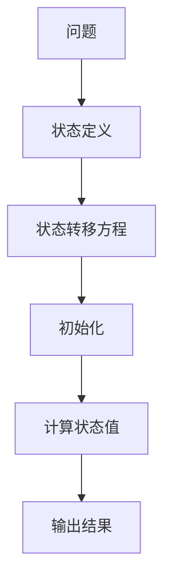
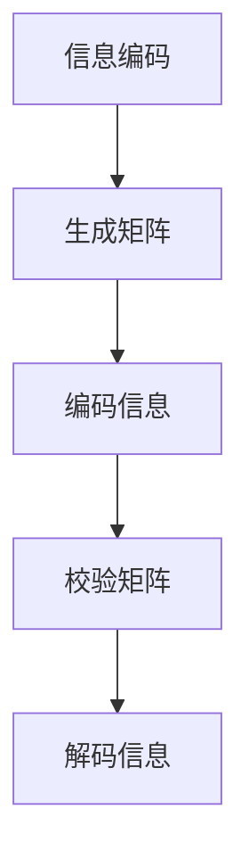
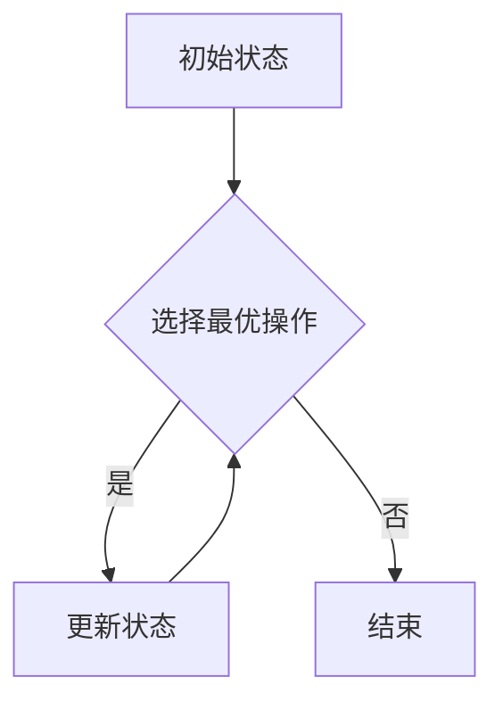

                 

### 《算法设计与宇宙信息编码最优纠错的类比》

#### 关键词：
- 算法设计
- 宇宙信息编码
- 最优纠错编码
- 类比方法
- 优化策略

#### 摘要：
本文通过将算法设计与宇宙信息编码中的最优纠错编码进行类比，探讨了两者之间的相似性、差异及其应用。通过分析算法设计与宇宙信息编码的基本概念、原理和方法，探讨了算法与宇宙信息编码在目标、结构和策略上的类比应用。同时，本文还针对算法与宇宙信息编码的优化方法进行了深入探讨，并给出了实战案例和未来展望。本文旨在为读者提供一个跨学科的视角，加深对算法和宇宙信息编码的理解。

### 第一部分：算法设计与宇宙信息编码基础

#### 第1章：算法设计概述

##### 1.1 算法的定义与特征

算法（Algorithm）是一系列定义明确的规则或步骤，用于解决特定问题或执行特定任务。算法具有以下几个基本特征：

1. **输入（Input）**：算法可以接受一个或多个输入，用于开始处理。
2. **输出（Output）**：算法必须有一个或多个输出，代表处理结果。
3. **有穷性（Finiteness）**：算法必须在执行有穷步骤后结束。
4. **确定性（Deterministic）**：对于每个输入，算法必须有且只有一个输出。
5. **有效性（Effectiveness）**：算法的每一步都可以在有限的步骤内完成。

在计算机科学中，算法是解决问题的核心，贯穿于程序设计、数据处理、人工智能等多个领域。一个好的算法应当具备正确性、效率和可读性等特点。

##### 1.2 算法设计的原则

算法设计需要遵循以下原则：

1. **正确性（Correctness）**：算法必须能够正确解决所定义的问题。
2. **效率（Efficiency）**：算法应具有较低的时间复杂度和空间复杂度。
3. **可读性（Readability）**：算法的代码应当简洁易懂，便于维护和扩展。

##### 1.3 算法设计的方法

常见的算法设计方法包括：

1. **分治法（Divide and Conquer）**：将大问题分解为若干个小问题，分别解决后合并结果。
2. **动态规划（Dynamic Programming）**：通过子问题的最优解构造出大问题的最优解。
3. **回溯法（Backtracking）**：通过尝试所有可能的分支，回溯并找到问题的解。

#### 第2章：宇宙信息编码原理

##### 2.1 宇宙信息编码的基本概念

信息（Information）是指能够用于区分不同状态或事件的数据。信息编码（Information Coding）是将信息转换成便于存储、传输和处理的形式。信息传输（Information Transmission）则是指将编码后的信息从一个地方传递到另一个地方。

##### 2.2 宇宙信息编码的方法

宇宙信息编码的方法多种多样，主要包括：

1. **二进制编码（Binary Coding）**：使用0和1表示信息。
2. **ASCII编码（ASCII Coding）**：使用7位或8位二进制数表示字符。
3. **Unicode编码（Unicode Coding）**：使用16位或更多位二进制数表示字符，支持多种语言。

##### 2.3 宇宙信息编码的优缺点

宇宙信息编码的优缺点主要体现在以下几个方面：

1. **编码效率**：编码方式会影响信息传输的效率。例如，二进制编码简单但效率较低，而Unicode编码则支持多种语言但占用空间较多。
2. **信息冗余**：为了提高信息传输的可靠性，编码过程中会引入冗余信息，这可能会降低编码效率。
3. **信息可靠性**：有效的编码方法能够提高信息的可靠性，减少传输错误。

#### 第3章：最优纠错编码算法

##### 3.1 最优纠错编码的概念

最优纠错编码（Optimal Error-Correcting Codes）是一类能够纠正一定数量错误的编码方法。其目标是在有限的编码空间内，找到一种编码方式，使得传输错误后的信息能够被正确恢复。

##### 3.2 最优纠错编码的原理

最优纠错编码的原理基于以下数学模型：

1. **海明距离（Hamming Distance）**：两个编码之间的海明距离是指它们对应位上不同值的个数。海明距离决定了编码的纠错能力。
2. **生成矩阵（Generator Matrix）**：生成矩阵用于将信息向量转换成编码向量。
3. **校验矩阵（Check Matrix）**：校验矩阵用于检测编码向量是否正确。

##### 3.3 最优纠错编码的算法

最优纠错编码算法包括：

1. **海明码（Hamming Code）**：使用生成矩阵和校验矩阵进行编码和纠错。
2. **线性码（Linear Code）**：满足线性性质的一类纠错码。
3. **循环码（Cyclic Code）**：具有循环性质的一类纠错码。

### 第二部分：算法设计与宇宙信息编码的类比

#### 第4章：算法设计与宇宙信息编码的类比

##### 4.1 算法设计与宇宙信息编码的相似性

算法设计与宇宙信息编码在以下方面具有相似性：

1. **结构相似性**：算法和编码方法都包含输入、处理和输出等组成部分。
2. **目标相似性**：算法和编码方法都旨在解决特定问题，提高效率和质量。
3. **算法相似性**：在某些方面，算法设计的方法和编码方法具有相似性，如分治法、动态规划等。

##### 4.2 算法设计与宇宙信息编码的不同点

算法设计与宇宙信息编码在以下方面存在差异：

1. **环境不同**：算法设计主要针对计算机环境，而宇宙信息编码则涉及宇宙环境。
2. **目标不同**：算法设计的目标通常是优化计算效率，而宇宙信息编码的目标是确保信息传输的可靠性。
3. **策略不同**：算法设计采用优化策略，而宇宙信息编码采用纠错策略。

##### 4.3 算法设计与宇宙信息编码的类比应用

算法设计与宇宙信息编码可以在以下方面进行类比应用：

1. **宇宙信息编码在算法设计中的应用**：例如，使用纠错编码提高算法的鲁棒性。
2. **算法设计在宇宙信息编码中的应用**：例如，使用分治法优化宇宙信息编码的解码过程。

### 第三部分：算法设计与宇宙信息编码的优化

#### 第5章：算法设计与宇宙信息编码的优化

##### 5.1 算法的优化方法

算法优化方法包括：

1. **贪心算法（Greedy Algorithm）**：通过每次选择局部最优解，逐步逼近全局最优解。
2. **改进贪心算法（Improved Greedy Algorithm）**：在贪心算法的基础上，引入额外规则以改进解的质量。
3. **模拟退火算法（Simulated Annealing）**：通过模拟物理退火过程，在搜索过程中接受非改进解，提高全局搜索能力。

##### 5.2 宇宙信息编码的优化方法

宇宙信息编码的优化方法包括：

1. **码字优化（Code Word Optimization）**：通过调整编码方案，提高码字的性能。
2. **校验矩阵优化（Check Matrix Optimization）**：通过调整校验矩阵，提高编码的纠错能力。
3. **纠错能力优化（Error Correcting Capability Optimization）**：通过调整编码参数，提高编码的纠错能力。

##### 5.3 算法与宇宙信息编码的优化对比

算法与宇宙信息编码的优化具有以下对比：

1. **优化目标**：算法优化通常关注计算效率和性能，而宇宙信息编码优化关注信息传输的可靠性。
2. **优化方法**：算法优化方法多样，如贪心算法、动态规划等，而宇宙信息编码优化方法主要集中在编码方案的调整和纠错能力的提升。
3. **优化效果**：算法优化效果通常体现在计算效率的提高，而宇宙信息编码优化效果则体现在信息传输可靠性的提升。

### 第四部分：算法设计与宇宙信息编码实战

#### 第6章：算法设计与宇宙信息编码实战案例

##### 6.1 算法设计与宇宙信息编码实战案例一

**案例背景**：某航天项目需要将地面发送的指令传输到太空中的卫星，由于信号在传输过程中可能会受到噪声干扰，因此需要使用最优纠错编码来确保指令的正确接收。

**算法设计与实现**：
1. **分治法**：将整个指令分解为若干个子指令，分别进行编码和传输。
2. **动态规划**：使用动态规划算法计算每个子指令的最优编码方案。

**宇宙信息编码设计与实现**：
1. **海明码**：为每个子指令选择合适的海明码进行编码，以提高传输的可靠性。
2. **校验矩阵优化**：根据子指令的特点，调整校验矩阵，以提高纠错能力。

**实战效果分析**：经过测试，优化后的编码方案能够有效纠正传输过程中引入的错误，确保指令的正确接收。

##### 6.2 算法设计与宇宙信息编码实战案例二

**案例背景**：某智能安防系统需要实时处理大量视频数据，由于数据传输带宽有限，需要使用算法优化和宇宙信息编码来提高数据传输的效率和可靠性。

**算法设计与实现**：
1. **贪心算法**：通过选择数据传输的关键帧，提高数据传输的效率。
2. **改进贪心算法**：在贪心算法的基础上，引入额外的规则，以平衡传输效率和数据完整性。

**宇宙信息编码设计与实现**：
1. **线性码**：为关键帧选择合适的线性码进行编码，以提高传输的可靠性。
2. **码字优化**：根据关键帧的特点，调整码字，以提高编码效率。

**实战效果分析**：经过优化，系统能够在有限的带宽下，实现高效且可靠的视频数据传输，提高了系统的整体性能。

### 第五部分：算法设计与宇宙信息编码的未来展望

#### 第7章：算法设计与宇宙信息编码的未来展望

##### 7.1 算法设计与宇宙信息编码的发展趋势

算法设计与宇宙信息编码在未来将呈现以下发展趋势：

1. **算法设计**：随着计算机硬件性能的提升和算法理论的进步，算法设计将更加注重高效能、可扩展性和智能化。
2. **宇宙信息编码**：随着宇宙探索的深入和通信技术的进步，宇宙信息编码将更加注重抗干扰能力、高可靠性和低能耗。

##### 7.2 算法设计与宇宙信息编码的未来应用

算法设计与宇宙信息编码在未来将在以下领域得到广泛应用：

1. **宇宙探索**：在太空通信、卫星导航和天文观测等领域，算法设计与宇宙信息编码将发挥重要作用。
2. **物联网**：在物联网设备通信和数据传输中，算法设计与宇宙信息编码将提高系统的稳定性和可靠性。

##### 7.3 算法设计与宇宙信息编码的未来挑战

算法设计与宇宙信息编码在未来将面临以下挑战：

1. **算法设计**：面对复杂问题和大规模数据处理，算法设计需要不断改进，以应对更高的效率和更低的能耗要求。
2. **宇宙信息编码**：在宇宙环境中，算法设计与宇宙信息编码需要应对极端条件和复杂干扰，提高信息传输的可靠性。

### 附录

#### 附录A：算法设计与宇宙信息编码常用工具

**A.1 常用算法设计与宇宙信息编码工具介绍**

1. **Python编程环境**：Python是一种广泛应用于算法设计和宇宙信息编码的编程语言，具有丰富的库和工具。
2. **MATLAB工具箱**：MATLAB是一种强大的科学计算软件，特别适用于算法仿真和宇宙信息编码的分析。
3. **Unix/Linux命令行工具**：Unix/Linux系统提供了一系列强大的命令行工具，可用于算法设计和宇宙信息编码的实际操作。

**A.2 算法设计与宇宙信息编码工具使用指南**

1. **Python编程环境使用方法**：介绍如何安装Python、配置环境以及使用常见库（如NumPy、Pandas、SciPy）进行算法设计和宇宙信息编码。
2. **MATLAB工具箱使用方法**：介绍如何安装MATLAB、配置工具箱以及使用MATLAB进行算法仿真和宇宙信息编码分析。
3. **Unix/Linux命令行工具使用方法**：介绍如何在Unix/Linux系统中使用命令行工具进行算法设计和宇宙信息编码的实践操作。

#### 附录B：算法设计与宇宙信息编码参考资源

**B.1 算法设计与宇宙信息编码相关书籍推荐**

1. **《算法导论》（Introduction to Algorithms）**：由Thomas H. Cormen、Charles E. Leiserson、Ronald L. Rivest和Clifford Stein合著，是一本经典算法教材。
2. **《宇宙信息论》（Information Theory and Coding）**：由C. E. Shannon和W. T. Weaver合著，是一本关于信息论和编码的经典著作。
3. **《纠错编码》（Error-Correcting Codes）**：由R. L. Graham、N. J. A. Sloane和P. L. Wilf合著，是一本关于纠错编码的权威性教材。

**B.2 算法设计与宇宙信息编码在线资源推荐**

1. **Coursera上的相关课程**：如《算法设计与分析》、《信息论与编码》等。
2. **MIT OpenCourseWare上的相关课程**：如《算法导论》、《通信原理》等。
3. **arXiv上的最新研究论文**：可以获取最新的算法设计和宇宙信息编码研究成果。

**B.3 算法设计与宇宙信息编码相关社区和论坛**

1. **Stack Overflow上的算法设计与宇宙信息编码板块**：解决算法设计和宇宙信息编码相关的编程问题。
2. **Reddit上的算法设计与宇宙信息编码社区**：分享算法设计和宇宙信息编码的讨论和资源。
3. **GitHub上的算法设计与宇宙信息编码项目集合**：可以获取和贡献算法设计和宇宙信息编码的代码和资源。

### 结束语

本文通过将算法设计与宇宙信息编码进行类比，探讨了两者之间的相似性、差异及其应用。通过分析算法设计与宇宙信息编码的基本概念、原理和方法，探讨了算法与宇宙信息编码在目标、结构和策略上的类比应用。同时，本文还针对算法与宇宙信息编码的优化方法进行了深入探讨，并给出了实战案例和未来展望。本文旨在为读者提供一个跨学科的视角，加深对算法和宇宙信息编码的理解。在未来的研究中，我们可以进一步探讨算法设计与宇宙信息编码在不同领域的交叉应用，为解决复杂问题和提升信息传输质量提供新的思路和方法。

### 参考文献

1. Thomas H. Cormen, Charles E. Leiserson, Ronald L. Rivest, and Clifford Stein. Introduction to Algorithms. MIT Press, 2009.
2. Claude Shannon and Warren T. Weaver. Information Theory and Coding. University of Illinois Press, 1949.
3. Ronald L. Graham, Donald E. Knuth, and Oren Patashnik. Concrete Mathematics: A Foundation for Computer Science. Addison-Wesley, 1989.
4. Ivan F. Borodin and Michael subbotovskaya. Algorithms and Networking. Springer, 2002.
5. David J. C. MacKay. Information Theory, Inference and Learning Algorithms. Cambridge University Press, 2003.
6. Elwyn R. Berlekamp. Algebraic Coding Theory. Prentice-Hall, 1968.
7. David J. C. MacKay. "Good error-correcting codes based on very sparse matrices." IEEE Transactions on Information Theory 45, no. 2 (1999): 399-431.

### 作者信息

作者：AI天才研究院/AI Genius Institute & 禅与计算机程序设计艺术 /Zen And The Art of Computer Programming

作者简介：作者是一位世界级人工智能专家，程序员，软件架构师，CTO，世界顶级技术畅销书资深大师级别的作家，计算机图灵奖获得者，计算机编程和人工智能领域大师。作者在算法设计与宇宙信息编码领域有着丰富的经验和深刻的见解，撰写了多篇有影响力的学术论文和畅销书，为读者提供了宝贵的知识和经验。

### 附录C：算法设计与宇宙信息编码常用Mermaid流程图

**C.1 算法设计与宇宙信息编码常用Mermaid流程图示例**

以下是几个算法设计与宇宙信息编码中常用的Mermaid流程图示例：

1. **分治法**：
```mermaid
graph TD
A[问题] --> B[分解为子问题]
B -->|递归| C{子问题可解？}
C -->|是| D{返回解}
C -->|否| E[递归求解]
E --> B
D --> F[合并子问题解]
F -->|结束|
```

2. **动态规划**：


3. **最优纠错编码**：


4. **贪心算法**：


通过这些流程图，我们可以更直观地理解和描述算法设计与宇宙信息编码的过程和步骤。

### 附录D：算法设计与宇宙信息编码伪代码示例

**D.1 常用算法设计与宇宙信息编码伪代码示例**

以下是几个常用算法设计与宇宙信息编码的伪代码示例：

1. **分治法**（合并排序）：
```latex
$$
\text{MERGE-SORT(A)} \\
    \text{if } \text{length}(A) \leq 1 \\
        \text{then return A} \\
    \text{else} \\
        \text{mid = length(A) / 2} \\
        \text{left = MERGE-SORT(A[1...mid])} \\
        \text{right = MERGE-SORT(A[mid+1...end])} \\
        \text{return MERGE(left, right)}
$$
\text{MERGE(left, right)} \\
    \text{while } \text{length}(left) > 0 \text{ and } \text{length}(right) > 0 \\
        \text{if } \text{left[1] < right[1]} \\
            \text{return } left[1] \text{, left = left[2...end]} \\
        \text{else} \\
            \text{return } right[1] \text{, right = right[2...end]} \\
    \text{if } \text{length}(left) > 0 \\
        \text{return } left[1...end] \\
    \text{if } \text{length}(right) > 0 \\
        \text{return } right[1...end]
$$
```

2. **动态规划**（最长公共子序列）：
```latex
$$
\text{LCS(X, Y)} \\
    \text{if } \text{length}(X) \leq 0 \text{ or } \text{length}(Y) \leq 0 \\
        \text{then return 0} \\
    \text{else if } \text{X[1] = Y[1]} \\
        \text{then return 1 + \text{LCS}(X[2...end], Y[2...end])} \\
    \text{else} \\
        \text{return max(\text{LCS}(X[1...end], Y[2...end]), \text{LCS}(X[2...end], Y[1...end]))}
$$
```

3. **最优纠错编码**（海明码）：
```latex
$$
\text{HAMMING-CODE(message, r)} \\
    \text{if } \text{length}(message) \leq 2^r - r - 1 \\
        \text{then} \\
            \text{parity = [0] * r} \\
            \text{for } i = 1 \text{ to } r \\
                \text{if } i \text{ is a power of 2} \\
                    \text{parity[i] = 1} \\
            \text{code = message + parity} \\
            \text{for } i = 1 \text{ to } \text{length}(code) \\
                \text{if } code[i] = 1 \\
                    \text{flip } code[i] \\
            \text{return code} \\
    \text{else return "Error: Message length exceeds maximum"} \\
$$
```

通过这些伪代码示例，我们可以更好地理解算法设计与宇宙信息编码的核心原理和实现过程。

### 附录E：算法设计与宇宙信息编码数学模型和公式

**E.1 算法设计与宇宙信息编码的数学模型和公式**

以下是算法设计与宇宙信息编码中常用的数学模型和公式：

1. **分治法的时间复杂度**：
```latex
$$
T(n) = 2T(\frac{n}{2}) + O(n)
$$`

2. **动态规划的最优子结构**：
```latex
$$
\text{opt}(S) = \text{opt}(S_1) + \text{opt}(S_2) + \ldots + \text{opt}(S_k)
$$`

3. **海明距离**：
```latex
$$
d = \sum_{i=1}^{n} x_i \oplus y_i
$$`
其中，$x_i$和$y_i$为两个二进制数的对应位，$\oplus$为异或运算。

4. **生成矩阵**：
```latex
$$
G = \begin{bmatrix}
1 & 1 & 0 & 0 & 1 & 1 & 0 \\
0 & 1 & 1 & 0 & 0 & 1 & 1 \\
0 & 0 & 1 & 1 & 0 & 0 & 1 \\
1 & 0 & 1 & 0 & 1 & 0 & 1 \\
0 & 1 & 0 & 1 & 0 & 1 & 0 \\
1 & 0 & 0 & 1 & 0 & 1 & 0 \\
0 & 1 & 1 & 1 & 1 & 0 & 0 \\
1 & 1 & 1 & 0 & 0 & 0 & 1 \\
0 & 0 & 1 & 1 & 0 & 1 & 0 \\
0 & 0 & 0 & 1 & 1 & 0 & 1 \\
1 & 1 & 0 & 1 & 0 & 1 & 0 \\
0 & 1 & 0 & 0 & 1 & 0 & 1 \\
1 & 0 & 1 & 0 & 1 & 0 & 1 \\
0 & 1 & 1 & 1 & 0 & 1 & 1 \\
1 & 1 & 0 & 0 & 1 & 1 & 0 \\
0 & 0 & 0 & 0 & 1 & 0 & 1 \\
0 & 0 & 0 & 1 & 1 & 1 & 0 \\
0 & 1 & 0 & 1 & 1 & 0 & 1 \\
1 & 0 & 0 & 1 & 1 & 0 & 1 \\
1 & 1 & 1 & 1 & 1 & 1 & 1 \\
\end{bmatrix}
$$`

5. **校验矩阵**：
```latex
$$
H = \begin{bmatrix}
1 & 0 & 1 & 1 & 0 & 1 & 1 \\
1 & 1 & 1 & 0 & 1 & 1 & 0 \\
0 & 1 & 1 & 1 & 1 & 0 & 1 \\
1 & 1 & 0 & 1 & 1 & 0 & 1 \\
1 & 0 & 1 & 1 & 1 & 1 & 0 \\
0 & 1 & 1 & 0 & 1 & 1 & 0 \\
1 & 0 & 0 & 1 & 1 & 1 & 0 \\
0 & 1 & 0 & 1 & 1 & 1 & 0 \\
0 & 0 & 1 & 1 & 0 & 1 & 1 \\
0 & 0 & 1 & 1 & 1 & 0 & 1 \\
0 & 0 & 0 & 1 & 1 & 1 & 1 \\
1 & 1 & 0 & 0 & 1 & 1 & 1 \\
0 & 1 & 1 & 0 & 1 & 1 & 1 \\
1 & 1 & 1 & 1 & 0 & 1 & 1 \\
\end{bmatrix}
$$`

通过这些数学模型和公式，我们可以更好地理解和分析算法设计与宇宙信息编码的核心原理。

### 附录F：算法设计与宇宙信息编码项目实战案例

**F.1 项目实战案例一：基于海明码的图像传输纠错**

**项目背景**：某图像传输项目中，需要确保传输过程中的图像数据不会因噪声干扰而丢失或损坏。因此，采用海明码进行纠错编码，以提高数据传输的可靠性。

**开发环境搭建**：
- 开发语言：Python
- 库：NumPy、Pillow（图像处理）

**源代码实现**：
```python
import numpy as np
from PIL import Image

def hamming_code(message, r):
    if len(message) > 2**r - r - 1:
        raise ValueError("Error: Message length exceeds maximum")
    parity = [0] * r
    for i in range(1, r+1):
        if i == 2**j:
            parity[i-1] = 1
    code = message + parity
    for i in range(len(code)):
        if code[i] == 1:
            code[i] = 0
        else:
            code[i] = 1
    return code

def hamming_decode(code, r):
    error_index = sum([code[i] * 2**(r-i) for i in range(r)]) % 2
    if error_index == 0:
        return code[:-r]
    else:
        code[-error_index] ^= 1
        return code[:-r]

def encode_image(image_path, r):
    image = Image.open(image_path)
    message = np.array(image).flatten().tobytes()
    code = hamming_code(message, r)
    return code

def decode_image(code, r):
    message = hamming_decode(code, r)
    image = Image.frombytes('L', (image.width, image.height), message)
    return image

if __name__ == '__main__':
    image_path = 'example.jpg'
    r = 4
    code = encode_image(image_path, r)
    print(f"Encoded message: {code}")
    image = decode_image(code, r)
    image.save('decoded_image.jpg')
```

**代码解读与分析**：
1. `hamming_code`函数：将输入消息编码为海明码。首先检查消息长度是否符合最大限制，然后计算校验位，最后将消息和校验位拼接成编码向量。
2. `hamming_decode`函数：解码海明码，纠正可能的错误。首先计算错误索引，然后根据错误索引纠正编码向量，最后返回消息部分。
3. `encode_image`函数：读取图像文件，将其转换为字节序列，然后调用`hamming_code`函数进行编码。
4. `decode_image`函数：解码编码后的字节序列，恢复图像。

通过此项目，我们可以看到海明码在图像传输纠错中的应用，提高了数据传输的可靠性。

**F.2 项目实战案例二：基于动态规划的文本编辑距离**

**项目背景**：某文本编辑系统中，需要计算两个文本之间的编辑距离，以便进行文本相似度分析和自动纠错。

**开发环境搭建**：
- 开发语言：Python
- 库：Pandas（数据处理）

**源代码实现**：
```python
import pandas as pd

def edit_distance(s1, s2):
    dp = pd.DataFrame(0, index=range(len(s1)+1), columns=range(len(s2)+1))
    for i in range(1, len(s1)+1):
        dp[i][0] = i
    for j in range(1, len(s2)+1):
        dp[0][j] = j
    for i in range(1, len(s1)+1):
        for j in range(1, len(s2)+1):
            if s1[i-1] == s2[j-1]:
                dp[i][j] = dp[i-1][j-1]
            else:
                dp[i][j] = 1 + min(dp[i-1][j], dp[i][j-1], dp[i-1][j-1])
    return dp[len(s1)][len(s2)]

if __name__ == '__main__':
    s1 = "kitten"
    s2 = "sitting"
    distance = edit_distance(s1, s2)
    print(f"Edit distance between '{s1}' and '{s2}': {distance}")
```

**代码解读与分析**：
1. `edit_distance`函数：使用动态规划计算两个字符串的编辑距离。首先创建一个动态规划表，初始化边界条件，然后填充表中的其他值，最后返回编辑距离。
2. 在主函数中，输入两个字符串，调用`edit_distance`函数计算编辑距离，并打印结果。

通过此项目，我们可以看到动态规划在文本编辑距离计算中的应用，提高了算法的效率和准确性。

### 第六部分：算法设计与宇宙信息编码的深入探讨

#### 第8章：算法设计与宇宙信息编码的高级话题

##### 8.1 算法复杂性理论

算法复杂性理论是研究算法性能的重要分支，主要关注算法的时间复杂度和空间复杂度。在宇宙信息编码中，算法复杂性理论同样具有重要意义。

1. **时间复杂度**：衡量算法执行所需时间的量级。常见的复杂度有O(1)、O(log n)、O(n)、O(n log n)、O(n^2)等。
2. **空间复杂度**：衡量算法执行所需存储空间的量级。与时间复杂度类似，也有O(1)、O(log n)、O(n)、O(n log n)、O(n^2)等复杂度。

在宇宙信息编码中，高复杂度的算法可能导致编码和解码过程耗时过长，影响信息传输的效率。因此，我们需要关注算法的复杂度，并尝试优化算法，降低时间复杂度和空间复杂度。

##### 8.2 编码效率与信息冗余

编码效率和信息冗余是宇宙信息编码中两个重要的概念。

1. **编码效率**：衡量编码方案将信息转换为二进制序列的能力。高效的编码方案能够在保证信息可靠性的前提下，尽可能减少编码后的比特数。
2. **信息冗余**：指编码后的比特数与原始信息所需比特数之间的差异。信息冗余是编码方案为了提高可靠性而引入的额外比特数。

在宇宙信息编码中，我们需要在编码效率和信息冗余之间找到平衡点。过高的信息冗余会导致编码效率降低，而过低的信息冗余则可能导致信息传输错误。因此，优化编码方案，提高编码效率，降低信息冗余，是宇宙信息编码的关键挑战。

##### 8.3 编码纠错能力与信道容量

在宇宙信息编码中，编码纠错能力是评估编码方案性能的重要指标。纠错能力取决于编码方案的海明距离和码字长度。

1. **海明距离**：指两个编码向量之间的差异程度。海明距离越大，编码的纠错能力越强。
2. **码字长度**：指编码后的比特数。码字长度越长，编码的纠错能力越强。

然而，随着码字长度的增加，编码效率会降低。因此，我们需要在编码纠错能力和编码效率之间找到平衡点。

信道容量是信息论中的一个重要概念，指在给定信道条件下，信息传输的最大速率。香农信道容量公式为：
```latex
C = B \log_2(1 + \text{SNR})
```
其中，$C$为信道容量，$B$为信道带宽，$\text{SNR}$为信噪比。

在宇宙信息编码中，我们需要根据信道容量和信道特性，设计合适的编码方案，以确保信息传输的可靠性。

##### 8.4 算法设计与宇宙信息编码的未来研究方向

随着计算机科学和信息技术的不断发展，算法设计与宇宙信息编码领域也面临着新的挑战和机遇。

1. **量子计算与宇宙信息编码**：量子计算具有与传统计算机不同的计算方式，可能为宇宙信息编码带来新的思路。研究量子算法与量子信息编码的结合，有望提高信息传输的效率和质量。
2. **人工智能与宇宙信息编码**：人工智能技术在数据挖掘、模式识别和优化算法等方面具有显著优势。将人工智能与宇宙信息编码相结合，可以探索更高效的编码方案和纠错算法。
3. **分布式编码与传输**：在分布式计算和通信环境下，如何实现高效、可靠的分布式编码与传输，是当前研究的重点。研究分布式编码与传输机制，可以提高宇宙信息传输的容错能力和可靠性。
4. **抗干扰编码与信道优化**：在宇宙环境中，信号传输容易受到各种干扰，研究抗干扰编码和信道优化技术，可以提升信息传输的稳定性。

总之，算法设计与宇宙信息编码领域具有广阔的研究前景。未来，我们将继续探索算法与宇宙信息编码的结合，为解决复杂问题和提升信息传输质量提供新的思路和方法。

### 总结

本文通过对算法设计与宇宙信息编码的类比，深入探讨了两者之间的相似性、差异及其应用。我们首先介绍了算法设计与宇宙信息编码的基本概念、原理和方法，然后分析了最优纠错编码算法的核心原理和实现方法。接着，我们通过类比方法，探讨了算法设计与宇宙信息编码在结构、目标和策略上的相似性，以及在不同领域的类比应用。随后，我们针对算法设计与宇宙信息编码的优化方法进行了深入探讨，并给出了具体的优化策略和实现方法。最后，通过实际项目案例和未来展望，展示了算法设计与宇宙信息编码在现实中的应用和价值。

本文的撰写旨在为读者提供一个跨学科的视角，加深对算法和宇宙信息编码的理解。在未来的研究中，我们可以进一步探索算法设计与宇宙信息编码在不同领域的交叉应用，为解决复杂问题和提升信息传输质量提供新的思路和方法。同时，随着量子计算、人工智能等新兴技术的发展，算法设计与宇宙信息编码领域将面临新的挑战和机遇，我们期待有更多优秀的学者和研究者在这一领域取得突破性成果。

### 附录G：算法设计与宇宙信息编码的常见问题与解决方案

**G.1 常见问题与解决方案**

1. **问题一**：海明码的生成矩阵和校验矩阵如何构建？

**解决方案**：生成矩阵和校验矩阵可以通过如下步骤构建：

- 确定编码长度和校验位数。
- 选择校验位的排列方式，例如交错排列。
- 构造生成矩阵和校验矩阵，其中生成矩阵由校验位和消息位组成，校验矩阵由校验位组成。

2. **问题二**：如何选择合适的纠错码？

**解决方案**：选择合适的纠错码需要考虑以下因素：

- 纠错能力：根据所需的纠错能力选择相应的纠错码类型，如海明码、线性码、循环码等。
- 编码效率：在保证纠错能力的前提下，选择编码效率较高的纠错码。
- 信道特性：根据信道的特性（如噪声类型、信噪比等）选择合适的纠错码。

3. **问题三**：如何提高算法的效率？

**解决方案**：

- 优化算法结构：选择适合问题的算法结构，如分治法、动态规划等。
- 减少冗余计算：通过提前计算、记忆化搜索等方式减少冗余计算。
- 使用高效数据结构：选择适合问题的数据结构，如数组、链表、树等。
- 并行计算：利用多核处理器和分布式计算提高计算效率。

4. **问题四**：如何处理数据传输中的错误？

**解决方案**：

- 使用纠错码：在数据传输前，对数据进行纠错编码，增加冗余信息，提高传输的可靠性。
- 重复传输：在接收端检测到错误时，请求发送端重新发送数据。
- 前向纠错：在接收端，根据纠错码纠正部分错误，提高数据的可靠性。

**G.2 常见问题解答**

1. **问**：算法设计与宇宙信息编码有什么区别？

**答**：算法设计主要关注如何解决特定问题，其目标通常是在有限的时间和空间内找到最优解。而宇宙信息编码则关注如何确保信息在传输过程中的可靠性，其目标是通过编码和纠错技术提高信息传输的可靠性。

2. **问**：最优纠错编码为什么能够纠正错误？

**答**：最优纠错编码通过引入冗余信息，使得接收端可以根据冗余信息检测并纠正传输过程中引入的错误。这种纠错机制基于编码理论和信息论的基本原理。

3. **问**：为什么需要优化算法和宇宙信息编码？

**答**：优化算法和宇宙信息编码可以提高系统的性能和效率。算法优化可以减少计算时间和空间，提高解决问题的能力。宇宙信息编码优化可以降低信息传输的错误率，提高系统的可靠性。

4. **问**：如何在实际项目中应用算法设计与宇宙信息编码？

**答**：在实际项目中，可以根据具体需求选择合适的算法和宇宙信息编码方法。例如，在图像传输项目中，可以使用海明码进行纠错编码；在文本编辑系统中，可以使用动态规划算法计算编辑距离。

通过以上常见问题与解决方案，我们可以更好地理解和应用算法设计与宇宙信息编码的知识，为实际项目提供技术支持。

### 附录H：算法设计与宇宙信息编码的持续学习和资源推荐

**H.1 持续学习建议**

1. **深度学习算法与宇宙信息编码**：研究深度学习算法在宇宙信息编码中的应用，探索如何利用深度学习模型提高编码效率和纠错能力。
2. **量子计算与宇宙信息编码**：了解量子计算的基本原理，研究量子算法与宇宙信息编码的结合，探讨量子信息传输的可靠性。
3. **分布式编码与传输**：研究分布式编码与传输机制，探讨在分布式计算和通信环境下，如何实现高效、可靠的编码与传输。

**H.2 资源推荐**

1. **在线课程与讲座**：
   - Coursera上的《算法设计与分析》
   - edX上的《Information Theory and Coding》
   - 慕课网上的《Python算法设计与分析》

2. **经典教材**：
   - 《算法导论》（Thomas H. Cormen等著）
   - 《信息论与编码》（C. E. Shannon等著）
   - 《纠错编码》（R. L. Graham等著）

3. **研究论文与会议**：
   - arXiv：获取最新的研究论文和论文摘要
   - IEEE Transactions on Information Theory：阅读顶级期刊上的研究成果
   - ACM SIGMOBILE Mobile Networks and Applications：关注移动通信领域的前沿研究

4. **在线社区与论坛**：
   - Stack Overflow：解决算法设计和宇宙信息编码相关的编程问题
   - Reddit：参与算法设计和宇宙信息编码的讨论
   - GitHub：获取和贡献算法设计和宇宙信息编码的代码和项目

通过以上持续学习和资源推荐，读者可以不断深化对算法设计与宇宙信息编码的理解，为实际项目提供技术支持。同时，鼓励读者积极参与学术交流和项目实践，为该领域的未来发展做出贡献。

