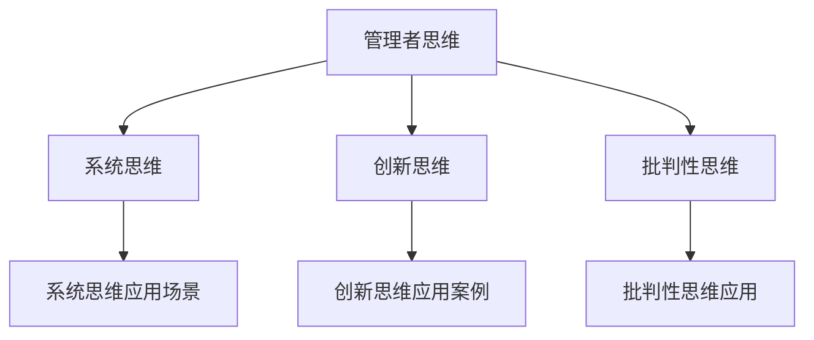

                 

### 管理者必备的三大体系：思维、行动、学习

#### 关键词：
- 管理者
- 思维体系
- 行动体系
- 学习体系
- 系统思维
- 创新思维
- 批判性思维
- 行动管理
- 时间管理
- 团队协作
- 终身学习

#### 摘要：
本文将探讨管理者必备的三大体系：思维、行动、学习。通过对系统思维、创新思维、批判性思维的分析，阐述管理者如何培养和运用这些思维方式。同时，本文将详细讲解行动管理、时间管理和团队协作的实践方法，并探讨终身学习的理念及其实现路径。通过本文的阅读，读者将能够全面了解管理者在思维、行动和学习方面的提升策略，为个人和团队的发展提供有力支持。

### 目录大纲

- **第一部分：思维体系**
  - **第1章：管理者思维概述**
    - 1.1 管理者思维的重要性
    - 1.2 管理者思维的类型
    - 1.3 如何培养良好的管理者思维
  - **第2章：系统思维**
    - 2.1 系统思维的基本概念
    - 2.2 系统思维的应用场景
    - 2.3 系统思维的方法与工具
  - **第3章：创新思维**
    - 3.1 创新思维的重要性
    - 3.2 创新思维的培养
    - 3.3 创新思维的应用案例
  - **第4章：批判性思维**
    - 4.1 批判性思维的定义
    - 4.2 批判性思维的应用
    - 4.3 如何培养批判性思维

- **第二部分：行动体系**
  - **第5章：行动管理**
    - 5.1 行动管理的定义
    - 5.2 行动管理的方法
    - 5.3 行动管理的工具
  - **第6章：时间管理**
    - 6.1 时间管理的概念
    - 6.2 时间管理的方法
    - 6.3 时间管理的技巧
  - **第7章：团队协作**
    - 7.1 团队协作的重要性
    - 7.2 团队协作的技巧
    - 7.3 团队协作的工具

- **第三部分：学习体系**
  - **第8章：管理者学习策略**
    - 8.1 学习策略的概念
    - 8.2 学习策略的分类
    - 8.3 如何制定有效的学习策略
  - **第9章：终身学习**
    - 9.1 终身学习的概念
    - 9.2 终身学习的优势
    - 9.3 如何实现终身学习
  - **第10章：学习与行动的融合**
    - 10.1 学习与行动的关系
    - 10.2 如何将学习转化为行动
    - 10.3 行动后如何进行学习反思

- **核心概念与联系**
  - **Mermaid 流�程图**
  - **核心算法原理讲解**
  - **数学模型和数学公式**
  - **详细讲解与举例说明**
  - **项目实战**
    - **开发环境搭建**
    - **源代码实现**
    - **代码解读与分析**

---

**作者：AI天才研究院/AI Genius Institute & 禅与计算机程序设计艺术 /Zen And The Art of Computer Programming**

---

在接下来的文章中，我们将逐步深入探讨管理者必备的三大体系：思维、行动、学习。首先，我们将从思维体系开始，详细解析系统思维、创新思维和批判性思维的重要性以及如何培养这些思维方式。随后，我们将转向行动体系，探讨行动管理、时间管理和团队协作的实践方法。最后，我们将探讨学习体系，包括管理者学习策略、终身学习的理念和如何将学习与行动有效融合。希望通过本文，读者能够全面了解并掌握这些关键技能，为自己的管理和领导能力提升奠定坚实基础。

---

## 第一部分：思维体系

在现代社会，管理者的角色不再仅仅局限于执行指令和监督团队，而是需要具备高度的综合素质和战略眼光。思维体系作为管理者综合素质的核心部分，决定了管理者能否有效地理解和应对复杂多变的环境。本部分将重点探讨系统思维、创新思维和批判性思维三个关键方面，阐述其重要性以及如何培养这些思维方式。

### 第1章：管理者思维概述

#### 1.1 管理者思维的重要性

管理者思维是指管理者在决策、执行和沟通过程中所运用的思维方式。它不仅包括逻辑推理和分析能力，还涵盖了战略思维、创新思维和批判性思维等多个层面。管理者思维的重要性体现在以下几个方面：

1. **决策能力**：管理者思维能够帮助管理者在面对复杂问题时，快速准确地做出决策。这不仅需要逻辑推理和分析能力，还需要战略思维和远见卓识。
2. **问题解决能力**：管理者思维强调系统思维和批判性思维，能够帮助管理者全面分析问题、挖掘根本原因，并提出有效的解决方案。
3. **沟通能力**：管理者需要具备良好的沟通能力，以传达决策、指导团队和协调内外部资源。管理者思维能够帮助管理者更好地理解他人观点，提高沟通效率。
4. **创新能力**：创新思维是管理者思维的重要组成部分，它能够激发管理者的创造力，推动组织不断创新和发展。

#### 1.2 管理者思维的类型

管理者思维可以分为以下几种类型：

1. **系统思维**：系统思维是一种整体观念，强调从整体和系统的角度看待问题。它能够帮助管理者理解问题的复杂性和多样性，从而做出更全面的决策。
2. **创新思维**：创新思维是一种创造性思维，强调突破传统思维模式，寻找新的解决方案。它能够帮助管理者应对复杂多变的环境，推动组织创新发展。
3. **批判性思维**：批判性思维是一种理性思维，强调质疑和批判，寻求真理。它能够帮助管理者识别和纠正错误，提高决策的科学性和准确性。

#### 1.3 如何培养良好的管理者思维

培养良好的管理者思维是一个长期的过程，需要管理者不断学习、实践和反思。以下是一些培养管理者思维的策略：

1. **持续学习**：管理者应具备持续学习的能力，通过阅读书籍、参加培训和学习最新趋势，不断更新知识和思维方式。
2. **实践应用**：理论知识需要通过实践来验证和应用。管理者应积极参与实际工作，将所学知识应用于问题解决和决策过程中。
3. **反思总结**：反思是提升管理者思维的重要途径。管理者应在每次决策和行动后进行反思，总结经验教训，不断优化思维方式。
4. **跨领域学习**：跨领域学习能够拓宽管理者的视野，帮助管理者从不同角度看待问题，提高思维的灵活性和创新能力。

通过上述策略，管理者可以逐步培养出系统思维、创新思维和批判性思维，从而提升自身的综合素质和领导能力。

### 第2章：系统思维

系统思维是一种整体观念，强调从整体和系统的角度看待问题。它能够帮助管理者理解问题的复杂性和多样性，从而做出更全面的决策。在本节中，我们将详细探讨系统思维的基本概念、应用场景以及方法和工具。

#### 2.1 系统思维的基本概念

系统思维是一种将事物视为相互关联、相互影响的整体的方法。它强调以下原则：

1. **整体性**：系统思维将事物视为一个整体，关注各部分之间的相互关系和整体功能。它不仅仅是关注单个部分，而是从整体角度来理解和解决问题。
2. **反馈循环**：系统思维强调反馈循环的重要性，即系统内部的反馈机制会影响到系统的行为和性能。理解反馈循环有助于管理者识别问题、调整策略和优化系统。
3. **层次结构**：系统思维认为事物之间存在层次结构，即从宏观到微观、从整体到部分进行分析。这种方法有助于管理者把握问题的全局和局部，从而做出更准确的决策。

#### 2.2 系统思维的应用场景

系统思维在管理领域有广泛的应用，以下是一些常见的应用场景：

1. **战略规划**：系统思维能够帮助管理者从整体和长期的角度进行战略规划，考虑企业内部和外部环境的变化，以及各部分之间的相互作用。
2. **项目管理**：在项目管理中，系统思维有助于管理者理解项目的复杂性和多样性，制定详细的计划，并识别和解决潜在的问题。
3. **团队协作**：系统思维能够帮助管理者理解团队内部的合作关系和沟通机制，优化团队结构和流程，提高团队协作效率。
4. **风险控制**：系统思维能够帮助管理者识别和评估潜在的风险，理解风险之间的相互作用，制定有效的风险管理策略。

#### 2.3 系统思维的方法与工具

系统思维需要一定的方法和工具来支撑，以下是一些常用的方法和工具：

1. **系统图**：系统图是一种图形化工具，用于描述系统的组成部分和它们之间的相互作用。通过绘制系统图，管理者可以更直观地理解系统的结构和功能。
2. **流程图**：流程图用于描述系统中的流程和步骤，帮助管理者识别流程中的瓶颈和优化点。
3. **鱼骨图**：鱼骨图（或因果图）用于分析问题的根本原因，帮助管理者识别问题的多种原因和相互关系。
4. **SWOT分析**：SWOT分析是一种战略规划工具，用于分析企业的优势、劣势、机会和威胁，帮助管理者制定战略规划。
5. **六顶思考帽**：六顶思考帽是一种思维工具，用于激发不同的思维方式，包括逻辑思维、情感思维、创新思维等，帮助管理者更全面地思考问题。

通过运用这些方法和工具，管理者可以更系统地分析和解决问题，提高决策的科学性和准确性。

### 第3章：创新思维

创新思维是一种创造性思维，强调突破传统思维模式，寻找新的解决方案。在竞争激烈和变化快速的现代商业环境中，创新思维对于企业的生存和发展至关重要。在本节中，我们将探讨创新思维的重要性、培养方法以及应用案例。

#### 3.1 创新思维的重要性

创新思维在管理中的重要性体现在以下几个方面：

1. **竞争优势**：创新思维能够帮助企业找到独特的解决方案，形成竞争优势，从而在市场中脱颖而出。
2. **持续发展**：创新思维能够推动企业不断改进和优化产品、服务和流程，实现持续发展。
3. **应对变化**：在快速变化的环境中，创新思维能够帮助企业及时应对市场变化和挑战，保持竞争力。
4. **提高效率**：创新思维能够帮助企业发现新的效率和成本优化方法，提高运营效率。

#### 3.2 创新思维的培养

培养创新思维需要一定的方法和实践，以下是一些有效的策略：

1. **多样化学习**：通过学习不同的知识领域和技能，管理者可以拓宽视野，激发创新思维。
2. **思维训练**：通过思维训练，如头脑风暴、思维导图、快速写作等，管理者可以培养思维的灵活性和创造性。
3. **跨领域合作**：跨领域合作能够激发创新思维，通过不同领域的知识和经验的碰撞，产生新的创意。
4. **实践探索**：管理者应积极参与实际项目和工作，通过实践探索新的方法和思路，培养创新思维。
5. **保持好奇心**：好奇心是创新思维的源泉，管理者应保持对新事物和新思想的兴趣和探索精神。

#### 3.3 创新思维的应用案例

以下是一些创新思维在企业管理中的应用案例：

1. **产品创新**：一家传统的家居公司通过引入智能家具和智能家居系统，实现了产品线的升级和转型，赢得了大量年轻消费者的青睐。
2. **流程创新**：一家制造企业通过引入自动化生产线和数字化管理，大幅提高了生产效率和产品质量，降低了运营成本。
3. **商业模式创新**：一家互联网公司通过推出基于区块链技术的去中心化平台，颠覆了传统的商业模式，实现了快速发展和市场份额的扩大。
4. **服务创新**：一家餐饮企业通过引入智能化点餐系统和在线订餐服务，提升了客户体验和运营效率。

通过这些案例，我们可以看到创新思维在企业管理中的巨大潜力。管理者应积极培养和运用创新思维，推动企业不断进步和发展。

### 第4章：批判性思维

批判性思维是一种理性思维，强调质疑和批判，寻求真理。在管理过程中，批判性思维能够帮助管理者识别错误、纠正偏差，提高决策的科学性和准确性。在本节中，我们将探讨批判性思维的定义、应用以及如何培养批判性思维。

#### 4.1 批判性思维的定义

批判性思维是指对观点、信息、论证和假设进行理性分析和评价的能力。它包括以下几个关键要素：

1. **质疑**：批判性思维首先表现为对已有观点和信息的质疑，不盲目接受，而是通过分析和评估来验证其真实性。
2. **分析**：批判性思维强调对信息进行深入分析和评价，从多个角度和层面理解问题，避免片面和肤浅的判断。
3. **逻辑**：批判性思维依赖于逻辑推理，通过合理的论证和推理来支持观点，同时识别和反驳错误的逻辑。
4. **反思**：批判性思维不仅关注当前的判断和决策，还强调反思和自我调整，通过不断总结和反思来提高思维质量。

#### 4.2 批判性思维的应用

批判性思维在管理中的应用体现在以下几个方面：

1. **决策**：批判性思维能够帮助管理者在决策过程中，从多个角度评估选项，识别潜在的风险和问题，做出更明智的决策。
2. **问题解决**：批判性思维能够帮助管理者识别问题的根本原因，提出创新的解决方案，并评估解决方案的可行性和效果。
3. **沟通**：批判性思维能够帮助管理者在沟通过程中，理解他人的观点，识别潜在的误解和歧义，提高沟通的准确性和效率。
4. **团队协作**：批判性思维能够激发团队成员的思考，促进团队内部的讨论和反思，提高团队的决策质量和创新能力。

#### 4.3 如何培养批判性思维

培养批判性思维需要长期的学习和实践，以下是一些有效的策略：

1. **提高逻辑能力**：逻辑是批判性思维的基础，管理者应通过学习和练习，提高逻辑推理和分析能力。
2. **广泛阅读**：通过阅读不同类型的书籍和文章，管理者可以接触到不同的观点和思想，培养批判性思维。
3. **提问和质疑**：管理者应养成提问和质疑的习惯，不轻易接受权威的观点，通过分析和评估来验证信息的真实性。
4. **反思和总结**：在每次决策和行动后，管理者应进行反思和总结，识别成功和失败的原因，不断调整和优化思维方式。
5. **跨领域学习**：跨领域学习能够拓宽管理者的视野，提高对问题的全面理解，培养批判性思维。

通过上述策略，管理者可以逐步培养出批判性思维，提高决策的质量和团队的协作能力，从而在激烈的市场竞争中立于不败之地。

---

**小结**

在第一部分中，我们深入探讨了管理者必备的三大思维体系：系统思维、创新思维和批判性思维。系统思维强调从整体和系统的角度看待问题，创新思维则注重突破传统思维模式，寻找新的解决方案，而批判性思维则强调理性质疑和深入分析。通过培养和运用这些思维方式，管理者可以更好地应对复杂多变的环境，提高决策的科学性和准确性。在接下来的部分中，我们将继续探讨行动体系和学习体系的构建与实践，帮助管理者全面提升管理能力和领导力。

---

## 第二部分：行动体系

行动体系是管理者将思维转化为实际成果的关键环节。在第一部分中，我们探讨了管理者必备的思维体系，包括系统思维、创新思维和批判性思维。然而，仅有思维能力是远远不够的，管理者还需要将思维转化为行动，通过有效的行动管理、时间管理和团队协作来推动个人和团队的成长。本部分将详细讨论行动体系的三大核心组成部分：行动管理、时间管理和团队协作。

### 第5章：行动管理

行动管理是指管理者对个人和团队行动进行规划、执行和监控的过程。通过有效的行动管理，管理者可以确保资源得到合理分配，任务得到高效完成，目标得以实现。在本节中，我们将探讨行动管理的定义、方法和工具。

#### 5.1 行动管理的定义

行动管理是一种通过规划和执行行动来达成目标的过程。它涉及以下关键要素：

1. **目标设定**：明确要达成的目标，确保行动具有明确的方向和目的。
2. **任务分解**：将大目标分解为小任务，使行动更具可操作性和可控性。
3. **资源分配**：合理分配人力、物力和时间等资源，确保任务能够高效完成。
4. **执行监控**：对行动过程进行监控，确保任务按照计划进行，及时发现和解决问题。
5. **反馈调整**：根据行动结果进行反馈和调整，不断优化行动过程。

#### 5.2 行动管理的方法

行动管理的方法包括以下几种：

1. **目标管理法**：目标管理法强调明确目标，并确保每个团队成员都了解目标。这种方法能够提高团队的目标意识和执行力。
2. **关键绩效指标（KPI）法**：通过设定关键绩效指标，管理者可以监控任务进展和团队表现，确保目标得以实现。
3. **项目管理法**：项目管理法强调任务分解、资源分配和进度控制，适用于复杂任务和项目。
4. **敏捷管理法**：敏捷管理法强调快速响应变化，通过迭代和增量方式推进任务，提高团队的灵活性和适应性。

#### 5.3 行动管理的工具

以下是一些常用的行动管理工具：

1. **甘特图**：甘特图是一种图形化工具，用于展示任务的时间安排和进度，帮助管理者监控任务进展。
2. **看板（Kanban）**：看板是一种基于可视化管理的工具，用于展示任务的当前状态和流程，帮助团队实现高效协作。
3. **项目管理软件**：如JIRA、Trello和Asana等项目管理软件，用于任务管理、进度监控和团队协作。

通过运用这些方法和工具，管理者可以有效地进行行动管理，确保任务得到高效完成，目标得以实现。

### 第6章：时间管理

时间管理是指管理者对时间和工作任务进行有效规划和分配，以提高工作效率和生产力。时间管理的重要性不言而喻，它不仅能够帮助管理者充分利用时间，还能减少工作压力，提高生活质量。在本节中，我们将探讨时间管理的概念、方法和技巧。

#### 6.1 时间管理的概念

时间管理涉及以下几个关键概念：

1. **时间认知**：管理者应对时间有正确的认知，理解时间的有限性和宝贵性。
2. **时间评估**：管理者应对时间和工作任务进行评估，确定哪些任务是最重要和紧急的。
3. **时间分配**：根据任务的重要性和紧急性，合理分配时间和资源，确保关键任务得到优先处理。
4. **时间控制**：通过制定计划、设定目标和监控进度，管理者可以更好地控制时间，避免拖延和浪费。

#### 6.2 时间管理的方法

以下是一些常见的时间管理方法：

1. **优先级排序法**：根据任务的重要性和紧急性，将任务分为四个象限，优先处理重要且紧急的任务。
2. **时间块法**：将工作时间分为几个固定的时间块，每个时间块专注于一个任务，避免任务切换导致的时间浪费。
3. **番茄工作法**：将工作时间分为25分钟的工作周期，每个周期后休息5分钟，提高专注力和工作效率。
4. **时间日志法**：记录每天的工作时间和任务完成情况，分析时间使用情况，发现并优化时间管理策略。

#### 6.3 时间管理的技巧

以下是一些时间管理技巧：

1. **设定目标**：明确每天、每周和每月的目标，确保时间管理的方向和动力。
2. **避免拖延**：识别导致拖延的原因，采取行动克服拖延习惯，如设定明确的截止日期和提醒。
3. **合理休息**：合理安排休息时间，保持身体和心理的健康，提高工作效率。
4. **委托和授权**：合理分配任务，委托给适合的团队成员，避免因过度劳累而影响工作质量。

通过运用这些方法和技巧，管理者可以更好地管理时间，提高工作效率，实现工作与生活的平衡。

### 第7章：团队协作

团队协作是管理者有效管理团队的关键环节。在现代社会，几乎所有的任务都需要团队合作完成，因此，团队协作能力对管理者的重要性不言而喻。在本节中，我们将探讨团队协作的重要性、技巧和工具。

#### 7.1 团队协作的重要性

团队协作的重要性体现在以下几个方面：

1. **提高效率**：通过团队合作，可以充分利用每个人的优势，提高整体工作效率。
2. **增强创新能力**：团队成员之间的交流和合作能够激发新的创意和解决方案，推动创新。
3. **提升团队士气**：良好的团队协作能够增强团队成员的归属感和满意度，提升整体士气。
4. **实现目标**：通过团队协作，可以确保项目目标得到有效实现，提升团队绩效。

#### 7.2 团队协作的技巧

以下是一些团队协作的技巧：

1. **明确目标和角色**：确保每个团队成员都清楚自己的目标和工作职责，避免任务重叠和混淆。
2. **有效沟通**：建立开放的沟通渠道，确保团队成员之间能够及时、准确地进行信息交流。
3. **建立信任**：通过相互信任和尊重，建立良好的团队关系，增强团队合作效果。
4. **分工合作**：合理分配任务，确保每个成员都能充分发挥自己的优势，提高工作效率。

#### 7.3 团队协作的工具

以下是一些常用的团队协作工具：

1. **邮件和即时通讯工具**：如Gmail、Slack等，用于日常沟通和信息交流。
2. **协作平台**：如Trello、Asana等，用于任务管理和进度跟踪。
3. **视频会议工具**：如Zoom、Microsoft Teams等，用于远程协作和会议讨论。
4. **共享文档工具**：如Google Docs、OneDrive等，用于文档编辑和共享。

通过运用这些技巧和工具，管理者可以有效地促进团队协作，提高团队绩效和创新能力。

---

**小结**

在第二部分中，我们详细探讨了行动体系的三大核心组成部分：行动管理、时间管理和团队协作。行动管理帮助管理者规划、执行和监控任务，确保目标得以实现；时间管理帮助管理者有效分配时间，提高工作效率；团队协作则强调团队成员之间的合作和沟通，提高团队绩效。通过有效运用这些方法和技巧，管理者可以全面提升行动能力，推动个人和团队的成长。在接下来的部分中，我们将探讨学习体系，进一步丰富管理者的综合素质和领导力。

---

## 第三部分：学习体系

学习体系是管理者不断提升自我、适应不断变化的环境和挑战的重要手段。在现代社会，知识和技能的更新速度非常快，终身学习已经成为一种必然趋势。本部分将探讨管理者学习策略、终身学习的理念和如何将学习与行动有效融合，帮助管理者不断提升自我，实现个人和团队的发展。

### 第8章：管理者学习策略

#### 8.1 学习策略的概念

学习策略是指管理者为了提高学习效率和效果，采取的一系列方法和措施。有效的学习策略能够帮助管理者快速获取新知识、提升技能，并在实际工作中应用所学。以下是一些常见的学习策略：

1. **目标导向学习**：明确学习目标，制定学习计划，确保学习活动具有明确的方向和目的。
2. **主动学习**：积极参与学习活动，主动寻找问题和解决方案，通过实践和应用来巩固所学知识。
3. **多样化学习**：利用多种学习资源和方式，如阅读书籍、参加培训、在线学习、实践探索等，拓宽学习渠道，提高学习效果。
4. **反思学习**：在学习过程中不断反思和总结，识别成功和失败的原因，不断调整和优化学习策略。

#### 8.2 学习策略的分类

根据学习内容和目标的不同，学习策略可以分为以下几类：

1. **知识类学习策略**：主要用于获取新知识和提高理论水平，如阅读书籍、参加讲座、在线课程等。
2. **技能类学习策略**：主要用于掌握新技能和实践能力，如实践操作、模拟训练、项目参与等。
3. **思维类学习策略**：主要用于提升思维能力，如思维导图、逻辑训练、创新思维等。
4. **情感类学习策略**：主要用于培养情感素养，如沟通技巧、团队协作、领导力等。

#### 8.3 如何制定有效的学习策略

以下是一些制定有效学习策略的步骤：

1. **明确学习目标**：确定学习目标，明确要掌握的知识和技能，确保学习活动具有明确的方向。
2. **分析学习资源**：分析可用的学习资源，选择最适合自己的学习方式和方法。
3. **制定学习计划**：制定详细的学习计划，包括学习内容、时间安排、学习方式等。
4. **执行学习计划**：按照学习计划进行学习，确保学习活动得到有效执行。
5. **反思和调整**：在学习过程中不断反思和总结，根据反馈调整学习策略，提高学习效果。

通过制定和执行有效的学习策略，管理者可以不断提升自我，适应不断变化的环境和挑战。

### 第9章：终身学习

#### 9.1 终身学习的概念

终身学习是指个人在整个生命过程中不断学习、更新知识和技能的过程。终身学习不仅包括学校教育，还包括工作后的继续教育和自我学习。它强调学习是一种持续的过程，不仅仅是为了获取文凭或证书，更是为了提升个人素质和适应社会发展的需求。

#### 9.2 终身学习的优势

终身学习具有以下几个优势：

1. **适应社会变化**：随着社会和科技的快速发展，终身学习能够帮助个人适应新的环境和要求，提高竞争力。
2. **提升个人素质**：终身学习能够帮助个人不断拓宽知识面、提升技能，提高个人素质和职业发展潜力。
3. **促进全面发展**：终身学习不仅关注知识和技能的获取，还关注情感、心理和社会能力的培养，促进个人的全面发展。
4. **提高生活质量**：终身学习能够帮助个人更好地应对生活和工作中的挑战，提高生活质量和幸福感。

#### 9.3 如何实现终身学习

以下是一些实现终身学习的策略：

1. **培养学习习惯**：养成每天学习和思考的习惯，确保学习成为生活中的一部分。
2. **积极参与培训**：参加各种培训课程和工作坊，提升专业技能和知识水平。
3. **利用在线资源**：利用在线课程、电子书、论坛等资源进行自我学习和提升。
4. **实践探索**：通过实际项目和工作，将所学知识应用于实践中，提高实践能力和创新能力。
5. **反思和总结**：在学习过程中不断反思和总结，识别成功和失败的原因，不断优化学习策略。

通过上述策略，管理者可以积极实现终身学习，不断提升自我，适应社会发展的需求。

### 第10章：学习与行动的融合

#### 10.1 学习与行动的关系

学习与行动是相互促进、密不可分的。学习为行动提供了知识和理论基础，而行动则为学习提供了实践的平台和反馈机制。通过将学习与行动结合，管理者可以：

1. **理论联系实际**：将所学知识应用于实际工作中，提高解决问题的能力。
2. **实践验证理论**：通过实际行动验证所学理论的效果，不断优化和调整理论。
3. **激发学习兴趣**：通过实际行动中的问题和挑战，激发学习的兴趣和动力。

#### 10.2 如何将学习转化为行动

以下是一些将学习转化为行动的策略：

1. **制定行动计划**：根据学习目标，制定详细的行动计划，确保学习成果能够转化为实际行动。
2. **实践应用**：将所学知识和技能应用于实际工作中，通过实践来验证和巩固所学。
3. **反馈与调整**：根据行动结果进行反思和总结，识别成功和失败的原因，不断调整和优化行动策略。
4. **持续学习**：在行动过程中，不断学习和更新知识，提高解决问题的能力。

#### 10.3 行动后如何进行学习反思

以下是一些行动后进行学习反思的策略：

1. **总结经验教训**：对行动过程进行总结，识别成功和失败的原因，总结经验教训。
2. **识别改进机会**：根据反思结果，识别改进机会，制定改进计划和策略。
3. **记录和分享**：将反思结果记录下来，并与团队成员分享，促进团队的共同学习和成长。
4. **持续优化**：根据反思结果，不断优化行动策略，提高行动效果。

通过上述策略，管理者可以有效地将学习与行动相结合，实现个人和团队的持续成长。

---

**小结**

在第三部分中，我们详细探讨了管理者学习体系的构建与实践，包括学习策略、终身学习的理念以及如何将学习与行动有效融合。通过制定和执行有效的学习策略，管理者可以不断提升自我，适应社会发展的需求；通过终身学习，管理者可以保持知识的更新和技能的提升；通过将学习与行动相结合，管理者可以理论联系实际，提高解决问题的能力。在接下来的部分中，我们将总结核心概念和联系，进一步巩固读者对文章内容的理解。**

---

## 核心概念与联系

在本篇文章中，我们探讨了管理者必备的三大体系：思维、行动和学习。以下是通过Mermaid流程图、伪代码、数学模型和公式、详细讲解与举例说明以及项目实战，对核心概念和联系进行梳理。

### 管理者思维概述

**Mermaid 流程图**



**核心概念与联系：**

- **系统思维**：从整体和系统的角度看待问题，关注反馈循环和层次结构。
- **创新思维**：突破传统思维模式，寻找新的解决方案，推动组织创新发展。
- **批判性思维**：理性质疑和深入分析，提高决策的科学性和准确性。

### 系统思维方法与工具

**伪代码**

```python
function 系统思维方法与工具(输入参数)
    // 初始化系统思维模型
    初始化系统思维模型(输入参数)

    // 收集系统信息
    收集系统信息(输入参数)

    // 分析系统信息
    分析系统信息(收集到的系统信息)

    // 提出解决方案
    提出解决方案(分析结果)

    // 实施解决方案
    实施解决方案(提出解决方案)

    // 检查解决方案效果
    检查解决方案效果(实施解决方案结果)

    // 调整解决方案
    调整解决方案(检查解决方案效果)

    // 输出最终结果
    输出最终结果(调整后的解决方案)
end function
```

**数学模型和公式**

$$
X_{total} = \sum_{i=1}^{n} X_i
$$

$$
Y_{total} = \sum_{j=1}^{m} Y_j
$$

$$
Z = X_{total} \cdot Y_{total}
$$

**详细讲解与举例说明**

- **X_{total}**：代表系统中的总价值或总体产出。
- **Y_{total}**：代表系统中的总投入或总体成本。
- **Z**：代表系统的整体效益或绩效指标。

**举例说明：**

假设一个公司的年度收入为100万元，年度成本为50万元。我们可以使用上述公式计算该公司的整体效益：

$$
X_{total} = 100万元
$$

$$
Y_{total} = 50万元
$$

$$
Z = X_{total} \cdot Y_{total} = 100万元 \cdot 50万元 = 5000万元
$$

因此，该公司的整体效益为5000万元。

### 行动管理工具应用案例

**开发环境搭建**

- **软件环境**：Python 3.8 或以上版本
- **工具环境**：Jupyter Notebook 或 PyCharm

**源代码实现**

```python
import pandas as pd
from datetime import datetime

# 创建一个 DataFrame，用于记录行动管理的数据
action_management = pd.DataFrame(columns=['任务名称', '开始时间', '结束时间', '状态'])

# 添加一条记录
action_management.loc[len(action_management)] = ['任务1', datetime.now(), datetime.now() + pd.Timedelta(hours=2), '未完成']

# 打印 DataFrame
print(action_management)
```

**代码解读与分析**

- **Pandas**：用于数据分析和处理。
- **datetime**：用于处理日期和时间。
- **DataFrame**：用于存储和管理行动管理的数据。
- **len(action_management)**：获取 DataFrame 的长度，用于添加新记录。
- **datetime.now()**：获取当前时间。
- **pd.Timedelta(hours=2)**：表示 2 小时的延迟时间。
- **loc**：用于在 DataFrame 中添加新记录。
- **print**：用于打印 DataFrame。

该代码示例展示了如何使用 Pandas 创建一个简单的行动管理工具，用于记录任务的名称、开始时间、结束时间和状态。通过添加新记录，我们可以轻松地跟踪任务的进度。在实际应用中，可以扩展该工具的功能，如添加任务的优先级、责任人、备注等。

---

**核心概念与联系总结：**

- **思维体系**：系统思维、创新思维和批判性思维构成了管理者的核心思维能力，是决策和行动的基础。
- **行动体系**：行动管理、时间管理和团队协作是管理者将思维转化为实际成果的关键环节。
- **学习体系**：管理者学习策略、终身学习理念和将学习与行动融合是不断提升自我、适应环境变化的重要途径。

通过以上核心概念和联系的分析，我们可以看到，管理者三大体系之间相互关联、相互支持，共同构成了管理者综合素质的重要组成部分。只有通过不断学习和实践，管理者才能在复杂多变的环境中取得成功。

---

在本文中，我们详细探讨了管理者必备的三大体系：思维、行动和学习。通过系统思维、创新思维和批判性思维的培养，管理者可以提升决策和问题解决能力；通过行动管理、时间管理和团队协作，管理者可以将思维转化为实际成果，推动个人和团队的发展；通过管理者学习策略、终身学习理念和将学习与行动融合，管理者可以不断适应环境变化，保持竞争优势。

**总结：**

1. **系统思维**：强调从整体和系统的角度看待问题，关注反馈循环和层次结构。
2. **创新思维**：突破传统思维模式，寻找新的解决方案，推动组织创新发展。
3. **批判性思维**：理性质疑和深入分析，提高决策的科学性和准确性。
4. **行动管理**：通过目标设定、任务分解、资源分配和执行监控，确保任务高效完成。
5. **时间管理**：通过优先级排序、时间块法和番茄工作法，提高工作效率。
6. **团队协作**：通过明确目标和角色、有效沟通和建立信任，提高团队协作效果。
7. **学习策略**：通过目标导向学习、主动学习、多样化学习和反思学习，提高学习效果。
8. **终身学习**：通过培养学习习惯、参与培训和利用在线资源，实现终身学习。

通过全面理解和掌握这些核心概念和联系，管理者可以在复杂多变的环境中取得成功。在未来的工作中，管理者应不断学习、实践和反思，提升自身的综合素质和领导能力，为个人和团队的发展奠定坚实基础。

---

**作者：AI天才研究院/AI Genius Institute & 禅与计算机程序设计艺术 /Zen And The Art of Computer Programming**

---

通过本文的阅读，希望读者能够对管理者必备的三大体系有更深入的理解，并在实际工作中运用这些理论和方法，提升个人和团队的管理水平。让我们携手前行，共同成长，迎接未来的挑战和机遇。**

