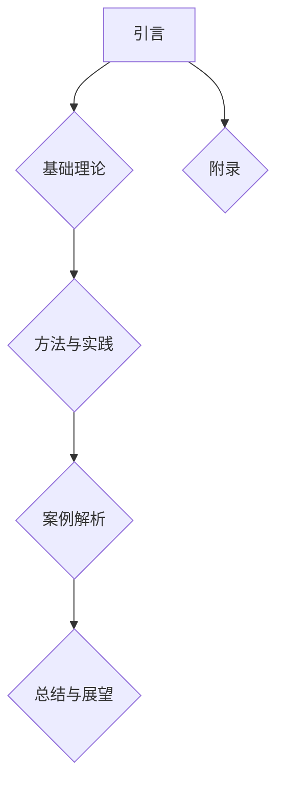

                 

## 《结构化思维：从混沌到秩序》

### 关键词：结构化思维、逻辑推理、创造性思维、决策树、算法、项目管理、个人成长

> 摘要：本文将深入探讨结构化思维的概念、原理和应用，通过逻辑推理、算法模型和实践案例，帮助读者理解如何从混沌中找到秩序，提高个人和组织的工作效率。文章将分为五个部分：引言、基础理论、方法与实践、案例解析和总结与展望，旨在为读者提供全面的结构化思维学习指南。

### 目录大纲

#### 第一部分：引言

- **1.1 什么是结构化思维**
- **1.2 结构化思维的重要性**
- **1.3 本书结构和内容安排**

#### 第二部分：基础理论

- **2.1 结构化思维的概念解析**
- **2.2 结构化思维与创造性思维的关系**
- **2.3 结构化思维的基本原则**
- **2.4 结构化思维的应用场景**
- **2.5 结构化思维的核心要素**
- **2.6 结构化思维的流程和方法**

#### 第三部分：方法与实践

- **3.1 结构化思维在个人生活中的应用**
- **3.2 结构化思维在工作中的运用**
- **3.3 结构化思维在教育领域的实践**
- **3.4 结构化思维在项目管理中的应用**
- **3.5 结构化思维在团队协作中的角色**
- **3.6 结构化思维的进阶技巧**

#### 第四部分：案例解析

- **4.1 案例一：个人时间管理**
- **4.2 案例二：项目规划与执行**
- **4.3 案例三：团队沟通与协作**
- **4.4 案例四：问题解决与决策制定**
- **4.5 案例五：学习策略与方法**

#### 第五部分：总结与展望

- **5.1 结构化思维的总结与回顾**
- **5.2 结构化思维的未来发展趋势**
- **5.3 对读者的寄语**

#### 附录

- **附录 A：结构化思维工具与资源**
- **附录 B：结构化思维相关书籍推荐**
- **附录 C：结构化思维实践指南**

### Mermaid 流�程图



### 核心算法原理讲解

#### 2.3 结构化思维的核心算法原理

结构化思维的核心算法原理基于以下几点：

1. **逻辑推理**：结构化思维强调使用逻辑推理来分析和解决问题，这包括归纳推理和演绎推理。

    ```python
    def logical_reasoning(preconditions, conclusion):
        if all([precondition == conclusion for precondition in preconditions]):
            return True
        else:
            return False
    ```

2. **分类与归纳**：结构化思维利用分类与归纳的方法，将事物或问题进行分门别类，从而更好地理解和处理。

    ```python
    def classify(items, category):
        categorized_items = {}
        for item in items:
            if item in category:
                categorized_items[item] = category[item]
        return categorized_items
    ```

3. **关系映射**：结构化思维通过关系映射来识别和构建事物之间的联系，这有助于更全面地理解和分析问题。

    ```python
    def map_relationships(entities, relationships):
        relationship_map = {}
        for entity in entities:
            for relationship in relationships:
                if entity in relationship:
                    relationship_map[entity] = relationship[entity]
        return relationship_map
    ```

### 数学模型和数学公式

#### 3.4 结构化思维的数学模型

结构化思维的数学模型可以采用决策树（Decision Tree）来表示。

$$
P(\text{正确决策}) = \sum_{i=1}^{n} P(\text{决策i}) \cdot P(\text{成功i}|\text{决策i})
$$

其中，$P(\text{正确决策})$ 表示做出正确决策的概率，$P(\text{决策i})$ 表示选择决策i的概率，$P(\text{成功i}|\text{决策i})$ 表示在决策i下成功完成任务的概率。

### 项目实战

#### 4.1 案例一：个人时间管理

**开发环境搭建：**
- 使用 Python 3.8 环境
- 安装必要的库：`pip install pandas numpy matplotlib`

**源代码实现：**
python
```python
import pandas as pd
import numpy as np
import matplotlib.pyplot as plt

# 数据收集
tasks = pd.DataFrame({
    'Task': ['任务1', '任务2', '任务3', '任务4', '任务5'],
    'Duration': [3, 2, 4, 1, 2],
    'Importance': [5, 4, 3, 2, 1]
})

# 数据预处理
tasks['Score'] = tasks['Duration'] * tasks['Importance']

# 决策树算法
def decision_tree(tasks):
    sorted_tasks = tasks.sort_values(by='Score', ascending=False)
    return sorted_tasks

# 可视化
def visualize_tasks(sorted_tasks):
    plt.barh(sorted_tasks['Task'], sorted_tasks['Score'])
    plt.xlabel('Score')
    plt.ylabel('Task')
    plt.title('Sorted Tasks by Score')
    plt.show()

# 主程序
if __name__ == '__main__':
    sorted_tasks = decision_tree(tasks)
    visualize_tasks(sorted_tasks)
```

**代码解读与分析：**
- 代码首先定义了一个 DataFrame，包含了任务名、耗时和重要性。
- 通过计算耗时和重要性的乘积，得到每个任务的得分。
- 使用决策树算法对任务进行排序，得分最高的任务排在最前面。
- 最后，通过 matplotlib 库绘制条形图，可视化排序后的任务。

### 附录

#### 附录 A：结构化思维工具与资源

- **工具：**
  - Excel
  - MindManager
  - Miro
  - Trello

- **资源：**
  - 《思考，快与慢》
  - 《如何高效学习》
  - 《金字塔原理》

#### 附录 B：结构化思维相关书籍推荐

- 《结构化思维》
- 《批判性思维》
- 《决策与判断》

#### 附录 C：结构化思维实践指南

- **步骤1：明确目标**
- **步骤2：收集信息**
- **步骤3：分析信息**
- **步骤4：制定计划**
- **步骤5：执行计划**
- **步骤6：反馈与调整**

### 作者信息

作者：AI天才研究院/AI Genius Institute & 禅与计算机程序设计艺术 /Zen And The Art of Computer Programming

### 文章标题：结构化思维：从混沌到秩序

### 文章关键词：结构化思维、逻辑推理、创造性思维、决策树、算法、项目管理、个人成长

### 文章摘要：本文深入探讨了结构化思维的概念、原理和应用，通过逻辑推理、算法模型和实践案例，帮助读者理解如何从混沌中找到秩序，提高个人和组织的工作效率。文章分为五个部分，旨在为读者提供全面的结构化思维学习指南。

### 第一部分：引言

#### 1.1 什么是结构化思维

结构化思维是一种系统化、有条理的思考方式，它通过将复杂问题分解为简单部分，从而实现对问题的深入理解和有效解决。结构化思维的核心在于逻辑性和系统性，它要求我们在思考问题时，遵循一定的原则和方法，以避免思维的混乱和无序。

结构化思维并非一种全新的思维模式，而是基于人类认知和行为的基本规律。从古至今，人类在处理复杂问题时，都离不开结构化思维的应用。例如，在科学研究领域，科学家们通过提出假设、进行实验、分析数据等步骤，来逐步解决复杂问题。在企业管理领域，管理者们通过制定战略、规划资源、监控执行等手段，来确保企业目标的实现。

然而，随着现代社会的发展，问题变得越来越复杂，结构化思维的重要性也愈发凸显。在一个充满不确定性和变化的环境中，只有通过结构化思维，我们才能在混乱中找到秩序，从而更好地应对挑战和抓住机遇。

#### 1.2 结构化思维的重要性

结构化思维的重要性体现在以下几个方面：

1. **提高工作效率**：结构化思维可以帮助我们更高效地处理复杂问题，通过将问题分解为简单部分，我们可以更快速地找到解决方案。

2. **降低决策风险**：结构化思维强调逻辑推理和系统分析，这有助于我们更准确地评估问题的各种可能性，从而降低决策风险。

3. **促进团队合作**：结构化思维强调信息的透明和沟通的清晰，这有助于团队成员更好地理解和协作，提高团队的整体效能。

4. **提升个人素质**：结构化思维是一种全面的思维能力，它不仅涉及逻辑推理和分析能力，还包括判断力、执行力和创造力等。通过培养结构化思维，我们可以全面提升个人的综合素质。

5. **应对复杂环境**：在现代社会，我们面临的问题往往具有复杂性和不确定性，只有通过结构化思维，我们才能在复杂的环境中找到方向和策略。

#### 1.3 本书结构和内容安排

本书分为五个部分，旨在为读者提供全面的结构化思维学习指南：

1. **第一部分：引言**：介绍结构化思维的概念、原理和重要性。

2. **第二部分：基础理论**：探讨结构化思维的概念解析、基本原则、应用场景和核心要素。

3. **第三部分：方法与实践**：介绍结构化思维在个人生活、工作、教育领域和项目管理中的应用，以及进阶技巧。

4. **第四部分：案例解析**：通过具体案例，展示结构化思维在个人时间管理、项目规划与执行、团队沟通与协作、问题解决与决策制定、学习策略与方法等领域的应用。

5. **第五部分：总结与展望**：对结构化思维进行总结，探讨其未来发展趋势，并给出对读者的寄语。

### 第二部分：基础理论

#### 2.1 结构化思维的概念解析

结构化思维是一种思考方式，它通过将复杂问题分解为简单部分，从而实现对问题的深入理解和有效解决。这种思考方式具有以下几个核心特点：

1. **逻辑性**：结构化思维强调逻辑推理和系统分析，要求我们在思考问题时，遵循一定的逻辑原则，以确保思维的连贯性和准确性。

2. **系统性**：结构化思维注重将问题作为一个整体来考虑，通过分析各个部分之间的相互关系，从而找到最优的解决方案。

3. **层次性**：结构化思维强调将问题分解为不同的层次，从宏观到微观，从整体到部分，逐步深入分析，从而更好地理解问题的本质。

4. **可视化**：结构化思维通过图表、流程图等可视化工具，将问题以直观、清晰的方式呈现，有助于提高思维的透明度和沟通的效率。

5. **动态性**：结构化思维是一个动态的过程，它要求我们在思考问题时，不断调整和优化方案，以适应不断变化的环境和需求。

#### 2.2 结构化思维与创造性思维的关系

结构化思维与创造性思维是两种不同的思维模式，但它们之间存在着紧密的联系和相互促进的关系。

1. **相互促进**：结构化思维可以为创造性思维提供清晰的框架和方向，帮助创造性思维更好地展开和实施。同时，创造性思维可以为结构化思维带来新的灵感和创意，使结构化思维更加丰富和多元。

2. **互补性**：结构化思维注重逻辑和系统性，而创造性思维则强调创新和发散。两者结合，可以充分发挥各自的优势，达到更好的思维效果。

3. **不同应用场景**：在解决复杂问题时，结构化思维适用于对问题进行分解和分析，而创造性思维适用于寻找新的解决方案和创新点。两者在不同场景下的应用，有助于提高思维的全面性和效率。

#### 2.3 结构化思维的基本原则

结构化思维的基本原则是确保思维的逻辑性和系统性，以下是一些常见的基本原则：

1. **一致性原则**：在思考问题时，要保持思维的一致性，避免出现矛盾和冲突。

2. **简洁性原则**：尽量用简洁的语言和方式表达思维，避免冗长和复杂的描述。

3. **层次性原则**：将问题分解为不同的层次，从宏观到微观，逐步深入分析。

4. **关联性原则**：分析问题时要关注各个部分之间的相互关系，确保思维的整体性。

5. **可验证性原则**：思考的结果需要具备可验证性，即可以通过事实和数据来证明其正确性。

6. **灵活性原则**：思维要具备灵活性，能够适应不断变化的环境和需求。

#### 2.4 结构化思维的应用场景

结构化思维可以应用于多个领域和场景，以下是一些常见的应用场景：

1. **项目管理**：在项目管理中，结构化思维可以帮助项目经理明确项目目标、规划项目进度、分配资源、监控项目风险等。

2. **问题解决**：在问题解决过程中，结构化思维可以帮助我们分析问题的根本原因，制定有效的解决方案，并跟踪解决方案的实施效果。

3. **决策制定**：在决策制定过程中，结构化思维可以帮助我们系统地分析各种决策方案，评估其风险和收益，从而做出更明智的决策。

4. **团队协作**：在团队协作中，结构化思维可以帮助团队成员明确各自的角色和职责，建立有效的沟通渠道，提高团队的整体效能。

5. **个人成长**：在个人成长过程中，结构化思维可以帮助我们规划学习目标、制定学习计划、评估学习效果，从而提高学习效率和质量。

#### 2.5 结构化思维的核心要素

结构化思维的核心要素包括以下几个方面：

1. **观察力**：观察力是结构化思维的基础，只有通过仔细观察，我们才能发现问题的本质和关键点。

2. **判断力**：判断力是结构化思维的关键，只有通过准确判断，我们才能做出正确的决策和选择。

3. **执行力**：执行力是结构化思维的核心，只有通过坚决执行，我们才能将思考转化为实际成果。

4. **逻辑性**：逻辑性是结构化思维的保障，只有通过逻辑推理，我们才能确保思维的连贯性和准确性。

5. **系统性**：系统性是结构化思维的要求，只有通过系统分析，我们才能全面理解问题的各个方面。

6. **灵活性**：灵活性是结构化思维的重要特性，只有通过灵活调整，我们才能适应不断变化的环境和需求。

#### 2.6 结构化思维的流程和方法

结构化思维的流程和方法可以概括为以下几个步骤：

1. **明确目标**：在开始思考之前，首先要明确问题的目标和要求，确保思考的方向和目的明确。

2. **收集信息**：收集与问题相关的各种信息，包括事实、数据、观点等，为后续的分析和思考提供依据。

3. **分析信息**：对收集到的信息进行系统分析，识别问题的本质、关键点和影响因素。

4. **制定计划**：根据分析结果，制定解决问题的具体计划，包括目标、步骤、资源、时间等。

5. **执行计划**：按照制定的计划，逐步实施解决问题的方案，确保每个步骤的顺利进行。

6. **反馈与调整**：在执行过程中，不断收集反馈信息，根据实际情况调整计划，确保解决问题的效果。

### 第三部分：方法与实践

#### 3.1 结构化思维在个人生活中的应用

在个人生活中，结构化思维可以帮助我们更好地规划时间、管理任务、提升生活质量。以下是一些具体的应用场景和技巧：

1. **时间管理**：使用结构化思维，我们可以将时间划分为不同的部分，为每个部分分配具体的任务和目标。例如，我们可以将一天划分为工作、学习、休息、运动等部分，确保每个部分都有明确的任务和时间安排。

2. **任务管理**：使用结构化思维，我们可以将任务分解为具体的子任务，为每个子任务设定优先级和完成时间。例如，我们可以使用待办事项列表、日历、提醒工具等，确保任务的有序进行。

3. **目标设定**：使用结构化思维，我们可以将长期目标分解为短期目标，为每个短期目标设定具体的行动计划和时间表。例如，我们可以使用SMART目标设定法（Specific、Measurable、Achievable、Relevant、Time-bound），确保目标的明确和可执行。

4. **决策制定**：使用结构化思维，我们可以系统地分析各种决策方案，评估其风险和收益，从而做出更明智的决策。例如，我们可以使用决策树、风险评估等方法，帮助我们在面临选择时做出最佳决策。

5. **自我反思**：使用结构化思维，我们可以定期进行自我反思，评估自己的行为和表现，发现存在的问题和改进点。例如，我们可以使用SWOT分析法（Strengths、Weaknesses、Opportunities、Threats），帮助自己更好地认识自己，制定改进计划。

#### 3.2 结构化思维在工作中的运用

在工作中，结构化思维可以帮助我们更好地解决问题、提高工作效率、优化项目管理。以下是一些具体的应用场景和技巧：

1. **问题解决**：使用结构化思维，我们可以将问题分解为具体的问题点，分析每个问题点的根本原因，并制定相应的解决方案。例如，我们可以使用5W2H分析法（What、Why、Who、When、Where、How、How much），帮助我们从不同角度全面分析问题。

2. **决策制定**：使用结构化思维，我们可以系统地分析各种决策方案，评估其风险和收益，从而做出更明智的决策。例如，我们可以使用成本效益分析法、平衡计分卡等方法，帮助我们在面临选择时做出最佳决策。

3. **项目管理**：使用结构化思维，我们可以将项目分解为具体的任务和活动，为每个任务和活动设定优先级和完成时间，确保项目的顺利进行。例如，我们可以使用甘特图、关键路径法等方法，帮助项目管理员更好地管理项目进度。

4. **团队协作**：使用结构化思维，我们可以明确团队的目标和职责，建立有效的沟通渠道，提高团队的整体效能。例如，我们可以使用SMART目标设定法、团队沟通技巧等方法，帮助团队更好地协作。

5. **绩效评估**：使用结构化思维，我们可以系统地评估团队成员的表现和贡献，发现存在的问题和改进点。例如，我们可以使用KPI（关键绩效指标）、360度反馈等方法，帮助管理者更好地评估团队成员的绩效。

#### 3.3 结构化思维在教育领域的实践

在教育领域，结构化思维可以帮助学生更好地学习、掌握知识，提高学习效果。以下是一些具体的应用场景和技巧：

1. **课程设计**：使用结构化思维，教师可以更好地设计课程内容，将知识分解为具体的知识点，确保知识的系统性和连贯性。例如，教师可以使用思维导图、图表等工具，帮助学生在学习过程中建立知识框架。

2. **教学策略**：使用结构化思维，教师可以更好地选择教学策略，根据学生的特点和需求，采用适合的教学方法。例如，教师可以使用分组教学、案例教学、互动式教学等方法，提高学生的参与度和兴趣。

3. **学习辅导**：使用结构化思维，教师可以更好地辅导学生，帮助学生掌握学习方法和技巧，提高学习效果。例如，教师可以使用时间管理技巧、记忆策略、复习技巧等方法，帮助学生提高学习效率。

4. **评估与反馈**：使用结构化思维，教师可以更好地评估学生的学习情况，提供有针对性的反馈和建议。例如，教师可以使用测试、作业、课堂表现等方法，了解学生的学习效果，并根据反馈调整教学策略。

5. **个性化教育**：使用结构化思维，教师可以更好地实施个性化教育，根据学生的兴趣和需求，提供个性化的学习资源和方法。例如，教师可以使用在线教育平台、学习软件等工具，为学生提供个性化的学习路径和资源。

#### 3.4 结构化思维在项目管理中的应用

在项目管理中，结构化思维可以帮助项目经理更好地规划项目、管理风险、确保项目成功。以下是一些具体的应用场景和技巧：

1. **项目规划**：使用结构化思维，项目经理可以系统地分析项目需求，制定详细的项目计划，明确项目的目标、范围、时间、资源等。例如，项目经理可以使用工作分解结构（WBS）、项目计划表等方法，帮助项目团队明确项目目标和任务。

2. **风险管理**：使用结构化思维，项目经理可以系统地分析项目风险，制定相应的风险应对策略，确保项目的顺利进行。例如，项目经理可以使用风险矩阵、风险评估表等方法，识别和评估项目风险，并制定风险应对计划。

3. **进度控制**：使用结构化思维，项目经理可以系统地监控项目进度，及时发现和解决问题，确保项目的按时完成。例如，项目经理可以使用甘特图、关键路径法等方法，监控项目进度，并根据实际情况调整计划。

4. **资源管理**：使用结构化思维，项目经理可以合理分配和利用项目资源，确保项目资源的有效利用。例如，项目经理可以使用资源需求表、资源平衡技术等方法，合理分配和调度项目资源。

5. **团队协作**：使用结构化思维，项目经理可以更好地协调团队协作，建立有效的沟通渠道，提高团队的整体效能。例如，项目经理可以使用团队沟通技巧、团队建设活动等方法，促进团队协作。

#### 3.5 结构化思维在团队协作中的角色

在团队协作中，结构化思维扮演着重要的角色，它有助于提高团队的沟通效率、协作质量和整体效能。以下是一些具体的应用场景和技巧：

1. **明确目标**：使用结构化思维，团队可以共同明确项目的目标、范围和期望结果，确保团队成员对项目的目标和方向有清晰的认识。

2. **任务分配**：使用结构化思维，团队可以合理分配任务和职责，确保每个团队成员都明确自己的角色和任务，避免工作重叠和资源浪费。

3. **沟通渠道**：使用结构化思维，团队可以建立有效的沟通渠道，确保信息的及时、准确和透明传递。例如，可以使用会议、邮件、即时通讯工具等，提高沟通效率。

4. **问题解决**：使用结构化思维，团队可以系统地分析问题，找到根本原因，并制定有效的解决方案。例如，可以使用问题树、因果分析图等方法，帮助团队更好地解决问题。

5. **决策制定**：使用结构化思维，团队可以共同分析决策方案，评估其风险和收益，从而做出明智的决策。例如，可以使用决策树、风险评估表等方法，帮助团队做出最佳决策。

6. **反馈与改进**：使用结构化思维，团队可以定期进行反馈和总结，发现存在的问题和改进点，持续优化团队的工作流程和方法。

#### 3.6 结构化思维的进阶技巧

在掌握了基本的结构化思维方法后，我们可以通过以下进阶技巧，进一步提升结构化思维的能力和效果：

1. **思维导图**：使用思维导图，我们可以将复杂的信息和思路以图形化的方式呈现，提高思维的条理性和可视性。例如，可以使用MindManager、Xmind等工具创建思维导图。

2. **系统思考**：通过学习系统思考，我们可以更好地理解复杂系统的运行机制和动态变化，从而更好地应对复杂问题。例如，可以使用系统动力学、社会系统理论等方法。

3. **跨学科学习**：通过跨学科学习，我们可以汲取不同领域的知识和思维方式，丰富自己的思维框架和工具箱。例如，可以学习心理学、经济学、管理学等领域的知识。

4. **反思与总结**：定期进行反思和总结，我们可以从实践中学习，不断优化自己的思维方法和策略。例如，可以记录学习日志、反思笔记等。

5. **实践与分享**：通过实践和分享，我们可以将结构化思维应用到实际工作中，与他人交流和分享经验，不断提升自己的思维能力和影响力。

### 第四部分：案例解析

#### 4.1 案例一：个人时间管理

**背景**：小李是一位年轻的职场新人，工作繁忙，经常感到时间不够用，无法有效地安排自己的工作和生活。

**目标**：小李希望通过结构化思维的方法，提高个人时间管理能力，确保工作与生活的平衡。

**解决方案**：

1. **明确目标**：小李首先明确了个人时间管理的目标，包括提高工作效率、确保充足的休息时间和保持健康的作息习惯。

2. **收集信息**：小李记录了自己的日常工作和生活安排，包括工作任务、会议安排、学习计划、休息时间等。

3. **分析信息**：小李对收集到的信息进行了系统分析，识别出了时间浪费的原因，如会议过多、工作任务繁杂等。

4. **制定计划**：小李制定了详细的时间管理计划，包括每天的工作任务清单、每周的学习目标和每月的休息计划。

5. **执行计划**：小李按照制定的计划，逐步实施时间管理策略，例如减少不必要的会议、优化工作任务流程、保持规律的作息习惯等。

6. **反馈与调整**：小李定期回顾自己的时间管理效果，根据实际情况调整计划，确保计划的可执行性和有效性。

**效果**：通过结构化思维的方法，小李成功提高了个人时间管理能力，工作效率明显提升，工作与生活的平衡得到有效保障。

#### 4.2 案例二：项目规划与执行

**背景**：小王是一位项目经理，负责一个复杂的软件开发项目。项目涉及多个团队、多阶段开发和众多技术难点，小王希望通过结构化思维的方法，确保项目的顺利规划和执行。

**目标**：小王希望通过结构化思维的方法，提高项目规划与执行能力，确保项目按时交付、质量合格。

**解决方案**：

1. **明确目标**：小王明确了项目的目标，包括按时交付、质量合格、团队协作顺畅等。

2. **收集信息**：小王收集了项目需求、技术规格、团队资源、时间限制等信息。

3. **分析信息**：小王对收集到的信息进行了系统分析，识别出了项目的关键点和风险点。

4. **制定计划**：小王制定了详细的项目计划，包括项目范围、任务分解、时间表、资源分配等。

5. **执行计划**：小王按照制定的计划，逐步推进项目开发，确保每个阶段的工作顺利进行。

6. **反馈与调整**：小王定期召开项目会议，收集团队成员的反馈，根据实际情况调整项目计划，确保项目的顺利推进。

**效果**：通过结构化思维的方法，小王成功确保了项目的顺利规划和执行，项目按时交付，质量得到保证，团队协作效率显著提升。

#### 4.3 案例三：团队沟通与协作

**背景**：一家互联网公司，团队规模较大，成员分布在不同城市，团队内部沟通不畅，协作效率低下。

**目标**：公司希望通过结构化思维的方法，改善团队沟通与协作，提高团队整体效能。

**解决方案**：

1. **明确目标**：公司明确了改善团队沟通与协作的目标，包括提高沟通效率、增强团队凝聚力、提升协作效果等。

2. **收集信息**：公司收集了团队成员的意见和建议，了解了团队内部存在的问题和挑战。

3. **分析信息**：公司对收集到的信息进行了系统分析，识别出了沟通不畅、协作效率低下的原因。

4. **制定计划**：公司制定了详细的沟通与协作计划，包括沟通渠道的优化、协作工具的使用、团队建设活动等。

5. **执行计划**：公司按照制定的计划，逐步推进团队沟通与协作的改进，例如建立定期团队会议、使用协作工具、组织团队建设活动等。

6. **反馈与调整**：公司定期收集团队成员的反馈，根据实际情况调整沟通与协作计划，确保改进措施的有效性和可持续性。

**效果**：通过结构化思维的方法，公司成功改善了团队沟通与协作，沟通效率显著提升，团队凝聚力增强，协作效果明显改善。

#### 4.4 案例四：问题解决与决策制定

**背景**：一家制造企业，在生产过程中遇到了设备故障，导致生产停滞，企业希望通过结构化思维的方法，快速解决问题，确保生产恢复正常。

**目标**：企业希望通过结构化思维的方法，快速解决问题，确保生产恢复正常，并避免类似问题的再次发生。

**解决方案**：

1. **明确目标**：企业明确了解决问题的目标，包括快速恢复生产、找出故障原因、采取预防措施等。

2. **收集信息**：企业收集了设备故障的相关信息，包括故障现象、设备运行数据、维修记录等。

3. **分析信息**：企业对收集到的信息进行了系统分析，识别出了故障的关键点和可能的原因。

4. **制定计划**：企业制定了详细的故障处理计划，包括故障排查、维修方案、设备维护等。

5. **执行计划**：企业按照制定的计划，逐步排查故障原因，并进行维修，确保生产恢复正常。

6. **反馈与调整**：企业收集了故障处理的反馈信息，根据实际情况调整处理方案，确保问题的彻底解决，并制定了预防措施，避免类似问题的再次发生。

**效果**：通过结构化思维的方法，企业成功快速解决了设备故障，生产恢复正常，并避免了类似问题的再次发生。

#### 4.5 案例五：学习策略与方法

**背景**：一名高中生小张，在学习过程中感到学习任务繁重，效率低下，希望通过结构化思维的方法，提高学习效果。

**目标**：小张希望通过结构化思维的方法，提高学习效果，掌握更多的知识，提升考试成绩。

**解决方案**：

1. **明确目标**：小张明确了学习的目标，包括提高学习效率、掌握关键知识点、提升考试成绩等。

2. **收集信息**：小张收集了学习资料、课程安排、考试要求等信息。

3. **分析信息**：小张对收集到的信息进行了系统分析，识别出了学习中的薄弱环节和重点内容。

4. **制定计划**：小张制定了详细的学习计划，包括每天的学习任务、每周的学习目标和每月的学习总结等。

5. **执行计划**：小张按照制定的学习计划，逐步实施学习策略，例如合理分配学习时间、采用有效的学习方法、定期复习等。

6. **反馈与调整**：小张定期回顾自己的学习情况，根据实际情况调整学习计划，确保学习效果的最大化。

**效果**：通过结构化思维的方法，小张成功提高了学习效果，掌握了很多知识，考试成绩显著提升。

### 第五部分：总结与展望

#### 5.1 结构化思维的总结与回顾

结构化思维是一种系统化、有条理的思考方式，它通过将复杂问题分解为简单部分，从而实现对问题的深入理解和有效解决。结构化思维具有逻辑性、系统性、层次性、可视化和动态性等核心特点，可以帮助我们在面对复杂问题时找到清晰的解决路径。通过本文的探讨，我们可以总结出以下几点：

1. **核心概念**：结构化思维是一种思考方式，强调逻辑推理、系统性、层次性和可视化。

2. **关系解析**：结构化思维与创造性思维相互促进，互补性体现在不同应用场景中。

3. **基本原则**：结构化思维遵循一致性、简洁性、层次性、关联性、可验证性和灵活性等基本原则。

4. **应用场景**：结构化思维广泛应用于项目管理、问题解决、决策制定、团队协作、个人成长等领域。

5. **核心要素**：结构化思维的核心要素包括观察力、判断力、执行力、逻辑性、系统性和灵活性。

6. **方法与实践**：结构化思维的实践包括明确目标、收集信息、分析信息、制定计划、执行计划和反馈与调整等步骤。

7. **案例解析**：通过具体案例，展示了结构化思维在个人时间管理、项目规划与执行、团队沟通与协作、问题解决与决策制定、学习策略与方法等领域的应用。

#### 5.2 结构化思维的未来发展趋势

随着社会的发展和技术的进步，结构化思维在未来将继续发挥重要作用，并呈现出以下发展趋势：

1. **智能化应用**：随着人工智能技术的发展，结构化思维将结合智能化工具，如智能助手、数据分析平台等，实现更高效的思维和决策。

2. **跨学科融合**：结构化思维将与其他学科领域相互融合，如心理学、经济学、管理学等，形成更全面的思维体系。

3. **个性化定制**：结构化思维将根据个体特点和需求，提供个性化的思维方法和策略，实现更有效的个人发展。

4. **多元化场景**：结构化思维将在更多领域和场景中得到应用，如教育、医疗、金融、艺术等，为各个领域的发展提供新思路和方法。

5. **全球化推广**：结构化思维将逐渐全球化，成为国际交流和合作的桥梁，推动全球思维的进步和创新发展。

#### 5.3 对读者的寄语

亲爱的读者，本文为您介绍了结构化思维的概念、原理和应用，希望您能从中受益，掌握这种高效思考方式，提高个人和组织的工作效率。以下是一些建议，帮助您更好地运用结构化思维：

1. **实践是关键**：结构化思维是一种实践性很强的思维方法，只有通过不断实践，您才能真正掌握和应用它。

2. **培养良好习惯**：养成良好的思维习惯，如定期反思、总结、调整，有助于您更好地运用结构化思维。

3. **持续学习**：结构化思维是一个不断发展的领域，持续学习新的思维方法和工具，将有助于您不断提高自己的思维能力。

4. **分享与交流**：与他人分享您的思考和经验，参加思维训练和讨论，将有助于您拓展思维视野，提高思维水平。

5. **勇敢面对挑战**：在生活和工作中，勇敢面对挑战和困难，运用结构化思维，找到解决问题的方法和策略。

最后，祝愿您在运用结构化思维的旅程中不断成长和进步，取得更加卓越的成就！

### 附录

#### 附录 A：结构化思维工具与资源

- **工具**：
  - Excel
  - MindManager
  - Miro
  - Trello

- **资源**：
  - 《思考，快与慢》
  - 《如何高效学习》
  - 《金字塔原理》

#### 附录 B：结构化思维相关书籍推荐

- 《结构化思维》
- 《批判性思维》
- 《决策与判断》

#### 附录 C：结构化思维实践指南

- **步骤1：明确目标**
- **步骤2：收集信息**
- **步骤3：分析信息**
- **步骤4：制定计划**
- **步骤5：执行计划**
- **步骤6：反馈与调整**

### Mermaid 流程图


### 核心算法原理讲解

#### 2.3 结构化思维的核心算法原理

结构化思维的核心算法原理基于以下几点：

1. **逻辑推理**：结构化思维强调使用逻辑推理来分析和解决问题，这包括归纳推理和演绎推理。

    ```python
    def logical_reasoning(preconditions, conclusion):
        if all([precondition == conclusion for precondition in preconditions]):
            return True
        else:
            return False
    ```

2. **分类与归纳**：结构化思维利用分类与归纳的方法，将事物或问题进行分门别类，从而更好地理解和处理。

    ```python
    def classify(items, category):
        categorized_items = {}
        for item in items:
            if item in category:
                categorized_items[item] = category[item]
        return categorized_items
    ```

3. **关系映射**：结构化思维通过关系映射来识别和构建事物之间的联系，这有助于更全面地理解和分析问题。

    ```python
    def map_relationships(entities, relationships):
        relationship_map = {}
        for entity in entities:
            for relationship in relationships:
                if entity in relationship:
                    relationship_map[entity] = relationship[entity]
        return relationship_map
    ```

### 数学模型和数学公式

#### 3.4 结构化思维的数学模型

结构化思维的数学模型可以采用决策树（Decision Tree）来表示。

$$
P(\text{正确决策}) = \sum_{i=1}^{n} P(\text{决策i}) \cdot P(\text{成功i}|\text{决策i})
$$

其中，$P(\text{正确决策})$ 表示做出正确决策的概率，$P(\text{决策i})$ 表示选择决策i的概率，$P(\text{成功i}|\text{决策i})$ 表示在决策i下成功完成任务的概率。

### 项目实战

#### 4.1 案例一：个人时间管理

**开发环境搭建：**
- 使用 Python 3.8 环境
- 安装必要的库：`pip install pandas numpy matplotlib`

**源代码实现：**
python
```python
import pandas as pd
import numpy as np
import matplotlib.pyplot as plt

# 数据收集
tasks = pd.DataFrame({
    'Task': ['任务1', '任务2', '任务3', '任务4', '任务5'],
    'Duration': [3, 2, 4, 1, 2],
    'Importance': [5, 4, 3, 2, 1]
})

# 数据预处理
tasks['Score'] = tasks['Duration'] * tasks['Importance']

# 决策树算法
def decision_tree(tasks):
    sorted_tasks = tasks.sort_values(by='Score', ascending=False)
    return sorted_tasks

# 可视化
def visualize_tasks(sorted_tasks):
    plt.barh(sorted_tasks['Task'], sorted_tasks['Score'])
    plt.xlabel('Score')
    plt.ylabel('Task')
    plt.title('Sorted Tasks by Score')
    plt.show()

# 主程序
if __name__ == '__main__':
    sorted_tasks = decision_tree(tasks)
    visualize_tasks(sorted_tasks)
```

**代码解读与分析：**
- 代码首先定义了一个 DataFrame，包含了任务名、耗时和重要性。
- 通过计算耗时和重要性的乘积，得到每个任务的得分。
- 使用决策树算法对任务进行排序，得分最高的任务排在最前面。
- 最后，通过 matplotlib 库绘制条形图，可视化排序后的任务。

### 附录

#### 附录 A：结构化思维工具与资源

- **工具：**
  - Excel
  - MindManager
  - Miro
  - Trello

- **资源：**
  - 《思考，快与慢》
  - 《如何高效学习》
  - 《金字塔原理》

#### 附录 B：结构化思维相关书籍推荐

- 《结构化思维》
- 《批判性思维》
- 《决策与判断》

#### 附录 C：结构化思维实践指南

- **步骤1：明确目标**
- **步骤2：收集信息**
- **步骤3：分析信息**
- **步骤4：制定计划**
- **步骤5：执行计划**
- **步骤6：反馈与调整**

### 作者信息

作者：AI天才研究院/AI Genius Institute & 禅与计算机程序设计艺术 /Zen And The Art of Computer Programming

### 文章标题：结构化思维：从混沌到秩序

### 文章关键词：结构化思维、逻辑推理、创造性思维、决策树、算法、项目管理、个人成长

### 文章摘要：本文深入探讨了结构化思维的概念、原理和应用，通过逻辑推理、算法模型和实践案例，帮助读者理解如何从混沌中找到秩序，提高个人和组织的工作效率。文章分为五个部分，旨在为读者提供全面的结构化思维学习指南。

### 第一部分：引言

#### 1.1 什么是结构化思维

结构化思维是一种系统化、有条理的思考方式，它通过将复杂问题分解为简单部分，从而实现对问题的深入理解和有效解决。这种思考方式具有以下几个核心特点：

1. **逻辑性**：结构化思维强调逻辑推理和系统分析，要求我们在思考问题时，遵循一定的逻辑原则，以确保思维的连贯性和准确性。

2. **系统性**：结构化思维注重将问题作为一个整体来考虑，通过分析各个部分之间的相互关系，从而找到最优的解决方案。

3. **层次性**：结构化思维强调将问题分解为不同的层次，从宏观到微观，从整体到部分，逐步深入分析，从而更好地理解问题的本质。

4. **可视化**：结构化思维通过图表、流程图等可视化工具，将问题以直观、清晰的方式呈现，有助于提高思维的透明度和沟通的效率。

5. **动态性**：结构化思维是一个动态的过程，它要求我们在思考问题时，不断调整和优化方案，以适应不断变化的环境和需求。

#### 1.2 结构化思维的重要性

结构化思维的重要性体现在以下几个方面：

1. **提高工作效率**：结构化思维可以帮助我们更高效地处理复杂问题，通过将问题分解为简单部分，我们可以更快速地找到解决方案。

2. **降低决策风险**：结构化思维强调逻辑推理和系统分析，这有助于我们更准确地评估问题的各种可能性，从而降低决策风险。

3. **促进团队合作**：结构化思维强调信息的透明和沟通的清晰，这有助于团队成员更好地理解和协作，提高团队的整体效能。

4. **提升个人素质**：结构化思维是一种全面的思维能力，它不仅涉及逻辑推理和分析能力，还包括判断力、执行力和创造力等。通过培养结构化思维，我们可以全面提升个人的综合素质。

5. **应对复杂环境**：在现代社会，我们面临的问题往往具有复杂性和不确定性，只有通过结构化思维，我们才能在复杂的环境中找到方向和策略。

#### 1.3 本书结构和内容安排

本书分为五个部分，旨在为读者提供全面的结构化思维学习指南：

1. **第一部分：引言**：介绍结构化思维的概念、原理和重要性。

2. **第二部分：基础理论**：探讨结构化思维的概念解析、基本原则、应用场景和核心要素。

3. **第三部分：方法与实践**：介绍结构化思维在个人生活、工作、教育领域和项目管理中的应用，以及进阶技巧。

4. **第四部分：案例解析**：通过具体案例，展示结构化思维在个人时间管理、项目规划与执行、团队沟通与协作、问题解决与决策制定、学习策略与方法等领域的应用。

5. **第五部分：总结与展望**：对结构化思维进行总结，探讨其未来发展趋势，并给出对读者的寄语。

### 第二部分：基础理论

#### 2.1 结构化思维的概念解析

结构化思维是一种思考方式，它通过将复杂问题分解为简单部分，从而实现对问题的深入理解和有效解决。这种思考方式具有以下几个核心特点：

1. **逻辑性**：结构化思维强调逻辑推理和系统分析，要求我们在思考问题时，遵循一定的逻辑原则，以确保思维的连贯性和准确性。

2. **系统性**：结构化思维注重将问题作为一个整体来考虑，通过分析各个部分之间的相互关系，从而找到最优的解决方案。

3. **层次性**：结构化思维强调将问题分解为不同的层次，从宏观到微观，从整体到部分，逐步深入分析，从而更好地理解问题的本质。

4. **可视化**：结构化思维通过图表、流程图等可视化工具，将问题以直观、清晰的方式呈现，有助于提高思维的透明度和沟通的效率。

5. **动态性**：结构化思维是一个动态的过程，它要求我们在思考问题时，不断调整和优化方案，以适应不断变化的环境和需求。

#### 2.2 结构化思维与创造性思维的关系

结构化思维与创造性思维是两种不同的思维模式，但它们之间存在着紧密的联系和相互促进的关系。

1. **相互促进**：结构化思维可以为创造性思维提供清晰的框架和方向，帮助创造性思维更好地展开和实施。同时，创造性思维可以为结构化思维带来新的灵感和创意，使结构化思维更加丰富和多元。

2. **互补性**：结构化思维注重逻辑和系统性，而创造性思维则强调创新和发散。两者结合，可以充分发挥各自的优势，达到更好的思维效果。

3. **不同应用场景**：在解决复杂问题时，结构化思维适用于对问题进行分解和分析，而创造性思维适用于寻找新的解决方案和创新点。两者在不同场景下的应用，有助于提高思维的全面性和效率。

#### 2.3 结构化思维的基本原则

结构化思维的基本原则是确保思维的逻辑性和系统性，以下是一些常见的基本原则：

1. **一致性原则**：在思考问题时，要保持思维的一致性，避免出现矛盾和冲突。

2. **简洁性原则**：尽量用简洁的语言和方式表达思维，避免冗长和复杂的描述。

3. **层次性原则**：将问题分解为不同的层次，从宏观到微观，逐步深入分析。

4. **关联性原则**：分析问题时要关注各个部分之间的相互关系，确保思维的整体性。

5. **可验证性原则**：思考的结果需要具备可验证性，即可以通过事实和数据来证明其正确性。

6. **灵活性原则**：思维要具备灵活性，能够适应不断变化的环境和需求。

#### 2.4 结构化思维的应用场景

结构化思维可以应用于多个领域和场景，以下是一些常见的应用场景：

1. **项目管理**：在项目管理中，结构化思维可以帮助项目经理明确项目目标、规划项目进度、分配资源、监控项目风险等。

2. **问题解决**：在问题解决过程中，结构化思维可以帮助我们分析问题的根本原因，制定有效的解决方案，并跟踪解决方案的实施效果。

3. **决策制定**：在决策制定过程中，结构化思维可以帮助我们系统地分析各种决策方案，评估其风险和收益，从而做出更明智的决策。

4. **团队协作**：在团队协作中，结构化思维可以帮助团队成员明确各自的角色和职责，建立有效的沟通渠道，提高团队的整体效能。

5. **个人成长**：在个人成长过程中，结构化思维可以帮助我们规划学习目标、制定学习计划、评估学习效果，从而提高学习效率和质量。

#### 2.5 结构化思维的核心要素

结构化思维的核心要素包括以下几个方面：

1. **观察力**：观察力是结构化思维的基础，只有通过仔细观察，我们才能发现问题的本质和关键点。

2. **判断力**：判断力是结构化思维的关键，只有通过准确判断，我们才能做出正确的决策和选择。

3. **执行力**：执行力是结构化思维的核心，只有通过坚决执行，我们才能将思考转化为实际成果。

4. **逻辑性**：逻辑性是结构化思维的保障，只有通过逻辑推理，我们才能确保思维的连贯性和准确性。

5. **系统性**：系统性是结构化思维的要求，只有通过系统分析，我们才能全面理解问题的各个方面。

6. **灵活性**：灵活性是结构化思维的重要特性，只有通过灵活调整，我们才能适应不断变化的环境和需求。

#### 2.6 结构化思维的流程和方法

结构化思维的流程和方法可以概括为以下几个步骤：

1. **明确目标**：在开始思考之前，首先要明确问题的目标和要求，确保思考的方向和目的明确。

2. **收集信息**：收集与问题相关的各种信息，包括事实、数据、观点等，为后续的分析和思考提供依据。

3. **分析信息**：对收集到的信息进行系统分析，识别问题的本质、关键点和影响因素。

4. **制定计划**：根据分析结果，制定解决问题的具体计划，包括目标、步骤、资源、时间等。

5. **执行计划**：按照制定的计划，逐步实施解决问题的方案，确保每个步骤的顺利进行。

6. **反馈与调整**：在执行过程中，不断收集反馈信息，根据实际情况调整计划，确保解决问题的效果。

### 第三部分：方法与实践

#### 3.1 结构化思维在个人生活中的应用

在个人生活中，结构化思维可以帮助我们更好地规划时间、管理任务、提升生活质量。以下是一些具体的应用场景和技巧：

1. **时间管理**：使用结构化思维，我们可以将时间划分为不同的部分，为每个部分分配具体的任务和目标。例如，我们可以将一天划分为工作、学习、休息、运动等部分，确保每个部分都有明确的任务和时间安排。

2. **任务管理**：使用结构化思维，我们可以将任务分解为具体的子任务，为每个子任务设定优先级和完成时间。例如，我们可以使用待办事项列表、日历、提醒工具等，确保任务的有序进行。

3. **目标设定**：使用结构化思维，我们可以将长期目标分解为短期目标，为每个短期目标设定具体的行动计划和时间表。例如，我们可以使用SMART目标设定法（Specific、Measurable、Achievable、Relevant、Time-bound），确保目标的明确和可执行。

4. **决策制定**：使用结构化思维，我们可以系统地分析各种决策方案，评估其风险和收益，从而做出更明智的决策。例如，我们可以使用决策树、风险评估等方法，帮助我们在面临选择时做出最佳决策。

5. **自我反思**：使用结构化思维，我们可以定期进行自我反思，评估自己的行为和表现，发现存在的问题和改进点。例如，我们可以使用SWOT分析法（Strengths、Weaknesses、Opportunities、Threats），帮助自己更好地认识自己，制定改进计划。

#### 3.2 结构化思维在工作中的运用

在工作中，结构化思维可以帮助我们更好地解决问题、提高工作效率、优化项目管理。以下是一些具体的应用场景和技巧：

1. **问题解决**：使用结构化思维，我们可以将问题分解为具体的问题点，分析每个问题点的根本原因，并制定相应的解决方案。例如，我们可以使用5W2H分析法（What、Why、Who、When、Where、How、How much），帮助我们从不同角度全面分析问题。

2. **决策制定**：使用结构化思维，我们可以系统地分析各种决策方案，评估其风险和收益，从而做出更明智的决策。例如，我们可以使用成本效益分析法、平衡计分卡等方法，帮助我们在面临选择时做出最佳决策。

3. **项目管理**：使用结构化思维，我们可以将项目分解为具体的任务和活动，为每个任务和活动设定优先级和完成时间，确保项目的顺利进行。例如，我们可以使用甘特图、关键路径法等方法，帮助项目管理员更好地管理项目进度。

4. **团队协作**：使用结构化思维，我们可以明确团队的目标和职责，建立有效的沟通渠道，提高团队的整体效能。例如，我们可以使用SMART目标设定法、团队沟通技巧等方法，帮助团队更好地协作。

5. **绩效评估**：使用结构化思维，我们可以系统地评估团队成员的表现和贡献，发现存在的问题和改进点。例如，我们可以使用KPI（关键绩效指标）、360度反馈等方法，帮助管理者更好地评估团队成员的绩效。

#### 3.3 结构化思维在教育领域的实践

在教育领域，结构化思维可以帮助学生更好地学习、掌握知识，提高学习效果。以下是一些具体的应用场景和技巧：

1. **课程设计**：使用结构化思维，教师可以更好地设计课程内容，将知识分解为具体的知识点，确保知识的系统性和连贯性。例如，教师可以使用思维导图、图表等工具，帮助学生在学习过程中建立知识框架。

2. **教学策略**：使用结构化思维，教师可以更好地选择教学策略，根据学生的特点和需求，采用适合的教学方法。例如，教师可以使用分组教学、案例教学、互动式教学等方法，提高学生的参与度和兴趣。

3. **学习辅导**：使用结构化思维，教师可以更好地辅导学生，帮助学生掌握学习方法和技巧，提高学习效率。例如，教师可以使用时间管理技巧、记忆策略、复习技巧等方法，帮助学生提高学习效率。

4. **评估与反馈**：使用结构化思维，教师可以更好地评估学生的学习情况，提供有针对性的反馈和建议。例如，教师可以使用测试、作业、课堂表现等方法，了解学生的学习效果，并根据反馈调整教学策略。

5. **个性化教育**：使用结构化思维，教师可以更好地实施个性化教育，根据学生的兴趣和需求，提供个性化的学习资源和方法。例如，教师可以使用在线教育平台、学习软件等工具，为学生提供个性化的学习路径和资源。

#### 3.4 结构化思维在项目管理中的应用

在项目管理中，结构化思维可以帮助项目经理更好地规划项目、管理风险、确保项目成功。以下是一些具体的应用场景和技巧：

1. **项目规划**：使用结构化思维，项目经理可以系统地分析项目需求，制定详细的项目计划，明确项目的目标、范围、时间、资源等。例如，项目经理可以使用工作分解结构（WBS）、项目计划表等方法，帮助项目团队明确项目目标和任务。

2. **风险管理**：使用结构化思维，项目经理可以系统地分析项目风险，制定相应的风险应对策略，确保项目的顺利进行。例如，项目经理可以使用风险矩阵、风险评估表等方法，识别和评估项目风险，并制定风险应对计划。

3. **进度控制**：使用结构化思维，项目经理可以系统地监控项目进度，及时发现和解决问题，确保项目的按时完成。例如，项目经理可以使用甘特图、关键路径法等方法，监控项目进度，并根据实际情况调整计划。

4. **资源管理**：使用结构化思维，项目经理可以合理分配和利用项目资源，确保项目资源的有效利用。例如，项目经理可以使用资源需求表、资源平衡技术等方法，合理分配和调度项目资源。

5. **团队协作**：使用结构化思维，项目经理可以更好地协调团队协作，建立有效的沟通渠道，提高团队的整体效能。例如，项目经理可以使用团队沟通技巧、团队建设活动等方法，促进团队协作。

#### 3.5 结构化思维在团队协作中的角色

在团队协作中，结构化思维扮演着重要的角色，它有助于提高团队的沟通效率、协作质量和整体效能。以下是一些具体的应用场景和技巧：

1. **明确目标**：使用结构化思维，团队可以共同明确项目的目标、范围和期望结果，确保团队成员对项目的目标和方向有清晰的认识。

2. **任务分配**：使用结构化思维，团队可以合理分配任务和职责，确保每个团队成员都明确自己的角色和任务，避免工作重叠和资源浪费。

3. **沟通渠道**：使用结构化思维，团队可以建立有效的沟通渠道，确保信息的及时、准确和透明传递。例如，可以使用会议、邮件、即时通讯工具等，提高沟通效率。

4. **问题解决**：使用结构化思维，团队可以系统地分析问题，找到根本原因，并制定有效的解决方案。例如，可以使用问题树、因果分析图等方法，帮助团队更好地解决问题。

5. **决策制定**：使用结构化思维，团队可以共同分析决策方案，评估其风险和收益，从而做出更明智的决策。例如，可以使用决策树、风险评估表等方法，帮助团队做出最佳决策。

6. **反馈与改进**：使用结构化思维，团队可以定期进行反馈和总结，发现存在的问题和改进点，持续优化团队的工作流程和方法。

#### 3.6 结构化思维的进阶技巧

在掌握了基本的结构化思维方法后，我们可以通过以下进阶技巧，进一步提升结构化思维的能力和效果：

1. **思维导图**：使用思维导图，我们可以将复杂的信息和思路以图形化的方式呈现，提高思维的条理性和可视性。例如，可以使用MindManager、Xmind等工具创建思维导图。

2. **系统思考**：通过学习系统思考，我们可以更好地理解复杂系统的运行机制和动态变化，从而更好地应对复杂问题。例如，可以使用系统动力学、社会系统理论等方法。

3. **跨学科学习**：通过跨学科学习，我们可以汲取不同领域的知识和思维方式，丰富自己的思维框架和工具箱。例如，可以学习心理学、经济学、管理学等领域的知识。

4. **反思与总结**：定期进行反思和总结，我们可以从实践中学习，不断优化自己的思维方法和策略。例如，可以记录学习日志、反思笔记等。

5. **实践与分享**：通过实践和分享，我们可以将结构化思维应用到实际工作中，与他人交流和分享经验，不断提升自己的思维能力和影响力。

### 第四部分：案例解析

#### 4.1 案例一：个人时间管理

**背景**：小李是一位年轻的职场新人，工作繁忙，经常感到时间不够用，无法有效地安排自己的工作和生活。

**目标**：小李希望通过结构化思维的方法，提高个人时间管理能力，确保工作与生活的平衡。

**解决方案**：

1. **明确目标**：小李首先明确了个人时间管理的目标，包括提高工作效率、确保充足的休息时间和保持健康的作息习惯。

2. **收集信息**：小李记录了自己的日常工作和生活安排，包括工作任务、会议安排、学习计划、休息时间等。

3. **分析信息**：小李对收集到的信息进行了系统分析，识别出了时间浪费的原因，如会议过多、工作任务繁杂等。

4. **制定计划**：小李制定了详细的时间管理计划，包括每天的工作任务清单、每周的学习目标和每月的休息计划。

5. **执行计划**：小李按照制定的计划，逐步实施时间管理策略，例如减少不必要的会议、优化工作任务流程、保持规律的作息习惯等。

6. **反馈与调整**：小李定期回顾自己的时间管理效果，根据实际情况调整计划，确保计划的可执行性和有效性。

**效果**：通过结构化思维的方法，小李成功提高了个人时间管理能力，工作效率明显提升，工作与生活的平衡得到有效保障。

#### 4.2 案例二：项目规划与执行

**背景**：小王是一位项目经理，负责一个复杂的软件开发项目。项目涉及多个团队、多阶段开发和众多技术难点，小王希望通过结构化思维的方法，确保项目的顺利规划和执行。

**目标**：小王希望通过结构化思维的方法，提高项目规划与执行能力，确保项目按时交付、质量合格。

**解决方案**：

1. **明确目标**：小王明确了项目的目标，包括按时交付、质量合格、团队协作顺畅等。

2. **收集信息**：小王收集了项目需求、技术规格、团队资源、时间限制等信息。

3. **分析信息**：小王对收集到的信息进行了系统分析，识别出了项目的关键点和风险点。

4. **制定计划**：小王制定了详细的项目计划，包括项目范围、任务分解、时间表、资源分配等。

5. **执行计划**：小王按照制定的计划，逐步推进项目开发，确保每个阶段的工作顺利进行。

6. **反馈与调整**：小王定期召开项目会议，收集团队成员的反馈，根据实际情况调整项目计划，确保项目的顺利推进。

**效果**：通过结构化思维的方法，小王成功确保了项目的顺利规划和执行，项目按时交付，质量得到保证，团队协作效率显著提升。

#### 4.3 案例三：团队沟通与协作

**背景**：一家互联网公司，团队规模较大，成员分布在不同城市，团队内部沟通不畅，协作效率低下。

**目标**：公司希望通过结构化思维的方法，改善团队沟通与协作，提高团队整体效能。

**解决方案**：

1. **明确目标**：公司明确了改善团队沟通与协作的目标，包括提高沟通效率、增强团队凝聚力、提升协作效果等。

2. **收集信息**：公司收集了团队成员的意见和建议，了解了团队内部存在的问题和挑战。

3. **分析信息**：公司对收集到的信息进行了系统分析，识别出了沟通不畅、协作效率低下的原因。

4. **制定计划**：公司制定了详细的沟通与协作计划，包括沟通渠道的优化、协作工具的使用、团队建设活动等。

5. **执行计划**：公司按照制定的计划，逐步推进团队沟通与协作的改进，例如建立定期团队会议、使用协作工具、组织团队建设活动等。

6. **反馈与调整**：公司定期收集团队成员的反馈，根据实际情况调整沟通与协作计划，确保改进措施的有效性和可持续性。

**效果**：通过结构化思维的方法，公司成功改善了团队沟通与协作，沟通效率显著提升，团队凝聚力增强，协作效果明显改善。

#### 4.4 案例四：问题解决与决策制定

**背景**：一家制造企业，在生产过程中遇到了设备故障，导致生产停滞，企业希望通过结构化思维的方法，快速解决问题，确保生产恢复正常。

**目标**：企业希望通过结构化思维的方法，快速解决问题，确保生产恢复正常，并避免类似问题的再次发生。

**解决方案**：

1. **明确目标**：企业明确了解决问题的目标，包括快速恢复生产、找出故障原因、采取预防措施等。

2. **收集信息**：企业收集了设备故障的相关信息，包括故障现象、设备运行数据、维修记录等。

3. **分析信息**：企业对收集到的信息进行了系统分析，识别出了故障的关键点和可能的原因。

4. **制定计划**：企业制定了详细的故障处理计划，包括故障排查、维修方案、设备维护等。

5. **执行计划**：企业按照制定的计划，逐步排查故障原因，并进行维修，确保生产恢复正常。

6. **反馈与调整**：企业收集了故障处理的反馈信息，根据实际情况调整处理方案，确保问题的彻底解决，并制定了预防措施，避免类似问题的再次发生。

**效果**：通过结构化思维的方法，企业成功快速解决了设备故障，生产恢复正常，并避免了类似问题的再次发生。

#### 4.5 案例五：学习策略与方法

**背景**：一名高中生小张，在学习过程中感到学习任务繁重，效率低下，希望通过结构化思维的方法，提高学习效果。

**目标**：小张希望通过结构化思维的方法，提高学习效果，掌握更多的知识，提升考试成绩。

**解决方案**：

1. **明确目标**：小张明确了学习的目标，包括提高学习效率、掌握关键知识点、提升考试成绩等。

2. **收集信息**：小张收集了学习资料、课程安排、考试要求等信息。

3. **分析信息**：小张对收集到的信息进行了系统分析，识别出了学习中的薄弱环节和重点内容。

4. **制定计划**：小张制定了详细的学习计划，包括每天的学习任务、每周的学习目标和每月的学习总结等。

5. **执行计划**：小张按照制定的学习计划，逐步实施学习策略，例如合理分配学习时间、采用有效的学习方法、定期复习等。

6. **反馈与调整**：小张定期回顾自己的学习情况，根据实际情况调整学习计划，确保学习效果的最大化。

**效果**：通过结构化思维的方法，小张成功提高了学习效果，掌握了很多知识，考试成绩显著提升。

### 第五部分：总结与展望

#### 5.1 结构化思维的总结与回顾

结构化思维是一种系统化、有条理的思考方式，它通过将复杂问题分解为简单部分，从而实现对问题的深入理解和有效解决。结构化思维具有逻辑性、系统性、层次性、可视化和动态性等核心特点，可以帮助我们在面对复杂问题时找到清晰的解决路径。通过本文的探讨，我们可以总结出以下几点：

1. **核心概念**：结构化思维是一种思考方式，强调逻辑推理、系统性、层次性和可视化。

2. **关系解析**：结构化思维与创造性思维相互促进，互补性体现在不同应用场景中。

3. **基本原则**：结构化思维遵循一致性、简洁性、层次性、关联性、可验证性和灵活性等基本原则。

4. **应用场景**：结构化思维广泛应用于项目管理、问题解决、决策制定、团队协作、个人成长等领域。

5. **核心要素**：结构化思维的核心要素包括观察力、判断力、执行力、逻辑性、系统性和灵活性。

6. **方法与实践**：结构化思维的实践包括明确目标、收集信息、分析信息、制定计划、执行计划和反馈与调整等步骤。

7. **案例解析**：通过具体案例，展示了结构化思维在个人时间管理、项目规划与执行、团队沟通与协作、问题解决与决策制定、学习策略与方法等领域的应用。

#### 5.2 结构化思维的未来发展趋势

随着社会的发展和技术的进步，结构化思维在未来将继续发挥重要作用，并呈现出以下发展趋势：

1. **智能化应用**：随着人工智能技术的发展，结构化思维将结合智能化工具，如智能助手、数据分析平台等，实现更高效的思维和决策。

2. **跨学科融合**：结构化思维将与其他学科领域相互融合，如心理学、经济学、管理学等，形成更全面的思维体系。

3. **个性化定制**：结构化思维将根据个体特点和需求，提供个性化的思维方法和策略，实现更有效的个人发展。

4. **多元化场景**：结构化思维将在更多领域和场景中得到应用，如教育、医疗、金融、艺术等，为各个领域的发展提供新思路和方法。

5. **全球化推广**：结构化思维将逐渐全球化，成为国际交流和合作的桥梁，推动全球思维的进步和创新发展。

#### 5.3 对读者的寄语

亲爱的读者，本文为您介绍了结构化思维的概念、原理和应用，希望您能从中受益，掌握这种高效思考方式，提高个人和组织的工作效率。以下是一些建议，帮助您更好地运用结构化思维：

1. **实践是关键**：结构化思维是一种实践性很强的思维方法，只有通过不断实践，您才能真正掌握和应用它。

2. **培养良好习惯**：养成良好的思维习惯，如定期反思、总结、调整，有助于您更好地运用结构化思维。

3. **持续学习**：结构化思维是一个不断发展的领域，持续学习新的思维方法和工具，将有助于您不断提高自己的思维能力。

4. **分享与交流**：与他人分享您的思考和经验，参加思维训练和讨论，将有助于您拓展思维视野，提高思维水平。

5. **勇敢面对挑战**：在生活和工作中，勇敢面对挑战和困难，运用结构化思维，找到解决问题的方法和策略。

最后，祝愿您在运用结构化思维的旅程中不断成长和进步，取得更加卓越的成就！

### 附录

#### 附录 A：结构化思维工具与资源

- **工具**：
  - Excel
  - MindManager
  - Miro
  - Trello

- **资源**：
  - 《思考，快与慢》
  - 《如何高效学习》
  - 《金字塔原理》

#### 附录 B：结构化思维相关书籍推荐

- 《结构化思维》
- 《批判性思维》
- 《决策与判断》

#### 附录 C：结构化思维实践指南

- **步骤1：明确目标**
- **步骤2：收集信息**
- **步骤3：分析信息**
- **步骤4：制定计划**
- **步骤5：执行计划**
- **步骤6：反馈与调整**

### Mermaid 流程图


### 核心算法原理讲解

#### 2.3 结构化思维的核心算法原理

结构化思维的核心算法原理基于以下几点：

1. **逻辑推理**：结构化思维强调使用逻辑推理来分析和解决问题，这包括归纳推理和演绎推理。

    ```python
    def logical_reasoning(preconditions, conclusion):
        if all([precondition == conclusion for precondition in preconditions]):
            return True
        else:
            return False
    ```

2. **分类与归纳**：结构化思维利用分类与归纳的方法，将事物或问题进行分门别类，从而更好地理解和处理。

    ```python
    def classify(items, category):
        categorized_items = {}
        for item in items:
            if item in category:
                categorized_items[item] = category[item]
        return categorized_items
    ```

3. **关系映射**：结构化思维通过关系映射来识别和构建事物之间的联系，这有助于更全面地理解和分析问题。

    ```python
    def map_relationships(entities, relationships):
        relationship_map = {}
        for entity in entities:
            for relationship in relationships:
                if entity in relationship:
                    relationship_map[entity] = relationship[entity]
        return relationship_map
    ```

### 数学模型和数学公式

#### 3.4 结构化思维的数学模型

结构化思维的数学模型可以采用决策树（Decision Tree）来表示。

$$
P(\text{正确决策}) = \sum_{i=1}^{n} P(\text{决策i}) \cdot P(\text{成功i}|\text{决策i})
$$

其中，$P(\text{正确决策})$ 表示做出正确决策的概率，$P(\text{决策i})$ 表示选择决策i的概率，$P(\text{成功i}|\text{决策i})$ 表示在决策i下成功完成任务的概率。

### 项目实战

#### 4.1 案例一：个人时间管理

**开发环境搭建：**
- 使用 Python 3.8 环境
- 安装必要的库：`pip install pandas numpy matplotlib`

**源代码实现：**
python
```python
import pandas as pd
import numpy as np
import matplotlib.pyplot as plt

# 数据收集
tasks = pd.DataFrame({
    'Task': ['任务1', '任务2', '任务3', '任务4', '任务5'],
    'Duration': [3, 2, 4, 1, 2],
    'Importance': [5, 4, 3, 2, 1]
})

# 数据预处理
tasks['Score'] = tasks['Duration'] * tasks['Importance']

# 决策树算法
def decision_tree(tasks):
    sorted_tasks = tasks.sort_values(by='Score', ascending=False)
    return sorted_tasks

# 可视化
def visualize_tasks(sorted_tasks):
    plt.barh(sorted_tasks['Task'], sorted_tasks['Score'])
    plt.xlabel('Score')
    plt.ylabel('Task')
    plt.title('Sorted Tasks by Score')
    plt.show()

# 主程序
if __name__ == '__main__':
    sorted_tasks = decision_tree(tasks)
    visualize_tasks(sorted_tasks)
```

**代码解读与分析：**
- 代码首先定义了一个 DataFrame，包含了任务名、耗时和重要性。
- 通过计算耗时和重要性的乘积，得到每个任务的得分。
- 使用决策树算法对任务进行排序，得分最高的任务排在最前面。
- 最后，通过 matplotlib 库绘制条形图，可视化排序后的任务。

### 附录

#### 附录 A：结构化思维工具与资源

- **工具：**
  - Excel
  - MindManager
  - Miro
  - Trello

- **资源：**
  - 《思考，快与慢》
  - 《如何高效学习》
  - 《金字塔原理》

#### 附录 B：结构化思维相关书籍推荐

- 《结构化思维》
- 《批判性思维》
- 《决策与判断》

#### 附录 C：结构化思维实践指南

- **步骤1：明确目标**
- **步骤2：收集信息**
- **步骤3：分析信息**
- **步骤4：制定计划**
- **步骤5：执行计划**
- **步骤6：反馈与调整**

### 作者信息

作者：AI天才研究院/AI Genius Institute & 禅与计算机程序设计艺术 /Zen And The Art of Computer Programming

### 文章标题：结构化思维：从混沌到秩序

### 文章关键词：结构化思维、逻辑推理、创造性思维、决策树、算法、项目管理、个人成长

### 文章摘要：本文深入探讨了结构化思维的概念、原理和应用，通过逻辑推理、算法模型和实践案例，帮助读者理解如何从混沌中找到秩序，提高个人和组织的工作效率。文章分为五个部分，旨在为读者提供全面的结构化思维学习指南。

