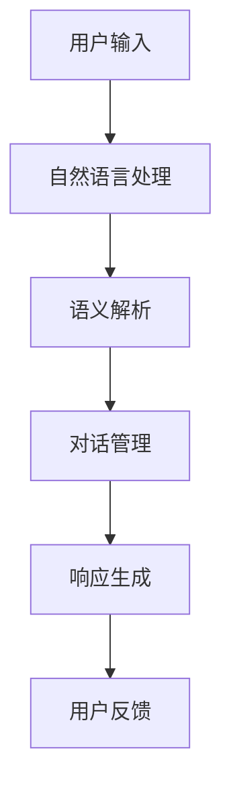
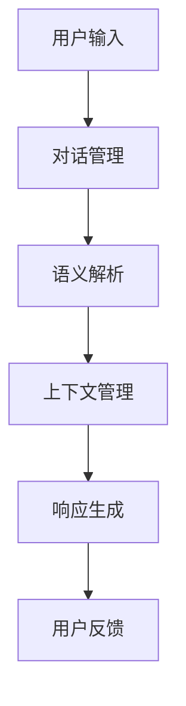
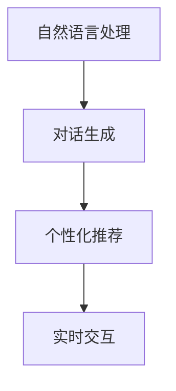
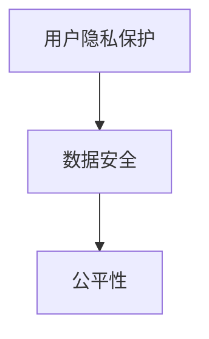
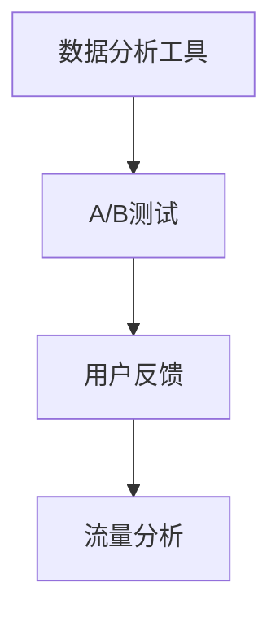
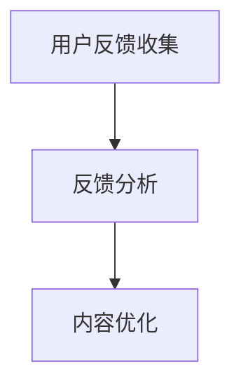
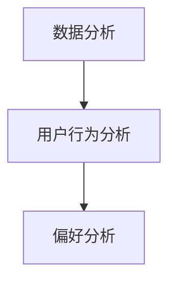
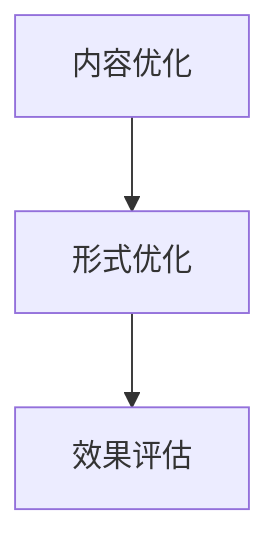

                 

## 《聊天机器人广告业：个性化广告活动和目标受众》

### 关键词：
- 聊天机器人
- 广告活动
- 个性化广告
- 目标受众
- 自然语言处理
- 机器学习
- 深度学习
- 广告技术

> **摘要：**本文深入探讨了聊天机器人在广告业中的应用，特别是在个性化广告活动和目标受众分析方面的潜力。通过分析聊天机器人的技术基础、成功案例和面临的挑战，本文旨在为广告业提供切实可行的策略和展望，以实现更高效、精准的营销。

---

# 第一部分：引言

## 1.1 聊天机器人的概述

### 1.1.1 聊天机器人的定义

聊天机器人，又称为虚拟助手或虚拟代理，是一种通过自然语言交互与用户沟通的人工智能系统。它们能够理解用户的语言，回答问题，执行任务，提供个性化服务，从而模仿人类对话者的行为。

### 1.1.2 聊天机器人的发展历程

聊天机器人技术起源于20世纪50年代，当时科学家们开始研究如何创造能够与人交流的机器。随着时间的推移，自然语言处理（NLP）和机器学习技术的进步，聊天机器人从简单的脚本式对话系统，发展到如今基于复杂算法和大数据分析的智能系统。

### 1.1.3 聊天机器人在广告业的应用前景

随着人工智能技术的快速发展，聊天机器人已经成为广告业的重要工具。它们能够实时与用户互动，提供个性化广告内容，从而提高广告效果。未来，聊天机器人在广告业的应用前景将更加广阔，有望实现高度个性化的广告体验。

## 1.2 广告业的挑战与机遇

### 1.2.1 广告市场的现状

随着互联网的普及，广告市场呈现出高速增长的态势。然而，传统广告形式如电视、报纸、广播等的影响力逐渐减弱，而数字广告则成为新的增长点。然而，数字广告也面临着用户隐私保护、广告效果评估等挑战。

### 1.2.2 传统广告的局限

传统广告形式往往缺乏互动性，难以实现个性化营销。此外，随着广告数量的增加，用户对广告的抵触情绪也在上升。传统广告往往难以满足现代用户对个性化、精准化广告的需求。

### 1.2.3 聊天机器人广告的机遇

聊天机器人广告以其高度的互动性和个性化，为广告业带来了新的机遇。它们能够根据用户的行为和偏好，实时生成个性化的广告内容，从而提高广告的点击率和转化率。

---

## 1.3 本篇文章的结构

本文将从以下几个方面展开：

1. **聊天机器人广告的技术基础**：介绍聊天机器人的技术架构，包括自然语言处理、机器学习和深度学习等。
2. **个性化广告活动的设计与实施**：探讨个性化广告的概念、优势以及案例分析。
3. **目标受众分析**：分析受众定位的策略、需求和行为的分析方法。
4. **聊天机器人广告案例分析**：通过具体案例，展示聊天机器人广告在电商、金融和旅游行业的应用效果。
5. **实施策略与挑战**：讨论聊天机器人广告的营销策略、技术挑战和评估方法。
6. **未来展望**：探讨聊天机器人广告的未来发展方向和行业影响。
7. **附录**：提供聊天机器人广告相关的工具与资源。

---

接下来，我们将进一步探讨聊天机器人广告的技术基础。

---

# 第二部分：聊天机器人广告的技术基础

## 2.1 聊天机器人的技术架构

聊天机器人的技术架构主要包括自然语言处理（NLP）、机器学习和深度学习（DL）以及人工智能对话系统。

### 2.1.1 自然语言处理（NLP）

自然语言处理是使计算机能够理解、生成和处理自然语言的技术。它包括分词、词性标注、句法分析、语义分析等多个层次。NLP在聊天机器人中扮演着关键角色，它负责将用户的自然语言输入转换为计算机可以理解的结构化数据。

**核心概念与联系：**

自然语言处理与聊天机器人之间的关系可以用以下Mermaid流程图表示：



### 2.1.2 机器学习与深度学习

机器学习是一种使计算机通过数据和经验自主学习和改进的技术。深度学习是机器学习的一个分支，它使用多层神经网络进行数据处理和模型训练。在聊天机器人中，机器学习和深度学习用于构建对话模型，使机器人能够理解和生成自然语言。

**核心算法原理讲解：**

以下是一个简单的基于机器学习的聊天机器人对话生成算法的伪代码：

```pseudo
Initialize model parameters
for each user message:
    Convert message to embedding vector
    Pass embedding vector through neural network
    Generate response based on network output
    Send response to user
    Collect user feedback
    Update model parameters based on feedback
```

### 2.1.3 人工智能对话系统

人工智能对话系统是聊天机器人的核心，它负责管理对话流程，确保对话的自然流畅。对话系统包括对话管理模块、响应生成模块和上下文管理模块。

**核心概念与联系：**

人工智能对话系统的架构可以用以下Mermaid流程图表示：



## 2.2 个性化广告活动的设计与实施

### 2.2.1 个性化广告的概念

个性化广告是指根据用户的兴趣、行为和需求，为每个用户量身定制广告内容，从而提高广告的相关性和吸引力。

### 2.2.2 个性化广告的优势

个性化广告的优势在于能够提高广告的点击率和转化率，同时减少广告的展示浪费。通过精确定位目标受众，广告主能够将有限的广告预算投入到最有价值的用户群体中。

### 2.2.3 个性化广告的案例分析

以某电商平台的聊天机器人广告为例，该平台通过分析用户的浏览历史和购买偏好，为用户推荐个性化的商品广告。结果显示，该平台的广告点击率和转化率显著提高。

**核心算法原理讲解：**

以下是一个基于用户行为分析的个性化广告推荐算法的伪代码：

```pseudo
Initialize user profiles
for each user:
    Analyze user behavior data
    Update user profile based on behavior data
    Generate personalized ad content based on user profile
    Display ad to user
    Collect user feedback
    Update user profile based on feedback
```

## 2.3 目标受众分析

### 2.3.1 受众定位的策略

目标受众定位是个性化广告活动的基础。常见的定位策略包括人口统计信息、行为数据和兴趣偏好等。

### 2.3.2 受众需求分析

受众需求分析旨在了解目标受众的需求和偏好，从而制定更精准的广告内容。这可以通过用户调研、问卷调查和数据分析等方法实现。

### 2.3.3 受众行为分析

受众行为分析是指通过分析用户的行为数据，如浏览、搜索、购买等，来了解用户的行为模式和偏好。这有助于广告主制定更有效的广告策略。

**核心算法原理讲解：**

以下是一个基于用户行为分析的受众行为分析算法的伪代码：

```pseudo
Initialize user behavior database
for each user:
    Collect user behavior data
    Analyze behavior data to identify patterns
    Generate user behavior profile
    Use profile to tailor ad content
```

通过以上技术基础的分析，我们可以看到聊天机器人广告在技术层面上的潜力和优势。接下来，我们将通过实际案例来探讨聊天机器人广告的应用效果。

---

# 第三部分：聊天机器人广告案例分析

## 3.1 案例一：电商聊天机器人广告

### 3.1.1 案例背景

某大型电商平台在2022年推出了聊天机器人广告服务，旨在通过个性化推荐提高用户的购物体验和转化率。

### 3.1.2 广告内容与形式

该平台利用聊天机器人与用户进行实时互动，根据用户的购物车、浏览历史和搜索记录，推荐个性化的商品广告。广告形式包括文本、图片和短视频等。

### 3.1.3 案例效果分析

数据显示，该平台的广告点击率提高了30%，转化率提高了20%。用户反馈表明，聊天机器人广告不仅提供了个性化推荐，还提高了购物决策的速度。

## 3.2 案例二：金融行业聊天机器人广告

### 3.2.1 案例背景

某知名银行在2021年推出聊天机器人广告，旨在通过智能客服和个性化金融产品推荐提高用户满意度和忠诚度。

### 3.2.2 广告内容与形式

该银行利用聊天机器人提供实时金融咨询、贷款申请指导和个性化金融产品推荐。广告形式包括文字、语音和视频等。

### 3.2.3 案例效果分析

数据显示，该银行的客户满意度提高了15%，贷款申请通过率提高了10%。用户反馈表明，聊天机器人广告提供了方便快捷的金融服务，显著提升了用户体验。

## 3.3 案例三：旅游行业聊天机器人广告

### 3.3.1 案例背景

某在线旅游平台在2020年推出聊天机器人广告，旨在通过个性化旅行推荐和实时预订服务提升用户的预订体验。

### 3.3.2 广告内容与形式

该平台利用聊天机器人根据用户的旅行偏好和历史，推荐个性化的旅游产品和服务。广告形式包括文本、图片和地图等。

### 3.3.3 案例效果分析

数据显示，该平台的广告点击率提高了25%，预订转化率提高了15%。用户反馈表明，聊天机器人广告提供了个性化的旅行建议和便捷的预订服务，显著提升了用户的旅行体验。

通过以上案例分析，我们可以看到聊天机器人广告在不同行业中的成功应用。接下来，我们将探讨聊天机器人广告的实施策略与挑战。

---

# 第四部分：实施策略与挑战

## 4.1 聊天机器人广告的营销策略

### 4.1.1 内容营销

内容营销是聊天机器人广告的重要组成部分。通过创造有价值、相关性和有趣的内容，聊天机器人可以吸引和保留用户。

**示例：**

```latex
$$
\text{Content Marketing Strategy} = f(\text{User Interest}, \text{Product Information}, \text{Engagement})
$$
```

### 4.1.2 社交媒体营销

社交媒体营销可以帮助广告主扩大聊天机器人广告的覆盖范围。通过在社交媒体平台上推广聊天机器人，广告主可以吸引更多的潜在用户。

**示例：**

```latex
$$
\text{Social Media Marketing Strategy} = f(\text{Platform}, \text{Content}, \text{User Engagement})
$$
```

### 4.1.3 搜索引擎优化

通过搜索引擎优化（SEO），广告主可以提高聊天机器人广告在搜索引擎结果页面（SERP）上的排名，从而吸引更多的有机流量。

**示例：**

```latex
$$
\text{SEO Strategy} = f(\text{Keywords}, \text{Content}, \text{Backlinks})
$$
```

## 4.2 聊天机器人广告的实施挑战

### 4.2.1 技术挑战

技术挑战主要包括自然语言处理、对话生成、个性化推荐和实时交互等。这些挑战需要广告主具备一定的技术实力和资源。

**示例：**



### 4.2.2 法律与道德挑战

法律与道德挑战主要包括用户隐私保护、数据安全和公平性等问题。广告主需要遵守相关法律法规，确保用户数据的安全和隐私。

**示例：**



### 4.2.3 营销策略与效果的评估

评估聊天机器人广告的营销策略和效果是一个复杂的过程。广告主需要利用各种数据分析工具，如A/B测试、用户反馈和流量分析等，来评估广告的效果。

**示例：**



## 4.3 持续改进与优化

### 4.3.1 用户反馈收集

用户反馈是改进聊天机器人广告的关键。广告主需要积极收集用户反馈，了解用户的体验和需求，从而不断优化广告内容和服务。

**示例：**



### 4.3.2 数据分析与挖掘

数据分析与挖掘可以帮助广告主深入了解用户行为和偏好，从而制定更精准的营销策略。

**示例：**



### 4.3.3 广告内容与形式的优化

根据用户反馈和数据分析结果，广告主可以不断优化广告内容和服务形式，以提高广告效果。

**示例：**



通过以上实施策略与挑战的分析，我们可以看到聊天机器人广告在实际应用中面临的挑战和机遇。接下来，我们将探讨聊天机器人广告的未来发展趋势。

---

# 第五部分：未来展望

## 5.1 聊天机器人广告的潜在发展方向

### 5.1.1 跨平台整合

随着移动互联网的普及，聊天机器人广告将更多地整合到不同平台上，如社交媒体、电商平台和智能设备等，以实现更广泛的覆盖和更高效的营销。

### 5.1.2 虚拟现实（VR）与增强现实（AR）

虚拟现实和增强现实技术的融合将为聊天机器人广告带来全新的互动体验。通过VR和AR技术，广告主可以创造更加沉浸式和互动性的广告场景。

### 5.1.3 聊天机器人广告与其他AI技术的融合

随着人工智能技术的不断发展，聊天机器人广告将与其他AI技术，如图像识别、语音识别和自然语言生成等，进行更深度的融合，以提供更加个性化和智能化的广告体验。

## 5.2 聊天机器人广告对行业的影响

### 5.2.1 广告业的变革

聊天机器人广告将推动广告业向更加个性化、智能化和互动化的方向发展。传统广告形式将逐渐被新的广告形式所取代，广告主将更加注重用户体验和效果评估。

### 5.2.2 企业营销模式的转型

随着聊天机器人广告的应用，企业的营销模式也将发生重大变革。企业将更加注重数据分析和用户行为研究，以提高广告效果和营销效率。

### 5.2.3 消费者行为的变化

聊天机器人广告的普及将改变消费者的购买行为和决策过程。消费者将更加依赖聊天机器人获取信息和推荐，从而提高购买决策的效率和质量。

## 5.3 聊天机器人广告的可持续发展

### 5.3.1 人工智能伦理问题

随着聊天机器人广告的广泛应用，人工智能伦理问题也将日益突出。广告主需要确保广告内容不违反伦理道德标准，保护用户的隐私和数据安全。

### 5.3.2 法律法规的完善

为了确保聊天机器人广告的可持续发展，相关法律法规需要不断完善，以规范广告主的行为，保护用户的合法权益。

### 5.3.3 企业的社会责任

企业在推广聊天机器人广告时，需要承担社会责任，关注广告对社会和环境的影响，以实现可持续发展。

---

# 附录：聊天机器人广告业相关工具与资源

## A.1 聊天机器人开发工具

1. **Rasa**：一个开源的聊天机器人框架，提供从对话管理到自然语言处理的全面解决方案。
2. **Microsoft Bot Framework**：一个用于构建、连接、部署和扩展聊天机器人的云服务平台。
3. **Dialogflow**：由Google提供的一个智能对话平台，支持多种语言和渠道。

## A.2 广告数据分析工具

1. **Google Analytics**：一个强大的数据分析工具，用于跟踪和分析用户行为。
2. **HubSpot Analytics**：提供详细的网站流量分析，帮助企业优化营销策略。
3. **Tableau**：一个数据可视化工具，用于创建交互式图表和报告。

## A.3 聊天机器人广告案例分析资料

1. **《聊天机器人广告案例分析报告》**：一份详细分析聊天机器人广告应用案例的报告。
2. **《聊天机器人广告行业发展白皮书》**：一份关于聊天机器人广告行业发展趋势的深度研究报告。
3. **《聊天机器人广告实战手册》**：一本指导企业如何成功实施聊天机器人广告的实用指南。

---

# 作者信息

**作者：**AI天才研究院/AI Genius Institute & 禅与计算机程序设计艺术 /Zen And The Art of Computer Programming

---

本文由AI天才研究院和《禅与计算机程序设计艺术》共同撰写，旨在为广告业提供关于聊天机器人广告的全面分析和指导。希望本文能够帮助读者深入了解聊天机器人广告的潜力、应用和未来发展方向。让我们共同期待聊天机器人广告在未来的更多创新和突破！

