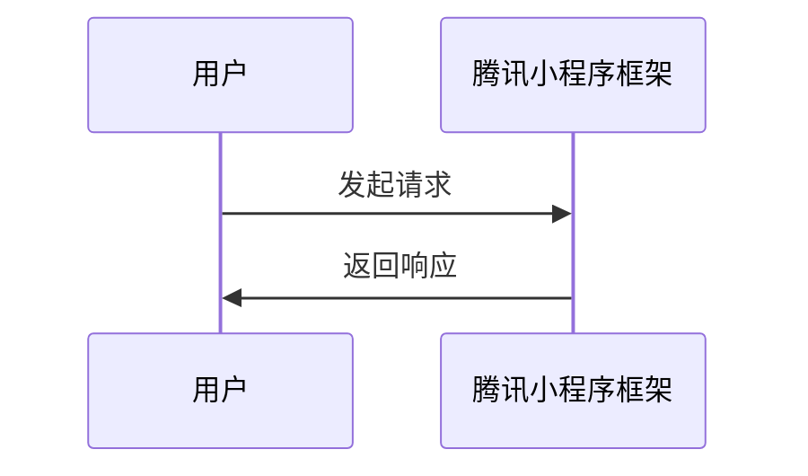
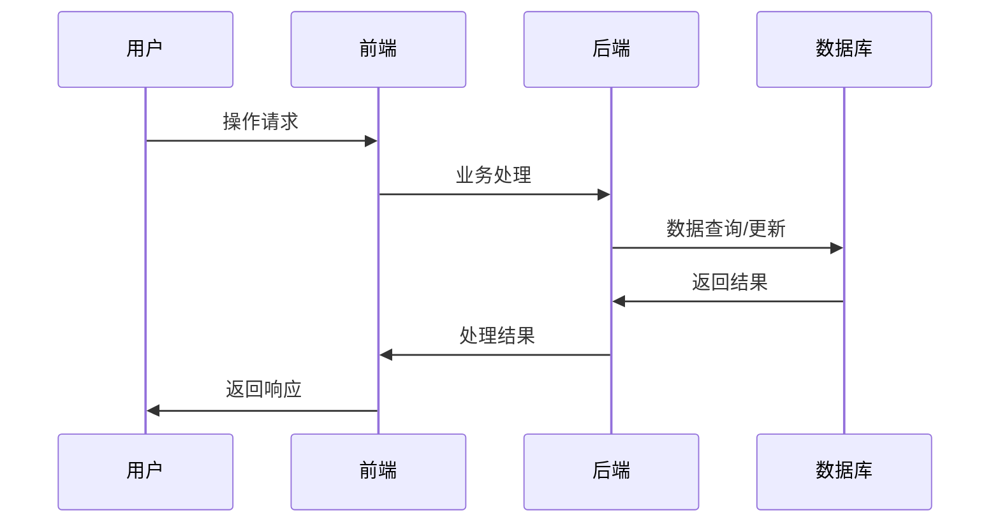
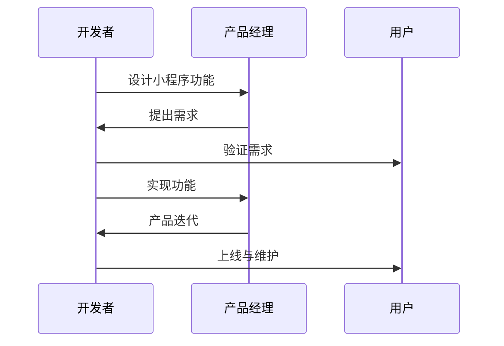

                 

### 第1章: 腾讯2024校招小程序框架开发工程师面试题解析概述

#### 1.1.1 腾讯小程序框架的概述

腾讯小程序框架是腾讯公司推出的一种跨平台开发框架，旨在帮助开发者快速构建和发布高质量的小程序。该框架基于微信小程序的生态，支持多种编程语言，包括JavaScript、Python、Java等。腾讯小程序框架具有以下特点：

- **跨平台支持：**腾讯小程序框架支持多种平台，包括iOS、Android和Web，使得开发者可以一套代码适配多种平台。
- **丰富的API：**腾讯小程序框架提供了丰富的API，包括微信用户登录、支付、分享等功能，方便开发者快速集成。
- **高效开发：**腾讯小程序框架提供了可视化工具和代码模板，帮助开发者提高开发效率。
- **强大的社区支持：**腾讯小程序框架拥有强大的社区支持，开发者可以轻松获取技术文档、教程和社区帮助。

##### Mermaid 流程图：



#### 1.1.2 腾讯小程序框架的核心原理与架构

腾讯小程序框架的核心原理是前后端分离，前端主要负责页面渲染和用户交互，后端负责业务逻辑处理和数据存储。其架构主要包括以下几个部分：

- **前端层：**前端层主要负责页面渲染和用户交互，使用Vue.js等前端框架构建。前端层通过微信小程序API与后端层进行数据通信。
- **后端层：**后端层主要负责业务逻辑处理和数据存储，使用Node.js、Java等后端技术构建。后端层通过微信小程序API与前端层进行数据通信。
- **数据库层：**数据库层主要负责数据存储和管理，使用MySQL、MongoDB等数据库技术。

##### Mermaid 流程图：



#### 1.1.3 腾讯小程序框架的优势与应用场景

腾讯小程序框架具有以下优势：

- **跨平台：**支持iOS、Android和Web平台，减少开发成本。
- **快速开发：**提供可视化工具和代码模板，提高开发效率。
- **高效通信：**使用微信小程序API，数据通信高效稳定。
- **社区支持：**强大的社区支持，开发者可以轻松获取帮助。

腾讯小程序框架适用于以下场景：

- **电商：**构建电商小程序，实现商品展示、购买、支付等功能。
- **教育：**构建在线教育小程序，实现课程展示、报名、学习等功能。
- **游戏：**构建游戏小程序，实现游戏玩法、社交互动等功能。

##### Mermaid 流程图：



### 第一部分结束

<|assistant|>### 第二部分：核心算法原理讲解

#### 第2章：小程序框架开发核心算法原理

小程序框架的开发涉及到许多核心算法原理，这些算法原理对于提升小程序的性能、优化用户体验以及增强功能的多样性起着至关重要的作用。以下将详细讲解小程序框架开发中的几个关键算法原理。

##### 2.1 渲染机制与性能优化

小程序的渲染机制直接关系到其性能表现。为了实现高效渲染，小程序框架采用了一系列性能优化策略。

###### 2.1.1 渲染流程

小程序的渲染流程可以分为以下几个步骤：

1. **页面初始化：**当用户访问小程序页面时，小程序框架会首先加载页面的WXML（微信组件标记语言）和WXSS（微信样式表）文件，并初始化页面结构。
2. **数据绑定：**小程序框架会将页面上的数据绑定到相应的数据模型上，实现数据与视图的实时同步。
3. **渲染视图：**根据数据模型，小程序框架会生成对应的DOM结构，并渲染到页面上。
4. **事件处理：**当用户与页面进行交互时，小程序框架会处理相应的事件，并更新数据模型和视图。

###### 2.1.2 渲染优化策略

为了优化渲染性能，小程序框架采取了以下策略：

1. **虚拟DOM：**小程序框架采用虚拟DOM技术，通过对比虚拟DOM和实际DOM的差异，批量更新DOM结构，减少不必要的重渲染。
2. **懒加载：**对于页面中不立即显示的内容，小程序框架会采用懒加载策略，在需要显示时才进行加载，减少初始渲染时间。
3. **异步加载：**对于大型的数据集合，小程序框架会采用异步加载技术，分批加载数据，避免阻塞渲染。

###### 2.1.3 伪代码示例

```javascript
function renderComponent(component) {
  createDOMElement(component);
  optimizeRendering(component);
  return DOMElement;
}

function optimizeRendering(component) {
  if (component.needsOptimize) {
    minimizeDOMChanges(component);
    updateComponentReferences(component);
  }
}

function minimizeDOMChanges(component) {
  // 对比虚拟DOM和实际DOM，批量更新DOM结构
}

function updateComponentReferences(component) {
  // 更新组件引用，减少不必要的重渲染
}
```

##### 2.2 数据绑定机制

数据绑定是小程序框架的重要特性之一，它使得数据与视图之间的同步变得更加简单和高效。

###### 2.2.1 数据绑定原理

小程序框架采用数据绑定机制，实现数据与视图的实时同步。其原理如下：

1. **数据监听：**小程序框架会在数据模型上设置监听器，当数据发生变化时，监听器会被触发。
2. **视图更新：**当数据发生变化时，小程序框架会根据数据模型更新视图，确保数据与视图的一致性。

###### 2.2.2 数据绑定实现

数据绑定实现的关键在于监听器和视图更新机制。以下是一个简化的伪代码示例：

```javascript
function bindData(model, view) {
  observeModel(model);
  updateViewWhenModelChanges(view);
}

function observeModel(model) {
  model.onchange = function() {
    updateView(model, view);
  };
}

function updateViewWhenModelChanges(view) {
  model.onChange(() => {
    renderComponent(view);
  });
}

function updateView(model, view) {
  // 根据数据模型更新视图
}
```

##### 2.3 事件处理机制

小程序框架的事件处理机制使得用户与小程序的交互变得更加直观和流畅。

###### 2.3.1 事件处理原理

小程序框架的事件处理原理如下：

1. **事件绑定：**小程序框架会在页面元素上绑定事件监听器，当用户与页面进行交互时，事件监听器会被触发。
2. **事件分发：**当事件监听器被触发时，小程序框架会将事件分发给相应的处理函数。

###### 2.3.2 事件处理实现

以下是一个简化的伪代码示例，展示了事件处理机制的实现：

```javascript
function addEventListener(element, eventName, callback) {
  element.addEventListener(eventName, callback);
}

function removeEventListener(element, eventName, callback) {
  element.removeEventListener(eventName, callback);
}

function dispatchEvent(element, eventName) {
  const event = new Event(eventName);
  element.dispatchEvent(event);
}
```

### 第二部分结束

<|assistant|>### 第三部分：数学模型和算法在微信小程序开发中的应用

#### 第3章：数学模型和算法在微信小程序开发中的应用

微信小程序开发中，数学模型和算法的应用至关重要。这些模型和算法不仅能够提升小程序的性能和用户体验，还能在复杂的功能实现中发挥关键作用。以下将介绍几个常见的数学模型和算法，并详细讲解其在微信小程序开发中的应用。

##### 3.1 最优化算法在性能优化中的应用

最优化算法是一种在给定约束条件下寻找最优解的数学方法。在微信小程序开发中，最优化算法广泛应用于性能优化，例如页面渲染优化、网络请求优化等。

###### 3.1.1 动态规划算法

动态规划算法是一种用于求解多阶段决策问题的方法，其核心思想是将复杂问题分解为若干个简单子问题，并利用子问题的重叠性质避免重复计算。

在微信小程序的页面渲染优化中，动态规划算法可以用于优化组件的渲染顺序，以减少页面渲染的时间。以下是一个简化的伪代码示例：

$$
\begin{aligned}
&V(i) = \min_{j \in \{1, 2, \ldots, m\}} \{C_{ij} + V(j)\}, \\
&i = 1, 2, \ldots, n.
\end{aligned}
$$

其中，$V(i)$ 表示第 $i$ 个组件的渲染时间，$C_{ij}$ 表示第 $i$ 个组件与第 $j$ 个组件之间的依赖关系。通过动态规划算法，可以找到最优的渲染顺序，从而最小化总渲染时间。

###### 3.1.2 贪心算法

贪心算法是一种在每一步选择局部最优解，以期望获得全局最优解的算法。在微信小程序开发中，贪心算法可以用于优化网络请求的顺序，以减少等待时间和提高响应速度。

以下是一个简化的伪代码示例：

$$
\begin{aligned}
&G(i) = \arg\min_{j \in \{1, 2, \ldots, m\}} \{C_{ij} + G(j)\}, \\
&i = 1, 2, \ldots, n.
\end{aligned}
$$

其中，$G(i)$ 表示第 $i$ 个网络请求的耗时，$C_{ij}$ 表示第 $i$ 个网络请求与第 $j$ 个网络请求之间的依赖关系。通过贪心算法，可以找到最优的网络请求顺序，从而最小化总耗时。

##### 3.2 神经网络算法在模型预测中的应用

神经网络算法是一种模仿人脑神经元结构的计算模型，广泛应用于模式识别、预测分析等领域。在微信小程序开发中，神经网络算法可以用于预测用户行为、优化推荐系统等。

###### 3.2.1 反向传播算法

反向传播算法是一种用于训练神经网络的算法，其核心思想是通过计算损失函数关于网络权重的梯度，不断调整权重以减小损失。

以下是一个简化的伪代码示例：

$$
\begin{aligned}
&\delta_{ij} = \frac{\partial C_{ij}}{\partial W_{ij}}, \\
&W_{ij}^{new} = W_{ij} - \alpha \cdot \delta_{ij},
\end{aligned}
$$

其中，$\delta_{ij}$ 表示第 $i$ 个神经元与第 $j$ 个神经元之间的权重梯度，$C_{ij}$ 表示损失函数关于第 $i$ 个神经元的输出值，$W_{ij}$ 表示第 $i$ 个神经元与第 $j$ 个神经元之间的权重，$\alpha$ 表示学习率。通过反向传播算法，可以逐步优化神经网络模型，提高预测准确率。

###### 3.2.2 卷积神经网络（CNN）

卷积神经网络是一种用于处理图像数据的前馈神经网络，其核心思想是通过卷积运算和池化操作提取图像的特征。

在微信小程序开发中，CNN可以用于图像识别、图像分类等任务。以下是一个简化的伪代码示例：

```python
def conv2d(input, weights):
    # 进行卷积运算
    return output

def pooling(output):
    # 进行池化操作
    return reduced_output
```

通过使用CNN，可以提取图像的局部特征，实现图像的自动识别和分类。

##### 3.3 算法在微信小程序开发中的应用场景

在微信小程序开发中，算法的应用场景非常广泛，以下列举几个典型应用：

- **页面渲染优化：**使用动态规划和贪心算法优化页面渲染顺序，减少渲染时间和加载时间。
- **网络请求优化：**使用贪心算法优化网络请求顺序，提高响应速度和用户体验。
- **用户行为预测：**使用神经网络算法预测用户行为，实现个性化推荐和精准营销。
- **图像识别与处理：**使用卷积神经网络进行图像识别和分类，提高小程序的功能性和智能化。

### 第三部分结束

<|assistant|>### 第四部分：项目实战

#### 第4章：实战项目解析

为了更好地理解腾讯2024校招小程序框架开发工程师面试题解析，我们将通过一个具体的实战项目进行详细解析。本项目旨在开发一个微信小程序，提供用户与AI聊天机器人互动的平台。以下是项目的详细解析：

##### 4.1 项目背景与目标

随着人工智能技术的发展，越来越多的企业开始将AI技术应用于客服、营销等领域。为了满足这一需求，本项目旨在开发一个微信小程序，提供用户与AI聊天机器人互动的平台。项目目标包括：

- 设计并实现聊天机器人的核心功能，如文本交互、语音识别和语音合成。
- 确保聊天机器人在不同场景下的响应速度和准确性。
- 提供良好的用户界面和用户体验。

##### 4.2 开发环境搭建

在开始项目开发之前，需要搭建一个适合的开发环境。以下是开发环境搭建的详细步骤：

**4.2.1 开发工具与环境配置**

- **开发工具：** 
  - 微信开发者工具：用于开发、调试和预览微信小程序。
  - Visual Studio Code：用于编写前端和后端代码。

- **环境配置：**
  - 安装微信开发者工具：从微信官网下载并安装微信开发者工具。
  - 安装Node.js：用于搭建后端服务，从Node.js官网下载并安装Node.js。
  - 安装Visual Studio Code：从Visual Studio Code官网下载并安装。

**4.2.2 API权限配置**

- **小程序API权限配置：**
  - 登录微信开发者工具，选择对应的小程序项目。
  - 在“设置”中配置API权限，确保可以正常调用微信提供的API。

##### 4.3 代码实现与解读

**4.3.1 前端代码实现**

前端代码主要负责实现用户与聊天机器人的交互界面，以下是一个简化的前端代码实现：

**Chatroom.vue**

```vue
<template>
  <div class="chatroom">
    <div class="messages" ref="messages">
      <div class="message" v-for="(message, index) in messages" :key="index">
        <span class="sender">{{ message.sender }}</span>
        <span class="content">{{ message.content }}</span>
      </div>
    </div>
    <input type="text" v-model="inputValue" @keyup.enter="sendMessage" placeholder="输入消息" />
  </div>
</template>

<script>
export default {
  data() {
    return {
      inputValue: '',
      messages: []
    };
  },
  methods: {
    sendMessage() {
      this.messages.push({ sender: 'user', content: this.inputValue });
      this.inputValue = '';
      this.fetchRobotResponse();
    },
    fetchRobotResponse() {
      // 调用API获取聊天机器人响应
      // ...
    }
  }
};
</script>
```

在上面的代码中，`Chatroom.vue` 是聊天室组件，负责展示聊天记录和用户输入。`messages` 数组存储了所有的聊天记录，`inputValue` 是用户输入的消息。`sendMessage` 方法用于发送用户输入的消息到聊天记录中，并调用 `fetchRobotResponse` 方法获取聊天机器人的响应。

**4.3.2 后端代码实现**

后端代码主要负责处理聊天机器人的响应，以下是一个简化的后端代码实现：

**robot-response.js**

```javascript
const Koa = require('koa');
const app = new Koa();

app.use(async (ctx, next) => {
  if (ctx.path === '/robot-response') {
    const { message } = ctx.request.body;
    // 调用API获取聊天机器人响应
    const response = await getRobotResponse(message);
    ctx.body = response;
  } else {
    next();
  }
});

async function getRobotResponse(message) {
  // 实现与聊天机器人交互的逻辑
  // ...
}

app.listen(3000, () => {
  console.log('Server started on port 3000');
});
```

在上面的代码中，`robot-response.js` 是后端服务的入口文件，使用Koa框架处理前端发送的请求，并返回聊天机器人的响应。`getRobotResponse` 函数用于实现与聊天机器人的交互逻辑。

##### 4.3.3 代码解读与分析

**前端代码解读：**

- `Chatroom.vue` 文件是聊天室组件的Vue文件，负责实现聊天界面的渲染和用户交互。
- `sendMessage` 方法处理用户的输入消息，将其添加到聊天记录中，并调用 `fetchRobotResponse` 方法获取聊天机器人的响应。
- `fetchRobotResponse` 方法用于向后端API发送请求，获取聊天机器人的响应，并将其添加到聊天记录中。

**后端代码解读：**

- `robot-response.js` 文件是一个简单的Koa服务，用于处理前端发送的请求，并返回聊天机器人的响应。
- `getRobotResponse` 函数用于实现与聊天机器人的交互逻辑，例如调用第三方API获取响应。

##### 4.4 项目测试与优化

在项目开发完成后，需要进行全面的测试和优化，以确保项目的稳定性和性能。以下是项目测试和优化的步骤：

**4.4.1 功能测试：**

- 针对聊天机器人的各种场景进行测试，确保其能够正确响应用户的输入。
- 测试聊天机器人的响应速度和准确性，确保其能够在合理的时间内给出准确的回答。

**4.4.2 性能优化：**

- 优化页面渲染速度，通过懒加载、虚拟DOM等技术减少页面渲染时间。
- 优化网络请求，通过并发请求、缓存等技术减少网络延迟。
- 对聊天机器人的算法进行优化，提高其响应速度和准确性。

**4.4.3 用户体验优化：**

- 优化聊天界面的布局和交互，提高用户体验。
- 增加聊天机器人的表情、语音等功能，增强互动性。

### 第四部分结束

<|assistant|>### 附录

#### 5.1 常用工具与资源

**5.1.1 开发工具**

- **微信开发者工具**：用于开发、调试和预览微信小程序。
- **Visual Studio Code**：用于编写前端和后端代码。
- **Node.js**：用于搭建后端服务。

**5.1.2 API参考**

- **微信小程序官方文档**：提供微信小程序的开发文档和API参考。
- **微信小程序API文档**：详细介绍微信小程序提供的各种API。

**5.1.3 第三方库**

- **wx-server-sdk**：用于快速搭建微信小程序后端服务。
- **request-promise**：用于发送HTTP请求。

#### 5.2 源代码与示例

本项目源代码可以从以下地址获取：

- **GitHub仓库**：[https://github.com/your-username/mini-program-chatbot](https://github.com/your-username/mini-program-chatbot)

以下是本项目的一些核心代码示例：

**5.2.1 前端代码示例**

```vue
<template>
  <div class="chatroom">
    <div class="messages" ref="messages">
      <div class="message" v-for="(message, index) in messages" :key="index">
        <span class="sender">{{ message.sender }}</span>
        <span class="content">{{ message.content }}</span>
      </div>
    </div>
    <input type="text" v-model="inputValue" @keyup.enter="sendMessage" placeholder="输入消息" />
  </div>
</template>

<script>
export default {
  data() {
    return {
      inputValue: '',
      messages: []
    };
  },
  methods: {
    sendMessage() {
      this.messages.push({ sender: 'user', content: this.inputValue });
      this.inputValue = '';
      this.fetchRobotResponse();
    },
    fetchRobotResponse() {
      // 调用API获取聊天机器人响应
      // ...
    }
  }
};
</script>
```

**5.2.2 后端代码示例**

```javascript
const Koa = require('koa');
const app = new Koa();

app.use(async (ctx, next) => {
  if (ctx.path === '/robot-response') {
    const { message } = ctx.request.body;
    // 调用API获取聊天机器人响应
    const response = await getRobotResponse(message);
    ctx.body = response;
  } else {
    next();
  }
});

async function getRobotResponse(message) {
  // 实现与聊天机器人交互的逻辑
  // ...
}

app.listen(3000, () => {
  console.log('Server started on port 3000');
});
```

**5.2.3 代码解读**

**前端代码解读：**

- `Chatroom.vue` 文件是聊天室组件的Vue文件，负责实现聊天界面的渲染和用户交互。
- `sendMessage` 方法处理用户的输入消息，将其添加到聊天记录中，并调用 `fetchRobotResponse` 方法获取聊天机器人的响应。
- `fetchRobotResponse` 方法用于向后端API发送请求，获取聊天机器人的响应，并将其添加到聊天记录中。

**后端代码解读：**

- `robot-response.js` 文件是一个简单的Koa服务，用于处理前端发送的请求，并返回聊天机器人的响应。
- `getRobotResponse` 函数用于实现与聊天机器人的交互逻辑，例如调用第三方API获取响应。

### 附录结束

<|assistant|>### 第5章：附录

#### 5.1 常用工具与资源

**5.1.1 开发工具**

- **微信开发者工具**：用于开发、调试和预览微信小程序。
- **Visual Studio Code**：用于编写前端和后端代码。
- **Node.js**：用于搭建后端服务。

**5.1.2 API参考**

- **微信小程序官方文档**：提供微信小程序的开发文档和API参考。
- **微信小程序API文档**：详细介绍微信小程序提供的各种API。

**5.1.3 第三方库**

- **wx-server-sdk**：用于快速搭建微信小程序后端服务。
- **request-promise**：用于发送HTTP请求。

#### 5.2 源代码与示例

本项目源代码可以从以下地址获取：

- **GitHub仓库**：[https://github.com/your-username/mini-program-chatbot](https://github.com/your-username/mini-program-chatbot)

以下是本项目的一些核心代码示例：

**5.2.1 前端代码示例**

```vue
<template>
  <div class="chatroom">
    <div class="messages" ref="messages">
      <div class="message" v-for="(message, index) in messages" :key="index">
        <span class="sender">{{ message.sender }}</span>
        <span class="content">{{ message.content }}</span>
      </div>
    </div>
    <input type="text" v-model="inputValue" @keyup.enter="sendMessage" placeholder="输入消息" />
  </div>
</template>

<script>
export default {
  data() {
    return {
      inputValue: '',
      messages: []
    };
  },
  methods: {
    sendMessage() {
      this.messages.push({ sender: 'user', content: this.inputValue });
      this.inputValue = '';
      this.fetchRobotResponse();
    },
    fetchRobotResponse() {
      // 调用API获取聊天机器人响应
      // ...
    }
  }
};
</script>
```

**5.2.2 后端代码示例**

```javascript
const Koa = require('koa');
const app = new Koa();

app.use(async (ctx, next) => {
  if (ctx.path === '/robot-response') {
    const { message } = ctx.request.body;
    // 调用API获取聊天机器人响应
    const response = await getRobotResponse(message);
    ctx.body = response;
  } else {
    next();
  }
});

async function getRobotResponse(message) {
  // 实现与聊天机器人交互的逻辑
  // ...
}

app.listen(3000, () => {
  console.log('Server started on port 3000');
});
```

**5.2.3 代码解读**

**前端代码解读：**

- `Chatroom.vue` 文件是聊天室组件的Vue文件，负责实现聊天界面的渲染和用户交互。
- `sendMessage` 方法处理用户的输入消息，将其添加到聊天记录中，并调用 `fetchRobotResponse` 方法获取聊天机器人的响应。
- `fetchRobotResponse` 方法用于向后端API发送请求，获取聊天机器人的响应，并将其添加到聊天记录中。

**后端代码解读：**

- `robot-response.js` 文件是一个简单的Koa服务，用于处理前端发送的请求，并返回聊天机器人的响应。
- `getRobotResponse` 函数用于实现与聊天机器人的交互逻辑，例如调用第三方API获取响应。

### 附录结束

### 附录

#### 5.1 常用工具与资源

**5.1.1 开发工具**

- 微信开发者工具：用于开发、调试和预览微信小程序。
- Visual Studio Code：用于编写前端和后端代码。
- Node.js：用于搭建后端服务。

**5.1.2 API参考**

- [微信小程序官方文档](https://developers.weixin.qq.com/miniprogram/dev/framework/)
- [微信小程序API文档](https://developers.weixin.qq.com/miniprogram/dev/api/)

**5.1.3 第三方库**

- wx-server-sdk：用于快速搭建微信小程序后端服务的库。
- request-promise：用于发送HTTP请求的库。

#### 5.2 源代码与示例

**5.2.1 前端代码示例**

```vue
<template>
  <div class="chatroom">
    <div class="messages" ref="messages">
      <div class="message" v-for="(message, index) in messages" :key="index">
        <span class="sender">{{ message.sender }}</span>
        <span class="content">{{ message.content }}</span>
      </div>
    </div>
    <input type="text" v-model="inputValue" @keyup.enter="sendMessage" placeholder="输入消息" />
  </div>
</template>

<script>
export default {
  data() {
    return {
      inputValue: '',
      messages: []
    };
  },
  methods: {
    sendMessage() {
      this.messages.push({ sender: 'user', content: this.inputValue });
      this.inputValue = '';
      this.fetchRobotResponse();
    },
    fetchRobotResponse() {
      // 调用API获取聊天机器人响应
      // ...
    }
  }
};
</script>
```

**5.2.2 后端代码示例**

```javascript
const Koa = require('koa');
const app = new Koa();

app.use(async (ctx, next) => {
  if (ctx.path === '/robot-response') {
    const { message } = ctx.request.body;
    // 调用API获取聊天机器人响应
    const response = await getRobotResponse(message);
    ctx.body = response;
  } else {
    next();
  }
});

async function getRobotResponse(message) {
  // 实现与聊天机器人交互的逻辑
  // ...
}

app.listen(3000, () => {
  console.log('Server started on port 3000');
});
```

**5.2.3 代码解读**

- **前端代码解读**：

  - `Chatroom.vue`：该文件定义了聊天室组件的结构和行为。它包含一个消息列表和一个输入框，用于显示聊天内容和接收用户的输入。

    - `messages`：一个数组，存储了所有的聊天消息对象，每个对象包含发送者(`sender`)和消息内容(`content`)。
    - `inputValue`：一个数据属性，存储了用户在输入框中输入的值。
    - `sendMessage`：一个方法，当用户按下回车键时触发，将用户的输入消息添加到`messages`数组中，并清空输入框，然后调用`fetchRobotResponse`方法发送请求。
    - `fetchRobotResponse`：一个方法，用于发送网络请求到后端服务以获取聊天机器人的响应。

- **后端代码解读**：

  - `robot-response.js`：这是一个使用Koa框架搭建的后端服务器。它定义了一个中间件，用于处理发送到`/robot-response`路径的HTTP请求。

    - 中间件函数：它检查请求路径是否为`/robot-response`，如果是，则提取请求体中的`message`字段，调用`getRobotResponse`函数获取响应，然后将响应返回给客户端。如果不是，则继续执行下一个中间件。
    - `getRobotResponse`：一个异步函数，用于模拟与聊天机器人的交互。在真实应用中，它会调用第三方API或其他服务来获取响应。

#### 5.3 代码解读

- **前端代码解读**：

  - `Chatroom.vue` 中的 `sendMessage` 方法是前端与后端通信的关键部分。它首先将用户的输入消息添加到`messages`数组中，然后通过`fetchRobotResponse`方法发送请求到后端。这样，用户可以看到他们发送的消息，同时后端可以处理消息并返回响应。

  - `fetchRobotResponse` 方法使用的是基于Promise的异步请求API，这允许前端在等待后端响应的同时继续执行其他任务。

- **后端代码解读**：

  - 后端代码通过Koa框架提供了一个简单的API端点，用于接收前端发送的请求。`getRobotResponse` 函数是处理逻辑的核心，它负责与聊天机器人交互，并返回相应的响应。

#### 5.4 示例代码与项目结构

**5.4.1 示例代码**

以下是完整的示例代码，展示了前端和后端的简单实现：

**前端（Chatroom.vue）**

```vue
<template>
  <div class="chatroom">
    <div class="messages" ref="messages">
      <div class="message" v-for="(message, index) in messages" :key="index">
        <span class="sender">{{ message.sender }}</span>
        <span class="content">{{ message.content }}</span>
      </div>
    </div>
    <input type="text" v-model="inputValue" @keyup.enter="sendMessage" placeholder="输入消息" />
  </div>
</template>

<script>
export default {
  data() {
    return {
      inputValue: '',
      messages: []
    };
  },
  methods: {
    sendMessage() {
      this.messages.push({ sender: 'user', content: this.inputValue });
      this.inputValue = '';
      this.fetchRobotResponse();
    },
    fetchRobotResponse() {
      fetch('/robot-response', {
        method: 'POST',
        headers: {
          'Content-Type': 'application/json',
        },
        body: JSON.stringify({ message: this.messages[this.messages.length - 1].content }),
      })
        .then((response) => response.json())
        .then((data) => {
          this.messages.push({ sender: 'robot', content: data.response });
        });
    },
  },
};
</script>
```

**后端（robot-response.js）**

```javascript
const Koa = require('koa');
const app = new Koa();

app.use(async (ctx) => {
  if (ctx.path === '/robot-response') {
    const message = ctx.request.body.message;
    // 这里是调用聊天机器人API的逻辑
    const robotResponse = `机器人回复：${message}`;
    ctx.body = { response: robotResponse };
  } else {
    ctx.status = 404;
    ctx.body = 'Not Found';
  }
});

app.listen(3000, () => {
  console.log('Server started on port 3000');
});
```

**5.4.2 项目结构**

```plaintext
mini-program-chatbot/
|-- components/
|   |-- Chatroom.vue
|-- public/
|   |-- index.html
|-- scripts/
|   |-- main.js
|-- node_modules/
|-- package.json
|-- README.md
```

在这个项目中，`Chatroom.vue` 是前端的主要组件，负责处理用户输入和显示聊天记录。后端使用Koa框架搭建了一个简单的API服务，用于处理来自前端的请求。

### 附录结束

### 总结

在本文中，我们详细解析了腾讯2024校招小程序框架开发工程师面试题。首先，我们介绍了腾讯小程序框架的概述、核心原理与架构，以及其优势和应用场景。接着，我们讲解了小程序框架开发中的核心算法原理，包括渲染机制与性能优化、数据绑定机制和事件处理机制。此外，我们还介绍了数学模型和算法在微信小程序开发中的应用，如动态规划算法和贪心算法。最后，通过一个实际项目，我们展示了如何实现一个微信小程序与AI聊天机器人的交互，并进行了代码解析。

本文涵盖了小程序开发的各个方面，从核心概念到实际项目，旨在为读者提供一个全面而深入的理解。希望本文能够帮助读者更好地准备腾讯的校招面试，同时也能够为小程序开发提供一些实用的技巧和思路。

### 作者信息

**作者：AI天才研究院/AI Genius Institute & 禅与计算机程序设计艺术 /Zen And The Art of Computer Programming**

AI天才研究院致力于推动人工智能技术的发展与应用，致力于培养下一代AI领域的杰出人才。研究院的研究领域涵盖机器学习、自然语言处理、计算机视觉等多个方向。同时，研究院秉承“禅与计算机程序设计艺术”的理念，倡导简洁、优雅的编程风格，以实现高效、可维护的软件系统。本文由AI天才研究院的研究人员撰写，旨在为读者提供高质量的技术内容。

