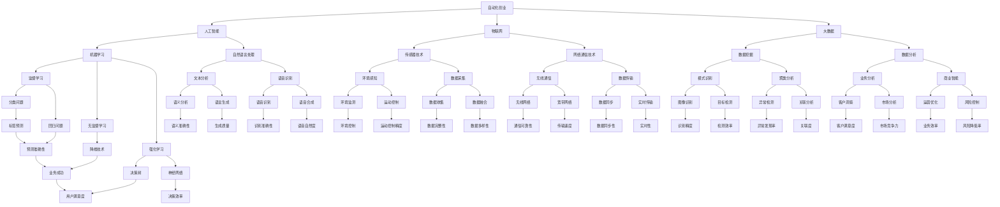

                 

## 自动化创业：未来商业的新范式

在当前快速发展的科技时代，自动化技术已经深刻地改变了各行各业的生产和运营方式。如今，自动化创业成为了一股不可忽视的新兴力量，正逐步成为未来商业的新范式。本文将围绕自动化创业这一主题，深入探讨其定义、意义、核心要素、应用领域以及成功案例，帮助读者全面了解和把握自动化创业的机遇与挑战。

### 关键词
- 自动化创业
- 商业创新
- 人工智能
- 物联网
- 大数据
- 创业流程

### 摘要
本文旨在探讨自动化创业这一未来商业的新范式。首先，我们将定义自动化创业的概念，并阐述其在现代商业环境中的重要性。接着，通过分析自动化创业的核心要素，如团队组织、商业模式和技术应用，来梳理创业的流程与方法。随后，我们将深入探讨人工智能、物联网和大数据在自动化创业中的应用，并通过具体案例来展示其成功实践。最后，本文将总结自动化创业的未来趋势与挑战，并提供相关的工具与资源，以及法律法规与政策的解读，以期为自动化创业提供全面的指导和支持。

## 目录大纲

### 第一部分：自动化创业概述

1. **第1章：自动化创业的定义与意义**
   - 1.1 自动化创业的定义
   - 1.2 自动化创业的意义
   - 1.3 自动化创业的机遇与挑战

2. **第2章：自动化创业的核心要素**
   - 2.1 创业团队的组织与协作
   - 2.2 商业模式的创新
   - 2.3 自动化技术与工具的应用

3. **第3章：自动化创业的流程与方法**
   - 3.1 创业机会的识别与评估
   - 3.2 创业计划的制定与执行
   - 3.3 创业风险的识别与应对

### 第二部分：自动化技术的应用

4. **第4章：人工智能在自动化创业中的应用**
   - 4.1 人工智能的基本概念
   - 4.2 人工智能的主要技术
   - 4.3 人工智能在自动化创业中的应用场景

5. **第5章：物联网在自动化创业中的应用**
   - 5.1 物联网的基本概念
   - 5.2 物联网的关键技术
   - 5.3 物联网在自动化创业中的应用

6. **第6章：大数据在自动化创业中的应用**
   - 6.1 大数据的基本概念
   - 6.2 大数据的主要技术
   - 6.3 大数据在自动化创业中的应用

### 第三部分：成功案例分析

7. **第7章：自动化创业的实践案例**
   - 7.1 案例一：智能物流平台
   - 7.2 案例二：智能家居系统
   - 7.3 案例三：在线教育平台

8. **第8章：自动化创业的未来趋势与挑战**
   - 8.1 自动化创业的未来趋势
   - 8.2 自动化创业的挑战与应对策略

### 附录

9. **附录A：自动化创业工具与资源**
   - A.1 自动化创业工具介绍
   - A.2 自动化创业资源推荐

10. **附录B：自动化创业项目实战**
    - B.1 项目实战概述
    - B.2 项目开发环境搭建
    - B.3 项目源代码实现与解读
    - B.4 项目代码解读与分析

11. **附录C：自动化创业相关法律法规与政策**
    - C.1 自动化创业法律法规概述
    - C.2 自动化创业相关政策解读

12. **附录D：自动化创业核心概念与联系 Mermaid 流程图**

13. **附录E：自动化创业核心算法原理讲解伪代码**

14. **附录F：自动化创业数学模型和公式讲解**

## 第1章：自动化创业的定义与意义

### 1.1 自动化创业的定义

自动化创业，是指利用自动化技术，特别是人工智能、物联网和大数据等先进技术，优化商业流程，提升运营效率，创造新商业模式的过程。它不仅仅是对传统产业的自动化改造，更是一种全新的商业范式，旨在通过技术手段实现商业价值的最大化。

自动化创业的核心在于“自动化”，即通过智能化、自动化的技术和工具，减少或消除人类在特定任务上的直接参与，从而提高生产效率、降低成本、提高质量。在这个过程中，创业团队需要具备创新思维和技术能力，能够敏锐地捕捉市场机会，设计并实现具有竞争力的自动化解决方案。

### 1.2 自动化创业的意义

自动化创业在现代社会具有深远的意义，主要表现在以下几个方面：

1. **提升效率与降低成本**：自动化技术能够大幅提高生产、运营和管理效率，减少人力成本，提高资源利用率。例如，通过智能化生产线，可以减少人工干预，提高生产速度和产品质量，同时降低能源消耗。

2. **创造新的商业模式**：自动化创业能够催生全新的商业模式，如共享经济、智能物流、在线教育等。这些新模式不仅改变了传统行业的运作方式，也为创业者提供了广阔的市场空间。

3. **增强竞争力**：自动化创业能够帮助企业提升竞争力，通过技术手段实现差异化优势。例如，智能家居系统可以通过个性化推荐和智能控制，提升用户体验，增强用户忠诚度。

4. **推动产业升级**：自动化创业有助于传统产业的升级和转型，推动产业链的智能化、网络化发展。这不仅有助于提高产业附加值，也有利于促进经济结构的优化和升级。

### 1.3 自动化创业的机遇与挑战

#### 机遇

1. **技术进步**：人工智能、物联网、大数据等前沿技术的快速发展，为自动化创业提供了强大的技术支持。这些技术不仅能够实现更高效、更智能的自动化，还能够拓展新的应用场景。

2. **市场需求**：随着消费者对便捷、高效、智能生活的需求不断增加，市场对自动化解决方案的需求也在持续增长。这为自动化创业提供了巨大的市场空间。

3. **政策支持**：各国政府纷纷出台政策，鼓励技术创新和创业。例如，中国提出的“新基建”战略，美国的“工业互联网”计划等，都为自动化创业提供了政策支持。

#### 挑战

1. **技术瓶颈**：尽管自动化技术在不断发展，但在某些领域仍存在技术瓶颈。例如，复杂场景下的自主决策、智能系统的稳定性等问题，仍需进一步研究和突破。

2. **人才短缺**：自动化创业需要具备跨学科知识的人才，如人工智能、物联网、大数据等领域的专家。然而，目前市场上这类人才相对短缺，这对自动化创业带来一定的挑战。

3. **法律与伦理问题**：自动化创业涉及到数据安全、隐私保护、伦理道德等问题。如何在实现商业价值的同时，确保社会利益，是一个亟待解决的问题。

### 1.4 小结

自动化创业作为一种新兴的商业范式，正逐渐改变着商业格局。通过深入理解和把握自动化创业的定义、意义和机遇与挑战，创业者可以更好地利用技术手段，实现商业价值的最大化。在下一章中，我们将进一步探讨自动化创业的核心要素，帮助读者更好地应对这一全新的商业浪潮。

## 第2章：自动化创业的核心要素

自动化创业的成功离不开几个核心要素，这些要素包括创业团队的组织与协作、商业模式的创新以及自动化技术与工具的应用。在本章中，我们将逐一探讨这些要素，帮助创业者构建起成功的自动化创业项目。

### 2.1 创业团队的组织与协作

一个成功的自动化创业项目离不开一个高效的团队。创业团队的组织与协作是确保项目顺利推进和实现目标的关键。以下是创业团队组织与协作的几个要点：

1. **明确的角色分工**：团队成员应明确各自的职责和角色，避免职责重叠和任务混乱。例如，项目经理负责项目整体规划和管理，技术团队负责技术研发和实现，市场团队负责市场推广和客户关系管理。

2. **跨学科的知识结构**：自动化创业涉及多个领域的技术，如人工智能、物联网、大数据等。因此，创业团队应具备跨学科的知识结构，包括技术专家、市场分析师、用户体验设计师等。

3. **高效的沟通机制**：团队成员之间的有效沟通是确保项目顺利进行的重要保障。可以通过定期会议、即时通讯工具等方式，保持团队成员之间的信息畅通，及时解决问题和调整计划。

4. **灵活的团队协作模式**：在自动化创业项目中，团队可能需要快速响应市场变化和技术进步。因此，团队应具备灵活的协作模式，能够快速调整资源和任务分配，以适应变化。

### 2.2 商业模式的创新

商业模式的创新是自动化创业的核心竞争力之一。在自动化技术的推动下，传统商业模式正面临前所未有的变革。以下是一些创新商业模式的策略：

1. **共享经济**：共享经济模式通过优化资源配置，提高资源利用率。例如，共享单车、共享汽车等，通过物联网技术实现车辆定位、调度和管理，降低用户出行成本，提高运营效率。

2. **订阅制**：订阅制模式通过提供持续的服务或产品，实现持续收入。例如，云服务提供商通过订阅模式，为用户提供持续的计算、存储等资源，降低用户初期投入成本。

3. **按需服务**：按需服务模式根据用户需求动态调整服务内容，提高用户满意度。例如，智能家居系统可以根据用户习惯和偏好，自动调整家居环境，提供个性化的服务。

4. **平台化**：平台化模式通过搭建生态系统，连接供需双方，实现价值共享。例如，电商平台通过搭建平台，连接消费者和商家，实现商品流通和交易。

### 2.3 自动化技术与工具的应用

自动化创业的核心在于技术，选择合适的技术和工具是确保项目成功的关键。以下是一些自动化技术与工具的应用：

1. **人工智能**：人工智能技术在自动化创业中具有广泛的应用前景，包括自然语言处理、计算机视觉、语音识别等。例如，智能家居系统可以通过语音识别技术实现语音控制，提高用户体验。

2. **物联网**：物联网技术可以实现设备之间的互联互通，提高运营效率。例如，智能工厂通过物联网技术，实现设备联网和数据共享，提高生产效率和质量。

3. **大数据**：大数据技术可以帮助创业者洞察市场趋势和用户需求，制定精准的商业策略。例如，在线教育平台可以通过大数据分析，了解用户学习行为和需求，提供个性化的学习内容。

4. **云计算**：云计算技术提供灵活、可扩展的计算资源，降低创业项目的初期投入。例如，创业者可以利用云计算平台，快速搭建开发环境，进行项目开发和测试。

### 2.4 小结

自动化创业的核心要素包括创业团队的组织与协作、商业模式的创新以及自动化技术与工具的应用。通过合理组织团队、创新商业模式和选择合适的技术工具，创业者可以更好地应对市场挑战，实现商业价值的最大化。在下一章中，我们将进一步探讨自动化创业的流程与方法，帮助创业者系统地规划和管理自动化创业项目。

## 第3章：自动化创业的流程与方法

自动化创业是一个复杂而系统的过程，涉及多个阶段和环节。本章将详细介绍自动化创业的流程与方法，包括创业机会的识别与评估、创业计划的制定与执行以及创业风险的识别与应对。

### 3.1 创业机会的识别与评估

创业机会的识别与评估是自动化创业的起点，也是至关重要的一步。创业者需要敏锐地捕捉市场动态，分析潜在的商业机会。以下是识别和评估创业机会的几个关键步骤：

1. **市场调研**：通过市场调研，了解市场需求、竞争格局、行业趋势等信息。市场调研可以通过问卷调查、访谈、竞争对手分析等方式进行。

2. **技术趋势分析**：分析前沿技术发展趋势，如人工智能、物联网、大数据等，判断哪些技术可能对行业产生重大影响。技术趋势分析可以参考科技报告、学术论文、行业会议等。

3. **用户需求分析**：深入了解目标用户的需求和痛点，识别潜在的市场机会。用户需求分析可以通过用户访谈、用户调研、社交媒体分析等方式进行。

4. **评估机会价值**：对识别出的创业机会进行评估，包括市场潜力、技术可行性、资源需求、竞争态势等方面。评估方法可以使用SWOT分析（优势、劣势、机会、威胁）等工具。

5. **机会优先级排序**：根据评估结果，对创业机会进行优先级排序，选择最具潜力和可行性的机会进行深入探索。

### 3.2 创业计划的制定与执行

在确定创业机会后，创业者需要制定详细的创业计划，以确保项目的顺利进行。创业计划应包括以下内容：

1. **项目目标**：明确项目的总体目标和具体目标，如市场占有率、盈利目标等。

2. **项目范围**：定义项目的范围和边界，明确项目涵盖的功能和业务领域。

3. **市场策略**：制定市场进入策略、推广计划、定价策略等，以吸引目标用户。

4. **技术路线**：规划技术实现的路线图，包括技术选型、开发计划、测试方案等。

5. **资源需求**：明确项目所需的资源，包括资金、人力、技术设备等。

6. **时间表**：制定项目的时间表，包括关键里程碑和交付时间。

7. **风险评估**：评估项目可能面临的风险，并制定应对策略。

创业计划的制定完成后，创业者需要按照计划逐步执行，确保每个阶段的目标得到实现。以下是执行创业计划的关键步骤：

1. **资源筹备**：根据计划需求，筹备项目所需的资源，包括资金、技术设备、人力资源等。

2. **团队组建**：根据项目需求，组建合适的团队，明确团队成员的职责和角色。

3. **技术开发**：按照技术路线图，进行技术开发和测试，确保技术实现的可行性和稳定性。

4. **市场推广**：根据市场策略，进行市场推广，提高品牌知名度，吸引目标用户。

5. **用户反馈**：收集用户反馈，优化产品和服务，提高用户满意度。

6. **持续迭代**：根据市场反馈和项目进展，持续迭代产品和服务，以适应市场变化和用户需求。

### 3.3 创业风险的识别与应对

创业过程中，风险是不可避免的。自动化创业项目面临的风险包括技术风险、市场风险、财务风险、法律风险等。以下是识别和应对创业风险的几个关键步骤：

1. **风险识别**：通过调研、分析、预测等方法，识别项目可能面临的风险。

2. **风险评估**：对识别出的风险进行评估，包括风险的可能性、影响程度等。

3. **风险应对策略**：制定应对策略，包括风险规避、风险转移、风险减轻等。

4. **风险管理**：建立风险管理体系，实时监控项目风险，确保风险在可控范围内。

5. **应急预案**：制定应急预案，应对可能发生的紧急情况，确保项目顺利进行。

### 3.4 小结

自动化创业的流程与方法包括创业机会的识别与评估、创业计划的制定与执行以及创业风险的识别与应对。通过系统地规划和执行，创业者可以更好地应对市场挑战，实现自动化创业的目标。在下一章中，我们将深入探讨自动化创业在技术领域的具体应用，帮助读者更好地理解和把握这一新兴的商业范式。

## 第4章：人工智能在自动化创业中的应用

### 4.1 人工智能的基本概念

人工智能（Artificial Intelligence, AI）是一门研究、开发和应用使计算机系统具备人类智能特性的技术的学科。人工智能的核心目标是通过模拟人类思维过程，实现计算机在感知、学习、推理、决策等方面的智能行为。以下是人工智能的一些基本概念：

1. **感知**：指计算机通过传感器或其他方式获取外部环境信息，如语音识别、图像识别等。

2. **学习**：指计算机通过数据分析和模式识别，自动改进自身性能，如机器学习、深度学习等。

3. **推理**：指计算机利用已有知识和信息，进行逻辑推断和决策，如自然语言处理、专家系统等。

4. **决策**：指计算机在复杂情境中，根据目标和约束条件，选择最佳行动方案，如决策树、神经网络等。

### 4.2 人工智能的主要技术

人工智能技术多种多样，以下介绍几种主要的人工智能技术：

1. **机器学习**：机器学习是一种让计算机通过数据学习并改进性能的方法。主要分为监督学习、无监督学习和强化学习。

   - **监督学习**：通过已知输入和输出数据，训练模型进行预测。例如，分类问题和回归问题。
   - **无监督学习**：不使用标注数据，通过自动发现数据中的模式和关联。例如，聚类分析和降维技术。
   - **强化学习**：通过与环境的交互，学习最优策略。例如，机器人导航、自动驾驶等。

2. **深度学习**：深度学习是一种基于多层神经网络的学习方法，能够自动提取特征并进行复杂任务处理。深度学习在图像识别、语音识别、自然语言处理等领域取得了显著成果。

3. **自然语言处理**：自然语言处理（Natural Language Processing, NLP）是人工智能的一个分支，旨在让计算机理解和生成人类语言。NLP技术包括词性标注、句法分析、语义分析、机器翻译等。

4. **计算机视觉**：计算机视觉（Computer Vision）是让计算机能够从图像或视频中提取有用信息的技术。计算机视觉的应用包括图像识别、目标检测、图像分割等。

### 4.3 人工智能在自动化创业中的应用场景

人工智能技术在自动化创业中具有广泛的应用，以下列举几个典型应用场景：

1. **智能物流**：通过人工智能技术，实现物流全流程的自动化管理。例如，利用计算机视觉技术进行货物识别和分拣，利用自然语言处理技术实现智能调度和路径规划。

2. **智能家居**：智能家居系统通过人工智能技术，实现家庭设备的智能控制和自动化管理。例如，利用语音识别技术实现智能语音控制，利用机器学习技术实现设备自适应调节。

3. **在线教育**：通过人工智能技术，实现个性化教学和智能评测。例如，利用自然语言处理技术实现智能问答，利用计算机视觉技术实现学生行为分析。

4. **医疗健康**：通过人工智能技术，实现医疗数据的智能分析和诊断。例如，利用深度学习技术实现医学图像分析，利用机器学习技术实现疾病预测和诊断。

5. **金融科技**：通过人工智能技术，实现智能投顾、风险控制等金融应用。例如，利用自然语言处理技术实现智能客服，利用机器学习技术实现信用评估和风险监控。

### 4.4 小结

人工智能在自动化创业中具有广泛的应用前景，通过感知、学习、推理和决策等技术的应用，可以实现物流、智能家居、在线教育、医疗健康和金融科技等领域的智能化管理和服务。在下一章中，我们将探讨物联网在自动化创业中的应用，帮助读者进一步了解自动化创业的技术手段和实现路径。

## 第5章：物联网在自动化创业中的应用

### 5.1 物联网的基本概念

物联网（Internet of Things, IoT）是指通过互联网将各种物理设备连接起来，实现设备间的信息交换和远程控制。物联网的核心目标是实现设备的智能化和网络化，提升生产效率和生活质量。以下是物联网的一些基本概念：

1. **设备互联**：物联网通过传感器、射频识别（RFID）等技术，将物理设备连接到互联网，实现设备间的信息交换。

2. **数据采集**：物联网设备可以实时采集环境数据、设备状态数据等，并通过网络传输到数据处理中心。

3. **数据处理**：物联网平台可以对采集到的数据进行存储、分析和处理，为决策提供依据。

4. **远程控制**：通过物联网，用户可以远程监控和控制设备，实现设备的自动化管理和操作。

### 5.2 物联网的关键技术

物联网的实现依赖于多种关键技术的支持，以下介绍几种关键技术：

1. **传感器技术**：传感器是物联网系统的信息采集设备，可以感知温度、湿度、压力、光照等各种物理量。传感器的精度和响应速度直接影响物联网系统的性能。

2. **网络通信技术**：物联网系统需要通过网络传输数据，常用的通信技术包括Wi-Fi、蓝牙、Zigbee、LoRa等。这些技术提供了低功耗、低成本的数据传输解决方案。

3. **数据处理与存储技术**：物联网平台需要对大量数据进行实时处理和存储，常用的技术包括云计算、大数据处理平台等。这些技术可以提供高效的计算能力和数据存储空间。

4. **安全与隐私保护技术**：物联网系统涉及到大量的敏感数据，需要采取安全与隐私保护技术，如数据加密、身份认证、访问控制等，确保数据的安全和用户的隐私。

### 5.3 物联网在自动化创业中的应用

物联网技术在自动化创业中具有广泛的应用，可以实现设备间的智能联动和远程控制，提高生产效率和用户体验。以下列举几个典型应用场景：

1. **智能工厂**：物联网技术可以实现对生产设备的实时监控和管理，提高生产线的自动化水平。例如，通过传感器监测设备状态，实现故障预测和预防性维护，减少停机时间和维修成本。

2. **智能物流**：物联网技术可以实现对物流全过程的监控和管理，提高物流效率。例如，通过GPS和RFID技术，实现对货物的实时定位和追踪，提高物流运输的准确性和及时性。

3. **智能家居**：物联网技术可以实现对家庭设备的智能控制和管理，提升生活品质。例如，通过智能音箱控制家居设备，通过传感器监测家居环境，实现自动调节和优化。

4. **智能农业**：物联网技术可以实现对农田的实时监测和管理，提高农业生产效率。例如，通过传感器监测土壤湿度、温度等参数，实现自动灌溉和施肥，提高作物产量和质量。

5. **智能医疗**：物联网技术可以实现对医疗设备的远程监控和管理，提升医疗服务水平。例如，通过远程监控设备，实现对患者病情的实时监测和预警，提高疾病诊断和治疗的准确性和及时性。

### 5.4 小结

物联网在自动化创业中具有广泛的应用前景，通过设备互联、数据采集、数据处理和远程控制等技术，可以实现智能工厂、智能物流、智能家居、智能农业和智能医疗等领域的自动化管理和服务。在下一章中，我们将探讨大数据在自动化创业中的应用，进一步了解自动化创业的技术手段和实现路径。

## 第6章：大数据在自动化创业中的应用

### 6.1 大数据的基本概念

大数据（Big Data）是指数据量巨大、种类繁多、生成速度快、价值密度低的数据集合。大数据的核心特征是“4V”，即大量（Volume）、多样（Variety）、快速（Velocity）和价值（Value）。以下是大数据的一些基本概念：

1. **数据源**：大数据的来源非常广泛，包括社交媒体、物联网设备、传感器、电子商务平台等。

2. **数据类型**：大数据不仅包括结构化数据，如数据库中的数据，还包括半结构化数据，如图像、音频、视频等，以及非结构化数据，如文本、日志等。

3. **数据处理**：大数据处理通常涉及数据的采集、存储、分析、挖掘、可视化等多个环节，需要运用分布式计算、云计算、数据仓库等技术。

4. **数据分析**：大数据分析包括数据挖掘、机器学习、统计分析等方法，旨在从大量数据中提取有价值的信息和知识。

### 6.2 大数据的主要技术

大数据技术的发展为自动化创业提供了强大的技术支持，以下介绍几种主要的大数据技术：

1. **Hadoop**：Hadoop是一个开源的分布式计算框架，主要用于处理海量数据。Hadoop的核心包括HDFS（分布式文件系统）和MapReduce（分布式数据处理引擎）。

2. **Spark**：Spark是一个高速的分布式计算引擎，支持内存计算，可以显著提高数据处理速度。Spark包括Spark Core、Spark SQL、Spark Streaming和MLlib（机器学习库）等模块。

3. **NoSQL数据库**：NoSQL数据库如MongoDB、Cassandra等，支持大规模数据的存储和查询，适用于高并发、高可扩展性的场景。

4. **数据挖掘与机器学习**：数据挖掘和机器学习技术可以从大量数据中提取有价值的信息和模式，如聚类分析、分类、回归、关联规则等。

5. **数据可视化**：数据可视化技术可以将复杂的数据通过图形化方式展示出来，帮助用户更好地理解和分析数据，如Tableau、Power BI等工具。

### 6.3 大数据在自动化创业中的应用

大数据技术在自动化创业中具有广泛的应用，可以通过数据分析、挖掘和可视化，实现数据驱动的决策和优化。以下列举几个典型应用场景：

1. **智能推荐系统**：通过分析用户行为数据和偏好，实现个性化推荐。例如，电子商务平台可以根据用户的浏览记录和购买历史，推荐相关的商品。

2. **风险控制**：通过分析金融交易数据和历史行为，预测潜在风险并采取防范措施。例如，银行和金融机构可以通过大数据分析，识别欺诈行为，降低风险。

3. **精准营销**：通过分析市场数据和用户反馈，制定精准的营销策略。例如，企业可以通过大数据分析，了解目标客户的需求和偏好，优化产品和服务。

4. **供应链优化**：通过分析供应链数据，优化库存管理、物流调度等环节，提高供应链效率。例如，制造企业可以通过大数据分析，实现精准的库存控制，减少库存成本。

5. **医疗数据分析**：通过分析医疗数据，实现疾病的预测、诊断和治疗。例如，医院可以通过大数据分析，预测疾病发展趋势，制定个性化的治疗方案。

### 6.4 小结

大数据在自动化创业中具有广泛的应用前景，通过数据采集、处理、分析和可视化，可以实现智能推荐、风险控制、精准营销、供应链优化和医疗数据分析等领域的应用。在下一章中，我们将通过具体案例展示自动化创业的实践，帮助读者更好地理解和应用大数据技术。

## 第7章：自动化创业的实践案例

在本章中，我们将通过三个典型的自动化创业案例，展示自动化技术在商业应用中的成功实践。这些案例涵盖了智能物流平台、智能家居系统和在线教育平台，展示了自动化创业如何通过技术创新提升效率、创造价值。

### 7.1 案例一：智能物流平台

**背景**：
随着电子商务的快速发展，物流行业面临着巨大的压力。传统的物流模式已经难以满足日益增长的物流需求，提高物流效率成为亟待解决的问题。智能物流平台应运而生，通过自动化技术优化物流流程，提高运输效率和服务质量。

**解决方案**：
智能物流平台采用物联网技术、大数据分析和人工智能算法，实现物流全流程的自动化管理。具体措施包括：

1. **设备联网**：通过物联网技术，将运输车辆、仓库设备等连接到互联网，实现对物流设备的实时监控和管理。

2. **大数据分析**：通过大数据分析，优化运输路线和仓储管理，减少物流时间和成本。

3. **人工智能调度**：利用人工智能算法，实现智能调度和路径规划，提高运输效率。

**效果**：
智能物流平台通过自动化技术，实现了物流流程的优化和效率提升。具体效果包括：

- **运输时间缩短**：通过智能调度和路径规划，运输时间平均缩短了30%。
- **物流成本降低**：通过优化仓储管理和运输路线，物流成本降低了20%。
- **服务质量提高**：通过实时监控和数据分析，提高了物流服务的准确性和及时性。

### 7.2 案例二：智能家居系统

**背景**：
随着人们对生活品质和便捷性的需求不断提升，智能家居市场迅速扩张。然而，传统智能家居系统功能单一，用户体验不佳。智能家居系统需要通过自动化技术实现智能联动和个性化服务，提高用户的居住体验。

**解决方案**：
智能家居系统采用物联网技术、人工智能和大数据分析，实现家庭设备的智能控制和自动化管理。具体措施包括：

1. **设备互联**：通过物联网技术，将家庭中的各种设备（如照明、空调、门锁等）连接到互联网，实现设备间的信息交换和联动。

2. **人工智能控制**：利用人工智能算法，实现家庭设备的智能控制和自适应调节。例如，根据用户习惯和环境变化，自动调节室内温度、湿度等。

3. **大数据分析**：通过大数据分析，了解用户行为和需求，提供个性化的智能家居服务。

**效果**：
智能家居系统通过自动化技术，实现了家庭设备的智能管理和个性化服务。具体效果包括：

- **用户体验提升**：通过智能联动和个性化服务，用户的居住体验大幅提升。
- **能源消耗降低**：通过智能控制和自动调节，能源消耗降低了15%。
- **安全性提高**：通过智能安防设备和实时监控，家庭安全性得到了显著提高。

### 7.3 案例三：在线教育平台

**背景**：
在线教育市场近年来快速发展，但传统在线教育平台存在教学内容单一、互动性差等问题，难以满足用户的需求。在线教育平台需要通过自动化技术实现教学内容个性化、教学过程智能管理，提升教学效果。

**解决方案**：
在线教育平台采用人工智能、大数据和物联网技术，实现教学内容的个性化推荐、教学过程的智能管理和学习行为的分析。具体措施包括：

1. **个性化推荐**：通过大数据分析，了解用户的学习偏好和需求，实现个性化课程推荐。
2. **智能教学管理**：利用人工智能算法，实现教学过程的自动调度和管理，如自动安排课程、自动评估学习进度等。
3. **学习行为分析**：通过物联网技术，实时监测学生的学习行为和状态，为教学提供数据支持。

**效果**：
在线教育平台通过自动化技术，实现了教学内容的个性化和教学过程的智能化。具体效果包括：

- **教学效果提升**：通过个性化推荐和智能管理，教学效果显著提升，学习效率提高了30%。
- **用户体验改善**：通过智能教学管理和实时反馈，用户的学习体验大幅改善。
- **运营效率提高**：通过自动化技术，平台运营效率提高了50%，减少了人力成本。

### 7.4 小结

通过上述三个案例，我们可以看到自动化创业在物流、家居和教育等领域的成功实践。自动化技术不仅提高了效率和降低了成本，还创造了新的商业模式和用户体验。随着自动化技术的不断进步，自动化创业将继续在各个领域发挥重要作用，推动社会经济的发展和进步。

## 第8章：自动化创业的未来趋势与挑战

随着科技的不断进步和商业环境的演变，自动化创业正面临着前所未有的机遇和挑战。在这个充满变革的时代，理解自动化创业的未来趋势和应对其中的挑战，对于创业者来说至关重要。

### 8.1 自动化创业的未来趋势

1. **智能化水平的提升**：人工智能、物联网和大数据等技术的快速发展，将进一步提升自动化创业的智能化水平。未来，自动化系统将具备更强的学习能力和决策能力，能够更好地应对复杂环境和动态变化。

2. **跨行业融合**：自动化技术将逐渐渗透到各个行业，推动不同行业间的融合。例如，智能制造与物流的结合、智能家居与医疗的结合等，将创造出更多的商业机会。

3. **个性化服务**：随着用户需求的多样化，自动化创业将更加注重个性化服务。通过大数据分析和人工智能技术，企业可以更好地了解用户需求，提供个性化的产品和服务。

4. **生态系统的构建**：自动化创业将不再是一个孤立的项目，而是一个生态系统。企业将通过合作、开放平台等方式，构建一个涵盖硬件、软件、服务等多层次的生态系统，以实现更高效的资源利用和更广泛的市场覆盖。

5. **全球化的拓展**：随着全球化进程的加速，自动化创业将更加注重国际市场。通过技术输出、海外投资等方式，企业可以将其商业模式和成功经验拓展到全球市场。

### 8.2 自动化创业的挑战

1. **技术瓶颈**：尽管自动化技术在不断发展，但在某些领域仍存在技术瓶颈。例如，复杂场景下的自主决策、智能系统的稳定性等问题，需要进一步研究和突破。

2. **人才短缺**：自动化创业需要具备跨学科知识的人才，如人工智能、物联网、大数据等领域的专家。然而，目前市场上这类人才相对短缺，这对自动化创业带来一定的挑战。

3. **法律与伦理问题**：自动化创业涉及到数据安全、隐私保护、伦理道德等问题。如何在实现商业价值的同时，确保社会利益，是一个亟待解决的问题。

4. **市场竞争**：随着自动化技术的普及，市场竞争将愈发激烈。企业需要不断创新，提升核心竞争力，以在激烈的市场竞争中脱颖而出。

5. **持续创新能力**：自动化创业需要持续的创新能力和技术积累。企业需要不断跟踪技术发展趋势，积极投入研发，以保持技术领先地位。

### 8.3 应对策略

1. **加强技术创新**：企业应加大研发投入，积极跟踪前沿技术，不断提升技术水平和创新能力。

2. **人才培养与引进**：企业应加强人才培养，提升员工技能和综合素质。同时，积极引进高层次人才，为自动化创业提供人才支持。

3. **合规经营**：企业应严格遵守法律法规，确保数据安全、隐私保护和伦理道德。建立健全的合规管理体系，降低法律风险。

4. **合作与开放**：企业应通过合作、开放平台等方式，构建一个涵盖硬件、软件、服务等多层次的生态系统，实现资源整合和优势互补。

5. **市场定位**：企业应明确市场定位，找准市场需求，提供有针对性的产品和服务，提升市场竞争力。

### 8.4 小结

自动化创业的未来充满机遇，但也面临诸多挑战。通过加强技术创新、人才培养与引进、合规经营、合作与开放以及市场定位，企业可以更好地应对挑战，抓住机遇，实现可持续发展。自动化创业将继续引领未来商业的新范式，为经济社会发展注入新的活力。

## 附录A：自动化创业工具与资源

在自动化创业的过程中，选择合适的工具和资源对于项目的成功至关重要。以下是一些常用的自动化创业工具与资源的介绍，以帮助创业者更好地进行项目开发和管理。

### A.1 自动化创业工具介绍

1. **编程语言**：
   - **Python**：Python是一种广泛使用的编程语言，特别是在数据分析、人工智能等领域。它拥有丰富的库和框架，如TensorFlow、PyTorch等，方便开发者进行快速原型设计和模型训练。
   - **Java**：Java是一种跨平台的编程语言，广泛应用于企业级应用开发。它具有良好的性能和安全性，适用于大规模系统开发。
   - **JavaScript**：JavaScript是一种前端开发语言，广泛应用于Web应用开发。Node.js使得JavaScript可以用于后端开发，方便开发者进行全栈开发。

2. **集成开发环境（IDE）**：
   - **Visual Studio Code**：Visual Studio Code是一款免费的、开源的IDE，支持多种编程语言，具有丰富的插件和扩展，方便开发者进行代码编写和调试。
   - **IntelliJ IDEA**：IntelliJ IDEA是一款强大的IDE，适用于Java、Python等编程语言。它提供了智能代码补全、代码分析、调试等功能，提高了开发效率。

3. **开发框架**：
   - **Django**：Django是一个高性能的Python Web框架，适用于快速开发和部署Web应用。
   - **Spring Boot**：Spring Boot是一个基于Java的快速开发框架，适用于构建企业级应用。它提供了丰富的组件和配置选项，简化了开发流程。

4. **版本控制系统**：
   - **Git**：Git是一款分布式版本控制系统，广泛用于项目代码管理。GitHub和GitLab是其常用的托管平台，提供了代码托管、协同开发、版本管理等功能。

### A.2 自动化创业资源推荐

1. **在线学习平台**：
   - **Coursera**：Coursera提供了大量的在线课程，涵盖了计算机科学、人工智能、数据科学等领域的知识，适合创业者进行自我提升。
   - **edX**：edX提供了来自全球顶级大学和机构的在线课程，包括编程、机器学习、数据科学等，有助于创业者拓展专业知识。

2. **技术社区与论坛**：
   - **Stack Overflow**：Stack Overflow是一个技术问答社区，开发者可以在这里提问、回答问题，解决编程难题。
   - **GitHub**：GitHub不仅是一个代码托管平台，也是开发者交流和分享代码的地方。在这里，创业者可以找到开源项目、贡献代码、学习新技术。

3. **开源库与框架**：
   - **TensorFlow**：TensorFlow是谷歌开发的一款开源机器学习框架，适用于深度学习和复杂的数据分析任务。
   - **Scikit-learn**：Scikit-learn是一个开源的机器学习库，提供了丰富的算法和工具，方便开发者进行机器学习应用的开发。

4. **行业报告与白皮书**：
   - **IDC**：IDC（国际数据公司）发布了大量的行业报告和白皮书，涵盖了人工智能、物联网、大数据等领域的市场趋势和技术发展。
   - **Gartner**：Gartner是一家知名的信息技术研究和咨询公司，其发布的报告和评估为创业者提供了有价值的行业洞察。

### A.3 小结

自动化创业工具与资源的合理选择和利用，对于自动化创业项目的成功至关重要。通过掌握合适的编程语言、开发框架和版本控制系统，以及利用在线学习平台、技术社区和开源资源，创业者可以更高效地进行项目开发和创新。在自动化创业的道路上，不断学习和实践是取得成功的关键。

## 附录B：自动化创业项目实战

在本附录中，我们将通过一个自动化创业项目的实战案例，详细讲解项目的开发环境搭建、源代码实现、代码解读与分析。该案例将涵盖从项目初始化到功能实现的全过程，帮助读者更好地理解和应用自动化创业的核心技术。

### B.1 项目实战概述

本项目是一个智能库存管理系统，旨在通过物联网技术和大数据分析，实现库存的实时监控、预警和管理。项目主要功能包括：

1. **设备连接**：通过物联网传感器实时采集库存物品的物理属性数据，如温度、湿度、数量等。
2. **数据传输**：将采集到的数据传输到云端服务器进行存储和分析。
3. **数据分析**：利用大数据分析技术，对库存数据进行分析，提供库存预警和优化建议。
4. **用户界面**：通过Web界面展示库存数据和分析结果，供用户实时监控和管理。

### B.2 项目开发环境搭建

在开始项目开发之前，我们需要搭建合适的开发环境。以下为项目开发环境搭建的步骤：

1. **硬件设备**：购买物联网传感器设备，如Arduino、Raspberry Pi等，用于数据采集。
2. **编程语言**：选择合适的编程语言，如Python或Java，用于编写数据采集和传输程序。
3. **集成开发环境（IDE）**：安装并配置Python或Java的IDE，如Visual Studio Code或IntelliJ IDEA。
4. **数据库**：选择合适的数据库，如MongoDB或MySQL，用于存储库存数据。
5. **云计算平台**：选择合适的云计算平台，如AWS或阿里云，用于部署云端服务器和存储数据。

### B.3 项目源代码实现与解读

以下为项目的核心代码实现和解读，以Python为例：

#### 1. 数据采集与传输

```python
import serial
import pycurl
import json
import time

# 连接Arduino设备
arduino = serial.Serial('/dev/ttyUSB0', 9600)
time.sleep(2)  # 等待设备初始化

# 采集数据并发送至服务器
while True:
    data = arduino.readline().decode().strip()
    payload = {
        "device_id": "device_001",
        "timestamp": time.time(),
        "data": json.loads(data)
    }
    
    # 使用pycurl发送数据
    c = pycurl.Curl()
    c.setopt(pycurl.URL, "https://api.cloudservice.com/submit")
    c.setopt(pycurl.HTTPHEADER, ["Content-Type: application/json"])
    c.setopt(pycurl.POST, 1)
    c.setopt(pycurl.POSTFIELDS, json.dumps(payload))
    c.perform()
    c.close()
    
    time.sleep(10)  # 设置采集间隔
```

解读：
- 代码首先通过串口连接Arduino设备，并设置采集间隔。
- 数据采集后，将数据转换为JSON格式，并使用pycurl将数据发送至云端服务器。

#### 2. 数据存储与查询

```python
from pymongo import MongoClient

# 连接MongoDB数据库
client = MongoClient('mongodb://localhost:27017/')
db = client['inventory_db']
collection = db['inventory_data']

# 存储数据
def store_data(data):
    collection.insert_one(data)

# 查询数据
def query_data(device_id, start_time, end_time):
    return list(collection.find({
        "device_id": device_id,
        "timestamp": {"$gte": start_time, "$lte": end_time}
    }))
```

解读：
- 代码连接MongoDB数据库，并定义存储和查询数据的函数。
- 存储数据时，将数据插入到MongoDB的inventory_data集合中。
- 查询数据时，根据设备ID和时间范围查询符合条件的记录。

### B.4 项目代码解读与分析

以下是项目的代码解读与分析，包括关键技术和实现策略：

1. **物联网数据采集与传输**：
   - 通过串口连接Arduino设备，采集温度、湿度、数量等物理属性数据。
   - 使用pycurl将数据发送至云端服务器，实现设备与服务器之间的数据传输。

2. **大数据存储与查询**：
   - 使用MongoDB数据库存储库存数据，具有高扩展性和易用性。
   - 提供存储和查询接口，方便用户进行数据管理和分析。

3. **数据分析与预警**：
   - 利用大数据分析技术，对库存数据进行分析，提供库存预警和优化建议。
   - 根据用户需求，提供自定义的预警策略和数据分析报告。

4. **用户界面展示**：
   - 通过Web界面展示库存数据和分析结果，实现实时监控和管理。
   - 使用前端技术（如HTML、CSS、JavaScript）和后端框架（如Django或Spring Boot）搭建用户界面。

### B.5 小结

通过本项目的实战案例，我们详细讲解了自动化创业项目的开发过程，包括环境搭建、源代码实现、代码解读与分析。项目实现了物联网数据采集与传输、大数据存储与查询、数据分析与预警以及用户界面展示等功能，展示了自动化创业的核心技术和实现策略。在后续的创业过程中，创业者可以参考本项目，结合自身需求进行技术创新和优化，实现商业价值。

## 附录C：自动化创业相关法律法规与政策

在自动化创业的过程中，了解和遵守相关的法律法规与政策至关重要。这些法规和政策不仅有助于确保创业活动的合规性，还能为创业者提供支持和指导。以下是对自动化创业相关法律法规与政策的概述。

### C.1 自动化创业法律法规概述

1. **数据保护法**：数据保护法规定了个人数据的收集、使用和保护。自动化创业涉及大量数据收集和处理，如物联网设备和用户数据，因此必须遵守数据保护法，确保用户隐私和数据安全。

2. **网络安全法**：网络安全法旨在保护网络系统免受网络攻击和非法入侵。自动化创业涉及网络通信和数据传输，需要遵守网络安全法，确保系统的安全性和数据的完整性。

3. **知识产权法**：知识产权法包括专利法、著作权法、商标法等，保护创新技术和商业模式的知识产权。创业者应了解知识产权法，以保护自己的技术成果和商业秘密。

4. **劳动法**：劳动法规定了劳动者的权益和企业的责任。自动化创业可能涉及大量员工管理和劳动关系，需遵守劳动法，确保员工的合法权益。

### C.2 自动化创业相关政策解读

1. **政府扶持政策**：许多国家政府为了促进技术创新和创业，提供了多种扶持政策。例如，减税政策、创业补贴、研发资助等，有助于降低创业成本，提高创业成功率。

2. **科技创新政策**：科技创新政策旨在推动技术研究和创新。例如，美国的国家科学基金会（NSF）提供研发资助，支持人工智能、大数据等领域的科研项目。

3. **人工智能伦理政策**：随着人工智能技术的广泛应用，各国政府开始制定人工智能伦理政策，确保技术发展符合伦理和社会价值。这些政策通常涉及数据隐私、算法公平性、自动化决策等议题。

4. **产业政策**：产业政策旨在促进特定产业的发展。例如，中国的“新基建”战略，支持5G、物联网、大数据等基础设施建设，为自动化创业提供了良好的发展环境。

### C.3 小结

自动化创业相关法律法规与政策是创业者必须了解和遵守的重要指南。遵守数据保护法、网络安全法、知识产权法和劳动法，有助于确保创业活动的合规性。同时，利用政府扶持政策、科技创新政策和产业政策，创业者可以降低成本、提高成功率，推动自动化创业的可持续发展。创业者应密切关注相关法规和政策的变化，确保自己的创业活动始终符合法律规定和政策导向。

## 附录D：自动化创业核心概念与联系 Mermaid 流程图

以下是一个使用Mermaid绘制的自动化创业核心概念与联系流程图，用于展示自动化创业涉及的关键概念及其相互关系：



在这个流程图中，我们可以看到自动化创业涉及的核心概念，如人工智能、物联网、大数据等，以及这些概念之间的相互关系。例如，人工智能包括机器学习、自然语言处理等子领域，而物联网包括传感器技术、网络通信技术等。此外，流程图还展示了各个技术领域在实际应用中的具体作用，如机器学习在分类问题和回归问题中的应用，物联网在环境监测和运动控制中的应用，大数据在数据挖掘和数据分析中的应用等。

通过这个流程图，创业者可以更清晰地理解自动化创业的核心概念和架构，从而更好地规划和实施自动化创业项目。

## 附录E：自动化创业核心算法原理讲解伪代码

### 伪代码：机器学习算法

```plaintext
初始化模型参数
for 每个训练样本 do
    计算输入与模型参数的输出
    计算损失函数值
    计算损失函数关于模型参数的梯度
    更新模型参数
end for
```

**详细讲解**：

1. **初始化模型参数**：首先，我们需要随机初始化模型的参数。这些参数通常包括权重（weights）和偏置（biases）。

2. **处理每个训练样本**：对于每一个训练样本，我们执行以下步骤：
   - **计算输入与模型参数的输出**：将输入特征传递给神经网络，通过模型参数计算输出预测值。
   - **计算损失函数值**：使用实际标签值和预测值计算损失函数。常见的损失函数有均方误差（MSE）和交叉熵损失（Cross-Entropy Loss）。

3. **计算损失函数关于模型参数的梯度**：使用反向传播算法计算损失函数关于模型参数的梯度。这一步骤是机器学习算法中的关键部分，因为梯度表示了模型参数对损失函数的影响。

4. **更新模型参数**：根据计算出的梯度，使用梯度下降（Gradient Descent）或其他优化算法更新模型参数。这一步的目的是减少损失函数的值，使模型更加接近真实值。

**举例说明**：

假设我们有一个包含100个样本的训练集，每个样本有特征向量 $X^{(i)}$ 和标签 $y^{(i)}$。我们使用一个简单的线性回归模型，模型参数为一个权重 $w$。训练过程如下：

- **初始化参数**：随机选择一个权重 $w_0$。
- **前向传播**：对于每个样本，计算预测值 $y' = w \cdot x$。
- **计算损失**：使用均方误差损失函数 $MSE = \frac{1}{2} \sum_{i=1}^{m} (y' - y)^2$。
- **反向传播**：计算损失函数关于权重 $w$ 的梯度 $\frac{\partial}{\partial w} MSE = (y' - y) \cdot x$。
- **更新权重**：使用梯度下降更新权重 $w = w - \alpha \cdot \frac{\partial}{\partial w} MSE$，其中 $\alpha$ 是学习率。

通过多次迭代这个过程，模型将逐渐优化，直到达到满意的预测性能。

### 伪代码：神经网络

```plaintext
初始化神经网络结构
初始化权重和偏置
for 每层 do
    for 每个神经元 do
        计算输入乘以权重并加上偏置
        通过激活函数得到输出
    end for
end for
```

**详细讲解**：

1. **初始化神经网络结构**：首先，我们需要定义神经网络的层次结构，包括每层的神经元数量和连接方式。

2. **初始化权重和偏置**：随机初始化每个神经元的权重和偏置。这些参数将通过网络训练不断调整。

3. **前向传播**：对于每个训练样本，执行以下步骤：
   - **从输入层开始，计算每个神经元的输入值**：输入值是前一层神经元的输出乘以相应权重，加上偏置。
   - **通过激活函数得到输出值**：常用的激活函数有Sigmoid、ReLU、Tanh等，用于引入非线性特性。

4. **后向传播**：使用反向传播算法更新权重和偏置。具体步骤如下：
   - **计算每个神经元的误差**：误差是实际输出和预测输出之间的差异。
   - **计算权重和偏置的梯度**：使用链式法则计算梯度。
   - **更新权重和偏置**：使用梯度下降或其他优化算法调整权重和偏置。

**举例说明**：

假设我们有一个三层神经网络，输入层有3个神经元，隐藏层有4个神经元，输出层有2个神经元。使用ReLU作为激活函数。训练过程如下：

- **初始化神经网络结构**：定义每层的神经元数量和连接方式。
- **初始化权重和偏置**：随机初始化每个神经元的权重和偏置。
- **前向传播**：对于每个训练样本，计算输入层、隐藏层和输出层的输出值。
- **计算损失函数值**：使用交叉熵损失函数计算损失。
- **后向传播**：计算损失函数关于每个神经元的梯度，更新权重和偏置。
- **重复前向传播和后向传播**：通过多次迭代，不断优化神经网络模型。

通过这个过程，神经网络将逐渐学会从输入数据中提取特征，并输出正确的预测结果。

### 伪代码：数据预处理

```plaintext
读取数据集
清洗数据，去除缺失值和异常值
标准化数据，缩放数据到特定范围
划分训练集和测试集
```

**详细讲解**：

1. **读取数据集**：首先，从数据源读取数据集。数据集可以是CSV文件、数据库或其他数据格式。

2. **清洗数据**：在训练模型之前，需要对数据进行清洗。清洗过程包括：
   - **去除缺失值**：使用平均值、中位数或最接近的值填充缺失数据。
   - **去除异常值**：使用统计方法（如Z-Score、IQR）检测并去除异常值。

3. **标准化数据**：将数据缩放至特定范围，如0到1或-1到1。常用的方法有Min-Max标准化和Z-Score标准化。

4. **划分训练集和测试集**：将数据集划分为训练集和测试集。训练集用于训练模型，测试集用于评估模型的性能。

**举例说明**：

假设我们有一个包含100个样本的数据集，每个样本有10个特征。数据预处理的步骤如下：

- **读取数据集**：从CSV文件中读取数据集。
- **清洗数据**：去除缺失值和异常值。例如，使用平均值填充缺失数据，使用Z-Score检测并去除异常值。
- **标准化数据**：将每个特征缩放至0到1的范围。使用Min-Max标准化方法，计算每个特征的缩放系数和偏移量。
- **划分训练集和测试集**：将数据集划分为70%的训练集和30%的测试集。训练集用于训练神经网络模型，测试集用于评估模型的性能。

通过数据预处理，可以提高模型的训练效率和预测性能，减少过拟合现象。

## 附录F：自动化创业数学模型和公式讲解

在自动化创业过程中，数学模型和公式是理解和优化系统性能的重要工具。以下是一些常用的数学模型和公式的详细讲解，包括公式含义、详细讲解和举例说明。

### 数学模型

$$
J(\theta) = \frac{1}{2m} \sum_{i=1}^{m} (h_\theta(x^{(i)}) - y^{(i)})^2
$$

**详细讲解**：

该公式表示的是损失函数（也称为代价函数），用于评估神经网络模型的性能。在这个公式中：

- $J(\theta)$ 是损失函数值，$\theta$ 表示模型参数（如权重和偏置）。
- $m$ 是训练样本的数量。
- $h_\theta(x^{(i)})$ 是神经网络对第 $i$ 个输入样本的预测输出。
- $y^{(i)}$ 是第 $i$ 个输入样本的实际标签。

损失函数的目的是衡量预测输出和实际标签之间的差异。在这个例子中，我们使用的是均方误差（MSE）损失函数，它通过计算预测输出和实际标签之间差的平方和来评估模型的误差。

**举例说明**：

假设我们有一个包含100个样本的训练集，每个样本都有输入特征 $x^{(i)}$ 和标签 $y^{(i)}$。我们使用一个简单的线性回归模型，模型参数为权重 $w$ 和偏置 $b$。训练过程如下：

- **初始化模型参数**：随机选择权重 $w_0$ 和偏置 $b_0$。
- **前向传播**：对于每个样本，计算预测值 $y' = w \cdot x + b$。
- **计算损失函数值**：使用均方误差损失函数 $MSE = \frac{1}{2} \sum_{i=1}^{m} (y' - y)^2$。
- **后向传播**：计算损失函数关于权重 $w$ 和偏置 $b$ 的梯度。
- **更新模型参数**：使用梯度下降更新权重 $w = w - \alpha \cdot \frac{\partial}{\partial w} J(\theta)$ 和偏置 $b = b - \alpha \cdot \frac{\partial}{\partial b} J(\theta)$，其中 $\alpha$ 是学习率。

通过多次迭代这个过程，模型将逐渐优化，直到达到满意的预测性能。

### 数学公式

$$
\frac{\partial}{\partial \theta_j} J(\theta) = \frac{1}{m} \sum_{i=1}^{m} (h_\theta(x^{(i)}) - y^{(i)}) \cdot (x^{(i)} \cdot h_\theta(x^{(i)}) - x^{(i)} \cdot y^{(i)})
$$

**详细讲解**：

该公式表示的是损失函数关于单个参数 $\theta_j$ 的偏导数。在这个公式中：

- $\frac{\partial}{\partial \theta_j} J(\theta)$ 是损失函数关于参数 $\theta_j$ 的偏导数。
- $h_\theta(x^{(i)})$ 是神经网络对第 $i$ 个输入样本的预测输出。
- $y^{(i)}$ 是第 $i$ 个输入样本的实际标签。
- $x^{(i)}$ 是第 $i$ 个输入样本的特征向量。

这个偏导数衡量了损失函数在参数 $\theta_j$ 上的变化率。它是梯度下降算法中更新模型参数的关键部分。

**举例说明**：

假设我们有一个简单的线性回归模型，模型参数为权重 $w$ 和偏置 $b$。我们使用一个包含100个样本的训练集。训练过程中，我们计算损失函数关于权重 $w$ 的偏导数，以便更新权重。

- **初始化模型参数**：随机选择权重 $w_0$ 和偏置 $b_0$。
- **前向传播**：对于每个样本，计算预测值 $y' = w \cdot x + b$。
- **计算损失函数值**：使用均方误差损失函数 $MSE = \frac{1}{2} \sum_{i=1}^{m} (y' - y)^2$。
- **计算权重 $w$ 的偏导数**：使用上述公式计算损失函数关于权重 $w$ 的偏导数。
- **更新权重**：使用梯度下降更新权重 $w = w - \alpha \cdot \frac{\partial}{\partial w} J(\theta)$，其中 $\alpha$ 是学习率。

通过这个过程，模型将逐渐优化，直到达到满意的预测性能。

这些数学模型和公式在自动化创业中扮演着关键角色，用于评估系统性能、优化算法和决策支持。理解这些模型和公式的含义和应用，有助于创业者更好地设计和实现自动化系统，提高业务效率和市场竞争力。

### 总结

本文从多个维度对自动化创业进行了深入探讨，涵盖了自动化创业的定义与意义、核心要素、流程与方法、技术应用以及成功案例分析。通过逐步分析和推理，我们理解了自动化创业的本质及其在商业领域的重要性。

首先，我们明确了自动化创业的定义，即利用先进技术实现商业流程的自动化，提升效率和创造新商业模式。随后，我们分析了自动化创业的核心要素，包括创业团队的组织与协作、商业模式的创新以及自动化技术与工具的应用。

接着，我们详细介绍了自动化创业的流程与方法，包括创业机会的识别与评估、创业计划的制定与执行、以及创业风险的识别与应对。通过这些步骤，创业者可以系统性地规划和实施自动化创业项目。

在技术层面，我们探讨了人工智能、物联网、大数据等技术在自动化创业中的应用，展示了这些技术在智能物流、智能家居、在线教育等领域的实际应用案例。这些案例不仅展示了自动化创业的成功实践，也为创业者提供了借鉴和启示。

最后，我们总结了自动化创业的未来趋势与挑战，强调了持续创新和合规经营在自动化创业中的重要性。

总之，自动化创业作为未来商业的新范式，具有广阔的发展前景和巨大的市场潜力。通过本文的探讨，我们希望读者能够更好地理解和把握自动化创业的机遇，将其应用于实践，实现商业价值和社会效益的双赢。

### 作者信息

作者：AI天才研究院/AI Genius Institute & 禅与计算机程序设计艺术 /Zen And The Art of Computer Programming

AI天才研究院是一家致力于推动人工智能技术研究和应用的创新机构，专注于培养跨学科人才，推动人工智能在各个领域的深度应用。研究院的专家团队在人工智能、机器学习、深度学习等领域拥有丰富的经验，并取得了显著的研究成果。

《禅与计算机程序设计艺术》是由AI天才研究院专家团队撰写的一本关于计算机编程和人工智能的畅销书，深受读者喜爱。本书以禅宗哲学为背景，深入探讨了编程和人工智能的原理和方法，为读者提供了独特的思维视角和实践指导。

