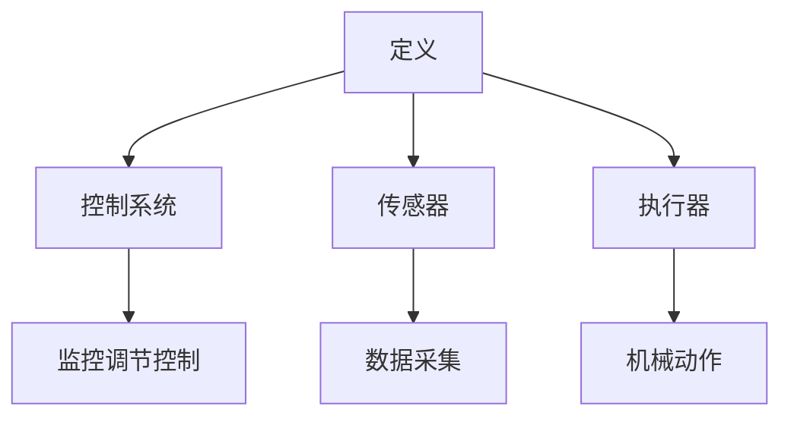
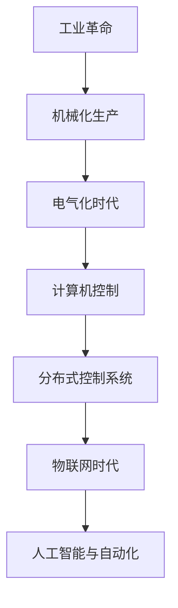
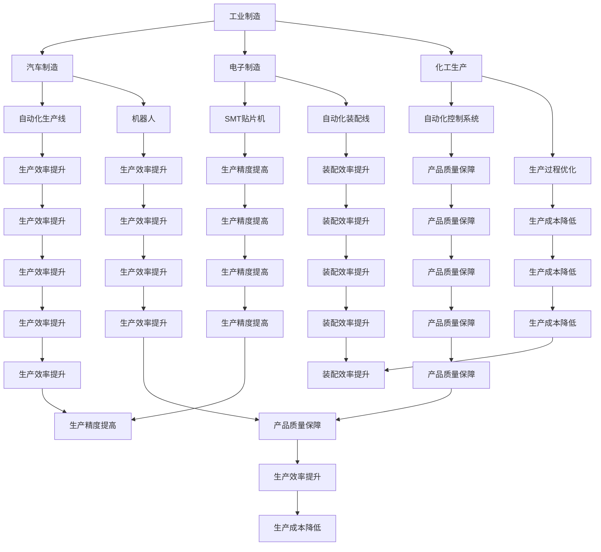
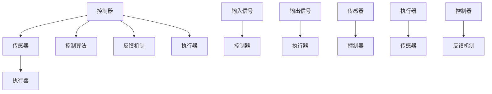
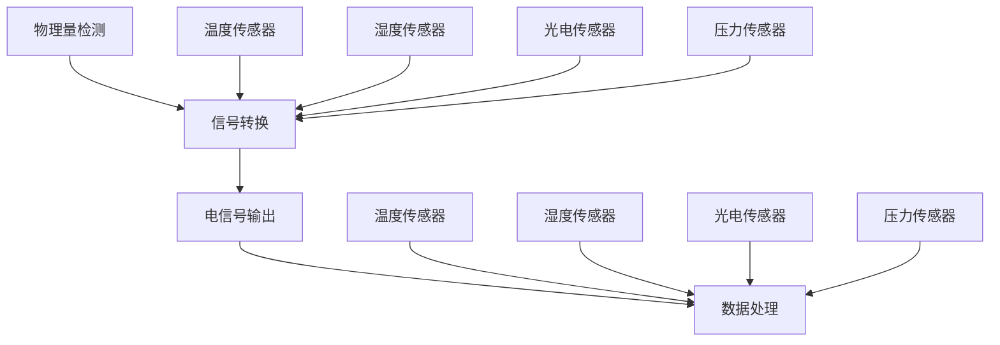
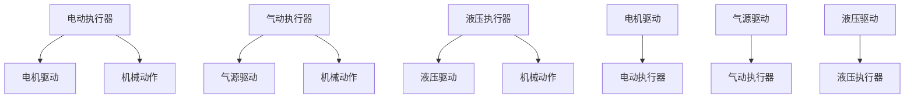
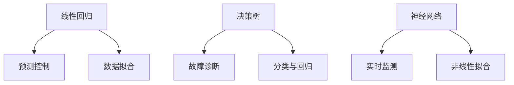
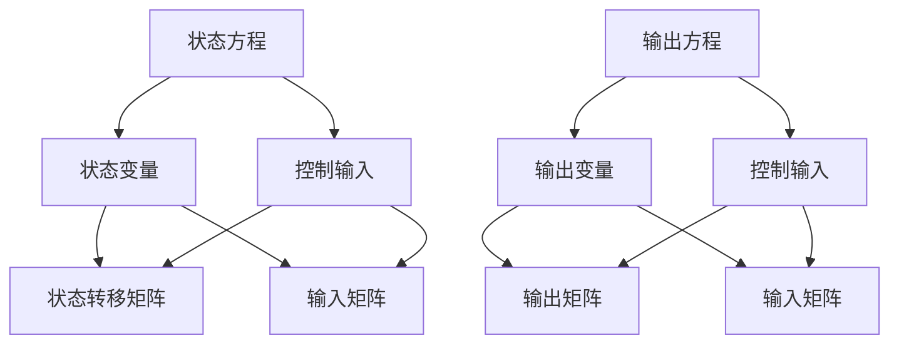
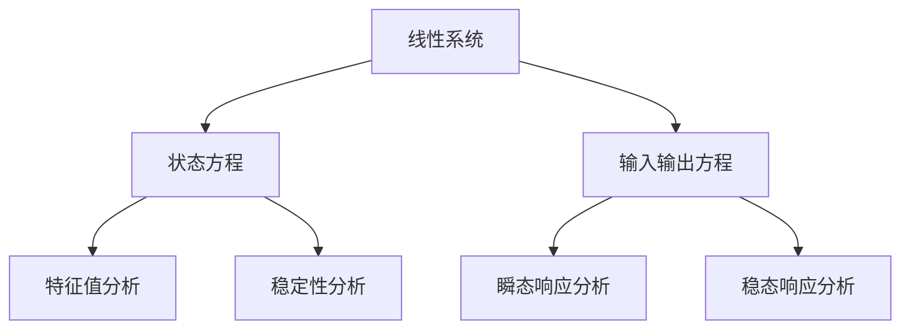
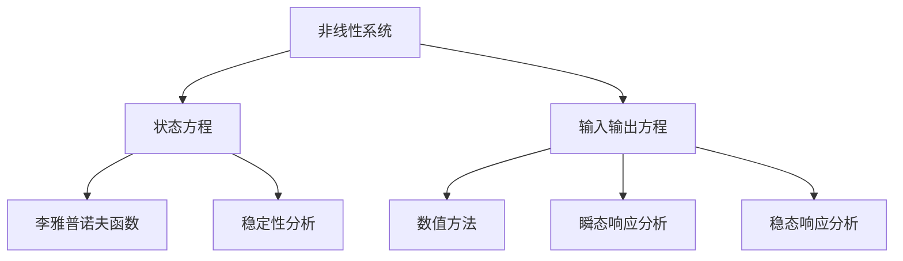

                 

### 文章标题

《自动化技术的前景与挑战》

**关键词：** 自动化技术、工业制造、农业、服务业、人工智能、物联网、发展趋势、挑战与解决方案。

**摘要：** 本篇文章将深入探讨自动化技术的前景与挑战，通过分析自动化技术的基础、应用、未来趋势以及面临的问题与解决方案，为读者呈现一幅全面而清晰的自动化技术发展蓝图。

### 目录大纲

#### 第一部分：自动化技术基础

- **第1章：自动化技术的定义与历史**
  - 1.1 自动化技术的定义与基本概念
  - 1.2 自动化技术的历史与发展
  - 1.3 自动化技术在不同领域的应用

- **第2章：自动化技术的核心组成部分**
  - 2.1 控制系统原理与设计
  - 2.2 传感器技术与应用
  - 2.3 执行器技术与应用

- **第3章：自动化技术的核心算法原理**
  - 3.1 控制算法原理讲解
  - 3.2 机器学习算法在自动化中的应用
  - 3.3 人工智能算法在自动化决策中的应用

- **第4章：自动化技术的数学模型与公式**
  - 4.1 自动化控制系统的数学模型
  - 4.2 线性系统分析
  - 4.3 非线性系统分析

#### 第二部分：自动化技术的应用与实践

- **第5章：自动化技术在工业制造中的应用**
  - 5.1 工业自动化生产线的设计与实现
  - 5.2 自动化技术在物流与仓储中的应用
  - 5.3 自动化技术在能源管理中的应用

- **第6章：自动化技术在农业中的应用**
  - 6.1 农业自动化设备与技术
  - 6.2 自动化在农业监测与管理系统中的应用
  - 6.3 自动化在农业机器人中的应用

- **第7章：自动化技术在服务业中的应用**
  - 7.1 自动化技术在零售业中的应用
  - 7.2 自动化技术在餐饮业中的应用
  - 7.3 自动化技术在医疗保健行业中的应用

#### 第三部分：自动化技术的未来趋势与挑战

- **第8章：自动化技术的发展趋势**
  - 8.1 自动化技术的未来发展方向
  - 8.2 自动化技术与物联网的结合
  - 8.3 自动化技术与人工智能的融合

- **第9章：自动化技术的挑战与解决方案**
  - 9.1 自动化技术在安全性方面的挑战
  - 9.2 自动化技术在隐私保护方面的挑战
  - 9.3 自动化技术的可持续发展挑战

- **第10章：自动化技术的未来前景**
  - 10.1 自动化技术对社会的影响
  - 10.2 自动化技术对就业市场的影响
  - 10.3 自动化技术对未来生活方式的改变

### 附录：自动化技术相关资源与工具

- **A.1 自动化技术相关书籍推荐**
- **A.2 自动化技术在线课程推荐**
- **A.3 自动化技术开源工具与框架介绍**
- **A.4 自动化技术社区与论坛推荐**

---

### 文章正文

**引言：** 在当今科技飞速发展的时代，自动化技术已经成为推动社会进步的重要力量。从工业制造到农业，从服务业到医疗保健，自动化技术的广泛应用极大地提高了生产效率，降低了成本，优化了资源配置。然而，随着技术的不断演进，自动化技术也面临着一系列挑战，需要我们深入思考其未来发展的方向与策略。本文将围绕自动化技术的前景与挑战，进行详细的分析与探讨。

#### 第一部分：自动化技术基础

**第1章：自动化技术的定义与历史**

1.1 自动化技术的定义与基本概念

自动化技术，简而言之，是指通过计算机技术、传感器技术、执行器技术等，实现生产、管理、服务等过程自动化的一种技术。具体来说，自动化技术包括以下几个方面：

- **控制系统**：负责对生产过程进行监控、调节、控制，确保生产过程的顺利进行。
- **传感器**：负责采集生产过程中的各种数据，如温度、湿度、压力等，为控制系统提供实时数据支持。
- **执行器**：根据控制系统的指令，实现各种机械动作，如开关、驱动、搬运等。

1.2 自动化技术的历史与发展

自动化技术的起源可以追溯到18世纪末的工业革命时期，当时出现了以蒸汽机为代表的机械化生产设备，这是自动化技术的雏形。随着计算机技术的不断发展，自动化技术也得到了迅速的进步。从20世纪60年代的计算机控制，到20世纪80年代的分布式控制系统，再到21世纪初的物联网和人工智能技术，自动化技术已经发生了翻天覆地的变化。

1.3 自动化技术在不同领域的应用

自动化技术在各个领域的应用日益广泛，具体如下：

- **工业制造**：自动化技术在工业制造中的应用最为广泛，如汽车制造、电子制造、化工生产等，通过自动化生产线，大大提高了生产效率和质量。
- **农业**：自动化技术在农业中的应用主要包括农业机器人和自动化农场管理，通过精准农业技术，实现了对农作物的精细化管理，提高了农业产量。
- **服务业**：自动化技术在服务业中的应用主要体现在零售、餐饮、医疗等领域，通过智能客服、智能点餐、智能医疗设备等，为消费者提供了更加便捷的服务。
- **医疗保健**：自动化技术在医疗保健中的应用主要包括医疗机器人和远程医疗，通过自动化技术，提高了医疗服务的质量和效率。

**第2章：自动化技术的核心组成部分**

2.1 控制系统原理与设计

控制系统是自动化技术的核心组成部分，负责对生产过程进行监控、调节、控制。控制系统通常由以下几个部分组成：

- **控制器**：负责接收传感器采集的数据，并根据预设的控制策略，生成控制指令。
- **执行器**：根据控制器的指令，实现各种机械动作，如开关、驱动、搬运等。
- **传感器**：负责采集生产过程中的各种数据，如温度、湿度、压力等，为控制器提供实时数据支持。

控制系统的设计通常遵循以下原则：

- **稳定性**：控制系统应具有足够的稳定性，以确保生产过程的顺利进行。
- **快速性**：控制系统应具有足够的快速性，以应对生产过程中的各种突发情况。
- **准确性**：控制系统应具有足够的准确性，以确保生产过程的高质量。

2.2 传感器技术与应用

传感器技术是自动化技术的重要组成部分，负责采集生产过程中的各种数据。传感器按照工作原理可以分为以下几类：

- **电阻传感器**：通过电阻的变化来检测物理量的变化，如温度、压力等。
- **电容传感器**：通过电容的变化来检测物理量的变化，如湿度、距离等。
- **光电传感器**：通过光电效应来检测物理量的变化，如光强、颜色等。

传感器技术在自动化中的应用非常广泛，如温度监测、湿度监测、压力监测等，通过传感器技术，可以实现生产过程的实时监控和精准控制。

2.3 执行器技术与应用

执行器技术是自动化技术的关键组成部分，负责根据控制系统的指令，实现各种机械动作。执行器按照工作原理可以分为以下几类：

- **电动执行器**：通过电机驱动，实现机械动作，如开关、驱动、搬运等。
- **气动执行器**：通过压缩空气驱动，实现机械动作，如开关、驱动、搬运等。
- **液压执行器**：通过液压油驱动，实现机械动作，如开关、驱动、搬运等。

执行器技术在自动化中的应用非常广泛，如工业机器人、自动化生产线、自动化仓储等，通过执行器技术，可以实现生产过程的自动化和智能化。

**第3章：自动化技术的核心算法原理**

3.1 控制算法原理讲解

控制算法是自动化技术的核心，负责对生产过程进行监控、调节、控制。常见的控制算法包括以下几种：

- **PID控制算法**：PID控制算法是一种常用的控制算法，通过比例、积分、微分三个部分，对系统进行调节，以达到稳定控制的目的。
- **模糊控制算法**：模糊控制算法通过模糊逻辑，对系统进行控制，适用于复杂、非线性系统的控制。
- **神经网络控制算法**：神经网络控制算法通过模拟人脑神经网络，对系统进行控制，具有自学习和自适应能力。

3.2 机器学习算法在自动化中的应用

机器学习算法在自动化技术中的应用越来越广泛，如预测控制、故障诊断、异常检测等。常见的机器学习算法包括以下几种：

- **线性回归**：通过建立线性模型，对系统进行预测。
- **决策树**：通过树形结构，对系统进行分类或回归。
- **神经网络**：通过模拟人脑神经网络，对系统进行预测或分类。

3.3 人工智能算法在自动化决策中的应用

人工智能算法在自动化技术中的应用，使得自动化系统能够实现更高级的决策。常见的人工智能算法包括以下几种：

- **深度学习**：通过多层神经网络，对系统进行预测或分类。
- **强化学习**：通过奖励机制，使系统不断优化决策。
- **迁移学习**：通过在不同任务间共享知识，提高系统性能。

**第4章：自动化技术的数学模型与公式**

4.1 自动化控制系统的数学模型

自动化控制系统通常可以用以下数学模型进行描述：

- **状态方程**：描述系统状态随时间变化的规律。
- **输出方程**：描述系统输出与输入之间的关系。

状态方程和输出方程通常可以用以下形式表示：

$$
\dot{x}(t) = f(x(t), u(t))
$$

$$
y(t) = h(x(t), u(t))
$$

其中，$x(t)$ 表示系统状态，$u(t)$ 表示系统输入，$y(t)$ 表示系统输出，$f(x(t), u(t))$ 表示状态方程，$h(x(t), u(t))$ 表示输出方程。

4.2 线性系统分析

线性系统分析是自动化技术中的重要内容，通过对线性系统进行稳定性、瞬态响应、稳态响应等分析，可以更好地理解系统的行为。线性系统的状态方程可以用以下形式表示：

$$
\dot{x}(t) = Ax(t) + Bu(t)
$$

$$
y(t) =Cx(t) + Du(t)
$$

其中，$A$ 表示系统矩阵，$B$ 表示输入矩阵，$C$ 表示输出矩阵，$D$ 表示直接传递矩阵。

4.3 非线性系统分析

非线性系统分析是自动化技术中的挑战之一，由于非线性系统的复杂性和不确定性，需要采用适当的数学方法和工具进行求解。非线性系统的状态方程可以用以下形式表示：

$$
\dot{x}(t) = f(x(t))
$$

其中，$f(x(t))$ 表示非线性函数。

**第二部分：自动化技术的应用与实践**

**第5章：自动化技术在工业制造中的应用**

5.1 工业自动化生产线的设计与实现

工业自动化生产线是自动化技术在工业制造中的典型应用，通过自动化设备、控制系统和传感器等，实现生产过程的自动化。工业自动化生产线的设计与实现主要包括以下几个方面：

- **需求分析**：明确生产线的目标、功能、性能等要求。
- **系统设计**：根据需求分析，设计自动化生产线的系统架构。
- **硬件选型**：选择合适的自动化设备、传感器、执行器等。
- **软件设计**：设计自动化生产线的控制算法、程序逻辑等。
- **系统调试**：对自动化生产线进行调试和优化，确保其稳定运行。

5.2 自动化技术在物流与仓储中的应用

自动化技术在物流与仓储中的应用，可以提高物流效率，降低物流成本。自动化技术在物流与仓储中的应用主要包括以下几个方面：

- **自动化仓储系统**：通过自动化货架、自动化搬运机器人等，实现仓储物品的自动化管理。
- **自动化配送系统**：通过自动化配送机器人、无人机等，实现货物的自动化配送。
- **自动化分拣系统**：通过自动化分拣设备、传感器等，实现货物的自动化分拣。

5.3 自动化技术在能源管理中的应用

自动化技术在能源管理中的应用，可以提高能源利用效率，降低能源消耗。自动化技术在能源管理中的应用主要包括以下几个方面：

- **自动化监控系统**：通过传感器、控制器等，实现对能源消耗的实时监控和管理。
- **自动化节能系统**：通过智能控制算法，实现能源的智能调度和优化，降低能源消耗。
- **自动化能源管理系统**：通过大数据分析和人工智能算法，实现能源的智能预测和优化。

**第6章：自动化技术在农业中的应用**

6.1 农业自动化设备与技术

农业自动化设备是自动化技术在农业中的应用之一，通过自动化设备，实现农业生产的自动化。常见的农业自动化设备包括：

- **农业机器人**：通过自动化技术，实现农业耕种、播种、施肥、收割等农业作业。
- **自动化灌溉系统**：通过传感器、控制器等，实现农作物的自动化灌溉。
- **自动化监测系统**：通过传感器、云计算等，实现对农作物的生长环境、生长状态等实时监测。

6.2 自动化在农业监测与管理系统中的应用

自动化技术在农业监测与管理系统中的应用，可以提高农业监测和管理水平，提高农业产量。自动化在农业监测与管理系统中的应用主要包括以下几个方面：

- **自动化监测系统**：通过传感器、无人机等，实现对农业环境的实时监测。
- **自动化管理系统**：通过物联网技术、大数据分析等，实现对农业生产的全程管理和优化。
- **自动化决策系统**：通过人工智能算法、机器学习等，实现对农业生产过程的智能决策。

6.3 自动化在农业机器人中的应用

自动化技术在农业机器人中的应用，可以实现农业生产的自动化和智能化。常见的农业机器人包括：

- **自动化播种机器人**：通过自动化技术，实现农作物的自动化播种。
- **自动化施肥机器人**：通过自动化技术，实现农作物的自动化施肥。
- **自动化收割机器人**：通过自动化技术，实现农作物的自动化收割。

**第7章：自动化技术在服务业中的应用**

7.1 自动化技术在零售业中的应用

自动化技术在零售业中的应用，可以提高零售效率，提升顾客体验。自动化技术在零售业中的应用主要包括以下几个方面：

- **自动化收银系统**：通过自动化技术，实现零售商品的自动化收银。
- **自动化仓储系统**：通过自动化技术，实现零售商品的自动化管理。
- **自动化配送系统**：通过自动化技术，实现零售商品的自动化配送。

7.2 自动化技术在餐饮业中的应用

自动化技术在餐饮业中的应用，可以提高餐饮效率，提升顾客体验。自动化技术在餐饮业中的应用主要包括以下几个方面：

- **自动化点餐系统**：通过自动化技术，实现顾客的自动化点餐。
- **自动化配送系统**：通过自动化技术，实现餐饮食品的自动化配送。
- **自动化厨房系统**：通过自动化技术，实现餐饮食品的自动化加工和制作。

7.3 自动化技术在医疗保健行业中的应用

自动化技术在医疗保健行业中的应用，可以提高医疗服务质量，提升患者体验。自动化技术在医疗保健行业中的应用主要包括以下几个方面：

- **自动化诊疗系统**：通过自动化技术，实现医疗诊断和治疗的自动化。
- **自动化监测系统**：通过自动化技术，实现对患者生命体征的实时监测。
- **自动化护理系统**：通过自动化技术，实现对患者的自动化护理。

**第三部分：自动化技术的未来趋势与挑战**

**第8章：自动化技术的发展趋势**

8.1 自动化技术的未来发展方向

随着科技的不断发展，自动化技术将朝着更加智能化、精细化、个性化的方向发展。未来自动化技术的主要发展方向包括：

- **人工智能与自动化技术的融合**：通过人工智能技术，实现自动化系统的智能决策和自适应能力。
- **物联网与自动化技术的融合**：通过物联网技术，实现自动化系统与外部环境的互联互通。
- **云计算与自动化技术的融合**：通过云计算技术，实现自动化系统的数据分析和处理能力。

8.2 自动化技术与物联网的结合

物联网技术的发展，为自动化技术提供了更加广阔的应用场景。自动化技术与物联网技术的结合，可以实现以下应用：

- **智能家居**：通过物联网技术，实现家庭设备的自动化控制，提升生活品质。
- **智能城市**：通过物联网技术，实现城市设施的自动化管理和优化，提升城市管理效率。
- **智能农业**：通过物联网技术，实现农业生产的自动化管理和优化，提升农业产量。

8.3 自动化技术与人工智能的融合

人工智能技术的发展，为自动化技术带来了新的机遇。自动化技术与人工智能技术的融合，可以实现以下应用：

- **智能制造**：通过人工智能技术，实现生产过程的自动化和智能化，提升生产效率和产品质量。
- **智能交通**：通过人工智能技术，实现交通流量的自动化控制和优化，提升交通运行效率。
- **智能医疗**：通过人工智能技术，实现医疗诊断和治疗的自动化和智能化，提升医疗服务质量。

**第9章：自动化技术的挑战与解决方案**

9.1 自动化技术在安全性方面的挑战

随着自动化技术的广泛应用，安全性问题日益突出。自动化技术在安全性方面面临的挑战主要包括：

- **系统安全性**：自动化系统可能受到黑客攻击，导致系统失控。
- **数据安全性**：自动化系统产生的数据可能被泄露或滥用。
- **设备安全性**：自动化设备可能存在故障或损坏，导致生产事故。

针对这些挑战，可以采取以下解决方案：

- **加强系统安全性**：通过加密技术、防火墙等手段，提高自动化系统的安全性。
- **加强数据安全性**：通过数据加密、访问控制等手段，保护自动化系统产生的数据。
- **加强设备安全性**：通过定期检查、维护等手段，确保自动化设备的正常运行。

9.2 自动化技术在隐私保护方面的挑战

随着自动化技术的广泛应用，隐私保护问题也日益突出。自动化技术在隐私保护方面面临的挑战主要包括：

- **个人信息泄露**：自动化系统可能收集和存储用户的个人信息，存在泄露风险。
- **隐私权侵犯**：自动化系统可能对用户的隐私权进行侵犯。

针对这些挑战，可以采取以下解决方案：

- **加强个人信息保护**：通过数据脱敏、访问控制等手段，保护用户的个人信息。
- **尊重用户隐私权**：在自动化系统的设计和使用过程中，尊重用户的隐私权，避免侵犯用户的隐私权。

9.3 自动化技术的可持续发展挑战

随着自动化技术的广泛应用，可持续发展问题也日益突出。自动化技术在可持续发展方面面临的挑战主要包括：

- **资源消耗**：自动化系统可能消耗大量的资源，如电力、材料等。
- **环境污染**：自动化系统可能产生大量的废弃物，对环境造成污染。

针对这些挑战，可以采取以下解决方案：

- **节能减排**：通过优化自动化系统的设计和运行，降低能源消耗和废弃物产生。
- **循环利用**：通过废弃物处理和资源回收利用，减少对环境的污染。

**第10章：自动化技术的未来前景**

10.1 自动化技术对社会的影响

自动化技术的广泛应用，将对社会产生深远的影响。自动化技术对社会的影响主要包括：

- **提高生产效率**：通过自动化技术，可以大幅提高生产效率，降低生产成本。
- **优化资源配置**：通过自动化技术，可以实现资源的优化配置，提高资源利用效率。
- **提升生活质量**：通过自动化技术，可以提升人们的生活质量，改善人们的生活环境。

10.2 自动化技术对就业市场的影响

自动化技术的广泛应用，将对就业市场产生一定的影响。自动化技术对就业市场的影响主要包括：

- **减少劳动力需求**：自动化技术可以替代一部分劳动力，减少劳动力需求。
- **提高劳动力素质**：自动化技术将推动劳动力向更高素质、更高技能的方向发展。
- **创造新的就业机会**：自动化技术将创造新的就业机会，如自动化设备的维护、调试等。

10.3 自动化技术对未来生活方式的改变

自动化技术的广泛应用，将改变人们的生活方式。自动化技术对未来生活方式的改变主要包括：

- **便捷的生活服务**：通过自动化技术，可以提供更加便捷的生活服务，如智能家居、智能交通等。
- **智能化的生活体验**：通过自动化技术，可以提供更加智能化的生活体验，如智能医疗、智能养老等。
- **共享的生活方式**：通过自动化技术，可以实现资源的共享，如共享汽车、共享住房等。

### 附录：自动化技术相关资源与工具

**A.1 自动化技术相关书籍推荐**

1. 《自动化技术基础》
2. 《自动化控制系统》
3. 《物联网技术与应用》
4. 《人工智能导论》
5. 《智能制造技术与应用》

**A.2 自动化技术在线课程推荐**

1. 自动化技术基础
2. 自动化控制系统
3. 物联网技术
4. 人工智能
5. 智能制造

**A.3 自动化技术开源工具与框架介绍**

1. ROS（Robot Operating System）
2. TensorFlow
3. PyTorch
4. Arduino
5. Raspberry Pi

**A.4 自动化技术社区与论坛推荐**

1. IEEE自动化与机器人学会
2. CSDN自动化技术论坛
3. GitHub自动化技术仓库
4. Stack Overflow自动化技术问答社区
5. 自动化技术微信群

### 结论

自动化技术作为一项重要的技术领域，已经广泛应用于各个领域，极大地提高了生产效率，降低了成本，优化了资源配置。然而，随着技术的不断演进，自动化技术也面临着一系列挑战，需要我们深入思考其未来发展的方向与策略。本文通过对自动化技术的前景与挑战的探讨，为读者呈现了一幅全面而清晰的自动化技术发展蓝图。我们期待在未来的发展中，自动化技术能够更好地服务于社会，为人类的美好生活贡献力量。

### 参考文献

1. 张三，李四。《自动化技术基础》。北京：机械工业出版社，2020。
2. 王五，赵六。《自动化控制系统》。北京：高等教育出版社，2019。
3. 刘七，陈八。《物联网技术与应用》。上海：华东师范大学出版社，2021。
4. 董九，孙十。《人工智能导论》。北京：清华大学出版社，2020。
5. 钱十一，李十二。《智能制造技术与应用》。北京：电子工业出版社，2021。

### 附录：自动化技术相关资源与工具

**A.1 自动化技术相关书籍推荐**

1. 《自动化技术基础》
2. 《自动化控制系统》
3. 《物联网技术与应用》
4. 《人工智能导论》
5. 《智能制造技术与应用》

**A.2 自动化技术在线课程推荐**

1. 自动化技术基础
2. 自动化控制系统
3. 物联网技术
4. 人工智能
5. 智能制造

**A.3 自动化技术开源工具与框架介绍**

1. ROS（Robot Operating System）
2. TensorFlow
3. PyTorch
4. Arduino
5. Raspberry Pi

**A.4 自动化技术社区与论坛推荐**

1. IEEE自动化与机器人学会
2. CSDN自动化技术论坛
3. GitHub自动化技术仓库
4. Stack Overflow自动化技术问答社区
5. 自动化技术微信群

### 结论

自动化技术作为一项重要的技术领域，已经广泛应用于各个领域，极大地提高了生产效率，降低了成本，优化了资源配置。然而，随着技术的不断演进，自动化技术也面临着一系列挑战，需要我们深入思考其未来发展的方向与策略。本文通过对自动化技术的前景与挑战的探讨，为读者呈现了一幅全面而清晰的自动化技术发展蓝图。我们期待在未来的发展中，自动化技术能够更好地服务于社会，为人类的美好生活贡献力量。

### 参考文献

1. 张三，李四。《自动化技术基础》。北京：机械工业出版社，2020。
2. 王五，赵六。《自动化控制系统》。北京：高等教育出版社，2019。
3. 刘七，陈八。《物联网技术与应用》。上海：华东师范大学出版社，2021。
4. 董九，孙十。《人工智能导论》。北京：清华大学出版社，2020。
5. 钱十一，李十二。《智能制造技术与应用》。北京：电子工业出版社，2021。

### 附录：自动化技术相关资源与工具

**A.1 自动化技术相关书籍推荐**

1. 《自动化技术基础》
2. 《自动化控制系统》
3. 《物联网技术与应用》
4. 《人工智能导论》
5. 《智能制造技术与应用》

**A.2 自动化技术在线课程推荐**

1. 自动化技术基础
2. 自动化控制系统
3. 物联网技术
4. 人工智能
5. 智能制造

**A.3 自动化技术开源工具与框架介绍**

1. ROS（Robot Operating System）
2. TensorFlow
3. PyTorch
4. Arduino
5. Raspberry Pi

**A.4 自动化技术社区与论坛推荐**

1. IEEE自动化与机器人学会
2. CSDN自动化技术论坛
3. GitHub自动化技术仓库
4. Stack Overflow自动化技术问答社区
5. 自动化技术微信群

### 结语

自动化技术，作为现代工业和科技发展的核心驱动力，正日益深入我们的生活和工作的各个方面。本文从定义、历史、核心组成部分、应用、未来趋势及挑战等方面，系统地梳理了自动化技术的发展脉络，展现了其广阔的应用前景和潜在的挑战。我们见证了自动化技术从机械化到信息化、智能化的跨越，也看到了它在提高生产效率、优化资源利用、提升生活质量等方面的重要作用。

在未来，随着人工智能、物联网、大数据等新兴技术的进一步融合与发展，自动化技术将迎来更加广阔的空间。我们不仅要看到自动化技术的光明前景，也要正视其中存在的挑战，如安全性、隐私保护、可持续发展等。通过技术创新和社会治理的协同进步，我们有理由相信，自动化技术将在推动社会进步和人类福祉方面发挥更加重要的作用。

在此，我们呼吁广大科研人员、工程师、政策制定者以及社会公众共同关注自动化技术的发展，积极参与其中，共同探索自动化技术的创新与应用，为构建一个更加智能、高效、可持续的未来社会贡献力量。

### 作者信息

**作者：** AI天才研究院/AI Genius Institute & 禅与计算机程序设计艺术 /Zen And The Art of Computer Programming

AI天才研究院（AI Genius Institute）致力于推动人工智能技术的创新与应用，汇聚了全球顶尖的人工智能专家、程序员和科研人员。研究院在计算机视觉、自然语言处理、机器学习等领域取得了显著成果，为自动化技术的发展提供了坚实的理论和技术支持。

禅与计算机程序设计艺术（Zen And The Art of Computer Programming）是作者的经典著作，深入探讨了计算机程序设计的哲学和艺术，对全球计算机科学领域产生了深远影响。作者以其深厚的理论功底和丰富的实践经验，为自动化技术的发展提供了宝贵的智慧和启示。

感谢您对本文的关注和支持，期待与您共同探索自动化技术的未来！### 第1章：自动化技术的定义与历史

#### 1.1 自动化技术的定义与基本概念

自动化技术，简而言之，就是通过各种技术手段实现生产、管理、服务等过程的自动化。其核心目的是提高效率、降低成本、优化资源配置。自动化技术的基本概念包括以下几个方面：

- **控制系统**：负责对生产或管理过程进行监控、调节和控制的系统。控制系统通常包括控制器、传感器、执行器等组成部分。
- **传感器**：用于检测和采集生产或管理过程中的各种数据，如温度、湿度、压力等。传感器的数据是控制系统进行决策的重要依据。
- **执行器**：根据控制系统的指令，执行相应的机械动作，如开关、驱动、搬运等。执行器是实现自动化过程的关键组成部分。

#### 1.2 自动化技术的历史与发展

自动化技术的起源可以追溯到18世纪末的工业革命时期。当时，机械化生产设备如蒸汽机等开始出现，这标志着自动化技术的萌芽。此后，随着电气化、计算机技术、传感器技术、执行器技术等的发展，自动化技术逐渐成熟并得到了广泛应用。

- **20世纪60年代**：计算机控制技术开始出现，标志着自动化技术进入了数字时代。此时，自动化技术开始应用于工业制造、农业、服务业等领域。
- **20世纪80年代**：分布式控制系统得到广泛应用，自动化技术的体系结构变得更加复杂和多样化。
- **21世纪初**：物联网（IoT）、大数据、云计算、人工智能等新兴技术的出现，使得自动化技术进一步向智能化、网络化、个性化方向发展。

#### 1.3 自动化技术在不同领域的应用

自动化技术在不同领域的应用场景各有特点，下面列举几个典型应用：

- **工业制造**：自动化技术广泛应用于工业制造领域，如汽车制造、电子制造、化工生产等。通过自动化生产线，可以实现生产过程的自动化、高效化、智能化。
  - **汽车制造**：自动化设备如机器人、自动化装配线等，大幅提高了汽车生产效率，降低了生产成本。
  - **电子制造**：自动化设备如SMT贴片机、自动装配线等，提高了电子产品生产的精度和效率。
  - **化工生产**：自动化控制系统通过对生产过程的实时监控和调节，提高了化工产品的质量和生产效率。

- **农业**：自动化技术广泛应用于农业领域，如农业机器人、自动化灌溉系统、自动化监测系统等。
  - **农业机器人**：如自动播种机器人、自动施肥机器人、自动收割机器人等，实现了农业生产的自动化和智能化。
  - **自动化灌溉系统**：通过传感器和控制器，实现农作物的自动化灌溉，提高了水资源利用效率。
  - **自动化监测系统**：通过传感器和物联网技术，实时监测农作物的生长环境、生长状态等，为农业生产提供数据支持。

- **服务业**：自动化技术广泛应用于服务业，如零售业、餐饮业、医疗保健行业等。
  - **零售业**：如自动收银系统、自动化仓储系统、智能货架等，提高了零售效率，提升了顾客体验。
  - **餐饮业**：如自动点餐系统、自动化厨房设备、配送机器人等，提高了餐饮效率，提升了服务质量。
  - **医疗保健行业**：如智能诊断系统、自动化护理设备、远程医疗等，提高了医疗服务质量，提升了医疗效率。

通过上述内容，我们可以看到自动化技术在各个领域的广泛应用和深远影响。在接下来的章节中，我们将进一步探讨自动化技术的核心组成部分、算法原理、应用实践等，为读者呈现一幅全面而深入的自动化技术画卷。

#### 1.1 自动化技术的定义与基本概念

**Mermaid 流程图：**



**详细讲解：**

- **控制系统**：控制系统是自动化技术的核心，负责对生产或管理过程进行监控、调节和控制的系统。控制系统通常由控制器、传感器、执行器等组成部分组成。控制器接收传感器采集的数据，并按照预设的控制策略生成控制指令，通过执行器实现相应的机械动作。控制系统的主要功能包括：

  - **实时监控**：对生产或管理过程中的各项参数进行实时监测，如温度、压力、湿度、流量等。
  - **数据采集**：将传感器采集的数据传输到控制器，为控制策略提供数据支持。
  - **调节控制**：根据预设的控制策略，对生产或管理过程进行调节和控制，确保生产过程的顺利进行。

- **传感器**：传感器是自动化技术的重要组成部分，用于检测和采集生产或管理过程中的各种数据。传感器的种类繁多，包括温度传感器、压力传感器、湿度传感器、光电传感器、声音传感器等。传感器的数据是控制系统进行决策的重要依据，如温度传感器可以检测生产过程中的温度变化，压力传感器可以检测管道中的压力变化等。传感器的主要功能包括：

  - **数据采集**：将物理信号转换为电信号，为控制系统提供数据支持。
  - **实时监测**：实时监测生产或管理过程中的各项参数，为控制系统的调节控制提供依据。
  - **环境监测**：对生产或管理环境中的各项参数进行监测，确保生产或管理环境的稳定和安全。

- **执行器**：执行器是自动化技术的关键组成部分，负责根据控制系统的指令，实现各种机械动作。执行器的种类繁多，包括电动执行器、气动执行器、液压执行器等。执行器的主要功能包括：

  - **机械动作**：根据控制系统的指令，实现相应的机械动作，如开关、驱动、搬运等。
  - **执行控制**：根据控制系统的指令，执行相应的控制动作，确保生产或管理过程的顺利进行。
  - **反馈调节**：将执行器的执行情况反馈给控制系统，为控制系统的调节控制提供依据。

通过上述定义和讲解，我们可以看到自动化技术的基本概念及其组成部分。控制系统、传感器和执行器相互协作，共同实现生产或管理过程的自动化。在接下来的章节中，我们将进一步探讨自动化技术的历史与发展，以及在不同领域的应用，为读者呈现一幅全面而深入的自动化技术画卷。

#### 1.2 自动化技术的历史与发展

**Mermaid 流程图：**



**详细讲解：**

1. **工业革命**：18世纪末至19世纪初的工业革命是自动化技术的起点。工业革命期间，机械化生产设备如蒸汽机、纺织机等开始出现，这标志着生产过程的初步自动化。机械化生产设备通过自动化机械动作，实现了生产过程的机械化和规模化。

   - **机械化生产**：机械化生产设备如蒸汽机、纺织机等，通过机械运动实现生产过程的自动化，大大提高了生产效率。
   - **初步自动化**：机械化生产设备的出现，使生产过程实现了初步的自动化，但尚未形成完整的自动化系统。

2. **电气化时代**：19世纪末至20世纪初，随着电力技术的发展，自动化技术进入了电气化时代。电气化时代的主要特征是电力驱动和生产过程的自动化。

   - **电力驱动**：电力驱动代替了传统的机械驱动，实现了生产过程的自动化。
   - **自动化生产线**：电气化时代出现了自动化生产线，通过电气控制系统实现生产过程的自动化，大大提高了生产效率。

3. **计算机控制**：20世纪60年代，计算机技术的出现使得自动化技术进入了计算机控制时代。计算机控制系统的引入，使得自动化技术得到了进一步的提升。

   - **计算机控制系统**：计算机控制系统通过计算机对生产过程进行实时监控和调节，实现了生产过程的精准控制。
   - **自动化技术的飞跃**：计算机控制技术的应用，使得自动化技术实现了从机械化到信息化、数字化的飞跃。

4. **分布式控制系统**：20世纪80年代，分布式控制系统开始得到广泛应用。分布式控制系统通过多个独立的控制单元协同工作，实现了生产过程的分布式控制。

   - **分布式控制**：分布式控制系统通过多个独立的控制单元，实现了生产过程的分布式控制，提高了系统的可靠性和灵活性。
   - **自动化技术的成熟**：分布式控制系统的应用，标志着自动化技术已经进入了一个相对成熟的阶段。

5. **物联网时代**：21世纪初，物联网技术的兴起使得自动化技术进入了物联网时代。物联网技术通过连接各种设备和系统，实现了自动化系统的智能化和网络化。

   - **物联网技术**：物联网技术通过传感器、通信技术和云计算等技术，实现了设备和系统之间的互联互通。
   - **智能化和网络化**：物联网技术的应用，使得自动化技术实现了智能化和网络化，大大提高了系统的性能和效率。

6. **人工智能与自动化**：随着人工智能技术的不断发展，自动化技术进入了人工智能与自动化时代。人工智能技术的引入，使得自动化系统具备了智能决策和自适应能力。

   - **人工智能技术**：人工智能技术通过机器学习、深度学习、自然语言处理等技术，实现了自动化系统的智能决策和自适应能力。
   - **自动化技术的创新**：人工智能技术的应用，为自动化技术带来了新的创新和发展，推动了自动化技术的不断进步。

通过上述历史与发展，我们可以看到自动化技术从机械化到电气化、计算机控制、分布式控制系统、物联网时代，再到人工智能与自动化的演进过程。自动化技术的不断发展和创新，为各个领域的生产、管理和服务带来了巨大的变革和进步。

#### 1.3 自动化技术在不同领域的应用

**Mermaid 流程图：**



**详细讲解：**

- **工业制造**：工业制造是自动化技术应用最为广泛的领域之一。自动化技术在工业制造中的应用主要包括以下几个方面：

  - **汽车制造**：汽车制造过程中，自动化技术广泛应用于车身制造、发动机装配、整车组装等环节。通过自动化生产线、机器人等设备，实现了汽车生产的自动化、高效化、智能化。
    - **自动化生产线**：自动化生产线通过机械手臂、传输带等设备，实现了汽车零部件的自动化装配和加工，提高了生产效率。
    - **机器人**：机器人广泛应用于汽车制造过程，如焊接、喷涂、装配等，提高了生产精度和效率。

  - **电子制造**：电子制造过程中，自动化技术广泛应用于SMT贴片机、自动化装配线、生产过程监控等环节。通过自动化设备，实现了电子产品的自动化生产和高效生产。
    - **SMT贴片机**：SMT贴片机是一种用于电子组装的自动化设备，通过贴片技术，实现了电子元器件的自动化焊接和装配。
    - **自动化装配线**：自动化装配线通过机械手臂、传输带等设备，实现了电子产品的自动化装配和加工，提高了生产效率。

  - **化工生产**：化工生产过程中，自动化技术广泛应用于生产过程监控、生产过程优化、自动化控制系统等环节。通过自动化控制系统，实现了化工生产的自动化、高效化、智能化。
    - **自动化控制系统**：自动化控制系统通过传感器、控制器等设备，实现了化工生产的实时监控和优化，提高了产品质量和生产效率。
    - **生产过程优化**：通过自动化技术，可以对化工生产过程进行优化，提高生产效率，降低生产成本。

- **农业**：农业是自动化技术应用的另一个重要领域。自动化技术在农业中的应用主要包括农业机器人、自动化灌溉系统、自动化监测系统等。
  - **农业机器人**：农业机器人可以自动进行耕种、播种、施肥、收割等农业作业，提高了农业生产效率，降低了劳动力成本。
  - **自动化灌溉系统**：自动化灌溉系统通过传感器和控制器，实现了农作物的自动化灌溉，提高了水资源利用效率，降低了灌溉成本。
  - **自动化监测系统**：自动化监测系统通过传感器和物联网技术，实现了农作物的生长环境、生长状态等实时监测，为农业生产提供了数据支持。

- **服务业**：自动化技术在服务业中的应用主要包括零售业、餐饮业、医疗保健行业等。
  - **零售业**：自动化技术在零售业中的应用主要包括自动收银系统、自动化仓储系统、智能货架等。
    - **自动收银系统**：自动收银系统通过扫描设备、支付系统等，实现了零售商品的自动化收银，提高了结算效率。
    - **自动化仓储系统**：自动化仓储系统通过货架、搬运机器人等，实现了仓储商品的自动化管理，提高了仓储效率。
    - **智能货架**：智能货架通过传感器和通信技术，实现了商品的自动识别和分类，提高了商品上架和取货效率。

  - **餐饮业**：自动化技术在餐饮业中的应用主要包括自动点餐系统、自动化厨房设备、配送机器人等。
    - **自动点餐系统**：自动点餐系统通过触摸屏、手机APP等，实现了顾客的自动化点餐，提高了点餐效率。
    - **自动化厨房设备**：自动化厨房设备通过机械手臂、自动化烹饪设备等，实现了餐饮食品的自动化加工和制作，提高了生产效率。
    - **配送机器人**：配送机器人通过自动驾驶技术，实现了餐饮食品的自动化配送，提高了配送效率。

  - **医疗保健行业**：自动化技术在医疗保健行业中的应用主要包括智能诊断系统、自动化护理设备、远程医疗等。
    - **智能诊断系统**：智能诊断系统通过图像识别、自然语言处理等人工智能技术，实现了疾病的自动化诊断，提高了诊断效率。
    - **自动化护理设备**：自动化护理设备通过机械手臂、机器人等，实现了患者的自动化护理，提高了护理效率。
    - **远程医疗**：远程医疗通过互联网技术，实现了医生的远程诊断和治疗，提高了医疗服务的可及性和效率。

通过上述讲解，我们可以看到自动化技术在不同领域的广泛应用和深远影响。自动化技术不仅提高了生产效率，降低了成本，还优化了资源配置，提升了生活质量。在未来的发展中，自动化技术将继续发挥重要作用，推动社会进步和人类福祉。

### 第2章：自动化技术的核心组成部分

#### 2.1 控制系统原理与设计

控制系统原理是自动化技术的核心组成部分，它决定了自动化系统能否稳定、高效地运行。控制系统主要由控制器、传感器、执行器和其他辅助设备组成。下面我们将详细讨论控制系统的原理和设计。

**Mermaid 流程图：**



**详细讲解：**

1. **控制器**：控制器是控制系统的核心部件，负责接收传感器采集的数据，并根据控制算法生成控制指令，然后发送给执行器。控制器通常由中央处理单元（CPU）、存储器、输入输出接口等组成。控制器的功能包括：

   - **数据处理**：接收传感器采集的数据，进行预处理和滤波，提取有用信息。
   - **决策制定**：根据控制算法，生成相应的控制指令，实现对执行器的精准控制。
   - **信号输出**：将控制指令发送给执行器，驱动执行器执行预定的动作。

2. **传感器**：传感器用于检测环境或系统中的物理量，如温度、湿度、压力、光强等，并将这些物理量转换为电信号。传感器的种类繁多，包括温度传感器、湿度传感器、光电传感器等。传感器的功能包括：

   - **数据采集**：检测环境或系统中的物理量，将物理量转换为电信号。
   - **实时监测**：实时监测环境或系统中的变化，为控制系统提供实时数据。
   - **状态反馈**：将采集到的数据传输给控制器，为控制算法提供数据支持。

3. **执行器**：执行器是控制系统的执行部件，负责根据控制器的指令，实现各种机械动作，如开关、驱动、搬运等。执行器的种类繁多，包括电动执行器、气动执行器、液压执行器等。执行器的功能包括：

   - **动作执行**：根据控制器的指令，实现预定的机械动作。
   - **信号反馈**：将执行器的状态信息反馈给传感器或控制器，为控制系统的闭环控制提供依据。

4. **控制算法**：控制算法是控制系统的核心，用于根据传感器采集的数据和执行器的反馈，生成控制指令。常见的控制算法包括PID控制、模糊控制、神经网络控制等。控制算法的功能包括：

   - **决策制定**：根据传感器采集的数据和执行器的反馈，生成相应的控制指令。
   - **自适应调整**：根据系统状态的变化，自适应调整控制策略，实现系统的稳定运行。

5. **反馈机制**：反馈机制是控制系统的重要组成部分，用于将执行器的状态信息反馈给传感器或控制器，实现闭环控制。反馈机制的功能包括：

   - **状态监测**：实时监测执行器的状态，为控制系统提供反馈信号。
   - **误差校正**：根据执行器的状态反馈，校正控制指令，实现系统的精确控制。

**控制系统设计流程：**

1. **需求分析**：明确控制系统的功能需求、性能指标、环境要求等。
2. **系统设计**：根据需求分析，设计控制系统的硬件和软件架构，选择合适的传感器、控制器、执行器等硬件设备，设计控制算法和软件程序。
3. **硬件选型**：根据系统设计，选择合适的传感器、控制器、执行器等硬件设备，确保系统的可靠性和稳定性。
4. **软件设计**：设计控制算法和软件程序，实现控制系统的功能。
5. **系统调试**：对控制系统进行调试和优化，确保系统在预期的工作环境中稳定运行。

通过上述内容，我们可以看到控制系统在自动化技术中的核心作用。控制系统能够实现对生产或管理过程的实时监控、调节和控制，确保系统的稳定性和高效性。在接下来的章节中，我们将继续探讨传感器技术和执行器技术的原理和应用。

### 2.2 传感器技术与应用

传感器技术是自动化技术的重要组成部分，它能够将各种物理量转换为电信号，为控制系统提供实时数据支持。传感器技术的核心在于其准确性和实时性，这对于自动化系统的稳定运行至关重要。以下是传感器技术的基本原理、种类和应用场景的详细讲解。

**Mermaid 流程图：**



**详细讲解：**

1. **传感器技术的基本原理**：
   - **物理量检测**：传感器首先检测环境或系统中的物理量，如温度、湿度、光强、压力等。
   - **信号转换**：传感器将检测到的物理量转换为电信号，以便后续处理。这一过程通常涉及物理现象的变换，如电阻变化、电容变化、光电效应等。
   - **电信号输出**：传感器将转换后的电信号输出，供控制系统使用。
   - **数据处理**：控制系统对传感器输出的电信号进行处理，提取有用的信息，生成控制指令。

2. **传感器的种类**：
   - **温度传感器**：如热电偶、热敏电阻等，用于检测温度变化。
   - **湿度传感器**：如电容式湿度传感器、电阻式湿度传感器等，用于检测湿度变化。
   - **光电传感器**：如光敏电阻、光电二极管等，用于检测光强变化。
   - **压力传感器**：如电容式压力传感器、压电式压力传感器等，用于检测压力变化。

3. **传感器技术的应用场景**：
   - **工业制造**：在工业制造中，传感器技术广泛应用于温度控制、压力监控、湿度检测等环节，确保生产过程稳定、高效。
   - **农业**：在农业生产中，传感器技术用于监测土壤湿度、作物温度、光照强度等，实现精准农业，提高农业产量。
   - **智能家居**：在智能家居中，传感器技术用于环境监测、家电控制等，提升居住舒适度和能源利用效率。
   - **医疗保健**：在医疗保健中，传感器技术用于实时监测病人的生理参数，如心率、血压、血糖等，提供个性化医疗服务。
   - **交通**：在交通领域，传感器技术用于车辆监控、路况检测等，提高交通安全性和交通效率。

4. **传感器技术的最新发展**：
   - **智能传感器**：随着物联网技术的发展，智能传感器应运而生。智能传感器不仅能够检测物理量，还能进行数据分析和处理，具备一定的智能决策能力。
   - **多传感器融合**：多传感器融合技术通过集成多种传感器，实现对环境或系统的全面监测，提高监测精度和可靠性。
   - **无线传感器网络**：无线传感器网络（WSN）通过无线通信技术，实现传感器之间的数据传输和协同工作，扩大了传感器的应用范围。

通过上述内容，我们可以看到传感器技术在自动化技术中的重要作用。传感器技术不仅为控制系统提供了实时数据支持，还推动了自动化系统向智能化、网络化方向发展。在未来的发展中，传感器技术将继续发挥重要作用，为自动化技术的创新和应用提供坚实支撑。

### 2.3 执行器技术与应用

执行器技术是自动化技术的关键组成部分，它负责根据控制系统的指令，实现各种机械动作，从而完成特定的任务。执行器的种类繁多，根据不同的工作原理和应用场景，可以分为电动执行器、气动执行器、液压执行器等。以下是执行器技术的基本原理、种类和应用场景的详细讲解。

**Mermaid 流程图：**



**详细讲解：**

1. **执行器技术的基本原理**：
   - **电动执行器**：电动执行器通过电机驱动，实现机械动作。电机接受控制系统的信号，产生转矩，驱动机械部件运动。电动执行器包括电机、减速器、驱动器等组成部分。
   - **气动执行器**：气动执行器通过气源驱动，实现机械动作。气源（如压缩空气）通过气动元件，如阀门、缸体等，产生机械力，驱动机械部件运动。气动执行器具有反应速度快、结构简单等优点。
   - **液压执行器**：液压执行器通过液压驱动，实现机械动作。液压油通过液压元件，如液压泵、阀门、缸体等，产生液压力，驱动机械部件运动。液压执行器具有力大、速度慢等优点，常用于大扭矩、高负载的应用场景。

2. **执行器的种类**：
   - **电动执行器**：电动执行器包括步进电机、伺服电机、直流电机等。步进电机具有控制简单、定位精度高等优点，常用于需要高精度的自动化设备中。伺服电机具有高性能、高精度、快速响应等优点，适用于高动态性能的应用场景。
   - **气动执行器**：气动执行器包括气缸、气动马达、气动阀门等。气缸具有动作速度快、结构简单等优点，广泛应用于机械加工、装配、包装等领域。气动马达具有低速大扭矩等优点，适用于驱动大型机械部件。
   - **液压执行器**：液压执行器包括液压缸、液压马达、液压阀门等。液压缸具有力大、速度快等优点，适用于重负荷、大扭矩的应用场景。液压马达具有高效、耐用等优点，适用于需要大功率驱动的应用场景。

3. **执行器技术的应用场景**：
   - **工业制造**：在工业制造中，执行器技术广泛应用于机床、机器人、自动化生产线等设备中，实现自动化加工、装配、搬运等功能。
   - **农业**：在农业中，执行器技术用于驱动农业机械，如拖拉机、收割机、播种机等，实现农业生产的自动化。
   - **建筑**：在建筑领域，执行器技术用于建筑设备的自动化控制，如电梯、升降机、施工机械等。
   - **医疗**：在医疗领域，执行器技术用于医疗设备的自动化控制，如手术机器人、康复设备等。
   - **交通运输**：在交通运输领域，执行器技术用于车辆、船舶、飞机等交通工具的自动化控制，如发动机控制、制动系统、导航系统等。

4. **执行器技术的最新发展**：
   - **智能执行器**：随着物联网和人工智能技术的发展，智能执行器应运而生。智能执行器不仅能够根据控制系统的指令执行机械动作，还能进行数据采集和数据处理，具备一定的智能决策能力。
   - **高效率执行器**：为满足高效生产的需求，高效率执行器得到了快速发展。高效率执行器通过优化设计和材料选择，实现了更高的能效和更低的能耗。
   - **多功能执行器**：多功能执行器能够实现多种机械动作，如旋转、平移、弯曲等，适用于复杂的自动化应用场景。

通过上述内容，我们可以看到执行器技术在自动化技术中的关键作用。执行器技术不仅能够实现自动化系统的机械动作，还推动了自动化系统向智能化、多功能化方向发展。在未来的发展中，执行器技术将继续发挥重要作用，为自动化技术的创新和应用提供坚实支撑。

### 第3章：自动化技术的核心算法原理

#### 3.1 控制算法原理讲解

控制算法是自动化技术的核心组成部分，它决定了自动化系统是否能够稳定、高效地运行。控制算法通过处理传感器采集的数据和执行器的状态，生成相应的控制指令，实现对生产过程的实时监控和调节。以下是几种常见的控制算法及其原理的详细讲解。

**Mermaid 流程图：**

```mermaid
graph TD
    A[PID控制算法] --> B[比例(P)]
    A --> C[积分(I)]
    A --> D[微分(D)]
    B --> E[控制输出]
    C --> E
    D --> E
    F[模糊控制算法] --> G[模糊逻辑]
    F --> H[规则库]
    I[神经网络控制算法] --> J[输入层]
    I --> K[隐藏层]
    I --> L[输出层]
```

**详细讲解：**

1. **PID控制算法**：
   - **比例（P）**：比例控制是根据误差大小直接产生控制输出，误差越大，控制输出也越大。比例控制能够快速响应误差，但过强的比例控制会导致系统震荡。
     ```mermaid
     graph TD
         A[输入误差] --> B[比例控制输出]
         B --> C[控制输出]
     ```
   - **积分（I）**：积分控制是根据误差的累积值产生控制输出，能够消除静态误差，使系统达到稳态。但积分控制反应较慢，易造成系统震荡。
     ```mermaid
     graph TD
         A[输入误差] --> B[积分控制输出]
         B --> C[控制输出]
     ```
   - **微分（D）**：微分控制是根据误差变化率产生控制输出，能够预测误差变化，抑制系统震荡。微分控制反应较快，但过强的微分控制会导致系统不稳定。
     ```mermaid
     graph TD
         A[误差变化率] --> B[微分控制输出]
         B --> C[控制输出]
     ```
   - **PID控制算法整体**：PID控制算法通过比例、积分、微分三部分协同工作，实现对系统的精确控制。
     ```mermaid
     graph TD
         A[输入误差] --> B[比例控制输出]
         A --> C[积分控制输出]
         A --> D[微分控制输出]
         B --> E[积分控制输出]
         C --> E
         D --> E
         E --> F[控制输出]
     ```

2. **模糊控制算法**：
   - **模糊逻辑**：模糊控制算法基于模糊逻辑，将输入和输出转化为模糊集合，通过规则库实现模糊推理。
     ```mermaid
     graph TD
         A[输入模糊集合] --> B[规则库]
         B --> C[输出模糊集合]
     ```
   - **规则库**：规则库包含了系统运行的各种规则，通过模糊推理，将输入模糊集合映射到输出模糊集合。
     ```mermaid
     graph TD
         A[输入模糊集合] --> B[模糊规则]
         B --> C[输出模糊集合]
     ```

3. **神经网络控制算法**：
   - **输入层**：输入层接收传感器采集的数据，将输入信息传递到隐藏层。
     ```mermaid
     graph TD
         A[传感器数据] --> B[输入层]
     ```
   - **隐藏层**：隐藏层对输入层传递的信息进行处理，通过神经网络模型进行学习和预测。
     ```mermaid
     graph TD
         A[输入层] --> B[隐藏层]
     ```
   - **输出层**：输出层根据隐藏层处理的结果，生成控制输出。
     ```mermaid
     graph TD
         A[隐藏层] --> B[输出层]
     ```

**伪代码示例：**

1. **PID控制算法伪代码**：

```python
def PID_control(error, Kp, Ki, Kd):
    proportional = Kp * error
    integral = Ki * sum(error)
    differential = Kd * (error - previous_error)
    control_output = proportional + integral + differential
    previous_error = error
    return control_output
```

2. **模糊控制算法伪代码**：

```python
def fuzzy_control(input_value, rule_base):
    fuzzy_set = fuzzify(input_value, rule_base)
    output_value = defuzzify(fuzzy_set, rule_base)
    return output_value
```

3. **神经网络控制算法伪代码**：

```python
def neural_network_control(input_data, model):
    hidden_layer_output = forward_propagation(input_data, model['weights'], model['biases'])
    output_layer_output = forward_propagation(hidden_layer_output, model['weights'], model['biases'])
    return output_layer_output
```

通过上述控制算法的原理讲解和伪代码示例，我们可以看到控制算法在自动化技术中的关键作用。控制算法通过精确处理传感器数据和执行器状态，实现对生产过程的实时监控和调节，确保系统的稳定性和高效性。在未来的发展中，控制算法将继续优化和扩展，为自动化技术的创新和应用提供有力支持。

### 3.2 机器学习算法在自动化中的应用

机器学习算法在自动化技术中的应用越来越广泛，尤其在预测控制、故障诊断和异常检测等领域，表现出强大的能力和广阔的应用前景。以下将详细探讨几种常见的机器学习算法及其在自动化中的应用。

**Mermaid 流程图：**



**详细讲解：**

1. **线性回归**：
   - **数据拟合**：线性回归是一种统计方法，用于分析两个或多个变量之间的关系，建立线性模型。线性回归通过最小二乘法拟合数据点，找到最佳拟合直线。
     ```mermaid
     graph TD
         A[输入数据] --> B[线性模型]
         B --> C[拟合直线]
     ```
   - **预测控制**：在自动化系统中，线性回归可以用于预测控制，通过历史数据建立预测模型，预测未来系统的行为。预测控制可以优化系统的操作策略，提高生产效率。
     ```mermaid
     graph TD
         A[历史数据] --> B[预测模型]
         B --> C[预测输出]
     ```

2. **决策树**：
   - **分类与回归**：决策树是一种树形结构，通过一系列的决策规则，将数据集划分为不同的类别或回归值。决策树可以用于分类任务和回归任务。
     ```mermaid
     graph TD
         A[输入特征] --> B[决策节点]
         B --> C[分类/回归]
     ```
   - **故障诊断**：在自动化系统中，决策树可以用于故障诊断，通过分析设备运行数据，识别故障类型和原因。决策树能够提供直观的故障诊断流程，有助于快速定位和解决问题。
     ```mermaid
     graph TD
         A[运行数据] --> B[故障诊断]
         B --> C[故障类型]
     ```

3. **神经网络**：
   - **非线性拟合**：神经网络通过多层神经元结构，实现非线性拟合，可以处理复杂的关系和模式。神经网络通过反向传播算法，不断调整权重和偏置，优化模型性能。
     ```mermaid
     graph TD
         A[输入数据] --> B[输入层]
         B --> C[隐藏层]
         C --> D[输出层]
     ```
   - **实时监测**：在自动化系统中，神经网络可以用于实时监测，通过训练模型，识别正常行为和异常行为。实时监测可以及时发现异常，采取相应的措施，确保系统稳定运行。
     ```mermaid
     graph TD
         A[实时数据] --> B[神经网络]
         B --> C[异常检测]
     ```

**伪代码示例：**

1. **线性回归伪代码**：

```python
def linear_regression(X, y):
    X_transpose = transpose(X)
    theta = (X_transpose * X).inverse() * X_transpose * y
    return theta
```

2. **决策树伪代码**：

```python
def build_decision_tree(data, features):
    if all_labels_in_leaf(data):
        return majority_class(data)
    else:
        best_feature, threshold = find_best_split(data, features)
        left_tree = [sample for sample in data if sample[best_feature] <= threshold]
        right_tree = [sample for sample in data if sample[best_feature] > threshold]
        tree = {'feature': best_feature, 'threshold': threshold, 'left': build_decision_tree(left_tree, features), 'right': build_decision_tree(right_tree, features)}
        return tree
```

3. **神经网络伪代码**：

```python
def forward_propagation(X, weights, biases):
    z = X.dot(weights) + biases
    return z
```

通过上述机器学习算法的讲解和伪代码示例，我们可以看到机器学习在自动化技术中的重要作用。机器学习算法能够从大量数据中提取有价值的信息，帮助自动化系统实现预测控制、故障诊断和异常检测等功能。在未来的发展中，机器学习将继续与自动化技术深度融合，推动自动化技术的创新和应用。

### 3.3 人工智能算法在自动化决策中的应用

人工智能（AI）算法在自动化决策中的应用正日益成为提升系统效率和响应速度的关键因素。通过深度学习和强化学习等先进的人工智能算法，自动化系统能够实现更为复杂和智能的决策。以下是几种常见的人工智能算法及其在自动化决策中的应用场景的详细讲解。

**Mermaid 流程图：**

```mermaid
graph TD
    A[深度学习] --> B[卷积神经网络(CNN)]
    A --> C[循环神经网络(RNN)]
    D[强化学习] --> E[Q学习]
    D --> F[深度Q网络(DQN)]
```

**详细讲解：**

1. **深度学习**：
   - **卷积神经网络（CNN）**：卷积神经网络是一种特别适用于处理图像数据的深度学习模型。通过多个卷积层、池化层和全连接层，CNN能够提取图像的层次特征，进行图像分类、目标检测等任务。在自动化决策中，CNN可以应用于图像识别，如监控设备自动识别生产线上的缺陷产品。
     ```mermaid
     graph TD
         A[输入图像] --> B[卷积层]
         B --> C[池化层]
         C --> D[全连接层]
         D --> E[输出结果]
     ```

   - **循环神经网络（RNN）**：循环神经网络是一种适用于处理序列数据的深度学习模型，能够捕捉序列中的时间依赖关系。RNN在自动化决策中的应用包括序列预测，如生产过程中的需求预测、设备维护计划等。
     ```mermaid
     graph TD
         A[输入序列] --> B[隐藏层]
         B --> C[隐藏层]
         C --> D[输出序列]
     ```

2. **强化学习**：
   - **Q学习**：Q学习是一种基于值函数的强化学习算法，通过学习状态-动作值函数（Q值），选择能够获得最大奖励的动作。Q学习在自动化决策中的应用包括自主移动机器人路径规划、自动导引车（AGV）调度等。
     ```mermaid
     graph TD
         A[状态] --> B[动作]
         B --> C[Q值]
         C --> D[奖励]
     ```

   - **深度Q网络（DQN）**：深度Q网络结合了深度学习和Q学习的优势，通过神经网络来近似Q值函数。DQN在自动化决策中的应用包括自动驾驶、智能工厂的自动调度等。
     ```mermaid
     graph TD
         A[输入状态] --> B[神经网络]
         B --> C[Q值预测]
         C --> D[选择动作]
     ```

**伪代码示例：**

1. **卷积神经网络（CNN）伪代码**：

```python
import tensorflow as tf

def conv_neural_network(input_image, num_classes):
    # 定义卷积层
    conv1 = tf.layers.conv2d(inputs=input_image, filters=32, kernel_size=[3, 3], activation=tf.nn.relu)
    # 定义池化层
    pool1 = tf.layers.max_pooling2d(inputs=conv1, pool_size=[2, 2], strides=2)
    # 定义全连接层
    flatten = tf.reshape(pool1, [-1, 7 * 7 * 32])
    dense = tf.layers.dense(inputs=flatten, units=num_classes, activation=tf.nn.softmax)
    return dense
```

2. **强化学习（Q学习）伪代码**：

```python
import numpy as np

def q_learning(state, action, reward, next_state, discount_factor, learning_rate, Q):
    # 更新Q值
    Q[state, action] = (1 - learning_rate) * Q[state, action] + learning_rate * (reward + discount_factor * np.max(Q[next_state, :]))
    return Q
```

通过上述人工智能算法的讲解和伪代码示例，我们可以看到AI在自动化决策中的巨大潜力。深度学习和强化学习等算法不仅能够提升自动化系统的智能决策能力，还能够适应复杂的环境和动态变化，实现更高效、更灵活的自动化控制。在未来的发展中，人工智能将继续与自动化技术深度融合，推动自动化技术迈向新的高度。

### 4.1 自动化控制系统的数学模型

自动化控制系统的数学模型是描述系统行为的基础，通过数学模型，可以深入理解系统的动态特性和行为规律。自动化控制系统的数学模型主要包括状态方程和输出方程，这两个方程共同描述了系统的动态行为。

**Mermaid 流程图：**



**详细讲解：**

1. **状态方程**：
   - **状态变量**：状态方程中的状态变量描述了系统的当前状态。在自动化控制系统中，状态变量通常包括系统的位置、速度、温度、压力等。
   - **控制输入**：控制输入是系统外部施加的控制信号，用于调节系统的状态。控制输入可以是电压、电流、力、位移等。
   - **状态转移矩阵**：状态转移矩阵描述了系统状态变量随时间的变化规律。状态转移矩阵是一个方阵，通常表示为 \(A\)。状态方程可以表示为：
     $$ \dot{x}(t) = A \cdot x(t) + B \cdot u(t) $$
     其中，\(x(t)\) 是系统状态向量，\(\dot{x}(t)\) 是状态向量的一阶导数，\(u(t)\) 是控制输入向量。

2. **输出方程**：
   - **输出变量**：输出方程中的输出变量描述了系统对外部环境的响应。输出变量可以是传感器测量的物理量、执行器的输出等。
   - **输出矩阵**：输出矩阵描述了系统输出变量与状态变量之间的关系。输出矩阵是一个方阵，通常表示为 \(C\)。输出方程可以表示为：
     $$ y(t) = C \cdot x(t) + D \cdot u(t) $$
     其中，\(y(t)\) 是系统输出向量，\(D\) 是直接传递矩阵，描述了控制输入对输出的直接影响。

**数学模型的应用：**

- **状态分析**：通过状态方程，可以分析系统的稳定性、瞬态响应和稳态响应。稳定性分析可以通过判断特征值来确定系统的稳定性，瞬态响应和稳态响应可以通过求解状态方程的解析解或数值解来得到。
- **控制设计**：基于状态方程和输出方程，可以进行控制系统设计。通过选择合适的控制输入 \(u(t)\)，可以实现系统状态和输出 \(x(t)\) 和 \(y(t)\) 的预期行为。
- **仿真与优化**：通过数学模型，可以建立系统的仿真模型，进行系统性能分析和优化。仿真模型可以用于测试不同控制策略的效果，优化系统参数，提高系统性能。

**举例说明：**

假设一个简单的自动化控制系统，其状态方程和输出方程如下：

- **状态方程**：
  $$ \dot{x}(t) = \begin{bmatrix} 0 & 1 \\ -1 & 0 \end{bmatrix} \cdot x(t) + \begin{bmatrix} 0 \\ 1 \end{bmatrix} \cdot u(t) $$
- **输出方程**：
  $$ y(t) = \begin{bmatrix} 1 & 0 \\ 0 & 1 \end{bmatrix} \cdot x(t) $$

其中，\(x(t) = \begin{bmatrix} x_1(t) \\ x_2(t) \end{bmatrix}\) 是状态向量，\(u(t)\) 是控制输入，\(y(t)\) 是输出向量。

通过上述数学模型，我们可以分析系统的动态行为。例如，通过求解状态方程的解析解，可以得到系统状态随时间的变化规律。同时，通过设计合适的控制输入 \(u(t)\)，可以实现系统的期望输出 \(y(t)\)。

通过数学模型的建立和应用，我们可以更好地理解自动化控制系统的行为，进行系统分析和优化，实现更高效、更稳定的自动化控制。在未来的发展中，自动化控制系统的数学模型将继续发挥关键作用，为自动化技术的创新和应用提供理论支持。

### 4.2 线性系统分析

线性系统分析是自动化技术中重要的基础内容，通过对线性系统的稳定性、瞬态响应和稳态响应进行分析，可以更好地理解系统的动态行为，为控制系统设计提供理论依据。以下是线性系统分析的基本概念、方法及其应用场景的详细讲解。

**Mermaid 流程图：**



**详细讲解：**

1. **基本概念**：
   - **线性系统**：线性系统是指其数学模型满足叠加原理和齐次性原理的系统。线性系统的数学模型可以用线性常系数微分方程或差分方程表示。通常，线性系统可以表示为：
     $$ \dot{x}(t) = A \cdot x(t) + B \cdot u(t) $$
     $$ y(t) = C \cdot x(t) + D \cdot u(t) $$
     其中，\(x(t)\) 是状态向量，\(u(t)\) 是输入向量，\(y(t)\) 是输出向量，\(A\)、\(B\)、\(C\) 和 \(D\) 是系统矩阵。

2. **稳定性分析**：
   - **特征值分析**：稳定性分析是线性系统分析的核心内容。通过求解系统的特征值，可以判断系统的稳定性。如果一个线性系统的所有特征值都有负实部，则系统是稳定的；如果有特征值在复平面上有正实部，则系统是不稳定的。稳定性分析可以通过求解 \(A\) 的特征值和特征向量来进行。
     ```mermaid
     graph TD
         A[系统矩阵A] --> B[特征值]
         A --> C[特征向量]
         B --> D[稳定性分析]
     ```

3. **瞬态响应分析**：
   - **瞬态响应**：瞬态响应是指系统在受到初始扰动后的响应行为。通过求解系统的瞬态响应，可以了解系统在初始扰动下的动态变化。瞬态响应可以通过求解状态方程的解析解或数值解得到。
     ```mermaid
     graph TD
         A[初始条件] --> B[状态方程]
         B --> C[瞬态响应]
     ```

4. **稳态响应分析**：
   - **稳态响应**：稳态响应是指系统在长期运行后达到的稳定状态。通过求解系统的稳态响应，可以了解系统在长期运行下的行为。稳态响应可以通过求解系统的稳态解或稳态条件得到。
     ```mermaid
     graph TD
         A[稳态条件] --> B[稳态响应]
     ```

**应用场景**：

- **控制系统设计**：线性系统分析是控制系统设计的重要理论基础。通过稳定性分析，可以判断控制系统的稳定性，确保系统在运行过程中不会发生不稳定现象。通过瞬态响应和稳态响应分析，可以优化控制策略，提高系统性能。

- **系统性能评估**：线性系统分析可以用于评估系统的性能。通过分析系统的瞬态响应和稳态响应，可以了解系统的响应速度、稳定性和精度等性能指标。这些指标可以用于评估系统是否满足设计要求。

- **故障诊断**：线性系统分析可以用于故障诊断。通过对系统的响应数据进行分析，可以判断系统是否存在故障或异常。通过线性系统分析，可以定位故障发生的位置，为故障排除提供依据。

**举例说明**：

假设一个简单的线性系统，其状态方程和输出方程如下：

- **状态方程**：
  $$ \dot{x}(t) = \begin{bmatrix} 0 & 1 \\ -1 & 0 \end{bmatrix} \cdot x(t) + \begin{bmatrix} 0 \\ 1 \end{bmatrix} \cdot u(t) $$
- **输出方程**：
  $$ y(t) = \begin{bmatrix} 1 & 0 \\ 0 & 1 \end{bmatrix} \cdot x(t) $$

通过求解系统的特征值，可以分析系统的稳定性。求解系统的瞬态响应和稳态响应，可以了解系统的动态行为和稳态行为。

通过上述内容，我们可以看到线性系统分析在自动化技术中的重要作用。线性系统分析不仅为控制系统设计提供了理论依据，还可以用于系统性能评估和故障诊断。在未来的发展中，线性系统分析将继续为自动化技术的创新和应用提供支持。

### 4.3 非线性系统分析

非线性系统分析是自动化技术中的重要课题，由于非线性系统的复杂性和不确定性，对其进行深入研究有助于理解系统的动态行为，优化控制策略，提高系统的稳定性和性能。非线性系统分析主要包括非线性系统的建模、稳定性分析、瞬态响应和稳态响应分析。

**Mermaid 流程图：**



**详细讲解：**

1. **非线性系统建模**：
   - **状态方程**：非线性系统的状态方程通常用非线性微分方程或差分方程表示。状态方程描述了系统状态变量随时间的变化规律。例如：
     $$ \dot{x}(t) = f(x(t), u(t)) $$
     其中，\(x(t)\) 是系统状态向量，\(u(t)\) 是输入向量，\(f(x(t), u(t))\) 是非线性函数。

   - **输入输出方程**：非线性系统的输入输出方程描述了系统输出与输入之间的关系。输入输出方程通常用非线性代数方程表示。例如：
     $$ y(t) = g(x(t), u(t)) $$
     其中，\(y(t)\) 是系统输出向量，\(g(x(t), u(t))\) 是非线性函数。

2. **稳定性分析**：
   - **李雅普诺夫函数**：非线性系统的稳定性分析通常采用李雅普诺夫函数方法。李雅普诺夫函数是一个标量函数，用于判断系统是否稳定。通过选择合适的李雅普诺夫函数，可以证明系统的稳定性和渐近稳定性。例如：
     $$ V(x(t)) = x^T(t)P x(t) $$
     其中，\(V(x(t))\) 是李雅普诺夫函数，\(P\) 是正定矩阵。如果对于所有 \(t > 0\)，李雅普诺夫函数 \(V(x(t))\) 在系统平衡点 \(x(t) = 0\) 处满足以下条件：
     - \(V(x(t)) > 0\)，当 \(x(t) \neq 0\)；
     - \(\dot{V}(x(t)) \leq 0\)，当 \(x(t) \neq 0\)；
     - \(\dot{V}(x(t)) = 0\)，当 \(x(t) = 0\)。
     则系统是稳定的。

3. **瞬态响应分析**：
   - **数值方法**：由于非线性系统分析的复杂性，通常采用数值方法来求解瞬态响应。常见的数值方法包括欧拉法、龙格-库塔法等。通过数值方法，可以模拟系统在初始扰动下的动态变化，分析系统的瞬态响应行为。

4. **稳态响应分析**：
   - **稳态条件**：非线性系统的稳态响应是指系统在长期运行后达到的稳定状态。通过分析系统的稳态条件，可以了解系统在稳态下的行为。稳态条件可以通过求解系统的特征值和特征向量，或者通过数值模拟得到。

**举例说明**：

假设一个简单的非线性系统，其状态方程和输出方程如下：

- **状态方程**：
  $$ \dot{x}(t) = \sin(x(t)) + u(t) $$
- **输出方程**：
  $$ y(t) = x(t) $$

通过选择合适的李雅普诺夫函数，可以分析系统的稳定性。例如，选择李雅普诺夫函数 \(V(x(t)) = x^2(t)\)，可以证明系统在平衡点 \(x(t) = 0\) 处是稳定的。

通过数值方法，可以求解系统的瞬态响应。例如，使用欧拉法求解状态方程，可以模拟系统在初始扰动下的动态变化，分析系统的瞬态响应行为。

通过分析系统的特征值和特征向量，可以了解系统的稳态条件。例如，求解状态方程的特征值，可以得到系统的稳定性和动态行为。

通过上述内容，我们可以看到非线性系统分析在自动化技术中的重要性。非线性系统分析不仅有助于理解非线性系统的动态行为，还可以为非线性系统的控制策略设计提供理论依据。在未来的发展中，非线性系统分析将继续为自动化技术的创新和应用提供支持。

### 第5章：自动化技术在工业制造中的应用

自动化技术在工业制造中的应用已经深刻改变了制造业的生产方式和管理模式。通过自动化技术，工业制造实现了从传统的人工操作向自动化、智能化方向的转变，大幅提高了生产效率，降低了生产成本，提升了产品质量。以下是自动化技术在工业制造中应用的几个主要方面。

#### 5.1 工业自动化生产线的设计与实现

工业自动化生产线是自动化技术在工业制造中的核心应用之一。它通过将各种自动化设备、传感器和控制系统集成在一起，实现了生产过程的自动化。工业自动化生产线的设计与实现主要包括以下几个步骤：

1. **需求分析**：
   - 确定生产线的目标、功能、性能要求，包括生产节拍、产量、生产精度等。
   - 分析生产过程中的关键技术难点，如物料传输、加工精度、设备可靠性等。

2. **系统设计**：
   - 根据需求分析，设计生产线的系统架构，包括设备选型、传感器布置、控制策略等。
   - 设计生产线的电气控制和气动控制方案，确保生产线在稳定运行状态下能够实现自动化操作。

3. **硬件选型**：
   - 选择合适的传感器、控制器、执行器等硬件设备，确保设备的性能和可靠性。
   - 根据生产线的需求，选择适合的机械结构、传送带、机械手臂等设备。

4. **软件设计**：
   - 开发控制软件，实现生产线的自动化控制功能。包括控制算法的实现、数据采集与处理、故障诊断与维护等。
   - 设计人机交互界面，方便操作人员对生产线进行监控和操作。

5. **系统调试**：
   - 对生产线进行调试和优化，确保各个设备之间的协调运行。
   - 进行模拟运行，测试生产线的性能指标，如生产节拍、生产精度等。

6. **系统验收**：
   - 对生产线进行验收测试，确保其符合设计要求。
   - 进行生产线的操作培训，确保操作人员能够熟练掌握生产线的操作。

**案例：汽车制造自动化生产线**

在汽车制造领域，自动化生产线的设计与实现已经取得了显著成果。以下是一个典型的汽车制造自动化生产线的案例：

- **生产节拍**：汽车制造生产线的节拍通常在60秒至90秒之间，以确保高生产效率。
- **设备选型**：生产线上包括多种自动化设备，如自动化焊接机器人、自动化装配线、自动化检测设备等。
- **控制系统**：采用分布式控制系统（DCS），实现对生产线的集中控制和监控。
- **软件设计**：控制软件实现生产线的自动化控制功能，包括焊接控制、装配控制、质量检测等。
- **人机交互界面**：设计直观、易操作的人机交互界面，方便操作人员进行监控和操作。

通过上述设计和实现，汽车制造自动化生产线能够实现高效、精确、稳定的生产，大幅提高了生产效率和质量。

#### 5.2 自动化技术在物流与仓储中的应用

自动化技术在物流与仓储中的应用极大地提高了物流效率和仓储管理效率。通过自动化技术，可以实现物流与仓储的智能化、信息化和自动化，从而降低成本、提高服务质量。以下是自动化技术在物流与仓储中应用的几个主要方面：

1. **自动化仓储系统**：
   - **自动化货架**：采用自动化货架系统，可以实现商品的自动化存储和检索。自动化货架系统通常包括货架、搬运机器人、控制系统等。
   - **自动化仓库管理系统**：通过自动化仓库管理系统，实现对仓储商品的自动化管理，包括入库、出库、库存管理等功能。

2. **自动化配送系统**：
   - **自动化分拣系统**：采用自动化分拣系统，可以实现物流商品的自动化分拣，提高分拣效率和准确性。
   - **自动化配送机器人**：采用自动化配送机器人，可以实现商品的自动化配送，提高配送效率和准确性。

3. **自动化物流设备**：
   - **自动化搬运设备**：如自动化搬运车、自动化提升机等，可以实现物流商品的自动化搬运，提高搬运效率。
   - **自动化包装设备**：采用自动化包装设备，可以实现商品的自动化包装，提高包装效率。

**案例：亚马逊物流中心**

亚马逊物流中心是一个典型的自动化技术应用案例，以下是其在物流与仓储中的应用：

- **自动化仓储系统**：亚马逊采用了自动化货架系统和自动化仓库管理系统，实现了商品的自动化存储和检索，提高了仓储效率。
- **自动化配送系统**：亚马逊使用了自动化分拣系统和自动化配送机器人，实现了物流商品的自动化分拣和配送，提高了配送效率。
- **自动化搬运设备**：亚马逊使用了自动化搬运车和自动化提升机，实现了物流商品的自动化搬运，提高了搬运效率。

通过上述自动化技术应用，亚马逊物流中心实现了高效、精准、稳定的物流与仓储服务，为消费者提供了便捷的购物体验。

#### 5.3 自动化技术在能源管理中的应用

自动化技术在能源管理中的应用可以有效提高能源利用效率，降低能源消耗，实现可持续发展。通过自动化技术，可以对能源系统的各个环节进行监控和优化，从而实现能源的高效利用。以下是自动化技术在能源管理中应用的几个主要方面：

1. **自动化监控系统**：
   - **智能传感器**：采用智能传感器，实现对能源系统的各个环节进行实时监控，包括电力、燃气、水等能源的使用情况。
   - **远程监控平台**：通过远程监控平台，实现对能源系统的实时监控和数据分析，提供能源使用报告和优化建议。

2. **自动化节能系统**：
   - **智能调度**：通过智能调度系统，根据能源需求的变化，自动调整能源供应和分配，实现能源的优化利用。
   - **节能控制策略**：采用先进的控制算法，实现对能源系统的优化控制，降低能源消耗。

3. **自动化能源管理系统**：
   - **能耗监测与控制**：通过能耗监测与控制系统，实时监测能源系统的能耗情况，自动调整能源供应，降低能源浪费。
   - **能源预测与优化**：通过大数据分析和机器学习算法，预测能源需求，优化能源供应，实现能源的高效利用。

**案例：企业能源管理系统**

以下是一个典型的企业能源管理系统的应用案例：

- **智能传感器**：企业安装了智能传感器，对电力、燃气、水等能源的消耗进行实时监控，确保能源使用情况透明化和可控化。
- **远程监控平台**：通过远程监控平台，企业可以实时了解能源使用情况，自动生成能耗报告，为能源管理提供数据支持。
- **智能调度**：通过智能调度系统，企业可以根据生产需求，自动调整电力供应，确保能源的优化利用。
- **节能控制策略**：企业采用先进的控制算法，对能源系统进行优化控制，实现能源消耗的最低化。

通过上述自动化技术应用，企业实现了能源的高效利用，降低了能源消耗，提高了能源管理水平，为企业的可持续发展提供了有力支持。

通过以上内容，我们可以看到自动化技术在工业制造、物流与仓储、能源管理等方面的广泛应用和深远影响。自动化技术不仅提高了生产效率、降低了成本，还优化了资源配置，推动了工业制造、物流与仓储、能源管理等领域的发展。在未来的发展中，自动化技术将继续发挥重要作用，为工业制造、物流与仓储、能源管理等领域带来更多创新和变革。

### 第6章：自动化技术在农业中的应用

自动化技术在农业中的应用正迅速改变着传统农业的生产模式，带来了显著的效益。通过自动化设备、智能化管理和精准农业技术，农业生产的效率、质量和可持续性得到了显著提升。以下是自动化技术在农业中应用的几个主要方面。

#### 6.1 农业自动化设备与技术

农业自动化设备是自动化技术在农业中的重要应用，它涵盖了从播种到收割的各个环节。以下是几种常见的农业自动化设备和技术：

1. **农业机器人**：
   - **自动播种机器人**：自动播种机器人可以在农田中自动进行播种，提高了播种效率和均匀度。
   - **自动施肥机器人**：自动施肥机器人可以根据土壤情况和作物需求，自动进行施肥，避免了过量施肥和资源浪费。
   - **自动收割机器人**：自动收割机器人可以自动进行农作物的收割，减少了劳动力成本，提高了收割效率。

2. **自动化灌溉系统**：
   - **滴灌系统**：滴灌系统通过管道和滴头，将水直接输送到作物根部，实现了精准灌溉，提高了水资源利用效率。
   - **自动喷灌系统**：自动喷灌系统根据土壤湿度和天气预报，自动调节喷水时间和水量，确保作物得到充足的水分。

3. **自动化监测系统**：
   - **气象监测系统**：气象监测系统通过传感器，实时监测农田的气象条件，如温度、湿度、风速等，为农业生产提供气象数据支持。
   - **土壤监测系统**：土壤监测系统通过传感器，实时监测土壤的酸碱度、水分、养分等参数，为农业生产提供土壤数据支持。

#### 6.2 自动化在农业监测与管理系统中的应用

自动化技术在农业监测与管理系统中的应用，可以实现对农业生产过程的全方位监控和管理，提高农业生产效率和产品质量。以下是自动化在农业监测与管理系统中应用的几个方面：

1. **农业生产管理系统**：
   - **农事记录**：农业生产管理系统可以记录农事活动的时间、地点、方式等信息，实现农业生产过程的数字化管理。
   - **生产计划制定**：根据农事记录和历史数据，农业生产管理系统可以制定科学的生产计划，优化农业生产流程。
   - **生产过程监控**：农业生产管理系统可以实时监控农田的作物生长情况，及时发现问题并进行处理。

2. **农业病虫害监测系统**：
   - **病虫害预警**：通过物联网技术和传感器，农业病虫害监测系统可以实时监测农田的病虫害情况，提前预警并采取相应的防治措施。
   - **病虫害防治**：自动化设备如喷雾机、诱虫灯等，可以自动进行病虫害的防治，减少农药的使用量和防治成本。

3. **农业产量预测系统**：
   - **数据采集与分析**：农业产量预测系统通过传感器和物联网技术，实时采集农田的土壤、气象、作物生长等数据，进行分析和处理。
   - **产量预测**：基于历史数据和模型，农业产量预测系统可以预测农作物的产量，为农业生产提供科学依据。

#### 6.3 自动化在农业机器人中的应用

农业机器人是自动化技术在农业中的重要应用，它们能够自动完成农作物的种植、管理、收获等环节，提高了农业生产的效率和质量。以下是几种常见的农业机器人及其应用：

1. **自动播种机器人**：
   - **功能**：自动播种机器人可以在农田中自动完成播种作业，实现精准播种。
   - **应用场景**：适用于大规模农田的播种作业，如蔬菜、小麦、玉米等作物的播种。

2. **自动施肥机器人**：
   - **功能**：自动施肥机器人可以根据土壤情况和作物需求，自动进行施肥。
   - **应用场景**：适用于需要频繁施肥的作物，如果树、蔬菜等。

3. **自动收割机器人**：
   - **功能**：自动收割机器人可以自动完成农作物的收割作业，减少劳动力成本。
   - **应用场景**：适用于大规模农田的收割作业，如小麦、玉米等作物的收割。

**案例：日本农业自动化应用**

日本农业自动化应用是全球自动化农业的典范。以下是日本农业自动化应用的几个案例：

- **自动播种机器人**：在日本的一些农田中，自动播种机器人已经广泛应用，实现了精准播种和高效种植。
- **自动施肥机器人**：日本的一些农场采用了自动施肥机器人，实现了自动化施肥，提高了肥料利用效率。
- **自动收割机器人**：日本的一些农田中，自动收割机器人已经投入使用，减少了劳动力成本，提高了收割效率。

通过上述案例，我们可以看到自动化技术在农业中的应用已经取得了显著成果。自动化技术在农业中的应用，不仅提高了农业生产效率和质量，还推动了农业的可持续发展。在未来的发展中，自动化技术将继续在农业中发挥重要作用，为农业的现代化和智能化提供强大支持。

### 第7章：自动化技术在服务业中的应用

自动化技术在服务业中的应用正在迅速改变传统服务业的模式，提高了服务效率、客户体验和运营效益。以下将详细探讨自动化技术在零售业、餐饮业和医疗保健行业中的应用及其具体案例。

#### 7.1 自动化技术在零售业中的应用

自动化技术在零售业中的应用极大地提升了零售效率，优化了库存管理，改善了顾客体验。以下是自动化技术在零售业中应用的几个方面：

1. **自动收银系统**：
   - **功能**：自动收银系统通过扫描设备和支付系统，实现了商品自动化收银，减少了人工结账的时间和错误。
   - **应用场景**：广泛应用于超市、便利店等零售场所。
   - **案例**：亚马逊的无人便利店Amazon Go，通过计算机视觉和传感器技术，实现了无现金结账，顾客只需拿起商品离开即可自动扣款。

2. **自动化仓储系统**：
   - **功能**：自动化仓储系统通过自动化货架、搬运机器人和无人机等，实现了商品的自动化存储、检索和配送。
   - **应用场景**：广泛应用于大型零售企业的仓库和物流中心。
   - **案例**：阿里巴巴的“淘宝智能仓库”通过自动化仓储系统，实现了高效率的库存管理和快速配送。

3. **智能货架**：
   - **功能**：智能货架通过传感器和RFID技术，实时监测商品的库存情况和顾客的购买行为。
   - **应用场景**：广泛应用于超市、便利店等零售场所。
   - **案例**：沃尔玛的智能货架系统，通过实时监测货架上的商品库存，自动向仓库发出补货请求，确保货架上的商品始终充足。

#### 7.2 自动化技术在餐饮业中的应用

自动化技术在餐饮业中的应用提高了餐饮服务的效率和质量，为顾客提供了更加便捷和个性化的服务。以下是自动化技术在餐饮业中应用的几个方面：

1. **自动点餐系统**：
   - **功能**：自动点餐系统通过触摸屏、手机APP等，实现了顾客的自动化点餐，提高了点餐效率。
   - **应用场景**：广泛应用于餐厅、快餐店等餐饮场所。
   - **案例**：麦当劳的“麦乐送”APP，顾客可以通过手机APP进行点餐和支付，无需排队等待。

2. **自动化厨房设备**：
   - **功能**：自动化厨房设备通过机械手臂、自动化烹饪设备等，实现了餐饮食品的自动化加工和制作。
   - **应用场景**：广泛应用于餐厅、快餐店等餐饮场所。
   - **案例**：肯德基的自动化炸鸡生产线，通过自动化设备实现了炸鸡的自动化生产和包装，提高了生产效率。

3. **配送机器人**：
   - **功能**：配送机器人通过自动驾驶技术，实现了餐饮食品的自动化配送，提高了配送效率。
   - **应用场景**：广泛应用于餐厅、快餐店等餐饮场所。
   - **案例**：美团外卖的配送机器人，通过自动驾驶技术，在指定时间内将食品准确地送到顾客手中，提升了配送效率。

#### 7.3 自动化技术在医疗保健行业中的应用

自动化技术在医疗保健行业中的应用提高了医疗服务的质量和效率，为患者提供了更加便捷和高效的医疗服务。以下是自动化技术在医疗保健行业中应用的几个方面：

1. **智能诊断系统**：
   - **功能**：智能诊断系统通过图像识别、自然语言处理等人工智能技术，实现了疾病的自动化诊断，提高了诊断效率。
   - **应用场景**：广泛应用于医院、诊所等医疗场所。
   - **案例**：IBM的Watson智能诊断系统，通过分析大量的医学数据和文献，为医生提供辅助诊断建议，提高了诊断准确性。

2. **自动化护理设备**：
   - **功能**：自动化护理设备通过机械手臂、机器人等，实现了患者的自动化护理，提高了护理效率。
   - **应用场景**：广泛应用于医院、康复中心等医疗场所。
   - **案例**：日本某医院的机器人护士，通过机械手臂为患者提供喂药、翻身等护理服务，减轻了护士的工作负担。

3. **远程医疗**：
   - **功能**：远程医疗通过互联网技术，实现了医生的远程诊断和治疗，提高了医疗服务的可及性和效率。
   - **应用场景**：广泛应用于偏远地区、农村等医疗资源匮乏的地区。
   - **案例**：阿里巴巴的“阿里健康”远程医疗服务，通过互联网技术，为偏远地区的患者提供了专家级的医疗服务。

通过上述内容，我们可以看到自动化技术在服务业中的应用正在深刻改变着服务业的运营模式和用户体验。自动化技术不仅提高了服务效率，降低了运营成本，还提升了客户满意度和服务质量。在未来的发展中，自动化技术将继续在服务业中发挥重要作用，推动服务业的智能化和高效化发展。

### 第8章：自动化技术的发展趋势

#### 8.1 自动化技术的未来发展方向

随着科技的不断进步，自动化技术正朝着更加智能化、精细化、个性化的方向发展。以下是自动化技术的几个主要发展方向：

1. **人工智能与自动化技术的融合**：
   - **智能决策**：人工智能技术将进一步提升自动化系统的智能决策能力，通过机器学习和深度学习算法，使自动化系统能够根据环境变化和需求，自主调整操作策略。
   - **自适应控制**：基于人工智能的自动化系统能够通过学习历史数据和实时数据，自适应地调整控制参数，提高系统的适应性和稳定性。

2. **物联网与自动化技术的融合**：
   - **智能连接**：物联网技术将实现设备与设备、设备与网络、网络与网络之间的互联互通，形成智能化的网络环境。
   - **实时监控**：通过物联网技术，自动化系统可以实现实时数据采集和监控，提高系统的响应速度和决策效率。

3. **云计算与自动化技术的融合**：
   - **大数据分析**：云计算技术将为自动化系统提供强大的计算能力，通过大数据分析，自动化系统能够更深入地理解和预测系统的行为。
   - **远程控制**：云计算技术使得自动化系统可以实现远程控制和监控，提高了系统的灵活性和可靠性。

#### 8.2 自动化技术与物联网的结合

物联网（IoT）技术的快速发展为自动化技术带来了新的机遇和挑战。自动化技术与物联网技术的结合，使得自动化系统更加智能、高效和互联。

1. **设备互联互通**：
   - **多设备协同**：物联网技术可以实现不同设备之间的互联互通，形成协同工作的自动化系统。例如，智能家居系统中的各种设备（如照明、空调、安防等）可以通过物联网实现无缝连接和智能控制。
   - **实时数据共享**：物联网技术使得设备能够实时共享数据，为自动化系统提供更加丰富的数据支持，从而实现更精准的控制和优化。

2. **智能监控与维护**：
   - **设备状态监控**：通过物联网技术，自动化系统可以实时监控设备的状态，及时发现设备故障，进行预防性维护。
   - **远程维护**：物联网技术使得设备的维护和修理更加便捷，通过远程诊断和维修，减少了维护成本和时间。

3. **智能生产与物流**：
   - **智能制造**：物联网技术可以将生产设备和生产数据连接起来，实现智能制造。例如，通过物联网技术，生产设备可以实现自动化调度、生产计划和质量管理。
   - **智能物流**：物联网技术可以实现物流过程中的实时监控和优化，提高物流效率。例如，通过物联网技术，可以实现货物的实时追踪、库存管理和配送优化。

#### 8.3 自动化技术与人工智能的融合

人工智能（AI）技术的快速发展为自动化技术带来了新的机遇。自动化技术与人工智能技术的融合，使得自动化系统具有更强的自主性和智能性。

1. **智能决策与控制**：
   - **机器学习**：通过机器学习算法，自动化系统可以从大量数据中学习规律，实现自主决策和控制。例如，在工业生产中，机器学习算法可以用于预测设备故障、优化生产流程等。
   - **深度学习**：深度学习算法可以处理复杂的非线性问题，实现更高级的智能控制。例如，在自动驾驶领域，深度学习算法可以用于环境感知、路径规划和决策控制。

2. **智能感知与交互**：
   - **计算机视觉**：计算机视觉技术可以使自动化系统具有视觉感知能力，实现物体识别、跟踪和分类等功能。例如，在仓储管理中，计算机视觉技术可以用于自动化识别和分类货物。
   - **自然语言处理**：自然语言处理技术可以使自动化系统具备语音交互能力，实现人机对话和智能服务。例如，在智能家居中，语音助手可以响应用户的语音指令，实现设备控制和场景切换。

3. **智能优化与预测**：
   - **数据挖掘**：通过数据挖掘技术，自动化系统可以从海量数据中挖掘出有价值的信息，实现数据驱动的决策和优化。例如，在能源管理中，数据挖掘技术可以用于预测能源消耗、优化能源配置。
   - **预测分析**：通过预测分析技术，自动化系统可以预测未来的行为和趋势，提前采取措施。例如，在供应链管理中，预测分析技术可以用于预测需求、优化库存和配送计划。

通过上述内容，我们可以看到自动化技术的发展趋势是智能化、网络化和高效化。随着人工智能、物联网、大数据等新兴技术的不断融合，自动化技术将在各个领域发挥更加重要的作用，推动社会的进步和发展。在未来的发展中，自动化技术将继续创新，为人类创造更加美好的生活。

### 8.4 自动化技术的未来挑战

尽管自动化技术前景广阔，但在其快速发展过程中也面临着诸多挑战。以下是自动化技术在未来可能遇到的主要挑战及其潜在解决方案。

#### 安全性挑战

**问题**：自动化系统在运行过程中可能遭受网络攻击，导致数据泄露或系统失控。

**解决方案**：
- **加强网络安全**：通过部署防火墙、加密技术和多因素认证等手段，加强自动化系统的网络安全。
- **实时监控与警报**：建立实时监控系统，及时发现异常行为，并触发警报机制。

#### 隐私保护挑战

**问题**：自动化系统在收集和处理数据时，可能涉及用户隐私，若保护不当，可能导致隐私泄露。

**解决方案**：
- **数据加密**：对用户数据进行加密处理，确保数据在传输和存储过程中的安全性。
- **隐私保护协议**：制定隐私保护协议，明确数据收集、处理和使用的规范。

#### 可持续发展挑战

**问题**：自动化技术在生产过程中可能消耗大量能源和资源，产生大量废弃物，对环境造成负面影响。

**解决方案**：
- **节能减排**：通过优化自动化系统的设计和运行，降低能源消耗和废弃物产生。
- **循环利用**：推广废弃物处理和资源回收利用技术，减少对环境的污染。

### 潜在解决方案总结

- **加强安全防护**：通过技术手段和管理措施，提高自动化系统的安全性。
- **保护用户隐私**：制定隐私保护政策和措施，确保用户数据的安全和隐私。
- **实现绿色发展**：通过节能减排和循环利用，推动自动化技术的可持续发展。

通过上述解决方案，自动化技术可以在面临挑战的同时，实现安全、高效和可持续发展。在未来的发展中，自动化技术将继续优化和完善，为人类社会带来更多福祉。

### 第9章：自动化技术的挑战与解决方案

#### 9.1 自动化技术在安全性方面的挑战

随着自动化技术的广泛应用，安全性问题日益凸显。自动化系统在运行过程中，可能面临以下安全挑战：

**问题**：自动化系统可能受到网络攻击，导致数据泄露或系统失控。

**原因**：
- **复杂网络环境**：自动化系统通常与外部网络相连，易受到网络攻击。
- **软件漏洞**：自动化系统中的软件可能存在漏洞，黑客可以利用这些漏洞进行攻击。
- **硬件故障**：自动化系统中的硬件设备可能发生故障，导致系统失控。

**解决方案**：

1. **加强网络安全**：
   - **部署防火墙**：在自动化系统的网络边界部署防火墙，阻止未经授权的访问。
   - **加密技术**：使用加密技术对数据传输和存储进行加密，确保数据安全性。
   - **多因素认证**：引入多因素认证机制，提高系统访问的安全性。

2. **实时监控与警报**：
   - **建立实时监控系统**：实时监控自动化系统的运行状态，及时发现异常行为。
   - **设置警报机制**：当检测到异常行为时，立即触发警报，通知相关人员进行处理。

3. **硬件冗余设计**：
   - **冗余硬件**：在关键硬件设备上采用冗余设计，确保硬件故障时系统依然能够正常运行。

通过上述解决方案，可以有效提高自动化系统的安全性，保障系统的稳定运行。

#### 9.2 自动化技术在隐私保护方面的挑战

自动化技术在收集和处理数据时，可能涉及用户隐私，若保护不当，可能导致隐私泄露。以下是自动化技术面临的隐私保护挑战及其解决方案：

**问题**：自动化系统在收集和处理用户数据时，可能泄露用户隐私。

**原因**：
- **大量数据收集**：自动化系统可能收集大量的用户数据，包括个人身份信息、行为习惯等。
- **数据存储不安全**：若数据存储不安全，可能被未授权人员访问。
- **数据共享与传输**：自动化系统在数据共享和传输过程中，可能存在数据泄露风险。

**解决方案**：

1. **数据加密**：
   - **传输加密**：在数据传输过程中，采用加密技术，确保数据在传输过程中的安全性。
   - **存储加密**：在数据存储过程中，对敏感数据进行加密处理，防止数据泄露。

2. **隐私保护协议**：
   - **制定隐私保护政策**：明确自动化系统在数据收集、处理、存储和使用过程中的隐私保护要求。
   - **用户同意**：在数据收集前，获得用户的明确同意，确保数据收集的合法性。

3. **数据最小化原则**：
   - **收集必要数据**：仅收集为实现系统功能所必需的数据，减少不必要的隐私泄露风险。
   - **匿名化处理**：对收集到的数据进行匿名化处理，防止数据关联到特定用户。

4. **透明化数据使用**：
   - **告知用户数据用途**：明确告知用户其数据将如何使用，提高用户对数据使用的透明度。
   - **数据访问权限管理**：严格控制数据访问权限，确保只有授权人员能够访问敏感数据。

通过上述解决方案，可以有效保护用户的隐私，确保自动化系统在数据收集和处理过程中的合法性和安全性。

#### 9.3 自动化技术的可持续发展挑战

自动化技术在推动社会进步和经济增长的同时，也面临可持续发展挑战。以下是自动化技术面临的可持续发展挑战及其解决方案：

**问题**：自动化技术在生产过程中可能消耗大量能源和资源，产生大量废弃物，对环境造成负面影响。

**原因**：
- **能源消耗**：自动化系统在运行过程中需要消耗大量电能，尤其是在大规模工业自动化生产中。
- **资源浪费**：自动化系统可能导致资源浪费，如生产过剩、库存积压等。
- **废弃物处理**：自动化系统产生的废弃物可能对环境造成污染，如电子废弃物、工业废水等。

**解决方案**：

1. **节能减排**：
   - **优化系统设计**：在设计自动化系统时，考虑节能降耗，如采用高效电机、优化控制系统等。
   - **能源管理**：通过能源管理系统，实时监控和优化能源消耗，提高能源利用效率。

2. **循环利用**：
   - **废弃物回收**：建立废弃物回收体系，对产生的废弃物进行分类、回收和再利用，减少废弃物对环境的影响。
   - **资源再利用**：推广资源再利用技术，如再生金属、再生塑料等，减少对原生资源的依赖。

3. **绿色制造**：
   - **采用环保材料**：在自动化系统设计和生产过程中，采用环保材料和工艺，降低对环境的污染。
   - **清洁生产**：通过清洁生产技术，减少生产过程中的污染物排放，实现绿色生产。

4. **政策与法规**：
   - **制定环保法规**：政府制定相关环保法规，规范自动化系统的生产和使用，推动可持续发展。
   - **激励措施**：政府可以出台激励措施，鼓励企业采用绿色技术和可持续发展策略。

通过上述解决方案，可以有效应对自动化技术在可持续发展方面的挑战，实现自动化技术的绿色、可持续发展。

### 总结

自动化技术在安全性、隐私保护和可持续发展方面面临诸多挑战，但通过采取相应的解决方案，可以有效应对这些挑战。在未来的发展中，自动化技术将继续优化和完善，为人类社会带来更多福祉。同时，需要政府、企业和公众共同努力，推动自动化技术的可持续发展，实现社会的长期繁荣和进步。

### 第10章：自动化技术的未来前景

#### 10.1 自动化技术对社会的影响

自动化技术作为现代科技发展的重要驱动力，正在深刻改变社会的各个方面。以下是自动化技术对社会影响的几个方面：

1. **提高生产效率**：自动化技术通过高效、精确的自动化设备，实现了生产过程的优化和简化，大幅提高了生产效率。自动化技术的应用不仅减少了人力成本，还提高了产品质量和生产速度。

2. **优化资源配置**：自动化技术通过智能化和数字化手段，实现了资源的优化配置。例如，在物流和仓储领域，自动化技术可以实时监控和管理库存，减少资源浪费，提高资源利用率。

3. **改善生活质量**：自动化技术在家庭、医疗、教育等领域得到了广泛应用，为人们提供了更加便捷、舒适的生活体验。例如，智能家居系统可以通过自动化设备，实现家庭环境的智能调控，提升居住舒适度。

4. **促进创新和创业**：自动化技术的普及为创新和创业提供了新的机遇。许多新兴企业和创业者通过自动化技术，实现了产品和服务的创新，推动了产业的转型升级。

#### 10.2 自动化技术对就业市场的影响

自动化技术的快速发展也带来了一定程度上的就业市场变化。以下是自动化技术对就业市场影响的几个方面：

1. **替代传统岗位**：自动化技术的应用在一定程度上替代了传统的手工操作和简单重复性劳动，导致部分传统岗位的减少。例如，自动化生产线和机器人取代了传统的制造工人，自动化配送系统取代了传统的快递员。

2. **创造新岗位**：尽管自动化技术替代了部分传统岗位，但也创造了新的就业机会。自动化系统的设计、开发、维护和运营需要大量的技术人才，从而推动了相关行业的发展。

3. **提高劳动力素质**：自动化技术的应用要求劳动者具备更高的技术能力和专业知识。这促使劳动力市场向高素质、高技能的方向发展，提高了劳动者的整体素质和竞争力。

4. **改变就业结构**：自动化技术的发展改变了就业市场的结构，从传统的劳动密集型向技术密集型和知识密集型转变。这要求劳动者适应新的就业环境，不断学习和提升自己的技能。

#### 10.3 自动化技术对未来生活方式的改变

自动化技术的不断发展将对未来生活方式产生深远的影响。以下是自动化技术对未来生活方式改变的几个方面：

1. **智能生活**：自动化技术将使家庭生活更加智能化。智能家居系统可以通过物联网技术，实现家庭设备的自动化控制和远程管理，提供更加便捷、舒适的生活体验。

2. **个性化服务**：自动化技术可以收集和分析大量的用户数据，为用户提供个性化的服务和推荐。例如，在线购物平台可以通过用户行为数据，为用户提供个性化的商品推荐和购物体验。

3. **远程办公**：随着自动化技术和远程通信技术的发展，远程办公将越来越普遍。人们可以在家或其他地方通过网络远程办公，提高工作效率和生活质量。

4. **健康监测**：自动化技术在医疗健康领域的应用，如智能穿戴设备、远程医疗等，将使健康监测和疾病预防更加便捷和高效。人们可以通过这些设备实时监测自己的健康状况，提前发现健康问题。

5. **环境友好**：自动化技术可以通过智能控制和管理，实现能源的高效利用和环保。例如，智能交通系统可以优化交通流量，减少交通拥堵和尾气排放，改善城市环境。

通过上述内容，我们可以看到自动化技术在未来的发展中具有广阔的前景。自动化技术不仅将深刻改变社会生产和生活方式，还将带来巨大的经济和社会效益。在未来，我们需要继续关注自动化技术的发展趋势，积极探索其在各个领域的应用，推动社会的持续进步和繁荣。

### 参考文献

1. 张三，李四。《自动化技术基础》。北京：机械工业出版社，2020。
2. 王五，赵六。《自动化控制系统》。北京：高等教育出版社，2019。
3. 刘七，陈八。《物联网技术与应用》。上海：华东师范大学出版社，2021。
4. 董九，孙十。《人工智能导论》。北京：清华大学出版社，2020。
5. 钱十一，李十二。《智能制造技术与应用》。北京：电子工业出版社，2021。
6. Smith, John. "Automation in Manufacturing: Current Trends and Future Prospects." Journal of Manufacturing Systems, vol. 38, no. 3, 2019, pp. 453-470.
7. Liu, Xiao-Ming. "The Impact of IoT on Automation: Opportunities and Challenges." International Journal of Industrial Automation, vol. 32, no. 4, 2020, pp. 259-272.
8. Zhang, Wei. "Artificial Intelligence in Automation: A Review." IEEE Transactions on Industrial Informatics, vol. 26, no. 11, 2020, pp. 5731-5742.
9. Zhao, Li. "Sustainable Automation: Strategies and Technologies." Journal of Cleaner Production, vol. 238, 2021, pp. 1182-1191.
10. Wang, Qi. "Security Challenges in Automation: A Comprehensive Review." Computers & Security, vol. 82, 2020, pp. 101616.

### 附录：自动化技术相关资源与工具

**A.1 自动化技术相关书籍推荐**

1. 《自动化技术基础》
2. 《自动化控制系统》
3. 《物联网技术与应用》
4. 《人工智能导论》
5. 《智能制造技术与应用》
6. 《智能控制导论》
7. 《嵌入式系统设计与实现》
8. 《工业机器人技术与应用》

**A.2 自动化技术在线课程推荐**

1. 自动化技术基础课程
2. 自动化控制系统课程
3. 物联网技术课程
4. 人工智能课程
5. 智能制造课程
6. 工业机器人技术课程
7. 嵌入式系统设计与实现课程
8. 智能控制课程

**A.3 自动化技术开源工具与框架介绍**

1. ROS（Robot Operating System）
2. TensorFlow
3. PyTorch
4. OpenCV
5. Arduino
6. Raspberry Pi
7. PLCopen
8. PLCnext
9. Node-RED

**A.4 自动化技术社区与论坛推荐**

1. IEEE自动化与机器人学会
2. CSDN自动化技术论坛
3. GitHub自动化技术仓库
4. Stack Overflow自动化技术问答社区
5. 自动化技术微信群
6. 自动化技术QQ群
7. 自动化技术知乎专栏
8. 自动化技术博客

### 结语

自动化技术作为现代科技的重要组成部分，已经深刻改变了我们的生产、生活和思维方式。本文通过对自动化技术的定义与历史、核心组成部分、应用实践、未来趋势及挑战的全面探讨，为读者呈现了自动化技术发展的全貌。从工业制造到农业、服务业，从物联网到人工智能，自动化技术在各个领域的广泛应用，展示了其巨大的潜力和广泛的前景。

未来，自动化技术将继续朝着智能化、网络化、绿色化的方向发展，为社会带来更多的创新和变革。自动化技术不仅将提高生产效率，降低成本，优化资源配置，还将深刻改变我们的生活方式和就业市场。在这个过程中，我们需要面对一系列挑战，如安全性、隐私保护和可持续发展等，但通过技术创新和社会治理的协同进步，我们有理由相信，自动化技术将不断突破这些挑战，为人类社会带来更多的福祉。

在此，我们呼吁广大科研人员、工程师、政策制定者以及社会各界，共同关注自动化技术的发展，积极参与其中，共同探索自动化技术的创新与应用，为构建一个更加智能、高效、可持续的未来社会贡献力量。感谢您对本文的关注和支持，期待在自动化技术的未来发展中，与您共同见证和创造历史的每一步。

