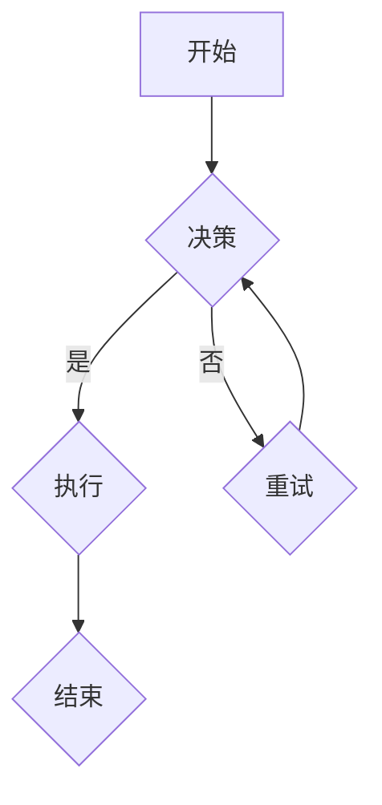

                 

# 《自动驾驶公司的数据闭环能力》

> 关键词：自动驾驶、数据闭环、传感器数据处理、边缘计算、数据挖掘与分析、决策与控制算法

> 摘要：本文将深入探讨自动驾驶公司的数据闭环能力。数据闭环是自动驾驶系统的核心组成部分，它涉及到传感器数据处理、边缘计算、数据存储与传输、数据挖掘与分析以及决策与控制算法等多个方面。本文将从这些方面逐一分析，以帮助读者理解数据闭环在自动驾驶系统中的重要性，并了解其实现方法与挑战。

## 第一部分：自动驾驶与数据闭环概述

### 第1章：自动驾驶技术概述

自动驾驶技术是指通过计算机算法和电子控制系统，使车辆能够在没有人类司机干预的情况下，实现自主导航、感知环境、决策和执行任务。自动驾驶技术的发展经历了多个阶段，从最初的辅助驾驶到现在的全自动驾驶，其核心在于数据的收集、处理与利用。

#### 1.1 自动驾驶的发展背景与未来趋势

自动驾驶技术的发展受到多方面的驱动。首先，随着城市化进程的加快，交通拥堵和交通事故问题日益严重，自动驾驶技术有望解决这些问题。其次，人工智能和大数据技术的发展，为自动驾驶技术的实现提供了强大的支持。此外，政策和市场需求的推动，也是自动驾驶技术快速发展的重要原因。

未来，自动驾驶技术将呈现以下趋势：

1. **自动驾驶等级的提高**：从目前的辅助驾驶逐渐向完全自动驾驶过渡。
2. **跨行业融合**：自动驾驶技术将与物流、交通、城市管理等领域深度融合。
3. **标准化和法规的完善**：随着自动驾驶技术的普及，相关标准和法规将逐步完善。

#### 1.2 自动驾驶技术的核心组成部分

自动驾驶技术由以下几个核心组成部分构成：

1. **传感器系统**：包括摄像头、激光雷达、雷达、GPS等，用于感知周围环境。
2. **计算平台**：用于处理传感器数据，实现环境感知、决策与控制。
3. **决策与控制算法**：用于根据传感器数据，进行驾驶决策并控制车辆。
4. **通信系统**：实现车辆与外部环境的通信，如车联网（V2X）。
5. **用户界面**：用于与驾驶员和乘客交互。

#### 1.3 自动驾驶等级划分与标准

根据国际自动机工程师学会（SAE）的定义，自动驾驶分为五个等级：

1. **L0：无自动化**：所有驾驶任务由人类驾驶员完成。
2. **L1：部分自动化**：至少有一个驾驶任务由系统自动完成。
3. **L2：部分自动化**：系统能够同时完成两个或两个以上的驾驶任务。
4. **L3：有条件自动化**：系统能够在特定条件下完全接管驾驶任务。
5. **L4：高度自动化**：在特定环境下，系统能够完全接管所有驾驶任务。
6. **L5：完全自动化**：在任何环境下，系统能够完全接管所有驾驶任务。

### 第2章：数据闭环的概念与重要性

数据闭环是指在一个系统中，数据从生成、处理、分析到决策和执行的全过程。在自动驾驶系统中，数据闭环起着至关重要的作用。它不仅确保了自动驾驶系统的稳定运行，还为系统不断优化和提升提供了数据支持。

#### 2.1 数据闭环的定义与作用

数据闭环在自动驾驶系统中的作用主要包括：

1. **环境感知与建模**：通过传感器数据，对周围环境进行感知和建模。
2. **决策与控制**：基于环境数据和车辆状态，进行驾驶决策和控制。
3. **反馈与优化**：通过执行结果，反馈到系统，进行优化和调整。

#### 2.2 数据闭环在自动驾驶中的应用

数据闭环在自动驾驶中的应用主要包括以下几个环节：

1. **传感器数据处理**：对传感器数据进行预处理、融合和降噪。
2. **边缘计算**：在车辆本地进行数据处理，提高响应速度。
3. **数据存储与传输**：将重要数据存储并传输到云端或数据中心。
4. **数据挖掘与分析**：对大量数据进行挖掘和分析，提取有价值的信息。
5. **决策与控制算法**：根据分析结果，进行驾驶决策和控制。

#### 2.3 数据闭环的优势与挑战

数据闭环的优势主要包括：

1. **实时性与可靠性**：通过本地数据处理，提高系统响应速度和可靠性。
2. **高效性**：通过数据分析和优化，提高驾驶效率和安全性能。
3. **可持续性**：通过不断优化，降低能耗和维护成本。

数据闭环面临的挑战主要包括：

1. **数据质量与一致性**：传感器数据可能存在噪声、缺失等问题，需要高质量的数据处理技术。
2. **数据隐私与安全**：大量敏感数据的存在，需要确保数据隐私和安全。
3. **计算资源与带宽**：本地计算和云端计算之间的资源与带宽平衡。

## 第二部分：数据闭环关键技术解析

### 第3章：传感器数据处理

传感器数据处理是数据闭环的关键环节之一。它涉及到传感器的选择、数据的预处理、融合和降噪等技术。

#### 3.1 常见传感器介绍

自动驾驶系统中常用的传感器包括：

1. **摄像头**：用于感知周围环境和交通状况。
2. **激光雷达（Lidar）**：用于测量距离，提供精确的三维环境模型。
3. **雷达**：用于探测物体距离和速度，适用于恶劣天气条件。
4. **GPS**：用于定位和导航。
5. **IMU（惯性测量单元）**：用于测量车辆的加速度和角速度。

#### 3.2 数据预处理方法

数据预处理是确保传感器数据质量的重要步骤。主要包括以下方法：

1. **去噪与滤波**：通过滤波算法，去除传感器数据中的噪声。
2. **数据插值**：对缺失的数据进行插值补全。
3. **尺度变换**：对传感器的数据量进行标准化处理。
4. **归一化**：将数据转换为统一的尺度，方便后续处理。

#### 3.3 数据融合与降噪技术

数据融合是将多个传感器的数据整合为一个统一的环境模型。常见的数据融合方法包括：

1. **卡尔曼滤波**：通过状态估计，将传感器数据融合到预测模型中。
2. **贝叶斯滤波**：基于概率模型，对传感器数据进行融合。
3. **多传感器数据融合**：结合不同传感器的优势，构建统一的环境模型。

降噪技术用于减少传感器数据中的噪声干扰，常见的方法包括：

1. **均值滤波**：通过计算多个观测值的均值，去除噪声。
2. **中值滤波**：通过选择多个观测值中的中值，去除噪声。
3. **高斯滤波**：通过高斯函数对观测值进行加权平均，去除噪声。

### 第4章：边缘计算与数据处理

边缘计算是近年来发展迅速的一项技术，它将计算能力从云端转移到靠近数据源的边缘设备上。在自动驾驶系统中，边缘计算能够提高系统的实时性和可靠性。

#### 4.1 边缘计算的概念与优势

边缘计算是指将数据处理和计算能力从云端转移到网络边缘的设备上。其优势主要包括：

1. **降低延迟**：将数据处理和计算近源，降低通信延迟。
2. **提高效率**：在边缘设备上进行数据处理，减轻云端负担。
3. **增强隐私性**：减少数据在云端传输和存储的需求，降低数据泄露风险。

#### 4.2 边缘数据处理框架

边缘数据处理框架主要包括以下几个部分：

1. **边缘设备**：如摄像头、传感器、车载计算机等。
2. **边缘网关**：用于数据收集、处理和传输。
3. **边缘云**：提供边缘设备之间的通信和资源共享。
4. **中心云**：负责处理和分析大量数据，并支持边缘设备的管理。

#### 4.3 边缘计算在自动驾驶中的应用

边缘计算在自动驾驶中的应用主要包括以下几个方面：

1. **实时环境感知**：通过边缘设备进行实时环境感知，提高自动驾驶系统的响应速度。
2. **故障诊断与维护**：通过边缘设备对车辆进行实时监控，提前发现潜在故障并进行维护。
3. **安全与隐私保护**：通过边缘计算，对车辆数据进行本地处理，降低数据泄露风险。

### 第5章：数据存储与传输

数据存储与传输是数据闭环的重要组成部分。它涉及到数据存储方案的选择、数据传输协议的设计以及数据隐私保护等问题。

#### 5.1 数据存储方案选择

数据存储方案的选择主要考虑以下因素：

1. **数据量**：根据数据量的大小，选择合适的存储方案，如本地存储、云存储等。
2. **数据类型**：根据数据类型的不同，选择合适的存储方案，如关系型数据库、NoSQL数据库等。
3. **性能要求**：根据系统的性能要求，选择合适的存储方案，如快速读写、高并发等。

常见的存储方案包括：

1. **本地存储**：在车辆内部进行数据存储，适用于小数据量和实时性要求高的场景。
2. **云存储**：将数据存储在云端，适用于大数据量和远程访问的场景。
3. **分布式存储**：通过分布式存储系统，提高数据存储的可靠性和扩展性。

#### 5.2 数据传输协议

数据传输协议的选择主要考虑以下因素：

1. **通信距离**：根据通信距离的远近，选择合适的传输协议，如TCP、UDP等。
2. **数据可靠性**：根据数据的重要性，选择合适的传输协议，如TCP提供可靠传输，UDP提供高效传输。
3. **实时性要求**：根据系统的实时性要求，选择合适的传输协议，如实时通信系统采用UDP协议。

常见的数据传输协议包括：

1. **TCP/IP协议**：提供可靠的传输服务，适用于大数据量和可靠性要求高的场景。
2. **UDP协议**：提供高效的传输服务，适用于实时性要求高的场景。
3. **HTTP协议**：基于TCP协议，用于Web服务的数据传输。

#### 5.3 数据隐私保护

数据隐私保护是数据存储与传输中重要的一环。主要措施包括：

1. **数据加密**：通过加密算法，对数据进行加密处理，防止数据泄露。
2. **访问控制**：通过访问控制机制，限制只有授权用户才能访问数据。
3. **审计与监控**：通过审计和监控机制，及时发现并处理数据泄露事件。

### 第6章：数据挖掘与分析

数据挖掘与分析是数据闭环中的关键环节。它通过挖掘和分析大量数据，提取有价值的信息，为自动驾驶系统的优化和提升提供支持。

#### 6.1 数据挖掘方法与工具

数据挖掘方法主要包括以下几种：

1. **关联规则挖掘**：发现数据之间的关联关系，用于推荐系统等。
2. **分类与预测**：将数据分为不同的类别，用于分类问题。
3. **聚类分析**：将数据分为不同的群体，用于数据压缩等。
4. **异常检测**：检测数据中的异常值，用于故障诊断等。

常见的数据挖掘工具包括：

1. **Hadoop**：用于分布式数据处理，适用于大数据场景。
2. **Spark**：用于内存计算，适用于实时数据处理。
3. **TensorFlow**：用于深度学习，适用于复杂的数据分析任务。

#### 6.2 车辆行为分析

车辆行为分析是通过数据挖掘技术，分析车辆的驾驶行为，为自动驾驶系统的优化提供支持。主要内容包括：

1. **驾驶习惯分析**：分析驾驶员的驾驶习惯，如加速、减速、转弯等。
2. **安全性能分析**：分析车辆的碰撞风险、行驶稳定性等。
3. **能效分析**：分析车辆的能耗情况，优化驾驶策略，提高能效。

#### 6.3 道路交通数据挖掘

道路交通数据挖掘是通过分析大量道路交通数据，提取有价值的信息，为交通管理和优化提供支持。主要内容包括：

1. **交通流量分析**：分析道路上的车辆流量、速度等，为交通管制提供依据。
2. **路况分析**：分析道路的拥堵情况、事故发生等，为道路维护提供依据。
3. **路况预测**：预测未来的交通状况，为出行规划提供依据。

### 第7章：决策与控制算法

决策与控制算法是自动驾驶系统的核心。它通过分析传感器数据，进行驾驶决策并控制车辆。

#### 7.1 决策算法概述

决策算法主要包括以下几种：

1. **规则基算法**：通过预定义的规则进行决策，简单直观，但灵活性较低。
2. **模型预测控制算法**：通过建立模型，对未来的驾驶情况进行预测，并根据预测结果进行决策。
3. **深度学习算法**：通过深度神经网络，学习驾驶数据，进行自主决策。

#### 7.2 控制算法介绍

控制算法主要包括以下几种：

1. **PID控制算法**：通过比例、积分、微分控制，调节车辆的加速度和角速度。
2. **模糊控制算法**：通过模糊逻辑，对驾驶行为进行控制，具有较好的灵活性和适应性。
3. **深度学习控制算法**：通过深度神经网络，学习控制数据，进行自主控制。

#### 7.3 决策与控制的协调机制

决策与控制的协调机制主要包括以下几种：

1. **分级协调**：将决策与控制分为不同的层次，分别进行决策和控制，降低系统复杂性。
2. **并行协调**：将决策与控制同时进行，通过通信和同步机制，实现协调运行。
3. **混合协调**：将规则基、模型预测控制和深度学习算法相结合，实现灵活的协调机制。

## 第三部分：数据闭环应用实践

### 第8章：自动驾驶系统测试与验证

自动驾驶系统的测试与验证是确保系统稳定性和安全性的关键环节。数据闭环在测试与验证中发挥着重要作用。

#### 8.1 自动驾驶测试方法

自动驾驶测试方法主要包括以下几种：

1. **模拟测试**：通过仿真环境，模拟各种驾驶场景，测试系统的性能和稳定性。
2. **道路测试**：在实际道路上进行测试，验证系统的实际驾驶性能。
3. **封闭场地测试**：在封闭的场地内进行测试，模拟不同的驾驶场景，验证系统的响应和决策能力。

#### 8.2 数据闭环在测试中的应用

数据闭环在测试中的应用主要包括以下几个方面：

1. **测试数据收集**：通过传感器和计算平台，收集测试过程中的数据。
2. **测试数据分析**：对收集到的测试数据进行处理和分析，评估系统的性能和稳定性。
3. **测试数据管理**：建立测试数据的管理系统，对测试数据进行存储、备份和共享。

#### 8.3 测试数据的管理与分析

测试数据的管理与分析是确保测试数据质量和可用性的关键。主要包括以下步骤：

1. **数据清洗**：去除测试数据中的噪声和异常值，确保数据质量。
2. **数据融合**：将不同来源的测试数据进行融合，构建统一的环境模型。
3. **数据挖掘与分析**：通过数据挖掘技术，提取测试数据中的有价值信息，为系统优化和提升提供支持。

### 第9章：自动驾驶示范项目案例

自动驾驶示范项目案例是验证自动驾驶技术可行性和商业价值的重要途径。数据闭环在项目案例中发挥着关键作用。

#### 9.1 项目背景与目标

项目背景与目标主要包括以下几个方面：

1. **项目背景**：介绍项目的背景和需求，如城市交通拥堵、物流配送等。
2. **项目目标**：明确项目的目标，如实现自动驾驶、提高物流效率等。

#### 9.2 数据闭环方案设计

数据闭环方案设计主要包括以下几个方面：

1. **传感器系统设计**：选择合适的传感器，构建传感器系统，实现环境感知。
2. **计算平台设计**：选择合适的计算平台，实现数据处理和分析。
3. **通信系统设计**：设计通信系统，实现车辆与外部环境的通信。
4. **决策与控制算法设计**：设计决策与控制算法，实现自动驾驶功能。

#### 9.3 项目实施与效果评估

项目实施与效果评估主要包括以下几个方面：

1. **项目实施**：按照设计方案，进行项目的实施和部署。
2. **效果评估**：通过测试与验证，评估项目的性能和效果，如自动驾驶的稳定性、安全性、效率等。

### 第10章：数据闭环能力评估与提升

数据闭环能力评估与提升是确保自动驾驶系统持续优化和提升的重要手段。主要包括以下几个方面：

#### 10.1 数据闭环能力评估指标

数据闭环能力评估指标主要包括以下几个方面：

1. **环境感知能力**：评估传感器数据处理和融合的效果，如环境建模的准确性、数据噪声等。
2. **决策与控制能力**：评估决策与控制算法的性能，如响应速度、决策准确性等。
3. **数据存储与传输能力**：评估数据存储与传输的性能，如数据传输速率、数据丢失率等。
4. **数据分析能力**：评估数据挖掘与分析的效果，如数据质量、数据利用率等。

#### 10.2 能力提升策略与方法

能力提升策略与方法主要包括以下几个方面：

1. **技术创新**：通过引入新技术，提升系统的性能和效率，如深度学习、边缘计算等。
2. **数据优化**：通过优化数据处理和分析流程，提高数据的质量和利用率，如数据清洗、数据融合等。
3. **算法优化**：通过优化决策与控制算法，提高系统的响应速度和准确性，如模型预测控制、深度学习控制等。
4. **测试与验证**：通过持续测试与验证，评估系统的性能和效果，发现并解决潜在问题。

#### 10.3 数据闭环能力的持续优化

数据闭环能力的持续优化主要包括以下几个方面：

1. **反馈机制**：建立反馈机制，收集用户反馈，持续优化系统。
2. **迭代更新**：根据用户反馈和测试结果，定期更新系统，提升性能和效果。
3. **数据共享与协作**：通过数据共享和协作，积累经验，共同提升数据闭环能力。

## 附录

### 附录A：数据闭环相关资源与工具

附录A主要包括以下内容：

1. **数据闭环相关书籍**：推荐几本关于数据闭环、自动驾驶和人工智能的经典书籍。
2. **数据闭环相关论文**：推荐一些关于数据闭环和自动驾驶的顶级学术论文。
3. **数据闭环相关工具**：介绍一些常用的数据闭环工具和软件，如传感器数据处理软件、边缘计算平台等。

### 附录B：Mermaid流程图示例

以下是一个Mermaid流程图示例：



### 附录C：决策与控制算法伪代码示例

以下是一个简单的决策与控制算法伪代码示例：

```plaintext
function decision_and_control(sensor_data, vehicle_state):
    # 数据预处理
    preprocessed_data = preprocess_data(sensor_data)

    # 环境建模
    environment_model = build_model(preprocessed_data)

    # 驾驶决策
    decision = make_decision(environment_model, vehicle_state)

    # 控制车辆
    execute_control_command(decision)

    return decision
```

### 附录D：数学模型与公式示例

以下是一个简单的数学模型和公式示例：

```latex
\begin{align*}
    J &= \frac{1}{2} \sum_{i=1}^{n} (x_i - y_i)^2 \\
    \hat{x} &= \frac{1}{N} \sum_{i=1}^{N} x_i \\
    \hat{y} &= \frac{1}{N} \sum_{i=1}^{N} y_i
\end{align*}
```

### 附录E：项目实战代码与解析

以下是一个简单的项目实战代码示例：

```python
import numpy as np

def preprocess_data(sensor_data):
    # 数据清洗
    cleaned_data = sensor_data.copy()
    cleaned_data = np.where(cleaned_data < 0, 0, cleaned_data)
    cleaned_data = np.where(cleaned_data > 100, 100, cleaned_data)
    
    # 数据归一化
    normalized_data = cleaned_data / 100
    
    return normalized_data

def build_model(sensor_data):
    # 建立线性模型
    model = np.polyfit(sensor_data[:, 0], sensor_data[:, 1], 1)
    return model

def make_decision(model, vehicle_state):
    # 驾驶决策
    slope, intercept = model
    decision = intercept + slope * vehicle_state
    return decision

def execute_control_command(decision):
    # 控制车辆
    print(f"Execute control command: {decision}")

# 测试代码
sensor_data = np.array([[10, 5], [20, 10], [30, 15]])
vehicle_state = 20

preprocessed_data = preprocess_data(sensor_data)
model = build_model(preprocessed_data)
decision = make_decision(model, vehicle_state)
execute_control_command(decision)
```

### 作者简介

作者：AI天才研究院/AI Genius Institute & 禅与计算机程序设计艺术 /Zen And The Art of Computer Programming

## Mermaid 流程图


## 结论

自动驾驶公司的数据闭环能力是自动驾驶系统成功的关键。本文从传感器数据处理、边缘计算、数据存储与传输、数据挖掘与分析以及决策与控制算法等多个方面，详细探讨了数据闭环在自动驾驶系统中的重要性、实现方法与挑战。通过数据闭环，自动驾驶系统能够实现实时环境感知、智能决策与控制，提高驾驶安全性和效率。未来的自动驾驶系统将更加依赖于数据闭环，其能力也将不断提升。希望本文能为从事自动驾驶技术研究和开发的人员提供有价值的参考。

