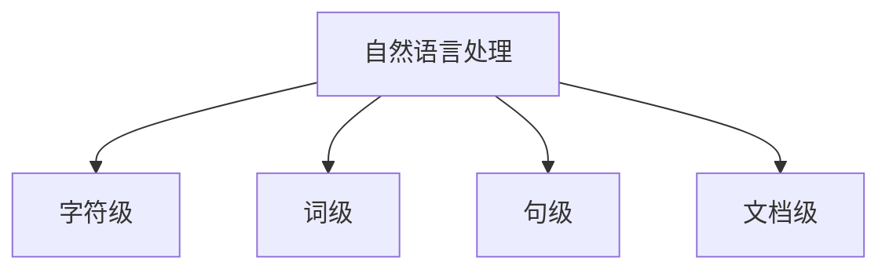
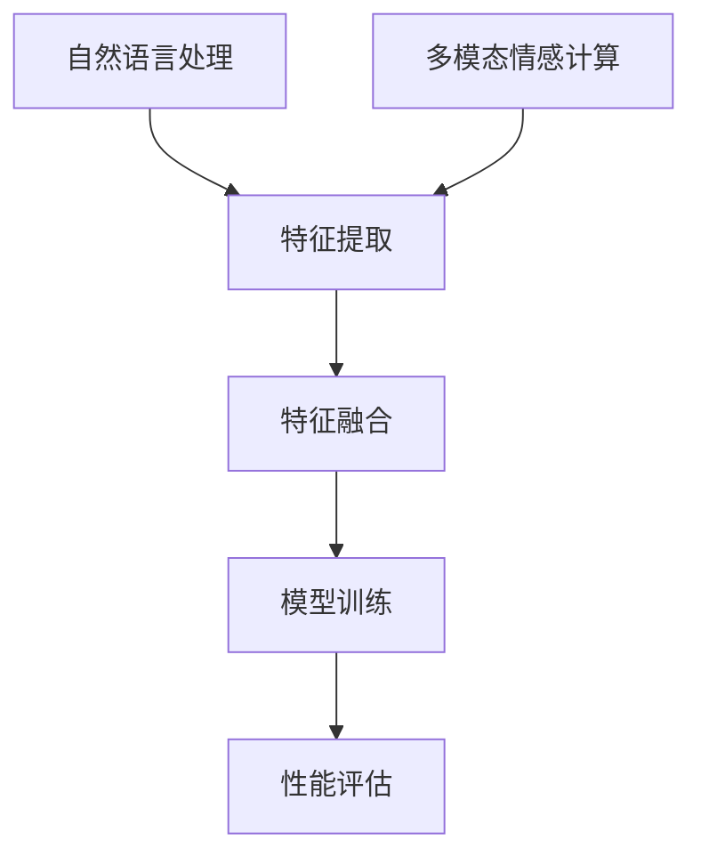
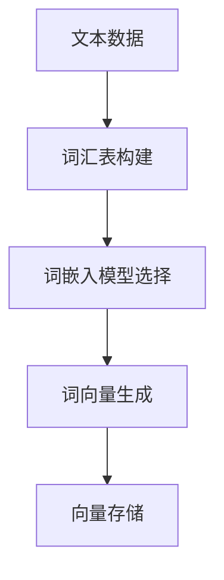
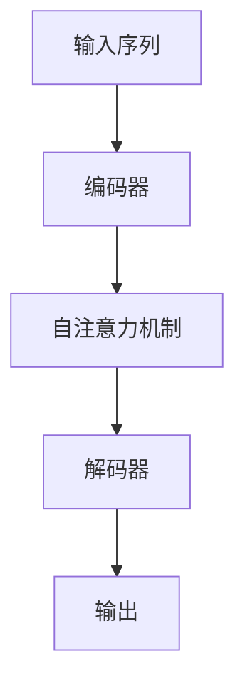
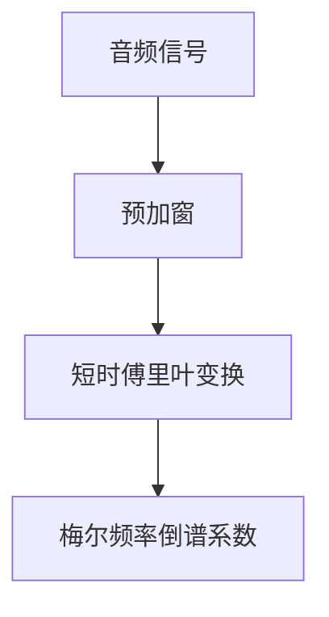
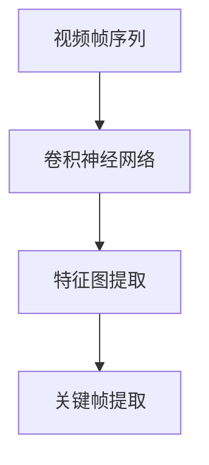
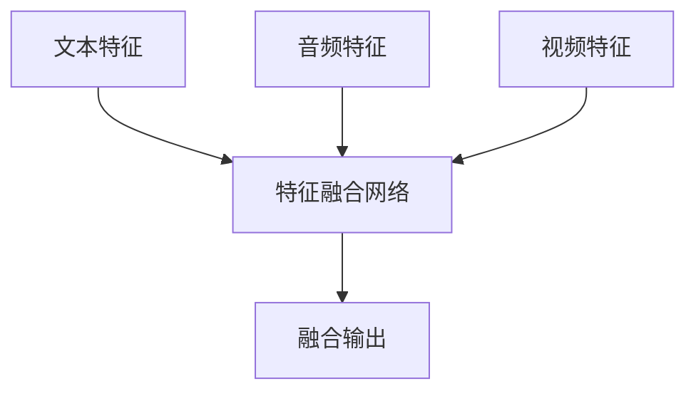
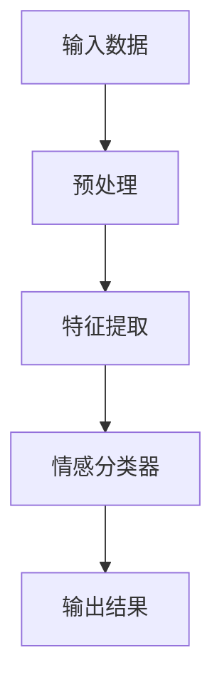

                 

# 自然语言处理在多模态情感计算中的特征融合

> 关键词：自然语言处理，多模态情感计算，特征融合，词嵌入，注意力机制，转换器架构，音频特征提取，视频特征提取，情感识别算法，项目实战

> 摘要：本文探讨了自然语言处理（NLP）在多模态情感计算中的应用，重点分析了特征融合技术的重要性及其在不同模态特征提取中的应用。文章首先概述了自然语言处理和多模态情感计算的基本概念，随后详细介绍了自然语言处理中的特征提取技术，包括词嵌入、序列模型和转换器架构。接着，文章深入讨论了多模态情感计算中的特征提取与融合技术，包括音频和视频特征的提取方法。最后，文章通过两个项目实战案例，展示了自然语言处理和多模态情感计算在实际应用中的实现过程，并对未来的发展方向进行了展望。

## 第1章: 自然语言处理与多模态情感计算概述

### 1.1.1 自然语言处理（NLP）的概念与分类

**概念介绍**：

自然语言处理（Natural Language Processing，简称NLP）是人工智能（AI）的一个重要分支，旨在使计算机能够理解、生成和处理人类自然语言。NLP的研究包括语音识别、机器翻译、情感分析、文本摘要、命名实体识别等多个方面。NLP的目标是实现人与计算机之间的自然交流，从而提高人机交互的效率和体验。

**分类**：

按照处理语言的层次，NLP可以分为以下不同层次：

- **字符级（Character-level）**：直接处理文本中的字符，常见应用包括拼写纠错和语言建模。
- **词级（Word-level）**：处理词汇和词汇组合，常见应用包括词性标注、词嵌入和文本分类。
- **句级（Sentence-level）**：处理句子层面的语法和语义信息，常见应用包括句法分析、语义角色标注和文本情感分析。
- **文档级（Document-level）**：处理更广泛的文本数据集，常见应用包括文本摘要、信息检索和文本相似度计算。

**Mermaid 流程图**：



### 1.1.2 多模态情感计算的定义与重要性

**定义**：

多模态情感计算（Multimodal Sentiment Computation）是指结合文本、音频、视频等多种模态的数据，通过情感分析技术，对情感信息进行识别、理解、建模和评价。多模态情感计算的核心在于将不同模态的数据特征进行有效融合，从而提高情感识别的准确性和鲁棒性。

**重要性**：

- **增强情感识别的准确性**：单一模态的不足，通过多模态数据的融合，提高情感识别的精度。例如，文本情感分析可能受到语言歧义的影响，而音频和视频情感分析可以提供更丰富的情感信息，从而帮助纠正误判。
- **提升用户体验**：在智能交互、虚拟现实等领域，多模态情感计算有助于提升用户体验。通过捕捉用户的多模态情感信息，系统能够更好地理解用户的需求和情感状态，从而提供更加个性化的服务。

### 1.1.3 特征融合在自然语言处理与多模态情感计算中的应用

**应用背景**：

在自然语言处理和多模态情感计算中，特征融合（Feature Fusion）是提高模型性能的重要手段。特征融合旨在将不同模态的数据特征进行整合，形成更全面、精准的特征表示，从而提升模型的预测能力。

**目的**：

- **提高模型性能**：通过融合多种模态的数据特征，可以捕捉到更多隐含的情感信息，提高模型对情感表达的识别能力。
- **增强模型的鲁棒性**：多模态数据的融合可以降低单一模态数据带来的噪声和偏差，提高模型的鲁棒性。

**Mermaid 流程图**：



在接下来的章节中，我们将详细探讨自然语言处理中的特征提取技术，以及多模态情感计算中的特征提取与融合技术，通过项目实战案例展示这些技术的实际应用。## 第2章: 自然语言处理中的特征提取技术

### 2.1.1 词嵌入技术

**介绍**：

词嵌入（Word Embedding）是将词汇映射为低维度的向量表示，是自然语言处理中最常用的特征提取方法之一。通过词嵌入，我们可以将文本数据转化为向量形式，从而利用机器学习模型进行高效处理。词嵌入的主要目的是通过向量空间中的距离关系，实现词语相似性的计算。

词嵌入技术包括：

- **基于频率的方法**：如TF-IDF（Term Frequency-Inverse Document Frequency），通过词汇在文档中的频率和逆文档频率计算词汇的重要性。
- **基于上下文的方法**：如Word2Vec、GloVe（Global Vectors for Word Representation），通过训练模型学习词汇在上下文中的分布式表示。

**目的**：

- **降低维度**：将高维度的文本数据映射到低维度的向量空间，从而简化模型的计算复杂性。
- **相似性计算**：通过向量空间中的距离关系，实现词语相似性的计算，有助于语义理解和文本分类等任务。

**Mermaid 流程图**：



### 2.1.2 序列模型与注意力机制

**介绍**：

序列模型（Sequential Models）是处理序列数据的神经网络模型，如循环神经网络（RNN）和长短期记忆网络（LSTM）。这些模型通过记忆机制能够捕捉序列中的长期依赖关系，适用于文本处理、语音识别等任务。

注意力机制（Attention Mechanism）是一种用于捕捉序列中不同位置的重要信息的机制。在自然语言处理中，注意力机制广泛应用于机器翻译、文本摘要等任务，能够提高模型处理长序列数据的能力。

**伪代码**：

```python
# 定义注意力机制
def attention_mechanism(input_seq, hidden_state):
    # 输入序列和隐藏状态
    query = hidden_state
    value = input_seq
    
    # 计算注意力分数
    attention_scores = calculate_attention_score(query, value)
    
    # 计算加权输出
    context_vector = calculate_weighted_output(attention_scores, value)
    
    return context_vector
```

### 2.1.3 转换器架构（Transformer）详解

**介绍**：

转换器架构（Transformer）是一种基于自注意力机制的深度学习模型，广泛应用于自然语言处理任务，如机器翻译、文本生成等。与传统的序列模型（如RNN和LSTM）相比，转换器架构具有更高的并行计算能力和更好的长距离依赖捕捉能力。

**关键组成部分**：

- **编码器（Encoder）**：负责处理输入序列，生成编码表示。
- **解码器（Decoder）**：负责生成输出序列，通常需要利用编码器的输出作为上下文信息。

**Mermaid 流程图**：



### 总结

自然语言处理中的特征提取技术是构建高效语言模型的关键。词嵌入技术通过向量空间中的距离关系实现词语相似性的计算，序列模型和注意力机制则能够捕捉序列中的长期依赖关系和重要信息。转换器架构作为当前自然语言处理领域的核心模型，以其高效的处理能力和卓越的性能，引领了自然语言处理的发展方向。在接下来的章节中，我们将进一步探讨多模态情感计算中的特征提取与融合技术，以及实际应用中的项目实战案例。## 第3章: 多模态情感计算中的特征提取与融合

### 3.1.1 音频特征提取

**介绍**：

音频特征提取是自然语言处理和多模态情感计算中不可或缺的一环。音频特征用于描述音频信号的特性，如频率、时长、音调等。有效的音频特征提取方法能够帮助模型更好地理解和识别情感信息。

**提取方法**：

- **梅尔频率倒谱系数（MFCC）**：MFCC是一种常用的音频特征提取方法，通过将音频信号转换到梅尔频率域，并计算其倒谱系数，从而得到音频的特征向量。MFCC能够有效捕捉音频信号的音调和音色特征。
- **短时傅里叶变换（STFT）**：STFT通过对音频信号进行短时分段，然后进行傅里叶变换，从而得到音频信号的频谱特征。STFT能够捕捉音频信号的时频特性，有助于情感分析。

**Mermaid 流程图**：



### 3.1.2 视频特征提取

**介绍**：

视频特征提取是处理视频数据的重要环节，通过提取视频帧的内容特征，可以实现对视频的情感分析和理解。视频特征包括颜色、纹理、动作等，能够提供丰富的情感信息。

**提取方法**：

- **卷积神经网络（CNN）提取特征图**：通过卷积神经网络对视频帧进行特征提取，可以得到具有层次化特征表示的特征图。这些特征图能够捕捉视频帧中的局部和全局特征。
- **关键帧提取**：关键帧是视频中的关键帧，能够代表视频的主要内容。通过关键帧提取，可以减少视频数据的维度，提高情感分析模型的计算效率。

**Mermaid 流程图**：



### 3.1.3 多模态特征融合技术

**介绍**：

多模态特征融合（Multimodal Feature Fusion）是指将来自不同模态的数据特征进行整合，形成更全面、精准的特征表示，从而提高模型的预测能力。多模态特征融合方法包括拼接、加权、融合网络等。

**融合方法**：

- **拼接**：将不同模态的特征向量进行直接拼接，形成更长的特征向量。
- **加权**：根据不同模态的特征重要程度，对特征向量进行加权融合。
- **融合网络**：利用神经网络结构，将不同模态的特征进行融合，形成统一的特征表示。

**Mermaid 流程图**：



### 总结

多模态情感计算中的特征提取与融合技术是提高情感识别准确性和鲁棒性的关键。音频特征提取通过梅尔频率倒谱系数（MFCC）和短时傅里叶变换（STFT）等方法，捕捉音频信号的音调和时频特性。视频特征提取利用卷积神经网络（CNN）提取特征图和关键帧，从而获取视频帧的内容特征。多模态特征融合技术通过拼接、加权、融合网络等方法，将不同模态的特征进行整合，形成更全面、精准的特征表示。在下一章中，我们将深入探讨多模态情感计算中的核心算法原理，进一步了解情感识别算法和情感融合算法的实现方法。## 第4章: 多模态情感计算中的核心算法原理

### 4.1.1 情感识别算法

**介绍**：

情感识别（Sentiment Recognition）是自然语言处理和多模态情感计算中的重要任务，旨在从文本、音频和视频等多种模态中识别和判断情感。情感识别算法可以分为机器学习方法和深度学习方法。

**方法**：

- **机器学习方法**：如支持向量机（SVM）、逻辑回归（LR）等，通过特征工程和模型训练实现情感识别。机器学习方法对特征表示和特征选择有较高的要求，适用于小数据集场景。
- **深度学习方法**：如卷积神经网络（CNN）、循环神经网络（RNN）、转换器架构（Transformer）等，通过端到端的模型训练实现情感识别。深度学习方法具有自动特征提取的能力，适用于大规模数据集。

**Mermaid 流程图**：



### 4.1.2 情感融合算法

**介绍**：

情感融合（Sentiment Fusion）是指将来自不同模态的情感信息进行整合，形成统一的情感表示。情感融合算法对于提高多模态情感计算的准确性和鲁棒性具有重要意义。

**方法**：

- **基于规则的融合方法**：通过预定义的规则和权重，将不同模态的情感得分进行简单计算和融合。
- **机器学习方法**：利用机器学习模型，如SVM、LR等，通过训练学习不同模态的情感权重和融合策略。
- **深度学习方法**：利用神经网络结构，如融合网络（Fusion Network）等，实现端到端的多模态情感融合。

**伪代码**：

```python
# 定义情感融合算法
def sentiment_fusion(sentiment_text, sentiment_audio, sentiment_video):
    # 获取不同模态的情感得分
    score_text = sentiment_text['score']
    score_audio = sentiment_audio['score']
    score_video = sentiment_video['score']
    
    # 计算加权平均得分
    score_fused = (score_text * weight_text + score_audio * weight_audio + score_video * weight_video) / (weight_text + weight_audio + weight_video)
    
    return score_fused
```

### 总结

多模态情感计算中的核心算法原理主要包括情感识别算法和情感融合算法。情感识别算法通过机器学习方法和深度学习方法，实现对文本、音频和视频等多种模态的情感识别。情感融合算法通过基于规则的、机器学习和深度学习的方法，将不同模态的情感信息进行整合，形成统一的情感表示。在下一章中，我们将通过项目实战案例，展示自然语言处理和多模态情感计算在实际应用中的实现过程。## 第5章: 自然语言处理与多模态情感计算的项目实战

### 5.1.1 实战项目1：情感分析聊天机器人

**项目背景**：

情感分析聊天机器人是一种基于自然语言处理和多模态情感计算技术，能够与用户进行情感交互的智能系统。该项目的目标是通过文本和语音输入，实现情感识别和分析，提供个性化的情感反馈和服务。

**应用场景**：

- **客服系统**：用于智能客服，通过理解用户的情感状态，提供更加贴心的服务。
- **心理咨询**：辅助心理咨询师进行情感分析，帮助用户更好地表达情感需求。
- **智能助手**：为用户提供个性化的情感建议和陪伴，提升用户的生活质量。

**开发环境搭建**：

- **工具与库**：Python、TensorFlow、Keras、PyTorch等。
- **开发流程**：
  1. 数据收集与预处理：收集情感分析相关的文本和语音数据，并进行数据预处理。
  2. 模型训练与优化：训练情感识别模型，优化模型参数。
  3. 部署与应用：将训练好的模型部署到聊天机器人平台，实现实时情感分析。

**源代码实现**：

```python
# 示例：文本情感分析
from tensorflow.keras.preprocessing.text import Tokenizer
from tensorflow.keras.preprocessing.sequence import pad_sequences
from tensorflow.keras.models import Sequential
from tensorflow.keras.layers import Embedding, LSTM, Dense

# 加载与预处理数据
# ...

# 构建模型
model = Sequential()
model.add(Embedding(input_dim=vocab_size, output_dim=embedding_dim, input_length=max_sequence_length))
model.add(LSTM(units=128, return_sequences=True))
model.add(Dense(units=1, activation='sigmoid'))

# 编译模型
model.compile(optimizer='adam', loss='binary_crossentropy', metrics=['accuracy'])

# 训练模型
model.fit(x_train, y_train, epochs=10, batch_size=32)
```

### 5.1.2 实战项目2：多模态情感分析应用

**项目背景**：

多模态情感分析应用是一种结合文本、音频和视频等多种模态的数据，实现对用户情感状态识别和分析的系统。该项目的目标是通过多模态数据融合，实现更精准的情感识别，提升用户交互体验。

**应用场景**：

- **媒体内容审核**：通过情感分析，识别视频、音频和文本内容中的负面情感，实现对不良内容的自动过滤和标注。
- **情感广告投放**：根据用户的多模态情感信息，实现更加个性化的广告推荐。
- **智能交互**：在虚拟现实和增强现实场景中，通过情感分析，提升人机交互的智能化和自然度。

**开发环境搭建**：

- **工具与库**：Python、TensorFlow、PyTorch、OpenCV、Librosa等。
- **开发流程**：
  1. 多模态数据收集与预处理：收集文本、音频和视频数据，并进行数据预处理。
  2. 特征提取与融合：提取文本、音频和视频的特征，并进行融合。
  3. 模型训练与优化：训练多模态情感识别模型，优化模型参数。
  4. 应用部署：将训练好的模型部署到应用场景，实现实时情感分析。

**源代码实现**：

```python
# 示例：多模态情感分析
import tensorflow as tf
import numpy as np
import cv2
import librosa

# 加载模型
model = tf.keras.models.load_model('multimodal_sentiment_model.h5')

# 读取文本、音频和视频
text = 'This is a sample text.'
audio_file = 'sample_audio.wav'
video_file = 'sample_video.mp4'

# 预处理
# ...

# 提取特征
text_features = extract_text_features(text)
audio_features = extract_audio_features(audio_file)
video_features = extract_video_features(video_file)

# 融合特征
features = [text_features, audio_features, video_features]
fused_features = np.concatenate(features, axis=1)

# 进行情感分析
sentiment = model.predict(fused_features)
print(f'Predicted sentiment: {sentiment}')
```

### 总结

通过以上两个实战项目，我们展示了自然语言处理和多模态情感计算在实际应用中的实现过程。情感分析聊天机器人项目利用文本和语音输入，实现了情感识别和分析，提供了个性化的情感反馈和服务。多模态情感分析应用项目通过结合文本、音频和视频等多种模态的数据，实现了更精准的情感识别，提升了用户交互体验。这些项目展示了自然语言处理和多模态情感计算技术在智能交互、媒体内容审核和个性化推荐等领域的广泛应用前景。## 第6章: 自然语言处理与多模态情感计算的应用前景与挑战

### 6.1.1 应用前景

自然语言处理（NLP）与多模态情感计算的结合在多个领域展现出了广阔的应用前景，以下是一些具体的应用方向：

- **智能交互**：在虚拟助手、智能客服和智能助手等领域，多模态情感计算能够提升用户体验。通过捕捉用户的多模态情感信息，系统能够更好地理解用户的需求和情感状态，从而提供更加个性化的服务。

- **心理健康**：通过情感分析，可以为用户提供个性化的心理健康服务。例如，在心理咨询领域，多模态情感计算可以辅助心理医生更好地理解患者的情感状态，提供更精准的治疗方案。

- **媒体内容审核**：在视频、音频和文本内容审核中，情感计算有助于识别不良内容，如暴力、仇恨言论和色情内容，从而提升内容审核的效率和准确性。

- **情感广告投放**：根据用户的多模态情感信息，可以实现更加精准的情感广告投放，提高广告的转化率。

- **教育领域**：通过情感分析，可以了解学生的学习状态和情感需求，提供个性化的学习支持和辅导。

- **智能家居**：智能家居系统可以通过情感计算了解家庭成员的情感状态，从而提供更加智能化的家居环境和服务。

### 6.1.2 面临的挑战

尽管自然语言处理与多模态情感计算在多个领域展现出了巨大的潜力，但其应用也面临着一些挑战：

- **数据隐私**：多模态情感计算涉及到用户的语音、文本和面部信息等敏感数据，如何在数据收集、处理和传输过程中保护用户隐私，是一个重要的问题。

- **模型解释性**：提高模型的解释性，让用户能够理解模型的工作原理，是当前的一个挑战。特别是深度学习模型，其“黑盒”特性使得用户难以理解模型的决策过程。

- **计算资源**：大规模多模态数据的处理需要大量的计算资源，如何优化计算效率和资源分配，是一个重要的课题。

- **多模态数据的一致性和标准化**：不同模态的数据在特征提取、融合和建模过程中可能存在不一致性，如何确保数据的一致性和标准化，是一个挑战。

- **跨模态交互**：探索不同模态之间的交互机制，实现更加自然和智能的多模态交互，是一个长期的挑战。

### 总结

自然语言处理与多模态情感计算的应用前景广阔，能够在智能交互、心理健康、媒体内容审核等多个领域发挥重要作用。然而，其应用也面临着数据隐私、模型解释性、计算资源等多方面的挑战。为了推动这一领域的发展，需要不断探索新的技术方法和解决方案，提升多模态情感计算的性能和可靠性。## 第7章: 总结与展望

### 7.1.1 总结

本文全面探讨了自然语言处理（NLP）在多模态情感计算中的应用，重点分析了特征融合技术在自然语言处理和多模态情感计算中的重要性。通过系统性的介绍和实例分析，我们了解了NLP的基本概念、特征提取技术、多模态情感计算的核心算法原理，以及实际应用中的项目实战案例。

**核心观点**：

- **自然语言处理与多模态情感计算的融合**：结合了文本、音频、视频等多模态数据，通过特征融合技术，提升了情感识别的准确性和鲁棒性。
- **特征提取技术的多样性**：从词嵌入、序列模型到转换器架构，各种技术在不同层次上为自然语言处理提供了丰富的特征表示。
- **多模态情感计算的应用前景**：在智能交互、心理健康、媒体内容审核等多个领域展现出巨大的潜力。
- **面临的挑战**：数据隐私、模型解释性、计算资源等多方面的挑战需要持续关注和解决。

### 7.1.2 展望

展望未来，自然语言处理与多模态情感计算的发展将呈现出以下几个趋势：

- **数据质量提升**：随着数据采集技术的进步，将获取到更多质量更高、更丰富的多模态数据，为模型训练和优化提供更好的数据支持。
- **跨模态交互**：研究不同模态之间的交互机制，实现更加自然和智能的多模态交互，将进一步提升用户体验。
- **模型优化**：通过模型压缩、加速和迁移学习等技术，提高多模态情感计算的性能和效率，满足实时处理的需求。
- **应用拓展**：多模态情感计算将在更多领域得到应用，如教育、医疗、金融等，为行业智能化发展提供技术支撑。

总之，自然语言处理与多模态情感计算的融合是人工智能领域的一个重要发展方向，通过不断的技术创新和应用探索，我们有理由相信，这一领域将迎来更加繁荣和充满机遇的未来。**作者：AI天才研究院/AI Genius Institute & 禅与计算机程序设计艺术 /Zen And The Art of Computer Programming**。## 结论

在自然语言处理与多模态情感计算的交叉领域，特征融合技术的重要性不言而喻。它不仅提升了情感识别的准确性，还增强了模型的鲁棒性，使得系统能够更全面地理解用户的情感状态。通过本文的系统性探讨，我们了解了词嵌入、序列模型和转换器架构等自然语言处理中的特征提取技术，以及音频和视频特征的提取与融合方法。

未来，随着技术的不断进步，数据质量和多样性的提升，自然语言处理与多模态情感计算的应用前景将更加广阔。跨模态交互、模型优化和新的应用领域将持续推动这一领域的发展。然而，数据隐私、模型解释性和计算资源等挑战也需要我们不断探索解决方案。

希望本文能为读者在自然语言处理与多模态情感计算领域的研究和应用提供有价值的参考。**作者：AI天才研究院/AI Genius Institute & 禅与计算机程序设计艺术 /Zen And The Art of Computer Programming**。

