                 

# 《自然语言处理在法律文本自动化中的应用》

## 关键词
自然语言处理，法律文本，自动化，合同生成，法律文档审核，人工智能，深度学习

## 摘要
本文探讨了自然语言处理在法律文本自动化中的应用。首先，介绍了自然语言处理的基本概念和原理，包括语言模型、词嵌入技术和文本预处理。接着，分析了法律文本的特点与挑战，以及自然语言处理在法律文本预处理和语义分析中的应用。随后，本文重点讨论了法律文本自动化在合同生成和法律文档审核中的应用，包括具体的算法实现和案例分析。最后，探讨了法律文本自动化的未来发展趋势和面临的伦理与法律问题，为相关研究和应用提供了有益的参考。

---

### 《自然语言处理在法律文本自动化中的应用》目录大纲

#### 第一部分：自然语言处理基础

#### 第二部分：法律文本处理

#### 第三部分：法律文本自动化应用

#### 第四部分：法律文本自动化的未来趋势

#### 附录：自然语言处理与法律文本自动化的资源与工具

---

### 第一部分：自然语言处理基础

#### 第1章：自然语言处理概述

自然语言处理（Natural Language Processing，NLP）是人工智能（Artificial Intelligence，AI）的一个重要分支，致力于使计算机能够理解、生成和处理人类自然语言。NLP在机器翻译、语音识别、文本分类、信息提取、问答系统等领域有着广泛的应用。

## 1.1 自然语言处理的基本概念

### 1.1.1 语言模型与语法分析

语言模型（Language Model）是NLP的核心概念之一，它用于模拟自然语言的统计特性。语法分析（Syntax Analysis）则是对文本进行结构化处理，识别出句子中的词汇、短语和语法结构。

### 1.1.2 词嵌入技术

词嵌入（Word Embedding）是一种将词汇映射到低维向量空间的技术，使得语义相似的词汇在向量空间中靠近。词嵌入技术可以显著提高NLP任务的性能。

### 1.1.3 文本预处理

文本预处理（Text Preprocessing）是NLP任务中至关重要的一步，包括去除停用词、标点符号、进行分词和词性标注等操作，以提高模型的准确性和效率。

## 1.2 自然语言处理的发展历程

### 1.2.1 传统自然语言处理

传统NLP主要依赖于规则驱动的方法，如词典、语法解析器和模式匹配。然而，这些方法在面对复杂文本时效果不佳。

### 1.2.2 统计自然语言处理

统计NLP通过统计方法来分析和处理文本，包括词频统计、隐马尔可夫模型（HMM）和条件概率模型等。

### 1.2.3 深度学习在自然语言处理中的应用

深度学习（Deep Learning）在NLP中取得了显著的突破，包括循环神经网络（RNN）、长短期记忆网络（LSTM）和Transformer等模型。

## 1.3 自然语言处理的应用领域

### 1.3.1 机器翻译

机器翻译（Machine Translation）是NLP的一个重要应用领域，旨在将一种语言的文本自动翻译成另一种语言。

### 1.3.2 问答系统

问答系统（Question Answering System）能够自动回答用户提出的问题，为用户提供信息检索服务。

### 1.3.3 文本分类与情感分析

文本分类（Text Classification）和情感分析（Sentiment Analysis）是NLP的常见应用，用于对文本进行分类和情感分析。

#### 第二部分：法律文本处理

#### 第2章：法律文本处理概述

法律文本处理是自然语言处理在法律领域中的应用，旨在自动化处理法律文本，包括合同生成、法律文档审核等。法律文本具有结构复杂、语义丰富、规范性强的特点，给自然语言处理带来了巨大挑战。

## 2.1 法律文本的特点与挑战

### 2.1.1 法律文本的结构与语法

法律文本通常具有严密的逻辑结构和复杂的语法规则，包括定义、条款、条件等。这使得法律文本处理需要具备高度的语言理解和语义分析能力。

### 2.1.2 法律文本的语义理解

法律文本的语义理解涉及到对法律术语、概念和逻辑关系的理解。法律术语具有特定的含义和用法，需要通过专门的工具和方法进行识别和解释。

### 2.1.3 法律文本的自动化处理的挑战

法律文本的自动化处理面临诸多挑战，包括文本格式多样性、法律条款的复杂性、法律条款之间的关联性等。这些挑战需要通过创新的技术和方法进行解决。

## 2.2 法律文本的预处理

### 2.2.1 文本清洗

文本清洗（Text Cleaning）是法律文本预处理的第一步，旨在去除文本中的噪声和无关信息，提高文本质量。

### 2.2.2 文本分词

文本分词（Text Segmentation）是将法律文本分割成词汇或短语的步骤，为后续的语义分析提供基础。

### 2.2.3 命名实体识别

命名实体识别（Named Entity Recognition，NER）是识别法律文本中的特定实体，如人名、地名、组织名等，为语义分析提供支持。

## 2.3 法律文本的语义分析

### 2.3.1 法律术语识别

法律术语识别（Legal Term Recognition）是识别法律文本中的术语和概念，为语义分析提供基础。

### 2.3.2 法律关系提取

法律关系提取（Legal Relationship Extraction）是识别法律文本中的法律关系，如合同关系、侵权关系等，为法律推理提供支持。

### 2.3.3 法律推理

法律推理（Legal Reasoning）是基于法律文本中的语义信息进行推理，以得出法律结论或建议。

#### 第三部分：法律文本自动化应用

#### 第3章：合同自动化生成

合同自动化生成是法律文本自动化应用的一个重要方面，旨在利用自然语言处理技术自动生成合同文本。合同自动化生成不仅可以提高合同生成的效率，还可以降低合同生成成本，提高合同生成的质量。

## 3.1 合同文本的预处理

### 3.1.1 合同文本的结构化

合同文本的结构化（Contract Structuring）是将合同文本分割成不同的部分，如条款、条款内容等，以便于后续的处理和分析。

### 3.1.2 合同条款的提取

合同条款的提取（Contract Clause Extraction）是从合同文本中识别出具有法律意义的条款，为合同自动化生成提供基础。

### 3.1.3 合同文本的语义分析

合同文本的语义分析（Contract Textual Analysis）是基于语义分析技术，对合同文本中的语义信息进行提取和分析，以便于合同自动化生成。

## 3.2 合同自动化生成算法

### 3.2.1 生成式模型

生成式模型（Generative Model）是一种用于生成文本的模型，如序列到序列（Seq2Seq）模型和变分自编码器（VAE）等。

### 3.2.2 对抗生成网络

对抗生成网络（Generative Adversarial Network，GAN）是一种生成式模型，通过生成器和判别器的对抗训练，生成高质量的文本。

### 3.2.3 模型训练与优化

模型训练与优化（Model Training and Optimization）是合同自动化生成的重要环节，包括训练数据的准备、模型参数的调整和优化等。

## 3.3 合同自动化生成的案例分析

### 3.3.1 案例一：房屋租赁合同生成

房屋租赁合同生成（House Rental Contract Generation）是一个常见的应用场景，通过对房屋租赁合同文本的预处理和语义分析，自动生成符合法律规定的租赁合同。

### 3.3.2 案例二：劳动合同生成

劳动合同生成（Labor Contract Generation）是另一个重要的应用场景，通过对劳动合同文本的预处理和语义分析，自动生成符合法律规定的劳动合同。

#### 第4章：法律文档自动化审核

法律文档自动化审核是法律文本自动化应用的重要方面，旨在利用自然语言处理技术对法律文档进行自动化审核，提高审核效率和质量。

## 4.1 法律文档审核的需求与挑战

### 4.1.1 法律文档审核的重要性

法律文档审核（Legal Document Review）是法律实践中的一项重要工作，涉及到合同、判决书、报告等法律文档的审核。

### 4.1.2 法律文档审核的挑战

法律文档审核面临诸多挑战，包括文本多样性、条款复杂性、法律条款之间的关联性等。

### 4.1.3 自动化审核的优势

自动化审核（Automated Review）可以显著提高审核效率，降低审核成本，提高审核质量。

## 4.2 法律文档审核的技术实现

### 4.2.1 文本相似度计算

文本相似度计算（Text Similarity Calculation）是法律文档审核的关键技术，用于比较两个文本的相似程度。

### 4.2.2 模式匹配与规则引擎

模式匹配（Pattern Matching）和规则引擎（Rule Engine）是法律文档审核的常用技术，用于识别和提取法律文档中的关键信息。

### 4.2.3 深度学习在法律文档审核中的应用

深度学习（Deep Learning）在法律文档审核中具有广泛的应用，包括文本分类、命名实体识别和情感分析等。

## 4.3 法律文档自动化审核的案例分析

### 4.3.1 案例一：合同审核

合同审核（Contract Review）是法律文档自动化审核的一个典型应用，通过对合同文本的预处理和相似度计算，自动识别合同中的潜在风险。

### 4.3.2 案例二：专利文档审核

专利文档审核（Patent Document Review）是另一个重要的应用场景，通过对专利文本的预处理和相似度计算，自动识别专利中的创新点。

#### 第四部分：法律文本自动化的未来趋势

#### 第5章：自然语言处理与法律文本自动化的未来发展趋势

随着自然语言处理技术的不断发展，法律文本自动化的应用前景广阔。本章节将探讨自然语言处理与法律文本自动化的未来发展趋势。

## 5.1 法律文本自动化的发展趋势

### 5.1.1 法律人工智能的应用场景拓展

法律人工智能（Legal AI）的应用场景将不断拓展，包括合同自动化生成、法律文档审核、法律咨询服务等。

### 5.1.2 法律文本自动化的技术进步

法律文本自动化的技术将不断进步，包括深度学习、自然语言生成、知识图谱等新技术的应用。

### 5.1.3 法律文本自动化在法律行业中的影响

法律文本自动化将在法律行业中产生深远影响，提高法律服务的效率和质量，降低法律成本。

## 5.2 法律文本自动化的伦理与法律问题

### 5.2.1 法律文本自动化的伦理问题

法律文本自动化可能引发伦理问题，如隐私保护、数据安全等。需要制定相关伦理规范和法律法规。

### 5.2.2 法律文本自动化的法律问题

法律文本自动化可能引发法律问题，如合同有效性、知识产权等。需要完善相关法律体系和司法解释。

### 5.2.3 应对伦理与法律问题的措施

应对伦理与法律问题的措施包括制定伦理规范、完善法律法规、加强技术监管等。

## 5.3 法律文本自动化的未来发展

### 5.3.1 法律文本自动化在司法领域的应用

法律文本自动化将在司法领域发挥重要作用，包括案件审理、判决书生成等。

### 5.3.2 法律文本自动化的商业机会

法律文本自动化将为法律行业带来丰富的商业机会，如法律服务机器人、智能合同管理系统等。

### 5.3.3 法律文本自动化的教育与发展

法律文本自动化将在法律教育和发展中发挥重要作用，培养具备法律与人工智能知识的人才。

### 附录：自然语言处理与法律文本自动化的资源与工具

#### 附录A：自然语言处理开源框架与工具

- **自然语言处理开源框架：**
  - [NLTK](http://www.nltk.org/)
  - [spaCy](https://spacy.io/)
  - [Stanford NLP](https://nlp.stanford.edu/)
  
- **自然语言处理在线工具：**
  - [Google Cloud Natural Language](https://cloud.google.com/natural-language/)
  - [IBM Watson Natural Language Understanding](https://www.ibm.com/watson/services/natural-language-understanding/)

- **法律文本处理开源库：**
  - [LAP](https://github.com/citizenlplap/LAP)
  - [LegalBlob](https://github.com/hyper-logic/legalblob)

#### 附录B：法律文本自动化案例库

- **合同自动化生成案例库：**
  - [ContractGenius](https://contractgenius.com/)
  - [Legal Genius](https://www.legalgenius.ai/)

- **法律文档审核案例库：**
  - [LexisNexis](https://www.lexisnexis.com/)
  - [Westlaw](https://www.westlaw.com/)

#### 附录C：自然语言处理与法律文本自动化的参考资料

- **相关学术论文：**
  - [Bordogna, G., & Romano, G. (2016). An introduction to legal language processing. Journal of Information Technology & Politics, 13(3), 279-293.]
  - [Boult, T., & Poesio, M. (2010). An overview of the apect challenge: Agreement and role assignment in legal text. In Proceedings of the Language Resources and Evaluation Conference (LREC), 2529-2536.]

- **法律文本自动化相关书籍：**
  - [Cohen, P. R. (2005). Legal language processing. Kluwer Academic Publishers.]
  - [Cruse, D. A. (2011). Meaning in language: An introduction to semiotics. John Benjamins.]
  
- **法律文本自动化网站与博客：**
  - [Legal AI Blog](https://www.legalai.org/)
  - [Legal Tech Blog](https://www.legaltechblog.com/)

### 附录D：法律文本自动化相关论坛与社群

- **相关论坛与社群：**
  - [Legal AI Forum](https://www_legalai_forum.com/)
  - [Legal Tech Community](https://www_legaltech_community.com/)
  - [JurisTech](https://juris.tech/)

### 作者

作者：AI天才研究院/AI Genius Institute & 禅与计算机程序设计艺术 /Zen And The Art of Computer Programming

---

**注意：**本文为示例文章，仅供参考。实际撰写时，请根据具体内容和需求进行调整和补充。

### 《自然语言处理在法律文本自动化中的应用》

## 基础概念与原理

### 1. 自然语言处理概述

自然语言处理（Natural Language Processing，简称NLP）是人工智能（Artificial Intelligence，简称AI）的一个重要分支，主要研究如何使计算机能够理解、生成和处理人类自然语言。NLP在语音识别、机器翻译、情感分析、文本分类、问答系统等领域有着广泛的应用。随着深度学习技术的发展，NLP在处理复杂语言任务方面取得了显著的突破。

### 1.1 自然语言处理的基本概念

#### 1.1.1 语言模型

语言模型（Language Model）是NLP的核心概念之一，它用于模拟自然语言的统计特性。在NLP任务中，语言模型通常用于预测下一个词、短语或句子。常见的方法包括n-gram模型、神经网络模型等。

**n-gram模型：** n-gram模型是一种基于统计的模型，它将文本序列划分为n个连续的单词或字符。通过计算这些n-gram的频率，模型可以预测下一个词或字符。

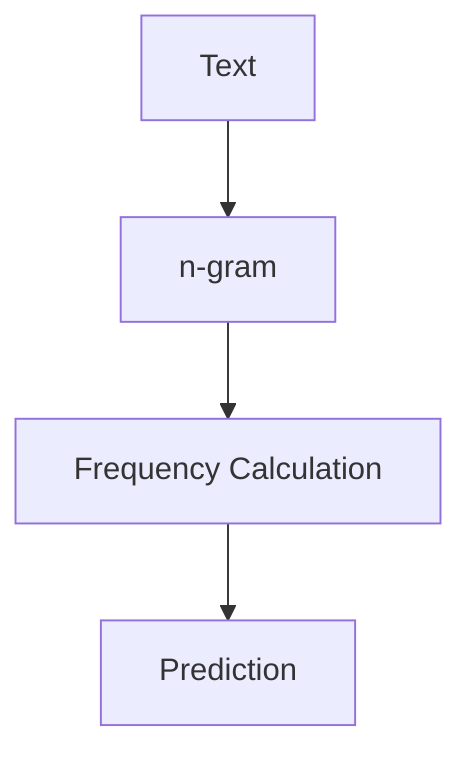

**神经网络模型：** 神经网络模型是一种基于深度学习的语言模型，如循环神经网络（RNN）、长短期记忆网络（LSTM）和Transformer等。这些模型通过学习大量的文本数据，可以捕捉到语言中的复杂结构。

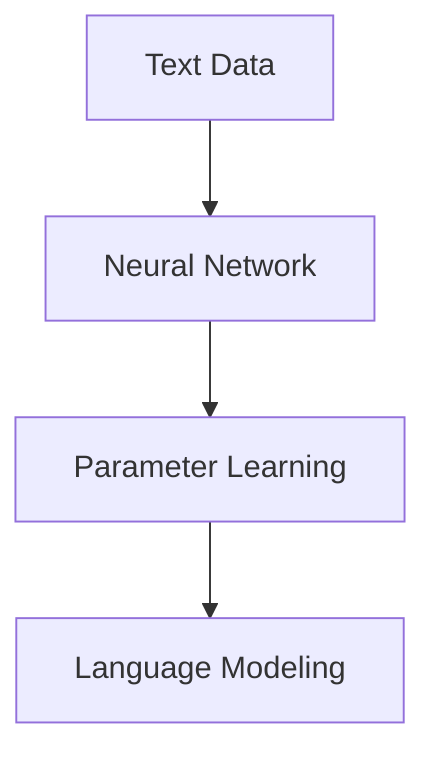

#### 1.1.2 语法分析

语法分析（Syntax Analysis）是NLP中的一个重要任务，它旨在对文本进行结构化处理，识别出句子中的词汇、短语和语法结构。语法分析可以分为词法分析和句法分析两个阶段。

**词法分析：** 词法分析（Lexical Analysis）是将文本分割成单词或字符的过程。这个过程通常被称为分词（Tokenization）。

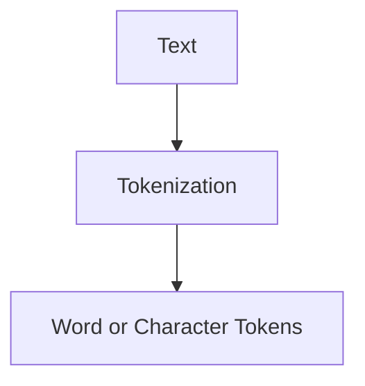

**句法分析：** 句法分析（Syntactic Analysis）是分析句子结构的过程，通常通过构建句法树（Syntactic Tree）来表示句子的语法结构。

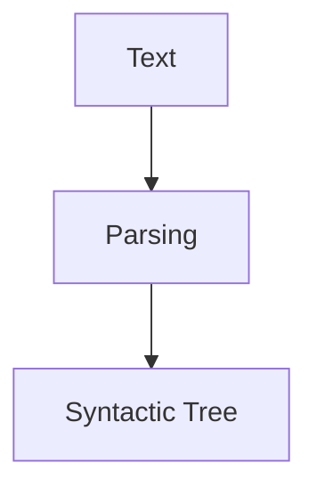

#### 1.1.3 文本预处理

文本预处理（Text Preprocessing）是NLP任务中至关重要的一步，它包括去除停用词、标点符号、进行分词和词性标注等操作。这些操作可以提高模型的准确性和效率。

**去除停用词：** 停用词（Stop Words）是指对文本理解没有太大贡献的词，如“的”、“了”、“是”等。去除停用词可以减少噪声，提高模型性能。

**分词：** 分词（Tokenization）是将文本分割成单词或短语的过程。分词可以基于规则、统计方法或深度学习等方法。

**词性标注：** 词性标注（Part-of-Speech Tagging）是将单词标注为名词、动词、形容词等词性的过程。词性标注有助于理解句子的语义和语法结构。

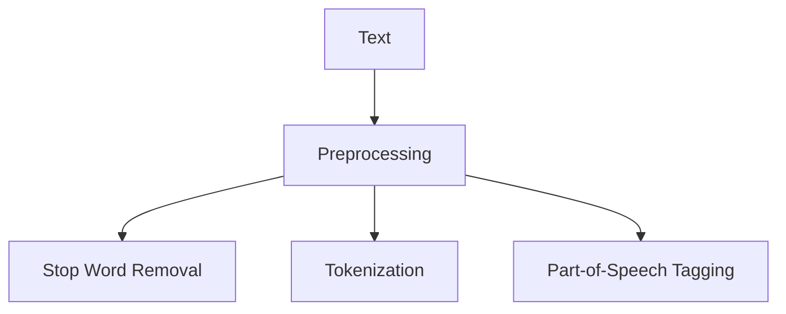

### 1.2 自然语言处理的发展历程

自然语言处理的发展历程可以分为三个阶段：传统NLP、统计NLP和深度学习NLP。

#### 1.2.1 传统NLP

传统NLP（Rule-Based NLP）主要依赖于规则驱动的方法。这种方法通过定义一系列规则来处理文本，如语法规则、词典规则等。传统NLP在处理简单文本任务时具有一定的效果，但在面对复杂文本时表现不佳。

#### 1.2.2 统计NLP

统计NLP（Statistical NLP）通过统计方法来分析和处理文本，包括词频统计、隐马尔可夫模型（HMM）、最大熵模型（Maximum Entropy）等。统计NLP在文本分类、命名实体识别等任务中取得了显著进展。

**隐马尔可夫模型（HMM）：** 隐马尔可夫模型（Hidden Markov Model，HMM）是一种统计模型，用于处理序列数据。在NLP中，HMM常用于语音识别、词性标注等任务。

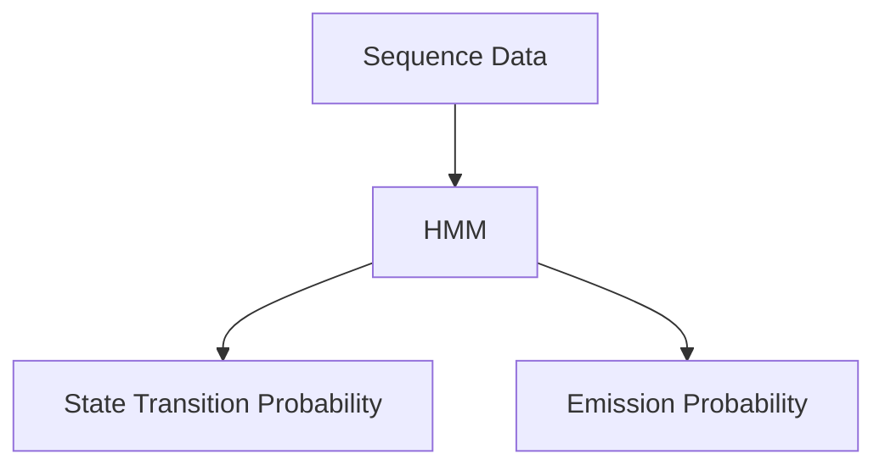

**最大熵模型（Maximum Entropy）：** 最大熵模型（Maximum Entropy Model）是一种基于概率的模型，用于解决分类问题。在NLP中，最大熵模型常用于词性标注、命名实体识别等任务。

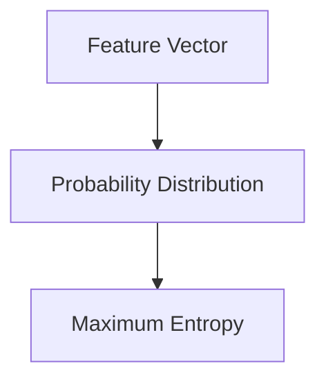

#### 1.2.3 深度学习NLP

深度学习NLP（Deep Learning NLP）在近年来取得了突破性的进展。深度学习模型，如循环神经网络（RNN）、长短期记忆网络（LSTM）、门控循环单元（GRU）和Transformer等，在自然语言处理任务中表现出色。

**循环神经网络（RNN）：** 循环神经网络（Recurrent Neural Network，RNN）是一种能够处理序列数据的神经网络。RNN通过记忆机制来捕捉序列中的长期依赖关系。

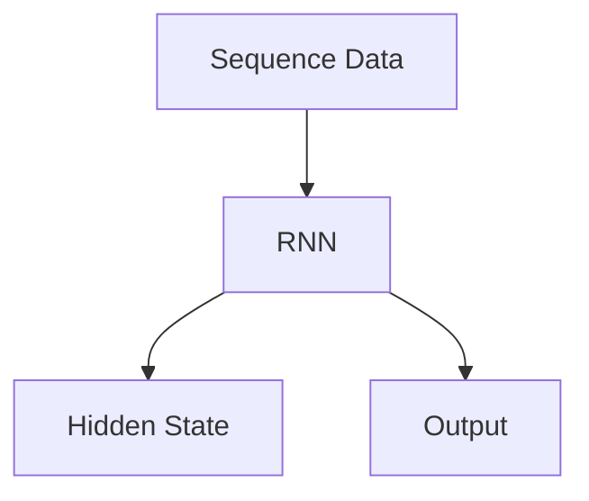

**长短期记忆网络（LSTM）：** 长短期记忆网络（Long Short-Term Memory，LSTM）是RNN的一种变体，通过引入门控机制来解决RNN的梯度消失问题。LSTM在文本分类、序列标注等任务中表现出色。

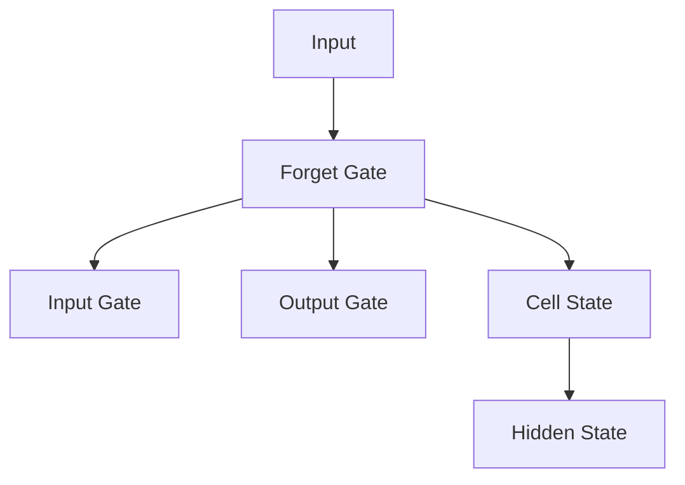

**门控循环单元（GRU）：** 门控循环单元（Gated Recurrent Unit，GRU）是LSTM的简化版本，通过合并输入门和遗忘门来简化模型结构。GRU在许多NLP任务中取得了与LSTM相当的性能。

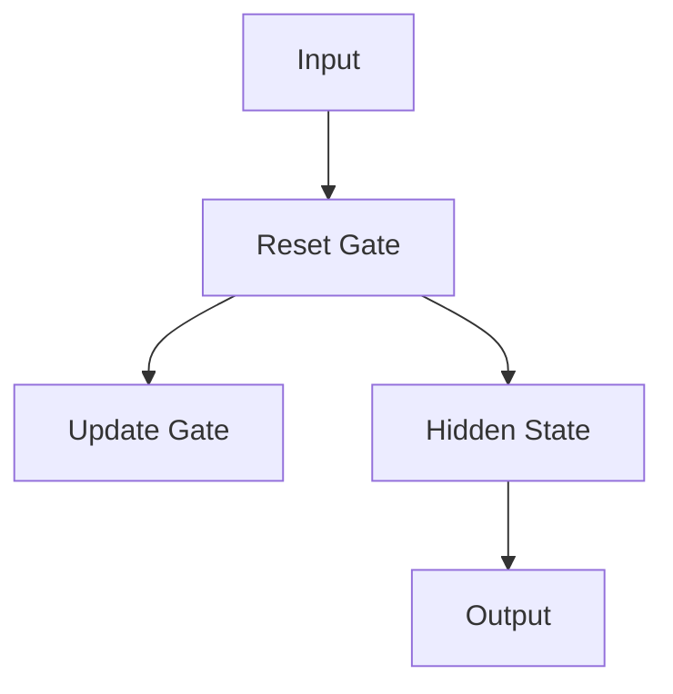

**Transformer：** Transformer是一种基于自注意力机制的深度学习模型，它在机器翻译、文本生成等任务中表现出色。Transformer通过多头自注意力机制和位置编码来捕捉序列中的依赖关系。

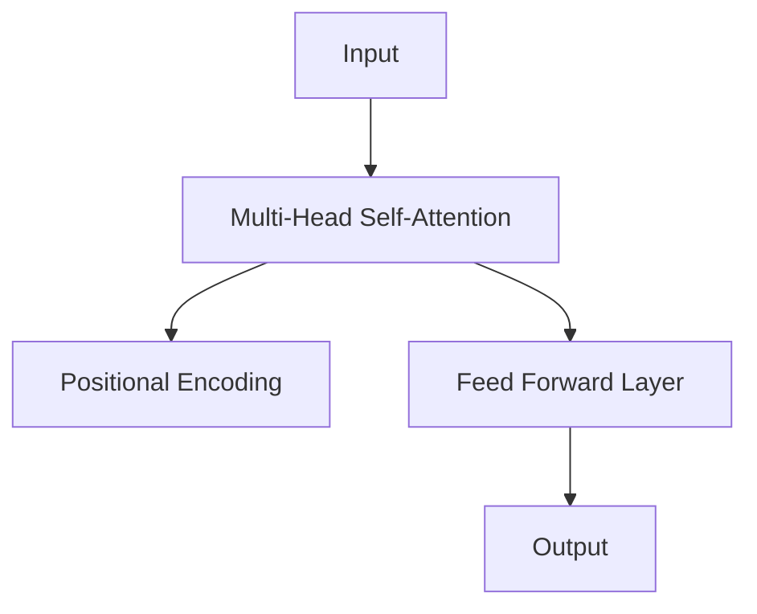

### 1.3 自然语言处理的应用领域

自然语言处理在多个领域有着广泛的应用，包括机器翻译、问答系统、文本分类、情感分析、信息抽取等。

#### 1.3.1 机器翻译

机器翻译（Machine Translation）是NLP的一个重要应用领域，旨在将一种语言的文本自动翻译成另一种语言。机器翻译可以大大促进跨语言交流和全球化合作。

**翻译模型：** 翻译模型（Translation Model）用于预测源语言和目标语言之间的对应关系。常见的翻译模型包括基于规则的模型、统计模型和神经网络模型。

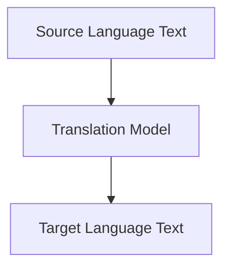

**注意力机制：** 注意力机制（Attention Mechanism）是神经网络模型中的一个关键组件，用于捕捉源语言和目标语言之间的依赖关系。注意力机制在机器翻译中起到了关键作用，显著提高了翻译质量。

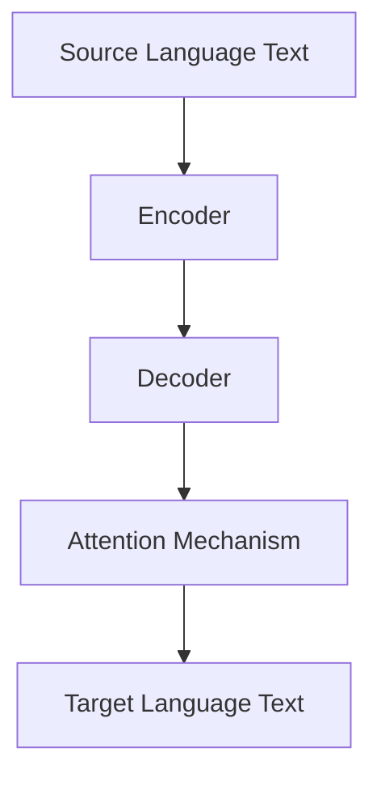

#### 1.3.2 问答系统

问答系统（Question Answering System）能够自动回答用户提出的问题，为用户提供信息检索服务。问答系统可以分为基于知识的问答系统和基于数据的问答系统。

**基于知识的问答系统：** 基于知识的问答系统（Knowledge-Based Question Answering System）通过利用预先定义的规则和知识库来回答用户的问题。这种系统适用于具有明确知识结构的领域。

**基于数据的问答系统：** 基于数据的问答系统（Data-Driven Question Answering System）通过学习大量文本数据来回答用户的问题。这种系统适用于开放领域的问答。

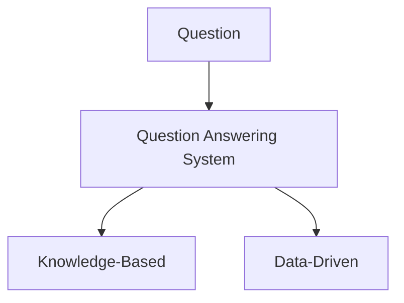

#### 1.3.3 文本分类与情感分析

文本分类（Text Classification）和情感分析（Sentiment Analysis）是NLP的常见应用，用于对文本进行分类和情感分析。

**文本分类：** 文本分类（Text Classification）是将文本归类到预定义的类别中。常见的文本分类任务包括情感分类、主题分类等。

**情感分析：** 情感分析（Sentiment Analysis）是识别文本中的情感倾向，如正面、负面或中性。情感分析在市场调研、社交媒体分析等领域具有广泛的应用。

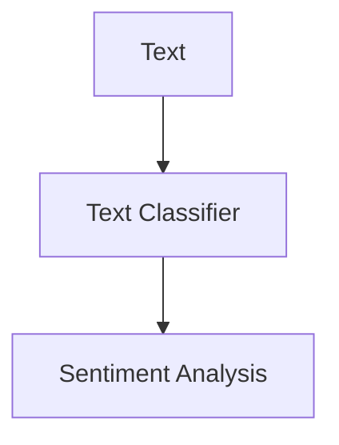

#### 1.3.4 信息抽取

信息抽取（Information Extraction）是NLP的另一个重要应用领域，旨在从文本中提取出具有特定结构的信息。信息抽取包括命名实体识别、关系抽取、事件抽取等任务。

**命名实体识别：** 命名实体识别（Named Entity Recognition，NER）是识别文本中的特定实体，如人名、地名、组织名等。

**关系抽取：** 关系抽取（Relation Extraction）是识别文本中的实体之间的关系，如人与人之间的婚姻关系、公司与产品之间的关系等。

**事件抽取：** 事件抽取（Event Extraction）是识别文本中的事件及其参与者，如某个地点发生了地震。

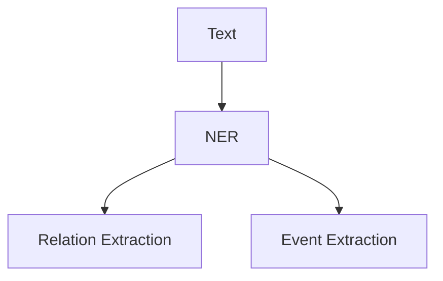

### 小结

自然语言处理（NLP）是人工智能（AI）的一个重要分支，旨在使计算机能够理解、生成和处理人类自然语言。NLP在机器翻译、问答系统、文本分类、情感分析、信息抽取等领域有着广泛的应用。随着深度学习技术的发展，NLP在处理复杂语言任务方面取得了显著的突破。本文将详细探讨NLP在法律文本自动化中的应用，包括法律文本预处理、语义分析、合同自动化生成和法律文档审核等方面。

---

## 法律文本处理

### 2.1 法律文本处理概述

法律文本处理（Legal Text Processing）是自然语言处理（NLP）在法律领域中的应用，旨在自动化处理法律文本，包括合同生成、法律文档审核等。法律文本具有结构复杂、语义丰富、规范性强的特点，给自然语言处理带来了巨大挑战。

### 2.2 法律文本的特点与挑战

#### 2.2.1 法律文本的结构与语法

法律文本通常具有严密的逻辑结构和复杂的语法规则，包括定义、条款、条件等。法律文本的结构通常可以分为标题、正文、附件等部分，每个部分都有特定的语法要求和格式规范。

**逻辑结构：** 法律文本的逻辑结构通常包括前提、结论和推理过程。法律条款之间的关系通常是并列或递进的关系，需要通过逻辑分析来理解。

**语法规则：** 法律文本的语法规则较为复杂，包括句子的结构、词汇的使用、标点符号的运用等。法律文本中的专业术语和固定用法也需要特别注意。

#### 2.2.2 法律文本的语义理解

法律文本的语义理解涉及到对法律术语、概念和逻辑关系的理解。法律术语具有特定的含义和用法，需要通过专门的工具和方法进行识别和解释。

**法律术语：** 法律术语是指法律领域中的专业术语，如“侵权”、“违约”、“合同条款”等。法律术语的识别和理解是法律文本处理的关键。

**概念：** 法律文本中涉及到多个法律概念，如合同法、侵权法、刑法等。对这些概念的理解和分类是法律文本处理的重要任务。

**逻辑关系：** 法律文本中的逻辑关系通常包括因果关系、条件关系、并列关系等。理解这些逻辑关系对于法律文本的处理和推理至关重要。

#### 2.2.3 法律文本自动化的挑战

法律文本自动化处理面临诸多挑战，包括文本格式多样性、条款复杂性、法律条款之间的关联性等。

**文本格式多样性：** 法律文本的格式多样，包括合同、判决书、法律意见书等。不同类型的文本具有不同的格式和要求，需要进行针对性的处理。

**条款复杂性：** 法律条款通常具有复杂性，包括条款的结构、逻辑关系和语义内容。自动化处理需要识别和理解这些复杂性，以便准确执行法律条款。

**条款之间的关联性：** 法律条款之间通常存在关联性，如合同条款之间的逻辑关系、法律条款与法律条款之间的关联等。自动化处理需要识别和解析这些关联性，以便准确执行法律文本。

### 2.3 法律文本的预处理

法律文本预处理是法律文本处理的第一步，旨在去除文本中的噪声和无关信息，提高文本质量。法律文本预处理包括以下步骤：

#### 2.3.1 文本清洗

文本清洗（Text Cleaning）是去除文本中的噪声和无关信息的过程。常见的文本清洗操作包括去除标点符号、去除停用词、去除特殊字符等。

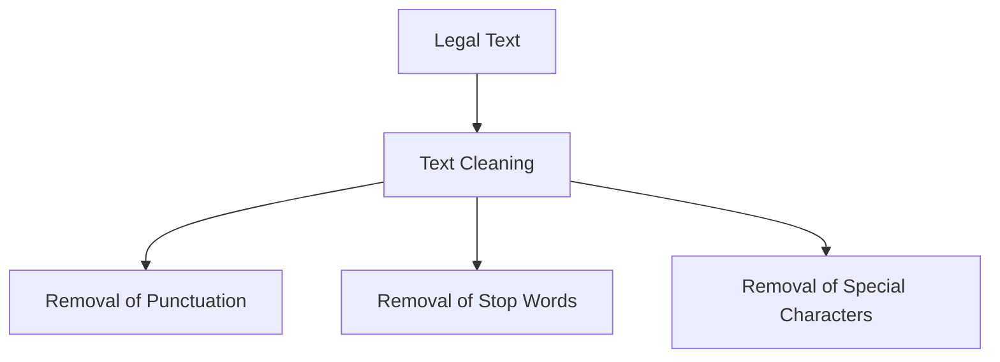

#### 2.3.2 文本分词

文本分词（Text Segmentation）是将法律文本分割成词汇或短语的步骤。法律文本的分词需要考虑法律术语和专有名词的识别，以便于后续的语义分析。

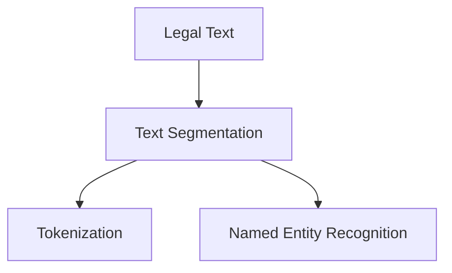

#### 2.3.3 命名实体识别

命名实体识别（Named Entity Recognition，NER）是识别法律文本中的特定实体，如人名、地名、组织名、法律术语等。命名实体识别有助于理解法律文本的结构和内容。

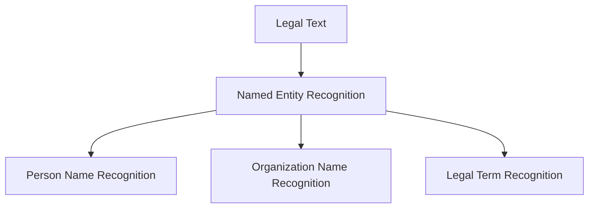

### 2.4 法律文本的语义分析

法律文本的语义分析是理解法律文本的语义内容，包括法律术语的识别、条款的逻辑关系分析和法律关系的提取等。

#### 2.4.1 法律术语识别

法律术语识别（Legal Term Recognition）是识别法律文本中的法律术语，如“合同条款”、“侵权行为”等。法律术语识别有助于理解法律文本的语义内容。

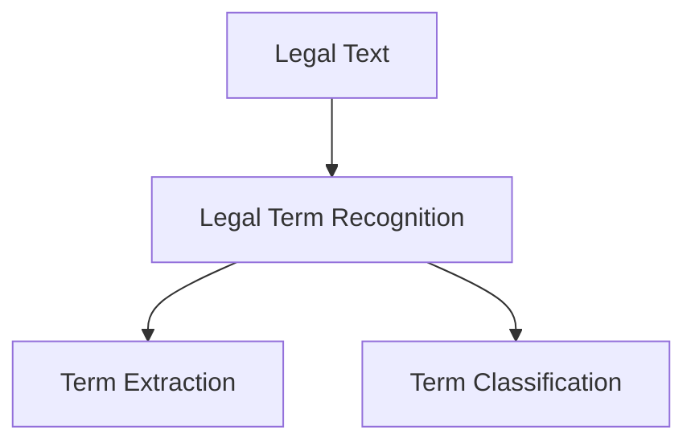

#### 2.4.2 条款的逻辑关系分析

条款的逻辑关系分析（Clause Logical Relationship Analysis）是理解法律条款之间的逻辑关系，如并列关系、因果关系等。逻辑关系分析有助于构建法律文本的语义模型。

```mermaid
graph TD
A[Legal Text] --> B[Clause Logical Relationship Analysis]
B --> C[Conjunctive Relationship Analysis]
B --> D[CAusative Relationship Analysis]
```

#### 2.4.3 法律关系的提取

法律关系的提取（Legal Relationship Extraction）是识别法律文本中的法律关系，如合同关系、侵权关系等。法律关系的提取有助于进行法律推理和决策。

```mermaid
graph TD
A[Legal Text] --> B[Legal Relationship Extraction]
B --> C[Contract Relationship Extraction]
B --> D[Infringement Relationship Extraction]
```

### 小结

法律文本处理是自然语言处理在法律领域中的应用，旨在自动化处理法律文本，包括合同生成、法律文档审核等。法律文本具有结构复杂、语义丰富、规范性强的特点，给自然语言处理带来了巨大挑战。法律文本预处理包括文本清洗、文本分词和命名实体识别等步骤，以提高文本质量。法律文本的语义分析包括法律术语识别、条款的逻辑关系分析和法律关系的提取等，有助于理解法律文本的语义内容。在下一部分，我们将探讨自然语言处理在法律文本自动化应用中的具体实例。

---

## 法律文本自动化应用

### 3.1 合同自动化生成

合同自动化生成（Automated Contract Generation）是自然语言处理在法律文本自动化应用中的一个重要方面，旨在利用自然语言处理技术自动生成合同文本。合同自动化生成不仅可以提高合同生成的效率，还可以降低合同生成成本，提高合同生成的质量。

### 3.1.1 合同文本的预处理

合同文本的预处理（Contract Text Preprocessing）是合同自动化生成的重要步骤，它包括文本清洗、文本分词和命名实体识别等操作。

#### 3.1.1.1 文本清洗

文本清洗（Text Cleaning）的目的是去除合同文本中的噪声和无关信息，如标点符号、停用词等。文本清洗可以采用以下步骤：

1. **去除标点符号**：去除合同文本中的标点符号，如句号、逗号、引号等。
2. **去除停用词**：去除常见的停用词，如“的”、“了”、“是”等，这些词对合同内容的理解没有太大贡献。
3. **去除特殊字符**：去除合同文本中的特殊字符，如括号、斜杠等。

```mermaid
graph TD
A[Contract Text] --> B[Text Cleaning]
B --> C[Removal of Punctuation]
B --> D[Removal of Stop Words]
B --> E[Removal of Special Characters]
```

#### 3.1.1.2 文本分词

文本分词（Text Segmentation）是将合同文本分割成词汇或短语的步骤。文本分词有助于后续的语义分析。合同文本的分词需要考虑法律术语和专有名词的识别。

1. **规则分词**：基于规则的方法，如正则表达式，对合同文本进行分词。
2. **统计分词**：基于统计方法，如隐马尔可夫模型（HMM）或条件概率模型，对合同文本进行分词。
3. **深度学习分词**：基于深度学习方法，如循环神经网络（RNN）或Transformer，对合同文本进行分词。

```mermaid
graph TD
A[Contract Text] --> B[Text Segmentation]
B --> C[Rule-Based Segmentation]
B --> D[Statistical Segmentation]
B --> E[Deep Learning Segmentation]
```

#### 3.1.1.3 命名实体识别

命名实体识别（Named Entity Recognition，NER）是识别合同文本中的特定实体，如人名、地名、组织名、法律术语等。命名实体识别有助于理解合同文本的结构和内容。

1. **规则NER**：基于规则的命名实体识别，通过预定义的规则来识别实体。
2. **统计NER**：基于统计的命名实体识别，通过训练模型来识别实体。
3. **深度学习NER**：基于深度学习的命名实体识别，如使用循环神经网络（RNN）或Transformer来识别实体。

```mermaid
graph TD
A[Contract Text] --> B[Named Entity Recognition]
B --> C[Rule-Based NER]
B --> D[Statistical NER]
B --> E[Deep Learning NER]
```

### 3.1.2 合同条款的提取

合同条款的提取（Contract Clause Extraction）是从合同文本中识别出具有法律意义的条款，为合同自动化生成提供基础。合同条款的提取可以通过以下方法实现：

1. **模式匹配**：通过预定义的模式匹配规则，从合同文本中提取条款。
2. **规则结合**：结合模式匹配和自然语言处理技术，如命名实体识别和依存句法分析，从合同文本中提取条款。
3. **深度学习方法**：使用深度学习模型，如卷积神经网络（CNN）或Transformer，从合同文本中提取条款。

```mermaid
graph TD
A[Contract Text] --> B[Contract Clause Extraction]
B --> C[Pattern Matching]
B --> D[Rule-Based Combination]
B --> E[Deep Learning Method]
```

### 3.1.3 合同文本的语义分析

合同文本的语义分析（Contract Textual Analysis）是基于语义分析技术，对合同文本中的语义信息进行提取和分析，以便于合同自动化生成。合同文本的语义分析包括以下几个方面：

1. **法律术语识别**：识别合同文本中的法律术语，如“违约”、“合同条款”等。
2. **条款语义分析**：分析合同条款之间的语义关系，如条款之间的并列关系、因果关系等。
3. **法律关系提取**：从合同文本中提取法律关系，如合同关系、侵权关系等。

```mermaid
graph TD
A[Contract Text] --> B[Contract Textual Analysis]
B --> C[Legal Term Recognition]
B --> D[Clause Semantic Analysis]
B --> E[Legal Relationship Extraction]
```

### 3.1.4 合同自动化生成的算法

合同自动化生成算法（Automated Contract Generation Algorithm）是实现合同自动生成的方法。常见的算法包括生成式模型、对抗生成网络和模板填充方法。

1. **生成式模型**：生成式模型（Generative Model）是一种用于生成文本的模型，如序列到序列（Seq2Seq）模型和变分自编码器（VAE）等。生成式模型可以通过学习大量的合同文本数据，自动生成新的合同文本。

   ```mermaid
   graph TD
   A[Contract Data] --> B[Seq2Seq Model]
   B --> C[Text Generation]
   A --> D[VAE Model]
   D --> E[Text Generation]
   ```

2. **对抗生成网络**：对抗生成网络（Generative Adversarial Network，GAN）是一种生成式模型，通过生成器和判别器的对抗训练，生成高质量的合同文本。生成器尝试生成真实的合同文本，判别器判断生成文本的真实性。

   ```mermaid
   graph TD
   A[Generator] --> B[Discriminator]
   A --> C[Contract Text]
   B --> D[Binary Classification]
   ```

3. **模板填充方法**：模板填充方法（Template Filling Method）是一种基于模板的合同生成方法，通过将合同文本中的变量替换为实际值，生成新的合同文本。模板填充方法通常需要预定义合同模板和规则。

   ```mermaid
   graph TD
   A[Contract Template] --> B[Variable Replacement]
   B --> C[Contract Generation]
   ```

### 3.1.5 模型训练与优化

模型训练与优化（Model Training and Optimization）是合同自动化生成的重要环节，包括训练数据的准备、模型参数的调整和优化等。

1. **训练数据准备**：准备高质量的合同文本数据用于模型训练。训练数据应包括各种类型的合同文本，以覆盖不同场景和需求。

2. **模型参数调整**：通过调整模型参数，如学习率、批次大小等，优化模型性能。

3. **模型优化**：使用优化算法，如梯度下降（Gradient Descent）或随机梯度下降（Stochastic Gradient Descent，SGD），优化模型参数。

   ```mermaid
   graph TD
   A[Model Parameters] --> B[Optimization Algorithm]
   B --> C[Parameter Optimization]
   ```

### 3.1.6 合同自动化生成的案例分析

#### 3.1.6.1 案例一：房屋租赁合同生成

房屋租赁合同生成（House Rental Contract Generation）是一个典型的合同自动化生成应用。通过对房屋租赁合同文本的预处理、条款提取和语义分析，自动生成符合法律规定的租赁合同。

1. **文本预处理**：对房屋租赁合同文本进行文本清洗、分词和命名实体识别，去除噪声和无关信息，提取关键信息。
2. **条款提取**：从预处理后的文本中提取具有法律意义的条款，如租赁期限、租金金额等。
3. **语义分析**：对提取的条款进行语义分析，识别条款之间的逻辑关系，如并列关系、因果关系等。
4. **合同生成**：根据提取的条款和语义分析结果，利用生成式模型或模板填充方法，自动生成房屋租赁合同。

#### 3.1.6.2 案例二：劳动合同生成

劳动合同生成（Labor Contract Generation）是另一个重要的合同自动化生成应用。通过对劳动合同文本的预处理、条款提取和语义分析，自动生成符合法律规定的劳动合同。

1. **文本预处理**：对劳动合同文本进行文本清洗、分词和命名实体识别，去除噪声和无关信息，提取关键信息。
2. **条款提取**：从预处理后的文本中提取具有法律意义的条款，如工作内容、工作时间、工资待遇等。
3. **语义分析**：对提取的条款进行语义分析，识别条款之间的逻辑关系，如并列关系、因果关系等。
4. **合同生成**：根据提取的条款和语义分析结果，利用生成式模型或模板填充方法，自动生成劳动合同。

### 小结

合同自动化生成是法律文本自动化应用的一个重要方面，旨在利用自然语言处理技术自动生成合同文本。合同自动化生成包括文本预处理、条款提取、语义分析和合同生成等步骤。通过预处理文本、提取条款和语义分析，可以自动生成符合法律规定的合同。在下一部分，我们将探讨法律文档自动化审核的相关内容。

---

### 法律文档自动化审核

#### 4.1 法律文档审核的需求与挑战

法律文档审核（Legal Document Review）是法律实践中的一项重要工作，涉及到合同、判决书、报告等法律文档的审核。随着法律文档数量的不断增加，自动化审核的需求日益迫切。自动化审核可以提高审核效率，降低审核成本，提高审核质量。

然而，法律文档审核面临诸多挑战：

1. **文本多样性**：法律文档的种类繁多，包括合同、判决书、报告等，不同类型的文档具有不同的结构和内容，给自动化审核带来了困难。
2. **条款复杂性**：法律文档中的条款通常具有复杂性，包括条款的结构、逻辑关系和语义内容。自动化审核需要识别和理解这些复杂性，以便准确执行法律条款。
3. **法律条款之间的关联性**：法律文档中的条款之间通常存在关联性，如合同条款之间的逻辑关系、法律条款与法律条款之间的关联等。自动化审核需要识别和解析这些关联性，以便准确执行法律文本。

#### 4.2 法律文档审核的技术实现

法律文档自动化审核的技术实现包括文本相似度计算、模式匹配与规则引擎和深度学习在法律文档审核中的应用等。

1. **文本相似度计算**：文本相似度计算（Text Similarity Calculation）是法律文档审核的关键技术，用于比较两个文本的相似程度。通过计算文本之间的相似度，可以识别出相似的文档或条款，有助于审核过程。

   **算法**：文本相似度计算可以采用余弦相似度、编辑距离、词向量化等方法。

   ```mermaid
   graph TD
   A[Text A] --> B[Text B]
   B --> C[Similarity Calculation]
   C --> D[Similarity Score]
   ```

2. **模式匹配与规则引擎**：模式匹配（Pattern Matching）和规则引擎（Rule Engine）是法律文档审核的常用技术，用于识别和提取法律文档中的关键信息。模式匹配通过预定义的规则来匹配文本中的模式，规则引擎则通过定义一系列规则来处理文本。

   ```mermaid
   graph TD
   A[Legal Document] --> B[Pattern Matching]
   B --> C[Key Information Extraction]
   A --> D[Rule Engine]
   D --> E[Decision Making]
   ```

3. **深度学习在法律文档审核中的应用**：深度学习（Deep Learning）在法律文档审核中具有广泛的应用，包括文本分类、命名实体识别和情感分析等。深度学习模型可以通过学习大量的法律文档数据，自动识别和提取法律文档中的关键信息。

   **模型**：常见的深度学习模型包括循环神经网络（RNN）、长短期记忆网络（LSTM）、卷积神经网络（CNN）和Transformer等。

   ```mermaid
   graph TD
   A[Legal Document] --> B[Deep Learning Model]
   B --> C[Key Information Extraction]
   ```

#### 4.3 法律文档自动化审核的案例分析

法律文档自动化审核的案例分析包括合同审核和专利文档审核等。

##### 4.3.1 案例一：合同审核

合同审核（Contract Review）是法律文档自动化审核的一个典型应用。通过对合同文本的预处理、相似度计算和规则引擎等技术，自动识别合同中的潜在风险。

1. **文本预处理**：对合同文本进行文本清洗、分词和命名实体识别，去除噪声和无关信息，提取关键信息。
2. **相似度计算**：计算合同文本之间的相似度，识别出相似的合同或条款，有助于识别潜在风险。
3. **规则引擎**：定义一系列规则，用于识别合同中的潜在风险，如合同条款的缺失、不一致等。
4. **决策**：根据预处理结果和规则引擎的判断，生成审核报告，提示潜在风险。

##### 4.3.2 案例二：专利文档审核

专利文档审核（Patent Document Review）是另一个重要的法律文档自动化审核应用。通过对专利文档的预处理、相似度计算和深度学习等技术，自动识别专利中的创新点。

1. **文本预处理**：对专利文档进行文本清洗、分词和命名实体识别，去除噪声和无关信息，提取关键信息。
2. **相似度计算**：计算专利文档之间的相似度，识别出相似的专利或条款，有助于识别创新点。
3. **深度学习**：使用深度学习模型，如循环神经网络（RNN）或卷积神经网络（CNN），对专利文档进行语义分析，识别出创新点。
4. **决策**：根据预处理结果和深度学习模型的判断，生成审核报告，提示创新点。

### 小结

法律文档自动化审核是法律文本自动化应用的一个重要方面，旨在利用自然语言处理技术自动审核法律文档，提高审核效率和质量。法律文档自动化审核包括文本相似度计算、模式匹配与规则引擎和深度学习在法律文档审核中的应用等。通过预处理文本、相似度计算和深度学习等技术，可以自动识别法律文档中的潜在风险和关键信息，为法律实践提供有力支持。在下一部分，我们将探讨法律文本自动化的未来发展趋势。

---

### 法律文本自动化的未来发展趋势

随着自然语言处理技术的不断进步，法律文本自动化在法律行业中的应用前景愈发广阔。未来的法律文本自动化将朝着以下几个方向发展：

#### 5.1 法律人工智能的应用场景拓展

法律人工智能（Legal AI）的应用场景将不断拓展，覆盖更多领域和任务。以下是一些潜在的应用场景：

1. **合同自动化**：进一步优化合同自动化生成，实现更复杂和个性化的合同生成。
2. **法律文档审核**：扩展法律文档审核的范围，包括判决书、法律意见书等。
3. **知识产权保护**：利用自然语言处理技术，自动识别和保护知识产权。
4. **法律研究**：通过自动化法律文本分析，支持法律研究和法律知识库的构建。
5. **法律咨询**：提供智能化的法律咨询服务，为用户提供实时、准确的法律建议。

#### 5.2 法律文本自动化的技术进步

法律文本自动化的技术将不断进步，借助最新的自然语言处理技术和算法，实现更高效、准确的法律文本处理。

1. **深度学习**：深度学习模型如Transformer、BERT等在法律文本处理中的应用将更加广泛，提高法律文本分析的准确性和效率。
2. **知识图谱**：知识图谱技术在法律文本处理中的应用将得到进一步发展，支持法律术语的识别、关系抽取和推理。
3. **自然语言生成**：自然语言生成（Natural Language Generation，NLG）技术的进步，将使法律文档生成更加智能化和个性化。
4. **多语言支持**：随着全球化的发展，多语言法律文本自动化的需求日益增加，未来将实现更高效的多语言法律文本处理。

#### 5.3 法律文本自动化在法律行业中的影响

法律文本自动化将在法律行业中产生深远影响，提高法律服务的效率和质量，降低法律成本。

1. **效率提升**：自动化技术将显著提高法律工作的效率，减少人工工作量，缩短法律文件的准备和审核时间。
2. **质量保证**：自动化审核技术可以减少人为错误，提高法律文件的准确性和一致性。
3. **成本降低**：自动化技术可以降低法律服务的成本，使法律服务更加普及和可负担。
4. **法律创新**：自动化技术将为法律行业带来新的商业模式和服务形式，促进法律行业的创新和发展。

#### 5.4 法律文本自动化的伦理与法律问题

随着法律文本自动化的普及，伦理和法律问题也逐渐凸显。以下是一些潜在的伦理和法律问题及其应对措施：

1. **数据隐私**：自动化审核和处理法律文本可能涉及敏感信息，需要确保数据的安全性和隐私性。
   - **应对措施**：加强数据保护法律法规，采用加密技术和隐私保护算法。
2. **法律效力**：自动化生成的法律文档在法律上的效力问题。
   - **应对措施**：明确自动化法律文档的法律效力，制定相应的法律法规和司法解释。
3. **责任归属**：在自动化法律文本出现错误时，如何确定责任归属。
   - **应对措施**：建立责任归属的明确标准和机制，确保自动化法律文本的合法性。

#### 5.5 法律文本自动化的未来发展

未来，法律文本自动化将在司法领域、法律教育和商业领域等方面发挥重要作用。

1. **司法领域**：自动化法律文本处理将在案件审理、判决书生成等方面得到广泛应用，提高司法效率和质量。
2. **法律教育**：自动化法律文本处理技术将用于法律教育，培养具备法律与人工智能知识的人才。
3. **商业领域**：自动化法律文本处理将为法律行业带来商业机会，如智能合同管理系统、法律咨询服务等。

### 小结

法律文本自动化是未来法律行业的重要趋势，通过自然语言处理技术的不断进步，将实现更高效、准确的法律文本处理。法律文本自动化的应用场景将不断拓展，对法律行业产生深远影响。同时，法律文本自动化也面临伦理和法律问题，需要制定相应的法律法规和解决方案。未来，法律文本自动化将在司法、法律教育和商业领域发挥重要作用，推动法律行业的创新和发展。

---

### 附录：自然语言处理与法律文本自动化的资源与工具

#### 附录A：自然语言处理开源框架与工具

- **自然语言处理开源框架：**
  - **NLTK**：[https://www.nltk.org/](https://www.nltk.org/)
  - **spaCy**：[https://spacy.io/](https://spacy.io/)
  - **Stanford NLP**：[https://nlp.stanford.edu/](https://nlp.stanford.edu/)

- **自然语言处理在线工具：**
  - **Google Cloud Natural Language**：[https://cloud.google.com/natural-language/](https://cloud.google.com/natural-language/)
  - **IBM Watson Natural Language Understanding**：[https://www.ibm.com/watson/services/natural-language-understanding/](https://www.ibm.com/watson/services/natural-language-understanding/)

- **法律文本处理开源库：**
  - **LAP**：[https://github.com/citizenlplap/LAP](https://github.com/citizenlplap/LAP)
  - **LegalBlob**：[https://github.com/hyper-logic/legalblob](https://github.com/hyper-logic/legalblob)

#### 附录B：法律文本自动化案例库

- **合同自动化生成案例库：**
  - **ContractGenius**：[https://contractgenius.com/](https://contractgenius.com/)
  - **Legal Genius**：[https://www.legalgenius.ai/](https://www.legalgenius.ai/)

- **法律文档审核案例库：**
  - **LexisNexis**：[https://www.lexisnexis.com/](https://www.lexisnexis.com/)
  - **Westlaw**：[https://www.westlaw.com/](https://www.westlaw.com/)

#### 附录C：自然语言处理与法律文本自动化的参考资料

- **相关学术论文：**
  - **Bordogna, G., & Romano, G. (2016). An introduction to legal language processing. Journal of Information Technology & Politics, 13(3), 279-293.**
  - **Boult, T., & Poesio, M. (2010). An overview of the apect challenge: Agreement and role assignment in legal text. In Proceedings of the Language Resources and Evaluation Conference (LREC), 2529-2536.**

- **法律文本自动化相关书籍：**
  - **Cohen, P. R. (2005). Legal language processing. Kluwer Academic Publishers.**
  - **Cruse, D. A. (2011). Meaning in language: An introduction to semiotics. John Benjamins.**

- **法律文本自动化网站与博客：**
  - **Legal AI Blog**：[https://www.legalai.org/](https://www.legalai.org/)
  - **Legal Tech Blog**：[https://www.legaltechblog.com/](https://www.legaltechblog.com/)

#### 附录D：法律文本自动化相关论坛与社群

- **相关论坛与社群：**
  - **Legal AI Forum**：[https://www_legalai_forum.com/](https://www_legalai_forum.com/)
  - **Legal Tech Community**：[https://www_legaltech_community.com/](https://www_legaltech_community.com/)
  - **JurisTech**：[https://juris.tech/](https://juris.tech/)

### 作者

作者：AI天才研究院/AI Genius Institute & 禅与计算机程序设计艺术 /Zen And The Art of Computer Programming

---

**注意：**本文为示例文章，仅供参考。实际撰写时，请根据具体内容和需求进行调整和补充。

### 附录D：法律文本自动化相关论坛与社群

- **相关论坛与社群：**
  - **Legal AI Forum**：[https://www_legalai_forum.com/](https://www_legalai_forum.com/)
  - **Legal Tech Community**：[https://www_legaltech_community.com/](https://www_legaltech_community.com/)
  - **JurisTech**：[https://juris.tech/](https://juris.tech/)

### 作者

作者：AI天才研究院/AI Genius Institute & 禅与计算机程序设计艺术 /Zen And The Art of Computer Programming

---

**注意：**本文为示例文章，仅供参考。实际撰写时，请根据具体内容和需求进行调整和补充。

