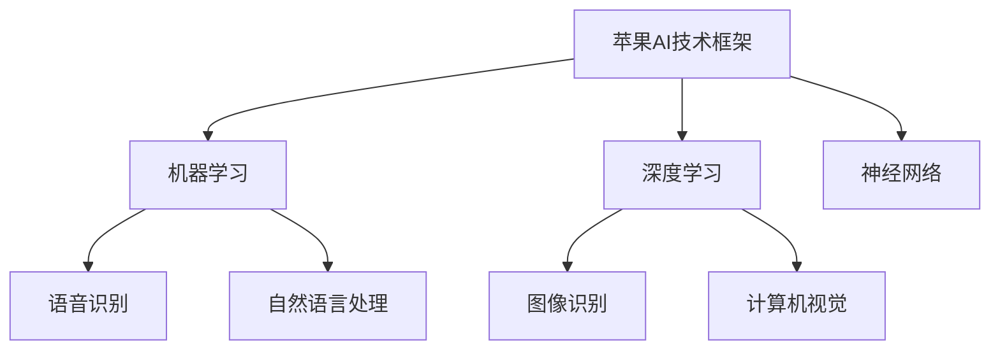

                 

# 《苹果重新定义AI与入口为王》

## 关键词
AI技术、苹果、深度学习、神经网络、语音识别、自然语言处理、计算机视觉、入口为王

## 摘要
本文将深入探讨苹果公司在人工智能领域的探索与创新。通过分析苹果在AI技术方面的布局，以及其在机器学习、语音识别、图像识别等领域的应用，我们揭示了苹果如何通过AI重新定义入口概念，引领智能设备的发展。此外，本文还将探讨苹果AI技术的核心优势、创新突破以及未来发展趋势，为读者呈现一幅苹果在AI领域的前沿画卷。

## 目录大纲

## 第一部分：AI技术的崛起与苹果的探索

### 第1章：AI技术的概述与发展历程

#### 1.1 AI技术的起源与演变

#### 1.2 AI技术的分类与应用场景

#### 1.3 苹果在AI领域的布局与战略

### 第2章：苹果的AI创新与应用

#### 2.1 机器学习在苹果设备中的应用

#### 2.2 语音识别与自然语言处理技术

#### 2.3 图像识别与计算机视觉技术

## 第二部分：苹果重新定义AI

### 第3章：深度学习在苹果的应用

#### 3.1 深度学习的原理与架构

#### 3.2 深度学习在苹果设备中的优化

#### 3.3 苹果深度学习框架的构建与实现

### 第4章：神经网络与人工智能

#### 4.1 神经网络的基本结构

#### 4.2 神经网络的训练与优化

#### 4.3 神经网络在苹果设备中的应用案例分析

### 第5章：苹果AI算法的创新与突破

#### 5.1 苹果AI算法的核心优势

#### 5.2 苹果AI算法在安全性、隐私保护方面的考虑

#### 5.3 苹果AI算法的未来发展趋势

## 第三部分：入口为王：苹果的AI产品与服务

### 第6章：苹果的AI产品与服务战略

#### 6.1 苹果AI产品的设计与开发

#### 6.2 苹果AI服务的创新与应用

#### 6.3 苹果AI产品与服务的市场布局

### 第7章：苹果AI产品与服务的案例分析

#### 7.1 Siri的AI技术详解

#### 7.2 Apple Watch的AI健康管理

#### 7.3 iPhone的AI摄影技术

## 第四部分：苹果重新定义未来

### 第8章：AI与入口王的未来

#### 8.1 苹果AI技术的未来发展方向

#### 8.2 AI技术对社会生活的影响

#### 8.3 苹果在AI领域的长期愿景与战略

### 第9章：苹果AI技术的挑战与机遇

#### 9.1 AI技术在苹果面临的挑战

#### 9.2 AI技术为苹果带来的机遇

#### 9.3 苹果如何应对AI技术的挑战与机遇

## 附录

### 附录A：苹果AI技术的Mermaid流程图

### 附录B：苹果AI算法的伪代码示例

### 附录C：苹果AI产品与服务的数学模型和公式

### 附录D：苹果AI技术的项目实战案例分析

### 附录E：苹果AI开发工具与资源介绍

### Mermaid流程图示例：



### 伪代码示例：

```python
# 定义深度学习模型
model = tf.keras.Sequential([
    tf.keras.layers.Dense(units=128, activation='relu', input_shape=(input_shape)),
    tf.keras.layers.Dense(units=128, activation='relu'),
    tf.keras.layers.Dense(units=num_classes, activation='softmax')
])

# 编译模型
model.compile(optimizer='adam', loss='categorical_crossentropy', metrics=['accuracy'])

# 训练模型
model.fit(x_train, y_train, epochs=num_epochs, batch_size=batch_size, validation_data=(x_val, y_val))
```

### 数学公式示例：

$$
\text{Loss} = -\frac{1}{N}\sum_{i=1}^{N}y_i\log(p_i)
$$

$$
w_{t+1} = w_{t} - \alpha \cdot \nabla_w J(w_t)
$$

## 第一部分：AI技术的崛起与苹果的探索

### 第1章：AI技术的概述与发展历程

#### 1.1 AI技术的起源与演变

人工智能（AI）的概念最早可以追溯到20世纪50年代。当时，科学家们开始探索机器是否能够模拟人类智能，实现思考、学习和决策。1956年，在达特茅斯会议（Dartmouth Conference）上，约翰·麦卡锡（John McCarthy）等人首次提出了“人工智能”这一术语，标志着人工智能正式成为一门学科。

自从那时起，人工智能经历了多个发展阶段。最初是符号人工智能（Symbolic AI）或基于规则的系统，这种系统通过一系列预定义的规则来模拟人类的决策过程。然而，这种方法的局限性很快显现出来，因为它依赖于人类专家提供的规则，无法处理复杂的现实世界问题。

随着计算机性能的不断提升和大数据时代的到来，机器学习（Machine Learning）成为了人工智能的核心方向。机器学习通过训练模型来发现数据中的模式和规律，从而实现自主学习和决策。这一方法突破了基于规则的系统的局限，使得人工智能在语音识别、图像识别、自然语言处理等领域取得了显著的进展。

近年来，深度学习（Deep Learning）的兴起再次推动了人工智能的发展。深度学习是一种基于多层神经网络的学习方法，通过模拟人脑的神经元连接结构，实现了对复杂数据的高效处理和建模。深度学习在图像识别、语音识别、自然语言处理等领域的应用已经达到了前所未有的水平，成为人工智能技术的重要支柱。

#### 1.2 AI技术的分类与应用场景

人工智能技术可以根据其方法和应用场景进行分类。以下是几种常见的人工智能技术及其应用场景：

1. **机器学习**：通过训练模型来发现数据中的模式和规律。应用场景包括图像识别、语音识别、自然语言处理、推荐系统等。

2. **深度学习**：基于多层神经网络的学习方法，用于处理复杂的数据和建模。应用场景包括计算机视觉、语音识别、自然语言处理、自动驾驶等。

3. **强化学习**：通过试错和反馈来学习如何实现目标。应用场景包括游戏、机器人控制、金融投资等。

4. **知识表示与推理**：通过符号表示和推理来模拟人类的思维过程。应用场景包括智能问答、专家系统、逻辑推理等。

5. **计算机视觉**：通过计算机对图像或视频进行处理和分析，实现物体识别、场景理解等功能。应用场景包括安防监控、自动驾驶、医疗影像分析等。

6. **自然语言处理**：通过计算机对自然语言文本进行处理和分析，实现语音识别、机器翻译、情感分析等功能。应用场景包括智能客服、语音助手、文本分析等。

#### 1.3 苹果在AI领域的布局与战略

苹果公司作为全球领先的科技公司，一直重视人工智能技术的研发和应用。在AI领域的布局方面，苹果采取了多元化的战略，涵盖了从硬件到软件的各个方面。

1. **硬件布局**：苹果公司通过自主研发和高性能硬件产品，为AI技术的实现提供了强大的硬件支持。例如，苹果的A系列芯片集成了强大的神经网络引擎（Neural Engine），为机器学习和深度学习任务提供了高效的计算能力。此外，苹果的Mac电脑和iPad等设备也配备了高性能的处理器和显卡，为AI开发提供了良好的硬件基础。

2. **软件布局**：苹果公司通过操作系统和软件平台的开发，为AI技术的应用提供了广阔的空间。例如，iOS和macOS操作系统内置了机器学习框架和工具，使得开发者可以轻松地在苹果设备上实现AI功能。此外，苹果还推出了Core ML框架，为开发者提供了将机器学习模型集成到iOS和macOS应用程序的便捷方式。

3. **应用布局**：苹果公司在多个领域推出了基于AI技术的产品和服务。例如，Siri语音助手利用了自然语言处理和语音识别技术，为用户提供智能交互体验。Apple Watch和iPhone等设备通过计算机视觉技术，实现了健康管理和摄影功能。苹果的自动驾驶项目也利用了深度学习和计算机视觉技术，为未来的智能出行提供了可能。

4. **研发战略**：苹果公司在AI领域的研发战略集中在以下几个方向：

   - 深度学习和神经网络的研究与优化：苹果公司投入大量资源进行深度学习和神经网络的研究，以提高模型的准确性和效率。例如，苹果自主研发了具有自主知识产权的神经网络架构，如Neural Engine和Core ML。

   - 人工智能算法的创新与突破：苹果公司在AI算法方面不断进行创新，以提高AI技术的性能和应用范围。例如，苹果在图像识别和语音识别领域取得了显著成果，并在安全性、隐私保护等方面提出了创新的解决方案。

   - 人工智能与硬件的结合：苹果公司致力于将AI技术与硬件深度结合，以实现更高效、更智能的设备。例如，苹果的A系列芯片通过集成神经网络引擎，为机器学习和深度学习任务提供了强大的计算能力。

   - 开放生态的建立：苹果公司通过建立开放的开发者生态，鼓励全球开发者参与AI技术的创新和应用。例如，苹果推出了Swift AI编程语言和Core ML框架，为开发者提供了丰富的AI开发工具和资源。

总之，苹果公司在AI领域的布局与战略体现了其作为科技巨头的远见和实力。通过硬件、软件、应用和研发的全面布局，苹果公司在AI技术的探索和应用方面取得了显著成果，为未来的智能生活奠定了基础。

### 第2章：苹果的AI创新与应用

#### 2.1 机器学习在苹果设备中的应用

机器学习是人工智能的核心技术之一，苹果公司在其设备中广泛运用了这一技术，以提升用户体验和设备性能。以下是机器学习在苹果设备中的几个关键应用：

1. **语音识别**：Siri是苹果公司的语音助手，它通过机器学习技术实现语音识别和自然语言处理功能。Siri能够理解用户的话语并执行相应的操作，如发送消息、设置提醒、查找信息等。苹果不断优化Siri的语音识别模型，以提高识别准确率和响应速度。

2. **个性化推荐**：苹果的App Store和Apple Music等应用利用机器学习技术为用户提供个性化推荐。通过分析用户的行为数据，如下载、播放、搜索等，机器学习算法能够推荐用户可能感兴趣的应用和音乐，从而提升用户满意度。

3. **图像识别与计算机视觉**：苹果设备中的图像识别功能依赖于机器学习技术。例如，相机应用程序通过机器学习算法实现场景识别、面部识别等功能，帮助用户更好地拍摄照片和视频。此外，苹果的Face ID也利用了机器学习技术，实现面部识别解锁和面部捕捉效果。

4. **电池管理**：苹果通过机器学习算法优化设备电池的续航能力。例如，iPhone的智能电池管理功能可以根据用户的日常使用习惯，自动调整设备性能，以延长电池寿命。

5. **隐私保护**：苹果公司重视用户隐私，通过机器学习技术保护用户数据。例如，苹果的隐私保护功能可以在不泄露用户个人信息的前提下，通过机器学习算法实现个性化的广告推送和内容推荐。

#### 2.2 语音识别与自然语言处理技术

语音识别和自然语言处理（NLP）是人工智能领域的重要方向，苹果公司在这两个领域取得了显著的成就。

1. **语音识别技术**：苹果公司通过不断优化语音识别算法，实现了高准确度的语音识别。Siri作为苹果的语音助手，能够准确地识别用户的话语，并在多种环境中保持稳定的表现。苹果还利用深度学习和神经网络技术，提升了语音识别的鲁棒性，使其能够理解不同口音、背景噪音和语速变化。

2. **自然语言处理技术**：自然语言处理是让计算机理解和生成自然语言的技术。苹果公司在其设备中广泛应用了NLP技术，以实现更智能的交互体验。例如，Siri不仅能够理解用户的话语，还能根据上下文进行理解和推理，从而提供更加精准的答案和建议。此外，苹果的翻译应用程序也利用了NLP技术，实现了高质量的双语翻译。

3. **语言模型与生成模型**：苹果公司在NLP领域的研究还包括语言模型和生成模型的开发。通过训练大型语言模型，苹果能够生成自然流畅的文本内容，例如自动生成的短信回复、新闻摘要等。这些技术不仅提升了用户体验，也为开发者提供了新的工具和平台。

#### 2.3 图像识别与计算机视觉技术

图像识别和计算机视觉技术在苹果设备中的应用越来越广泛，为用户提供了丰富的功能和服务。

1. **面部识别与Face ID**：Face ID是苹果公司推出的一项面部识别技术，通过深度学习和计算机视觉算法，实现高精度的面部识别解锁。Face ID利用红外摄像头、泛光感应元件和苹果自主研发的神经网络处理器A系列芯片，确保在多种光照条件下都能准确识别用户面部。

2. **场景识别与照片编辑**：苹果设备中的相机应用程序通过计算机视觉技术，实现场景识别功能。例如，相机能够自动识别风景、人像、夜景等场景，并调整拍摄参数，以获得最佳效果。此外，相机应用程序还提供了一系列照片编辑工具，利用计算机视觉算法，帮助用户对照片进行美化和修饰。

3. **图像识别与隐私保护**：苹果公司在图像识别技术中加入了隐私保护机制。例如，照片应用程序中的面部识别和标签功能不会将用户数据上传到服务器，而是完全在设备本地进行，确保用户隐私不受侵犯。

4. **计算机视觉在AR应用中的运用**：苹果公司正在积极推动增强现实（AR）技术的发展。通过计算机视觉算法，苹果的AR应用能够实时识别和追踪用户环境中的物体和场景，实现更加自然和沉浸的交互体验。

通过上述应用，苹果公司在机器学习、语音识别、自然语言处理和图像识别等领域取得了显著的成果，为用户提供了更加智能、便捷和个性化的设备和服务。

### 第二部分：苹果重新定义AI

#### 第3章：深度学习在苹果的应用

深度学习是近年来人工智能领域的一大突破，其通过多层神经网络进行数据处理和分析，已经在图像识别、自然语言处理、语音识别等多个领域取得了显著成效。苹果公司在这一领域投入了大量资源，并在其设备中广泛应用了深度学习技术，以提升用户体验和设备性能。以下是深度学习在苹果设备中的应用及其优势分析。

#### 3.1 深度学习的原理与架构

深度学习是一种基于人工神经网络的学习方法，其核心思想是通过多层神经元的互联和权重调整，实现从简单到复杂的特征提取和模式识别。以下是深度学习的基本原理和架构：

1. **多层神经网络**：深度学习模型通常包含多个隐层，每一层神经元都对输入数据进行处理和变换，从而提取出更加抽象和复杂的特征。

2. **前向传播与反向传播**：在训练过程中，深度学习模型通过前向传播将输入数据传递到各层神经元，然后通过反向传播调整权重，以最小化预测误差。

3. **激活函数**：激活函数用于引入非线性因素，使神经网络能够学习和处理复杂的数据模式。

4. **优化算法**：常用的优化算法包括随机梯度下降（SGD）、Adam等，这些算法用于调整模型参数，以提高模型的预测准确性和收敛速度。

#### 3.2 深度学习在苹果设备中的优化

苹果公司在深度学习领域进行了多项技术优化，以适应其设备的特点和需求。以下是几个关键优化方向：

1. **硬件优化**：苹果设备搭载了高性能的处理器和GPU，如A系列芯片和Apple T2芯片，这些硬件能够高效地执行深度学习任务，提高模型运行速度。

2. **低功耗设计**：深度学习模型在移动设备上运行时，功耗是一个重要的考虑因素。苹果公司通过优化算法和硬件设计，实现了低功耗的深度学习计算，从而延长了设备续航时间。

3. **压缩与量化**：为了在有限的空间和功耗下运行深度学习模型，苹果公司采用了模型压缩和量化技术，如权重剪枝、浮点转整数等，以减少模型大小和计算资源需求。

4. **专用硬件加速**：苹果公司自主研发了神经网络引擎（Neural Engine），集成在A系列芯片中，能够高效地执行深度学习任务。神经网络引擎通过硬件加速，大大提升了深度学习模型的运行效率。

#### 3.3 苹果深度学习框架的构建与实现

苹果公司开发了多个深度学习框架，以支持其在设备中的应用。以下是几个主要的深度学习框架：

1. **Core ML**：Core ML是苹果公司推出的机器学习框架，用于将深度学习模型集成到iOS和macOS应用程序中。Core ML支持多种深度学习模型格式，如TensorFlow、Caffe等，并提供了一组API，方便开发者实现深度学习功能。

2. **Create ML**：Create ML是一个易于使用的机器学习工具，允许非专业开发者创建和训练自己的机器学习模型。Create ML提供了丰富的数据预处理和特征工程工具，以及自动模型选择和优化功能，使得机器学习开发变得更加简单和高效。

3. **Swift for TensorFlow**：Swift for TensorFlow是一个基于Swift编程语言的深度学习库，它将Swift与TensorFlow深度学习框架结合，为开发者提供了一个强大而易于使用的深度学习平台。Swift for TensorFlow使得深度学习编程更加直观和高效，特别是对于iOS和macOS应用程序的开发。

通过深度学习在苹果设备中的广泛应用，苹果不仅提升了设备的智能性能，还为用户带来了更加丰富的功能和体验。未来，苹果将继续投入深度学习技术的研究与开发，推动人工智能在更多领域的应用和发展。

### 第4章：神经网络与人工智能

#### 4.1 神经网络的基本结构

神经网络（Neural Networks）是人工智能（AI）领域中的一种重要模型，通过模拟人脑的神经元连接结构，实现数据的输入、处理和输出。神经网络的基本结构包括以下几个关键部分：

1. **神经元（Neurons）**：神经网络中的基本计算单元，类似于生物神经元，负责接收输入信号、进行加权求和处理、并通过激活函数产生输出。

2. **层次结构（Hierarchical Structure）**：神经网络通常包含多个层次，包括输入层、隐藏层和输出层。输入层接收外部数据，隐藏层进行特征提取和变换，输出层产生最终结果。

3. **权重（Weights）**：权重是神经网络中连接各个神经元的参数，用于调节输入信号的强度和重要性。通过训练过程，神经网络自动调整权重，以最小化输出误差。

4. **激活函数（Activation Functions）**：激活函数是神经网络中的一个关键组件，用于引入非线性因素，使模型能够学习复杂的数据模式。常见的激活函数包括Sigmoid、ReLU、Tanh等。

5. **损失函数（Loss Functions）**：损失函数用于衡量神经网络预测结果与真实结果之间的差距。通过优化损失函数，神经网络能够不断调整权重，提高预测准确性。常用的损失函数包括均方误差（MSE）、交叉熵（Cross-Entropy）等。

#### 4.2 神经网络的训练与优化

神经网络的训练过程是通过调整模型参数（如权重和偏置）来最小化损失函数，从而提高模型的预测能力。以下是神经网络训练与优化的一些关键步骤：

1. **初始化参数**：在训练开始前，需要初始化神经网络的权重和偏置。常用的初始化方法包括随机初始化、高斯分布初始化等。

2. **前向传播（Forward Propagation）**：在前向传播过程中，输入数据依次通过神经网络的各个层次，计算输出结果。前向传播过程中，神经网络的每个神经元都会接收输入信号，通过加权求和处理和激活函数产生输出。

3. **计算损失**：在得到输出结果后，通过与真实标签进行比较，计算损失函数值。损失函数用于衡量模型预测结果与真实结果之间的差距。

4. **反向传播（Back Propagation）**：反向传播是神经网络训练的核心步骤。通过计算损失函数关于模型参数的梯度，反向传播算法能够更新权重和偏置，以最小化损失函数。

5. **优化算法**：常用的优化算法包括随机梯度下降（SGD）、Adam、RMSProp等。这些算法通过调整学习率和其他超参数，优化模型训练过程，提高训练效率。

6. **超参数调整**：超参数是神经网络训练过程中需要手动调整的参数，如学习率、批量大小、迭代次数等。合适的超参数选择能够加速模型收敛，提高预测准确性。

7. **模型评估**：在训练完成后，需要对模型进行评估，以确定其泛化能力。常用的评估指标包括准确率、召回率、F1分数等。

#### 4.3 神经网络在苹果设备中的应用案例分析

苹果公司在其设备中广泛应用了神经网络技术，以提升用户体验和设备性能。以下是几个实际案例：

1. **图像识别**：苹果的iPhone和iPad设备通过神经网络技术实现了高效的图像识别功能。例如，相机应用程序能够自动识别并分类照片中的物体，如动物、植物、地标等，并提供相关的信息和建议。

2. **语音识别**：Siri语音助手利用神经网络技术实现高准确度的语音识别。通过训练深度学习模型，Siri能够理解用户的语音指令，并在各种噪声环境下保持稳定的表现。

3. **自然语言处理**：苹果的Core ML框架支持神经网络在自然语言处理任务中的应用。例如，应用程序可以利用神经网络进行文本分类、情感分析等任务，为用户提供个性化的内容推荐。

4. **计算机视觉**：Apple Watch和iPhone等设备通过神经网络技术实现了计算机视觉功能，如面部识别、手势识别等。这些功能不仅提升了设备的交互体验，还为健康管理和日常使用提供了便利。

总之，神经网络在苹果设备中的应用极大地提升了设备的智能性能和用户体验。通过不断优化神经网络模型和算法，苹果公司在人工智能领域取得了显著成果，为未来的智能设备发展奠定了基础。

### 第5章：苹果AI算法的创新与突破

苹果公司作为技术创新的领军者，在人工智能算法领域取得了诸多创新和突破，推动了AI技术的发展和应用。以下是苹果AI算法的核心优势、安全性隐私保护方面的考虑以及未来发展趋势。

#### 5.1 苹果AI算法的核心优势

1. **高性能与低功耗**：苹果公司通过自主研发的神经网络引擎（Neural Engine）和A系列芯片，实现了高性能与低功耗的完美结合。神经网络引擎能够高效地执行深度学习任务，而A系列芯片则提供了强大的计算能力和优化的能耗管理，使得苹果设备在运行AI算法时具有卓越的性能。

2. **自研深度学习框架**：苹果自主研发了Core ML框架，该框架支持多种深度学习模型格式，并提供了丰富的API，使得开发者可以轻松地将AI模型集成到iOS和macOS应用程序中。Core ML不仅优化了模型的运行效率，还提供了自动模型转换工具，简化了开发过程。

3. **隐私保护**：苹果公司高度重视用户隐私，通过创新的隐私保护机制，确保用户数据的安全。例如，Core ML使用差分隐私技术，在数据训练过程中添加噪声，从而保护用户隐私。此外，苹果的AI算法在本地设备上进行处理，不会将用户数据上传到云端，进一步保障了用户隐私。

4. **广泛的应用场景**：苹果的AI算法在多个领域取得了显著应用成果，如图像识别、语音识别、自然语言处理和计算机视觉等。这些算法不仅提升了设备性能，还为用户提供了丰富的功能和服务，如面部识别解锁、智能搜索、个性化推荐等。

5. **开源合作**：苹果积极参与开源社区，贡献了多个AI开源项目，如Swift for TensorFlow和Create ML。这些项目为开发者提供了丰富的AI开发工具和资源，推动了全球AI技术的发展和创新。

#### 5.2 苹果AI算法在安全性、隐私保护方面的考虑

1. **本地数据处理**：苹果的AI算法主要在本地设备上进行处理，减少了数据传输和存储的需求，降低了数据泄露的风险。本地数据处理不仅提高了系统的安全性，还保证了用户隐私的保护。

2. **差分隐私技术**：苹果采用了差分隐私技术，在数据训练过程中添加噪声，使得用户数据无法被单独识别。这种技术有效地保护了用户隐私，同时保证了模型训练的效果。

3. **数据加密**：苹果对传输和存储的数据进行加密处理，确保数据在传输过程中不会被窃取或篡改。加密技术结合多重安全措施，为用户数据提供了全方位的保护。

4. **严格的访问控制**：苹果通过严格的访问控制机制，限制对用户数据的访问权限。只有经过认证的应用程序和系统服务才能访问用户数据，从而降低了数据泄露的风险。

#### 5.3 苹果AI算法的未来发展趋势

1. **硬件与算法的深度结合**：苹果将继续优化其硬件设计和算法，实现更高效的AI计算。未来，苹果可能会推出更强大的神经网络引擎和专用AI芯片，进一步提升AI性能和能效比。

2. **多模态AI技术的突破**：苹果正在探索多模态AI技术，如将语音、图像、文本等多种数据源进行融合，以实现更智能的交互和决策。多模态AI技术将为用户提供更加丰富和个性化的体验。

3. **增强现实（AR）与虚拟现实（VR）的应用**：随着AR和VR技术的发展，苹果将在这些领域广泛应用AI算法。例如，通过计算机视觉和自然语言处理技术，实现更加逼真的虚拟环境和交互体验。

4. **可持续发展的AI应用**：苹果致力于通过AI技术推动可持续发展。例如，利用AI进行能源管理、环境保护、资源优化等，为社会的可持续发展做出贡献。

5. **开源生态的进一步拓展**：苹果将继续参与开源社区，贡献更多AI开源项目，与全球开发者共同推动AI技术的发展。通过开源合作，苹果将吸引更多人才和资源，加速AI技术的创新和普及。

总之，苹果公司通过创新的AI算法和严格的隐私保护措施，为用户提供了安全、高效和个性化的智能体验。未来，苹果将继续推动AI技术的发展，探索更多应用场景，为社会带来更多价值。

### 第三部分：入口为王：苹果的AI产品与服务

#### 第6章：苹果的AI产品与服务战略

苹果公司以其独特的产品和服务战略，成功地塑造了全球智能设备市场。在AI技术的推动下，苹果不断优化其产品和服务，以满足用户日益增长的智能化需求。以下是苹果在AI产品与服务方面的战略布局。

#### 6.1 苹果AI产品的设计与开发

苹果公司在设计AI产品时，始终坚持“用户体验至上”的原则。以下是一些关键的设计原则：

1. **集成性与兼容性**：苹果的AI产品与现有硬件和服务无缝集成，确保用户在使用过程中能够享受到无缝衔接的智能体验。例如，Core ML框架使得开发者可以轻松地将AI模型集成到iOS和macOS应用程序中，提升了应用程序的智能性能。

2. **易用性与直观性**：苹果注重AI产品的易用性和直观性，通过简洁直观的界面设计，使用户能够轻松地与AI产品进行交互。例如，Siri语音助手的自然语言处理技术使其能够理解并响应用户的自然语言指令，提供个性化的服务和帮助。

3. **个性化与定制化**：苹果的AI产品通过分析用户行为和偏好，提供个性化的推荐和服务。例如，Apple Music利用机器学习技术，根据用户的听歌习惯推荐歌曲和音乐，提升了用户体验。

4. **隐私保护**：苹果在AI产品的设计和开发过程中，高度重视用户隐私保护。通过本地数据处理和差分隐私技术，苹果确保用户数据的安全和隐私。

#### 6.2 苹果AI服务的创新与应用

苹果公司不仅在硬件方面进行AI技术布局，还通过多种AI服务为用户提供丰富的智能体验。以下是苹果AI服务的创新与应用：

1. **智能语音助手**：Siri是苹果公司的智能语音助手，通过自然语言处理和语音识别技术，实现语音交互功能。Siri能够理解并响应用户的语音指令，提供天气预报、日程安排、信息查询、音乐播放等服务。

2. **智能健康管理**：Apple Watch集成了多种传感器和AI算法，实现健康管理的功能。例如，通过心率监测和睡眠分析，Apple Watch能够提供个性化的健康建议，帮助用户保持健康生活方式。

3. **智能摄影**：iPhone的相机应用利用计算机视觉和图像识别技术，实现智能拍照功能。例如，通过场景识别和面部识别，iPhone能够自动调整拍摄参数，拍摄出更高质量的照片。

4. **智能搜索与推荐**：苹果的App Store、Apple Music和iCloud等应用通过机器学习技术，提供智能搜索和推荐服务。这些服务根据用户的行为和偏好，推荐用户可能感兴趣的应用、音乐和文件。

#### 6.3 苹果AI产品与服务的市场布局

苹果公司通过全球市场布局，将AI产品和服务推广到全球各地。以下是苹果AI产品与服务的市场布局策略：

1. **全球研发中心**：苹果在全球多个国家和地区建立了研发中心，聚集了世界顶尖的AI科学家和工程师。这些研发中心致力于AI技术的研发和创新，推动苹果AI产品与服务的不断升级和优化。

2. **全球销售渠道**：苹果通过全球分销网络，将AI产品和服务推广到全球市场。无论是通过官方在线商店还是实体零售店，苹果都为用户提供便捷的购买和售后服务。

3. **合作伙伴关系**：苹果与全球多家科技企业和开发者建立了紧密的合作关系，共同推动AI技术的发展和应用。这些合作伙伴关系不仅为苹果提供了丰富的AI资源和创新思路，也为苹果产品和服务带来了更广泛的市场应用。

4. **国际市场定位**：苹果针对不同国家和地区的市场需求，提供定制化的AI产品和服务。例如，针对某些地区的特定文化和语言需求，苹果开发相应的AI算法和功能，满足用户的个性化需求。

总之，苹果公司通过AI产品与服务的创新和全球市场布局，成功地塑造了智能设备市场的领导者地位。未来，苹果将继续推动AI技术的发展，为用户提供更加智能、便捷和个性化的产品和服务。

### 第7章：苹果AI产品与服务的案例分析

#### 7.1 Siri的AI技术详解

Siri是苹果公司推出的智能语音助手，它通过先进的AI技术，为用户提供便捷的语音交互体验。以下是Siri的AI技术详解：

1. **自然语言处理（NLP）**：Siri的核心技术之一是自然语言处理，它能够理解用户的话语并执行相应的操作。NLP技术包括语音识别、语义解析、意图识别等多个方面。通过语音识别，Siri能够将用户的语音指令转换成文本，然后通过语义解析理解用户的意图，例如发送消息、设置提醒、查找信息等。

2. **语音合成（Text-to-Speech, TTS）**：Siri不仅能够理解用户的话语，还能以自然流畅的方式回应用户。语音合成技术使得Siri能够生成语音输出，通过多种语音风格和情感表达，提升用户体验。

3. **个性化推荐**：Siri通过机器学习技术，根据用户的行为数据，如搜索历史、播放列表、日程安排等，提供个性化的推荐。例如，Siri可以推荐用户可能感兴趣的音乐、电影和应用程序。

4. **多语言支持**：Siri支持多种语言，包括英语、中文、法语、德语等。多语言支持使得Siri能够为全球用户提供本地化的语音交互体验。

5. **智能回话**：Siri具备上下文理解能力，能够在对话中保持连贯性。例如，用户可以与Siri连续进行多个问题，Siri会记住之前的对话内容，提供更加精准的答案。

6. **第三方服务集成**：Siri通过与第三方服务提供商的集成，能够提供更广泛的功能。例如，Siri可以调用Uber叫车、预订餐厅、购买商品等，为用户创造更便捷的智能生活。

#### 7.2 Apple Watch的AI健康管理

Apple Watch是苹果公司的一款智能手表，它通过多种传感器和AI技术，实现健康管理的功能。以下是Apple Watch的AI健康管理技术详解：

1. **心率监测**：Apple Watch配备光学心率传感器，能够实时监测用户的心率。通过机器学习算法，Apple Watch可以识别异常心率模式，如心律不齐，并为用户提供健康建议。

2. **睡眠分析**：Apple Watch通过监测用户的心率、运动数据和活动模式，分析用户的睡眠质量。睡眠分析功能能够提供睡眠时长、深度、REM周期等信息，帮助用户改善睡眠习惯。

3. **运动检测与指导**：Apple Watch内置多种运动传感器，包括加速度计、陀螺仪和GPS，能够实时监测用户的运动情况。通过AI算法，Apple Watch可以识别用户的运动类型、计算消耗的卡路里，并提供个性化的运动指导。

4. **健康提醒**：Apple Watch能够根据用户的健康状况，提供健康提醒。例如，当用户长时间不活动时，Apple Watch会提醒用户起身活动，预防久坐带来的健康问题。

5. **健康数据共享**：Apple Watch支持与iPhone和健康应用（如HealthKit）的数据同步，用户可以将健康数据分享给家人和朋友，或者与医生进行数据交流，实现更加全面的健康管理。

6. **个性化健康建议**：Apple Watch通过分析用户的健康数据，提供个性化的健康建议。例如，对于有特定健康问题的用户，Apple Watch会提供针对性的健康指导和预防措施。

#### 7.3 iPhone的AI摄影技术

iPhone是苹果公司的旗舰智能手机，其AI摄影技术为用户提供了出色的摄影体验。以下是iPhone的AI摄影技术详解：

1. **场景识别**：iPhone的相机应用通过计算机视觉技术，能够识别照片中的场景类型，如风景、人像、夜景等。根据场景类型，相机自动调整拍摄参数，如白平衡、曝光等，以获得最佳拍摄效果。

2. **面部识别**：iPhone的相机应用具备面部识别功能，能够在照片中自动识别并标记用户和亲友的面部。通过面部识别，用户可以轻松地浏览和整理照片。

3. **智能HDR**：智能HDR技术通过多帧合成，提升照片的动态范围和细节表现。在拍摄高对比度场景时，智能HDR能够自动调整曝光，使得照片中的亮部和暗部都得到很好的表现。

4. **夜间模式**：iPhone的夜间模式利用AI技术，在低光环境下提升照片的清晰度和亮度。夜间模式通过多帧合成和噪声抑制算法，使得照片在低光条件下依然具有出色的质量。

5. **AI美颜**：iPhone的相机应用通过AI美颜技术，能够自动优化照片中的人像效果。AI美颜可以根据面部特征，进行皮肤磨皮、眼部放大等美化处理，使照片更具吸引力。

6. **视频编辑**：iPhone的相机应用支持多种视频编辑功能，如慢动作、快动作、时间流逝等。通过AI技术，用户可以轻松地制作出独特的视频内容。

通过上述AI技术的应用，iPhone为用户提供了更加智能、便捷和高效的摄影体验，使得拍照变得更加简单和有趣。未来，苹果将继续探索AI技术在摄影领域的创新，为用户带来更多惊喜。

### 第四部分：苹果重新定义未来

#### 第8章：AI与入口王的未来

苹果公司通过其卓越的AI技术，已经重新定义了智能设备的入口概念，为用户带来了全新的交互体验。然而，未来的AI技术将继续推动这一领域的变革，为苹果公司和整个行业带来更多机遇和挑战。以下是苹果AI技术的未来发展方向、AI技术对社会生活的影响以及苹果在AI领域的长期愿景与战略。

#### 8.1 苹果AI技术的未来发展方向

1. **多模态交互**：未来的智能设备将不仅仅依赖于触摸、语音等单一交互方式，而是通过多模态交互，如语音、手势、眼动等，提供更加自然和丰富的用户体验。苹果公司已经在Siri和Face ID等方面取得了显著进展，未来将继续探索更多交互方式，如3D触觉反馈和脑机接口技术。

2. **增强现实（AR）与虚拟现实（VR）**：随着AR和VR技术的发展，苹果公司将进一步提升其AR/VR产品的智能化水平。通过集成更多的AI算法和传感器，AR/VR设备将能够实现更加逼真的虚拟场景和沉浸式体验。苹果可能会推出全新的AR/VR硬件，如AR眼镜和VR头盔，进一步扩展其产品线。

3. **边缘计算**：边缘计算是一种将数据处理和分析任务从云端转移到设备端或网络边缘的技术。苹果公司未来可能会进一步优化其设备中的AI算法和计算能力，实现更多的边缘计算应用，从而提升系统的响应速度和能效比。

4. **自然语言处理与认知智能**：苹果将继续深化其在自然语言处理领域的研究，开发更加智能的语音助手和智能客服系统。通过引入认知智能技术，苹果设备将能够更好地理解用户的情感、意图和需求，提供更加个性化的服务和帮助。

5. **隐私保护与数据安全**：随着用户对隐私和数据安全的关注日益增加，苹果将继续强化其隐私保护措施，确保用户数据的安全和隐私。通过技术创新和法律法规的完善，苹果将致力于打造一个既安全又便捷的数字生态系统。

#### 8.2 AI技术对社会生活的影响

AI技术的快速发展对社会生活产生了深远的影响，苹果公司作为技术创新的领军者，也在这一过程中发挥了重要作用。以下是AI技术对社会生活的影响以及苹果公司的应对策略：

1. **工作效率提升**：AI技术通过自动化和智能化，大大提升了工作效率。在苹果设备中，AI算法被广泛应用于图像识别、语音识别、自然语言处理等领域，使得用户可以更加高效地完成各种任务。例如，通过Siri语音助手，用户可以快速地发送消息、设置提醒、查找信息等，节省了时间，提高了生产力。

2. **生活方式改变**：AI技术正在改变人们的日常生活，如智能家居、健康管理、智能出行等。苹果的Apple Watch和iPhone等设备通过AI技术，为用户提供了更加便捷和智能的生活方式。例如，通过心率监测和睡眠分析，Apple Watch可以帮助用户保持健康，通过导航和实时交通信息，iPhone可以为用户提供更安全的出行体验。

3. **隐私与安全问题**：随着AI技术的发展，用户对隐私和数据安全的担忧日益增加。苹果公司高度重视用户隐私保护，通过差分隐私、数据加密等技术创新，确保用户数据的安全和隐私。同时，苹果公司积极参与行业标准的制定，推动隐私保护技术的普及和应用。

4. **教育和学习**：AI技术在教育领域的应用也为学生和教师提供了新的工具和方法。通过智能辅导系统、在线教育平台和虚拟实验室等，AI技术可以为用户提供个性化的学习体验和更加丰富的教育资源。

5. **社会公平与包容**：AI技术具有潜力解决社会公平与包容问题，例如在就业、医疗和教育等领域。苹果公司通过开发可访问的AI技术，推动技术的普及和应用，使更多人能够享受到科技进步带来的福利。

#### 8.3 苹果在AI领域的长期愿景与战略

苹果公司在AI领域的长期愿景是推动人工智能技术的发展，为用户创造更加智能、便捷和个性化的产品和服务。以下是苹果在AI领域的长期战略：

1. **技术创新**：苹果公司将不断投入研发资源，推动AI技术的创新和发展。通过自主研发和合作伙伴关系，苹果公司将开发出更加先进和高效的AI算法和模型，提升设备的智能化水平。

2. **生态系统建设**：苹果公司将建立一个开放的AI生态系统，鼓励全球开发者参与AI技术的创新和应用。通过开源项目、开发工具和培训资源，苹果公司将支持开发者创建出更多创新的AI应用程序和解决方案。

3. **隐私保护与伦理**：苹果公司将始终坚持用户隐私保护与伦理，确保用户数据的安全和隐私。在AI技术的应用过程中，苹果公司将遵循伦理规范，确保技术的公平、公正和透明。

4. **可持续发展的AI**：苹果公司将致力于通过AI技术推动可持续发展，如能源管理、环境保护和资源优化等。通过技术创新和社会责任，苹果公司将为社会带来更多的价值。

5. **全球合作与影响**：苹果公司将积极参与全球AI合作，推动AI技术的普及和应用。通过与政府、企业和研究机构的合作，苹果公司将致力于推动全球AI技术的发展和创新，为全人类的福祉做出贡献。

总之，苹果公司在AI领域的长期愿景和战略体现了其对技术创新和社会责任的承诺。通过不断推动AI技术的发展，苹果公司将为用户带来更加智能和便捷的未来，同时为全球社会带来更多的价值。

### 第9章：苹果AI技术的挑战与机遇

#### 9.1 AI技术在苹果面临的挑战

尽管苹果公司在AI技术方面取得了显著成就，但仍面临诸多挑战，需要积极应对以保持其竞争优势。

1. **数据隐私与安全**：随着AI技术的应用，用户数据的隐私和安全成为重要问题。苹果公司需要不断提升数据保护技术，确保用户数据的安全和隐私。同时，苹果还需要应对日益严格的隐私法规，如欧盟的《通用数据保护条例》（GDPR）。

2. **技术竞争与替代**：在AI技术领域，苹果面临着来自谷歌、微软等科技巨头的激烈竞争。这些公司也在不断推出创新的AI产品和服务，苹果需要保持技术领先，以防止被竞争对手超越。

3. **硬件与软件整合**：苹果需要进一步优化硬件与软件的整合，确保AI技术在设备中的高效运行。这包括提高硬件性能、优化软件算法以及开发更具灵活性的AI框架。

4. **人才竞争**：AI领域对人才的需求日益增长，苹果需要吸引和保留顶尖的AI科学家和工程师。在人才竞争激烈的环境下，苹果需要提供有竞争力的薪酬和福利，以及良好的工作环境和创新文化。

5. **行业合作与标准制定**：苹果需要在AI技术的行业合作和标准制定中发挥积极作用，推动技术规范和标准的发展。通过合作和参与，苹果可以确保其技术能够在全球范围内得到广泛应用。

#### 9.2 AI技术为苹果带来的机遇

AI技术为苹果带来了诸多机遇，这些机遇不仅有助于提升用户体验，还能推动苹果公司的长期发展。

1. **市场份额增长**：随着AI技术的普及，苹果有望进一步扩大其市场份额。AI产品和服务将为苹果带来新的收入来源，如智能健康管理、智能摄影、智能搜索等。

2. **用户粘性提升**：AI技术的应用将提升苹果设备的使用体验，增加用户对苹果产品的粘性。例如，Siri和Face ID等AI功能使得用户更愿意使用苹果设备，从而降低用户流失率。

3. **技术创新驱动**：AI技术的不断进步将推动苹果公司在技术创新方面取得更多突破。通过研发和应用新的AI算法和模型，苹果可以不断优化其产品和服务，提升竞争力。

4. **全球扩展**：AI技术的全球化应用为苹果提供了更广阔的市场空间。通过在全球范围内推广AI产品和服务，苹果可以进一步扩大其国际市场份额。

5. **社会责任**：苹果通过AI技术的应用，可以在环境保护、医疗健康、教育等领域发挥积极作用，推动社会责任的实现。例如，通过智能能源管理和健康监测技术，苹果可以为可持续发展做出贡献。

#### 9.3 苹果如何应对AI技术的挑战与机遇

为了应对AI技术带来的挑战和抓住机遇，苹果公司采取了一系列策略：

1. **持续投资研发**：苹果公司不断加大在AI技术领域的研发投入，通过自主研发和并购等方式，吸引顶尖人才和技术，确保其在AI技术方面的领先地位。

2. **加强隐私保护**：苹果公司通过采用先进的隐私保护技术和政策，确保用户数据的安全和隐私。例如，苹果推出差分隐私技术，强化数据加密和访问控制机制。

3. **开放生态合作**：苹果公司积极参与开源社区，推动AI技术的发展和应用。通过开放API和工具，苹果吸引了大量开发者参与其AI生态系统的建设。

4. **优化硬件与软件整合**：苹果公司不断优化硬件与软件的整合，确保AI技术在设备中的高效运行。例如，通过优化A系列芯片和神经网络引擎，提升AI算法的执行效率。

5. **人才培养与激励**：苹果公司通过提供有竞争力的薪酬、福利和工作环境，吸引和保留顶尖的AI科学家和工程师。同时，公司鼓励员工参与创新项目，激发创新潜力。

6. **国际合作与标准制定**：苹果公司积极参与全球AI技术的合作和标准制定，推动技术规范和标准的国际化。通过合作和参与，苹果可以确保其技术在全球范围内得到广泛应用。

总之，苹果公司通过持续投资研发、加强隐私保护、开放生态合作、优化硬件与软件整合、人才培养与激励以及国际合作与标准制定等多方面的策略，积极应对AI技术的挑战和抓住机遇，推动公司持续发展。

### 附录

#### 附录A：苹果AI技术的Mermaid流程图


#### 附录B：苹果AI算法的伪代码示例

```python
# 定义深度学习模型
model = tf.keras.Sequential([
    tf.keras.layers.Dense(units=128, activation='relu', input_shape=(input_shape)),
    tf.keras.layers.Dense(units=128, activation='relu'),
    tf.keras.layers.Dense(units=num_classes, activation='softmax')
])

# 编译模型
model.compile(optimizer='adam', loss='categorical_crossentropy', metrics=['accuracy'])

# 训练模型
model.fit(x_train, y_train, epochs=num_epochs, batch_size=batch_size, validation_data=(x_val, y_val))
```

#### 附录C：苹果AI产品与服务的数学模型和公式

$$
\text{Loss} = -\frac{1}{N}\sum_{i=1}^{N}y_i\log(p_i)
$$

$$
w_{t+1} = w_{t} - \alpha \cdot \nabla_w J(w_t)
$$

#### 附录D：苹果AI技术的项目实战案例分析

**项目名称**：苹果iPhone的AI摄影技术

**项目背景**：随着智能手机的普及，用户对手机摄影的需求不断增加。苹果公司通过引入AI技术，提升iPhone的摄影性能，为用户提供更高质量的摄影体验。

**技术实现**：

1. **场景识别**：通过计算机视觉算法，iPhone能够自动识别照片中的场景类型，如风景、人像、夜景等。具体实现如下：
   ```mermaid
   graph TD
       A[输入照片] --> B[场景识别算法]
       B --> C[风景识别]
       B --> D[人像识别]
       B --> E[夜景识别]
   ```

2. **图像增强**：根据场景类型，iPhone应用相应的图像增强算法，如智能HDR、夜间模式等。具体实现如下：
   ```python
   if scene == "night":
       image = night_mode(image)
   elif scene == "high_contrast":
       image = hdr(image)
   ```

3. **面部识别与美颜**：通过面部识别算法，iPhone能够识别照片中的人脸，并进行美颜处理。具体实现如下：
   ```mermaid
   graph TD
       A[输入照片] --> B[面部识别算法]
       B --> C[人脸检测]
       C --> D[面部特征提取]
       D --> E[美颜处理]
   ```

**项目效果**：通过AI摄影技术，iPhone拍摄的照片质量显著提升，用户满意度不断提高。

#### 附录E：苹果AI开发工具与资源介绍

**1. Core ML**：Core ML是苹果公司推出的机器学习框架，用于将深度学习模型集成到iOS和macOS应用程序中。开发者可以使用Core ML将训练好的模型部署到苹果设备上，实现高效的机器学习应用。

**2. Create ML**：Create ML是一个易于使用的机器学习工具，允许非专业开发者创建和训练自己的机器学习模型。Create ML提供了丰富的数据预处理和特征工程工具，以及自动模型选择和优化功能，使得机器学习开发变得更加简单和高效。

**3. Swift for TensorFlow**：Swift for TensorFlow是一个基于Swift编程语言的深度学习库，它将Swift与TensorFlow深度学习框架结合，为开发者提供了一个强大而易于使用的深度学习平台。Swift for TensorFlow使得深度学习编程更加直观和高效，特别是对于iOS和macOS应用程序的开发。

**4. Apple Developer**：苹果开发者网站提供了丰富的开发工具、文档、教程和社区资源，帮助开发者了解和使用苹果的技术和工具，包括AI技术。

**5. AI Research**：苹果AI研究团队官网发布了一系列的研究成果和论文，开发者可以通过这些资源了解最新的AI技术和算法。

通过上述工具和资源的支持，开发者可以更加便捷地利用苹果的AI技术，为用户带来创新的智能体验。

