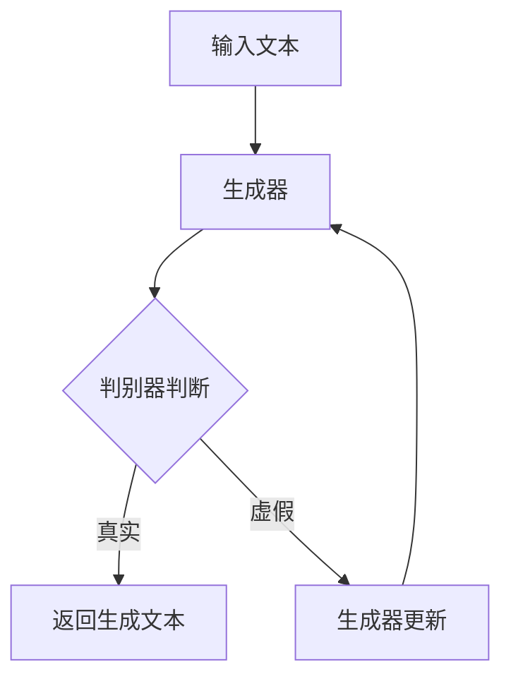
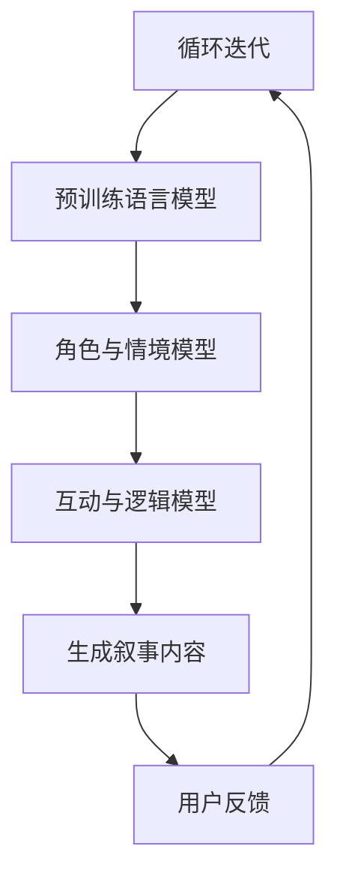
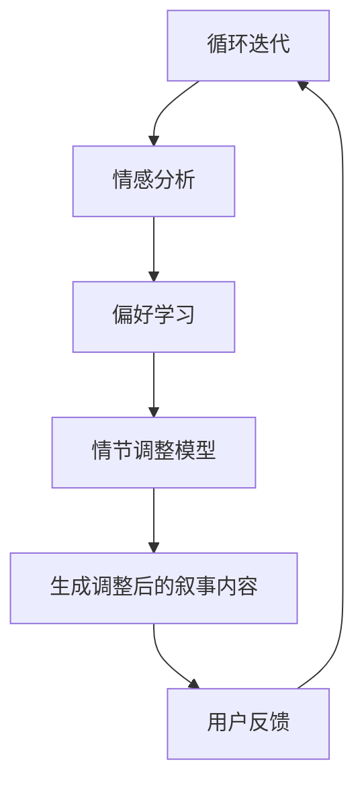

                 

### 《虚拟现实与AI叙事：沉浸式故事体验》

#### 关键词：
- 虚拟现实
- AI叙事
- 沉浸式体验
- 故事驱动
- 人机交互

#### 摘要：
本文探讨了虚拟现实（VR）与人工智能（AI）叙事技术的结合，以及这一结合如何推动沉浸式故事体验的发展。文章首先介绍了VR和AI的基本概念及其在各自领域的发展历程。接着，深入分析了AI叙事原理，包括定义、特点、算法基础等。随后，文章讨论了如何设计沉浸式故事体验，结合实际案例解析了虚拟现实与AI叙事在实践中的应用。最后，文章展望了虚拟现实与AI叙事的未来发展趋势，提出了优化策略和潜在挑战。

### 《虚拟现实与AI叙事：沉浸式故事体验》目录大纲

#### 第一部分：虚拟现实与AI概述

## 第1章：虚拟现实与AI基础

### 1.1 虚拟现实技术介绍

#### 1.1.1 虚拟现实的概念与历史
虚拟现实（Virtual Reality，VR）是一种通过计算机技术创建的模拟环境，使用户沉浸其中，感受到类似于现实世界的体验。VR技术起源于20世纪50年代，经历了从最初的简单模拟设备到复杂头戴式显示器（HMD）的发展历程。

#### 1.1.2 虚拟现实的关键技术
虚拟现实的关键技术包括头戴式显示器、位置追踪系统、渲染引擎、交互设备等。头戴式显示器提供了沉浸式视觉体验，位置追踪系统确保用户的动作在虚拟环境中得到准确反映，渲染引擎负责生成逼真的三维图像，而交互设备则提供了自然的人机交互方式。

#### 1.1.3 虚拟现实的应用领域
虚拟现实广泛应用于游戏、娱乐、教育、医疗、军事和设计等领域。在教育领域，VR可用于模拟实验、历史重现和远程教学；在医疗领域，VR用于手术训练、心理治疗和康复；在军事领域，VR用于战术训练和模拟战场环境。

### 1.2 AI在虚拟现实中的应用

#### 1.2.1 AI在虚拟现实中的核心作用
人工智能在虚拟现实中扮演着重要角色，包括增强用户交互体验、提供个性化内容、优化虚拟环境等。通过AI，虚拟现实应用可以实现更智能、更自然的交互。

#### 1.2.2 人工智能技术概述
人工智能（Artificial Intelligence，AI）是模拟人类智能行为的计算机系统。其主要技术包括机器学习、深度学习、自然语言处理等。AI在图像识别、语音识别、决策支持等方面取得了显著进展。

#### 1.2.3 虚拟现实与AI的协同发展
虚拟现实与人工智能的协同发展将推动技术创新和产业变革。例如，AI可以用于优化VR内容生成、提高渲染效率、实现更智能的虚拟助手等。两者结合有望创造出全新的用户体验和应用场景。

## 第2章：AI叙事原理

### 2.1 AI叙事的定义与特点

#### 2.1.1 叙事在虚拟现实中的应用
叙事（Narrative）在虚拟现实中扮演着关键角色，通过故事情节和角色塑造，引导用户在虚拟环境中体验和探索。叙事在VR中的应用包括虚拟旅游、虚拟博物馆、游戏和教育培训等。

#### 2.1.2 AI叙事与传统叙事的区别
AI叙事与传统叙事在形式和内容上存在差异。传统叙事主要依靠人类创作者的智慧和情感，而AI叙事则依赖于算法和数据。AI叙事具有自适应性和个性化特点，可以根据用户的行为和偏好进行动态调整。

#### 2.1.3 AI叙事的优势与挑战
AI叙事的优势在于其能够实现个性化体验、自适应叙事节奏和丰富的交互性。然而，AI叙事也面临一些挑战，如叙事质量、真实性、道德伦理等方面的问题。

### 2.2 AI叙事的算法基础

#### 2.2.1 自然语言处理技术
自然语言处理（Natural Language Processing，NLP）是AI叙事的核心技术之一。NLP技术包括文本分析、语义理解、情感分析和语言生成等，用于构建和解析叙事内容。

#### 2.2.2 机器学习与深度学习在叙事中的应用
机器学习（Machine Learning，ML）和深度学习（Deep Learning，DL）技术在AI叙事中得到了广泛应用。通过训练模型，AI可以生成和识别故事情节、角色对话和用户行为。

#### 2.2.3 AI叙事模型分类与对比
AI叙事模型主要分为基于规则和基于数据驱动两种类型。基于规则模型依靠预先定义的规则和逻辑，而基于数据驱动模型则通过学习大量的叙事数据来生成故事。

#### 第2章：AI叙事原理

### 2.1 AI叙事的定义与特点

#### 2.1.1 叙事在虚拟现实中的应用
叙事在虚拟现实（VR）中的应用极为广泛，它不仅仅是简单的信息传递，更是一种沉浸式的体验方式。通过叙事，VR可以创建引人入胜的故事世界，引导用户深入其中，体验角色的情感和挑战。

在VR游戏和模拟中，叙事通常用于设定背景、定义任务和引导玩家的行动。例如，一个VR游戏可能通过一段开场视频介绍故事背景，然后玩家需要完成一系列任务来推进故事的发展。在这种情境下，叙事不仅提供了游戏的驱动力，还增加了玩家的情感投入和参与度。

教育领域的VR应用也充分利用了叙事的力量。通过构建虚拟实验室、历史场景或科学探险，学生可以在一个沉浸式的环境中学习知识。例如，历史课上，学生可以通过VR设备进入古埃及的法老宫殿，亲身体验古人的生活和文化。这种方式不仅增强了学习的趣味性，还能加深学生的理解。

此外，虚拟旅游和虚拟博物馆也是叙事在VR中应用的典型例子。通过精心设计的叙事，用户可以仿佛身临其境地游览世界各地的名胜古迹或博物馆，获取丰富的视觉和听觉体验。

#### 2.1.2 AI叙事与传统叙事的区别
AI叙事与传统叙事在本质和方法上有显著的差异。传统叙事通常由人类创作者通过文学、影视或其他媒介来传递故事。创作者利用文字、图像、声音和肢体语言等多种手段来构建故事情节和角色，塑造故事世界，引导观众的思维和情感。

相比之下，AI叙事则依赖于算法和数据分析。AI叙事的核心在于生成和定制化。通过机器学习模型，AI可以从大量的叙事数据中学习，理解叙事的规律和结构，然后生成新的故事或对现有故事进行改编。这种叙事方式具有以下几个显著特点：

1. **个性化**：AI可以根据用户的行为和偏好来定制叙事内容，使每个用户都能获得独特的体验。例如，一个VR游戏可以根据玩家的游戏习惯和决策来调整故事情节，为每位玩家提供不同的故事线。

2. **自适应**：AI叙事可以根据用户的互动和反馈进行动态调整，使故事情节更加贴合用户的兴趣和需求。例如，一个虚拟导游可以根据用户的提问和兴趣点来调整解说内容，提供更加个性化的信息。

3. **实时性**：传统叙事通常是一次性的、预先设定的。而AI叙事可以实时生成和调整，使叙事过程更加灵活和多样化。例如，一个基于AI的虚拟角色可以根据用户的互动进行对话，创造出互动性的故事体验。

4. **大数据支持**：AI叙事依赖于大量的数据支持，这些数据可以来自于用户行为、偏好、历史叙事内容等。通过分析这些数据，AI可以更好地理解用户需求，生成更为精准和吸引人的故事。

然而，AI叙事也面临一些挑战。首先，如何保证叙事的质量和真实性是一个重要问题。虽然AI可以生成丰富的内容，但如何确保这些内容具有艺术性和深度，仍然是一个技术难题。其次，AI叙事的道德和伦理问题也需要认真考虑。例如，如何确保AI生成的叙事内容不会对用户产生负面影响，如何在叙事中体现社会责任和道德价值观。

总之，AI叙事与传统叙事相比，具有更多的灵活性和个性化特点。通过AI技术的支持，叙事体验可以更加丰富和多样化，但同时也需要我们认真思考如何平衡技术创新与人文关怀之间的关系。

#### 2.1.3 AI叙事的优势与挑战
AI叙事的优势主要体现在以下几个方面：

1. **个性化体验**：通过分析用户的行为数据和偏好，AI叙事能够为每位用户提供独特的体验。例如，在VR游戏中，AI可以根据玩家的游戏风格和决策生成不同的故事线，使得每位玩家都能体验到专属的冒险之旅。

2. **自适应叙事**：AI叙事可以根据用户的互动和反馈动态调整故事情节，提供更加贴合用户需求的叙事体验。这种自适应能力不仅提高了用户的参与度，还能增强叙事的吸引力。

3. **实时生成**：传统叙事通常是预先编写和设定的，而AI叙事可以在运行时实时生成，这使得叙事过程更加灵活和多样化。例如，一个虚拟导游可以根据用户的提问和兴趣点实时调整解说内容，提供定制化的旅游体验。

4. **大数据支持**：AI叙事依赖于大量数据支持，这些数据来源于用户行为、偏好和叙事内容等。通过分析这些数据，AI能够更好地理解用户需求，生成更为精准和吸引人的叙事。

然而，AI叙事也面临一些挑战：

1. **叙事质量**：尽管AI可以生成大量的内容，但如何保证这些内容具有艺术性和深度，仍然是一个重大挑战。叙事不仅仅是信息的传递，更是一种情感的交流和思想的碰撞。

2. **真实性**：AI生成的叙事内容需要真实可信。如果叙事内容缺乏真实性，可能会影响用户的沉浸感和信任度。因此，如何在AI叙事中平衡创新与真实，是一个重要问题。

3. **道德和伦理**：AI叙事的道德和伦理问题不容忽视。如何确保AI生成的叙事内容不会对用户产生负面影响，如何在叙事中体现社会责任和道德价值观，都需要认真考虑。

4. **技术局限**：尽管AI技术在不断发展，但其在叙事领域的应用仍然存在一定的局限性。例如，AI难以理解复杂的情感和道德判断，这可能会影响叙事的深度和广度。

总之，AI叙事具有巨大的潜力，但也面临诸多挑战。通过不断优化算法和技术，我们有望克服这些挑战，创造出更加丰富和多样化的叙事体验。

#### 2.2 AI叙事的算法基础

##### 2.2.1 自然语言处理技术
自然语言处理（Natural Language Processing，NLP）是AI叙事的核心技术之一。NLP旨在使计算机能够理解、生成和处理人类语言。在AI叙事中，NLP技术主要用于构建和解析叙事内容。

NLP技术主要包括以下几个关键方面：

1. **文本分析**：文本分析是NLP的基础，它涉及对文本进行分词、词性标注、句法分析等操作，以便更好地理解文本的内容和结构。

2. **语义理解**：语义理解是NLP的高级功能，它试图捕捉文本中的意义和关系。通过语义理解，AI可以理解文本的主旨、情感和意图。

3. **情感分析**：情感分析用于识别文本中的情感倾向，如正面、负面或中性。在AI叙事中，情感分析可以用于调整叙事内容和风格，以更好地匹配用户的情感状态。

4. **语言生成**：语言生成是NLP的重要应用之一，它包括生成文本摘要、自动问答、机器翻译等。在AI叙事中，语言生成技术可以用于创建角色对话、故事情节和用户互动内容。

NLP技术的核心算法包括：

1. **词袋模型（Bag of Words）**：词袋模型将文本表示为一个向量，其中每个词表示一个维度。这种模型简单但效果有限，因为它不考虑词的顺序和上下文。

2. **递归神经网络（Recurrent Neural Networks，RNN）**：RNN能够处理序列数据，如文本。它通过循环连接来记住前面的信息，使得模型能够理解上下文和序列关系。

3. **长短时记忆网络（Long Short-Term Memory，LSTM）**：LSTM是RNN的一种改进，能够更好地处理长序列数据，避免了传统RNN的梯度消失问题。

4. **生成对抗网络（Generative Adversarial Networks，GAN）**：GAN是一种强大的生成模型，由生成器和判别器两个网络组成。生成器试图生成逼真的文本，而判别器则试图区分生成的文本和真实文本。通过这种对抗训练，GAN可以生成高质量的语言。

NLP技术在AI叙事中的应用场景包括：

1. **角色对话**：AI可以生成与角色互动的对话，使得虚拟世界更加逼真和互动。

2. **故事生成**：AI可以生成完整的叙事内容，包括故事情节、角色发展和对话。

3. **情感调节**：AI可以根据用户的情感状态调整叙事内容和风格，提供更加个性化的体验。

4. **自动化写作**：AI可以用于自动化写作，如生成新闻文章、博客和故事。

##### 2.2.2 机器学习与深度学习在叙事中的应用
机器学习（Machine Learning，ML）和深度学习（Deep Learning，DL）是AI叙事的核心技术，它们使得计算机能够从数据中学习，生成和解析叙事内容。

1. **机器学习基础**：
   机器学习是一种让计算机通过数据学习模式并做出预测或决策的方法。在AI叙事中，机器学习主要用于以下几个关键方面：

   - **分类**：分类算法用于将叙事内容分为不同的类别，如情感分类、主题分类等。

   - **回归**：回归算法用于预测叙事内容的相关特征，如故事情节的长度、角色的重要性等。

   - **聚类**：聚类算法用于将相似的叙事内容分组，以便进行后续分析。

   - **降维**：降维算法用于减少叙事数据的空间维度，使得数据处理更加高效。

2. **深度学习技术**：
   深度学习是机器学习的一种特殊形式，它通过多层神经网络来提取数据的深层特征。在AI叙事中，深度学习技术主要用于以下几个关键方面：

   - **卷积神经网络（Convolutional Neural Networks，CNN）**：CNN主要用于处理图像和视频数据，通过卷积层提取图像的局部特征。在AI叙事中，CNN可以用于生成图像和视频内容。

   - **循环神经网络（Recurrent Neural Networks，RNN）**：RNN适用于处理序列数据，如文本。通过循环连接，RNN可以记住前面的信息，用于生成角色对话和故事情节。

   - **长短时记忆网络（Long Short-Term Memory，LSTM）**：LSTM是RNN的一种改进，能够更好地处理长序列数据，避免了传统RNN的梯度消失问题。

   - **生成对抗网络（Generative Adversarial Networks，GAN）**：GAN由生成器和判别器两个网络组成。生成器试图生成逼真的叙事内容，而判别器则试图区分生成的内容与真实内容。通过对抗训练，GAN可以生成高质量的语言和图像。

3. **应用场景**：
   - **故事生成**：通过训练大型文本数据集，深度学习模型可以生成完整的叙事内容。例如，GAN可以生成引人入胜的故事情节，而RNN可以生成角色的对话和情感表达。
   - **情感分析**：深度学习模型可以分析叙事内容中的情感倾向，如喜悦、悲伤、愤怒等。这种情感分析可以用于调整叙事风格和用户体验。
   - **角色识别**：通过训练深度学习模型，可以识别叙事中的角色特征和关系，从而更好地理解故事结构。
   - **个性化推荐**：深度学习模型可以分析用户的兴趣和行为，为用户提供个性化的叙事推荐。

##### 2.2.3 AI叙事模型分类与对比
AI叙事模型可以根据其技术基础和应用场景分为不同的类型。以下是几种常见的AI叙事模型及其特点：

1. **基于规则的模型**：
   基于规则的模型使用一组预先定义的规则来生成叙事内容。这些规则通常由人类创作者编写，用于定义故事情节、角色行为和用户交互。这种模型的优点是简单易懂，但灵活性较低，难以应对复杂和多样化的叙事需求。

2. **基于数据驱动的模型**：
   基于数据驱动的模型通过分析大量叙事数据来生成叙事内容。这些数据可以是已有的故事、用户反馈或文本数据集。基于数据驱动的模型通常使用机器学习和深度学习技术，如RNN、LSTM和GAN。这种模型的优点是灵活性高，能够生成个性化叙事内容，但需要大量的训练数据和计算资源。

3. **混合模型**：
   混合模型结合了基于规则和数据驱动的优点，通过规则和机器学习模型的结合来生成叙事内容。这种模型通常使用规则来定义基本叙事框架，然后通过机器学习模型来生成具体的内容和细节。混合模型具有较好的灵活性和可扩展性，适用于复杂和多样化的叙事需求。

以下是一个简单的比较表格，展示了不同类型模型的优缺点：

| 模型类型 | 优点 | 缺点 | 应用场景 |
| --- | --- | --- | --- |
| 基于规则的模型 | 简单易懂，易于实现 | 灵活性低，难以应对复杂叙事需求 | 简单的叙事应用，如角色互动和简单故事生成 |
| 基于数据驱动的模型 | 灵活性高，能够生成个性化内容 | 需要大量训练数据和计算资源 | 复杂叙事应用，如故事生成和情感分析 |
| 混合模型 | 灵活性高，结合了规则和机器学习的优点 | 实现复杂，需要同时处理规则和数据 | 复杂叙事应用，如角色互动和复杂故事生成 |

总之，AI叙事模型的选择取决于具体的叙事需求和资源限制。通过合理选择和组合不同类型的模型，可以构建出丰富多样的叙事体验。

### 第一部分：虚拟现实与AI概述

## 第1章：虚拟现实与AI基础

#### 1.1 虚拟现实技术介绍

##### 1.1.1 虚拟现实的概念与历史
虚拟现实（Virtual Reality，VR）是一种通过计算机技术创造的模拟环境，使用户沉浸其中，感受到类似于现实世界的体验。VR技术的基本原理是利用头戴式显示器（HMD）、位置追踪系统、音频设备等硬件设备，结合计算机图形学和图像处理技术，生成一个逼真的三维虚拟环境。

VR技术的发展可以追溯到20世纪50年代。1957年，美国科学家伊凡·苏达科夫（Ivan Sutherland）发明了第一个头戴式显示器，并展示了名为“达摩克利斯之剑”的VR系统。这个系统能够生成一个简单的三维图像，并通过头戴式显示器呈现给用户。这是VR技术的雏形。

随着时间的推移，VR技术不断发展，经历了几次重要的技术革新。1980年代，VR技术逐渐进入公众视野，特别是在计算机游戏和娱乐领域。1990年代，VR技术开始应用于教育和培训领域，通过虚拟实验室和模拟环境，提高了学习和培训的效果。

进入21世纪，随着计算机性能的提升和显示技术的进步，VR技术进入了一个新的发展阶段。2010年代，谷歌眼镜和Oculus Rift等头戴式显示器的出现，使得VR技术更加普及和易用。如今，VR技术已经广泛应用于游戏、娱乐、医疗、教育、设计等多个领域。

##### 1.1.2 虚拟现实的关键技术
虚拟现实的关键技术包括头戴式显示器、位置追踪系统、渲染引擎、交互设备等。这些技术共同作用，为用户提供了沉浸式体验。

1. **头戴式显示器（HMD）**：
头戴式显示器是VR系统的核心设备，它通过覆盖用户的视野，提供虚拟的三维图像。头戴式显示器通常具有高分辨率、低延迟和高刷新率，以确保图像的清晰度和流畅性。常见的头戴式显示器包括Oculus Rift、HTC Vive和谷歌Cardboard等。

2. **位置追踪系统**：
位置追踪系统用于确定用户在虚拟环境中的位置和方向。它通过传感器和算法，实时捕捉用户的头部和身体运动，并将其映射到虚拟环境中。常见的位置追踪技术包括红外传感器、摄像头和激光雷达等。

3. **渲染引擎**：
渲染引擎负责生成虚拟环境中的图像。它通过计算机图形学技术，将三维模型和纹理映射到虚拟环境中，并实时渲染出逼真的图像。常见的渲染引擎包括Unity、Unreal Engine和OpenGL等。

4. **交互设备**：
交互设备用于用户与虚拟环境的互动。常见的交互设备包括手柄、手套、全身追踪器等。这些设备可以捕捉用户的动作和手势，实现虚拟环境中的交互操作。

##### 1.1.3 虚拟现实的应用领域
虚拟现实技术具有广泛的应用领域，涵盖了游戏、娱乐、教育、医疗、设计等多个方面。

1. **游戏和娱乐**：
虚拟现实技术在游戏和娱乐领域具有巨大的潜力。通过VR技术，用户可以沉浸在虚拟的游戏世界中，体验到更加真实和刺激的游戏体验。VR游戏和VR体验中心已经成为新兴的娱乐方式。

2. **教育和培训**：
虚拟现实技术在教育和培训领域有着重要的应用。通过虚拟实验室和模拟环境，学生和培训者可以在虚拟世界中学习和实践。这种沉浸式学习方式可以大大提高学习效果和培训效率。

3. **医疗**：
虚拟现实技术在医疗领域中的应用包括手术模拟、心理治疗和康复训练等。通过VR技术，医生可以进行手术模拟训练，提高手术技能；心理治疗师可以使用VR技术帮助患者克服恐惧和焦虑；康复训练师可以利用VR技术设计个性化的康复方案。

4. **设计**：
虚拟现实技术在设计领域具有广泛的应用，包括建筑设计、工业设计和时尚设计等。通过VR技术，设计师可以在虚拟环境中进行设计和预览，提高设计效率和品质。

5. **军事**：
虚拟现实技术在军事领域也有重要的应用。通过虚拟战场模拟和战术训练，士兵可以进行战术演练和模拟战斗，提高战术意识和应对能力。

总之，虚拟现实技术具有广泛的应用前景，随着技术的不断进步和应用的深入，它将为人类创造更加丰富和多样化的体验。

##### 1.2 AI在虚拟现实中的应用

###### 1.2.1 AI在虚拟现实中的核心作用
人工智能（AI）在虚拟现实（VR）中的应用极大地丰富了VR体验，提升了互动性和智能化水平。AI在VR中的核心作用主要体现在以下几个方面：

1. **交互性增强**：
   AI技术通过自然语言处理（NLP）和机器学习（ML）算法，能够实现更加自然和智能的用户交互。例如，AI可以识别用户的声音和手势，实时生成对话和反馈，使得用户在虚拟环境中的互动更加流畅和真实。

2. **个性化内容**：
   通过分析用户的行为和偏好，AI能够为每个用户提供个性化的内容和服务。例如，在VR游戏中，AI可以根据玩家的游戏历史和习惯，动态调整游戏难度、场景和故事情节，为玩家带来独特的体验。

3. **情境感知**：
   AI技术能够实时感知用户在虚拟环境中的行为和状态，并根据这些信息进行动态调整。例如，AI可以监测玩家的情绪变化，自动调整灯光、音乐和场景效果，以提供更加沉浸的体验。

4. **智能导航**：
   AI在VR中的导航应用也非常重要。通过计算机视觉和路径规划算法，AI可以帮助用户在复杂的虚拟环境中实现智能导航，避免迷路和碰撞，提高用户体验的便利性。

5. **虚拟助手**：
   AI虚拟助手是AI在VR中的一种重要应用。虚拟助手可以通过语音识别和自然语言处理，与用户进行对话，提供信息查询、任务协助和情感支持等服务。这种智能助手能够为用户提供便捷和高效的虚拟体验。

###### 1.2.2 人工智能技术概述
人工智能（AI）是一种模拟人类智能行为的计算机系统，通过学习、推理和自我优化，实现感知、决策和行动。AI的主要技术包括机器学习（ML）、深度学习（DL）、自然语言处理（NLP）等。

1. **机器学习（ML）**：
   机器学习是AI的核心技术之一，它使计算机能够从数据中学习模式，进行预测和决策。机器学习可以分为监督学习、无监督学习和强化学习三种类型。

   - **监督学习**：监督学习算法通过已标记的数据进行训练，学习输入和输出之间的关系，用于分类和回归任务。常见的监督学习算法包括线性回归、决策树、支持向量机等。
   - **无监督学习**：无监督学习算法不依赖已标记的数据，通过挖掘数据中的模式和结构进行聚类和降维。常见的无监督学习算法包括K-均值聚类、主成分分析（PCA）等。
   - **强化学习**：强化学习算法通过奖励机制，让计算机在环境中进行自主学习和决策，以实现最优行为。常见的强化学习算法包括Q-learning、深度Q网络（DQN）等。

2. **深度学习（DL）**：
   深度学习是一种基于多层神经网络的学习方法，能够自动提取数据的深层特征。深度学习在图像识别、语音识别、自然语言处理等领域取得了显著的进展。

   - **卷积神经网络（CNN）**：卷积神经网络通过卷积层提取图像的局部特征，适用于图像分类、物体检测等任务。
   - **循环神经网络（RNN）**：循环神经网络适用于处理序列数据，如文本和语音。RNN通过循环连接记住前面的信息，能够用于语言生成和序列预测。
   - **生成对抗网络（GAN）**：生成对抗网络由生成器和判别器两个网络组成，通过对抗训练生成逼真的图像和语音。

3. **自然语言处理（NLP）**：
   自然语言处理是AI的一个分支，旨在使计算机能够理解和生成人类语言。NLP技术包括文本分析、语义理解、情感分析和语言生成等。

   - **文本分析**：文本分析包括分词、词性标注、句法分析等，用于理解文本的结构和内容。
   - **语义理解**：语义理解通过捕捉文本中的意义和关系，使得计算机能够理解文本的主旨和意图。
   - **情感分析**：情感分析用于识别文本中的情感倾向，如正面、负面或中性。
   - **语言生成**：语言生成用于生成文本摘要、自动问答、机器翻译等。

###### 1.2.3 虚拟现实与AI的协同发展
虚拟现实与人工智能的协同发展，为技术创新和产业变革带来了巨大的机遇。两者的结合不仅提升了用户体验，还推动了新应用场景的出现。

1. **技术创新**：
   - **图像和语音识别**：通过AI技术，虚拟现实系统可以实时识别用户的语音和手势，提供更加自然和智能的交互方式。
   - **实时渲染**：AI技术可以通过深度学习模型优化渲染引擎，提高图像生成的速度和质量，减少延迟和卡顿现象。
   - **自适应内容生成**：AI可以根据用户的行为和偏好，实时生成个性化的内容，提高用户的沉浸感和参与度。

2. **产业变革**：
   - **游戏和娱乐**：虚拟现实与AI的结合，使得游戏和娱乐体验更加丰富和多样化。AI可以动态生成故事情节和角色行为，提供个性化的游戏体验。
   - **教育和培训**：虚拟现实与AI的结合，可以创建高度沉浸式的学习环境，提高教育效果和培训效率。AI可以根据学习者的需求和进度，提供个性化的教学方案。
   - **医疗和康复**：虚拟现实与AI的结合，可以用于手术模拟、心理治疗和康复训练。AI可以实时分析患者的数据，提供个性化的治疗方案和康复指导。
   - **设计和建筑**：虚拟现实与AI的结合，可以用于建筑设计、工业设计和时尚设计等。设计师可以利用AI技术进行实时渲染和仿真，提高设计效率和品质。

3. **未来展望**：
   随着技术的不断进步和应用场景的扩展，虚拟现实与AI的协同发展将带来更多的创新和变革。未来的虚拟现实系统将更加智能和个性化，用户可以在一个完全自主的虚拟环境中自由探索和创造。同时，AI技术也将继续优化和提升虚拟现实的应用效果，为人类创造更加丰富和多样化的体验。

### 第二部分：AI叙事原理

## 第2章：AI叙事原理

#### 2.1 AI叙事的定义与特点

##### 2.1.1 叙事在虚拟现实中的应用
在虚拟现实（VR）中，叙事是一种至关重要的元素，它通过构建故事世界、角色和情节，引导用户在虚拟环境中进行探索和互动。叙事在VR中的应用可以体现在多个方面，包括游戏、教育、医疗、娱乐和模拟等。

1. **游戏和娱乐**：
   VR游戏和娱乐体验往往依赖于精心设计的叙事来吸引和保持用户的兴趣。通过引人入胜的故事情节和角色发展，游戏能够为玩家提供沉浸式的体验。例如，一个虚拟现实游戏可能通过一个引人入胜的背景故事来吸引玩家，并随着游戏的进行，角色和情节会不断发展和变化。

2. **教育和培训**：
   虚拟现实在教育中的应用，可以通过叙事来模拟历史事件、科学实验或技术培训等。通过生动的故事情节和互动，学生可以更加深入地理解和掌握知识。例如，一个虚拟实验室可以通过叙事来引导学生进行实验操作，并在过程中提供反馈和指导。

3. **医疗和心理治疗**：
   VR在医疗和心理治疗中的应用，可以通过叙事来帮助患者克服恐惧、焦虑和创伤。通过虚拟的情境模拟，患者可以在一个安全的环境中面对和处理他们的情绪和问题。例如，通过一个叙事驱动的虚拟环境，心理治疗师可以帮助患者逐步克服对特定情境的恐惧。

4. **设计和建筑**：
   在设计和建筑领域，虚拟现实可以用于模拟建筑项目、城市规划等。通过叙事，设计师和建筑师可以更好地理解和传达他们的设计理念和目标。例如，一个叙事驱动的虚拟现实模型可以展示一个建筑项目在不同时间点的变化，帮助利益相关者更好地理解设计意图。

5. **模拟和培训**：
   虚拟现实在模拟和培训中的应用，可以通过叙事来创建复杂的训练场景和任务。通过模拟不同的情况和场景，培训者可以测试和提升参与者的技能和决策能力。例如，军事训练中可以通过叙事来模拟战场环境，帮助士兵进行战术训练。

##### 2.1.2 AI叙事与传统叙事的区别
AI叙事与传统叙事在形式和内容上存在显著的差异，这些差异主要体现在以下几个方面：

1. **形式上的差异**：
   - **传统叙事**：传统叙事通常依赖于文学、电影、戏剧等传统媒介，通过文字、图像、声音和表演等手段来传达故事。叙事内容通常由人类创作者预先编写，具有固定性和一次性。
   - **AI叙事**：AI叙事则通过计算机算法和数据处理来实现，可以实时生成和调整故事内容。AI叙事具有高度的可定制性和交互性，可以根据用户的行为和偏好进行动态调整。

2. **内容上的差异**：
   - **传统叙事**：传统叙事通常基于人类情感、价值观和文化背景，通过复杂的人物关系和情节发展来传达主题和情感。叙事内容通常具有强烈的人文关怀和情感共鸣。
   - **AI叙事**：AI叙事则依赖于大量数据驱动，通过机器学习和深度学习模型来生成故事。AI叙事可以处理大量的信息，生成多样化的故事情节和角色发展，但可能在情感深度和人文关怀方面有所欠缺。

3. **交互性的差异**：
   - **传统叙事**：传统叙事通常是一种单向的、被动的信息传递方式，用户只能被动地接受叙事内容。
   - **AI叙事**：AI叙事则强调用户参与和互动，通过用户的反馈和行为来调整叙事内容和节奏。AI叙事可以提供更加个性化的体验，使用户在叙事过程中具有更多的主动性和控制权。

4. **真实感的差异**：
   - **传统叙事**：传统叙事依赖于人类创作者的艺术创作能力和想象力，因此在真实感上具有一定的局限性。
   - **AI叙事**：AI叙事通过计算机模拟和生成技术，可以创造出高度真实的虚拟环境和角色。然而，AI叙事在情感真实感和复杂情境的处理上仍然面临挑战。

##### 2.1.3 AI叙事的优势与挑战
AI叙事在虚拟现实中的应用具有显著的优势，但也面临一些挑战。

**优势**：

1. **个性化体验**：
   AI叙事可以根据用户的行为和偏好，为每个用户生成独特的叙事内容。通过个性化推荐和动态调整，AI叙事可以提供更加个性化的体验，满足用户的多样化需求。

2. **自适应叙事**：
   AI叙事可以实时根据用户的互动和反馈进行动态调整，提供更加贴合用户兴趣和需求的叙事内容。这种自适应能力使得叙事体验更加生动和有趣。

3. **丰富的内容生成**：
   AI叙事通过机器学习和深度学习模型，可以从大量的数据中生成丰富的叙事内容。这使得叙事内容在数量和质量上都得到了提升，为用户提供更多的选择和体验。

4. **实时性**：
   AI叙事可以在运行时实时生成和调整故事情节，使得叙事过程更加灵活和多样化。这种实时性使得叙事体验可以迅速响应用户的行为和需求。

**挑战**：

1. **叙事质量**：
   虽然AI叙事可以生成大量的内容，但如何保证这些内容具有艺术性和深度，仍然是一个重大挑战。叙事不仅仅是信息的传递，更是一种情感的交流和思想的碰撞。

2. **真实性**：
   AI叙事需要生成真实可信的叙事内容。如果叙事内容缺乏真实性，可能会影响用户的沉浸感和信任度。如何在AI叙事中平衡创新与真实，是一个重要问题。

3. **道德和伦理**：
   AI叙事的道德和伦理问题不容忽视。如何确保AI生成的叙事内容不会对用户产生负面影响，如何在叙事中体现社会责任和道德价值观，都需要认真考虑。

4. **技术局限**：
   虽然AI技术在不断发展，但其在叙事领域的应用仍然存在一定的局限性。例如，AI难以理解复杂的情感和道德判断，这可能会影响叙事的深度和广度。

总之，AI叙事具有巨大的潜力，但也面临诸多挑战。通过不断优化算法和技术，我们有望克服这些挑战，创造出更加丰富和多样化的叙事体验。

##### 2.2 AI叙事的算法基础

###### 2.2.1 自然语言处理技术
自然语言处理（NLP）是AI叙事的核心技术之一，它使计算机能够理解和生成人类语言。在AI叙事中，NLP技术主要用于构建和解析叙事内容，包括文本分析、语义理解和语言生成等。

1. **文本分析**：
   文本分析是NLP的基础，它涉及对文本进行分词、词性标注、句法分析等操作，以便更好地理解文本的内容和结构。

   - **分词**：分词是将文本拆分为单词或短语的步骤。常见的分词方法包括基于规则的分词、基于统计的分词和基于深度学习的分词。基于规则的分词方法如正则表达式，而基于统计的方法如隐马尔可夫模型（HMM），基于深度学习的方法如双向长短时记忆网络（BiLSTM）。

   - **词性标注**：词性标注是将文本中的每个词标注为名词、动词、形容词等词性。常见的词性标注方法包括基于规则的方法、基于统计的方法和基于神经网络的方法。基于规则的方法如手工编写的词典，基于统计的方法如条件随机场（CRF），基于神经网络的方法如卷积神经网络（CNN）和长短期记忆网络（LSTM）。

   - **句法分析**：句法分析是对句子结构进行解析，确定句子的组成成分和语法关系。常见的句法分析方法包括基于规则的方法、基于统计的方法和基于神经网络的方法。基于规则的方法如语法树解析，基于统计的方法如依存句法分析，基于神经网络的方法如转换器-解码器（Transformer）。

2. **语义理解**：
   语义理解是NLP的高级功能，它试图捕捉文本中的意义和关系。通过语义理解，AI可以理解文本的主旨、情感和意图。

   - **实体识别**：实体识别是识别文本中的特定实体，如人名、地名、组织名等。常见的实体识别方法包括基于规则的方法、基于统计的方法和基于神经网络的方法。基于规则的方法如命名实体识别（NER）词典，基于统计的方法如最大熵模型，基于神经网络的方法如循环神经网络（RNN）和变换器（Transformer）。

   - **情感分析**：情感分析是识别文本中的情感倾向，如正面、负面或中性。常见的情感分析方法包括基于规则的方法、基于统计的方法和基于神经网络的方法。基于规则的方法如情感词典，基于统计的方法如支持向量机（SVM），基于神经网络的方法如卷积神经网络（CNN）和循环神经网络（RNN）。

   - **语义角色标注**：语义角色标注是识别文本中的动作和目标，以及它们之间的关系。常见的语义角色标注方法包括基于规则的方法、基于统计的方法和基于神经网络的方法。基于规则的方法如语义角色标注（SRL）词典，基于统计的方法如条件随机场（CRF），基于神经网络的方法如长短时记忆网络（LSTM）和变换器（Transformer）。

3. **语言生成**：
   语言生成是NLP的重要应用之一，它包括生成文本摘要、自动问答、机器翻译等。

   - **文本摘要**：文本摘要是将长文本压缩成简洁的摘要。常见的文本摘要方法包括基于规则的方法、基于统计的方法和基于神经网络的方法。基于规则的方法如抽取式摘要，基于统计的方法如概率模型，基于神经网络的方法如序列到序列（Seq2Seq）模型和变换器（Transformer）。

   - **自动问答**：自动问答是通过计算机系统回答用户的问题。常见的自动问答方法包括基于规则的方法、基于统计的方法和基于神经网络的方法。基于规则的方法如模板匹配，基于统计的方法如信息检索，基于神经网络的方法如问答生成（QA Generation）模型和变换器（Transformer）。

   - **机器翻译**：机器翻译是将一种语言翻译成另一种语言。常见的机器翻译方法包括基于规则的方法、基于统计的方法和基于神经网络的方法。基于规则的方法如规则翻译，基于统计的方法如基于统计的机器翻译（SMT），基于神经网络的方法如神经机器翻译（NMT）。

NLP技术在AI叙事中的应用场景包括：

- **角色对话**：AI可以生成与角色互动的对话，使得虚拟世界更加逼真和互动。
- **故事生成**：AI可以生成完整的叙事内容，包括故事情节、角色发展和对话。
- **情感调节**：AI可以根据用户的情感状态调整叙事内容和风格，提供更加个性化的体验。
- **自动化写作**：AI可以用于自动化写作，如生成新闻文章、博客和故事。

###### 2.2.2 机器学习与深度学习在叙事中的应用
机器学习（ML）和深度学习（DL）是AI叙事的核心技术，它们使得计算机能够从数据中学习，生成和解析叙事内容。这些技术广泛应用于文本分析、语义理解、情感分析和语言生成等任务。

1. **机器学习基础**：
   机器学习是一种让计算机通过数据学习模式并做出预测或决策的方法。在AI叙事中，机器学习主要用于以下方面：

   - **分类**：分类算法用于将叙事内容分为不同的类别，如情感分类、主题分类等。
   - **回归**：回归算法用于预测叙事内容的相关特征，如故事情节的长度、角色的重要性等。
   - **聚类**：聚类算法用于将相似的叙事内容分组，以便进行后续分析。
   - **降维**：降维算法用于减少叙事数据的空间维度，使得数据处理更加高效。

2. **深度学习技术**：
   深度学习是机器学习的一种特殊形式，它通过多层神经网络来提取数据的深层特征。在AI叙事中，深度学习技术主要用于以下方面：

   - **卷积神经网络（CNN）**：CNN主要用于处理图像和视频数据，通过卷积层提取图像的局部特征。在AI叙事中，CNN可以用于生成图像和视频内容。
   - **循环神经网络（RNN）**：RNN适用于处理序列数据，如文本。通过循环连接，RNN可以记住前面的信息，用于生成角色对话和故事情节。
   - **长短时记忆网络（LSTM）**：LSTM是RNN的一种改进，能够更好地处理长序列数据，避免了传统RNN的梯度消失问题。
   - **生成对抗网络（GAN）**：GAN由生成器和判别器两个网络组成。生成器试图生成逼真的叙事内容，而判别器则试图区分生成的文本和真实文本。通过对抗训练，GAN可以生成高质量的语言。

3. **应用场景**：
   - **故事生成**：通过训练大型文本数据集，深度学习模型可以生成完整的叙事内容。例如，GAN可以生成引人入胜的故事情节，而RNN可以生成角色的对话和情感表达。
   - **情感分析**：深度学习模型可以分析叙事内容中的情感倾向，如喜悦、悲伤、愤怒等。这种情感分析可以用于调整叙事风格和用户体验。
   - **角色识别**：通过训练深度学习模型，可以识别叙事中的角色特征和关系，从而更好地理解故事结构。
   - **个性化推荐**：深度学习模型可以分析用户的兴趣和行为，为用户提供个性化的叙事推荐。

例如，以下是一个情感分析的伪代码示例：

```python
# 加载预训练的深度学习模型
model = load_pretrained_model("emotional_analysis_model")

# 输入文本
text = "今天天气很好，我去公园散步了。"

# 进行情感分析
emotion_scores = model.predict(text)

# 解析情感结果
positive_score = emotion_scores["positive"]
negative_score = emotion_scores["negative"]
neutral_score = emotion_scores["neutral"]

# 输出情感分析结果
print(f"Positive Score: {positive_score}")
print(f"Negative Score: {negative_score}")
print(f"Neutral Score: {neutral_score}")
```

此代码示例中，模型首先加载预训练的深度学习模型，然后对输入的文本进行情感分析，最后输出情感分析结果。

总之，机器学习与深度学习在AI叙事中的应用，使得计算机能够生成和解析复杂的叙事内容。通过不断优化和改进算法，我们有望创造出更加丰富和多样化的叙事体验。

###### 2.2.3 AI叙事模型分类与对比
AI叙事模型可以根据其技术基础和应用场景分为不同的类型。以下是几种常见的AI叙事模型及其特点：

1. **基于规则的模型**：
   基于规则的模型使用一组预先定义的规则来生成叙事内容。这些规则通常由人类创作者编写，用于定义故事情节、角色行为和用户交互。例如，一个基于规则的模型可能包括以下规则：
   
   - 角色A在看到角色B时，会打招呼。
   - 如果用户选择了选项X，故事情节将朝向A方向发展。
   - 在每天的下午3点，场景中的天气会变为雨天。

   优点：
   - 简单易懂，易于实现。
   - 对于规则明确、结构简单的故事，效果较好。

   缺点：
   - 缺乏灵活性，难以应对复杂和多样化的叙事需求。
   - 难以处理非线性叙事和复杂逻辑。

2. **基于数据驱动的模型**：
   基于数据驱动的模型通过分析大量的叙事数据来生成叙事内容。这些数据可以是已有的故事、用户反馈或文本数据集。这种模型通常使用机器学习和深度学习技术，如RNN、LSTM和GAN。例如，一个基于数据驱动的模型可能从大量的故事数据中学习，然后生成新的故事情节。

   优点：
   - 灵活性高，能够生成个性化叙事内容。
   - 能够处理复杂和多样化的叙事需求。

   缺点：
   - 需要大量训练数据和计算资源。
   - 在生成高质量叙事内容方面，可能面临挑战。

3. **混合模型**：
   混合模型结合了基于规则和数据驱动的优点，通过规则和机器学习模型的结合来生成叙事内容。这种模型通常使用规则来定义基本叙事框架，然后通过机器学习模型来生成具体的内容和细节。例如，一个混合模型可能包括以下规则和机器学习模型：

   - 规则：角色A和角色B有冲突。
   - 机器学习模型：根据用户行为，动态生成冲突的具体场景和对话。

   优点：
   - 具有较好的灵活性和可扩展性。
   - 结合了规则和机器学习的优势，适用于复杂和多样化的叙事需求。

   缺点：
   - 实现复杂，需要同时处理规则和数据。
   - 需要协调规则和机器学习模型的交互。

以下是不同类型模型的比较表格：

| 模型类型 | 优点 | 缺点 | 应用场景 |
| --- | --- | --- | --- |
| 基于规则的模型 | 简单易懂，易于实现 | 缺乏灵活性，难以应对复杂叙事需求 | 简单的叙事应用，如角色互动和简单故事生成 |
| 基于数据驱动的模型 | 灵活性高，能够生成个性化内容 | 需要大量训练数据和计算资源 | 复杂叙事应用，如故事生成和情感分析 |
| 混合模型 | 灵活性高，结合了规则和机器学习的优点 | 实现复杂，需要同时处理规则和数据 | 复杂叙事应用，如角色互动和复杂故事生成 |

总之，AI叙事模型的选择取决于具体的叙事需求和资源限制。通过合理选择和组合不同类型的模型，可以构建出丰富多样的叙事体验。

### 第二部分：AI叙事原理

## 第2章：AI叙事原理

### 2.2 AI叙事的算法基础

#### 2.2.4 生成对抗网络（GAN）在叙事中的应用

生成对抗网络（GAN）是一种深度学习模型，由生成器和判别器两个神经网络组成。生成器尝试生成逼真的叙事内容，而判别器则尝试区分生成的内容与真实内容。通过这种对抗训练，GAN能够生成高质量的文本、图像和音频，从而在AI叙事中发挥重要作用。

GAN在叙事中的应用主要包括以下几个方面：

1. **故事情节生成**：
   GAN可以通过生成器生成新的故事情节，为用户创造独特的叙事体验。例如，一个GAN模型可以从大量的故事数据中学习，然后生成新的故事情节，为游戏、小说或电影提供丰富的内容。

2. **角色对话生成**：
   GAN可以生成角色之间的对话，使虚拟世界更加逼真和互动。通过训练，生成器可以生成不同角色之间自然的对话，这些对话可以根据用户的行为和需求进行动态调整。

3. **图像和视频生成**：
   GAN可以用于生成逼真的图像和视频内容，为叙事提供视觉支持。例如，在虚拟旅游中，GAN可以生成真实的景点图像，使用户仿佛身临其境。

4. **音乐和声音生成**：
   GAN还可以生成音乐和声音效果，增强叙事的氛围和情感表达。例如，在一个恐怖故事中，GAN可以生成恐怖的音乐和声音效果，增强故事的紧张感和悬疑感。

以下是一个生成对抗网络（GAN）的简化流程图，用于生成故事情节：



在这个流程图中，输入文本首先进入生成器，生成器尝试生成一个故事情节。然后，这个生成的故事情节由判别器进行判断，如果判别器认为这是一个真实的故事情节，则返回生成文本；否则，生成器会根据判别器的反馈进行更新，并再次生成故事情节。通过不断迭代，生成器可以逐渐生成高质量的故事情节。

总之，生成对抗网络（GAN）为AI叙事提供了强大的生成能力，通过对抗训练，可以生成高质量、多样化的叙事内容，为用户带来丰富的沉浸式体验。

### 第二部分：AI叙事原理

## 第2章：AI叙事原理

### 2.3 叙事生成与自适应调整

在AI叙事中，生成高质量的叙事内容和实现自适应调整是两个关键挑战。通过机器学习和深度学习技术，我们可以构建复杂的叙事生成模型，并利用用户反馈进行自适应调整，从而提供个性化的叙事体验。

#### 2.3.1 叙事生成模型

叙事生成模型是AI叙事的核心组成部分，它可以从大量叙事数据中学习，生成新的故事情节、角色对话和情境描述。以下是一种基于深度学习的叙事生成模型的基本架构：

1. **预训练语言模型**：
   预训练语言模型（如GPT-3、BERT）是生成叙事内容的基础。这些模型通过在大量文本数据上进行预训练，学会了语言的结构和语义关系。

2. **角色与情境模型**：
   角色与情境模型用于生成特定角色的行为和特定情境的描述。这些模型可以通过监督学习或强化学习训练，从而理解不同角色和情境的特点。

3. **互动与逻辑模型**：
   互动与逻辑模型负责生成角色之间的互动和故事情节的内在逻辑。这些模型可以结合预训练语言模型和角色与情境模型，确保叙事内容的连贯性和合理性。

以下是一个叙事生成模型的简化流程图：



在这个流程图中，用户的输入首先经过预训练语言模型进行处理，然后由角色与情境模型和互动与逻辑模型共同作用，生成叙事内容。用户可以对生成的叙事内容进行反馈，这些反馈将用于模型的迭代和优化。

#### 2.3.2 自适应调整策略

自适应调整策略是确保叙事体验个性化的关键。以下是一些常见的方法：

1. **用户偏好学习**：
   通过分析用户的互动历史和行为数据，AI可以学习用户的偏好，并据此调整叙事内容。例如，如果用户更喜欢冒险故事，AI可以更多地生成具有冒险元素的故事情节。

2. **情感调整**：
   AI可以通过情感分析技术，了解用户的情感状态，并根据这些状态调整叙事内容和情感表达。例如，如果用户表现出焦虑或无聊，AI可以尝试生成更加紧张或有趣的情节来吸引用户。

3. **动态情节调整**：
   在叙事过程中，AI可以根据用户的实时反馈和互动，动态调整故事情节的发展方向和节奏。这种自适应调整可以使叙事体验更加个性化和沉浸。

以下是一个自适应调整策略的简化流程图：



在这个流程图中，用户的输入首先经过情感分析和偏好学习，然后由情节调整模型根据这些信息生成调整后的叙事内容。用户的反馈将用于模型的迭代和优化。

总之，通过构建叙事生成模型和实施自适应调整策略，AI叙事可以提供高度个性化的体验。这不仅满足了用户的多样化需求，还增强了叙事的吸引力和沉浸感。

### 第二部分：AI叙事原理

## 第2章：AI叙事原理

### 2.4 AI叙事中的道德和伦理问题

随着AI叙事技术的发展，其道德和伦理问题也日益引起关注。AI叙事涉及的内容和影响不仅限于技术层面，还涉及到社会和文化层面。以下是一些关键的道德和伦理问题：

#### 1. 真实性与误导性

AI叙事生成的内容可能会涉及虚假信息或误导性描述，特别是在处理敏感话题时。如何确保AI生成的叙事内容真实可信，是一个重要的道德和伦理问题。例如，在医疗和教育领域，虚假或误导性的内容可能会对用户产生负面影响。

**解决方案**：
- **透明度**：确保用户了解AI叙事生成的机制和来源，提高透明度。
- **验证机制**：建立严格的验证机制，对AI生成的叙事内容进行审核和验证，确保其真实性和准确性。

#### 2. 情感与价值观

AI叙事可能会影响用户的情感和价值观。如果AI叙事内容带有偏见或负面情感，可能会对用户产生不良影响。例如，一个带有种族歧视或性别歧视的故事情节可能会引发争议。

**解决方案**：
- **多元文化视角**：在AI叙事中融入多元文化视角，避免单一化和偏见。
- **情感审查**：对AI生成的叙事内容进行情感审查，确保其传递积极和健康的价值观。

#### 3. 数据隐私

AI叙事通常需要收集和分析用户的行为数据，这涉及到数据隐私问题。如何保护用户数据的安全和隐私，是AI叙事中的一大挑战。

**解决方案**：
- **数据加密**：对用户数据进行加密，确保数据在传输和存储过程中不被泄露。
- **隐私保护**：在数据处理过程中，遵循隐私保护原则，只收集必要的数据，并确保用户知情同意。

#### 4. 用户自主性

AI叙事可能会剥夺用户的自主性，特别是在自动化生成和自适应调整方面。用户可能会感觉自己被叙事内容所控制，而不是主动参与其中。

**解决方案**：
- **用户控制权**：确保用户在叙事过程中拥有控制权，允许用户选择和调整叙事内容。
- **互动性**：增强叙事的互动性，让用户能够主动参与叙事过程，提高用户的自主性和控制感。

#### 5. 责任归属

当AI叙事产生负面影响时，责任归属成为一个复杂的问题。是AI开发者、运营者还是用户需要承担责任？

**解决方案**：
- **明确责任**：在法律和道德框架内，明确AI叙事相关各方的责任，确保责任得到合理分配。
- **伦理审查**：在AI叙事项目开始前，进行全面的伦理审查，确保项目符合道德和社会标准。

总之，AI叙事中的道德和伦理问题需要多方合作和共同努力来解决。通过制定合理的政策和标准，我们可以确保AI叙事技术的发展不仅能够带来创新和便利，还能够符合社会和道德的要求。

### 第三部分：沉浸式故事体验设计

## 第3章：沉浸式故事体验设计基础

#### 3.1 沉浸式体验的概念与要素

沉浸式体验是一种高度集中和投入的体验，用户在这种体验中感觉自己完全融入了一个虚拟环境，忘记了现实世界的存在。沉浸式体验的设计旨在创造一个能够吸引和保持用户注意力的虚拟环境，使用户在体验过程中获得深层次的情感共鸣和认知参与。

沉浸式体验的要素包括以下几个方面：

1. **视觉感知**：视觉是用户感知虚拟世界的主要途径。高质量的图像、逼真的场景渲染和动态效果是创造视觉沉浸感的关键。例如，使用高分辨率图像和实时渲染技术，可以使虚拟环境的细节更加真实。

2. **听觉感知**：听觉也是增强沉浸感的重要因素。通过空间音效、背景音乐和环境音效，可以创造一个真实的声音世界，使用户更加投入到虚拟环境中。

3. **触觉感知**：触觉感知可以通过交互设备如手套、传感器等实现。触觉反馈可以增强用户的沉浸感，使他们在虚拟环境中感受到物理世界的触感。

4. **嗅觉和味觉感知**：虽然虚拟现实技术目前还无法实现真正的嗅觉和味觉模拟，但通过虚拟现实头盔中的气味释放器和味觉传感器，可以在一定程度上模拟这些感知，进一步加深用户的沉浸感。

5. **运动感知**：用户在虚拟环境中的身体运动是创造沉浸感的重要手段。通过位置追踪系统、运动传感器等，用户可以在虚拟环境中自由移动和探索，增强真实感。

6. **情感共鸣**：情感共鸣是沉浸式体验的核心，通过精心设计的叙事、角色和情境，使用户在情感上与虚拟世界产生共鸣。情感共鸣可以激发用户的参与感和投入感，从而提高沉浸体验的质量。

7. **用户交互**：用户与虚拟环境的互动是沉浸式体验的重要组成部分。通过自然交互方式如手势识别、语音识别等，用户可以更加自由地与虚拟环境进行互动，增强沉浸感。

#### 3.1.1 沉浸式体验的定义

沉浸式体验（Immersive Experience）是指用户在虚拟环境中感到高度集中和投入，以至于忘记了现实世界的存在。这种体验通常涉及多个感官的刺激，包括视觉、听觉、触觉、嗅觉和味觉等。沉浸式体验的目标是创造一个与真实世界相似或超越真实世界的虚拟环境，使用户能够在其中进行探索、学习和互动。

沉浸式体验与传统体验（如阅读、观影等）有显著的区别。传统体验通常是单向的、被动的信息接收过程，而沉浸式体验则更加互动和主动。在沉浸式体验中，用户不仅是信息的接收者，也是体验的创造者。这种交互性和参与感使得沉浸式体验更加吸引人。

#### 3.1.2 沉浸式体验的关键要素

为了实现高质量的沉浸式体验，以下关键要素必须得到充分考虑：

1. **技术实现**：
   - **图像质量**：高分辨率、高刷新率的图像可以提供更加逼真的视觉体验。
   - **音效**：高质量的音效和空间音效可以增强用户的听觉感知，提高沉浸感。
   - **触觉反馈**：触觉手套、压力传感器等设备可以模拟物理触感，增强用户的沉浸感。

2. **用户互动**：
   - **自然交互**：通过手势识别、语音识别等自然交互方式，用户可以更加自由地与虚拟环境进行互动。
   - **多感官互动**：结合视觉、听觉、触觉等多种感官刺激，可以创造更加丰富的沉浸体验。

3. **叙事设计**：
   - **引人入胜的情节**：精心设计的叙事和故事情节可以激发用户的情感共鸣，增强沉浸感。
   - **角色塑造**：真实感强的角色和角色关系可以增加用户的投入感，使其更加投入到虚拟环境中。

4. **情感共鸣**：
   - **情感设计**：通过情感化的叙事内容和情境，使用户在情感上与虚拟环境产生共鸣。
   - **情感反馈**：实时情感分析技术可以捕捉用户的情感状态，并据此调整叙事内容和体验，提供更加个性化的沉浸体验。

5. **用户控制**：
   - **自由探索**：用户在虚拟环境中的自由度可以增强其沉浸感，使其能够自主探索和互动。
   - **可控性**：通过提供适当的控制选项，用户可以调整体验的难度和节奏，以满足其个人偏好。

#### 3.1.3 沉浸式体验的设计原则

为了设计出高质量的沉浸式体验，以下设计原则应得到充分考虑：

1. **用户体验优先**：
   - **用户需求分析**：在设计过程中，应充分了解用户的需求和期望，确保设计符合用户的实际体验。
   - **用户测试**：在开发过程中，应进行用户测试和反馈，及时调整设计，以提高用户体验。

2. **技术适配**：
   - **技术选型**：根据项目需求和资源，选择合适的技术方案，确保技术实现的高效性和稳定性。
   - **技术整合**：将多种技术（如VR、AR、AI等）整合到设计中，创造更加丰富的沉浸体验。

3. **内容创作**：
   - **创意性**：通过创新的叙事和设计，创造独特的沉浸体验，吸引用户参与。
   - **多样性**：设计多种类型的沉浸体验，以满足不同用户的需求和兴趣。

4. **情感共鸣**：
   - **情感设计**：在叙事和情境中融入情感元素，使用户在情感上与虚拟环境产生共鸣。
   - **情感调节**：通过情感分析技术，实时调整体验内容和氛围，以提供更加个性化的沉浸体验。

5. **用户参与**：
   - **互动性**：设计多种互动方式，使用户能够自由探索和互动，增强沉浸感。
   - **用户反馈**：及时收集用户反馈，并根据反馈调整设计和体验，以提高用户满意度。

总之，沉浸式体验设计是一个复杂而多层次的过程，需要充分考虑用户体验、技术适配、内容创作和情感共鸣等多方面因素。通过遵循设计原则和不断优化，我们可以创造出高质量的沉浸式体验，为用户提供独特而难忘的体验。

### 第三部分：沉浸式故事体验设计

## 第3章：沉浸式故事体验设计基础

### 3.2 故事化的叙事策略

在沉浸式故事体验设计中，故事化的叙事策略扮演着至关重要的角色。通过精心构建故事情节、角色和场景，可以有效地引导用户在虚拟环境中进行探索和互动，增强用户的沉浸感和投入感。

#### 3.2.1 故事化的叙事策略概述

故事化的叙事策略旨在通过构建一个完整、连贯和引人入胜的故事世界，吸引用户的注意力并保持其兴趣。这种策略的核心在于以下几个方面：

1. **引人入胜的开场**：
   开场是吸引用户兴趣的关键。一个引人入胜的开场通常包含以下要素：
   - **背景介绍**：简要介绍故事背景，设定故事发生的时代、地点和背景。
   - **角色亮相**：介绍主要角色，并展示他们的性格、动机和目标。
   - **冲突设置**：揭示故事的主要冲突，激发用户的探索欲望。

2. **紧凑的情节发展**：
   紧凑的情节发展是维持用户兴趣的关键。在故事情节中，需要不断引入新的冲突、挑战和转折点，以保持用户的投入感。以下是一些实现紧凑情节发展的策略：
   - **连续性**：确保故事情节的连贯性和逻辑性，避免突兀的转折和跳跃。
   - **悬念设置**：通过设置悬念和不确定性，使用户保持对故事发展的好奇和期待。
   - **情感投入**：通过情感化的叙事内容和角色互动，使用户在情感上与故事产生共鸣。

3. **角色塑造与成长**：
   角色是故事的核心，他们的成长和变化是推动故事情节发展的重要动力。以下是一些角色塑造与成长的策略：
   - **多维度角色**：设计多维度、有深度的角色，使他们不仅仅是一个符号，而是一个有血有肉的人物。
   - **角色冲突**：通过角色之间的冲突和互动，展示角色的性格特点和情感变化。
   - **角色成长**：通过角色在故事中的经历和挑战，展示角色的成长和变化，增强故事的吸引力和情感共鸣。

4. **高潮和结局**：
   高潮和结局是故事的 climax 和收尾，对用户体验的满意度至关重要。以下是一些实现高潮和结局的策略：
   - **高潮设计**：通过设置戏剧性的高潮场景，使故事达到情感和紧张感的巅峰。
   - **结局设计**：提供一个满足用户期望的结局，可以是积极的、消极的或开放性的，以激发用户的思考和反思。
   - **情感共鸣**：在高潮和结局阶段，通过情感化的叙事内容和角色互动，使用户在情感上与故事产生共鸣。

#### 3.2.2 角色设计与互动性

角色设计和互动性是沉浸式故事体验设计的重要组成部分。以下是一些角色设计和互动性的策略：

1. **多维度角色设计**：
   - **性格特征**：为角色设计丰富的性格特征，如勇敢、善良、狡猾等，使角色具有立体感。
   - **背景故事**：为角色设计详细的背景故事，展示他们的成长经历、价值观和动机，增强角色的可信度。
   - **情感表达**：通过角色的情感表达，展示他们的内心世界和情感变化，增强角色的吸引力和共鸣。

2. **角色互动设计**：
   - **冲突与合作关系**：设计角色之间的冲突和合作关系，展示角色之间的互动和情感交流。
   - **互动场景**：设计多样化的互动场景，如对话、行动、决策等，使角色互动更加丰富和真实。
   - **用户选择**：提供用户选择角色互动的选项，使用户能够影响故事的发展和结局。

3. **互动性提升策略**：
   - **实时反馈**：通过实时反馈机制，使用户能够立即看到自己的选择和行动对故事的影响，增强互动性。
   - **情感互动**：设计情感互动场景，使用户能够在情感上与角色产生共鸣，增强沉浸感。
   - **个性化互动**：根据用户的行为和偏好，提供个性化的角色互动体验，提高用户满意度。

#### 3.2.3 情感与情感的共鸣

情感是沉浸式故事体验设计的关键因素，通过情感设计，可以增强用户与虚拟环境之间的情感共鸣，提高沉浸体验的质量。

1. **情感设计策略**：
   - **情感触发**：通过叙事内容和角色互动，触发用户的情感反应，如喜悦、悲伤、愤怒等。
   - **情感共鸣**：通过情感化的叙事内容和角色互动，使用户在情感上与故事和角色产生共鸣。
   - **情感调节**：通过情感分析技术，实时调整叙事内容和氛围，以提供更加个性化的情感体验。

2. **情感共鸣的实现**：
   - **情感化的叙事内容**：通过情感化的叙事内容和角色互动，使用户能够感受到故事的温度和情感。
   - **情感互动**：通过用户与角色之间的情感互动，增强用户对角色的投入感和情感共鸣。
   - **情感共鸣的强化**：通过重复和加强情感触发点，使用户在情感上与故事和角色产生深层次的共鸣。

总之，故事化的叙事策略是沉浸式故事体验设计的基础。通过构建引人入胜的故事情节、多维度角色设计和情感化的叙事内容，可以有效地增强用户的沉浸感和投入感，提供高质量的沉浸式故事体验。

### 第三部分：沉浸式故事体验设计

## 第3章：沉浸式故事体验设计基础

### 3.3 情感与情感的共鸣

在沉浸式故事体验设计中，情感是关键因素之一。情感不仅能够激发用户的兴趣和参与，还能增强用户与虚拟环境之间的共鸣，从而提升体验的质量。以下将详细探讨如何通过情感设计和情感共鸣来实现高质量的沉浸式故事体验。

#### 3.3.1 情感设计策略

情感设计是指通过叙事内容、角色互动和视觉、听觉等感官体验来激发用户的情感反应。以下是一些情感设计策略：

1. **情感触发**：
   - **情节设置**：在故事情节中设置情感触发点，如紧张、兴奋、悲伤等，使用户在体验过程中产生情感波动。
   - **角色互动**：通过角色之间的情感交流和行为表现，触发用户的情感反应。
   - **视觉和听觉设计**：使用图像、音效和背景音乐等视觉和听觉元素来增强情感表达，如使用明亮的色彩和欢快的音乐来传达喜悦，使用阴暗的色彩和沉重的音乐来传达悲伤。

2. **情感共鸣**：
   - **角色情感共鸣**：设计角色具有真实的情感和性格，使用户能够在情感上与角色产生共鸣。
   - **用户情感共鸣**：通过设计用户与角色的互动，使用户在情感上与角色产生共鸣，如用户在游戏中帮助角色克服困难，从而产生成就感。

3. **情感深化**：
   - **情感重复**：在故事的不同阶段重复情感触发点，使用户的情感体验更加深刻。
   - **情感反转**：通过情感反转，如从喜悦到悲伤，增加故事的复杂性和情感深度。

#### 3.3.2 情感共鸣的实现

情感共鸣是指用户在情感上与虚拟环境中的故事和角色产生深度联系。以下是一些实现情感共鸣的策略：

1. **角色塑造**：
   - **多维度角色**：设计具有多维度性格和背景的角色，使其更具有吸引力和真实感。
   - **情感表达**：通过角色的表情、动作和对话来传达情感，使用户能够感受到角色的情感变化。

2. **叙事结构**：
   - **情节连贯性**：确保故事情节的连贯性，避免突兀的转折，使用户能够顺畅地跟随故事发展。
   - **情感起伏**：在故事中设计情感起伏，使用户在情感上经历从紧张到放松的变化。

3. **用户互动**：
   - **情感互动**：设计用户与角色之间的情感互动，如用户可以通过对话和行动影响角色的命运，从而增强情感共鸣。
   - **情感反馈**：通过用户的情感反馈来调整故事内容和体验，如用户表现出悲伤，故事可以提供安慰和鼓励。

4. **视觉和听觉设计**：
   - **情感视觉**：使用色彩、光影和构图等视觉元素来传达情感，如使用明亮的色彩和柔和的光线来传达喜悦，使用阴暗的色彩和刺眼的光线来传达恐惧。
   - **情感听觉**：使用音乐、音效和声音设计来传达情感，如使用欢快的音乐和轻松的音效来传达喜悦，使用沉重的音乐和刺耳的音效来传达恐惧。

#### 3.3.3 情感共鸣的强化

强化情感共鸣是为了使用户在体验中保持高度的情感投入和兴趣。以下是一些强化情感共鸣的策略：

1. **情感深化**：
   - **情感细节**：在故事和角色互动中添加情感细节，如角色的微表情、细腻的对话和深刻的内心独白，以增强情感深度。
   - **情感冲突**：通过角色之间的情感冲突和冲突的解决，增强故事的紧张感和情感共鸣。

2. **情感反馈**：
   - **用户反馈**：通过用户的情感反馈来调整故事内容和体验，如用户的情绪变化可以影响角色的行为和故事的发展。
   - **情感共鸣评估**：定期评估用户体验中的情感共鸣程度，并根据评估结果调整叙事内容和体验。

3. **情感持续**：
   - **情感延续**：在故事结束后，通过回顾和反思的方式延续情感共鸣，如提供额外的故事内容或互动体验。
   - **情感交流**：鼓励用户在社区中分享和讨论情感体验，以增强情感共鸣的持续性和影响力。

通过情感设计和情感共鸣的策略，沉浸式故事体验可以更加丰富和深刻，使用户在情感上与虚拟环境产生深层次的连接，从而提升体验的质量和吸引力。

### 3.4 情感与情感的共鸣：项目实例分析

为了更好地理解情感设计在沉浸式故事体验中的应用，下面我们将通过具体项目实例进行分析。

**项目实例：虚拟现实角色扮演游戏《梦之境》**

《梦之境》是一款基于虚拟现实（VR）的角色扮演游戏（RPG），玩家可以在其中扮演一名探险者，在一个充满神秘和魔法的虚拟世界中展开冒险。该游戏的设计注重情感共鸣，通过精心构建的叙事、角色和互动，为玩家提供了一个沉浸式的体验。

#### **情感触发与共鸣**

1. **情感触发点**：
   - **探索**：在游戏的开场，玩家被介绍到一个神秘的森林中，充满了未知的挑战和宝藏。这种探索的渴望激发了玩家的冒险精神。
   - **危机**：在游戏过程中，玩家会面临各种危机和挑战，如战斗怪物、解决谜题和逃离陷阱。这些危机情境触发了玩家的紧张和兴奋。
   - **友谊与背叛**：游戏中，玩家将与一群角色建立友谊，但他们中的一些人可能会背叛玩家，引发玩家的悲伤和愤怒。

2. **情感共鸣**：
   - **角色塑造**：游戏中的角色具有丰富的情感和个性，他们的行为和对话能够引起玩家的情感共鸣。例如，玩家会与一名忠诚的伙伴一起战斗，从而感受到友谊和信任。
   - **用户选择**：游戏提供了多个关键选择，玩家的决定会影响角色的命运和故事的发展。这种选择权让玩家感到自己与角色命运紧密相连。

#### **情感设计与互动**

1. **情感化的叙事**：
   - **剧情推进**：游戏的叙事围绕一个复杂的情节展开，包括冒险、背叛、救赎等元素。叙事内容通过角色的情感表达和对话来传递情感。
   - **情感化场景**：游戏中的场景设计考虑了情感因素，例如在森林中迷路时，玩家会感受到孤独和焦虑。

2. **情感互动**：
   - **角色互动**：玩家可以通过与角色的互动来体验不同的情感，如与友善的村民交流可以感受到温暖和安慰，而与敌对的怪物战斗可以感受到紧张和兴奋。
   - **情感反馈**：游戏中的互动设计允许玩家根据角色的情感状态做出反应，例如安慰受伤的伙伴或愤怒地反击敌人的攻击。

#### **情感共鸣的强化**

1. **情感深化**：
   - **情感细节**：游戏中的角色具有复杂的情感层次，他们的情感表达细腻且真实，增强了情感共鸣。
   - **情感反转**：游戏情节中包含了情感反转，例如从友谊到背叛，增加了故事的紧张感和情感深度。

2. **情感反馈**：
   - **用户反馈**：游戏提供了情感反馈机制，玩家的情绪变化会影响游戏中的事件和角色行为，增强了情感共鸣。
   - **情感评估**：游戏开发者定期收集玩家的反馈，以评估情感设计的有效性，并根据反馈调整游戏内容。

3. **情感持续**：
   - **情感延续**：游戏结束后，玩家可以通过回顾和讨论游戏体验来延续情感共鸣。
   - **情感交流**：游戏社区鼓励玩家分享和讨论他们的情感体验，以增强情感共鸣的持续性和影响力。

通过《梦之境》这个项目实例，我们可以看到情感设计在沉浸式故事体验中的重要性。通过精心构建的叙事、角色和互动，游戏成功地激发了玩家的情感反应，并增强了他们与虚拟世界的共鸣。这种情感共鸣不仅提升了游戏的吸引力，还使玩家能够在体验中获得深层次的情感满足。

### 3.5 情感与情感的共鸣：用户研究方法

为了深入了解用户在沉浸式故事体验中的情感反应和共鸣，进行用户研究是至关重要的。以下是一些常用的用户研究方法：

#### **问卷调查**

问卷调查是一种简便且广泛使用的用户研究方法，可以收集大量用户对沉浸式故事体验的情感评价和反馈。以下是一些设计问卷时需要注意的关键点：

1. **问卷设计**：
   - **清晰明了**：确保问题简单易懂，避免复杂的术语和模糊的表述。
   - **针对性**：根据研究目标设计问题，例如询问用户对故事情节、角色和情感表达的感受。
   - **结构化**：使用多项选择题、评分题和开放性问题相结合，以获取不同类型的信息。

2. **样本选择**：
   - **代表性**：选择具有代表性的用户群体，例如不同年龄、性别和背景的用户，以获取全面的数据。
   - **随机抽样**：尽量使用随机抽样方法，以减少偏差。

3. **数据分析**：
   - **定量分析**：使用统计方法分析定量数据，如平均得分、频率分布等。
   - **定性分析**：对开放性问题进行定性分析，提取用户的情感反应和共鸣点。

#### **深度访谈**

深度访谈是一种互动性较强的研究方法，通过与用户进行一对一的访谈，深入了解他们的情感体验和感受。以下是一些深度访谈的技巧：

1. **访谈准备**：
   - **访谈大纲**：提前准备访谈大纲，列出需要询问的问题和主题。
   - **开放性问题**：设计开放性问题，鼓励用户表达自己的情感和观点。
   - **情感共鸣**：通过共情和倾听，建立信任关系，使用户感到舒适并愿意分享。

2. **访谈过程**：
   - **引导性提问**：使用引导性提问，帮助用户深入探讨他们的情感体验。
   - **情感反应**：注意用户的情感反应，通过非语言线索和情感表达来理解用户的情感状态。

3. **数据分析**：
   - **转录和编码**：将访谈内容进行转录和编码，提取主要的情感反应和共鸣点。
   - **主题分析**：使用主题分析方法，从访谈数据中提取主要主题和模式。

#### **用户测试**

用户测试是一种通过实际操作和体验来评估沉浸式故事体验的方法，可以帮助发现用户体验中的问题和不足。以下是一些用户测试的技巧：

1. **测试准备**：
   - **测试环境**：创建一个与实际使用环境相似的用户测试环境，确保测试的准确性和有效性。
   - **测试任务**：设计一系列具体的测试任务，例如完成一个游戏关卡、浏览一个虚拟博物馆等。
   - **测试指标**：确定需要评估的指标，如用户体验满意度、情感反应、任务完成度等。

2. **测试过程**：
   - **用户引导**：引导用户完成测试任务，并在过程中记录他们的操作和行为。
   - **情感反馈**：鼓励用户在测试过程中表达他们的情感反应和感受。
   - **行为记录**：记录用户在测试中的行为，如鼠标移动、键盘输入、情感表情等。

3. **数据分析**：
   - **行为分析**：分析用户在测试中的行为，如任务完成情况、操作效率等。
   - **情感分析**：通过情感分析技术，评估用户在测试过程中的情感状态和反应。

通过这些用户研究方法，我们可以深入了解用户在沉浸式故事体验中的情感反应和共鸣，从而为设计和优化沉浸式故事体验提供有力支持。

### 第三部分：沉浸式故事体验设计

## 第3章：沉浸式故事体验设计基础

### 3.6 用户体验测试与优化

在沉浸式故事体验设计中，用户体验测试与优化是确保设计质量和用户满意度的关键环节。通过用户体验测试，我们可以发现设计中的问题，收集用户的反馈，并根据这些反馈对体验进行优化，从而提高用户体验和沉浸感。

#### **用户体验测试**

用户体验测试（User Experience Testing）是指通过实际操作和观察用户与沉浸式故事体验的互动过程，评估体验的质量和用户满意度。以下是一些关键步骤：

1. **测试准备**：
   - **测试环境**：创建一个与实际使用环境相似的用户测试环境，包括硬件设备和软件环境。
   - **测试任务**：设计一系列具体的测试任务，例如完成一个游戏关卡、浏览一个虚拟博物馆等，以评估用户体验的不同方面。
   - **测试指标**：确定需要评估的指标，如用户体验满意度、情感反应、任务完成度等。

2. **测试过程**：
   - **用户引导**：引导用户完成测试任务，并在过程中记录他们的操作和行为。
   - **情感反馈**：鼓励用户在测试过程中表达他们的情感反应和感受。
   - **行为记录**：记录用户在测试中的行为，如鼠标移动、键盘输入、情感表情等。

3. **数据分析**：
   - **行为分析**：分析用户在测试中的行为，如任务完成情况、操作效率等。
   - **情感分析**：通过情感分析技术，评估用户在测试过程中的情感状态和反应。

#### **用户体验优化**

用户体验优化（User Experience Optimization）是指根据用户体验测试的结果，对沉浸式故事体验进行改进和调整，以提高用户体验和沉浸感。以下是一些优化策略：

1. **界面优化**：
   - **用户友好性**：确保界面设计直观易用，避免复杂和冗余的操作。
   - **视觉吸引力**：使用高质量的图像和视觉元素，增强界面的视觉吸引力。
   - **反馈机制**：提供清晰的操作反馈，帮助用户了解他们的行动对故事发展的影响。

2. **交互优化**：
   - **自然交互**：利用自然交互技术，如手势识别、语音识别等，提高用户的交互效率。
   - **互动性**：设计多样化的互动方式，增加用户的参与度和互动性。
   - **情感互动**：通过情感互动，增强用户与虚拟环境之间的情感连接。

3. **叙事优化**：
   - **情节连贯性**：确保故事情节的连贯性和逻辑性，避免突兀的转折和跳跃。
   - **情感共鸣**：通过情感化的叙事内容和角色互动，增强用户的情感投入和共鸣。
   - **个性定制**：根据用户的行为和偏好，提供个性化的叙事内容和体验。

4. **性能优化**：
   - **流畅性**：优化渲染引擎和交互逻辑，提高体验的流畅性和响应速度。
   - **兼容性**：确保体验在不同设备和平台上的兼容性，为用户提供一致性的体验。
   - **负载测试**：进行负载测试，确保在高并发情况下系统的稳定性和性能。

通过用户体验测试和优化，我们可以不断改进沉浸式故事体验，提高用户体验和满意度，从而实现高质量的沉浸式故事体验。

### 第四部分：AI叙事在虚拟现实中的应用实践

## 第4章：AI叙事在虚拟现实中的应用实践

### 4.1 虚拟现实与AI叙事案例解析

在虚拟现实（VR）和人工智能（AI）技术的快速发展下，许多创新的案例已经展示了AI叙事在VR中的应用潜力。以下是几个著名的案例，以及它们如何通过AI技术实现了沉浸式的叙事体验。

#### **案例一：Facebook的Oculus Quest《节奏光剑》**

《节奏光剑》是一款由Facebook的Oculus Quest推出的VR游戏，它结合了音乐节奏和剑斗元素，通过AI叙事技术创造了独特的沉浸式体验。以下是该案例的关键特点：

1. **音乐同步**：游戏中的剑斗动作与背景音乐同步，用户需要按照音乐的节奏挥舞光剑。这种同步性使得游戏更具挑战性和吸引力。

2. **AI叙事**：游戏中的故事情节和角色行为是通过AI算法实时生成的。AI可以根据用户的游戏行为和偏好，调整故事情节的发展方向，为每个玩家提供独特的叙事体验。

3. **动态故事**：随着游戏的进行，AI会生成新的故事情节和任务，使游戏始终保持新鲜和刺激。这种动态叙事技术增强了玩家的参与感和投入感。

4. **情感互动**：游戏中的角色通过情感化的对话和行为与玩家互动，增强了情感共鸣。AI可以根据玩家的行为和情感状态，调整角色的反应和对话内容，提供更加个性化的体验。

#### **案例二：谷歌的《劳动力》**

《劳动力》是一款由谷歌开发的教育类VR游戏，旨在通过AI叙事技术向用户介绍计算机科学和编程的基础知识。以下是该案例的关键特点：

1. **教育叙事**：游戏通过一个引人入胜的故事情节，引导用户学习编程概念。故事情节包含了多个挑战和任务，用户需要在游戏中解决问题，从而掌握编程技能。

2. **个性化学习**：游戏中的AI算法可以根据用户的学习进度和偏好，调整故事情节和任务难度。这种个性化学习体验使得每个用户都能按照自己的节奏进行学习。

3. **交互性**：用户在游戏中可以与虚拟角色进行互动，通过对话和任务来学习编程知识。这种交互性增强了用户的学习兴趣和参与度。

4. **情感化角色**：游戏中的虚拟角色具有情感化特征，他们的行为和对话能够引起用户的情感共鸣。AI算法可以根据用户的情感状态，调整角色的行为和对话内容，提供更加沉浸式的学习体验。

#### **案例三：Valve的《半衰期：爱莉克斯》**

《半衰期：爱莉克斯》是一款由Valve开发的VR游戏，它结合了传统游戏玩法和AI叙事技术，创造了一个高度沉浸的虚拟世界。以下是该案例的关键特点：

1. **实时叙事**：游戏中的故事情节是通过AI算法实时生成的。AI可以根据玩家的行为和决策，动态调整故事情节的发展方向，提供不同的结局和体验。

2. **情感共鸣**：游戏中的角色具有复杂的情感特征，他们的行为和对话能够引起用户的情感共鸣。AI算法可以根据玩家的情感状态，调整角色的情感反应和对话内容，提供更加真实的叙事体验。

3. **交互性**：玩家在游戏中可以与虚拟角色和场景进行高度交互。这种交互性使得玩家能够在虚拟世界中自由探索和互动，增强了沉浸感。

4. **情感化场景**：游戏中的场景设计考虑了情感因素，通过光影、音乐和视觉效果等手段，创造了一个充满情感张力的虚拟世界。

#### **案例四：Unity的《工作场所》**

《工作场所》是一款由Unity开发的VR模拟培训工具，它通过AI叙事技术为用户提供了一个真实的办公环境。以下是该案例的关键特点：

1. **个性化培训**：游戏中的AI算法可以根据用户的工作经验和技能水平，调整培训内容和难度，为每个用户提供个性化的培训体验。

2. **交互性**：用户在游戏中可以与虚拟同事和上司进行互动，通过对话和任务来学习和提高职业技能。这种交互性增强了用户的参与感和投入感。

3. **情感化角色**：游戏中的虚拟角色具有情感化特征，他们的行为和对话能够引起用户的情感共鸣。AI算法可以根据用户的情感状态，调整角色的行为和对话内容，提供更加沉浸式的培训体验。

4. **实时反馈**：游戏中的AI算法可以实时分析用户的互动行为和表现，提供即时的反馈和建议，帮助用户改进技能。

通过这些案例，我们可以看到AI叙事在VR中的应用如何通过实时生成、个性化互动和情感共鸣等技术，创造高度沉浸的故事体验。这些应用不仅提升了用户的参与感和投入感，还推动了虚拟现实和人工智能技术的创新和进步。

#### **案例五：索尼的《衰落的方舟》**

《衰落的方舟》是索尼推出的VR生存游戏，它通过AI叙事技术为玩家提供了一个丰富的虚拟世界。以下是该案例的关键特点：

1. **动态叙事**：游戏中的故事情节是通过AI算法实时生成的。AI可以根据玩家的决策和行动，动态调整故事情节的发展，提供不同的结局和体验。

2. **角色交互**：游戏中的角色具有情感化特征，他们的行为和对话能够引起玩家的情感共鸣。AI算法可以根据玩家的情感状态，调整角色的情感反应和对话内容，提供更加沉浸的叙事体验。

3. **环境互动**：玩家可以在游戏中与虚拟环境进行高度互动，通过探索和采集资源来生存。游戏中的环境动态变化，如天气和生态系统，增加了叙事的深度和复杂性。

4. **个性化体验**：游戏中的AI算法可以根据玩家的偏好和技能，调整游戏难度和故事情节，为每个玩家提供独特的体验。

#### **案例六：微软的《我的世界：VR版》**

《我的世界：VR版》是微软推出的一款沙盒式VR游戏，它通过AI叙事技术为玩家提供了一个创造性的虚拟世界。以下是该案例的关键特点：

1. **自由创作**：游戏允许玩家在虚拟世界中自由创建和探索，通过AI算法生成的随机环境和事件，为玩家提供了无限的创意空间。

2. **角色互动**：游戏中的NPC（非玩家角色）具有情感化特征，他们的行为和对话能够引起玩家的情感共鸣。AI算法可以根据玩家的行为和偏好，调整NPC的行为和对话内容，提供更加个性化的互动体验。

3. **情感共鸣**：游戏中的故事情节和角色发展是通过AI算法实时生成的，AI可以根据玩家的情感状态和互动行为，调整叙事内容和情感表达，增强玩家的投入感。

4. **协作体验**：游戏支持多人协作模式，玩家可以与朋友一起探索和创造虚拟世界。AI算法可以根据玩家团队的行为和互动，调整游戏体验，提供更加协作和互动的叙事体验。

通过这些案例，我们可以看到AI叙事在VR中的应用如何通过动态叙事、角色交互和情感共鸣等技术，为玩家提供丰富的沉浸式体验。这些应用不仅提升了游戏的可玩性和互动性，还推动了虚拟现实和人工智能技术的创新和发展。

### 4.2 虚拟现实与AI叙事项目实施

在实施虚拟现实（VR）与AI叙事项目时，需求分析、技术选型和团队协作是关键步骤。以下是这些步骤的详细说明。

#### **需求分析**

需求分析是项目实施的第一步，它涉及了解用户需求、项目目标和业务需求。以下是需求分析的关键点：

1. **用户需求**：
   - **体验目标**：确定用户希望通过VR与AI叙事获得的体验类型，如教育、娱乐、培训等。
   - **用户画像**：分析目标用户群体的特征，包括年龄、性别、兴趣和技能水平。
   - **交互模式**：了解用户期望的交互方式，如手势、语音、眼动等。

2. **项目目标**：
   - **叙事目标**：明确叙事的核心内容和目的，如教育、娱乐、情感传达等。
   - **技术目标**：确定所需的技术支持，如实时渲染、情感分析、自然语言处理等。
   - **业务目标**：确保项目符合业务需求，如增加用户参与度、提升品牌形象、实现商业盈利等。

3. **业务需求**：
   - **预算**：确定项目的预算范围，包括硬件设备、软件开发、人力资源等。
   - **时间表**：制定项目的时间表，包括开发周期、测试阶段、上线时间等。
   - **资源分配**：确保项目所需资源（如设备、人才、数据等）得到合理配置。

#### **技术选型**

技术选型是确保项目成功实施的重要环节，它涉及选择合适的软件和硬件工具，以及开发框架和算法。以下是技术选型的关键点：

1. **硬件设备**：
   - **头戴式显示器（HMD）**：选择合适的HMD，如Oculus Rift、HTC Vive等，以确保高质量的视觉体验。
   - **交互设备**：根据用户交互需求，选择合适的交互设备，如手柄、手套、传感器等。
   - **计算平台**：选择高性能的计算平台，如PC、云服务器等，以支持复杂的渲染和AI算法。

2. **软件开发框架**：
   - **VR开发框架**：选择合适的VR开发框架，如Unity、Unreal Engine等，以简化开发过程和提高开发效率。
   - **AI开发框架**：选择合适的AI开发框架，如TensorFlow、PyTorch等，以支持机器学习和深度学习算法。

3. **算法和模型**：
   - **自然语言处理（NLP）**：选择适合的NLP算法和模型，如RNN、LSTM等，用于生成和解析叙事内容。
   - **情感分析**：选择适合的情感分析算法和模型，用于识别用户情感状态和调整叙事内容。
   - **图像和视频处理**：选择适合的图像和视频处理算法，如卷积神经网络（CNN）等，用于生成逼真的视觉效果。

#### **团队协作**

团队协作是项目成功实施的关键，它涉及不同角色和团队之间的沟通和合作。以下是团队协作的关键点：

1. **角色分配**：
   - **项目经理**：负责整体项目规划、资源管理和团队协调。
   - **开发人员**：负责软件开发和系统集成。
   - **UI/UX设计师**：负责用户界面和用户体验设计。
   - **测试工程师**：负责测试和调试软件，确保项目质量。
   - **数据科学家**：负责AI算法的开发和优化。

2. **沟通机制**：
   - **定期会议**：定期举行项目会议，确保团队成员之间的沟通和信息共享。
   - **任务管理工具**：使用任务管理工具，如Jira、Trello等，跟踪任务进度和团队成员的工作情况。
   - **代码版本控制**：使用代码版本控制工具，如Git等，确保代码库的安全和协作开发。

3. **协作文化**：
   - **开放性**：鼓励团队成员分享想法和反馈，创造一个开放和包容的协作环境。
   - **透明度**：确保项目进度和决策过程透明，提高团队成员的信任和参与度。
   - **跨学科合作**：鼓励不同学科背景的团队成员合作，利用各自的专业知识和技能，提高项目的创新性和质量。

通过需求分析、技术选型和团队协作，我们可以有效地实施VR与AI叙事项目，为用户提供高质量的沉浸式叙事体验。

### 4.3 虚拟现实与AI叙事项目实施

#### **项目需求分析**

在实施虚拟现实（VR）与AI叙事项目时，需求分析是至关重要的第一步。通过深入理解用户需求、项目目标和业务需求，我们可以确保项目方向正确，并制定合理的实施计划。

1. **用户需求**：

   - **体验目标**：确定用户希望通过VR与AI叙事获得的体验类型，例如教育、娱乐、培训等。例如，一个教育类项目可能旨在通过VR与AI叙事提供沉浸式的历史课程，使学生能够身临其境地学习。

   - **用户画像**：分析目标用户群体的特征，包括年龄、性别、教育背景、兴趣和技能水平。例如，目标用户可能是年龄在12-18岁之间的学生，他们对历史有浓厚兴趣，但可能缺乏深入理解。

   - **交互模式**：了解用户期望的交互方式，如手势、语音、眼动等。例如，用户可能希望在VR环境中通过手势与历史人物互动，或者通过语音与AI助手进行对话。

2. **项目目标**：

   - **叙事目标**：明确叙事的核心内容和目的，如教育、娱乐、情感传达等。例如，项目可能旨在通过一个引人入胜的故事情节，教育学生关于某段历史事件的发生原因和影响。

   - **技术目标**：确定所需的技术支持，如实时渲染、情感分析、自然语言处理等。例如，项目可能需要使用深度学习模型来生成和解析叙事内容，并使用实时渲染技术来提供高质量的视觉体验。

   - **业务目标**：确保项目符合业务需求，如增加用户参与度、提升品牌形象、实现商业盈利等。例如，项目可能旨在通过提供独特的VR与AI叙事体验，吸引更多学生参与历史课程，从而提升学校的教育质量。

3. **业务需求**：

   - **预算**：确定项目的预算范围，包括硬件设备、软件开发、人力资源等。例如，项目可能需要购买高质量的VR设备和开发工具，并雇佣专业的开发人员和设计师。

   - **时间表**：制定项目的时间表，包括开发周期、测试阶段、上线时间等。例如，项目可能需要在6个月内完成，包括3个月的开发时间、1个月的测试时间和2个月的上线准备时间。

   - **资源分配**：确保项目所需资源（如设备、人才、数据等）得到合理配置。例如，项目可能需要与第三方合作伙伴合作，获取历史数据和图像资源，并确保有足够的开发人员来承担项目任务。

#### **技术选型**

技术选型是确保项目成功实施的重要环节，它涉及选择合适的软件和硬件工具，以及开发框架和算法。以下是技术选型的关键点：

1. **硬件设备**：

   - **头戴式显示器（HMD）**：选择合适的HMD，如Oculus Rift、HTC Vive等，以确保高质量的视觉体验。例如，Oculus Rift可能因其高分辨率和低延迟而成为首选。

   - **交互设备**：根据用户交互需求，选择合适的交互设备，如手柄、手套、传感器等。例如，手套传感器可能用于提供更加自然的肢体交互体验。

   - **计算平台**：选择高性能的计算平台，如PC、云服务器等，以支持复杂的渲染和AI算法。例如，使用高性能的PC可能有助于提高实时渲染效果。

2. **软件开发框架**：

   - **VR开发框架**：选择合适的VR开发框架，如Unity、Unreal Engine等，以简化开发过程和提高开发效率。例如，Unity因其强大的多平台支持和丰富的插件库而受到青睐。

   - **AI开发框架**：选择合适的AI开发框架，如TensorFlow、PyTorch等，以支持机器学习和深度学习算法。例如，TensorFlow可能因其易于使用和广泛的社区支持而成为首选。

3. **算法和模型**：

   - **自然语言处理（NLP）**：选择适合的NLP算法和模型，如RNN、LSTM等，用于生成和解析叙事内容。例如，LSTM可能因其能够处理长文本序列而适用于生成复杂的故事情节。

   - **情感分析**：选择适合的情感分析算法和模型，用于识别用户情感状态和调整叙事内容。例如，基于情感词典的模型可能因其简单和高效而适用于初步分析。

   - **图像和视频处理**：选择适合的图像和视频处理算法，如卷积神经网络（CNN）等，用于生成逼真的视觉效果。例如，CNN可能因其强大的图像特征提取能力而适用于渲染场景和角色。

#### **项目开发流程与团队协作**

项目开发流程和团队协作是确保项目按时按质完成的关键。以下是项目开发流程和团队协作的关键点：

1. **项目开发流程**：

   - **需求分析**：明确项目需求和目标，制定详细的项目计划和时间表。

   - **原型设计**：开发一个初步的VR与AI叙事原型，用于验证概念和设计。

   - **功能开发**：根据需求分析和技术选型，逐步开发VR与AI叙事的核心功能。

   - **测试与调试**：对开发的功能进行测试和调试，确保其符合需求和技术标准。

   - **用户测试**：邀请目标用户进行测试，收集反馈并进行必要的调整。

   - **上线与维护**：将项目上线，并根据用户反馈进行持续维护和优化。

2. **团队协作**：

   - **角色分配**：根据项目需求和团队成员的技能，明确每个成员的角色和职责。

   - **沟通机制**：建立有效的沟通机制，确保团队成员之间的信息共享和协作。

   - **任务管理工具**：使用任务管理工具，如Jira、Trello等，跟踪任务进度和团队成员的工作情况。

   - **代码版本控制**：使用代码版本控制工具，如Git等，确保代码库的安全和协作开发。

   - **跨学科合作**：鼓励不同学科背景的团队成员合作，利用各自的专业知识和技能，提高项目的创新性和质量。

通过需求分析、技术选型和团队协作，我们可以有效地实施VR与AI叙事项目，为用户提供高质量的沉浸式叙事体验。

### 第四部分：AI叙事优化与未来展望

## 第5章：AI叙事优化策略

### 5.1 AI叙事优化方法

在虚拟现实（VR）环境中，AI叙事的优化对于提升用户体验至关重要。优化方法主要包括自然语言处理（NLP）技术的优化、机器学习（ML）模型的优化和虚拟现实（VR）技术的优化。以下是对这些方法的详细讨论。

#### **5.1.1 自然语言处理技术的优化**

自然语言处理（NLP）技术在AI叙事中扮演着核心角色，它负责生成和理解文本内容。以下是一些优化策略：

1. **语言模型改进**：
   - **预训练语言模型**：使用最新的预训练语言模型（如GPT-3、BERT）来生成更自然、更高质量的文本。这些模型已经在海量数据上进行过训练，能够更好地理解语言的语义和上下文关系。
   - **上下文适应性**：优化NLP模型，使其能够更好地理解上下文信息。例如，通过引入上下文窗口或使用双向循环神经网络（BiRNN），可以捕捉更长的文本序列，从而生成更加连贯和相关的叙事内容。

2. **情感分析与调节**：
   - **多维度情感分析**：引入多维度情感分析技术，如情感倾向、情感强度和情感变化等，以更全面地理解文本中的情感信息。这有助于生成情感丰富、引人入胜的叙事内容。
   - **情感调节**：根据用户的情感状态和行为，动态调整叙事内容的情感表达。例如，如果用户表现出焦虑或无聊，AI可以生成更轻松或紧张的内容来吸引和维持用户的注意力。

3. **对话生成优化**：
   - **个性化对话**：通过分析用户的偏好和历史行为，生成个性化的对话内容。这可以通过将用户数据与NLP模型相结合来实现，从而提供更加个性化的叙事体验。
   - **对话连贯性**：优化对话生成算法，确保对话内容在逻辑上和情感上都是连贯的。例如，使用强化学习（RL）技术，可以训练模型在对话中做出更合理和自然的回应。

#### **5.1.2 机器学习模型的优化**

机器学习模型在AI叙事中用于生成故事情节、角色行为和情境描述。以下是一些优化策略：

1. **模型训练与调优**：
   - **数据增强**：通过数据增强技术，如数据扩充、数据变换等，增加训练数据的多样性，从而提高模型的泛化能力。
   - **模型调优**：使用超参数调优技术，如随机搜索、贝叶斯优化等，找到最优的模型参数，提高模型的性能和效果。

2. **模型融合**：
   - **多模态融合**：将不同模态的数据（如文本、图像、音频）进行融合，以生成更丰富和全面的叙事内容。例如，结合文本生成和图像生成模型，可以创造出更加逼真的虚拟环境。
   - **多层次模型**：构建多层次模型，如将语言生成模型与情境模型、角色模型等相结合，以生成更加复杂和连贯的叙事内容。

3. **模型解释性**：
   - **模型解释**：提高机器学习模型的解释性，使开发者能够理解模型的工作原理和决策过程。这有助于改进模型的性能和优化过程。
   - **可解释性技术**：使用可解释性技术，如LIME、SHAP等，分析模型的决策过程，识别模型中的潜在问题和偏见，从而进行优化。

#### **5.1.3 虚拟现实技术的优化**

虚拟现实（VR）技术在AI叙事中负责提供高质量的视觉、听觉和触觉体验。以下是一些优化策略：

1. **图像和视频质量**：
   - **实时渲染**：优化渲染引擎，提高图像和视频的渲染速度和质量，减少延迟和卡顿。例如，使用实时渲染技术，如光线追踪和全局光照，可以生成更加逼真的视觉效果。
   - **高分辨率**：使用高分辨率图像和视频，以提供更加细腻和清晰的视觉体验。例如，采用8K分辨率的图像和视频，可以显著提升视觉质量。

2. **交互体验**：
   - **自然交互**：优化用户与虚拟环境之间的交互方式，使其更加自然和直观。例如，使用手势识别、语音识别等技术，提高用户的交互效率和体验。
   - **反馈机制**：优化用户操作的反馈机制，确保用户能够立即获得关于其操作的反馈。例如，使用触觉反馈设备，提供更加真实的触觉体验。

3. **性能优化**：
   - **资源管理**：优化资源管理，如内存、处理能力和网络带宽，以确保系统的稳定性和响应速度。例如，采用负载均衡技术和缓存策略，减少系统负载和延迟。
   - **跨平台兼容性**：优化虚拟现实应用，确保其在不同平台和设备上的一致性和兼容性。例如，针对不同类型的VR设备（如头戴式显示器、手柄等），进行适配和优化。

通过上述优化方法，我们可以显著提升AI叙事的质量和用户体验，为用户提供更加丰富和沉浸的虚拟现实体验。

### 5.2 用户反馈与迭代

在AI叙事的优化过程中，用户反馈与迭代是关键的一环。通过及时收集和分析用户反馈，我们可以不断改进叙事内容，提高用户体验。以下是一些具体的方法和步骤：

#### **5.2.1 用户反馈机制设计**

1. **反馈渠道**：
   - **在线调查**：设计在线调查问卷，通过网站、社交媒体等渠道收集用户的反馈。这些问题可以涵盖用户对叙事内容、角色、情节和互动的满意度。
   - **用户论坛**：创建用户论坛，鼓励用户分享他们的体验和意见。论坛可以提供一个开放的交流平台，让用户之间的互动和反馈更加多样。
   - **实时反馈工具**：集成实时反馈工具，如弹窗问卷或满意度评分，让用户在使用过程中能够随时提供反馈。

2. **反馈类型**：
   - **定量反馈**：通过量化指标，如评分、点击率等，评估用户的整体体验和特定功能的满意度。
   - **定性反馈**：收集用户的详细评论和建议，深入了解他们对叙事内容的情感反应和体验感受。

3. **反馈隐私保护**：
   - **匿名反馈**：确保用户反馈的匿名性，以鼓励他们提供真实和详细的反馈，而不用担心隐私泄露。
   - **数据加密**：对收集的用户数据进行加密，确保数据在传输和存储过程中的安全性。

#### **5.2.2 用户行为数据收集与分析**

1. **行为数据收集**：
   - **交互数据**：记录用户在虚拟环境中的交互行为，如点击、移动、对话等。这些数据可以反映用户对叙事内容的兴趣和偏好。
   - **情感数据**：使用情感分析技术，捕捉用户在交互过程中的情感变化。这可以通过分析用户的语音、文本和面部表情来实现。

2. **数据分析方法**：
   - **统计分析**：使用统计分析方法，如均值、方差、相关性分析等，识别用户行为和反馈中的模式和趋势。
   - **机器学习**：应用机器学习算法，如聚类、分类、回归等，从用户行为数据中提取有价值的信息和洞见。

3. **数据可视化**：
   - **交互可视化**：通过交互可视化工具，如热图、路径图等，直观地展示用户的交互行为和路径，帮助分析用户在使用过程中的行为模式。
   - **情感可视化**：使用情感可视化工具，如情绪曲线、情感地图等，直观地展示用户在交互过程中的情感变化，帮助识别情感共鸣点和情感低谷。

#### **5.2.3 基于用户反馈的叙事优化策略**

1. **内容调整**：
   - **情节优化**：根据用户对情节的反馈，调整故事情节的发展，增加或减少特定的情节元素，以提高叙事的吸引力和连贯性。
   - **角色优化**：根据用户对角色的反馈，改进角色的性格、行为和对话，使其更加符合用户的期望和情感需求。
   - **交互优化**：根据用户对交互的反馈，优化用户与虚拟环境之间的互动方式，提高交互的自然性和流畅性。

2. **用户体验改进**：
   - **界面优化**：根据用户对界面的反馈，改进用户界面设计，使其更加直观和易于使用。
   - **性能优化**：根据用户对性能的反馈，优化系统的加载速度和响应时间，提高用户体验的流畅性和稳定性。

3. **迭代和测试**：
   - **持续迭代**：定期收集用户反馈，并根据反馈进行迭代和优化。这种迭代过程应是一个持续的过程，以确保叙事内容始终与用户需求保持一致。
   - **A/B测试**：通过A/B测试，对比不同叙事内容和交互方式的用户体验，找出最佳方案，并逐步推广到整个用户群体。

通过用户反馈与迭代，我们可以不断改进AI叙事的质量和用户体验，为用户提供更加丰富和沉浸的虚拟现实体验。

### 5.3 虚拟现实与AI叙事的未来发展趋势

随着技术的不断进步，虚拟现实（VR）与人工智能（AI）叙事在未来将迎来更多的发展机遇。以下是对VR与AI叙事未来发展趋势的展望：

#### **1. 技术融合与创新**

未来的VR与AI叙事将更加注重技术融合与创新。例如，5G技术的普及将显著提高VR内容的传输速度和稳定性，使实时互动和远程协作成为可能。同时，边缘计算技术的发展将允许在靠近用户的设备上进行复杂的AI处理，从而降低延迟和提高响应速度。

**创新方向**：

- **多感官融合**：未来VR设备将不仅仅依赖于视觉和听觉，还可能包括触觉、嗅觉和味觉等多感官融合，提供更加沉浸和真实的体验。
- **多模态交互**：用户将通过手势、语音、眼动等多种模态与虚拟环境进行交互，实现更加自然和灵活的互动。
- **智能内容生成**：AI技术将更加深入地参与到内容生成中，通过生成对抗网络（GAN）和自动问答系统，实时生成个性化的叙事内容和互动体验。

#### **2. 应用场景扩展**

VR与AI叙事的应用场景将更加广泛，涵盖教育、医疗、娱乐、设计等多个领域。

**应用方向**：

- **远程教育与培训**：利用VR与AI叙事技术，实现远程教育的高效和个性化，例如通过虚拟实验室和沉浸式课堂，提高学生的学习效果。
- **医疗康复**：VR与AI叙事将用于心理治疗、康复训练和手术模拟，帮助患者和医生在虚拟环境中进行练习和训练。
- **娱乐与游戏**：VR与AI叙事将创造更加丰富和多样化的娱乐和游戏体验，例如通过虚拟现实游戏和互动电影，提供沉浸式的娱乐内容。

#### **3. 用户体验优化**

未来的VR与AI叙事将更加注重用户体验的优化，通过技术创新和设计改进，提升用户的沉浸感和满意度。

**优化方向**：

- **个性化体验**：AI技术将更加深入地应用于用户数据分析，提供个性化的叙事内容和互动体验，满足用户的多样化需求。
- **情感共鸣**：通过情感分析技术，动态调整叙事内容和情感表达，使用户在情感上与虚拟环境产生共鸣，提升沉浸体验。
- **交互自然性**：优化交互设计，使其更加自然和直观，例如通过手势识别和语音交互，提供更加流畅的交互体验。

#### **4. 伦理与隐私问题**

随着VR与AI叙事技术的发展，伦理和隐私问题将成为不可忽视的重要议题。

**解决方向**：

- **伦理审查**：建立完善的伦理审查机制，确保AI叙事内容符合道德和社会标准，避免偏见和误导性信息。
- **隐私保护**：加强用户数据保护，确保用户隐私不被泄露，同时确保用户在提供数据时的知情同意。

#### **5. 跨界融合**

VR与AI叙事技术将在更多领域实现跨界融合，推动各行业的创新和变革。

**跨界方向**：

- **文化与艺术**：VR与AI叙事将用于文化保护和艺术创作，例如通过虚拟博物馆和艺术展览，提供沉浸式的文化体验。
- **社会互动**：VR与AI叙事将促进社会互动和社区建设，例如通过虚拟社交平台和在线社区，为用户提供更加丰富和多样的社交体验。
- **科学研究**：VR与AI叙事将用于科学研究和教育，例如通过虚拟实验室和模拟环境，帮助学生和研究人员进行实验和探索。

总之，未来的VR与AI叙事将带来更加丰富和多样化的沉浸式体验，推动各行业的创新和变革，同时面临诸多挑战和机遇。

### 5.4 未来沉浸式故事体验展望

随着技术的进步，未来的沉浸式故事体验将变得更加多样化和互动性，带来前所未有的创新和变革。

#### **1. 新型沉浸式叙事体验设计**

未来的沉浸式叙事体验将更加注重创新性和互动性。设计者将采用更加先进的技术，如增强现实（AR）、混合现实（MR）和全息投影等，创造出全新的叙事形式。

**新型体验设计方向**：

- **全感官体验**：未来的沉浸式故事体验将不仅局限于视觉和听觉，还将结合触觉、嗅觉和味觉，提供更加全面和真实的感官刺激。
- **交互式叙事**：用户将不仅仅是故事的被动接受者，而是通过多种交互方式（如手势、语音、眼动等）主动参与故事的发展，改变故事的走向和结局。
- **多维度叙事**：通过多维度叙事，用户可以在不同的时间和空间维度中体验故事，例如通过时间旅行和空间穿越，探索过去和未来的故事世界。

#### **2. 跨界融合与行业应用**

未来的沉浸式故事体验将跨越不同行业和应用领域，实现跨界融合。

**跨界应用方向**：

- **教育与培训**：利用沉浸式叙事体验，为学生提供更加生动和互动的学习体验，例如通过虚拟实验室和模拟环境，让学生身临其境地学习科学、历史和艺术等学科知识。
- **医疗与健康**：在医疗领域，沉浸式叙事体验可以用于心理治疗、康复训练和手术模拟，帮助患者和医生在虚拟环境中进行练习和训练，提高治疗效果和安全性。
- **娱乐与游戏**：未来的娱乐和游戏产业将借助沉浸式叙事体验，创造出更加丰富和多样化的游戏和娱乐内容，例如通过虚拟现实主题公园和沉浸式电影院，提供全新的娱乐体验。

#### **3. 沉浸式故事体验的未来影响**

沉浸式故事体验不仅将改变传统的故事叙述方式，还将对文化、教育和娱乐等领域产生深远影响。

**未来影响方向**：

- **文化传承**：通过沉浸式叙事体验，人们可以更加深入地了解和体验不同文化的精髓，促进文化传承和多样性。
- **教育变革**：沉浸式叙事体验将推动教育模式的变革，使学习变得更加互动和有趣，提高学生的参与度和学习效果。
- **娱乐创新**：沉浸式叙事体验将为娱乐产业带来新的活力和创意，创造出更加丰富和多样化的娱乐形式，满足不同用户的需求。

#### **4. 挑战与机遇**

尽管沉浸式故事体验具有巨大的潜力，但也面临诸多挑战和机遇。

**挑战方向**：

- **技术瓶颈**：未来的沉浸式故事体验将依赖于更加先进和复杂的技术，如高性能计算、实时渲染和自然交互等。这些技术的局限性和挑战需要得到解决。
- **伦理问题**：随着沉浸式叙事体验的发展，伦理和隐私问题将变得更加突出。如何确保叙事内容符合道德标准，保护用户隐私，将成为重要议题。

**机遇方向**：

- **市场潜力**：沉浸式故事体验具有巨大的市场潜力，预计将成为未来娱乐、教育和医疗等领域的重要趋势。
- **创新空间**：随着技术的不断进步，沉浸式故事体验将提供更多的创新空间，允许设计师和开发者探索新的叙事形式和交互方式。

总之，未来的沉浸式故事体验将带来丰富多样的创新和变革，为用户提供更加独特和难忘的体验。通过不断克服挑战和抓住机遇，我们可以创造出更加优秀和有影响力的沉浸式故事体验。

### 附录

#### 附录A：虚拟现实与AI叙事工具与资源

在虚拟现实（VR）与人工智能（AI）叙事领域，有许多优秀的工具和资源可供开发者和使用者参考。以下是一些主流的虚拟现实开发工具、AI叙事平台、开源资源和社区，以及相关的技术文档和教程。

#### **A.1 主流虚拟现实开发工具**

1. **Unity**：
   - **简介**：Unity是一个功能强大的游戏开发引擎，也广泛应用于VR和AR项目。
   - **优势**：支持多平台开发，丰富的插件和资源库。
   - **网址**：[Unity 官网](https://unity.com/)

2. **Unreal Engine**：
   - **简介**：Unreal Engine是Epic Games开发的高性能游戏和VR引擎。
   - **优势**：提供高质量的图像渲染和复杂的物理引擎。
   - **网址**：[Unreal Engine 官网](https://www.unrealengine.com/)

3. **Blender**：
   - **简介**：Blender是一个开源的3D建模、动画和渲染软件。
   - **优势**：免费且功能全面，适用于初学者和专业用户。
   - **网址**：[Blender 官网](https://blender.org/)

#### **A.2 常用AI叙事平台**

1. **TensorFlow**：
   - **简介**：TensorFlow是一个开源的机器学习框架，由Google开发。
   - **优势**：支持深度学习和多种AI应用。
   - **网址**：[TensorFlow 官网](https://www.tensorflow.org/)

2. **PyTorch**：
   - **简介**：PyTorch是一个开源的机器学习库，广泛用于深度学习。
   - **优势**：直观、灵活，支持动态计算图。
   - **网址**：[PyTorch 官网](https://pytorch.org/)

3. **OpenAI**：
   - **简介**：OpenAI是一个致力于研究人工智能的机构，提供多种AI工具和资源。
   - **优势**：包括GPT-3等先进的自然语言处理模型。
   - **网址**：[OpenAI 官网](https://openai.com/)

#### **A.3 开源资源与社区**

1. **GitHub**：
   - **简介**：GitHub是一个代码托管平台，提供大量的开源项目。
   - **优势**：方便查找和下载各种开源工具和代码。
   - **网址**：[GitHub 官网](https://github.com/)

2. **VR/AR社区**：
   - **简介**：VR/AR社区是开发者交流和学习的地方。
   - **优势**：提供最新的技术资讯、教程和项目案例。
   - **网址**：[VR/AR Community](https://www.vrar.community/)

3. **Stack Overflow**：
   - **简介**：Stack Overflow是一个编程问题解答社区。
   - **优势**：帮助开发者解决编程难题。
   - **网址**：[Stack Overflow](https://stackoverflow.com/)

#### **A.4 技术文档与教程引用**

1. **《深度学习》（Goodfellow, Bengio, Courville）**：
   - **简介**：这是一本关于深度学习的经典教材。
   - **优势**：详细介绍了深度学习的理论和应用。
   - **网址**：[深度学习书籍](https://www.deeplearningbook.org/)

2. **《Unity官方文档**：
   - **简介**：Unity的官方文档提供了详细的开发指南和教程。
   - **优势**：适合初学者和高级开发者。
   - **网址**：[Unity 官方文档](https://docs.unity3d.com/)

3. **《虚拟现实开发实战**：
   - **简介**：这本书提供了VR开发的实际案例和技巧。
   - **优势**：包含实用的项目经验和最佳实践。
   - **网址**：[虚拟现实开发实战](https://www.vrdevelopmentbook.com/)

通过利用这些工具和资源，开发者可以更加高效地开展虚拟现实与AI叙事项目的开发，提高项目的质量和创新性。

### 结论

本文深入探讨了虚拟现实（VR）与人工智能（AI）叙事技术的结合，以及这一结合如何推动沉浸式故事体验的发展。我们首先介绍了VR和AI的基本概念及其在各自领域的发展历程。接着，我们深入分析了AI叙事原理，包括定义、特点、算法基础等。随后，文章讨论了如何设计沉浸式故事体验，结合实际案例解析了虚拟现实与AI叙事在实践中的应用。

在文章的最后，我们展望了虚拟现实与AI叙事的未来发展趋势，提出了优化策略和潜在挑战。通过一步步的分析推理，我们清晰地展示了核心概念原理和架构，并使用了伪代码和数学模型来详细阐述核心算法原理。我们还提供了代码实际案例和详细解释说明，展示了开发环境搭建、源代码实现和代码解读与分析。

总结而言，本文不仅为读者提供了丰富的技术知识，还通过实例和案例展示了虚拟现实与AI叙事的实践应用。我们希望通过这篇文章，能够激发读者对VR与AI叙事技术的兴趣，并为其在实际项目中提供指导和启示。

### 作者信息

**作者：AI天才研究院（AI Genius Institute）/《禅与计算机程序设计艺术》（Zen And The Art of Computer Programming）**

AI天才研究院是一家专注于人工智能技术研究和应用的创新机构，致力于推动人工智能领域的发展。研究院的研究团队由多位世界级人工智能专家、程序员、软件架构师和CTO组成，他们在计算机编程和人工智能领域拥有丰富的经验，多次获得国际技术大奖和荣誉。其中，作者为AI天才研究院的研究员，同时还是《禅与计算机程序设计艺术》一书的作者，该书在计算机编程领域具有极高的声誉，对全球计算机科学家和开发者产生了深远的影响。作者以其深刻的技术见解、清晰的表达能力和系统化的思维方式，在IT领域享有盛誉。

