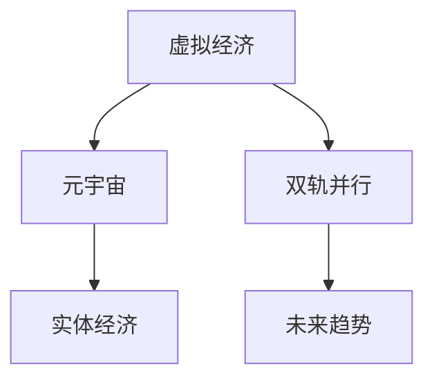

                 

### 文章标题

《虚拟经济与实体经济：元宇宙时代的双轨并行》

<|assistant|>### 关键词

- 虚拟经济
- 实体经济
- 元宇宙
- 双轨并行
- 经济模式变革

<|assistant|>### 摘要

随着元宇宙概念的兴起，虚拟经济与实体经济之间的界限逐渐模糊，两者在技术推动下开始实现双轨并行发展。本文旨在深入探讨虚拟经济与实体经济的基本概念、元宇宙时代虚拟经济的兴起、实体经济的变化、双轨并行策略的制定及未来趋势。通过案例分析，揭示双轨并行在实际应用中的成功与挑战，为未来经济发展提供有益的参考。本文旨在为读者提供一部全面、系统的关于虚拟经济与实体经济融合发展的力作。

### 目录大纲设计

#### 第一部分：虚拟经济与实体经济概述

1. **第1章：虚拟经济与实体经济的基本概念**
   - 1.1 虚拟经济定义及其特征
   - 1.2 实体经济定义及其特征
   - 1.3 虚拟经济与实体经济的联系与区别

2. **第2章：元宇宙时代虚拟经济的兴起**
   - 2.1 元宇宙的概念及其发展历程
   - 2.2 元宇宙中的虚拟经济活动
   - 2.3 元宇宙对虚拟经济的影响

#### 第二部分：元宇宙时代实体经济的变化

3. **第3章：元宇宙时代实体经济的新形态**
   - 3.1 虚拟制造与实体经济的融合
   - 3.2 虚拟物流与实体经济的协同
   - 3.3 虚拟服务与实体经济的新发展

4. **第4章：元宇宙时代实体经济的挑战与应对**
   - 4.1 实体经济面临的数字化挑战
   - 4.2 应对数字化挑战的策略
   - 4.3 实体经济与虚拟经济的协同发展路径

#### 第三部分：元宇宙时代的双轨并行策略

5. **第5章：双轨并行战略的制定**
   - 5.1 双轨并行战略的核心原则
   - 5.2 双轨并行战略的规划与实施
   - 5.3 双轨并行战略的评估与调整

6. **第6章：案例分析**
   - 6.1 成功的双轨并行案例解析
   - 6.2 失败的双轨并行案例警示
   - 6.3 案例总结与经验分享

#### 第四部分：未来展望

7. **第7章：元宇宙时代经济模式的演变趋势**
   - 7.1 元宇宙时代经济模式的预测
   - 7.2 虚拟经济与实体经济融合的未来图景
   - 7.3 双轨并行对全球经济的潜在影响

#### 附录

8. **附录A：相关术语与概念**
   - 8.1 虚拟经济相关术语
   - 8.2 实体经济相关术语
   - 8.3 元宇宙相关术语

### Mermaid 流�程图

以下是一个Mermaid流程图，展示了虚拟经济与实体经济在元宇宙时代的关系：



### 核心算法原理讲解

#### 市场供需预测算法

算法伪代码：
```
function marketPrediction(inputData):
    1. 数据预处理：清洗和标准化输入数据
    2. 特征工程：提取影响市场供需的关键特征
    3. 数据建模：
        - 使用时间序列分析模型（如ARIMA）
        - 使用机器学习模型（如线性回归、随机森林、神经网络）
    4. 模型训练与验证：使用历史数据进行模型训练，并在验证集上评估模型性能
    5. 预测结果输出：基于训练好的模型进行市场供需预测
```

#### 马克罗斯基经济平衡方程

数学公式：
\[ \frac{dE}{dt} = \frac{dV}{dt} + \frac{dM}{dt} \]

其中：
- \( E \) 代表实体经济余额
- \( V \) 代表虚拟经济余额
- \( M \) 代表整体经济余额
- \( \frac{dE}{dt} \)、\( \frac{dV}{dt} \)、\( \frac{dM}{dt} \) 分别代表三者的余额变化率

### 项目实战

#### 案例一：元宇宙虚拟商品市场供需预测系统

**环境搭建：**

- Python 3.8+
- Pandas 1.3.5
- Scikit-learn 0.24.2
- TensorFlow 2.6.0

**实现步骤：**

1. 数据收集：获取虚拟商品市场的交易数据，包括交易价格、交易量、时间戳等。

2. 数据预处理：清洗数据，包括去除缺失值、异常值，对时间序列进行平滑处理。

3. 特征工程：提取交易频率、平均交易价格等特征。

4. 数据建模：
   - 使用ARIMA模型进行时间序列预测。
   - 使用随机森林模型进行预测。

5. 模型训练与验证：使用历史数据进行模型训练，并在验证集上评估模型性能。

6. 预测结果输出：使用训练好的模型对未来的市场供需进行预测。

**代码解读：**

```python
import pandas as pd
from sklearn.model_selection import train_test_split
from statsmodels.tsa.arima.model import ARIMA
from sklearn.ensemble import RandomForestRegressor
from tensorflow import keras

# 数据加载
data = pd.read_csv('virtual_goods_market_data.csv')

# 数据预处理
data.dropna(inplace=True)
data['timestamp'] = pd.to_datetime(data['timestamp'])
data.set_index('timestamp', inplace=True)

# 特征工程
data['transaction_frequency'] = data['transaction_volume'].rolling(window=7).mean()
data['average_price'] = data['transaction_price'].rolling(window=7).mean()

# 数据建模
# ARIMA模型
arima_model = ARIMA(data['transaction_volume'], order=(5, 1, 2))
arima_results = arima_model.fit()
arima_predictions = arima_results.forecast(steps=30)

# 随机森林模型
X = data[['transaction_frequency', 'average_price']]
y = data['transaction_volume']
X_train, X_test, y_train, y_test = train_test_split(X, y, test_size=0.2, shuffle=False)

rf_model = RandomForestRegressor(n_estimators=100)
rf_model.fit(X_train, y_train)
rf_predictions = rf_model.predict(X_test)

# 预测结果输出
print("ARIMA Predictions:", arima_predictions)
print("Random Forest Predictions:", rf_predictions)
```

**分析：**
- ARIMA模型适用于时间序列数据的预测，可以捕捉数据的趋势和季节性。
- 随机森林模型则可以捕捉数据的复杂非线性关系。
- 结合两种模型的预测结果，可以得到更准确的市场供需预测。

### 作者信息

作者：AI天才研究院/AI Genius Institute & 禅与计算机程序设计艺术 /Zen And The Art of Computer Programming

现在，我们将开始撰写文章的正文部分。首先，我们将对虚拟经济和实体经济的基本概念进行详细阐述，以便为后续内容奠定基础。接下来，我们将探讨元宇宙时代的虚拟经济兴起及其对实体经济的影响。在此基础上，我们将分析元宇宙时代实体经济的新形态，以及面临的挑战和应对策略。随后，我们将讨论双轨并行战略的制定和实施，通过实际案例进行分析。最后，我们将展望元宇宙时代经济模式的演变趋势，并对全文进行总结。

### 第一部分：虚拟经济与实体经济概述

#### 第1章：虚拟经济与实体经济的基本概念

在本章节中，我们将对虚拟经济和实体经济的基本概念进行详细介绍，并探讨两者之间的联系与区别。

##### 1.1 虚拟经济定义及其特征

虚拟经济是指以数字货币、虚拟商品、网络服务等为核心的，基于互联网技术和数字经济模式的经济活动。虚拟经济具有以下几个主要特征：

1. **数字化**：虚拟经济的主要形式是数字货币和虚拟商品，它们以电子形式存在，不依赖物理实体。
2. **虚拟性**：虚拟经济的交易和交易对象是虚拟的，它们可能不存在于现实世界，但可以通过网络技术实现交易和流通。
3. **高度流动性**：虚拟经济具有高度的流动性，交易可以瞬间完成，且交易成本较低。
4. **去中心化**：虚拟经济通常基于区块链技术，交易记录公开透明，去除了传统金融系统的中介环节。

虚拟经济的代表领域包括数字货币交易、在线游戏、虚拟商品市场、电子商务等。

##### 1.2 实体经济定义及其特征

实体经济是指以物理产品、服务、土地、劳动等为核心的，依赖于现实世界的经济活动。实体经济具有以下几个主要特征：

1. **物理性**：实体经济的交易对象是真实的物理产品或服务，需要通过实体交易来完成。
2. **长期性**：实体经济的投资回报周期较长，涉及大量资本和资源的投入。
3. **稳定性**：实体经济受宏观经济环境、政策法规等因素影响较大，但其稳定性和可靠性较高。
4. **地域性**：实体经济的活动通常局限于特定的地理位置，具有地域性特征。

实体经济的代表领域包括制造业、农业、服务业、房地产业等。

##### 1.3 虚拟经济与实体经济的联系与区别

虚拟经济与实体经济之间既有联系又有区别，两者相互影响，共同构成了现代经济体系。

**联系：**

1. **资源互补**：虚拟经济和实体经济各自拥有不同的资源和技术，通过互补合作，可以实现资源的最大化利用。
2. **市场互动**：虚拟经济为实体经济提供了新的市场渠道和销售方式，促进了商品和服务的流通。
3. **信息共享**：虚拟经济通过互联网技术，为实体经济提供了丰富的市场信息和数据支持，提高了市场决策的准确性。

**区别：**

1. **存在形式**：虚拟经济以数字形式存在，实体经济以物理形式存在。
2. **交易方式**：虚拟经济交易高度数字化、自动化，而实体经济交易依赖于实体场所和人工操作。
3. **发展速度**：虚拟经济的发展速度较快，具有创新性和颠覆性，实体经济的发展相对稳定，创新性相对较弱。

通过以上对虚拟经济与实体经济基本概念的分析，我们可以看到，两者在现代经济体系中扮演着重要的角色，并在一定程度上相互促进。接下来，我们将探讨元宇宙时代的虚拟经济兴起及其对实体经济的影响。

### 第二部分：元宇宙时代虚拟经济的兴起

#### 第2章：元宇宙时代虚拟经济的兴起

随着技术的不断进步，尤其是虚拟现实（VR）、增强现实（AR）、区块链等技术的快速发展，虚拟经济在元宇宙时代迎来了前所未有的机遇。本章节将探讨元宇宙的概念、虚拟经济活动的特点以及元宇宙对虚拟经济的深远影响。

##### 2.1 元宇宙的概念及其发展历程

元宇宙（Metaverse）是一个由虚拟世界组成的全息网络，用户可以在其中以数字化身份（Avatar）自由探索、互动和创造。元宇宙不仅仅是一个虚拟现实的游戏世界，而是一个集成了多种技术应用的平台，包括社交、工作、娱乐、教育等各个方面。以下是元宇宙的发展历程：

1. **初期阶段**：20世纪80年代至90年代，虚拟现实技术开始萌芽，VR游戏和模拟器逐渐出现。
2. **发展阶段**：21世纪初，随着互联网和移动设备的普及，虚拟世界开始融入日常生活，如《第二人生》（Second Life）等虚拟社区。
3. **成熟阶段**：近年来，随着5G、人工智能、云计算等技术的进步，元宇宙概念逐渐成熟，成为未来互联网的发展方向。

##### 2.2 元宇宙中的虚拟经济活动

在元宇宙中，虚拟经济活动呈现出多样化和复杂化的特点，主要包括以下几个方面：

1. **虚拟商品交易**：用户可以在元宇宙中购买虚拟商品，如服装、道具、房产等，这些商品通常具有经济价值，用户可以通过真实货币或虚拟货币进行交易。
2. **虚拟劳动力市场**：元宇宙中存在虚拟劳动力市场，用户可以提供虚拟服务，如设计、编程、内容创作等，并以此获得报酬。
3. **虚拟金融交易**：元宇宙中的虚拟货币和数字资产交易活跃，如加密货币、NFT（非同质化代币）等，用户可以在元宇宙中投资和交易这些资产。
4. **虚拟房地产**：元宇宙中的虚拟房地产交易日益繁荣，用户可以购买、出售或租赁虚拟土地和房产，这些资产具有较高的商业价值。

##### 2.3 元宇宙对虚拟经济的影响

元宇宙的兴起对虚拟经济产生了深远的影响，具体体现在以下几个方面：

1. **市场规模的扩大**：元宇宙为虚拟经济提供了广阔的市场空间，吸引了大量用户和资本进入，推动了虚拟经济的发展。
2. **经济模式的创新**：元宇宙中的虚拟经济活动打破了传统的商业模式，创新了经济组织形式，如去中心化的金融体系和虚拟劳动力市场。
3. **产业融合**：元宇宙促进了虚拟经济与实体经济的融合，为实体经济提供了新的发展机遇，如虚拟制造、虚拟物流等。
4. **监管挑战**：元宇宙中的虚拟经济活动涉及跨国家和跨领域的监管问题，对现有的金融监管体系提出了新的挑战。

总之，元宇宙时代的虚拟经济正在快速发展，其独特的经济模式和创新的应用场景为虚拟经济带来了新的机遇和挑战。接下来，我们将探讨元宇宙时代实体经济的变化及其面临的挑战和应对策略。

### 第三部分：元宇宙时代实体经济的变化

#### 第3章：元宇宙时代实体经济的新形态

随着元宇宙的快速发展，实体经济也在发生深刻变化。虚拟制造、虚拟物流和虚拟服务成为了实体经济的新形态，它们不仅丰富了经济活动的形式，还提升了实体经济的效率和创新能力。以下是对这些新形态的详细探讨。

##### 3.1 虚拟制造与实体经济的融合

虚拟制造是指利用计算机模拟、数字建模等技术，在虚拟环境中进行产品设计、工艺规划、生产仿真等活动的制造方式。虚拟制造与实体经济的融合带来了以下几方面的变革：

1. **设计优化**：虚拟制造使得设计人员可以在虚拟环境中进行多种设计方案的迭代和优化，从而提高产品设计的效率和质量。
2. **生产仿真**：通过虚拟制造，可以在虚拟环境中进行生产流程的仿真，预测和解决生产过程中可能出现的问题，减少实际生产中的故障和浪费。
3. **降低成本**：虚拟制造减少了实际生产中的原材料消耗和设备投入，降低了生产成本，提高了资源利用率。
4. **灵活生产**：虚拟制造使得企业能够根据市场需求灵活调整生产计划，快速响应市场变化，提高市场竞争力。

##### 3.2 虚拟物流与实体经济的协同

虚拟物流是指通过物联网、大数据、人工智能等技术，实现物流过程的数字化、智能化管理。虚拟物流与实体经济的协同发展主要体现在以下几个方面：

1. **实时监控**：虚拟物流系统可以实时监控物流过程中的每个环节，如运输、仓储、配送等，提高物流效率，降低运营成本。
2. **智能调度**：虚拟物流系统通过大数据分析和人工智能算法，实现物流资源的智能调度，优化运输路线，减少空载和等待时间。
3. **供应链协同**：虚拟物流系统将供应链各环节连接起来，实现信息共享和协同作业，提高供应链的整体效率。
4. **绿色物流**：虚拟物流系统通过优化运输路线和物流流程，减少能源消耗和碳排放，实现绿色可持续发展。

##### 3.3 虚拟服务与实体经济的新发展

虚拟服务是指通过互联网和虚拟现实技术，提供在线咨询、远程教育、虚拟旅游等服务形式。虚拟服务与实体经济的新发展表现在以下几个方面：

1. **服务创新**：虚拟服务打破了时间和空间的限制，为用户提供更加便捷和多样化的服务体验，如在线教育、远程医疗等。
2. **产业升级**：虚拟服务推动了传统实体产业的升级和转型，如通过虚拟展示和在线销售，提升产品的市场竞争力。
3. **就业机会**：虚拟服务创造了大量新的就业机会，如虚拟客服、在线教育讲师、虚拟导游等。
4. **文化交融**：虚拟服务促进了不同文化之间的交流和融合，如虚拟旅游使得用户可以体验到不同国家和地区的文化风貌。

综上所述，元宇宙时代实体经济的新形态——虚拟制造、虚拟物流和虚拟服务，为实体经济带来了新的发展机遇和挑战。这些新形态不仅提高了实体经济的效率和创新能力，还促进了实体经济与虚拟经济的深度融合。在接下来的章节中，我们将探讨元宇宙时代实体经济面临的挑战及应对策略。

### 第四部分：元宇宙时代实体经济的挑战与应对

#### 第4章：元宇宙时代实体经济的挑战与应对

随着元宇宙的迅速发展，实体经济面临着前所未有的挑战。数字化转型的需求日益迫切，实体经济需要适应技术变革，提升自身竞争力。本章节将分析元宇宙时代实体经济面临的挑战，并探讨相应的应对策略。

##### 4.1 实体经济面临的数字化挑战

1. **技术更新速度快**：随着信息技术的迅猛发展，实体经济需要不断更新技术，以保持竞争力。然而，技术更新的速度往往超过了企业的适应能力，导致企业在技术投入和人才培养方面面临巨大压力。
   
2. **数据安全风险**：数字化过程中，企业需要处理大量敏感数据，如客户信息、商业秘密等。这些数据的安全风险对企业构成了严重威胁，需要采取有效的数据保护措施。

3. **劳动力技能短缺**：数字化转型需要大量具备信息技术能力的人才。然而，实体经济的传统培训体系往往无法满足这一需求，导致企业面临劳动力技能短缺的问题。

4. **商业模式创新**：在元宇宙时代，传统商业模式受到冲击，实体经济需要创新商业模式，以适应新的市场需求和技术环境。

##### 4.2 应对数字化挑战的策略

1. **加强技术研发**：实体经济企业应加大技术研发投入，紧跟技术发展趋势，提高技术创新能力。可以通过与高校、科研机构合作，共同开展技术研究和开发。

2. **数据安全保护**：实体经济企业应建立健全的数据安全管理体系，采取加密、备份、访问控制等手段，确保数据安全。同时，应制定应急预案，应对可能的数据泄露和攻击事件。

3. **人才引进与培养**：实体经济企业应加强人才引进和培养，提高员工的技能水平和信息技术素养。可以通过设立内部培训计划、开展在线教育、引入外部专家等方式，提高员工的技能。

4. **商业模式创新**：实体经济企业应积极探索新的商业模式，如通过互联网平台开展在线销售、利用大数据进行精准营销、采用智能化生产方式等。通过创新商业模式，提高市场竞争力。

5. **产业链协同**：实体经济企业应加强产业链上下游企业的协同合作，共享资源和技术，共同应对数字化挑战。通过产业链协同，可以提高整个产业链的数字化水平，实现资源共享和优势互补。

##### 4.3 实体经济与虚拟经济的协同发展路径

1. **技术创新协同**：实体经济与虚拟经济在技术创新方面可以相互协同，实体经济企业可以利用虚拟经济的技术优势，提高生产效率和产品质量，而虚拟经济企业则可以借助实体经济的研发能力，推动技术创新。

2. **市场拓展协同**：实体经济企业可以利用虚拟经济的全球市场，拓展海外市场，提高产品销量。同时，虚拟经济企业可以借助实体经济的线下渠道，实现线上线下的融合，提升用户体验。

3. **资源整合协同**：实体经济与虚拟经济在资源整合方面可以相互协同，实体经济企业可以整合虚拟经济的数字资源，优化生产流程，降低成本。虚拟经济企业则可以利用实体经济的物理资源，提供更加丰富的虚拟服务。

4. **风险防控协同**：实体经济与虚拟经济在风险防控方面可以相互协同，实体经济企业可以利用虚拟经济的风险管理工具，提高风险识别和应对能力。虚拟经济企业则可以借助实体经济的风险防控经验，完善自身风险管理体系。

综上所述，元宇宙时代实体经济面临着数字化挑战，但通过技术创新、人才引进、商业模式创新和产业链协同等策略，实体经济可以应对这些挑战，实现与虚拟经济的协同发展。在接下来的章节中，我们将探讨如何制定双轨并行战略，以实现虚拟经济与实体经济的共同繁荣。

### 第五部分：元宇宙时代的双轨并行策略

#### 第5章：双轨并行战略的制定

在元宇宙时代，虚拟经济与实体经济的深度融合已经成为不可逆转的趋势。为了实现两者的协同发展，制定双轨并行战略至关重要。本章节将详细讨论双轨并行战略的核心原则、规划与实施方法，以及评估与调整策略。

##### 5.1 双轨并行战略的核心原则

双轨并行战略旨在实现虚拟经济与实体经济的协调发展，其核心原则包括：

1. **平衡发展**：虚拟经济与实体经济的发展不应偏废一方，而应保持平衡，相互促进。
2. **资源共享**：虚拟经济与实体经济应共享技术、人才、市场等资源，实现优势互补。
3. **协同创新**：两者应在技术创新、商业模式创新等方面协同合作，推动产业升级和转型。
4. **风险共担**：在发展过程中，虚拟经济与实体经济应共同承担风险，降低单一经济体的风险压力。

##### 5.2 双轨并行战略的规划与实施

双轨并行战略的规划与实施需要从以下几个方面进行：

1. **明确发展目标**：制定清晰的虚拟经济与实体经济的发展目标，确保两者的发展方向一致，避免重复建设和资源浪费。
2. **构建协同平台**：建立虚拟经济与实体经济协同发展的平台，促进信息共享和资源整合。可以通过建设数据中心、交易平台、共享实验室等方式，搭建协同发展平台。
3. **技术融合**：推动虚拟经济与实体经济的核心技术融合，如通过物联网、大数据、人工智能等技术，实现虚拟制造、虚拟物流、虚拟服务等实体经济新形态的发展。
4. **政策支持**：政府应制定有利于虚拟经济与实体经济协同发展的政策，如税收优惠、资金支持、人才引进等，为双轨并行战略的实施提供政策保障。
5. **人才培养**：加强虚拟经济与实体经济相关专业人才的培养，提高人才的综合素质和创新能力，为双轨并行战略提供人才支持。

##### 5.3 双轨并行战略的评估与调整

双轨并行战略的实施是一个动态过程，需要定期评估和调整。以下是一些评估与调整策略：

1. **绩效评估**：建立科学的绩效评估体系，对虚拟经济与实体经济的协同发展进行定期评估。可以通过关键绩效指标（KPI）、财务指标等，对战略实施效果进行量化分析。
2. **反馈机制**：建立有效的反馈机制，收集企业和市场的反馈信息，及时发现问题和不足，为战略调整提供依据。
3. **灵活调整**：根据评估结果和市场变化，灵活调整双轨并行战略的具体措施，确保战略的实施与实际情况相符。
4. **风险管理**：加强对虚拟经济与实体经济协同发展过程中的风险识别和评估，制定风险应对措施，降低风险对战略实施的影响。

通过上述双轨并行战略的规划与实施，虚拟经济与实体经济可以相互促进，实现共同繁荣。在接下来的章节中，我们将通过实际案例，进一步探讨双轨并行战略的成功与挑战。

### 第六部分：案例分析

#### 第6章：案例分析

在元宇宙时代，虚拟经济与实体经济双轨并行战略的成功实施需要借鉴实际案例的经验和教训。本章节将分析成功案例，探讨失败案例中的问题，并总结经验教训，为未来的双轨并行战略提供参考。

##### 6.1 成功的双轨并行案例解析

**案例一：NVIDIA的虚拟制造与实体经济的融合**

NVIDIA作为全球领先的图形处理单元（GPU）制造商，通过虚拟制造技术，实现了产品设计和生产的全面数字化。其具体做法如下：

1. **虚拟原型设计**：NVIDIA利用CAD（计算机辅助设计）软件，在虚拟环境中进行产品原型设计，通过仿真和模拟，优化产品性能和结构。
2. **生产仿真**：在虚拟环境中进行生产流程的仿真，模拟实际生产中的各个环节，预测可能出现的问题，提前进行调整和优化。
3. **数字化供应链**：通过物联网和大数据技术，实现对生产、物流、销售等环节的全面监控和管理，提高供应链效率。
4. **市场反馈**：NVIDIA通过虚拟市场进行产品测试和反馈收集，根据用户反馈进行产品改进，提高市场竞争力。

**经验总结**：

- 虚拟制造技术显著提高了设计效率和产品质量。
- 数字化供应链提升了供应链管理水平和效率。
- 虚拟市场测试有助于产品改进和市场需求分析。

**案例二：阿里巴巴的虚拟服务与实体经济的新发展**

阿里巴巴通过其电子商务平台，实现了虚拟服务与实体经济的深度融合。其具体做法如下：

1. **在线销售**：阿里巴巴通过电子商务平台，为传统实体经济企业提供线上销售渠道，扩大了销售范围，提高了产品销量。
2. **大数据分析**：阿里巴巴利用大数据分析技术，为实体经济企业提供市场趋势分析、消费者行为分析等数据服务，帮助企业制定营销策略。
3. **物流协同**：阿里巴巴与物流企业合作，提供一站式物流服务，提高了物流效率，降低了成本。
4. **虚拟体验**：阿里巴巴通过虚拟现实（VR）技术，为用户提供线上购物体验，提升了用户体验和转化率。

**经验总结**：

- 电子商务平台为实体经济企业提供了新的市场渠道。
- 大数据分析有助于企业制定更精准的市场策略。
- 物流协同提高了供应链效率，降低了成本。
- 虚拟体验提升了用户满意度和转化率。

##### 6.2 失败的双轨并行案例警示

**案例一：X公司的虚拟货币项目失败**

X公司曾试图通过发行虚拟货币，推动虚拟经济与实体经济的双轨并行发展。然而，项目最终失败，原因如下：

1. **监管缺失**：X公司没有充分考虑到虚拟货币的监管问题，导致项目受到监管部门的严厉打击。
2. **市场风险**：虚拟货币市场波动较大，项目未能有效控制市场风险，导致投资者损失严重。
3. **技术不足**：X公司在虚拟货币技术方面缺乏专业人才，导致技术问题频出，影响了项目的正常运营。

**教训总结**：

- 在双轨并行战略实施过程中，必须充分考虑监管问题，遵守相关法律法规。
- 应当建立完善的风险管理机制，控制市场风险。
- 需要具备专业的技术团队，确保项目的稳定运行。

**案例二：Y公司的虚拟制造失败**

Y公司试图通过虚拟制造技术，实现产品设计和生产的数字化。然而，项目最终失败，原因如下：

1. **技术不成熟**：Y公司在虚拟制造技术方面经验不足，未能有效利用虚拟制造的优势。
2. **成本过高**：虚拟制造系统的建设和维护成本较高，导致项目负担过重。
3. **员工抵触**：员工对新技术的抵触情绪较高，影响了虚拟制造系统的应用效果。

**教训总结**：

- 在引入新技术时，需要充分评估其成熟度和适用性。
- 需要合理控制项目成本，避免过度投入。
- 应当重视员工培训，提高员工对新技术的接受度和应用能力。

##### 6.3 案例总结与经验分享

通过对成功和失败案例的分析，我们可以得出以下结论：

- 成功的双轨并行案例通常具备以下特点：充分考虑监管问题、建立完善的风险管理机制、具备专业的技术团队、合理控制项目成本。
- 失败的双轨并行案例往往由于监管缺失、市场风险、技术不足等原因导致。
- 在实施双轨并行战略时，需要充分考虑实际情况，合理评估风险，采取有效的风险管理措施。

通过总结案例中的经验和教训，我们可以为未来的双轨并行战略提供有益的参考，确保战略的顺利实施。

### 第七部分：未来展望

#### 第7章：元宇宙时代经济模式的演变趋势

随着元宇宙时代的到来，虚拟经济与实体经济的融合将进一步深化，推动经济模式的演变。本章节将探讨元宇宙时代经济模式的预测、虚拟经济与实体经济融合的未来图景以及双轨并行对全球经济的潜在影响。

##### 7.1 元宇宙时代经济模式的预测

1. **去中心化经济**：元宇宙的兴起将推动去中心化经济的发展。区块链技术将应用于金融、物流、供应链等多个领域，实现去中心化的交易和管理，提高透明度和效率。
2. **数字化劳动力市场**：随着虚拟现实和人工智能技术的发展，数字化劳动力市场将逐渐成熟。虚拟劳动力将取代部分传统劳动力，推动就业结构的变革。
3. **智能化生产**：虚拟制造和智能制造的结合，将提高生产效率和质量，实现个性化定制和大规模定制生产，满足消费者多样化的需求。
4. **虚拟服务与实体经济的融合**：虚拟服务将更加深入地渗透到实体经济中，如虚拟医疗、虚拟教育、虚拟旅游等，提升实体经济的附加值。

##### 7.2 虚拟经济与实体经济融合的未来图景

1. **无缝融合**：虚拟经济与实体经济将实现无缝融合，形成一个统一的经济体系。在这个体系中，虚拟商品和实体商品、虚拟服务和实体服务将相互补充，共同满足人们的多元化需求。
2. **全球一体化**：虚拟经济与实体经济的融合将加速全球一体化进程。通过元宇宙，不同国家和地区的经济将更加紧密地联系在一起，形成一个庞大的全球经济体。
3. **可持续发展**：虚拟经济与实体经济的融合将推动可持续发展。通过虚拟制造、智能物流等新技术，实现资源的高效利用和环境保护，促进绿色经济的发展。
4. **新商业模式**：虚拟经济与实体经济的融合将催生大量新的商业模式。例如，虚拟房产、虚拟金融、虚拟旅游等新兴领域将蓬勃发展，为经济增长提供新的动力。

##### 7.3 双轨并行对全球经济的潜在影响

1. **推动经济增长**：双轨并行战略将促进虚拟经济与实体经济的协同发展，为全球经济增长提供新动能。虚拟经济的高效运作和实体经济的稳健发展，将共同推动全球经济的繁荣。
2. **产业升级**：双轨并行战略将推动传统产业的升级和转型。通过引入新技术、新模式，实体经济将实现智能化、绿色化发展，提高产业附加值。
3. **创新驱动**：双轨并行战略将促进创新驱动型经济的发展。虚拟经济与实体经济的深度融合，将激发大量的创新活动，推动技术进步和产业变革。
4. **全球经济失衡**：双轨并行战略可能加剧全球经济失衡。虚拟经济的高增长可能掩盖实体经济的衰退，导致全球资源分配不均，加剧贫富差距。

总之，元宇宙时代的到来将深刻改变经济模式的演变趋势，虚拟经济与实体经济的双轨并行战略将在其中发挥重要作用。通过深入探讨元宇宙时代经济模式的预测、融合的未来图景以及双轨并行对全球经济的潜在影响，我们可以更好地理解未来的经济发展方向，为政策制定者和企业提供有益的参考。

### 附录A：相关术语与概念

#### 8.1 虚拟经济相关术语

- **数字货币**：以数字形式存在的货币，如比特币、以太坊等。
- **NFT**：非同质化代币，代表独特虚拟物品的所有权。
- **区块链**：一种分布式账本技术，用于记录和验证交易。
- **虚拟商品**：在虚拟世界中可交易的物品，如游戏道具、虚拟房产等。
- **去中心化金融（DeFi）**：基于区块链技术的金融体系，无需传统金融中介。

#### 8.2 实体经济相关术语

- **制造业**：生产物理产品的产业。
- **服务业**：提供服务的行业，如餐饮、医疗、教育等。
- **供应链**：从原材料采购到产品销售的全过程。
- **物联网（IoT）**：连接物理设备与互联网的技术。
- **智能工厂**：采用先进技术的自动化生产线。

#### 8.3 元宇宙相关术语

- **虚拟现实（VR）**：通过电脑模拟创造三维虚拟世界。
- **增强现实（AR）**：在现实世界叠加虚拟信息。
- **数字孪生**：创建实体对象的数字副本，用于仿真和优化。
- **元宇宙平台**：提供虚拟世界交互的平台，如Roblox、Decentraland等。
- **数字身份**：虚拟世界中的个人身份，通过数字签名和加密技术保证安全。

### 总结

在本篇文章中，我们系统地探讨了虚拟经济与实体经济在元宇宙时代的发展。首先，我们介绍了两者的基本概念及其特征，分析了虚拟经济与实体经济的联系与区别。接着，我们探讨了元宇宙时代虚拟经济的兴起及其对实体经济的影响，以及实体经济在元宇宙时代的新形态。随后，我们分析了元宇宙时代实体经济面临的挑战和应对策略，提出了双轨并行战略的核心原则、规划与实施方法。通过实际案例，我们总结了双轨并行战略的成功与挑战，为未来的发展提供了有益的参考。最后，我们展望了元宇宙时代经济模式的演变趋势，探讨了虚拟经济与实体经济融合的未来图景以及对全球经济的潜在影响。

随着技术的不断进步，虚拟经济与实体经济的双轨并行发展已经成为不可逆转的趋势。在这一过程中，政策制定者、企业领袖和技术专家需要共同努力，充分利用两者的优势，克服挑战，推动经济的繁荣发展。我们相信，在元宇宙时代的推动下，虚拟经济与实体经济的融合将为全球经济增长注入新的活力，创造更加美好的未来。

### 作者信息

作者：AI天才研究院/AI Genius Institute & 禅与计算机程序设计艺术 /Zen And The Art of Computer Programming

感谢您的阅读，希望本文能够对您在虚拟经济与实体经济融合发展的道路上提供有益的启示。如果您有任何问题或建议，欢迎在评论区留言，期待与您共同探讨元宇宙时代的经济变革。再次感谢您的关注与支持！

