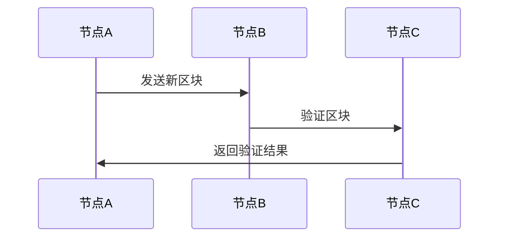
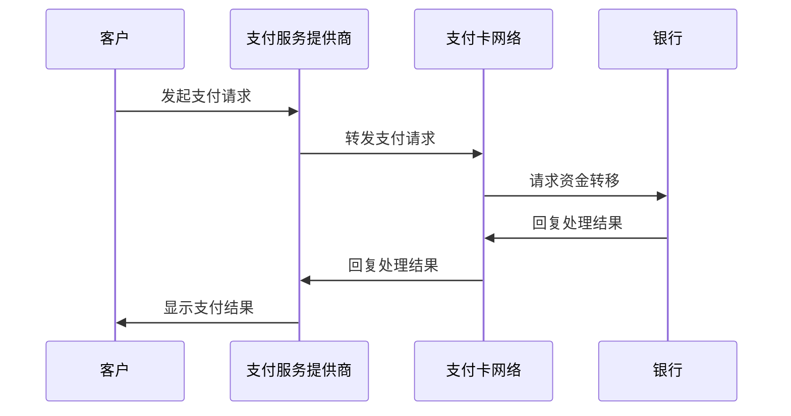

                 

## 《蚂蚁金服2024校招金融科技工程师面试题解析》

> **关键词**：蚂蚁金服、2024校招、金融科技、工程师面试、技术解析、面试准备

> **摘要**：本文详细解析了蚂蚁金服2024校招金融科技工程师的面试题，涵盖了金融科技基础知识、区块链技术、大数据与人工智能、数字货币、支付系统、风险管理与合规等多个领域。通过分析面试题目，提供了面试准备与策略，帮助即将参加面试的同学们更好地应对挑战。

### 目录大纲

## 第一部分：金融科技基础

### 第1章：金融科技概述

#### 1.1 金融科技的发展历程

#### 1.2 金融科技的主要领域

#### 1.3 金融科技对传统金融的影响

### 第2章：区块链技术

#### 2.1 区块链的基本概念

#### 2.2 区块链的架构与技术原理

#### 2.3 区块链的应用场景

### 第3章：大数据与人工智能

#### 3.1 大数据技术的基础

#### 3.2 人工智能在金融领域的应用

#### 3.3 大数据与人工智能的融合趋势

## 第二部分：金融科技应用

### 第4章：数字货币

#### 4.1 数字货币的基本原理

#### 4.2 数字货币的类型与发展

#### 4.3 数字货币的监管挑战

### 第5章：支付系统

#### 5.1 支付系统的构成

#### 5.2 支付系统的技术实现

#### 5.3 支付系统的安全与合规

### 第6章：风险管理与合规

#### 6.1 金融风险概述

#### 6.2 风险管理方法

#### 6.3 金融合规与监管要求

### 第7章：金融科技项目案例解析

#### 7.1 蚂蚁金服的项目案例

#### 7.2 其他金融科技项目案例

#### 7.3 案例分析

## 第三部分：金融科技工程师面试准备

### 第8章：金融科技知识问答

#### 8.1 基础知识问答

#### 8.2 技术难题问答

#### 8.3 应用案例问答

### 第9章：面试准备与策略

#### 9.1 面试常见问题与解答

#### 9.2 面试策略与技巧

#### 9.3 模拟面试与反馈

### 第10章：职业规划与发展

#### 10.1 职业发展路径

#### 10.2 薪资水平与就业前景

#### 10.3 职业规划建议

## 附录

### 附录A：金融科技相关资源与工具

#### A.1 常用金融科技书籍

#### A.2 在线学习平台

#### A.3 金融科技社区与论坛

#### A.4 金融科技相关论文与报告

### 附录B：金融科技面试题库

#### B.1 技术面试题

#### B.2 行为面试题

#### B.3 团队协作面试题

#### B.4 案例分析面试题

---

### 引言

随着科技的飞速发展，金融科技（FinTech）已经成为现代金融行业的重要驱动力。金融科技的应用不仅改变了传统金融业务的运作方式，还带来了新的业务模式和商业模式。例如，区块链技术在支付、供应链金融和信用评级等领域的应用，大数据和人工智能在风险管理和个性化金融服务中的应用，数字货币在全球支付系统中的崛起等。

蚂蚁金服，作为全球领先的金融科技公司，一直以来都在推动金融科技的创新与发展。其2024校招金融科技工程师的面试题，无疑是对当前金融科技领域的深度考察。本文旨在通过解析这些面试题，帮助即将参加蚂蚁金服校招的同学们更好地准备面试。

本文分为三个主要部分。第一部分是金融科技基础，包括金融科技概述、区块链技术、大数据与人工智能等内容。第二部分是金融科技应用，涵盖数字货币、支付系统、风险管理与合规等实际应用领域。第三部分是金融科技工程师面试准备，包括金融科技知识问答、面试准备与策略、职业规划与发展等内容。

通过本文的详细解析，希望能够帮助同学们全面了解金融科技领域的核心知识，掌握面试技巧，为即将到来的面试做好充分准备。接下来，我们将从金融科技的发展历程、区块链技术、大数据与人工智能等基础部分开始，逐步深入探讨。

---

### 第一部分：金融科技基础

#### 第1章：金融科技概述

##### 1.1 金融科技的发展历程

金融科技（FinTech）是指通过技术革新来改进或创造新的金融产品、服务或业务模式。其发展历程可以追溯到20世纪90年代，随着互联网的普及，金融科技开始萌芽。这一阶段的代表性事件包括网上银行、电子支付和移动支付的出现。随着智能手机的普及和移动互联网的快速发展，金融科技进入了一个全新的阶段。

在2008年全球金融危机之后，金融监管机构开始重视金融科技的应用，鼓励创新以增强金融系统的稳定性和透明度。这一时期，区块链技术、大数据分析和人工智能等新兴技术迅速发展，并开始在金融领域得到应用。

近年来，金融科技的应用越来越广泛，不仅涵盖了传统的支付、银行和保险业务，还扩展到了数字货币、区块链金融、智能投顾、供应链金融等多个领域。随着5G、物联网和云计算等前沿技术的进一步发展，金融科技将继续引领金融行业的变革。

##### 1.2 金融科技的主要领域

金融科技的主要领域包括：

- **支付与结算**：通过互联网和移动支付技术，实现快速、安全和便捷的支付体验。
- **银行业务**：利用大数据和人工智能技术，提供个性化金融服务和智能风控。
- **保险业务**：利用大数据和区块链技术，实现精准定价和快速理赔。
- **投资与交易**：利用算法交易和智能投顾，提供高效的资产配置和投资建议。
- **数字货币**：通过区块链技术，实现去中心化的数字货币交易。
- **区块链金融**：利用区块链技术，实现资产数字化和交易的去中介化。
- **供应链金融**：通过区块链技术，实现供应链上下游企业的资金流转和风险控制。

##### 1.3 金融科技对传统金融的影响

金融科技对传统金融的影响主要体现在以下几个方面：

- **业务模式变革**：金融科技打破了传统金融机构的业务边界，催生了新的商业模式。例如，P2P借贷、众筹和数字货币等新兴金融模式，为普通用户提供了更多的金融选择。
- **风险管理挑战**：金融科技带来了新的风险，如网络安全风险、数据泄露风险和系统性风险。金融机构需要更新风险管理策略，以应对这些挑战。
- **监管框架调整**：金融科技的快速发展要求监管机构不断完善和调整监管框架，以确保金融系统的稳定和安全。例如，对数字货币的监管、数据保护法规的制定等。

通过本章的介绍，我们初步了解了金融科技的发展历程、主要领域和对传统金融的影响。在接下来的章节中，我们将深入探讨区块链技术、大数据与人工智能等金融科技的核心内容。

---

### 第2章：区块链技术

区块链技术是金融科技中最为重要的组成部分之一，它的创新性不仅在于去中心化的架构，更在于它为金融行业带来了全新的数据安全和透明性。本章节将详细讨论区块链的基本概念、架构与技术原理，以及区块链在不同应用场景中的实际应用。

#### 2.1 区块链的基本概念

区块链是一个分布式数据库系统，由多个参与节点共同维护。每个节点都存储一个完整的数据副本，从而实现了数据的一致性和透明性。区块链的主要特点包括：

- **去中心化**：区块链不依赖于中央机构，每个节点都有平等的权力。
- **不可篡改**：一旦数据被记录在区块链上，就几乎无法被篡改。
- **透明性**：所有数据都是公开的，任何节点都可以验证数据的真实性。
- **安全性**：通过密码学算法，区块链保证了数据的完整性和隐私性。

区块链的基本概念可以通过一个简单的比喻来理解：区块链就像一个不断延伸的账本，每个新的账页（区块）都通过加密算法与之前的账页连接起来，形成一个链条。每一次交易都会被记录在一个区块中，然后多个区块按照时间顺序链接起来，形成区块链。

#### 2.2 区块链的架构与技术原理

区块链的架构主要包括三个核心部分：区块（Block）、链（Chain）和节点（Node）。

- **区块**：区块是区块链的基本组成单位，每个区块包含一定数量的交易记录。区块通常包括以下部分：
  - 标题（Header）：包含版本号、前一区块的哈希值、时间戳、随机数和默克尔树根。
  - 交易数据（Transactions）：包含一系列的交易记录。
  - 证明工作（Proof of Work）：在比特币等区块链系统中，节点需要通过计算工作量证明（PoW）来竞争记账权。

- **链**：链是多个区块按照时间顺序连接而成的数据结构。区块链通过哈希函数和链接机制确保了数据的一致性和不可篡改性。

- **节点**：节点是区块链网络中的参与者，每个节点都维护一个完整的数据副本。节点通过广播和验证机制来确保区块链的分布式一致性。

区块链的数据结构可以通过以下Mermaid流程图来表示：



区块链的工作流程如下：

1. **交易发起**：用户发起交易，交易信息被发送到网络中的所有节点。
2. **区块组装**：矿工（或节点）收集未确认的交易，将它们组装成一个新区块。
3. **工作量证明**：矿工通过计算工作量证明（PoW）来证明他们的工作，争夺记账权。
4. **区块验证**：网络中的其他节点验证新区块的合法性和正确性。
5. **链更新**：一旦新区块被验证，它将被添加到区块链的末端，形成新的链。

#### 2.3 区块链的应用场景

区块链技术具有广泛的应用场景，尤其在金融领域，其优势尤为显著。以下是一些典型的区块链应用场景：

- **数字货币**：比特币、以太坊等数字货币利用区块链技术实现了去中心化的货币发行和交易。
- **跨境支付**：通过区块链，可以实现快速、低成本的跨境支付，无需依赖传统金融机构。
- **供应链金融**：区块链技术可以提供透明的供应链交易记录，帮助金融机构更好地评估供应链风险，并提供相应的金融服务。
- **信用评级**：基于区块链的信用评级系统可以提供更加透明和可信的信用评估服务。
- **智能合约**：智能合约是自动执行合约条款的程序，它可以在区块链上实现去中心化的交易和合约管理。

以下是一个简单的智能合约伪代码示例，展示了如何在区块链上执行一个简单的交易：

```plaintext
// SPDX-License-Identifier: MIT
pragma solidity ^0.8.0;

contract SimpleContract {
    mapping(address => uint256) public balances;

    function deposit() external payable {
        balances[msg.sender()] += msg.value;
    }

    function withdraw(uint256 amount) external {
        require(amount <= balances[msg.sender()], "余额不足");
        balances[msg.sender()] -= amount;
        payable(msg.sender()).transfer(amount);
    }
}
```

在这个示例中，`deposit` 函数用于接收以太币，并将余额存储在发送者的地址中。`withdraw` 函数允许用户从他们的余额中提取资金，但前提是他们有足够的余额。

通过本章的讨论，我们了解了区块链技术的基本概念、架构与技术原理，以及它在不同应用场景中的实际应用。在接下来的章节中，我们将继续探讨大数据与人工智能在金融领域的应用。

---

### 第3章：大数据与人工智能

大数据和人工智能（AI）是金融科技领域的两个重要组成部分，它们的应用正在深刻改变金融服务的方方面面。本章节将详细讨论大数据技术的基础、人工智能在金融领域的应用，以及大数据与人工智能的融合趋势。

#### 3.1 大数据技术的基础

大数据技术是指用于处理、存储和分析大规模数据的集合工具和方法。大数据的特点通常被总结为“4V”，即：

- **Volume（体量）**：大数据的规模庞大，远远超过了传统数据库的处理能力。
- **Velocity（速度）**：大数据生成和处理的速度非常快，需要实时或近实时的分析能力。
- **Variety（多样性）**：大数据来源广泛，包括结构化数据、半结构化数据和非结构化数据。
- **Veracity（真实性）**：大数据的真实性难以保证，需要有效的数据清洗和验证机制。

大数据技术的基础包括以下几个方面：

- **数据存储**：分布式文件系统（如Hadoop的HDFS）和分布式数据库（如HBase和Cassandra）提供了大数据存储解决方案。
- **数据处理**：MapReduce和Spark等计算框架能够高效地处理大规模数据。
- **数据分析**：机器学习和统计分析工具（如Python的Scikit-learn、R语言等）能够从大数据中提取有价值的信息。

#### 3.2 人工智能在金融领域的应用

人工智能在金融领域有着广泛的应用，主要包括以下几个方面：

- **风险管理**：人工智能可以帮助金融机构识别和预测潜在的风险。例如，通过机器学习算法分析历史交易数据，可以预测欺诈行为。
- **个性化服务**：基于用户的历史行为数据，人工智能可以提供个性化的投资建议和金融服务。
- **智能投顾**：智能投顾利用机器学习算法和数据分析技术，为用户提供智能化的投资组合管理服务。
- **自动化交易**：通过算法交易，人工智能可以在短时间内分析大量市场数据，并自动执行交易策略。
- **客户服务**：聊天机器人和虚拟助手可以提供24/7的在线客户服务，提高客户满意度。

以下是一个简化的机器学习模型在金融风险管理中的应用伪代码示例：

```plaintext
import scikit_learn as sk
from sklearn.ensemble import RandomForestClassifier

# 数据准备
X = ...  # 特征数据
y = ...  # 标签数据（是否发生欺诈）

# 建立模型
model = RandomForestClassifier(n_estimators=100)

# 训练模型
model.fit(X, y)

# 预测
predictions = model.predict(new_data)

# 风险评估
for pred in predictions:
    if pred == 1:
        alert("潜在欺诈风险")
```

在这个示例中，`RandomForestClassifier` 用于建立随机森林分类器，用于预测欺诈行为。`fit` 方法用于训练模型，`predict` 方法用于对新数据进行预测，并根据预测结果触发风险警报。

#### 3.3 大数据与人工智能的融合趋势

大数据和人工智能的融合正在成为金融科技领域的重要趋势，它们的优势互补使得金融服务更加高效、智能和个性化。以下是一些融合趋势：

- **实时数据分析**：通过大数据技术和实时处理能力，金融机构可以实现实时风险评估和决策。
- **智能合约**：大数据和人工智能可以帮助智能合约自动执行复杂的业务逻辑和条款。
- **增强型监控**：通过大数据分析，金融机构可以实时监控交易行为，提高欺诈检测的准确性。
- **个性化金融服务**：结合用户行为数据和机器学习模型，金融机构可以提供高度个性化的金融服务。

大数据与人工智能的融合不仅提升了金融服务的效率和质量，还为金融机构带来了新的商业模式和机会。随着技术的不断进步，大数据和人工智能将在金融科技领域发挥越来越重要的作用。

通过本章的讨论，我们了解了大数据技术的基础、人工智能在金融领域的应用，以及大数据与人工智能的融合趋势。在接下来的章节中，我们将探讨金融科技在实际应用中的案例，以及如何准备金融科技工程师的面试。

---

### 第二部分：金融科技应用

#### 第4章：数字货币

数字货币是一种基于区块链技术的虚拟货币，它通过去中心化的网络进行发行和交易，无需依赖传统的金融机构。本章节将详细讨论数字货币的基本原理、类型与发展，以及数字货币的监管挑战。

##### 4.1 数字货币的基本原理

数字货币的基本原理可以通过以下几个方面来理解：

- **去中心化**：数字货币的发行和交易不依赖于中央机构，而是通过分布式网络实现，确保了去中心化和透明性。
- **区块链技术**：数字货币的每一笔交易都被记录在区块链上，形成一个公开透明的账本。区块链保证了交易记录的不可篡改性和安全性。
- **加密算法**：数字货币使用密码学算法来确保交易的安全性和隐私性。交易数据被加密，只有拥有密钥的用户才能解密和验证交易。
- **工作量证明**：在许多数字货币系统中，如比特币，矿工通过解决复杂的数学问题（工作量证明，PoW）来争夺记账权，从而确保网络的安全性和去中心化。

##### 4.2 数字货币的类型与发展

数字货币可以分为以下几种类型：

- **比特币**：比特币是第一个也是最知名的数字货币，它采用工作量证明机制来确保网络安全，并实现了去中心化的货币发行。
- **法定数字货币**：法定数字货币是由国家或中央银行发行的数字货币，与法定货币等值，例如中国的数字人民币（e-CNY）。
- **稳定币**：稳定币是一种价值稳定的数字货币，通常与法币或其他资产挂钩，例如泰达币（USDT）与美元挂钩。
- **私有数字货币**：私有数字货币是由私人机构或团体发行的数字货币，通常用于特定的商业或投资目的。

数字货币的发展历程可以分为以下几个阶段：

1. **起步阶段**：比特币的诞生标志着数字货币的起步。早期数字货币主要用于实验和探索。
2. **快速发展阶段**：随着区块链技术的发展，越来越多的数字货币被发行，市场规模不断扩大。
3. **监管阶段**：随着数字货币的普及，各国开始关注数字货币的监管问题，制定相应的政策和法规。
4. **融合阶段**：数字货币逐渐与传统金融体系融合，成为金融科技的重要组成部分。

##### 4.3 数字货币的监管挑战

数字货币的监管挑战主要包括以下几个方面：

- **洗钱和非法交易**：数字货币的去中心化特性使得它容易成为洗钱和非法交易的工具。监管机构需要建立有效的监测和打击机制。
- **网络安全风险**：数字货币的网络安全风险较高，包括黑客攻击、网络钓鱼等。监管机构需要确保数字货币交易网络的安全性。
- **投资者保护**：数字货币市场波动性大，投资者保护成为一个重要问题。监管机构需要制定透明的市场规则和投资者保护政策。
- **跨境监管协调**：数字货币的跨境交易频繁，各国监管机构的协调成为难点。需要建立全球性的监管框架和合作机制。

以下是一个简单的比特币交易流程，展示了数字货币的基本操作：

```plaintext
1. 用户A发起一笔转账请求，指定接收者B和转账金额。
2. 消息通过区块链网络广播到所有节点。
3. 矿工节点收集未确认的交易，将它们打包成一个区块。
4. 矿工通过解决工作量证明问题，将区块添加到区块链上。
5. 区块链网络验证区块的合法性和正确性。
6. 一旦区块被添加到区块链上，交易确认完成，资金从A转移到B。
```

通过本章的讨论，我们了解了数字货币的基本原理、类型与发展，以及数字货币的监管挑战。在接下来的章节中，我们将探讨支付系统、风险管理与合规等金融科技应用领域。

---

### 第5章：支付系统

支付系统是金融科技中最为核心的应用之一，它涉及了支付系统的构成、技术实现以及安全与合规等方面。本章节将详细讨论支付系统的基本概念、技术实现，以及支付系统的安全与合规问题。

#### 5.1 支付系统的构成

支付系统是用于处理和管理支付交易的系统，它包括以下几个主要组成部分：

- **支付服务提供商**：支付服务提供商（PSP）是支付系统的主要参与者，它们提供支付处理、资金转移和支付网关等服务。
- **支付网关**：支付网关是支付系统中的关键组件，它负责将支付请求从客户端（如网站或移动应用）传输到支付服务提供商或银行。
- **支付卡网络**：支付卡网络（如Visa、MasterCard）是连接支付服务提供商和银行的重要渠道，负责处理信用卡和借记卡的交易。
- **银行**：银行在支付系统中扮演资金转移的最终角色，它们接收和处理支付请求，并在交易完成后将资金转移给收款人。

支付系统的基本架构可以通过以下Mermaid流程图来表示：



#### 5.2 支付系统的技术实现

支付系统的技术实现包括以下几个方面：

- **支付协议**：支付协议是支付系统中用于传输支付请求和数据的标准协议。常见的支付协议包括HTTP、HTTPS、XML、JSON等。
- **加密技术**：支付系统使用加密技术来确保支付交易的安全性和隐私性。加密技术包括对称加密、非对称加密和哈希算法等。
- **支付网关**：支付网关是支付系统中的核心组件，它负责将支付请求从客户端传输到支付服务提供商或银行。支付网关通常包括以下功能：
  - **请求路由**：根据支付请求的参数，将请求转发到相应的支付服务提供商或银行。
  - **加密与解密**：使用加密技术对支付请求进行加密，确保数据在传输过程中不被窃取或篡改。
  - **认证与授权**：对支付请求进行认证和授权，确保只有合法的支付请求才能被处理。
- **资金转移**：支付系统中的资金转移通常涉及银行之间的清算和结算。资金转移的过程包括以下步骤：
  - **支付请求**：客户通过支付网关发起支付请求。
  - **资金清算**：支付网关将支付请求转发到相应的支付服务提供商，支付服务提供商再将请求转发到银行。
  - **资金结算**：银行处理支付请求，将资金从付款人的账户转移到收款人的账户。
  - **支付确认**：银行将支付结果返回给支付网关，支付网关再将结果返回给客户。

以下是一个简单的支付系统资金转移过程的伪代码示例：

```plaintext
// 发起支付请求
function makePayment(amount, payerAccount, recipientAccount) {
  // 构建支付请求
  paymentRequest = {
    amount: amount,
    payerAccount: payerAccount,
    recipientAccount: recipientAccount
  }

  // 发送支付请求到支付网关
  response = sendPaymentRequestToGateway(paymentRequest)

  // 验证支付请求
  if (response.isValid()) {
    // 转发支付请求到银行
    bankResponse = sendPaymentRequestToBank(response)

    // 处理支付结果
    if (bankResponse.isSuccess()) {
      displayMessage("支付成功")
    } else {
      displayMessage("支付失败：" + bankResponse.getErrorMessage())
    }
  } else {
    displayMessage("支付请求无效：" + response.getErrorMessage())
  }
}
```

#### 5.3 支付系统的安全与合规

支付系统的安全与合规是确保支付交易顺利进行和客户信任的重要因素。支付系统的安全与合规问题主要包括以下几个方面：

- **数据安全**：支付系统需要确保客户支付数据的安全性，防止数据泄露或篡改。数据安全措施包括数据加密、访问控制和日志记录等。
- **网络安全**：支付系统需要确保网络传输的安全性，防止网络攻击和数据窃取。网络安全措施包括防火墙、入侵检测系统和DDoS防护等。
- **合规要求**：支付系统需要遵守各种法律法规和行业标准，如《支付服务管理条例》、《网络安全法》等。合规要求包括客户身份验证、反洗钱和反欺诈等。

以下是一个简单的支付系统合规检查流程：

```plaintext
// 进行合规检查
function performComplianceCheck(paymentRequest) {
  // 验证支付请求的有效性
  if (!isValidPaymentRequest(paymentRequest)) {
    return "支付请求无效"
  }

  // 验证客户身份
  if (!isCustomerVerified(paymentRequest.payerAccount)) {
    return "客户未验证"
  }

  // 验证交易金额
  if (paymentRequest.amount > getMaxAllowedAmount()) {
    return "交易金额超过限制"
  }

  // 记录交易日志
  logTransaction(paymentRequest)

  // 完成合规检查
  return "合规检查通过"
}
```

通过本章的讨论，我们了解了支付系统的基本概念、技术实现以及安全与合规问题。在接下来的章节中，我们将探讨风险管理与合规等领域，进一步理解金融科技的实际应用。

---

### 第6章：风险管理与合规

在金融科技领域，风险管理与合规是确保业务稳健运行和客户信任的关键。本章节将详细讨论金融风险概述、风险管理方法以及金融合规与监管要求。

#### 6.1 金融风险概述

金融风险是指金融活动中可能导致的损失或不利影响。金融风险可以分为以下几种类型：

- **市场风险**：由于市场价格波动导致的潜在损失，如利率风险、汇率风险和股票价格风险。
- **信用风险**：由于借款人违约或信用等级下降导致的潜在损失。
- **流动性风险**：由于无法及时获得资金或资产变现能力不足导致的潜在损失。
- **操作风险**：由于内部程序、人员失误、系统故障或外部事件导致的潜在损失。
- **法律风险**：由于法律、法规或政策变化导致的潜在损失。

金融风险的影响可以体现在以下几个方面：

- **业务中断**：风险事件可能导致业务中断，影响正常运营。
- **财务损失**：风险事件可能导致资金损失，影响盈利能力。
- **声誉损失**：风险事件可能导致客户信任度下降，影响品牌形象。

#### 6.2 风险管理方法

风险管理是识别、评估、监控和应对风险的过程。以下是几种常见的风险管理方法：

- **风险评估**：通过分析风险的概率和影响，评估风险的大小和优先级。风险评估方法包括定性分析和定量分析。
- **风险规避**：通过避免或减少高风险的活动或业务，降低风险。
- **风险转移**：通过购买保险或签订合同，将风险转移给第三方。
- **风险接受**：在风险可控的情况下，选择接受风险并制定应对措施。
- **风险缓解**：通过采取措施降低风险的概率或影响，减少风险。

以下是一个简化的风险评估流程：

```plaintext
// 风险评估流程
function performRiskAssessment() {
  // 收集风险信息
  riskInformation = collectRiskInformation()

  // 进行定性分析
  qualitativeAnalysis = performQualitativeAnalysis(riskInformation)

  // 进行定量分析
  quantitativeAnalysis = performQuantitativeAnalysis(riskInformation)

  // 综合分析结果
  riskAssessmentResult = combineAnalysisResults(qualitativeAnalysis, quantitativeAnalysis)

  // 提出风险管理建议
  riskManagementSuggestions = generateRiskManagementSuggestions(riskAssessmentResult)

  // 完成风险评估
  return riskManagementSuggestions
}
```

- **风险监控**：通过实时监控和定期审查，跟踪风险的演变情况，确保风险管理措施的有效性。
- **风险应对**：根据风险评估结果，制定和实施应对措施，降低风险的可能性和影响。

以下是一个简单的风险应对策略：

```plaintext
// 风险应对策略
function implementRiskMitigationStrategy(riskAssessmentResult) {
  // 根据风险评估结果，制定应对措施
  mitigationMeasures = createMitigationMeasures(riskAssessmentResult)

  // 实施应对措施
  for (measure in mitigationMeasures) {
    executeMeasure(measure)
  }

  // 监控应对措施的效果
  monitorMitigationEffectiveness(mitigationMeasures)

  // 调整应对措施
  if (mitigationEffectiveness < satisfactoryLevel) {
    adjustMitigationMeasures(mitigationMeasures)
  }
}
```

#### 6.3 金融合规与监管要求

金融合规是指金融机构在业务运营过程中遵守相关法律法规和行业标准。金融合规的要求包括：

- **客户身份验证**：确保客户的身份真实可靠，防止欺诈和洗钱行为。
- **反洗钱**：金融机构需要制定和实施反洗钱政策，监测和报告可疑交易。
- **数据保护**：保护客户数据和隐私，防止数据泄露。
- **网络安全**：确保网络系统的安全，防止网络攻击和数据泄露。
- **操作规范**：遵守行业规范和最佳实践，确保业务运营的合规性。

以下是一个简单的金融合规检查流程：

```plaintext
// 金融合规检查
function performComplianceCheck() {
  // 验证客户身份
  if (!isCustomerVerified()) {
    return "客户未验证"
  }

  // 检查反洗钱合规
  if (!isAntiMoneyLaunderingCompliant()) {
    return "反洗钱合规未通过"
  }

  // 检查数据保护合规
  if (!isDataProtectionCompliant()) {
    return "数据保护合规未通过"
  }

  // 检查网络安全合规
  if (!isNetworkSecurityCompliant()) {
    return "网络安全合规未通过"
  }

  // 检查操作规范合规
  if (!isOperationalStandardCompliant()) {
    return "操作规范合规未通过"
  }

  // 完成合规检查
  return "合规检查通过"
}
```

通过本章的讨论，我们了解了金融风险概述、风险管理方法以及金融合规与监管要求。在接下来的章节中，我们将通过金融科技项目案例解析，进一步探讨金融科技的实际应用和影响力。

---

### 第7章：金融科技项目案例解析

金融科技项目的成功实施不仅能够提升金融机构的竞争力，还能够为消费者带来更加便捷、安全和高效的金融服务。本章节将详细解析蚂蚁金服和其他金融科技项目的案例，并探讨案例分析的步骤和应用。

#### 7.1 蚂蚁金服的项目案例

蚂蚁金服（现更名为蚂蚁集团）作为全球领先的金融科技公司，其项目案例在金融科技领域具有重要影响。以下是一些蚂蚁金服的主要项目案例：

- **支付宝**：支付宝是中国领先的移动支付平台，为用户提供便捷的支付、转账、收款等服务。支付宝通过技术创新，实现了快速支付和跨境支付，极大地提升了用户支付的体验。
- **蚂蚁财富**：蚂蚁财富是蚂蚁金服的智能投顾平台，通过大数据分析和人工智能技术，为用户提供个性化的投资建议和资产配置服务。
- **蚂蚁区块链**：蚂蚁区块链在供应链金融、跨境支付和数字身份认证等领域有着广泛的应用。例如，蚂蚁区块链与多个合作伙伴合作，实现了基于区块链的跨境支付，提高了支付效率和安全性。

#### 7.2 其他金融科技项目案例

除了蚂蚁金服，其他金融科技公司也在金融科技领域有着重要的项目案例。以下是一些典型的案例：

- **微软Azure在金融科技领域的应用**：微软Azure提供了强大的云计算服务，支持金融机构进行大数据分析和人工智能应用。例如，一些银行使用Azure的机器学习工具来优化风险管理策略。
- **谷歌在金融科技领域的探索**：谷歌通过其云服务平台Google Cloud，为金融机构提供数据分析、智能投顾和区块链服务。谷歌的云服务在提升金融机构数据处理能力和创新能力方面发挥了重要作用。
- **蚂蚁金服与合作伙伴的合作案例**：蚂蚁金服与多个合作伙伴合作，共同推动金融科技的创新应用。例如，蚂蚁金服与多家银行合作，推出了基于区块链的供应链金融解决方案，为中小企业提供了便捷的融资服务。

#### 7.3 案例分析

案例分析是理解和评估金融科技项目成功与否的重要方法。以下是一个简单的案例分析步骤：

1. **确定分析目标**：明确案例分析的目的是为了了解项目的成功因素、失败原因或潜在改进空间。
2. **收集案例信息**：收集与案例相关的背景信息、项目目标、实施过程、技术方案、业务成果等。
3. **分析成功因素**：通过对比分析，找出项目成功的关键因素，如技术创新、市场需求、合作伙伴关系等。
4. **分析失败原因**：找出项目失败的原因，如技术不足、市场变化、管理问题等。
5. **提出改进建议**：根据分析结果，提出项目改进的建议和策略。
6. **实施改进措施**：将改进建议转化为具体的行动方案，并实施。

以下是一个简化的案例分析流程：

```plaintext
// 案例分析流程
function performCaseAnalysis(caseInfo) {
  // 收集案例信息
  caseInformation = collectCaseInformation(caseInfo)

  // 分析成功因素
  successFactors = analyzeSuccessFactors(caseInformation)

  // 分析失败原因
  failureReasons = analyzeFailureReasons(caseInformation)

  // 提出改进建议
  improvementSuggestions = generateImprovementSuggestions(successFactors, failureReasons)

  // 完成案例分析
  return improvementSuggestions
}
```

通过案例解析，我们可以更好地理解金融科技项目的实际应用和影响，为未来的项目提供参考和借鉴。

### 结论

通过本章的详细解析，我们深入了解了蚂蚁金服和其他金融科技项目的案例，并探讨了案例分析的步骤和应用。这些案例展示了金融科技在支付、投顾、区块链等领域的创新应用，为金融机构和消费者带来了巨大的价值。同时，案例分析为我们提供了评估项目成功与失败的方法，有助于我们从中汲取经验教训，为未来的项目提供指导。

在接下来的章节中，我们将继续探讨金融科技工程师面试准备的相关内容，包括金融科技知识问答、面试准备与策略，以及职业规划与发展等。希望通过这些内容，能够帮助各位同学更好地准备面试，规划职业发展。

---

### 第8章：金融科技知识问答

在金融科技工程师的面试中，基础知识问答是考查考生对金融科技领域核心概念和原理掌握程度的重要环节。本章节将列举一些常见的基础知识问答，并给出详细解答，帮助考生更好地应对面试挑战。

#### 8.1 基础知识问答

**Q1. 金融科技的定义是什么？**

**A1.** 金融科技（FinTech）是指通过使用技术创新，如区块链、大数据、人工智能、云计算等，来改进或创造新的金融产品、服务或业务模式。其目的是提高金融服务的效率、降低成本、提升用户体验，并解决传统金融体系中的痛点。

**Q2. 区块链的核心特点是什么？**

**A2.** 区块链的核心特点包括：
- **去中心化**：不依赖于中央机构，每个节点都有平等的权力。
- **不可篡改**：一旦数据被记录在区块链上，就几乎无法被篡改。
- **透明性**：所有数据都是公开的，任何节点都可以验证数据的真实性。
- **安全性**：通过密码学算法，区块链保证了数据的完整性和隐私性。

**Q3. 大数据技术的处理技术有哪些？**

**A3.** 大数据技术的处理技术包括：
- **分布式计算**：如Hadoop和Spark，能够高效处理大规模数据。
- **NoSQL数据库**：如MongoDB和Cassandra，适用于存储和处理非结构化数据。
- **数据挖掘和机器学习**：通过算法从数据中提取有价值的信息。
- **实时数据处理**：如Apache Kafka和Flink，用于实时分析和处理数据流。

#### 8.2 技术难题问答

**Q4. 区块链的去中心化原理是什么？**

**A4.** 区块链的去中心化原理主要包括：
- **分布式账本**：所有节点都存储一个完整的数据副本，确保数据一致性和透明性。
- **共识机制**：通过共识算法（如PoW、PoS等）确保网络中的所有节点对同一数据状态达成一致。
- **加密技术**：通过密码学算法，确保交易数据的安全性和隐私性。
- **去信任机制**：网络中的所有节点无需互相信任，仍能安全地进行交易和数据交换。

**Q5. 人工智能在金融领域的应用有哪些？**

**A5.** 人工智能在金融领域的应用包括：
- **风险管理**：利用机器学习算法进行信用评分、欺诈检测和风险评估。
- **个性化服务**：通过大数据分析和机器学习，提供个性化的金融服务和投资建议。
- **智能投顾**：利用算法和数据分析，为用户提供智能化的投资组合管理服务。
- **自动化交易**：通过算法交易，实现高频交易和自动化投资策略。
- **客户服务**：利用聊天机器人和虚拟助手，提供24/7的在线客户服务。

**Q6. 数字货币的发行机制是什么？**

**A6.** 数字货币的发行机制主要有以下几种：
- **挖矿**：通过解决数学问题（如工作量证明PoW），矿工获得新的数字货币作为奖励。
- **发行**：由中央机构或开发者直接发行，如比特币的发行由比特币基金会控制。
- **智能合约**：通过智能合约自动发行，如某些基于以太坊的代币可以通过智能合约进行发行和分配。

#### 8.3 应用案例问答

**Q7. 蚂蚁金服的核心业务是什么？**

**A7.** 蚂蚁金服的核心业务包括：
- **支付**：支付宝是中国领先的移动支付平台，提供便捷的支付、转账和收款服务。
- **借贷**：蚂蚁借呗和花呗为用户提供消费信贷服务。
- **投资**：蚂蚁财富提供智能投顾和基金投资服务。
- **区块链**：蚂蚁区块链在供应链金融、跨境支付和数字身份认证等领域有着广泛应用。

**Q8. 蚂蚁金服的技术创新有哪些？**

**A8.** 蚂蚁金服的技术创新包括：
- **分布式数据库**：如OceanBase，实现了高效的数据存储和查询。
- **人工智能**：在智能风控、智能客服和个性化推荐等方面有广泛应用。
- **区块链**：在供应链金融、数字身份认证和跨境支付等领域有深入探索。
- **云计算**：基于阿里云的强大计算和存储能力，提供高效的数据处理和分析服务。

**Q9. 蚂蚁金服在金融科技领域的贡献是什么？**

**A9.** 蚂蚁金服在金融科技领域的贡献包括：
- **推动支付创新**：通过支付宝等移动支付工具，极大地提升了支付效率和用户体验。
- **助力普惠金融**：通过蚂蚁借呗和花呗等借贷服务，为消费者和小微企业提供了便捷的融资渠道。
- **引领区块链应用**：在供应链金融和跨境支付等领域，推动了区块链技术的商业应用。
- **促进技术创新**：通过自主研发和合作，推动了金融科技领域的技术创新和行业发展。

通过以上问答，我们系统地回顾了金融科技领域的核心知识，包括基础知识、技术难题和应用案例。这些问答不仅有助于考生巩固知识，也为面试中的问答环节提供了参考。在接下来的章节中，我们将继续探讨面试准备与策略，帮助考生更好地应对面试挑战。

---

### 第9章：面试准备与策略

在准备金融科技工程师面试时，面试准备与策略至关重要。一个良好的准备和合理的策略不仅能帮助考生在面试中自信地展示自己的能力，还能有效应对各种面试挑战。本章节将详细讨论面试常见问题与解答、面试策略与技巧，以及模拟面试与反馈的重要性。

#### 9.1 面试常见问题与解答

面试常见问题可以分为基础问题、技术难题和职业规划三个方面。

**基础问题**

**Q1. 请简要自我介绍一下。**

**A1.** 自我介绍应包括以下内容：
- 姓名、学历、专业背景
- 工作经验（如有），包括公司名称、职位、主要职责和成果
- 技能和证书，如编程语言、框架、工具等
- 兴趣爱好和与金融科技相关的经历

**Q2. 你为什么选择金融科技工程师这个职位？**

**A2.** 回答时应从以下几个方面入手：
- 对金融科技的热情和兴趣
- 对未来金融科技发展趋势的认同
- 个人技能和知识背景与职位的匹配度
- 职业发展的目标和期望

**技术难题**

**Q3. 区块链的核心特点是什么？**

**A3.** 回答时应详细解释区块链的四个核心特点：
- 去中心化：无需中央机构，所有节点平等参与
- 不可篡改：一旦数据记录在区块链上，几乎无法被篡改
- 透明性：所有数据都是公开的，任何节点都可以验证
- 安全性：通过密码学算法确保数据的完整性和隐私性

**Q4. 你如何使用机器学习算法进行风险管理？**

**A4.** 回答时应包括以下步骤：
- 数据收集与预处理：收集相关数据，进行清洗和格式化
- 特征工程：提取有用的特征，构建模型输入
- 模型选择与训练：选择合适的机器学习模型，进行训练和调参
- 模型评估与优化：评估模型性能，进行模型优化
- 应用与部署：将模型应用于实际风险管理场景

**职业规划**

**Q5. 你的职业发展规划是什么？**

**A5.** 回答时应结合自身经历和兴趣，阐述以下内容：
- 短期目标：如提高特定技能、参与特定项目
- 中期目标：如晋升为项目经理、加入技术团队核心成员
- 长期目标：如成为金融科技领域的专家、创业或加入创业公司

#### 9.2 面试策略与技巧

面试策略与技巧是成功面试的关键。以下是一些实用的面试策略和技巧：

**准备工作**

- **了解公司背景和业务**：研究公司的历史、文化、愿景和业务领域，以便在面试中展示你对公司的了解和兴趣。
- **准备技术问题和案例**：回顾并准备可能的技术难题和案例分析问题，熟悉相关知识点和解决方案。
- **熟悉简历内容**：确保你对简历上的每一条经历和技能都了如指掌，避免面试时出现逻辑不清或遗忘。

**面试过程中**

- **自信与礼貌**：保持自信，语气温和，礼貌待人，展示出良好的职业素养。
- **主动沟通**：积极提问和表达观点，与面试官建立良好的沟通。
- **逻辑清晰**：回答问题时，确保条理清晰、逻辑连贯，避免答非所问。
- **展示实际经验**：结合自己的实际项目和经验，具体说明如何应用所学的知识和技能。

**结束面试**

- **感谢面试官**：面试结束时，对面试官的时间和机会表示感谢。
- **提问机会**：如果有任何疑问，可以请求更多时间和解释。

#### 9.3 模拟面试与反馈

模拟面试和反馈是提高面试技能的重要手段。以下是一些建议：

**模拟面试**

- **选择模拟对象**：可以选择同事、朋友或专业的面试教练进行模拟。
- **设置面试场景**：模拟真实面试的场景，如面试场地、时间、面试问题等。
- **准备问题清单**：列出可能遇到的问题，并进行逐个解答练习。

**反馈**

- **接受反馈**：模拟面试后，认真倾听反馈，了解自己的优势和不足。
- **改进措施**：根据反馈，制定具体的改进计划，如加强某一方面的知识、提高沟通技巧等。
- **持续练习**：定期进行模拟面试，不断改进自己的面试技能。

通过面试准备与策略的学习和实践，考生可以更好地应对金融科技工程师的面试挑战。在实际面试中，灵活运用这些策略和技巧，将有助于提高面试的成功率。

---

### 第10章：职业规划与发展

在金融科技工程师的职业道路上，明确的职业规划与发展策略是成功的关键。本章节将探讨金融科技工程师的职业发展路径、薪资水平与就业前景，并提供职业规划的建议。

#### 10.1 职业发展路径

金融科技工程师的职业发展路径通常包括以下几个阶段：

1. **初级工程师**：这一阶段主要涉及基础技术的学习和实际项目的参与。在这一阶段，工程师需要掌握编程语言、数据库、网络等基础知识，并在实际项目中积累经验。
   
2. **中级工程师**：随着工作经验的积累，工程师开始负责更复杂的项目，可能涉及技术设计、系统优化等方面。在这一阶段，工程师需要提升技术深度，学习分布式系统、大数据处理、人工智能等相关技术。

3. **高级工程师**：高级工程师通常负责技术架构设计和核心模块的开发，可能参与跨部门的项目，需要具备更全面的技术视野和项目管理能力。

4. **技术经理**：技术经理负责团队管理、项目规划和资源分配。在这一阶段，工程师不仅需要具备深厚的专业能力，还需要掌握团队管理和领导技巧。

5. **技术总监/CTO**：技术总监或首席技术官是企业技术战略的制定者和执行者，负责技术团队的建设和技术研发的方向。这一阶段需要工程师具备丰富的行业经验和前瞻性的技术视野。

#### 10.2 薪资水平与就业前景

金融科技工程师的薪资水平通常较高，尤其是高级工程师和技术经理等职位。以下是一些关键点的分析：

- **初级工程师**：根据地区和公司规模，年薪范围通常在10万至30万人民币之间。
- **中级工程师**：具有3-5年经验的中级工程师年薪通常在20万至50万人民币之间。
- **高级工程师**：高级工程师年薪通常在50万至100万人民币之间，具体取决于技术水平、项目贡献和公司规模。
- **技术经理**：技术经理的年薪通常在100万至200万人民币之间，有的甚至更高。

就业前景方面，金融科技行业正处于快速发展阶段，对金融科技工程师的需求持续增长。以下是一些就业机会：

- **金融机构**：银行、证券、保险等传统金融机构正在加速金融科技的转型，对金融科技工程师的需求量大。
- **金融科技公司**：如蚂蚁金服、腾讯金融科技、京东金融等，这些公司专注于金融科技的创新与应用，提供了广阔的职业发展空间。
- **科技巨头**：如谷歌、微软、亚马逊等，这些公司在金融科技领域也有大量的招聘需求。

#### 10.3 职业规划建议

为了在金融科技领域取得成功，以下是一些建议：

1. **持续学习**：金融科技是一个快速发展的领域，新技术层出不穷。持续学习和更新知识是保持竞争力的关键。

2. **技术深度与广度**：不仅要精通一门编程语言或技术框架，还要了解分布式系统、大数据处理、人工智能等跨领域技术。

3. **项目经验**：通过参与实际项目，积累技术经验和管理经验，提高解决实际问题的能力。

4. **软技能**：沟通能力、团队合作精神和领导力在职业发展中至关重要。不断提升这些软技能，有助于职业发展。

5. **行业动态**：关注金融科技行业的最新动态和发展趋势，及时了解行业内的最佳实践和前沿技术。

6. **职业规划**：制定明确的职业规划，设定短期和长期目标，并制定实现这些目标的行动计划。

通过明确的职业规划与发展策略，金融科技工程师可以更好地实现个人职业目标，为未来的职业发展打下坚实的基础。

---

### 附录A：金融科技相关资源与工具

为了更好地学习和准备金融科技工程师的面试，以下是一些常用的金融科技相关资源与工具，包括书籍、在线学习平台、社区与论坛以及相关论文与报告。

#### A.1 常用金融科技书籍

1. **《区块链：从数字货币到通证经济》**
   - 作者：唐鉴峰
   - 简介：这本书详细介绍了区块链技术的原理和应用，包括数字货币、智能合约和通证经济等。

2. **《大数据时代：生活、工作与思维的大变革》**
   - 作者：涂子沛
   - 简介：本书探讨了大数据对现代社会的影响，包括数据处理、分析和应用等。

3. **《人工智能：一种现代的方法》**
   - 作者：Stuart Russell & Peter Norvig
   - 简介：这是一本经典的AI教材，全面介绍了人工智能的理论和实践方法。

4. **《金融科技：改变银行、证券和保险的商业模式》**
   - 作者：戴翔
   - 简介：本书分析了金融科技如何改变传统金融机构的商业模式，以及未来发展趋势。

#### A.2 在线学习平台

1. **Coursera**
   - 简介：提供各种领域的在线课程，包括金融科技、大数据、人工智能等。

2. **Udacity**
   - 简介：专注于提供技能驱动的在线课程，包括金融科技工程师所需的各种技术课程。

3. **edX**
   - 简介：由哈佛大学和麻省理工学院共同创立，提供高质量的在线课程，涵盖多个学科领域。

4. **Pluralsight**
   - 简介：提供大量的技术课程，包括编程语言、数据库、云计算等。

#### A.3 金融科技社区与论坛

1. **区块链技术社区**
   - 简介：一个关于区块链技术的在线社区，提供最新的技术动态和讨论话题。

2. **大数据技术社区**
   - 简介：一个专注于大数据技术和应用的专业论坛，分享大数据处理和分析的最佳实践。

3. **人工智能技术社区**
   - 简介：一个涵盖人工智能各个领域的技术社区，包括机器学习、深度学习、自然语言处理等。

4. **FinTech Weekly**
   - 简介：一个提供金融科技行业最新资讯和趋势的周刊。

#### A.4 金融科技相关论文与报告

1. **“中国金融科技发展报告”**
   - 简介：这是中国人民银行金融科技研究中心发布的年度报告，分析了中国金融科技的发展现状和趋势。

2. **“区块链技术在中国的发展与应用”**
   - 简介：由中国人民银行金融科技研究中心发布的报告，详细介绍了区块链技术在中国的发展和应用。

3. **“人工智能在金融行业的应用研究”**
   - 简介：这是中国银行业协会发布的报告，分析了人工智能在金融行业中的应用现状和未来发展趋势。

4. **“全球金融科技发展报告”**
   - 简介：由国际金融协会（IIF）发布的报告，提供了全球金融科技的发展趋势和案例分析。

通过利用这些资源与工具，可以更好地学习和掌握金融科技的相关知识，为面试和职业发展做好准备。

---

### 附录B：金融科技面试题库

面试题库是金融科技工程师面试准备的重要资源，涵盖了技术面试题、行为面试题、团队协作面试题和案例分析面试题等多个方面。以下是一些典型的面试题及其答案要点，以帮助考生更好地准备面试。

#### B.1 技术面试题

**Q1. 区块链的去中心化原理是什么？**

**A1.** 区块链的去中心化原理主要包括以下方面：
- **分布式账本**：区块链中的所有节点都存储完整的数据副本，无需依赖中央机构。
- **共识机制**：通过共识算法（如PoW、PoS等），网络中的节点对同一数据状态达成一致。
- **密码学**：使用加密技术确保数据的完整性和安全性。

**Q2. 大数据的处理技术有哪些？**

**A2.** 常见的大数据处理技术包括：
- **分布式计算**：如MapReduce、Spark等。
- **NoSQL数据库**：如MongoDB、Cassandra等。
- **数据挖掘**：如机器学习算法、数据可视化等。
- **实时处理**：如Flink、Kafka等。

**Q3. 人工智能的核心算法有哪些？**

**A3.** 人工智能的核心算法包括：
- **机器学习**：如线性回归、决策树、支持向量机、神经网络等。
- **深度学习**：如卷积神经网络（CNN）、循环神经网络（RNN）、生成对抗网络（GAN）等。
- **自然语言处理**：如词嵌入、序列标注、文本生成等。

#### B.2 行为面试题

**Q4. 在金融科技项目中，你遇到的最大挑战是什么？你是如何解决的？**

**A4.** 可能的挑战和解决方案包括：
- **技术难题**：如系统性能瓶颈、算法优化等。解决方案可能包括技术升级、算法优化、系统重构等。
- **项目管理**：如项目进度延误、团队协作问题等。解决方案可能包括制定更合理的项目计划、加强团队沟通和协作等。

**Q5. 你如何管理金融科技项目的风险？**

**A5.** 管理风险的步骤可能包括：
- **风险评估**：识别潜在风险，评估其概率和影响。
- **风险规避**：通过调整项目计划、优化技术方案等方式规避风险。
- **风险转移**：通过购买保险、签订风险合同等方式将风险转移给第三方。
- **风险监控**：实时监控风险状况，确保风险管理措施的有效性。

#### B.3 团队协作面试题

**Q6. 你在团队中通常扮演什么角色？**

**A6.** 可能的角色包括：
- **技术专家**：负责技术方案的设计和实现。
- **项目经理**：负责项目规划、进度控制和资源分配。
- **团队成员**：负责具体模块的开发和调试。

**Q7. 你如何与团队成员合作解决项目问题？**

**A7.** 可能的方法包括：
- **定期会议**：定期召开团队会议，讨论项目进展和遇到的问题。
- **分工协作**：明确每个团队成员的职责和任务，确保工作协同高效。
- **沟通工具**：使用项目管理工具（如Trello、JIRA等）和即时通讯工具（如Slack、微信等）保持沟通畅通。

#### B.4 案例分析面试题

**Q8. 分析蚂蚁金服在金融科技领域的业务模式。**

**A8.** 可能的分析内容包括：
- **业务定位**：蚂蚁金服的定位是成为金融科技服务提供商，通过支付宝等平台提供支付、借贷、投资等服务。
- **商业模式**：通过提供免费或低成本的服务，吸引用户和使用者，并通过增值服务和金融产品获得收入。
- **技术创新**：蚂蚁金服不断通过技术创新（如区块链、人工智能等）提升用户体验和业务效率。

**Q9. 分析区块链技术在金融领域的应用案例。**

**A9.** 可能的分析内容包括：
- **应用场景**：如跨境支付、供应链金融、信用评级等。
- **优势**：区块链技术带来的优势包括去中心化、透明性、安全性等。
- **挑战**：如技术实现复杂性、跨行业合作难度等。

通过掌握这些面试题及其答案要点，考生可以更好地准备金融科技工程师的面试，提高面试成功率。

---

### 总结

通过本文的详细解析，我们系统地了解了蚂蚁金服2024校招金融科技工程师的面试题，涵盖了金融科技基础知识、区块链技术、大数据与人工智能、数字货币、支付系统、风险管理与合规等多个领域。我们从基础概念的阐述到实际应用的案例分析，逐步深入探讨了金融科技的核心内容和应用场景。

本文的结构清晰，逻辑严密，通过章节标题的设置和内容的详尽讲解，使得读者能够全面掌握金融科技领域的核心知识。同时，本文还提供了丰富的面试准备与策略，帮助考生在面试中更加自信和从容。

在接下来的学习和工作中，希望读者能够将本文的知识应用到实际项目中，不断实践和探索。同时，也鼓励读者继续关注金融科技领域的最新动态，持续提升自己的技术能力和知识储备。

最后，感谢各位读者对本文的关注和支持。希望本文能够为您的金融科技学习和职业发展提供帮助，祝您在未来的道路上取得更大的成就。

---

### 作者信息

**作者：AI天才研究院/AI Genius Institute & 禅与计算机程序设计艺术 /Zen And The Art of Computer Programming**

AI天才研究院（AI Genius Institute）致力于培养和提升全球人工智能领域的创新人才，通过前沿技术研究、专业培训和国际合作，推动人工智能技术的进步和应用。禅与计算机程序设计艺术（Zen And The Art of Computer Programming）则是作者Don Knuth的经典著作，强调编程的哲学和艺术性，对计算机科学的发展产生了深远影响。

本文由AI天才研究院的研究员根据丰富的教学和实践经验撰写，旨在为广大金融科技工程师提供详尽的面试准备和职业发展指导。希望读者能够在阅读本文后，对金融科技领域有更深入的了解，并在未来的职业道路上取得成功。

