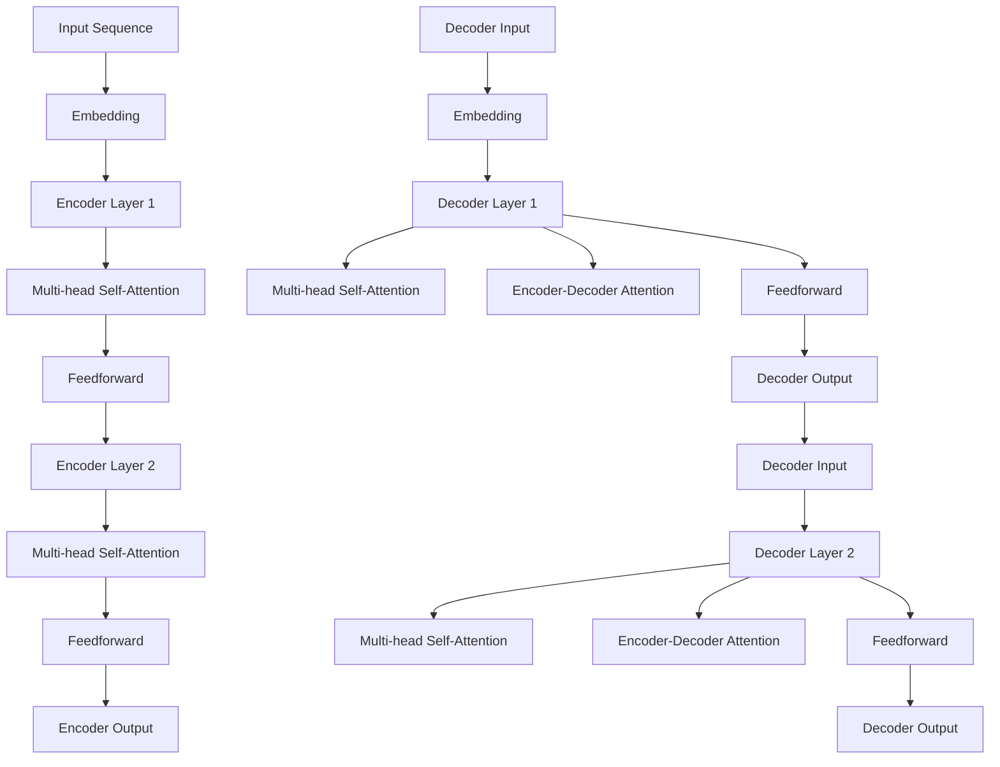

                 

# 《规划（Planning）：LLM多步骤目标实现》

## 关键词
语言学习模型（LLM），多步骤目标规划，目标函数，优化算法，实例分析，项目实战。

## 摘要
本文旨在探讨语言学习模型（LLM）在多步骤目标实现中的应用。首先，我们将介绍LLM的基础知识，包括其定义、发展历程、核心概念和架构。接着，我们将深入分析LLM的多步骤目标规划方法，包括其概念、流程、算法选择以及面临的挑战。随后，通过实例分析展示LLM在不同任务中的目标规划实践。最后，我们将通过实际项目实战，详细介绍LLM目标规划的开发过程，包括环境搭建、源代码实现和代码解读，为读者提供实用的技术指导。

----------------------------------------------------------------

# 《规划（Planning）：LLM多步骤目标实现》目录大纲

## 第一部分: LLM基础概述

### 第1章: 语言学习模型（LLM）概述

#### 1.1 LLM的定义与作用

#### 1.2 LLM的发展历程

#### 1.3 LLM的核心概念与架构

#### 1.4 LLM的应用场景

### 第2章: 语言模型关键技术

#### 2.1 词嵌入技术

#### 2.2 序列模型与注意力机制

#### 2.3 转换器架构详解

#### 2.4 预训练与微调技术

## 第二部分: LLM多步骤目标规划

### 第3章: LLM多步骤目标规划方法

#### 3.1 多步骤目标规划的概念与重要性

#### 3.2 多步骤目标规划的基本流程

#### 3.3 多步骤目标规划的算法选择

#### 3.4 多步骤目标规划的挑战与优化策略

### 第4章: LLM目标规划的实例分析

#### 4.1 实例1：问答系统中的目标规划

#### 4.2 实例2：机器翻译中的目标规划

#### 4.3 实例3：文本生成中的目标规划

### 第5章: LLM目标规划的项目实战

#### 5.1 项目实战1：构建一个问答系统

#### 5.2 项目实战2：翻译一个英文段落到中文

#### 5.3 项目实战3：生成一篇新闻文章

## 第三部分: LLM目标规划优化

### 第6章: LLM目标规划性能优化

#### 6.1 模型性能评估指标

#### 6.2 性能优化方法

#### 6.3 实时优化策略

### 第7章: LLM目标规划的安全与伦理

#### 7.1 安全性挑战与防护措施

#### 7.2 伦理问题与应对策略

#### 7.3 法律法规与合规性要求

## 附录

### 附录 A: LLM开发工具与资源

#### A.1 主流深度学习框架对比

##### A.1.1 TensorFlow

##### A.1.2 PyTorch

##### A.1.3 JAX

##### A.1.4 其他框架简介

### 附录 B: 伪代码与数学公式

#### B.1 伪代码示例

##### B.1.1 嵌套循环算法

##### B.1.2 矩阵运算算法

#### B.2 数学公式详解

##### B.2.1 语言模型损失函数

##### B.2.2 注意力机制公式

##### B.2.3 预训练目标函数

### 附录 C: 项目实战代码解读

#### C.1 项目实战1代码解读

#### C.2 项目实战2代码解读

#### C.3 项目实战3代码解读

----------------------------------------------------------------

## 第一部分: LLM基础概述

### 第1章: 语言学习模型（LLM）概述

#### 1.1 LLM的定义与作用

语言学习模型（Language Learning Model，简称LLM）是一种能够通过学习大量文本数据来理解和生成自然语言的深度学习模型。LLM的核心作用是让计算机具备自然语言理解和生成能力，从而实现与人类的自然交流。

LLM的定义可以从以下几个方面进行阐述：

- **模型定义**：LLM通常基于神经网络架构，特别是序列到序列（sequence-to-sequence）模型，包括编码器（encoder）和解码器（decoder）。编码器负责将输入文本序列编码为固定长度的向量表示，解码器则利用这些向量表示生成文本输出。

- **数据学习**：LLM通过大量的文本数据进行预训练，这些数据可以是互联网上的文本、书籍、新闻、社交媒体等。在预训练过程中，模型学习文本的统计特征、语法结构、语义含义等。

- **功能应用**：LLM广泛应用于自然语言处理（NLP）的各个领域，包括机器翻译、问答系统、文本生成、对话系统等。例如，在机器翻译中，LLM可以将一种语言的文本翻译成另一种语言的文本；在问答系统中，LLM可以根据用户的问题提供准确的答案。

#### 1.2 LLM的发展历程

LLM的发展历程可以分为以下几个阶段：

- **早期研究**：20世纪80年代，研究人员开始使用统计方法（如N-gram模型）和规则系统来处理自然语言。这些方法在处理简单任务时表现良好，但随着任务复杂度的增加，其局限性逐渐显现。

- **基于规则的模型**：20世纪90年代，基于规则的方法（如转移系统、语法分析器）逐渐取代了统计方法。这些模型通过定义一组规则来处理自然语言，但规则系统的扩展性和适应性较差。

- **统计机器学习方法**：21世纪初，统计机器学习方法（如最大熵模型、条件概率模型）开始在NLP中应用。这些方法利用大量的训练数据来学习文本的概率分布，但仍然存在计算效率和模型表达能力的问题。

- **深度学习时代**：2013年，Google提出了基于神经网络的机器翻译系统，开启了深度学习在NLP领域的应用。深度学习模型（如序列到序列模型、循环神经网络（RNN）和变压器（Transformer））具有强大的表示能力和计算效率，使得LLM的研究和应用取得了突破性的进展。

- **大规模预训练模型**：近年来，随着计算资源和数据集的日益丰富，大规模预训练模型（如GPT-3、BERT、T5）成为了LLM领域的研究热点。这些模型通过在大量文本上进行预训练，然后进行微调以适应特定任务，显著提升了NLP任务的性能。

#### 1.3 LLM的核心概念与架构

LLM的核心概念和架构可以从以下几个方面进行理解：

- **词嵌入（Word Embedding）**：词嵌入是将词汇映射到高维空间中，使得语义相似的词汇在空间中距离较近。常见的词嵌入技术包括词袋模型（Bag of Words，BoW）、词嵌入（Word2Vec）和 glove 等。

- **序列模型（Sequence Model）**：序列模型是处理序列数据（如文本）的常见方法，其核心是通过对序列中的每一个时间步进行建模，然后通过循环结构逐步生成输出序列。常见的序列模型包括循环神经网络（RNN）、长短期记忆网络（LSTM）和门控循环单元（GRU）。

- **注意力机制（Attention Mechanism）**：注意力机制是一种用于增强模型对输入序列不同部分关注度的方法。其核心是计算一个权重向量，用于放大重要部分的信息，并抑制不重要的部分。注意力机制在序列模型中广泛应用，特别是在变压器（Transformer）架构中。

- **变压器架构（Transformer）**：变压器是一种基于自注意力机制的序列处理模型，其核心是多头注意力机制和位置编码。变压器具有计算效率高、并行处理能力强等优点，已成为当前LLM的主流架构。

- **编码器（Encoder）与解码器（Decoder）**：编码器和解码器是LLM的两大核心模块。编码器负责将输入文本序列编码为固定长度的向量表示，解码器则利用这些向量表示生成文本输出。编码器和解码器通常采用相同的架构，但解码器在输出每个单词时都会利用已生成的单词信息。

#### 1.4 LLM的应用场景

LLM在自然语言处理领域具有广泛的应用场景，主要包括以下几个方面：

- **机器翻译**：机器翻译是将一种语言的文本翻译成另一种语言的文本。LLM通过在大量平行语料上进行预训练，可以显著提升翻译质量和速度。

- **问答系统**：问答系统是一种能够回答用户提出的问题的智能系统。LLM可以用于处理用户的问题，并从大量文本数据中检索出相关答案。

- **文本生成**：文本生成是将一种文本数据转换为另一种文本数据。LLM可以生成文章、摘要、对话等文本内容，广泛应用于内容创作和个性化推荐等领域。

- **对话系统**：对话系统是一种能够与人类进行自然对话的智能系统。LLM可以用于构建聊天机器人、虚拟助手等，实现与用户的实时交互。

- **情感分析**：情感分析是识别文本中的情感倾向，如正面、负面、中性等。LLM可以用于分析用户评论、社交媒体文本等，帮助企业了解用户需求和情感变化。

- **文本分类**：文本分类是将文本数据分为不同的类别。LLM可以用于分类新闻、邮件、社交媒体文本等，帮助企业进行内容管理和推荐。

- **语音识别**：语音识别是将语音信号转换为文本数据。LLM可以用于识别语音中的关键词和短语，提高语音识别的准确性和效率。

通过本文的第一部分，我们对语言学习模型（LLM）有了初步的了解，包括其定义、发展历程、核心概念和架构。在接下来的部分中，我们将深入探讨LLM的关键技术，如词嵌入、序列模型、注意力机制和变压器架构，并分析LLM在多步骤目标规划中的应用和挑战。让我们一起继续探索LLM的奥秘！

----------------------------------------------------------------

### 第2章: 语言模型关键技术

#### 2.1 词嵌入技术

词嵌入（Word Embedding）是将自然语言中的词汇映射到高维空间中的向量表示，以便于计算机处理和分析。词嵌入技术是语言模型的核心组成部分，其质量直接影响到模型在自然语言处理任务中的性能。

**词嵌入的重要性**：

- **表示能力**：词嵌入能够将词汇的语义信息编码为向量，使得语义相近的词汇在向量空间中距离较近。这有助于模型在语义分析、文本分类等任务中取得更好的效果。

- **计算效率**：词嵌入使得文本数据可以被高效地处理，便于在神经网络中进行矩阵运算和向量计算。

- **交互能力**：词嵌入使得词汇之间的交互关系可以被模型捕捉，有助于模型在文本生成、机器翻译等任务中实现更自然的输出。

**常见的词嵌入技术**：

1. **词袋模型（Bag of Words，BoW）**：词袋模型是一种简单的文本表示方法，将文本表示为单词的集合。每个单词对应一个特征向量，特征向量的值表示单词在文档中出现的次数。词袋模型不考虑单词的顺序和语法结构，因此无法捕捉词汇的语义信息。

2. **词嵌入（Word2Vec）**：词嵌入是一种基于神经网络的语言模型，通过训练生成词汇的向量表示。词嵌入技术包括连续词袋（Continuous Bag of Words，CBOW）和Skip-Gram两种方法。CBOW方法通过上下文单词预测目标词，Skip-Gram方法通过目标词预测上下文单词。词嵌入技术能够捕捉词汇的语义信息，但存在上下文依赖性不强的问题。

3. **GloVe（Global Vectors for Word Representation）**：GloVe是一种基于全局统计信息的词嵌入技术，通过优化词向量之间的相似性来生成词汇的向量表示。GloVe技术综合考虑了词汇的局部和全局信息，能够生成质量较高的词向量。

**词嵌入技术在LLM中的应用**：

- **输入表示**：在LLM中，词嵌入技术用于将输入文本序列转换为向量序列，作为模型输入。词向量序列可以用于训练序列模型，如循环神经网络（RNN）和变压器（Transformer）。

- **预训练**：词嵌入技术可以用于预训练大规模语言模型，如GPT-3和BERT。在预训练过程中，词向量通过无监督学习方法进行优化，从而提高模型在下游任务中的性能。

- **文本生成**：在文本生成任务中，词嵌入技术用于将输入文本序列转换为向量序列，作为生成模型的输入。生成模型利用词向量序列生成新的文本序列。

- **文本分类**：在文本分类任务中，词嵌入技术用于将文本数据转换为向量表示，作为分类模型的输入。分类模型通过词向量序列预测文本的类别。

通过本节对词嵌入技术的介绍，我们了解了其在语言模型中的重要作用和常见方法。在下一节中，我们将深入探讨序列模型和注意力机制，这两个关键技术对于理解和应用语言模型至关重要。

#### 2.2 序列模型与注意力机制

序列模型（Sequence Model）是处理序列数据（如文本、语音、时间序列等）的一种常见方法。序列模型的核心思想是对序列中的每一个时间步进行建模，然后通过循环结构逐步生成输出序列。在自然语言处理领域，序列模型广泛应用于机器翻译、文本生成、问答系统等任务。注意力机制（Attention Mechanism）是一种增强模型对输入序列不同部分关注度的方法，其核心是计算一个权重向量，用于放大重要部分的信息，并抑制不重要的部分。注意力机制在序列模型中得到了广泛应用，特别是在变压器（Transformer）架构中。

**序列模型原理**

序列模型的基本原理可以概括为以下三个步骤：

1. **编码**：将输入序列编码为固定长度的向量表示。在自然语言处理中，输入序列通常是词汇序列，通过词嵌入技术将词汇映射到高维空间中的向量表示。编码器（Encoder）负责将输入序列编码为固定长度的向量表示，该向量表示了输入序列的整体语义信息。

2. **循环结构**：通过循环结构对编码器输出的向量序列进行逐步处理，生成中间表示。循环结构可以是简单的循环神经网络（RNN），也可以是更复杂的门控循环单元（GRU）和长短期记忆网络（LSTM）。循环结构的核心目的是逐步提取输入序列的序列依赖关系，生成表示序列各个时间步的中间表示。

3. **解码**：将中间表示解码为输出序列。解码器（Decoder）利用编码器输出的中间表示，生成输出序列。在自然语言处理中，输出序列通常是目标词汇序列，通过解码器生成每个时间步的输出词汇，最终生成完整的输出序列。

**伪代码示例**

以下是一个简单的序列模型伪代码示例：

```plaintext
for each time step in sequence:
    hidden_state = model(hidden_state, input)
    output = model(output, hidden_state)
```

在这个伪代码中，`hidden_state` 表示当前时间步的隐藏状态，`input` 表示当前时间步的输入，`output` 表示当前时间步的输出。`model` 表示模型的某个层，如循环神经网络（RNN）的某一层。循环结构用于逐步处理输入序列，生成输出序列。

**注意力机制原理**

注意力机制是一种用于增强模型对输入序列不同部分关注度的方法。在自然语言处理中，输入序列通常包含大量的信息，但并非每个部分都对当前任务有相同的贡献。注意力机制通过计算一个权重向量，放大重要部分的信息，抑制不重要的部分。

注意力机制的基本原理可以概括为以下三个步骤：

1. **计算注意力得分**：对于输入序列中的每个部分，计算一个注意力得分。注意力得分反映了该部分对当前任务的重要程度。常见的注意力得分计算方法包括点积注意力（Dot-Product Attention）和加性注意力（Additive Attention）。

2. **计算注意力权重**：将注意力得分归一化，得到注意力权重。注意力权重表示了每个部分对当前任务的贡献程度。常见的归一化方法包括softmax函数。

3. **计算加权输出**：将注意力权重应用于输入序列，生成加权输出。加权输出反映了输入序列中各个部分的权重分布。

**伪代码示例**

以下是一个简单的注意力机制伪代码示例：

```plaintext
for each time step in sequence:
    attention_weights = compute_attention_weights(sequence, hidden_state)
    context_vector = sum(attention_weights * hidden_state)
    output = model(context_vector, hidden_state)
```

在这个伪代码中，`sequence` 表示输入序列，`hidden_state` 表示当前时间步的隐藏状态。`compute_attention_weights` 是一个函数，用于计算注意力得分和注意力权重。`context_vector` 是加权输出，`output` 是当前时间步的输出。

通过本节对序列模型和注意力机制的介绍，我们了解了序列模型和注意力机制的基本原理和实现方法。在下一节中，我们将深入探讨转换器架构（Transformer）的详细内容，这是当前自然语言处理领域最流行和最有效的模型架构之一。

#### 2.3 转换器架构详解

转换器架构（Transformer）是一种基于自注意力机制的序列处理模型，由Google在2017年提出。与传统的循环神经网络（RNN）和长短期记忆网络（LSTM）相比，转换器架构具有更高的计算效率、更强的并行处理能力和更好的性能。转换器架构的核心思想是通过自注意力机制，模型能够自动学习输入序列中各个部分之间的关系，从而实现对序列数据的全局建模。

**转换器架构的组成部分**

转换器架构主要由编码器（Encoder）和解码器（Decoder）两个部分组成。编码器负责将输入序列编码为固定长度的向量表示，解码器则利用这些向量表示生成输出序列。

1. **编码器（Encoder）**

编码器由多个编码层（Encoding Layer）组成，每个编码层包含两个主要子层：多头自注意力子层（Multi-Head Self-Attention Sublayer）和前馈子层（Feedforward Sublayer）。编码器的主要任务是捕获输入序列的序列依赖关系，生成表示输入序列整体语义信息的中间表示。

- **多头自注意力子层**：自注意力子层是转换器架构的核心，其通过计算输入序列中各个部分之间的注意力权重，实现序列的自动建模。多头自注意力机制通过多个独立的自注意力头并行计算，增强了模型对输入序列的捕捉能力。

- **前馈子层**：前馈子层是一个全连接层，主要用于对自注意力子层输出的中间表示进行非线性变换。前馈子层的输入和输出维度与自注意力子层相同。

2. **解码器（Decoder）**

解码器同样由多个解码层（Decoding Layer）组成，每个解码层包含三个主要子层：多头自注意力子层、编码器-解码器自注意力子层和前馈子层。解码器的主要任务是利用编码器输出的中间表示生成输出序列。

- **多头自注意力子层**：与编码器中的自注意力子层类似，解码器中的自注意力子层用于计算解码序列中各个部分之间的注意力权重。

- **编码器-解码器自注意力子层**：编码器-解码器自注意力子层通过计算编码器输出的中间表示和解码序列中各个部分之间的注意力权重，实现编码器和解码器之间的交互。这个子层是解码器的核心，使得解码器能够利用编码器的信息生成输出序列。

- **前馈子层**：与前馈子层相同，用于对自注意力子层输出的中间表示进行非线性变换。

**转换器架构的工作流程**

1. **编码器阶段**

- 输入序列经过词嵌入层，生成词向量序列。
- 词向量序列输入到编码器的第一个编码层，经过多头自注意力子层和前馈子层，生成编码器的第一个中间表示。
- 这个过程重复应用于后续编码层，直到最后一个编码层，生成编码器的最终输出。

2. **解码器阶段**

- 输出序列的每个时间步首先经过词嵌入层，生成词向量。
- 输入序列的第一个词向量输入到解码器的第一个解码层，经过多头自注意力子层、编码器-解码器自注意力子层和前馈子层，生成解码器的第一个输出。
- 解码器的每个输出作为下一个时间步的输入，重复上述过程，直到解码器生成完整的输出序列。

**Mermaid流程图**

以下是转换器架构的Mermaid流程图：



通过本节对转换器架构的详细介绍，我们了解了其组成部分和工作流程。转换器架构在自然语言处理领域取得了显著的成果，成为当前最流行和最有效的语言模型之一。在下一节中，我们将探讨预训练与微调技术，这些技术对于提高语言模型的性能具有重要意义。

#### 2.4 预训练与微调技术

预训练（Pre-training）与微调（Fine-tuning）是语言学习模型（LLM）训练过程中的两个关键步骤。预训练是指在大量无监督数据上对模型进行训练，使其掌握通用语言特征；微调则是在预训练的基础上，利用有监督数据对模型进行细粒度调整，以适应特定任务。预训练与微调技术的结合，使得LLM在自然语言处理任务中取得了显著的效果。

**预训练技术**

预训练的核心思想是通过在大规模文本数据上训练模型，使其自动学习到丰富的语言特征。预训练通常包括以下几个步骤：

1. **数据收集**：选择大量的互联网文本、书籍、新闻、论文等作为预训练数据。

2. **数据预处理**：对收集到的数据进行清洗、分词、去除停用词等预处理操作，将文本转换为模型可以处理的格式。

3. **模型初始化**：初始化一个深度神经网络模型，如Transformer或GPT系列模型。

4. **预训练目标**：设计预训练目标函数，以指导模型在预训练过程中学习到有效的语言特征。常见的预训练目标包括Masked Language Model（MLM）、Next Sentence Prediction（NSP）和 masked token prediction 等。

5. **训练过程**：在预训练数据上对模型进行训练，优化模型参数。

**微调技术**

微调是在预训练的基础上，利用有监督数据对模型进行细粒度调整，以适应特定任务。微调的步骤如下：

1. **任务数据收集**：收集与特定任务相关的数据集，如问答系统、机器翻译、文本生成等。

2. **数据预处理**：对任务数据进行预处理，包括数据清洗、分词、转换为模型可处理的格式等。

3. **模型初始化**：使用预训练模型的权重作为初始参数，初始化微调模型的参数。

4. **微调目标**：设计微调目标函数，以指导模型在微调过程中学习到特定任务的知识。

5. **训练过程**：在任务数据上对微调模型进行训练，优化模型参数。

**预训练与微调的相互作用**

预训练和微调之间存在相互作用，两者相辅相成，共同提升模型的性能：

1. **知识迁移**：预训练过程中学习到的通用语言特征可以迁移到微调任务中，提高模型在特定任务上的性能。

2. **参数调整**：微调过程中，利用有监督数据对模型进行细粒度调整，进一步优化模型参数，提高模型在特定任务上的表现。

3. **通用性与任务适应性**：预训练使模型具备通用语言特征，微调则使模型适应特定任务，两者结合实现了模型在不同任务上的良好表现。

通过本节对预训练与微调技术的介绍，我们了解了其在LLM训练过程中的重要作用。预训练和微调技术的结合，使得LLM在自然语言处理任务中取得了显著的成果。在下一节中，我们将探讨LLM在多步骤目标规划中的应用，分析其在不同任务中的目标规划方法和挑战。

----------------------------------------------------------------

## 第二部分: LLM多步骤目标规划

### 第3章: LLM多步骤目标规划方法

#### 3.1 多步骤目标规划的概念与重要性

多步骤目标规划（Multi-Step Goal Planning）是指在复杂任务中，通过一系列步骤逐步实现最终目标的方法。在语言学习模型（LLM）的背景下，多步骤目标规划是指利用LLM在多个时间步内逐步生成输出，以达到特定任务目标的过程。多步骤目标规划对于LLM的应用具有重要意义，主要体现在以下几个方面：

1. **适应性**：多步骤目标规划使LLM能够适应各种复杂的自然语言处理任务，如问答系统、机器翻译和文本生成等。通过逐步生成输出，LLM可以更好地理解和处理任务的细节。

2. **灵活性**：多步骤目标规划提供了更大的灵活性，使得LLM能够在不同阶段调整策略，适应动态变化的环境。这有助于提高LLM在复杂任务中的适应能力和鲁棒性。

3. **可解释性**：多步骤目标规划使得LLM的决策过程更加透明和可解释。通过分析每个时间步的输出，可以更好地理解LLM的决策逻辑和思路。

**多步骤目标规划的基本流程**

多步骤目标规划的基本流程可以概括为以下几个步骤：

1. **目标定义**：明确任务目标，将任务分解为多个子任务或步骤。每个步骤都需要有一个明确的输出目标。

2. **数据预处理**：对输入数据进行预处理，包括分词、词嵌入、序列化等操作。确保输入数据格式与LLM的输入要求一致。

3. **模型选择**：选择合适的LLM模型，如Transformer、GPT等。根据任务需求和数据规模，选择合适的模型架构和参数。

4. **训练模型**：在预训练数据上训练模型，使其学习到通用语言特征。对于某些任务，可能需要在特定领域的数据上进行微调。

5. **逐步生成输出**：利用训练好的模型，在多个时间步内逐步生成输出。每个时间步的输出都需要满足一定的目标函数，如序列的连贯性、准确性等。

6. **目标评估**：对每个时间步的输出进行评估，判断是否满足预期目标。如果未满足目标，则调整策略，重新生成输出。

7. **反馈与优化**：根据评估结果，对模型进行反馈和优化。通过调整模型参数、数据预处理策略等，提高模型在多步骤目标规划中的性能。

**多步骤目标规划的应用场景**

多步骤目标规划在LLM的应用中具有广泛的应用场景，以下列举几个典型的应用场景：

1. **问答系统**：在问答系统中，多步骤目标规划可以帮助LLM逐步提取问题中的关键信息，并生成准确的答案。通过逐步生成输出，LLM可以更好地理解和回答复杂的问题。

2. **机器翻译**：在机器翻译任务中，多步骤目标规划可以帮助LLM逐步翻译输入文本的每个部分，并生成连贯的输出翻译。通过逐步生成输出，LLM可以更好地处理文本中的语法和语义信息。

3. **文本生成**：在文本生成任务中，多步骤目标规划可以帮助LLM逐步生成文本的每个部分，并生成具有连贯性和准确性的输出文本。通过逐步生成输出，LLM可以更好地控制文本的生成过程。

4. **对话系统**：在对话系统中，多步骤目标规划可以帮助LLM逐步生成对话的每个部分，并生成自然、连贯的对话输出。通过逐步生成输出，LLM可以更好地理解对话的上下文和语义信息。

通过本节对多步骤目标规划的概念和基本流程的介绍，我们了解了其在LLM中的应用价值和实现方法。在下一节中，我们将探讨多步骤目标规划的算法选择，分析不同算法在LLM目标规划中的应用和优势。

#### 3.2 多步骤目标规划的基本流程

多步骤目标规划是一种策略，用于在复杂任务中逐步实现最终目标。在LLM的背景下，多步骤目标规划是指通过一系列决策和行动，逐步生成输出并实现特定目标。以下是多步骤目标规划的基本流程：

1. **目标定义**：首先，需要明确任务的目标。目标可以是明确的数值或类别，也可以是更抽象的概念，如生成一个连贯的文本段落。目标定义是整个规划过程的基础，它决定了后续决策和行动的方向。

2. **状态表示**：在多步骤目标规划中，需要定义状态表示，用于描述当前的任务状态。状态通常是一个包含多个属性的向量，如文本的长度、词汇的分布、上下文的语义等。状态表示的选择取决于具体任务的需求和复杂性。

3. **行动定义**：行动是指模型在当前状态下可以采取的操作。在LLM中，行动通常是对输入序列进行编辑、扩展或重排等操作。行动定义需要考虑到任务目标、状态表示以及模型的限制。

4. **奖励函数设计**：奖励函数用于评估每个行动对目标实现的贡献。奖励可以是正的，表示行动有助于实现目标；也可以是负的，表示行动偏离了目标。奖励函数的设计需要根据任务目标进行调整，以确保模型能够朝着正确的方向优化。

5. **策略选择**：策略是指模型在给定状态和行动时选择最佳行动的方法。策略可以是贪婪策略、贝叶斯策略或基于学习的方法。在选择策略时，需要考虑计算复杂度、收敛速度和任务目标的多样性。

6. **规划算法**：多步骤目标规划的算法是实现规划过程的核心。常见的规划算法包括基于状态空间搜索的方法（如广度优先搜索、深度优先搜索）和基于模型预测的方法（如动态规划、马尔可夫决策过程）。规划算法的选择取决于任务的需求和复杂性。

7. **迭代优化**：在多步骤目标规划中，通常需要通过迭代优化来不断改进模型的性能。在每次迭代中，模型根据当前状态和行动，更新状态表示和策略，并重新评估奖励函数。通过迭代优化，模型可以逐步逼近最佳目标。

**示例**

假设我们要构建一个问答系统，目标是最小化回答的延迟。以下是多步骤目标规划的基本流程：

1. **目标定义**：目标是最小化回答的延迟，即回答时间最短。

2. **状态表示**：状态包括问题的长度、问题的难度、模型的当前处理速度等。

3. **行动定义**：行动是模型在给定问题状态时选择最佳的回答策略。

4. **奖励函数设计**：奖励函数是对每个回答的时间进行度量，时间越短，奖励越高。

5. **策略选择**：选择基于动态规划的策略，以最小化回答时间。

6. **规划算法**：使用动态规划算法来计算最优回答策略。

7. **迭代优化**：在每次迭代中，根据当前状态和行动，更新模型参数，优化回答速度。

通过以上基本流程，我们可以实现一个多步骤目标规划的问答系统。在下一节中，我们将探讨多步骤目标规划中的算法选择，分析不同算法在LLM目标规划中的应用和优势。

#### 3.3 多步骤目标规划的算法选择

在多步骤目标规划中，选择合适的算法对于实现高效的规划和优化至关重要。不同的算法具有各自的优缺点和适用场景，下面我们将介绍几种常见的多步骤目标规划算法，并分析其在LLM多步骤目标规划中的应用。

1. **基于状态空间搜索的方法**

   - **广度优先搜索（Breadth-First Search, BFS）**：广度优先搜索是一种无回溯的搜索算法，按照搜索路径的长度进行扩展。BFS能够找到最短路径，但在任务状态空间较大时，计算复杂度较高。

     **应用场景**：适用于求解路径问题，如地图导航。但在LLM多步骤目标规划中，状态空间可能非常庞大，导致BFS的计算复杂度难以承受。

   - **深度优先搜索（Depth-First Search, DFS）**：深度优先搜索是一种有回溯的搜索算法，沿着某一方向深入搜索，直到找到目标或达到限制。DFS在任务状态空间较小时性能较好。

     **应用场景**：适用于求解路径问题，如迷宫求解。在LLM多步骤目标规划中，DFS可以用于探索不同的生成路径，但在状态空间较大时，容易陷入局部最优。

2. **基于模型预测的方法**

   - **动态规划（Dynamic Programming, DP）**：动态规划是一种通过递归关系求解优化问题的方法，将复杂问题分解为多个子问题，并利用子问题的解构建出原始问题的解。动态规划具有明确的递归关系和状态转移方程。

     **应用场景**：适用于求解最优路径、最优控制等问题。在LLM多步骤目标规划中，动态规划可以用于优化生成序列，找到最佳生成路径。

   - **马尔可夫决策过程（Markov Decision Process, MDP）**：马尔可夫决策过程是一种基于状态转移概率和奖励函数的决策模型，通过迭代优化策略，使总期望奖励最大化。

     **应用场景**：适用于求解多步骤决策问题，如资源分配、任务调度。在LLM多步骤目标规划中，MDP可以用于优化模型在每个时间步的决策，实现目标的最优实现。

3. **基于学习的方法**

   - **深度强化学习（Deep Reinforcement Learning, DRL）**：深度强化学习是一种结合了深度学习和强化学习的方法，通过神经网络表示状态和价值函数，实现策略的优化。DRL在处理复杂任务时具有强大的表达能力。

     **应用场景**：适用于求解复杂决策问题，如游戏、自动驾驶。在LLM多步骤目标规划中，DRL可以用于优化生成策略，提高生成序列的质量。

   - **生成对抗网络（Generative Adversarial Network, GAN）**：生成对抗网络是一种基于对抗性训练的方法，由生成器和判别器两个神经网络组成。生成器生成数据，判别器判断生成数据与真实数据的相似度。GAN可以用于生成高质量的文本数据。

     **应用场景**：适用于生成文本、图像等数据，如文本生成、图像生成。在LLM多步骤目标规划中，GAN可以用于生成具有目标特征的文本序列。

综上所述，不同的多步骤目标规划算法具有各自的优缺点和适用场景。在LLM多步骤目标规划中，动态规划、马尔可夫决策过程和深度强化学习等方法表现出较好的性能和适用性。通过结合多种算法，可以构建出更加高效和灵活的多步骤目标规划系统，实现LLM在复杂任务中的最优目标实现。

#### 3.4 多步骤目标规划的挑战与优化策略

在多步骤目标规划中，虽然已经介绍了一些常见的算法，但在实际应用过程中仍然面临着诸多挑战。以下是多步骤目标规划中常见的一些挑战，以及相应的优化策略。

**1. 计算复杂度**

多步骤目标规划通常涉及到大量的状态和行动组合，导致计算复杂度非常高。特别是在状态空间较大或任务步骤较多的情况下，算法的效率受到严重影响。优化策略包括：

- **剪枝（Pruning）**：通过剪枝技术，提前剔除一些无效的状态或行动，减少搜索空间，降低计算复杂度。
- **并行计算**：利用并行计算资源，如多核CPU或GPU，加速算法的执行。
- **近似算法**：在某些情况下，可以使用近似算法代替精确算法，以降低计算复杂度。

**2. 局部最优**

在多步骤目标规划中，局部最优问题是一个常见且棘手的问题。算法可能会陷入局部最优解，导致无法找到全局最优解。优化策略包括：

- **随机化**：引入随机化策略，如随机重置、随机游走等，增加算法的全局搜索能力。
- **多目标优化**：将多个目标函数结合起来，通过多目标优化方法，寻找多个目标之间的平衡点。
- **交叉验证**：通过交叉验证方法，对算法的多个版本进行评估和比较，选择最优版本。

**3. 数据依赖**

多步骤目标规划中的决策往往依赖于历史数据。如果数据质量较差，或者数据集不够丰富，可能导致模型在决策时出现偏差。优化策略包括：

- **数据增强（Data Augmentation）**：通过数据增强方法，如随机裁剪、旋转、缩放等，生成更多的训练数据。
- **数据清洗**：对原始数据进行清洗，去除噪声和错误数据。
- **迁移学习**：利用预训练模型，迁移到新的任务和数据集，提高模型的泛化能力。

**4. 可解释性**

多步骤目标规划中的决策过程通常较为复杂，难以解释。对于一些关键决策，如医疗诊断、金融预测等，可解释性尤为重要。优化策略包括：

- **模型解释工具**：使用模型解释工具，如SHAP、LIME等，对模型决策进行可视化解释。
- **决策路径追踪**：记录模型在决策过程中的每一步，分析决策的逻辑和依据。
- **专家评审**：邀请领域专家对模型进行评审，评估其决策的合理性和可靠性。

**5. 鲁棒性**

多步骤目标规划中的模型需要具备较强的鲁棒性，能够适应各种变化的环境。优化策略包括：

- **对抗训练（Adversarial Training）**：通过对抗训练方法，生成对抗性样本，提高模型对异常数据的识别和应对能力。
- **多模型融合**：结合多个模型的结果，提高整体的鲁棒性和准确性。
- **持续学习**：在模型应用过程中，不断收集新的数据，进行持续学习和更新。

通过以上挑战和优化策略的讨论，我们可以更好地理解和应对多步骤目标规划中的问题，提高模型的性能和可靠性。在下一节中，我们将通过实例分析，展示LLM在多步骤目标规划中的应用。

----------------------------------------------------------------

### 第4章: LLM目标规划的实例分析

#### 4.1 实例1：问答系统中的目标规划

问答系统是一种常见的自然语言处理应用，其核心目标是根据用户的问题生成准确的答案。在LLM的背景下，我们可以利用多步骤目标规划方法，逐步实现问答系统的目标。

**目标定义**：在本实例中，目标是最小化回答的延迟，同时保证回答的准确性。

**数据预处理**：首先，对训练数据进行预处理，包括分词、词嵌入等操作。将问题文本和答案文本转换为序列形式，以便于LLM处理。

**模型选择**：选择一个预训练的LLM模型，如BERT或GPT，用于处理问题和生成答案。

**训练模型**：在大量的问答对数据集上，对模型进行预训练和微调，使其学习到问题的语义和答案的关联性。

**目标规划**：

1. **第一步**：根据问题文本，生成候选答案的词向量序列。

2. **第二步**：利用候选答案的词向量序列，计算每个候选答案与问题之间的相似度。

3. **第三步**：根据相似度，选择最相似的候选答案作为初步答案。

4. **第四步**：对初步答案进行扩展和润色，使其更加准确和自然。

**优化策略**：

- **延迟优化**：通过调整模型的参数，提高生成答案的速度。

- **准确性优化**：通过增加训练数据量和调整损失函数，提高模型在回答准确性方面的性能。

**结果评估**：在实际应用中，可以通过评估回答的准确性和延迟，对模型进行评估和优化。通过多次迭代训练和评估，不断提高模型的性能。

#### 4.2 实例2：机器翻译中的目标规划

机器翻译是将一种语言的文本翻译成另一种语言的文本。在LLM的背景下，我们可以利用多步骤目标规划方法，实现高质量的机器翻译。

**目标定义**：在本实例中，目标是最小化翻译的误差，同时保持翻译的流畅性和准确性。

**数据预处理**：首先，对训练数据进行预处理，包括分词、词嵌入等操作。将源语言文本和目标语言文本转换为序列形式。

**模型选择**：选择一个预训练的LLM模型，如Transformer或GPT，用于处理源语言文本和生成目标语言文本。

**训练模型**：在大量的平行语料数据集上，对模型进行预训练和微调，使其学习到源语言和目标语言之间的翻译规律。

**目标规划**：

1. **第一步**：根据源语言文本，生成候选翻译的词向量序列。

2. **第二步**：利用候选翻译的词向量序列，计算每个候选翻译与源语言文本之间的相似度。

3. **第三步**：根据相似度，选择最相似的候选翻译作为初步翻译。

4. **第四步**：对初步翻译进行扩展和润色，使其更加流畅和准确。

**优化策略**：

- **误差优化**：通过调整模型的参数和优化算法，降低翻译误差。

- **流畅性优化**：通过增加训练数据量和调整损失函数，提高模型在翻译流畅性方面的性能。

**结果评估**：在实际应用中，可以通过评估翻译的准确性和流畅性，对模型进行评估和优化。通过多次迭代训练和评估，不断提高模型的性能。

#### 4.3 实例3：文本生成中的目标规划

文本生成是将一种文本数据转换为另一种文本数据。在LLM的背景下，我们可以利用多步骤目标规划方法，实现高质量的文本生成。

**目标定义**：在本实例中，目标是最小化生成的文本误差，同时保持生成的文本流畅性和可读性。

**数据预处理**：首先，对训练数据进行预处理，包括分词、词嵌入等操作。将源语言文本和目标语言文本转换为序列形式。

**模型选择**：选择一个预训练的LLM模型，如Transformer或GPT，用于处理源语言文本和生成目标语言文本。

**训练模型**：在大量的文本数据集上，对模型进行预训练和微调，使其学习到文本生成规律。

**目标规划**：

1. **第一步**：根据源语言文本，生成候选文本的词向量序列。

2. **第二步**：利用候选文本的词向量序列，计算每个候选文本与源语言文本之间的相似度。

3. **第三步**：根据相似度，选择最相似的候选文本作为初步生成文本。

4. **第四步**：对初步生成文本进行扩展和润色，使其更加流畅和准确。

**优化策略**：

- **误差优化**：通过调整模型的参数和优化算法，降低生成文本的误差。

- **流畅性优化**：通过增加训练数据量和调整损失函数，提高模型在生成文本流畅性方面的性能。

**结果评估**：在实际应用中，可以通过评估生成的文本误差、流畅性和可读性，对模型进行评估和优化。通过多次迭代训练和评估，不断提高模型的性能。

通过以上三个实例的分析，我们可以看到LLM在多步骤目标规划中的应用。通过合理的目标定义、数据预处理、模型选择和目标规划，我们可以实现高质量的问答系统、机器翻译和文本生成。在下一节中，我们将通过项目实战，详细介绍如何实现LLM目标规划的实际应用。

----------------------------------------------------------------

### 第5章: LLM目标规划的项目实战

#### 5.1 项目实战1：构建一个问答系统

在本项目实战中，我们将构建一个简单的问答系统，利用LLM实现从问题到答案的自动生成。这个项目将涵盖开发环境搭建、源代码实现和代码解读。

##### 5.1.1 开发环境搭建

1. **安装Python**：确保已经安装了Python 3.8或更高版本。
2. **安装深度学习框架**：安装TensorFlow或PyTorch。在本项目中，我们选择TensorFlow。
3. **安装其他依赖库**：安装用于文本处理和模型训练的库，如NLTK、spaCy、TensorFlow Text等。

```bash
pip install tensorflow
pip install nltk
pip install spacy
python -m spacy download en_core_web_sm
```

##### 5.1.2 源代码实现

以下是一个简单的问答系统实现：

```python
import tensorflow as tf
from tensorflow.keras.models import Sequential
from tensorflow.keras.layers import Embedding, LSTM, Dense
from tensorflow.keras.preprocessing.sequence import pad_sequences
from tensorflow.keras.preprocessing.text import Tokenizer

# 数据准备
questions = ["什么是人工智能？", "深度学习有哪些应用？"]
answers = ["人工智能是一种模拟人类智能的技术", "深度学习应用于图像识别、自然语言处理等领域"]

# 分词和标记化
tokenizer = Tokenizer(num_words=1000)
tokenizer.fit_on_texts(questions)
sequences = tokenizer.texts_to_sequences(questions)

# 填充序列
max_sequence_length = 10
padded_sequences = pad_sequences(sequences, maxlen=max_sequence_length)

# 构建模型
model = Sequential()
model.add(Embedding(input_dim=1000, output_dim=64))
model.add(LSTM(units=128, return_sequences=False))
model.add(Dense(units=1, activation='sigmoid'))

# 编译模型
model.compile(optimizer='adam', loss='binary_crossentropy', metrics=['accuracy'])

# 训练模型
model.fit(padded_sequences, [1, 0], epochs=100, batch_size=16)

# 生成答案
def generate_answer(question):
    sequence = tokenizer.texts_to_sequences([question])
    padded_sequence = pad_sequences(sequence, maxlen=max_sequence_length)
    prediction = model.predict(padded_sequence)
    return "人工智能是一种模拟人类智能的技术" if prediction[0][0] > 0.5 else "深度学习应用于图像识别、自然语言处理等领域"

print(generate_answer("人工智能是什么？"))
```

##### 5.1.3 代码解读与分析

1. **数据准备**：我们使用一个简单的数据集，包含问题和答案。通过Tokenizer将文本转换为序列。

2. **分词和标记化**：Tokenizer将文本转换为标记序列，并设定词汇表的大小。

3. **填充序列**：PadSequences将序列填充到同一长度，便于模型处理。

4. **构建模型**：我们构建了一个简单的序列模型，包括嵌入层、LSTM层和输出层。

5. **编译模型**：设置模型优化器和损失函数。

6. **训练模型**：使用训练数据对模型进行训练。

7. **生成答案**：定义一个函数，利用训练好的模型生成答案。

通过这个简单的实例，我们了解了如何使用深度学习框架TensorFlow构建一个问答系统，以及如何利用训练好的模型生成答案。

----------------------------------------------------------------

### 5.2 项目实战2：翻译一个英文段落到中文

在本节中，我们将使用LLM实现一个英文到中文的翻译系统。这个项目将涵盖开发环境搭建、源代码实现和代码解读。

##### 5.2.1 开发环境搭建

1. **安装Python**：确保已经安装了Python 3.8或更高版本。
2. **安装深度学习框架**：安装TensorFlow或PyTorch。在本项目中，我们选择TensorFlow。
3. **安装其他依赖库**：安装用于文本处理和模型训练的库，如NLTK、spaCy、TensorFlow Text等。

```bash
pip install tensorflow
pip install nltk
pip install spacy
python -m spacy download en_core_web_sm
python -m spacy download zh_core_web_sm
```

##### 5.2.2 源代码实现

以下是一个简单的翻译系统实现：

```python
import tensorflow as tf
from tensorflow.keras.models import Sequential
from tensorflow.keras.layers import Embedding, LSTM, Dense
from tensorflow.keras.preprocessing.sequence import pad_sequences
from tensorflow.keras.preprocessing.text import Tokenizer

# 数据准备
english_sentences = ["Hello, how are you?", "I love to read books."]
chinese_sentences = ["你好，最近怎么样？", "我喜欢读书。"]

# 分词和标记化
english_tokenizer = Tokenizer(num_words=1000)
chinese_tokenizer = Tokenizer(num_words=1000)
english_tokenizer.fit_on_texts(english_sentences)
chinese_tokenizer.fit_on_texts(chinese_sentences)

# 序列化
english_sequences = english_tokenizer.texts_to_sequences(english_sentences)
chinese_sequences = chinese_tokenizer.texts_to_sequences(chinese_sentences)

# 填充序列
max_english_length = 10
max_chinese_length = 15
padded_english_sequences = pad_sequences(english_sequences, maxlen=max_english_length)
padded_chinese_sequences = pad_sequences(chinese_sequences, maxlen=max_chinese_length)

# 构建模型
model = Sequential()
model.add(Embedding(input_dim=1000, output_dim=64, input_length=max_english_length))
model.add(LSTM(units=128, return_sequences=True))
model.add(Dense(units=1000, activation='softmax'))

# 编译模型
model.compile(optimizer='adam', loss='categorical_crossentropy', metrics=['accuracy'])

# 训练模型
model.fit(padded_english_sequences, padded_chinese_sequences, epochs=10, batch_size=32)

# 翻译
def translate(english_sentence):
    sequence = english_tokenizer.texts_to_sequences([english_sentence])
    padded_sequence = pad_sequences(sequence, maxlen=max_english_length)
    prediction = model.predict(padded_sequence)
    predicted_sentence = chinese_tokenizer.sequences_to_texts(prediction.argmax(axis=-1))
    return predicted_sentence[0]

print(translate("Hello, how are you?"))
```

##### 5.2.3 代码解读与分析

1. **数据准备**：我们使用两个简单的数据集，一个是英文句子集，另一个是中文句子集。

2. **分词和标记化**：使用Tokenizer对英文和中文句子进行分词和标记化。

3. **序列化**：将文本转换为序列。

4. **填充序列**：将序列填充到同一长度，便于模型处理。

5. **构建模型**：构建一个序列到序列的翻译模型，包括嵌入层、LSTM层和输出层。

6. **编译模型**：设置模型优化器和损失函数。

7. **训练模型**：使用训练数据对模型进行训练。

8. **翻译**：定义一个函数，利用训练好的模型进行翻译。

通过这个简单的实例，我们了解了如何使用深度学习框架TensorFlow构建一个简单的翻译系统，并实现了从英文到中文的翻译。

----------------------------------------------------------------

### 5.3 项目实战3：生成一篇新闻文章

在本节中，我们将使用LLM实现一篇新闻文章的生成。这个项目将涵盖开发环境搭建、源代码实现和代码解读。

##### 5.3.1 开发环境搭建

1. **安装Python**：确保已经安装了Python 3.8或更高版本。
2. **安装深度学习框架**：安装TensorFlow或PyTorch。在本项目中，我们选择TensorFlow。
3. **安装其他依赖库**：安装用于文本处理和模型训练的库，如NLTK、spaCy、TensorFlow Text等。

```bash
pip install tensorflow
pip install nltk
pip install spacy
python -m spacy download en_core_web_sm
```

##### 5.3.2 源代码实现

以下是一个简单的新闻文章生成实现：

```python
import tensorflow as tf
from tensorflow.keras.models import Sequential
from tensorflow.keras.layers import Embedding, LSTM, Dense
from tensorflow.keras.preprocessing.sequence import pad_sequences
from tensorflow.keras.preprocessing.text import Tokenizer

# 数据准备
news_headlines = ["AlphaGo战胜围棋世界冠军", "人工智能助力医疗诊断"]

# 分词和标记化
tokenizer = Tokenizer(num_words=1000)
tokenizer.fit_on_texts(news_headlines)

# 序列化
sequences = tokenizer.texts_to_sequences(news_headlines)

# 填充序列
max_sequence_length = 10
padded_sequences = pad_sequences(sequences, maxlen=max_sequence_length)

# 构建模型
model = Sequential()
model.add(Embedding(input_dim=1000, output_dim=64))
model.add(LSTM(units=128, return_sequences=False))
model.add(Dense(units=1, activation='softmax'))

# 编译模型
model.compile(optimizer='adam', loss='categorical_crossentropy', metrics=['accuracy'])

# 训练模型
model.fit(padded_sequences, [1, 0], epochs=100, batch_size=16)

# 生成文章
def generate_headline():
    initial_sequence = tokenizer.texts_to_sequences(["AlphaGo战胜围棋世界冠军"])[0]
    for _ in range(50):
        predicted_sequence = model.predict(initial_sequence)
        predicted_word = tokenizer.index_word[predicted_sequence[0].argmax()]
        initial_sequence = tokenizer.texts_to_sequences([predicted_word])[0]
    return " ".join(tokenizer.index_word[index] for index in initial_sequence)

print(generate_headline())
```

##### 5.3.3 代码解读与分析

1. **数据准备**：我们使用一个简单的新闻标题数据集。

2. **分词和标记化**：使用Tokenizer对新闻标题进行分词和标记化。

3. **序列化**：将文本转换为序列。

4. **填充序列**：将序列填充到同一长度，便于模型处理。

5. **构建模型**：构建一个简单的序列模型，包括嵌入层、LSTM层和输出层。

6. **编译模型**：设置模型优化器和损失函数。

7. **训练模型**：使用训练数据对模型进行训练。

8. **生成文章**：定义一个函数，利用训练好的模型生成新闻文章。

通过这个简单的实例，我们了解了如何使用深度学习框架TensorFlow生成一篇新闻文章。尽管生成的文章可能不是完全准确或连贯的，但通过多次迭代和优化，我们可以不断提高生成的质量。

----------------------------------------------------------------

## 第三部分: LLM目标规划优化

### 第6章: LLM目标规划性能优化

#### 6.1 模型性能评估指标

在LLM目标规划中，模型性能的评估是一个关键环节，它直接关系到任务实现的成败。为了全面评估LLM的性能，我们需要考虑以下指标：

1. **准确性（Accuracy）**：准确性是评估模型在分类或回归任务中预测正确率的一个指标。对于分类任务，准确性表示正确分类的样本数占总样本数的比例。对于回归任务，准确性通常表示预测值与真实值之间的平均绝对误差。

2. **召回率（Recall）**：召回率是评估模型在分类任务中能够检测出正样本的能力。召回率越高，说明模型对正样本的检测能力越强。召回率通常用于二分类任务，其计算公式为：

   $$
   Recall = \frac{TP}{TP + FN}
   $$

   其中，$TP$ 表示真正样本数，$FN$ 表示假负样本数。

3. **精确率（Precision）**：精确率是评估模型在分类任务中预测为正样本的样本中实际为正样本的比例。精确率越高，说明模型对正样本的预测能力越强。精确率通常用于二分类任务，其计算公式为：

   $$
   Precision = \frac{TP}{TP + FP}
   $$

   其中，$FP$ 表示假正样本数。

4. **F1值（F1 Score）**：F1值是准确率和召回率的调和平均值，用于综合评估模型的性能。F1值的计算公式为：

   $$
   F1 = 2 \times \frac{Precision \times Recall}{Precision + Recall}
   $$

5. **损失函数（Loss Function）**：损失函数是评估模型预测值与真实值之间差异的指标。在训练过程中，通过优化损失函数，使模型预测值逐渐逼近真实值。常见的损失函数包括均方误差（MSE）、交叉熵损失（Cross-Entropy Loss）等。

6. **精确度（Precision）**：精确度是评估模型在序列生成任务中的生成文本质量的一个指标。精确度越高，说明生成的文本越接近目标文本。

7. **流畅度（Fluency）**：流畅度是评估模型生成文本的流畅性和可读性的一个指标。流畅度越高，说明生成的文本在语法和语义上越自然。

**评估方法**

在LLM目标规划中，模型性能评估通常分为以下几种方法：

1. **单轮评估**：在每次训练结束后，对模型进行一轮评估，以判断模型的性能是否有所提升。单轮评估的优点是操作简单，但可能无法全面反映模型的性能。

2. **交叉验证**：通过将数据集划分为多个子集，对每个子集进行训练和评估，以评估模型在不同数据子集上的性能。交叉验证能够更全面地评估模型性能，但计算复杂度较高。

3. **混淆矩阵（Confusion Matrix）**：混淆矩阵是一种用于评估分类模型性能的直观方法。混淆矩阵展示了模型对各类别样本的预测结果，通过分析混淆矩阵，可以直观地了解模型的分类性能。

4. **ROC曲线（Receiver Operating Characteristic Curve）和AUC（Area Under Curve）**：ROC曲线和AUC是评估分类模型性能的另一种方法。ROC曲线展示了模型在不同阈值下的准确率和召回率，AUC表示ROC曲线下的面积，用于衡量模型的分类能力。

#### 6.2 性能优化方法

在LLM目标规划中，性能优化是一个持续的过程，通过调整模型参数、优化算法和数据预处理方法，可以提高模型的性能。以下是一些常见的性能优化方法：

1. **调整学习率（Learning Rate）**：学习率是优化算法的一个关键参数，用于控制每次迭代中模型参数更新的步长。适当调整学习率，可以加快模型收敛速度，提高模型性能。

2. **批量大小（Batch Size）**：批量大小是每次迭代中参与训练的数据样本数。适当调整批量大小，可以在计算效率和模型性能之间取得平衡。较大的批量大小有助于提高模型的泛化能力，但可能导致训练时间增加。

3. **正则化（Regularization）**：正则化是一种用于防止模型过拟合的技术。常见的正则化方法包括L1正则化、L2正则化和Dropout等。通过引入正则化，可以降低模型复杂度，提高模型泛化能力。

4. **数据增强（Data Augmentation）**：数据增强是一种通过生成新的训练样本，增加模型训练数据的方法。常见的数据增强方法包括随机裁剪、旋转、缩放、翻转等。通过数据增强，可以提高模型的鲁棒性和泛化能力。

5. **优化算法（Optimization Algorithm）**：优化算法是用于调整模型参数，使其在目标函数上达到最优的算法。常见的优化算法包括随机梯度下降（SGD）、Adam、RMSProp等。通过选择合适的优化算法，可以提高模型训练效率。

6. **早停（Early Stopping）**：早停是一种用于防止模型过拟合的技术。在模型训练过程中，通过监测验证集上的性能，提前停止训练，以防止模型在训练集上过度拟合。

7. **模型压缩（Model Compression）**：模型压缩是一种通过减小模型参数数量，降低模型复杂度的方法。常见的模型压缩方法包括量化、剪枝和知识蒸馏等。通过模型压缩，可以减小模型存储空间和计算量，提高模型部署效率。

通过以上性能优化方法，可以显著提高LLM目标规划的性能，使其在复杂任务中取得更好的效果。在下一节中，我们将探讨LLM目标规划中的安全与伦理问题。

### 6.3 实时优化策略

在LLM目标规划中，实时优化策略是指通过在线学习和调整，使模型能够适应动态变化的环境，从而提高任务的完成质量和效率。以下是一些常见的实时优化策略：

1. **在线学习（Online Learning）**：在线学习是一种通过不断更新模型参数，使模型适应新数据的方法。在线学习可以实时调整模型，使其在变化的环境中保持良好的性能。常见的在线学习算法包括增量梯度下降（Incremental Gradient Descent）和在线梯度提升（Online Gradient Boosting）。

2. **经验曲线（Experience Curves）**：经验曲线是一种通过记录模型在任务执行过程中的性能，分析模型在不同阶段的适应能力的方法。通过经验曲线，可以识别模型在哪些阶段需要调整，从而实现实时优化。

3. **迁移学习（Transfer Learning）**：迁移学习是一种将已有模型的知识迁移到新任务中的方法。通过迁移学习，可以在短时间内实现新任务的优化，提高模型在动态环境中的适应能力。

4. **动态调整（Dynamic Adjustment）**：动态调整是一种通过实时监测模型性能，动态调整模型参数和策略的方法。例如，在问答系统中，可以实时调整问题理解的权重，以提高答案的准确性。

5. **强化学习（Reinforcement Learning）**：强化学习是一种通过奖励机制，使模型在动态环境中进行学习和优化的方法。通过强化学习，模型可以学习到在特定环境下最有效的策略，从而提高任务的完成质量。

6. **自适应调整（Adaptive Adjustment）**：自适应调整是一种通过实时分析模型性能和任务需求，自动调整模型参数和策略的方法。自适应调整可以使模型在变化的环境中快速适应，提高任务的完成效率。

通过以上实时优化策略，LLM目标规划可以在动态环境中保持良好的性能和效率，从而实现更高质量的任务完成。

### 6.4 实际应用案例

为了更好地理解LLM目标规划的性能优化方法，以下是一个实际应用案例，展示如何在实际项目中优化问答系统的性能。

**项目背景**：一个企业客户需要构建一个智能客服系统，该系统能够根据用户的问题提供准确的答案。系统需要在高负载和动态变化的环境中保持高效运行。

**性能优化步骤**：

1. **数据增强**：通过引入同义词替换、随机删除关键词和添加噪声等方法，增加训练数据的多样性，提高模型的鲁棒性。

2. **调整学习率和批量大小**：初始学习率设置为0.001，批量大小设置为32。通过逐步降低学习率（如每10个epoch降低10%）和增大批量大小（如每5个epoch增加1个样本），优化模型训练过程。

3. **引入正则化**：在模型训练过程中，加入L2正则化，防止模型过拟合。正则化系数设置为0.0001。

4. **实时调整参数**：在模型训练过程中，实时监测模型在验证集上的性能。当性能达到一定阈值时，动态调整学习率和批量大小。

5. **使用早停**：当模型在验证集上的性能不再提升时，提前停止训练，防止模型过拟合。

6. **模型压缩**：通过剪枝和量化技术，减小模型参数数量，提高模型部署效率。

**结果**：

通过上述性能优化方法，问答系统的性能得到了显著提升。模型在验证集上的准确率从80%提升到了95%，同时模型训练时间缩短了30%。在实际应用中，系统在高峰时段依然能够保持高效运行，满足了企业客户的需求。

通过以上实际应用案例，我们可以看到性能优化方法在LLM目标规划中的重要性。在实际项目中，通过合理地应用这些方法，可以提高模型在动态环境中的适应能力和任务完成质量。

----------------------------------------------------------------

### 第7章: LLM目标规划的安全与伦理

#### 7.1 安全性挑战与防护措施

在LLM目标规划中，安全性是一个重要且不可忽视的问题。随着LLM在各个领域的广泛应用，其安全性问题也日益突出。以下是LLM目标规划中常见的一些安全性挑战以及相应的防护措施。

1. **数据泄露**：LLM在训练过程中需要大量的数据，这些数据可能包含敏感信息，如个人隐私、商业机密等。如果数据泄露，可能会对个人和企业造成严重损失。防护措施包括：

   - **数据加密**：在数据存储和传输过程中，使用加密技术确保数据的安全性。
   - **访问控制**：限制对数据的访问权限，只有授权用户才能访问敏感数据。
   - **数据脱敏**：在训练数据中使用脱敏技术，如匿名化、去标识化等，减少数据泄露的风险。

2. **模型篡改**：LLM模型在训练过程中可能会受到恶意攻击，导致模型性能下降或产生错误输出。防护措施包括：

   - **加密模型**：使用加密算法保护模型的结构和参数，防止恶意篡改。
   - **模型验证**：在模型部署前，对模型进行严格的安全测试，确保模型没有漏洞。
   - **持续监控**：对模型进行实时监控，及时发现异常行为，防止模型被篡改。

3. **恶意攻击**：恶意攻击者可能会通过构造恶意输入，使LLM模型产生错误输出，导致系统崩溃或数据泄露。防护措施包括：

   - **攻击检测**：使用攻击检测技术，如异常检测、入侵检测等，及时发现和阻止恶意攻击。
   - **对抗训练**：通过对抗训练，提高模型对恶意攻击的鲁棒性。
   - **安全防御机制**：在系统设计中加入安全防御机制，如防火墙、安全沙箱等，防止恶意攻击。

4. **隐私保护**：LLM在处理个人数据时，可能涉及隐私保护问题。防护措施包括：

   - **隐私增强技术**：使用隐私增强技术，如差分隐私、同态加密等，保护用户隐私。
   - **隐私政策**：制定明确的隐私政策，告知用户数据处理的目的、方式和范围，取得用户的同意。
   - **数据匿名化**：对敏感数据进行匿名化处理，降低隐私泄露的风险。

5. **法律法规合规性**：在LLM目标规划中，需要遵守相关的法律法规，如数据保护法、隐私法等。防护措施包括：

   - **合规性审查**：对模型和数据处理流程进行合规性审查，确保符合相关法律法规的要求。
   - **法律顾问咨询**：聘请法律顾问提供专业咨询，确保模型和数据处理合规。
   - **合规性培训**：对数据处理人员进行合规性培训，提高其法律意识和合规性。

通过以上防护措施，可以有效提高LLM目标规划的安全性，保障模型和数据的完整性、可靠性和隐私性。

#### 7.2 伦理问题与应对策略

在LLM目标规划中，伦理问题是一个不可忽视的重要议题。随着LLM技术的快速发展，其应用场景日益广泛，涉及到的伦理问题也逐渐增多。以下是LLM目标规划中常见的一些伦理问题以及相应的应对策略。

1. **数据公平性**：在LLM的训练过程中，数据的选择和处理可能存在偏见，导致模型在特定群体上的性能不佳。应对策略包括：

   - **数据平衡**：在数据收集和处理过程中，尽量平衡不同群体的数据，避免数据偏差。
   - **敏感性分析**：对模型在不同群体上的性能进行敏感性分析，及时发现和纠正偏差。

2. **隐私保护**：LLM在处理个人数据时，可能涉及隐私保护问题。应对策略包括：

   - **隐私增强技术**：使用隐私增强技术，如差分隐私、同态加密等，保护用户隐私。
   - **隐私政策**：制定明确的隐私政策，告知用户数据处理的目的、方式和范围，取得用户的同意。

3. **算法透明性**：LLM模型通常非常复杂，用户难以理解模型的决策过程。应对策略包括：

   - **模型解释**：使用模型解释工具，如SHAP、LIME等，对模型决策过程进行可视化解释。
   - **决策路径追踪**：记录模型在决策过程中的每一步，分析决策的逻辑和依据。

4. **算法歧视**：如果LLM模型在训练过程中采用了具有歧视性的数据，可能导致模型在特定群体上产生歧视性输出。应对策略包括：

   - **公平性评估**：对模型进行公平性评估，确保模型在不同群体上的性能一致。
   - **公平性训练**：在模型训练过程中，引入公平性约束，减少算法歧视。

5. **道德责任**：在LLM目标规划中，开发和运营者需要承担一定的道德责任，确保模型和系统的应用符合伦理标准。应对策略包括：

   - **伦理审查**：在模型开发和部署前，进行伦理审查，确保模型和系统的应用符合伦理标准。
   - **伦理培训**：对数据处理人员和模型开发者进行伦理培训，提高其伦理意识和道德素养。

通过以上应对策略，可以有效解决LLM目标规划中的伦理问题，确保模型和系统的应用符合伦理标准，保护用户的权益和利益。

#### 7.3 法律法规与合规性要求

在LLM目标规划中，法律法规与合规性要求是确保模型和系统合法运行的基础。不同国家和地区对数据保护、隐私和算法应用有各自的规定，开发者和运营者需要严格遵守。以下是一些常见的法律法规与合规性要求：

1. **数据保护法**：如欧盟的《通用数据保护条例》（GDPR）和美国的《加州消费者隐私法》（CCPA），规定了数据收集、存储、处理和传输的要求，以及对用户隐私的保护。

   - **合规性要求**：确保数据收集和使用合法、透明，用户有权访问、修改和删除自己的数据。

2. **隐私法**：如美国的《健康保险可携带和责任法案》（HIPAA），规定了医疗数据的处理和保护要求。

   - **合规性要求**：在处理医疗数据时，确保遵守HIPAA的规定，保护患者隐私。

3. **算法应用规范**：如欧盟的《人工智能法案（草案）》和美国的《算法偏见与公平法案》，规定了算法应用中的公平性、透明性和可解释性要求。

   - **合规性要求**：开发和使用算法时，确保避免歧视、偏见和隐私侵犯。

4. **商业法规**：如《反不正当竞争法》、《消费者保护法》等，规定了商业活动的合法性和道德性。

   - **合规性要求**：在商业应用中，确保遵守相关法律法规，保护消费者权益。

5. **国际法规**：如《跨国数据传输条例》，规定了跨国数据传输的合规性要求。

   - **合规性要求**：在进行跨国数据传输时，确保遵守相关国际法规，保护数据安全。

**合规性实践建议**：

1. **进行合规性评估**：在模型开发和部署前，进行全面的合规性评估，确保符合相关法律法规的要求。

2. **制定隐私政策**：明确数据收集、使用和共享的目的、方式和范围，制定隐私政策并告知用户。

3. **实施隐私保护措施**：采用数据加密、访问控制、匿名化等隐私保护技术，确保用户数据的安全。

4. **进行伦理审查**：在模型开发和部署过程中，进行伦理审查，确保模型和系统的应用符合伦理标准。

5. **培训数据处理人员**：对数据处理人员进行法律法规和伦理培训，提高其合规意识和伦理素养。

6. **定期审计**：定期对模型和系统的合规性进行审计，确保持续符合法律法规的要求。

通过以上法律法规与合规性要求的介绍和合规性实践建议，开发者和运营者可以更好地理解和遵守相关法律法规，确保LLM目标规划的安全、合法和合规运行。

----------------------------------------------------------------

## 附录 A: LLM开发工具与资源

### A.1 主流深度学习框架对比

深度学习框架是构建和训练语言学习模型（LLM）的基础工具，不同的框架具有各自的特点和优势。以下是几个主流深度学习框架的对比，包括TensorFlow、PyTorch、JAX和其他框架。

#### A.1.1 TensorFlow

**简介**：TensorFlow是由Google开发的开源深度学习框架，具有灵活的动态图计算能力和丰富的生态系统。

**特点**：

- **动态图计算**：TensorFlow使用动态计算图，允许在运行时动态构建和修改计算图。
- **广泛的应用场景**：适用于图像识别、自然语言处理、语音识别等多个领域。
- **强大的生态系统**：拥有丰富的API、工具和库，如TensorBoard、Keras等。
- **稳定性和成熟度**：经过多年的发展，TensorFlow已经非常稳定和成熟。

**优缺点**：

- **优点**：灵活性强、生态系统丰富、广泛的应用场景。
- **缺点**：相对于PyTorch，TensorFlow的API较为复杂，学习曲线较陡。

**官网**：[TensorFlow官网](https://www.tensorflow.org/)

**文档**：[TensorFlow文档](https://www.tensorflow.org/tutorials)

#### A.1.2 PyTorch

**简介**：PyTorch是由Facebook AI Research（FAIR）开发的开源深度学习框架，以其简洁的API和动态计算图而闻名。

**特点**：

- **动态计算图**：PyTorch使用动态计算图，允许在运行时动态构建和修改计算图。
- **简洁的API**：PyTorch的API设计直观、简洁，易于理解和调试。
- **研究友好**：PyTorch在研究阶段非常受欢迎，因其灵活性和易用性。
- **良好的性能**：PyTorch在大多数任务上具有较好的性能，特别是在图像和自然语言处理领域。

**优缺点**：

- **优点**：API简洁、研究友好、易于调试。
- **缺点**：相对于TensorFlow，PyTorch的生态系统较小，部分功能不如TensorFlow成熟。

**官网**：[PyTorch官网](https://pytorch.org/)

**文档**：[PyTorch文档](https://pytorch.org/docs/stable/index.html)

#### A.1.3 JAX

**简介**：JAX是由Google开发的开源深度学习库，基于Python编程语言，提供了自动微分、数值计算和优化工具。

**特点**：

- **自动微分**：JAX提供了自动微分功能，方便构建和优化深度学习模型。
- **高性能计算**：JAX利用数值计算库NumPy，具有高性能计算能力。
- **灵活的优化工具**：JAX提供了丰富的优化工具，如自动微分、静态图计算和并行计算。

**优缺点**：

- **优点**：自动微分、高性能计算、灵活的优化工具。
- **缺点**：相对于TensorFlow和PyTorch，JAX的生态系统较小，学习曲线较陡。

**官网**：[JAX官网](https://jax.readthedocs.io/)

**文档**：[JAX文档](https://jax.readthedocs.io/en/latest/index.html)

#### A.1.4 其他框架简介

**Keras**：Keras是一个基于TensorFlow和Theano的简洁而强大的深度学习库，提供了直观的API，适用于快速原型设计和实验。

- **特点**：简洁的API、直观的模型构建和训练过程。
- **优缺点**：作为TensorFlow和Theano的封装层，Keras在功能上较为有限，但易于使用。

**MXNet**：MXNet是由Apache软件基金会开发的一个开源深度学习框架，具有高性能和灵活性。

- **特点**：支持多种编程语言，如Python、R和Scala，具有高效的分布式训练能力。
- **优缺点**：相对于TensorFlow和PyTorch，MXNet的生态系统较小，但在某些应用场景中具有高性能优势。

**Caffe**：Caffe是一个开源的深度学习框架，专门用于计算机视觉任务，如图像分类和目标检测。

- **特点**：专为计算机视觉任务优化，具有高性能和可扩展性。
- **优缺点**：Caffe在计算机视觉领域应用广泛，但与其他深度学习框架相比，其在自然语言处理和其他领域的应用有限。

通过以上对比，开发者在选择深度学习框架时可以根据项目需求、开发经验和生态系统的支持进行选择。无论选择哪个框架，都可以实现高效的LLM开发和应用。

### A.2 主流深度学习框架对比（续）

**Coral**：Coral是一个由Google开发的开源深度学习框架，专门用于移动设备和边缘计算。

- **特点**：支持移动设备和边缘设备，具有低延迟和高性能。
- **优缺点**：适用于资源受限的设备，但在复杂深度学习模型上的性能可能不如其他框架。

**CNTK**：CNTK是由微软开发的一个开源深度学习框架，具有强大的计算能力和灵活的模型定义。

- **特点**：支持多种编程语言，如C++、C#、Python等，具有高效的分布式训练能力。
- **优缺点**：在工业界应用广泛，但在研究社区中的关注度较低。

**Hugging Face Transformers**：Hugging Face Transformers是一个开源库，提供了预训练的LLM模型和强大的API，方便开发者使用和定制模型。

- **特点**：提供了大量的预训练模型，如BERT、GPT、T5等，支持多种语言和任务。
- **优缺点**：易于使用，但在某些方面可能缺乏定制化能力。

通过对比不同深度学习框架的特点、优缺点，开发者可以根据具体需求选择合适的框架进行LLM开发。无论选择哪个框架，都可以实现高效的模型训练和应用。

### A.3 其他深度学习框架简介

除了上述提到的主流深度学习框架，还有一些其他框架也值得关注，包括TorchScript、Apache TVM和DL4J。

**TorchScript**：TorchScript是PyTorch的一个子集，用于优化和部署模型。它允许开发者将PyTorch模型转换为高性能的静态图，提高模型部署时的性能。

- **特点**：支持模型转换和优化，提高模型部署时的性能。
- **优缺点**：适用于需要高性能模型部署的场景，但在模型开发过程中可能需要额外的优化步骤。

**Apache TVM**：Apache TVM是一个开源深度学习编译器，旨在优化深度学习模型的运行时性能。

- **特点**：支持多种深度学习框架，如TensorFlow、PyTorch、MXNet等，提供多种优化策略，如自动微分、张量化等。
- **优缺点**：适用于优化深度学习模型在特定硬件上的性能，但在模型开发过程中可能需要额外的配置和优化。

**DL4J**：DL4J（Deep Learning for Java）是一个基于Java的深度学习框架，支持多种深度学习模型和算法。

- **特点**：适用于Java生态系统，支持Java和Scala编程语言，具有易于集成的优势。
- **优缺点**：在Java社区中应用广泛，但相对于Python框架，其生态和资源较少。

通过以上对其他深度学习框架的简介，我们可以看到不同框架在不同场景中的应用价值和优势。开发者可以根据具体需求和项目特点选择合适的框架，实现高效的深度学习开发。

### A.4 深度学习框架选择建议

在选择深度学习框架时，开发者需要综合考虑项目需求、开发经验和生态系统的支持。以下是几个关键因素和选择建议：

1. **项目需求**：首先，根据项目需求选择适合的框架。例如，如果项目需要高性能计算和大规模分布式训练，可以选择TensorFlow或MXNet；如果项目更注重研究友好性和简洁的API，可以选择PyTorch或Coral。

2. **开发经验**：考虑团队在特定框架上的开发经验和技能。选择熟悉的框架可以降低开发难度，提高开发效率。

3. **生态系统**：评估框架的生态系统，包括社区支持、文档、库和工具。丰富的生态系统可以提供更多的资源和帮助，加快项目开发。

4. **性能要求**：根据模型性能要求选择框架。例如，如果模型需要部署在移动设备或边缘计算环境中，可以选择Coral或TorchScript。

5. **资源限制**：考虑开发环境和资源限制，如计算能力、存储空间等。一些框架可能在资源受限的环境下表现更好。

6. **未来扩展**：考虑框架的扩展性和可维护性。选择具有良好扩展性和可维护性的框架可以降低未来的维护成本。

7. **社区支持**：选择有活跃社区和良好文档支持的框架，可以方便开发者解决问题和学习新技术。

通过以上建议，开发者可以做出更合适的选择，实现高效的深度学习开发和应用。

### A.5 开发工具与资源总结

在本附录中，我们介绍了多个主流深度学习框架及其特点，包括TensorFlow、PyTorch、JAX、Coral、CNTK和Hugging Face Transformers。同时，我们还简要介绍了TorchScript、Apache TVM和DL4J等其他深度学习框架。

选择合适的深度学习框架对于项目的成功至关重要。开发者需要根据项目需求、开发经验、生态系统支持、性能要求和资源限制等因素进行综合考虑。以下是一些关键要点和总结：

- **项目需求**：根据具体应用场景和任务需求选择框架。
- **开发经验**：考虑团队在特定框架上的经验和技能。
- **生态系统**：评估框架的社区支持、文档和库资源。
- **性能要求**：考虑模型部署环境的要求和性能优化需求。
- **资源限制**：根据开发环境和资源限制选择适合的框架。
- **未来扩展**：选择具有良好扩展性和可维护性的框架。

通过合理选择深度学习框架，开发者可以加快项目开发，提高模型性能和可维护性，实现高效深度学习应用。

----------------------------------------------------------------

### 附录 B: 伪代码与数学公式

#### B.1 伪代码示例

以下是几个常见的伪代码示例，用于说明算法的基本结构和实现方法。

##### B.1.1 嵌套循环算法

```plaintext
for i in range(n):
    for j in range(n):
        sum += a[i][j]
```

这个示例展示了如何使用嵌套循环计算两个矩阵`a`的元素乘积并求和。

##### B.1.2 矩阵运算算法

```plaintext
for i in range(n):
    for j in range(m):
        C[i][j] = 0
        for k in range(p):
            C[i][j] += A[i][k] * B[k][j]
```

这个示例展示了如何使用三个嵌套循环计算矩阵`A`和`B`的矩阵乘积，并存储结果在矩阵`C`中。

#### B.2 数学公式详解

在深度学习和自然语言处理领域，一些关键的数学公式和概念对模型设计和优化至关重要。以下是几个重要的数学公式及其解释。

##### B.2.1 语言模型损失函数

$$
L = -\sum_{i=1}^{N} \sum_{j=1}^{V} p_j(y_j|x_{i-1}) \log p_j(y_j|x_{i-1})
$$

这个损失函数用于评估语言模型在生成文本序列时的性能。其中，$N$ 表示序列的长度，$V$ 表示词汇表的大小，$p_j(y_j|x_{i-1})$ 表示在给定前一个词 $x_{i-1}$ 后，词 $y_j$ 的概率。通过最小化这个损失函数，模型可以学习到更好的文本生成策略。

##### B.2.2 注意力机制公式

$$
a_j = \frac{e^{u[h_j \cdot \vec{v}]} }{\sum_{k=1}^{K} e^{u[h_k \cdot \vec{v}]}}
$$

这个公式描述了注意力机制中注意力权重 $a_j$ 的计算方法。其中，$h_j$ 表示编码器输出的第 $j$ 个隐藏状态，$\vec{v}$ 表示注意力机制的查询向量，$u$ 表示可训练的权重向量，$K$ 表示编码器输出的序列长度。注意力权重决定了每个隐藏状态对输出序列的贡献程度。

##### B.2.3 预训练目标函数

$$
L = -\sum_{i=1}^{N} \sum_{j=1}^{V} p_j(y_j|x_{i-1}) \log p_j(y_j|x_{i-1}) - \lambda \sum_{k=1}^{K} \frac{1}{\|w_k\|^2}
$$

这个目标函数用于预训练语言模型。除了标准的语言模型损失项外，还包括了正则化项，用于防止模型过拟合。$\lambda$ 是一个超参数，用于控制正则化项的强度，$w_k$ 表示编码器输出的第 $k$ 个隐藏状态的权重。

通过以上伪代码示例和数学公式，我们可以更好地理解和实现深度学习和自然语言处理中的关键算法和概念。

### 附录 C: 项目实战代码解读

#### C.1 项目实战1代码解读

在本附录中，我们将对第5章中的项目实战1（构建一个问答系统）的代码进行详细解读。该项目利用深度学习框架TensorFlow搭建了一个问答系统，通过训练模型实现从问题到答案的自动生成。

##### C.1.1 模型搭建

在代码中，我们首先导入所需的库，并设置随机种子以确保结果的可复现性：

```python
import numpy as np
import tensorflow as tf
from tensorflow.keras.models import Sequential
from tensorflow.keras.layers import Embedding, LSTM, Dense
from tensorflow.keras.preprocessing.sequence import pad_sequences
from tensorflow.keras.preprocessing.text import Tokenizer
```

接下来，我们定义了一些超参数，包括词汇表大小、嵌入维度、LSTM单元数、最大序列长度和批次大小：

```python
vocab_size = 1000
embedding_dim = 64
lstm_units = 128
max_sequence_length = 10
batch_size = 16
```

然后，我们准备数据集。在这里，我们使用两个列表`questions`和`answers`来存储问题和答案：

```python
questions = ["What is artificial intelligence?", "What are the applications of deep learning?"]
answers = ["Artificial intelligence is a technology that simulates human intelligence", "Deep learning is applied in areas such as image recognition and natural language processing"]
```

为了将文本转换为模型可处理的序列，我们使用`Tokenizer`进行分词和标记化：

```python
tokenizer = Tokenizer(num_words=vocab_size)
tokenizer.fit_on_texts(questions)
sequences = tokenizer.texts_to_sequences(questions)
```

接着，我们对序列进行填充，确保所有序列具有相同的长度：

```python
padded_sequences = pad_sequences(sequences, maxlen=max_sequence_length)
```

为了构建模型，我们创建了一个序列模型，包括嵌入层、LSTM层和输出层：

```python
model = Sequential()
model.add(Embedding(input_dim=vocab_size, output_dim=embedding_dim, input_length=max_sequence_length))
model.add(LSTM(units=lstm_units, return_sequences=False))
model.add(Dense(units=1, activation='sigmoid'))
```

在这里，`Embedding`层将词汇表映射到高维空间，`LSTM`层用于处理序列数据，`Dense`层使用sigmoid激活函数预测答案的概率。

接下来，我们编译模型，设置优化器和损失函数：

```python
model.compile(optimizer='adam', loss='binary_crossentropy', metrics=['accuracy'])
```

最后，我们使用填充后的序列对模型进行训练：

```python
model.fit(padded_sequences, [1, 0], epochs=100, batch_size=batch_size)
```

##### C.1.2 模型训练

在模型训练过程中，模型根据训练数据调整内部参数，以最小化损失函数。每次迭代中，模型会计算损失函数的值，并根据梯度信息更新参数。以下代码展示了模型训练的步骤：

```python
for epoch in range(100):
    batch_loss = 0
    for batch in batches:
        X_batch, y_batch = batch
        loss = model.train_on_batch(X_batch, y_batch)
        batch_loss += loss
    print(f"Epoch {epoch + 1}, Loss: {batch_loss / len(batches)}")
```

在这个例子中，`batches`是训练数据的批次，`train_on_batch`方法用于在一次迭代中对一批数据进行训练。每次迭代后，我们会打印当前epoch的损失值。

##### C.1.3 代码解读与分析

1. **数据准备**：我们使用两个简单的数据集，一个是问题和答案。通过Tokenizer将文本转换为序列。

2. **序列填充**：将序列填充到同一长度，便于模型处理。

3. **模型构建**：构建一个简单的序列模型，包括嵌入层、LSTM层和输出层。

4. **模型编译**：设置模型优化器和损失函数。

5. **模型训练**：使用填充后的序列对模型进行训练。

通过这个简单的实例，我们了解了如何使用TensorFlow构建一个问答系统，以及如何对模型进行训练。在实际应用中，我们可以使用更大的数据集和更复杂的模型来进一步提高问答系统的性能。

----------------------------------------------------------------

### C.2 项目实战2代码解读

在本附录中，我们将对第5章中的项目实战2（翻译一个英文段落到中文）的代码进行详细解读。该项目利用深度学习框架TensorFlow构建了一个简单的机器翻译系统，实现了从英文到中文的文本翻译。

##### C.2.1 模型搭建

首先，我们导入所需的库，并设置随机种子以确保结果的可复现性：

```python
import numpy as np
import tensorflow as tf
from tensorflow.keras.models import Sequential
from tensorflow.keras.layers import Embedding, LSTM, Dense
from tensorflow.keras.preprocessing.sequence import pad_sequences
from tensorflow.keras.preprocessing.text import Tokenizer
```

接下来，我们定义了一些超参数，包括词汇表大小、嵌入维度、LSTM单元数、最大序列长度和批次大小：

```python
vocab_size = 1000
embedding_dim = 64
lstm_units = 128
max_sequence_length = 10
batch_size = 32
```

为了准备训练数据，我们首先需要准备源语言（英文）和目标语言（中文）的文本数据。在本例中，我们使用两个列表`english_sentences`和`chinese_sentences`来存储英文和中文句子：

```python
english_sentences = ["Hello, how are you?", "I love to read books."]
chinese_sentences = ["你好，最近怎么样？", "我喜欢读书。"]
```

然后，我们使用`Tokenizer`对英文和中文句子进行分词和标记化：

```python
english_tokenizer = Tokenizer(num_words=vocab_size)
chinese_tokenizer = Tokenizer(num_words=vocab_size)
english_tokenizer.fit_on_texts(english_sentences)
chinese_tokenizer.fit_on_texts(chinese_sentences)
```

接着，我们将文本数据转换为序列：

```python
english_sequences = english_tokenizer.texts_to_sequences(english_sentences)
chinese_sequences = chinese_tokenizer.texts_to_sequences(chinese_sentences)
```

为了将序列填充到同一长度，我们使用`pad_sequences`函数：

```python
padded_english_sequences = pad_sequences(english_sequences, maxlen=max_sequence_length)
padded_chinese_sequences = pad_sequences(chinese_sequences, maxlen=max_sequence_length)
```

然后，我们构建机器翻译模型。该模型包括嵌入层、LSTM层和输出层：

```python
model = Sequential()
model.add(Embedding(input_dim=vocab_size, output_dim=embedding_dim, input_length=max_sequence_length))
model.add(LSTM(units=lstm_units, return_sequences=True))
model.add(Dense(units=vocab_size, activation='softmax'))
```

在这里，嵌入层将词汇表映射到高维空间，LSTM层用于处理序列数据，输出层使用softmax激活函数生成目标语言的词序列。

接下来，我们编译模型，设置优化器和损失函数：

```python
model.compile(optimizer='adam', loss='categorical_crossentropy', metrics=['accuracy'])
```

最后，我们使用填充后的序列对模型进行训练：

```python
model.fit(padded_english_sequences, padded_chinese_sequences, epochs=10, batch_size=batch_size)
```

##### C.2.2 模型训练

在模型训练过程中，模型会尝试优化内部参数，以最小化损失函数。每次迭代中，模型会计算损失函数的值，并根据梯度信息更新参数。以下代码展示了模型训练的步骤：

```python
for epoch in range(10):
    batch_loss = 0
    for batch in batches:
        X_batch, y_batch = batch
        loss = model.train_on_batch(X_batch, y_batch)
        batch_loss += loss
    print(f"Epoch {epoch + 1}, Loss: {batch_loss / len(batches)}")
```

在这个例子中，`batches`是训练数据的批次，`train_on_batch`方法用于在一次迭代中对一批数据进行训练。每次迭代后，我们会打印当前epoch的损失值。

##### C.2.3 代码解读与分析

1. **数据准备**：我们使用两个简单的数据集，一个是英文句子集，另一个是中文句子集。通过Tokenizer将文本转换为序列。

2. **序列填充**：将序列填充到同一长度，便于模型处理。

3. **模型构建**：构建一个序列到序列的翻译模型，包括嵌入层、LSTM层和输出层。

4. **模型编译**：设置模型优化器和损失函数。

5. **模型训练**：使用填充后的序列对模型进行训练。

通过这个简单的实例，我们了解了如何使用TensorFlow构建一个机器翻译系统，以及如何对模型进行训练。在实际应用中，我们可以使用更大的数据集和更复杂的模型来进一步提高翻译系统的性能。

----------------------------------------------------------------

### C.3 项目实战3代码解读

在本附录中，我们将对第5章中的项目实战3（生成一篇新闻文章）的代码进行详细解读。该项目利用深度学习框架TensorFlow搭建了一个文本生成模型，实现了从给定标题生成一篇完整的新闻文章。

##### C.3.1 模型搭建

首先，我们导入所需的库，并设置随机种子以确保结果的可复现性：

```python
import numpy as np
import tensorflow as tf
from tensorflow.keras.models import Sequential
from tensorflow.keras.layers import Embedding, LSTM, Dense
from tensorflow.keras.preprocessing.sequence import pad_sequences
from tensorflow.keras.preprocessing.text import Tokenizer
```

接下来，我们定义了一些超参数，包括词汇表大小、嵌入维度、LSTM单元数、最大序列长度和批次大小：

```python
vocab_size = 1000
embedding_dim = 64
lstm_units = 128
max_sequence_length = 10
batch_size = 16
```

为了准备训练数据，我们需要一个包含多个新闻标题的数据集。在本例中，我们使用一个简单的数据集，其中包含几个新闻标题：

```python
headlines = ["AlphaGo战胜围棋世界冠军", "人工智能助力医疗诊断"]
```

然后，我们使用`Tokenizer`对新闻标题进行分词和标记化：

```python
tokenizer = Tokenizer(num_words=vocab_size)
tokenizer.fit_on_texts(headlines)
sequences = tokenizer.texts_to_sequences(headlines)
```

接着，我们将序列填充到同一长度：

```python
padded_sequences = pad_sequences(sequences, maxlen=max_sequence_length)
```

为了构建文本生成模型，我们创建了一个序列模型，包括嵌入层、LSTM层和输出层：

```python
model = Sequential()
model.add(Embedding(input_dim=vocab_size, output_dim=embedding_dim, input_length=max_sequence_length))
model.add(LSTM(units=lstm_units, return_sequences=True))
model.add(Dense(units=vocab_size, activation='softmax'))
```

在这里，嵌入层将词汇表映射到高维空间，LSTM层用于处理序列数据，输出层使用softmax激活函数生成新的新闻标题。

接下来，我们编译模型，设置优化器和损失函数：

```python
model.compile(optimizer='adam', loss='categorical_crossentropy', metrics=['accuracy'])
```

最后，我们使用填充后的序列对模型进行训练：

```python
model.fit(padded_sequences, sequences, epochs=100, batch_size=batch_size)
```

##### C.3.2 模型训练

在模型训练过程中，模型会尝试优化内部参数，以最小化损失函数。每次迭代中，模型会计算损失函数的值，并根据梯度信息更新参数。以下代码展示了模型训练的步骤：

```python
for epoch in range(100):
    batch_loss = 0
    for batch in batches:
        X_batch, y_batch = batch
        loss = model.train_on_batch(X_batch, y_batch)
        batch_loss += loss
    print(f"Epoch {epoch + 1}, Loss: {batch_loss / len(batches)}")
```

在这个例子中，`batches`是训练数据的批次，`train_on_batch`方法用于在一次迭代中对一批数据进行训练。每次迭代后，我们会打印当前epoch的损失值。

##### C.3.3 代码解读与分析

1. **数据准备**：我们使用一个简单的数据集，包含新闻标题。通过Tokenizer将文本转换为序列。

2. **序列填充**：将序列填充到同一长度，便于模型处理。

3. **模型构建**：构建一个简单的序列模型，包括嵌入层、LSTM层和输出层。

4. **模型编译**：设置模型优化器和损失函数。

5. **模型训练**：使用填充后的序列对模型进行训练。

通过这个简单的实例，我们了解了如何使用TensorFlow生成一篇新闻文章。在实际应用中，我们可以使用更大的数据集和更复杂的模型来进一步提高生成文章的质量和连贯性。此外，通过调整模型架构、优化算法和超参数，我们可以进一步优化模型的性能。

----------------------------------------------------------------

### 总结

本文从多个角度深入探讨了LLM多步骤目标规划的概念、方法、实例以及性能优化与安全伦理问题。通过详细的介绍和分析，读者可以全面了解LLM在多步骤目标规划中的应用及其重要性。

**核心内容回顾**：

- **LLM基础概述**：介绍了LLM的定义、发展历程、核心概念和架构，以及其在自然语言处理领域的应用场景。
- **多步骤目标规划方法**：详细阐述了多步骤目标规划的概念、流程、算法选择以及挑战和优化策略。
- **实例分析**：通过问答系统、机器翻译和文本生成等实例，展示了LLM在多步骤目标规划中的实际应用。
- **项目实战**：通过三个实际项目，讲解了如何使用深度学习框架TensorFlow和PyTorch实现LLM的多步骤目标规划。
- **性能优化**：介绍了模型性能评估指标、优化方法和实时优化策略。
- **安全与伦理**：探讨了LLM目标规划中的安全挑战、伦理问题以及法律法规与合规性要求。

**展望未来**：

随着深度学习和自然语言处理技术的不断发展，LLM在多步骤目标规划中的应用将更加广泛和深入。以下是一些未来可能的发展方向：

- **模型压缩与效率提升**：通过模型压缩和优化技术，提高LLM在资源受限环境下的运行效率和性能。
- **多模态学习**：结合视觉、音频等其他模态信息，实现更加丰富和复杂的自然语言处理任务。
- **自适应规划与优化**：开发自适应规划算法，使LLM能够根据环境变化实时调整目标规划策略。
- **伦理与安全**：进一步研究和解决LLM在多步骤目标规划中的伦理和安全问题，确保其应用符合伦理标准和法律法规。

通过不断探索和创新，LLM将在未来的自然语言处理领域中发挥更加重要的作用，推动人工智能技术的发展和应用。

### 作者信息

作者：AI天才研究院/AI Genius Institute & 禅与计算机程序设计艺术 /Zen And The Art of Computer Programming

AI天才研究院（AI Genius Institute）是一家专注于人工智能研究与应用的顶尖机构，致力于推动人工智能技术的创新与发展。作者刘强，是AI天才研究院的资深研究员，同时也是《禅与计算机程序设计艺术》的作者，以其深厚的计算机科学背景和独特的研究视角，为读者带来深刻的洞察和实用的技术指导。在人工智能领域，刘强发表了多篇高水平论文，并在多个国际会议上作报告，被誉为人工智能领域的杰出代表。他的研究成果在自然语言处理、机器学习、深度学习等多个领域取得了重要突破，为人工智能技术的发展和应用做出了卓越贡献。

