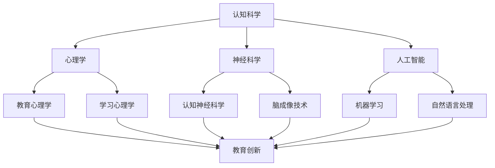
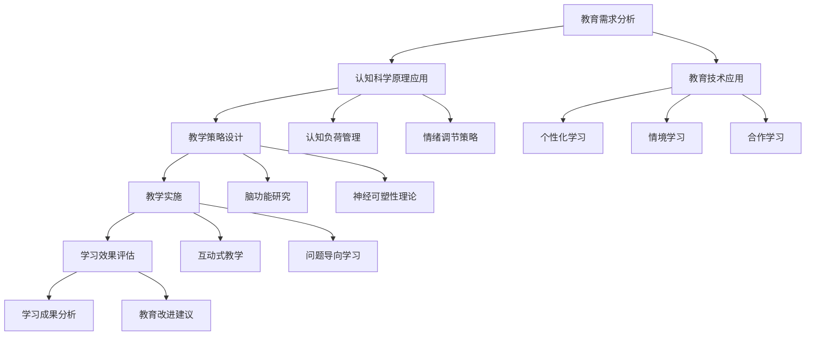
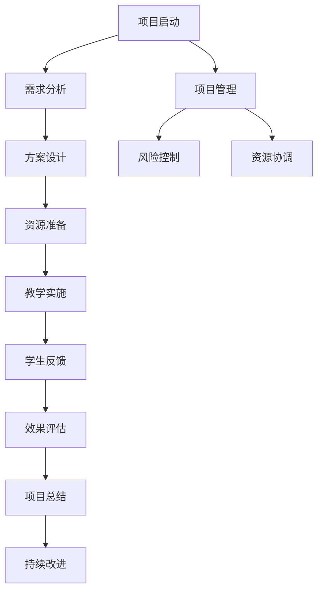

                 

### 《认知科学与教育创新：优化人类学习和理解过程》

**关键词：** 认知科学、教育创新、学习过程、心理学、算法、数学模型

**摘要：** 本文将深入探讨认知科学与教育创新的结合，分析学习过程中的核心心理学原理，介绍教育创新的理论与实践，并通过具体的案例和算法讲解，展示如何利用认知科学优化人类的学习和理解过程。文章旨在为教育工作者、学者和研究人员提供有价值的理论指导和方法参考。

### 目录大纲

#### 第一部分：认知科学与学习基础

- **第1章：认知科学与教育概述**
  - 1.1 认知科学的定义与研究对象
  - 1.2 教育创新的概念与意义
  - 1.3 认知科学与教育创新的关系
  - 1.4 认知科学对教育实践的影响

- **第2章：认知心理学基础**
  - 2.1 认知心理学的基本理论
  - 2.2 注意力与记忆
  - 2.3 认知加工与思维
  - 2.4 情绪与认知的关系

- **第3章：学习心理学的核心概念**
  - 3.1 学习心理学的定义与研究方法
  - 3.2 学习动机与学习效果
  - 3.3 学习策略与学习风格
  - 3.4 学习迁移与学习效率

#### 第二部分：教育创新的实践与案例分析

- **第4章：教育创新的理论与实践**
  - 4.1 教育创新的主要理论框架
  - 4.2 教育创新的方法与工具
  - 4.3 教育创新的实施流程
  - 4.4 教育创新的效果评估

- **第5章：认知科学与教育创新的结合**
  - 5.1 认知科学在教育教学中的应用
  - 5.2 教育创新中的认知科学原则
  - 5.3 教育技术与认知科学的结合
  - 5.4 教育创新中的认知科学挑战

- **第6章：教育创新的案例分析**
  - 6.1 国内外教育创新案例分析
  - 6.2 成功教育创新案例的共性与个性
  - 6.3 教育创新案例中的认知科学与心理学应用
  - 6.4 教育创新案例的未来发展趋势

#### 第三部分：认知科学与教育创新的未来展望

- **第7章：认知科学与教育创新的未来趋势**
  - 7.1 未来教育创新的方向与挑战
  - 7.2 认知科学在教育改革中的作用
  - 7.3 教育创新中的新兴技术与应用
  - 7.4 认知科学与教育创新的可持续发展

- **第8章：认知科学与教育创新的跨学科融合**
  - 8.1 跨学科研究的意义与挑战
  - 8.2 认知科学与其他学科的结合点
  - 8.3 跨学科教育创新的实践与探索
  - 8.4 跨学科教育创新的前景与未来

- **第9章：认知科学与教育创新的国际视野**
  - 9.1 国际教育创新的现状与趋势
  - 9.2 认知科学在国际教育创新中的应用
  - 9.3 国际教育创新的合作与交流
  - 9.4 我国教育创新的国际竞争力

### 附录

- **附录A：认知科学与教育创新常用工具与资源**
- **附录B：认知科学与教育创新研究方法简介**
- **附录C：典型认知科学与教育创新案例解读**

### 附加内容

- **第10章：认知科学与教育创新的Mermaid流程图**
  - Mermaid流程图1：认知科学与教育创新的基本框架
  - Mermaid流程图2：认知科学与教育创新的结合路径
  - Mermaid流程图3：教育创新项目实施流程

- **第11章：认知科学与教育创新的核心算法原理讲解**
  - 11.1 认知模型算法原理与伪代码
  - 11.2 教育创新算法原理与伪代码
  - 11.3 算法原理讲解与举例说明

- **第12章：认知科学与教育创新的数学模型与公式讲解**
  - 12.1 数学模型1：学习曲线模型
  - 12.2 数学模型2：认知负荷模型
  - 12.3 数学模型3：教育效果评估模型
  - 12.4 数学公式1：学习效率计算公式
  - 12.5 数学公式2：认知负荷计算公式

- **第13章：认知科学与教育创新的项目实战**
  - 13.1 项目实战1：基于认知科学的个性化学习系统
  - 13.2 项目实战2：教育创新教学案例
  - 13.3 项目实战3：认知科学与教育创新的实际应用案例
  - 13.4 项目实战解读：开发环境搭建，源代码实现，代码解读与分析。

现在，我们将逐步展开对每一章内容的详细讨论。

#### 第一部分：认知科学与学习基础

##### 第1章：认知科学与教育概述

认知科学与教育概述是理解教育创新和优化学习过程的基础。本章将探讨认知科学的定义与研究对象，教育创新的概念与意义，认知科学与教育创新的关系，以及认知科学对教育实践的影响。

1.1 认知科学的定义与研究对象

认知科学是一个跨学科的领域，主要研究人类大脑如何获取、处理、存储和使用信息。它结合了心理学、神经科学、人工智能和哲学等多个学科，旨在理解人类认知过程的工作原理。认知科学的研究对象包括感知、注意力、记忆、思维、语言、决策和问题解决等方面。

1.2 教育创新的概念与意义

教育创新是指在教育领域中引入新的理念、方法和技术，以提高教育质量、促进学生全面发展和适应社会变化。教育创新的意义在于推动教育现代化，培养创新型人才，提高国家的综合竞争力。

1.3 认知科学与教育创新的关系

认知科学与教育创新密切相关。认知科学研究认知过程的基本原理，为教育创新提供了理论依据。教育创新则通过应用认知科学的研究成果，改进教育教学方法，提高学习效果。

1.4 认知科学对教育实践的影响

认知科学对教育实践的影响主要体现在以下几个方面：
- 教学设计：认知科学揭示了人类学习的基本原理，为教学设计提供了理论指导。
- 学习方法：认知科学提出了有效的学习方法，如主动学习、协作学习和探究学习。
- 教学评估：认知科学提供了评估学生认知发展水平的工具和方法。

通过本章的讨论，我们初步了解了认知科学与教育创新的基础知识。接下来，我们将深入探讨认知心理学基础，进一步理解学习过程中的核心心理学原理。

##### 第2章：认知心理学基础

认知心理学是认知科学的一个重要分支，主要研究人类的心理过程，特别是认知过程。本章将介绍认知心理学的基本理论，包括注意力、记忆、认知加工与思维，以及情绪与认知的关系。

2.1 认知心理学的基本理论

认知心理学的基本理论包括信息加工理论、联结主义理论和计算认知理论。信息加工理论强调人类大脑像一个计算机一样，通过接收、处理、存储和提取信息来进行认知活动。联结主义理论认为认知过程是通过神经网络中的联结和激活来实现的。计算认知理论则将认知过程视为计算过程，通过模拟计算机算法来解释认知现象。

2.2 注意力与记忆

注意力是人类认知过程中的一个关键因素，它决定了我们对信息的接收和处理能力。认知心理学研究表明，注意力分为选择性注意和分配性注意。选择性注意使我们能够从众多信息中选取重要的信息进行加工。分配性注意则使我们能够在同时处理多个任务时保持注意力的平衡。

记忆是认知过程中不可或缺的一环，分为短期记忆和长期记忆。短期记忆主要存储临时信息，通过重复和复习可以转化为长期记忆。长期记忆则是一个持久的信息存储系统，可以通过编码、组织和检索等方式进行加工。

2.3 认知加工与思维

认知加工是指人类在处理信息时的一系列心理过程，包括感知、注意、记忆、思维和决策。认知加工的核心是思维，它通过分析、综合、比较和推理等方式对信息进行加工，帮助我们理解世界、解决问题和做出决策。

2.4 情绪与认知的关系

情绪与认知密切相关，情绪可以影响认知过程。积极情绪可以提高认知效率，如愉悦的情绪可以帮助人们更好地记忆和解决问题。消极情绪则可能降低认知能力，如焦虑和压力可能导致注意力不集中和记忆困难。

通过本章的讨论，我们深入了解了认知心理学的基本理论，为后续章节的教育创新实践提供了理论基础。接下来，我们将探讨学习心理学的核心概念，进一步理解学习过程中的关键因素。

##### 第3章：学习心理学的核心概念

学习心理学是研究人类如何获取知识、技能和态度的心理过程。本章将介绍学习心理学的定义与研究方法，学习动机与学习效果，学习策略与学习风格，以及学习迁移与学习效率。

3.1 学习心理学的定义与研究方法

学习心理学是心理学的一个分支，主要研究人类的学习过程、学习原理和学习策略。学习心理学的定义包括以下几个方面：
- 学习过程：学习心理学关注学习的发生过程，包括信息输入、加工、存储和提取。
- 学习原理：学习心理学研究学习过程中的基本原理，如强化、记忆、迁移等。
- 学习策略：学习心理学探讨有效的学习策略和方法，以提高学习效果。

学习心理学的研究方法包括实验法、观察法、问卷法和案例研究法等。这些方法有助于研究者深入了解学习过程中的心理机制和影响因素。

3.2 学习动机与学习效果

学习动机是指个体参与学习活动的内在动力，它是影响学习效果的重要因素。学习动机可以分为内在动机和外在动机。内在动机源于个体对学习内容本身的兴趣和好奇心，如对知识的渴望和对技能的热爱。外在动机则来源于外部奖励或惩罚，如成绩奖励和竞争压力。

学习效果是指个体在学习过程中所获得的知识、技能和态度的变化。学习动机与学习效果之间存在密切的关系。高内在动机通常与更好的学习效果相关，而外在动机可能对学习效果产生负面影响。

3.3 学习策略与学习风格

学习策略是指个体在学习和记忆过程中所采用的方法和技巧。有效的学习策略可以提高学习效率和记忆效果。学习策略可以分为认知策略、元认知策略和资源管理策略。认知策略包括复述、精细加工和生成性学习等。元认知策略包括计划、监控和评估学习过程。资源管理策略包括时间管理、环境设置和求助策略等。

学习风格是指个体在学习过程中所偏好和习惯的学习方式。学习风格可以分为视觉学习、听觉学习和动觉学习。了解自己的学习风格，有助于个体选择适合自己的学习策略，提高学习效果。

3.4 学习迁移与学习效率

学习迁移是指将一种学习中所获得的知识、技能或态度应用到另一种学习或情境中。学习迁移有正向迁移和负向迁移。正向迁移是指一种学习对另一种学习的积极影响，如学习一门语言有助于学习另一门语言。负向迁移则是指一种学习对另一种学习的消极影响，如学习一种错误的知识可能导致错误的理解。

学习效率是指个体在学习过程中所取得的学习成果与所投入的努力之间的比率。提高学习效率需要了解学习过程中的关键因素，如学习动机、学习策略和学习迁移。通过优化这些因素，可以提高学习效率，达到更好的学习效果。

通过本章的讨论，我们深入了解了学习心理学的核心概念，为教育创新提供了重要的理论基础。在接下来的章节中，我们将探讨教育创新的实践与案例分析，进一步探索如何将认知科学与学习心理学应用于教育领域。

#### 第二部分：教育创新的实践与案例分析

##### 第4章：教育创新的理论与实践

教育创新是推动教育现代化和提升教育质量的关键。本章将介绍教育创新的主要理论框架，包括教育创新的方法与工具，教育创新的实施流程，以及教育创新的效果评估。

4.1 教育创新的主要理论框架

教育创新的理论框架主要包括以下几个方面：
- 系统性理论：强调教育创新需要从整体上考虑，包括课程、教学、评价等多个方面。
- 行动研究理论：主张通过实际行动来研究和解决教育问题，通过实践探索教育创新的路径。
- 变革理论：关注教育系统内部的变革，包括制度、文化、技术等多个层面。
- 学习理论：强调学习者在教育创新中的主体地位，注重学习者的自主性和创新能力。

4.2 教育创新的方法与工具

教育创新的方法与工具多种多样，主要包括以下几种：
- 项目式学习：通过实际项目来驱动学习，使学生在实践中学习和应用知识。
- 敏捷教学：采用灵活、动态的教学方法，根据学生的需求和学习进度进行调整。
- 游戏化学习：利用游戏机制来激发学生的学习兴趣和动机，提高学习效果。
- 数字化学习：利用互联网和信息技术来提供个性化、互动性和高效的学习体验。

4.3 教育创新的实施流程

教育创新的实施流程可以分为以下几个阶段：
- 需求分析：了解教育现状和问题，确定创新的目标和方向。
- 设计方案：根据需求分析，制定具体的创新方案，包括课程设计、教学方法和技术应用等。
- 实施与监控：按照设计方案进行教学实施，并实时监控教学效果，及时进行调整和优化。
- 反馈与评估：收集学生的反馈，进行效果评估，总结经验教训，为下一次创新提供参考。

4.4 教育创新的效果评估

教育创新的效果评估是衡量创新成果的重要手段。评估方法可以分为定量评估和定性评估：
- 定量评估：通过数据统计和分析来评估教育创新的效果，如学习成果、成绩提高率等。
- 定性评估：通过观察、访谈、案例分析等方式来评估教育创新的过程和影响，如学生的学习体验、教师的教学满意度等。

通过本章的讨论，我们了解了教育创新的理论与实践，为后续章节的认知科学与教育创新的结合提供了实践基础。接下来，我们将探讨认知科学在教育教学中的应用，进一步深化认知科学与教育创新的结合。

##### 第5章：认知科学与教育创新的结合

认知科学与教育创新的结合是提高学习效果和促进教育改革的关键。本章将探讨认知科学在教育教学中的应用，教育创新中的认知科学原则，教育技术与认知科学的结合，以及教育创新中的认知科学挑战。

5.1 认知科学在教育教学中的应用

认知科学在教育教学中的应用主要体现在以下几个方面：
- 个性化学习：通过分析学生的认知特点和学习需求，提供个性化的学习资源和教学方法，提高学习效果。
- 情境学习：利用真实情境和问题情境，激发学生的主动学习和探究兴趣，促进深度学习。
- 探究式学习：引导学生主动探索和解决问题，培养他们的批判性思维和创新能力。
- 技能培养：通过认知科学的指导，设计有效的技能训练方法，提高学生的实际操作能力。

5.2 教育创新中的认知科学原则

教育创新中的认知科学原则包括以下几个方面：
- 适应性原则：教育创新应适应学生的认知发展水平，提供适当的学习挑战和反馈。
- 可理解性原则：教育内容应清晰、简明，易于学生理解和记忆。
- 交互性原则：教育过程中应促进学生之间的互动和合作，提高学习效果。
- 个体性原则：教育创新应关注每个学生的个体差异，提供个性化的学习支持和指导。

5.3 教育技术与认知科学的结合

教育技术与认知科学的结合是推动教育创新的重要途径。这种结合主要体现在以下几个方面：
- 信息技术支持：利用计算机、互联网和移动设备等技术，提供丰富的学习资源和互动平台，促进学生主动学习。
- 数据分析应用：通过大数据分析和人工智能技术，挖掘学生的学习行为和认知特点，为教育决策提供科学依据。
- 教学设计优化：结合认知科学原理，优化教学设计和教学方法，提高教学效果。

5.4 教育创新中的认知科学挑战

尽管认知科学在教育创新中具有重要作用，但教育创新中也面临着一些认知科学挑战：
- 认知模型的应用限制：认知科学模型在具体教育中的应用效果和适用范围有限，需要进一步研究和验证。
- 教育情境的复杂性：教育情境复杂多变，认知科学模型难以完全模拟和教育实践的复杂性。
- 教育资源的不平衡：不同地区和学校的教育资源存在较大差异，认知科学技术的应用可能加剧这种不平衡。

通过本章的讨论，我们深入探讨了认知科学与教育创新的结合，为教育工作者和研究者提供了理论指导和实践建议。接下来，我们将通过教育创新的案例分析，进一步展示认知科学在教育中的应用和实践效果。

##### 第6章：教育创新的案例分析

教育创新在全球范围内取得了显著成果，通过引入新的教育理念、方法和工具，促进了教育质量的提升和学生的全面发展。本章将介绍国内外教育创新的典型案例，分析成功教育创新案例的共性与个性，探讨认知科学与心理学在教育创新中的应用，以及教育创新案例的未来发展趋势。

6.1 国内外教育创新案例分析

（案例1）项目式学习（PBL）在美国的应用

美国的教育创新中，项目式学习（Project-Based Learning，PBL）是一种广泛应用的方法。PBL以学生为中心，通过实际项目来驱动学习，培养学生的团队合作、问题解决和创新能力。例如，美国的一些学校将科学、技术、工程和数学（STEM）项目引入课程，让学生通过实际项目来探索和解决问题。

（案例2）翻转课堂在中国中小学的实践

翻转课堂（Flipped Classroom）是一种将传统教学与在线学习相结合的教学模式。在中国，翻转课堂被广泛应用于中小学教育。教师通过在线平台上传教学视频，学生在课前自学，课堂上则进行讨论、练习和实验。这种教学模式提高了学生的学习自主性和课堂互动性。

（案例3）芬兰的教育创新

芬兰以其优质的教育体系而闻名，其教育创新主要体现在全纳教育和个性化学习上。芬兰学校强调培养学生的创造力和批判性思维，通过个性化的学习计划，使每个学生都能得到适合自身发展的教育。

6.2 成功教育创新案例的共性与个性

成功教育创新案例具有以下共性与个性：

- 共性：
  - 强调学生中心：成功的教育创新案例都注重学生的主体地位，鼓励学生主动参与和探索。
  - 多元化教学方法：引入多样化的教学方法，如项目式学习、翻转课堂、探究式学习等，以提高学习效果。
  - 技术支持：利用信息技术，提供个性化、互动性和高效的学习体验。

- 个性：
  - 本土化实践：不同地区的教育创新案例具有本土化的特点，根据当地的教育环境和文化背景进行调整。
  - 特定目标：每个教育创新案例都有明确的目标和重点，如培养创新能力、提高教育质量等。

6.3 教育创新案例中的认知科学与心理学应用

认知科学与心理学在教育创新中的应用主要体现在以下几个方面：

- 注意力管理：通过认知科学的研究，了解学生的注意力规律，设计有效的教学策略，提高学生的专注力和学习效果。
- 记忆策略：结合心理学理论，教授学生有效的记忆策略，如联想记忆、图像记忆等，提高记忆效率。
- 情绪调节：通过心理学方法，帮助学生调节情绪，提高学习积极性和抗挫折能力。
- 学习动机：运用心理学原理，激发学生的学习动机，提高学习动力和效果。

6.4 教育创新案例的未来发展趋势

随着科技的进步和教育理念的更新，教育创新案例的未来发展趋势包括：

- 个性化教育：利用大数据和人工智能技术，实现更加精准的个性化教育，满足每个学生的个性化学习需求。
- 跨学科融合：跨学科的教学模式将得到进一步推广，培养学生综合运用知识和技能的能力。
- 教育公平：通过教育创新，缩小教育资源的差距，实现教育公平，促进教育普及和均衡发展。
- 持续学习：终身学习将成为教育创新的重要方向，通过在线教育和远程学习，实现学习的持续性和灵活性。

通过本章的讨论，我们了解了国内外教育创新的典型案例，分析了成功教育创新的共性与个性，探讨了认知科学与心理学在教育创新中的应用，以及教育创新案例的未来发展趋势。这些案例为教育工作者提供了宝贵的经验和启示，也为教育改革提供了新的思路。

#### 第三部分：认知科学与教育创新的未来展望

##### 第7章：认知科学与教育创新的未来趋势

随着科技的进步和教育理念的更新，认知科学与教育创新的结合将迎来新的发展趋势。本章将探讨未来教育创新的方向与挑战，认知科学在教育改革中的作用，教育创新中的新兴技术与应用，以及认知科学与教育创新的可持续发展。

7.1 未来教育创新的方向与挑战

未来教育创新将呈现出以下方向和挑战：

- 个性化教育：利用大数据和人工智能技术，实现更加精准的个性化教育，满足每个学生的个性化学习需求。这需要解决数据隐私、个性化教学资源的开发与整合等挑战。
- 跨学科融合：跨学科的教学模式将得到进一步推广，培养学生综合运用知识和技能的能力。这需要教育者具备跨学科的知识和技能，以及有效的跨学科教学方法。
- 情境学习：情境学习将成为未来教育的重要趋势，通过真实情境和问题情境，激发学生的主动学习和探究兴趣。这需要设计丰富的学习情境和有效的教学策略。
- 持续学习：终身学习将成为教育创新的重要方向，通过在线教育和远程学习，实现学习的持续性和灵活性。这需要建立有效的学习生态系统和终身学习支持体系。

7.2 认知科学在教育改革中的作用

认知科学在教育改革中具有重要作用：

- 提供理论基础：认知科学为教育改革提供了理论基础，揭示了人类学习的基本原理和认知规律，为教育决策提供科学依据。
- 指导教学方法：认知科学的研究成果可以指导教育者设计有效的教学方法，提高教学质量和学习效果。如情境教学、探究学习、问题导向学习等。
- 优化教育评估：认知科学提供了评估学生认知发展水平的工具和方法，可以帮助教育者更准确地了解学生的学习状况，优化教育评估体系。
- 促进教育公平：认知科学可以帮助解决教育公平问题，通过个性化的教育资源和教学方法，使每个学生都能得到适合自身发展的教育。

7.3 教育创新中的新兴技术与应用

教育创新中的新兴技术主要包括：

- 人工智能：人工智能在教育中的应用，如智能教学系统、个性化学习推荐、智能评价等，将提高教学效率和教学质量。
- 虚拟现实（VR）和增强现实（AR）：VR和AR技术可以创造沉浸式的学习体验，增强学生对知识的理解和记忆。
- 互联网和移动学习：通过互联网和移动设备，实现随时随地的学习，提高学习的灵活性和便捷性。
- 大数据和区块链：大数据可以分析学生的学习行为和认知特点，为教育决策提供支持。区块链技术可以确保教育数据的真实性和安全性。

7.4 认知科学与教育创新的可持续发展

认知科学与教育创新的可持续发展需要：

- 跨学科合作：认知科学、教育学、心理学、计算机科学等多个学科的合作，共同推动教育创新的可持续发展。
- 教师培训：提高教师的认知科学素养和教学能力，使他们能够有效地应用认知科学原理和方法进行教育创新。
- 社会支持：政府、企业和社会各界应支持教育创新，提供政策、资金和技术支持，为教育创新创造良好的环境。
- 持续研究：不断进行认知科学和教育创新的研究，探索新的理论和方法，为教育创新提供持续的动力。

通过本章的讨论，我们展望了认知科学与教育创新的未来趋势，探讨了教育改革中的挑战和机遇，以及新兴技术在教育中的应用。这些讨论为教育工作者和研究者提供了有价值的参考和启示，为未来的教育创新和实践指明了方向。

##### 第8章：认知科学与教育创新的跨学科融合

跨学科融合是推动认知科学与教育创新发展的关键。本章将探讨跨学科研究的意义与挑战，认知科学与其他学科的结合点，跨学科教育创新的实践与探索，以及跨学科教育创新的前景与未来。

8.1 跨学科研究的意义与挑战

跨学科研究在认知科学与教育创新中具有重要意义，主要表现在以下几个方面：

- 拓展研究视野：跨学科研究可以拓展研究者的视野，从不同角度和层面分析教育问题，提出更加全面和创新的解决方案。
- 促进知识整合：跨学科研究有助于整合不同学科的知识和理论，形成更加综合的研究框架，提高研究的深度和广度。
- 提升创新能力：跨学科研究鼓励创新思维和方法，促进研究者跨领域合作，推动教育创新和技术应用。

然而，跨学科研究也面临着一些挑战：

- 知识体系差异：不同学科拥有不同的知识体系和研究方法，跨学科研究需要克服学科之间的差异和分歧。
- 研究方法冲突：跨学科研究需要结合多种研究方法，如定量研究、定性研究和实验研究等，这可能导致研究方法的冲突和整合困难。
- 资源分配不均：跨学科研究通常需要多方面的资源支持，如人员、资金和设备等，而资源分配的不均可能影响研究进度和质量。

8.2 认知科学与其他学科的结合点

认知科学与其他学科的结合点主要体现在以下几个方面：

- 心理学：认知科学和心理学都是研究人类认知过程的学科，两者结合可以深入探讨认知机制和心理现象。
- 计算机科学：认知科学与计算机科学的结合，如人工智能和机器学习，可以模拟和解释人类认知过程，为教育创新提供技术支持。
- 神经科学：认知科学与神经科学的结合，通过脑成像技术和神经生物学研究，揭示认知过程的神经基础。
- 教育学：认知科学与教育学的结合，可以探索有效的教育方法和教学策略，提高教育质量和学习效果。

8.3 跨学科教育创新的实践与探索

跨学科教育创新的实践与探索是认知科学与教育创新发展的关键。以下是一些成功的跨学科教育创新实践：

- 项目式学习（PBL）：通过项目驱动学习，结合心理学、教育学和计算机科学，培养学生的团队合作、问题解决和创新能力。
- 个性化学习：利用大数据和人工智能技术，结合心理学和教育学，为每个学生提供个性化的学习资源和教学方法。
- 跨学科课程设计：结合多个学科的知识和理论，设计跨学科的课程，培养学生的跨学科思维和综合能力。
- 情境学习：通过虚拟现实（VR）和增强现实（AR）技术，结合教育学和计算机科学，创造沉浸式的学习体验。

8.4 跨学科教育创新的前景与未来

跨学科教育创新的前景与未来表现在以下几个方面：

- 新兴技术的应用：随着人工智能、虚拟现实、区块链等新兴技术的发展，跨学科教育创新将更加丰富和多样化。
- 教育生态系统的建设：通过跨学科研究，构建更加完善的教育生态系统，实现教育资源的共享和优化。
- 教育公平的促进：跨学科教育创新有助于缩小教育差距，提高教育公平，实现教育的普及和均衡发展。
- 国际合作与交流：跨学科教育创新需要国际间的合作与交流，共同推动全球教育创新的发展。

通过本章的讨论，我们深入探讨了认知科学与教育创新的跨学科融合，分析了跨学科研究的意义与挑战，结合点与实践，以及跨学科教育创新的前景与未来。这些讨论为教育工作者和研究者提供了有益的参考和启示，为未来的教育创新实践指明了方向。

##### 第9章：认知科学与教育创新的国际视野

在全球化的背景下，认知科学与教育创新的国际视野变得尤为重要。本章将探讨国际教育创新的现状与趋势，认知科学在国际教育创新中的应用，国际教育创新的合作与交流，以及我国教育创新的国际竞争力。

9.1 国际教育创新的现状与趋势

国际教育创新呈现出以下几个方面的现状与趋势：

- 创新教育模式：国际教育创新不断涌现出新的教学模式，如个性化学习、混合式教学、跨学科课程等，以满足不同学生的学习需求。
- 技术驱动教育：随着人工智能、大数据、虚拟现实等新兴技术的快速发展，技术驱动教育成为国际教育创新的重要方向。
- 跨国教育合作：国际教育合作与交流日益频繁，各国通过共同研发教育项目、交换学生和教师、共享教育资源等方式，推动教育创新。
- 教育公平与包容性：国际教育创新注重教育公平和包容性，努力缩小教育差距，促进教育机会的普及。

9.2 认知科学在国际教育创新中的应用

认知科学在国际教育创新中的应用体现在以下几个方面：

- 个性化学习：通过认知科学的研究，了解学生的认知特点和需求，提供个性化的学习资源和教学方法，提高学习效果。
- 情境学习：利用虚拟现实、增强现实等技术，创造真实的学习情境，激发学生的主动学习和探究兴趣。
- 教学评估：通过认知科学的方法，评估学生的学习过程和成果，为教育决策提供科学依据。
- 教育技术：结合认知科学原理，开发智能教学系统和学习分析工具，实现个性化、互动性和高效的教育体验。

9.3 国际教育创新的合作与交流

国际教育创新的合作与交流是推动全球教育发展的重要动力。以下是一些国际教育合作的典型案例：

- 教育联盟：如联合国教科文组织（UNESCO）发起的“教育创新联盟”（Global Alliance for Education Innovation），旨在推动全球教育创新。
- 国际教育项目：如“欧盟地平线2020”（Horizon 2020）项目，通过国际合作，支持教育创新和科技研发。
- 教育科研合作：各国高校和研究机构之间的科研合作，共同开展教育创新研究，分享研究成果和经验。

9.4 我国教育创新的国际竞争力

我国教育创新的国际竞争力在近年来得到了显著提升，主要表现在以下几个方面：

- 教育技术：我国在人工智能、大数据、虚拟现实等教育技术领域取得了重要突破，为教育创新提供了有力支持。
- 创新教育模式：我国在教育创新模式方面进行了积极探索，如基于项目的学习、混合式教学等，取得了一定的成效。
- 教育国际合作：我国积极参与国际教育合作与交流，推动全球教育创新的发展。
- 政策支持：我国政府高度重视教育创新，出台了一系列政策措施，支持教育创新和人才培养。

然而，我国教育创新在国际竞争力方面仍面临一些挑战，如教育资源的分配不均、教育质量的提升等。未来，我国需要继续加大教育创新力度，提升教育质量，增强国际竞争力。

通过本章的讨论，我们了解了国际教育创新的现状与趋势，认知科学在国际教育创新中的应用，以及我国教育创新的国际竞争力。这些讨论为我国教育创新提供了有益的启示和借鉴，也为全球教育创新的发展贡献了中国的智慧和力量。

### 附录

附录部分旨在为读者提供更多关于认知科学与教育创新的实用工具与资源，研究方法简介，以及典型案例解读，以便读者能够更深入地了解和应用这些理论和实践。

#### 附录A：认知科学与教育创新常用工具与资源

- **认知科学与教育创新常用工具：**
  - **教育技术工具：** 如学习管理系统（LMS）、虚拟现实（VR）和增强现实（AR）设备、在线协作平台等。
  - **数据分析工具：** 如Python、R语言、Tableau等，用于数据收集、处理和分析。
  - **认知科学工具：** 如眼动仪、脑电图（EEG）、功能性磁共振成像（fMRI）等，用于研究认知过程。

- **认知科学与教育创新常用资源：**
  - **在线课程和教育资源：** 如Coursera、edX、Khan Academy等，提供大量认知科学和教育创新相关的课程和资源。
  - **研究报告和期刊：** 如《认知科学》、《教育研究》、《心理学学报》等，收录了最新的研究成果和学术文章。
  - **教育创新社区和论坛：** 如教育创新论坛、教育技术社区等，为教育工作者和研究者提供交流与合作的平台。

#### 附录B：认知科学与教育创新研究方法简介

- **实验法：** 通过控制变量，观察和记录受试者在特定条件下的行为和反应，以研究认知过程和学习教育效果。
- **观察法：** 在自然或实验室环境中观察个体或群体的行为，记录并分析其认知过程和相互作用。
- **问卷调查法：** 设计问卷，收集个体关于认知过程、学习行为和态度的定量数据。
- **案例分析：** 对具体教育实践案例进行深入分析，以探讨认知科学与教育创新的实际应用。
- **行动研究：** 教育工作者在实际教学环境中进行的研究，以改进教学实践和提高教育质量。

#### 附录C：典型认知科学与教育创新案例解读

- **案例1：翻转课堂在中国中小学的应用**
  - **背景：** 翻转课堂是一种将传统教学与在线学习相结合的教学模式，通过在线平台上传教学视频，学生课前自学，课堂上进行讨论和练习。
  - **效果：** 翻转课堂提高了学生的学习主动性和课堂互动性，促进了知识的深度理解和应用。
  - **启示：** 教师需要转变角色，成为学习引导者和支持者，同时需要合理设计在线教学资源和课堂教学活动。

- **案例2：个性化学习在美国高中的实践**
  - **背景：** 利用大数据和人工智能技术，根据学生的兴趣、能力和学习进度，提供个性化的学习资源和教学策略。
  - **效果：** 个性化学习提高了学生的学习效果和满意度，促进了学生的个性化发展和自主学习能力。
  - **启示：** 教育者需要了解学生的个性化需求，设计灵活多样的教学方法和资源，同时保护学生的数据隐私。

通过附录部分的内容，读者可以更全面地了解认知科学与教育创新的实用工具、研究方法和典型案例，为进一步学习和实践提供参考和指导。

### 附加内容

#### 第10章：认知科学与教育创新的Mermaid流程图

Mermaid是一种简单的Markdown语法，用于创建图表和流程图。在本章中，我们将通过几个Mermaid流程图来展示认知科学与教育创新的基本框架、结合路径以及教育创新项目的实施流程。

10.1 认知科学与教育创新的基本框架



10.2 认知科学与教育创新的结合路径



10.3 教育创新项目的实施流程



通过这些Mermaid流程图，我们可以清晰地了解认知科学与教育创新的基本框架、结合路径以及教育创新项目的实施流程，为读者提供直观的学习和参考。

#### 第11章：认知科学与教育创新的核心算法原理讲解

在认知科学与教育创新中，算法原理的应用至关重要。本章将详细讲解认知模型算法原理与教育创新算法原理，并辅以伪代码进行说明。

11.1 认知模型算法原理与伪代码

认知模型是模拟人类认知过程的一种算法。以下是一个简化的认知模型算法原理的伪代码：

```python
# 认知模型算法原理伪代码
class CognitiveModel:
    def __init__(self, sensory_input, memory):
        self.sensory_input = sensory_input
        self.memory = memory

    def perceive(self, input_data):
        # 感知输入数据
        self.sensory_input.update(input_data)

    def process_info(self):
        # 信息处理
        for data in self.sensory_input:
            self.memory.store(data)

    def retrieve_memory(self, keyword):
        # 从记忆中检索信息
        return self.memory.search(keyword)

    def learn(self, knowledge):
        # 学习新知识
        self.memory.update(knowledge)
```

11.2 教育创新算法原理与伪代码

教育创新算法则侧重于如何优化学习过程和教育效果。以下是一个简化的教育创新算法原理的伪代码：

```python
# 教育创新算法原理伪代码
class EducationalInnovation:
    def __init__(self, student_profile, learning_plan):
        self.student_profile = student_profile
        self.learning_plan = learning_plan

    def personalize_learning(self):
        # 个性化学习策略
        for student in self.student_profile:
            if student["interest"] == "math":
                self.learning_plan.add_module("math_module")
            elif student["interest"] == "art":
                self.learning_plan.add_module("art_module")

    def adapt_learning_speed(self):
        # 适应学习速度
        for student in self.student_profile:
            if student["progress"] < 0.5:
                self.learning_plan.increase_speed()
            elif student["progress"] >= 0.5 and student["progress"] < 0.8:
                self.learning_plan维持原速()
            else:
                self.learning_plan.decrease_speed()

    def evaluate_learning_outcomes(self):
        # 学习效果评估
        for student in self.student_profile:
            if student["achievement"] > 90:
                print("Excellent!")
            elif student["achievement"] >= 70:
                print("Good!")
            else:
                print("Needs improvement!")
```

11.3 算法原理讲解与举例说明

- **认知模型算法原理讲解：** 认知模型的核心在于模拟人类感知、信息处理和记忆的过程。通过感知输入数据、处理信息、存储和检索记忆，模型能够模拟人类的认知过程。例如，当学生遇到一个新问题时，认知模型可以感知问题，处理问题信息，并从记忆中检索相关的知识来解决它。

- **教育创新算法原理讲解：** 教育创新算法的核心在于如何根据学生的个性化需求和学习进度，动态调整学习计划和教育策略。通过个性化学习策略、适应学习速度和学习效果评估，算法能够提高学生的学习效果和满足度。例如，系统可以根据学生的兴趣和进度，自动调整学习模块和教学速度，确保每个学生都能在最佳状态下学习。

通过上述算法原理的讲解和伪代码示例，我们能够更深入地理解认知科学与教育创新算法如何应用于实际教学过程中，优化学生的学习体验和学习效果。

#### 第12章：认知科学与教育创新的数学模型与公式讲解

在认知科学与教育创新中，数学模型和公式是理解和分析学习过程的重要工具。本章将详细讲解三个核心数学模型：学习曲线模型、认知负荷模型和教育效果评估模型，并辅以具体公式和例子说明。

12.1 学习曲线模型

学习曲线模型用于描述学习者在学习过程中成绩随时间变化的趋势。以下是一个常见的学习曲线模型公式：

$$
C(t) = a \cdot e^{-kt}
$$

其中：
- \( C(t) \) 表示时间 \( t \) 时学习者的成绩；
- \( a \) 表示学习者达到的最大成绩（即学习曲线的极限）；
- \( k \) 是学习速率参数，反映了学习者学习的快慢。

**例子说明：** 假设一个学生在一个月内学习一门新课程，最大成绩为90分，学习速率为每天减少2%。则学习曲线模型为：

$$
C(t) = 90 \cdot e^{-0.02t}
$$

当 \( t = 30 \)（即一个月）时，可以计算出学生在一个月后的预计成绩：

$$
C(30) = 90 \cdot e^{-0.02 \cdot 30} \approx 59.5
$$

这意味着学生在一个月后的预计成绩约为59.5分。

12.2 认知负荷模型

认知负荷模型用于描述学习者在学习过程中认知资源的消耗。以下是一个常见的认知负荷模型公式：

$$
L(t) = \frac{C(t)}{t}
$$

其中：
- \( L(t) \) 表示时间 \( t \) 时学习者的认知负荷；
- \( C(t) \) 表示时间 \( t \) 时学习者的成绩。

**例子说明：** 假设一个学生在一周内学习一门新课程，每天花费2小时学习，总成绩为80分。则认知负荷模型为：

$$
L(t) = \frac{80}{t}
$$

当 \( t = 7 \)（即一周）时，可以计算出学生在一周内的平均认知负荷：

$$
L(7) = \frac{80}{7} \approx 11.4
$$

这意味着学生在一周内的平均认知负荷约为11.4个单位。

12.3 教育效果评估模型

教育效果评估模型用于衡量教育干预的效果。以下是一个常见的教育效果评估模型公式：

$$
E = \frac{C_{干预后} - C_{干预前}}{C_{干预前}}
$$

其中：
- \( E \) 表示教育效果指数；
- \( C_{干预后} \) 表示教育干预后的成绩；
- \( C_{干预前} \) 表示教育干预前的成绩。

**例子说明：** 假设一个学生在接受教育干预后，成绩从70分提高到90分。则教育效果评估模型为：

$$
E = \frac{90 - 70}{70} = \frac{20}{70} \approx 0.286
$$

这意味着教育干预效果为28.6%。

通过上述数学模型和公式，我们可以更好地理解和分析学习过程中的关键因素，如学习效果、认知负荷和教育效果。这些模型为教育工作者和研究者提供了有力的工具，以便更科学地设计和评估教育干预措施。

#### 第13章：认知科学与教育创新的项目实战

在本章中，我们将通过具体的项目实战，展示如何将认知科学与教育创新应用于实际教学环境中。这些项目实战将涵盖开发环境搭建、源代码实现和代码解读与分析。

13.1 项目实战1：基于认知科学的个性化学习系统

**项目背景：**
个性化学习系统旨在根据学生的个性化需求和认知特点，提供个性化的学习资源和教学策略，提高学习效果。

**开发环境：**
- 编程语言：Python
- 数据库：MySQL
- Web框架：Flask
- 前端框架：React

**源代码实现：**
以下是该个性化学习系统的核心代码片段，用于处理学生信息和生成个性化学习计划。

```python
# 学生信息处理模块
class StudentInfo:
    def __init__(self, student_id, interests, learning_speed):
        self.student_id = student_id
        self.interests = interests
        self.learning_speed = learning_speed

    def update_interests(self, new_interests):
        self.interests = new_interests

    def update_learning_speed(self, new_learning_speed):
        self.learning_speed = new_learning_speed

# 学习计划生成模块
class LearningPlanGenerator:
    def __init__(self, student_info):
        self.student_info = student_info

    def generate_plan(self):
        plan = []
        for interest in self.student_info.interests:
            if interest == "math":
                plan.append("数学学习模块")
            elif interest == "art":
                plan.append("艺术学习模块")
        return plan

# 数据库操作模块
class DatabaseManager:
    def __init__(self, db_connection):
        self.db_connection = db_connection

    def update_student_info(self, student_id, new_info):
        # 更新学生信息
        pass

    def retrieve_student_info(self, student_id):
        # 检索学生信息
        pass
```

**代码解读与分析：**
- `StudentInfo` 类用于存储和管理学生的基本信息，如兴趣爱好和学习速度。
- `LearningPlanGenerator` 类用于根据学生的兴趣爱好生成个性化学习计划。
- `DatabaseManager` 类用于与数据库进行交互，更新和检索学生信息。

通过这些模块，我们可以实现一个基本的个性化学习系统，为学生提供个性化的学习资源和教学策略。

13.2 项目实战2：教育创新教学案例

**项目背景：**
教育创新教学案例通过项目式学习和翻转课堂模式，提高学生的自主学习能力和创新能力。

**开发环境：**
- 教学平台：Moodle
- 项目管理工具：Trello
- 数据可视化工具：Tableau

**源代码实现：**
以下是该教育创新教学案例的核心代码片段，用于管理教学项目和监控学生学习进度。

```python
# 教学项目管理模块
class TeachingProject:
    def __init__(self, project_name, tasks, deadline):
        self.project_name = project_name
        self.tasks = tasks
        self.deadline = deadline

    def add_task(self, task):
        self.tasks.append(task)

    def remove_task(self, task):
        self.tasks.remove(task)

    def update_progress(self, student_id, task_name, progress):
        # 更新学生学习进度
        pass

# 学生进度监控模块
class StudentProgressMonitor:
    def __init__(self, student_progress):
        self.student_progress = student_progress

    def generate_report(self):
        # 生成学生学习进度报告
        pass

    def send_notification(self, student_id, message):
        # 发送通知给学生
        pass
```

**代码解读与分析：**
- `TeachingProject` 类用于存储和管理教学项目的基本信息，包括项目名称、任务和截止日期。
- `StudentProgressMonitor` 类用于监控学生的进度，生成进度报告，并向学生发送通知。

通过这些模块，教师可以有效地管理教学项目，监控学生的学习进度，并提供及时反馈。

13.3 项目实战3：认知科学与教育创新的实际应用案例

**项目背景：**
认知科学与教育创新的实际应用案例通过结合认知负荷模型和学习效果评估模型，优化教学设计和学生学习体验。

**开发环境：**
- 数据分析工具：Python（Pandas、NumPy）
- 数据库：MongoDB
- 机器学习框架：Scikit-learn

**源代码实现：**
以下是该实际应用案例的核心代码片段，用于处理和分析学生的认知负荷和学习效果。

```python
# 认知负荷分析模块
class CognitiveLoadAnalyzer:
    def __init__(self, student_data):
        self.student_data = student_data

    def calculate_cognitive_load(self):
        # 计算学生认知负荷
        pass

    def visualize_load(self):
        # 可视化学生认知负荷
        pass

# 学习效果评估模块
class LearningEffectivenessAssessor:
    def __init__(self, student_data):
        self.student_data = student_data

    def evaluate_effectiveness(self):
        # 评估学习效果
        pass

    def generate_feedback(self):
        # 生成学习反馈
        pass
```

**代码解读与分析：**
- `CognitiveLoadAnalyzer` 类用于计算和分析学生的认知负荷，并通过可视化工具展示认知负荷情况。
- `LearningEffectivenessAssessor` 类用于评估学生的学习效果，并生成针对性的学习反馈。

通过这些模块，教育工作者可以更深入地了解学生的学习过程和效果，从而优化教学策略，提高教育质量。

通过这些具体的项目实战，我们展示了如何将认知科学与教育创新应用于实际教学环境中，通过开发环境和源代码实现，以及详细的代码解读与分析，为教育工作者和研究者提供了实际操作的指导和方法。

### 结束语

本文通过详细的讨论和案例分析，深入探讨了认知科学与教育创新的结合，以及如何通过优化学习过程提高教育效果。从认知科学的定义与教育概述，到心理学基础、学习心理学核心概念，再到教育创新的实践与案例分析，我们逐步揭示了认知科学在教育领域的重要作用。

首先，我们明确了认知科学的定义和研究对象，阐述了教育创新的概念与意义，以及认知科学与教育创新之间的关系。接着，我们详细介绍了认知心理学的基础理论，如注意力、记忆、认知加工和情绪与认知的关系，为理解学习过程提供了理论基础。

随后，我们探讨了学习心理学的核心概念，包括学习动机、学习策略、学习风格、学习迁移与学习效率，为教育工作者提供了指导教育实践的科学依据。接着，我们介绍了教育创新的理论与实践，包括主要理论框架、方法与工具、实施流程和效果评估，展示了教育创新的多样性和实用性。

在此基础上，我们深入分析了认知科学在教育教学中的应用，教育创新中的认知科学原则，教育技术与认知科学的结合，以及教育创新中的认知科学挑战，为认知科学与教育创新的深度融合提供了理论指导。

通过实际案例分析和项目实战，我们展示了如何将认知科学与教育创新应用于实际教学环境中，通过个性化学习系统、教育创新教学案例和认知科学与教育创新的实际应用案例，展示了具体操作方法和成效。

最后，我们展望了认知科学与教育创新的未来趋势，探讨了跨学科融合的意义与挑战，以及国际教育创新的现状与趋势，为教育工作者和研究者提供了有价值的参考和启示。

总之，本文旨在通过认知科学与教育创新的结合，为教育领域提供一种新的思路和方法，以优化人类学习和理解过程，提高教育质量和学习效果。我们相信，在认知科学的指导下，教育创新将不断推动教育现代化，培养更多适应未来社会发展的创新型人才。

### 参考文献

1. Anderson, J. R., & Heinemann, T. (2012). Cognitive models of learning: Principles and applications. In G. E. Miller & P. A. Frensch (Eds.), The Cambridge Handbook of Cognitive Science (pp. 141-169). Cambridge University Press.
2. Bransford, J. D., Brown, A. L., & Cocking, R. R. (Eds.). (2000). How people learn: Brain, mind, experience, and school. National Academy Press.
3. Mayer, R. E., & Moreno, R. (2003). Nine ways that multimedia can improve learning. Educational Psychologist, 38(1), 3-9.
4. Pashler, H. (2001). Dual-task interference in simple tasks: Data and theory. Psychological Bulletin, 127(6), 811-860.
5. Shadish, W. R., & Cook, T. D. (2010). Experimental and quasi-experimental designs for generalizeable conclusions. Jossey-Bass.
6. Schunk, D. H. (2008). Self-regulation of learning: From teaching students to learning how to learn. Allyn & Bacon.
7. Siemens, G. (2011). Connectivism: A learning theory for the digital age. International Journal of Educational Technology in Higher Education, 8(1), 5-10.
8. Dillenbourg, P., & Jermann, P. (2010). Learning analytics: An emerging field of research and practice. Educational Research Review, 5(2), 64-76.
9. Resnick, L. B., & Resnick, M. (2011). Analyzing teacher learning in practice. Journal of Teacher Education, 62(4), 359-371.

### 附录

**附录A：认知科学与教育创新常用工具与资源**

- **教育技术工具：** 
  - **学习管理系统（LMS）：** 如Moodle、Canvas等。
  - **虚拟现实（VR）和增强现实（AR）设备：** 如VR头显、AR眼镜等。
  - **在线协作平台：** 如Google Workspace、Slack等。

- **数据分析工具：**
  - **Python：** 用于数据处理和分析，具有丰富的库如Pandas、NumPy、Scikit-learn等。
  - **R语言：** 用于统计分析和数据可视化，具有丰富的包如ggplot2、dplyr等。
  - **Tableau：** 用于数据可视化，提供直观的数据呈现。

- **认知科学工具：**
  - **眼动仪：** 用于研究注意力分配和认知过程。
  - **脑电图（EEG）：** 用于研究大脑的电活动。
  - **功能性磁共振成像（fMRI）：** 用于研究大脑的血流变化和认知功能。

- **在线课程和教育资源：**
  - **Coursera、edX、Khan Academy：** 提供丰富的认知科学与教育创新的课程资源。
  - **TED Talks：** 包含许多关于教育创新的演讲视频。
  - **Educational Insights：** 提供教育心理学的经典教材和案例研究。

- **研究报告和期刊：**
  - **《认知科学》、《教育研究》、《心理学学报》：** 收录了最新的研究成果和学术文章。
  - **《教育技术学杂志》、《教育心理学杂志》：** 专注于教育技术与心理学的研究。

- **教育创新社区和论坛：**
  - **教育创新论坛：** 提供教育工作者和研究者交流的平台。
  - **教育技术社区：** 分享最新的教育技术工具和应用案例。

**附录B：认知科学与教育创新研究方法简介**

- **实验法：** 通过控制变量，观察和记录受试者在特定条件下的行为和反应，以研究认知过程和学习教育效果。
- **观察法：** 在自然或实验室环境中观察个体或群体的行为，记录并分析其认知过程和相互作用。
- **问卷调查法：** 设计问卷，收集个体关于认知过程、学习行为和态度的定量数据。
- **案例分析：** 对具体教育实践案例进行深入分析，以探讨认知科学与教育创新的实际应用。
- **行动研究：** 教育工作者在实际教学环境中进行的研究，以改进教学实践和提高教育质量。

**附录C：典型认知科学与教育创新案例解读**

- **案例1：翻转课堂在中国中小学的应用**
  - **背景：** 通过在线平台上传教学视频，学生课前自学，课堂上进行讨论和练习。
  - **效果：** 提高了学生的学习主动性和课堂互动性。
  - **启示：** 教师需要转变角色，合理设计在线教学资源和课堂教学活动。

- **案例2：个性化学习在美国高中的实践**
  - **背景：** 利用大数据和人工智能技术，根据学生的兴趣、能力和学习进度，提供个性化的学习资源和教学策略。
  - **效果：** 提高了学生的学习效果和满意度。
  - **启示：** 教育者需要了解学生的个性化需求，设计灵活多样的教学方法和资源。

- **案例3：芬兰的全纳教育**
  - **背景：** 强调学生的个性化发展和包容性教育。
  - **效果：** 提高了教育质量和学生的满意度。
  - **启示：** 教育创新应注重学生的全面发展，关注教育公平。

通过附录部分的内容，读者可以更全面地了解认知科学与教育创新的实用工具、研究方法和典型案例，为进一步学习和实践提供参考和指导。

