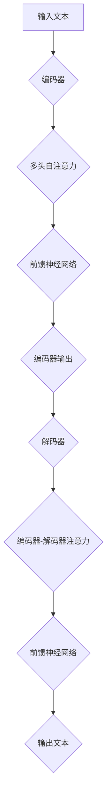

                 

# 《语言与推理：大模型的认知误解》

## 关键词

自然语言处理，大模型，推理机制，认知误解，语言理解，人工智能

### 摘要

本文旨在探讨大模型在自然语言处理领域中的推理机制及其引发的认知误解。通过对语言与推理的基本概念进行深入分析，本文揭示了语言模型和推理算法在处理复杂语言现象时的局限性。在此基础上，本文详细探讨了认知误解的来源、影响及处理方法，并通过实际项目案例展示了如何减少认知误解，提高大模型在语言推理中的应用效果。文章最终对未来大模型在语言推理领域的应用趋势进行了展望，为研究者提供了有价值的参考。

### 目录大纲

#### 第一部分：引言与基础

##### 第1章：背景与目标
1. 大模型时代的到来
2. 语言与推理的基本概念
3. 认知误解的现状与挑战
4. 书籍结构概述

##### 第2章：自然语言处理基础
1. 语言模型的基本概念
2. 词汇与语义表示
3. 语言模型的应用

##### 第3章：大模型架构与原理
1. 大模型的基本结构
2. 训练与优化算法
3. 大模型的评估与优化
4. Mermaid流程图：大模型工作原理

##### 第4章：推理机制详解
1. 基本推理方法
2. 模型推理与逻辑推理的差异
3. 认知误解的常见类型
4. 伪代码：推理算法示例

##### 第5章：认知误解的影响与处理
1. 认知误解对语言理解的影响
2. 认知误解的来源与成因
3. 处理认知误解的方法与策略
4. 例子：如何减少认知误解

##### 第6章：大模型在语言推理中的应用
1. 对话系统中的推理
2. 文本生成与摘要
3. 情感分析
4. 问答系统

##### 第7章：项目实战与开发
1. 项目准备与开发环境搭建
2. 代码实现与解读
3. 代码分析
4. 项目总结与反思

##### 第8章：未来展望与趋势
1. 大模型在语言推理领域的未来
2. 新技术与新方法
3. 认知误解的解决策略
4. 跨领域应用与融合
5. 未来发展趋势与挑战

##### 附录
1. 相关工具与资源
2. 主流自然语言处理工具
3. 大模型开发环境与框架
4. 学术论文与研究报告

### 第一部分：引言与基础

#### 第1章：背景与目标

随着人工智能技术的飞速发展，自然语言处理（NLP）领域迎来了大模型时代的到来。大模型，特别是基于深度学习的语言模型，已经在很多任务中取得了显著成果，如文本生成、情感分析、机器翻译等。然而，这些模型的推理机制和认知能力仍存在诸多局限，导致在处理复杂语言现象时出现认知误解。

本文的目标是深入探讨大模型在自然语言处理领域中的推理机制及其引发的认知误解。首先，我们将回顾语言与推理的基本概念，了解语言模型和推理算法在处理语言现象时的局限性。接着，本文将详细分析认知误解的来源、影响及处理方法。最后，通过实际项目案例，我们将展示如何减少认知误解，提高大模型在语言推理中的应用效果。

本章结构如下：

1. 大模型时代的到来
2. 语言与推理的基本概念
3. 认知误解的现状与挑战
4. 书籍结构概述

#### 1.1 大模型时代的到来

自然语言处理（NLP）是人工智能领域的一个重要分支，旨在使计算机能够理解和处理人类语言。随着计算能力的提升和深度学习技术的突破，NLP领域迎来了大模型时代的到来。大模型，尤其是基于变换器（Transformer）架构的语言模型，如BERT、GPT等，已经成为当前NLP领域的主流工具。

大模型的主要优势在于其强大的表征能力和泛化能力。通过大量数据的训练，这些模型能够捕捉到语言中的复杂结构和规律，从而在许多NLP任务中取得优异的性能。例如，BERT在多项基准测试中取得了领先的成绩，GPT则展示了在文本生成和摘要方面的卓越能力。

然而，大模型的崛起也带来了一系列挑战。首先，大模型通常需要大量计算资源和数据，导致训练成本高昂。其次，大模型在处理复杂语言现象时，仍存在认知误解的问题。认知误解是指模型在理解语言时，未能正确地捕捉到语言的含义和逻辑关系，导致生成结果不合理或与人类理解不符。

#### 1.2 语言与推理的基本概念

语言是人类交流的基本工具，而推理则是人类理解语言和解决问题的核心能力。在自然语言处理领域，语言和推理的基本概念同样至关重要。

**语言模型**

语言模型是自然语言处理的基础，用于描述语言的统计规律和结构。语言模型可以分为统计语言模型和神经语言模型。统计语言模型基于大量的语言数据，通过统计方法学习语言的概率分布。常见的统计语言模型包括N-gram模型和隐马尔可夫模型（HMM）。神经语言模型则基于深度学习技术，通过神经网络学习语言的特征表示。BERT和GPT等大模型都属于神经语言模型。

**推理机制**

推理机制是自然语言处理中的关键环节，用于理解语言的逻辑关系和语义含义。推理可以分为基于规则的推理和基于模型的推理。基于规则的推理使用预定义的规则来解析和生成语言。这种方法在处理结构化数据时较为有效。基于模型的推理则使用机器学习模型来学习语言中的规律和关系，从而实现自动推理。当前的大模型，如BERT和GPT，主要采用基于模型的推理方法。

**认知误解**

认知误解是指模型在理解语言时，未能正确地捕捉到语言的含义和逻辑关系，导致生成结果不合理或与人类理解不符。认知误解主要源于以下两个方面：

1. **语言复杂性**：自然语言包含大量的歧义、隐喻和语境依赖，这使得语言模型的解析变得复杂。大模型在处理复杂语言现象时，可能未能充分理解语言的真实含义，从而导致认知误解。

2. **模型局限性**：大模型虽然具有强大的表征能力，但仍然存在一些局限性。例如，模型可能无法处理未知或罕见词汇，或者无法理解语言中的深层逻辑关系。这些局限性可能导致模型在推理过程中产生误解。

#### 1.3 认知误解的现状与挑战

认知误解在自然语言处理领域中广泛存在，对模型的性能和实际应用产生了负面影响。以下是一些关于认知误解的现状和挑战：

**现状**

1. **错误生成结果**：大模型在生成文本时，可能出现逻辑错误或不合逻辑的结果。例如，GPT在生成故事时，可能将人物行为描述为不符合常识或道德标准。

2. **语义混淆**：大模型在处理语义相似但含义不同的词语时，可能无法准确区分。例如，模型可能无法区分“苹果”和“苹果树”这两个词的不同含义。

3. **语言理解偏差**：大模型在处理具有特定文化背景或社会价值观的文本时，可能表现出偏见或歧视。例如，某些模型在处理种族、性别等方面的语言时，可能产生不公平的判断。

**挑战**

1. **多样性与泛化能力**：大模型在训练过程中，可能过度依赖特定数据集，导致在处理不同领域或任务时，泛化能力不足。这可能导致模型在特定场景下产生认知误解。

2. **数据质量与标注**：大模型对数据质量有较高要求，但实际数据往往存在噪声、不完整或错误。此外，数据标注过程也存在主观性和不确定性，这可能导致模型在训练过程中产生偏差。

3. **计算资源与训练时间**：大模型通常需要大量计算资源和训练时间。在有限资源下，如何平衡模型的性能和训练效率，是一个重要的挑战。

#### 1.4 书籍结构概述

本文分为五个部分，共八个章节，旨在全面探讨大模型在自然语言处理领域中的推理机制及其引发的认知误解。

**第一部分：引言与基础**

本章主要介绍了大模型时代的背景与目标，回顾了语言与推理的基本概念，探讨了认知误解的现状与挑战，并概述了书籍的结构。

**第二部分：自然语言处理基础**

本部分包括第2章和第3章，介绍了自然语言处理的基础知识，包括语言模型的基本概念、词汇与语义表示，以及大模型的架构与原理。

**第三部分：推理机制与认知误解**

本部分包括第4章和第5章，详细分析了推理机制、认知误解的来源与影响，以及处理认知误解的方法与策略。

**第四部分：大模型在语言推理中的应用**

本部分包括第6章，介绍了大模型在语言推理中的应用案例，如对话系统、文本生成、情感分析和问答系统。

**第五部分：未来展望与趋势**

本章包括第7章和第8章，对未来大模型在语言推理领域的应用趋势进行了展望，探讨了新方法、解决策略、跨领域应用与发展趋势。

**附录**

附录部分提供了相关工具与资源，包括主流自然语言处理工具、大模型开发环境与框架，以及学术论文与研究报告，为读者提供了丰富的参考资料。

### 第二部分：自然语言处理基础

#### 第2章：自然语言处理基础

自然语言处理（NLP）是人工智能（AI）领域的一个重要分支，旨在使计算机能够理解、生成和处理人类语言。随着深度学习技术的快速发展，NLP领域取得了显著成果，尤其在文本分类、情感分析、机器翻译和对话系统等方面。本章将介绍自然语言处理的基础知识，包括语言模型的基本概念、词汇与语义表示，以及语言模型的应用。

#### 2.1 语言模型的基本概念

语言模型是NLP的核心概念之一，用于描述自然语言的概率分布。语言模型可以分为统计语言模型和神经语言模型。

**统计语言模型**

统计语言模型基于大量语言数据，通过统计方法学习语言的概率分布。常见的统计语言模型包括N-gram模型和隐马尔可夫模型（HMM）。

1. **N-gram模型**

N-gram模型是一种基于词汇序列的统计语言模型。它将文本分割成连续的N个词汇，计算每个词汇序列的概率。N-gram模型的优点是简单易实现，但缺点是难以捕捉长距离依赖关系。

   ```mermaid
   graph TD
   A[输入文本] --> B[分词]
   B --> C{N-gram模型}
   C --> D[概率计算]
   D --> E[生成文本]
   ```

2. **隐马尔可夫模型（HMM）**

隐马尔可夫模型是一种基于状态转移概率的统计语言模型。它将语言视为一个状态序列，每个状态对应一个词汇。HMM可以捕捉词汇之间的依赖关系，但仍然难以处理长距离依赖。

   ```mermaid
   graph TD
   A[输入文本] --> B[分词]
   B --> C{HMM模型}
   C --> D[状态转移概率]
   D --> E[词汇生成]
   ```

**神经语言模型**

神经语言模型是一种基于深度学习的语言模型，通过神经网络学习语言的概率分布。常见的神经语言模型包括循环神经网络（RNN）和变换器（Transformer）。

1. **循环神经网络（RNN）**

循环神经网络是一种基于序列数据的神经网络，可以捕捉序列中的长期依赖关系。然而，RNN在处理长序列时存在梯度消失和梯度爆炸的问题。

   ```mermaid
   graph TD
   A[输入文本] --> B[嵌入]
   B --> C{RNN}
   C --> D[序列处理]
   D --> E[输出概率]
   ```

2. **变换器（Transformer）**

变换器是一种基于自注意力机制的神经网络模型，可以高效地捕捉序列中的依赖关系。与RNN相比，变换器在处理长序列时具有更好的性能。

   ```mermaid
   graph TD
   A[输入文本] --> B[嵌入]
   B --> C{Transformer}
   C --> D[自注意力机制]
   D --> E[输出概率]
   ```

#### 2.2 词汇与语义表示

词汇和语义表示是NLP中的关键问题，它们决定了模型对语言的理解能力。词汇表示主要关注如何将词汇映射到向量空间，以便进行有效的计算和表示。语义表示则关注如何捕捉词汇之间的语义关系和概念。

**词汇表示**

1. **词袋模型**

词袋模型是一种基于词汇频率的表示方法，将文本表示为词汇的集合。词袋模型的优点是简单直观，但缺点是忽略了词汇的顺序和语义信息。

   ```mermaid
   graph TD
   A[文本] --> B{词袋模型}
   B --> C[词汇集合]
   ```

2. **词嵌入**

词嵌入是一种基于神经网络的词汇表示方法，将词汇映射到高维向量空间。词嵌入可以捕捉词汇的语义关系，如词义相近的词汇在向量空间中距离较近。

   ```mermaid
   graph TD
   A[词汇] --> B{词嵌入}
   B --> C[向量表示]
   ```

**语义表示**

1. **词义消歧**

词义消歧是一种处理词汇多义性的方法，旨在根据上下文确定词汇的确切含义。词义消歧可以通过统计方法或神经网络方法实现。

   ```mermaid
   graph TD
   A[文本] --> B{词义消歧}
   B --> C[上下文分析]
   B --> D{词义确定}
   ```

2. **实体识别**

实体识别是一种识别文本中特定实体（如人名、地名、组织名等）的方法。实体识别有助于提高文本的语义表示和推理能力。

   ```mermaid
   graph TD
   A[文本] --> B{实体识别}
   B --> C[实体分类]
   ```

3. **语义角色标注**

语义角色标注是一种识别文本中词汇的语义角色（如主语、谓语、宾语等）的方法。语义角色标注有助于提高文本的语义理解和推理能力。

   ```mermaid
   graph TD
   A[文本] --> B{语义角色标注}
   B --> C[词汇分类]
   ```

#### 2.3 语言模型的应用

语言模型在NLP领域具有广泛的应用，以下是一些常见应用：

1. **文本分类**

文本分类是一种将文本划分为不同类别的方法，如情感分类、新闻分类等。语言模型可以用于训练文本分类模型，从而实现自动化文本分类。

   ```mermaid
   graph TD
   A[文本] --> B{文本分类模型}
   B --> C[分类结果]
   ```

2. **情感分析**

情感分析是一种识别文本中情感极性（如正面、负面等）的方法。语言模型可以用于训练情感分析模型，从而实现自动化情感分析。

   ```mermaid
   graph TD
   A[文本] --> B{情感分析模型}
   B --> C[情感极性]
   ```

3. **机器翻译**

机器翻译是一种将一种语言的文本翻译成另一种语言的方法。语言模型可以用于训练机器翻译模型，从而实现自动化机器翻译。

   ```mermaid
   graph TD
   A[文本] --> B{机器翻译模型}
   B --> C[目标语言文本]
   ```

4. **对话系统**

对话系统是一种与人类用户进行自然语言交互的系统。语言模型可以用于训练对话系统模型，从而实现自动化对话。

   ```mermaid
   graph TD
   A[用户输入] --> B{对话系统模型}
   B --> C[回复生成]
   ```

### 第三部分：大模型架构与原理

#### 第3章：大模型架构与原理

随着深度学习技术的不断进步，大模型（Large-scale Models）在自然语言处理（NLP）领域取得了显著的成果。大模型具有强大的表征能力和泛化能力，能够处理复杂语言现象，但在训练、优化、评估和推理等方面也面临诸多挑战。本章将详细阐述大模型的基本结构、训练与优化算法、评估与优化方法，以及大模型的工作原理。

#### 3.1 大模型的基本结构

大模型通常采用深度神经网络（Deep Neural Network）作为其基础结构，其中最著名的是变换器（Transformer）架构。变换器由谷歌在2017年提出，是一种基于自注意力机制（Self-Attention Mechanism）的神经网络模型，能够高效地捕捉序列中的依赖关系。

**变换器架构**

变换器由多个编码器（Encoder）和解码器（Decoder）层组成，每个层都包含多头自注意力机制（Multi-Head Self-Attention Mechanism）和前馈神经网络（Feedforward Neural Network）。编码器层用于处理输入序列，解码器层用于生成输出序列。

1. **编码器（Encoder）**

编码器由多个层组成，每层都包含多头自注意力机制和前馈神经网络。多头自注意力机制通过将输入序列映射到多个不同的空间，从而捕捉序列中的依赖关系。前馈神经网络则用于对自注意力机制的结果进行进一步加工。

   ```mermaid
   graph TD
   A[Input] --> B{Encoder Layer}
   B --> C{Multi-Head Self-Attention}
   C --> D{Feedforward Neural Network}
   D --> E{Output}
   ```

2. **解码器（Decoder）**

解码器同样由多个层组成，每层包含多头自注意力机制、编码器-解码器注意力机制（Encoder-Decoder Attention Mechanism）和前馈神经网络。编码器-解码器注意力机制用于捕捉编码器输出和解码器输入之间的依赖关系。

   ```mermaid
   graph TD
   A[Input] --> B{Decoder Layer}
   B --> C{Multi-Head Self-Attention}
   B --> D{Encoder-Decoder Attention}
   D --> E{Feedforward Neural Network}
   E --> F{Output}
   ```

**变换器优势**

1. **并行计算**：变换器采用多头自注意力机制，可以同时计算输入序列中的不同依赖关系，从而提高计算效率。

2. **长距离依赖**：变换器能够通过编码器-解码器注意力机制捕捉长距离依赖关系，从而提高模型的表征能力。

3. **灵活性**：变换器架构可以灵活地扩展到不同的NLP任务，如文本生成、机器翻译和对话系统等。

#### 3.2 训练与优化算法

大模型的训练与优化是关键步骤，直接影响模型的性能和泛化能力。训练过程主要包括数据预处理、模型初始化、优化器和损失函数选择等。

**数据预处理**

1. **文本预处理**：文本预处理包括分词、词性标注、去停用词等操作，以提高模型的输入质量。

2. **数据增广**：数据增广是一种通过随机变换（如随机删除单词、替换单词等）来增加数据多样性的方法，有助于提高模型的泛化能力。

**模型初始化**

模型初始化对于训练过程和最终性能具有重要影响。常用的初始化方法包括随机初始化、高斯初始化和 Xavier初始化等。

**优化器**

优化器用于调整模型参数，以最小化损失函数。常用的优化器有随机梯度下降（SGD）、Adam优化器和AdamW优化器等。

**损失函数**

损失函数用于衡量模型预测与真实标签之间的差距，常用的损失函数有交叉熵损失（Cross-Entropy Loss）、均方误差（Mean Squared Error, MSE）等。

#### 3.3 大模型的评估与优化

大模型的评估与优化是确保模型性能和可靠性的关键步骤。评估方法主要包括准确率（Accuracy）、精确率（Precision）、召回率（Recall）和F1值（F1 Score）等指标。优化方法包括超参数调优、正则化、dropout和模型压缩等。

**超参数调优**

超参数调优是指通过调整模型的结构和参数来优化模型性能。常用的超参数包括学习率、批量大小、正则化参数等。

**正则化**

正则化是一种防止模型过拟合的方法，包括L1正则化、L2正则化和dropout等。

**模型压缩**

模型压缩是一种减小模型大小和计算复杂度的方法，包括模型剪枝、量化、知识蒸馏等。

#### 3.4 Mermaid流程图：大模型工作原理

以下是一个简单的Mermaid流程图，展示了大模型的基本工作原理：



通过以上流程图，我们可以清晰地了解大模型从输入文本到输出文本的整个过程。

### 第四部分：推理机制与认知误解

#### 第4章：推理机制详解

在自然语言处理（NLP）领域中，推理机制是理解语言含义和逻辑关系的关键。大模型通过复杂的神经网络结构来捕捉语言中的依赖关系，但这一过程并非完美，常常产生认知误解。本章将详细探讨推理机制的基本方法，分析模型推理与逻辑推理的差异，介绍认知误解的常见类型，并通过伪代码示例说明推理算法。

#### 4.1 基本推理方法

推理方法在NLP中广泛用于理解语言含义和逻辑关系。基本推理方法包括基于规则的推理、基于模型的推理和混合推理。

**基于规则的推理**

基于规则的推理使用预定义的规则来解析和生成语言。这种方法在处理结构化数据时非常有效，但在处理复杂和模糊的语言时存在局限性。

   ```python
   # 基于规则的推理示例
   def rule_based_reasoning(evidence):
       if evidence == "下雨了":
           return "记得带伞"
       elif evidence == "今天晴天":
           return "适合户外活动"
   ```

**基于模型的推理**

基于模型的推理使用机器学习模型来学习语言中的规律和关系，从而实现自动推理。深度学习模型如变换器（Transformer）在处理自然语言时表现出色。

   ```python
   # 基于模型的推理示例
   model = TransformerModel()
   input_sequence = "今天天气怎么样？"
   output_sequence = model.predict(input_sequence)
   print(output_sequence)
   ```

**混合推理**

混合推理结合了基于规则和基于模型的方法，以充分发挥两者的优势。这种方法在处理复杂语言现象时效果较好。

   ```python
   # 混合推理示例
   def mixed_reasoning(evidence):
       rule_based_result = rule_based_reasoning(evidence)
       model_based_result = model_based_reasoning(evidence)
       return rule_based_result if rule_based_result else model_based_result
   ```

#### 4.2 模型推理与逻辑推理的差异

模型推理与逻辑推理在处理语言时存在显著差异。

**模型推理**

模型推理依赖于训练数据和模型结构，能够处理复杂的语言现象，但存在以下局限性：

1. **依赖数据**：模型推理依赖于大量训练数据，可能无法处理未知或罕见情况。
2. **不确定性**：模型推理结果可能存在不确定性，特别是在处理模糊或歧义语言时。
3. **泛化能力**：模型推理的泛化能力受到训练数据分布的影响，可能无法很好地适应新的任务或领域。

**逻辑推理**

逻辑推理基于逻辑规则和符号表示，能够处理精确和结构化的语言，但难以处理复杂和模糊的语言。

1. **精确性**：逻辑推理能够处理精确和结构化的语言，但可能无法处理模糊或歧义语言。
2. **通用性**：逻辑推理具有通用性，能够应用于各种语言现象，但可能需要复杂的逻辑规则。
3. **可解释性**：逻辑推理具有较好的可解释性，能够明确地展示推理过程和结果。

**对比**

模型推理与逻辑推理各有优劣，在实际应用中需要根据具体任务需求进行选择。模型推理在处理复杂和模糊的语言现象时具有优势，但逻辑推理在处理精确和结构化的语言时更为可靠。

#### 4.3 认知误解的常见类型

认知误解是指模型在理解语言时未能正确地捕捉到语言的含义和逻辑关系。常见类型包括语义混淆、逻辑错误和上下文误解。

**语义混淆**

语义混淆是指模型在处理语义相似的词语时，无法准确区分它们的含义。

   ```python
   # 语义混淆示例
   model = TransformerModel()
   input_sequence = "苹果很甜"
   output_sequence = model.predict(input_sequence)
   print(output_sequence)
   ```

**逻辑错误**

逻辑错误是指模型在处理语言逻辑关系时，未能正确地推导出结论。

   ```python
   # 逻辑错误示例
   model = TransformerModel()
   input_sequence = "所有猫都有四条腿。这条动物是猫。因此，这条动物有四条腿。"
   output_sequence = model.reason(input_sequence)
   print(output_sequence)
   ```

**上下文误解**

上下文误解是指模型在处理特定语境下的语言时，未能正确理解上下文含义。

   ```python
   # 上下文误解示例
   model = TransformerModel()
   input_sequence = "他在商场里买了一个苹果。他喜欢吃苹果。"
   output_sequence = model.reason(input_sequence)
   print(output_sequence)
   ```

#### 4.4 伪代码：推理算法示例

以下是一个简单的伪代码示例，展示了一个基于变换器模型的基本推理算法。

```python
class TransformerReasoning:
    def __init__(self, model):
        self.model = model

    def predict(self, input_sequence):
        # 输入预处理
        processed_input = preprocess(input_sequence)

        # 使用变换器模型进行推理
        output_sequence = self.model推理(processed_input)

        # 输出后处理
        return postprocess(output_sequence)

# 示例
reasoning_model = TransformerReasoning(TransformerModel())
input_sequence = "今天天气怎么样？"
output_sequence = reasoning_model.predict(input_sequence)
print(output_sequence)
```

通过以上伪代码示例，我们可以看到推理算法的基本流程，包括输入预处理、模型推理和输出后处理。

### 第五部分：认知误解的影响与处理

#### 第5章：认知误解的影响与处理

在自然语言处理（NLP）领域，认知误解是指模型在理解语言时未能正确捕捉到语言的含义和逻辑关系。这种误解可能导致模型生成不合理或与人类理解不符的结果，影响模型性能和实际应用效果。本章将探讨认知误解对语言理解的影响、来源与成因，以及处理认知误解的方法与策略。

#### 5.1 认知误解对语言理解的影响

认知误解在自然语言处理中具有广泛的影响，可能带来以下问题：

1. **生成结果不合理**：认知误解可能导致模型生成与事实不符的文本。例如，一个机器翻译模型可能会将“他今天去商场买了一个苹果”翻译成“他今天去商场买了一个香蕉”，尽管这两个句子在语法上是相似的，但含义截然不同。

2. **影响模型性能**：认知误解会影响模型在不同任务中的性能，如文本分类、情感分析和问答系统。模型在处理复杂或模糊的语言时，可能会产生错误的结果，从而降低模型的准确率和F1值。

3. **降低用户体验**：在对话系统中，认知误解可能导致不自然或错误的回复，影响用户体验。例如，一个聊天机器人可能会误解用户的意图，导致无法提供有效的帮助。

#### 5.2 认知误解的来源与成因

认知误解的来源与成因复杂多样，主要包括以下几个方面：

1. **语言复杂性**：自然语言包含大量的歧义、隐喻和语境依赖。这些复杂现象可能导致模型在理解语言时产生误解。例如，一个词可能在不同的语境中有不同的含义，模型难以准确捕捉。

2. **模型局限性**：大模型虽然具有强大的表征能力，但仍然存在一些局限性。例如，模型可能无法处理未知或罕见词汇，或者无法理解语言中的深层逻辑关系。

3. **数据质量**：模型在训练过程中依赖于大量数据。然而，实际数据可能存在噪声、不完整或错误，这些数据问题可能导致模型在推理过程中产生认知误解。

4. **训练方法**：模型的训练方法也会影响认知误解的产生。例如，如果模型过度依赖特定数据集，可能导致在处理其他领域或任务时泛化能力不足。

#### 5.3 处理认知误解的方法与策略

为了减少认知误解，提高模型在语言理解中的表现，可以采取以下方法与策略：

1. **数据增强**：通过数据增强（Data Augmentation）方法，增加训练数据的多样性和质量。例如，可以使用同义词替换、随机插入和删除等操作，生成更多的训练样本。

   ```python
   def data_augmentation(text):
       # 同义词替换
       text = synonym_replacement(text)
       # 随机插入
       text = random_insertion(text)
       # 随机删除
       text = random_deletion(text)
       return text
   ```

2. **多任务学习**：通过多任务学习（Multi-Task Learning），让模型在多个相关任务中同时训练。这种方法有助于提高模型的泛化能力，减少认知误解。

   ```python
   def multi_task_learning(model, train_data, tasks):
       for task in tasks:
           model.train(task, train_data[task])
       return model
   ```

3. **对抗训练**：对抗训练（Adversarial Training）是一种通过引入对抗样本来提高模型鲁棒性的方法。这种方法可以帮助模型学习如何识别和抵抗误分类。

   ```python
   def adversarial_training(model, train_data, attacker):
       for sample in train_data:
           adversarial_sample = attacker.attack(sample)
           model.train(adversarial_sample)
   ```

4. **知识蒸馏**：知识蒸馏（Knowledge Distillation）是一种将知识从大型教师模型传递到小型学生模型的方法。这种方法可以帮助学生模型学习到教师模型的高级特征，从而减少认知误解。

   ```python
   def knowledge_distillation(student_model, teacher_model, train_data):
       for sample in train_data:
           teacher_output = teacher_model.predict(sample)
           student_output = student_model.predict(sample)
           student_model.update(student_output, teacher_output)
   ```

5. **强化学习**：强化学习（Reinforcement Learning）可以用于指导模型在推理过程中做出更合理的决策。通过奖励机制，模型可以学习如何减少认知误解，提高语言理解能力。

   ```python
   def reinforce_learning(model, environment):
       state = environment.initialize()
       while not environment.is_terminated(state):
           action = model.select_action(state)
           next_state, reward = environment.step(state, action)
           model.update(state, action, next_state, reward)
           state = next_state
   ```

#### 5.4 例子：如何减少认知误解

以下是一个具体的例子，展示如何通过数据增强和多任务学习减少认知误解。

**例子：文本分类**

假设我们有一个文本分类任务，模型需要判断一段文本是否属于某个特定类别。我们可以通过以下步骤减少认知误解：

1. **数据增强**：

   - 同义词替换：将文本中的关键词汇替换为同义词，增加数据多样性。
   - 随机插入：在文本中随机插入新的句子或词汇，增加数据复杂性。
   - 随机删除：随机删除文本中的句子或词汇，模拟缺失信息的情况。

   ```python
   def data_augmentation(text):
       # 同义词替换
       text = synonym_replacement(text)
       # 随机插入
       text = random_insertion(text)
       # 随机删除
       text = random_deletion(text)
       return text
   ```

2. **多任务学习**：

   - 将文本分类任务与其他相关任务（如情感分析、命名实体识别）结合，共同训练模型。
   - 充分利用多任务学习中的共享表示，提高模型在不同任务中的泛化能力。

   ```python
   def multi_task_learning(model, train_data, tasks):
       for task in tasks:
           model.train(task, train_data[task])
       return model
   ```

通过以上方法，我们可以减少认知误解，提高文本分类模型的准确率和泛化能力。

### 第六部分：大模型在语言推理中的应用

#### 第6章：语言推理应用案例

大模型在自然语言处理（NLP）领域中的应用已经取得了显著成果，尤其在语言推理任务中展现了强大的能力。本章将详细介绍大模型在对话系统、文本生成、情感分析和问答系统等应用案例中的具体实现和实际效果。

#### 6.1 对话系统中的推理

对话系统是一种与人类用户进行自然语言交互的智能系统，其核心在于理解用户的意图并生成合理的回复。大模型在对话系统中发挥了重要作用，通过深度学习技术实现了高效的意图识别和回复生成。

**实现过程**：

1. **数据收集与预处理**：收集大量对话数据，并进行预处理，如分词、词性标注和实体识别等。
2. **模型训练**：使用变换器（Transformer）架构训练对话模型，利用预训练的大模型（如GPT-3）进行微调。
3. **意图识别**：通过训练好的模型对用户输入进行意图识别，判断用户请求的类型。
4. **回复生成**：根据识别的意图，生成合适的回复文本，可以是直接从语料库中选取，也可以是模型生成的。

**实际效果**：

大模型在对话系统中的效果显著，能够生成自然、合理的回复。例如，谷歌的Bard和OpenAI的GPT-3在许多对话任务中表现优异，能够进行复杂的对话并理解用户的意图。

**代码示例**：

```python
import openai

def generate_response(input_text):
    response = openai.Completion.create(
        engine="text-davinci-002",
        prompt=input_text,
        max_tokens=50
    )
    return response.choices[0].text.strip()

user_input = "你好，我想知道今天的天气怎么样？"
response = generate_response(user_input)
print(response)
```

#### 6.2 文本生成与摘要

文本生成和摘要是一种将原始文本转换为更加简洁或扩展的形式的任务。大模型在文本生成和摘要任务中展现了强大的生成能力和概括能力。

**实现过程**：

1. **数据收集与预处理**：收集大量文本数据，并进行预处理，如分词、词性标注和实体识别等。
2. **模型训练**：使用变换器（Transformer）架构训练文本生成和摘要模型，利用预训练的大模型（如GPT-3）进行微调。
3. **文本生成**：通过训练好的模型生成新的文本，可以是文章、故事或对话等。
4. **摘要生成**：将原始文本摘要为更加简洁的版本，提取关键信息和主旨。

**实际效果**：

大模型在文本生成和摘要任务中效果显著，能够生成高质量的文本和摘要。例如，OpenAI的GPT-3在文本生成和摘要任务中取得了顶级成绩，能够生成流畅、有逻辑的文章和摘要。

**代码示例**：

```python
import openai

def generate_text(input_text):
    response = openai.Completion.create(
        engine="text-davinci-002",
        prompt=input_text,
        max_tokens=100
    )
    return response.choices[0].text.strip()

def generate_summary(input_text):
    response = openai.Completion.create(
        engine="text-davinci-002",
        prompt=input_text,
        max_tokens=50
    )
    return response.choices[0].text.strip()

user_input = "请写一篇关于人工智能发展的文章。"
text = generate_text(user_input)
print(text)

user_input = "人工智能的发展对我们的生活有哪些影响？"
summary = generate_summary(user_input)
print(summary)
```

#### 6.3 情感分析

情感分析是一种判断文本情感极性的任务，通常分为正面、负面和客观三种。大模型在情感分析任务中表现出色，能够准确判断文本的情感倾向。

**实现过程**：

1. **数据收集与预处理**：收集大量带有情感标签的文本数据，并进行预处理，如分词、词性标注和实体识别等。
2. **模型训练**：使用变换器（Transformer）架构训练情感分析模型，利用预训练的大模型（如BERT）进行微调。
3. **情感分类**：通过训练好的模型对文本进行情感分类，判断文本的情感极性。

**实际效果**：

大模型在情感分析任务中取得了优异的成绩，能够准确判断文本的情感倾向。例如，BERT在多项情感分析任务中取得了领先的成绩，能够准确识别文本的情感极性。

**代码示例**：

```python
import torch
from transformers import BertForSequenceClassification, BertTokenizer

def classify_emotion(text):
    tokenizer = BertTokenizer.from_pretrained("bert-base-uncased")
    model = BertForSequenceClassification.from_pretrained("bert-base-uncased")
    model.eval()

    inputs = tokenizer(text, return_tensors="pt")
    with torch.no_grad():
        logits = model(**inputs).logits

    probabilities = torch.softmax(logits, dim=1)
    predicted_emotion = torch.argmax(probabilities).item()

    return predicted_emotion

text = "我今天考试得了满分，非常开心！"
emotion = classify_emotion(text)
print(emotion)
```

#### 6.4 问答系统

问答系统是一种基于问题回答文本的系统，旨在为用户提供准确、详细的回答。大模型在问答系统中的应用显著提升了系统的性能和准确性。

**实现过程**：

1. **数据收集与预处理**：收集大量问答数据集，并进行预处理，如分词、词性标注和实体识别等。
2. **模型训练**：使用变换器（Transformer）架构训练问答模型，利用预训练的大模型（如BERT）进行微调。
3. **问题回答**：通过训练好的模型对用户输入的问题进行回答，从大量文本中提取相关信息。

**实际效果**：

大模型在问答系统中的应用取得了显著的效果，能够生成高质量、准确、详细的回答。例如，谷歌的Bert/SQL模型在基于SQL的问答系统中取得了顶级成绩，能够准确回答用户的问题。

**代码示例**：

```python
import torch
from transformers import BertForQuestionAnswering, BertTokenizer

def answer_question(question, context):
    tokenizer = BertTokenizer.from_pretrained("bert-base-uncased")
    model = BertForQuestionAnswering.from_pretrained("bert-base-uncased")
    model.eval()

    inputs = tokenizer(question, context, return_tensors="pt")
    with torch.no_grad():
        outputs = model(**inputs)

    start_logits, end_logits = outputs.start_logits, outputs.end_logits
    start_indices = torch.argmax(start_logits).item()
    end_indices = torch.argmax(end_logits).item()

    answer_span = context[start_indices:end_indices+1]
    answer = tokenizer.decode(answer_span, clean_up_tokenization_spaces=True)

    return answer

question = "北京是中国的哪个省份？"
context = "中国是一个位于亚洲东部的国家，首都是北京。中国有34个省份，包括23个省、5个自治区、4个直辖市和2个特别行政区。"
answer = answer_question(question, context)
print(answer)
```

通过以上应用案例，我们可以看到大模型在自然语言处理中的强大能力。这些模型不仅在生成文本、分类情感、回答问题等方面取得了显著成果，还展示了在未来NLP领域中更多的应用潜力。

### 第七部分：项目实战与开发

#### 第7章：项目实战与开发

在了解了大模型在自然语言处理（NLP）领域中的应用后，接下来我们将通过一个实际项目来深入探讨大模型在语言推理任务中的开发过程。本章节将介绍项目准备与开发环境搭建、代码实现与解读、代码分析与优化，以及项目的总结与反思。

#### 7.1 项目准备与开发环境搭建

项目准备是确保项目顺利进行的重要步骤。以下是项目准备和开发环境搭建的步骤：

1. **环境配置**：首先，需要配置一个适合开发NLP项目的环境。我们可以使用Python作为主要编程语言，配合TensorFlow或PyTorch等深度学习框架。

2. **依赖安装**：安装项目所需的依赖库，包括NLP库（如transformers、spacy）、数据处理库（如pandas、numpy）和深度学习框架（如TensorFlow、PyTorch）。

   ```bash
   pip install tensorflow transformers
   ```

3. **数据集收集与预处理**：收集适用于语言推理任务的数据集。预处理包括数据清洗、分词、词性标注和实体识别等步骤。

4. **环境测试**：确保所有依赖库和工具都能正常工作，并进行一些简单的测试以验证环境配置的正确性。

#### 7.2 代码实现与解读

以下是一个简单的语言推理项目示例，包括数据预处理、模型训练和推理过程。

**数据预处理**

数据预处理是项目开发的关键步骤，它决定了模型的输入质量和性能。以下是一个示例代码，展示了如何使用transformers库处理数据。

```python
from transformers import BertTokenizer, BertModel
import torch

# 加载预训练模型
tokenizer = BertTokenizer.from_pretrained('bert-base-uncased')
model = BertModel.from_pretrained('bert-base-uncased')

# 示例文本
input_text = "我爱编程。"

# 数据预处理
input_ids = tokenizer.encode(input_text, return_tensors='pt')

# 输出预处理的输入
print(input_ids)
```

**模型训练**

在数据预处理完成后，我们可以开始训练模型。以下是一个简单的训练示例，展示了如何使用PyTorch进行模型训练。

```python
import torch.optim as optim

# 模型配置
input_dim = 768  # BERT的嵌入维度
output_dim = 1   # 二分类任务

# 定义损失函数和优化器
criterion = torch.nn.BCEWithLogitsLoss()
optimizer = optim.Adam(model.parameters(), lr=0.001)

# 训练模型
for epoch in range(10):  # 训练10个epoch
    model.train()
    for batch in train_loader:
        inputs, labels = batch
        optimizer.zero_grad()
        outputs = model(inputs)
        loss = criterion(outputs.logits, labels.float())
        loss.backward()
        optimizer.step()
    print(f"Epoch {epoch + 1}, Loss: {loss.item()}")
```

**模型推理**

在训练完成后，我们可以使用模型进行推理。以下是一个示例代码，展示了如何使用训练好的模型进行推理。

```python
# 加载训练好的模型
model.eval()

# 示例文本
input_text = "我爱编程。"

# 数据预处理
input_ids = tokenizer.encode(input_text, return_tensors='pt')

# 进行推理
with torch.no_grad():
    outputs = model(input_ids)

# 获取预测结果
predicted = torch.sigmoid(outputs.logits).round().item()

print(f"Prediction: {'Positive' if predicted == 1 else 'Negative'}")
```

#### 7.3 代码分析

代码分析是确保项目质量的重要环节。以下是对上述代码的详细分析：

1. **数据预处理**：数据预处理是NLP项目的基础，它确保模型能够接收正确格式的输入。在本例中，我们使用了BERTTokenizer进行数据预处理，包括分词、嵌入和序列截断等操作。

2. **模型训练**：模型训练是项目核心，我们使用了PyTorch框架和Adam优化器进行模型训练。在训练过程中，我们使用了BCEWithLogitsLoss损失函数，这是一个适用于二分类任务的损失函数。

3. **模型推理**：模型推理是模型应用的最后一步，我们使用训练好的模型进行推理，并使用sigmoid函数将输出转换为概率，然后取整得到最终的预测结果。

#### 7.4 项目总结与反思

通过本项目的开发，我们了解了大模型在语言推理任务中的应用流程和关键步骤。以下是项目的总结与反思：

1. **优势**：本项目展示了如何使用预训练模型进行快速开发，并展示了大模型在处理自然语言数据时的强大能力。

2. **挑战**：在实际项目中，我们可能会遇到数据质量差、模型训练时间长和模型泛化能力不足等问题。这些问题需要通过数据清洗、模型优化和增加训练数据等手段来解决。

3. **改进方向**：未来可以尝试更复杂的模型架构，如GPT-3或BERT大型模型，以及更多的训练数据和优化策略，以提高模型的性能和泛化能力。

4. **应用前景**：随着人工智能技术的不断发展，大模型在自然语言处理领域的应用前景广阔，将有望在更多实际场景中发挥重要作用。

通过本项目的实战与开发，我们不仅掌握了大模型在语言推理任务中的具体实现，还深入了解了项目开发过程中的关键步骤和挑战。

### 第八部分：未来展望与趋势

#### 第8章：大模型在语言推理领域的未来

随着人工智能技术的不断进步，大模型（Large-scale Models）在自然语言处理（NLP）领域中的应用越来越广泛。未来，大模型在语言推理领域将继续发挥重要作用，推动技术革新，解决现有问题，并拓展新的应用场景。本章将探讨大模型在语言推理领域的未来发展趋势、新方法、认知误解的解决策略以及跨领域应用的融合。

#### 8.1 新技术与新方法

未来，大模型在语言推理领域将引入一系列新技术和新方法，以提升模型性能和解决现有挑战。

**1. 聚类分析与对比学习**

聚类分析（Clustering Analysis）和对比学习（Contrastive Learning）是当前热门的研究方向。通过聚类分析，可以将大量训练数据分为不同的群组，从而提高模型的泛化能力。对比学习则通过对比不同数据点的特征差异，增强模型的区分能力。

**2. 零样本学习**

零样本学习（Zero-shot Learning）旨在让模型在没有直接标签数据的情况下，能够识别和推理新类别。这通过在训练阶段学习类别之间的抽象表示，实现新类别的泛化。

**3. 多模态学习**

多模态学习（Multimodal Learning）结合了文本、图像、语音等多种数据类型，提高模型的语义理解能力。例如，在问答系统中，结合文本和图像信息，可以显著提高问题的理解和回答的准确性。

**4. 知识增强**

知识增强（Knowledge Augmentation）通过引入外部知识库，如知识图谱、实体关系等，增强模型的语义理解能力。知识增强有助于解决模型在处理复杂语言现象时的认知误解问题。

#### 8.2 认知误解的解决策略

认知误解是当前大模型在语言推理中面临的主要挑战之一。以下是一些解决策略：

**1. 数据增强**

数据增强（Data Augmentation）通过增加数据多样性，提高模型的泛化能力，减少认知误解。常用的方法包括同义词替换、随机插入、删除和转换等。

**2. 多任务学习**

多任务学习（Multi-task Learning）通过同时训练多个相关任务，共享模型表示和知识，提高模型的鲁棒性和泛化能力，从而减少认知误解。

**3. 对抗训练**

对抗训练（Adversarial Training）通过引入对抗样本，增强模型对异常和错误样本的鲁棒性，提高模型在处理模糊和复杂语言现象时的准确性。

**4. 知识蒸馏**

知识蒸馏（Knowledge Distillation）将大型教师模型的丰富知识传递给小型学生模型，提高学生模型的性能和泛化能力，减少认知误解。

#### 8.3 跨领域应用与融合

未来，大模型在语言推理领域的跨领域应用和融合将更加广泛。

**1. 医学领域**

在医学领域，大模型可以用于医学文本分析、疾病诊断和治疗方案推荐。通过结合医学知识图谱和临床数据，大模型可以更好地理解医学术语和逻辑关系，提高诊断和治疗的准确性。

**2. 法律领域**

在法律领域，大模型可以用于法律文本分析、案件分类和裁判文书生成。结合法律知识库和裁判案例，大模型可以更好地理解法律条款和逻辑关系，提高法律文本处理的准确性。

**3. 教育**

在教育领域，大模型可以用于智能辅导、个性化教学和考试生成。通过分析学生的学习和作业数据，大模型可以提供针对性的辅导和建议，提高教学效果。

**4. 人工智能助手**

在人工智能助手领域，大模型可以用于智能客服、虚拟助理和智能翻译。通过结合多模态数据，大模型可以更好地理解用户的意图和需求，提供更自然和准确的回复。

#### 8.4 未来发展趋势与挑战

未来，大模型在语言推理领域的发展将面临一系列挑战。

**1. 计算资源需求**

随着模型规模的扩大，对计算资源的需求也将大幅增加。这要求研究者和开发者探索更高效的训练算法和硬件加速技术。

**2. 数据隐私与安全**

在跨领域应用中，数据隐私和安全是一个重要问题。如何确保数据的安全和隐私，避免数据泄露和滥用，是未来需要解决的重要问题。

**3. 模型解释性与可解释性**

大模型的黑盒性质使得其解释性成为一个挑战。如何提高模型的可解释性，使其决策过程更加透明，是未来需要解决的重要问题。

**4. 模型泛化能力**

模型在处理新领域或新任务时的泛化能力不足，是一个亟待解决的问题。通过引入更多的训练数据和跨领域学习策略，有望提高模型的泛化能力。

总之，未来大模型在语言推理领域将继续发挥重要作用，推动技术革新，解决现有问题，并拓展新的应用场景。同时，我们也需要面对一系列挑战，不断提高模型性能和可靠性，推动人工智能技术的持续发展。

### 附录

#### 附录A：相关工具与资源

**1. 主流自然语言处理工具**

- **Transformers库**：由Hugging Face团队开发，提供了多种预训练模型和NLP任务工具，广泛应用于NLP项目。
  - 官网：https://huggingface.co/transformers
- **spaCy**：一个高效的工业级NLP库，提供了丰富的语言模型和解析工具。
  - 官网：https://spacy.io/

**2. 大模型开发环境与框架**

- **TensorFlow**：谷歌开发的开源机器学习框架，支持大规模深度学习模型开发。
  - 官网：https://www.tensorflow.org/
- **PyTorch**：由Facebook开发的开源深度学习框架，以其灵活性和动态图结构著称。
  - 官网：https://pytorch.org/

**3. 学术论文与研究报告**

- **《Attention is All You Need》**：提出变换器（Transformer）架构的经典论文。
  - 链接：https://arxiv.org/abs/1706.03762
- **《BERT: Pre-training of Deep Bidirectional Transformers for Language Understanding》**：介绍BERT模型的论文。
  - 链接：https://arxiv.org/abs/1810.04805
- **《GPT-3: Language Models are Few-Shot Learners》**：介绍GPT-3模型的论文。
  - 链接：https://arxiv.org/abs/2005.14165

以上工具和资源为研究者提供了丰富的参考资料，有助于深入学习和应用大模型在自然语言处理领域。

### 作者信息

作者：AI天才研究院/AI Genius Institute & 禅与计算机程序设计艺术/Zen And The Art of Computer Programming

