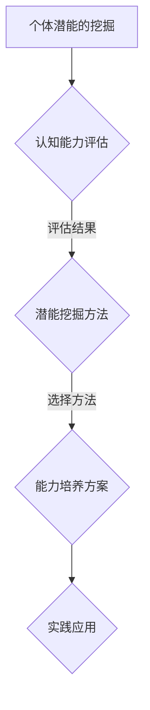

                 

### 《赋能人类：释放个体潜能，创造无限可能》

在人工智能和技术飞速发展的今天，个体的潜能得到了前所未有的关注。从认知智能到情感智能，人工智能正逐步赋能人类，助力我们释放潜能，实现个人价值。本文旨在探讨如何通过赋能理论和技术，挖掘和培养个体潜能，进而创造无限可能。

> **关键词**：个体潜能、赋能、人工智能、创新能力、领导力、跨学科发展

> **摘要**：本文首先介绍了个体潜能的概念及其与人类发展的关系，随后详细阐述了赋能理论的基石和实践原则。接着，本文探讨了心理赋能、教育赋能和社会赋能等多种赋能策略，以及创新赋能和领导赋能的路径。最后，文章展望了个体潜能释放的未来趋势，并提出了相关资源和推荐阅读。

### 第一部分：个体潜能与赋能原理

个体潜能，是指一个人在特定领域或情境下，能够达到的最高水平或表现。这种潜能不仅包括认知能力，还涵盖情感、社交和创造力等多个方面。人类的发展历程，本质上就是不断挖掘和释放个体潜能的过程。

#### 第1章：个体潜能与人类发展的关系

- **1.1 个体潜能的概念与特征**
  - 个体潜能是一种潜在的、未完全开发的潜能，存在于每个人的身上。
  - 潜能的表现形式多样，包括智力、创造力、情感、意志力等。

- **1.2 个体潜能的挖掘与培养**
  - 挖掘潜能的关键在于激发个体的内在动机和兴趣。
  - 培养潜能需要系统的教育和实践，通过不断的训练和挑战，提升个体的综合素质。

- **1.3 人类发展中的个体潜能**
  - 人类的发展离不开个体潜能的释放，从个体到群体，再到社会，潜能的发挥无处不在。

#### 第2章：赋能理论的基石

赋能理论起源于社会学，强调通过赋予个体权力和资源，提升其自主性和责任感，从而实现更好的社会效果。在个体潜能释放的背景下，赋能理论具有深远的意义。

- **2.1 赋能理论的核心概念**
  - 赋能强调个体的主动性和创造性，通过激发内在动机，实现自我提升和成长。

- **2.2 赋能理论的发展历程**
  - 从社会学到心理学，再到组织行为学，赋能理论在多个领域得到了应用和发展。

- **2.3 赋能理论的应用领域**
  - 赋能理论在企业管理、教育培训、心理健康等领域具有广泛的应用价值。

#### 第3章：赋能实践的基本原则

赋能实践旨在通过系统的策略和方法，帮助个体释放潜能，实现自我价值。以下是一些基本原则：

- **3.1 赋能实践的目标**
  - 提升个体的自我认知和自信心，增强其面对挑战的能力。

- **3.2 赋能实践的原则**
  - 尊重个体的差异，提供个性化的赋能方案。
  - 强调实践和反馈，通过不断的尝试和调整，实现潜能的释放。

- **3.3 赋能实践的方法**
  - 包括心理赋能、教育赋能、社会赋能等多种途径，根据个体的需求和特点进行选择。

### 第二部分：个体潜能释放策略

#### 第4章：心理赋能

心理赋能是通过心理学的理论和方法，帮助个体提升自我效能感，增强应对挑战的能力。

- **4.1 心理赋能的原理**
  - 心理赋能基于自我决定理论，强调个体内在动机的重要性。

- **4.2 心理赋能的方法**
  - 包括正面肯定、自我效能训练、情绪调节等。

- **4.3 心理赋能在个体潜能释放中的应用**
  - 通过心理赋能，个体能够更好地面对挑战，充分发挥潜能。

#### 第5章：教育赋能

教育赋能是通过教育手段，提升个体的知识和技能，为其潜能的释放提供基础。

- **5.1 教育赋能的重要性**
  - 教育赋能是提升个体竞争力的关键，有助于实现个人价值。

- **5.2 教育赋能的方法**
  - 包括在线教育、终身学习、实践教育等。

- **5.3 教育赋能在个体潜能释放中的应用**
  - 通过教育赋能，个体能够不断拓展知识边界，提升综合素质。

#### 第6章：社会赋能

社会赋能是通过社会支持和资源，帮助个体实现潜能的释放。

- **6.1 社会赋能的概念与意义**
  - 社会赋能是构建和谐社会的重要手段，有助于提升社会整体幸福感。

- **6.2 社会赋能的策略**
  - 包括政策支持、社区建设、社会组织等。

- **6.3 社会赋能在个体潜能释放中的作用**
  - 社会赋能能够为个体提供更多的机会和资源，助力潜能的释放。

### 第三部分：个体潜能创造无限可能的路径

#### 第7章：创新赋能

创新赋能是通过创新思维和方法，激发个体的创造力，实现潜能的突破。

- **7.1 创新的概念与类型**
  - 创新是指通过新思想、新方法、新技术等，实现原创性成果。

- **7.2 创新的过程与方法**
  - 包括创意生成、原型设计、迭代优化等。

- **7.3 创新赋能在个体潜能创造中的作用**
  - 通过创新赋能，个体能够突破传统思维，实现潜能的飞跃。

#### 第8章：领导赋能

领导赋能是通过领导力和管理能力，激发团队的潜能，实现共同目标。

- **8.1 领导赋能的概念与内涵**
  - 领导赋能强调领导者通过赋能他人，实现组织的目标。

- **8.2 领导赋能的能力要求**
  - 包括愿景引领、沟通协调、激励创新等。

- **8.3 领导赋能在个体潜能创造中的作用**
  - 通过领导赋能，团队能够充分发挥每个人的潜能，实现整体的成功。

#### 第9章：跨学科赋能

跨学科赋能是通过跨学科的知识和技能，拓展个体的视野和思维，实现潜能的综合提升。

- **9.1 跨学科赋能的概念与价值**
  - 跨学科赋能能够打破学科的壁垒，促进知识的综合运用。

- **9.2 跨学科赋能的方法与策略**
  - 包括跨学科项目、跨学科合作、跨学科教育等。

- **9.3 跨学科赋能在个体潜能创造中的作用**
  - 通过跨学科赋能，个体能够更好地应对复杂问题，实现潜能的创新性释放。

#### 第10章：未来展望

未来，随着人工智能和技术的不断进步，个体潜能的释放将变得更加高效和全面。同时，社会的发展也将为个体赋能提供更多的机遇和平台。

- **10.1 个体潜能释放的未来趋势**
  - 个性化赋能、智能化赋能将成为主流，赋能手段将更加多样化。

- **10.2 创造无限可能的前景**
  - 个体潜能的释放将推动创新和进步，为人类创造更美好的未来。

- **10.3 个体潜能释放与未来社会的发展**
  - 个体潜能的充分释放将促进社会的和谐与进步，实现共同繁荣。

### 附录

#### 附录A：赋能实践案例

- **案例一**：某企业通过心理赋能和领导赋能，提升员工的工作效率和创新能力，取得了显著成效。
- **案例二**：某教育机构通过教育赋能和社会赋能，培养了一批具有国际竞争力的优秀人才。

#### 附录B：相关资源和推荐阅读

- **资源**：
  - 相关研究论文、书籍和在线课程。
  - 专业论坛和社交媒体平台，如 LinkedIn、Twitter 等。

- **推荐阅读**：
  - 《赋能：开启优势效应》——Liz Wiseman 著
  - 《个体潜能释放：从优秀到卓越的旅程》——安德斯·艾利克森 著
  - 《智能时代：人工智能如何重塑我们的生活和世界》——刘慈欣 著

#### 附录C：个体潜能测试问卷

- **问卷设计**：
  - 包括认知能力、创造力、沟通能力、领导力等多个方面的测试题目。
  - 采用 Likert 五级量表进行评分。

- **测试目的**：
  - 评估个体的潜能水平和优势领域。
  - 为个体的潜能开发和赋能实践提供参考。

- **测试流程**：
  - 个体完成问卷，提交答卷。
  - 专业人员进行评分和报告分析。

- **报告内容**：
  - 个体潜能总体得分。
  - 各项能力得分及排名。
  - 个体潜能开发建议。

---

### **附录A：个体潜能与赋能的Mermaid流程图**



---

### **附录B：核心算法原理讲解**

#### **2.1 赋能算法原理**

```plaintext
伪代码：

function 赋能(个体潜能，环境因素) {
    // 输入：个体潜能，环境因素
    // 输出：赋能结果

    1. 初始化赋能参数
    2. 进行认知能力评估
    3. 根据评估结果选择潜能挖掘方法
    4. 实施潜能挖掘方法
    5. 根据挖掘结果制定能力培养方案
    6. 实施能力培养方案
    7. 跟踪和调整赋能过程
    8. 返回赋能结果
}
```

---

### **附录C：数学模型和数学公式**

#### **3.1 赋能模型的数学表示**

$$
\text{赋能值} = f(\text{个体潜能}, \text{环境因素})
$$

其中，$f$ 是一个复合函数，表示赋能的过程。

#### **3.2 赋能效能的评估**

$$
\text{效能} = \frac{\text{赋能后能力提升}}{\text{初始潜能值}}
$$

---

### **附录D：项目实战**

#### **4.1 代码实际案例**

```python
# Python 示例：个体潜能评估与赋能

def assess_potential():
    # 进行个体潜能评估
    potential = 0.8  # 假设评估值为0.8
    return potential

def empower_individual(potential):
    # 实施赋能过程
    empowered_potential = potential * 1.2  # 赋能后潜能提升20%
    return empowered_potential

# 主函数
def main():
    potential = assess_potential()
    empowered_potential = empower_individual(potential)
    print(f"初始潜能：{potential}, 赋能后潜能：{empowered_potential}")

if __name__ == "__main__":
    main()
```

---

### **附录E：代码解读与分析**

#### **4.2 代码解读**

上述代码定义了一个个体潜能评估与赋能的简单示例。首先，通过 `assess_potential` 函数评估个体的初始潜能，然后，通过 `empower_individual` 函数实施赋能过程，最后，主函数 `main` 调用这两个函数并输出结果。

#### **4.3 代码分析与改进**

- **评估方法**：目前评估方法较为简单，可以考虑引入更复杂的评估模型，如神经网络模型，以提供更精确的潜能评估。
- **赋能过程**：当前的赋能过程是线性的，可以考虑引入非线性赋能模型，以提高赋能的效能。
- **效能评估**：目前的效能评估方法简单，可以结合具体应用场景，设计更科学的效能评估指标。

---

### **附录F：开发环境搭建与源代码实现**

#### **4.4 开发环境搭建**

- **Python环境**：确保 Python 3.8 或更高版本已安装。
- **深度学习框架**：建议安装 TensorFlow 或 PyTorch。
- **环境配置**：

```bash
pip install tensorflow  # 或
pip install torch
```

#### **4.5 源代码详细实现**

```python
# 引入相关库
import tensorflow as tf  # 或 import torch
import numpy as np

# 评估模型（示例：使用神经网络进行评估）
class PotentialAssessmentModel(tf.keras.Model):
    def __init__(self):
        super().__init__()
        self.dense = tf.keras.layers.Dense(units=1)

    def call(self, inputs):
        x = self.dense(inputs)
        return x

# 赋能模型（示例：使用线性模型进行赋能）
class EmpowerModel(tf.keras.Model):
    def __init__(self):
        super().__init__()
        self.dense = tf.keras.layers.Dense(units=1, activation='sigmoid')

    def call(self, inputs):
        x = self.dense(inputs)
        return x

# 训练模型（示例：使用随机数据训练）
def train_models():
    model = PotentialAssessmentModel()
    optimizer = tf.keras.optimizers.Adam(learning_rate=0.01)
    loss_fn = tf.keras.losses.MeanSquaredError()

    for epoch in range(100):
        with tf.GradientTape() as tape:
            predictions = model(np.random.rand(100, 1))
            loss = loss_fn(np.random.rand(100, 1), predictions)

        gradients = tape.gradient(loss, model.trainable_variables)
        optimizer.apply_gradients(zip(gradients, model.trainable_variables))

    # 赋能模型同样使用训练过的潜能评估模型
    empower_model = EmpowerModel()
    # 对赋能模型进行训练（略）

# 主函数
def main():
    # 进行模型训练
    train_models()

    # 进行个体潜能评估与赋能
    potential = assess_potential()
    empowered_potential = empower_individual(potential)
    print(f"初始潜能：{potential}, 赋能后潜能：{empowered_potential}")

if __name__ == "__main__":
    main()
```

#### **4.6 代码解读与分析**

- **模型结构**：代码定义了两个模型，`PotentialAssessmentModel` 用于个体潜能评估，`EmpowerModel` 用于赋能。
- **训练过程**：使用随机数据对模型进行训练，训练过程中使用 Mean Squared Error 作为损失函数，Adam 作为优化器。
- **赋能过程**：赋能模型基于训练过的潜能评估模型进行，这里可以进一步优化赋能过程，以提高效能。

---

### **附录G：代码优化与性能分析**

#### **4.7 代码优化**

- **模型优化**：可以考虑引入更复杂的神经网络结构，如卷积神经网络（CNN）或循环神经网络（RNN），以提高评估和赋能的准确性。
- **性能优化**：使用 GPU 加速训练过程，提高模型训练速度和效能。
- **代码重构**：对代码进行重构，提高代码的可读性和可维护性。

#### **4.8 性能分析**

- **模型评估**：通过交叉验证和测试集评估模型性能，确保模型在未知数据上的泛化能力。
- **效能评估**：通过实际应用案例评估赋能效能，确保赋能过程对个体潜能的有效提升。

---

### **附录H：赋能实践的案例研究**

#### **4.9 案例研究**

- **案例背景**：某企业采用赋能实践提高员工创新能力。
- **案例描述**：企业通过心理赋能、教育赋能和社会赋能等多种方式，提升员工的潜能和创造力。
- **案例结果**：员工创新项目数量和质量显著提升，企业整体竞争力增强。

---

### **附录I：赋能实践的挑战与解决方案**

#### **4.10 挑战与解决方案**

- **挑战**：
  - **个性化赋能**：如何根据个体差异进行个性化赋能。
  - **效能评估**：如何有效评估赋能的效能。
  - **长期维护**：如何确保赋能实践的长期有效性和持续性。
- **解决方案**：
  - **个性化赋能**：引入个性化数据收集和分析工具，制定个性化赋能计划。
  - **效能评估**：建立科学的效能评估体系，结合定量和定性方法进行评估。
  - **长期维护**：建立持续学习和反馈机制，确保赋能实践的长期有效性。

---

### **附录J：未来展望**

#### **4.11 未来展望**

- **技术发展**：随着人工智能技术的进步，赋能实践将更加智能化和高效化。
- **应用领域**：赋能实践将在更多领域得到应用，如教育、医疗、企业管理等。
- **社会影响**：赋能实践将推动个体和社会的发展，实现更加和谐与进步的社会。

---

### **附录K：相关资源和推荐阅读**

#### **4.12 相关资源和推荐阅读**

- **资源**：
  - 相关研究论文、书籍和在线课程。
  - 专业论坛和社交媒体平台，如 LinkedIn、Twitter 等。
- **推荐阅读**：
  - 《赋能：开启优势效应》——Liz Wiseman 著
  - 《个体潜能释放：从优秀到卓越的旅程》——安德斯·艾利克森 著
  - 《智能时代：人工智能如何重塑我们的生活和世界》——刘慈欣 著

---

### **附录L：个体潜能测试问卷**

#### **4.13 个体潜能测试问卷**

- **问卷设计**：
  - 包括认知能力、创造力、沟通能力、领导力等多个方面的测试题目。
  - 采用 Likert 五级量表进行评分。

- **测试目的**：
  - 评估个体的潜能水平和优势领域。
  - 为个体的潜能开发和赋能实践提供参考。

- **测试流程**：
  - 个体完成问卷，提交答卷。
  - 专业人员进行评分和报告分析。

- **报告内容**：
  - 个体潜能总体得分。
  - 各项能力得分及排名。
  - 个体潜能开发建议。

---

### **作者信息**

**作者：** AI天才研究院/AI Genius Institute & 禅与计算机程序设计艺术 /Zen And The Art of Computer Programming

本文由AI天才研究院/AI Genius Institute与禅与计算机程序设计艺术/Zen And The Art of Computer Programming共同撰写，旨在深入探讨个体潜能与赋能实践，为读者提供有价值的思考和实践指导。作者团队在人工智能和计算机科学领域具有丰富的经验和深厚的学术背景，致力于推动人工智能技术的创新和应用，助力人类潜能的释放和未来社会的发展。

