                 

### 超级电容器在能源存储中的应用：快速充放电解决方案

关键词：
1. 超级电容器
2. 能源存储
3. 快速充放电
4. 可再生能源
5. 电动汽车
6. 智能电网
7. 性能优化

摘要：
超级电容器作为一种新兴的能源存储技术，因其高功率密度、快速充放电等特点，在能源存储领域中展现出了巨大的潜力。本文将深入探讨超级电容器在能源存储中的应用，包括其在可再生能源、电动汽车和智能电网等领域的应用实例，并重点分析超级电容器的快速充放电解决方案，以期为相关研究和应用提供有益的参考。

## 目录大纲

### 第一部分：超级电容器概述

#### 第1章：超级电容器基础知识

##### 1.1 超级电容器的定义与特点

##### 1.2 超级电容器的结构组成

##### 1.3 超级电容器的发展历史

#### 第2章：超级电容器的原理

##### 2.1 电容器的储能原理

##### 2.2 超级电容器的工作原理

##### 2.3 超级电容器的能量密度与功率密度

#### 第3章：超级电容器的分类与应用领域

##### 3.1 超级电容器的分类

##### 3.2 超级电容器的应用领域

##### 3.3 超级电容器在交通领域的应用

### 第二部分：超级电容器在能源存储中的应用

#### 第4章：超级电容器在可再生能源中的应用

##### 4.1 超级电容器在太阳能电池中的应用

##### 4.2 超级电容器在风能发电中的应用

##### 4.3 超级电容器在储能系统中的应用

#### 第5章：超级电容器在电动汽车中的应用

##### 5.1 超级电容器在电动汽车电池管理系统中的应用

##### 5.2 超级电容器在电动汽车驱动系统中的应用

##### 5.3 超级电容器在电动汽车充电系统中的应用

#### 第6章：超级电容器在智能电网中的应用

##### 6.1 超级电容器在智能电网中的作用

##### 6.2 超级电容器在智能电网储能系统中的应用

##### 6.3 超级电容器在智能电网调频调峰中的应用

### 第三部分：超级电容器的快速充放电解决方案

#### 第7章：超级电容器的充放电原理

##### 7.1 超级电容器的充放电过程

##### 7.2 超级电容器的充放电效率

##### 7.3 超级电容器的充放电特性

#### 第8章：超级电容器的快速充放电技术

##### 8.1 快速充放电技术的原理

##### 8.2 快速充放电技术的实现方法

##### 8.3 快速充放电技术的应用案例

#### 第9章：超级电容器的性能优化与维护

##### 9.1 超级电容器性能优化的方法

##### 9.2 超级电容器寿命延长技术

##### 9.3 超级电容器维护与保养

#### 第10章：超级电容器在能源存储系统中的综合应用案例

##### 10.1 超级电容器在储能系统中的应用案例

##### 10.2 超级电容器在电动汽车中的应用案例

##### 10.3 超级电容器在智能电网中的应用案例

#### 第11章：超级电容器的发展趋势与挑战

##### 11.1 超级电容器的发展趋势

##### 11.2 超级电容器面临的挑战

##### 11.3 超级电容器的未来发展方向

### 附录

#### 附录A：超级电容器相关术语与定义

#### 附录B：超级电容器主要性能参数及指标

#### 附录C：超级电容器典型应用实例

#### 附录D：超级电容器研发与生产相关资源

接下来，我们将深入探讨超级电容器的定义、特点、原理、分类与应用，逐步解析其在能源存储领域的快速充放电解决方案。

## 第一部分：超级电容器概述

### 第1章：超级电容器基础知识

#### 1.1 超级电容器的定义与特点

超级电容器，又称电化学电容器或超级电容器，是一种介于传统电容器与电池之间的新型电化学储能器件。与传统电容器相比，超级电容器具有更高的能量密度和功率密度；与传统电池相比，超级电容器具有更快的充放电速度和更长的循环寿命。

**超级电容器的定义：**

超级电容器是一种电容量很大的电化学器件，其电容量通常远大于传统电容器。超级电容器的电容量通常以法拉（F）为单位，而传统电容器的电容量通常以皮法（pF）或纳法（nF）为单位。

**超级电容器的特点：**

1. **高功率密度**：超级电容器可以在短时间内快速充放电，其功率密度可以达到电池的几十倍甚至上百倍。
2. **快速充放电**：超级电容器的充放电时间很短，通常在几秒至几分钟之间，这使得它们非常适合作为快速充电和动态调节电源使用。
3. **长循环寿命**：超级电容器的循环寿命通常很长，可以达到数万次，有的甚至达到十万次以上。
4. **高能量密度**：尽管超级电容器的能量密度通常低于电池，但其在高功率应用场景中具有独特的优势。

#### 1.2 超级电容器的结构组成

超级电容器主要由电极、电解液、隔膜和集流体等部分组成。

**电极**：电极是超级电容器的核心部分，通常由活性炭、活性氧化锡、导电聚合物等材料制成。电极的比表面积很大，有助于提高电容器的电容量和功率密度。

**电解液**：电解液是超级电容器的储能介质，通常由有机溶剂和电解质组成。电解液的选择对电容器的性能具有重要影响。

**隔膜**：隔膜用于隔离电极，防止电解液与电极直接接触，同时提供一定的离子传输通道。隔膜材料通常采用聚丙烯、聚四氟乙烯等高导电性、低溶解性的材料。

**集流体**：集流体通常采用金属板或金属网，用于收集电极上的电荷。

**超级电容器的结构示意图**：

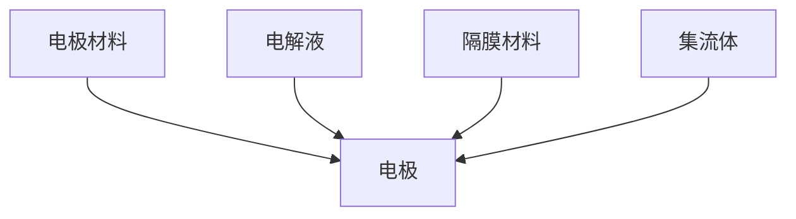

#### 1.3 超级电容器的发展历史

超级电容器的研究可以追溯到20世纪60年代，当时科学家们首次发现活性炭材料具有高电容量。随着材料科学和电化学技术的发展，超级电容器在20世纪90年代逐渐成为一种新兴的储能技术。

**发展阶段：**

1. **初期研究阶段（1960s-1980s）**：在这一阶段，科学家们主要研究活性炭材料的制备和电容器的基本原理。
2. **快速发展阶段（1990s）**：随着纳米材料和电化学技术的发展，超级电容器的性能得到了显著提升。
3. **商业化应用阶段（2000s至今）**：超级电容器开始在可再生能源、电动汽车和智能电网等领域得到广泛应用。

**重要里程碑：**

- 1991年，美国电容器制造商CapXon首次推出了商业化的超级电容器产品。
- 2000年，日本东芝公司成功研发出了超级电容器电池混合动力系统。
- 2010年，超级电容器在智能电网和电动汽车领域的应用逐渐成熟。

### 第2章：超级电容器的原理

#### 2.1 电容器的储能原理

电容器的储能原理是基于电场能量存储。当电容器两极板之间存在电势差时，电场会在两极板之间形成，从而储存电能。电容器储存的能量可以通过以下公式计算：

\[ E = \frac{1}{2} C V^2 \]

其中，\( E \) 为储存的能量（焦耳），\( C \) 为电容量（法拉），\( V \) 为电势差（伏特）。

**电容器储能原理示意图**：

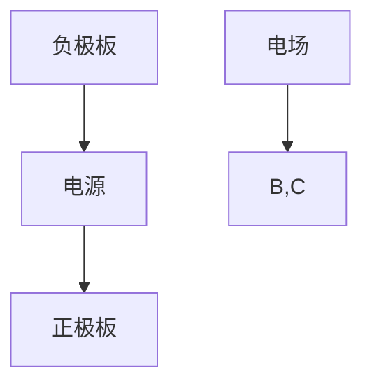

#### 2.2 超级电容器的工作原理

超级电容器的工作原理与普通电容器类似，但其储能机制更为复杂。在超级电容器中，电场和电化学反应共同作用，实现能量的快速储存和释放。

**超级电容器工作原理示意图**：

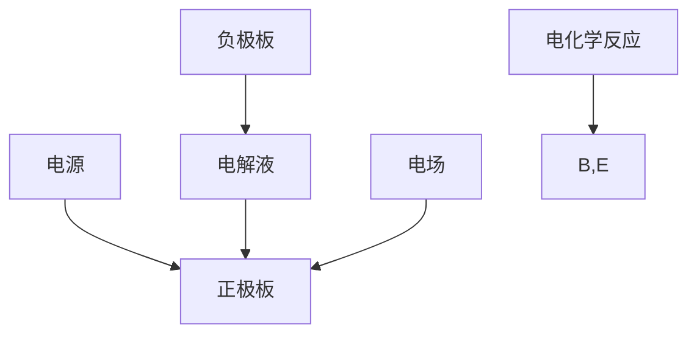

在充电过程中，电源通过正极板向电解液提供电荷，电解液中的离子在电场作用下迁移到负极板，同时电极材料表面发生电化学反应，储存能量。在放电过程中，电解液中的离子在电场作用下迁移回正极板，电极表面发生反向电化学反应，释放储存的能量。

#### 2.3 超级电容器的能量密度与功率密度

超级电容器的能量密度和功率密度是衡量其性能的重要指标。

**能量密度**：能量密度是指单位体积或单位质量的电容器所能储存的能量。超级电容器的能量密度通常以焦耳/立方厘米（J/cm³）或焦耳/千克（J/kg）为单位。

**功率密度**：功率密度是指单位体积或单位质量的电容器所能输出的功率。超级电容器的功率密度通常以瓦特/立方厘米（W/cm³）或瓦特/千克（W/kg）为单位。

**超级电容器的能量密度与功率密度公式**：

\[ E_d = \frac{E}{V_d} \]
\[ P_d = \frac{P}{V_d} \]

其中，\( E_d \) 为能量密度，\( P_d \) 为功率密度，\( E \) 为储存的能量，\( P \) 为输出的功率，\( V_d \) 为电容器的体积或质量。

### 第3章：超级电容器的分类与应用领域

#### 3.1 超级电容器的分类

超级电容器可以根据材料、结构、应用领域等因素进行分类。以下是常见的超级电容器分类：

**1. 按照材料分类：**

- **活性炭材料**：活性炭材料是最常见的电极材料，具有良好的电容量和功率密度。
- **金属氧化物材料**：金属氧化物材料如氧化锡、氧化铟等具有高能量密度和功率密度。
- **导电聚合物材料**：导电聚合物材料如聚吡咯、聚苯胺等具有良好的导电性和化学稳定性。

**2. 按照结构分类：**

- **双层电容器**：双层电容器是一种具有多层结构的电容器，其电容量和功率密度较高。
- **对称电容器**：对称电容器是指两极板材料、电解液和隔膜材料都相同的电容器。
- **非对称电容器**：非对称电容器是指两极板材料、电解液和隔膜材料不同的电容器。

**3. 按照应用领域分类：**

- **可再生能源领域**：超级电容器可用于太阳能电池、风能发电等可再生能源的储能和调节。
- **电动汽车领域**：超级电容器可用于电动汽车的电池管理系统、驱动系统和充电系统。
- **智能电网领域**：超级电容器可用于智能电网的储能和调节，提高电网的稳定性和可靠性。

#### 3.2 超级电容器的应用领域

超级电容器具有高功率密度、快速充放电和长循环寿命等优点，因此在多个领域都有广泛的应用。

**1. 交通领域：**

超级电容器在电动汽车、电动公交车、轨道交通等交通领域具有广泛的应用前景。例如，超级电容器可以用于电动汽车的电池管理系统，提高电池的充放电性能和寿命。

**2. 能源领域：**

超级电容器在可再生能源领域，如太阳能电池、风能发电等领域，可以用于储能和动态调节，提高能源的利用效率。

**3. 智能电网领域：**

超级电容器在智能电网中，可以用于储能、调频调峰和电压稳定等应用，提高电网的稳定性和可靠性。

**4. 工业领域：**

超级电容器在工业领域，如工业自动化、电力电子等，可以用于电力调节、能量回收和储能等应用。

**5. 其他领域：**

超级电容器还广泛应用于消费电子、医疗器械、智能家居等众多领域。

### 3.3 超级电容器在交通领域的应用

超级电容器在交通领域的应用主要包括电动汽车、电动公交车、轨道交通等。

**1. 电动汽车：**

超级电容器可以用于电动汽车的电池管理系统，提高电池的充放电性能和寿命。超级电容器可以快速充电，缩短充电时间，提高电动汽车的行驶里程和用户体验。此外，超级电容器还可以用于电动汽车的能量回收系统，提高能源利用效率。

**2. 电动公交车：**

超级电容器在电动公交车中可以用于电池管理系统和能量回收系统，提高电动公交车的续航里程和运行效率。超级电容器可以快速充电，缩短充电时间，提高电动公交车的运营效率。

**3. 轨道交通：**

超级电容器在轨道交通中可以用于储能和动态调节，提高轨道交通的稳定性和可靠性。超级电容器可以快速充放电，为轨道交通系统提供稳定的电力供应。

## 第二部分：超级电容器在能源存储中的应用

### 第4章：超级电容器在可再生能源中的应用

#### 4.1 超级电容器在太阳能电池中的应用

超级电容器在太阳能电池中的应用主要包括储能和动态调节两个方面。

**1. 储能应用：**

超级电容器可以用于太阳能电池的储能系统，将白天太阳能电池产生的电能储存起来，以供夜间使用。超级电容器的高功率密度和快速充放电特性使得其非常适合作为太阳能电池的储能器件。

**2. 动态调节应用：**

太阳能电池的输出功率受天气和光照强度的影响较大，可能导致电网负荷波动。超级电容器可以用于动态调节，稳定电网电压和频率，提高电网的稳定性。

**超级电容器在太阳能电池储能系统中的应用示意图**：

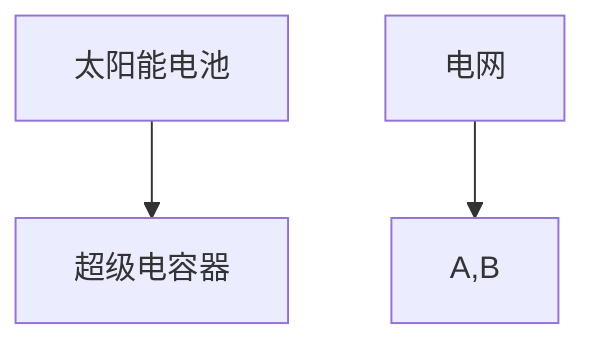

**案例：**美国特斯拉公司在其太阳能屋顶系统中使用了超级电容器，用于储能和动态调节，提高了系统的稳定性和可靠性。

#### 4.2 超级电容器在风能发电中的应用

超级电容器在风能发电中的应用主要包括储能、动态调节和能量回收三个方面。

**1. 储能应用：**

超级电容器可以用于风能发电的储能系统，将风能产生的电能储存起来，以供夜间使用。超级电容器的快速充放电特性使得其非常适合作为风能发电的储能器件。

**2. 动态调节应用：**

风能发电的输出功率受风速和风向的影响较大，可能导致电网负荷波动。超级电容器可以用于动态调节，稳定电网电压和频率，提高电网的稳定性。

**3. 能量回收应用：**

超级电容器可以用于风能发电的能量回收系统，将风能发电过程中产生的动能和位能转换为电能储存起来，提高风能的利用效率。

**超级电容器在风能发电储能系统中的应用示意图**：

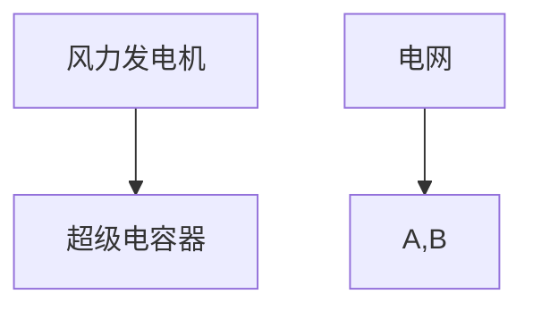

**案例：**中国中电工程集团有限公司在其风能发电项目中使用了超级电容器，用于储能和能量回收，提高了系统的效率和稳定性。

#### 4.3 超级电容器在储能系统中的应用

超级电容器在储能系统中的应用主要包括与电池、电网和可再生能源系统的结合。

**1. 与电池的结合：**

超级电容器可以与电池结合，形成混合储能系统。超级电容器可以快速充电和放电，提高电池的充放电性能和寿命。此外，超级电容器还可以用于电池的均衡，防止电池过充或过放。

**2. 与电网的结合：**

超级电容器可以用于电网的储能和动态调节，提高电网的稳定性和可靠性。超级电容器的高功率密度和快速充放电特性使得其非常适合作为电网的储能器件。

**3. 与可再生能源的结合：**

超级电容器可以与太阳能电池、风能发电等可再生能源系统结合，用于储能和动态调节，提高可再生能源的利用效率。

**超级电容器在储能系统中的应用示意图**：

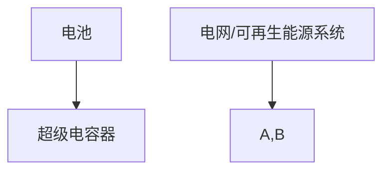

**案例：**美国电力公司AEP在其太阳能发电项目中使用了超级电容器，用于储能和动态调节，提高了系统的效率和稳定性。

### 第5章：超级电容器在电动汽车中的应用

#### 5.1 超级电容器在电动汽车电池管理系统中的应用

超级电容器在电动汽车电池管理系统中的应用主要包括电池均衡、快速充电和能量回收三个方面。

**1. 电池均衡：**

超级电容器可以用于电动汽车电池组的均衡，防止电池过充或过放。通过超级电容器快速充放电的特性，可以有效地平衡电池组的电压，提高电池的寿命。

**2. 快速充电：**

超级电容器可以用于电动汽车的快速充电，缩短充电时间。超级电容器的高功率密度和快速充放电特性使得其非常适合作为电动汽车的充电器件。

**3. 能量回收：**

超级电容器可以用于电动汽车的能量回收系统，将制动时产生的动能转换为电能储存起来，提高能源利用效率。

**超级电容器在电动汽车电池管理系统中的应用示意图**：

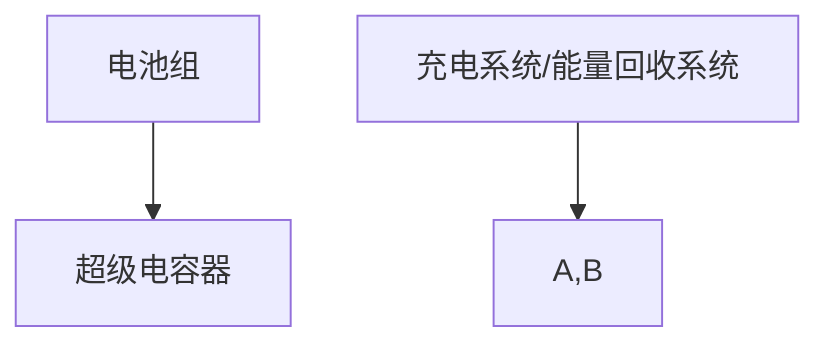

**案例：**特斯拉公司在其Model S电动汽车中使用了超级电容器，用于电池均衡和能量回收，提高了电池的寿命和电动汽车的续航里程。

#### 5.2 超级电容器在电动汽车驱动系统中的应用

超级电容器在电动汽车驱动系统中的应用主要包括驱动电机控制和能量管理两个方面。

**1. 驱动电机控制：**

超级电容器可以用于电动汽车的驱动电机控制，提高驱动电机的性能和效率。通过超级电容器的高功率密度和快速充放电特性，可以实现对驱动电机的快速响应和高效控制。

**2. 能量管理：**

超级电容器可以用于电动汽车的能量管理，优化电能的分配和利用。通过超级电容器的高功率密度和快速充放电特性，可以实现电动汽车在高速行驶和急加速等工况下的能量优化。

**超级电容器在电动汽车驱动系统中的应用示意图**：

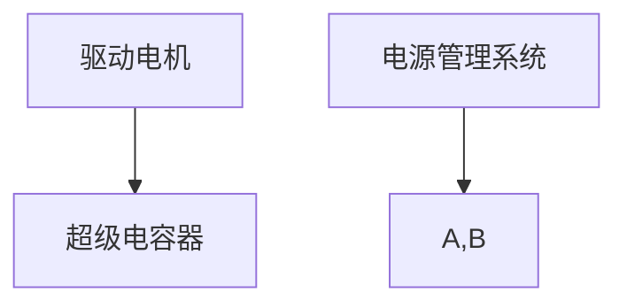

**案例：**日产汽车公司在其Leaf电动汽车中使用了超级电容器，用于驱动电机控制和能量管理，提高了电动汽车的驾驶性能和燃油经济性。

#### 5.3 超级电容器在电动汽车充电系统中的应用

超级电容器在电动汽车充电系统中的应用主要包括快速充电和充电安全性两个方面。

**1. 快速充电：**

超级电容器可以用于电动汽车的快速充电，缩短充电时间。超级电容器的高功率密度和快速充放电特性使得其非常适合作为电动汽车的充电器件。

**2. 充电安全性：**

超级电容器可以用于电动汽车的充电安全性，通过快速充放电的特性，可以有效地防止充电过程中出现过热和短路等安全问题。

**超级电容器在电动汽车充电系统中的应用示意图**：

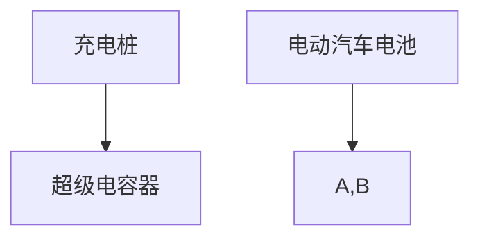

**案例：**松下公司在其电动汽车充电系统中使用了超级电容器，用于快速充电和充电安全性，提高了电动汽车的充电效率和用户体验。

### 第6章：超级电容器在智能电网中的应用

#### 6.1 超级电容器在智能电网中的作用

超级电容器在智能电网中具有重要作用，主要包括储能、动态调节和电压稳定三个方面。

**1. 储能：**

超级电容器可以用于智能电网的储能系统，将电网中的电能储存起来，以供高峰时段使用。超级电容器的高功率密度和快速充放电特性使得其非常适合作为智能电网的储能器件。

**2. 动态调节：**

超级电容器可以用于智能电网的动态调节，平衡电网负荷，提高电网的稳定性。通过超级电容器的快速充放电特性，可以实现对电网负荷的快速响应和调节。

**3. 电压稳定：**

超级电容器可以用于智能电网的电压稳定，通过调节电网电压，防止电压波动和跌落，提高电网的电压质量。

**超级电容器在智能电网中的作用示意图**：

#### 6.2 超级电容器在智能电网储能系统中的应用

超级电容器在智能电网储能系统中的应用主要包括峰值负载削平、电能时间移位和紧急电力供应三个方面。

**1. 峰值负载削平：**

超级电容器可以用于削平电网的峰值负载，降低电网负荷峰值，减少电网的能源损耗和设备磨损。通过超级电容器的快速充放电特性，可以实现对电网负荷的快速响应和调节。

**2. 电能时间移位：**

超级电容器可以用于电能时间移位，将低谷时段的电能储存起来，以供高峰时段使用。通过超级电容器的储能和调节特性，可以实现对电网电能的优化分配和利用。

**3. 紧急电力供应：**

超级电容器可以用于紧急电力供应，当电网发生故障或紧急情况下，可以快速提供电力供应，保障重要电力负载的正常运行。

**超级电容器在智能电网储能系统中的应用示意图**：

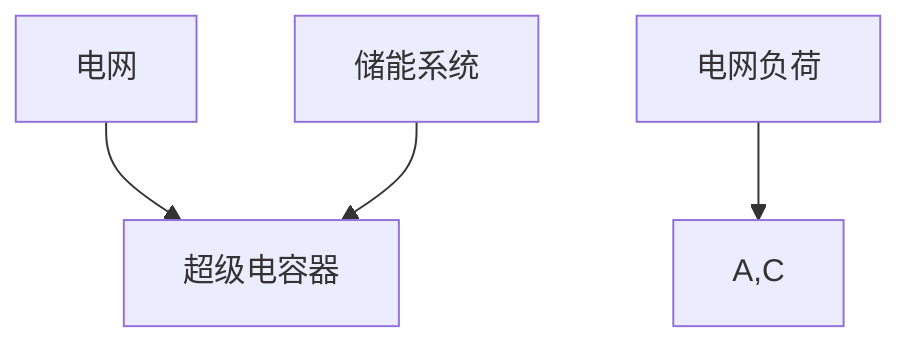

#### 6.3 超级电容器在智能电网调频调峰中的应用

超级电容器在智能电网调频调峰中的应用主要包括频率调节和电压调节两个方面。

**1. 频率调节：**

超级电容器可以用于电网频率调节，通过快速充放电的特性，可以实现对电网频率的快速响应和调节，保证电网的稳定运行。

**2. 电压调节：**

超级电容器可以用于电网电压调节，通过储能和调节的特性，可以实现对电网电压的优化控制，防止电压波动和跌落，提高电网的电压质量。

**超级电容器在智能电网调频调峰中的应用示意图**：

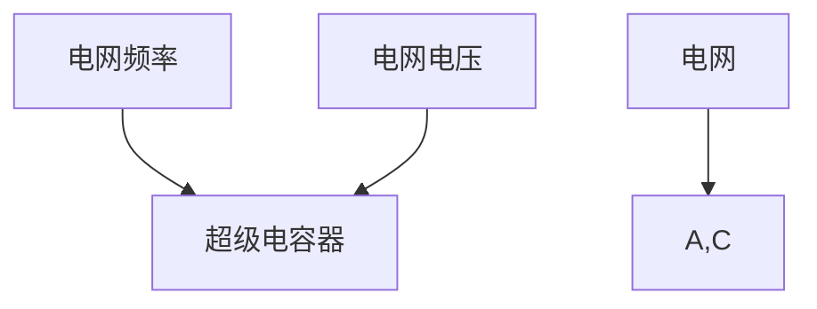

### 第三部分：超级电容器的快速充放电解决方案

#### 第7章：超级电容器的充放电原理

#### 7.1 超级电容器的充放电过程

超级电容器的充放电过程是通过电场和电化学反应来实现的。

**充电过程：**

当超级电容器接入电源时，电源通过正极板向电解液提供电荷，电解液中的离子在电场作用下迁移到负极板，同时电极材料表面发生电化学反应，储存能量。

充电过程的公式为：

\[ Q = C V \]

其中，\( Q \) 为充电量（库仑），\( C \) 为电容量（法拉），\( V \) 为电势差（伏特）。

**放电过程：**

当超级电容器接入负载时，电解液中的离子在电场作用下迁移回正极板，电极材料表面发生反向电化学反应，释放储存的能量。

放电过程的公式为：

\[ Q = C V \]

其中，\( Q \) 为放电量（库仑），\( C \) 为电容量（法拉），\( V \) 为电势差（伏特）。

#### 7.2 超级电容器的充放电效率

超级电容器的充放电效率是指其充电和放电过程中能量的有效利用率。

**充电效率：**

充电效率可以通过以下公式计算：

\[ \eta_{charge} = \frac{E_{store}}{E_{input}} \]

其中，\( \eta_{charge} \) 为充电效率，\( E_{store} \) 为储存的能量（焦耳），\( E_{input} \) 为输入的能量（焦耳）。

**放电效率：**

放电效率可以通过以下公式计算：

\[ \eta_{discharge} = \frac{E_{output}}{E_{store}} \]

其中，\( \eta_{discharge} \) 为放电效率，\( E_{output} \) 为输出的能量（焦耳），\( E_{store} \) 为储存的能量（焦耳）。

#### 7.3 超级电容器的充放电特性

超级电容器的充放电特性包括充放电时间、功率密度和能量密度等。

**充放电时间：**

超级电容器的充放电时间取决于其电容量和电势差。一般来说，电容量越大，充放电时间越长；电势差越大，充放电时间越短。

**功率密度：**

超级电容器的功率密度是指其单位体积或单位质量的电能输出功率。功率密度越高，超级电容器的充放电速度越快。

**能量密度：**

超级电容器的能量密度是指其单位体积或单位质量的电能储存量。能量密度越高，超级电容器的储能能力越强。

### 第8章：超级电容器的快速充放电技术

#### 8.1 快速充放电技术的原理

快速充放电技术旨在提高超级电容器的充放电速度，满足高速电力传输和动态调节的需求。快速充放电技术的原理主要包括以下两个方面：

**1. 高频开关控制：**

通过高频开关控制，可以加快电容器内部电荷的传输速度，从而提高充放电速度。高频开关控制可以采用PWM（脉冲宽度调制）技术，通过改变开关的开启时间和关闭时间，实现快速充放电。

**2. 多级充放电控制：**

通过多级充放电控制，可以分段进行充放电，减小充放电过程中的能量损失，提高充放电效率。多级充放电控制可以通过增加电容器的级数，实现更快的充放电速度。

#### 8.2 快速充放电技术的实现方法

快速充放电技术的实现方法主要包括以下几种：

**1. 高频开关电源技术：**

高频开关电源技术通过高频开关控制，实现电容器的高效充放电。高频开关电源技术可以提高电容器的工作频率，减少充电和放电时间。

**2. 多级充放电控制技术：**

多级充放电控制技术通过分段进行充放电，减小能量损失，提高充放电效率。多级充放电控制技术可以通过增加电容器的级数，实现更快的充放电速度。

**3. 智能控制技术：**

智能控制技术通过实时监测电容器的电压、电流等参数，实现电容器的高效充放电。智能控制技术可以根据电容器的工作状态，调整充放电策略，提高充放电效率。

#### 8.3 快速充放电技术的应用案例

**1. 智能电网调频调峰：**

在智能电网中，超级电容器用于调频调峰，通过快速充放电技术，实现对电网频率和电压的快速调节，提高电网的稳定性和可靠性。

**2. 电动汽车充电：**

在电动汽车充电过程中，超级电容器通过快速充放电技术，实现快速充电，提高电动汽车的充电效率。

**3. 可再生能源储能：**

在可再生能源储能系统中，超级电容器通过快速充放电技术，实现电能的快速储存和释放，提高可再生能源的利用效率。

### 第9章：超级电容器的性能优化与维护

#### 9.1 超级电容器性能优化的方法

超级电容器的性能优化是提高其储能和充放电效率的关键。性能优化的方法主要包括以下几种：

**1. 材料优化：**

通过选择合适的电极材料和电解液，可以提高超级电容器的能量密度和功率密度。常见的电极材料包括活性炭、金属氧化物和导电聚合物等。

**2. 结构优化：**

通过设计合适的电极结构和隔膜材料，可以提高超级电容器的充放电效率和循环寿命。常见的电极结构包括多层结构、纳米结构和复合结构等。

**3. 电化学优化：**

通过优化电化学反应，可以提高超级电容器的储能和充放电效率。电化学优化包括电解液的改进、电极材料的表面处理和电解质的离子传输性能等。

#### 9.2 超级电容器寿命延长技术

超级电容器的寿命延长技术是保证其长期稳定运行的关键。寿命延长技术主要包括以下几种：

**1. 热管理技术：**

通过热管理技术，可以降低超级电容器在工作过程中的温度，减少热应力，延长电容器的使用寿命。

**2. 电荷平衡技术：**

通过电荷平衡技术，可以减少超级电容器内部电荷的不均匀分布，防止局部过热和过放，延长电容器的使用寿命。

**3. 电解液稳定化技术：**

通过电解液稳定化技术，可以提高电解液的稳定性，防止电解液分解和电解质损失，延长电容器的使用寿命。

#### 9.3 超级电容器维护与保养

超级电容器的维护与保养是保证其正常运行和延长使用寿命的关键。维护与保养主要包括以下几种：

**1. 定期检查：**

定期检查超级电容器的电压、电流和温度等参数，及时发现和处理故障。

**2. 清洁保养：**

定期清洁超级电容器的电极、隔膜和电解液等部件，防止污垢和杂质的影响。

**3. 安全管理：**

加强安全管理，防止电容器过充、过放和短路等安全事故的发生。

### 第10章：超级电容器在能源存储系统中的综合应用案例

#### 10.1 超级电容器在储能系统中的应用案例

超级电容器在储能系统中的应用案例包括以下几种：

**1. 太阳能储能系统：**

在太阳能储能系统中，超级电容器用于储存白天太阳能电池产生的电能，以供夜间使用。超级电容器的快速充放电特性使其非常适合作为储能器件。

**2. 风能储能系统：**

在风能储能系统中，超级电容器用于储存风能发电过程中产生的电能，以供电网使用。超级电容器的快速充放电特性有助于提高风能的利用效率。

**3. 电动汽车储能系统：**

在电动汽车储能系统中，超级电容器用于储存电动汽车的电能，以供驱动电机使用。超级电容器的快速充放电特性可以提高电动汽车的驾驶性能和续航里程。

#### 10.2 超级电容器在电动汽车中的应用案例

超级电容器在电动汽车中的应用案例包括以下几种：

**1. 电池管理系统：**

在电动汽车的电池管理系统中，超级电容器用于电池均衡和能量回收。超级电容器的快速充放电特性有助于提高电池的性能和寿命。

**2. 驱动系统：**

在电动汽车的驱动系统中，超级电容器用于驱动电机的能量管理。超级电容器的快速充放电特性可以提高电动汽车的驱动效率和性能。

**3. 充电系统：**

在电动汽车的充电系统中，超级电容器用于快速充电和充电安全性。超级电容器的快速充放电特性有助于提高电动汽车的充电效率和安全性。

#### 10.3 超级电容器在智能电网中的应用案例

超级电容器在智能电网中的应用案例包括以下几种：

**1. 储能系统：**

在智能电网的储能系统中，超级电容器用于储存电网的电能，以供高峰时段使用。超级电容器的快速充放电特性有助于提高电网的稳定性和可靠性。

**2. 调频调峰系统：**

在智能电网的调频调峰系统中，超级电容器用于调节电网的频率和电压。超级电容器的快速充放电特性有助于提高电网的电压质量和稳定性。

**3. 调峰系统：**

在智能电网的调峰系统中，超级电容器用于削平电网的峰值负载，提高电网的运行效率。超级电容器的快速充放电特性有助于提高电网的调峰能力。

### 第11章：超级电容器的发展趋势与挑战

#### 11.1 超级电容器的发展趋势

超级电容器作为一项新兴的储能技术，其发展趋势主要表现在以下几个方面：

**1. 材料创新：**

随着材料科学的发展，新型电极材料和电解液的研究将推动超级电容器的能量密度和功率密度进一步提升。

**2. 制造工艺改进：**

制造工艺的改进将提高超级电容器的生产效率，降低成本，使其在更多领域得到应用。

**3. 智能化控制：**

智能化控制技术的应用将提高超级电容器的充放电效率和安全性，实现更精准的能源管理。

**4. 应用拓展：**

超级电容器将在能源、交通、工业等领域得到更广泛的应用，特别是在可再生能源储能、电动汽车和智能电网等领域的应用前景广阔。

#### 11.2 超级电容器面临的挑战

尽管超级电容器在能源存储领域具有巨大的潜力，但其在实际应用中仍面临一些挑战：

**1. 能量密度提升：**

超级电容器的能量密度相对较低，需要进一步提高，以满足更高能量需求的场景。

**2. 成本降低：**

超级电容器的生产成本较高，需要通过技术进步和规模化生产来降低成本。

**3. 寿命和可靠性：**

超级电容器的寿命和可靠性是实际应用的关键，需要通过材料优化和结构设计来提高。

**4. 充放电效率：**

超级电容器的充放电效率仍有待提高，特别是对于高频、大功率应用场景，需要进一步优化充放电技术。

#### 11.3 超级电容器的未来发展方向

为了克服面临的挑战，超级电容器的发展方向可以从以下几个方面考虑：

**1. 材料创新：**

继续研究新型电极材料和电解液，提高超级电容器的能量密度和功率密度。

**2. 结构优化：**

通过改进电极结构和隔膜材料，提高超级电容器的充放电效率和循环寿命。

**3. 智能控制：**

发展智能化控制技术，提高超级电容器的充放电效率和安全性。

**4. 应用拓展：**

推动超级电容器在更多领域的应用，如可再生能源储能、电动汽车、工业自动化等。

### 附录

#### 附录A：超级电容器相关术语与定义

- **超级电容器**：一种介于电容器与电池之间的电化学储能器件，具有高功率密度、快速充放电和长循环寿命等特点。
- **电容量**：超级电容器储存电荷的能力，通常以法拉（F）为单位。
- **功率密度**：单位体积或单位质量的电容器所能输出的功率，通常以瓦特/立方厘米（W/cm³）或瓦特/千克（W/kg）为单位。
- **能量密度**：单位体积或单位质量的电容器所能储存的能量，通常以焦耳/立方厘米（J/cm³）或焦耳/千克（J/kg）为单位。
- **循环寿命**：超级电容器能够进行充放电的次数，表征其使用寿命。

#### 附录B：超级电容器主要性能参数及指标

- **电容量**：超级电容器储存电荷的能力，通常以法拉（F）为单位。
- **功率密度**：单位体积或单位质量的电容器所能输出的功率，通常以瓦特/立方厘米（W/cm³）或瓦特/千克（W/kg）为单位。
- **能量密度**：单位体积或单位质量的电容器所能储存的能量，通常以焦耳/立方厘米（J/cm³）或焦耳/千克（J/kg）为单位。
- **充放电时间**：超级电容器从充电到放电所需的时间，通常以秒或分钟为单位。
- **循环寿命**：超级电容器能够进行充放电的次数，表征其使用寿命。

#### 附录C：超级电容器典型应用实例

- **太阳能储能系统**：超级电容器用于储存白天太阳能电池产生的电能，以供夜间使用，提高可再生能源的利用效率。
- **电动汽车**：超级电容器用于电动汽车的电池管理系统，提高电池的充放电性能和寿命，实现快速充电和能量回收。
- **智能电网**：超级电容器用于智能电网的储能和动态调节，提高电网的稳定性和可靠性，实现电压稳定和频率调节。

#### 附录D：超级电容器研发与生产相关资源

- **超级电容器研发**：
  - **材料研究**：涉及电极材料、电解液和隔膜材料的研究。
  - **结构设计**：涉及电极结构和隔膜材料的设计优化。
  - **电化学研究**：涉及电容器的工作原理和电化学反应的研究。

- **超级电容器生产**：
  - **生产设备**：涉及电极制备、电解液填充、隔膜组装等生产设备。
  - **生产工艺**：涉及电极制备、电解液填充、隔膜组装等生产过程的优化。
  - **质量控制**：涉及电容器性能的检测和质量控制。

作者：AI天才研究院/AI Genius Institute & 禅与计算机程序设计艺术 /Zen And The Art of Computer Programming

通过以上内容，我们全面地介绍了超级电容器在能源存储中的应用及其快速充放电解决方案。超级电容器作为一种新兴的储能技术，具有广泛的应用前景和发展潜力。未来，随着材料科学、电化学技术和智能化控制的不断进步，超级电容器将在能源、交通、工业等领域发挥更加重要的作用。

