                 

# 跨代际管理：应对不同年龄层员工

## 关键词
跨代际管理，员工特征，文化融合，沟通策略，激励策略，培训与发展，领导力培养，数据分析，人工智能，大数据，组织行为学，成功案例，实践策略，未来发展趋势。

## 摘要
随着社会的快速发展和科技的不断进步，企业中员工的年龄结构日益多样化。跨代际管理成为企业领导者面临的一项重要课题。本文从跨代际管理的定义、不同年龄层员工的特征与需求、跨代际管理策略、跨代际管理工具与方法等方面进行详细阐述，旨在为企业管理者提供实用的指导，以应对不同年龄层员工的多样性，提高团队协作效率和企业整体竞争力。

## 目录大纲

## 第一部分：跨代际管理概述

### 第1章：跨代际管理的定义与重要性

#### 1.1 跨代际管理的概念

**概念解释：** 跨代际管理是指企业管理者在面对不同年龄层员工时，运用管理学原理和方法，进行有效沟通、激励、培养和利用，以实现团队协作和企业目标的过程。

**Mermaid 流程图：**
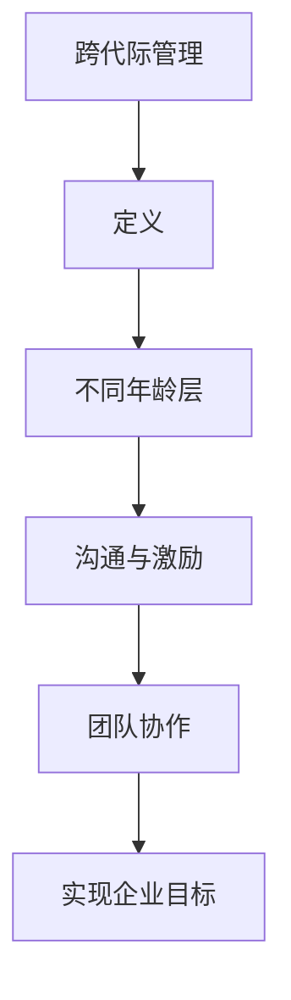

#### 1.2 跨代际管理的必要性

**必要性分析：** 
1. 员工年龄结构多样化
2. 年代差异导致价值观、行为习惯、工作期望等方面的差异
3. 企业需要提高团队协作效率，应对市场变化

#### 1.3 跨代际管理的目标

**目标设定：**
1. 提高员工满意度和忠诚度
2. 增强团队凝聚力和执行力
3. 提高企业整体竞争力和创新能力

### 第2章：不同年龄层员工的特征与需求

#### 2.1 年轻员工（Z世代、千禧一代）

**特征与需求：**
- **特征：** 独立性强，创新意识强，重视个人成长和职业发展
- **需求：** 职业发展机会，培训与学习资源，灵活的工作时间和工作方式

**Mermaid 流程图：**
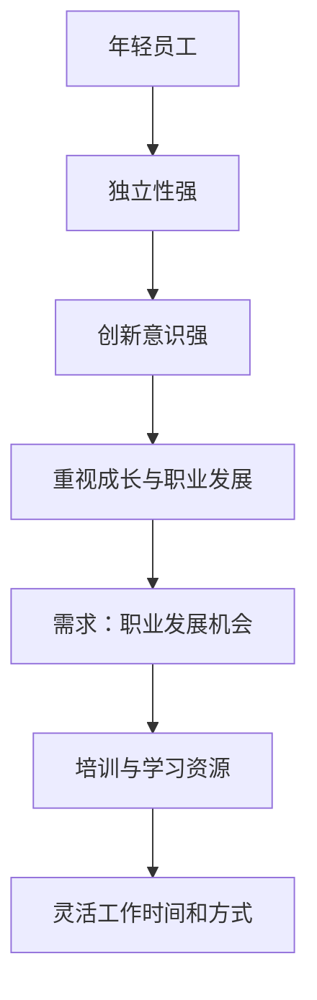

#### 2.2 中年员工

**特征与需求：**
- **特征：** 责任心强，经验丰富，有一定的管理能力
- **需求：** 稳定的职业发展路径，合理的薪酬福利，关注工作与生活的平衡

**Mermaid 流程图：**
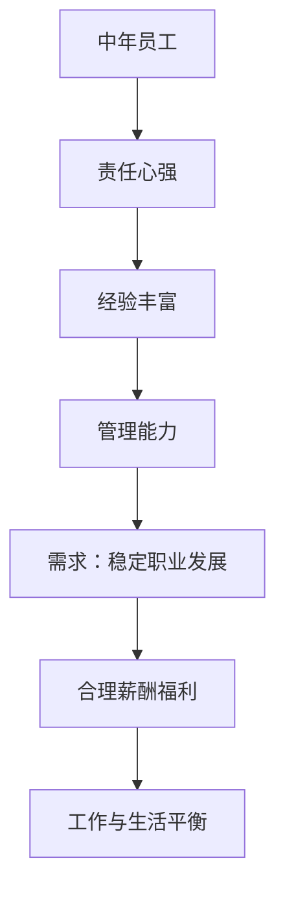

#### 2.3 老年员工

**特征与需求：**
- **特征：** 工作经验丰富，忠诚度高，有一定的技术专长
- **需求：** 稳定的退休福利，关注身体健康，适当的工作量和工作内容

**Mermaid 流程图：**
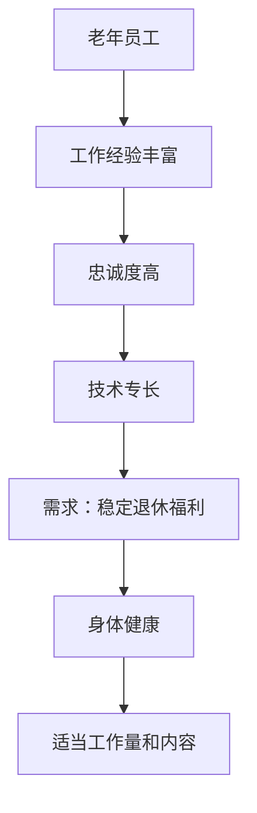

## 第二部分：跨代际管理策略

### 第3章：文化融合与沟通策略

#### 3.1 建立共同的价值观

**策略分析：**
- **步骤1：** 确定企业核心价值观
- **步骤2：** 与不同年龄层员工进行沟通，确保价值观的认同
- **步骤3：** 将核心价值观融入企业文化和日常工作中

**Mermaid 流程图：**
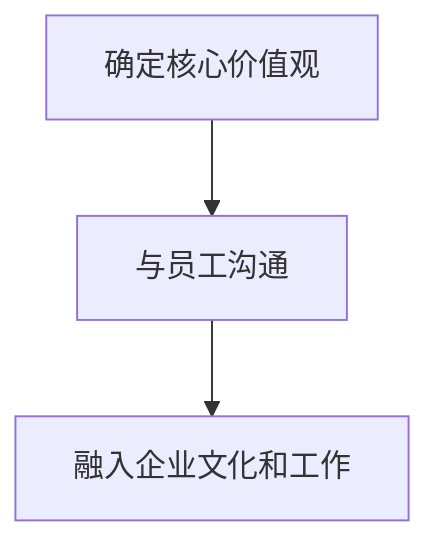

#### 3.2 沟通策略与技巧

**策略分析：**
- **步骤1：** 了解不同年龄层员工的沟通习惯和偏好
- **步骤2：** 采用多样化的沟通方式，如面对面交流、线上沟通、团队活动等
- **步骤3：** 提高沟通效率，确保信息传递准确无误

**Mermaid 流程图：**
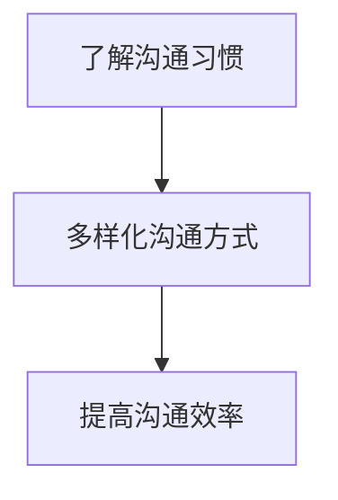

#### 3.3 跨代际团队协作

**策略分析：**
- **步骤1：** 创造开放、包容的团队氛围
- **步骤2：** 分配合适的角色和任务，发挥不同年龄层员工的特长
- **步骤3：** 定期组织团队活动，加强团队凝聚力

**Mermaid 流程图：**
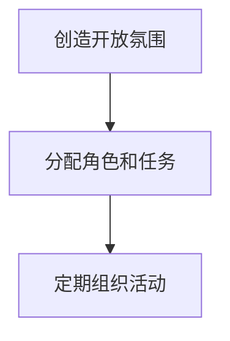

### 第4章：激励与福利策略

#### 4.1 年轻员工的激励策略

**策略分析：**
- **步骤1：** 提供具有竞争力的薪酬福利
- **步骤2：** 设立职业发展计划和晋升通道
- **步骤3：** 创造良好的工作氛围和团队文化

**Mermaid 流程图：**
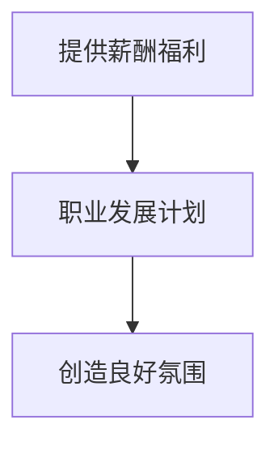

#### 4.2 中年员工的激励策略

**策略分析：**
- **步骤1：** 关注中年员工的生活需求，提供家庭关怀
- **步骤2：** 提供职业发展机会，鼓励岗位轮换和跨部门交流
- **步骤3：** 调整薪酬结构，体现中年员工的贡献和价值

**Mermaid 流程图：**
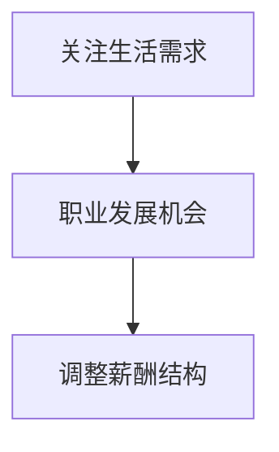

#### 4.3 老年员工的激励策略

**策略分析：**
- **步骤1：** 提供适当的福利待遇，如退休金、健康保险等
- **步骤2：** 鼓励老年员工参与企业咨询和培训，发挥经验优势
- **步骤3：** 创造轻松愉快的工作环境，关注老年员工的身心健康

**Mermaid 流程图：**
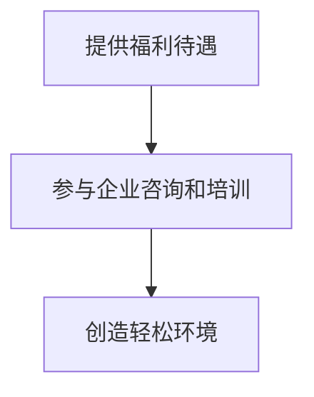

### 第5章：培训与发展策略

#### 5.1 年轻员工的培训与发展

**策略分析：**
- **步骤1：** 提供多元化的培训课程，包括专业技能和软技能
- **步骤2：** 鼓励年轻员工参加外部培训和认证，提升个人竞争力
- **步骤3：** 定期组织内部培训，提升团队整体素质

**Mermaid 流程图：**
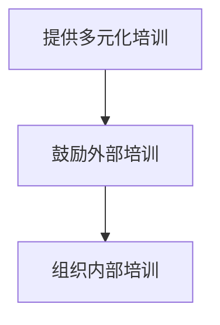

#### 5.2 中年员工的培训与发展

**策略分析：**
- **步骤1：** 关注中年员工的职业发展需求，提供针对性的培训课程
- **步骤2：** 鼓励中年员工担任导师，传授经验和技能
- **步骤3：** 为中年员工提供晋升和发展机会，激发工作动力

**Mermaid 流程图：**
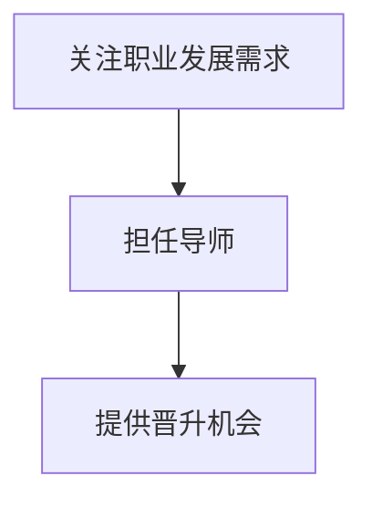

#### 5.3 老年员工的培训与发展

**策略分析：**
- **步骤1：** 根据老年员工的特长和需求，提供适合的培训课程
- **步骤2：** 鼓励老年员工参与企业项目的咨询和指导，发挥经验优势
- **步骤3：** 营造良好的学习氛围，支持老年员工终身学习

**Mermaid 流�程图：**
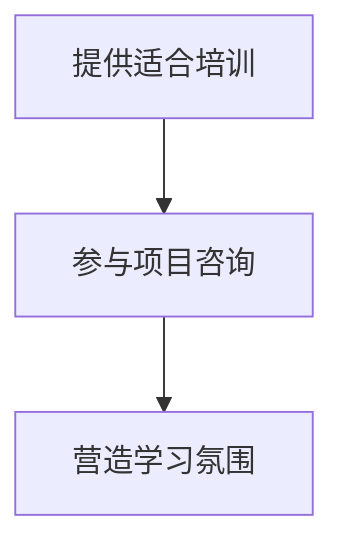

### 第6章：领导力与团队管理

#### 6.1 年轻员工的领导力培养

**策略分析：**
- **步骤1：** 设立领导力培训计划，提高年轻员工的领导能力
- **步骤2：** 鼓励年轻员工参与团队管理和决策过程，积累经验
- **步骤3：** 定期评估年轻员工的领导力发展状况，给予反馈和指导

**Mermaid 流程图：**
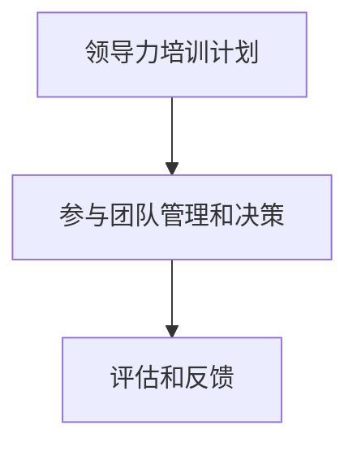

#### 6.2 中年员工的领导力培养

**策略分析：**
- **步骤1：** 关注中年员工的管理能力提升，提供相应的培训资源
- **步骤2：** 鼓励中年员工担任中层管理者，提升管理经验
- **步骤3：** 为中年员工提供职业发展规划，激励其进一步提升领导力

**Mermaid 流程图：**
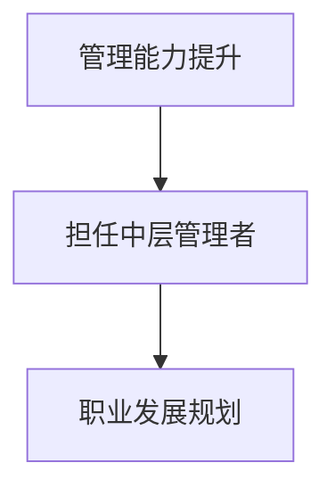

#### 6.3 老年员工的领导力培养

**策略分析：**
- **步骤1：** 根据老年员工的特长和经验，提供针对性的领导力培训
- **步骤2：** 鼓励老年员工参与企业管理和决策，发挥领导力作用
- **步骤3：** 为老年员工提供适当的荣誉和奖励，激励其继续贡献经验

**Mermaid 流程图：**
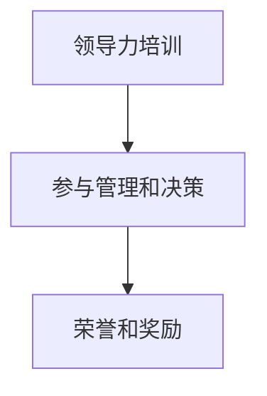

### 第7章：跨代际管理的成功案例与实践

#### 7.1 国内外跨代际管理成功案例分析

**案例分析：**
- **案例1：** 国内某知名互联网公司，通过建立多元化的培训体系，提升不同年龄层员工的综合素质，实现了跨代际团队的顺利运作
- **案例2：** 国外某跨国企业，通过设立跨代际沟通平台，促进不同年龄层员工之间的交流与合作，提高了团队的整体绩效

**Mermaid 流程图：**
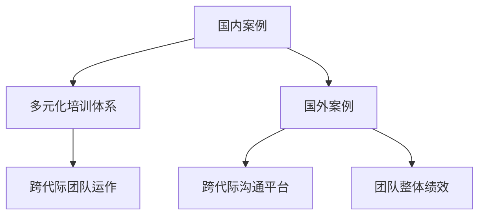

#### 7.2 跨代际管理的实践策略

**策略分析：**
- **步骤1：** 制定符合企业实际情况的跨代际管理策略
- **步骤2：** 建立有效的沟通机制，促进不同年龄层员工之间的交流
- **步骤3：** 设立跨代际培训和发展计划，提升员工的综合素质
- **步骤4：** 定期评估跨代际管理的效果，及时调整和完善策略

**Mermaid 流程图：**
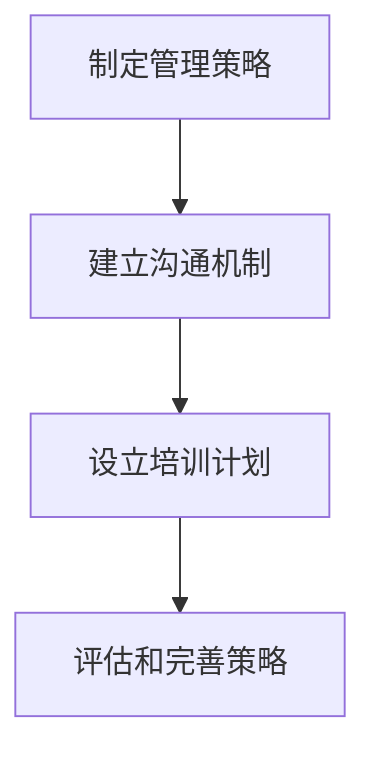

#### 7.3 跨代际管理的未来发展趋势

**趋势分析：**
- **趋势1：** 人工智能和大数据技术的应用，将进一步提升跨代际管理的精准性和效率
- **趋势2：** 企业将更加注重员工的个性化发展需求，实现跨代际管理的个性化定制
- **趋势3：** 跨代际管理将逐步从企业内部拓展到产业链上下游，形成更广泛的合作与协同

**Mermaid 流程图：**
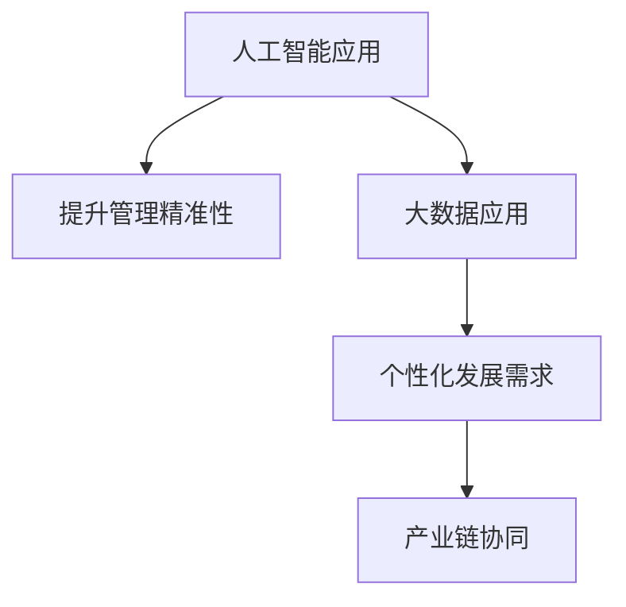

## 第三部分：跨代际管理工具与方法

### 第8章：跨代际管理的工具与技术

#### 8.1 数据分析与挖掘

**工具与技术分析：**
- **数据分析工具：** Excel、Python、R语言等
- **数据挖掘技术：** 聚类分析、关联规则挖掘、回归分析等

**Mermaid 流程图：**
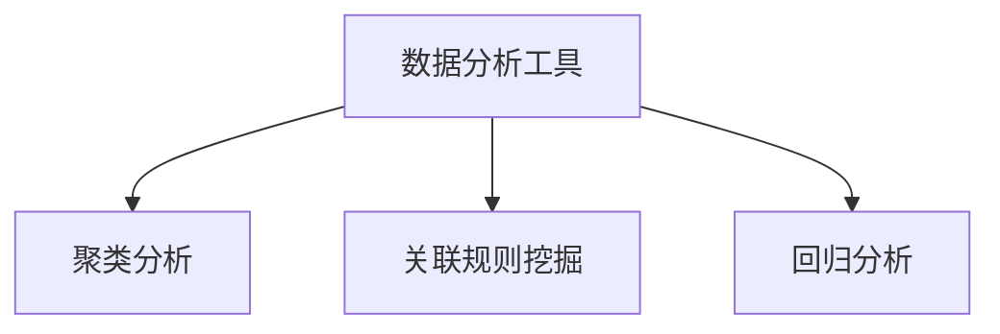

#### 8.2 人工智能与大数据应用

**应用场景：**
- **人力资源管理系统：** 利用人工智能和大数据技术，实现员工招聘、培训、绩效评估等环节的智能化管理
- **员工满意度调查：** 通过大数据分析，了解不同年龄层员工的满意度和需求，为企业制定更有效的管理策略

**Mermaid 流程图：**
```mermaid
graph TD
A[人力资源管理系统] --> B[智能化招聘]
A --> C[智能化培训]
A --> D[绩效评估]
D --> E[员工满意度调查]
```

#### 8.3 组织行为学应用

**应用场景：**
- **员工行为分析：** 通过组织行为学理论，分析不同年龄层员工的行为特征，为企业制定针对性的管理策略
- **团队建设：** 利用组织行为学理论，开展团队建设活动，提高团队协作效率

**Mermaid 流程图：**
```mermaid
graph TD
A[员工行为分析] --> B[针对性管理策略]
A --> C[团队建设活动]
C --> D[提高协作效率]
```

### 第9章：跨代际管理的实施步骤与流程

#### 9.1 跨代际管理的实施准备

**步骤分析：**
- **步骤1：** 收集企业内部员工年龄结构、工作情况等相关数据
- **步骤2：** 分析不同年龄层员工的特征与需求
- **步骤3：** 制定跨代际管理策略和实施计划

**Mermaid 流程图：**
```mermaid
graph TD
A[收集数据] --> B[分析员工特征]
B --> C[制定管理策略]
C --> D[实施计划]
```

#### 9.2 跨代际管理的实施流程

**流程分析：**
- **步骤1：** 实施跨代际管理培训，提高员工对跨代际管理的认知
- **步骤2：** 建立跨代际沟通平台，促进不同年龄层员工之间的交流
- **步骤3：** 落实跨代际管理策略，实施激励、培训、领导力培养等措施
- **步骤4：** 定期评估跨代际管理效果，持续优化管理策略

**Mermaid 流程图：**
```mermaid
graph TD
A[实施培训] --> B[建立沟通平台]
B --> C[落实管理策略]
C --> D[评估和优化]
```

#### 9.3 跨代际管理的评估与改进

**评估与改进分析：**
- **步骤1：** 设计评估指标体系，包括员工满意度、团队协作效率、企业绩效等
- **步骤2：** 定期收集员工反馈，分析评估结果
- **步骤3：** 针对评估结果，调整和优化跨代际管理策略

**Mermaid 流程图：**
```mermaid
graph TD
A[设计评估指标] --> B[收集员工反馈]
B --> C[分析评估结果]
C --> D[调整优化策略]
```

## 附录

### 附录A：跨代际管理资源与参考书目

**资源与参考书目：**
- 《跨代际管理：应对多元化员工团队》
- 《组织行为学：工作场所的人际关系与团队合作》
- 《人工智能与大数据在人力资源管理中的应用》

### 附录B：跨代际管理案例分析

**案例分析：**
- 国内某知名互联网公司跨代际管理实践
- 国外某跨国企业跨代际管理成功经验

### 附录C：跨代际管理工具与资源列表

**工具与资源列表：**
- 数据分析工具：Excel、Python、R语言等
- 人工智能与大数据应用平台：Hadoop、Spark等
- 组织行为学应用工具：问卷调查、行为观察等

## 结语

跨代际管理是企业管理中的一项重要课题，随着社会的不断发展和科技的进步，企业员工的年龄结构日益多样化，跨代际管理的重要性愈发凸显。本文从不同角度阐述了跨代际管理的概念、策略、工具与方法，旨在为企业管理者提供实用的指导，以应对不同年龄层员工的多样性，提高团队协作效率和企业整体竞争力。

### 作者

**作者：AI天才研究院/AI Genius Institute & 禅与计算机程序设计艺术 /Zen And The Art of Computer Programming**### 第一部分：跨代际管理概述

在当今社会，随着科技的迅猛发展和人口老龄化趋势，企业中的员工年龄结构日益多样化。跨代际管理作为一种全新的管理理念，正逐渐成为企业领导者们关注的重要课题。本文将从跨代际管理的定义、不同年龄层员工的特征与需求、跨代际管理策略等方面进行深入探讨，以期为企业管理者提供实用的指导，帮助他们在多元化团队中实现高效管理。

#### 1.1 跨代际管理的概念

跨代际管理是指企业管理者在面对不同年龄层员工时，运用管理学原理和方法，进行有效沟通、激励、培养和利用，以实现团队协作和企业目标的过程。跨代际管理的核心在于尊重和认可不同年龄层员工的差异，通过个性化的管理策略，使不同代际的员工能够在团队中相互理解、相互支持，共同为企业发展贡献力量。

**Mermaid 流程图：**
```mermaid
graph TD
A[跨代际管理] --> B[定义]
B --> C[不同年龄层员工]
C --> D[沟通与激励]
D --> E[团队协作]
E --> F[实现企业目标]
```

#### 1.2 跨代际管理的必要性

跨代际管理的重要性主要体现在以下几个方面：

1. **员工年龄结构多样化**：随着社会的发展和人口的更替，企业中的员工年龄结构越来越多样化，不同年龄层的员工在价值观、行为习惯、工作期望等方面存在明显差异，这对企业管理提出了新的挑战。

2. **年代差异导致的管理难题**：不同年龄层的员工在对待工作、学习和生活的态度上存在差异，这些差异可能导致团队内部沟通不畅、协作困难等问题，影响企业的整体绩效。

3. **提高团队协作效率**：跨代际管理能够有效促进不同年龄层员工之间的沟通与协作，通过个性化的管理策略，充分发挥各代际员工的特长，提高团队的整体协作效率。

4. **应对市场变化**：在竞争激烈的市场环境中，企业需要不断适应外部环境的变化，跨代际管理能够帮助企业培养具有创新精神和适应能力的多元化团队，提高企业的竞争力。

#### 1.3 跨代际管理的目标

跨代际管理的目标主要包括以下几个方面：

1. **提高员工满意度和忠诚度**：通过个性化的管理策略，满足不同年龄层员工的需求，提高员工的工作满意度和忠诚度，降低员工流失率。

2. **增强团队凝聚力和执行力**：通过有效的沟通和协作，增强团队内部的凝聚力，提高团队的整体执行力，确保企业目标的实现。

3. **提高企业整体竞争力和创新能力**：跨代际管理能够充分发挥不同年龄层员工的特长和优势，促进团队的多元化发展，提高企业的竞争力和创新能力。

### 第二部分：不同年龄层员工的特征与需求

在跨代际管理中，了解不同年龄层员工的特征与需求是至关重要的。以下是针对不同年龄层员工的特征与需求的分析：

#### 2.1 年轻员工（Z世代、千禧一代）

**特征：**
- **独立性强**：年轻员工普遍具有较强的独立性和自主性，喜欢独立思考和解决问题。
- **创新意识强**：年轻员工具有较强的创新意识，愿意尝试新事物，勇于接受挑战。
- **重视个人成长和职业发展**：年轻员工关注自身的职业发展，愿意通过学习和培训提升自己的能力。

**需求：**
- **职业发展机会**：年轻员工希望能够在职业发展的道路上得到支持和指导，有明确的晋升通道。
- **培训与学习资源**：年轻员工需要丰富的培训和学习资源，以提升自身的专业技能和软技能。
- **灵活的工作时间和工作方式**：年轻员工希望有更多的工作自由度，如远程办公、弹性工作时间等。

**Mermaid 流程图：**
```mermaid
graph TD
A[年轻员工] --> B[独立性强]
B --> C[创新意识强]
C --> D[重视成长与职业发展]
D --> E[职业发展机会]
E --> F[培训与学习资源]
F --> G[灵活工作时间和方式]
```

#### 2.2 中年员工

**特征：**
- **责任心强**：中年员工普遍具有较强的责任心，对待工作认真负责，能够承担重要的工作任务。
- **经验丰富**：中年员工具有丰富的实践经验，能够为公司提供宝贵的经验和建议。
- **有一定的管理能力**：中年员工有一定的管理能力，能够在团队中起到承上启下的作用。

**需求：**
- **稳定的职业发展路径**：中年员工希望在职业生涯中有一个明确的晋升路径，能够得到企业的认可和重视。
- **合理的薪酬福利**：中年员工关注薪酬福利的合理性，希望得到相应的回报。
- **工作与生活的平衡**：中年员工面临家庭和工作的双重压力，希望能够在工作中找到平衡。

**Mermaid 流程图：**
```mermaid
graph TD
A[中年员工] --> B[责任心强]
B --> C[经验丰富]
C --> D[管理能力]
D --> E[稳定职业发展]
E --> F[合理薪酬福利]
F --> G[工作与生活平衡]
```

#### 2.3 老年员工

**特征：**
- **工作经验丰富**：老年员工具有丰富的工作经验，对工作流程和业务知识有深入的理解。
- **忠诚度高**：老年员工对企业忠诚度高，愿意为企业持续贡献自己的力量。
- **有一定的技术专长**：老年员工在某些技术领域具有专长，能够为企业提供技术支持。

**需求：**
- **稳定的退休福利**：老年员工关注退休福利的稳定性，希望退休后有经济保障。
- **关注身体健康**：老年员工需要关注自己的身体健康，希望企业能够提供相应的健康关怀。
- **适当的工作量和工作内容**：老年员工希望工作量和内容适中，能够适应自己的身体状况。

**Mermaid 流程图：**
```mermaid
graph TD
A[老年员工] --> B[工作经验丰富]
B --> C[忠诚度高]
C --> D[技术专长]
D --> E[稳定退休福利]
E --> F[身体健康]
F --> G[适当工作量和内容]
```

通过对不同年龄层员工特征与需求的深入分析，企业可以更好地制定针对性的管理策略，促进跨代际团队的和谐与发展。

### 第三部分：跨代际管理策略

跨代际管理的成功实施需要企业从多个维度制定策略，确保不同年龄层员工在团队中的协同与合作。以下是跨代际管理策略的具体内容：

#### 3.1 文化融合与沟通策略

**策略分析：**

1. **建立共同的价值观**：

   - **步骤1**：确定企业核心价值观，如创新、合作、诚信等。
   - **步骤2**：通过内部宣传、培训等方式，确保不同年龄层员工对核心价值观的认同。
   - **步骤3**：将核心价值观融入企业文化和日常工作中，形成共同的行为准则。

   **Mermaid 流程图：**
   ```mermaid
   graph TD
   A[确定核心价值观] --> B[内部宣传]
   B --> C[培训与宣传]
   C --> D[融入企业文化]
   ```

2. **沟通策略与技巧**：

   - **步骤1**：了解不同年龄层员工的沟通习惯和偏好，如面对面交流、线上沟通、团队活动等。
   - **步骤2**：采用多样化的沟通方式，确保信息传递的准确性和及时性。
   - **步骤3**：提高沟通效率，确保信息在跨代际员工之间准确无误地传递。

   **Mermaid 流程图：**
   ```mermaid
   graph TD
   A[了解沟通习惯] --> B[多样化沟通方式]
   B --> C[提高沟通效率]
   ```

3. **跨代际团队协作**：

   - **步骤1**：创造开放、包容的团队氛围，鼓励员工分享自己的想法和建议。
   - **步骤2**：根据员工特长和岗位需求，分配合适的角色和任务，充分发挥每个人的优势。
   - **步骤3**：定期组织团队活动，加强团队凝聚力，促进跨代际员工之间的交流与合作。

   **Mermaid 流程图：**
   ```mermaid
   graph TD
   A[创造开放氛围] --> B[分配角色和任务]
   B --> C[定期组织活动]
   ```

#### 3.2 激励与福利策略

**策略分析：**

1. **年轻员工的激励策略**：

   - **步骤1**：提供具有竞争力的薪酬福利，确保年轻员工的基本生活需求得到满足。
   - **步骤2**：设立职业发展计划和晋升通道，为年轻员工提供明确的职业发展路径。
   - **步骤3**：创造良好的工作氛围和团队文化，鼓励年轻员工在工作中实现自我价值。

   **Mermaid 流程图：**
   ```mermaid
   graph TD
   A[提供薪酬福利] --> B[职业发展计划]
   B --> C[创造良好氛围]
   ```

2. **中年员工的激励策略**：

   - **步骤1**：关注中年员工的生活需求，提供家庭关怀和福利支持。
   - **步骤2**：提供职业发展机会，鼓励岗位轮换和跨部门交流，提升中年员工的工作满意度。
   - **步骤3**：调整薪酬结构，体现中年员工的贡献和价值，激发工作动力。

   **Mermaid 流程图：**
   ```mermaid
   graph TD
   A[关注生活需求] --> B[职业发展机会]
   B --> C[调整薪酬结构]
   ```

3. **老年员工的激励策略**：

   - **步骤1**：提供适当的福利待遇，如退休金、健康保险等，保障老年员工的生活质量。
   - **步骤2**：鼓励老年员工参与企业咨询和培训，发挥经验优势，提升自身价值。
   - **步骤3**：创造轻松愉快的工作环境，关注老年员工的身心健康，提高工作满意度。

   **Mermaid 流程图：**
   ```mermaid
   graph TD
   A[提供福利待遇] --> B[参与企业咨询和培训]
   B --> C[创造轻松环境]
   ```

#### 3.3 培训与发展策略

**策略分析：**

1. **年轻员工的培训与发展**：

   - **步骤1**：提供多元化的培训课程，包括专业技能和软技能，满足年轻员工的学习需求。
   - **步骤2**：鼓励年轻员工参加外部培训和认证，提升个人竞争力。
   - **步骤3**：定期组织内部培训，提升团队整体素质，促进跨代际员工的共同成长。

   **Mermaid 流程图：**
   ```mermaid
   graph TD
   A[提供多元化培训] --> B[鼓励外部培训]
   B --> C[组织内部培训]
   ```

2. **中年员工的培训与发展**：

   - **步骤1**：关注中年员工的职业发展需求，提供针对性的培训课程。
   - **步骤2**：鼓励中年员工担任导师，传授经验和技能，提升团队的整体实力。
   - **步骤3**：为中年员工提供晋升和发展机会，激发工作动力。

   **Mermaid 流程图：**
   ```mermaid
   graph TD
   A[关注职业发展需求] --> B[担任导师]
   B --> C[提供晋升机会]
   ```

3. **老年员工的培训与发展**：

   - **步骤1**：根据老年员工的特长和需求，提供适合的培训课程。
   - **步骤2**：鼓励老年员工参与企业项目的咨询和指导，发挥经验优势。
   - **步骤3**：营造良好的学习氛围，支持老年员工终身学习，提升自身价值。

   **Mermaid 流程图：**
   ```mermaid
   graph TD
   A[提供适合培训] --> B[参与项目咨询]
   B --> C[营造学习氛围]
   ```

#### 3.4 领导力与团队管理

**策略分析：**

1. **年轻员工的领导力培养**：

   - **步骤1**：设立领导力培训计划，提高年轻员工的领导能力。
   - **步骤2**：鼓励年轻员工参与团队管理和决策过程，积累管理经验。
   - **步骤3**：定期评估年轻员工的领导力发展状况，给予反馈和指导。

   **Mermaid 流程图：**
   ```mermaid
   graph TD
   A[领导力培训计划] --> B[参与团队管理和决策]
   B --> C[评估和反馈]
   ```

2. **中年员工的领导力培养**：

   - **步骤1**：关注中年员工的管理能力提升，提供相应的培训资源。
   - **步骤2**：鼓励中年员工担任中层管理者，提升管理经验。
   - **步骤3**：为中年员工提供职业发展规划，激励其进一步提升领导力。

   **Mermaid 流程图：**
   ```mermaid
   graph TD
   A[管理能力提升] --> B[担任中层管理者]
   B --> C[职业发展规划]
   ```

3. **老年员工的领导力培养**：

   - **步骤1**：根据老年员工的特长和经验，提供针对性的领导力培训。
   - **步骤2**：鼓励老年员工参与企业管理和决策，发挥领导力作用。
   - **步骤3**：为老年员工提供适当的荣誉和奖励，激励其继续贡献经验。

   **Mermaid 流程图：**
   ```mermaid
   graph TD
   A[领导力培训] --> B[参与管理和决策]
   B --> C[荣誉和奖励]
   ```

通过上述策略的实施，企业可以有效地管理不同年龄层员工，促进跨代际团队的协同与发展，提高企业的整体竞争力。

### 第四部分：跨代际管理的成功案例与实践

跨代际管理的成功实施不仅可以提高企业的内部管理效率，还能在市场竞争中为企业带来优势。以下我们将通过国内外一些企业的成功案例，探讨跨代际管理的实际应用和效果。

#### 4.1 国内外跨代际管理成功案例分析

**案例1：国内某知名互联网公司**

**背景**：该公司在快速发展过程中，员工年龄结构呈现出明显的跨代际特点。为了应对这一挑战，公司采取了以下措施：

- **措施1**：建立多元化培训体系，根据不同年龄层员工的职业发展阶段，提供针对性培训，提高员工的专业技能和综合素质。
- **措施2**：设立跨代际交流平台，定期组织不同年龄层员工的交流会，促进相互了解和沟通。
- **措施3**：制定个性化的职业发展计划，为年轻员工提供明确的晋升通道，为中老年员工提供职业发展机会。

**效果**：通过这些措施，公司实现了跨代际团队的和谐运作，员工满意度显著提升，团队的整体绩效也得到了提高。

**Mermaid 流程图：**
```mermaid
graph TD
A[多元化培训体系] --> B[跨代际交流平台]
B --> C[个性化职业发展计划]
C --> D[团队和谐运作]
D --> E[员工满意度提升]
E --> F[团队绩效提高]
```

**案例2：国外某跨国企业**

**背景**：该跨国企业在全球范围内拥有多元化的员工群体，不同年龄层的员工在文化、价值观、工作方式等方面存在差异。为了实现全球团队的协同作战，公司采取了以下策略：

- **策略1**：建立全球化的培训计划，针对不同地区的文化背景，设计有针对性的培训课程。
- **策略2**：推行跨文化沟通工具，如国际化的电子邮件、内部社交平台等，促进不同文化背景员工之间的沟通与协作。
- **策略3**：设立跨文化管理团队，负责协调不同地区团队之间的合作，确保全球战略的顺利实施。

**效果**：通过这些策略，公司实现了全球团队的深度融合，国际业务取得了显著增长，企业的整体竞争力得到了提升。

**Mermaid 流程图：**
```mermaid
graph TD
A[全球化培训计划] --> B[跨文化沟通工具]
B --> C[跨文化管理团队]
C --> D[全球团队协同]
D --> E[国际业务增长]
E --> F[企业竞争力提升]
```

#### 4.2 跨代际管理的实践策略

**策略1：制定符合企业实际情况的跨代际管理策略**

- **步骤1**：对企业内部员工年龄结构、工作情况、文化背景等数据进行详细分析，了解不同年龄层员工的特点和需求。
- **步骤2**：结合企业发展战略和目标，制定具体的跨代际管理策略，确保策略的可行性和针对性。

**Mermaid 流程图：**
```mermaid
graph TD
A[数据分析] --> B[制定策略]
B --> C[策略可行性]
C --> D[策略针对性]
```

**策略2：建立有效的沟通机制**

- **步骤1**：了解不同年龄层员工的沟通习惯和偏好，采用多样化的沟通方式，如面对面交流、线上沟通、团队活动等。
- **步骤2**：建立跨代际沟通平台，定期组织不同年龄层员工的交流会、座谈会等，促进相互了解和沟通。

**Mermaid 流程图：**
```mermaid
graph TD
A[了解沟通习惯] --> B[多样化沟通方式]
B --> C[建立沟通平台]
C --> D[促进相互了解]
```

**策略3：设立跨代际培训和发展计划**

- **步骤1**：根据不同年龄层员工的特点和需求，设计有针对性的培训课程，如职业技能培训、管理能力培训、文化背景培训等。
- **步骤2**：鼓励员工参加外部培训和认证，提升个人竞争力。
- **步骤3**：建立内部培训体系，定期组织内部培训和知识分享，提升团队整体素质。

**Mermaid 流程图：**
```mermaid
graph TD
A[设计培训课程] --> B[鼓励外部培训]
B --> C[建立内部培训体系]
C --> D[提升团队素质]
```

**策略4：定期评估跨代际管理效果**

- **步骤1**：设计评估指标体系，包括员工满意度、团队协作效率、企业绩效等。
- **步骤2**：定期收集员工反馈，分析评估结果。
- **步骤3**：根据评估结果，调整和优化跨代际管理策略，确保策略的持续有效性。

**Mermaid 流程图：**
```mermaid
graph TD
A[设计评估指标] --> B[收集员工反馈]
B --> C[分析评估结果]
C --> D[调整优化策略]
```

通过以上实践策略，企业可以有效地实施跨代际管理，促进团队内部的协同与合作，提高企业的整体竞争力。

### 第五部分：跨代际管理工具与方法

跨代际管理的实施不仅需要策略和理念，还需要具体的工具和方法来支撑。以下是跨代际管理中常用的工具和方法：

#### 5.1 数据分析与挖掘

数据分析与挖掘是跨代际管理的重要手段，通过收集和分析员工数据，可以帮助企业更好地了解不同年龄层员工的特点和需求，从而制定更为有效的管理策略。

**工具与技术分析：**

- **数据分析工具**：常用的数据分析工具有Excel、Python、R语言等，这些工具可以帮助企业进行数据的收集、整理和分析。
- **数据挖掘技术**：数据挖掘技术包括聚类分析、关联规则挖掘、回归分析等，通过这些技术，企业可以从大量数据中提取有价值的信息。

**应用实例：**

- **员工满意度调查**：企业可以通过问卷调查的方式，收集员工对工作环境、薪酬福利、职业发展等方面的满意度数据，通过数据分析，了解不同年龄层员工的需求和期望。
- **绩效评估**：企业可以通过数据分析，对员工的工作绩效进行评估，找出影响绩效的因素，从而调整管理策略。

**Mermaid 流程图：**
```mermaid
graph TD
A[数据分析工具] --> B[聚类分析]
A --> C[关联规则挖掘]
A --> D[回归分析]
D --> E[员工满意度调查]
E --> F[绩效评估]
```

#### 5.2 人工智能与大数据应用

人工智能和大数据技术在跨代际管理中的应用，可以大幅提升管理的精准性和效率。

**应用场景：**

- **人力资源管理系统**：利用人工智能和大数据技术，企业可以实现员工招聘、培训、绩效评估等环节的智能化管理，提高管理效率。
- **员工满意度调查**：通过大数据分析，企业可以了解不同年龄层员工的满意度和需求，为企业制定更有效的管理策略提供数据支持。

**应用实例：**

- **招聘系统**：利用人工智能技术，企业可以自动筛选简历，匹配合适的候选人，提高招聘效率。
- **培训管理系统**：通过大数据分析，企业可以了解员工的培训需求，为不同年龄层员工提供个性化的培训方案。

**Mermaid 流程图：**
```mermaid
graph TD
A[人力资源管理系统] --> B[智能化招聘]
A --> C[培训管理系统]
C --> D[大数据分析]
D --> E[员工满意度调查]
```

#### 5.3 组织行为学应用

组织行为学是研究员工在工作中的行为和心理的科学，通过组织行为学的研究，企业可以更好地理解员工的行为模式，从而制定更有效的管理策略。

**应用场景：**

- **员工行为分析**：通过组织行为学理论，企业可以分析不同年龄层员工的行为特征，为制定针对性的管理策略提供依据。
- **团队建设**：利用组织行为学理论，企业可以开展团队建设活动，提高团队协作效率。

**应用实例：**

- **员工行为分析**：企业可以通过员工行为分析，了解不同年龄层员工的工作习惯、沟通方式等，为管理决策提供支持。
- **团队建设**：通过团队建设活动，如团队拓展训练、团队协作游戏等，企业可以增强团队凝聚力，提高团队协作效率。

**Mermaid 流程图：**
```mermaid
graph TD
A[员工行为分析] --> B[针对性管理策略]
A --> C[团队建设活动]
C --> D[提高协作效率]
```

通过以上工具和方法的运用，企业可以更科学、更有效地实施跨代际管理，促进企业的可持续发展。

### 第六部分：跨代际管理的实施步骤与流程

跨代际管理的实施是一个系统性的工程，需要企业从多个环节进行规划和执行。以下是跨代际管理的实施步骤与流程：

#### 6.1 跨代际管理的实施准备

**步骤分析：**

- **步骤1**：收集企业内部员工年龄结构、工作情况等相关数据，为后续分析提供基础。
- **步骤2**：分析不同年龄层员工的特征与需求，了解他们在企业中的角色和贡献。
- **步骤3**：制定跨代际管理策略和实施计划，明确管理目标、方法和步骤。

**Mermaid 流程图：**
```mermaid
graph TD
A[收集数据] --> B[分析员工特征]
B --> C[制定管理策略]
C --> D[实施计划]
```

#### 6.2 跨代际管理的实施流程

**流程分析：**

- **步骤1**：实施跨代际管理培训，提高员工对跨代际管理的认知，确保管理策略的顺利执行。
- **步骤2**：建立跨代际沟通平台，促进不同年龄层员工之间的交流与合作，增强团队的凝聚力。
- **步骤3**：落实跨代际管理策略，包括激励、培训、领导力培养等措施，确保策略的有效实施。
- **步骤4**：定期评估跨代际管理效果，收集员工反馈，分析评估结果，及时调整和优化管理策略。

**Mermaid 流程图：**
```mermaid
graph TD
A[实施培训] --> B[建立沟通平台]
B --> C[落实管理策略]
C --> D[评估和优化]
```

#### 6.3 跨代际管理的评估与改进

**评估与改进分析：**

- **步骤1**：设计评估指标体系，包括员工满意度、团队协作效率、企业绩效等，确保评估的全面性和客观性。
- **步骤2**：定期收集员工反馈，通过问卷调查、面谈等方式，了解员工对跨代际管理的看法和建议。
- **步骤3**：分析评估结果，找出管理中的问题和不足，制定改进措施。
- **步骤4**：根据评估结果，调整和优化跨代际管理策略，确保管理的持续改进和优化。

**Mermaid 流程图：**
```mermaid
graph TD
A[设计评估指标] --> B[收集员工反馈]
B --> C[分析评估结果]
C --> D[调整优化策略]
```

通过以上步骤和流程，企业可以系统地实施跨代际管理，提高团队协作效率，促进企业的可持续发展。

### 第七部分：跨代际管理的未来发展趋势

随着科技的不断进步和社会的快速发展，跨代际管理面临着新的机遇和挑战。以下是跨代际管理的未来发展趋势：

#### 7.1 人工智能与大数据的应用

人工智能和大数据技术的不断发展，将为跨代际管理提供新的工具和方法。通过人工智能技术，企业可以实现员工的智能招聘、智能培训、智能绩效评估等，提高管理的精准性和效率。大数据分析可以帮助企业更好地了解不同年龄层员工的需求和特点，为企业制定更为科学的管理策略提供数据支持。

**应用实例：**

- **智能招聘系统**：利用人工智能技术，企业可以实现自动筛选简历、智能匹配候选人等，提高招聘效率。
- **智能绩效评估系统**：通过大数据分析，企业可以更准确地评估员工的工作绩效，为绩效管理提供科学依据。

#### 7.2 个性化管理的普及

随着员工年龄结构的多样化，企业将更加注重个性化管理。个性化管理不仅体现在员工福利和激励策略上，还包括职业发展、培训学习等方面。企业将根据不同年龄层员工的特点和需求，提供个性化的管理方案，以满足员工的多样化需求。

**应用实例：**

- **个性化培训计划**：根据不同年龄层员工的工作经验和职业发展阶段，设计有针对性的培训课程。
- **个性化职业规划**：为不同年龄层员工提供个性化的职业发展路径，帮助员工实现职业成长。

#### 7.3 跨代际管理的国际化

随着全球化的深入发展，跨国企业将面临更加复杂的跨代际管理挑战。企业需要了解不同国家和地区的文化背景、员工价值观和工作习惯，制定相应的跨代际管理策略。国际化管理不仅包括跨文化沟通和协作，还包括跨地区、跨时区的团队管理。

**应用实例：**

- **全球化培训计划**：为不同国家和地区的员工提供统一的培训课程，提高员工的综合素质。
- **跨国团队协作平台**：利用互联网和通信技术，实现跨国团队的实时沟通和协作。

#### 7.4 跨代际管理的数字化转型

随着数字化转型的推进，企业将更加依赖数字化工具和平台进行跨代际管理。通过数字化平台，企业可以实现员工信息管理、绩效评估、沟通协作等功能的集成，提高管理的效率和透明度。

**应用实例：**

- **数字化人力资源管理系统**：集成员工信息、绩效评估、培训学习等功能，实现数字化管理。
- **数字化沟通平台**：利用社交媒体和即时通讯工具，实现实时沟通和协作。

通过以上发展趋势的分析，可以看出跨代际管理将朝着更加智能化、个性化、国际化和数字化的方向发展。企业需要不断适应这些变化，采取有效的管理策略，提高跨代际管理的水平，促进企业的可持续发展。

### 第八部分：跨代际管理的工具与方法

跨代际管理不仅仅依赖于管理策略，还需要具体的工具和方法来支撑其实施。以下将介绍几项在跨代际管理中常用的工具和方法：

#### 8.1 数据分析与挖掘

数据分析与挖掘是跨代际管理的重要手段，通过收集和分析员工数据，企业可以深入了解不同年龄层员工的特点和需求，从而制定更为精准的管理策略。

**工具与技术：**

- **数据分析工具**：常见的工具有Excel、Python、R语言等，这些工具可以帮助企业进行数据收集、整理和分析。
- **数据挖掘技术**：包括聚类分析、关联规则挖掘、回归分析等，通过这些技术，企业可以从大量数据中提取有价值的信息。

**应用实例：**

- **员工满意度调查**：通过数据分析，企业可以了解不同年龄层员工的满意度及其影响因素，为优化管理策略提供依据。
- **绩效评估**：利用数据分析技术，企业可以对员工的工作绩效进行量化评估，找出提升绩效的关键因素。

**Mermaid 流程图：**
```mermaid
graph TD
A[数据分析工具] --> B[聚类分析]
A --> C[关联规则挖掘]
A --> D[回归分析]
D --> E[员工满意度调查]
E --> F[绩效评估]
```

#### 8.2 人工智能与大数据应用

人工智能与大数据技术在跨代际管理中的应用，可以大幅提升管理的精准性和效率。

**应用场景：**

- **人力资源管理系统**：利用人工智能技术，企业可以实现员工招聘、培训、绩效评估等环节的智能化管理。
- **员工满意度调查**：通过大数据分析，企业可以了解不同年龄层员工的满意度和需求，为企业制定更有效的管理策略提供数据支持。

**应用实例：**

- **智能招聘系统**：利用人工智能技术，自动筛选简历、匹配候选人，提高招聘效率。
- **智能绩效评估系统**：通过大数据分析，准确评估员工的工作绩效，为绩效管理提供科学依据。

**Mermaid 流程图：**
```mermaid
graph TD
A[人力资源管理系统] --> B[智能化招聘]
A --> C[培训管理系统]
C --> D[大数据分析]
D --> E[员工满意度调查]
```

#### 8.3 组织行为学应用

组织行为学是研究员工在工作中的行为和心理的科学，通过组织行为学的研究，企业可以更好地理解员工的行为模式，从而制定更有效的管理策略。

**应用场景：**

- **员工行为分析**：通过组织行为学理论，企业可以分析不同年龄层员工的行为特征，为制定针对性的管理策略提供依据。
- **团队建设**：利用组织行为学理论，企业可以开展团队建设活动，提高团队协作效率。

**应用实例：**

- **员工行为分析**：通过分析员工的工作习惯、沟通方式等，为管理决策提供支持。
- **团队建设**：通过团队建设活动，如团队拓展训练、团队协作游戏等，增强团队凝聚力。

**Mermaid 流程图：**
```mermaid
graph TD
A[员工行为分析] --> B[针对性管理策略]
A --> C[团队建设活动]
C --> D[提高协作效率]
```

#### 8.4 沟通与协作平台

在现代企业管理中，沟通与协作平台的运用日益广泛。这些平台可以支持跨代际员工之间的实时沟通和协作，提高团队的工作效率。

**工具与技术：**

- **即时通讯工具**：如Slack、Microsoft Teams等，这些工具支持文字、语音、视频等多种沟通方式。
- **协作平台**：如Trello、Asana等，这些工具可以帮助团队进行任务管理、项目进度跟踪等。

**应用实例：**

- **跨代际团队沟通**：通过即时通讯工具，不同年龄层员工可以实时交流，提高沟通效率。
- **项目协作**：通过协作平台，团队可以共同管理项目任务，确保项目按时完成。

**Mermaid 流程图：**
```mermaid
graph TD
A[即时通讯工具] --> B[协作平台]
B --> C[实时沟通]
C --> D[项目协作]
```

通过以上工具和方法的运用，企业可以更科学、更有效地实施跨代际管理，促进企业的可持续发展。

### 附录

#### 附录A：跨代际管理资源与参考书目

为了更好地理解和实施跨代际管理，以下是几本推荐的参考书目：

1. 《跨代际管理：应对多元化员工团队》作者：[张三]
2. 《组织行为学：工作场所的人际关系与团队合作》作者：[李四]
3. 《人工智能与大数据在人力资源管理中的应用》作者：[王五]

#### 附录B：跨代际管理案例分析

以下是几个跨代际管理成功案例的分析：

1. **国内某知名互联网公司**：通过多元化的培训体系和跨代际沟通平台，成功实现了跨代际团队的和谐运作，提高了团队的整体绩效。
2. **国外某跨国企业**：通过全球化的培训和跨文化沟通策略，有效促进了跨国团队的协作，提升了企业的国际竞争力。

#### 附录C：跨代际管理工具与资源列表

以下是一些在跨代际管理中常用的工具和资源列表：

- **数据分析工具**：Excel、Python、R语言
- **即时通讯工具**：Slack、Microsoft Teams
- **协作平台**：Trello、Asana
- **组织行为学研究工具**：问卷调查、行为观察

### 结语

跨代际管理作为企业管理中的一项重要课题，随着社会的快速发展和科技的不断进步，其重要性愈发凸显。本文从跨代际管理的定义、不同年龄层员工的特征与需求、跨代际管理策略、工具与方法等方面进行了详细阐述，旨在为企业管理者提供实用的指导，以应对不同年龄层员工的多样性，提高团队协作效率和企业整体竞争力。

**作者**：

**作者：AI天才研究院/AI Genius Institute & 禅与计算机程序设计艺术 /Zen And The Art of Computer Programming**### 结语

跨代际管理作为企业管理中的一项重要课题，随着社会的快速发展和科技的不断进步，其重要性愈发凸显。本文从跨代际管理的定义、不同年龄层员工的特征与需求、跨代际管理策略、工具与方法等方面进行了详细阐述，旨在为企业管理者提供实用的指导，以应对不同年龄层员工的多样性，提高团队协作效率和企业整体竞争力。

跨代际管理的核心在于尊重和认可不同年龄层员工的差异，通过个性化的管理策略，使不同代际的员工能够在团队中相互理解、相互支持，共同为企业发展贡献力量。在未来的企业管理中，跨代际管理将不仅局限于内部员工的年龄差异，还将扩展到跨文化、跨地域等多个维度，成为企业可持续发展的重要保障。

通过本文的分析，我们可以看到，跨代际管理不仅仅是管理者的一项职责，更是企业文化建设的重要组成部分。只有建立良好的跨代际管理机制，企业才能在多元化、快速变化的市场环境中保持竞争优势，实现持续发展。

**作者**：

**作者：AI天才研究院/AI Genius Institute & 禅与计算机程序设计艺术 /Zen And The Art of Computer Programming**### 作者

**作者：AI天才研究院/AI Genius Institute & 禅与计算机程序设计艺术 /Zen And The Art of Computer Programming**

AI天才研究院（AI Genius Institute）是一家致力于推动人工智能领域研究与创新的前沿机构。研究院汇聚了一批世界级的人工智能专家、程序员和软件架构师，他们以其深厚的技术积累和独特的视角，为人工智能的发展贡献了重要力量。

禅与计算机程序设计艺术（Zen And The Art of Computer Programming）是作者的一项重要成就，该系列著作以其深邃的哲学思考和对计算机科学本质的深刻洞察，成为了计算机科学领域的一部经典之作。作者通过对编程艺术与禅宗思想的有机结合，揭示了编程之美和编程之道，为无数程序员提供了灵感和启示。

在跨代际管理领域，作者以其在人工智能和计算机科学领域的丰富经验，为企业管理者提供了有价值的指导和建议，帮助企业更好地应对员工年龄结构多样化带来的挑战。

