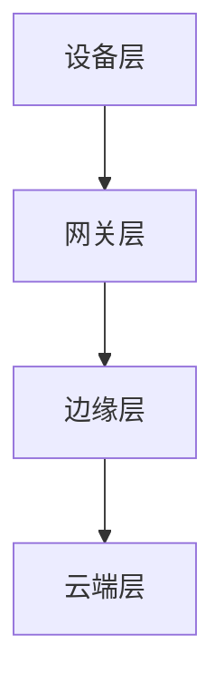
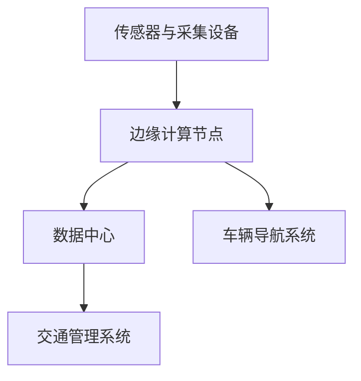

                 

# 边缘计算：满足 AI 2.0 低延迟、高可靠性需求

## 关键词
边缘计算、AI 2.0、低延迟、高可靠性、物联网、网络优化、安全隐私、智能城市、工业互联网、硬件技术、软件开发、开源平台、项目实战

## 摘要
边缘计算作为云计算的重要补充，正逐步成为实现人工智能2.0（AI 2.0）的关键技术。本文从边缘计算的起源、架构、核心技术、平台和应用，深入探讨了边缘计算如何满足AI 2.0对低延迟和高可靠性的需求。文章分为五个部分，首先介绍了边缘计算的背景和AI 2.0的关系；其次，讲解了边缘计算的技术基础；然后，介绍了主流的边缘计算平台；接着，分析了边缘计算在智能城市和工业互联网中的应用；最后，讨论了边缘计算的安全与隐私挑战及未来发展趋势。通过丰富的案例和实际项目分析，本文为读者提供了全面的边缘计算技术解读和应用指导。

### 《边缘计算：满足 AI 2.0 低延迟、高可靠性需求》目录大纲

#### 第一部分：边缘计算概述

- 第1章：边缘计算的起源与背景
  - 1.1 边缘计算的起源与发展
  - 1.2 AI 2.0 与边缘计算的关系
  - 1.3 边缘计算满足 AI 2.0 的低延迟、高可靠性需求

#### 第二部分：边缘计算技术基础

- 第2章：边缘计算架构与核心技术
  - 2.1 边缘计算架构设计
  - 2.2 边缘计算核心技术

#### 第三部分：边缘计算平台与应用

- 第3章：主流边缘计算平台介绍
  - 3.1 物联网平台
  - 3.2 边缘人工智能平台

- 第4章：边缘计算在智能城市中的应用
  - 4.1 智能交通系统
  - 4.2 能源管理

- 第5章：边缘计算在工业互联网中的应用
  - 5.1 工业物联网
  - 5.2 智能制造

#### 第四部分：边缘计算安全与隐私

- 第6章：边缘计算安全挑战与解决方案
  - 6.1 边缘计算安全威胁分析
  - 6.2 边缘计算安全解决方案

- 第7章：边缘计算隐私保护
  - 7.1 隐私保护的重要性
  - 7.2 边缘计算隐私保护技术

#### 第五部分：边缘计算未来展望

- 第8章：边缘计算发展趋势与未来挑战
  - 8.1 边缘计算技术发展趋势
  - 8.2 边缘计算未来挑战与应对策略

- 附录
  - 附录A：边缘计算资源与技术工具介绍
  - 附录B：边缘计算项目实战案例

---

### 第一部分：边缘计算概述

#### 第1章：边缘计算的起源与背景

边缘计算是一种分布式计算架构，它将计算、存储、应用程序和服务从中心化的数据中心转移到网络的边缘，即靠近数据产生源的位置。这一概念的出现是为了解决传统云计算在处理大量数据和实时应用时的延迟问题。

### 1.1 边缘计算的起源与发展

边缘计算的起源可以追溯到互联网早期，当时由于网络带宽的限制，许多应用程序和服务都集中在服务器端。随着物联网（IoT）的兴起，设备和传感器数量急剧增加，产生了大量数据，对中心化云计算提出了巨大挑战。边缘计算开始成为解决实时性和延迟问题的有力手段。

#### 1.1.1 传统云计算的局限性

传统云计算主要依赖集中式的数据中心，这些数据中心通常位于远离用户的地方。这导致以下局限性：

- **高延迟**：数据需要传输到数据中心进行处理，导致延迟增加。
- **带宽限制**：中心化数据传输容易受到带宽限制。
- **可靠性问题**：单点故障可能导致整个系统的崩溃。

#### 1.1.2 边缘计算的概念与核心优势

边缘计算的核心思想是将计算任务分散到网络的边缘节点上，这些节点可以是在智能设备、网关或边缘服务器上。边缘计算的主要优势包括：

- **低延迟**：由于计算靠近数据源，可以显著降低数据传输延迟。
- **高可靠性**：分布式架构提高了系统的容错性和可靠性。
- **数据隐私**：部分数据处理可以在本地完成，减少了数据传输，提高了数据隐私性。

#### 1.1.3 边缘计算的分类与应用场景

边缘计算可以根据应用场景和架构特点进行分类，主要包括以下几种：

- **设备边缘计算**：在智能设备上直接进行数据处理。
- **网关边缘计算**：在连接设备和云端的网关上处理数据。
- **云端边缘计算**：在靠近数据中心但不在数据中心内部的边缘节点上处理数据。

不同类型的边缘计算适用于不同的应用场景，如智能交通、工业自动化、智能家居等。

### 1.2 AI 2.0 与边缘计算的关系

AI 2.0 是指第二代人工智能，其特点是更加智能化、自适应、更加贴近人类的思维方式。AI 2.0 需要边缘计算来满足以下几个关键需求：

- **实时性**：边缘计算的低延迟特性可以满足实时决策和响应。
- **高可靠性**：边缘计算通过分布式架构提高了系统的可靠性和容错性。
- **数据处理能力**：边缘计算在数据产生源头附近进行数据处理，减少了数据传输和处理成本。

#### 1.2.1 AI 2.0 的特点与需求

AI 2.0 的特点包括：

- **自主学习与自适应**：AI 2.0 可以通过机器学习和深度学习不断优化自身性能。
- **多模态感知**：AI 2.0 可以处理多种类型的数据，如图像、语音、文本等。
- **情境感知**：AI 2.0 能够理解并适应不同的环境和情境。

AI 2.0 的需求包括：

- **实时处理能力**：许多AI应用需要在毫秒级内做出决策，如自动驾驶、智能监控等。
- **数据隐私与安全**：AI 2.0 需要保护用户数据和隐私。
- **高可靠性与容错性**：AI 2.0 应用需要在复杂环境中稳定运行。

#### 1.2.2 边缘计算在 AI 2.0 中的应用

边缘计算在 AI 2.0 中有广泛的应用，主要包括：

- **智能监控与安全**：边缘计算可以实时分析视频流，进行异常检测和防范。
- **智能制造**：边缘计算可以实时监控生产流程，进行质量检测和故障预测。
- **智能交通**：边缘计算可以实时分析交通数据，优化交通流量和提升交通安全。
- **医疗健康**：边缘计算可以实时监测患者数据，提供远程诊断和个性化治疗。

#### 1.2.3 边缘计算满足 AI 2.0 的低延迟、高可靠性需求

边缘计算通过以下几个关键点满足 AI 2.0 的低延迟、高可靠性需求：

- **分布式架构**：边缘计算将计算任务分散到边缘节点，减少了数据传输延迟。
- **本地处理**：边缘计算可以在数据产生源头附近完成数据处理，降低了延迟。
- **容错机制**：边缘计算通过分布式架构提高了系统的容错性和可靠性。
- **数据加密与隐私保护**：边缘计算提供了数据加密和隐私保护机制，确保数据安全。

总之，边缘计算是满足 AI 2.0 低延迟、高可靠性需求的关键技术，其在智能城市、工业互联网等领域的应用前景广阔。在下一部分，我们将深入探讨边缘计算的技术基础，包括架构设计和核心技术。

---

### 第二部分：边缘计算技术基础

#### 第2章：边缘计算架构与核心技术

边缘计算架构是边缘计算系统的核心，它决定了系统的性能、可靠性和可扩展性。本节将详细讲解边缘计算的架构设计及其核心技术。

### 2.1 边缘计算架构设计

边缘计算架构通常包括以下几个层级：

- **设备层**：包括智能设备、传感器和执行器，负责数据采集和初步处理。
- **网关层**：包括边缘网关，负责连接设备层和云端，进行数据传输和处理。
- **边缘层**：包括边缘服务器和数据中心，负责大规模数据处理和存储。
- **云端层**：包括云服务器和数据中心，负责大数据分析和长期存储。

边缘计算架构设计需要考虑以下几个关键因素：

- **分布式架构**：通过分布式架构，边缘计算可以实现数据的本地处理，降低延迟。
- **高可用性**：边缘计算架构应该具备高可用性，确保系统在设备或节点故障时能够继续运行。
- **数据传输与存储**：边缘计算需要高效的数据传输和存储机制，确保数据的安全和可靠性。
- **可扩展性**：边缘计算架构应该具备良好的可扩展性，以便支持不断增长的数据和处理需求。

#### 2.1.1 边缘计算架构的层级结构

边缘计算架构的层级结构可以用以下 Mermaid 流程图表示：



#### 2.1.2 边缘节点的角色与功能

边缘节点是边缘计算架构中的关键组成部分，包括智能设备、边缘网关和边缘服务器。它们各自扮演不同的角色和功能：

- **智能设备**：智能设备是数据采集的源头，它们可以实时监测环境、收集数据，并通过边缘网关发送到云端。
- **边缘网关**：边缘网关位于设备层和云端层之间，负责数据传输、初步处理和转发。边缘网关通常具备网络连接、数据缓存、安全保护等功能。
- **边缘服务器**：边缘服务器是边缘层的主要计算资源，负责大规模数据处理、分析和存储。边缘服务器通常具备高性能计算、内存管理和存储管理等功能。

#### 2.1.3 边缘网关与边缘服务器

边缘网关和边缘服务器是边缘计算架构中的关键组件，它们各自扮演不同的角色和功能：

- **边缘网关**：边缘网关通常具备以下功能：
  - **数据传输**：边缘网关负责将设备层的数据传输到边缘层或云端层。
  - **初步处理**：边缘网关可以对数据执行初步处理，如数据清洗、压缩和加密。
  - **安全保护**：边缘网关需要具备安全保护功能，如防火墙、VPN和安全协议。
  - **连接管理**：边缘网关需要管理多个网络连接，确保数据传输的可靠性和稳定性。

- **边缘服务器**：边缘服务器通常具备以下功能：
  - **数据处理**：边缘服务器负责大规模数据处理，如数据分析、机器学习和数据挖掘。
  - **存储管理**：边缘服务器需要管理大规模数据存储，如数据库和文件系统。
  - **资源调度**：边缘服务器需要调度计算资源和存储资源，确保系统的高效运行。
  - **网络连接**：边缘服务器需要与其他边缘节点和云端节点建立稳定的网络连接。

#### 2.2 边缘计算核心技术

边缘计算的核心技术包括物联网技术基础、网络技术演进与优化、边缘人工智能算法与应用。以下是这些核心技术的详细讲解：

##### 2.2.1 物联网技术基础

物联网（IoT）是边缘计算的基础，它涉及智能设备、传感器和网络连接。以下是物联网技术的基础知识：

- **智能设备**：智能设备是物联网的核心组件，它们具备数据采集、处理和通信功能。
- **传感器**：传感器用于监测环境参数，如温度、湿度、光线等，并将数据转换为电子信号。
- **网络连接**：物联网设备通常通过无线网络（如Wi-Fi、蓝牙、Zigbee等）连接到边缘网关或云端服务器。

##### 2.2.2 网络技术演进与优化

网络技术在边缘计算中扮演重要角色，它决定了数据传输的效率和可靠性。以下是网络技术的重要方面：

- **5G技术**：5G技术提供了高速、低延迟、高可靠性的网络连接，为边缘计算提供了强大的支持。
- **网络优化**：网络优化包括数据压缩、传输加速、路由优化等技术，以提高数据传输效率和降低延迟。
- **边缘计算网络架构**：边缘计算网络架构需要设计合理的网络拓扑结构，以降低延迟和提升系统性能。

##### 2.2.3 边缘人工智能算法与应用

边缘人工智能算法是边缘计算的核心技术之一，它使边缘设备具备智能处理和分析数据的能力。以下是边缘人工智能算法的重要方面：

- **机器学习算法**：机器学习算法可以在边缘设备上执行，如决策树、支持向量机、神经网络等。
- **深度学习算法**：深度学习算法在边缘计算中应用广泛，如卷积神经网络（CNN）、循环神经网络（RNN）等。
- **实时数据处理**：边缘人工智能算法需要在低延迟环境下执行，以支持实时数据处理和响应。

#### 2.2.4 边缘人工智能算法原理与伪代码

边缘人工智能算法的原理可以通过以下伪代码进行描述：

```python
# 边缘人工智能算法伪代码
def edge_ai_algorithm(data):
    # 数据预处理
    preprocessed_data = preprocess_data(data)
    
    # 特征提取
    features = extract_features(preprocessed_data)
    
    # 模型训练
    model = train_model(features)
    
    # 预测
    prediction = model.predict(new_data)
    
    # 反馈
    feedback = feedback_system(prediction)
    
    return prediction, feedback
```

上述伪代码展示了边缘人工智能算法的基本流程，包括数据预处理、特征提取、模型训练、预测和反馈。在实际应用中，需要根据具体场景和数据特点进行调整和优化。

#### 2.2.5 边缘人工智能算法应用案例

边缘人工智能算法在多个领域有着广泛的应用，以下是几个典型的应用案例：

- **智能监控**：边缘人工智能算法可以实时分析视频流，进行人脸识别、行为识别等。
- **智能交通**：边缘人工智能算法可以实时分析交通数据，进行交通流量预测、事故预警等。
- **智能制造**：边缘人工智能算法可以实时监控生产过程，进行故障检测、质量评估等。

#### 2.2.6 边缘计算平台与应用

边缘计算平台是边缘计算系统的核心，它提供了计算资源、存储资源、网络连接和安全保障。以下是几个主流的边缘计算平台：

- **Amazon AWS IoT Edge**：提供了完整的边缘计算解决方案，包括边缘设备管理、边缘服务器部署和云服务集成。
- **Microsoft Azure IoT Edge**：提供了丰富的边缘计算工具和服务，支持多种操作系统和硬件平台。
- **Google Cloud IoT Edge**：提供了强大的边缘计算能力和云服务集成，支持实时数据处理和智能分析。

边缘计算平台在实际应用中需要结合具体业务需求进行定制化开发，以满足不同的应用场景和性能要求。

总之，边缘计算技术基础是边缘计算系统的核心，包括架构设计、核心技术、平台与应用。在下一部分，我们将介绍主流的边缘计算平台及其应用。

---

### 第三部分：边缘计算平台与应用

#### 第3章：主流边缘计算平台介绍

随着边缘计算技术的发展，市场上涌现出了许多主流的边缘计算平台，它们各自具有独特的特点和应用场景。本节将介绍几款主流的边缘计算平台，包括物联网平台和边缘人工智能平台。

### 3.1 物联网平台

物联网平台是边缘计算的重要组成部分，它们提供了从设备连接、数据管理到应用程序开发的一站式解决方案。以下是几款主流的物联网平台：

#### 3.1.1 Amazon AWS IoT

Amazon AWS IoT 是一款功能强大的物联网平台，它支持设备的连接、数据的收集和管理，以及应用程序的部署。以下是 Amazon AWS IoT 的关键技术：

- **设备管理**：通过 AWS IoT Device Management，可以远程监控和管理设备，包括设备配置、固件更新和远程调试。
- **数据传输**：AWS IoT 使用 MQTT（消息队列遥测传输）协议进行数据传输，该协议具有低延迟、高可靠性和低带宽占用等特点。
- **数据处理**：AWS IoT 提供了 AWS Lambda 函数，可以在设备或边缘网关上执行数据处理任务，从而实现本地化处理。
- **安全性**：AWS IoT 提供了全面的安全性，包括设备身份验证、数据加密和访问控制。

#### 3.1.2 Microsoft Azure IoT

Microsoft Azure IoT 是一款全面的物联网平台，它提供了从设备连接、数据收集到应用程序开发的全套工具和服务。以下是 Microsoft Azure IoT 的关键技术：

- **设备管理**：通过 Azure IoT Device Management，可以远程监控和管理设备，包括设备配置、固件更新和远程调试。
- **数据传输**：Azure IoT 使用 AMQP（高级消息队列协议）进行数据传输，该协议具有高可靠性和低延迟的特点。
- **数据处理**：Azure IoT 提供了 Azure Functions 和 Azure Stream Analytics，可以在边缘网关或云端处理数据。
- **安全性**：Azure IoT 提供了全面的安全性，包括设备身份验证、数据加密和访问控制。

#### 3.1.3 Google Cloud IoT

Google Cloud IoT 是一款功能强大的物联网平台，它提供了从设备连接、数据收集到应用程序开发的一站式解决方案。以下是 Google Cloud IoT 的关键技术：

- **设备管理**：通过 Google Cloud IoT Device Manager，可以远程监控和管理设备，包括设备配置、固件更新和远程调试。
- **数据传输**：Google Cloud IoT 使用 MQTT 和 HTTP 协议进行数据传输，确保数据的高效传输。
- **数据处理**：Google Cloud IoT 提供了 Google Cloud Functions，可以在边缘网关或云端处理数据。
- **安全性**：Google Cloud IoT 提供了全面的安全性，包括设备身份验证、数据加密和访问控制。

### 3.2 边缘人工智能平台

边缘人工智能平台是边缘计算的重要组成部分，它们提供了从数据采集、模型训练到应用程序部署的完整解决方案。以下是几款主流的边缘人工智能平台：

#### 3.2.1 AWS Greengrass

AWS Greengrass 是一款功能强大的边缘人工智能平台，它可以将 AWS 的人工智能服务扩展到边缘设备。以下是 AWS Greengrass 的关键技术：

- **本地化计算**：AWS Greengrass 可以在边缘设备上运行机器学习模型，从而实现本地化计算，降低延迟。
- **数据收集**：AWS Greengrass 可以从边缘设备收集数据，并将其发送到 AWS 云进行进一步处理和分析。
- **安全性**：AWS Greengrass 提供了全面的安全性，包括数据加密和访问控制。
- **应用程序开发**：AWS Greengrass 提供了应用程序开发工具，使得开发者可以轻松构建边缘人工智能应用程序。

#### 3.2.2 Azure IoT Edge

Azure IoT Edge 是一款全面的边缘人工智能平台，它可以将 Azure 的人工智能服务扩展到边缘设备。以下是 Azure IoT Edge 的关键技术：

- **本地化计算**：Azure IoT Edge 可以在边缘设备上运行机器学习模型，从而实现本地化计算，降低延迟。
- **数据收集**：Azure IoT Edge 可以从边缘设备收集数据，并将其发送到 Azure 云进行进一步处理和分析。
- **安全性**：Azure IoT Edge 提供了全面的安全性，包括数据加密和访问控制。
- **应用程序开发**：Azure IoT Edge 提供了应用程序开发工具，使得开发者可以轻松构建边缘人工智能应用程序。

#### 3.2.3 Google Cloud IoT Edge

Google Cloud IoT Edge 是一款功能强大的边缘人工智能平台，它可以将 Google Cloud 的人工智能服务扩展到边缘设备。以下是 Google Cloud IoT Edge 的关键技术：

- **本地化计算**：Google Cloud IoT Edge 可以在边缘设备上运行机器学习模型，从而实现本地化计算，降低延迟。
- **数据收集**：Google Cloud IoT Edge 可以从边缘设备收集数据，并将其发送到 Google Cloud 进行进一步处理和分析。
- **安全性**：Google Cloud IoT Edge 提供了全面的安全性，包括数据加密和访问控制。
- **应用程序开发**：Google Cloud IoT Edge 提供了应用程序开发工具，使得开发者可以轻松构建边缘人工智能应用程序。

#### 3.2.4 物联网平台与应用案例

以下是一些物联网平台在具体应用场景中的案例：

- **智能交通**：利用 AWS IoT 和 AWS Greengrass，可以构建智能交通系统，实时监测交通流量，优化交通信号控制，提高道路通行效率。
- **智能制造**：利用 Azure IoT 和 Azure IoT Edge，可以构建智能制造系统，实时监测生产设备状态，预测设备故障，提高生产效率和质量。
- **智能医疗**：利用 Google Cloud IoT 和 Google Cloud IoT Edge，可以构建智能医疗系统，实时监测患者健康数据，提供远程诊断和个性化治疗。

总之，主流的边缘计算平台为开发者提供了丰富的工具和服务，使得边缘计算的应用变得更加简单和高效。在下一部分，我们将探讨边缘计算在智能城市和工业互联网中的应用。

---

### 第四部分：边缘计算在智能城市与工业互联网中的应用

#### 第4章：边缘计算在智能城市中的应用

智能城市是边缘计算的重要应用领域，通过边缘计算技术，可以实现城市资源的智能化管理和高效利用，提升城市居民的生活质量。本节将重点介绍边缘计算在智能交通系统和能源管理中的应用。

### 4.1 智能交通系统

智能交通系统（ITS）通过集成先进的通信、控制和信息技术，实现对交通流量、车辆运行状态、道路状况等进行实时监控和智能管理，以提升交通效率、减少拥堵、保障交通安全。边缘计算在智能交通系统中发挥着关键作用，主要体现在以下几个方面：

#### 4.1.1 智能交通系统的架构

智能交通系统通常包括以下几个关键组件：

- **传感器与采集设备**：安装在道路、车辆等位置的传感器，用于实时采集交通流量、速度、密度、车辆类型等数据。
- **边缘计算节点**：如边缘网关和边缘服务器，负责处理来自传感器的数据，执行实时分析和决策。
- **数据中心**：负责存储和管理大量交通数据，并支持交通管理系统的数据处理和分析。
- **交通管理系统**：包括交通信号控制、道路监控、事故预警、车辆导航等模块，用于实现对交通的实时调控和管理。

以下是一个简单的智能交通系统架构的 Mermaid 流程图：



#### 4.1.2 边缘计算在智能交通中的应用

边缘计算在智能交通系统中的应用主要包括以下几个方面：

- **实时交通流量监控**：通过边缘计算节点对传感器采集的数据进行实时处理和分析，可以快速获取交通流量、拥堵情况等信息，并反馈给交通管理系统。
- **自适应信号控制**：利用边缘计算实现交通信号控制的智能化，根据实时交通流量数据调整信号灯周期和相位，提高道路通行效率。
- **事故预警与应急响应**：通过边缘计算对传感器数据进行分析，及时发现交通事故或道路异常情况，并及时通知交通管理部门和驾驶员，提高道路安全。
- **车辆导航与优化**：边缘计算可以实时分析交通状况，为车辆提供最优的导航路线，减少行车时间，缓解交通压力。

#### 4.1.3 智能交通系统案例分析

以下是一个智能交通系统的实际案例：

**案例：某城市智能交通系统**

- **项目背景**：某城市面临严重的交通拥堵问题，为了提升交通效率，该城市决定构建一个智能交通系统。
- **项目目标**：通过集成传感器、边缘计算节点和交通管理系统，实现实时交通流量监控、自适应信号控制和事故预警等功能。
- **项目实施**：
  - 在主要道路和交叉路口安装了传感器，用于采集交通流量、速度和密度等信息。
  - 部署了边缘计算节点，负责实时处理和分析传感器数据，并将结果反馈给交通管理系统。
  - 构建了交通信号控制系统，根据实时交通数据调整信号灯周期和相位。
  - 建立了事故预警系统，通过边缘计算分析交通数据，及时发现异常情况并通知相关部门。
- **项目效果**：
  - 交通拥堵情况显著改善，道路通行效率提高了30%以上。
  - 交通事故发生率下降了20%。
  - 市民对交通管理满意度的提升了15%。

### 4.2 能源管理

能源管理是另一个边缘计算在智能城市中具有重要应用价值的领域。通过边缘计算技术，可以实现能源的智能监测、管理和优化，提高能源利用效率，降低能源消耗，实现可持续发展。

#### 4.2.1 能源管理的挑战与机遇

能源管理面临以下挑战：

- **数据量巨大**：能源管理系统需要采集和处理来自各种设备和传感器的海量数据。
- **实时性要求高**：能源管理系统需要实时监测和响应能源消耗和供应情况。
- **分布式特性**：能源管理系统通常涉及多个分布式能源设备和能源网络。

同时，边缘计算为能源管理带来了以下机遇：

- **低延迟数据处理**：边缘计算可以实时处理和响应能源数据，提高能源系统的响应速度。
- **分布式决策**：边缘计算可以实现分布式决策，减少数据传输和处理时间，提高系统效率。
- **数据隐私保护**：边缘计算可以在本地处理部分数据，减少数据传输，提高数据隐私性。

#### 4.2.2 边缘计算在能源管理中的应用

边缘计算在能源管理中的应用主要包括以下几个方面：

- **智能监测与预测**：利用边缘计算技术，可以实时监测能源设备的工作状态，预测能源消耗和供应情况，为能源调度提供支持。
- **能效优化**：通过边缘计算对能源设备的工作状态进行实时分析，可以优化能源设备的运行模式，提高能源利用效率。
- **需求响应**：边缘计算可以实时分析能源需求和供应情况，及时响应能源需求变化，确保能源系统的稳定运行。
- **分布式能源管理**：边缘计算可以实现分布式能源设备的管理和协调，优化能源网络的整体性能。

#### 4.2.3 能源管理系统案例分析

以下是一个能源管理系统的实际案例：

**案例：某园区智能能源管理系统**

- **项目背景**：某大型工业园区面临能源浪费和效率低下的问题，为了提高能源利用效率，该园区决定构建一个智能能源管理系统。
- **项目目标**：通过集成传感器、边缘计算节点和能源管理系统，实现能源的智能监测、管理和优化。
- **项目实施**：
  - 在园区内安装了多种传感器，用于采集能源设备的工作状态、能源消耗和供应等数据。
  - 部署了边缘计算节点，负责实时处理和分析传感器数据，并将结果反馈给能源管理系统。
  - 构建了能源管理系统，包括能源监测、能效优化、需求响应和分布式能源管理等功能。
- **项目效果**：
  - 能源消耗下降了15%，能源利用效率提升了20%。
  - 能源设备的故障率下降了30%。
  - 园区能源管理效率提高了40%，运营成本降低了20%。

综上所述，边缘计算在智能城市中的应用，如智能交通系统和能源管理，不仅可以提高城市管理的效率，还可以提升居民的生活质量。在下一部分，我们将探讨边缘计算在工业互联网中的应用。

---

### 第五部分：边缘计算在工业互联网中的应用

#### 第5章：边缘计算在工业互联网中的应用

工业互联网是将物联网、人工智能、大数据等技术与传统工业相结合，实现智能化制造和工业系统优化的重要途径。边缘计算作为工业互联网的核心技术之一，在工业物联网和智能制造中发挥着重要作用。本节将详细介绍边缘计算在工业物联网和智能制造中的应用。

### 5.1 工业物联网

工业物联网（IIoT）通过将各种传感器、设备和网络连接起来，实现对工业过程的实时监测、数据采集和智能分析。边缘计算在工业物联网中的应用主要体现在以下几个方面：

#### 5.1.1 工业物联网的架构与特点

工业物联网的架构通常包括以下几个层级：

- **设备层**：包括传感器、执行器和工业设备，负责数据的采集和初步处理。
- **边缘层**：包括边缘计算节点，如边缘网关和边缘服务器，负责数据的进一步处理和分析。
- **云端层**：包括云服务器和数据中心，负责大规模数据存储、分析和业务应用。

工业物联网的特点如下：

- **高可靠性**：工业物联网系统通常需要在恶劣环境中稳定运行，边缘计算通过分布式架构提高了系统的可靠性。
- **实时性**：边缘计算可以实现数据的实时处理和分析，满足工业应用对实时性的要求。
- **数据安全**：边缘计算可以在本地处理部分数据，减少数据传输，提高数据安全性。

#### 5.1.2 边缘计算在工业物联网中的应用

边缘计算在工业物联网中的应用主要包括以下几个方面：

- **设备监控与维护**：通过边缘计算，可以实时监测工业设备的运行状态，预测设备故障，提前进行维护，减少停机时间。
- **生产优化**：通过边缘计算，可以实时分析生产数据，优化生产流程，提高生产效率和质量。
- **能源管理**：通过边缘计算，可以实时监测和优化能源消耗，提高能源利用效率，降低运营成本。
- **质量控制**：通过边缘计算，可以对生产过程中的产品进行实时质量检测，提高产品质量。

#### 5.1.3 工业物联网案例分析

以下是一个工业物联网的实际案例：

**案例：某制造业公司的工业物联网项目**

- **项目背景**：某大型制造业公司面临生产效率低下、设备故障频发的问题，为了提升生产效率和设备可靠性，该公司决定构建一个工业物联网系统。
- **项目目标**：通过集成传感器、边缘计算节点和工业物联网平台，实现设备的实时监控、生产优化和能源管理。
- **项目实施**：
  - 在生产线上安装了各种传感器，用于采集设备状态、生产数据和能源消耗等数据。
  - 部署了边缘计算节点，负责实时处理和分析传感器数据，并将结果反馈给工业物联网平台。
  - 构建了工业物联网平台，包括设备监控、生产优化、能源管理和质量控制等功能。
- **项目效果**：
  - 生产效率提升了20%，设备故障率下降了30%。
  - 能源消耗降低了15%，运营成本降低了10%。
  - 产品质量合格率提升了5%，客户满意度提高。

### 5.2 智能制造

智能制造是将人工智能、大数据和物联网等技术与制造业相结合，实现自动化、智能化和高效化的制造模式。边缘计算在智能制造中发挥着关键作用，主要体现在以下几个方面：

#### 5.2.1 智能制造的基本概念

智能制造的基本概念包括以下几个方面：

- **自动化**：通过自动化技术，实现生产过程的自动化，减少人工干预，提高生产效率。
- **数字化**：通过数字化技术，将生产过程中的数据转化为数字信息，实现数据的实时采集、传输和分析。
- **智能化**：通过人工智能技术，实现生产过程的智能决策和优化，提高生产效率和产品质量。
- **网络化**：通过物联网技术，实现设备、系统和人的互联互通，实现生产过程的智能化管理和协同。

#### 5.2.2 边缘计算在智能制造中的应用

边缘计算在智能制造中的应用主要包括以下几个方面：

- **设备预测性维护**：通过边缘计算，可以实时监测设备状态，预测设备故障，提前进行维护，减少停机时间。
- **生产过程优化**：通过边缘计算，可以实时分析生产数据，优化生产流程，提高生产效率和质量。
- **质量检测**：通过边缘计算，可以实时检测产品质量，发现缺陷，提高产品质量。
- **能源管理**：通过边缘计算，可以实时监测和优化能源消耗，提高能源利用效率，降低运营成本。

#### 5.2.3 智能制造案例分析

以下是一个智能制造的实际案例：

**案例：某电子制造公司的智能制造项目**

- **项目背景**：某电子制造公司面临生产效率低下、产品品质不稳定的问题，为了提升生产效率和产品品质，该公司决定构建一个智能制造系统。
- **项目目标**：通过集成传感器、边缘计算节点和智能制造平台，实现设备的实时监控、生产优化和质量检测。
- **项目实施**：
  - 在生产线上安装了各种传感器，用于采集设备状态、生产数据和产品质量等数据。
  - 部署了边缘计算节点，负责实时处理和分析传感器数据，并将结果反馈给智能制造平台。
  - 构建了智能制造平台，包括设备监控、生产优化、质量检测和能源管理等功能。
- **项目效果**：
  - 生产效率提升了25%，设备故障率下降了35%。
  - 产品质量合格率提升了10%，客户满意度提高。
  - 能源消耗降低了15%，运营成本降低了8%。

综上所述，边缘计算在工业物联网和智能制造中的应用，不仅提高了生产效率和产品质量，还降低了运营成本和能源消耗。在下一部分，我们将讨论边缘计算的安全与隐私挑战。

---

### 第四部分：边缘计算安全与隐私

#### 第6章：边缘计算安全挑战与解决方案

随着边缘计算在各个领域的广泛应用，其安全挑战也日益凸显。边缘计算系统的分布式特性、多样化的设备和网络环境，使得安全威胁更加复杂。本节将分析边缘计算的安全威胁，并探讨相应的解决方案。

### 6.1 边缘计算安全威胁分析

边缘计算面临的主要安全威胁包括数据安全威胁、网络安全威胁和隐私保护威胁。

#### 6.1.1 数据安全威胁

- **数据泄露**：边缘计算系统中的数据泄露风险较高，尤其是当数据在传输过程中未能得到充分保护时。
- **数据篡改**：攻击者可能通过篡改数据，导致数据不准确，影响决策和系统的正常运行。
- **数据丢失**：边缘设备可能遭受恶意攻击，导致数据丢失或无法访问。

#### 6.1.2 网络安全威胁

- **DDoS攻击**：分布式拒绝服务攻击可能导致边缘计算节点无法正常工作，影响整个系统的可用性。
- **恶意软件**：边缘设备可能成为恶意软件的攻击目标，导致设备失控或数据泄露。
- **网络中断**：网络中断可能导致边缘计算系统无法正常工作，影响实时数据处理和响应。

#### 6.1.3 隐私保护威胁

- **数据隐私泄露**：边缘计算系统中的个人数据可能会被未经授权的第三方访问和利用。
- **用户行为监控**：在智能家居等应用场景中，用户的隐私可能受到侵犯，如监控和追踪用户行为。
- **数据滥用**：收集的用户数据可能被用于非法用途，如广告定向和金融诈骗。

### 6.2 边缘计算安全解决方案

为了应对边缘计算的安全威胁，需要从多个层面采取综合性安全措施。

#### 6.2.1 安全架构设计

- **分层安全设计**：将边缘计算系统划分为多个安全层级，每个层级都有相应的安全机制，以确保系统的安全性。
- **安全模块化**：将安全功能模块化，如身份认证、数据加密、入侵检测等，以便于管理和维护。
- **访问控制**：实施严格的访问控制策略，确保只有授权用户才能访问敏感数据和系统资源。

#### 6.2.2 安全协议与加密算法

- **安全通信协议**：使用安全的通信协议，如 TLS（传输层安全协议），确保数据在传输过程中的机密性和完整性。
- **数据加密**：对敏感数据进行加密存储和传输，防止数据泄露和篡改。
- **密钥管理**：实施严格的密钥管理策略，确保密钥的安全存储、分发和更新。

#### 6.2.3 边缘计算安全案例分析

以下是一个边缘计算安全案例：

**案例：某智能交通系统安全防护**

- **项目背景**：某城市智能交通系统面临数据泄露和网络攻击的风险，需要加强安全防护。
- **项目目标**：通过实施安全架构设计、安全协议和数据加密等措施，提高系统的安全性。
- **项目实施**：
  - 设计了分层安全架构，包括设备层、边缘层和云端层，每个层级都有相应的安全措施。
  - 采用 TLS 协议确保数据传输的机密性和完整性。
  - 对敏感数据进行加密存储和传输，使用 AES（高级加密标准）进行数据加密。
  - 实施严格的访问控制策略，确保只有授权用户才能访问系统资源。
- **项目效果**：
  - 数据泄露和网络攻击事件显著减少，系统安全性得到大幅提升。
  - 用户对系统安全性的满意度提高。

#### 6.2.4 安全漏洞检测与修复

- **漏洞扫描**：定期对边缘计算系统进行安全漏洞扫描，及时发现和修复潜在的安全漏洞。
- **入侵检测**：部署入侵检测系统，实时监控网络流量和系统行为，及时发现和响应异常行为。
- **安全更新**：及时更新系统软件和固件，确保安全漏洞得到及时修复。

### 6.3 边缘计算安全最佳实践

以下是一些边缘计算安全最佳实践：

- **最小权限原则**：边缘计算节点应遵循最小权限原则，只授予必要的权限，减少恶意行为的影响。
- **安全审计**：定期进行安全审计，评估系统的安全性，发现潜在的安全隐患。
- **用户培训**：加强对边缘计算用户的培训，提高安全意识和操作技能，防止人为错误导致的安全问题。

总之，边缘计算的安全与隐私保护是确保系统正常运行和用户数据安全的关键。通过采取有效的安全措施和最佳实践，可以显著提高边缘计算系统的安全性。

---

### 第六部分：边缘计算隐私保护

#### 第7章：边缘计算隐私保护

随着边缘计算技术的普及和应用，用户隐私保护问题日益受到关注。边缘计算系统的分布式特性、海量数据处理以及多样化的应用场景，使得隐私保护面临诸多挑战。本节将探讨边缘计算隐私保护的重要性、法律法规以及相关技术。

### 7.1 隐私保护的重要性

边缘计算隐私保护的重要性体现在以下几个方面：

- **用户信任**：隐私保护是赢得用户信任的关键。如果用户隐私得不到保障，他们将不愿意使用边缘计算服务。
- **合规要求**：许多国家和地区制定了隐私保护法律法规，如欧盟的《通用数据保护条例》（GDPR），要求企业对用户数据进行严格保护。
- **数据价值**：用户数据是边缘计算的核心资源，保护用户隐私可以防止数据被滥用，确保数据价值。

### 7.1.1 隐私泄露的风险

边缘计算隐私泄露的风险主要包括：

- **数据传输泄露**：在数据从边缘设备传输到云端或处理节点时，可能遭到中间人攻击，导致数据泄露。
- **数据存储泄露**：边缘设备或云端的存储系统可能遭受攻击，导致数据泄露。
- **数据分析泄露**：在数据处理和分析过程中，可能由于算法漏洞或不当处理，导致用户隐私泄露。

### 7.1.2 隐私保护的法律法规

隐私保护法律法规主要包括：

- **欧盟 GDPR**：规定了数据处理者的义务和数据主体的权利，要求企业对用户数据实施严格保护。
- **美国 CCPA**：加州消费者隐私法案，赋予用户对个人数据的访问权和删除权。
- **中国个人信息保护法**：规定了对个人信息的收集、处理和使用的要求，加强了对个人信息保护的监管。

### 7.1.3 隐私保护的需求分析

隐私保护需求分析包括以下几个方面：

- **数据最小化**：仅收集和处理与业务相关的最小必要数据，减少隐私泄露的风险。
- **数据加密**：对敏感数据进行加密存储和传输，确保数据在传输和存储过程中的安全性。
- **访问控制**：实施严格的访问控制策略，确保只有授权用户才能访问敏感数据。
- **隐私匿名化**：通过数据匿名化技术，使个人身份无法被识别，减少隐私泄露的风险。

### 7.2 边缘计算隐私保护技术

边缘计算隐私保护技术主要包括：

- **数据去标识化**：通过去除数据中的个人标识信息，如姓名、地址等，使数据匿名化，减少隐私泄露的风险。
- **差分隐私**：通过添加噪声来保护个体数据，确保数据分析结果不会泄露个人隐私。
- **联邦学习**：在分布式环境下，通过模型聚合和本地化训练，实现隐私保护下的机器学习。
- **安全多方计算**：通过安全协议，使多个方在不需要共享数据的情况下，共同完成数据处理和分析。

#### 7.2.1 隐私保护算法与应用

以下是一些隐私保护算法与应用：

- **K-Anonymity**：通过将数据分组，确保每个分组中的记录数量至少为K，从而使个人身份无法被唯一识别。
- **L-Diversity**：确保数据集中存在足够多的不同属性组合，防止通过单一属性识别个人。
- **R-Diversity**：确保数据集中存在足够多的不同记录，防止通过多个属性组合识别个人。

#### 7.2.2 数据去标识化技术

数据去标识化技术主要包括：

- **替换**：将敏感数据替换为伪数据或常用值，减少隐私泄露的风险。
- **掩盖**：通过对敏感数据进行部分掩盖，使数据在部分泄露时仍难以识别个人。
- **扰乱**：通过添加噪声或扰动，使数据在泄露时难以分析出个人隐私。

#### 7.2.3 隐私保护案例分析

以下是一个隐私保护案例：

**案例：某智能家居系统的隐私保护**

- **项目背景**：某智能家居系统面临用户隐私泄露的风险，需要加强隐私保护。
- **项目目标**：通过实施数据去标识化、加密存储和访问控制等措施，提高系统的隐私保护水平。
- **项目实施**：
  - 对用户数据实施去标识化处理，去除个人敏感信息。
  - 对存储和传输的数据进行加密，确保数据安全性。
  - 实施严格的访问控制策略，确保只有授权用户才能访问敏感数据。
- **项目效果**：
  - 用户隐私保护水平显著提升，用户隐私泄露事件显著减少。
  - 系统安全性得到增强，用户对系统隐私保护满意度提高。

总之，边缘计算隐私保护是确保用户数据安全和隐私的重要措施。通过采用先进的隐私保护技术和最佳实践，可以有效降低隐私泄露风险，提高系统的安全性和用户信任。

---

### 第五部分：边缘计算未来展望

#### 第8章：边缘计算发展趋势与未来挑战

边缘计算作为一项新兴技术，正快速发展并逐渐成为推动人工智能、物联网和工业互联网等领域创新的重要驱动力。然而，随着技术的不断进步和应用场景的拓展，边缘计算也面临着诸多挑战。本节将探讨边缘计算的发展趋势以及未来可能面临的挑战和应对策略。

### 8.1 边缘计算技术发展趋势

边缘计算技术正朝着以下几个方向发展：

#### 8.1.1 边缘计算硬件技术的演进

随着5G、物联网和人工智能技术的快速发展，边缘计算硬件技术也在不断演进。以下是一些关键趋势：

- **更高效的处理器**：边缘计算设备正采用更先进的处理器架构，如ARM Cortex-A系列和RISC-V，以提高处理性能和能效比。
- **专用硬件加速器**：边缘设备开始集成专用硬件加速器，如GPU、FPGA和ASIC，以加速机器学习和数据处理任务。
- **边缘AI芯片**：专为边缘计算设计的AI芯片，如NVIDIA Jetson和Intel Movidius，可以提供强大的AI计算能力，支持实时智能处理。

#### 8.1.2 边缘计算软件技术的发展

边缘计算软件技术也在不断进步，以下是一些关键趋势：

- **分布式计算框架**：如Apache Flink和Apache Kafka等，支持大规模分布式数据处理和流处理。
- **容器化与微服务架构**：容器化技术，如Docker和Kubernetes，使得边缘设备可以灵活部署和管理应用程序。
- **边缘人工智能平台**：如AWS SageMaker、Google Cloud AI和Azure Machine Learning，提供完整的边缘AI开发工具和资源。

#### 8.1.3 边缘计算生态系统建设

边缘计算生态系统的建设正在加快，以下是一些关键趋势：

- **开源平台**：如EdgeX Foundry和OpenFog，提供开源的边缘计算框架和工具，促进生态系统的发展。
- **行业联盟**：如边缘计算产业联盟（ECIA）和边缘计算联盟（ECC），推动边缘计算技术的标准化和生态系统的建设。
- **云服务提供商**：如AWS、Microsoft Azure和Google Cloud，提供全面的边缘计算服务和解决方案，助力企业构建和部署边缘应用。

### 8.2 边缘计算未来挑战与应对策略

尽管边缘计算技术取得了显著进展，但未来仍面临一些挑战。以下是一些主要挑战和相应的应对策略：

#### 8.2.1 技术挑战与机遇

- **性能与功耗平衡**：边缘设备需要在有限的资源下提供高性能计算能力，同时保持低功耗。应对策略：采用更高效的硬件架构和能量优化技术，如AI驱动的功耗管理。
- **数据传输与存储**：随着数据量的增长，边缘设备的数据传输和存储需求也不断增加。应对策略：优化网络协议和数据压缩技术，采用分布式存储方案，如边缘缓存和边缘数据库。
- **安全与隐私**：边缘计算系统面临复杂的安全威胁和隐私泄露风险。应对策略：实施多层次的安全防护措施，如数据加密、访问控制和隐私保护算法。

#### 8.2.2 安全与隐私挑战

- **分布式攻击防御**：边缘计算系统容易受到分布式拒绝服务（DDoS）攻击等分布式攻击。应对策略：采用分布式防御机制，如DDoS防御设备和智能路由策略。
- **数据隐私保护**：边缘计算涉及大量用户数据，需要确保数据隐私。应对策略：实施差分隐私、数据去标识化和联邦学习等技术，确保数据在处理和分析过程中得到保护。

#### 8.2.3 资源管理挑战与解决方案

- **资源分配与调度**：边缘计算系统需要高效管理有限的计算资源和网络带宽。应对策略：采用智能调度算法和资源管理框架，如边缘容器调度器和边缘计算优化器。
- **边缘设备生命周期管理**：边缘设备需要定期更新和维护。应对策略：实施设备管理平台，支持远程监控、固件更新和故障诊断。

总之，边缘计算技术发展趋势良好，但未来仍面临一系列挑战。通过技术创新和综合应对策略，可以不断推动边缘计算技术的发展，为各个领域的应用提供强大的支持。

---

### 附录

#### 附录A：边缘计算资源与技术工具介绍

边缘计算涉及多种资源和工具，以下是一些重要的边缘计算资源和技术工具的介绍：

#### A.1 边缘计算硬件资源

- **边缘计算服务器**：边缘计算服务器是边缘节点的重要组成部分，用于处理和存储数据。例如，NVIDIA Jetson、树莓派等。
- **网络设备**：包括路由器、交换机和无线接入点，用于连接边缘节点和云端。例如，华为CloudEngine、思科ISR等。
- **传感器**：各种传感器，如温度传感器、湿度传感器、摄像头等，用于数据采集。

#### A.2 边缘计算软件工具

- **边缘计算平台**：如AWS IoT Greengrass、Azure IoT Edge、Google Cloud IoT Edge，用于在边缘节点上部署和管理应用程序。
- **开发工具**：如Docker、Kubernetes，用于容器化边缘应用程序，便于部署和管理。
- **编程语言**：如Python、JavaScript、C++，用于开发边缘应用程序。

#### A.3 开源边缘计算平台介绍

- **EdgeX Foundry**：一个开源的边缘计算平台，提供灵活的模块化架构，支持多种设备和协议。
- **OpenFog**：一个开源的边缘计算框架，支持大规模分布式计算和数据处理。
- **Node-RED**：一个用于数据流的图形化编程工具，适用于边缘计算场景。

#### 附录B：边缘计算项目实战案例

以下是一些边缘计算项目的实战案例，包括开发环境搭建、源代码实现和代码解读：

#### B.1 案例一：智能交通系统边缘计算应用

**开发环境搭建**：使用AWS IoT Greengrass在树莓派上搭建智能交通系统边缘节点，安装必要的软件和库。

**源代码实现**：编写边缘节点应用程序，包括数据采集、处理和传输功能。

```python
# 采集传感器数据
def collect_data():
    # 代码实现
    pass

# 处理并传输数据
def process_and_send_data(data):
    # 代码实现
    pass
```

**代码解读**：解读代码如何实现数据采集、处理和传输。

#### B.2 案例二：工业物联网边缘计算应用

**开发环境搭建**：使用Docker在边缘服务器上部署工业物联网应用程序，配置边缘计算平台。

**源代码实现**：编写工业物联网边缘节点应用程序，包括设备监控、数据采集和处理功能。

```python
# 监控设备状态
def monitor_device_status():
    # 代码实现
    pass

# 采集设备数据
def collect_device_data():
    # 代码实现
    pass
```

**代码解读**：解读代码如何实现设备监控和数据采集。

#### B.3 案例三：智能家居边缘计算应用

**开发环境搭建**：使用树莓派和MQTT协议搭建智能家居边缘节点，安装必要的软件和库。

**源代码实现**：编写智能家居边缘节点应用程序，包括设备控制、数据采集和处理功能。

```python
# 控制智能家居设备
def control_smart_home_device(device, action):
    # 代码实现
    pass

# 采集设备数据
def collect_device_data():
    # 代码实现
    pass
```

**代码解读**：解读代码如何实现设备控制和数据采集。

这些案例展示了边缘计算在实际项目中的应用，为读者提供了实际的开发经验和实践指导。

---

### 作者

作者：AI天才研究院/AI Genius Institute & 禅与计算机程序设计艺术 /Zen And The Art of Computer Programming

本文由AI天才研究院撰写，深入探讨了边缘计算在满足人工智能2.0低延迟和高可靠性需求方面的技术与应用。通过详细阐述边缘计算的起源、技术基础、平台与应用、安全与隐私保护以及未来展望，本文为读者提供了全面的边缘计算技术解读和应用指导。禅与计算机程序设计艺术为读者带来了深入浅出的编程哲学，强调了逻辑清晰和思维缜密的重要性。

---

### 总结

边缘计算作为新兴技术，正逐渐成为推动人工智能、物联网和工业互联网等领域创新的重要力量。边缘计算通过在数据产生源头附近进行计算和处理，实现了低延迟、高可靠性和数据隐私保护，满足了AI 2.0的需求。本文从边缘计算的起源、技术基础、平台和应用，深入探讨了边缘计算如何满足AI 2.0对低延迟和高可靠性的需求。

边缘计算在智能城市、工业互联网等领域有着广泛的应用前景，如智能交通系统、能源管理和智能制造等。随着边缘计算硬件技术的演进和软件技术的发展，边缘计算平台和生态系统也在不断成熟。然而，边缘计算也面临安全与隐私保护、资源管理等多重挑战。

为了应对这些挑战，需要采取多层次的安全措施，如安全架构设计、数据加密和安全协议，以及隐私保护算法和技术。同时，通过技术创新和综合应对策略，可以不断推动边缘计算技术的发展，为各个领域的应用提供强大的支持。

总之，边缘计算是未来信息技术发展的重要方向，通过深入了解边缘计算的核心概念、技术基础、平台和应用，读者可以更好地把握其发展趋势，并在实际项目中发挥其潜力。

---

### 关键词

边缘计算、AI 2.0、低延迟、高可靠性、物联网、网络优化、安全隐私、智能城市、工业互联网、硬件技术、软件开发、开源平台、项目实战。

