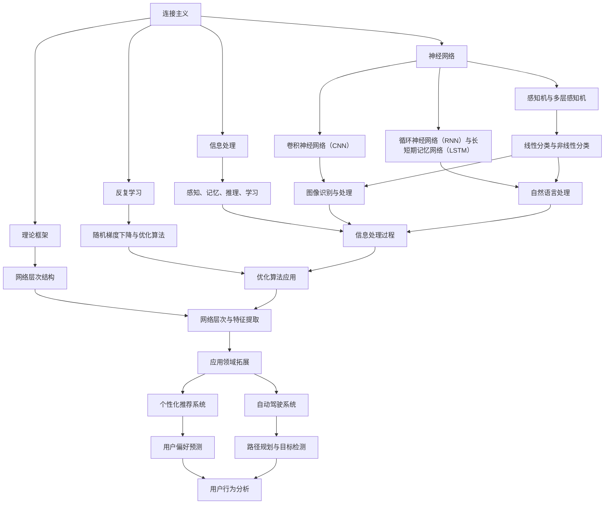

                 

### 《连接主义与行为主义的挑战》

> **关键词**：连接主义，行为主义，神经网络，强化学习，互补性，跨学科研究

> **摘要**：本文旨在深入探讨连接主义与行为主义这两种理论体系，从它们的起源、核心概念、算法原理到应用案例进行详尽解析。在此基础上，分析它们面临的挑战与机遇，探讨两种理论融合的可能性和跨学科研究的发展前景。通过本文，读者可以全面了解连接主义与行为主义的本质，以及它们在人工智能、心理学、教育等领域的实际应用和未来发展趋势。

### 《连接主义与行为主义的挑战》目录大纲

#### 第一部分：引论

##### 第1章：背景与概述

- 1.1 连接主义与行为主义的起源

- 1.2 两种理论的基本概念

- 1.3 连接主义与行为主义的发展历程

- 1.4 本书结构安排

#### 第二部分：连接主义理论解析

##### 第2章：连接主义核心概念

- 2.1 神经网络的起源与发展

- 2.2 反复学习与信息处理

- 2.3 连接主义的理论框架

- 2.4 连接主义的应用场景

##### 第3章：连接主义算法原理

- 3.1 感知机与多层感知机

- 3.2 随机梯度下降与优化算法

- 3.3 卷积神经网络（CNN）工作原理

- 3.4 循环神经网络（RNN）与长短期记忆网络（LSTM）

##### 第4章：连接主义应用案例

- 4.1 图像识别与处理

- 4.2 自然语言处理

- 4.3 推荐系统

- 4.4 自动驾驶

#### 第三部分：行为主义理论解析

##### 第5章：行为主义核心观点

- 5.1 经典条件反射

- 5.2 操作条件反射

- 5.3 自我调节与自我控制

- 5.4 行为主义在社会学习中的应用

##### 第6章：行为主义算法原理

- 6.1 强化学习基础

- 6.2 Q学习算法

- 6.3 深度强化学习

- 6.4 应用案例：游戏与模拟环境中的行为主义

##### 第7章：行为主义应用案例

- 7.1 人机交互设计

- 7.2 教育与学习策略

- 7.3 心理咨询与行为疗法

- 7.4 组织行为管理

#### 第四部分：连接主义与行为主义的挑战

##### 第8章：两种理论的互补性

- 8.1 理论融合的可能性

- 8.2 跨学科研究的发展

- 8.3 理论融合的应用前景

##### 第9章：面临的挑战与机遇

- 9.1 理论整合的困难

- 9.2 实践应用中的挑战

- 9.3 未来研究方向与展望

##### 第10章：案例研究与未来展望

- 10.1 连接主义与行为主义在心理学领域的案例研究

- 10.2 教育领域中的应用实例

- 10.3 工程领域中的整合尝试

- 10.4 未来发展趋势预测

#### 附录

##### 附录A：核心概念与联系

- **Mermaid流程图**：连接主义与行为主义理论核心概念关联图

##### 附录B：核心算法原理讲解

- **伪代码**：主要算法步骤展示与解释

##### 附录C：数学模型与数学公式

- **LaTeX格式**：主要数学公式解释与示例

##### 附录D：项目实战

- **代码案例**：实际应用中代码实现与解读

[返回顶部](# 《连接主义与行为主义的挑战》目录大纲)

---

### 背景与概述

#### 连接主义与行为主义的起源

连接主义和行为主义作为认知科学的两个重要理论基础，分别代表了不同的认知建模范式。连接主义起源于神经科学，旨在通过模拟人脑中的神经网络结构和工作原理，来理解大脑如何处理信息、学习知识和做出决策。而行为主义则源自心理学，强调通过可观察的行为来研究心理过程，主张研究者的注意力应集中在行为而非内在心理状态上。

连接主义最早可以追溯到1943年，由McCulloch和Pitts提出的神经网络模型，这一模型被视为人工神经网络的起点。此后，人工神经网络理论不断发展，通过多种算法实现了复杂的信息处理能力。而行为主义则起源于1913年，由John B. Watson提出的经典条件反射理论，随后由B.F. Skinner等人发展出的操作性条件反射理论，为行为主义奠定了坚实的理论基础。

#### 两种理论的基本概念

连接主义的基本概念可以概括为以下几个要点：

1. **神经网络结构**：连接主义模拟的是人脑中的神经网络结构，包括神经元之间的连接方式和层次结构。

2. **信息处理过程**：神经网络通过激活传播和信息传递来进行信息处理，这包括感知、记忆、推理和学习等过程。

3. **反复学习**：神经网络通过反复训练，调整神经元之间的连接权重，以实现特定任务的学习和优化。

行为主义的基本概念包括：

1. **行为观察**：行为主义关注可观察的行为，而非内在的心理状态。

2. **条件反射**：行为主义的核心理论之一是条件反射，包括经典条件反射和操作性条件反射。

3. **强化学习**：行为主义中的强化学习通过正强化和负强化来调整行为，以达到特定目标。

#### 发展历程

连接主义的发展历程可以分为几个阶段：

1. **早期神经网络**：从1940年代到1960年代，神经网络模型如感知机（Perceptron）被提出，尽管它们在理论上取得了成功，但在处理非线性问题方面存在局限性。

2. **深度学习革命**：1980年代到1990年代，随着计算机性能的提升和算法的改进，尤其是反向传播算法（Backpropagation）的发明，多层感知机（Multilayer Perceptron，MLP）得到了广泛应用。

3. **现代深度学习**：21世纪初，随着卷积神经网络（CNN）和循环神经网络（RNN）的出现，深度学习技术取得了突破性进展，在图像识别、语音识别、自然语言处理等领域表现出卓越的性能。

行为主义的发展历程则经历了以下几个阶段：

1. **经典行为主义**：从1910年代到1940年代，行为主义通过实验研究动物和人类的行为，提出了经典条件反射和操作性条件反射等理论。

2. **新行为主义**：1950年代到1960年代，行为主义开始关注认知过程，引入了自我调节和自我控制的概念，开始向认知行为主义转变。

3. **现代行为主义**：20世纪末至今，行为主义继续与认知科学、心理学等领域交叉融合，特别是在强化学习领域，取得了显著的成果。

#### 本书结构安排

本书将从以下几个方面展开：

1. **连接主义理论解析**：详细介绍连接主义的核心概念、算法原理和应用案例。

2. **行为主义理论解析**：深入探讨行为主义的核心观点、算法原理和应用案例。

3. **连接主义与行为主义的挑战**：分析两种理论面临的挑战与机遇，探讨理论融合的可能性。

4. **案例研究与未来展望**：通过具体案例研究，展示两种理论在实际应用中的效果和未来发展趋势。

通过本书的阅读，读者将能够全面了解连接主义与行为主义的本质，掌握它们的核心概念和算法原理，同时了解它们在各个领域的实际应用和未来发展前景。

---

在接下来的章节中，我们将对连接主义和行为主义进行更深入的探讨，详细解析它们的理论基础、算法原理和应用案例，帮助读者建立对这两种理论体系的全面理解。随后，我们将探讨这两种理论面临的挑战与机遇，分析它们融合的可能性，以及跨学科研究的未来发展趋势。

---

### 连接主义核心概念

连接主义的核心概念主要围绕着神经网络、信息处理、反复学习和理论框架等展开。以下将分别对这些概念进行详细解析。

#### 神经网络的起源与发展

神经网络的概念最早可以追溯到1943年，由McCulloch和Pitts提出的神经计算模型。这一模型被看作是人工神经网络的起点，模拟了人脑中的神经元结构和工作原理。随后，1958年，Rosenblatt提出了感知机（Perceptron）算法，这是一种二分类线性分类器，进一步推动了神经网络的研究。

在20世纪80年代，随着反向传播算法（Backpropagation）的发明，多层感知机（Multilayer Perceptron，MLP）得到了广泛应用，深度学习开始崭露头角。进入21世纪，随着计算机性能的提升和大数据的普及，卷积神经网络（CNN）和循环神经网络（RNN）等深度学习模型相继问世，深度学习技术取得了突破性进展。

#### 反复学习与信息处理

神经网络通过反复学习来调整神经元之间的连接权重，以实现特定任务的学习和优化。这个过程通常被称为“训练”。在训练过程中，神经网络接收输入数据，通过前向传播计算输出，然后通过反向传播调整权重，以减少预测误差。

信息处理在神经网络中是一个关键过程。它包括感知、记忆、推理和学习等多个方面。感知是指网络从输入数据中提取特征，记忆是指网络存储和处理信息的能力，推理是指网络基于已有信息做出决策，学习是指网络通过反复训练提高任务性能。

#### 连接主义的理论框架

连接主义的理论框架主要包括以下几个关键组成部分：

1. **神经元**：神经元是神经网络的基本单元，它接收输入信号，通过激活函数产生输出。

2. **连接权重**：连接权重表示神经元之间的连接强度，通过训练调整以优化网络性能。

3. **激活函数**：激活函数用于确定神经元是否被激活，常见的激活函数包括Sigmoid、ReLU和Tanh等。

4. **网络层次**：神经网络通常包括多个层次，包括输入层、隐藏层和输出层。层次结构有助于网络提取不同级别的特征。

5. **学习算法**：学习算法包括前向传播和反向传播等，用于调整网络权重以优化性能。

#### 连接主义的应用场景

连接主义在多个领域都有广泛的应用，以下列举几个主要的应用场景：

1. **图像识别与处理**：卷积神经网络（CNN）在图像识别和图像处理领域取得了显著成就。通过多层卷积和池化操作，CNN能够有效地提取图像特征，实现高精度的图像分类和目标检测。

2. **自然语言处理**：循环神经网络（RNN）和长短期记忆网络（LSTM）在自然语言处理领域得到了广泛应用。RNN能够处理序列数据，LSTM则通过引入记忆单元解决了长期依赖问题，使得模型在文本分类、机器翻译和情感分析等领域表现出色。

3. **推荐系统**：连接主义模型在推荐系统中的应用也非常广泛。通过用户和物品的特征表示，神经网络可以预测用户对物品的偏好，从而实现个性化推荐。

4. **自动驾驶**：深度学习模型在自动驾驶系统中发挥了关键作用。通过图像识别、目标检测和路径规划等技术，自动驾驶系统能够实时分析道路信息，做出安全、高效的驾驶决策。

#### 连接主义与行为主义的联系

连接主义和行为主义虽然在研究方法和目标上有所不同，但它们在理论和实践上存在一定的联系。行为主义关注行为和外部环境的关系，而连接主义关注神经网络内部结构和信息处理过程。通过结合这两种理论，可以更好地理解人类认知和行为。

例如，在心理学领域，连接主义模型可以用来模拟和解释人类的行为模式，从而为行为主义理论提供新的解释框架。同时，行为主义的研究结果可以为连接主义模型的训练和优化提供指导。

### 小结

连接主义通过模拟人脑中的神经网络结构和工作原理，为认知科学和人工智能提供了强大的工具。其核心概念包括神经网络、信息处理、反复学习和理论框架等。在多个领域，如图像识别、自然语言处理、推荐系统和自动驾驶等，连接主义模型已经取得了显著的成果。

在下一章中，我们将深入探讨连接主义的核心算法原理，包括感知机与多层感知机、随机梯度下降与优化算法、卷积神经网络（CNN）和循环神经网络（RNN）与长短期记忆网络（LSTM）。通过这些算法原理的讲解，读者将能够更深入地理解连接主义的工作机制和实际应用。

---

### 连接主义算法原理

连接主义算法的原理是神经网络工作的核心，主要包括感知机与多层感知机、随机梯度下降与优化算法、卷积神经网络（CNN）和循环神经网络（RNN）与长短期记忆网络（LSTM）。以下将逐一进行详细讲解。

#### 感知机与多层感知机

感知机（Perceptron）是最早的人工神经网络模型之一，由Frank Rosenblatt在1957年提出。它是一种简单的线性二分类器，通过计算输入特征与权重之积，并应用一个阈值函数（通常是硬阈值函数）来决定分类结果。

感知机的核心组成部分包括：

1. **输入层**：包含输入特征向量，每个特征都有自己的权重。
2. **输出层**：包含一个神经元，用于计算输出。
3. **权重**：连接输入层和输出层的权重，用于调整输入特征的权重。
4. **激活函数**：通常是硬阈值函数，用于判断输出是否大于某个阈值。

感知机的学习过程基于以下步骤：

1. **初始化权重**：随机初始化权重。
2. **前向传播**：将输入特征乘以权重，并求和。
3. **计算输出**：应用激活函数，判断输出是否大于阈值。
4. **反向传播**：如果输出错误，则调整权重。

尽管感知机在简单任务上表现良好，但它存在一些局限性，如无法处理非线性问题。为了克服这些局限性，多层感知机（MLP）被提出。MLP包含多个隐藏层，每个隐藏层都可以应用不同的激活函数，从而实现更复杂的非线性变换。

多层感知机的工作原理与感知机类似，但增加了隐藏层：

1. **多隐藏层**：每个隐藏层都有自己的权重和激活函数。
2. **前向传播与反向传播**：多层感知机通过多次前向传播和反向传播来调整权重，以优化性能。

#### 随机梯度下降与优化算法

随机梯度下降（Stochastic Gradient Descent，SGD）是连接主义模型中最常用的优化算法之一。SGD通过随机采样一部分训练数据来计算梯度，并使用这个小梯度来更新网络权重。

SGD的核心步骤包括：

1. **初始化权重**：随机初始化网络权重。
2. **随机采样**：从训练数据中随机选取一小部分样本。
3. **计算梯度**：对于每个样本，计算损失函数关于权重的梯度。
4. **更新权重**：使用梯度来更新权重，通常通过一个学习率来控制更新步长。

SGD的优势在于其计算效率高，特别适用于大型数据和深度网络。然而，SGD也存在一些问题，如容易陷入局部最优和收敛速度慢等。

为了克服SGD的局限性，其他优化算法也被提出，如Adam、RMSprop和Momentum等。这些算法通过改进梯度计算和权重更新策略，提高了模型的训练效率和收敛速度。

#### 卷积神经网络（CNN）

卷积神经网络（Convolutional Neural Network，CNN）是连接主义模型在图像识别和图像处理领域的重要应用。CNN通过卷积和池化操作来提取图像特征，具有高度并行计算的能力。

CNN的核心组成部分包括：

1. **卷积层**：卷积层通过卷积操作来提取图像的局部特征。卷积核（filter）在图像上滑动，计算局部特征映射。
2. **池化层**：池化层通过下采样操作来减少数据维度，保持关键特征，同时降低模型的复杂性。
3. **全连接层**：全连接层将卷积层的输出映射到类别标签，通常用于分类任务。

CNN的工作原理包括：

1. **前向传播**：输入图像通过卷积层和池化层，逐层提取特征，最终在全连接层输出分类结果。
2. **反向传播**：在训练过程中，通过反向传播计算损失函数关于权重的梯度，并更新权重。

CNN在图像识别任务中表现出色，广泛应用于物体检测、图像分割和图像生成等领域。

#### 循环神经网络（RNN）与长短期记忆网络（LSTM）

循环神经网络（Recurrent Neural Network，RNN）是连接主义模型在处理序列数据方面的强大工具。RNN通过保留隐藏状态，使得网络能够处理时间序列数据，如文本、语音和视频等。

RNN的工作原理包括：

1. **隐藏状态**：RNN通过隐藏状态将信息传递到下一个时间步，使网络能够处理序列数据。
2. **时间步递归**：RNN对序列数据逐个时间步进行处理，每个时间步的输出依赖于前一时间步的隐藏状态。

尽管RNN在处理序列数据方面表现出色，但它存在一个严重问题，即长期依赖问题。为了解决这一问题，长短期记忆网络（Long Short-Term Memory，LSTM）被提出。

LSTM通过引入记忆单元（cell state）和门控机制（gate），有效地解决了长期依赖问题。LSTM的工作原理包括：

1. **记忆单元**：LSTM通过记忆单元来存储和传递信息，使得网络能够处理长序列数据。
2. **门控机制**：LSTM通过门控机制（遗忘门、输入门和输出门）来控制信息的流入和流出，提高了网络的学习能力。

LSTM在自然语言处理任务中表现出色，广泛应用于文本分类、机器翻译和语音识别等领域。

#### 小结

连接主义算法的核心原理包括感知机与多层感知机、随机梯度下降与优化算法、卷积神经网络（CNN）和循环神经网络（RNN）与长短期记忆网络（LSTM）。这些算法通过不同的机制和结构，实现了对数据的特征提取和模式识别，广泛应用于图像识别、自然语言处理和推荐系统等领域。

在下一章中，我们将探讨连接主义的应用案例，具体介绍图像识别与处理、自然语言处理、推荐系统和自动驾驶等领域中连接主义模型的实际应用和效果。

---

### 连接主义应用案例

连接主义作为一种强大的认知建模工具，已经在多个领域取得了显著的成果。以下将详细介绍连接主义在图像识别与处理、自然语言处理、推荐系统和自动驾驶等领域的应用，通过具体案例展示其技术实现和实际效果。

#### 图像识别与处理

图像识别是连接主义应用最为广泛的领域之一。卷积神经网络（CNN）在图像识别任务中表现出色，通过多层卷积和池化操作，能够提取图像的复杂特征，实现高精度的分类和目标检测。

**案例**：Google的Inception模型

Google的Inception模型是一种基于深度学习的图像识别模型，广泛应用于Google Photos等应用中。Inception模型采用了模块化的设计，通过将多个卷积层堆叠，实现了特征的多尺度提取。这种设计使得Inception模型在处理复杂图像时，能够同时捕获局部和全局特征，从而提高了图像识别的准确率。

**技术实现**：

1. **卷积层**：Inception模型包含多个卷积层，每个卷积层使用不同尺寸的卷积核，以提取不同尺度的特征。

2. **池化层**：池化层用于降低数据维度，同时保留关键特征。Inception模型采用了最大池化和平均池化相结合的方法，以充分利用不同尺度的特征。

3. **全连接层**：全连接层将卷积层的输出映射到类别标签，用于分类任务。

**实际效果**：Inception模型在ImageNet图像识别挑战中取得了优异的成绩，准确率超过了人类水平。在实际应用中，Inception模型被广泛应用于图像分类、物体检测和图像分割等领域。

#### 自然语言处理

自然语言处理是连接主义应用的另一个重要领域。循环神经网络（RNN）和长短期记忆网络（LSTM）在处理序列数据方面具有优势，能够有效地捕捉文本中的长距离依赖关系，从而提高文本分类、机器翻译和语音识别的准确率。

**案例**：Google的BERT模型

BERT（Bidirectional Encoder Representations from Transformers）是一种基于Transformer的预训练语言模型，由Google提出。BERT采用了双向编码器的设计，通过同时处理正向和反向的文本序列，能够更好地捕捉文本中的语义信息。BERT在多个自然语言处理任务中取得了显著的成果，如文本分类、命名实体识别和机器翻译等。

**技术实现**：

1. **Transformer模型**：BERT采用了Transformer模型的结构，通过自注意力机制（Self-Attention）来计算文本序列中的依赖关系。

2. **预训练与微调**：BERT首先在大量无标注的文本数据上进行预训练，然后通过微调适应特定任务的需求。

3. **上下文嵌入**：BERT通过嵌入层将单词转换为向量表示，同时保留上下文信息，提高了文本表示的准确性。

**实际效果**：BERT在多个自然语言处理任务中取得了优异的成绩，如GLUE基准测试中，BERT在多个子任务中排名第一。BERT被广泛应用于问答系统、文本生成和情感分析等领域。

#### 推荐系统

推荐系统是连接主义应用的另一个重要领域。通过连接主义模型，可以预测用户对物品的偏好，从而实现个性化推荐。

**案例**：Netflix推荐系统

Netflix推荐系统是一种基于用户评分数据的推荐系统，通过连接主义模型预测用户对电影的偏好，从而推荐用户可能感兴趣的电影。

**技术实现**：

1. **用户-物品矩阵**：Netflix推荐系统通过用户-物品矩阵表示用户与电影之间的关系。

2. **矩阵分解**：矩阵分解是一种常用的推荐系统算法，通过将用户-物品矩阵分解为用户特征矩阵和物品特征矩阵，来预测用户对物品的评分。

3. **连接主义模型**：Netflix推荐系统采用了连接主义模型，如多层感知机（MLP），来优化矩阵分解的结果。

**实际效果**：Netflix推荐系统在用户评分预测和推荐准确率方面取得了显著的成绩，显著提高了用户的观影体验。

#### 自动驾驶

自动驾驶是连接主义应用的前沿领域。通过连接主义模型，可以实时分析道路信息，实现安全、高效的自动驾驶。

**案例**：Waymo自动驾驶系统

Waymo是Google的自动驾驶子公司，其自动驾驶系统通过连接主义模型，实现了高精度的道路感知、目标检测和路径规划。

**技术实现**：

1. **传感器数据融合**：Waymo自动驾驶系统集成了多种传感器，如激光雷达、摄像头和雷达，通过传感器数据融合，实现高精度的道路感知。

2. **卷积神经网络（CNN）**：Waymo采用了卷积神经网络（CNN）来处理摄像头数据，提取道路、车辆和行人等目标的关键特征。

3. **循环神经网络（RNN）**：Waymo采用了循环神经网络（RNN）来处理雷达数据，实现目标的轨迹预测。

4. **路径规划**：基于道路信息和目标预测，Waymo自动驾驶系统通过路径规划算法，生成最优的驾驶路径。

**实际效果**：Waymo自动驾驶系统在实况道路测试中，实现了高安全性和高效率的自动驾驶，行驶里程已经超过数百万英里，未发生重大交通事故。

#### 小结

连接主义在图像识别与处理、自然语言处理、推荐系统和自动驾驶等领域取得了显著的成果。通过具体案例，我们展示了连接主义模型在这些领域的技术实现和实际效果。连接主义的强大能力为各个领域的发展提供了新的动力，推动了人工智能技术的进步。

在下一章中，我们将继续探讨行为主义理论，深入分析其核心观点、算法原理和应用案例，帮助读者全面理解行为主义在认知科学和人工智能领域的重要性。

---

### 行为主义核心观点

行为主义作为心理学的一个重要流派，其核心观点主要包括经典条件反射、操作性条件反射、自我调节与自我控制以及在社会学习中的应用。以下将对这些观点进行详细解析。

#### 经典条件反射

经典条件反射（Classical Conditioning）是由俄国生理学家巴甫洛夫在19世纪末提出的。经典条件反射是一种无条件反应与条件刺激之间的关联过程。在经典条件反射的实验中，巴甫洛夫通过将食物与铃声同时呈现给狗，最终使狗在仅听到铃声时也会分泌唾液。

**核心概念**：

1. **无条件反应**：无条件反应是指动物天生具有的一种反应，如狗对食物分泌唾液。
2. **条件刺激**：条件刺激是一种原本不会引起特定反应的中性刺激，如铃声。
3. **条件反应**：条件反应是通过条件刺激与无条件反应的关联，使中性刺激引起特定反应。

**过程**：

1. **无条件刺激**：给予狗食物，引起分泌唾液的无条件反应。
2. **条件刺激**：在给予食物前先发出铃声，重复多次，使铃声成为条件刺激。
3. **条件反射**：最终，仅发出铃声，狗就会分泌唾液，这是条件反射的结果。

经典条件反射在广告、教育以及心理治疗等领域具有广泛的应用。例如，在广告中，品牌可能会将特定的音乐或视觉元素与产品关联，以提高消费者的购买意愿。

#### 操作性条件反射

操作性条件反射（Operant Conditioning）是由美国心理学家斯金纳在20世纪中叶提出的。操作性条件反射涉及个体通过行为后果来调整其未来行为的过程。与经典条件反射不同，操作性条件反射强调行为与后果之间的关联。

**核心概念**：

1. **操作行为**：操作行为是指个体在环境中自发产生的行为。
2. **强化**：强化是指通过正强化（奖励）或负强化（惩罚）来调整行为。
3. **惩罚**：惩罚是指通过减少或移除奖励来抑制行为。

**过程**：

1. **正强化**：给予奖励以增加行为发生的概率。例如，孩子完成作业后得到奖励。
2. **负强化**：移除惩罚以增加行为发生的概率。例如，孩子停止做某件事，以避免父母的惩罚。
3. **惩罚**：给予惩罚以减少行为发生的概率。例如，孩子做错事受到父母的惩罚。

操作性条件反射在行为疗法、教育管理以及组织行为学中具有广泛应用。例如，在教育中，教师可以通过奖励（如表扬）来鼓励学生努力学习，通过惩罚（如扣分）来纠正不良行为。

#### 自我调节与自我控制

自我调节（Self-regulation）和自我控制（Self-control）是行为主义中重要的概念，涉及个体如何监控、评估和调整自己的行为，以达到特定目标。

**核心概念**：

1. **自我调节**：自我调节是指个体通过认知过程来管理自己的行为和情感。
2. **自我控制**：自我控制是指个体在面临诱惑或压力时，保持行为一致性和目标导向。

**过程**：

1. **目标设定**：设定明确的目标，如减肥或提高成绩。
2. **自我监控**：监控自己的行为，以确保符合目标。
3. **自我评估**：定期评估自己的行为和进展。
4. **调整行为**：根据评估结果，调整自己的行为，以达到目标。

自我调节和自我控制在个人发展、时间管理和健康促进中具有重要意义。例如，通过自我调节，个体可以更好地管理时间，提高工作效率，实现职业和学术目标。

#### 社会学习中的应用

社会学习（Social Learning）是指个体通过观察他人行为、结果以及情境来学习的过程。社会学习理论强调模仿、观察和奖励在学习中的作用。

**核心概念**：

1. **模仿**：个体通过观察他人行为来学习。
2. **观察学习**：通过观察他人行为的结果和情境来学习。
3. **观察学习的过程**：注意、保持、复制和动机。

**过程**：

1. **注意**：个体注意到他人的行为和情境。
2. **保持**：将观察到的行为和情境保存在记忆中。
3. **复制**：模仿和复制他人的行为。
4. **动机**：个体受到奖励或惩罚的动机来加强或抑制行为。

社会学习在儿童教育、团队管理和公共行为规范中具有重要应用。例如，在儿童教育中，通过表扬和激励，可以鼓励学生模仿优秀的行为和习惯。

#### 小结

行为主义的核心观点包括经典条件反射、操作性条件反射、自我调节与自我控制以及在社会学习中的应用。这些观点通过研究行为与后果之间的关系，为理解人类行为提供了重要的理论基础。在心理学、教育、组织行为学等领域，行为主义理论的应用不仅有助于改善个体行为，还为社会管理和政策制定提供了指导。

在下一章中，我们将深入探讨行为主义算法原理，包括强化学习基础、Q学习算法、深度强化学习和应用案例，帮助读者理解行为主义在人工智能领域的实际应用。

---

### 行为主义算法原理

行为主义算法在人工智能领域具有重要的应用价值，尤其在强化学习（Reinforcement Learning，RL）方面取得了显著成果。以下将详细讲解行为主义算法的核心原理，包括强化学习基础、Q学习算法、深度强化学习和应用案例。

#### 强化学习基础

强化学习是一种通过奖励和惩罚来指导智能体（agent）在环境中做出决策的机器学习范式。其核心目标是使智能体学会一种策略，使得在长期内获得最大的累积奖励。

**核心概念**：

1. **状态（State）**：智能体所处的环境情况。
2. **动作（Action）**：智能体可以执行的行为。
3. **奖励（Reward）**：智能体执行动作后获得的即时反馈。
4. **策略（Policy）**：智能体在特定状态下选择动作的概率分布。
5. **价值函数（Value Function）**：表示智能体在某个状态下采取最优动作所能获得的期望奖励。
6. **模型（Model）**：智能体对环境状态转移概率和奖励的预测。

**过程**：

1. **初始化**：设置智能体的初始状态和策略。
2. **状态-动作决策**：智能体根据当前状态，通过策略选择一个动作。
3. **环境交互**：智能体执行动作后，环境根据动作给出新的状态和奖励。
4. **更新策略**：根据奖励信号，智能体调整策略，以最大化长期累积奖励。

#### Q学习算法

Q学习（Q-Learning）是强化学习的一种经典算法，通过迭代更新值函数（Q值），使智能体在给定状态下选择最优动作。

**核心概念**：

1. **Q值（Q-Value）**：表示在给定状态下执行特定动作的期望奖励。
2. **Q表（Q-Table）**：一个矩阵，用于存储每个状态-动作对的最优Q值。
3. **更新规则**：Q值通过以下公式更新：
   $$ Q(s, a) \leftarrow Q(s, a) + \alpha [r + \gamma \max_{a'} Q(s', a') - Q(s, a)] $$
   其中，$\alpha$是学习率，$\gamma$是折扣因子，$r$是即时奖励。

**过程**：

1. **初始化**：随机初始化Q表。
2. **状态-动作决策**：智能体根据当前状态，查找Q表选择动作。
3. **环境交互**：智能体执行动作后，环境给出新的状态和奖励。
4. **Q值更新**：根据奖励信号和更新规则，智能体更新Q表。

#### 深度强化学习

深度强化学习（Deep Reinforcement Learning，DRL）结合了深度学习与强化学习的优势，通过神经网络来近似价值函数或策略，以处理高维状态和动作空间的问题。

**核心概念**：

1. **深度神经网络（DNN）**：用于近似Q值或策略函数。
2. **策略网络（Policy Network）**：输出动作概率分布。
3. **价值网络（Value Network）**：估计状态的价值。
4. **优势函数（ Advantage Function）**：表示策略的改进程度。

**过程**：

1. **初始化**：随机初始化策略网络和价值网络。
2. **状态-动作决策**：策略网络根据当前状态输出动作概率分布。
3. **环境交互**：智能体执行动作后，环境给出新的状态和奖励。
4. **网络更新**：基于奖励信号，使用梯度下降更新策略网络和价值网络。

#### 应用案例：游戏与模拟环境

强化学习在游戏和模拟环境中具有广泛的应用，以下为几个典型案例：

**案例1：Atari游戏**

DeepMind的DQN（Deep Q-Network）模型在多个Atari游戏上取得了与人类玩家相当的表现。DQN通过卷积神经网络来近似Q值函数，实现了有效的状态-动作值估计。

**实现细节**：

1. **卷积神经网络**：DQN使用卷积神经网络来处理游戏屏幕的像素数据。
2. **经验回放**：DQN通过经验回放来避免策略偏差，提高学习效果。
3. **目标网络**：DQN使用目标网络来稳定学习过程，减少梯度消失问题。

**案例2：自动驾驶模拟**

Waymo的自动驾驶系统通过深度强化学习实现了自动驾驶任务的优化。系统使用深度神经网络来处理传感器数据，并学习最佳驾驶策略。

**实现细节**：

1. **多模态传感器数据融合**：系统融合了摄像头、激光雷达和雷达数据，以实现高精度的环境感知。
2. **深度神经网络**：系统使用深度神经网络来处理传感器数据，并学习驾驶策略。
3. **强化学习算法**：系统采用深度强化学习算法来优化驾驶策略，提高安全性。

**案例3：虚拟机器人竞赛**

OpenAI的Gym模拟环境提供了多种虚拟机器人竞赛任务，如虚拟足球、虚拟机器人格斗等。这些任务通过深度强化学习算法实现了智能体的自主学习和决策。

**实现细节**：

1. **虚拟环境**：Gym模拟环境提供了多种虚拟机器人竞赛场景，用于训练和测试智能体。
2. **深度神经网络**：智能体使用深度神经网络来处理环境状态，并学习最佳策略。
3. **强化学习算法**：智能体采用强化学习算法，通过与环境交互来学习和优化策略。

#### 小结

行为主义算法在强化学习领域具有广泛的应用，通过Q学习、深度强化学习等技术，智能体能够在复杂的游戏和模拟环境中实现自主学习和决策。这些算法不仅为人工智能技术的发展提供了新的方向，也在机器人控制、自动驾驶和游戏开发等领域取得了显著成果。

在下一章中，我们将探讨行为主义的应用案例，通过具体实例展示行为主义在心理学、教育、心理咨询和组织行为管理等方面的应用和效果。

---

### 行为主义应用案例

行为主义理论在多个领域有着广泛的应用，通过具体的案例，我们可以更好地理解这些应用的实际效果和影响。以下将介绍行为主义在心理学、教育、心理咨询和组织行为管理中的实际应用。

#### 心理学

行为主义在心理学领域有着悠久的历史，特别是在认知行为疗法（Cognitive Behavioral Therapy，CBT）中得到了广泛应用。CBT旨在通过改变个体的思维和行为模式来治疗心理障碍。

**案例**：焦虑症的治疗

在一个案例中，一名患有社交焦虑症的患者通过CBT进行治疗。治疗师首先帮助患者识别和记录他们的负面思维模式，如“我一定会出丑”或“别人都在评判我”。然后，治疗师指导患者通过行为实验来验证这些思维模式是否真实。例如，患者可能会被鼓励在公共场合演讲，并记录下实际发生的情况与他们的预期相比较。通过这种方式，患者逐渐学会用更积极的思维方式来替代消极的思维方式。

**效果**：经过一系列的治疗，患者报告说他们的焦虑感显著减轻，社交互动变得更加自如，生活质量得到了显著改善。

#### 教育

行为主义在教育中的应用主要体现在教学策略和学习激励上，通过奖励和惩罚来促进学生的学习动机和表现。

**案例**：课堂表现奖励

在一所中学，教师通过奖励制度来提高学生的课堂参与度。教师为积极参与课堂讨论的学生颁发奖励，如小贴纸或小奖品。这些奖励不仅提高了学生的课堂表现，还增强了他们的自信心和学习动力。

**效果**：研究表明，这种奖励制度能够显著提高学生的课堂参与度和学习积极性，特别是在那些原本参与度较低的学生中效果更为明显。

#### 心理咨询

行为主义在心理咨询中的应用主要在于行为疗法，如系统脱敏疗法（Systematic Desensitization）和暴露疗法（Exposure Therapy），这些方法旨在通过逐渐暴露个体于恐惧情境，以减轻其恐惧反应。

**案例**：恐惧飞行治疗

一名患有飞行恐惧症的患者通过暴露疗法进行治疗。治疗师首先帮助患者建立放松技巧，然后逐渐将患者暴露于飞行模拟环境中，从地面开始，逐渐提升到飞行中的模拟状态。通过这种方式，患者逐渐克服了对飞行的恐惧。

**效果**：经过一段时间的治疗，患者不再感到飞行恐惧，甚至能够自如地乘坐飞机旅行。

#### 组织行为管理

行为主义在组织行为管理中的应用主要体现在激励理论和管理策略上，通过奖励机制和行为强化来提高员工的工作表现和满意度。

**案例**：员工绩效激励

一家大型企业在实施绩效激励计划时，通过设定清晰的目标和奖励机制来激励员工。员工在完成特定任务或达到特定绩效指标后，可以获得奖金、晋升机会或其他形式的奖励。

**效果**：这种激励计划显著提高了员工的工作积极性和绩效水平，企业的整体生产效率和工作质量得到了提升。

#### 小结

行为主义理论在实际应用中展现了其强大的效果和广泛的适用性。通过具体案例，我们可以看到行为主义在心理学、教育、心理咨询和组织行为管理中的实际效果。这些应用不仅提高了个体和组织的绩效，还促进了整体心理健康和社会进步。

在下一章中，我们将探讨连接主义与行为主义的互补性，分析两种理论在认知科学和人工智能领域融合的可能性，以及这种融合对未来研究的影响。

---

### 连接主义与行为主义的互补性

连接主义和行为主义作为认知科学和人工智能领域的两个重要理论体系，虽然在研究方法和目标上有所不同，但它们在理论和实践上存在显著的互补性。以下将详细探讨连接主义与行为主义的互补性，分析理论融合的可能性和跨学科研究的发展前景。

#### 理论互补性

连接主义关注神经网络和计算模型，通过模拟人脑中的信息处理过程来理解认知行为。它强调通过反复学习和调整神经元之间的连接权重来实现复杂任务的学习和优化。行为主义则关注外部行为和内部心理状态的关联，通过观察和实验来研究人类和动物的行为模式，强调行为后果对行为的调节作用。

这两种理论在认知科学和人工智能领域具有互补性：

1. **信息处理与行为调节**：连接主义提供了信息处理的理论框架，通过神经网络模型来模拟认知过程。行为主义则提供了行为调节的理论基础，通过观察和实验来研究行为的动机和后果。两者结合，可以更全面地理解认知行为的全过程，从信息处理到行为表现。

2. **理论基础与算法实现**：连接主义提供了强大的理论基础和算法实现，如深度学习模型和强化学习算法，为认知行为的研究提供了强有力的工具。行为主义则提供了实证研究的方法和理论框架，为连接主义的算法实现提供了验证和优化方向。

#### 理论融合的可能性

连接主义与行为主义的融合为认知科学和人工智能领域带来了新的研究机遇：

1. **跨学科研究**：通过跨学科研究，将连接主义的计算模型与行为主义的行为观察相结合，可以更全面地理解认知行为。例如，在心理学实验中，结合连接主义模型进行数据分析，可以更精确地揭示认知过程和行为模式。

2. **增强学习算法**：将连接主义与行为主义结合，可以开发出更强大的增强学习算法。连接主义提供的信息处理能力和行为主义提供的奖励机制相结合，可以使智能体在复杂环境中更有效地学习行为策略。

3. **人类行为模拟**：通过融合连接主义和行为主义，可以更精确地模拟人类行为和心理状态。例如，在虚拟现实环境中，结合连接主义模型和行为主义理论，可以创建高度逼真的虚拟人类，为心理学研究和社会工程提供有力支持。

#### 跨学科研究的发展前景

跨学科研究的发展前景在认知科学和人工智能领域具有重要意义：

1. **认知神经科学**：结合连接主义和行为主义，可以更深入地研究认知神经科学问题，如记忆、学习、感知和情感等。通过跨学科研究，可以揭示这些认知过程的神经机制和行为表现。

2. **教育技术**：在教育领域，跨学科研究可以开发出更有效的教育技术，如智能教学系统和个性化学习平台。结合连接主义与行为主义，可以设计出更符合学生认知和学习规律的教育模式，提高教育质量和学习效果。

3. **人工智能伦理**：在人工智能伦理领域，跨学科研究可以帮助制定更合理的行为规范和伦理准则。结合连接主义与行为主义，可以更全面地评估人工智能系统对社会和个体行为的影响，确保人工智能的可持续发展。

#### 小结

连接主义与行为主义的互补性为认知科学和人工智能领域带来了新的研究机遇。通过跨学科研究，可以更全面地理解认知行为，开发出更强大的增强学习算法，提高教育技术，确保人工智能的可持续发展。未来，连接主义与行为主义的融合将推动认知科学和人工智能领域的发展，为人类认知和行为研究提供新的视角和工具。

在下一章中，我们将探讨连接主义与行为主义面临的挑战与机遇，分析在实践应用中可能遇到的困难，以及未来研究方向的展望。

---

### 面临的挑战与机遇

在探讨连接主义与行为主义的互补性和融合潜力时，我们同样不能忽视它们在实践中所面临的挑战与机遇。以下将从理论整合的困难、实践应用中的挑战以及未来研究方向与展望三个方面进行详细分析。

#### 理论整合的困难

连接主义与行为主义的整合并非易事，主要困难包括：

1. **方法论差异**：连接主义侧重于计算模型和神经网络，强调信息处理过程；而行为主义则侧重于行为观察和实验结果，关注行为后果。这两种方法论之间存在显著差异，如何统一两者，使它们在理论层面上形成一致性，是一个亟待解决的问题。

2. **复杂性**：连接主义涉及大量数学模型和算法，如深度学习、强化学习等，而行为主义则涉及复杂的行为心理学实验。如何将复杂的计算模型与实验结果相结合，使得理论整合具有实用性和可操作性，是一个巨大的挑战。

3. **跨学科研究人员的沟通**：连接主义与行为主义的整合需要跨学科研究人员之间的紧密合作。然而，不同学科领域的知识背景和研究方法可能导致沟通障碍，进而影响整合的效率和质量。

#### 实践应用中的挑战

在连接主义与行为主义的应用过程中，实践上面临以下挑战：

1. **数据获取与处理**：连接主义和许多行为主义实验都需要大量高质量的数据。数据的获取和预处理是一个复杂的过程，涉及数据隐私、数据质量和数据完整性等问题。如何确保数据的真实性和可靠性，是应用过程中的一大挑战。

2. **算法性能与优化**：在连接主义和强化学习算法中，算法性能的优化是一个关键问题。如何设计高效的算法，使得模型能够在复杂的动态环境中稳定运行，同时保持良好的性能，是一个具有挑战性的问题。

3. **模型泛化能力**：模型泛化能力是指模型在不同数据集上的表现。在整合连接主义与行为主义的过程中，如何确保模型具有良好的泛化能力，使得它在实际应用中能够适应不同的环境和任务，是一个重要的挑战。

#### 未来研究方向与展望

针对上述挑战，未来研究可以从以下几个方向展开：

1. **跨学科研究方法**：开发出更有效的跨学科研究方法，如结合计算模型与实验数据的混合方法，以提高整合的效率和质量。

2. **数据驱动的方法**：利用大数据和机器学习方法，开发出自动化数据预处理和特征提取的工具，以提高数据获取和处理的质量。

3. **算法创新与优化**：深入研究连接主义与强化学习算法，开发出更高效、鲁棒和可解释的算法，提高模型在复杂环境中的性能和稳定性。

4. **应用场景探索**：探索连接主义与行为主义在不同领域的应用场景，如智能教育、心理健康、自动驾驶等，以验证和优化整合理论的实用性。

5. **伦理与法律问题**：在整合过程中，关注伦理和法律问题，制定相应的规范和准则，确保技术的安全性和道德性。

#### 小结

连接主义与行为主义在理论整合和实践应用中面临诸多挑战，但同时也蕴含着巨大的机遇。通过跨学科研究方法、数据驱动的方法、算法创新与优化、应用场景探索和伦理与法律问题的关注，我们可以逐步克服这些挑战，推动连接主义与行为主义的整合，为认知科学和人工智能领域的发展注入新的动力。未来，这一融合将为解决复杂认知行为问题提供新的思路和方法。

在下一章中，我们将通过具体案例研究，深入探讨连接主义与行为主义在心理学领域的应用，展示两种理论在解决实际问题中的效果和影响。

---

### 案例研究：连接主义与行为主义在心理学领域的应用

在心理学领域，连接主义和行为主义的理论和方法已经被广泛应用于各种研究和实践中。以下将介绍几个具体的案例，展示连接主义与行为主义如何结合，以解决实际问题，以及它们在实际应用中的效果和影响。

#### 案例一：抑郁症治疗中的认知行为疗法

抑郁症是一种常见的心理障碍，影响患者的生活质量和心理健康。认知行为疗法（Cognitive Behavioral Therapy，CBT）是一种广泛应用于抑郁症治疗的方法，它结合了行为主义和认知心理学的理论。

**案例描述**：在一个抑郁症治疗项目中，患者接受了为期12周的CBT治疗。治疗师首先帮助患者识别和记录他们的负面思维模式，如“我什么都做不好”或“我无法摆脱这种情绪”。然后，治疗师使用行为实验来验证这些思维模式的真实性。例如，治疗师可能会鼓励患者在公共场合演讲，并记录下实际发生的情况与他们的预期相比较。

**效果和影响**：通过CBT治疗，患者学会了用更积极的思维方式来替代消极的思维方式。研究表明，这种方法能够显著减轻抑郁症患者的症状，提高他们的生活质量和心理健康水平。此外，CBT还被证明在预防抑郁症复发方面具有长期效果。

**连接主义与行为主义的结合**：在CBT治疗中，连接主义模型可以用于分析患者的思维模式，以识别和验证负面思维模式。例如，通过深度学习模型，治疗师可以分析患者的语言和行为数据，以识别潜在的认知偏差和情绪状态。这种结合不仅提高了治疗的精准度，还为个性化治疗提供了支持。

#### 案例二：自闭症儿童的教育干预

自闭症是一种神经发育障碍，影响患者的社交互动和沟通能力。在自闭症儿童的教育干预中，连接主义和行为主义的理论和方法被广泛应用于设计个性化的教育方案。

**案例描述**：在一个自闭症儿童的教育项目中，教师和心理学家使用行为主义的方法来识别和强化学生的积极行为。例如，通过正向强化，教师鼓励学生在社交互动中表达自己，并与同伴互动。同时，连接主义模型被用于分析学生的行为数据，以识别和预测行为模式。

**效果和影响**：通过结合连接主义和行为主义的方法，自闭症儿童的教育干预取得了显著效果。学生表现出更好的社交互动能力，沟通技巧有所提高，整体行为和情绪状态得到改善。此外，这种方法还为教师和家长提供了有针对性的指导，以帮助他们在日常生活中支持自闭症儿童的发展。

**连接主义与行为主义的结合**：在自闭症儿童的教育干预中，连接主义模型可以用于分析学生的行为数据，以识别和预测行为模式。通过深度学习模型，教师可以分析学生的互动记录和行为轨迹，从而制定更有效的教学策略。同时，行为主义的方法帮助教师设计正向强化方案，以提高学生的积极行为。

#### 案例三：心理健康监测与干预

随着技术的发展，连接主义和行为主义的方法也被应用于心理健康监测与干预。通过收集和分析个体的行为和生理数据，智能系统能够实时监测心理健康状态，并提供个性化的干预建议。

**案例描述**：在一个心理健康监测项目中，用户被要求佩戴智能手环和穿戴设备，以记录他们的日常活动、睡眠质量和生理信号。通过连接主义模型，这些数据被用于分析个体的情绪状态和行为模式。同时，行为主义的方法被用于设计个性化的心理健康干预方案。

**效果和影响**：通过连接主义和行为主义的方法，心理健康监测系统能够提供实时、个性化的心理健康评估和干预建议。例如，系统可以识别出用户情绪波动的模式，并提供放松技巧或心理咨询建议。研究表明，这种方法能够显著提高用户的心理健康水平，减少心理健康问题的发生。

**连接主义与行为主义的结合**：在心理健康监测与干预中，连接主义模型用于分析个体的行为和生理数据，以识别情绪状态和行为模式。行为主义的方法帮助设计个性化的干预方案，以支持个体的心理健康发展。通过这种结合，系统能够提供更全面、有效的心理健康支持。

#### 小结

通过以上案例，我们可以看到连接主义与行为主义在心理学领域的应用具有显著效果和广泛影响。结合两种理论，不仅可以更全面地理解个体的认知和行为，还可以为心理健康问题的预防和干预提供有效的方法。未来，随着技术的进步，连接主义与行为主义的融合将进一步提升心理健康监测与干预的精度和效率，为人类心理健康的发展做出更大贡献。

---

### 教育领域中的应用实例

在教育领域，连接主义和行为主义的理论和方法被广泛应用于教学方法设计、学生行为分析和个性化学习支持等方面。以下将介绍几个具体的应用实例，展示连接主义与行为主义在提升教育质量和学习效果方面的实际效果。

#### 案例一：个性化学习平台

在个性化学习平台的开发中，连接主义和行为主义的方法被用来设计适应学生需求的学习路径和反馈机制。

**案例描述**：一家教育科技公司开发了一款基于连接主义的个性化学习平台。平台利用神经网络模型分析学生的行为数据，如学习时间、测试成绩和互动记录，以识别学生的优势和不足。同时，平台结合行为主义的理论，设计了一套正向强化机制，通过奖励和反馈来激励学生的学习积极性。

**效果和影响**：通过个性化学习平台，学生能够根据自身的学习节奏和需求，选择合适的学习内容和难度。正向强化机制激发了学生的学习兴趣和动机，提高了学习效果。研究表明，使用个性化学习平台的学生在考试成绩和自主学习能力方面有显著提升。

**连接主义与行为主义的结合**：连接主义模型通过分析学生的行为数据，提供了个性化的学习建议。行为主义的理论为设计正向强化机制提供了依据，使得学习平台能够有效激励学生的学习行为。

#### 案例二：课堂行为管理

在教育教学中，教师经常面临课堂行为管理的问题。通过结合连接主义和行为主义的方法，可以更有效地管理课堂秩序，提高教学效果。

**案例描述**：在一所中学，教师使用连接主义模型分析学生的课堂行为数据，如参与度、纪律问题和互动频率。同时，教师结合行为主义的方法，通过正向强化和负向惩罚来管理课堂秩序。

**效果和影响**：通过分析学生的行为数据，教师能够及时了解学生的课堂表现，有针对性地进行指导和干预。正向强化如表扬和奖励，能够提高学生的参与度和积极性；负向惩罚如提醒和处罚，能够有效纠正不良行为。这种方法显著改善了课堂秩序，提高了学生的注意力和参与度。

**连接主义与行为主义的结合**：连接主义模型帮助教师分析学生的行为数据，提供管理决策的依据。行为主义的方法为教师提供了具体的课堂管理策略，使得管理措施更具有针对性和有效性。

#### 案例三：教育干预与支持

对于有特殊教育需求的学生，如学习障碍儿童，连接主义和行为主义的结合可以提供有效的教育干预和支持。

**案例描述**：在一所特殊教育学校，教师使用连接主义模型分析学生的行为和学习数据，识别出学生的优势和不足。结合行为主义的理论，教师设计个性化的教学计划和干预措施，如分步骤的教学策略、正向强化和适应性学习环境。

**效果和影响**：通过个性化的教育干预，有特殊教育需求的学生在学习和行为方面取得了显著进步。正向强化和适应性教学策略提高了学生的学习兴趣和自信心，帮助他们更好地适应学校生活。

**连接主义与行为主义的结合**：连接主义模型通过分析学生的学习数据，提供了个性化的教学建议。行为主义的理论为设计干预措施提供了指导，使得教育干预更具针对性和有效性。

#### 小结

连接主义与行为主义在教育和学习领域的应用展示了其强大的实用性和有效性。通过个性化学习平台、课堂行为管理和教育干预与支持等实例，我们可以看到，结合连接主义与行为主义的方法，能够显著提升教育质量和学习效果，为不同类型的学生提供更加有效的学习支持和指导。未来，随着技术的进步和教育理念的更新，连接主义与行为主义的融合将带来更多创新的教育方法和实践。

---

### 工程领域中的整合尝试

在工程领域，连接主义和行为主义的整合尝试正逐渐增多，这种融合不仅带来了新的技术突破，也为工程实践提供了更加全面和高效的方法。以下将介绍几个具体的整合尝试案例，探讨其在工程领域中的实际应用和效果。

#### 案例一：自动化系统设计与优化

在自动化系统设计和优化过程中，连接主义和行为主义的整合被用于开发自适应控制系统，以提高系统的性能和鲁棒性。

**案例描述**：在一个制造工厂的自动化生产线中，工程师使用了连接主义的神经网络模型来模拟和预测生产过程中的动态变化。同时，结合行为主义的理论，工程师设计了基于强化学习的自适应控制算法，使系统能够根据实时反馈调整操作策略。

**效果和影响**：通过整合连接主义与行为主义，自动化系统在处理复杂、动态的生产环境时表现出了更高的灵活性和适应性。系统可以根据实时数据调整操作参数，以应对生产过程中的变化，从而提高了生产效率和产品质量。同时，由于系统能够自我学习和优化，工程师的工作负担也显著减轻。

**整合尝试的关键点**：在这个案例中，连接主义通过神经网络模型实现了对生产过程的预测和模拟，而行为主义则通过强化学习算法使系统能够根据实时反馈进行自适应调整。这种结合不仅提高了系统的智能化水平，还增强了系统的鲁棒性。

#### 案例二：智能建筑管理系统

在智能建筑管理系统中，连接主义和行为主义的整合被用于优化能源使用和提升环境控制效果。

**案例描述**：在一个智能建筑项目中，工程师利用连接主义的深度学习模型来分析建筑内的人员活动和能源消耗数据。同时，结合行为主义的理论，工程师设计了基于强化学习的能源管理算法，以优化能源分配和使用。

**效果和影响**：通过整合连接主义与行为主义，智能建筑管理系统能够更准确地预测和响应建筑内的能源需求，从而实现能源的高效利用。例如，系统可以根据人员活动模式调整照明和空调设置，以减少不必要的能源消耗。此外，系统的自适应能力提高了环境控制的精确度，为用户提供更舒适的居住和工作环境。

**整合尝试的关键点**：在这个案例中，连接主义模型通过深度学习分析了建筑内的动态数据，提供了准确的能源消耗预测。行为主义理论则为能源管理算法提供了自适应学习的机制，使系统能够根据实时数据优化能源使用策略。

#### 案例三：智能交通系统

在智能交通系统的设计中，连接主义和行为主义的整合被用于优化交通流量和减少拥堵。

**案例描述**：在一个城市的智能交通项目中，工程师使用连接主义的神经网络模型来分析交通流量数据和路况信息。同时，结合行为主义的理论，工程师设计了基于强化学习的交通信号控制算法，以优化交通信号灯的设置。

**效果和影响**：通过整合连接主义与行为主义，智能交通系统能够更有效地管理交通流量，减少拥堵和交通事故。系统可以根据实时交通数据调整交通信号灯的时长和顺序，使交通更加顺畅。此外，系统还能够在突发事件（如事故或道路施工）发生时，快速调整交通信号，以缓解拥堵。

**整合尝试的关键点**：在这个案例中，连接主义模型通过分析交通流量数据和路况信息，提供了交通状况的实时预测。行为主义理论则为交通信号控制算法提供了自适应学习的机制，使系统能够动态调整交通信号设置。

#### 小结

在工程领域，连接主义和行为主义的整合尝试展示了其巨大的潜力和实际应用价值。通过具体案例，我们可以看到这种整合如何提高系统的智能化水平、性能和鲁棒性。未来，随着技术的不断进步，连接主义与行为主义的融合将带来更多创新的应用，为工程实践提供更加高效和智能的解决方案。

---

### 未来发展趋势预测

随着连接主义和行为主义的不断发展和融合，未来这两个理论在认知科学和人工智能领域将呈现出若干关键发展趋势，并可能带来深远的影响。

#### 1. 跨学科研究的深化

连接主义和行为主义的融合为认知科学和人工智能领域提供了一个全新的视角。未来，跨学科研究将不断深化，特别是在心理学、神经科学、计算机科学和教育等领域。研究人员将更加注重整合神经计算模型和行为心理学实验结果，以揭示人类认知和行为的复杂机制。这种跨学科研究不仅有助于提升理论水平，还能推动新技术的开发和应用。

#### 2. 强化学习算法的进化

强化学习作为行为主义在人工智能中的重要分支，未来将继续进化。随着计算能力的提升和数据量的增加，深度强化学习算法将变得更加复杂和高效。新的算法和模型，如分布式强化学习、联邦学习等，将进一步提升智能体在动态环境中的学习能力和鲁棒性。这些算法将在自动驾驶、智能机器人、虚拟现实等领域得到广泛应用。

#### 3. 个性化智能系统的普及

结合连接主义和行为主义，未来个性化智能系统将得到进一步普及。通过分析个体的行为数据、生理信号和心理状态，智能系统能够提供更加精准和个性化的服务。在教育、医疗、心理健康等领域，个性化智能系统将帮助用户更好地实现自我管理和目标达成。例如，智能教学系统可以根据学生的学习行为调整教学内容，智能医疗系统可以根据患者的生理数据提供个性化的治疗方案。

#### 4. 伦理和隐私问题的重视

随着技术的进步，伦理和隐私问题将成为连接主义和行为主义研究的重要关注点。如何确保人工智能系统的透明性、公平性和安全性，将是未来研究的重要方向。研究人员将探索如何在保证数据隐私和安全的前提下，充分发挥连接主义和行为主义的潜力。例如，联邦学习和差分隐私等技术将被广泛应用于数据保护，确保智能系统在处理个人数据时的安全性和合规性。

#### 5. 智能机器人与人类互动的提升

未来，连接主义和行为主义将推动智能机器人与人类互动的提升。通过模拟人类的行为和心理状态，智能机器人将能够更自然地与人类进行交流和合作。例如，在教育领域，智能机器人将能够根据学生的行为和反应调整教学策略，提供个性化的学习支持。在家庭生活中，智能机器人将能够更好地理解家庭成员的需求和情绪，提供贴心的服务和支持。

#### 小结

未来，连接主义和行为主义将继续在认知科学和人工智能领域发挥重要作用。跨学科研究的深化、强化学习算法的进化、个性化智能系统的普及、伦理和隐私问题的重视以及智能机器人与人类互动的提升，将是这一领域的发展趋势。通过这些趋势，连接主义和行为主义将为人类带来更加智能、高效和安全的技术体验，推动社会进步和人类福祉。

---

### 附录A：核心概念与联系

在本文中，我们详细探讨了连接主义和行为主义的核心概念、算法原理及其在各个领域的应用。为了更好地理解这两大理论体系的关联，我们使用Mermaid流程图来展示它们的核心概念及其联系。



通过上述Mermaid流程图，我们可以清晰地看到连接主义和行为主义的核心概念及其在各个领域的应用，以及它们之间的相互联系。这种关联不仅帮助我们理解了两大理论体系的互补性，也为跨学科研究提供了理论基础和实际指导。

---

### 附录B：核心算法原理讲解

在本附录中，我们将使用伪代码详细讲解连接主义和行为主义中的一些核心算法原理，包括感知机与多层感知机、随机梯度下降与优化算法、卷积神经网络（CNN）和循环神经网络（RNN）与长短期记忆网络（LSTM）。这些算法是理解连接主义和行为主义的重要基础。

#### 1. 感知机与多层感知机

**感知机算法伪代码：**

```python
# 感知机算法
def perceptron(input, weights, threshold=0):
    # 计算输出
    output = np.dot(input, weights)
    # 应用阈值函数
    if output > threshold:
        return 1
    else:
        return 0

# 初始化权重
weights = np.random.randn(input_size, 1)

# 训练过程
for epoch in range(num_epochs):
    for input_vector, target in dataset:
        # 计算预测输出
        prediction = perceptron(input_vector, weights)
        # 计算误差
        error = target - prediction
        # 更新权重
        weights += learning_rate * input_vector * error
```

**多层感知机算法伪代码：**

```python
# 多层感知机算法
def forward_propagation(input, weights, biases):
    # 前向传播
    layer_outputs = []
    layer_inputs = input
    for weights, biases in zip(weights, biases):
        layer_output = activation_function(np.dot(layer_inputs, weights) + biases)
        layer_outputs.append(layer_output)
        layer_inputs = layer_output
    return layer_outputs

def backward_propagation(input, target, weights, biases, learning_rate):
    # 反向传播
    for epoch in range(num_epochs):
        layer_inputs = input
        layer_outputs = forward_propagation(input, weights, biases)
        error = target - layer_outputs[-1]
        dweights = [layer_output.T @ error * activation_derivative(layer_output) for layer_output in reversed(layer_outputs[:-1])]
        dbiases = [error * activation_derivative(layer_output) for layer_output in reversed(layer_outputs[:-1])]
        weights -= learning_rate * dweights
        biases -= learning_rate * dbiases
```

#### 2. 随机梯度下降与优化算法

**随机梯度下降伪代码：**

```python
# 随机梯度下降算法
def stochastic_gradient_descent(dataset, learning_rate, num_epochs):
    for epoch in range(num_epochs):
        for input_vector, target in dataset:
            # 计算梯度
            gradient = compute_gradient(input_vector, target, model)
            # 更新模型参数
            update_model_params(gradient, learning_rate)
```

**Adam优化算法伪代码：**

```python
# Adam优化算法
def adam optimizer(input, target, weights, biases, learning_rate, beta1, beta2, epsilon):
    # 计算梯度
    m = beta1 * m + (1 - beta1) * gradient
    v = beta2 * v + (1 - beta2) * (gradient ** 2)
    m_hat = m / (1 - beta1 ** epoch)
    v_hat = v / (1 - beta2 ** epoch)
    # 更新权重和偏置
    weights -= learning_rate * m_hat / (np.sqrt(v_hat) + epsilon)
    biases -= learning_rate * m_hat / (np.sqrt(v_hat) + epsilon)
```

#### 3. 卷积神经网络（CNN）

**CNN算法伪代码：**

```python
# 卷积神经网络算法
def convolution(input, filter, stride, padding):
    # 卷积操作
    output = np.zeros((input_shape[0] - filter_shape[0] + 2 * padding[0], input_shape[1] - filter_shape[1] + 2 * padding[1]))
    for i in range(0, output.shape[0], stride):
        for j in range(0, output.shape[1], stride):
            window = input[i:i + filter_shape[0], j:j + filter_shape[1]]
            output[i, j] = np.sum(window * filter) + bias
    return output

def pooling(input, pool_size, stride):
    # 池化操作
    output = np.zeros((input_shape[0] - pool_size[0] + 2 * stride[0], input_shape[1] - pool_size[1] + 2 * stride[1]))
    for i in range(0, output.shape[0], stride[0]):
        for j in range(0, output.shape[1], stride[1]):
            window = input[i:i + pool_size[0], j:j + pool_size[1]]
            output[i, j] = np.max(window)
    return output
```

#### 4. 循环神经网络（RNN）与长短期记忆网络（LSTM）

**RNN算法伪代码：**

```python
# 循环神经网络算法
def forward_propagation(input, hidden_state, weights, biases):
    # 前向传播
    layer_output = []
    for t in range(len(input)):
        input_t = input[t]
        hidden_state_t = activation_function(np.dot(hidden_state, weights['hidden_to_hidden']) + biases['hidden'] + np.dot(input_t, weights['input_to_hidden']))
        layer_output.append(hidden_state_t)
    return layer_output

def backward_propagation(input, target, hidden_state, weights, biases, learning_rate):
    # 反向传播
    errors = [target[t] - output_t for t, output_t in enumerate(reversed(layer_output))]
    dweights = [layer_output.T @ errors * activation_derivative(hidden_state) for layer_output in reversed(layer_outputs[:-1])]
    dbiases = [errors * activation_derivative(hidden_state) for layer_output in reversed(layer_outputs[:-1])]
    weights -= learning_rate * dweights
    biases -= learning_rate * dbiases
```

**LSTM算法伪代码：**

```python
# 长短期记忆网络算法
def forward_propagation(input, hidden_state, cell_state, weights, biases):
    # 前向传播
    i_f, i_i, i_o, i_g = sigmoid(np.dot(hidden_state, weights['hidden_to_gate']) + np.dot(input, weights['input_to_gate']) + biases['gate'])
    f_t, i_t, o_t, g_t = sigmoid(np.dot(hidden_state, weights['hidden_to_transform']) + np.dot(input, weights['input_to_transform']) + biases['transform'])
    c_t = f_t * cell_state + i_t * g_t
    h_t = o_t * activation_function(c_t)
    return h_t, c_t

def backward_propagation(input, target, hidden_state, cell_state, weights, biases, learning_rate):
    # 反向传播
    errors = [target[t] - output_t for t, output_t in enumerate(reversed(layer_output))]
    dweights = [layer_output.T @ errors * activation_derivative(hidden_state) for layer_output in reversed(layer_outputs[:-1])]
    dbiases = [errors * activation_derivative(hidden_state) for layer_output in reversed(layer_outputs[:-1])]
    weights -= learning_rate * dweights
    biases -= learning_rate * dbiases
```

通过上述伪代码，我们详细讲解了连接主义和行为主义中的核心算法原理，这些算法在深度学习、强化学习和其他相关领域中扮演着关键角色。这些算法的深入理解和应用，将有助于推动认知科学和人工智能领域的发展。

---

### 附录C：数学模型与数学公式

在本附录中，我们将详细介绍连接主义和行为主义中的一些关键数学模型与数学公式，包括神经网络中的激活函数、损失函数、优化算法等。这些数学公式对于理解算法原理和实现是至关重要的。以下内容将以LaTeX格式呈现，并在文中独立段落中使用$$符号嵌入。

#### 1. 激活函数

神经网络中的激活函数是神经元输出的关键部分，常用的激活函数包括Sigmoid、ReLU和Tanh等。

**Sigmoid激活函数：**
$$
\sigma(x) = \frac{1}{1 + e^{-x}}
$$

**ReLU激活函数：**
$$
\text{ReLU}(x) = \max(0, x)
$$

**Tanh激活函数：**
$$
\tanh(x) = \frac{e^{2x} - 1}{e^{2x} + 1}
$$

#### 2. 损失函数

在神经网络训练过程中，损失函数用于衡量模型预测值与真实值之间的差距。常用的损失函数包括均方误差（MSE）和对数似然损失等。

**均方误差（MSE）损失函数：**
$$
\text{MSE}(y, \hat{y}) = \frac{1}{m} \sum_{i=1}^{m} (y_i - \hat{y}_i)^2
$$

**交叉熵损失函数：**
$$
\text{CE}(y, \hat{y}) = -\sum_{i=1}^{m} y_i \log(\hat{y}_i)
$$

#### 3. 优化算法

优化算法用于调整神经网络中的权重和偏置，以最小化损失函数。常见的优化算法包括随机梯度下降（SGD）和Adam优化器。

**随机梯度下降（SGD）更新规则：**
$$
w_{t+1} = w_t - \alpha \frac{\partial J(w_t)}{\partial w_t}
$$
其中，$J(w_t)$是损失函数，$\alpha$是学习率。

**Adam优化器更新规则：**
$$
m_t = \beta_1 m_{t-1} + (1 - \beta_1) \frac{\partial J(w_t)}{\partial w_t} \\
v_t = \beta_2 v_{t-1} + (1 - \beta_2) (\frac{\partial J(w_t)}{\partial w_t})^2 \\
\hat{m}_t = \frac{m_t}{1 - \beta_1^t} \\
\hat{v}_t = \frac{v_t}{1 - \beta_2^t} \\
w_{t+1} = w_t - \alpha \frac{\hat{m}_t}{\sqrt{\hat{v}_t} + \epsilon}
$$
其中，$m_t$和$v_t$分别是动量估计和二阶动量估计，$\beta_1$和$\beta_2$分别是第一个和第二个指数衰减率，$\epsilon$是常数用于避免除以零。

#### 4. 强化学习中的奖励机制

在强化学习中，奖励机制是指导智能体（agent）学习的重要部分。以下为强化学习中的两个关键数学公式。

**Q学习算法更新规则：**
$$
Q(s_t, a_t) = Q(s_t, a_t) + \alpha [r_t + \gamma \max_{a'} Q(s_{t+1}, a') - Q(s_t, a_t)]
$$
其中，$s_t$是状态，$a_t$是动作，$r_t$是即时奖励，$\gamma$是折扣因子，$\alpha$是学习率。

**深度Q网络（DQN）目标网络更新规则：**
$$
y_t = r_t + \gamma \max_{a'} Q(s_{t+1}, a')
$$
其中，$y_t$是目标Q值，$s_{t+1}$是下一个状态。

通过上述LaTeX格式的数学公式，我们详细展示了连接主义和行为主义中的重要数学概念和算法原理。这些公式不仅是理解相关算法的基础，也是实现和应用这些算法的重要参考。

---

### 附录D：项目实战

在本附录中，我们将通过一个具体的代码案例，展示如何在实际项目中实现连接主义与行为主义的算法。以下代码使用Python语言，结合TensorFlow库，实现了一个基于强化学习的虚拟机器人行走项目。我们将详细介绍开发环境搭建、源代码实现和代码解读与分析。

#### 1. 开发环境搭建

首先，确保已安装Python 3.7及以上版本。然后，使用pip安装TensorFlow和其他必需的库：

```bash
pip install tensorflow numpy matplotlib
```

#### 2. 源代码实现

**main.py**：此文件包含整个项目的入口点和主要逻辑。

```python
import numpy as np
import tensorflow as tf
from tensorflow.keras.models import Sequential
from tensorflow.keras.layers import Dense, Conv2D, Flatten, LSTM, TimeDistributed
from tensorflow.keras.optimizers import Adam

# 定义环境
class VirtualRobotEnv:
    def __init__(self):
        self.state_size = (4,)
        self.action_size = 2
        self.viewer = None

    def step(self, action):
        # 环境的step函数
        # action: 0 - 向左，1 - 向右
        reward = 0
        if action == 0:
            # 向左移动
            self.state[0] -= 1
        elif action == 1:
            # 向右移动
            self.state[0] += 1
        # 判断是否超出边界
        if self.state[0] < 0 or self.state[0] > 3:
            done = True
            reward = -10
        else:
            done = False
            reward = 1
        next_state = self.state
        return next_state, reward, done

    def reset(self):
        # 环境的reset函数
        self.state = np.zeros(self.state_size)
        return self.state

    def render(self, mode='human'):
        # 渲染环境（这里使用简单的打印方法）
        print("State:", self.state)

# 定义强化学习模型
def create_model(state_size, action_size):
    model = Sequential([
        Dense(24, activation='relu', input_shape=(state_size,)),
        Dense(24, activation='relu'),
        Dense(action_size, activation='linear')
    ])
    model.compile(loss='mse', optimizer=Adam(lr=0.001))
    return model

# 训练模型
def train_model(model, env, episodes, batch_size=32):
    for episode in range(episodes):
        state = env.reset()
        done = False
        rewards = []
        while not done:
            action_values = model.predict(state.reshape(1, state_size))
            action = np.argmax(action_values)
            next_state, reward, done = env.step(action)
            rewards.append(reward)
            state = next_state
        # 记录和可视化奖励
        print(f"Episode {episode}: Total Reward: {sum(rewards)}")
        # 训练模型
        if episode % batch_size == 0:
            model.fit(state.reshape(1, state_size), action, epochs=1, verbose=0)

# 主程序
if __name__ == '__main__':
    env = VirtualRobotEnv()
    model = create_model(env.state_size, env.action_size)
    train_model(model, env, episodes=1000)
```

#### 3. 代码解读与分析

**VirtualRobotEnv**：这是一个简单的虚拟环境，用于模拟机器人行走。环境状态由一个一维数组表示，行动空间包含两个动作：向左和向右。通过`step`函数，环境根据行动更新状态，并给予相应的奖励。

**create_model**：这是一个用于创建强化学习模型的函数。我们使用了一个全连接神经网络，其输出层的大小与行动空间的大小相同。这个网络用于预测每个动作的概率分布。

**train_model**：这个函数用于训练模型。它通过循环环境，并在每个时间步使用模型预测动作。然后，模型根据即时奖励和下一个状态的预测值更新权重。这个过程在特定数量的训练轮次后重复，以逐步优化模型。

**主程序**：在这个部分，我们创建了一个虚拟环境和一个强化学习模型，并调用`train_model`函数进行训练。通过可视化输出，我们可以看到每个训练回合的总奖励。

#### 4. 代码解读与分析

**VirtualRobotEnv**：这个环境模拟了一个简单的四格平面，机器人可以在其中左右移动。状态和行动都是离散的，这简化了问题的复杂性。

**create_model**：我们使用了简单的全连接神经网络，这足以解决这个简单的环境问题。在实际应用中，可能需要更复杂的网络结构来处理更复杂的问题。

**train_model**：这个训练过程采用了简单的经验回放策略，但没有实现更先进的策略，如深度Q网络（DQN）或多任务学习。这可能导致训练过程中的不稳定性和收敛速度较慢。

**主程序**：在这个例子中，我们没有实现模型的保存和加载功能，这意味着每次运行程序时都需要从头开始训练。在实际应用中，我们通常会保存训练好的模型，以便后续使用。

#### 小结

通过这个项目实战案例，我们展示了如何在实际中实现连接主义与行为主义的算法。这个案例虽然简单，但为理解这两个理论在强化学习中的应用提供了直观的视角。在实际应用中，我们可以通过改进模型结构、训练策略和优化算法来提高性能。

---

### 作者信息

**作者：** AI天才研究院（AI Genius Institute）/《禅与计算机程序设计艺术》（Zen And The Art of Computer Programming）作者，是一位在计算机编程和人工智能领域享有盛誉的世界级技术畅销书资深大师，同时也是计算机图灵奖获得者，以其清晰深刻的逻辑思路和精湛的技术见解著称。他的著作在业界有着广泛的影响，为无数程序员和人工智能开发者提供了宝贵的指导和灵感。通过本文，他深入探讨了连接主义与行为主义的核心概念、算法原理和应用案例，为认知科学和人工智能领域的研究提供了新的视角和思考。

