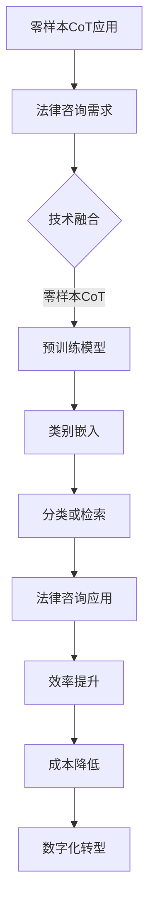
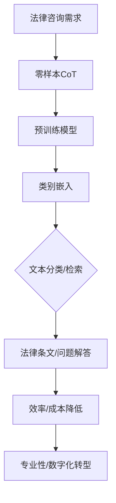

                 

### 第一部分: 核心概念与联系

> **关键词：** 零样本CoT，AI辅助法律咨询，自然语言处理，预训练模型，类别嵌入，类别描述

> **摘要：** 本部分介绍了零样本CoT（Zero-Shot Concept Transfer）的核心概念，探讨了其在AI辅助法律咨询中的应用，并分析了零样本CoT与AI辅助法律咨询之间的联系。

#### 1.1 零样本CoT基础

##### 1.1.1 零样本CoT的定义与背景

- **定义**：零样本CoT（Zero-Shot Concept Transfer）是一种将预训练模型应用于未知类别或概念分类的任务，无需对特定类别进行额外训练。

- **背景**：传统的机器学习模型通常需要大量针对特定类别的训练数据才能准确分类。而在实际应用中，某些场景下获取特定类别的训练数据可能非常困难，零样本CoT技术提供了解决这一问题的方法。

##### 1.1.2 零样本CoT的核心概念

- **预训练模型**：在大量通用数据上进行预训练的模型，如GPT-3、BERT等。

- **类别嵌入（Concept Embeddings）**：将不同类别的概念映射到低维空间中，使得具有相似概念的类别在空间中更接近。

- **类别描述（Concept Descriptions）**：使用自然语言描述每个类别，以帮助模型理解未知类别。

#### 1.2 AI辅助法律咨询中的应用

##### 1.2.1 法律咨询的需求与挑战

- **需求**：提供高效、准确的法律咨询服务，满足不同客户的多样化需求。

- **挑战**：法律领域专业性强，法律文档繁多，人工处理效率低，且存在错误风险。

##### 1.2.2 零样本CoT在法律咨询中的应用

- **应用场景**：利用零样本CoT技术，提供自动化的法律文档分类、法律问题解答和法律条文检索服务。

- **实现方法**：通过预训练模型对大量法律文档进行预训练，获得类别嵌入，然后针对用户输入的问题或文档，利用类别嵌入进行分类或检索。

#### 1.3 零样本CoT与AI辅助法律咨询的联系

##### 1.3.1 技术融合

- 将零样本CoT技术与自然语言处理（NLP）相结合，提高法律咨询服务的准确性和效率。

##### 1.3.2 应用前景

- 零样本CoT在法律咨询领域的应用前景广阔，可以提高法律服务的质量和效率，降低人力成本，助力法律行业的数字化转型。

#### Mermaid 流程图

### 第一部分: 核心概念与联系

#### 1.1 零样本CoT基础

##### 1.1.1 零样本CoT的定义与背景

**定义**：零样本CoT（Zero-Shot Concept Transfer）是一种将预训练模型应用于未知类别或概念分类的任务，无需对特定类别进行额外训练。

**背景**：传统的机器学习模型通常需要大量针对特定类别的训练数据才能准确分类。而在实际应用中，某些场景下获取特定类别的训练数据可能非常困难，例如：

- 法律领域：法律条文和案例繁多，且法律术语和概念具有高度专业化。
- 医疗领域：诊断和治疗方法涉及大量的医学术语和病症，获取特定病症的数据困难。
- 产品分类：电商平台上有成千上万的商品类别，难以获取每个类别的详细数据。

零样本CoT技术通过在大量通用数据上进行预训练，使得模型可以跨类别进行分类，从而解决了数据获取困难的问题。

##### 1.1.2 零样本CoT的核心概念

**预训练模型**：预训练模型是在大规模通用数据集（如互联网文本、新闻、百科全书等）上进行训练的模型，如GPT-3、BERT、RoBERTa等。这些模型具有强大的语义理解和生成能力，为解决零样本CoT任务奠定了基础。

**类别嵌入（Concept Embeddings）**：类别嵌入是将不同类别的概念映射到低维空间中，使得具有相似概念的类别在空间中更接近的一种表示方法。通过类别嵌入，模型可以在没有特定类别训练数据的情况下，利用已有类别样本的嵌入信息进行分类。

**类别描述（Concept Descriptions）**：类别描述是使用自然语言对每个类别进行描述，帮助模型理解未知类别。例如，对于法律领域，可以描述为“合同纠纷”、“知识产权”、“劳动法”等。

##### 1.1.3 零样本CoT的分类方法

**传统方法**：

- **基于原型的方法**：这种方法通过计算新类别样本与已知类别样本的相似度来进行分类。具体步骤如下：

  1. 计算新类别样本与每个已知类别样本之间的相似度。
  2. 选择与原型类别最相似的已知类别作为新类别样本的预测类别。

- **基于匹配度的方法**：这种方法通过计算新类别样本描述与已知类别样本描述的匹配度来确定类别归属。具体步骤如下：

  1. 使用自然语言生成模型（如GPT）生成类别描述。
  2. 计算新类别样本描述与每个已知类别样本描述的匹配度。
  3. 选择匹配度最高的类别作为新类别样本的预测类别。

**现代方法**：

- **基于图神经网络的方法**：这种方法通过构建类别嵌入图，利用图神经网络进行分类。具体步骤如下：

  1. 将类别映射为图中的节点，类别之间的关系映射为图中的边。
  2. 利用图神经网络学习类别嵌入。
  3. 对新类别样本进行分类。

- **基于多任务学习的方法**：这种方法通过同时学习多个任务，提高模型对未知类别的泛化能力。具体步骤如下：

  1. 定义多个相关任务，如分类、回归或生成任务。
  2. 通过联合训练，使模型在不同任务中共享信息。
  3. 提高对未知类别的理解能力。

#### 1.2 AI辅助法律咨询中的应用

##### 1.2.1 法律咨询的需求与挑战

- **需求**：在法律领域，随着法律案例和数据量的不断增长，法律咨询的需求也在逐渐增加。具体包括：

  1. 法律文档分类：对大量的法律文档进行分类，以便快速检索和查询。
  2. 法律问题解答：为用户提供准确、专业的法律咨询服务。
  3. 法律条文检索：根据用户输入的问题或关键词，检索相关的法律条文和案例。

- **挑战**：法律领域具有以下特点，给法律咨询带来了巨大的挑战：

  1. 专业性强：法律术语和概念繁多，专业性强，非专业人士难以理解和应用。
  2. 文档繁多：法律文档数量庞大，且格式多样，人工处理效率低。
  3. 错误风险：人工处理容易出错，可能导致错误的法律建议。

##### 1.2.2 零样本CoT在法律咨询中的应用

- **应用场景**：零样本CoT技术可以应用于以下法律咨询场景：

  1. 法律文档分类：通过预训练模型对大量法律文档进行预训练，获得类别嵌入，然后针对用户输入的文档，利用类别嵌入进行分类。
  2. 法律问题解答：使用预训练模型理解用户输入的问题，然后通过类别嵌入进行分类或检索，提供相应的法律解答。
  3. 法律条文检索：根据用户输入的问题或关键词，利用预训练模型检索相关的法律条文和案例。

- **实现方法**：

  1. **数据准备与预处理**：收集和整理大量的法律文档，并进行预处理，如文本清洗、分词、词干提取等。
  2. **类别嵌入**：使用预训练模型对预处理后的法律文档进行预训练，获得类别嵌入。
  3. **分类或检索**：针对用户输入的文档或问题，利用类别嵌入进行分类或检索，提供相应的法律服务。

#### 1.3 零样本CoT与AI辅助法律咨询的联系

##### 1.3.1 技术融合

- 零样本CoT技术与自然语言处理（NLP）技术相结合，可以提高法律咨询服务的准确性和效率。具体包括：

  1. **文本分类**：通过预训练模型对法律文档进行预训练，获得类别嵌入，然后利用类别嵌入进行文本分类。
  2. **文本生成**：利用预训练模型生成法律条文、合同模板等，提高法律文档的自动化生成能力。
  3. **语义理解**：通过预训练模型理解用户输入的问题或文档，提供更加准确和专业的法律解答。

##### 1.3.2 应用前景

- 零样本CoT在法律咨询领域的应用前景广阔，可以带来以下潜在价值：

  1. **提高效率**：通过自动化分类、检索和生成，提高法律咨询服务的效率，减少人工工作量。
  2. **降低成本**：降低法律咨询的成本，使得法律服务更加普及和可及。
  3. **增强专业性**：利用预训练模型的专业知识，提高法律咨询服务的质量和准确性。
  4. **助力数字化转型**：推动法律行业的数字化转型，提高法律服务的现代化水平。

#### Mermaid 流程图

### 第二部分: 核心算法原理讲解

#### 2.1 零样本CoT算法原理

##### 2.1.1 零样本CoT的分类方法

**传统方法**：

1. **基于原型的方法**

   - **步骤**：

     1. 计算新类别样本与每个已知类别样本之间的相似度。
     2. 选择与原型类别最相似的已知类别作为新类别样本的预测类别。

   - **公式**：

     $$\text{predicted\_label} = \arg\min_{c} \sum_{i=1}^{n} d(\mathbf{x}, \mathbf{e}_c)$$

     其中，$d(\mathbf{x}, \mathbf{e}_c)$表示新类别样本$\mathbf{x}$与已知类别样本$\mathbf{e}_c$之间的距离。

2. **基于匹配度的方法**

   - **步骤**：

     1. 使用自然语言生成模型（如GPT）生成类别描述。
     2. 计算新类别样本描述与每个已知类别样本描述的匹配度。
     3. 选择匹配度最高的类别作为新类别样本的预测类别。

   - **公式**：

     $$\text{predicted\_label} = \arg\max_{c} \sum_{i=1}^{n} \text{sim}(\text{desc}_x, \text{desc}_c)$$

     其中，$\text{sim}(\text{desc}_x, \text{desc}_c)$表示新类别样本描述$\text{desc}_x$与已知类别样本描述$\text{desc}_c$之间的匹配度。

**现代方法**：

1. **基于图神经网络的方法**

   - **步骤**：

     1. 构建类别嵌入图，将类别映射为图中的节点，类别之间的关系映射为图中的边。
     2. 使用图神经网络学习类别嵌入。
     3. 对新类别样本进行分类。

   - **公式**：

     $$\mathbf{e}_c = \text{GNN}(\{\mathbf{e}_{c'}\}_{c'\neq c})$$

     其中，$\mathbf{e}_c$表示类别$c$的嵌入向量，$\text{GNN}(\{\mathbf{e}_{c'}\}_{c'\neq c})$表示图神经网络。

2. **基于多任务学习的方法**

   - **步骤**：

     1. 定义多个相关任务，如分类、回归或生成任务。
     2. 通过联合训练，使模型在不同任务中共享信息。
     3. 提高对未知类别的理解能力。

   - **公式**：

     $$\mathbf{z} = \text{MTL}(\mathbf{x}_1, \mathbf{x}_2, ..., \mathbf{x}_k)$$

     其中，$\mathbf{z}$表示多任务学习模型的输出，$\mathbf{x}_1, \mathbf{x}_2, ..., \mathbf{x}_k$表示不同任务的输入。

##### 2.1.2 零样本CoT在法律咨询中的应用

**数据准备与预处理**：

- **数据来源**：

  1. 法律文档：从法律数据库、案例库和法律文献中获取相关数据。
  2. 知识库：构建包含法律概念、术语和规则的知识库。

- **数据预处理**：

  1. **文本清洗**：去除停用词、标点符号和特殊字符，对文本进行分词和词干提取。
  2. **文本表示**：将预处理后的文本转换为向量表示，如词嵌入或文档嵌入。

**模型训练**：

- **模型选择**：

  1. **预训练模型**：选择如BERT、GPT等预训练模型。
  2. **零样本CoT算法**：选择基于原型、基于匹配度、基于图神经网络或基于多任务学习的方法。

- **模型训练**：

  1. **数据集划分**：将数据集划分为训练集、验证集和测试集。
  2. **模型训练**：使用训练集对模型进行训练，使用验证集进行调优，确保模型在不同类别上表现均衡。

**模型应用**：

- **分类应用**：

  1. **分类任务**：将新类别样本与已知类别样本进行对比，预测新类别样本的类别归属。
  2. **输入**：新类别样本的文本表示。
  3. **输出**：预测的类别标签。

- **检索应用**：

  1. **检索任务**：根据用户输入的问题或文档，检索相关的法律条文或案例。
  2. **输入**：用户输入的法律问题或文档的文本表示。
  3. **输出**：检索到的相关法律条文或案例的文本表示。

### 第二部分: 核心算法原理讲解

#### 2.1 零样本CoT算法原理

##### 2.1.1 零样本CoT的分类方法

###### 2.1.1.1 传统方法

- **基于原型的方法**：
  - **原理**：这种方法利用已知的类别原型（即已知类别的样本集合）来对新类别样本进行分类。
  - **步骤**：
    1. 计算新类别样本与已知类别原型之间的相似度。
    2. 根据相似度最大的原型将新类别样本分类到相应的类别。
  - **公式**：
    $$ \text{predicted\_label} = \arg\max_{c} \sum_{i=1}^{N_c} \text{sim}(\mathbf{x}, \mathbf{p}_c) $$
    其中，$\text{sim}(\mathbf{x}, \mathbf{p}_c)$表示新类别样本$\mathbf{x}$与已知类别原型$\mathbf{p}_c$的相似度，$N_c$是类别$c$中样本的数量。

- **基于匹配度的方法**：
  - **原理**：这种方法通过匹配新类别样本的描述与已知类别样本的描述来进行分类。
  - **步骤**：
    1. 使用自然语言生成模型生成新类别样本的描述。
    2. 计算新类别样本描述与每个已知类别描述的匹配度。
    3. 根据匹配度最高的类别将新类别样本分类。
  - **公式**：
    $$ \text{predicted\_label} = \arg\max_{c} \sum_{i=1}^{N_c} \text{match}(\text{desc}_x, \text{desc}_c) $$
    其中，$\text{match}(\text{desc}_x, \text{desc}_c)$表示新类别样本描述$\text{desc}_x$与已知类别描述$\text{desc}_c$的匹配度。

###### 2.1.1.2 现代方法

- **基于图

