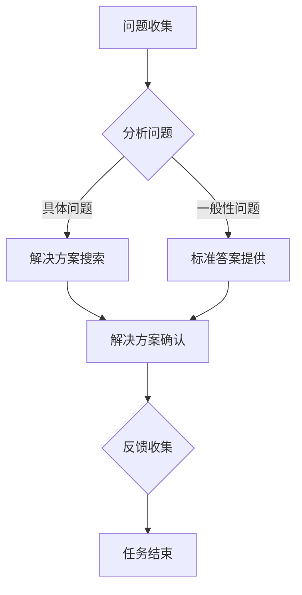
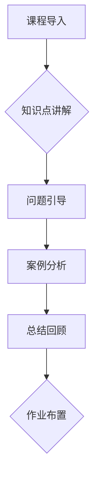
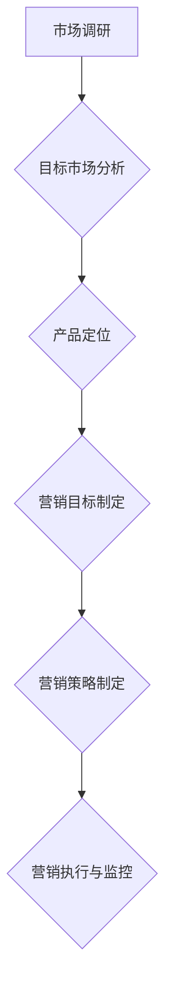
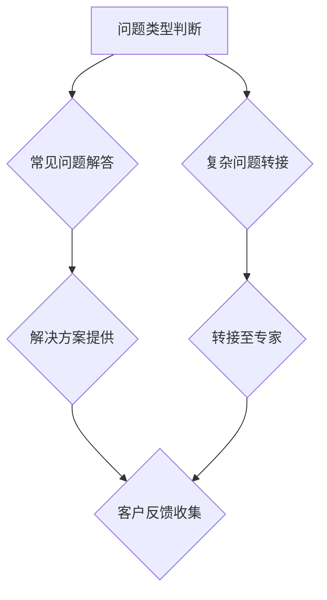
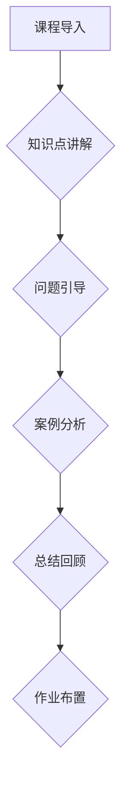
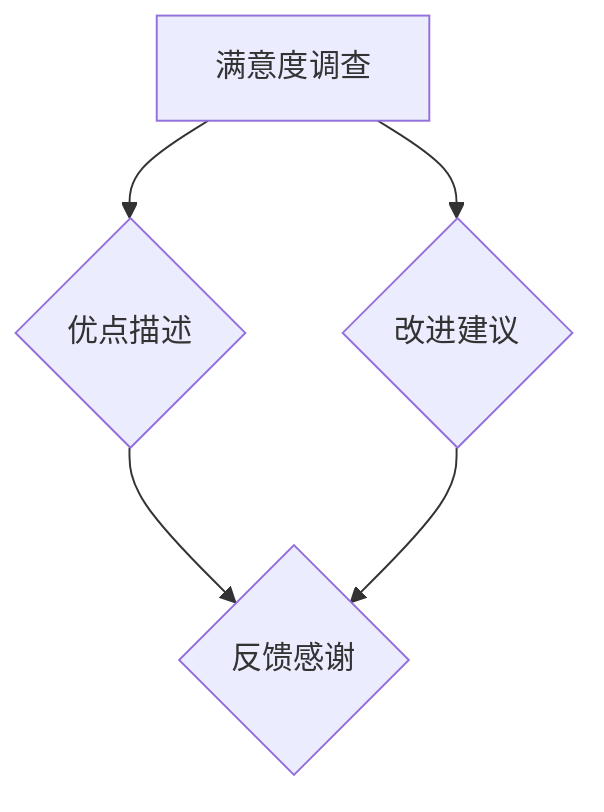

                 

# 《面向任务的提示词模板设计》

> **关键词：** 提示词模板、任务导向设计、用户体验、流程优化、应用实践、案例分析

> **摘要：** 本文将深入探讨面向任务的提示词模板设计，包括基础理论、设计方法论、应用实践和案例研究，旨在提供一套系统、实用的设计指南，以提升任务完成效率和用户体验。

## 目录大纲

1. **基础理论篇**
   1.1 提示词模板概述
   1.2 提示词模板的设计原则
   1.3 提示词模板的核心要素

2. **设计方法论篇**
   2.1 提示词模板设计流程
   2.2 提示词模板设计工具
   2.3 提示词模板评估与优化

3. **应用实践篇**
   3.1 提示词模板在客服领域的应用
   3.2 提示词模板在教育领域的应用
   3.3 提示词模板在营销领域的应用

4. **案例研究篇**
   4.1 提示词模板设计案例分享
   4.2 提示词模板设计的挑战与应对策略

5. **附录**
   5.1 提示词模板设计资源
   5.2 提示词模板设计最佳实践

---

## 1. 基础理论篇

### 1.1 提示词模板概述

#### 1.1.1 提示词模板的定义

提示词模板（Prompt Template）是一种用于指导用户完成任务或行为的结构化文本。它包含了一系列预定义的问题、指令和引导语，旨在引导用户进行特定的操作，从而提高任务的完成效率和准确性。

#### 1.1.2 提示词模板的重要性

提示词模板在现代信息社会中的应用越来越广泛，其主要重要性体现在以下几个方面：

1. **提升用户体验**：通过明确的引导语和任务描述，帮助用户快速理解任务要求，减少操作过程中的困惑和误解。
2. **优化任务流程**：通过对任务流程的分解和指导，帮助用户以最佳的方式完成特定任务，提高整体效率。
3. **减少错误率**：明确的指令和问题引导可以减少用户在任务执行过程中的错误率，提高操作的成功率。

#### 1.1.3 提示词模板的分类

根据应用场景和任务类型的不同，提示词模板可以分为以下几类：

1. **问题导向型**：以问题为核心，通过一系列问题引导用户思考和解决问题。
2. **任务导向型**：以任务目标为核心，通过任务描述和指令引导用户完成特定任务。
3. **流程导向型**：以任务流程为核心，通过流程步骤和节点引导用户按顺序完成各个任务环节。

### 1.2 提示词模板的设计原则

#### 1.2.1 目标导向设计

目标导向设计是指在设计提示词模板时，始终以任务目标为导向，确保模板能够引导用户达成目标。具体原则包括：

1. **明确任务目标**：在模板中明确列出任务目标，帮助用户了解任务的核心目标。
2. **聚焦关键步骤**：将任务分解为关键步骤，并在模板中针对每个步骤提供相应的引导语。
3. **提供清晰反馈**：在任务完成后，提供明确的反馈信息，帮助用户了解任务执行结果。

#### 1.2.2 用户中心设计

用户中心设计是指在设计提示词模板时，充分考虑用户的背景、需求和习惯，确保模板能够满足用户的需求。具体原则包括：

1. **个性化定制**：根据不同用户的背景和需求，提供个性化的提示词模板。
2. **简洁易懂**：使用简洁、易懂的语言，避免专业术语和复杂的句子结构。
3. **可操作性强**：确保模板中的引导语和指令具有可操作性，用户能够轻松执行。

#### 1.2.3 通用性与灵活性

通用性与灵活性是指提示词模板应具备广泛的适用性和一定的灵活性，以适应不同场景和任务需求。具体原则包括：

1. **通用性**：模板设计应具备一定的通用性，能够适用于多种任务场景。
2. **灵活性**：模板应允许用户根据实际情况进行个性化调整，以满足特定需求。

### 1.3 提示词模板的核心要素

#### 1.3.1 问题引导语

问题引导语是提示词模板的核心部分，用于引导用户思考和回答问题。具体要素包括：

1. **明确性问题**：提出明确、具体的问题，避免模糊和不明确的问题。
2. **层次分明**：根据问题的复杂程度，将问题分层，逐步引导用户深入思考。
3. **问题关联**：确保问题之间具有逻辑关联，形成一个完整的问题链条。

#### 1.3.2 任务描述

任务描述是对用户需要完成的任务进行详细说明，帮助用户了解任务背景和目标。具体要素包括：

1. **任务背景**：介绍任务的背景信息，帮助用户理解任务的重要性和意义。
2. **任务目标**：明确任务目标，帮助用户了解任务的核心目标。
3. **任务步骤**：详细列出任务的步骤和操作流程，帮助用户了解任务的具体操作。

#### 1.3.3 解答引导

解答引导是指导用户如何回答问题或完成任务。具体要素包括：

1. **解答提示**：在问题引导语后，提供相应的解答提示，帮助用户快速找到答案。
2. **思路引导**：在解答过程中，提供思路引导，帮助用户理清解题思路。
3. **错误纠正**：在用户回答错误时，提供错误纠正和反馈，帮助用户及时调整。

#### 1.3.4 反馈机制

反馈机制是提示词模板的一个重要组成部分，用于收集用户反馈，评估任务完成效果。具体要素包括：

1. **即时反馈**：在用户完成任务后，立即提供反馈信息，帮助用户了解任务执行结果。
2. **评价机制**：提供评价机制，让用户对任务完成效果进行评价，以便优化和改进模板。
3. **持续改进**：根据用户反馈和评估结果，不断优化和改进提示词模板，提高用户满意度。

---

## 2. 设计方法论篇

### 2.1 提示词模板设计流程

提示词模板的设计是一个系统性的过程，需要遵循一定的设计流程，以确保模板的实用性、可操作性和用户体验。以下是一个典型的提示词模板设计流程：

#### 2.1.1 需求分析

需求分析是设计流程的第一步，旨在明确用户的需求和期望。具体步骤包括：

1. **用户调研**：通过问卷调查、访谈等方式，了解用户的需求和期望。
2. **需求汇总**：将收集到的用户需求进行分类、整理和汇总，形成需求清单。
3. **需求评估**：对需求进行优先级评估，确定哪些需求是关键需求，哪些是次要需求。

#### 2.1.2 设计方案选择

在明确用户需求后，需要选择合适的设计方案。具体步骤包括：

1. **方案列举**：根据需求，列举多种可能的解决方案。
2. **方案评估**：对每种方案进行评估，包括可行性、成本、用户体验等方面。
3. **方案选择**：根据评估结果，选择最优的方案。

#### 2.1.3 模板原型设计

在方案选择后，需要进行模板原型设计。具体步骤包括：

1. **模板结构设计**：根据需求，设计模板的整体结构，包括问题引导语、任务描述、解答引导、反馈机制等部分。
2. **模板内容设计**：针对每个部分，编写具体的内容，确保内容的完整性和可操作性。
3. **模板原型验证**：通过用户测试和反馈，验证模板原型是否符合用户需求，是否易于操作。

#### 2.1.4 模板迭代优化

在模板原型设计完成后，需要进行迭代优化，以不断提升模板的质量和用户体验。具体步骤包括：

1. **用户测试**：通过用户测试，收集用户对模板的反馈和意见。
2. **问题识别**：根据用户反馈，识别模板中存在的问题和不足。
3. **优化改进**：针对存在的问题，对模板进行优化和改进。
4. **再次测试**：对优化后的模板进行再次测试，确保问题已得到解决。

### 2.2 提示词模板设计工具

提示词模板设计需要借助一系列工具，以提高设计效率和效果。以下是一些常用的提示词模板设计工具：

#### 2.2.1 文本编辑器

文本编辑器是提示词模板设计的基础工具，用于编写和编辑模板文本。常用的文本编辑器包括：

- **Notepad++**：一款免费、开源的文本编辑器，支持多种编程语言和插件。
- **Sublime Text**：一款轻量级、高效能的文本编辑器，支持多种插件和主题。

#### 2.2.2 提示词生成工具

提示词生成工具可以帮助设计者快速生成高质量的提示词模板，减少人工编写的工作量。以下是一些常用的提示词生成工具：

- **PromptGenius**：一款基于人工智能的提示词生成工具，支持多种语言和场景。
- **Promptify**：一款基于自然语言处理的提示词生成工具，支持快速生成和自定义模板。

#### 2.2.3 模板可视化工具

模板可视化工具可以帮助设计者将提示词模板以直观、易懂的方式展示出来，提高模板的可读性和易用性。以下是一些常用的模板可视化工具：

- **Mermaid**：一款基于Markdown的图表绘制工具，支持流程图、UML图等多种图表。
- **Visio**：一款专业的图表和流程图绘制工具，支持多种图表类型和模板。

### 2.3 提示词模板评估与优化

提示词模板的评估与优化是确保模板质量的重要环节。以下是一些常见的评估与优化方法：

#### 2.3.1 评估指标

提示词模板的评估指标主要包括：

1. **用户体验**：通过用户满意度、操作效率等指标评估模板的易用性和用户体验。
2. **任务完成率**：通过任务完成率、错误率等指标评估模板的实用性。
3. **反馈效果**：通过用户反馈和评价评估模板的改进效果。

#### 2.3.2 评估方法

提示词模板的评估方法主要包括：

1. **用户测试**：通过实际用户对模板的测试，收集用户对模板的反馈和意见。
2. **问卷调查**：通过问卷调查，收集用户对模板的评价和改进建议。
3. **数据分析**：通过数据分析，评估模板的使用情况和效果。

#### 2.3.3 优化策略

提示词模板的优化策略主要包括：

1. **内容优化**：根据用户反馈，对模板的内容进行修改和改进，提高模板的实用性。
2. **结构优化**：对模板的结构进行调整和优化，提高模板的可读性和易用性。
3. **功能优化**：根据用户需求，增加或修改模板的功能，提升模板的实用性。

---

## 3. 应用实践篇

### 3.1 提示词模板在客服领域的应用

#### 3.1.1 客服流程中的提示词模板设计

客服流程中的提示词模板设计旨在提高客服人员的工作效率和服务质量。以下是一个典型的客服流程提示词模板设计案例：



#### 3.1.2 提示词模板在解决常见问题中的应用

在解决常见问题时，提示词模板可以帮助客服人员快速定位问题并提供解决方案。以下是一个常见问题提示词模板示例：

```markdown
# 问题类型：账户登录故障

## 问题描述
您好，请问您在登录账户时遇到了什么问题？以下是一些可能的原因，请选择一个选项并详细描述您的情况：

1. **忘记密码**：请输入您的注册邮箱地址，我们将发送密码重置链接到您的邮箱。
2. **账号被锁定**：请提供您的账号和验证码，我们将协助您解锁账号。
3. **网络连接问题**：请检查您的网络连接，或尝试使用不同的设备或网络环境进行登录。
4. **其他问题**：请描述您遇到的具体问题，我们将尽快为您解决。

## 解答引导
根据您选择的问题类型，我们将提供相应的解决方案。请您按照指引操作，如有需要，我们也会提供进一步的支持。

## 反馈机制
请您在问题解决后对我们的服务进行评价，以便我们不断改进和优化。
```

#### 3.1.3 提示词模板在客户关系管理中的应用

在客户关系管理中，提示词模板可以帮助客服人员更好地维护客户关系，提升客户满意度。以下是一个客户关系维护提示词模板示例：

```markdown
# 客户关系维护

## 关系评估
您好，为了更好地了解您的需求，请您回答以下问题：

1. **当前满意度**：请对我们的服务进行评分（1-5分），1分为非常不满意，5分为非常满意。
2. **近期需求**：请简要描述您近期对我们的产品或服务的需求或期望。
3. **建议与反馈**：如有任何建议或反馈，请随时告诉我们，我们将认真听取并改进。

## 解答引导
感谢您的反馈，我们将根据您的评估和需求，为您提供更优质的服务。如有任何问题，请随时联系我们。

## 反馈机制
请您在问题解决后对我们的服务进行评价，我们将根据您的反馈不断改进和优化。
```

### 3.2 提示词模板在教育领域的应用

#### 3.2.1 教学过程中提示词模板的设计

在教学过程中，提示词模板可以帮助教师更好地引导学生进行学习和思考。以下是一个教学过程提示词模板设计案例：



#### 3.2.2 提示词模板在在线教育中的应用

在在线教育中，提示词模板可以帮助学生更好地理解和掌握课程内容。以下是一个在线教育提示词模板示例：

```markdown
# 在线课程学习指南

## 课程导入
欢迎来到本课程，我们将通过以下主题进行深入学习：

1. **课程目标**：本课程将帮助您掌握XXXX知识。
2. **课程大纲**：详细介绍了本课程的学习内容和结构。

## 知识点讲解
请仔细阅读以下知识点讲解，如有疑问，请随时提问：

1. **知识点一**：
2. **知识点二**：
3. **知识点三**：

## 问题引导
为了更好地理解知识点，请您尝试回答以下问题：

1. **问题一**：
2. **问题二**：

## 案例分析
以下是一个案例分析，请您结合知识点进行分析：

案例描述：XXXXX

分析问题：XXXXX

## 总结回顾
请总结本节课的主要内容和收获，并在下方留言。

## 作业布置
请完成以下作业，并在下次课程前提交：

1. **作业一**：
2. **作业二**：

```

#### 3.2.3 提示词模板在学生自主学习中的应用

在学生自主学习过程中，提示词模板可以帮助学生更好地进行自我学习和评估。以下是一个学生自主学习提示词模板示例：

```markdown
# 自主学习指南

## 学习目标
为了提高自主学习能力，请您设定以下学习目标：

1. **知识点掌握**：本学期我将掌握XXXX知识。
2. **技能提升**：通过本课程的学习，我将提升XXXX技能。

## 学习计划
请制定以下学习计划，并按照计划进行学习：

1. **每周学习内容**：
2. **学习时间安排**：

## 自我评估
为了了解自己的学习进度，请您定期进行以下自我评估：

1. **知识点掌握情况**：
2. **技能提升情况**：

## 反馈与调整
根据自我评估结果，及时调整学习计划和目标，确保学习效果。

## 作业与练习
请按照以下作业和练习要求进行学习：

1. **作业一**：
2. **作业二**：

```

### 3.3 提示词模板在营销领域的应用

#### 3.3.1 营销策略中的提示词模板设计

在营销策略中，提示词模板可以帮助营销人员更好地制定和执行营销计划。以下是一个营销策略提示词模板设计案例：



#### 3.3.2 提示词模板在广告文案中的应用

在广告文案中，提示词模板可以帮助营销人员快速撰写高质量的广告文案。以下是一个广告文案提示词模板示例：

```markdown
# 广告标题

## 广告引言
欢迎来到XXXXX，我们的产品将为您提供前所未有的XXXXX体验！

## 产品亮点
1. **创新设计**：我们的产品采用了最新的XXXXX技术，为您带来前所未有的创新体验。
2. **卓越性能**：我们的产品具有卓越的性能，能够满足您的XXXXX需求。
3. **优质服务**：我们提供优质的售后服务，让您购买无忧。

## 购买理由
为什么选择我们的产品？以下是我们产品的五大优势：

1. **品质保证**：我们的产品经过严格的质量检验，确保品质卓越。
2. **性价比高**：我们的产品性价比高，为您节省开支。
3. **口碑良好**：我们的产品深受用户好评，口碑卓越。

## 购买指引
1. **立即购买**：点击下方按钮，立即购买我们的产品，享受优惠价。
2. **咨询详情**：如有任何疑问，请随时联系我们，我们将为您提供详细解答。

## 广告结尾
感谢您的关注，我们期待与您共同创造美好未来！

```

#### 3.3.3 提示词模板在用户反馈收集中的应用

在用户反馈收集过程中，提示词模板可以帮助营销人员更好地了解用户需求和满意度。以下是一个用户反馈收集提示词模板示例：

```markdown
# 用户反馈调查

## 调查引言
感谢您选择我们的产品或服务，我们重视您的反馈，这将帮助我们不断改进和优化。

## 反馈内容
请您回答以下问题，我们将根据您的反馈提供更好的产品或服务：

1. **整体满意度**：请对我们的产品或服务进行评分（1-5分），1分为非常不满意，5分为非常满意。
2. **产品优点**：请描述您认为我们的产品或服务的优点。
3. **改进建议**：请提出您认为我们可以改进的地方。

## 反馈方式
请您在下方留言或通过以下方式提供您的反馈：

1. **留言反馈**：直接在留言区留言。
2. **邮件反馈**：发送邮件至XXXXX，我们将尽快回复。

## 感谢与回馈
感谢您的反馈，我们将认真听取并改进。同时，我们将为您提供小礼品或优惠券作为回馈。

```

---

## 4. 案例研究篇

### 4.1 提示词模板设计案例分享

#### 4.1.1 案例一：某电商平台的客服提示词模板设计

某电商平台通过设计一套完善的客服提示词模板，大幅提升了客服效率和服务质量。以下为该平台的客服提示词模板设计：



该设计通过明确的问题分类和解答流程，使客服人员能够迅速定位问题并提供解决方案，提高了客服效率。同时，通过收集客户反馈，不断优化和改进客服流程。

#### 4.1.2 案例二：某在线教育平台的课程提示词模板设计

某在线教育平台通过设计一套详细的课程提示词模板，帮助学生更好地进行学习和自我评估。以下为该平台的课程提示词模板设计：



该设计通过结构化的课程提示词模板，帮助学生明确学习目标、掌握知识点，并通过问题引导、案例分析和总结回顾，提高学习效果。

#### 4.1.3 案例三：某互联网公司的用户反馈收集提示词模板设计

某互联网公司通过设计一套完善的用户反馈收集提示词模板，有效收集了用户需求和满意度，为产品优化提供了重要依据。以下为该公司的用户反馈收集提示词模板设计：



该设计通过明确的满意度调查和反馈问题引导，帮助用户清晰表达需求和意见，同时通过反馈感谢，提高了用户的满意度和参与度。

### 4.2 提示词模板设计的挑战与应对策略

#### 4.2.1 挑战一：如何设计适用于多种场景的通用提示词模板

在设计通用提示词模板时，面临的一个主要挑战是确保模板能够在多种场景下适用。以下是一些应对策略：

1. **模块化设计**：将提示词模板分解为多个模块，每个模块针对特定的任务或场景，便于组合和调整。
2. **参数化设计**：使用参数化设计，使模板中的部分内容可以根据具体场景进行自定义，提高模板的适用性。
3. **情景测试**：在模板设计完成后，进行情景测试，确保模板在不同场景下都能正常运作。

#### 4.2.2 挑战二：如何确保提示词模板的准确性和有效性

确保提示词模板的准确性和有效性是设计过程中的另一个关键挑战。以下是一些应对策略：

1. **用户参与**：在设计过程中，邀请目标用户参与，收集他们的反馈和建议，确保模板的准确性和有效性。
2. **数据驱动**：通过数据分析，评估模板的实际效果，及时进行调整和优化。
3. **持续迭代**：不断对模板进行迭代优化，根据用户反馈和实际效果进行改进。

#### 4.2.3 挑战三：如何应对用户反馈中出现的负面情绪

用户反馈中可能会出现负面情绪，如何应对这些情绪是设计者需要考虑的问题。以下是一些应对策略：

1. **积极回应**：对于负面反馈，积极回应，表达对用户意见的重视，并承诺改进。
2. **情感关怀**：在回应中，加入情感关怀的元素，缓解用户的负面情绪。
3. **反馈引导**：鼓励用户提供具体的反馈和建议，以便更好地解决问题和改进模板。

---

## 附录

### A.1 提示词模板设计资源

#### A.1.1 设计工具推荐

1. **文本编辑器**：Notepad++、Sublime Text
2. **提示词生成工具**：PromptGenius、Promptify
3. **模板可视化工具**：Mermaid、Visio

#### A.1.2 学习资源推荐

1. **书籍**：《用户体验要素》、《设计心理学》
2. **在线课程**：Coursera、Udemy
3. **社区和论坛**：UX Design Community、Stack Overflow

#### A.1.3 案例研究资源推荐

1. **网站**：Case Studies on UX Design、A List Apart
2. **书籍**：《用户体验评估：方法与实践》
3. **论文**：学术期刊和会议论文库

### A.2 提示词模板设计最佳实践

#### A.2.1 提示词模板设计的成功案例

1. **案例一**：苹果公司的用户反馈收集系统
2. **案例二**：谷歌的搜索提示词优化
3. **案例三**：亚马逊的客服流程优化

#### A.2.2 提示词模板设计的常见问题及解决方案

1. **问题一**：模板内容过于复杂
   - **解决方案**：简化模板结构，减少冗余内容。
2. **问题二**：模板适用性差
   - **解决方案**：进行用户调研，根据不同场景进行调整。

#### A.2.3 提示词模板设计的未来发展趋势

1. **个性化**：根据用户行为和偏好，提供个性化的提示词模板。
2. **智能化**：利用人工智能技术，实现智能提示词生成和优化。
3. **交互性**：提高模板的交互性，实现实时反馈和互动。

---

## 总结

提示词模板设计是提升任务完成效率和用户体验的重要手段。本文从基础理论、设计方法论、应用实践和案例研究等方面，对提示词模板设计进行了全面探讨，旨在为设计者提供一套实用的设计指南。在未来的发展中，提示词模板设计将继续融合人工智能、大数据等技术，实现更智能化、个性化的用户体验。

---

### 作者

**作者：** AI天才研究院/AI Genius Institute & 禅与计算机程序设计艺术 /Zen And The Art of Computer Programming

**致谢：** 感谢所有参与本文撰写和讨论的团队成员，以及提供宝贵意见和反馈的读者朋友们。本文的完成离不开大家的共同努力和支持。希望大家继续关注我们的后续研究和作品，共同探索人工智能和计算机编程领域的无限可能。

