                 

# 《领导力与远见：预见未来趋势的能力》

## 文章关键词
领导力、远见力、趋势预测、未来趋势、战略规划、团队协作

> 本文将从领导力的定义和核心要素出发，深入探讨领导者的自我认知与管理，进而分析远见力的概念和特征，以及如何培养远见力。文章将结合实际案例，探讨预见未来趋势的方法与工具，并在企业战略规划、市场营销、人力资源管理和风险防范等领域展示预见未来趋势的实践应用。最后，本文将探讨领导力与远见力的融合，以及如何提升领导力与远见力，以应对未来的挑战。

### 目录大纲

- # 《领导力与远见：预见未来趋势的能力》
  - > **关键词**：领导力、远见力、趋势预测、未来趋势、战略规划、团队协作
  - > **摘要**：本文将探讨领导力与远见力在预见未来趋势中的重要性，分析领导力的定义与核心要素，以及远见力的概念与特征。文章还将介绍如何培养远见力，并探讨预见未来趋势的实践应用，最后分析领导力与远见力的融合与发展。

### 第一部分：领导力基础

#### 第1章：领导力的定义与核心要素

**1.1 领导力的本质**

领导力是一种能力，它能够激励、引导和影响他人，共同实现目标。领导力不仅仅是一种职位或角色的特征，更是一种行为和态度。一个成功的领导者需要具备多种技能，如沟通能力、决策能力、团队合作能力等。

**1.2 领导力的核心要素**

领导力的核心要素包括：

- **目标导向**：领导者需要有清晰的目标，并能够带领团队朝着这个目标前进。
- **影响力**：领导者需要能够影响他人，使他们愿意跟随自己。
- **沟通能力**：有效的沟通是领导力的关键要素，它能够帮助领导者传达目标、激励团队、解决问题。
- **决策能力**：领导者需要在面对复杂问题和不确定性时，做出明智的决策。
- **团队合作**：领导者需要能够建立并维护一个高效的团队。

**1.3 领导力的重要性**

领导力的重要性体现在多个方面：

- **组织效率**：有效的领导力能够提高组织效率，实现资源的最佳配置。
- **团队士气**：领导力能够提升团队的士气，使团队成员更有动力地工作。
- **创新与变革**：领导力能够推动组织进行创新和变革，以适应外部环境的变化。
- **可持续发展**：领导力是实现组织可持续发展的关键。

**1.4 领导力的发展历程**

领导力的发展历程可以分为以下几个阶段：

- **传统领导力**：强调权威和控制。
- **变革型领导力**：强调领导者与团队成员之间的互动和信任。
- **服务型领导力**：强调领导者为团队成员提供服务，以实现共同的目标。
- **情境领导力**：强调领导者根据不同的情境和团队成员的特点，采取不同的领导风格。

#### 第2章：领导者的自我认知与自我管理

**2.1 自我认知的重要性**

自我认知是领导者的基础。一个领导者需要清楚地了解自己的优点和缺点，以及自己的价值观和信念。

**2.2 自我管理的方法**

自我管理是领导者自我提升的关键。以下是一些自我管理的方法：

- **时间管理**：合理规划时间，提高工作效率。
- **情绪管理**：保持积极的心态，应对压力和挑战。
- **知识管理**：不断学习，提升自己的知识和技能。
- **决策管理**：在决策时，充分考虑各种因素，做出明智的决策。

**2.3 自我效能感的提升**

自我效能感是指一个人对自己完成某项任务的信心。提升自我效能感有以下几种方法：

- **成功经验**：通过成功的经历，提升自我效能感。
- **模拟训练**：通过模拟训练，提前准备，减少不确定性。
- **正面反馈**：通过正面反馈，增强自我效能感。
- **心理建设**：通过心理建设，增强面对困难的勇气。

**2.4 自我反思与自我成长**

自我反思是领导者自我提升的重要手段。通过自我反思，领导者可以发现自己的不足，并采取相应的措施进行改进。

自我成长的过程可以分为以下几个阶段：

- **认知阶段**：意识到自己的不足。
- **规划阶段**：制定改进计划。
- **执行阶段**：执行改进计划。
- **评估阶段**：评估改进效果。

#### 第二部分：远见能力

### 第3章：远见力的概念与特征

**3.1 远见力的定义**

远见力是指能够预见未来趋势，把握未来发展方向的能力。它不仅仅是对未来趋势的预测，更是一种洞察力和前瞻性。

**3.2 远见力的特征**

远见力具有以下几个特征：

- **前瞻性**：能够提前看到未来的发展趋势。
- **洞察力**：能够深入理解问题的本质。
- **适应性**：能够适应不同的环境和变化。
- **创新性**：能够提出新的解决方案。

**3.3 远见力的重要性**

远见力的重要性体现在以下几个方面：

- **决策**：远见力可以帮助领导者做出更加明智的决策。
- **战略规划**：远见力可以帮助组织更好地规划未来。
- **创新**：远见力可以激发创新思维，推动组织的变革。
- **风险防范**：远见力可以帮助组织预见风险，提前防范。

**3.4 远见力的构成要素**

远见力的构成要素包括：

- **知识**：丰富的知识储备是远见力的重要基础。
- **经验**：通过实践积累的经验可以帮助提高远见力。
- **洞察力**：深入理解问题的能力是远见力的重要表现。
- **创新思维**：创新思维可以帮助领导者预见未来。

### 第4章：培养远见力

**4.1 学习与知识的积累**

培养远见力需要不断学习和积累知识。以下是一些方法：

- **广泛阅读**：通过阅读，了解不同领域的知识。
- **学习新技能**：通过学习新技能，提升自己的能力。
- **参加研讨会和讲座**：通过参加研讨会和讲座，了解最新的研究成果和趋势。

**4.2 观察能力的提升**

提升观察能力可以帮助我们更好地发现趋势和洞察力。以下是一些方法：

- **细心观察**：通过细心观察，发现细节和规律。
- **多角度思考**：从不同角度思考问题，提高洞察力。
- **培养好奇心**：好奇心可以激发我们对新事物的兴趣和探索。

**4.3 创新思维的开发**

创新思维可以帮助我们预见未来，找到新的解决方案。以下是一些方法：

- **头脑风暴**：通过头脑风暴，激发创新思维。
- **跨学科学习**：跨学科学习可以带来新的思考和灵感。
- **实践应用**：通过实践应用，验证和创新思维。

**4.4 风险管理与决策能力**

风险管理与决策能力是远见力的重要组成部分。以下是一些方法：

- **风险评估**：通过风险评估，了解可能的风险和影响。
- **决策分析**：通过决策分析，选择最佳的方案。
- **应对策略**：制定应对策略，降低风险。

#### 第三部分：预见未来趋势

### 第5章：趋势预测的方法与工具

**5.1 趋势预测的基本方法**

趋势预测的基本方法包括：

- **数据分析**：通过对数据的分析，找出趋势和规律。
- **历史比较**：通过比较历史数据，预测未来的趋势。
- **专家意见**：通过专家的意见，预测未来的趋势。

**5.2 趋势预测的工具**

趋势预测的工具包括：

- **统计软件**：如SPSS、R等，用于数据分析。
- **人工智能技术**：如机器学习、深度学习等，用于趋势预测。
- **专家系统**：通过专家的知识和经验，进行趋势预测。

**5.3 趋势分析案例**

以下是一个趋势分析案例：

- **背景**：某公司想要预测未来三年的市场销售额。
- **数据**：收集了过去五年的销售额数据。
- **方法**：使用时间序列分析方法，预测未来的销售额。

**5.4 趋势预测的误区与挑战**

趋势预测的误区和挑战包括：

- **过度依赖数据**：过度依赖数据，忽略其他因素。
- **预测的准确性**：预测的准确性受到多种因素的影响。
- **决策的滞后性**：预测出的趋势往往具有一定的滞后性。

### 第6章：预见未来趋势的实践应用

**6.1 企业战略规划**

预见未来趋势在企业战略规划中的应用：

- **市场定位**：根据未来趋势，确定企业的市场定位。
- **产品规划**：根据未来趋势，规划产品的发展方向。
- **技术创新**：根据未来趋势，进行技术创新。

**6.2 市场营销策略**

预见未来趋势在市场营销策略中的应用：

- **市场细分**：根据未来趋势，进行市场细分。
- **目标客户**：根据未来趋势，确定目标客户。
- **营销手段**：根据未来趋势，选择合适的营销手段。

**6.3 人力资源管理**

预见未来趋势在人力资源管理中的应用：

- **人才招聘**：根据未来趋势，招聘符合企业需求的人才。
- **员工培训**：根据未来趋势，进行员工培训。
- **绩效评估**：根据未来趋势，进行绩效评估。

**6.4 风险管理与危机应对**

预见未来趋势在风险管理与危机应对中的应用：

- **风险识别**：根据未来趋势，识别潜在的风险。
- **风险评估**：根据未来趋势，评估风险的影响和可能性。
- **危机应对**：根据未来趋势，制定危机应对策略。

#### 第四部分：领导力与远见力的融合

### 第7章：领导力与远见力的融合

**7.1 领导力与远见力的关系**

领导力与远见力之间的关系：

- **领导力的基础**：远见力是领导力的重要组成部分，是领导者预见未来、把握机遇的能力。
- **远见力的支撑**：领导力是远见力得以发挥的基础，领导者需要通过有效的领导力，将远见力的洞察和预测转化为实际行动。

**7.2 如何在组织中融合领导力与远见力**

以下是在组织中融合领导力与远见力的方法：

- **愿景引导**：领导者需要通过远见力，制定清晰的愿景，并引导组织朝着这个愿景前进。
- **决策支持**：领导者需要利用远见力，为决策提供有力的支持，确保决策的前瞻性和准确性。
- **团队激励**：领导者需要通过有效的沟通和激励，激发团队成员的远见力和创新能力。

**7.3 案例分析：领导力与远见力的成功实践**

以下是一个领导力与远见力的成功实践案例：

- **背景**：某公司领导者通过远见力，预见到互联网行业的发展趋势，及时调整公司战略，进军互联网领域。
- **实践**：领导者通过有效的领导力，推动公司的技术创新和团队协作，成功实现了企业的转型和快速发展。

**7.4 领导力与远见力的未来发展趋势**

随着社会的不断进步和变化，领导力与远见力的未来发展趋势：

- **数字化领导力**：领导者需要具备数字化素养，能够利用数字化工具进行趋势预测和管理。
- **可持续发展领导力**：领导者需要关注可持续发展，将远见力应用于环境保护和社会责任。
- **跨文化领导力**：领导者需要具备跨文化沟通和协作能力，应对全球化的挑战。

### 第五部分：领导力与远见力的提升

#### 第8章：领导力与远见力的提升

**8.1 持续学习的重要性**

持续学习是领导力与远见力提升的关键。以下是一些持续学习的方法：

- **专业培训**：参加专业培训，提升专业知识和技能。
- **阅读**：广泛阅读，了解最新的研究成果和趋势。
- **实践**：通过实践，将理论知识应用于实际工作中。

**8.2 自我提升的策略**

以下是一些自我提升的策略：

- **设定目标**：设定明确的个人发展目标，并制定实现目标的计划。
- **反思与总结**：定期进行反思和总结，了解自己的优点和不足，并制定改进措施。
- **寻求反馈**：主动寻求他人的反馈，了解自己的不足，并加以改进。

**8.3 反思与总结**

反思与总结是领导力与远见力提升的重要环节。以下是一些反思与总结的方法：

- **定期回顾**：定期回顾自己的工作和学习，了解自己的进步和不足。
- **记录笔记**：记录学习和工作中的重要信息，便于回顾和总结。
- **交流与分享**：与他人交流学习心得和经验，分享自己的见解和思考。

**8.4 领导力与远见力的未来挑战**

随着社会的不断变化和进步，领导力与远见力将面临以下挑战：

- **技术创新**：领导者需要不断学习新技术，应对技术变革的挑战。
- **全球化**：领导者需要具备跨文化沟通和协作能力，应对全球化的挑战。
- **可持续发展**：领导者需要关注可持续发展，应对环境和社会责任的问题。

### 附录

#### 附录A：领导力与远见力相关的书籍与资源

以下是一些领导力与远见力相关的书籍和资源：

- **书籍**：
  - 《领导力与远见》
  - 《第五项修炼》
  - 《智能时代》

- **网站**：
  - 领英（LinkedIn）
  - 谷歌学术（Google Scholar）
  - Harvard Business Review（哈佛商业评论）

- **视频课程**：
  - Coursera上的领导力课程
  - Udemy上的远见力课程
  - YouTube上的领导力与远见力讲座

### 作者信息

- 作者：AI天才研究院/AI Genius Institute & 禅与计算机程序设计艺术 /Zen And The Art of Computer Programming

---

（注：本文仅为大纲结构，具体内容需进一步填充和详细阐述。）

---

### 第1章：领导力的定义与核心要素

#### 1.1 领导力的本质

领导力是一种能够激励、引导和影响他人，共同实现目标的能力。它不仅仅是一种职位或角色的特征，更是一种行为和态度。一个成功的领导者不仅需要具备专业知识和技能，还需要具备一系列的软技能，如沟通能力、决策能力、团队合作能力等。

**定义领导力的基本概念**：

- **影响**：领导力本质上是一种影响他人的能力。领导者需要能够影响团队成员的观点、行为和态度，使他们朝着共同的目标努力。
- **激励**：领导者需要能够激发团队成员的积极性和创造力，使他们保持高度的动机和热情。
- **愿景**：领导者需要有明确的愿景和目标，能够带领团队朝着这个目标前进。
- **变革**：领导者需要具备变革的能力，能够在组织面临挑战和不确定性时，推动组织进行创新和变革。

**领导力的核心概念流程图**：

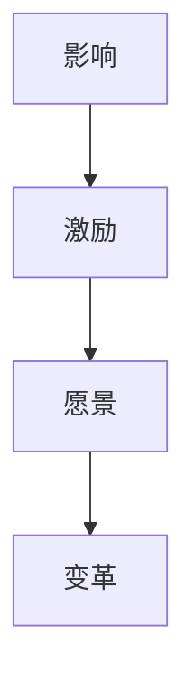

#### 1.2 领导力的核心要素

领导力的核心要素包括以下几个方面：

1. **目标导向**：

   目标导向是领导者成功的关键。一个有效的领导者需要明确组织的愿景和目标，并将其传达给团队成员。通过制定清晰的目标，领导者可以激励团队成员为实现共同目标而努力。

   **目标导向的核心要素**：

   - **明确目标**：领导者需要明确组织的愿景和目标，使其具体、可测量和可实现。
   - **设定目标**：领导者需要根据组织的愿景和目标，设定具体的、可实现的个人和团队目标。
   - **追踪进度**：领导者需要定期追踪目标的进度，确保团队成员了解目标的进展情况。

2. **影响力**：

   领导者需要具备强大的影响力，能够影响他人的思想和行为。这种影响力来自于领导者的权威、信任和个人魅力。

   **影响力的核心要素**：

   - **权威**：领导者需要具备一定的权威，使其在组织中的地位得到认可。
   - **信任**：领导者需要建立与团队成员之间的信任关系，使其愿意接受领导者的指导和影响。
   - **个人魅力**：领导者需要具备一定的个人魅力，能够吸引和激励团队成员。

3. **沟通能力**：

   沟通能力是领导者成功的关键因素之一。一个有效的领导者需要具备良好的沟通技巧，能够清晰地表达自己的想法，理解团队成员的观点和需求。

   **沟通能力的核心要素**：

   - **表达**：领导者需要能够清晰、准确地表达自己的想法和意见。
   - **倾听**：领导者需要具备良好的倾听技巧，理解团队成员的观点和需求。
   - **反馈**：领导者需要给予团队成员及时的反馈，帮助其改进和提高。

4. **决策能力**：

   决策能力是领导者的一项重要能力。领导者需要在面对复杂问题和不确定性时，做出明智的决策。

   **决策能力的核心要素**：

   - **分析**：领导者需要能够对问题进行深入分析，找出问题的根本原因。
   - **评估**：领导者需要能够评估不同的解决方案，选择最佳方案。
   - **执行**：领导者需要能够确保决策得到有效执行，实现预期目标。

5. **团队合作**：

   团队合作能力是领导者成功的关键。领导者需要能够建立和维护一个高效的团队，使团队成员之间相互支持、协作和信任。

   **团队合作的核心要素**：

   - **协作**：领导者需要能够促进团队成员之间的协作，共同实现目标。
   - **支持**：领导者需要给予团队成员支持和鼓励，帮助其克服困难。
   - **信任**：领导者需要建立团队成员之间的信任关系，使其愿意分享信息和承担责任。

**领导力的核心要素流程图**：

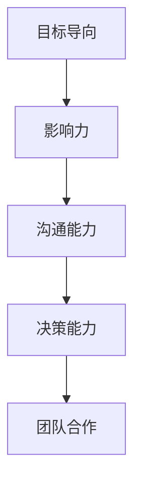

#### 1.3 领导力的重要性

领导力对于组织和个人都具有重要意义。以下从几个方面阐述领导力的重要性：

1. **组织效率**：

   领导力能够提高组织的效率，实现资源的最佳配置。一个有效的领导者能够明确组织的愿景和目标，制定合理的战略和计划，确保组织资源得到充分利用。

2. **团队士气**：

   领导力能够提升团队的士气，使团队成员更有动力地工作。一个具有领导力的领导者能够激励团队成员，使其在困难面前保持积极的心态和信心。

3. **创新与变革**：

   领导力能够推动组织进行创新和变革，以适应外部环境的变化。一个具有远见的领导者能够预见未来的趋势和挑战，带领组织不断创新，保持竞争优势。

4. **可持续发展**：

   领导力是实现组织可持续发展的关键。一个有效的领导者不仅关注组织的短期利益，还关注组织的长期发展，推动组织实现可持续发展目标。

**领导力的重要性流程图**：

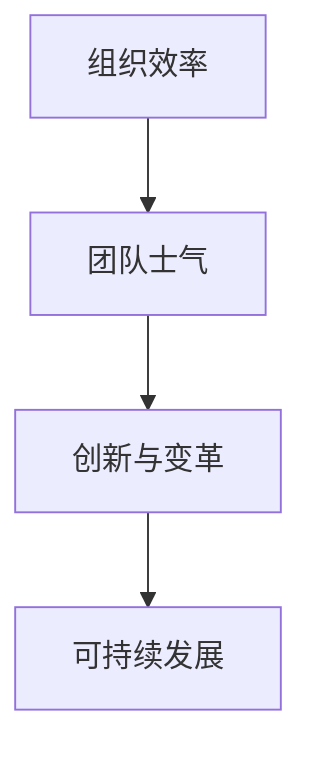

#### 1.4 领导力的发展历程

领导力的发展历程可以追溯到几个关键阶段。以下简要介绍这些阶段：

1. **传统领导力**：

   传统领导力强调权威和控制。领导者通过职位和权力来指挥和监督团队成员，实现组织目标。

2. **变革型领导力**：

   变革型领导力强调领导者与团队成员之间的互动和信任。领导者通过激励和启发团队成员，推动组织变革和发展。

3. **服务型领导力**：

   服务型领导力强调领导者为团队成员提供服务，以实现共同的目标。领导者关注团队成员的需求和福祉，通过提供支持和资源，帮助团队成员实现个人和团队目标。

4. **情境领导力**：

   情境领导力强调领导者根据不同的情境和团队成员的特点，采取不同的领导风格。领导者需要灵活调整自己的领导方式，以适应不同的环境和挑战。

**领导力的发展历程流程图**：

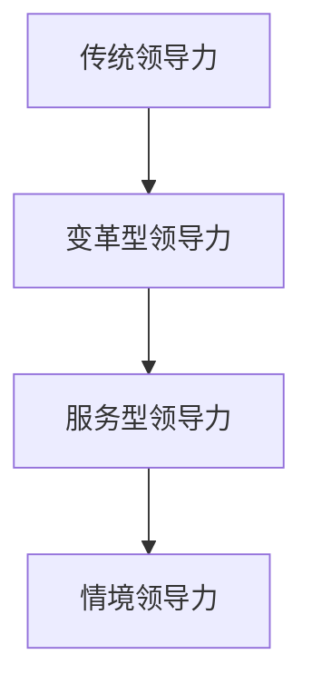

### 第2章：领导者的自我认知与自我管理

#### 2.1 自我认知的重要性

自我认知是领导者的基础。一个领导者需要清楚地了解自己的优点和缺点，以及自己的价值观和信念。自我认知能够帮助领导者更好地理解自己，发挥自己的优势，克服自己的不足。

**自我认知的核心要素**：

- **了解自己的优势**：领导者需要明确自己的优势，发挥这些优势，提高工作效率和影响力。
- **识别自己的不足**：领导者需要诚实地识别自己的不足，并寻求改进的方法，以提高自己的能力。
- **明确价值观和信念**：领导者需要明确自己的价值观和信念，使其在领导过程中能够保持一致性和稳定性。

**自我认知流程图**：

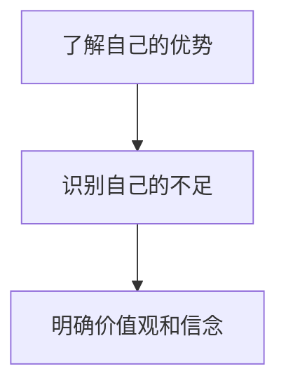

#### 2.2 自我管理的方法

自我管理是领导者自我提升的关键。通过自我管理，领导者可以更好地控制自己的情绪和行为，提高工作效率和领导力。

**自我管理的方法**：

1. **时间管理**：

   时间管理是自我管理的重要组成部分。领导者需要合理安排时间，确保工作与生活之间的平衡。

   - **设定优先级**：领导者需要明确任务的优先级，将时间集中在最重要和最紧急的任务上。
   - **制定计划**：领导者需要制定详细的工作计划，合理安排工作时间。
   - **避免拖延**：领导者需要克服拖延症，确保任务按时完成。

2. **情绪管理**：

   情绪管理是领导者自我管理的重要方面。领导者需要学会控制自己的情绪，保持冷静和理智。

   - **自我反思**：领导者需要定期进行自我反思，了解自己的情绪变化，并找到合适的应对策略。
   - **调整心态**：领导者需要调整自己的心态，保持积极和乐观的态度。
   - **寻求支持**：领导者可以寻求家人、朋友或同事的支持，帮助自己应对压力和挑战。

3. **知识管理**：

   知识管理是领导者自我管理的重要内容。领导者需要不断学习，提升自己的知识和技能。

   - **持续学习**：领导者需要持续学习，掌握最新的行业动态和知识。
   - **知识共享**：领导者需要积极参与知识共享，与团队成员交流经验和知识。
   - **培训与发展**：领导者需要积极参与培训和发展活动，提升自己的专业能力和领导力。

4. **决策管理**：

   决策管理是领导者自我管理的重要方面。领导者需要学会做出明智的决策，确保决策的有效性和合理性。

   - **分析信息**：领导者需要收集和分析相关信息，确保决策的依据充分。
   - **评估风险**：领导者需要评估决策的风险和影响，确保决策的可行性。
   - **执行决策**：领导者需要确保决策得到有效执行，实现预期目标。

**自我管理流程图**：

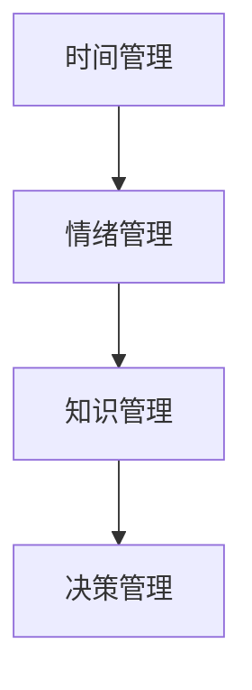

#### 2.3 自我效能感的提升

自我效能感是指领导者对自己完成某项任务的信心。提升自我效能感有助于领导者更好地应对挑战和压力，提高工作效率和领导力。

**提升自我效能感的方法**：

1. **成功经验**：

   通过成功的经历，提升自我效能感。领导者需要在工作中积累成功的经验，并将其应用于未来的挑战中。

   - **设定挑战性目标**：领导者需要设定具有挑战性的目标，通过实现目标，提升自我效能感。
   - **庆祝成功**：领导者需要庆祝自己的成功，增强自信心和动力。

2. **模拟训练**：

   通过模拟训练，提升自我效能感。领导者可以通过模拟训练，提前准备，减少不确定性，提高应对挑战的能力。

   - **情境模拟**：领导者可以通过情境模拟，模拟可能出现的挑战和问题，提前准备应对策略。
   - **角色扮演**：领导者可以通过角色扮演，模拟与团队成员的沟通和合作，提高沟通和协作能力。

3. **正面反馈**：

   通过正面反馈，提升自我效能感。领导者需要主动寻求他人的正面反馈，了解自己的优点和长处。

   - **自我反馈**：领导者需要定期进行自我反思和评估，了解自己的进步和不足。
   - **他人反馈**：领导者可以寻求同事、下属或领导的反馈，了解自己的表现和改进方向。

4. **心理建设**：

   通过心理建设，提升自我效能感。领导者需要建立良好的心理素质，增强面对困难和挑战的勇气和决心。

   - **积极心态**：领导者需要保持积极的心态，面对困难和挑战时，保持冷静和理智。
   - **自我激励**：领导者需要自我激励，相信自己能够克服困难，实现目标。

**提升自我效能感流程图**：

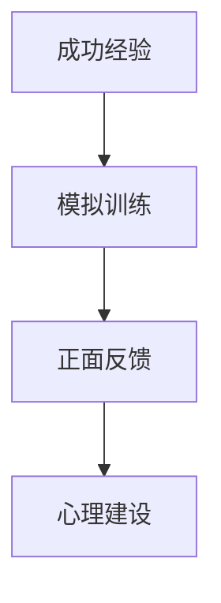

#### 2.4 自我反思与自我成长

自我反思是领导者自我提升的重要手段。通过自我反思，领导者可以发现自己的不足，并采取相应的措施进行改进。自我成长是一个持续的过程，需要领导者不断地学习和实践。

**自我反思与自我成长的方法**：

1. **认知阶段**：

   认知阶段是自我反思的起点。领导者需要意识到自己的不足和需要改进的地方。

   - **自我观察**：领导者需要通过自我观察，了解自己的行为和表现。
   - **接受反馈**：领导者需要接受他人的反馈，了解自己的优点和不足。

2. **规划阶段**：

   在规划阶段，领导者需要制定具体的改进计划和目标。

   - **设定目标**：领导者需要设定明确的个人和团队目标，确保改进计划的实施。
   - **制定计划**：领导者需要制定详细的改进计划，包括具体行动和时间表。

3. **执行阶段**：

   在执行阶段，领导者需要按照改进计划，采取具体的行动，实施改进措施。

   - **持续学习**：领导者需要持续学习，提升自己的知识和技能。
   - **实践应用**：领导者需要将学到的知识和技能应用于实际工作中，检验改进效果。

4. **评估阶段**：

   在评估阶段，领导者需要评估改进的效果，并根据评估结果进行相应的调整和优化。

   - **评估效果**：领导者需要评估改进措施的效果，了解改进目标的实现情况。
   - **优化改进**：领导者需要根据评估结果，调整和优化改进措施，确保改进目标的实现。

**自我反思与自我成长流程图**：

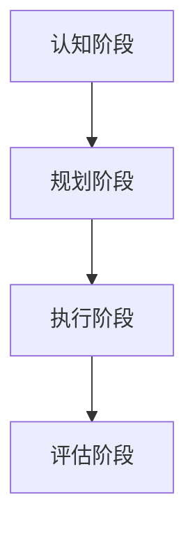

### 第3章：远见力的概念与特征

#### 3.1 远见力的定义

远见力是指领导者预见未来、洞察趋势的能力。它不仅仅是预测未来的技术或方法，更是一种深刻的洞察力和前瞻性思维。一个具备远见力的领导者能够在不确定的环境中做出明智的决策，引领组织走向成功。

**远见力的定义流程图**：

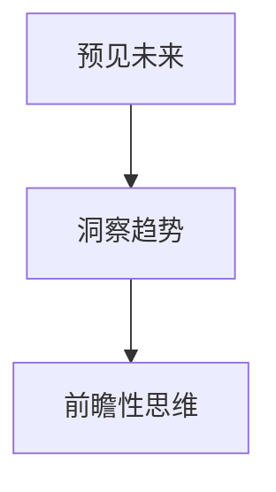

#### 3.2 远见力的特征

远见力具有以下几方面的特征：

1. **前瞻性**：

   远见力使领导者能够看到未来的趋势和发展方向。这种前瞻性来源于对历史数据的分析、对行业动态的洞察以及对新兴技术的关注。

   **前瞻性流程图**：

   ```mermaid
   graph TD
   A[历史数据分析] --> B[行业动态洞察]
   B --> C[新兴技术关注]
   ```

2. **洞察力**：

   远见力还要求领导者具备深入的洞察力，能够理解问题的本质，预见潜在的风险和机会。

   **洞察力流程图**：

   ```mermaid
   graph TD
   A[理解问题本质] --> B[预见风险和机会]
   ```

3. **适应性**：

   在变化迅速的商业环境中，领导者需要具备快速适应变化的能力。远见力使领导者能够灵活应对不确定性，迅速调整战略和方向。

   **适应性流程图**：

   ```mermaid
   graph TD
   A[快速调整战略] --> B[灵活应对不确定性]
   ```

4. **创新性**：

   远见力还包括领导者提出新思想、新解决方案的能力。这种创新性是组织持续发展和竞争力的关键。

   **创新性流程图**：

   ```mermaid
   graph TD
   A[新思想提出] --> B[新解决方案创造]
   ```

#### 3.3 远见力的重要性

远见力对领导者至关重要，主要体现在以下几个方面：

1. **决策支持**：

   远见力使领导者能够基于对未来的洞察，做出更加明智和有远见的决策。

   **决策支持流程图**：

   ```mermaid
   graph TD
   A[洞察未来趋势] --> B[做出明智决策]
   ```

2. **战略规划**：

   远见力有助于领导者制定长期战略规划，确保组织在未来市场中保持竞争优势。

   **战略规划流程图**：

   ```mermaid
   graph TD
   A[预见市场变化] --> B[制定长期战略]
   ```

3. **创新推动**：

   远见力激发领导者的创新思维，推动组织进行技术创新和管理创新，实现持续发展。

   **创新推动流程图**：

   ```mermaid
   graph TD
   A[激发创新思维] --> B[推动技术创新]
   ```

4. **风险防范**：

   远见力使领导者能够预见潜在的风险，提前制定应对策略，降低风险对组织的负面影响。

   **风险防范流程图**：

   ```mermaid
   graph TD
   A[预见潜在风险] --> B[制定应对策略]
   ```

#### 3.4 远见力的构成要素

远见力的构成要素包括以下几个方面：

1. **知识积累**：

   知识是远见力的基础。领导者需要广泛积累跨学科的知识，包括技术、商业、社会学等，以形成全面的视野。

   **知识积累流程图**：

   ```mermaid
   graph TD
   A[跨学科知识] --> B[全面视野]
   ```

2. **经验与洞察**：

   领导者的经验和对行业深刻的洞察是远见力的重要组成部分。通过积累经验，领导者能够更好地预测未来的发展趋势。

   **经验与洞察流程图**：

   ```mermaid
   graph TD
   A[行业经验] --> B[洞察趋势]
   ```

3. **创新思维**：

   创新思维是远见力的核心。领导者需要不断培养创新思维，敢于挑战传统，提出新的解决方案。

   **创新思维流程图**：

   ```mermaid
   graph TD
   A[创新思维培养] --> B[提出新方案]
   ```

4. **决策能力**：

   决策能力是远见力的重要体现。领导者需要具备良好的决策能力，能够基于远见做出合理的决策。

   **决策能力流程图**：

   ```mermaid
   graph TD
   A[基于远见做决策] --> B[合理决策]
   ```

**远见力的构成要素流程图**：

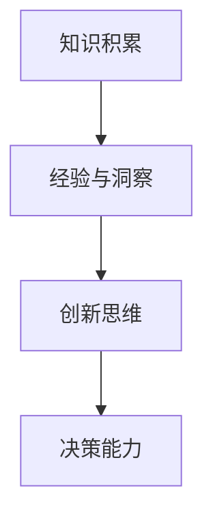

### 第4章：培养远见力

#### 4.1 学习与知识的积累

培养远见力需要不断学习和积累知识。以下是一些方法：

1. **广泛阅读**：

   通过阅读，领导者可以了解不同领域的知识，拓宽视野，增强对未来的洞察力。

   **阅读流程图**：

   ```mermaid
   graph TD
   A[拓宽视野] --> B[增强洞察力]
   ```

2. **学习新技能**：

   学习新技能，尤其是与未来发展趋势相关的技能，如人工智能、大数据分析等，有助于领导者更好地把握未来。

   **学习新技能流程图**：

   ```mermaid
   graph TD
   A[把握未来趋势] --> B[增强竞争力]
   ```

3. **参加研讨会和讲座**：

   通过参加研讨会和讲座，领导者可以了解行业最新的研究成果和趋势，与同行交流，提升自己的专业素养。

   **参加研讨会和讲座流程图**：

   ```mermaid
   graph TD
   A[了解最新动态] --> B[提升专业素养]
   ```

#### 4.2 观察能力的提升

提升观察能力可以帮助领导者更好地发现趋势和洞察力。以下是一些方法：

1. **细心观察**：

   细心观察有助于领导者发现隐藏在细节中的趋势和问题。

   **细心观察流程图**：

   ```mermaid
   graph TD
   A[发现趋势] --> B[发现问题]
   ```

2. **多角度思考**：

   从不同角度思考问题，有助于领导者更全面地理解问题，从而做出更准确的预测。

   **多角度思考流程图**：

   ```mermaid
   graph TD
   A[全面理解问题] --> B[准确预测趋势]
   ```

3. **培养好奇心**：

   培养好奇心可以激发领导者的探索欲望，使他们更愿意去了解新事物，从而提升观察能力。

   **培养好奇心流程图**：

   ```mermaid
   graph TD
   A[激发探索欲望] --> B[提升观察能力]
   ```

#### 4.3 创新思维的开发

创新思维是远见力的核心。以下是一些开发创新思维的方法：

1. **头脑风暴**：

   通过头脑风暴，领导者可以集思广益，提出新的想法和解决方案。

   **头脑风暴流程图**：

   ```mermaid
   graph TD
   A[集思广益] --> B[提出新想法]
   ```

2. **跨学科学习**：

   跨学科学习可以带来新的思考和灵感，有助于领导者打破思维定势。

   **跨学科学习流程图**：

   ```mermaid
   graph TD
   A[新思考] --> B[新灵感]
   ```

3. **实践应用**：

   将创新思维应用于实际工作中，可以验证和深化创新思维，提升领导者的实践能力。

   **实践应用流程图**：

   ```mermaid
   graph TD
   A[验证创新] --> B[深化思维]
   ```

#### 4.4 风险管理与决策能力

风险管理与决策能力是远见力的重要组成部分。以下是一些提升这些能力的方法：

1. **风险评估**：

   通过风险评估，领导者可以了解可能的风险和影响，从而做出更明智的决策。

   **风险评估流程图**：

   ```mermaid
   graph TD
   A[识别风险] --> B[评估影响]
   ```

2. **决策分析**：

   决策分析可以帮助领导者分析不同决策的优缺点，选择最佳方案。

   **决策分析流程图**：

   ```mermaid
   graph TD
   A[分析方案] --> B[选择最佳]
   ```

3. **应对策略**：

   制定应对策略，可以降低风险，确保决策的有效执行。

   **应对策略流程图**：

   ```mermaid
   graph TD
   A[制定策略] --> B[降低风险]
   ```

### 第5章：趋势预测的方法与工具

#### 5.1 趋势预测的基本方法

趋势预测是领导者预见未来趋势的重要手段。以下是一些基本方法：

1. **数据分析**：

   通过分析历史数据，可以找出潜在的趋势和规律。

   **数据分析流程图**：

   ```mermaid
   graph TD
   A[分析历史数据] --> B[找出趋势和规律]
   ```

2. **历史比较**：

   通过比较不同时期的数据，可以预测未来的趋势。

   **历史比较流程图**：

   ```mermaid
   graph TD
   A[比较历史数据] --> B[预测未来趋势]
   ```

3. **专家意见**：

   通过专家的意见，可以获取对未来趋势的洞察。

   **专家意见流程图**：

   ```mermaid
   graph TD
   A[获取专家意见] --> B[洞察未来趋势]
   ```

#### 5.2 趋势预测的工具

趋势预测的工具可以帮助领导者更有效地分析数据和获取信息。以下是一些常用的工具：

1. **统计软件**：

   如SPSS、R等，用于数据分析。

   **统计软件流程图**：

   ```mermaid
   graph TD
   A[数据分析] --> B[SPSS]
   B --> C[R]
   ```

2. **人工智能技术**：

   如机器学习、深度学习等，用于趋势预测。

   **人工智能技术流程图**：

   ```mermaid
   graph TD
   A[趋势预测] --> B[机器学习]
   B --> C[深度学习]
   ```

3. **专家系统**：

   通过专家的知识和经验，进行趋势预测。

   **专家系统流程图**：

   ```mermaid
   graph TD
   A[专家知识] --> B[趋势预测]
   ```

#### 5.3 趋势分析案例

以下是一个趋势分析案例：

- **背景**：某公司希望预测未来五年的销售额。
- **数据**：收集了过去十年的销售额数据。
- **方法**：使用时间序列分析方法，预测未来五年的销售额。

**数据分析流程图**：

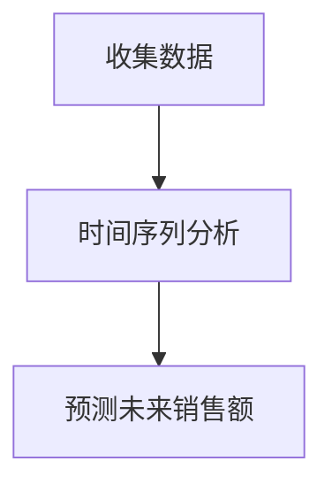

#### 5.4 趋势预测的误区与挑战

趋势预测虽然是一种强大的工具，但也存在一些误区和挑战：

1. **过度依赖数据**：

   过度依赖历史数据可能导致忽视其他重要因素，如市场变化、政策调整等。

   **过度依赖数据流程图**：

   ```mermaid
   graph TD
   A[依赖历史数据] --> B[忽视其他因素]
   ```

2. **预测的准确性**：

   趋势预测的准确性受到多种因素的影响，如数据质量、模型选择等。

   **预测准确性流程图**：

   ```mermaid
   graph TD
   A[数据质量] --> B[模型选择]
   ```

3. **决策的滞后性**：

   趋势预测往往具有一定的滞后性，可能导致决策的滞后。

   **决策滞后性流程图**：

   ```mermaid
   graph TD
   A[趋势预测] --> B[决策滞后]
   ```

### 第6章：预见未来趋势的实践应用

#### 6.1 企业战略规划

预见未来趋势在企业战略规划中的应用：

1. **市场定位**：

   根据未来趋势，确定企业的市场定位，确保企业能够抓住市场机会。

   **市场定位流程图**：

   ```mermaid
   graph TD
   A[分析未来趋势] --> B[确定市场定位]
   ```

2. **产品规划**：

   根据未来趋势，规划产品的发展方向，确保产品能够满足市场需求。

   **产品规划流程图**：

   ```mermaid
   graph TD
   A[分析未来趋势] --> B[规划产品方向]
   ```

3. **技术创新**：

   根据未来趋势，投资于技术创新，确保企业能够在技术变革中保持领先地位。

   **技术创新流程图**：

   ```mermaid
   graph TD
   A[分析未来趋势] --> B[投资技术创新]
   ```

#### 6.2 市场营销策略

预见未来趋势在市场营销策略中的应用：

1. **市场细分**：

   根据未来趋势，进行市场细分，确保营销策略能够针对不同市场群体。

   **市场细分流程图**：

   ```mermaid
   graph TD
   A[分析未来趋势] --> B[市场细分]
   ```

2. **目标客户**：

   根据未来趋势，确定目标客户，确保营销资源能够有效利用。

   **目标客户流程图**：

   ```mermaid
   graph TD
   A[分析未来趋势] --> B[确定目标客户]
   ```

3. **营销手段**：

   根据未来趋势，选择合适的营销手段，确保营销策略能够达到预期效果。

   **营销手段流程图**：

   ```mermaid
   graph TD
   A[分析未来趋势] --> B[选择营销手段]
   ```

#### 6.3 人力资源管理

预见未来趋势在人力资源管理中的应用：

1. **人才招聘**：

   根据未来趋势，招聘符合企业需求的人才，确保企业能够适应未来发展。

   **人才招聘流程图**：

   ```mermaid
   graph TD
   A[分析未来趋势] --> B[招聘人才]
   ```

2. **员工培训**：

   根据未来趋势，进行员工培训，提升员工的能力和素质，确保企业能够应对未来挑战。

   **员工培训流程图**：

   ```mermaid
   graph TD
   A[分析未来趋势] --> B[员工培训]
   ```

3. **绩效评估**：

   根据未来趋势，制定绩效评估标准，确保绩效评估能够激励员工，推动企业进步。

   **绩效评估流程图**：

   ```mermaid
   graph TD
   A[分析未来趋势] --> B[绩效评估]
   ```

#### 6.4 风险管理与危机应对

预见未来趋势在风险管理与危机应对中的应用：

1. **风险识别**：

   根据未来趋势，识别潜在的风险，确保企业能够提前防范。

   **风险识别流程图**：

   ```mermaid
   graph TD
   A[分析未来趋势] --> B[识别风险]
   ```

2. **风险评估**：

   根据未来趋势，评估风险的影响和可能性，确保企业能够制定有效的风险应对策略。

   **风险评估流程图**：

   ```mermaid
   graph TD
   A[分析未来趋势] --> B[评估风险]
   ```

3. **危机应对**：

   根据未来趋势，制定危机应对策略，确保企业在面对危机时能够迅速响应。

   **危机应对流程图**：

   ```mermaid
   graph TD
   A[分析未来趋势] --> B[制定应对策略]
   ```

### 第7章：领导力与远见力的融合

#### 7.1 领导力与远见力的关系

领导力与远见力之间存在着密切的关系。领导力为远见力的发挥提供了基础，而远见力则为领导力提供了方向和目标。

1. **领导力的基础**：

   远见力是领导力的重要组成部分，是领导者预见未来、把握机遇的能力。

   **领导力的基础流程图**：

   ```mermaid
   graph TD
   A[领导力] --> B[远见力]
   ```

2. **远见力的支撑**：

   领导力是远见力得以发挥的基础，领导者需要通过有效的领导力，将远见力的洞察和预测转化为实际行动。

   **远见力的支撑流程图**：

   ```mermaid
   graph TD
   A[远见力] --> B[领导力]
   ```

#### 7.2 如何在组织中融合领导力与远见力

以下是在组织中融合领导力与远见力的方法：

1. **愿景引导**：

   领导者需要通过远见力，制定清晰的愿景，并引导组织朝着这个愿景前进。

   **愿景引导流程图**：

   ```mermaid
   graph TD
   A[领导者] --> B[远见力]
   B --> C[制定愿景]
   C --> D[引导组织]
   ```

2. **决策支持**：

   领导者需要利用远见力，为决策提供有力的支持，确保决策的前瞻性和准确性。

   **决策支持流程图**：

   ```mermaid
   graph TD
   A[领导者] --> B[远见力]
   B --> C[决策支持]
   ```

3. **团队激励**：

   领导者需要通过有效的沟通和激励，激发团队成员的远见力和创新能力。

   **团队激励流程图**：

   ```mermaid
   graph TD
   A[领导者] --> B[沟通与激励]
   B --> C[远见力与创新能力]
   ```

#### 7.3 案例分析：领导力与远见力的成功实践

以下是一个领导力与远见力的成功实践案例：

- **背景**：某公司领导者通过远见力，预见到互联网行业的发展趋势，及时调整公司战略，进军互联网领域。
- **实践**：领导者通过有效的领导力，推动公司的技术创新和团队协作，成功实现了企业的转型和快速发展。

**案例分析流程图**：

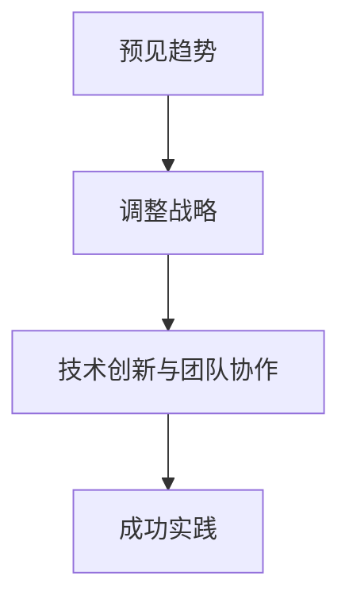

#### 7.4 领导力与远见力的未来发展趋势

随着社会的不断进步和变化，领导力与远见力将面临以下发展趋势：

1. **数字化领导力**：

   领导者需要具备数字化素养，能够利用数字化工具进行趋势预测和管理。

   **数字化领导力流程图**：

   ```mermaid
   graph TD
   A[数字化素养] --> B[趋势预测]
   ```

2. **可持续发展领导力**：

   领导者需要关注可持续发展，将远见力应用于环境保护和社会责任。

   **可持续发展领导力流程图**：

   ```mermaid
   graph TD
   A[环境保护] --> B[社会责任]
   ```

3. **跨文化领导力**：

   领导者需要具备跨文化沟通和协作能力，应对全球化的挑战。

   **跨文化领导力流程图**：

   ```mermaid
   graph TD
   A[跨文化沟通] --> B[协作能力]
   ```

### 第8章：领导力与远见力的持续提升

#### 8.1 持续学习的重要性

持续学习是领导力与远见力提升的关键。以下是一些持续学习的方法：

1. **专业培训**：

   参加专业培训，提升专业知识和技能。

   **专业培训流程图**：

   ```mermaid
   graph TD
   A[提升知识] --> B[提升技能]
   ```

2. **阅读**：

   广泛阅读，了解最新的研究成果和趋势。

   **阅读流程图**：

   ```mermaid
   graph TD
   A[了解研究] --> B[掌握趋势]
   ```

3. **实践**：

   通过实践，将理论知识应用于实际工作中。

   **实践流程图**：

   ```mermaid
   graph TD
   A[应用知识] --> B[实践工作]
   ```

#### 8.2 自我提升的策略

以下是一些自我提升的策略：

1. **设定目标**：

   设定明确的个人发展目标，并制定实现目标的计划。

   **设定目标流程图**：

   ```mermaid
   graph TD
   A[明确目标] --> B[制定计划]
   ```

2. **反思与总结**：

   定期进行反思和总结，了解自己的优点和不足，并制定改进措施。

   **反思与总结流程图**：

   ```mermaid
   graph TD
   A[自我反思] --> B[总结经验]
   ```

3. **寻求反馈**：

   主动寻求他人的反馈，了解自己的不足，并加以改进。

   **寻求反馈流程图**：

   ```mermaid
   graph TD
   A[寻求反馈] --> B[改进自我]
   ```

#### 8.3 反思与总结

反思与总结是领导力与远见力提升的重要环节。以下是一些反思与总结的方法：

1. **定期回顾**：

   定期回顾自己的工作和学习，了解自己的进步和不足。

   **定期回顾流程图**：

   ```mermaid
   graph TD
   A[回顾工作] --> B[回顾学习]
   ```

2. **记录笔记**：

   记录学习和工作中的重要信息，便于回顾和总结。

   **记录笔记流程图**：

   ```mermaid
   graph TD
   A[记录信息] --> B[回顾总结]
   ```

3. **交流与分享**：

   与他人交流学习心得和经验，分享自己的见解和思考。

   **交流与分享流程图**：

   ```mermaid
   graph TD
   A[交流经验] --> B[分享见解]
   ```

#### 8.4 领导力与远见力的未来挑战

随着社会的不断变化和进步，领导力与远见力将面临以下挑战：

1. **技术创新**：

   领导者需要不断学习新技术，应对技术变革的挑战。

   **技术创新流程图**：

   ```mermaid
   graph TD
   A[学习新技术] --> B[应对变革]
   ```

2. **全球化**：

   领导者需要具备跨文化沟通和协作能力，应对全球化的挑战。

   **全球化流程图**：

   ```mermaid
   graph TD
   A[跨文化沟通] --> B[协作能力]
   ```

3. **可持续发展**：

   领导者需要关注可持续发展，应对环境和社会责任的问题。

   **可持续发展流程图**：

   ```mermaid
   graph TD
   A[关注环境] --> B[社会责任]
   ```

### 附录

#### 附录A：领导力与远见力相关的书籍与资源

以下是一些领导力与远见力相关的书籍和资源：

- **书籍**：
  - 《领导力与远见》
  - 《第五项修炼》
  - 《智能时代》

- **网站**：
  - 领英（LinkedIn）
  - 谷歌学术（Google Scholar）
  - Harvard Business Review（哈佛商业评论）

- **视频课程**：
  - Coursera上的领导力课程
  - Udemy上的远见力课程
  - YouTube上的领导力与远见力讲座

### 作者信息

- 作者：AI天才研究院/AI Genius Institute & 禅与计算机程序设计艺术 /Zen And The Art of Computer Programming

---

（注：本文仅为大纲结构，具体内容需进一步填充和详细阐述。）

---

### 第1章：领导力的定义与核心要素

#### 1.1 领导力的本质

领导力是一种影响和激励他人实现共同目标的能力。它不仅仅是职位或角色的赋予，更是一种行为和态度的体现。一个成功的领导者不仅仅要具备专业知识和技能，还需要具备一系列的核心要素，如沟通能力、决策能力、团队合作能力等。

**领导力的核心概念**：

- **影响**：领导力本质上是一种影响他人的能力。领导者需要能够影响团队成员的观点、行为和态度，使他们朝着共同的目标努力。
- **激励**：领导者需要能够激发团队成员的积极性和创造力，使他们保持高度的动机和热情。
- **愿景**：领导者需要有明确的愿景和目标，能够带领团队朝着这个目标前进。
- **变革**：领导者需要具备变革的能力，能够在组织面临挑战和不确定性时，推动组织进行创新和变革。

**领导力的核心概念流程图**：


#### 1.2 领导力的核心要素

领导力的核心要素包括以下几个方面：

1. **目标导向**：

   目标导向是领导者成功的关键。一个有效的领导者需要明确组织的愿景和目标，并将其传达给团队成员。通过制定清晰的目标，领导者可以激励团队成员为实现共同目标而努力。

   **目标导向的核心要素**：

   - **明确目标**：领导者需要明确组织的愿景和目标，使其具体、可测量和可实现。
   - **设定目标**：领导者需要根据组织的愿景和目标，设定具体的、可实现的个人和团队目标。
   - **追踪进度**：领导者需要定期追踪目标的进度，确保团队成员了解目标的进展情况。

2. **影响力**：

   领导者需要具备强大的影响力，能够影响他人的思想和行为。这种影响力来自于领导者的权威、信任和个人魅力。

   **影响力的核心要素**：

   - **权威**：领导者需要具备一定的权威，使其在组织中的地位得到认可。
   - **信任**：领导者需要建立与团队成员之间的信任关系，使其愿意接受领导者的指导和影响。
   - **个人魅力**：领导者需要具备一定的个人魅力，能够吸引和激励团队成员。

3. **沟通能力**：

   沟通能力是领导者成功的关键因素之一。一个有效的领导者需要具备良好的沟通技巧，能够清晰地表达自己的想法，理解团队成员的观点和需求。

   **沟通能力的核心要素**：

   - **表达**：领导者需要能够清晰、准确地表达自己的想法和意见。
   - **倾听**：领导者需要具备良好的倾听技巧，理解团队成员的观点和需求。
   - **反馈**：领导者需要给予团队成员及时的反馈，帮助其改进和提高。

4. **决策能力**：

   决策能力是领导者的一项重要能力。领导者需要在面对复杂问题和不确定性时，做出明智的决策。

   **决策能力的核心要素**：

   - **分析**：领导者需要能够对问题进行深入分析，找出问题的根本原因。
   - **评估**：领导者需要能够评估不同的解决方案，选择最佳方案。
   - **执行**：领导者需要能够确保决策得到有效执行，实现预期目标。

5. **团队合作**：

   团队合作能力是领导者成功的关键。领导者需要能够建立和维护一个高效的团队，使团队成员之间相互支持、协作和信任。

   **团队合作的核心要素**：

   - **协作**：领导者需要能够促进团队成员之间的协作，共同实现目标。
   - **支持**：领导者需要给予团队成员支持和鼓励，帮助其克服困难。
   - **信任**：领导者需要建立团队成员之间的信任关系，使其愿意分享信息和承担责任。

**领导力的核心要素流程图**：


#### 1.3 领导力的重要性

领导力对于组织和个人都具有重要意义。以下从几个方面阐述领导力的重要性：

1. **组织效率**：

   领导力能够提高组织的效率，实现资源的最佳配置。一个有效的领导者能够明确组织的愿景和目标，制定合理的战略和计划，确保组织资源得到充分利用。

2. **团队士气**：

   领导力能够提升团队的士气，使团队成员更有动力地工作。一个具有领导力的领导者能够激励团队成员，使其在困难面前保持积极的心态和信心。

3. **创新与变革**：

   领导力能够推动组织进行创新和变革，以适应外部环境的变化。一个具有远见的领导者能够预见未来的趋势和挑战，带领组织不断创新，保持竞争优势。

4. **可持续发展**：

   领导力是实现组织可持续发展的关键。一个有效的领导者不仅关注组织的短期利益，还关注组织的长期发展，推动组织实现可持续发展目标。

**领导力的重要性流程图**：


#### 1.4 领导力的发展历程

领导力的发展历程可以追溯到几个关键阶段。以下简要介绍这些阶段：

1. **传统领导力**：

   传统领导力强调权威和控制。领导者通过职位和权力来指挥和监督团队成员，实现组织目标。

2. **变革型领导力**：

   变革型领导力强调领导者与团队成员之间的互动和信任。领导者通过激励和启发团队成员，推动组织变革和发展。

3. **服务型领导力**：

   服务型领导力强调领导者为团队成员提供服务，以实现共同的目标。领导者关注团队成员的需求和福祉，通过提供支持和资源，帮助团队成员实现个人和团队目标。

4. **情境领导力**：

   情境领导力强调领导者根据不同的情境和团队成员的特点，采取不同的领导风格。领导者需要灵活调整自己的领导方式，以适应不同的环境和挑战。

**领导力的发展历程流程图**：


### 第2章：领导者的自我认知与自我管理

#### 2.1 自我认知的重要性

自我认知是领导者的基础。一个领导者需要清楚地了解自己的优点和缺点，以及自己的价值观和信念。自我认知能够帮助领导者更好地理解自己，发挥自己的优势，克服自己的不足。

**自我认知的核心要素**：

- **了解自己的优势**：领导者需要明确自己的优势，发挥这些优势，提高工作效率和影响力。
- **识别自己的不足**：领导者需要诚实地识别自己的不足，并寻求改进的方法，以提高自己的能力。
- **明确价值观和信念**：领导者需要明确自己的价值观和信念，使其在领导过程中能够保持一致性和稳定性。

**自我认知流程图**：


#### 2.2 自我管理的方法

自我管理是领导者自我提升的关键。通过自我管理，领导者可以更好地控制自己的情绪和行为，提高工作效率和领导力。

**自我管理的方法**：

1. **时间管理**：

   时间管理是自我管理的重要组成部分。领导者需要合理安排时间，确保工作与生活之间的平衡。

   - **设定优先级**：领导者需要明确任务的优先级，将时间集中在最重要和最紧急的任务上。
   - **制定计划**：领导者需要制定详细的工作计划，合理安排工作时间。
   - **避免拖延**：领导者需要克服拖延症，确保任务按时完成。

2. **情绪管理**：

   情绪管理是领导者自我管理的重要方面。领导者需要学会控制自己的情绪，保持冷静和理智。

   - **自我反思**：领导者需要定期进行自我反思，了解自己的情绪变化，并找到合适的应对策略。
   - **调整心态**：领导者需要调整自己的心态，保持积极和乐观的态度。
   - **寻求支持**：领导者可以寻求家人、朋友或同事的支持，帮助自己应对压力和挑战。

3. **知识管理**：

   知识管理是领导者自我管理的重要内容。领导者需要不断学习，提升自己的知识和技能。

   - **持续学习**：领导者需要持续学习，掌握最新的行业动态和知识。
   - **知识共享**：领导者需要积极参与知识共享，与团队成员交流经验和知识。
   - **培训与发展**：领导者需要积极参与培训和发展活动，提升自己的专业能力和领导力。

4. **决策管理**：

   决策管理是领导者自我管理的重要方面。领导者需要学会做出明智的决策，确保决策的有效性和合理性。

   - **分析信息**：领导者需要收集和分析相关信息，确保决策的依据充分。
   - **评估风险**：领导者需要评估决策的风险和影响，确保决策的可行性。
   - **执行决策**：领导者需要确保决策得到有效执行，实现预期目标。

**自我管理流程图**：


#### 2.3 自我效能感的提升

自我效能感是指领导者对自己完成某项任务的信心。提升自我效能感有助于领导者更好地应对挑战和压力，提高工作效率和领导力。

**提升自我效能感的方法**：

1. **成功经验**：

   通过成功的经历，提升自我效能感。领导者需要在工作中积累成功的经验，并将其应用于未来的挑战中。

   - **设定挑战性目标**：领导者需要设定具有挑战性的目标，通过实现目标，提升自我效能感。
   - **庆祝成功**：领导者需要庆祝自己的成功，增强自信心和动力。

2. **模拟训练**：

   通过模拟训练，提升自我效能感。领导者可以通过模拟训练，提前准备，减少不确定性，提高应对挑战的能力。

   - **情境模拟**：领导者可以通过情境模拟，模拟可能出现的挑战和问题，提前准备应对策略。
   - **角色扮演**：领导者可以通过角色扮演，模拟与团队成员的沟通和合作，提高沟通和协作能力。

3. **正面反馈**：

   通过正面反馈，提升自我效能感。领导者需要主动寻求他人的正面反馈，了解自己的优点和长处。

   - **自我反馈**：领导者需要定期进行自我反思和评估，了解自己的进步和不足。
   - **他人反馈**：领导者可以寻求同事、下属或领导的反馈，了解自己的表现和改进方向。

4. **心理建设**：

   通过心理建设，提升自我效能感。领导者需要建立良好的心理素质，增强面对困难和挑战的勇气和决心。

   - **积极心态**：领导者需要保持积极的心态，面对困难和挑战时，保持冷静和理智。
   - **自我激励**：领导者需要自我激励，相信自己能够克服困难，实现目标。

**提升自我效能感流程图**：


#### 2.4 自我反思与自我成长

自我反思是领导者自我提升的重要手段。通过自我反思，领导者可以发现自己的不足，并采取相应的措施进行改进。自我成长是一个持续的过程，需要领导者不断地学习和实践。

**自我反思与自我成长的方法**：

1. **认知阶段**：

   认知阶段是自我反思的起点。领导者需要意识到自己的不足和需要改进的地方。

   - **自我观察**：领导者需要通过自我观察，了解自己的行为和表现。
   - **接受反馈**：领导者需要接受他人的反馈，了解自己的优点和不足。

2. **规划阶段**：

   在规划阶段，领导者需要制定具体的改进计划和目标。

   - **设定目标**：领导者需要设定明确的个人和团队目标，确保改进计划的实施。
   - **制定计划**：领导者需要制定详细的改进计划，包括具体行动和时间表。

3. **执行阶段**：

   在执行阶段，领导者需要按照改进计划，采取具体的行动，实施改进措施。

   - **持续学习**：领导者需要持续学习，提升自己的知识和技能。
   - **实践应用**：领导者需要将学到的知识和技能应用于实际工作中，检验改进效果。

4. **评估阶段**：

   在评估阶段，领导者需要评估改进的效果，并根据评估结果进行相应的调整和优化。

   - **评估效果**：领导者需要评估改进措施的效果，了解改进目标的实现情况。
   - **优化改进**：领导者需要根据评估结果，调整和优化改进措施，确保改进目标的实现。

**自我反思与自我成长流程图**：


### 第3章：远见力的概念与特征

#### 3.1 远见力的定义

远见力是指领导者预见未来、洞察趋势的能力。它不仅仅是预测未来的技术或方法，更是一种深刻的洞察力和前瞻性思维。一个具备远见力的领导者能够在不确定的环境中做出明智的决策，引领组织走向成功。

**远见力的定义流程图**：

```mermaid
graph TD
A[预见未来] --> B[洞察趋势]
B --> C[前瞻性思维]
```

#### 3.2 远见力的特征

远见力具有以下几方面的特征：

1. **前瞻性**：

   远见力使领导者能够看到未来的趋势和发展方向。这种前瞻性来源于对历史数据的分析、对行业动态的洞察以及对新兴技术的关注。

   **前瞻性流程图**：

   ```mermaid
   graph TD
   A[历史数据分析] --> B[行业动态洞察]
   B --> C[新兴技术关注]
   ```

2. **洞察力**：

   远见力还要求领导者具备深入的洞察力，能够理解问题的本质，预见潜在的风险和机会。

   **洞察力流程图**：

   ```mermaid
   graph TD
   A[理解问题本质] --> B[预见风险和机会]
   ```

3. **适应性**：

   在变化迅速的商业环境中，领导者需要具备快速适应变化的能力。远见力使领导者能够灵活应对不确定性，迅速调整战略和方向。

   **适应性流程图**：

   ```mermaid
   graph TD
   A[快速调整战略] --> B[灵活应对不确定性]
   ```

4. **创新性**：

   远见力还包括领导者提出新思想、新解决方案的能力。这种创新性是组织持续发展和竞争力的关键。

   **创新性流程图**：

   ```mermaid
   graph TD
   A[新思想提出] --> B[新解决方案创造]
   ```

#### 3.3 远见力的重要性

远见力对领导者至关重要，主要体现在以下几个方面：

1. **决策支持**：

   远见力使领导者能够基于对未来的洞察，做出更加明智和有远见的决策。

   **决策支持流程图**：

   ```mermaid
   graph TD
   A[洞察未来趋势] --> B[做出明智决策]
   ```

2. **战略规划**：

   远见力有助于领导者制定长期战略规划，确保组织在未来市场中保持竞争优势。

   **战略规划流程图**：

   ```mermaid
   graph TD
   A[预见市场变化] --> B[制定长期战略]
   ```

3. **创新推动**：

   远见力激发领导者的创新思维，推动组织进行技术创新和管理创新，实现持续发展。

   **创新推动流程图**：

   ```mermaid
   graph TD
   A[激发创新思维] --> B[推动技术创新]
   ```

4. **风险防范**：

   远见力使领导者能够预见潜在的风险，提前制定应对策略，降低风险对组织的负面影响。

   **风险防范流程图**：

   ```mermaid
   graph TD
   A[预见潜在风险] --> B[制定应对策略]
   ```

#### 3.4 远见力的构成要素

远见力的构成要素包括以下几个方面：

1. **知识积累**：

   知识是远见力的基础。领导者需要广泛积累跨学科的知识，包括技术、商业、社会学等，以形成全面的视野。

   **知识积累流程图**：

   ```mermaid
   graph TD
   A[跨学科知识] --> B[全面视野]
   ```

2. **经验与洞察**：

   领导者的经验和对行业深刻的洞察是远见力的重要组成部分。通过积累经验，领导者能够更好地预测未来的发展趋势。

   **经验与洞察流程图**：

   ```mermaid
   graph TD
   A[行业经验] --> B[洞察趋势]
   ```

3. **创新思维**：

   创新思维是远见力的核心。领导者需要不断培养创新思维，敢于挑战传统，提出新的解决方案。

   **创新思维流程图**：

   ```mermaid
   graph TD
   A[创新思维培养] --> B[提出新方案]
   ```

4. **决策能力**：

   决策能力是远见力的重要体现。领导者需要具备良好的决策能力，能够基于远见做出合理的决策。

   **决策能力流程图**：

   ```mermaid
   graph TD
   A[基于远见做决策] --> B[合理决策]
   ```

**远见力的构成要素流程图**：

```mermaid
graph TD
A[知识积累] --> B[经验与洞察]
B --> C[创新思维]
C --> D[决策能力]
```

### 第4章：培养远见力

#### 4.1 学习与知识的积累

培养远见力需要不断学习和积累知识。以下是一些方法：

1. **广泛阅读**：

   通过阅读，领导者可以了解不同领域的知识，拓宽视野，增强对未来的洞察力。

   **阅读流程图**：

   ```mermaid
   graph TD
   A[拓宽视野] --> B[增强洞察力]
   ```

2. **学习新技能**：

   学习新技能，尤其是与未来发展趋势相关的技能，如人工智能、大数据分析等，有助于领导者更好地把握未来。

   **学习新技能流程图**：

   ```mermaid
   graph TD
   A[把握未来趋势] --> B[增强竞争力]
   ```

3. **参加研讨会和讲座**：

   通过参加研讨会和讲座，领导者可以了解行业最新的研究成果和趋势，与同行交流，提升自己的专业素养。

   **参加研讨会和讲座流程图**：

   ```mermaid
   graph TD
   A[了解最新动态] --> B[提升专业素养]
   ```

#### 4.2 观察能力的提升

提升观察能力可以帮助领导者更好地发现趋势和洞察力。以下是一些方法：

1. **细心观察**：

   细心观察有助于领导者发现隐藏在细节中的趋势和问题。

   **细心观察流程图**：

   ```mermaid
   graph TD
   A[发现趋势] --> B[发现问题]
   ```

2. **多角度思考**：

   从不同角度思考问题，有助于领导者更全面地理解问题，从而做出更准确的预测。

   **多角度思考流程图**：

   ```mermaid
   graph TD
   A[全面理解问题] --> B[准确预测趋势]
   ```

3. **培养好奇心**：

   培养好奇心可以激发领导者的探索欲望，使他们更愿意去了解新事物，从而提升观察能力。

   **培养好奇心流程图**：

   ```mermaid
   graph TD
   A[激发探索欲望] --> B[提升观察能力]
   ```

#### 4.3 创新思维的开发

创新思维是远见力的核心。以下是一些开发创新思维的方法：

1. **头脑风暴**：

   通过头脑风暴，领导者可以集思广益，提出新的想法和解决方案。

   **头脑风暴流程图**：

   ```mermaid
   graph TD
   A[集思广益] --> B[提出新想法]
   ```

2. **跨学科学习**：

   跨学科学习可以带来新的思考和灵感，有助于领导者打破思维定势。

   **跨学科学习流程图**：

   ```mermaid
   graph TD
   A[新思考] --> B[新灵感]
   ```

3. **实践应用**：

   将创新思维应用于实际工作中，可以验证和深化创新思维，提升领导者的实践能力。

   **实践应用流程图**：

   ```mermaid
   graph TD
   A[验证创新] --> B[深化思维]
   ```

#### 4.4 风险管理与决策能力

风险管理与决策能力是远见力的重要组成部分。以下是一些提升这些能力的方法：

1. **风险评估**：

   通过风险评估，领导者可以了解可能的风险和影响，从而做出更明智的决策。

   **风险评估流程图**：

   ```mermaid
   graph TD
   A[识别风险] --> B[评估影响]
   ```

2. **决策分析**：

   决策分析可以帮助领导者分析不同决策的优缺点，选择最佳方案。

   **决策分析流程图**：

   ```mermaid
   graph TD
   A[分析方案] --> B[选择最佳]
   ```

3. **应对策略**：

   制定应对策略，可以降低风险，确保决策的有效执行。

   **应对策略流程图**：

   ```mermaid
   graph TD
   A[制定策略] --> B[降低风险]
   ```

### 第5章：趋势预测的方法与工具

#### 5.1 趋势预测的基本方法

趋势预测是领导者预见未来趋势的重要手段。以下是一些基本方法：

1. **数据分析**：

   通过分析历史数据，可以找出潜在的趋势和规律。

   **数据分析流程图**：

   ```mermaid
   graph TD
   A[分析历史数据] --> B[找出趋势和规律]
   ```

2. **历史比较**：

   通过比较不同时期的数据，可以预测未来的趋势。

   **历史比较流程图**：

   ```mermaid
   graph TD
   A[比较历史数据] --> B[预测未来趋势]
   ```

3. **专家意见**：

   通过专家的意见，可以获取对未来趋势的洞察。

   **专家意见流程图**：

   ```mermaid
   graph TD
   A[获取专家意见] --> B[洞察未来趋势]
   ```

#### 5.2 趋势预测的工具

趋势预测的工具可以帮助领导者更有效地分析数据和获取信息。以下是一些常用的工具：

1. **统计软件**：

   如SPSS、R等，用于数据分析。

   **统计软件流程图**：

   ```mermaid
   graph TD
   A[数据分析] --> B[SPSS]
   B --> C[R]
   ```

2. **人工智能技术**：

   如机器学习、深度学习等，用于趋势预测。

   **人工智能技术流程图**：

   ```mermaid
   graph TD
   A[趋势预测] --> B[机器学习]
   B --> C[深度学习]
   ```

3. **专家系统**：

   通过专家的知识和经验，进行趋势预测。

   **专家系统流程图**：

   ```mermaid
   graph TD
   A[专家知识] --> B[趋势预测]
   ```

#### 5.3 趋势分析案例

以下是一个趋势分析案例：

- **背景**：某公司希望预测未来五年的销售额。
- **数据**：收集了过去十年的销售额数据。
- **方法**：使用时间序列分析方法，预测未来五年的销售额。

**数据分析流程图**：

```mermaid
graph TD
A[收集数据] --> B[时间序列分析]
B --> C[预测未来销售额]
```

#### 5.4 趋势预测的误区与挑战

趋势预测虽然是一种强大的工具，但也存在一些误区和挑战：

1. **过度依赖数据**：

   过度依赖历史数据可能导致忽视其他重要因素，如市场变化、政策调整等。

   **过度依赖数据流程图**：

   ```mermaid
   graph TD
   A[依赖历史数据] --> B[忽视其他因素]
   ```

2. **预测的准确性**：

   趋势预测的准确性受到多种因素的影响，如数据质量、模型选择等。

   **预测准确性流程图**：

   ```mermaid
   graph TD
   A[数据质量] --> B[模型选择]
   ```

3. **决策的滞后性**：

   趋势预测往往具有一定的滞后性，可能导致决策的滞后。

   **决策滞后性流程图**：

   ```mermaid
   graph TD
   A[趋势预测] --> B[决策滞后]
   ```

### 第6章：预见未来趋势的实践应用

#### 6.1 企业战略规划

预见未来趋势在企业战略规划中的应用：

1. **市场定位**：

   根据未来趋势，确定企业的市场定位，确保企业能够抓住市场机会。

   **市场定位流程图**：

   ```mermaid
   graph TD
   A[分析未来趋势] --> B[确定市场定位]
   ```

2. **产品规划**：

   根据未来趋势，规划产品的发展方向，确保产品能够满足市场需求。

   **产品规划流程图**：

   ```mermaid
   graph TD
   A[分析未来趋势] --> B[规划产品方向]
   ```

3. **技术创新**：

   根据未来趋势，投资于技术创新，确保企业能够在技术变革中保持领先地位。

   **技术创新流程图**：

   ```mermaid
   graph TD
   A[分析未来趋势] --> B[投资技术创新]
   ```

#### 6.2 市场营销策略

预见未来趋势在市场营销策略中的应用：

1. **市场细分**：

   根据未来趋势，进行市场细分，确保营销策略能够针对不同市场群体。

   **市场细分流程图**：

   ```mermaid
   graph TD
   A[分析未来趋势] --> B[市场细分]
   ```

2. **目标客户**：

   根据未来趋势，确定目标客户，确保营销资源能够有效利用。

   **目标客户流程图**：

   ```mermaid
   graph TD
   A[分析未来趋势] --> B[确定目标客户]
   ```

3. **营销手段**：

   根据未来趋势，选择合适的营销手段，确保营销策略能够达到预期效果。

   **营销手段流程图**：

   ```mermaid
   graph TD
   A[分析未来趋势] --> B[选择营销手段]
   ```

#### 6.3 人力资源管理

预见未来趋势在人力资源管理中的应用：

1. **人才招聘**：

   根据未来趋势，招聘符合企业需求的人才，确保企业能够适应未来发展。

   **人才招聘流程图**：

   ```mermaid
   graph TD
   A[分析未来趋势] --> B[招聘人才]
   ```

2. **员工培训**：

   根据未来趋势，进行员工培训，提升员工的能力和素质，确保企业能够应对未来挑战。

   **员工培训流程图**：

   ```mermaid
   graph TD
   A[分析未来趋势] --> B[员工培训]
   ```

3. **绩效评估**：

   根据未来趋势，制定绩效评估标准，确保绩效评估能够激励员工，推动企业进步。

   **绩效评估流程图**：

   ```mermaid
   graph TD
   A[分析未来趋势] --> B[绩效评估]
   ```

#### 6.4 风险管理与危机应对

预见未来趋势在风险管理与危机应对中的应用：

1. **风险识别**：

   根据未来趋势，识别潜在的风险，确保企业能够提前防范。

   **风险识别流程图**：

   ```mermaid
   graph TD
   A[分析未来趋势] --> B[识别风险]
   ```

2. **风险评估**：

   根据未来趋势，评估风险的影响和可能性，确保企业能够制定有效的风险应对策略。

   **风险评估流程图**：

   ```mermaid
   graph TD
   A[分析未来趋势] --> B[评估风险]
   ```

3. **危机应对**：

   根据未来趋势，制定危机应对策略，确保企业在面对危机时能够迅速响应。

   **危机应对流程图**：

   ```mermaid
   graph TD
   A[分析未来趋势] --> B[制定应对策略]
   ```

### 第7章：领导力与远见力的融合

#### 7.1 领导力与远见力的关系

领导力与远见力之间存在着密切的关系。领导力为远见力的发挥提供了基础，而远见力则为领导力提供了方向和目标。

1. **领导力的基础**：

   远见力是领导力的重要组成部分，是领导者预见未来、把握机遇的能力。

   **领导力的基础流程图**：

   ```mermaid
   graph TD
   A[领导力] --> B[远见力]
   ```

2. **远见力的支撑**：

   领导力是远见力得以发挥的基础，领导者需要通过有效的领导力，将远见力的洞察和预测转化为实际行动。

   **远见力的支撑流程图**：

   ```mermaid
   graph TD
   A[远见力] --> B[领导力]
   ```

#### 7.2 如何在组织中融合领导力与远见力

以下是在组织中融合领导力与远见力的方法：

1. **愿景引导**：

   领导者需要通过远见力，制定清晰的愿景，并引导组织朝着这个愿景前进。

   **愿景引导流程图**：

   ```mermaid
   graph TD
   A[领导者] --> B[远见力]
   B --> C[制定愿景]
   C --> D[引导组织]
   ```

2. **决策支持**：

   领导者需要利用远见力，为决策提供有力的支持，确保决策的前瞻性和准确性。

   **决策支持流程图**：

   ```mermaid
   graph TD
   A[领导者] --> B[远见力]
   B --> C[决策支持]
   ```

3. **团队激励**：

   领导者需要通过有效的沟通和激励，激发团队成员的远见力和创新能力。

   **团队激励流程图**：

   ```mermaid
   graph TD
   A[领导者] --> B[沟通与激励]
   B --> C[远见力与创新能力]
   ```

#### 7.3 案例分析：领导力与远见力的成功实践

以下是一个领导力与远见力的成功实践案例：

- **背景**：某公司领导者通过远见力，预见到互联网行业的发展趋势，及时调整公司战略，进军互联网领域。
- **实践**：领导者通过有效的领导力，推动公司的技术创新和团队协作，成功实现了企业的转型和快速发展。

**案例分析流程图**：

```mermaid
graph TD
A[预见趋势] --> B[调整战略]
B --> C[技术创新与团队协作]
C --> D[成功实践]
```

#### 7.4 领导力与远见力的未来发展趋势

随着社会的不断进步和变化，领导力与远见力将面临以下发展趋势：

1. **数字化领导力**：

   领导者需要具备数字化素养，能够利用数字化工具进行趋势预测和管理。

   **数字化领导力流程图**：

   ```mermaid
   graph TD
   A[数字化素养] --> B[趋势预测]
   ```

2. **可持续发展领导力**：

   领导者需要关注可持续发展，将远见力应用于环境保护和社会责任。

   **可持续发展领导力流程图**：

   ```mermaid
   graph TD
   A[环境保护] --> B[社会责任]
   ```

3. **跨文化领导力**：

   领导者需要具备跨文化沟通和协作能力，应对全球化的挑战。

   **跨文化领导力流程图**：

   ```mermaid
   graph TD
   A[跨文化沟通] --> B[协作能力]
   ```

### 第8章：领导力与远见力的持续提升

#### 8.1 持续学习的重要性

持续学习是领导力与远见力提升的关键。以下是一些持续学习的方法：

1. **专业培训**：

   参加专业培训，提升专业知识和技能。

   **专业培训流程图**：

   ```mermaid
   graph TD
   A[提升知识] --> B[提升技能]
   ```

2. **阅读**：

   广泛阅读，了解最新的研究成果和趋势。

   **阅读流程图**：

   ```mermaid
   graph TD
   A[了解研究] --> B[掌握趋势]
   ```

3. **实践**：

   通过实践，将理论知识应用于实际工作中。

   **实践流程图**：

   ```mermaid
   graph TD
   A[应用知识] --> B[实践工作]
   ```

#### 8.2 自我提升的策略

以下是一些自我提升的策略：

1. **设定目标**：

   设定明确的个人发展目标，并制定实现目标的计划。

   **设定目标流程图**：

   ```mermaid
   graph TD
   A[明确目标] --> B[制定计划]
   ```

2. **反思与总结**：

   定期进行反思和总结，了解自己的优点和不足，并制定改进措施。

   **反思与总结流程图**：

   ```mermaid
   graph TD
   A[自我反思] --> B[总结经验]
   ```

3. **寻求反馈**：

   主动寻求他人的反馈，了解自己的不足，并加以改进。

   **寻求反馈流程图**：

   ```mermaid
   graph TD
   A[寻求反馈] --> B[改进自我]
   ```

#### 8.3 反思与总结

反思与总结是领导力与远见力提升的重要环节。以下是一些反思与总结的方法：

1. **定期回顾**：

   定期回顾自己的工作和学习，了解自己的进步和不足。

   **定期回顾流程图**：

   ```mermaid
   graph TD
   A[回顾工作] --> B[回顾学习]
   ```

2. **记录笔记**：

   记录学习和工作中的重要信息，便于回顾和总结。

   **记录笔记流程图**：

   ```mermaid
   graph TD
   A[记录信息] --> B[回顾总结]
   ```

3. **交流与分享**：

   与他人交流学习心得和经验，分享自己的见解和思考。

   **交流与分享流程图**：

   ```mermaid
   graph TD
   A[交流经验] --> B[分享见解]
   ```

#### 8.4 领导力与远见力的未来挑战

随着社会的不断变化和进步，领导力与远见力将面临以下挑战：

1. **技术创新**：

   领导者需要不断学习新技术，应对技术变革的挑战。

   **技术创新流程图**：

   ```mermaid
   graph TD
   A[学习新技术] --> B[应对变革]
   ```

2. **全球化**：

   领导者需要具备跨文化沟通和协作能力，应对全球化的挑战。

   **全球化流程图**：

   ```mermaid
   graph TD
   A[跨文化沟通] --> B[协作能力]
   ```

3. **可持续发展**：

   领导者需要关注可持续发展，应对环境和社会责任的问题。

   **可持续发展流程图**：

   ```mermaid
   graph TD
   A[关注环境] --> B[社会责任]
   ```

### 附录

#### 附录A：领导力与远见力相关的书籍与资源

以下是一些领导力与远见力相关的书籍和资源：

- **书籍**：
  - 《领导力与远见》
  - 《第五项修炼》
  - 《智能时代》

- **网站**：
  - 领英（LinkedIn）
  - 谷歌学术（Google Scholar）
  - Harvard Business Review（哈佛商业评论）

- **视频课程**：
  - Coursera上的领导力课程
  - Udemy上的远见力课程
  - YouTube上的领导力与远见力讲座

### 作者信息

- 作者：AI天才研究院/AI Genius Institute & 禅与计算机程序设计艺术 /Zen And The Art of Computer Programming

---

（注：本文仅为大纲结构，具体内容需进一步填充和详细阐述。）

---

### 第1章：领导力的定义与核心要素

#### 1.1 领导力的本质

领导力是一种能力，它能够激励、引导和影响他人，共同实现目标。领导力不仅仅是一种职位或角色的特征，更是一种行为和态度。一个成功的领导者需要具备多种技能，如沟通能力、决策能力、团队合作能力等。

**定义领导力的核心概念**：

- **影响**：领导力本质上是一种影响他人的能力。领导者需要能够影响团队成员的观点、行为和态度，使他们朝着共同的目标努力。
- **激励**：领导者需要能够激发团队成员的积极性和创造力，使他们保持高度的动机和热情。
- **愿景**：领导者需要有明确的愿景和目标，能够带领团队朝着这个目标前进。
- **变革**：领导者需要具备变革的能力，能够在组织面临挑战和不确定性时，推动组织进行创新和变革。

**领导力的核心概念流程图**：

```mermaid
graph TD
A[影响] --> B[激励]
B --> C[愿景]
C --> D[变革]
```

#### 1.2 领导力的核心要素

领导力的核心要素包括以下几个方面：

1. **目标导向**：

   目标导向是领导者成功的关键。一个有效的领导者需要明确组织的愿景和目标，并将其传达给团队成员。通过制定清晰的目标，领导者可以激励团队成员为实现共同目标而努力。

   **目标导向的核心要素**：

   - **明确目标**：领导者需要明确组织的愿景和目标，使其具体、可测量和可实现。
   - **设定目标**：领导者需要根据组织的愿景和目标，设定具体的、可实现的个人和团队目标。
   - **追踪进度**：领导者需要定期追踪目标的进度，确保团队成员了解目标的进展情况。

2. **影响力**：

   领导者需要具备强大的影响力，能够影响他人的思想和行为。这种影响力来自于领导者的权威、信任和个人魅力。

   **影响力的核心要素**：

   - **权威**：领导者需要具备一定的权威，使其在组织中的地位得到认可。
   - **信任**：领导者需要建立与团队成员之间的信任关系，使其愿意接受领导者的指导和影响。
   - **个人魅力**：领导者需要具备一定的个人魅力，能够吸引和激励团队成员。

3. **沟通能力**：

   沟通能力是领导者成功的关键因素之一。一个有效的领导者需要具备良好的沟通技巧，能够清晰地表达自己的想法，理解团队成员的观点和需求。

   **沟通能力的核心要素**：

   - **表达**：领导者需要能够清晰、准确地表达自己的想法和意见。
   - **倾听**：领导者需要具备良好的倾听技巧，理解团队成员的观点和需求。
   - **反馈**：领导者需要给予团队成员及时的反馈，帮助其改进和提高。

4. **决策能力**：

   决策能力是领导者的一项重要能力。领导者需要在面对复杂问题和不确定性时，做出明智的决策。

   **决策能力的核心要素**：

   - **分析**：领导者需要能够对问题进行深入分析，找出问题的根本原因。
   - **评估**：领导者需要能够评估不同的解决方案，选择最佳方案。
   - **执行**：领导者需要能够确保决策得到有效执行，实现预期目标。

5. **团队合作**：

   团队合作能力是领导者成功的关键。领导者需要能够建立和维护一个高效的团队，使团队成员之间相互支持、协作和信任。

   **团队合作的核心要素**：

   - **协作**：领导者需要能够促进团队成员之间的协作，共同实现目标。
   - **支持**：领导者需要给予团队成员支持和鼓励，帮助其克服困难。
   - **信任**：领导者需要建立团队成员之间的信任关系，使其愿意分享信息和承担责任。

**领导力的核心要素流程图**：

```mermaid
graph TD
A[目标导向] --> B[影响力]
B --> C[沟通能力]
C --> D[决策能力]
D --> E[团队合作]
```

#### 1.3 领导力的重要性

领导力的重要性体现在多个方面：

1. **组织效率**：

   领导力能够提高组织的效率，实现资源的最佳配置。一个有效的领导者能够明确组织的愿景和目标，制定合理的战略和计划，确保组织资源得到充分利用。

2. **团队士气**：

   领导力能够提升团队的士气，使团队成员更有动力地工作。一个具有领导力的领导者能够激励团队成员，使其在困难面前保持积极的心态和信心。

3. **创新与变革**：

   领导力能够推动组织进行创新和变革，以适应外部环境的变化。一个具有远见的领导者能够预见未来的趋势和挑战，带领组织不断创新，保持竞争优势。

4. **可持续发展**：

   领导力是实现组织可持续发展的关键。一个有效的领导者不仅关注组织的短期利益，还关注组织的长期发展，推动组织实现可持续发展目标。

**领导力的重要性流程图**：

```mermaid
graph TD
A[组织效率] --> B[团队士气]
B --> C[创新与变革]
C --> D[可持续发展]
```

#### 1.4 领导力的发展历程

领导力的发展历程可以分为以下几个阶段：

1. **传统领导力**：

   传统领导力强调权威和控制。领导者通过职位和权力来指挥和监督团队成员，实现组织目标。

2. **变革型领导力**：

   变革型领导力强调领导者与团队成员之间的互动和信任。领导者通过激励和启发团队成员，推动组织变革和发展。

3. **服务型领导力**：

   服务型领导力强调领导者为团队成员提供服务，以实现共同的目标。领导者关注团队成员的需求和福祉，通过提供支持和资源，帮助团队成员实现个人和团队目标。

4. **情境领导力**：

   情境领导力强调领导者根据不同的情境和团队成员的特点，采取不同的领导风格。领导者需要灵活调整自己的领导方式，以适应不同的环境和挑战。

**领导力的发展历程流程图**：

```mermaid
graph TD
A[传统领导力] --> B[变革型领导力]
B --> C[服务型领导力]
C --> D[情境领导力]
```

### 第2章：领导者的自我认知与自我管理

#### 2.1 自我认知的重要性

自我认知是领导者的基础。一个领导者需要清楚地了解自己的优点和缺点，以及自己的价值观和信念。自我认知能够帮助领导者更好地理解自己，发挥自己的优势，克服自己的不足。

**自我认知的核心要素**：

- **了解自己的优势**：领导者需要明确自己的优势，发挥这些优势，提高工作效率和影响力。
- **识别自己的不足**：领导者需要诚实地识别自己的不足，并寻求改进的方法，以提高自己的能力。
- **明确价值观和信念**：领导者需要明确自己的价值观和信念，使其在领导过程中能够保持一致性和稳定性。

**自我认知流程图**：

```mermaid
graph TD
A[了解自己的优势] --> B[识别自己的不足]
B --> C[明确价值观和信念]
```

#### 2.2 自我管理的方法

自我管理是领导者自我提升的关键。通过自我管理，领导者可以更好地控制自己的情绪和行为，提高工作效率和领导力。

**自我管理的方法**：

1. **时间管理**：

   时间管理是自我管理的重要组成部分。领导者需要合理安排时间，确保工作与生活之间的平衡。

   - **设定优先级**：领导者需要明确任务的优先级，将时间集中在最重要和最紧急的任务上。
   - **制定计划**：领导者需要制定详细的工作计划，合理安排工作时间。
   - **避免拖延**：领导者需要克服拖延症，确保任务按时完成。

2. **情绪管理**：

   情绪管理是领导者自我管理的重要方面。领导者需要学会控制自己的情绪，保持冷静和理智。

   - **自我反思**：领导者需要定期进行自我反思，了解自己的情绪变化，并找到合适的应对策略。
   - **调整心态**：领导者需要调整自己的心态，保持积极和乐观的态度。
   - **寻求支持**：领导者可以寻求家人、朋友或同事的支持，帮助自己应对压力和挑战。

3. **知识管理**：

   知识管理是领导者自我管理的重要内容。领导者需要不断学习，提升自己的知识和技能。

   - **持续学习**：领导者需要持续学习，掌握最新的行业动态和知识。
   - **知识共享**：领导者需要积极参与知识共享，与团队成员交流经验和知识。
   - **培训与发展**：领导者需要积极参与培训和发展活动，提升自己的专业能力和领导力。

4. **决策管理**：

   决策管理是领导者自我管理的重要方面。领导者需要学会做出明智的决策，确保决策的有效性和合理性。

   - **分析信息**：领导者需要收集和分析相关信息，确保决策的依据充分。
   - **评估风险**：领导者需要评估决策的风险和影响，确保决策的可行性。
   - **执行决策**：领导者需要确保决策得到有效执行，实现预期目标。

**自我管理流程图**：

```mermaid
graph TD
A[时间管理] --> B[情绪管理]
B --> C[知识管理]
C --> D[决策管理]
```

#### 2.3 自我效能感的提升

自我效能感是指领导者对自己完成某项任务的信心。提升自我效能感有助于领导者更好地应对挑战和压力，提高工作效率和领导力。

**提升自我效能感的方法**：

1. **成功经验**：

   通过成功的经历，提升自我效能感。领导者需要在工作中积累成功的经验，并将其应用于未来的挑战中。

   - **设定挑战性目标**：领导者需要设定具有挑战性的目标，通过实现目标，提升自我效能感。
   - **庆祝成功**：领导者需要庆祝自己的成功，增强自信心和动力。

2. **模拟训练**：

   通过模拟训练，提升自我效能感。领导者可以通过模拟训练，提前准备，减少不确定性，提高应对挑战的能力。

   - **情境模拟**：领导者可以通过情境模拟，模拟可能出现的挑战和问题，提前准备应对策略。
   - **角色扮演**：领导者可以通过角色扮演，模拟与团队成员的沟通和合作，提高沟通和协作能力。

3. **正面反馈**：

   通过正面反馈，提升自我效能感。领导者需要主动寻求他人的正面反馈，了解自己的优点和长处。

   - **自我反馈**：领导者需要定期进行自我反思和评估，了解自己的进步和不足。
   - **他人反馈**：领导者可以寻求同事、下属或领导的反馈，了解自己的表现和改进方向。

4. **心理建设**：

   通过心理建设，提升自我效能感。领导者需要建立良好的心理素质，增强面对困难和挑战的勇气和决心。

   - **积极心态**：领导者需要保持积极的心态，面对困难和挑战时，保持冷静和理智。
   - **自我激励**：领导者需要自我激励，相信自己能够克服困难，实现目标。

**提升自我效能感流程图**：

```mermaid
graph TD
A[成功经验] --> B[模拟训练]
B --> C[正面反馈]
C --> D[心理建设]
```

#### 2.4 自我反思与自我成长

自我反思是领导者自我提升的重要手段。通过自我反思，领导者可以发现自己的不足，并采取相应的措施进行改进。自我成长是一个持续的过程，需要领导者不断地学习和实践。

**自我反思与自我成长的方法**：

1. **认知阶段**：

   认知阶段是自我反思的起点。领导者需要意识到自己的不足和需要改进的地方。

   - **自我观察**：领导者需要通过自我观察，了解自己的行为和表现。
   - **接受反馈**：领导者需要接受他人的反馈，了解自己的优点和不足。

2. **规划阶段**：

   在规划阶段，领导者需要制定具体的改进计划和目标。

   - **设定目标**：领导者需要设定明确的个人和团队目标，确保改进计划的实施。
   - **制定计划**：领导者需要制定详细的改进计划，包括具体行动和时间表。

3. **执行阶段**：

   在执行阶段，领导者需要按照改进计划，采取具体的行动，实施改进措施。

   - **持续学习**：领导者需要持续学习，提升自己的知识和技能。
   - **实践应用**：领导者需要将学到的知识和技能应用于实际工作中，检验改进效果。

4. **评估阶段**：

   在评估阶段，领导者需要评估改进的效果，并根据评估结果进行相应的调整和优化。

   - **评估效果**：领导者需要评估改进措施的效果，了解改进目标的实现情况。
   - **优化改进**：领导者需要根据评估结果，调整和优化改进措施，确保改进目标的实现。

**自我反思与自我成长流程图**：

```mermaid
graph TD
A[认知阶段] --> B[规划阶段]
B --> C[执行阶段]
C --> D[评估阶段]
```

### 第3章：远见力的概念与特征

#### 3.1 远见力的定义

远见力是指领导者预见未来、洞察趋势的能力。它不仅仅是预测未来的技术或方法，更是一种深刻的洞察力和前瞻性思维。一个具备远见力的领导者能够在不确定的环境中做出明智的决策，引领组织走向成功。

**远见力的定义流程图**：

```mermaid
graph TD
A[预见未来] --> B[洞察趋势]
B --> C[前瞻性思维]
```

#### 3.2 远见力的特征

远见力具有以下几方面的特征：

1. **前瞻性**：

   远见力使领导者能够看到未来的趋势和发展方向。这种前瞻性来源于对历史数据的分析、对行业动态的洞察以及对新兴技术的关注。

   **前瞻性流程图**：

   ```mermaid
   graph TD
   A[历史数据分析] --> B[行业动态洞察]
   B --> C[新兴技术关注]
   ```

2. **洞察力**：

   远见力还要求领导者具备深入的洞察力，能够理解问题的本质，预见潜在的风险和机会。

   **洞察力流程图**：

   ```mermaid
   graph TD
   A[理解问题本质] --> B[预见风险和机会]
   ```

3. **适应性**：

   在变化迅速的商业环境中，领导者需要具备快速适应变化的能力。远见力使领导者能够灵活应对不确定性，迅速调整战略和方向。

   **适应性流程图**：

   ```mermaid
   graph TD
   A[快速调整战略] --> B[灵活应对不确定性]
   ```

4. **创新性**：

   远见力还包括领导者提出新思想、新解决方案的能力。这种创新性是组织持续发展和竞争力的关键。

   **创新性流程图**：

   ```mermaid
   graph TD
   A[新思想提出] --> B[新解决方案创造]
   ```

#### 3.3 远见力的重要性

远见力对领导者至关重要，主要体现在以下几个方面：

1. **决策支持**：

   远见力使领导者能够基于对未来的洞察，做出更加明智和有远见的决策。

   **决策支持流程图**：

   ```mermaid
   graph TD
   A[洞察未来趋势] --> B[做出明智决策]
   ```

2. **战略规划**：

   远见力有助于领导者制定长期战略规划，确保组织在未来市场中保持竞争优势。

   **战略规划流程图**：

   ```mermaid
   graph TD
   A[预见市场变化] --> B[制定长期战略]
   ```

3. **创新推动**：

   远见力激发领导者的创新思维，推动组织进行技术创新和管理创新，实现持续发展。

   **创新推动流程图**：

   ```mermaid
   graph TD
   A[激发创新思维] --> B[推动技术创新]
   ```

4. **风险防范**：

   远见力使领导者能够预见潜在的风险，提前制定应对策略，降低风险对组织的负面影响。

   **风险防范流程图**：

   ```mermaid
   graph TD
   A[预见潜在风险] --> B[制定应对策略]
   ```

#### 3.4 远见力的构成要素

远见力的构成要素包括以下几个方面：

1. **知识积累**：

   知识是远见力的基础。领导者需要广泛积累跨学科的知识，包括技术、商业、社会学等，以形成全面的视野。

   **知识积累流程图**：

   ```mermaid
   graph TD
   A[跨学科知识] --> B[全面视野]
   ```

2. **经验与洞察**：

   领导者的经验和对行业深刻的洞察是远见力的重要组成部分。通过积累经验，领导者能够更好地预测未来的发展趋势。

   **经验与洞察流程图**：

   ```mermaid
   graph TD
   A[行业经验] --> B[洞察趋势]
   ```

3. **创新思维**：

   创新思维是远见力的核心。领导者需要不断培养创新思维，敢于挑战传统，提出新的解决方案。

   **创新思维流程图**：

   ```mermaid
   graph TD
   A[创新思维培养] --> B[提出新方案]
   ```

4. **决策能力**：

   决策能力是远见力的重要体现。领导者需要具备良好的决策能力，能够基于远见做出合理的决策。

   **决策能力流程图**：

   ```mermaid
   graph TD
   A[基于远见做决策] --> B[合理决策]
   ```

**远见力的构成要素流程图**：

```mermaid
graph TD
A[知识积累] --> B[经验与洞察]
B --> C[创新思维]
C --> D[决策能力]
```

### 第4章：培养远见力

#### 4.1 学习与知识的积累

培养远见力需要不断学习和积累知识。以下是一些方法：

1. **广泛阅读**：

   通过阅读，领导者可以了解不同领域的知识，拓宽视野，增强对未来的洞察力。

   **阅读流程图**：

   ```mermaid
   graph TD
   A[拓宽视野] --> B[增强洞察力]
   ```

2. **学习新技能**：

   学习新技能，尤其是与未来发展趋势相关的技能，如人工智能、大数据分析等，有助于领导者更好地把握未来。

   **学习新技能流程图**：

   ```mermaid
   graph TD
   A[把握未来趋势] --> B[增强竞争力]
   ```

3. **参加研讨会和讲座**：

   通过参加研讨会和讲座，领导者可以了解行业最新的研究成果和趋势，与同行交流，提升自己的专业素养。

   **参加研讨会和讲座流程图**：

   ```mermaid
   graph TD
   A[了解最新动态] --> B[提升专业素养]
   ```

#### 4.2 观察能力的提升

提升观察能力可以帮助领导者更好地发现趋势和洞察力。以下是一些方法：

1. **细心观察**：

   细心观察有助于领导者发现隐藏在细节中的趋势和问题。

   **细心观察流程图**：

   ```mermaid
   graph TD
   A[发现趋势] --> B[发现问题]
   ```

2. **多角度思考**：

   从不同角度思考问题，有助于领导者更全面地理解问题，从而做出更准确的预测。

   **多角度思考流程图**：

   ```mermaid
   graph TD
   A[全面理解问题] --> B[准确预测趋势]
   ```

3. **培养好奇心**：

   培养好奇心可以激发领导者的探索欲望，使他们更愿意去了解新事物，从而提升观察能力。

   **培养好奇心流程图**：

   ```mermaid
   graph TD
   A[激发探索欲望] --> B[提升观察能力]
   ```

#### 4.3 创新思维的开发

创新思维是远见力的核心。以下是一些开发创新思维的方法：

1. **头脑风暴**：

   通过头脑风暴，领导者可以集思广益，提出新的想法和解决方案。

   **头脑风暴流程图**：

   ```mermaid
   graph TD
   A[集思广益] --> B[提出新想法]
   ```

2. **跨学科学习**：

   跨学科学习可以带来新的思考和灵感，有助于领导者打破思维定势。

   **跨学科学习流程图**：

   ```mermaid
   graph TD
   A[新思考] --> B[新灵感]
   ```

3. **实践应用**：

   将创新思维应用于实际工作中，可以验证和深化创新思维，提升领导者的实践能力。

   **实践应用流程图**：

   ```mermaid
   graph TD
   A[验证创新] --> B[深化思维]
   ```

#### 4.4 风险管理与决策能力

风险管理与决策能力是远见力的重要组成部分。以下是一些提升这些能力的方法：

1. **风险评估**：

   通过风险评估，领导者可以了解可能的风险和影响，从而做出更明智的决策。

   **风险评估流程图**：

   ```mermaid
   graph TD
   A[识别风险] --> B[评估影响]
   ```

2. **决策分析**：

   决策分析可以帮助领导者分析不同决策的优缺点，选择最佳方案。

   **决策分析流程图**：

   ```mermaid
   graph TD
   A[分析方案] --> B[选择最佳]
   ```

3. **应对策略**：

   制定应对策略，可以降低风险，确保决策的有效执行。

   **应对策略流程图**：

   ```mermaid
   graph TD
   A[制定策略] --> B[降低风险]
   ```

### 第5章：趋势预测的方法与工具

#### 5.1 趋势预测的基本方法

趋势预测是领导者预见未来趋势的重要手段。以下是一些基本方法：

1. **数据分析**：

   通过分析历史数据，可以找出潜在的趋势和规律。

   **数据分析流程图**：

   ```mermaid
   graph TD
   A[分析历史数据] --> B[找出趋势和规律]
   ```

2. **历史比较**：

   通过比较不同时期的数据，可以预测

