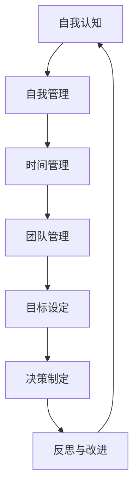

                 

# 领导者的自我管理：工作与生活的平衡

> **关键词：** 领导者、自我管理、工作与生活平衡、领导力、时间管理、优先级排序、个人品牌、职业发展规划

> **摘要：** 本文旨在探讨领导者如何在繁忙的工作中实现自我管理，并找到工作与生活的平衡点。通过深入分析领导者的角色与责任、自我认知的工具与方法、工作与生活平衡策略以及领导力提升方法，本文为领导者提供了一套实用的自我管理实践策略，旨在帮助他们在职业和生活中取得成功。

### 目录大纲

#### 第一部分：自我认知与管理

1. **第1章：领导者自我认知的重要性**
   - 1.1 领导者的角色与责任
   - 1.2 自我认知的工具与方法
   - 1.3 建立自我管理意识

2. **第2章：工作与生活的平衡概念与影响**
   - 2.1 工作与生活平衡的定义
   - 2.2 建立有效的职场策略
   - 2.3 生活管理技巧

3. **第3章：领导者自我管理实践**
   - 3.1 自我管理实践策略
   - 3.2 成功案例分享

4. **第4章：领导力提升与自我管理**
   - 4.1 领导力与自我管理的联系
   - 4.2 领导力提升策略

5. **第5章：工作与生活平衡的实践方法**
   - 5.1 工作与生活平衡的方法论
   - 5.2 实践应用案例

6. **第6章：领导者的持续成长**
   - 6.1 自我管理对领导者持续成长的影响
   - 6.2 领导者的持续成长路径

7. **第7章：综合案例分析与策略**
   - 7.1 综合案例分析
   - 7.2 策略制定与实施

8. **附录：自我管理工具与资源**
   - 附录A：自我管理工具与资源
   - 附录B：相关阅读推荐

### 第一部分：自我认知与管理

#### 第1章：领导者自我认知的重要性

领导者的角色与责任是多样的，他们不仅要承担决策和执行的责任，还要对团队成员的绩效和职业发展负责。在这一章中，我们将深入探讨领导者角色的重要性，并探讨如何通过自我认知来提升领导力。

## 1.1 领导者的角色与责任

### 1.1.1 领导者角色多样性

领导者不仅仅是管理团队的人，他们还扮演着多重的角色。以下是领导者常见的角色：

- **决策者**：领导者需要做出关键性的决策，这些决策可能涉及到战略规划、项目管理和资源分配。

- **协调者**：领导者需要协调不同团队之间的关系，确保项目顺利进行。

- **激励者**：领导者需要激发团队成员的积极性，确保他们保持高效的工作状态。

- **榜样**：领导者是团队的榜样，他们的行为和态度会对团队成员产生深远的影响。

### 1.1.2 自我认知与领导力提升

自我认知是领导者提升领导力的关键。通过自我认知，领导者可以：

- **了解自己的优点和缺点**：这有助于领导者更好地发挥自己的优势，同时改进自己的不足。

- **明确自己的价值观和目标**：这有助于领导者制定清晰的目标，并确保自己的行为与价值观一致。

- **增强自我调节能力**：领导者需要具备自我调节能力，以应对工作中的压力和挑战。

### 1.1.3 领导者面临的挑战

领导者面临着各种挑战，包括：

- **时间管理**：领导者需要在工作中合理分配时间，以确保高效完成任务。

- **团队管理**：领导者需要管理不同性格和背景的团队成员，确保团队凝聚力。

- **决策压力**：领导者需要做出关键性的决策，这可能会带来巨大的压力。

## 1.2 自我认知的工具与方法

### 1.2.1 SWOT分析

SWOT分析是一种常用的自我认知工具，它包括以下四个方面：

- **优势（Strengths）**：领导者需要识别自己的优势，以便更好地利用它们。

- **劣势（Weaknesses）**：领导者需要了解自己的劣势，以便改进和克服。

- **机会（Opportunities）**：领导者需要识别外部环境中的机会，以便抓住机遇。

- **威胁（Threats）**：领导者需要识别外部环境中的威胁，以便制定应对策略。

### 1.2.2 GROW模型

GROW模型是一种帮助领导者设定和实现目标的工具。它包括以下四个部分：

- **目标（Goal）**：明确目标，确保目标具体、可行。

- **现状（Reality）**：评估当前的情况，了解现实与目标之间的差距。

- **障碍（Obstacles）**：识别可能阻碍目标实现的障碍，并制定应对策略。

- **选择（Way forward）**：确定实现目标的步骤和路径。

### 1.2.3 自我反思与反馈

自我反思是领导者提升自我认知的重要方法。通过定期反思自己的行为和决策，领导者可以：

- **识别问题**：发现自己的不足，并制定改进计划。

- **提升自我管理能力**：通过反思，领导者可以更好地管理自己的情绪和行为。

- **持续成长**：领导者需要持续成长，以适应不断变化的环境和挑战。

## 1.3 建立自我管理意识

### 1.3.1 自我管理的重要性

自我管理是领导者成功的关键。通过自我管理，领导者可以：

- **提高工作效率**：通过合理安排时间和任务，领导者可以更高效地完成任务。

- **降低压力**：良好的自我管理能力可以帮助领导者更好地应对工作压力。

- **提升生活质量**：自我管理不仅影响工作，还会影响生活质量。

### 1.3.2 时间管理

时间管理是自我管理的重要组成部分。以下是一些时间管理的技巧：

- **设定优先级**：将任务按重要性排序，确保先完成最重要的任务。

- **避免拖延**：及时处理任务，避免拖延。

- **合理规划时间**：合理安排工作时间，确保工作与生活之间的平衡。

### 1.3.3 优先级排序

优先级排序是时间管理的关键。以下是一些优先级排序的技巧：

- **紧急重要事项**：先处理紧急且重要的事项。

- **重要但不紧急事项**：尽量提前处理重要但不紧急的事项。

- **不重要紧急事项**：尽量避免处理不重要但紧急的事项。

- **不重要不紧急事项**：尽量将这些事项排除在优先级之外。

### 1.3.4 持续学习与成长

自我管理不仅仅是技巧和方法的运用，更是一种持续学习和成长的过程。以下是一些持续学习和成长的方法：

- **阅读**：定期阅读专业书籍和文章，了解行业动态和最佳实践。

- **培训**：参加各种培训和研讨会，提升专业技能和管理能力。

- **反思**：定期反思自己的行为和决策，发现并改进不足。

- **网络学习**：利用网络资源，如在线课程和博客，进行自主学习。

## 1.4 成功案例分享

以下是一个成功案例分享：

**案例：** 李先生是一家大型公司的项目经理。他通过自我认知和时间管理，成功地提升了工作效率，并实现了工作与生活的平衡。

- **自我认知**：李先生通过SWOT分析，识别了自己的优势（项目管理经验丰富）和劣势（沟通能力不足），并制定了相应的改进计划。

- **时间管理**：李先生通过设定优先级和合理安排时间，确保了项目进度，同时也有时间陪伴家人。

- **持续学习与成长**：李先生定期参加项目管理培训和研讨会，不断提升自己的专业技能。

通过这些自我管理实践，李先生不仅成功地完成了项目任务，还获得了同事和上级的认可。

### 1.5 小结

自我管理是领导者成功的关键。通过深入分析领导者的角色与责任、自我认知的工具与方法以及建立自我管理意识，领导者可以更好地管理自己，实现工作与生活的平衡。在下一章中，我们将探讨工作与生活的平衡概念与影响。

# 第一部分：自我认知与管理

## 第1章：领导者自我认知的重要性

领导者的角色与责任是多样的，他们不仅要承担决策和执行的责任，还要对团队成员的绩效和职业发展负责。在这一章中，我们将深入探讨领导者角色的重要性，并探讨如何通过自我认知来提升领导力。

### 1.1 领导者的角色与责任

领导者的角色是多样的，他们需要承担以下责任：

1. **决策者**：领导者需要做出关键性的决策，这些决策可能涉及到战略规划、项目管理和资源分配。决策的质量直接影响到团队的绩效和企业的成功。

2. **协调者**：领导者需要协调不同团队之间的关系，确保项目顺利进行。这包括解决团队之间的冲突，确保资源的合理分配。

3. **激励者**：领导者需要激发团队成员的积极性，确保他们保持高效的工作状态。这可以通过设立激励机制、提供职业发展机会和认可员工的贡献来实现。

4. **榜样**：领导者是团队的榜样，他们的行为和态度会对团队成员产生深远的影响。领导者需要通过自己的行为来树立榜样，引导团队成员朝着正确的方向发展。

### 1.2 自我认知与领导力提升

自我认知是领导者提升领导力的关键。通过自我认知，领导者可以：

1. **了解自己的优点和缺点**：这有助于领导者更好地利用自己的优势，同时改进自己的不足。了解自己的优点可以帮助领导者发挥最大的潜力，而了解自己的缺点则可以帮助领导者制定改进计划。

2. **明确自己的价值观和目标**：领导者需要明确自己的价值观和目标，以确保自己的行为与价值观一致。这有助于领导者做出符合企业目标和价值观的决策，同时也有助于激发团队成员的认同感和归属感。

3. **增强自我调节能力**：领导者需要具备自我调节能力，以应对工作中的压力和挑战。自我调节能力包括情绪管理、压力管理和决策能力等。通过自我调节，领导者可以更好地应对各种挑战，保持高效的工作状态。

### 1.3 领导者面临的挑战

领导者面临着各种挑战，包括：

1. **时间管理**：领导者需要在工作中合理分配时间，以确保高效完成任务。时间管理不当可能会导致工作效率低下，甚至影响团队的绩效。

2. **团队管理**：领导者需要管理不同性格和背景的团队成员，确保团队凝聚力。这需要领导者具备良好的沟通技巧和团队管理能力。

3. **决策压力**：领导者需要做出关键性的决策，这可能会带来巨大的压力。决策的正确与否直接影响到团队的绩效和企业的成功。

### 1.4 自我认知的工具与方法

为了提升自我认知，领导者可以采用以下工具和方法：

1. **SWOT分析**：SWOT分析是一种常用的自我认知工具，它包括以下四个方面：

   - **优势（Strengths）**：领导者需要识别自己的优势，以便更好地利用它们。
   - **劣势（Weaknesses）**：领导者需要了解自己的劣势，以便改进和克服。
   - **机会（Opportunities）**：领导者需要识别外部环境中的机会，以便抓住机遇。
   - **威胁（Threats）**：领导者需要识别外部环境中的威胁，以便制定应对策略。

2. **GROW模型**：GROW模型是一种帮助领导者设定和实现目标的工具。它包括以下四个部分：

   - **目标（Goal）**：明确目标，确保目标具体、可行。
   - **现状（Reality）**：评估当前的情况，了解现实与目标之间的差距。
   - **障碍（Obstacles）**：识别可能阻碍目标实现的障碍，并制定应对策略。
   - **选择（Way forward）**：确定实现目标的步骤和路径。

3. **自我反思与反馈**：自我反思是领导者提升自我认知的重要方法。通过定期反思自己的行为和决策，领导者可以：

   - **识别问题**：发现自己的不足，并制定改进计划。
   - **提升自我管理能力**：通过反思，领导者可以更好地管理自己的情绪和行为。
   - **持续成长**：领导者需要持续成长，以适应不断变化的环境和挑战。

### 1.5 建立自我管理意识

建立自我管理意识是领导者成功的关键。以下是一些建立自我管理意识的方法：

1. **设定明确的目标和计划**：领导者需要明确自己的目标和计划，以确保自己的行为和决策与目标一致。

2. **培养良好的时间管理习惯**：领导者需要合理安排时间，确保高效完成任务。时间管理技巧包括设定优先级、避免拖延和合理安排工作时间。

3. **持续学习和成长**：领导者需要持续学习和成长，以适应不断变化的环境和挑战。这可以通过阅读专业书籍、参加培训和反思自己的行为来实现。

4. **建立良好的沟通习惯**：领导者需要与团队成员建立良好的沟通，以确保信息的有效传递和理解。

5. **自我反思和反馈**：领导者需要定期进行自我反思和反馈，以识别自己的优点和不足，并制定改进计划。

### 1.6 小结

自我认知是领导者成功的关键。通过深入分析领导者的角色与责任、自我认知的工具与方法以及建立自我管理意识，领导者可以更好地管理自己，实现工作与生活的平衡。在下一章中，我们将探讨工作与生活的平衡概念与影响。

### 1.7 Mermaid流程图：领导者自我管理流程

以下是一个Mermaid流程图，展示了领导者自我管理的流程：



### 1.8 伪代码：领导者自我管理算法

以下是一个伪代码，描述了领导者自我管理的算法：

```python
# 领导者自我管理算法

# 输入：leader_data（领导者数据结构，包含自我认知、管理能力、领导力等信息）

# 输出：self_management_plan（自我管理计划）

def self_management_algorithm(leader_data):
    # 分析自我认知
    self_awareness = analyze_self_awareness(leader_data)
    
    # 评估管理能力
    management_ability = evaluate_management_ability(leader_data)
    
    # 优化领导力
    leadership_ability = optimize_leadership_ability(leader_data)
    
    # 制定自我管理计划
    self_management_plan = create_self_management_plan(self_awareness, management_ability, leadership_ability)
    
    return self_management_plan
```

### 1.9 数学模型：工作与生活平衡指数计算

工作与生活平衡指数（WLB）可以通过以下公式计算：

$$
WLB = \frac{W_f \cdot L_f + W_w \cdot L_w}{W_f + W_w}
$$

其中：

- \( W_f \)：工作满意度权重
- \( W_w \)：生活满意度权重
- \( L_f \)：工作生活平衡度
- \( L_w \)：生活工作平衡度

### 1.10 代码案例：工作与生活平衡实践

以下是一个Python代码案例，展示了如何通过代码实现工作与生活平衡：

```python
# 工作与生活平衡实践

# 搭建开发环境
setup_environment()

# 代码实现
def balance_work_life():
    # 工作任务
    work_task = assign_work_task()
    work_time = execute_work_task(work_task)

    # 生活任务
    life_task = assign_life_task()
    life_time = execute_life_task(life_task)

    # 平衡反馈
    balance_feedback = evaluate_balance(work_time, life_time)

    return balance_feedback

# 执行实践
balance_result = balance_work_life()
print(balance_result)
```

### 1.11 小结

在本章中，我们探讨了领导者自我认知的重要性，包括领导者的角色与责任、自我认知的工具与方法、领导者面临的挑战以及建立自我管理意识的方法。我们还提供了Mermaid流程图、伪代码、数学模型和代码案例，帮助领导者更好地实现自我管理。在下一章中，我们将探讨工作与生活的平衡概念与影响。

---

**作者：AI天才研究院/AI Genius Institute & 禅与计算机程序设计艺术 /Zen And The Art of Computer Programming**

