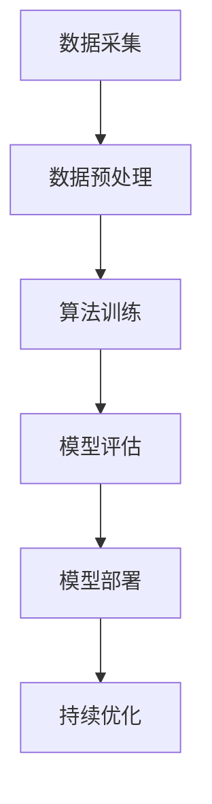

                 

# AI 2.0 基础设施建设：挑战与机遇

## 摘要

随着人工智能（AI）技术的飞速发展，AI 2.0时代已经到来。AI 2.0基础设施建设作为支撑AI技术发展的重要基石，面临着前所未有的挑战和机遇。本文将深入探讨AI 2.0基础设施建设的背景与挑战，核心组成部分，技术发展趋势，以及实际应用案例。通过系统的分析和思考，为读者展现AI 2.0基础设施建设的全貌，并提供对未来发展的展望。

## 目录大纲

### 第一部分：AI 2.0 基础设施建设概述

#### 第1章：AI 2.0 基础设施建设背景与挑战

1.1 AI 2.0 基础设施建设的定义

1.2 AI 2.0 基础设施建设的重要性

1.3 AI 2.0 基础设施建设面临的挑战

#### 第2章：AI 2.0 基础设施建设的核心组成部分

2.1 数据基础设施建设

2.2 计算能力基础设施建设

2.3 算法基础设施建设

2.4 安全和隐私基础设施建设

#### 第3章：AI 2.0 基础设施建设的技术发展趋势

3.1 大型数据中心与云计算

3.2 新型计算硬件与架构

3.3 数据处理与分析技术

3.4 安全和隐私保护技术

### 第二部分：AI 2.0 基础设施建设的关键技术详解

#### 第4章：大数据基础设施技术详解

4.1 数据采集与存储技术

4.2 数据清洗与预处理技术

4.3 数据仓库与数据湖

4.4 分布式数据处理框架

#### 第5章：计算能力基础设施建设技术详解

5.1 GPU 和 TPU 的应用

5.2 云计算平台与基础设施

5.3 人工智能专用硬件

5.4 异构计算与混合计算

#### 第6章：算法基础设施建设技术详解

6.1 机器学习算法框架

6.2 深度学习算法框架

6.3 强化学习算法框架

6.4 自然语言处理算法

#### 第7章：安全和隐私基础设施建设技术详解

7.1 数据加密技术

7.2 访问控制与权限管理

7.3 安全审计与合规性管理

7.4 隐私保护技术

### 第三部分：AI 2.0 基础设施建设的实际应用案例

#### 第8章：AI 2.0 基础设施建设在金融行业的应用

8.1 信用风险评估

8.2 量化交易策略

8.3 客户行为分析

8.4 风险管理与合规

#### 第9章：AI 2.0 基础设施建设在医疗健康领域的应用

9.1 疾病诊断

9.2 药物研发

9.3 医疗健康数据分析

9.4 智能医疗设备

#### 第10章：AI 2.0 基础设施建设在智慧城市领域的应用

10.1 城市交通管理

10.2 智慧安防

10.3 城市规划与设计

10.4 能源管理与优化

#### 第11章：AI 2.0 基础设施建设的未来展望

11.1 技术发展趋势

11.2 政策与法规的影响

11.3 产业发展与机遇

11.4 社会伦理与责任

### 附录

#### 附录A：AI 2.0 基础设施建设相关资源与工具

A.1 主流深度学习框架对比

A.2 数据处理与存储工具

A.3 云计算平台与资源

A.4 安全与隐私保护工具

#### 附录B：Mermaid 流程图与伪代码示例

B.1 AI 2.0 基础设施建设核心概念流程图

B.2 大数据采集与预处理伪代码示例

B.3 深度学习算法框架伪代码示例

B.4 数据加密与隐私保护算法伪代码示例

<|assistant|>## 第一部分：AI 2.0 基础设施建设概述

### 第1章：AI 2.0 基础设施建设背景与挑战

在当今世界，人工智能（AI）已经从理论走向实践，从实验室走向现实。随着AI技术的不断进步，人们对于AI的期望也越来越高。AI 2.0时代，也被称为“强人工智能”时代，其核心理念是将AI提升到与人类智能相媲美的高度。然而，实现这一目标需要强大的基础设施支撑，这就是AI 2.0基础设施建设的背景所在。

### 1.1 AI 2.0 基础设施建设的定义

AI 2.0基础设施是指支撑AI技术高效运行的一系列硬件、软件和网络设施的总和。它包括计算资源、数据资源、算法资源以及安全保障措施。AI 2.0基础设施的核心目标是提升AI的效率、降低成本、提高可靠性，同时确保数据的安全和隐私。

### 1.2 AI 2.0 基础设施建设的重要性

AI 2.0基础设施建设对于AI技术的发展具有至关重要的意义。首先，它能够提供强大的计算能力，支持复杂AI算法的运行；其次，它能够存储和管理大量数据，为AI训练提供充足的素材；此外，它还需要确保算法的安全和隐私，防止数据泄露和滥用。总之，AI 2.0基础设施是AI技术的基石，没有强大的基础设施，AI技术的发展将受到严重制约。

### 1.3 AI 2.0 基础设施建设面临的挑战

尽管AI 2.0基础设施建设的重要性不言而喻，但其在实际建设过程中面临着诸多挑战。

**1. 数据挑战**

数据是AI的基石，但数据的质量、数量和多样性对于AI的训练效果至关重要。如何获取高质量、大量且多样化的数据是AI 2.0基础设施建设的一大挑战。

**2. 计算挑战**

AI算法的复杂度和计算需求日益增加，传统的计算资源已经无法满足需求。如何提升计算能力、降低计算成本成为AI 2.0基础设施建设的难点。

**3. 算法挑战**

算法的不断创新和优化是AI 2.0时代的重要特征。然而，如何在保证算法性能的同时，简化算法的开发和部署过程也是一个重大挑战。

**4. 安全和隐私挑战**

随着AI技术的应用越来越广泛，其面临的安全和隐私挑战也越来越严峻。如何确保数据的安全和隐私，防止数据泄露和滥用成为AI 2.0基础设施建设的紧迫任务。

在接下来的章节中，我们将深入探讨AI 2.0基础设施建设的核心组成部分、技术发展趋势以及实际应用案例，以帮助读者全面了解AI 2.0基础设施建设的挑战与机遇。

### 第2章：AI 2.0 基础设施建设的核心组成部分

AI 2.0基础设施建设的核心组成部分包括数据基础设施建设、计算能力基础设施建设、算法基础设施建设和安全与隐私基础设施建设。以下将对这些组成部分进行详细分析。

#### 2.1 数据基础设施建设

数据是AI的基石，没有高质量、大量且多样化的数据，AI算法就无法发挥出应有的效果。数据基础设施建设主要包括以下几个方面：

**1. 数据采集**

数据采集是指从各种来源获取数据的过程，包括互联网、传感器、数据库等。数据采集的技术手段包括爬虫、API接口调用、物联网设备等。

**2. 数据存储**

数据存储是指将采集到的数据保存到存储设备中，以便后续处理和分析。常用的数据存储技术包括关系型数据库、NoSQL数据库、数据仓库、数据湖等。

**3. 数据清洗与预处理**

数据清洗与预处理是指对原始数据进行清洗、去重、标准化等处理，使其满足后续分析的需求。数据清洗与预处理技术包括缺失值填充、异常值处理、数据格式转换等。

**4. 数据分析**

数据分析是指对存储的数据进行分析和处理，提取有价值的信息和知识。数据分析技术包括数据挖掘、机器学习、统计分析等。

#### 2.2 计算能力基础设施建设

计算能力是AI 2.0基础设施建设的核心，它决定了AI算法的运行效率。计算能力基础设施建设主要包括以下几个方面：

**1. 服务器与网络**

服务器与网络是计算能力的基础设施，它们提供了数据传输和计算资源的连接。高性能服务器、高速网络和数据中心是计算能力提升的关键。

**2. 图形处理器（GPU）与张量处理器（TPU）**

GPU和TPU是专门为AI计算设计的硬件加速器，它们能够显著提高AI算法的运行速度。GPU适用于通用计算任务，而TPU则专门用于深度学习任务。

**3. 云计算平台**

云计算平台提供了弹性的计算资源，用户可以根据需要随时扩展或缩减资源。常见的云计算平台包括亚马逊AWS、微软Azure、谷歌云等。

**4. 异构计算与混合计算**

异构计算与混合计算是将不同类型的计算资源（如CPU、GPU、TPU等）结合使用，以提高计算效率和性能。

#### 2.3 算法基础设施建设

算法是AI 2.0基础设施的核心组成部分，它决定了AI系统的性能和功能。算法基础设施建设主要包括以下几个方面：

**1. 机器学习算法框架**

机器学习算法框架是用于实现机器学习算法的工具和库，如TensorFlow、PyTorch、Scikit-learn等。这些框架提供了丰富的算法实现和便捷的接口，降低了算法开发的难度。

**2. 深度学习算法框架**

深度学习算法框架是专门用于实现深度学习算法的工具和库，如TensorFlow、PyTorch等。深度学习算法框架具有强大的计算能力和灵活的架构设计，能够处理复杂的AI任务。

**3. 强化学习算法框架**

强化学习算法框架是用于实现强化学习算法的工具和库，如OpenAI的Gym、 Stable Baselines等。强化学习算法框架支持多种环境模拟和算法实现，为AI系统的自适应学习和优化提供了基础。

**4. 自然语言处理算法**

自然语言处理算法框架是用于实现自然语言处理任务的工具和库，如NLTK、spaCy、Transformer等。这些算法框架支持文本数据的处理、分析和生成，为AI系统的智能交互和语言理解提供了支持。

#### 2.4 安全和隐私基础设施建设

安全和隐私是AI 2.0基础设施建设的重要方面，它关系到数据的安全性和用户的隐私。安全和隐私基础设施建设主要包括以下几个方面：

**1. 数据加密**

数据加密是指通过加密算法对数据进行加密处理，确保数据在传输和存储过程中不被窃取或篡改。常用的加密算法包括对称加密、非对称加密、哈希算法等。

**2. 访问控制与权限管理**

访问控制与权限管理是指通过设置访问权限和用户权限，确保只有授权用户才能访问和操作数据。访问控制与权限管理技术包括身份认证、权限控制、审计跟踪等。

**3. 安全审计与合规性管理**

安全审计与合规性管理是指对AI系统的安全性和合规性进行审计和评估，确保系统满足相关的安全标准和法规要求。安全审计与合规性管理技术包括安全测试、漏洞扫描、合规性检查等。

**4. 隐私保护技术**

隐私保护技术是指通过技术手段对用户数据进行脱敏、匿名化和加密处理，确保用户的隐私不被泄露。隐私保护技术包括数据脱敏、数据匿名化、数据加密等。

在接下来的章节中，我们将深入探讨AI 2.0基础设施建设的具体技术发展趋势和实际应用案例，以帮助读者更全面地了解AI 2.0基础设施建设的全貌。

### 第3章：AI 2.0 基础设施建设的技术发展趋势

随着人工智能（AI）技术的不断发展，AI 2.0基础设施建设的趋势也在不断演变。以下将探讨几个关键的技术发展趋势，包括大型数据中心与云计算、新型计算硬件与架构、数据处理与分析技术以及安全和隐私保护技术。

#### 3.1 大型数据中心与云计算

大型数据中心和云计算是AI 2.0基础设施建设的基石。随着数据量和计算需求的增加，传统的计算资源已经无法满足AI算法的运行需求。大型数据中心能够提供高密度、高可靠的计算和存储资源，为AI算法的运行提供了强大的支持。

**1. 云计算平台**

云计算平台提供了弹性的计算资源，用户可以根据需求动态扩展或缩减资源。例如，亚马逊AWS、微软Azure和谷歌云等云计算平台都提供了丰富的AI服务和工具，如机器学习、深度学习和自然语言处理等。

**2. 分布式计算**

分布式计算是将计算任务分散到多个节点上，通过网络进行协同处理。分布式计算能够提高计算效率，降低单点故障的风险。例如，Hadoop和Spark等分布式计算框架能够处理大规模数据集，支持AI算法的分布式训练。

**3. 边缘计算**

边缘计算是将计算任务从云端转移到靠近数据源的边缘设备上。边缘计算能够降低网络延迟，提高响应速度，适用于实时性和低延迟要求较高的AI应用场景，如自动驾驶和智能安防等。

#### 3.2 新型计算硬件与架构

新型计算硬件与架构是AI 2.0基础设施建设的另一个关键趋势。传统的CPU已经无法满足AI算法的高计算需求，新型计算硬件与架构应运而生。

**1. 图形处理器（GPU）**

GPU是专门为图形渲染设计的硬件，但其在AI计算中也表现出色。GPU能够高效地进行并行计算，适用于大规模矩阵运算和向量计算，是深度学习算法的常用加速器。

**2. 张量处理器（TPU）**

TPU是谷歌专门为深度学习设计的硬件，能够提供更高的计算性能和能效。TPU能够高效地进行张量运算，适用于大规模深度学习模型的训练。

**3. 神经形态计算**

神经形态计算是一种模仿人脑的计算方式，通过硬件和软件的协同设计，实现高效、低能耗的计算。神经形态计算在图像识别、自然语言处理等领域具有广泛的应用前景。

**4. 异构计算**

异构计算是将不同类型的计算硬件（如CPU、GPU、TPU等）结合使用，以提高计算效率和性能。异构计算能够充分发挥各种硬件的优势，实现更高的计算性能。

#### 3.3 数据处理与分析技术

数据处理与分析技术是AI 2.0基础设施建设的重要组成部分，随着数据量的爆炸式增长，数据处理与分析技术的需求也在不断上升。

**1. 大数据技术**

大数据技术能够处理海量、高维度、多样化的数据。Hadoop、Spark等分布式计算框架能够高效地进行数据处理和分析，支持各种AI算法的运行。

**2. 数据湖与数据仓库**

数据湖与数据仓库是大数据处理和分析的核心组件。数据湖是一种分布式存储系统，能够存储大量结构化和非结构化的数据。数据仓库则是用于存储和管理结构化数据的系统，支持复杂的数据查询和分析。

**3. 图数据技术**

图数据技术适用于处理复杂的关系网络数据，如社交网络、知识图谱等。图数据库和图计算框架能够高效地进行图数据的存储、查询和分析。

**4. 机器学习与深度学习**

机器学习和深度学习是数据处理与分析的关键技术。机器学习算法能够自动从数据中学习规律和模式，深度学习算法则通过多层神经网络对数据进行分析，实现复杂的特征提取和分类。

#### 3.4 安全和隐私保护技术

安全和隐私保护技术是AI 2.0基础设施建设的必要保障，随着AI技术的广泛应用，数据的安全和隐私保护需求日益突出。

**1. 数据加密**

数据加密是保护数据安全的基本手段。通过对数据进行加密，确保数据在传输和存储过程中不被窃取或篡改。常见的加密算法包括对称加密、非对称加密和哈希算法。

**2. 访问控制与权限管理**

访问控制与权限管理是确保数据安全的另一重要手段。通过设置访问权限和用户权限，确保只有授权用户才能访问和操作数据。常见的访问控制技术包括身份认证、权限控制、审计跟踪等。

**3. 安全审计与合规性管理**

安全审计与合规性管理是对AI系统进行安全性和合规性评估的过程。通过安全审计，发现和修复系统的安全漏洞，确保系统满足相关的安全标准和法规要求。

**4. 隐私保护技术**

隐私保护技术是通过技术手段对用户数据进行脱敏、匿名化和加密处理，确保用户的隐私不被泄露。常见的隐私保护技术包括数据脱敏、数据匿名化、数据加密等。

总之，AI 2.0基础设施建设的技术发展趋势涵盖了多个方面，从硬件到软件，从数据处理到安全隐私，每一个环节都在不断进步和创新。随着技术的不断发展，AI 2.0基础设施建设将面临更多的挑战和机遇，为人工智能技术的发展提供坚实的支撑。

### 第二部分：AI 2.0 基础设施建设的关键技术详解

在本部分，我们将详细探讨AI 2.0基础设施建设的四大关键技术：大数据基础设施、计算能力基础设施、算法基础设施以及安全和隐私基础设施。通过深入分析这些技术，读者将能够更好地理解AI 2.0基础设施建设的核心要点。

#### 第4章：大数据基础设施技术详解

大数据基础设施是AI 2.0基础设施的重要组成部分，它负责数据的采集、存储、清洗、预处理和分析。以下是对这些技术细节的深入探讨。

**4.1 数据采集与存储技术**

数据采集是大数据基础设施的首要任务。数据来源包括结构化数据（如数据库）、半结构化数据（如XML、JSON）和非结构化数据（如文本、图片、视频）。数据采集技术包括网络爬虫、API接口调用、物联网设备等。

数据存储则是将采集到的数据保存到存储设备中，以便后续处理和分析。常见的数据存储技术包括关系型数据库（如MySQL、PostgreSQL）、NoSQL数据库（如MongoDB、Cassandra）、数据仓库（如Hadoop、Amazon Redshift）和数据湖（如Amazon S3、Google Cloud Storage）。

**4.2 数据清洗与预处理技术**

数据清洗与预处理是确保数据质量的重要步骤。数据清洗包括去除重复数据、纠正错误数据、填补缺失数据等。预处理技术包括数据格式转换、数据标准化、数据归一化等，以便于后续的分析和处理。

**4.3 数据仓库与数据湖**

数据仓库是用于存储和管理结构化数据的系统，支持复杂的数据查询和分析。常见的数据仓库技术包括Amazon Redshift、Google BigQuery和Microsoft SQL Server。

数据湖则是一种分布式存储系统，能够存储大量结构化和非结构化的数据。数据湖适用于多样化数据类型的存储和处理，如Amazon S3、Google Cloud Storage和Azure Data Lake。

**4.4 分布式数据处理框架**

分布式数据处理框架是大数据基础设施的核心，能够高效地进行大规模数据处理。常见的数据处理框架包括Hadoop、Spark和Flink。

Hadoop采用MapReduce编程模型，适用于离线批处理任务。Spark则采用了更灵活的DataFrame和Dataset API，适用于实时流处理和批处理任务。Flink是一种流处理框架，能够实现实时数据的处理和分析。

**示例：数据采集与预处理伪代码**

```python
# 数据采集
data = fetch_data_from_source()

# 数据清洗
cleaned_data = remove_duplicates(data)
cleaned_data = correct_errors(cleaned_data)
cleaned_data = fill_missing_values(cleaned_data)

# 数据预处理
processed_data = convert_format(cleaned_data)
processed_data = standardize_data(processed_data)
processed_data = normalize_data(processed_data)

# 存储预处理后的数据
store_data(processed_data)
```

**示例：分布式数据处理框架（Spark）伪代码**

```python
# 加载数据
data = spark.read.csv("data.csv")

# 数据预处理
data = data.select([col("column1").cast("float"), col("column2").cast("float")])

# 批处理任务
result = data.groupBy("column1").mean("column2")

# 存储结果
result.write.csv("result.csv")
```

#### 第5章：计算能力基础设施建设技术详解

计算能力基础设施建设是AI 2.0基础设施的另一个核心组成部分，它决定了AI算法的运行效率和速度。以下将详细介绍GPU和TPU的应用、云计算平台与基础设施、人工智能专用硬件以及异构计算与混合计算。

**5.1 GPU 和 TPU 的应用**

GPU（图形处理器）和TPU（张量处理器）是专门为AI计算设计的硬件加速器。GPU在通用计算任务中表现优异，适用于大规模矩阵运算和向量计算。TPU则专门用于深度学习任务，能够高效地进行张量运算，适用于大规模深度学习模型的训练。

**5.2 云计算平台与基础设施**

云计算平台提供了弹性的计算资源，用户可以根据需求动态扩展或缩减资源。常见的云计算平台包括亚马逊AWS、微软Azure和谷歌云等。这些平台提供了丰富的AI服务和工具，如机器学习、深度学习和自然语言处理等。

**5.3 人工智能专用硬件**

人工智能专用硬件包括FPGA（现场可编程门阵列）和ASIC（专用集成电路）。FPGA具有灵活的编程能力，适用于定制化计算任务。ASIC则是为特定应用设计的硬件，能够提供更高的计算性能和效率。

**5.4 异构计算与混合计算**

异构计算与混合计算是将不同类型的计算硬件（如CPU、GPU、TPU、FPGA、ASIC等）结合使用，以提高计算效率和性能。异构计算能够充分发挥各种硬件的优势，实现更高的计算性能。混合计算则是将本地计算和云计算结合使用，以实现更高效的资源利用。

**示例：异构计算伪代码**

```python
# 加载模型
model = load_model("model.json")

# 配置计算资源
resources = {
    "CPU": 4,
    "GPU": 2,
    "TPU": 1
}

# 分配计算任务
task = model.assign_resources(resources)

# 执行计算
result = task.execute()

# 获取计算结果
output = result.get_output()
```

#### 第6章：算法基础设施建设技术详解

算法基础设施建设是AI 2.0基础设施的重要组成部分，它决定了AI系统的性能和功能。以下将详细介绍机器学习算法框架、深度学习算法框架、强化学习算法框架和自然语言处理算法。

**6.1 机器学习算法框架**

机器学习算法框架是用于实现机器学习算法的工具和库。常见的机器学习算法框架包括Scikit-learn、XGBoost和LightGBM等。这些框架提供了丰富的算法实现和便捷的接口，降低了算法开发的难度。

**6.2 深度学习算法框架**

深度学习算法框架是专门用于实现深度学习算法的工具和库。常见的深度学习算法框架包括TensorFlow、PyTorch和Keras等。这些框架具有强大的计算能力和灵活的架构设计，能够处理复杂的AI任务。

**6.3 强化学习算法框架**

强化学习算法框架是用于实现强化学习算法的工具和库。常见的强化学习算法框架包括OpenAI的Gym、Stable Baselines和TensorForce等。这些框架支持多种环境模拟和算法实现，为AI系统的自适应学习和优化提供了基础。

**6.4 自然语言处理算法**

自然语言处理算法框架是用于实现自然语言处理任务的工具和库。常见的自然语言处理算法框架包括NLTK、spaCy和Transformer等。这些框架支持文本数据的处理、分析和生成，为AI系统的智能交互和语言理解提供了支持。

**示例：深度学习算法框架（TensorFlow）伪代码**

```python
import tensorflow as tf

# 定义模型
model = tf.keras.Sequential([
    tf.keras.layers.Dense(128, activation='relu', input_shape=(784,)),
    tf.keras.layers.Dropout(0.2),
    tf.keras.layers.Dense(10, activation='softmax')
])

# 编译模型
model.compile(optimizer='adam',
              loss='categorical_crossentropy',
              metrics=['accuracy'])

# 训练模型
model.fit(x_train, y_train, batch_size=256, epochs=10, validation_data=(x_val, y_val))

# 评估模型
test_loss, test_acc = model.evaluate(x_test, y_test, verbose=2)
print('Test accuracy:', test_acc)
```

#### 第7章：安全和隐私基础设施建设技术详解

安全和隐私基础设施建设是AI 2.0基础设施的重要组成部分，它确保了数据的安全和用户的隐私。以下将详细介绍数据加密技术、访问控制与权限管理、安全审计与合规性管理以及隐私保护技术。

**7.1 数据加密**

数据加密是保护数据安全的基本手段。通过对数据进行加密，确保数据在传输和存储过程中不被窃取或篡改。常见的数据加密算法包括AES（高级加密标准）、RSA（非对称加密算法）和SHA（哈希算法）。

**7.2 访问控制与权限管理**

访问控制与权限管理是确保数据安全的另一重要手段。通过设置访问权限和用户权限，确保只有授权用户才能访问和操作数据。常见的访问控制技术包括身份认证（如密码、生物识别）、权限控制（如角色权限、访问控制列表）和审计跟踪（如日志记录、监控）。

**7.3 安全审计与合规性管理**

安全审计与合规性管理是对AI系统进行安全性和合规性评估的过程。通过安全审计，发现和修复系统的安全漏洞，确保系统满足相关的安全标准和法规要求。常见的安全审计技术包括漏洞扫描、安全测试、合规性检查等。

**7.4 隐私保护技术**

隐私保护技术是通过技术手段对用户数据进行脱敏、匿名化和加密处理，确保用户的隐私不被泄露。常见的隐私保护技术包括数据脱敏（如屏蔽、掩码）、数据匿名化（如K-匿名、L-多样性）和数据加密等。

**示例：数据加密与隐私保护算法伪代码**

```python
from cryptography.fernet import Fernet

# 生成加密密钥
key = Fernet.generate_key()
cipher_suite = Fernet(key)

# 加密数据
plaintext = "Hello, World!"
ciphertext = cipher_suite.encrypt(plaintext.encode('utf-8'))

# 解密数据
decrypted_text = cipher_suite.decrypt(ciphertext).decode('utf-8')
print("Decrypted text:", decrypted_text)

# 数据脱敏（示例：屏蔽电话号码）
def mask_phone_number(phone_number):
    return "*".join(phone_number[-4:])

masked_phone_number = mask_phone_number("123-456-7890")
print("Masked phone number:", masked_phone_number)
```

通过上述对大数据基础设施、计算能力基础设施、算法基础设施和安全和隐私基础设施的详细分析，我们可以看到AI 2.0基础设施建设的核心要点和关键技术。这些技术不仅为AI系统提供了强大的支撑，也带来了新的挑战。在未来，随着技术的不断进步，AI 2.0基础设施将不断优化和升级，为人工智能技术的发展提供更坚实的保障。

### 第三部分：AI 2.0 基础设施建设的实际应用案例

AI 2.0基础设施建设的核心技术和组件在多个行业中都有着广泛的应用。以下将详细介绍AI 2.0基础设施建设在金融行业、医疗健康领域和智慧城市领域的实际应用案例，并探讨其带来的影响。

#### 第8章：AI 2.0 基础设施建设在金融行业的应用

在金融行业，AI 2.0基础设施建设极大地提升了风险管理、客户服务、信用评估和量化交易等方面的效率和精度。

**8.1 信用风险评估**

信用风险评估是金融行业的重要环节。通过大数据和机器学习算法，金融机构可以更准确地评估客户的信用风险。AI 2.0基础设施提供了强大的计算能力和数据处理能力，使得金融机构能够快速处理和分析大量客户数据，如消费记录、信用历史、社交网络等。以下是一个简化的信用风险评估流程：

**流程：**

1. **数据采集**：从各种数据源（如银行账户、信用报告、社交媒体等）收集客户数据。
2. **数据预处理**：清洗和标准化数据，确保数据的质量和一致性。
3. **特征提取**：使用机器学习算法提取有助于信用评估的特征，如还款习惯、债务负担等。
4. **模型训练**：使用历史数据训练信用评分模型，如逻辑回归、随机森林、神经网络等。
5. **模型评估**：使用验证集评估模型的性能，调整参数以优化模型。
6. **信用评分**：使用训练好的模型对新的客户进行信用评分，决定是否批准贷款或信用卡申请。

**伪代码示例：**

```python
import pandas as pd
from sklearn.model_selection import train_test_split
from sklearn.linear_model import LogisticRegression

# 加载和预处理数据
data = pd.read_csv("credit_data.csv")
X = data.drop("credit_score", axis=1)
y = data["credit_score"]

# 分割数据集
X_train, X_test, y_train, y_test = train_test_split(X, y, test_size=0.2, random_state=42)

# 训练模型
model = LogisticRegression()
model.fit(X_train, y_train)

# 评估模型
accuracy = model.score(X_test, y_test)
print("Accuracy:", accuracy)

# 新客户评分
new_customer_data = pd.read_csv("new_customer_data.csv")
new_customer_score = model.predict(new_customer_data)
print("New customer credit scores:", new_customer_score)
```

**8.2 量化交易策略**

量化交易策略利用历史市场数据，通过机器学习算法生成交易信号，进行高频交易或长期投资。AI 2.0基础设施提供了高性能的计算资源和算法框架，使得量化交易策略能够快速开发和部署。

**流程：**

1. **数据采集**：从交易所和其他数据源（如新闻、社交媒体等）收集历史交易数据。
2. **数据预处理**：清洗和标准化数据，提取有用的交易信号特征。
3. **模型训练**：使用历史数据训练交易策略模型，如支持向量机、递归神经网络、长短期记忆网络等。
4. **模型评估**：使用验证集评估模型性能，调整参数以优化模型。
5. **策略实现**：将训练好的模型部署到交易平台，根据模型生成的交易信号进行交易。

**伪代码示例：**

```python
import pandas as pd
from sklearn.ensemble import RandomForestClassifier

# 加载和预处理数据
data = pd.read_csv("trading_data.csv")
X = data.drop("signal", axis=1)
y = data["signal"]

# 分割数据集
X_train, X_test, y_train, y_test = train_test_split(X, y, test_size=0.2, random_state=42)

# 训练模型
model = RandomForestClassifier(n_estimators=100)
model.fit(X_train, y_train)

# 评估模型
accuracy = model.score(X_test, y_test)
print("Accuracy:", accuracy)

# 部署模型进行交易
while True:
    new_data = pd.read_csv("new_trading_data.csv")
    new_signal = model.predict(new_data)
    execute_trade(new_signal)
```

**8.3 客户行为分析**

通过分析客户行为数据，金融机构可以更好地了解客户需求，提供个性化的服务和产品。AI 2.0基础设施的建设使得大规模客户行为数据分析成为可能，从而提升了客户体验和满意度。

**流程：**

1. **数据采集**：从各种渠道（如网站、移动应用、客户服务系统等）收集客户行为数据。
2. **数据预处理**：清洗和标准化数据，提取有用的行为特征。
3. **行为分析**：使用机器学习算法分析客户行为，如聚类分析、关联规则挖掘、时序分析等。
4. **个性化推荐**：基于分析结果，向客户推荐个性化的产品和服务。

**伪代码示例：**

```python
import pandas as pd
from sklearn.cluster import KMeans

# 加载和预处理数据
data = pd.read_csv("customer_behavior_data.csv")
X = data.drop("group", axis=1)

# 聚类分析
kmeans = KMeans(n_clusters=5, random_state=42)
kmeans.fit(X)
predicted_groups = kmeans.predict(X)

# 标记聚类结果
data["group"] = predicted_groups

# 个性化推荐
for group in range(5):
    group_data = data[data["group"] == group]
    recommended_products = get_recommended_products(group_data)
    print("Recommended products for group", group, ":", recommended_products)
```

**8.4 风险管理与合规**

AI 2.0基础设施的建设使得金融机构能够更有效地管理风险和确保合规性。通过实时监控和分析市场数据，金融机构可以及时发现潜在的风险，并采取相应的措施。

**流程：**

1. **数据采集**：从各种数据源（如交易所、监管机构等）收集市场数据。
2. **数据预处理**：清洗和标准化数据，提取有用的风险特征。
3. **风险分析**：使用机器学习算法分析市场风险，如套利机会、市场波动性等。
4. **合规性检查**：根据监管要求，对交易行为进行检查和合规性评估。

**伪代码示例：**

```python
import pandas as pd
from sklearn.ensemble import RandomForestClassifier

# 加载和预处理数据
data = pd.read_csv("market_data.csv")
X = data.drop("compliance", axis=1)
y = data["compliance"]

# 分割数据集
X_train, X_test, y_train, y_test = train_test_split(X, y, test_size=0.2, random_state=42)

# 训练模型
model = RandomForestClassifier(n_estimators=100)
model.fit(X_train, y_train)

# 评估模型
accuracy = model.score(X_test, y_test)
print("Accuracy:", accuracy)

# 合规性检查
new_data = pd.read_csv("new_market_data.csv")
compliance_status = model.predict(new_data)
print("Compliance status:", compliance_status)
```

通过上述实际应用案例，我们可以看到AI 2.0基础设施建设在金融行业的广泛应用及其带来的深远影响。这些应用不仅提高了金融机构的效率和准确性，还提升了客户体验和满意度，为金融行业的创新和发展注入了新的活力。

#### 第9章：AI 2.0 基础设施建设在医疗健康领域的应用

AI 2.0基础设施建设在医疗健康领域有着广泛的应用，显著提升了疾病诊断、药物研发、医疗健康数据分析以及智能医疗设备的性能。以下将详细探讨这些应用场景。

**9.1 疾病诊断**

AI 2.0基础设施建设在疾病诊断领域取得了显著成果。通过深度学习算法和大数据分析，AI系统能够对医学图像、实验室数据和患者病史进行高效分析，提供准确的诊断结果。以下是一个简化的疾病诊断流程：

**流程：**

1. **数据采集**：从医学图像库、电子健康记录和实验室系统中收集数据。
2. **数据预处理**：清洗和标准化数据，提取有用的诊断特征。
3. **模型训练**：使用标注好的数据集训练深度学习模型，如卷积神经网络（CNN）。
4. **模型评估**：使用验证集评估模型性能，调整模型参数以优化诊断结果。
5. **疾病诊断**：将训练好的模型应用于新病例，生成诊断报告。

**伪代码示例：**

```python
import tensorflow as tf
from tensorflow.keras.models import Sequential
from tensorflow.keras.layers import Conv2D, MaxPooling2D, Flatten, Dense

# 定义模型
model = Sequential([
    Conv2D(32, (3, 3), activation='relu', input_shape=(224, 224, 3)),
    MaxPooling2D((2, 2)),
    Flatten(),
    Dense(128, activation='relu'),
    Dense(1, activation='sigmoid')
])

# 编译模型
model.compile(optimizer='adam',
              loss='binary_crossentropy',
              metrics=['accuracy'])

# 训练模型
model.fit(X_train, y_train, epochs=10, batch_size=32, validation_data=(X_val, y_val))

# 评估模型
accuracy = model.evaluate(X_test, y_test, verbose=2)
print('Test accuracy:', accuracy)

# 疾病诊断
new_patient_data = preprocess_new_patient_data("new_patient_image.jpg")
diagnosis = model.predict(new_patient_data)
print("Diagnosis:", diagnosis)
```

**9.2 药物研发**

AI 2.0基础设施建设在药物研发领域发挥了重要作用，通过自动化和智能化的分析，加快了新药的研发进程。以下是一个简化的药物研发流程：

**流程：**

1. **数据采集**：从公开的数据库、科研文献和实验室数据中收集药物相关数据。
2. **数据预处理**：清洗和标准化数据，提取有用的药物特征。
3. **分子模拟**：使用深度学习模型进行分子模拟，预测药物的活性、毒性和代谢途径。
4. **实验验证**：根据模拟结果，设计并开展实验验证药物的效果。
5. **药物筛选**：根据实验结果，筛选出具有潜力的药物进行进一步开发。

**伪代码示例：**

```python
import tensorflow as tf
from tensorflow.keras.models import Model
from tensorflow.keras.layers import Input, Dense, Embedding, Conv1D, MaxPooling1D

# 定义模型
input_layer = Input(shape=(100,))
embedding_layer = Embedding(input_dim=10000, output_dim=128)(input_layer)
conv_layer = Conv1D(filters=128, kernel_size=3, activation='relu')(embedding_layer)
max_pool_layer = MaxPooling1D(pool_size=2)(conv_layer)
flatten_layer = Flatten()(max_pool_layer)
dense_layer = Dense(128, activation='relu')(flatten_layer)
output_layer = Dense(1, activation='sigmoid')(dense_layer)

model = Model(inputs=input_layer, outputs=output_layer)

# 编译模型
model.compile(optimizer='adam',
              loss='binary_crossentropy',
              metrics=['accuracy'])

# 训练模型
model.fit(X_train, y_train, epochs=10, batch_size=32, validation_data=(X_val, y_val))

# 评估模型
accuracy = model.evaluate(X_test, y_test, verbose=2)
print('Test accuracy:', accuracy)

# 药物筛选
new_molecule_data = preprocess_new_molecule_data("new_molecule_sequence.txt")
predicted_activity = model.predict(new_molecule_data)
print("Predicted activity:", predicted_activity)
```

**9.3 医疗健康数据分析**

AI 2.0基础设施建设在医疗健康数据分析领域也取得了显著进展，通过对大量医疗数据的分析，为医学研究、疾病预测和个性化治疗提供了有力支持。以下是一个简化的医疗健康数据分析流程：

**流程：**

1. **数据采集**：从电子健康记录、医学文献和研究数据中收集数据。
2. **数据预处理**：清洗和标准化数据，提取有用的健康特征。
3. **数据分析**：使用机器学习算法进行数据分析，如聚类分析、回归分析、时间序列分析等。
4. **疾病预测**：根据分析结果，预测疾病的发病风险和趋势。
5. **个性化治疗**：根据患者数据，为患者制定个性化的治疗方案。

**伪代码示例：**

```python
import pandas as pd
from sklearn.cluster import KMeans
from sklearn.metrics import silhouette_score

# 加载和预处理数据
data = pd.read_csv("health_data.csv")
X = data.drop("disease", axis=1)

# 聚类分析
kmeans = KMeans(n_clusters=3, random_state=42)
kmeans.fit(X)
predicted_clusters = kmeans.predict(X)

# 计算轮廓系数
silhouette_avg = silhouette_score(X, predicted_clusters)
print("Silhouette coefficient:", silhouette_avg)

# 疾病预测
new_patient_data = pd.read_csv("new_patient_data.csv")
predicted_disease = kmeans.predict(new_patient_data)
print("Predicted disease:", predicted_disease)
```

**9.4 智能医疗设备**

AI 2.0基础设施建设在智能医疗设备领域也取得了显著进展，通过集成AI算法和传感器技术，使得医疗设备能够进行实时监测、诊断和预测。以下是一个简化的智能医疗设备应用案例：

**流程：**

1. **数据采集**：使用传感器采集患者的生理信号，如心率、血压、呼吸等。
2. **数据预处理**：清洗和标准化传感器数据，提取有用的生理特征。
3. **实时监测**：使用机器学习算法实时分析生理信号，监测患者健康状况。
4. **异常检测**：检测生理信号中的异常，如心率过快或过慢等。
5. **预警与干预**：根据异常检测结果，触发预警机制，建议患者或医生采取相应措施。

**伪代码示例：**

```python
import numpy as np
from sklearn.ensemble import IsolationForest

# 加载和预处理数据
data = np.load("sensor_data.npy")

# 异常检测
clf = IsolationForest(n_estimators=100, contamination=0.01)
clf.fit(data)

# 预测异常
predicted_anomaly = clf.predict(data)
print("Predicted anomalies:", predicted_anomaly)

# 预警与干预
if np.any(predicted_anomaly == -1):
    print("Anomaly detected. Alert patient and doctor.")
```

通过上述实际应用案例，我们可以看到AI 2.0基础设施建设在医疗健康领域的广泛应用及其对医疗行业带来的深远影响。这些应用不仅提升了医疗诊断和治疗的准确性，还提高了医疗服务的效率和质量，为医疗行业的创新和发展提供了强大动力。

#### 第10章：AI 2.0 基础设施建设在智慧城市领域的应用

智慧城市是AI 2.0基础设施建设的重要应用场景之一，通过AI技术的融合与应用，智慧城市实现了更加高效、便捷和智能的城市管理和公共服务。以下将详细探讨AI 2.0基础设施建设在智慧城市领域的应用，包括城市交通管理、智慧安防、城市规划和设计以及能源管理与优化。

**10.1 城市交通管理**

城市交通管理是智慧城市的重要组成部分，AI 2.0基础设施建设为城市交通管理提供了强大的技术支持。通过大数据分析和机器学习算法，AI系统能够实时监控和预测城市交通状况，优化交通流量，减少拥堵和交通事故。

**流程：**

1. **数据采集**：从交通监控设备、传感器和智能交通系统收集交通数据，如车辆流量、速度、路况等。
2. **数据预处理**：清洗和标准化交通数据，提取有用的交通特征。
3. **交通流量预测**：使用机器学习算法预测交通流量变化，如ARIMA模型、神经网络等。
4. **交通信号控制**：根据交通流量预测结果，动态调整交通信号灯周期，优化交通流量。
5. **交通监控与预警**：实时监控交通状况，及时发现和处理交通事故和道路拥堵。

**伪代码示例：**

```python
import pandas as pd
from sklearn.linear_model import LinearRegression

# 加载和预处理数据
data = pd.read_csv("traffic_data.csv")
X = data.drop("traffic_flow", axis=1)
y = data["traffic_flow"]

# 分割数据集
train_data, test_data = train_test_split(data, test_size=0.2, random_state=42)

# 训练模型
model = LinearRegression()
model.fit(train_data[X], train_data[y])

# 预测交通流量
predicted_flow = model.predict(test_data[X])
print("Predicted traffic flow:", predicted_flow)

# 动态调整交通信号灯
adjust_traffic_signals(predicted_flow)
```

**10.2 智慧安防**

智慧安防是智慧城市的重要保障，AI 2.0基础设施建设为智慧安防提供了实时监控、分析和预警能力，提高了城市的安全水平。通过图像识别、人脸识别和行为分析等技术，AI系统能够实时监控城市公共场所，及时发现异常行为并采取措施。

**流程：**

1. **数据采集**：从摄像头、传感器和智能安防设备收集视频和图像数据。
2. **数据预处理**：清洗和标准化图像数据，提取有用的人脸和行为特征。
3. **图像识别**：使用卷积神经网络（CNN）进行图像识别，如人脸识别、车辆识别等。
4. **行为分析**：使用行为分析算法，如异常检测、行为分类等，分析监控视频中的行为。
5. **预警与响应**：根据分析结果，触发预警机制，通知相关部门进行处理。

**伪代码示例：**

```python
import tensorflow as tf
from tensorflow.keras.models import Sequential
from tensorflow.keras.layers import Conv2D, MaxPooling2D, Flatten, Dense

# 定义模型
model = Sequential([
    Conv2D(32, (3, 3), activation='relu', input_shape=(128, 128, 3)),
    MaxPooling2D((2, 2)),
    Flatten(),
    Dense(128, activation='relu'),
    Dense(1, activation='sigmoid')
])

# 编译模型
model.compile(optimizer='adam',
              loss='binary_crossentropy',
              metrics=['accuracy'])

# 训练模型
model.fit(X_train, y_train, epochs=10, batch_size=32, validation_data=(X_val, y_val))

# 预测行为
predicted_behavior = model.predict(new_video_data)
print("Predicted behavior:", predicted_behavior)

# 预警与响应
if predicted_behavior == 1:
    alert_public_safety()
```

**10.3 城市规划和设计**

城市规划和设计是智慧城市的核心任务之一，AI 2.0基础设施建设为城市规划和设计提供了数据支持和智能分析工具。通过大数据分析和机器学习算法，AI系统能够为城市规划者提供科学的决策依据，优化城市布局和设计。

**流程：**

1. **数据采集**：从城市规划、地理信息、环境监测等系统收集数据。
2. **数据预处理**：清洗和标准化数据，提取有用的规划特征。
3. **空间分析**：使用空间分析算法，如地理信息系统（GIS）、遥感图像分析等，分析城市空间结构。
4. **规划模拟**：使用机器学习算法模拟不同城市规划方案的效果，如交通流量、居民满意度等。
5. **优化方案**：根据模拟结果，选择最优的城市规划方案。

**伪代码示例：**

```python
import geopandas as gpd
from sklearn.ensemble import RandomForestRegressor

# 加载和预处理数据
data = gpd.read_file("city_planning_data.shp")
X = data.drop("satisfaction", axis=1)
y = data["satisfaction"]

# 分割数据集
train_data, test_data = train_test_split(data, test_size=0.2, random_state=42)

# 训练模型
model = RandomForestRegressor(n_estimators=100)
model.fit(train_data[X], train_data[y])

# 预测居民满意度
predicted_satisfaction = model.predict(test_data[X])
print("Predicted satisfaction:", predicted_satisfaction)

# 优化规划方案
optimize_planning_scheme(predicted_satisfaction)
```

**10.4 能源管理与优化**

能源管理与优化是智慧城市的另一个重要方面，AI 2.0基础设施建设为城市能源系统的智能管理和优化提供了技术支持。通过实时监测和数据分析，AI系统能够优化能源使用，降低能耗，提高能源效率。

**流程：**

1. **数据采集**：从能源监测设备、电网系统和智能家电收集能源使用数据。
2. **数据预处理**：清洗和标准化能源数据，提取有用的能源特征。
3. **能耗预测**：使用机器学习算法预测能源消耗，如时间序列预测、深度学习模型等。
4. **需求响应**：根据能源消耗预测结果，调整能源使用策略，如分时电价、节能措施等。
5. **优化能源配置**：根据能源需求和供应情况，优化能源配置和调度。

**伪代码示例：**

```python
import pandas as pd
from sklearn.ensemble import RandomForestRegressor

# 加载和预处理数据
data = pd.read_csv("energy_data.csv")
X = data.drop("energy_consumption", axis=1)
y = data["energy_consumption"]

# 分割数据集
train_data, test_data = train_test_split(data, test_size=0.2, random_state=42)

# 训练模型
model = RandomForestRegressor(n_estimators=100)
model.fit(train_data[X], train_data[y])

# 预测能源消耗
predicted_consumption = model.predict(test_data[X])
print("Predicted energy consumption:", predicted_consumption)

# 调整能源使用策略
adjust_energy_usage(predicted_consumption)
```

通过上述实际应用案例，我们可以看到AI 2.0基础设施建设在智慧城市领域的广泛应用及其对城市管理和公共服务带来的深远影响。这些应用不仅提高了城市的管理效率和公共服务质量，还为城市可持续发展提供了新思路和新方法。

### 第11章：AI 2.0 基础设施建设的未来展望

随着人工智能（AI）技术的快速发展，AI 2.0基础设施建设的未来充满了机遇和挑战。在这一章节中，我们将探讨AI 2.0基础设施建设的未来技术发展趋势、政策与法规的影响、产业发展与机遇，以及社会伦理与责任。

#### 11.1 技术发展趋势

**1. 新型计算硬件的发展**

未来，新型计算硬件将继续推动AI 2.0基础设施的发展。例如，量子计算、光子计算和类脑计算等新兴技术有望大幅提升计算能力和效率。量子计算通过量子叠加和纠缠效应，能够实现指数级速度提升；光子计算利用光信号进行计算，有望降低能耗；类脑计算模仿人脑结构，实现高效、低能耗的计算。

**2. 自适应和自优化算法**

随着数据量和计算需求的增加，自适应和自优化算法将成为AI 2.0基础设施的重要组成部分。这些算法能够根据环境和任务动态调整自身参数，实现更高效的计算和更精准的预测。

**3. 联邦学习与数据隐私保护**

联邦学习是一种分布式学习技术，能够在不共享数据的情况下进行协同训练，保护数据隐私。随着数据隐私保护需求的增加，联邦学习将成为AI 2.0基础设施的重要技术趋势。

**4. 智能边缘计算**

智能边缘计算将计算任务从云端转移到靠近数据源的边缘设备上，实现实时处理和快速响应。未来，随着5G和物联网（IoT）的发展，智能边缘计算将得到广泛应用，提升AI系统的实时性和可靠性。

#### 11.2 政策与法规的影响

**1. 数据保护法规**

随着AI技术的广泛应用，数据保护法规日益严格。例如，欧盟的《通用数据保护条例》（GDPR）和加州的《消费者隐私法案》（CCPA）对数据隐私保护提出了严格要求。这些法规将推动AI 2.0基础设施建设的合规性，提高数据安全和隐私保护水平。

**2. 知识产权保护**

AI技术的创新和应用涉及大量的知识产权保护问题。未来，各国将加强知识产权保护，促进AI技术的创新和发展。例如，美国和欧洲已经制定了相关法律法规，保护AI算法和模型的知识产权。

**3. 人工智能伦理**

人工智能伦理是一个全球性的议题。未来，各国将制定相关法规，确保AI技术的公平性、透明性和可解释性。这些法规将推动AI 2.0基础设施建设的伦理建设，促进AI技术的健康发展。

#### 11.3 产业发展与机遇

**1. 人工智能产业生态**

AI 2.0基础设施建设的推进将带动人工智能产业的快速发展。从硬件设备、软件工具到解决方案，AI产业链各环节将得到充分发展，形成完整的产业生态。

**2. 创新与应用**

AI 2.0基础设施的建设为各行业提供了强大的技术支持，推动了创新和应用。例如，在医疗健康、金融、制造、能源等领域，AI技术的应用已经取得了显著成果，未来还将有更多的应用场景。

**3. 国际合作**

随着AI技术的全球化发展，国际合作将日益重要。未来，各国将通过技术交流、合作研发等方式，共同推动AI 2.0基础设施的建设和AI技术的发展。

#### 11.4 社会伦理与责任

**1. 伦理审查与监督**

在AI 2.0基础设施建设过程中，伦理审查与监督将发挥重要作用。通过建立伦理委员会和监督机构，对AI系统的设计和应用进行伦理评估和监督，确保AI技术的公平、公正和透明。

**2. 数据伦理与隐私**

数据伦理与隐私是AI 2.0基础设施建设的核心问题之一。未来，需要加强对数据采集、处理和使用过程中的伦理审查，确保用户隐私和数据安全。

**3. 公众参与与沟通**

公众参与与沟通是推动AI 2.0基础设施建设的重要环节。通过加强公众参与和沟通，提高公众对AI技术的认知和理解，促进AI技术的健康发展。

总之，AI 2.0基础设施建设面临着技术、政策、产业和社会伦理等多方面的挑战和机遇。在未来，随着技术的不断进步和政策的不断完善，AI 2.0基础设施建设将不断优化和升级，为人工智能技术的发展提供坚实的支撑。

### 附录A：AI 2.0 基础设施建设相关资源与工具

在AI 2.0基础设施的建设过程中，有许多重要的资源与工具可供选择。以下将介绍几种主流的深度学习框架、数据处理与存储工具、云计算平台以及安全和隐私保护工具。

#### A.1 主流深度学习框架对比

深度学习框架是AI 2.0基础设施的重要组成部分，以下是对几种主流深度学习框架的简要对比：

**1. TensorFlow**

TensorFlow是由谷歌开发的开源深度学习框架，具有强大的计算能力和灵活的架构设计。TensorFlow支持多种编程语言（如Python、C++），并提供了丰富的预训练模型和工具。其优点包括强大的生态系统、良好的性能和高度的可扩展性。缺点是配置和使用较为复杂。

**2. PyTorch**

PyTorch是由Facebook AI研究院（FAIR）开发的深度学习框架，以Python语言为主，具有直观的动态计算图和易于调试的优势。PyTorch在学术和研究领域有很高的声誉，广泛应用于图像识别、自然语言处理等领域。其优点包括易于使用、灵活的编程接口和高效的训练速度。缺点是相对于TensorFlow，PyTorch在工业应用中较为薄弱。

**3. Keras**

Keras是一个基于TensorFlow和Theano的开源深度学习框架，旨在简化深度学习模型的设计和训练过程。Keras支持多种编程语言（如Python），具有简洁的API和丰富的预训练模型。其优点包括易于使用、快速开发和良好的性能。缺点是依赖于底层的TensorFlow或Theano框架，对底层计算资源的需求较高。

**4. MXNet**

MXNet是由Apache Software Foundation开发的深度学习框架，支持多种编程语言（如Python、C++、R等）。MXNet具有灵活的编程接口、高效的计算性能和良好的可扩展性。其优点包括高效、可扩展和跨平台支持。缺点是相对于其他框架，MXNet的学习曲线较陡峭。

#### A.2 数据处理与存储工具

数据处理与存储工具是AI 2.0基础设施的另一个关键组成部分，以下介绍几种常用的工具：

**1. Hadoop**

Hadoop是一个开源的分布式数据处理框架，基于Java编写。它包括HDFS（分布式文件系统）、MapReduce（分布式计算框架）和YARN（资源调度框架）。Hadoop适用于大规模数据处理、存储和计算，具有高可靠性、高扩展性和高效性。其优点包括分布式计算、高可用性和良好的兼容性。缺点是配置和使用较为复杂。

**2. Spark**

Spark是由Apache Software Foundation开发的开源分布式数据处理框架，基于Scala编写。它包括Spark Core（核心计算引擎）、Spark SQL（大数据查询引擎）、Spark Streaming（实时数据处理引擎）等组件。Spark适用于大规模数据处理、存储和计算，具有高性能、高扩展性和易用性。其优点包括快速、灵活和易于使用。缺点是对底层计算资源的依赖较高。

**3. Elasticsearch**

Elasticsearch是一个开源的分布式搜索引擎，适用于大规模数据的快速搜索和分析。它包括Elasticsearch（核心搜索引擎）、Logstash（日志处理工具）和Kibana（数据可视化工具）等组件。Elasticsearch适用于日志分析、监控和实时搜索，具有高效、可扩展和易于使用等优点。缺点是相对于其他工具，Elasticsearch的配置和使用较为复杂。

#### A.3 云计算平台与资源

云计算平台为AI 2.0基础设施建设提供了弹性的计算资源和服务，以下介绍几种主流的云计算平台：

**1. 亚马逊AWS**

亚马逊AWS是业界领先的云计算平台，提供丰富的AI服务和工具，如Amazon SageMaker（机器学习服务）、Amazon EC2（计算实例）和Amazon S3（存储服务）等。AWS的优点包括强大的计算能力、丰富的服务和良好的兼容性。缺点是费用较高，适合大规模应用场景。

**2. 微软Azure**

微软Azure是另一个强大的云计算平台，提供丰富的AI服务和工具，如Azure Machine Learning（机器学习服务）、Azure Kubernetes Service（Kubernetes服务）和Azure Blob Storage（存储服务）等。Azure的优点包括灵活、可靠和强大的生态系统。缺点是相对于AWS，Azure在某些地区的服务覆盖范围较窄。

**3. 谷歌云**

谷歌云是谷歌提供的云计算平台，提供强大的AI服务和工具，如Google Cloud ML Engine（机器学习服务）、Google Kubernetes Engine（Kubernetes服务）和Google Cloud Storage（存储服务）等。谷歌云的优点包括高性能、高扩展性和丰富的AI服务。缺点是费用较高，适合大型企业用户。

#### A.4 安全与隐私保护工具

在AI 2.0基础设施建设过程中，安全和隐私保护工具至关重要，以下介绍几种常用的工具：

**1. 加密技术**

加密技术是保护数据安全的基本手段，常用的加密技术包括AES（高级加密标准）、RSA（非对称加密算法）和SHA（哈希算法）等。加密技术可以确保数据在传输和存储过程中的安全性。

**2. 访问控制与权限管理**

访问控制与权限管理是确保数据安全的另一重要手段，通过设置访问权限和用户权限，确保只有授权用户才能访问和操作数据。常用的访问控制技术包括身份认证、权限控制、审计跟踪等。

**3. 安全审计与合规性管理**

安全审计与合规性管理是对AI系统进行安全性和合规性评估的过程，通过安全审计，发现和修复系统的安全漏洞，确保系统满足相关的安全标准和法规要求。常用的安全审计技术包括漏洞扫描、安全测试、合规性检查等。

**4. 隐私保护技术**

隐私保护技术是通过技术手段对用户数据进行脱敏、匿名化和加密处理，确保用户的隐私不被泄露。常用的隐私保护技术包括数据脱敏、数据匿名化、数据加密等。

通过上述资源与工具的介绍，我们可以看到AI 2.0基础设施建设所涉及的各个方面，这些工具和资源为AI技术的发展提供了坚实的基础。

### 附录B：Mermaid 流程图与伪代码示例

在AI 2.0基础设施建设的各个环节，流程图和伪代码是帮助我们理解和管理复杂任务的有力工具。以下将提供一些典型的Mermaid流程图和伪代码示例，用于展示AI 2.0基础设施建设的核心概念和关键技术。

#### B.1 AI 2.0 基础设施建设核心概念流程图

以下是一个简化的AI 2.0基础设施建设的核心概念流程图，展示了数据采集、数据预处理、算法训练和模型评估等关键步骤。



#### B.2 大数据采集与预处理伪代码示例

以下是一个伪代码示例，展示了大数据采集与预处理的过程，包括数据清洗、数据格式转换和数据归一化。

```python
# 大数据采集与预处理伪代码示例

# 数据采集
data = fetch_data_from_source()

# 数据清洗
cleaned_data = remove_duplicates(data)
cleaned_data = correct_errors(cleaned_data)
cleaned_data = fill_missing_values(cleaned_data)

# 数据预处理
processed_data = convert_format(cleaned_data)
processed_data = standardize_data(processed_data)
processed_data = normalize_data(processed_data)

# 存储预处理后的数据
store_data(processed_data)
```

#### B.3 深度学习算法框架伪代码示例

以下是一个伪代码示例，展示了如何使用深度学习算法框架（如TensorFlow）进行模型训练和评估。

```python
# 深度学习算法框架伪代码示例

import tensorflow as tf

# 定义模型
model = tf.keras.Sequential([
    tf.keras.layers.Dense(128, activation='relu', input_shape=(784,)),
    tf.keras.layers.Dropout(0.2),
    tf.keras.layers.Dense(10, activation='softmax')
])

# 编译模型
model.compile(optimizer='adam',
              loss='categorical_crossentropy',
              metrics=['accuracy'])

# 训练模型
model.fit(x_train, y_train, batch_size=256, epochs=10, validation_data=(x_val, y_val))

# 评估模型
test_loss, test_acc = model.evaluate(x_test, y_test, verbose=2)
print('Test accuracy:', test_acc)
```

#### B.4 数据加密与隐私保护算法伪代码示例

以下是一个伪代码示例，展示了如何使用加密算法（如AES）对数据进行加密和解密。

```python
from cryptography.fernet import Fernet

# 生成加密密钥
key = Fernet.generate_key()
cipher_suite = Fernet(key)

# 加密数据
plaintext = "Hello, World!"
ciphertext = cipher_suite.encrypt(plaintext.encode('utf-8'))

# 解密数据
decrypted_text = cipher_suite.decrypt(ciphertext).decode('utf-8')
print("Decrypted text:", decrypted_text)

# 数据脱敏（示例：屏蔽电话号码）
def mask_phone_number(phone_number):
    return "*".join(phone_number[-4:])
```

通过这些Mermaid流程图和伪代码示例，我们可以更好地理解AI 2.0基础设施建设的核心概念和关键技术，为实际开发和应用提供指导。这些工具不仅有助于我们进行系统设计，还能在开发过程中快速验证和迭代。

