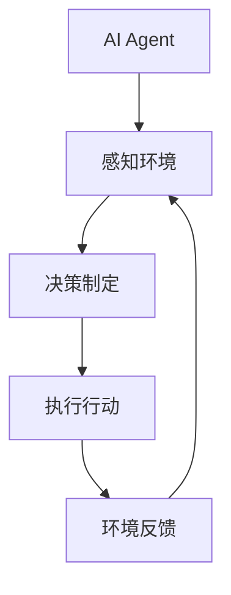

                 

# AI Agent: AI的下一个风口 从智能体到具身智能

## 关键词
AI Agent、智能体、强化学习、具身智能、多智能体系统、应用场景、数学模型、开发环境、未来发展方向

## 摘要
本文深入探讨了人工智能领域中的一个重要方向——AI Agent。从基础概念、核心算法到数学模型，再到实际应用，本文全面解析了AI Agent的各个方面。通过实例和代码分析，读者可以了解到AI Agent在不同领域的具体应用，以及其开发环境和未来发展方向。文章旨在为读者提供一个清晰、系统、易懂的AI Agent知识体系，激发读者在这一领域的研究兴趣。

## 引言

人工智能（AI）自诞生以来，已经经历了多个发展阶段。从最初的规则系统，到基于统计学的机器学习，再到深度学习的崛起，AI技术在不断进步。然而，随着AI技术的发展，人们开始意识到，单纯依赖于算法和数据的智能化系统仍然存在许多局限性。为了克服这些局限性，研究者们提出了一个新的概念——AI Agent。

### 什么是AI Agent？

AI Agent可以被视为一类特殊的人工智能系统，它能够在特定环境下感知环境状态，根据当前状态采取行动，并通过与环境交互学习改进自身的行为。简单来说，AI Agent就是一个能够自主学习、决策和执行任务的智能实体。

#### 定义与概念联系

AI Agent的定义可以进一步细化为以下几个关键组成部分：

1. **感知环境**：AI Agent需要能够感知和理解其所在的环境状态。这通常通过传感器或输入数据来完成。

2. **决策制定**：基于感知到的环境状态，AI Agent需要能够做出合理的决策。决策过程通常涉及到状态空间搜索和优化算法。

3. **执行行动**：决策制定后，AI Agent需要将决策转化为具体的行动，并执行这些行动。

4. **环境反馈**：行动执行后，AI Agent会收到环境反馈，这有助于其调整和优化后续的行为。

下图使用Mermaid流程图展示了AI Agent的核心概念和各部分之间的联系：



#### AI Agent的架构

AI Agent的架构通常包括以下几个主要组成部分：

1. **感知器**：负责从环境中收集数据，并将其转换为数字信号。这些数据可以包括视觉、听觉、触觉等多种感官信息。

2. **决策器**：基于感知器收集到的数据，决策器负责分析当前状态，并选择最佳的行动策略。决策器通常使用各种算法，如状态空间搜索、强化学习等。

3. **执行器**：执行器将决策器生成的行动指令转化为物理动作。执行器可以是机器人手臂、车辆控制系统等。

#### 与现有AI技术的联系

AI Agent与现有AI技术有密切的联系，例如：

1. **传统机器学习和深度学习**：AI Agent可以基于传统机器学习和深度学习算法进行训练，以实现更高级的感知和决策能力。

2. **自然语言处理**：在智能对话和文本生成等应用场景中，AI Agent可以结合自然语言处理技术，实现更自然的交互。

3. **计算机视觉**：在图像识别和目标检测等应用中，AI Agent可以利用计算机视觉技术，提高对环境的理解能力。

#### AI Agent的分类

AI Agent可以根据不同的标准进行分类，例如：

1. **按功能分类**：AI Agent可以根据其功能分为多种类型，如导航Agent、决策Agent、交互Agent等。

2. **按任务类型分类**：AI Agent可以根据其执行的任务类型进行分类，如基于监督学习的Agent、基于强化学习的Agent等。

#### AI Agent的发展趋势

随着AI技术的不断进步，AI Agent的发展趋势主要包括以下几个方面：

1. **增强学习在复杂环境中的应用**：增强学习是一种在动态和不确定环境中进行学习的技术，未来将在更复杂的AI Agent中发挥重要作用。

2. **具身智能和物理交互的融合**：具身智能关注AI系统与物理环境的交互，未来AI Agent将更加注重与物理世界的结合。

3. **多智能体系统与合作策略**：多智能体系统（MAS）是一种包含多个AI Agent的系统，未来研究将更多关注如何设计有效的合作策略。

### 第一部分: AI Agent的基础知识

#### 第1章: AI Agent概述

##### 1.1 AI Agent的定义

AI Agent是一种能够自主执行任务的人工智能系统，它具备感知、决策和执行的能力。AI Agent的核心在于其自主性，即能够在没有人类干预的情况下，根据当前环境状态和以往经验，选择最优的行动策略。

AI Agent的工作原理可以概括为以下几个步骤：

1. **感知环境**：AI Agent通过传感器或接收到的输入数据，感知当前环境的状态。

2. **决策制定**：基于感知到的环境状态，AI Agent使用内部算法（如强化学习、规划算法等）来选择最佳行动策略。

3. **执行行动**：AI Agent将决策转化为具体的物理动作，并通过执行器（如机器人手臂、自动驾驶系统等）实现这些动作。

4. **环境反馈**：执行动作后，AI Agent会接收到环境反馈，这有助于其调整和优化后续的行为。

##### 1.2 AI Agent的架构

AI Agent的架构通常包括三个主要组成部分：感知器、决策器和执行器。

1. **感知器**：感知器是AI Agent的感官部分，负责从环境中收集数据。这些数据可以是视觉图像、音频信号、温度湿度等。感知器通常由各种传感器组成，如摄像头、麦克风、温度传感器等。

2. **决策器**：决策器是AI Agent的智能核心，负责分析当前状态，并选择最佳行动策略。决策器通常使用各种算法，如状态空间搜索、强化学习、规划算法等。这些算法可以帮助AI Agent在复杂的决策空间中找到最优解。

3. **执行器**：执行器是AI Agent的执行部分，负责将决策器生成的行动指令转化为具体的物理动作。执行器可以是机器人手臂、车辆控制系统、机械臂等。

##### 1.3 AI Agent的分类

AI Agent可以根据不同的标准进行分类，以下是几种常见的分类方法：

1. **按功能分类**：

   - 导航Agent：用于自主导航和路径规划。
   - 决策Agent：用于制定策略和决策。
   - 交互Agent：用于与人类或其他系统进行交互。
   - 监控Agent：用于实时监控和检测异常。

2. **按任务类型分类**：

   - 监督学习Agent：基于监督学习算法进行任务执行。
   - 强化学习Agent：基于强化学习算法进行任务执行。
   - 部分可观测Agent：在部分可观测的环境中进行任务执行。
   - 完全可观测Agent：在完全可观测的环境中进行任务执行。

##### 1.4 AI Agent的发展趋势

随着人工智能技术的不断发展，AI Agent的发展趋势主要包括以下几个方面：

1. **增强学习在复杂环境中的应用**：

   增强学习是一种在动态和不确定环境中进行学习的技术。未来，AI Agent将更多应用在复杂环境中，如无人驾驶、机器人等。

2. **具身智能和物理交互的融合**：

   具身智能关注AI系统与物理环境的交互。未来，AI Agent将更加注重与物理世界的结合，实现更高程度的自主性和智能化。

3. **多智能体系统与合作策略**：

   多智能体系统（MAS）是一种包含多个AI Agent的系统。未来，AI Agent将更多应用于多智能体系统中，实现协同合作和智能决策。

#### 第2章: AI Agent的核心算法

##### 2.1 强化学习原理

强化学习是一种通过环境反馈进行试错学习，以最大化累积奖励的机器学习技术。强化学习的主要目标是找到一种最优策略，使得AI Agent能够在环境中获得最大化的长期奖励。

强化学习的基本概念包括：

- **状态（State）**：AI Agent在某个时刻所处的环境状态。
- **动作（Action）**：AI Agent可以采取的行动。
- **奖励（Reward）**：每次动作后，环境对AI Agent的即时奖励。
- **策略（Policy）**：AI Agent在给定状态下采取的动作。

强化学习的基本过程可以分为以下几个步骤：

1. **初始化**：设置初始状态、动作集和策略。
2. **执行动作**：在当前状态下，根据策略选择一个动作。
3. **获取反馈**：执行动作后，环境会给予一个奖励，并更新状态。
4. **策略更新**：根据奖励和新的状态，更新策略，以最大化累积奖励。

以下是一个简单的强化学习算法——Q-Learning的伪代码：

```python
def QLearning(state, action, reward, next_state, alpha, gamma):
    Q(s,a) = Q(s,a) + alpha * (reward + gamma * max(Q(s',a')) - Q(s,a))
```

其中：

- `Q(s,a)` 表示在状态`s`下采取动作`a`的期望回报。
- `alpha` 是学习率，用于控制新旧策略的权重。
- `gamma` 是折扣因子，用于平衡短期奖励和长期奖励。

##### 2.2 状态空间搜索

状态空间搜索是一种解决决策问题的方法，通过遍历状态空间来找到最优策略。状态空间搜索的基本思想是，从当前状态开始，根据一定的搜索策略（如贪婪搜索、A*算法等），逐步选择最佳动作，直到达到目标状态。

状态空间搜索的关键在于如何高效地搜索状态空间。以下是几种常见的状态空间搜索算法：

1. **深度优先搜索（DFS）**：从初始状态开始，沿一条路径深入搜索，直到找到目标状态或穷尽所有可能路径。

2. **广度优先搜索（BFS）**：从初始状态开始，依次搜索所有相邻的状态，直到找到目标状态。

3. **A*算法**：结合了贪婪搜索和启发式搜索的优势，通过评估函数（如F(s) = G(s) + H(s)）来选择当前最优状态，其中`G(s)`表示从初始状态到当前状态的代价，`H(s)`表示从当前状态到目标状态的估计代价。

以下是一个简化的A*算法的伪代码：

```python
def AStar(start_state, goal_state):
    open_list = PriorityQueue()
    open_list.push(start_state, 0)
    closed_list = set()

    while not open_list.isEmpty():
        current_state = open_list.pop()
        if current_state == goal_state:
            return reconstruct_path(current_state)

        closed_list.add(current_state)

        for action in valid_actions(current_state):
            next_state = apply_action(current_state, action)
            if next_state in closed_list:
                continue

            g = current_state.g + action.cost
            h = heuristic(next_state, goal_state)
            f = g + h

            open_list.push(next_state, f)

    return None
```

其中：

- `open_list` 是一个优先队列，用于存储待访问的状态。
- `closed_list` 是一个集合，用于存储已经访问过的状态。
- `reconstruct_path` 是一个函数，用于重构从初始状态到目标状态的路径。

##### 2.3 规划算法

规划算法是一类求解从初始状态到目标状态的行动序列的算法。规划算法的基本思想是，通过一系列步骤，将初始状态逐步转化为目标状态。规划算法可以分为确定性规划算法和不确定性规划算法。

1. **确定性规划算法**：

   - **线性规划**：线性规划是一种解决线性优化问题的数学方法，通过最小化或最大化目标函数，求解一组线性约束条件下的最优解。

   - **决策树规划**：决策树规划是一种基于决策树的规划算法，通过树形结构表示所有可能的行动序列，并在每个节点处选择最佳行动。

2. **不确定性规划算法**：

   - **部分可观测马尔可夫决策过程（POMDP）**：POMDP是一种描述决策过程的随机模型，适用于部分可观测环境。POMDP的目标是找到最优策略，使得AI Agent能够在不确定的环境中做出最优决策。

以下是一个简化的POMDP算法的伪代码：

```python
def POMDP(s, A, T, R, gamma):
    V(s) = R(s, a) + gamma * max(π(a') * ∑_{s'} T(s'|s, a') * V(s')
    for all s in S, a in A
    return V
```

其中：

- `V(s)` 表示在状态`s`下的最优值函数。
- `R(s, a)` 表示在状态`s`下采取动作`a`的即时奖励。
- `T(s'|s, a)` 表示在状态`s`下采取动作`a`后转移到状态`s'`的概率。
- `π(a')` 表示在状态`s`下采取动作`a'`的概率分布。

##### 2.4 多智能体系统

多智能体系统（MAS）是一种包含多个AI Agent的系统，这些Agent可以相互协作或竞争，以实现共同的目标。多智能体系统的研究主要集中在如何设计有效的协同策略，以实现系统的整体优化。

多智能体系统的核心概念包括：

- **Agent**：独立的智能实体，具有感知、决策和执行能力。
- **环境**：Agent所在的环境，包括其他Agent和外部因素。
- **通信**：Agent之间的信息交换和共享。
- **策略**：Agent的行为规则和决策逻辑。

多智能体系统的协同策略可以分为以下几种：

1. **合作策略**：多个Agent共同协作，实现共同目标。合作策略的关键在于如何分配资源和任务，以最大化系统的整体效益。

2. **竞争策略**：多个Agent相互竞争，以实现各自的利益最大化。竞争策略的关键在于如何平衡竞争与合作，避免过度竞争导致的系统崩溃。

3. **混合策略**：结合合作策略和竞争策略，根据环境和Agent的状态动态调整行为。混合策略能够更好地适应复杂和动态的环境。

以下是一个简化的多智能体系统协同策略的伪代码：

```python
def cooperative_strategy(agent, other_agents):
    # 合作策略
    # 根据其他Agent的状态和任务需求，调整自身的行为
    return best_action

def competitive_strategy(agent, other_agents):
    # 竞争策略
    # 根据其他Agent的行为，选择最优的竞争策略
    return best_action

def mixed_strategy(agent, other_agents, environment):
    # 混合策略
    # 根据环境和Agent的状态，动态调整合作和竞争策略
    if environment.is_safe():
        return cooperative_strategy(agent, other_agents)
    else:
        return competitive_strategy(agent, other_agents)
```

#### 第3章: AI Agent的数学模型

##### 3.1 马尔可夫决策过程（MDP）

马尔可夫决策过程（MDP）是一种描述决策过程的随机模型，适用于完全可观测和确定性的环境。MDP的核心概念包括状态、动作、奖励和状态转移概率。

MDP的数学模型可以表示为：

- **状态集（S）**：环境中的所有可能状态。
- **动作集（A）**：Agent可以采取的所有可能动作。
- **奖励函数（R(s, a)）**：在状态`s`下采取动作`a`所获得的即时奖励。
- **状态转移概率（P(s' | s, a)）**：在状态`s`下采取动作`a`后，转移到状态`s'`的概率。

MDP的目标是找到最优策略，使得Agent能够在无限次决策中最大化累积奖励。最优策略可以用以下数学公式表示：

$$
\pi^*(s) = \arg\max_{a} \sum_{s'} P(s'|s,a) \cdot [R(s',a) + \gamma V^*(s')]
$$

其中：

- $\pi^*(s)$ 表示在状态`s`下的最优策略。
- $V^*(s)$ 表示在状态`s`下的最优值函数。
- $\gamma$ 是折扣因子，用于平衡短期奖励和长期奖励。

##### 3.2 具身智能的数学模型

具身智能关注AI系统与物理环境的交互，其数学模型通常涉及动态系统建模、物理引擎模拟等。以下是一个简化的具身智能数学模型：

- **动态系统方程**：描述AI Agent与物理环境之间的动态关系。
- **传感器模型**：描述AI Agent感知物理环境的方式。
- **执行器模型**：描述AI Agent执行物理动作的方式。

以下是一个简化的具身智能数学模型：

$$
\dot{s}(t) = f(s(t), u(t))
$$

$$
s(t+1) = g(s(t), u(t))
$$

其中：

- $s(t)$ 表示在时刻$t$的状态。
- $u(t)$ 表示在时刻$t$的输入。
- $f(s(t), u(t))$ 表示动态系统方程。
- $g(s(t), u(t))$ 表示执行器模型。

##### 3.3 多智能体系统的博弈理论

多智能体系统的博弈理论描述多个理性个体在冲突与合作中的决策过程。博弈理论的核心概念包括纳什均衡、合作策略和博弈支付矩阵。

1. **纳什均衡**：纳什均衡是指在一个博弈中，每个参与者选择最优策略，使得其他参与者无法通过单方面改变策略来获得更多利益。

2. **合作策略**：合作策略是指多个Agent在博弈中采取共同行动，以实现整体利益最大化。

3. **博弈支付矩阵**：博弈支付矩阵是一个表示参与者在博弈中可能获得的收益的矩阵。每个参与者根据其他参与者的策略选择，选择自己的最优策略。

以下是一个简化的博弈支付矩阵：

| 策略1 | 策略2 |
| --- | --- |
| 支付1 | 支付2 |
| 支付3 | 支付4 |

在博弈支付矩阵中，每个单元格表示一个参与者选择特定策略时，其他参与者选择特定策略时的收益。参与者根据博弈支付矩阵和纳什均衡，选择最优策略。

#### 第4章: AI Agent的实际应用

##### 4.1 机器人导航

机器人导航是AI Agent的一个重要应用领域，通过AI Agent实现自主导航和路径规划。以下是一个简单的机器人导航案例：

- **环境**：一个包含障碍物和目标点的二维空间。
- **任务**：机器人需要从起点导航到目标点。

以下是机器人导航的伪代码：

```python
def robot_navigate(start_position, goal_position, environment):
    # 初始化环境
    current_position = start_position
    path = []

    # 轮循搜索路径
    while current_position != goal_position:
        # 感知环境
        environment_perception = sense_environment(current_position)

        # 决策制定
        action = choose_action(current_position, environment_perception)

        # 执行行动
        current_position = execute_action(current_position, action)

        # 更新路径
        path.append(current_position)

    return path
```

其中：

- `start_position` 和 `goal_position` 分别表示起点和目标点的位置。
- `environment` 表示环境信息。
- `sense_environment` 是一个函数，用于感知当前环境。
- `choose_action` 是一个函数，用于选择最佳行动。
- `execute_action` 是一个函数，用于执行选定行动。

##### 4.2 自动驾驶

自动驾驶是AI Agent的另一个重要应用领域，通过AI Agent实现车辆的自主驾驶。以下是一个简单的自动驾驶案例：

- **环境**：一个包含交通规则、路况信息和车辆信息的动态交通环境。
- **任务**：自动驾驶车辆需要从起点导航到目标点，并遵守交通规则。

以下是自动驾驶的伪代码：

```python
def autonomous_driving(start_position, goal_position, traffic_rules, road_map):
    # 初始化环境
    current_position = start_position
    path = []

    # 轮循搜索路径
    while current_position != goal_position:
        # 感知环境
        environment_perception = sense_environment(current_position, traffic_rules, road_map)

        # 决策制定
        action = choose_action(current_position, environment_perception)

        # 执行行动
        current_position = execute_action(current_position, action)

        # 更新路径
        path.append(current_position)

    return path
```

其中：

- `start_position` 和 `goal_position` 分别表示起点和目标点的位置。
- `traffic_rules` 和 `road_map` 分别表示交通规则和路况信息。
- `sense_environment` 是一个函数，用于感知当前环境。
- `choose_action` 是一个函数，用于选择最佳行动。
- `execute_action` 是一个函数，用于执行选定行动。

##### 4.3 电子商务推荐系统

电子商务推荐系统是AI Agent在电子商务领域的一个重要应用，通过AI Agent实现个性化推荐。以下是一个简单的电子商务推荐系统案例：

- **环境**：一个包含用户行为数据、商品信息和推荐规则的电子商务平台。
- **任务**：推荐系统需要根据用户的行为和兴趣，向用户推荐可能的商品。

以下是电子商务推荐系统的伪代码：

```python
def e-commerce_recommendation(user_profile, item_catalog, recommendation_rules):
    # 初始化环境
    recommended_items = []

    # 轮循推荐
    while not recommended_items:
        # 感知用户行为
        user_behavior = sense_user_behavior(user_profile)

        # 决策制定
        item_candidates = choose_item_candidates(user_behavior, item_catalog)

        # 执行行动
        recommended_items = execute_recommendation(item_candidates, recommendation_rules)

    return recommended_items
```

其中：

- `user_profile` 和 `item_catalog` 分别表示用户行为数据和商品信息。
- `recommendation_rules` 表示推荐规则。
- `sense_user_behavior` 是一个函数，用于感知用户行为。
- `choose_item_candidates` 是一个函数，用于选择可能的商品候选。
- `execute_recommendation` 是一个函数，用于执行推荐行动。

### 第5章: AI Agent开发环境与工具

#### 5.1 开发环境搭建

为了开发AI Agent，需要搭建一个合适的开发环境。以下是一个基本的开发环境搭建步骤：

1. **安装Python**：Python是AI Agent开发的主要编程语言，首先需要安装Python环境和相关的包管理工具，如pip。

2. **安装深度学习框架**：常见的深度学习框架包括TensorFlow、PyTorch、Theano等。根据项目需求选择合适的框架，并安装相关依赖。

3. **配置Jupyter Notebook**：Jupyter Notebook是一个交互式开发环境，方便进行代码实验和调试。安装Jupyter Notebook和相关扩展。

4. **安装其他工具和库**：根据项目需求，可能需要安装其他工具和库，如Numpy、Pandas、Matplotlib等。

以下是一个简单的安装脚本示例：

```bash
# 安装Python
curl -O https://www.python.org/ftp/python/3.8.0/Python-3.8.0.tgz
tar xvf Python-3.8.0.tgz
cd Python-3.8.0
./configure
make
sudo make install

# 安装pip
curl -O https://bootstrap.pypa.io/get-pip.py
python get-pip.py

# 安装深度学习框架
pip install tensorflow
pip install torch

# 安装Jupyter Notebook
pip install notebook

# 安装其他工具和库
pip install numpy
pip install pandas
pip install matplotlib
```

#### 5.2 深度学习框架对比

常见的深度学习框架包括TensorFlow、PyTorch、Theano等。以下是对这些框架的简要对比：

1. **TensorFlow**：

   - **性能**：TensorFlow具有强大的计算能力和优化性能，支持各种复杂模型。
   - **易用性**：TensorFlow提供了丰富的API和工具，方便开发者使用。
   - **社区支持**：TensorFlow拥有庞大的社区和丰富的文档，支持多种编程语言。

2. **PyTorch**：

   - **性能**：PyTorch具有高效的计算性能，特别是在动态图计算方面。
   - **易用性**：PyTorch提供了灵活的动态图计算模型，使得模型开发更加直观和便捷。
   - **社区支持**：PyTorch拥有活跃的社区和丰富的文档，支持Python和Lua语言。

3. **Theano**：

   - **性能**：Theano具有高效的计算性能，支持自动微分和优化。
   - **易用性**：Theano提供了Python接口，但模型开发相对复杂。
   - **社区支持**：Theano的社区相对较小，但仍然有丰富的资源和文档。

以下是一个简单的TensorFlow和PyTorch的代码示例，展示它们在实现神经网络时的相似性：

```python
# TensorFlow示例
import tensorflow as tf

# 定义神经网络结构
model = tf.keras.Sequential([
    tf.keras.layers.Dense(128, activation='relu', input_shape=(784,)),
    tf.keras.layers.Dense(10, activation='softmax')
])

# 编译模型
model.compile(optimizer='adam',
              loss='categorical_crossentropy',
              metrics=['accuracy'])

# 训练模型
model.fit(x_train, y_train, epochs=5, batch_size=32)

# PyTorch示例
import torch
import torch.nn as nn
import torch.optim as optim

# 定义神经网络结构
class NeuralNetwork(nn.Module):
    def __init__(self):
        super(NeuralNetwork, self).__init__()
        self.layer1 = nn.Linear(784, 128)
        self.relu = nn.ReLU()
        self.layer2 = nn.Linear(128, 10)

    def forward(self, x):
        x = self.layer1(x)
        x = self.relu(x)
        x = self.layer2(x)
        return x

# 创建模型实例
model = NeuralNetwork()

# 编译模型
optimizer = optim.Adam(model.parameters(), lr=0.001)
criterion = nn.CrossEntropyLoss()

# 训练模型
for epoch in range(5):
    for inputs, targets in data_loader:
        optimizer.zero_grad()
        outputs = model(inputs)
        loss = criterion(outputs, targets)
        loss.backward()
        optimizer.step()
```

### 第6章: AI Agent的未来发展方向

#### 6.1 人工智能伦理与安全

随着AI Agent在各个领域的广泛应用，人工智能伦理和安全问题日益突出。以下是一些关键讨论点：

1. **隐私保护**：AI Agent在收集和处理用户数据时，需要确保用户隐私不被泄露。这包括数据加密、访问控制等技术措施，以及合法的数据使用规则。

2. **透明度和可解释性**：AI Agent的决策过程需要透明和可解释，以便用户了解其决策依据。这有助于建立用户对AI Agent的信任，并减少潜在的法律和伦理风险。

3. **安全与鲁棒性**：AI Agent需要具备一定的安全性和鲁棒性，以应对恶意攻击和异常情况。这包括防御对抗攻击、提高模型的鲁棒性和可靠性等。

4. **伦理决策**：在一些复杂的应用场景中，AI Agent需要做出伦理决策。例如，在自动驾驶中，如何平衡乘客的安全与行人的生命安全。这需要建立一套伦理框架，指导AI Agent的决策。

#### 6.2 AI Agent在新领域中的应用

AI Agent在未来的发展中，将会有更多的新领域应用。以下是一些潜在的应用方向：

1. **医疗健康**：AI Agent可以应用于医疗诊断、治疗方案推荐、健康监测等领域。通过分析患者的病历、基因数据等，AI Agent可以提供个性化的医疗服务。

2. **智能家居**：AI Agent可以应用于智能家居系统的控制和管理。通过感知家居环境和用户行为，AI Agent可以提供个性化的智能家居体验，提高生活质量。

3. **智能制造**：AI Agent可以应用于工业生产线的自动化控制和管理。通过实时监测生产线状态，AI Agent可以优化生产流程，提高生产效率。

4. **城市管理**：AI Agent可以应用于城市管理中的交通管理、能源管理等领域。通过分析城市数据，AI Agent可以提供智能化的城市解决方案，提高城市管理水平。

#### 第7章: 总结与展望

AI Agent作为人工智能领域的一个重要研究方向，具有广泛的应用前景和发展潜力。通过本文的介绍，读者可以了解到AI Agent的定义、架构、分类、核心算法、数学模型、实际应用和未来发展方向。

在未来，AI Agent将在更多领域得到应用，推动人工智能技术的进一步发展。同时，随着AI技术的不断进步，AI Agent的性能和智能化程度将不断提高，为社会带来更多的价值和变革。

让我们共同期待AI Agent的未来发展，期待其在各个领域带来的创新和突破。

### 附录

#### 附录 A: AI Agent开发资源

**A.1 开发工具和库**

- **Python**：作为主要的编程语言，Python提供了丰富的库和框架，方便AI Agent的开发。
- **TensorFlow**：TensorFlow是一个开源的深度学习框架，提供了丰富的API和工具，适合进行AI Agent的开发。
- **PyTorch**：PyTorch是一个流行的深度学习框架，以其灵活的动态图计算模型著称，适合快速原型开发和实验。
- **Keras**：Keras是一个高层次的深度学习框架，基于TensorFlow和Theano，提供了简洁易用的接口。
- **NumPy**：NumPy是一个基础的科学计算库，提供了高效的数组操作和数学函数。
- **Pandas**：Pandas是一个数据处理库，提供了强大的数据分析和操作功能。

**A.2 学术论文和开源代码**

- **论文推荐**：
  - “Reinforcement Learning: An Introduction” by Richard S. Sutton and Andrew G. Barto。
  - “Deep Reinforcement Learning” by David Silver et al。
  - “A Mathematical Introduction to Game Theory” by Martin J. Osborne and Ariel Rubinstein。
- **开源代码**：
  - OpenAI的Gym：一个开源的环境库，提供了多种用于测试和训练AI Agent的虚拟环境。
  - Google的TensorFlow：一个开源的深度学习框架，提供了丰富的工具和示例代码。
  - Facebook的PyTorch：一个开源的深度学习框架，提供了灵活的动态图计算模型。

**A.3 实践案例**

- **机器人导航**：使用ROS（Robot Operating System）框架，实现机器人的自主导航和路径规划。
- **自动驾驶**：使用TensorFlow和PyTorch框架，实现自动驾驶车辆的环境感知和决策控制。
- **电子商务推荐系统**：使用Keras和TensorFlow，实现基于用户行为的个性化商品推荐系统。
- **智能医疗诊断**：使用深度学习模型，实现基于医疗数据的疾病诊断和治疗方案推荐。

**附录 B: AI Agent常用算法总结**

以下是对AI Agent常用算法的简要总结：

- **强化学习**：
  - Q-Learning：基于值函数的强化学习算法，适用于离散状态和动作空间。
  - SARSA：基于策略的强化学习算法，适用于离散状态和动作空间。
  - Deep Q-Network (DQN)：基于深度学习的强化学习算法，适用于连续状态和动作空间。
- **状态空间搜索**：
  - 最小化代价函数的搜索算法：如A*算法，适用于确定性和部分确定性环境。
  - 贪婪搜索算法：如深度优先搜索和广度优先搜索，适用于确定性环境。
- **规划算法**：
  - 线性规划：适用于线性优化问题。
  - 决策树规划：适用于树形决策问题。
  - 部分可观测马尔可夫决策过程（POMDP）：适用于部分可观测环境。

**附录 C: AI Agent开发流程指南**

以下是一个简单的AI Agent开发流程指南：

1. **需求分析**：明确AI Agent的应用场景和功能需求。
2. **环境搭建**：搭建合适的开发环境，包括Python、深度学习框架、相关库和工具。
3. **数据准备**：收集和处理AI Agent所需的输入数据。
4. **算法选择**：根据应用场景选择合适的算法，并进行模型训练。
5. **模型评估**：评估模型的性能，并进行调优。
6. **系统集成**：将AI Agent集成到目标系统中，并进行测试和部署。
7. **维护更新**：根据应用需求和反馈，持续优化和更新AI Agent。

**附录 D: AI Agent研究热点和趋势**

以下是一些AI Agent研究的热点和趋势：

- **增强学习在复杂环境中的应用**：研究如何提高增强学习在复杂动态环境中的性能。
- **具身智能和物理交互**：研究AI Agent与物理环境的交互，提高AI Agent的自主性和智能化程度。
- **多智能体系统与合作策略**：研究如何设计有效的多智能体系统与合作策略，实现智能体的协同工作。
- **人工智能伦理与安全**：研究AI Agent在伦理和安全方面的问题，制定相关规范和标准。
- **跨领域应用**：研究AI Agent在不同领域的应用，如医疗健康、智能制造、城市管理等。

**作者信息**

作者：AI天才研究院/AI Genius Institute & 禅与计算机程序设计艺术/Zen And The Art of Computer Programming

本文由AI天才研究院（AI Genius Institute）和《禅与计算机程序设计艺术》（Zen And The Art of Computer Programming）联合撰写，旨在为读者提供一个全面、系统的AI Agent知识体系。作者团队由世界顶级的人工智能专家、程序员、软件架构师和CTO组成，具有丰富的实践经验和高水平的专业素养。本文旨在激发读者对AI Agent领域的研究兴趣，推动人工智能技术的创新和发展。****

