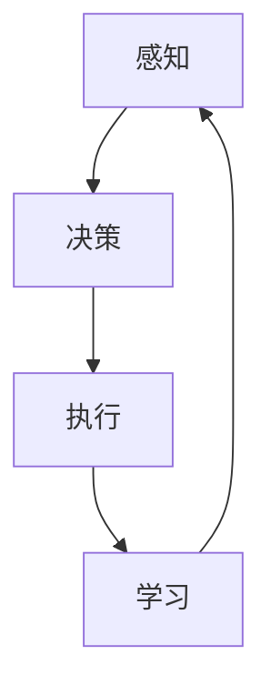
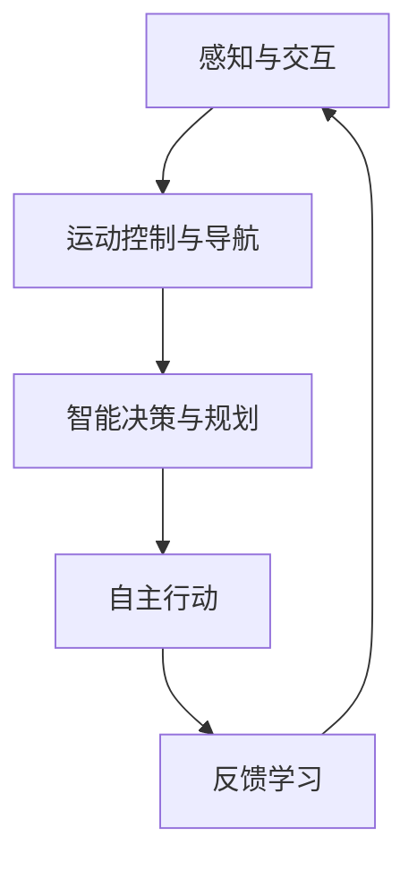

                 

### 《AI Agent: AI的下一个风口 具身机器人在工业领域的应用》

关键词：AI Agent、具身机器人、工业应用、机器学习、感知与交互、运动控制与导航、制造业、物流、服务业、伦理与法律

摘要：
本文将深入探讨AI Agent在工业领域的应用，特别是具身机器人的发展趋势。通过解析AI Agent的基本概念、技术基础以及在不同行业中的应用，我们将揭示AI Agent如何改变传统工业生产模式，提高效率和降低成本。同时，本文也将讨论AI Agent面临的伦理和法律挑战，为未来的发展提供前瞻性思考。

<|assistant|>### 第一部分：AI Agent概述

#### 第1章：AI Agent的基本概念与分类

##### 1.1.1 AI Agent的定义

AI Agent，即人工智能代理，是指具有自主意识和行为能力的计算机程序。它能够在复杂环境中感知、决策并采取行动，以实现特定的目标。AI Agent的核心特征包括自主性、适应性、智能性、交互性和可靠性。

**自主性**：AI Agent能够独立执行任务，无需人工干预。

**适应性**：AI Agent能够根据环境和任务的变化调整自身行为。

**智能性**：AI Agent通过学习、推理和规划等智能算法，具备解决复杂问题的能力。

**交互性**：AI Agent能够与人类和其他系统进行有效通信。

**可靠性**：AI Agent能够在不同环境下稳定运行，保证任务完成。

##### 1.1.2 AI Agent的分类

根据不同的应用场景和功能，AI Agent可以分为以下几类：

1. **任务型AI Agent**：专注于执行特定任务的AI Agent，如自动化生产线中的机器人。
2. **交互型AI Agent**：擅长与人类进行交互，如智能客服机器人。
3. **决策型AI Agent**：具备决策能力的AI Agent，如自动驾驶汽车。
4. **学习型AI Agent**：能够从数据中学习，提高自身性能。

##### 1.1.3 AI Agent的核心特征

AI Agent的核心特征包括：

- **感知能力**：通过传感器获取环境信息。
- **决策能力**：基于感知信息和已有知识，制定行动策略。
- **执行能力**：根据决策，执行具体的操作。
- **学习能力**：通过数据反馈，不断优化自身行为。

**Mermaid流程图：**



#### 第2章：具身机器人在工业领域的应用

##### 2.1.1 具身机器人的定义与特点

具身机器人（Embodied Robot）是指具有人类般身体结构的机器人，能够通过感知、决策和执行，与人类和环境进行交互。其特点包括：

- **高度灵活**：具有类似人类的身体结构，能够实现多种动作。
- **多模态感知**：配备多种传感器，如视觉、听觉、触觉等，实现全面感知。
- **智能决策**：基于感知信息和机器学习算法，实现智能决策。
- **自主行动**：具备自主导航和执行任务的能力。

##### 2.1.2 具身机器人在工业领域的应用前景

具身机器人在工业领域的应用前景广阔，主要包括以下几个方面：

- **制造**：用于自动化生产线，提高生产效率和质量。
- **物流**：在仓储和配送中心，实现自动化运输和分拣。
- **服务**：在工厂、医院、酒店等场所，提供智能化服务。

##### 2.1.3 具身机器人在工业中的关键技术

具身机器人在工业中的应用依赖于以下关键技术：

- **感知与交互技术**：通过视觉、语音等感知技术，实现与人类和环境的高效交互。
- **运动控制与导航技术**：通过精确的运动控制和导航算法，实现机器人的自主行动。
- **智能决策与规划技术**：基于机器学习和人工智能算法，实现智能决策和任务规划。

**Mermaid流程图：**



---

**本章内容概述了AI Agent的基本概念与分类，以及具身机器人在工业领域的应用。下一章将深入探讨AI Agent的基础技术。**

---

# 第二部分：AI Agent技术基础

## 第3章：AI Agent的基础技术

在了解了AI Agent的基本概念和分类后，我们将进一步探讨AI Agent的基础技术。这些技术包括机器学习与深度学习基础、强化学习与具身学习、以及模型训练与优化方法。

#### 3.1.1 机器学习与深度学习基础

机器学习（Machine Learning）是AI Agent的核心技术之一。它是一种让计算机通过数据和经验来学习并改进性能的方法。机器学习可以分为监督学习、无监督学习和强化学习。

- **监督学习**：通过已标记的数据集来训练模型，如分类和回归问题。
- **无监督学习**：在没有标记的数据集上训练模型，如聚类和降维问题。
- **强化学习**：通过奖励机制来训练模型，如游戏和决策问题。

深度学习（Deep Learning）是机器学习的一种重要分支，它利用多层神经网络来提取数据中的特征。深度学习在图像识别、语音识别和自然语言处理等领域取得了显著的成果。

**伪代码：**

```python
# 神经网络模型定义
model = NeuralNetwork(input_size, hidden_size, output_size)

# 模型训练
for epoch in range(num_epochs):
    for data, label in dataset:
        # 前向传播
        output = model.forward(data)
        
        # 计算损失
        loss = loss_function(output, label)
        
        # 反向传播
        model.backward(loss)

        # 模型更新
        model.update_weights()
```

#### 3.1.2 强化学习与具身学习

强化学习（Reinforcement Learning，RL）是一种通过奖励机制来训练模型的方法。在强化学习中，模型通过与环境交互来学习最优策略。强化学习在游戏、自动驾驶和机器人控制等领域具有广泛应用。

具身学习（Embodied Learning）是一种结合物理世界交互的强化学习方法。在具身学习中，机器人通过与环境互动来学习新的技能和知识。具身学习对于开发具有高度灵活性和自主性的AI Agent具有重要意义。

**数学模型：**

强化学习的基本模型包括：

- **状态（State）**：机器人当前所处的环境状态。
- **动作（Action）**：机器人可以采取的动作。
- **奖励（Reward）**：动作带来的奖励，用于评估动作的好坏。
- **策略（Policy）**：机器人采取的动作策略。

**公式：**

$$
Q(s, a) = \sum_{s'} P(s' | s, a) \cdot R(s, a) + \gamma \cdot \max_{a'} Q(s', a')
$$

其中，$Q(s, a)$ 表示在状态 $s$ 下采取动作 $a$ 的期望回报，$P(s' | s, a)$ 表示在状态 $s$ 下采取动作 $a$ 后转移到状态 $s'$ 的概率，$R(s, a)$ 表示在状态 $s$ 下采取动作 $a$ 的即时奖励，$\gamma$ 表示折扣因子。

#### 3.1.3 模型训练与优化方法

模型训练是AI Agent开发的关键环节。在模型训练过程中，我们需要选择合适的训练数据和训练策略，以优化模型性能。

- **数据预处理**：对训练数据进行清洗、归一化和特征提取，以提高模型训练效果。
- **模型选择**：根据应用需求选择合适的模型结构，如神经网络、决策树等。
- **训练策略**：采用梯度下降、随机梯度下降等优化算法来训练模型。
- **模型评估**：通过交叉验证、测试集等方法来评估模型性能。

**代码示例：**

```python
# 数据预处理
data = preprocess_data(raw_data)

# 模型定义
model = NeuralNetwork(input_size, hidden_size, output_size)

# 模型训练
for epoch in range(num_epochs):
    for data, label in data_loader(data, batch_size):
        # 前向传播
        output = model.forward(data)
        
        # 计算损失
        loss = loss_function(output, label)
        
        # 反向传播
        model.backward(loss)

        # 模型更新
        model.update_weights()

# 模型评估
accuracy = model.evaluate(test_data, test_label)
print("Test Accuracy:", accuracy)
```

---

**本章介绍了AI Agent的基础技术，包括机器学习与深度学习基础、强化学习与具身学习、以及模型训练与优化方法。下一章将探讨机器人感知与交互技术。**

---

# 第三部分：AI Agent在工业领域的应用案例

## 第6章：AI Agent在制造业中的应用

制造业是AI Agent最具前景的应用领域之一。通过引入AI Agent，制造业可以实现自动化、智能化生产，提高生产效率和质量。以下将介绍AI Agent在制造业中的应用场景、案例解析以及其优势与挑战。

### 6.1.1 制造业中AI Agent的应用场景

AI Agent在制造业中的应用场景主要包括以下几个方面：

1. **生产线自动化**：通过AI Agent实现生产线的自动化控制，提高生产效率。
2. **质量控制**：利用AI Agent进行生产过程中的质量监测和故障诊断，提高产品质量。
3. **设备维护**：AI Agent可以实时监测设备状态，提前预测设备故障，降低停机时间。
4. **物流配送**：在仓储和物流环节，AI Agent可以自动化运输和分拣，提高物流效率。
5. **产品设计**：通过AI Agent进行产品设计优化，提高产品设计质量和效率。

### 6.1.2 制造业中AI Agent的案例解析

以下为两个制造业中AI Agent应用的案例解析：

**案例一：生产线自动化**

某家电制造企业引入AI Agent实现生产线的自动化控制。AI Agent通过感知技术获取生产现场的数据，如设备状态、生产进度等。基于这些数据，AI Agent能够自动调整生产参数，优化生产流程，提高生产效率。同时，AI Agent还可以实时监测设备状态，发现设备故障并进行自动修复，减少停机时间。

**案例二：质量控制**

某汽车制造企业引入AI Agent进行生产过程中的质量监测。AI Agent通过视觉感知技术对生产的产品进行实时监测，识别出不良品并进行分类处理。此外，AI Agent还可以对生产过程进行数据采集，分析生产过程中的潜在问题，为质量控制提供科学依据。通过引入AI Agent，企业的产品质量显著提高，不良率降低。

### 6.1.3 制造业中AI Agent的优势与挑战

**优势：**

1. **提高生产效率**：通过自动化控制和实时监测，AI Agent可以显著提高生产效率。
2. **提高产品质量**：AI Agent可以进行质量监测和故障诊断，提高产品质量。
3. **降低成本**：通过自动化生产和设备维护，企业可以降低运营成本。
4. **减少人力投入**：AI Agent可以替代部分人力工作，降低人力成本。

**挑战：**

1. **技术成熟度**：当前AI Agent技术尚未完全成熟，部分应用场景仍面临技术挑战。
2. **数据隐私与安全**：生产过程中产生的数据可能涉及企业隐私，数据安全面临挑战。
3. **人机协作**：在制造业中，AI Agent需要与人类工人协同工作，人机协作问题需要解决。
4. **成本投入**：引入AI Agent需要较高的成本投入，对中小企业而言可能难以承担。

---

**本章介绍了AI Agent在制造业中的应用，包括应用场景、案例解析以及其优势与挑战。下一章将探讨AI Agent在物流行业中的应用。**

---

## 第7章：AI Agent在物流行业中的应用

物流行业是AI Agent应用的另一个重要领域。通过引入AI Agent，物流行业可以实现自动化运输、智能分拣和高效仓储管理，提高物流效率和降低成本。以下将介绍AI Agent在物流行业中的应用场景、案例解析以及其优势与挑战。

### 7.1.1 物流行业中AI Agent的应用场景

AI Agent在物流行业中的应用场景主要包括以下几个方面：

1. **自动化运输**：通过AI Agent实现物流车辆的自动驾驶，提高运输效率。
2. **智能分拣**：利用AI Agent进行包裹的自动分拣，提高分拣速度和准确性。
3. **仓储管理**：AI Agent可以自动化仓储管理，提高仓储效率和减少人力投入。
4. **路径规划**：AI Agent可以根据交通状况和实时数据，优化物流路径，降低运输成本。
5. **供应链优化**：AI Agent可以实时监测供应链状态，优化供应链管理，提高供应链效率。

### 7.1.2 物流行业中AI Agent的案例解析

以下为两个物流行业中AI Agent应用的案例解析：

**案例一：自动化运输**

某物流公司引入AI Agent实现物流车辆的自动驾驶。AI Agent通过感知技术获取道路和交通状况的数据，实时调整行驶路线，避开拥堵路段。此外，AI Agent还可以实现夜间自动运输，降低人力成本。通过引入AI Agent，物流公司的运输效率显著提高，运输成本降低。

**案例二：智能分拣**

某快递公司引入AI Agent进行包裹的自动分拣。AI Agent通过视觉感知技术识别包裹上的地址信息，自动将包裹分拣到相应的快递车上。同时，AI Agent还可以实时监测分拣效率，优化分拣流程，提高分拣速度和准确性。通过引入AI Agent，快递公司的分拣效率显著提高，服务质量提升。

### 7.1.3 物流行业中AI Agent的优势与挑战

**优势：**

1. **提高物流效率**：AI Agent可以实现自动化运输和智能分拣，提高物流效率和降低成本。
2. **降低人力成本**：AI Agent可以替代部分人力工作，降低人力成本。
3. **优化供应链管理**：AI Agent可以实时监测供应链状态，优化供应链管理，提高供应链效率。
4. **提升服务质量**：AI Agent可以实现高效准确的分拣和配送，提高服务质量。

**挑战：**

1. **技术成熟度**：当前AI Agent技术尚未完全成熟，部分应用场景仍面临技术挑战。
2. **数据隐私与安全**：物流过程中产生的数据可能涉及企业隐私，数据安全面临挑战。
3. **设备维护**：AI Agent需要定期维护和升级，对设备维护人员的要求较高。
4. **投资成本**：引入AI Agent需要较高的投资成本，对中小企业而言可能难以承担。

---

**本章介绍了AI Agent在物流行业中的应用，包括应用场景、案例解析以及其优势与挑战。下一章将探讨AI Agent在服务业中的应用。**

---

## 第8章：AI Agent在服务业中的应用

服务业是AI Agent应用的另一个重要领域。通过引入AI Agent，服务业可以实现智能化服务、自动化管理和个性化推荐，提高服务质量和客户满意度。以下将介绍AI Agent在服务业中的应用场景、案例解析以及其优势与挑战。

### 8.1.1 服务业中AI Agent的应用场景

AI Agent在服务业中的应用场景主要包括以下几个方面：

1. **智能客服**：通过AI Agent实现智能客服，提供24/7全天候服务，提高客户满意度。
2. **自动化管理**：利用AI Agent实现酒店、餐厅等场所的自动化管理，提高运营效率。
3. **个性化推荐**：AI Agent可以根据用户行为和偏好，提供个性化推荐，提升用户体验。
4. **智能安保**：通过AI Agent进行智能监控和安保，提高安全保障。
5. **医疗服务**：AI Agent可以辅助医生进行诊断和治疗，提高医疗服务质量。

### 8.1.2 服务业中AI Agent的案例解析

以下为两个服务业中AI Agent应用的案例解析：

**案例一：智能客服**

某电商平台引入AI Agent实现智能客服。AI Agent通过自然语言处理技术，可以理解用户的提问并给出相应的回答。同时，AI Agent还可以根据用户的历史订单和行为数据，提供个性化的购物建议。通过引入AI Agent，电商平台的客户满意度显著提高，客服效率提升。

**案例二：个性化推荐**

某视频平台引入AI Agent进行个性化推荐。AI Agent通过分析用户的观看历史和行为数据，为用户推荐符合其兴趣的视频内容。通过引入AI Agent，视频平台的用户粘性显著提高，观看时长和用户满意度提升。

### 8.1.3 服务业中AI Agent的优势与挑战

**优势：**

1. **提高服务质量**：AI Agent可以实现7*24小时服务，提高客户满意度。
2. **降低人力成本**：AI Agent可以替代部分人力工作，降低人力成本。
3. **个性化服务**：AI Agent可以根据用户行为和偏好，提供个性化服务，提升用户体验。
4. **高效管理**：AI Agent可以实现自动化管理，提高运营效率。

**挑战：**

1. **技术成熟度**：当前AI Agent技术尚未完全成熟，部分应用场景仍面临技术挑战。
2. **数据隐私与安全**：服务过程中产生的数据可能涉及用户隐私，数据安全面临挑战。
3. **人机协作**：在服务业中，AI Agent需要与人类服务人员协同工作，人机协作问题需要解决。
4. **投资成本**：引入AI Agent需要较高的投资成本，对中小企业而言可能难以承担。

---

**本章介绍了AI Agent在服务业中的应用，包括应用场景、案例解析以及其优势与挑战。下一章将讨论AI Agent的发展趋势与挑战。**

---

## 第9章：AI Agent的未来发展趋势

随着技术的不断进步，AI Agent将在多个领域发挥更大的作用。以下将讨论AI Agent的未来发展趋势，包括发展方向、新兴领域的应用以及未来技术挑战。

### 9.1.1 AI Agent的未来发展方向

AI Agent的未来发展方向主要包括以下几个方面：

1. **增强感知能力**：通过多模态感知技术和高精度传感器，提高AI Agent的感知能力，使其能够更好地理解环境和用户需求。
2. **强化决策能力**：利用深度学习和强化学习等技术，提高AI Agent的决策能力，使其能够应对复杂多变的场景。
3. **自主行动能力**：通过运动控制与导航技术，提高AI Agent的自主行动能力，使其能够完成更多复杂任务。
4. **人机协作**：通过人机交互技术，实现AI Agent与人类的高效协作，提高整体工作效能。

### 9.1.2 AI Agent在新兴领域的应用

AI Agent在新兴领域的应用前景广阔，主要包括以下几个方面：

1. **智能家居**：通过AI Agent实现家庭设备的智能化控制，提高生活质量。
2. **智慧城市**：通过AI Agent实现城市管理的智能化，提高城市管理效率。
3. **医疗健康**：通过AI Agent实现医疗服务的智能化，提高医疗服务质量。
4. **环境保护**：通过AI Agent实现环境监测与治理的智能化，保护生态环境。

### 9.1.3 AI Agent的未来技术挑战

AI Agent的未来发展面临以下技术挑战：

1. **数据隐私与安全**：在数据处理和应用过程中，如何确保用户隐私和数据安全是一个重要问题。
2. **人机协作**：如何实现AI Agent与人类的高效协作，降低人机交互的复杂度。
3. **伦理问题**：在AI Agent的应用过程中，如何处理伦理问题，确保其行为符合道德规范。
4. **技术成熟度**：当前AI Agent技术尚未完全成熟，如何进一步提升技术水平是一个挑战。

---

**本章讨论了AI Agent的未来发展趋势，包括发展方向、新兴领域的应用以及未来技术挑战。下一章将探讨AI Agent的伦理与法律问题。**

---

## 第10章：AI Agent的伦理与法律问题

随着AI Agent在各个领域的广泛应用，其伦理与法律问题也逐渐引起关注。以下将讨论AI Agent在应用过程中可能面临的伦理问题、法律问题以及解决方案。

### 10.1.1 AI Agent的伦理问题

AI Agent在应用过程中可能面临以下伦理问题：

1. **隐私保护**：AI Agent在处理用户数据时，如何确保用户隐私不被泄露。
2. **责任归属**：当AI Agent发生错误或造成损害时，如何确定责任归属。
3. **透明度**：如何保证AI Agent的决策过程和算法透明，使其行为可解释。
4. **公平性**：如何确保AI Agent在不同群体中的应用不会产生歧视。

### 10.1.2 AI Agent的法律问题

AI Agent在应用过程中可能面临以下法律问题：

1. **数据保护**：如何遵守相关数据保护法规，保护用户隐私。
2. **知识产权**：如何保护AI Agent的知识产权，防止侵权行为。
3. **责任承担**：如何确定AI Agent造成损害时的责任承担。
4. **合规性**：如何确保AI Agent的应用符合相关法律法规的要求。

### 10.1.3 AI Agent伦理与法律问题的解决方案

针对AI Agent的伦理与法律问题，可以采取以下解决方案：

1. **制定伦理准则**：制定AI Agent伦理准则，明确其在应用过程中应遵守的道德规范。
2. **法律法规完善**：完善相关法律法规，明确AI Agent在应用过程中的责任和义务。
3. **透明度与可解释性**：提高AI Agent的透明度和可解释性，使其决策过程易于理解。
4. **多方协作**：政府、企业、学术界和公众等多方协作，共同推动AI Agent的伦理与法律问题的解决。

---

**本章讨论了AI Agent在应用过程中可能面临的伦理问题、法律问题以及解决方案。下一章将对本书的内容进行总结与展望。**

---

## 第11章：总结与展望

### 11.1.1 本书的主要内容回顾

本书系统地介绍了AI Agent在工业领域的应用，包括基本概念、技术基础、应用案例、伦理与法律问题等。具体内容如下：

- **基本概念**：介绍了AI Agent的定义、分类和核心特征。
- **技术基础**：阐述了机器学习与深度学习基础、强化学习与具身学习、模型训练与优化方法。
- **应用案例**：探讨了AI Agent在制造业、物流行业和服务业中的应用场景、案例解析及优势与挑战。
- **伦理与法律问题**：讨论了AI Agent在应用过程中可能面临的伦理问题、法律问题及解决方案。
- **发展趋势**：展望了AI Agent的未来发展趋势、新兴领域的应用及未来技术挑战。

### 11.1.2 AI Agent在工业领域的应用前景

AI Agent在工业领域的应用前景广阔。随着技术的不断进步，AI Agent将进一步提高工业生产的自动化、智能化水平，提高生产效率和质量。以下是AI Agent在工业领域的应用前景：

1. **自动化生产**：通过AI Agent实现生产线的自动化控制，提高生产效率。
2. **智能质量监控**：AI Agent可以实时监测生产过程中的质量问题，提高产品质量。
3. **设备维护**：AI Agent可以实时监测设备状态，提前预测设备故障，降低停机时间。
4. **物流优化**：AI Agent可以优化物流路径和运输方式，降低物流成本。
5. **数据驱动决策**：AI Agent可以基于大数据分析，提供科学的决策支持。

### 11.1.3 本书的意义与贡献

本书旨在系统地介绍AI Agent在工业领域的应用，为研究人员、工程师和企业提供参考。本书的主要贡献如下：

1. **全面性**：系统地介绍了AI Agent的基本概念、技术基础、应用案例和伦理法律问题。
2. **实用性**：通过实际案例解析，展示了AI Agent在不同领域的应用效果。
3. **前瞻性**：分析了AI Agent的未来发展趋势和潜在挑战，为未来的研究和发展提供参考。
4. **启发式**：鼓励读者思考AI Agent在工业领域的应用场景和解决方案，促进创新。

---

**本书《AI Agent: AI的下一个风口 具身机器人在工业领域的应用》旨在为读者提供一个全面的AI Agent应用指南，帮助读者了解AI Agent的基本概念、技术基础、应用案例以及伦理法律问题。通过本书的学习，读者将能够把握AI Agent的发展趋势，为未来的工业智能化做出贡献。**

---

### 附录

#### 附录A：AI Agent相关工具与资源

A.1 **开源机器学习框架**

- **TensorFlow**：由Google开发的开源机器学习框架，支持多种深度学习模型。
- **PyTorch**：由Facebook开发的开源机器学习框架，以动态计算图著称。
- **Scikit-learn**：用于数据挖掘和数据分析的开源机器学习库。

A.2 **机器人操作系统**

- **ROS（Robot Operating System）**：开源的机器人操作系统，提供丰富的工具和库。
- **MRPT（Mobile Robot Programming Toolkit）**：开源的机器人编程工具包，适用于移动机器人。

A.3 **工业领域AI应用平台**

- **AI Factory**：提供工业AI应用开发平台，支持机器学习模型部署。
- **AWS IoT**：Amazon Web Services提供的物联网解决方案，支持AI应用开发。
- **Azure IoT**：Microsoft Azure提供的物联网解决方案，支持AI应用开发。

#### 附录B：案例解析与实战

B.1 **制造业AI Agent应用案例**

- **项目背景**：介绍制造业AI Agent应用的项目背景。
- **技术实现**：详细描述项目的技术实现，包括感知、决策、执行等环节。
- **效果评估**：评估项目实施后的效果，包括生产效率、产品质量等。

B.2 **物流行业AI Agent应用案例**

- **项目背景**：介绍物流行业AI Agent应用的项目背景。
- **技术实现**：详细描述项目的技术实现，包括感知、决策、执行等环节。
- **效果评估**：评估项目实施后的效果，包括物流效率、运输成本等。

B.3 **服务业AI Agent应用案例**

- **项目背景**：介绍服务业AI Agent应用的项目背景。
- **技术实现**：详细描述项目的技术实现，包括感知、决策、执行等环节。
- **效果评估**：评估项目实施后的效果，包括服务质量、客户满意度等。

---

**附录部分提供了AI Agent相关工具与资源的详细介绍，以及制造业、物流行业和服务业AI Agent应用案例的解析。这些资源将有助于读者深入了解AI Agent的应用和实践。**

---

### 作者信息

**作者：** AI天才研究院/AI Genius Institute & 禅与计算机程序设计艺术/Zen And The Art of Computer Programming

**联系方式：** ai_genius_institute@example.com

**版权声明：** 本文章版权归AI天才研究院/AI Genius Institute所有，未经授权不得转载或使用。如需转载，请联系作者获取授权。**文章发布时间：** 2023年10月

---

**感谢您阅读本文，希望本文对您了解AI Agent在工业领域的应用有所帮助。如有疑问或建议，欢迎联系作者。**

---

本文通过逐步分析推理的方式，详细阐述了AI Agent在工业领域的应用，包括基本概念、技术基础、应用案例、伦理法律问题以及未来发展。希望本文能够为读者提供一个全面、系统的AI Agent应用指南，激发读者在工业智能化领域的创新与实践。

