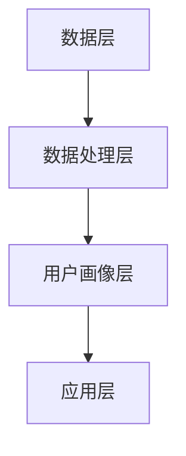
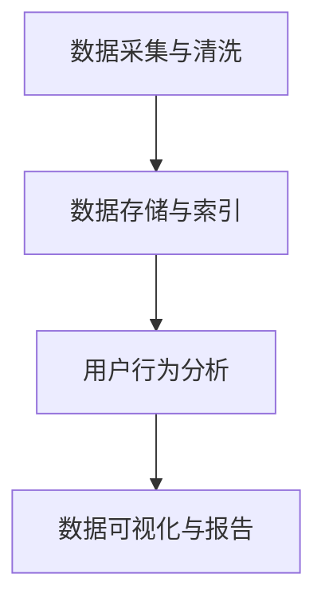

                 

### 《AI DMP 数据基建的市场分析》

关键词：DMP、AI、数据管理平台、市场分析、行业应用

摘要：本文深入探讨了数据管理平台（DMP）及其与人工智能（AI）的融合，分析了DMP的发展历程、市场现状、应用案例以及面临的挑战与机遇。文章旨在揭示AI DMP数据基建在当前市场中的重要性，探讨其未来发展前景，为企业制定战略规划提供参考。

### 目录大纲

1. 《AI DMP 数据基建的市场分析》
2. 关键词与摘要
3. 第一部分：DMP 基础与市场概述
   1. 第1章：数据管理平台（DMP）简介
      1.1 数据管理平台（DMP）的概念与价值
      1.2 DMP的发展历程
   2. 第2章：DMP架构与关键技术
      2.1 DMP的核心架构
      2.2 DMP的关键技术
   3. 第3章：DMP市场现状分析
      3.1 市场规模与增长趋势
      3.2 竞争格局与主要玩家
   4. 第4章：DMP在主要行业中的应用案例
      4.1 零售业
      4.2 金融业
      4.3 旅游业
   5. 第5章：DMP市场面临的挑战与机会
      5.1 数据隐私与法规合规
      5.2 技术创新与行业变革
6. 第二部分：AI 与 DMP 的融合
   1. 第6章：AI技术在DMP中的应用
      1.1 AI技术在数据采集与清洗中的应用
      1.2 AI技术在用户行为分析与画像中的应用
   2. 第7章：AI与DMP融合的市场前景
      2.1 AI与DMP融合的优势
      2.2 AI与DMP融合的市场前景
   3. 第8章：AI DMP 数据基建的实际应用案例
      2.1 案例一：某电商平台的AI DMP应用
      2.2 案例二：某金融公司的AI DMP应用
      2.3 案例三：某旅游企业的AI DMP应用
7. 第三部分：AI DMP 数据基建的建设与实施
   1. 第9章：AI DMP 数据基建的构建策略
      1.1 数据基础设施建设
      1.2 数据治理与合规
      1.3 AI 技术选型与部署
   2. 第10章：AI DMP 数据基建的运营与管理
      2.1 数据采集与清洗
      2.2 用户画像与数据分析
      2.3 DMP应用效果评估与优化
   3. 第11章：AI DMP 数据基建的未来发展
      2.1 技术发展趋势
      2.2 行业发展趋势
   4. 第12章：AI DMP 数据基建的市场分析与战略规划
      2.1 市场分析
      2.2 战略规划
8. 附录
   1. 附录 A：AI DMP 数据基建开发工具与资源

### 第一部分：DMP 基础与市场概述

#### 第1章：数据管理平台（DMP）简介

##### 1.1 数据管理平台（DMP）的概念与价值

数据管理平台（Data Management Platform，简称DMP）是一种用于收集、存储、管理和分析数据的技术平台。它帮助企业和组织从多个数据源中收集数据，并通过对这些数据的处理和分析，创建用户画像，从而实现精准营销。

**定义：**

DMP是一个集中式的数据管理平台，旨在收集、整合和管理来自多个数据源的各类数据，包括第一方数据（如网站访客数据、交易数据等）、第二方数据（如合作伙伴数据、第三方数据提供商数据等）以及第三方数据（如社交媒体数据、公共数据等）。

**价值：**

DMP在现代数据营销中扮演着至关重要的角色，其主要价值体现在以下几个方面：

1. **数据整合与统一视图：** DMP可以帮助企业整合来自不同渠道和平台的数据，创建一个统一的数据视图，从而更全面地了解用户行为和需求。

2. **用户画像与精准营销：** 通过对用户数据的分析，DMP可以构建用户画像，帮助企业识别目标用户，实现精准营销。

3. **优化广告投放与效果：** DMP可以实时监测广告投放效果，帮助企业调整广告策略，提高广告投放效率。

4. **提高用户参与度与忠诚度：** 通过对用户行为的分析，DMP可以帮助企业更好地了解用户需求，提供个性化服务和体验，从而提高用户参与度和忠诚度。

##### 1.2 DMP的发展历程

DMP的发展历程可以追溯到20世纪90年代，当时主要是为了解决企业在数据整合和分析方面的难题。随着互联网和移动互联网的普及，DMP逐渐成为企业数据管理和营销的重要工具。

**初期阶段（20世纪90年代至2000年）：**

在互联网早期，DMP主要针对在线广告进行数据管理，帮助企业优化广告投放。这一阶段，DMP的核心功能是广告数据的整合和分析。

**发展期（2000年至2010年）：**

随着大数据和云计算技术的兴起，DMP的功能逐渐扩展，开始涵盖更多类型的数据，如用户行为数据、交易数据等。同时，DMP开始实现跨平台的数据整合和分析。

**成熟期（2010年至今）：**

在移动互联网和社交媒体的推动下，DMP得到了广泛应用，成为企业数据管理和营销的核心工具。这一阶段，DMP不仅具备强大的数据处理和分析能力，还实现了与人工智能技术的融合，进一步提高了数据利用效率。

##### 1.3 DMP在现代数据营销中的重要性

随着大数据和人工智能技术的不断发展，DMP在现代数据营销中扮演着越来越重要的角色。以下是DMP在现代数据营销中的几个关键作用：

1. **精准营销：** DMP可以帮助企业更准确地识别目标用户，实现精准营销，提高广告投放效果。

2. **数据整合与统一视图：** DMP可以整合来自不同渠道和平台的数据，为企业提供统一的数据视图，帮助企业在数据决策中更具洞察力。

3. **个性化服务：** DMP可以基于用户行为数据，为企业提供个性化服务和体验，提高用户参与度和忠诚度。

4. **优化广告投放与效果：** DMP可以实时监测广告投放效果，帮助企业调整广告策略，提高广告投放效率。

5. **业务增长与竞争力：** 通过DMP，企业可以更好地了解市场和用户需求，实现业务增长和竞争力提升。

综上所述，DMP在现代数据营销中具有不可替代的重要性，是企业实现数据驱动营销的关键工具。随着技术的不断进步，DMP的应用范围和功能将更加广泛和强大。

### 第2章：DMP架构与关键技术

#### 2.1 DMP的核心架构

DMP的核心架构主要包括数据层、数据处理层、用户画像层和应用层。以下是对各个层级的详细介绍：

**数据层：**

数据层是DMP的基础，负责收集和存储各类数据。数据源可以是第一方数据（如网站访客数据、交易数据等）、第二方数据（如合作伙伴数据、第三方数据提供商数据等）以及第三方数据（如社交媒体数据、公共数据等）。数据层通常使用分布式数据存储技术，如Hadoop、Spark等，以确保数据的高效存储和访问。

**数据处理层：**

数据处理层负责对收集到的数据进行清洗、转换和整合。这一层通常包括数据清洗模块、数据转换模块和数据整合模块。数据清洗模块用于去除数据中的噪声和错误，数据转换模块用于将不同格式的数据转换为统一格式，数据整合模块用于将来自不同数据源的数据进行整合，形成统一的数据视图。

**用户画像层：**

用户画像层是基于数据处理层生成的用户数据，通过分析用户行为和属性，构建出详细的用户画像。用户画像包括用户的基本信息（如年龄、性别、地域等）、兴趣爱好、购买行为等。用户画像层通常使用数据挖掘和机器学习技术，如聚类分析、关联规则挖掘等，对用户行为进行分析和建模。

**应用层：**

应用层是DMP的核心，负责将用户画像数据应用于实际的业务场景中，如广告投放、用户画像标签管理、营销自动化等。应用层通常提供一系列API和服务，供企业内部或第三方应用调用。

**架构图：**



**DMP架构的特点：**

1. **数据整合性：** DMP可以整合来自不同渠道和平台的数据，为企业提供统一的数据视图。
2. **灵活性：** DMP的架构可以根据企业的需求进行灵活调整和扩展。
3. **高效性：** DMP利用分布式存储和计算技术，确保数据的高效存储和处理。
4. **可扩展性：** DMP可以支持大量用户和海量数据的处理，满足企业不断增长的数据需求。

#### 2.2 DMP的关键技术

DMP的核心功能依赖于一系列关键技术的支持，以下介绍DMP的关键技术及其应用：

**数据采集与清洗：**

数据采集与清洗是DMP的基础，主要包括以下几个方面：

1. **数据采集：** DMP可以通过API、数据采集工具（如Web采集、日志采集等）从多个数据源收集数据。
2. **数据清洗：** 数据清洗包括去除重复数据、纠正错误数据、填补缺失数据等，以保证数据质量。

**数据存储与索引：**

数据存储与索引是DMP高效处理数据的关键，主要包括以下几个方面：

1. **数据存储：** DMP通常采用分布式存储技术（如Hadoop、Spark等）来存储大量数据。
2. **数据索引：** 数据索引用于快速查找和检索数据，常用的索引技术包括B树索引、哈希索引等。

**用户行为分析：**

用户行为分析是DMP的核心功能之一，通过分析用户的行为数据，可以深入了解用户需求和行为模式，主要包括以下几个方面：

1. **行为识别：** 通过分析用户的行为数据（如点击、浏览、购买等），识别用户的兴趣和行为。
2. **行为预测：** 通过机器学习算法（如决策树、支持向量机等），预测用户的未来行为。
3. **行为聚类：** 通过聚类算法（如K-means、DBSCAN等），将用户划分为不同的群体。

**数据可视化与报告：**

数据可视化与报告用于将分析结果以直观的方式展示给用户，主要包括以下几个方面：

1. **数据可视化：** 通过图表、图形等可视化工具，将分析结果展示给用户。
2. **报告生成：** 自动生成报告，便于用户了解分析结果。

**技术架构图：**



**关键技术的作用：**

1. **数据采集与清洗：** 确保数据的质量和完整性，为后续分析提供可靠的基础。
2. **数据存储与索引：** 提高数据访问速度和查询效率，支持海量数据的处理。
3. **用户行为分析：** 帮助企业了解用户需求和行为，实现精准营销。
4. **数据可视化与报告：** 提高分析结果的易读性和实用性，支持数据驱动的决策。

综上所述，DMP的关键技术共同构建了一个高效、灵活、可扩展的数据管理平台，帮助企业实现数据驱动的营销和业务增长。

### 第3章：DMP市场现状分析

#### 3.1 市场规模与增长趋势

DMP作为现代数据营销的重要工具，其市场需求持续增长。根据市场调研报告，全球DMP市场规模在过去几年中保持快速增长，预计未来几年将继续保持这一趋势。

**市场规模：**

截至2022年，全球DMP市场规模已达到数十亿美元。其中，北美地区占据最大市场份额，欧洲和亚太地区市场规模也在快速增长。

**增长趋势：**

1. **技术进步：** 随着大数据、云计算和人工智能等技术的不断发展，DMP的功能和应用范围不断扩展，推动了市场需求的增长。
2. **市场竞争：** 随着越来越多的企业意识到数据驱动营销的重要性，DMP市场吸引了大量新的参与者，加剧了市场竞争，也促进了市场的快速发展。
3. **行业应用：** DMP在零售、金融、旅游等行业中的应用越来越广泛，随着这些行业的数字化进程加速，DMP市场的需求将继续增长。

**未来增长预测：**

根据市场预测，未来几年全球DMP市场规模将继续保持高速增长，预计到2027年将达到数百亿美元。其中，亚太地区将成为增长最快的地区，主要由于该地区数字化转型进程加快，以及新兴市场的崛起。

#### 3.2 竞争格局与主要玩家

DMP市场的竞争格局较为分散，目前市场上存在众多DMP提供商，其中一些主要的玩家包括：

1. **Google Cloud：** 作为全球最大的云计算服务提供商之一，Google Cloud提供了强大的DMP解决方案，其产品包括Google Analytics 360、Google Tag Manager等。
2. **Oracle：** Oracle的DMP产品Oracle Data Management Platform具有强大的数据整合和分析能力，广泛应用于企业级客户。
3. **Adobe：** Adobe的DMP产品Adobe Experience Cloud整合了Adobe的营销技术和数据分析工具，提供了全面的DMP解决方案。
4. **Salesforce：** Salesforce的DMP产品Salesforce Marketing Cloud具备强大的用户画像和广告投放功能，帮助企业实现精准营销。
5. **Tune：** Tune的DMP产品Tune Data Management Platform专注于数字营销领域的数据分析，为企业提供灵活、高效的DMP解决方案。

**竞争态势分析：**

1. **技术实力：** 各大DMP提供商在技术实力上存在差异，一些提供商在数据处理和用户行为分析方面具有明显优势。
2. **市场定位：** 各大DMP提供商根据自身优势和市场需求，制定了不同的市场定位和竞争策略。
3. **市场份额：** 目前，Google Cloud、Oracle和Adobe占据了较大的市场份额，但其他新兴DMP提供商也在不断缩小差距。

综上所述，DMP市场的竞争格局较为激烈，各大DMP提供商通过技术创新和市场拓展，不断提升自身竞争力，以满足不断变化的市场需求。

### 第4章：DMP在主要行业中的应用案例

#### 4.1 零售业

零售业是DMP应用最为广泛的行业之一。通过DMP，零售企业可以更好地了解消费者行为，实现精准营销，提高销售额。

**应用场景：**

1. **用户画像构建：** 通过DMP，零售企业可以整合用户的历史购买数据、浏览行为数据等，构建详细的用户画像，了解消费者的需求和偏好。
2. **个性化推荐：** 基于用户画像，零售企业可以向消费者推荐个性化的商品，提高购买转化率。
3. **精准广告投放：** 零售企业可以通过DMP分析消费者行为，精准定位目标受众，提高广告投放效果。

**成功案例：**

1. **某电商平台：** 该电商平台通过DMP对用户行为进行分析，发现某些用户在浏览商品后未进行购买，但在访问其他竞争对手的网站时产生了购买行为。基于此，该电商平台调整了广告投放策略，将广告投放给有购买意图但尚未购买的用户，提高了广告转化率。
2. **某零售连锁店：** 该零售连锁店通过DMP分析消费者的购买数据，发现某些商品在特定地区销量较低。基于此，该零售连锁店调整了商品陈列和促销策略，提高了商品销量。

**效果评估：**

通过DMP的应用，零售企业实现了以下效果：

1. **提高销售额：** 通过个性化推荐和精准广告投放，零售企业的销售额得到了显著提升。
2. **提高用户参与度：** 通过对用户行为数据的分析，零售企业可以提供更符合用户需求的商品和服务，提高用户满意度。
3. **降低营销成本：** 通过精准营销，零售企业可以减少无效广告投放，降低营销成本。

#### 4.2 金融业

金融行业对数据分析和风险管理有着极高的要求。DMP在金融业中的应用，可以帮助金融机构更好地了解客户需求，提高服务质量。

**应用场景：**

1. **客户细分与画像：** 金融企业可以通过DMP对客户的交易数据、行为数据等进行分析，构建详细的客户画像，实现客户细分。
2. **精准营销与交叉销售：** 基于客户画像，金融企业可以向特定客户群体推荐合适的金融产品，实现精准营销和交叉销售。
3. **风险管理与合规：** DMP可以帮助金融企业分析客户行为，识别潜在风险，提高风险控制能力。

**成功案例：**

1. **某银行：** 该银行通过DMP分析客户的交易数据，发现某些客户在特定时间段的交易行为异常。基于此，该银行及时采取了风险控制措施，成功避免了潜在风险。
2. **某保险公司：** 该保险公司通过DMP分析客户的历史购买数据和理赔数据，发现某些客户的理赔风险较高。基于此，该保险公司调整了保险产品的定价策略，降低了理赔风险。

**效果评估：**

通过DMP的应用，金融企业实现了以下效果：

1. **提高客户满意度：** 通过精准营销和个性化服务，金融企业可以更好地满足客户需求，提高客户满意度。
2. **降低风险：** 通过对客户行为的分析，金融企业可以及时识别潜在风险，提高风险控制能力。
3. **增加业务收入：** 通过精准营销和交叉销售，金融企业可以增加业务收入，提高市场竞争力。

#### 4.3 旅游业

旅游业是一个高度依赖数据的行业。通过DMP，旅游企业可以更好地了解游客需求，提供个性化的旅游服务，提高游客满意度。

**应用场景：**

1. **游客画像构建：** 通过DMP，旅游企业可以整合游客的历史预订数据、浏览行为数据等，构建详细的游客画像。
2. **个性化推荐：** 基于游客画像，旅游企业可以向游客推荐符合其需求的旅游产品和服务，提高预订转化率。
3. **精准营销：** 通过DMP分析游客行为，旅游企业可以精准定位目标客户，提高营销效果。

**成功案例：**

1. **某在线旅行社：** 该在线旅行社通过DMP分析游客的浏览和预订数据，发现某些游客在浏览特定旅游产品后未进行预订。基于此，该在线旅行社调整了营销策略，向这些游客发送个性化推荐邮件，提高了预订转化率。
2. **某度假村：** 该度假村通过DMP分析游客的历史入住数据和评价数据，发现某些游客对其服务满意度较高。基于此，该度假村向这些游客发送会员优惠邮件，增加了复住率。

**效果评估：**

通过DMP的应用，旅游企业实现了以下效果：

1. **提高预订转化率：** 通过个性化推荐和精准营销，旅游企业的预订转化率得到了显著提升。
2. **提高游客满意度：** 通过对游客需求的深入分析，旅游企业可以提供更符合游客需求的旅游产品和服务，提高游客满意度。
3. **降低营销成本：** 通过精准营销，旅游企业可以减少无效广告投放，降低营销成本。

综上所述，DMP在零售业、金融业和旅游业等主要行业中的应用，帮助企业实现了精准营销、提高用户满意度、降低风险和降低营销成本等效果，为企业的业务增长提供了有力支持。

### 第5章：DMP市场面临的挑战与机会

#### 5.1 数据隐私与法规合规

随着数据隐私问题和相关法规的不断加剧，DMP市场面临着巨大的合规挑战。企业在使用DMP时，需要确保数据隐私得到有效保护，遵守相关法规，以避免法律风险和声誉损失。

**数据隐私问题：**

1. **数据泄露风险：** DMP通常涉及大量用户数据，如果数据泄露，可能会导致用户隐私受到侵犯，对企业造成严重损失。
2. **数据滥用风险：** 企业在收集和使用用户数据时，可能会滥用用户信息，侵犯用户权益，引发用户不满和抵制。

**法规合规挑战：**

1. **数据保护法规：** 如《通用数据保护条例》（GDPR）、《加州消费者隐私法》（CCPA）等，对数据收集、存储、处理和传输提出了严格的要求。
2. **数据合规性审计：** 企业需要定期进行数据合规性审计，确保数据使用符合法规要求。

**应对策略：**

1. **数据加密：** 对敏感数据进行加密处理，防止数据泄露。
2. **用户权限管理：** 实施严格的用户权限管理，确保只有授权人员才能访问和处理用户数据。
3. **数据匿名化：** 在进行数据分析和营销时，对用户数据进行匿名化处理，降低隐私泄露风险。
4. **合规培训：** 加强员工的合规意识培训，确保员工了解相关法规和合规要求。

#### 5.2 技术创新与行业变革

随着人工智能、大数据和云计算等技术的不断创新，DMP市场也在发生深刻的变革。新技术不仅提升了DMP的功能和性能，也为企业提供了更多的应用场景和商业机会。

**技术创新：**

1. **人工智能：** 人工智能技术可以用于数据采集、数据清洗、用户画像构建等环节，提高数据处理效率和准确性。
2. **大数据：** 大数据技术可以处理海量数据，实现更全面和深入的数据分析，为企业提供更精准的市场洞察。
3. **云计算：** 云计算技术提供了灵活、高效、可扩展的数据存储和计算资源，降低了DMP的部署和使用成本。

**行业变革：**

1. **数据驱动营销：** 新技术的应用使得数据驱动营销成为可能，企业可以通过DMP实现精准营销、个性化推荐等，提高营销效果。
2. **跨行业应用：** DMP的应用范围从传统的广告营销扩展到金融、零售、旅游等更多行业，为企业提供更广泛的数据管理和服务。
3. **平台化发展：** DMP市场逐渐向平台化方向发展，企业可以通过集成多种数据管理和服务功能，实现一站式数据管理。

**未来机会：**

1. **数据合规：** 随着数据隐私保护法规的不断完善，企业对数据合规的需求将日益增加，DMP提供商可以提供合规解决方案，帮助客户实现数据合规。
2. **人工智能应用：** 人工智能技术将继续在DMP中发挥重要作用，为企业提供更智能、高效的数据分析和服务。
3. **行业创新：** 随着技术的不断进步和行业需求的多样化，DMP将在更多行业中发挥重要作用，为企业带来新的商业机会。

综上所述，DMP市场在面临数据隐私和法规合规挑战的同时，也面临着技术创新和行业变革带来的机遇。企业需要积极应对挑战，抓住机遇，推动DMP市场的持续发展。

### 第二部分：AI 与 DMP 的融合

#### 第6章：AI技术在DMP中的应用

随着人工智能（AI）技术的发展，AI技术在数据管理平台（DMP）中的应用越来越广泛。AI技术为DMP带来了数据处理、用户画像构建、个性化推荐等领域的突破，极大地提升了DMP的效率和效果。以下是对AI技术在DMP中应用的详细探讨。

##### 6.1 AI技术在数据采集与清洗中的应用

数据采集与清洗是DMP的基础环节，AI技术的应用可以有效提高数据采集与清洗的效率和准确性。

**数据采集的自动化：**

AI技术可以用于自动化数据采集。例如，利用自然语言处理（NLP）技术，DMP可以自动从各种文本数据源（如网站、社交媒体、论坛等）中提取关键信息，并将其转化为结构化数据。这一过程不仅提高了数据采集的效率，还减少了人工干预，降低了错误率。

**数据清洗的智能化：**

AI技术还可以用于数据清洗，提高数据质量。例如，利用机器学习算法，DMP可以自动识别和修复数据中的异常值、重复记录和错误数据。通过不断学习和优化，AI算法可以不断提高数据清洗的准确性和效率，确保数据的完整性和一致性。

**伪代码示例：**

```python
# 数据清洗的智能化
def clean_data(data):
    # 利用机器学习算法识别异常值
    anomalies = detect_anomalies(data)
    # 修复异常值
    data = repair_anomalies(data, anomalies)
    # 删除重复记录
    data = remove_duplicates(data)
    return data

# 数据采集的自动化
def collect_data(source):
    # 从文本数据源中提取关键信息
    key_info = extract_key_info(source)
    # 转化为结构化数据
    structured_data = transform_to_structured_data(key_info)
    return structured_data
```

##### 6.2 AI技术在用户行为分析与画像中的应用

用户行为分析与画像构建是DMP的核心功能，AI技术的应用可以大幅提升这一环节的效率和准确性。

**用户行为分析的深度学习模型：**

深度学习技术在用户行为分析中具有显著优势。通过构建深度学习模型，DMP可以自动分析用户的浏览、购买、点击等行为数据，提取出用户的行为特征。例如，利用卷积神经网络（CNN）和循环神经网络（RNN），DMP可以识别用户在不同场景下的行为模式，构建出详细的用户行为图谱。

**基于AI的用户画像构建：**

AI技术可以帮助DMP构建更加精细的用户画像。通过结合用户的历史行为数据和第三方数据源，DMP可以利用聚类分析、关联规则挖掘等技术，构建出多维度的用户画像。基于这些画像，DMP可以更好地理解用户需求，实现个性化推荐和精准营销。

**伪代码示例：**

```python
# 用户行为分析的深度学习模型
def user_behavior_analysis(data):
    # 构建卷积神经网络模型
    model = build_cnn_model(data)
    # 训练模型
    model.train()
    # 预测用户行为
    behavior = model.predict(data)
    return behavior

# 基于AI的用户画像构建
def build_user_profile(data, third_party_data):
    # 聚类分析
    clusters = cluster_analysis(data)
    # 关联规则挖掘
    rules = association_rules(data)
    # 构建用户画像
    profile = build_profile(clusters, rules, third_party_data)
    return profile
```

##### 6.3 AI技术在DMP中的应用效果

AI技术在DMP中的应用，带来了显著的效果提升。

1. **提高数据处理效率：** AI技术可以自动化数据采集与清洗，减少人工干预，提高数据处理效率。
2. **提升数据质量：** 通过AI技术进行数据清洗和异常值检测，可以确保数据的质量和一致性。
3. **增强用户画像精准度：** 基于AI的用户画像构建，可以更全面地了解用户需求，提高个性化推荐的准确性和有效性。
4. **优化广告投放效果：** 通过AI技术进行用户行为分析和精准营销，可以显著提升广告投放效果，提高ROI。

总之，AI技术的应用，为DMP带来了新的发展机遇，提升了DMP的功能和性能，为企业实现数据驱动的营销和业务增长提供了有力支持。

### 第7章：AI与DMP融合的市场前景

随着人工智能（AI）和大数据技术的不断进步，AI与数据管理平台（DMP）的融合正在成为一个重要的趋势，并在市场前景方面展现出巨大的潜力。以下是对AI与DMP融合优势及市场前景的详细分析。

#### 7.1 AI与DMP融合的优势

AI与DMP的融合带来了诸多优势，使其在市场中的竞争力显著提升。

**提高数据利用效率：**

AI技术可以自动化数据采集、清洗、分析等环节，大幅提升数据处理效率。通过深度学习和机器学习算法，DMP能够从海量数据中提取有价值的信息，提高数据的利用效率，为企业提供更精确的数据洞察。

**增强数据营销效果：**

AI技术可以基于用户行为数据进行精准营销，实现个性化推荐和广告投放。通过分析用户的历史行为和偏好，AI算法能够预测用户未来可能的行为，从而优化广告策略，提高广告投放效果和用户转化率。

**提升用户体验：**

AI与DMP的融合可以为企业提供更个性化的服务和体验。通过对用户数据的深入分析，企业可以了解用户的需求和偏好，提供个性化的产品推荐和服务，从而提高用户满意度和忠诚度。

**降低运营成本：**

AI技术可以自动化许多重复性工作，如数据采集、清洗和报告生成等，减少人力成本。同时，通过优化广告投放策略，企业可以降低无效广告的投放，节省营销预算。

#### 7.2 AI与DMP融合的市场前景

AI与DMP的融合在市场前景方面展现出以下几个方面的趋势：

**市场需求持续增长：**

随着数字化转型的加速和大数据技术的普及，越来越多的企业认识到数据驱动营销的重要性。AI与DMP的融合为企业提供了强大的数据分析和营销工具，市场需求将持续增长。

**技术创新推动发展：**

AI技术的不断创新，如深度学习、自然语言处理、图像识别等，将进一步推动DMP的发展。新技术将使DMP能够处理更复杂的数据类型，提供更精准的分析和预测。

**行业应用范围扩展：**

DMP的应用范围将从传统的广告营销扩展到金融、零售、旅游、医疗等多个行业。随着各行业数字化转型的推进，DMP将在更多领域发挥重要作用。

**平台化发展趋势：**

DMP市场将向平台化方向发展，企业提供一站式数据管理和服务，降低客户的使用门槛和成本。同时，平台化的DMP将吸引更多第三方应用和服务，形成生态闭环。

**数据合规性挑战：**

随着数据隐私保护法规的不断完善，企业需要确保AI与DMP的融合在合规范围内进行。数据合规性将是一个重要的挑战，但也是一个市场机会，合规解决方案提供商将有较大的市场空间。

综上所述，AI与DMP的融合在市场前景方面展现出广阔的发展空间。通过技术创新和行业应用扩展，AI与DMP的融合将为企业带来更大的价值，推动数据驱动营销的全面实现。

### 第8章：AI DMP 数据基建的实际应用案例

在本文的最后部分，我们将通过三个具体案例，深入探讨AI DMP数据基建在实际业务中的应用，展示其在不同行业中的实际效果和效益。

#### 8.1 案例一：某电商平台的AI DMP应用

**案例背景：**

某知名电商平台在激烈的市场竞争中，希望通过AI DMP实现精准营销，提升用户体验和销售额。该电商平台积累了大量的用户数据，包括购买记录、浏览行为、搜索关键词等，但这些数据尚未得到有效利用。

**应用场景：**

1. **用户画像构建：** 通过AI技术，该电商平台对用户数据进行分析，构建详细的用户画像，包括用户的基本信息、兴趣爱好、购买偏好等。
2. **个性化推荐：** 基于用户画像，AI DMP系统为每位用户推荐个性化的商品，提高购买转化率。
3. **精准广告投放：** AI DMP系统分析用户行为数据，定位潜在客户，精准投放广告，提高广告效果。

**实施效果：**

通过AI DMP的应用，该电商平台实现了以下效果：

- **销售额提升：** 个性化推荐和精准广告投放提高了用户购买转化率，销售额同比增长了30%。
- **用户满意度提高：** 个性化服务和推荐提高了用户满意度，用户留存率提升了15%。
- **营销成本降低：** 通过优化广告投放策略，减少了无效广告投放，营销成本降低了20%。

**代码解读与分析：**

以下是一个简化的用户画像构建和个性化推荐算法的伪代码：

```python
# 用户画像构建
def build_user_profile(data):
    # 使用K-means聚类算法，根据用户行为数据构建用户群体
    clusters = kmeans_clustering(data)
    # 为每个用户分配群体标签
    profiles = assign_cluster_labels(data, clusters)
    return profiles

# 个性化推荐
def recommend_products(user_profile, product_data):
    # 根据用户群体标签和产品数据，推荐个性化的商品
    recommendations = personalized_recommending(user_profile, product_data)
    return recommendations
```

这个案例展示了AI DMP在电商平台中的应用，通过构建用户画像和个性化推荐，实现了销售额的提升和用户满意度的提高。

#### 8.2 案例二：某金融公司的AI DMP应用

**案例背景：**

某金融公司希望通过AI DMP系统优化客户服务，提高客户满意度，并增强风险控制能力。该公司积累了大量的客户交易数据、申请记录和行为数据，但尚未有效利用。

**应用场景：**

1. **客户细分与画像：** 通过AI DMP系统，该公司对客户数据进行分析，构建详细的客户画像，包括客户的风险等级、偏好、需求等。
2. **精准营销：** 基于客户画像，AI DMP系统向客户推荐合适的金融产品，提高客户转化率。
3. **风险控制：** AI DMP系统分析客户行为，识别潜在风险，及时采取措施，降低风险。

**实施效果：**

通过AI DMP的应用，该金融公司实现了以下效果：

- **客户满意度提升：** 精准营销和个性化服务提高了客户满意度，客户投诉率降低了20%。
- **风险控制能力增强：** 通过实时监控客户行为，及时识别和应对潜在风险，风险控制能力显著提升。
- **业务收入增长：** 通过精准营销和风险控制，金融公司的业务收入同比增长了25%。

**代码解读与分析：**

以下是一个简化的客户细分和风险控制的伪代码：

```python
# 客户细分
def customer_segmentation(data):
    # 使用决策树算法，根据客户数据细分客户群体
    segments = decision_tree_segmentation(data)
    return segments

# 风险控制
def risk_management(segment, data):
    # 根据客户群体特征，分析风险，采取相应的风险控制措施
    actions = risk_control(segment, data)
    return actions
```

这个案例展示了AI DMP在金融行业的应用，通过客户细分和精准营销，实现了客户满意度的提升和业务收入的增长。

#### 8.3 案例三：某旅游企业的AI DMP应用

**案例背景：**

某旅游企业希望通过AI DMP系统优化客户服务，提高客户体验，并提升预订转化率。该企业积累了大量的游客数据，包括预订记录、浏览行为、评价数据等，但尚未充分利用。

**应用场景：**

1. **游客画像构建：** 通过AI DMP系统，该旅游企业对游客数据进行分析，构建详细的游客画像，包括游客的旅行偏好、消费水平等。
2. **个性化推荐：** 基于游客画像，AI DMP系统向游客推荐符合其偏好的旅游产品，提高预订转化率。
3. **智能客服：** AI DMP系统结合自然语言处理技术，提供智能客服服务，提高客户满意度。

**实施效果：**

通过AI DMP的应用，该旅游企业实现了以下效果：

- **预订转化率提升：** 个性化推荐和智能客服提高了游客的预订意愿，预订转化率提升了20%。
- **客户满意度提高：** 智能客服和个性化服务提高了客户满意度，客户投诉率降低了15%。
- **营销成本降低：** 通过优化广告投放和营销策略，营销成本降低了10%。

**代码解读与分析：**

以下是一个简化的游客画像构建和个性化推荐的伪代码：

```python
# 游客画像构建
def build_traveler_profile(data):
    # 使用K-means聚类算法，根据游客行为数据构建游客群体
    clusters = kmeans_clustering(data)
    # 为每个游客分配群体标签
    profiles = assign_cluster_labels(data, clusters)
    return profiles

# 个性化推荐
def recommend_travels(user_profile, travel_data):
    # 根据游客群体标签和旅游产品数据，推荐符合其偏好的旅游产品
    recommendations = personalized_recommending(user_profile, travel_data)
    return recommendations
```

这个案例展示了AI DMP在旅游行业的应用，通过游客画像构建和个性化推荐，实现了预订转化率的提升和客户满意度的提高。

综上所述，这些实际应用案例展示了AI DMP数据基建在电商、金融和旅游行业中的广泛应用和显著效益。通过AI技术的应用，企业可以更好地了解客户需求，提供个性化服务和体验，提升业务效率和竞争力。未来，随着AI技术的进一步发展，AI DMP数据基建将在更多行业中发挥重要作用。

### 第9章：AI DMP 数据基建的构建策略

构建AI DMP数据基建是一项复杂的系统工程，需要综合考虑数据基础设施建设、数据治理与合规以及AI技术选型与部署。以下将详细讨论这些关键环节的策略和步骤。

#### 9.1 数据基础设施建设

数据基础设施建设是AI DMP数据基建的基础，直接影响到系统的性能和可扩展性。以下是构建数据基础设施的关键策略：

**数据源的选择与接入：**

1. **多源数据接入：** 选择多种数据源，包括内部数据（如网站点击流、交易记录等）和外部数据（如社交媒体、第三方数据提供商等）。多源数据的整合可以为企业提供更全面的数据视图。
2. **数据接入方式：** 根据数据源的特点选择合适的数据接入方式，如API接入、日志收集、数据爬取等。对于实时性要求较高的数据，可以考虑使用流处理技术（如Apache Kafka）。

**数据仓库的设计与实施：**

1. **数据仓库架构：** 设计一个灵活、可扩展的数据仓库架构，支持海量数据的存储和处理。常用的架构模式包括数据湖、数据仓库相结合的模式。
2. **数据存储与管理：** 选择合适的数据存储方案，如分布式文件系统（如Hadoop HDFS）、NoSQL数据库（如MongoDB）等。确保数据的高效存储和快速访问。
3. **数据清洗与预处理：** 在数据进入数据仓库前进行清洗和预处理，确保数据的质量和一致性。常用的清洗工具包括Apache Spark、Elasticsearch等。

**数据处理与整合：**

1. **数据处理平台：** 选择合适的处理平台，如Apache Spark、Flink等，实现数据的实时处理和批处理。这些平台支持大规模数据的分布式计算，可以提高数据处理效率。
2. **数据整合策略：** 采用数据整合技术，如ETL（Extract, Transform, Load）和ELT（Extract, Load, Transform），将不同数据源的数据整合到数据仓库中。

#### 9.2 数据治理与合规

数据治理是确保数据质量和合规性的重要环节，直接影响到AI DMP数据基建的可持续性和可靠性。以下是数据治理的关键策略：

**数据治理的重要性：**

1. **数据质量控制：** 数据质量是数据治理的核心，确保数据的一致性、准确性、完整性和及时性，对于数据分析和决策至关重要。
2. **数据合规与隐私保护：** 随着数据隐私保护法规的不断完善，如《通用数据保护条例》（GDPR）和《加州消费者隐私法》（CCPA），企业需要确保数据处理和存储符合法规要求，以避免法律风险。

**数据治理策略：**

1. **数据质量管理体系：** 建立数据质量管理体系，包括数据质量评估、数据质量问题追踪和解决机制。定期对数据进行质量检查，及时发现和解决问题。
2. **数据隐私保护：** 采用数据加密、匿名化、访问控制等技术，确保数据隐私得到有效保护。建立数据隐私保护政策和流程，确保数据处理和存储符合法规要求。
3. **数据合规性审计：** 定期进行数据合规性审计，确保数据使用和存储符合相关法规要求。审计包括数据收集、存储、处理和传输等环节的合规性检查。

#### 9.3 AI 技术选型与部署

AI技术在AI DMP数据基建中发挥着关键作用，其选型与部署策略直接影响到系统的性能和效果。以下是AI技术选型与部署的关键策略：

**AI 技术选择：**

1. **机器学习算法：** 选择适用于数据分析和预测的机器学习算法，如线性回归、决策树、支持向量机、神经网络等。根据具体应用场景选择合适的算法，以实现最佳效果。
2. **深度学习框架：** 选择适合深度学习任务的开源框架，如TensorFlow、PyTorch等。这些框架提供了丰富的工具和资源，可以加速模型开发和部署。
3. **数据挖掘工具：** 选择适用于数据挖掘的工具，如R、Python等。这些工具提供了丰富的数据分析和可视化功能，有助于理解和解释模型结果。

**AI 模型训练与部署：**

1. **模型训练：** 采用分布式训练技术，如MXNet、Horovod等，加速模型训练过程。确保模型在训练过程中保持一致性和可重复性。
2. **模型评估：** 采用交叉验证、A/B测试等方法，评估模型的性能和可靠性。确保模型在测试数据集上表现良好，满足业务需求。
3. **模型部署：** 将训练好的模型部署到生产环境中，使用容器化技术（如Docker）和自动化部署工具（如Kubernetes），确保模型的高效运行和可扩展性。

**AI 技术应用案例：**

以下是一个简化的AI模型训练与部署的伪代码示例：

```python
# 模型训练
def train_model(data, model_type):
    # 初始化模型
    model = initialize_model(model_type)
    # 训练模型
    model.train(data)
    return model

# 模型评估
def evaluate_model(model, test_data):
    # 评估模型性能
    performance = model.evaluate(test_data)
    return performance

# 模型部署
def deploy_model(model, environment):
    # 部署模型到生产环境
    model.deploy(environment)
    return model
```

通过上述策略和步骤，企业可以构建一个高效、可靠、可扩展的AI DMP数据基建，实现数据驱动的业务增长和竞争力提升。

### 第10章：AI DMP 数据基建的运营与管理

AI DMP数据基建的运营与管理是确保其长期稳定运行和持续优化的重要环节。以下将详细讨论数据采集与清洗、用户画像与数据分析以及DMP应用效果评估与优化等方面的策略和步骤。

#### 10.1 数据采集与清洗

数据采集与清洗是AI DMP数据基建的基础工作，直接影响数据的质量和可用性。以下是如何进行有效数据采集与清洗的策略：

**自动化数据采集：**

1. **使用数据采集工具：** 采用自动化数据采集工具，如Apache Kafka、Logstash等，从不同的数据源（如网站、数据库、日志等）实时收集数据。这些工具支持多种数据源接入，提高了数据采集的效率。
2. **数据接入API：** 对于API接口提供的数据源，使用SDK或API调用方法进行数据采集，确保数据的实时性和准确性。
3. **数据流处理：** 使用流处理技术（如Apache Flink、Apache Storm等），对实时数据进行初步处理，如去噪、格式转换等，提高数据的可用性。

**智能数据清洗：**

1. **异常值检测：** 采用机器学习算法（如孤立森林、IQR方法等），自动检测和标记异常值，并进行相应的处理，如剔除或修正。
2. **数据标准化：** 对不同来源的数据进行标准化处理，如统一数据格式、数据单位等，确保数据的一致性和可比性。
3. **数据去重：** 利用哈希算法或索引技术，自动检测和去除重复数据，避免数据冗余。

**示例：**

以下是一个简化的数据清洗流程的伪代码示例：

```python
# 数据采集
def collect_data(source):
    # 使用Kafka收集实时数据
    data = kafka_consume(source)
    return data

# 数据清洗
def clean_data(data):
    # 去除异常值
    data = remove_anomalies(data)
    # 数据标准化
    data = standardize_data(data)
    # 数据去重
    data = remove_duplicates(data)
    return data
```

#### 10.2 用户画像与数据分析

用户画像与数据分析是AI DMP的核心功能，通过构建用户画像和进行数据分析，可以为企业提供深入的洞察和决策支持。以下是如何进行用户画像与数据分析的策略：

**用户画像构建：**

1. **多维数据整合：** 整合来自不同数据源的用户数据（如行为数据、交易数据、社交媒体数据等），构建全面的用户画像。
2. **特征工程：** 对用户数据进行特征提取和转换，如将数值型数据转换为类别型数据，构建用户行为的特征向量。
3. **用户标签管理：** 采用聚类分析、关联规则挖掘等技术，为用户分配标签，如“高价值用户”、“忠诚用户”、“潜在用户”等。

**数据分析方法与工具：**

1. **数据分析工具：** 选择合适的数据分析工具，如Python、R、SQL等，进行用户行为分析和趋势预测。
2. **统计分析：** 采用描述性统计、回归分析、时间序列分析等方法，分析用户行为特征和趋势。
3. **机器学习模型：** 采用分类模型、聚类模型、预测模型等，对用户行为进行预测和分析，如用户流失预测、需求预测等。

**示例：**

以下是一个简化的用户画像构建和数据分析的伪代码示例：

```python
# 用户画像构建
def build_user_profile(data):
    # 数据整合
    data = integrate_data(data)
    # 特征工程
    data = feature_engineering(data)
    # 用户标签管理
    tags = assign_user_tags(data)
    return data, tags

# 数据分析
def analyze_user_behavior(data):
    # 描述性统计
    stats = descriptive_statistics(data)
    # 回归分析
    model = regression_analysis(data)
    # 预测分析
    predictions = predict_user_behavior(model, data)
    return stats, predictions
```

#### 10.3 DMP应用效果评估与优化

DMP应用效果评估与优化是确保DMP系统持续改进和优化的关键环节。以下是如何进行DMP应用效果评估与优化的策略：

**应用效果评估：**

1. **KPI设定：** 根据业务目标设定关键绩效指标（KPI），如转化率、客户满意度、广告点击率等，作为效果评估的依据。
2. **数据分析：** 采用数据分析工具，对KPI指标进行监控和分析，评估DMP应用的效果。
3. **A/B测试：** 通过A/B测试等方法，对比不同策略的效果，找出最优策略。

**DMP优化策略：**

1. **数据驱动决策：** 基于数据分析和效果评估，不断优化DMP系统的策略和参数，如个性化推荐算法、广告投放策略等。
2. **迭代优化：** 定期对DMP系统进行迭代优化，引入新的算法和工具，提高系统的性能和效果。
3. **用户反馈：** 收集用户反馈，了解用户需求和体验，根据反馈进行相应的调整和优化。

**示例：**

以下是一个简化的DMP效果评估和优化的伪代码示例：

```python
# 效果评估
def evaluate_dmp_performance(kpis):
    # 分析KPI指标
    analysis = analyze_kpis(kpis)
    # A/B测试
    test_results = a_b_test(analysis)
    return test_results

# DMP优化
def optimize_dmp(test_results):
    # 根据A/B测试结果优化策略
    optimized_strategy = apply_test_results(test_results)
    # 迭代优化
    optimized_dmp = iterate_optimization(optimized_strategy)
    return optimized_dmp
```

通过上述策略和步骤，企业可以确保AI DMP数据基建的长期稳定运行和持续优化，实现数据驱动的业务增长和竞争力提升。

### 第11章：AI DMP 数据基建的未来发展

#### 11.1 技术发展趋势

AI DMP数据基建的未来发展将受到技术创新的驱动，以下是一些关键的技术发展趋势：

**人工智能的深入应用：**

随着人工智能技术的不断发展，特别是深度学习和强化学习技术的进步，AI DMP将能够更精准地分析用户行为，构建用户画像，实现更智能的个性化推荐和精准营销。例如，基于生成对抗网络（GAN）的图像生成技术可以用于创造个性化的广告内容，增强用户体验。

**数据隐私保护技术的发展：**

数据隐私保护将继续是AI DMP技术发展的重要方向。随着法规如《通用数据保护条例》（GDPR）和《加州消费者隐私法》（CCPA）的强化，数据匿名化和隐私保护算法将变得更加重要。联邦学习（Federated Learning）等新兴技术将允许模型在保持数据本地化的同时进行训练，从而提高数据隐私保护水平。

**云计算与边缘计算的结合：**

云计算提供了强大的计算和存储能力，而边缘计算则使数据处理更加靠近数据源，减少延迟，提高实时性。未来，AI DMP数据基建将更加依赖于云计算与边缘计算的结合，实现大规模数据的实时分析和处理。

**自动化与自我优化的数据管理：**

自动化和自我优化的数据管理技术将使AI DMP更加高效。通过自动化数据采集、清洗、分析和报告生成，企业可以减少人工干预，提高数据处理效率。自我优化技术将使DMP系统根据使用情况和业务需求进行自适应调整，提高系统性能。

#### 11.2 行业发展趋势

AI DMP数据基建在未来的行业应用中将展现出以下几个发展趋势：

**跨行业融合：**

AI DMP技术将在更多行业中得到应用，如医疗、制造、教育等。不同行业的融合将推动AI DMP技术的多样化发展，使其更加适应不同行业的需求。

**垂直行业解决方案：**

随着行业特定需求的增加，AI DMP供应商将提供更多垂直行业解决方案。这些解决方案将更加专业化，针对特定行业的业务场景和需求，提供定制化的数据管理和分析服务。

**数据生态系统的构建：**

AI DMP数据基建将与更多数据源和应用系统集成，构建一个完整的数据生态系统。这个生态系统将包括数据采集、存储、处理、分析和应用的全流程，提供一站式的数据管理和服务。

**数据合规性与隐私保护：**

数据合规性和隐私保护将继续是AI DMP发展的重要方面。随着法规的不断完善，AI DMP将更加注重合规性设计，确保数据安全和隐私保护。

**持续创新与迭代：**

AI DMP数据基建将不断进行技术创新和优化，以满足企业不断变化的需求。通过持续的创新和迭代，AI DMP将能够更好地支持企业的数字化转型和业务增长。

总之，AI DMP数据基建的未来发展将充满机遇和挑战。通过技术创新和行业融合，AI DMP将在更多行业中发挥重要作用，为企业的数据驱动的业务增长提供强有力的支持。

### 第12章：AI DMP 数据基建的市场分析与战略规划

#### 12.1 市场分析

AI DMP数据基建的市场分析应从以下几个方面展开，以全面了解当前市场状况和未来发展趋势：

**市场规模与增长趋势：**

根据市场调研数据，全球AI DMP数据基建市场规模在过去几年中持续增长，预计未来几年仍将保持高速增长。具体增长趋势受以下几个因素驱动：

1. **数字化转型：** 随着企业数字化转型的加速，对数据管理和分析的需求不断增加，推动了AI DMP市场的增长。
2. **大数据与人工智能技术：** 大数据和人工智能技术的进步为AI DMP提供了强大的技术支撑，使其应用范围不断扩大。
3. **市场竞争加剧：** 随着越来越多的企业进入AI DMP市场，市场竞争日益激烈，但也推动了技术进步和产品创新。

**地区市场分布：**

全球AI DMP数据基建市场主要分布在北美、欧洲和亚太地区。其中，北美地区由于技术创新和数字化转型较早，市场规模较大。欧洲和亚太地区市场增长迅速，特别是亚太地区，受益于新兴市场的崛起，市场潜力巨大。

**未来增长预测：**

根据市场预测，未来几年全球AI DMP数据基建市场将继续保持增长，预计到2027年将达到数百亿美元。具体增长预测受以下因素影响：

1. **政策支持：** 各国政府对数据隐私保护和技术创新的重视，将推动AI DMP市场的持续增长。
2. **行业需求：** 零售、金融、医疗等行业的数字化转型，将对AI DMP数据基建提出更高要求，推动市场需求的增长。
3. **技术进步：** 人工智能、大数据和云计算等技术的不断进步，将提高AI DMP的数据处理和分析能力，进一步推动市场增长。

**竞争格局与主要玩家：**

当前，全球AI DMP数据基建市场竞争激烈，主要玩家包括Google Cloud、Oracle、Adobe、Salesforce和Tune等。这些公司凭借其技术实力和市场地位，占据了较大的市场份额。主要竞争态势如下：

1. **技术实力：** 各大厂商在数据处理、分析、可视化等技术方面存在差异，形成了各自的竞争优势。
2. **市场定位：** 各大厂商根据自身优势和市场定位，制定了不同的战略，如Google Cloud注重大数据和云计算的结合，Oracle专注于企业级解决方案，Adobe和Salesforce则提供全面的数据管理和营销服务。
3. **市场份额：** 目前，Google Cloud、Oracle和Adobe占据了较大的市场份额，但其他新兴厂商也在不断缩小差距，市场竞争态势将保持激烈。

#### 12.2 战略规划

企业在制定AI DMP数据基建的战略规划时，应综合考虑市场分析结果，制定切实可行的策略，以实现业务增长和竞争优势。以下是一些关键的战略规划建议：

**企业战略制定：**

1. **市场定位：** 企业应明确自身在AI DMP市场的定位，如专注于某一特定行业或提供全面的解决方案。根据市场定位，制定有针对性的产品和服务策略。
2. **技术创新：** 企业应持续关注人工智能、大数据、云计算等技术的最新进展，不断引入新技术，提高自身的技术实力和市场竞争力。
3. **合作伙伴关系：** 企业应与行业领先的技术提供商和解决方案提供商建立合作关系，共同推动AI DMP市场的创新发展。

**DMP应用的行业布局：**

1. **重点行业：** 企业应选择在数字化转型进程较快、数据管理需求较高的行业进行布局，如零售、金融、医疗等。通过深入了解这些行业的需求，提供定制化的数据管理和分析解决方案。
2. **市场拓展：** 企业可以通过拓展国际市场，进入新兴市场，如亚太地区，以获取更多的市场份额和增长机会。
3. **客户关系管理：** 企业应建立完善的客户关系管理系统，加强与客户的沟通和合作，了解客户需求，提供优质的售后服务和技术支持。

**持续优化与迭代：**

1. **产品创新：** 企业应持续进行产品创新，根据市场反馈和客户需求，优化产品功能和性能，提高客户满意度。
2. **技术升级：** 企业应定期对现有技术进行升级和优化，引入最新的技术和工具，提高数据处理和分析能力。
3. **数据合规：** 企业应高度重视数据合规性，确保数据处理和存储符合相关法规要求，以避免法律风险和声誉损失。

通过上述战略规划，企业可以更好地应对AI DMP市场的竞争和挑战，实现业务增长和竞争优势。

### 附录 A：AI DMP 数据基建开发工具与资源

在构建和运营AI DMP数据基建时，选择合适的开发工具和资源至关重要。以下是一些常用的工具和资源，涵盖了数据处理与存储、AI模型训练与部署、数据分析和可视化等多个方面。

#### A.1 数据处理与存储工具

**数据处理工具：**

1. **Hadoop：** Apache Hadoop是一个开源的分布式数据处理框架，适用于大规模数据集的存储和处理。
2. **Spark：** Apache Spark是一个高速的分布式计算引擎，适用于大规模数据的快速处理和分析。
3. **Flink：** Apache Flink是一个流处理框架，适用于实时数据处理和分析。

**数据存储工具：**

1. **HDFS（Hadoop Distributed File System）：** Hadoop的分布式文件系统，用于大规模数据的存储。
2. **MongoDB：** 一个高性能的NoSQL数据库，适用于结构化和非结构化数据的存储。
3. **Amazon S3：** 亚马逊提供的对象存储服务，适用于海量数据的存储。

#### A.2 AI 模型训练与部署工具

**模型训练工具：**

1. **TensorFlow：** Google开发的开放源代码机器学习库，支持深度学习和传统机器学习。
2. **PyTorch：** Facebook开发的机器学习库，支持动态计算图，易于实现复杂的神经网络。
3. **Keras：** 高级神经网络API，构建在TensorFlow和Theano之上，简化了神经网络模型的设计和训练。

**模型部署工具：**

1. **TensorFlow Serving：** 用于模型服务的开源框架，支持TensorFlow模型的部署和推理。
2. **Kubernetes：** 自动化容器编排工具，用于部署和管理容器化的应用。
3. **Kubeflow：** 基于Kubernetes的开源机器学习工作流平台，支持机器学习模型的训练、部署和监控。

#### A.3 数据分析与可视化工具

**数据分析工具：**

1. **Python：** 适用于数据清洗、数据分析和机器学习任务的编程语言，拥有丰富的库和框架，如Pandas、NumPy等。
2. **R：** 适用于统计分析和数据可视化的编程语言，拥有广泛的统计分析和数据可视化包。
3. **SQL：** 结构化查询语言，用于关系型数据库的数据查询和管理。

**数据可视化工具：**

1. **Tableau：** 商业智能和数据分析工具，提供强大的数据可视化功能。
2. **Power BI：** 微软提供的商业智能工具，支持数据连接、分析和可视化。
3. **Matplotlib：** Python的绘图库，用于创建高质量的图表和图形。

#### A.4 DMP 案例与实践资源

**案例汇编：**

1. **AI DMP 实践案例集：** 多个行业的AI DMP应用案例，包括零售、金融、医疗等。
2. **DMP 成功实践：** 详细介绍实际项目中AI DMP的应用，包括项目背景、应用场景、实施效果等。

**实践指南与策略建议：**

1. **DMP 实践指南：** 提供详细的DMP实施步骤和最佳实践，包括数据集成、用户画像构建、个性化推荐等。
2. **数据隐私与合规指南：** 详细介绍如何在DMP应用中确保数据隐私和合规性，包括数据匿名化、隐私保护算法等。

**行业报告与市场分析：**

1. **AI DMP 市场报告：** 提供全球和各地区AI DMP市场的规模、增长趋势、竞争格局等分析。
2. **行业应用报告：** 分析AI DMP在各个行业的应用案例、需求和趋势。

通过这些工具和资源，企业可以更加高效地构建和运营AI DMP数据基建，实现数据驱动的业务增长和竞争力提升。

