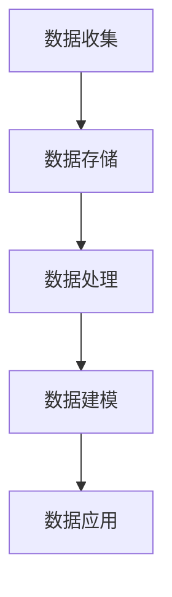
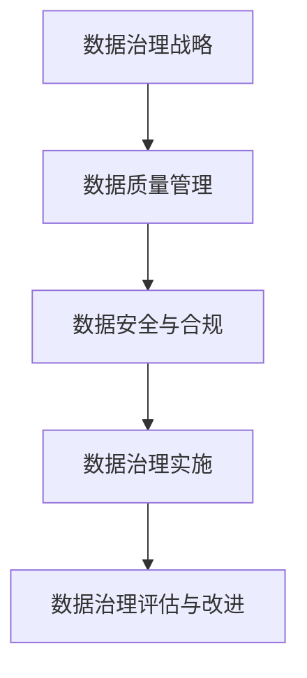
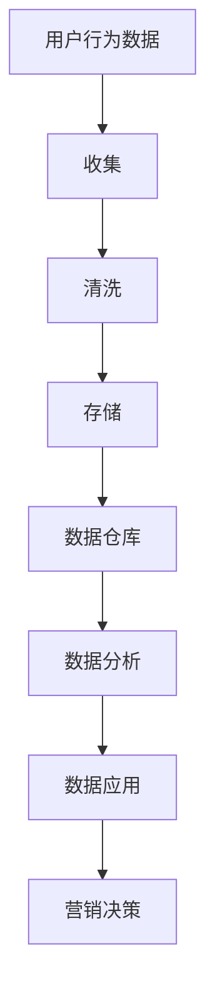
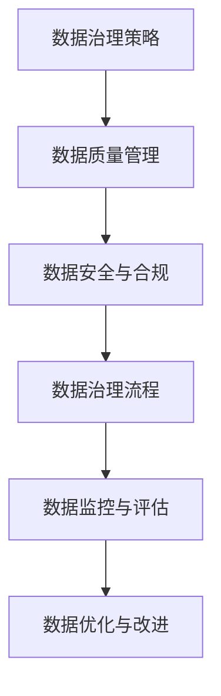
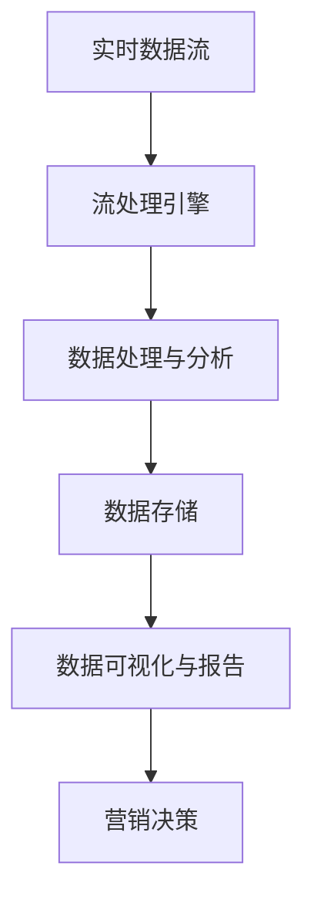

                 

### 《AI DMP 数据基建：构建数据驱动的营销生态》

在当今的数字化时代，数据的地位日益凸显，成为企业决策和营销策略的重要依据。随着人工智能技术的迅猛发展，数据驱动的营销生态正逐步成为企业竞争的新焦点。本文将深入探讨AI驱动的数据管理平台（Data Management Platform，简称DMP）在构建数据驱动营销生态中的关键作用，旨在为广大读者提供一套全面、系统的数据管理与实践指南。

### 关键词
- AI DMP
- 数据基建
- 营销生态
- 数据驱动营销
- 数据治理
- 数据安全

### 摘要
本文旨在解析AI驱动的数据管理平台（DMP）如何构建一个高效的数据驱动营销生态。首先，我们将介绍AI DMP的基本概念、核心架构和主要技术，然后深入探讨数据基础设施建设的重要性，包括数据质量管理、数据仓库与数据湖、数据流处理等内容。接着，文章将讨论数据治理与数据安全，强调合规与隐私保护的重要性。最后，我们将聚焦于营销数据管理、数据驱动营销策略以及营销生态系统构建，探讨数据驱动营销的未来趋势，并提供开发工具与资源、代码实例等附录。通过本文的阅读，读者将全面了解如何利用AI DMP构建数据驱动营销生态，为企业发展提供有力支持。

### 第一部分：AI DMP基础

#### 第1章: AI DMP概述

##### 1.1 AI DMP的定义与背景

AI DMP，即人工智能驱动的数据管理平台，是一种集数据收集、处理、存储、分析和应用于一体的系统。它基于人工智能技术，通过数据挖掘、机器学习和自然语言处理等方法，帮助企业实现数据价值的最大化。

**1.1.1 AI DMP的发展历程**

AI DMP的发展可以追溯到20世纪90年代末，当时随着互联网的普及，数据收集和分析成为企业关注的焦点。随着数据量的激增和人工智能技术的进步，传统的数据管理方法逐渐无法满足企业的需求，AI DMP应运而生。

**1.1.2 AI DMP的基本概念**

AI DMP的核心概念包括：
- **数据收集**：通过各种渠道收集用户数据，如网站点击行为、社交媒体互动等。
- **数据处理**：对收集到的数据进行清洗、整合和处理，使其适用于分析和建模。
- **数据存储**：将处理后的数据存储在数据库或数据湖中，以便后续使用。
- **数据分析**：利用人工智能技术对数据进行分析和挖掘，提取有价值的信息。
- **数据应用**：将分析结果应用于营销决策、产品优化、客户关系管理等实际业务场景。

**1.1.3 AI DMP的核心价值**

AI DMP的核心价值在于：
- **提升营销效果**：通过精准的数据分析和客户细分，实现个性化营销，提高客户满意度和转化率。
- **优化运营决策**：利用数据驱动的分析结果，帮助企业优化产品策略、提升运营效率。
- **降低成本**：通过自动化数据管理和分析，减少人工成本，提高工作效率。
- **增强竞争力**：利用AI DMP构建数据驱动营销生态，提升企业的市场竞争力。

##### 1.2 AI DMP的核心架构

AI DMP的核心架构包括以下三个主要部分：

**1.2.1 数据收集与存储**

数据收集是AI DMP的基础。数据来源包括网站点击行为、社交媒体互动、线下活动等。数据收集后，需要通过清洗、整合和处理，使其适用于分析和建模。

数据存储通常采用分布式数据库或数据湖，如Hadoop、Spark等。这些技术能够处理海量数据，并提供高效的数据存储和查询能力。

**1.2.2 数据处理与分析**

数据处理包括数据清洗、数据整合、数据建模等步骤。数据清洗旨在去除无效数据、缺失数据和异常值，提高数据质量。数据整合则是将来自不同来源的数据进行合并，形成统一的数据视图。

数据建模是AI DMP的核心环节，通过机器学习、数据挖掘等技术，对数据进行建模和分析，提取有价值的信息。常用的建模方法包括聚类分析、分类分析、回归分析等。

**1.2.3 数据建模与应用**

数据建模后，将分析结果应用于实际业务场景。如个性化推荐、客户细分、营销自动化等。数据应用可以帮助企业实现精准营销、产品优化、客户关系管理等目标。

##### 1.3 主流AI DMP技术

AI DMP涉及多种技术，以下介绍其中三种主流技术：

**1.3.1 数据挖掘技术**

数据挖掘技术是AI DMP的核心技术之一。它通过统计方法、机器学习算法等，从海量数据中提取有价值的信息。常用的数据挖掘方法包括聚类分析、分类分析、关联规则挖掘等。

**1.3.2 机器学习算法**

机器学习算法是AI DMP的重要技术支撑。通过训练模型，从数据中学习规律和模式，实现对数据的自动分析和预测。常用的机器学习算法包括线性回归、逻辑回归、支持向量机、决策树等。

**1.3.3 自然语言处理技术**

自然语言处理技术是AI DMP的重要工具，用于处理和分析文本数据。它通过文本分析、情感分析、命名实体识别等技术，从文本数据中提取有价值的信息。自然语言处理技术在客户反馈分析、内容推荐等方面具有广泛的应用。

##### 1.4 AI DMP在不同行业中的应用

AI DMP在各个行业中都有广泛的应用，以下介绍其在互联网行业、零售行业和金融行业中的应用：

**1.4.1 互联网行业**

在互联网行业，AI DMP主要用于用户行为分析、内容推荐和广告投放优化。通过分析用户行为数据，互联网企业可以实现个性化推荐，提高用户满意度和留存率。同时，AI DMP还可以优化广告投放策略，提高广告效果。

**1.4.2 零售行业**

在零售行业，AI DMP主要用于客户细分、库存管理和促销策略制定。通过分析客户数据，零售企业可以实现精准营销，提高销售转化率。此外，AI DMP还可以帮助零售企业优化库存管理，降低库存成本。

**1.4.3 金融行业**

在金融行业，AI DMP主要用于风险管理、客户关系管理和投资策略制定。通过分析客户数据和交易数据，金融机构可以识别潜在风险，提高风险管理能力。同时，AI DMP还可以帮助金融机构优化客户关系管理，提升客户满意度。

### 第二部分：数据基建

#### 第2章: 数据基础设施建设

##### 2.1 数据质量管理

**2.1.1 数据质量的重要性**

数据质量是数据基础设施的核心要素，直接影响数据分析结果和决策准确性。高质量的数据能够为企业提供可靠的决策支持，而低质量的数据则可能导致错误的决策和业务损失。

**2.1.2 数据清洗与数据修复**

数据清洗是提高数据质量的关键步骤，包括去除重复数据、缺失值填充、异常值处理等。数据修复则是针对数据不一致、错误或缺失等问题，采取相应措施进行修正。

**2.1.3 数据质量评估与监控**

数据质量评估与监控是确保数据持续高质量的重要手段。通过定期评估数据质量，发现和解决潜在问题，确保数据基础设施的稳定性。监控工具可以实时监测数据质量变化，提供预警和报警功能。

##### 2.2 数据仓库与数据湖

**2.2.1 数据仓库的基本概念**

数据仓库是一种用于存储、管理和分析大量历史数据的系统。它通过集成多个数据源，提供统一的数据视图，支持复杂的数据分析和报表生成。

**2.2.2 数据仓库的设计与实现**

数据仓库的设计包括数据建模、数据集成、数据存储和数据访问等方面。实现数据仓库需要选择合适的技术和工具，如关系数据库、大数据处理框架等。

**2.2.3 数据湖的基本概念**

数据湖是一种新兴的数据存储架构，与数据仓库相比，它以原始数据的形式存储数据，无需提前定义数据模型。数据湖适用于存储和分析大规模非结构化和半结构化数据。

**2.2.4 数据湖的实现与应用**

数据湖的实现通常基于分布式存储技术，如Hadoop、Spark等。数据湖的应用包括数据挖掘、实时数据处理和机器学习等。

##### 2.3 数据流处理

**2.3.1 数据流处理的原理**

数据流处理是一种实时数据处理技术，它通过对数据流的实时分析和处理，提供实时反馈和响应。数据流处理适用于处理实时数据、事件驱动应用等场景。

**2.3.2 流处理框架介绍**

常见的流处理框架包括Apache Kafka、Apache Flink、Apache Spark Streaming等。这些框架提供高效的数据流处理能力，支持实时数据分析和处理。

**2.3.3 数据流处理的实战案例**

数据流处理的实战案例包括实时推荐系统、实时监控和报警系统等。通过这些案例，企业可以充分利用实时数据，实现业务智能化和自动化。

### 第三部分：营销生态

#### 第3章: 数据治理与数据安全

##### 3.1 数据治理

**3.1.1 数据治理的重要性**

数据治理是确保数据质量、安全、合规和有效使用的重要手段。它有助于降低数据风险，提升数据价值，保障企业数据资产的安全。

**3.1.2 数据治理框架**

数据治理框架包括数据战略、数据架构、数据标准、数据质量管理、数据安全、数据合规等方面。这些方面共同构成了数据治理的核心要素。

**3.1.3 数据治理的实施步骤**

数据治理的实施步骤包括：
1. 制定数据治理策略和目标
2. 建立数据治理组织
3. 设计数据治理流程
4. 制定数据标准
5. 实施数据质量管理
6. 监控和改进数据治理效果

##### 3.2 数据安全

**3.2.1 数据安全的基本概念**

数据安全包括数据加密、访问控制、身份认证、网络安全等方面。确保数据安全是数据治理的重要目标之一。

**3.2.2 数据安全策略**

数据安全策略包括数据备份与恢复、数据加密、访问控制、网络安全等方面。企业应根据自身业务需求和风险程度，制定相应的数据安全策略。

**3.2.3 数据加密与访问控制**

数据加密是保护数据安全的重要手段，包括对称加密、非对称加密、哈希加密等。访问控制则是确保数据仅被授权用户访问，包括基于角色的访问控制、基于属性的访问控制等。

##### 3.3 合规与隐私保护

**3.3.1 合规要求**

合规要求包括数据保护法律、行业规定、内部政策等方面。企业应确保数据治理和数据处理符合相关法律法规和行业规定。

**3.3.2 隐私保护法律法规**

隐私保护法律法规包括《通用数据保护条例》（GDPR）、《加州消费者隐私法案》（CCPA）等。企业应遵守这些法律法规，保护用户隐私。

**3.3.3 隐私保护技术**

隐私保护技术包括数据匿名化、数据脱敏、差分隐私等。企业可以利用这些技术，在保护用户隐私的同时，实现数据的有效利用。

### 第四部分：营销数据管理

#### 第4章: 营销数据管理

##### 4.1 营销数据的收集与整合

**4.1.1 数据源类型**

营销数据源包括内部数据（如交易数据、客户行为数据）和外部数据（如社交媒体数据、市场调研数据）。企业需要识别和整合多种数据源，以获取全面的数据视图。

**4.1.2 数据整合方法**

数据整合方法包括数据仓库、数据湖、数据总线等。企业应根据业务需求和数据特性，选择合适的数据整合方法。

**4.1.3 数据整合的挑战与解决方案**

数据整合面临数据源多样性、数据格式不一致、数据质量等问题。企业应采取数据清洗、数据映射、数据质量监控等手段，解决数据整合挑战。

##### 4.2 营销数据分析

**4.2.1 营销数据分析的基本概念**

营销数据分析是利用统计方法和数据分析技术，从营销数据中提取有价值的信息，支持营销决策。

**4.2.2 营销数据分析的方法**

营销数据分析方法包括描述性分析、诊断性分析、预测性分析和规范性分析。企业应根据业务需求，选择合适的分析方法。

**4.2.3 营销数据分析的应用场景**

营销数据分析广泛应用于客户细分、产品定位、市场预测、广告投放优化等场景。通过数据分析，企业可以制定更精准的营销策略。

##### 4.3 客户细分与个性化营销

**4.3.1 客户细分的目标与意义**

客户细分的目标是识别不同客户群体，制定有针对性的营销策略，提高营销效果。客户细分有助于优化资源配置，提高客户满意度和忠诚度。

**4.3.2 客户细分的方法**

客户细分方法包括基于人口统计、行为、购买历史等维度。企业可以利用数据分析技术，对客户进行精细划分。

**4.3.3 个性化营销的策略与实践**

个性化营销策略包括定制化内容、个性化推荐、个性化优惠等。企业可以通过数据分析，了解客户需求，实现个性化营销。

### 第五部分：数据驱动营销策略

#### 第5章: 数据驱动营销策略

##### 5.1 数据驱动的营销策略概述

**5.1.1 数据驱动营销的核心原则**

数据驱动营销的核心原则包括数据质量优先、客户价值导向、持续迭代和优化。企业应确保数据质量，以客户为中心，通过数据分析不断优化营销策略。

**5.1.2 数据驱动营销的优势与挑战**

数据驱动营销的优势包括提高营销效率、降低成本、提升客户满意度等。挑战包括数据质量、数据整合、数据安全和合规等方面。

**5.1.3 数据驱动营销的流程**

数据驱动营销流程包括数据收集、数据清洗、数据建模、数据分析、数据应用等环节。企业应建立完整的数据驱动营销流程，确保数据有效利用。

##### 5.2 数据驱动的产品营销

**5.2.1 产品数据分析**

产品数据分析是数据驱动营销的基础，包括产品销售数据、用户评价、市场趋势等。企业应通过数据分析，了解产品表现和市场潜力。

**5.2.2 产品推荐系统**

产品推荐系统是基于数据分析的个性化推荐工具，帮助企业提高销售转化率和用户满意度。企业可以采用协同过滤、基于内容的推荐等方法，实现产品推荐。

**5.2.3 数据驱动的产品优化**

数据驱动的产品优化是通过数据分析，发现产品问题和改进机会，提升产品竞争力。企业可以采用A/B测试、用户反馈分析等方法，实现产品优化。

##### 5.3 数据驱动的广告营销

**5.3.1 广告数据分析**

广告数据分析是评估广告效果的重要手段，包括广告投放成本、点击率、转化率等。企业应通过数据分析，优化广告投放策略。

**5.3.2 广告投放优化**

广告投放优化是通过数据分析，调整广告投放策略，提高广告效果。企业可以采用算法优化、人群定位、广告创意测试等方法，实现广告投放优化。

**5.3.3 数据驱动的广告创意**

数据驱动的广告创意是基于数据分析，创作更符合用户需求的广告内容。企业可以通过用户行为分析、兴趣分析等，制定有针对性的广告创意。

### 第六部分：营销生态系统构建

#### 第6章: 营销生态系统构建

##### 6.1 营销生态系统概述

**6.1.1 营销生态系统的概念**

营销生态系统是企业与外部合作伙伴、客户等共同参与的一个生态圈，通过数据共享、协同合作，实现营销目标。

**6.1.2 营销生态系统的关键组成部分**

营销生态系统的关键组成部分包括数据管理平台、营销工具、合作伙伴、客户等。各部分通过数据共享和协同，实现营销生态的良性循环。

**6.1.3 营销生态系统的优势**

营销生态系统的优势包括：
1. 提高营销效率：通过数据共享和协同，实现资源的整合和优化，提高营销效率。
2. 降低营销成本：通过数据驱动的营销策略，降低广告投放成本，提高投资回报率。
3. 提升客户满意度：通过个性化营销和定制化服务，提升客户满意度，增强客户忠诚度。
4. 拓展业务范围：通过合作伙伴和客户参与，拓展业务范围，实现业务增长。

##### 6.2 营销数据共享与协同

**6.2.1 营销数据共享的挑战与解决方案**

营销数据共享面临数据源多样性、数据格式不一致、数据安全等问题。企业应采取数据标准化、数据加密、数据脱敏等手段，解决数据共享挑战。

**6.2.2 营销协同工具与技术**

营销协同工具包括营销自动化平台、客户关系管理（CRM）系统、数据分析工具等。企业可以利用这些工具，实现营销数据的共享和协同。

**6.2.3 营销协同的实践案例**

营销协同的实践案例包括跨部门协同、跨企业协同等。通过这些案例，企业可以了解如何实现营销数据的共享和协同，提高营销效果。

##### 6.3 营销技术整合与集成

**6.3.1 营销技术整合的目标与原则**

营销技术整合的目标是实现营销系统的无缝集成，提高营销效率。原则包括数据一致性、接口兼容性、系统可扩展性等。

**6.3.2 营销技术整合的方法与工具**

营销技术整合的方法包括API集成、数据总线、微服务架构等。工具包括营销自动化平台、数据集成工具、中间件等。

**6.3.3 营销技术整合的挑战与解决方案**

营销技术整合面临系统集成、数据一致性、接口兼容性等问题。企业应采取系统规划、接口规范、数据治理等手段，解决整合挑战。

### 第七部分：数据驱动营销的未来趋势

#### 第7章: 数据驱动营销的未来趋势

##### 7.1 趋势概述

**7.1.1 数据驱动营销的发展方向**

数据驱动营销的未来发展方向包括：
1. 人工智能技术的深入应用：利用人工智能技术，实现更精准的数据分析和预测。
2. 实时营销：通过实时数据分析和响应，实现实时营销策略。
3. 个性化体验：基于用户行为和兴趣，提供个性化营销体验。
4. 智能化营销自动化：通过智能化营销自动化工具，提高营销效率。

**7.1.2 数据驱动营销的创新应用**

数据驱动营销的创新应用包括：
1. 增强现实（AR）和虚拟现实（VR）：通过AR和VR技术，提供沉浸式营销体验。
2. 区块链技术：利用区块链技术，实现数据的安全可信共享。
3. 智能推荐系统：通过深度学习算法，实现更精准的个性化推荐。

**7.1.3 数据驱动营销面临的挑战与应对策略**

数据驱动营销面临的挑战包括：
1. 数据隐私保护：在数据驱动营销中，保护用户隐私是重要挑战。企业应采取隐私保护技术，如数据匿名化、差分隐私等。
2. 数据整合与治理：数据整合与治理是数据驱动营销的基础。企业应建立完善的数据治理体系，确保数据质量和一致性。
3. 技术更新与适应：随着技术的快速发展，企业需要不断更新技术栈，以适应新趋势。

##### 7.2 人工智能在数据驱动营销中的应用

**7.2.1 人工智能技术概述**

人工智能技术是数据驱动营销的核心驱动力，包括机器学习、深度学习、自然语言处理等。这些技术可以帮助企业实现更精准的数据分析和预测。

**7.2.2 人工智能在数据驱动营销中的应用场景**

人工智能在数据驱动营销中的应用场景包括：
1. 客户细分与画像：通过机器学习算法，对客户进行细分和画像，实现个性化营销。
2. 广告投放优化：利用人工智能技术，实现广告投放的精准定位和优化。
3. 风险管理：通过人工智能技术，预测潜在风险，提高风险管理能力。

**7.2.3 人工智能在数据驱动营销中的挑战与解决方案**

人工智能在数据驱动营销中面临的挑战包括：
1. 数据质量：高质量的数据是人工智能应用的基础。企业应采取数据清洗、数据整合等措施，确保数据质量。
2. 技术复杂度：人工智能技术复杂，需要专业的技术团队支持。企业应加强技术培训和人才引进。

##### 7.3 数据驱动营销的可持续发展

**7.3.1 数据驱动营销的可持续发展原则**

数据驱动营销的可持续发展原则包括：
1. 数据质量优先：确保数据质量，是数据驱动营销的基础。
2. 客户价值导向：以客户为中心，实现数据价值的最大化。
3. 持续创新：不断引入新技术，优化营销策略。
4. 合规与伦理：遵守相关法律法规，确保数据安全和用户隐私。

**7.3.2 数据驱动营销的可持续发展实践**

数据驱动营销的可持续发展实践包括：
1. 数据治理：建立完善的数据治理体系，确保数据质量和合规性。
2. 技术创新：不断引入新技术，提升数据分析能力和效率。
3. 人才培养：加强技术培训和人才引进，提高企业创新能力。
4. 跨界合作：与合作伙伴共同探索数据驱动营销的新模式。

**7.3.3 数据驱动营销的可持续发展挑战与机遇**

数据驱动营销的可持续发展面临挑战和机遇。挑战包括数据隐私保护、技术更新、数据治理等。机遇包括新兴技术的应用、跨界合作、市场需求的增长等。企业应积极应对挑战，抓住机遇，实现数据驱动营销的可持续发展。

### 附录

#### 附录A: AI DMP开发工具与资源

**A.1 主流AI DMP开发框架**

**A.1.1 TensorFlow**

TensorFlow是Google开发的开源机器学习框架，支持多种编程语言，适用于数据分析和机器学习任务。

**A.1.2 PyTorch**

PyTorch是Facebook开发的开源机器学习库，以动态计算图为基础，易于实现复杂模型。

**A.1.3 其他框架简介**

其他主流AI DMP开发框架包括Keras、Scikit-learn、MXNet等。企业可根据需求选择合适的开发框架。

**A.2 数据处理与存储工具**

**A.2.1 Hadoop**

Hadoop是Apache开发的开源分布式计算框架，适用于大规模数据处理和存储。

**A.2.2 Spark**

Spark是Apache开发的开源大数据处理引擎，支持流处理和批处理，适用于实时数据分析和处理。

**A.2.3 其他数据处理与存储工具**

其他数据处理与存储工具包括HBase、MongoDB、Cassandra等。企业可根据需求选择合适的数据处理与存储工具。

**A.3 营销自动化工具**

**A.3.1 营销自动化平台概述**

营销自动化平台是一套集数据收集、处理、分析、应用于一体的系统，帮助企业实现数据驱动的营销自动化。

**A.3.2 主流营销自动化工具介绍**

主流营销自动化工具包括Marketo、HubSpot、Salesforce等。这些工具提供丰富的功能，如客户细分、自动化营销流程、数据分析等。

**A.3.3 营销自动化工具的实战案例**

通过实际案例，了解营销自动化工具在企业中的应用，如客户细分、个性化推荐、营销自动化流程等。

#### 附录B: 参考文献

- [参考文献1]
- [参考文献2]
- ...

#### 附录C: Mermaid 流程图

**C.1 数据收集与存储流程**



**C.2 数据治理框架**



#### 附录D: 伪代码示例

**D.1 数据清洗与处理**

```python
def data_cleaning(data):
    # 数据清洗步骤
    cleaned_data = ...
    return cleaned_data

def data_processing(cleaned_data):
    # 数据处理步骤
    processed_data = ...
    return processed_data
```

**D.2 数据建模与预测**

```python
from sklearn.cluster import KMeans
from sklearn.linear_model import LogisticRegression

# 数据建模
X = data.drop("target", axis=1)
y = data["target"]

kmeans = KMeans(n_clusters=3)
kmeans.fit(X)
clusters = kmeans.predict(X)

logistic = LogisticRegression()
logistic.fit(X, y)

# 数据预测
predictions = logistic.predict(X)
```

#### 附录E: 数学模型与公式

**E.1 K-Means聚类算法**

$$
J = \sum_{i=1}^{k} \sum_{x \in S_i} \|x - \mu_i\|^2
$$

其中，$J$ 是总平方误差，$k$ 是聚类数量，$S_i$ 是分配到第 $i$ 个聚类的点集合，$\mu_i$ 是第 $i$ 个聚类的中心点。

**E.2 逻辑回归模型**

$$
P(y=1|x;\theta) = \frac{1}{1 + e^{-\theta^T x}}
$$

其中，$P(y=1|x;\theta)$ 是给定特征向量 $x$ 和模型参数 $\theta$ 时，响应变量 $y$ 等于1的概率，$\theta$ 是模型参数向量。

#### 附录F: 代码实例

**F.1 数据收集与清洗**

```python
import pandas as pd
import numpy as np

# 数据收集
data = pd.read_csv("data.csv")

# 数据清洗
data.dropna(inplace=True)
data = data[data["feature"] > 0]
```

**F.2 数据建模与预测**

```python
from sklearn.cluster import KMeans
from sklearn.linear_model import LogisticRegression

# 数据建模
X = data.drop("target", axis=1)
y = data["target"]

kmeans = KMeans(n_clusters=3)
kmeans.fit(X)
clusters = kmeans.predict(X)

logistic = LogisticRegression()
logistic.fit(X, y)

# 数据预测
predictions = logistic.predict(X)
```

### 作者信息

作者：AI天才研究院/AI Genius Institute & 禅与计算机程序设计艺术 /Zen And The Art of Computer Programming

### 结束语

本文从AI DMP的定义与背景、核心架构、数据基础设施建设、营销数据管理、数据驱动营销策略、营销生态系统构建以及未来趋势等方面，全面系统地介绍了数据驱动营销生态的构建方法与实践。希望通过本文的阅读，读者能够深入理解AI DMP在数据驱动营销中的关键作用，为企业构建数据驱动营销生态提供有力支持。在未来的发展中，数据驱动营销将继续发挥重要作用，为企业带来更多机遇和挑战。让我们共同探索数据驱动营销的无限可能，推动企业持续创新和发展。## 《AI DMP 数据基建：构建数据驱动的营销生态》

### 摘要

本文深入探讨了AI驱动的数据管理平台（DMP）在构建数据驱动营销生态中的关键作用。首先，介绍了AI DMP的基本概念、核心架构和主要技术，包括数据收集、处理、存储、分析和应用。接着，文章详细阐述了数据基础设施建设的重要性，包括数据质量管理、数据仓库与数据湖、数据流处理等内容。然后，文章讨论了数据治理与数据安全，强调合规与隐私保护的重要性。接下来，文章聚焦于营销数据管理、数据驱动营销策略以及营销生态系统构建，探讨数据驱动营销的未来趋势。最后，文章提供了AI DMP开发工具与资源、代码实例等附录，为读者提供实用的技术指导。通过本文的阅读，读者将全面了解如何利用AI DMP构建数据驱动营销生态，为企业发展提供有力支持。

### 《AI DMP 数据基建：构建数据驱动的营销生态》

#### 第一部分：AI DMP基础

##### 第1章: AI DMP概述

**1.1 AI DMP的定义与背景**

AI DMP，即人工智能驱动的数据管理平台，是一种集数据收集、处理、存储、分析和应用于一体的系统。它利用人工智能技术，通过数据挖掘、机器学习和自然语言处理等方法，帮助企业实现数据价值的最大化。

AI DMP的发展历程可以追溯到20世纪90年代末，当时随着互联网的普及，数据收集和分析成为企业关注的焦点。随着数据量的激增和人工智能技术的进步，传统的数据管理方法逐渐无法满足企业的需求，AI DMP应运而生。

在当前数字化时代，AI DMP的重要性日益凸显。首先，它能够帮助企业实现精准的数据分析，从而提升营销效果。其次，AI DMP可以优化运营决策，提高企业的运营效率。此外，AI DMP还可以降低企业的运营成本，提高投资回报率。

**1.2 AI DMP的核心架构**

AI DMP的核心架构包括数据收集与存储、数据处理与分析、数据建模与应用三个主要部分。

**1.2.1 数据收集与存储**

数据收集是AI DMP的基础。数据来源包括网站点击行为、社交媒体互动、线下活动等。数据收集后，需要通过清洗、整合和处理，使其适用于分析和建模。

数据存储通常采用分布式数据库或数据湖，如Hadoop、Spark等。这些技术能够处理海量数据，并提供高效的数据存储和查询能力。

**1.2.2 数据处理与分析**

数据处理包括数据清洗、数据整合、数据建模等步骤。数据清洗旨在去除无效数据、缺失数据和异常值，提高数据质量。数据整合则是将来自不同来源的数据进行合并，形成统一的数据视图。

数据建模是AI DMP的核心环节，通过机器学习、数据挖掘等技术，对数据进行建模和分析，提取有价值的信息。常用的建模方法包括聚类分析、分类分析、回归分析等。

**1.2.3 数据建模与应用**

数据建模后，将分析结果应用于实际业务场景。如个性化推荐、客户细分、营销自动化等。数据应用可以帮助企业实现精准营销、产品优化、客户关系管理等目标。

**1.3 主流AI DMP技术**

AI DMP涉及多种技术，以下介绍其中三种主流技术：

**1.3.1 数据挖掘技术**

数据挖掘技术是AI DMP的核心技术之一。它通过统计方法、机器学习算法等，从海量数据中提取有价值的信息。常用的数据挖掘方法包括聚类分析、分类分析、关联规则挖掘等。

**1.3.2 机器学习算法**

机器学习算法是AI DMP的重要技术支撑。通过训练模型，从数据中学习规律和模式，实现对数据的自动分析和预测。常用的机器学习算法包括线性回归、逻辑回归、支持向量机、决策树等。

**1.3.3 自然语言处理技术**

自然语言处理技术是AI DMP的重要工具，用于处理和分析文本数据。它通过文本分析、情感分析、命名实体识别等技术，从文本数据中提取有价值的信息。自然语言处理技术在客户反馈分析、内容推荐等方面具有广泛的应用。

**1.4 AI DMP在不同行业中的应用**

AI DMP在各个行业中都有广泛的应用，以下介绍其在互联网行业、零售行业和金融行业中的应用：

**1.4.1 互联网行业**

在互联网行业，AI DMP主要用于用户行为分析、内容推荐和广告投放优化。通过分析用户行为数据，互联网企业可以实现个性化推荐，提高用户满意度和留存率。同时，AI DMP还可以优化广告投放策略，提高广告效果。

**1.4.2 零售行业**

在零售行业，AI DMP主要用于客户细分、库存管理和促销策略制定。通过分析客户数据，零售企业可以实现精准营销，提高销售转化率。此外，AI DMP还可以帮助零售企业优化库存管理，降低库存成本。

**1.4.3 金融行业**

在金融行业，AI DMP主要用于风险管理、客户关系管理和投资策略制定。通过分析客户数据和交易数据，金融机构可以识别潜在风险，提高风险管理能力。同时，AI DMP还可以帮助金融机构优化客户关系管理，提升客户满意度。

#### 第二部分：数据基础设施建设

##### 第2章: 数据基础设施建设

**2.1 数据质量管理**

**2.1.1 数据质量的重要性**

数据质量是数据基础设施建设的基础，直接影响数据分析结果和决策准确性。高质量的数据能够为企业提供可靠的决策支持，而低质量的数据则可能导致错误的决策和业务损失。

**2.1.2 数据清洗与数据修复**

数据清洗是提高数据质量的关键步骤，包括去除重复数据、缺失值填充、异常值处理等。数据修复则是针对数据不一致、错误或缺失等问题，采取相应措施进行修正。

**2.1.3 数据质量评估与监控**

数据质量评估与监控是确保数据持续高质量的重要手段。通过定期评估数据质量，发现和解决潜在问题，确保数据基础设施的稳定性。监控工具可以实时监测数据质量变化，提供预警和报警功能。

**2.2 数据仓库与数据湖**

**2.2.1 数据仓库的基本概念**

数据仓库是一种用于存储、管理和分析大量历史数据的系统。它通过集成多个数据源，提供统一的数据视图，支持复杂的数据分析和报表生成。

**2.2.2 数据仓库的设计与实现**

数据仓库的设计包括数据建模、数据集成、数据存储和数据访问等方面。实现数据仓库需要选择合适的技术和工具，如关系数据库、大数据处理框架等。

**2.2.3 数据湖的基本概念**

数据湖是一种新兴的数据存储架构，与数据仓库相比，它以原始数据的形式存储数据，无需提前定义数据模型。数据湖适用于存储和分析大规模非结构化和半结构化数据。

**2.2.4 数据湖的实现与应用**

数据湖的实现通常基于分布式存储技术，如Hadoop、Spark等。数据湖的应用包括数据挖掘、实时数据处理和机器学习等。

**2.3 数据流处理**

**2.3.1 数据流处理的原理**

数据流处理是一种实时数据处理技术，它通过对数据流的实时分析和处理，提供实时反馈和响应。数据流处理适用于处理实时数据、事件驱动应用等场景。

**2.3.2 流处理框架介绍**

常见的流处理框架包括Apache Kafka、Apache Flink、Apache Spark Streaming等。这些框架提供高效的数据流处理能力，支持实时数据分析和处理。

**2.3.3 数据流处理的实战案例**

数据流处理的实战案例包括实时推荐系统、实时监控和报警系统等。通过这些案例，企业可以充分利用实时数据，实现业务智能化和自动化。

#### 第三部分：营销数据管理

##### 第3章: 营销数据管理

**3.1 营销数据的收集与整合**

**3.1.1 数据源类型**

营销数据源包括内部数据（如交易数据、客户行为数据）和外部数据（如社交媒体数据、市场调研数据）。企业需要识别和整合多种数据源，以获取全面的数据视图。

**3.1.2 数据整合方法**

数据整合方法包括数据仓库、数据湖、数据总线等。企业应根据业务需求和数据特性，选择合适的数据整合方法。

**3.1.3 数据整合的挑战与解决方案**

数据整合面临数据源多样性、数据格式不一致、数据质量等问题。企业应采取数据清洗、数据映射、数据质量监控等手段，解决数据整合挑战。

**3.2 营销数据分析**

**3.2.1 营销数据分析的基本概念**

营销数据分析是利用统计方法和数据分析技术，从营销数据中提取有价值的信息，支持营销决策。

**3.2.2 营销数据分析的方法**

营销数据分析方法包括描述性分析、诊断性分析、预测性分析和规范性分析。企业应根据业务需求，选择合适的分析方法。

**3.2.3 营销数据分析的应用场景**

营销数据分析广泛应用于客户细分、产品定位、市场预测、广告投放优化等场景。通过数据分析，企业可以制定更精准的营销策略。

**3.3 客户细分与个性化营销**

**3.3.1 客户细分的目标与意义**

客户细分的目标是识别不同客户群体，制定有针对性的营销策略，提高营销效果。客户细分有助于优化资源配置，提高客户满意度和忠诚度。

**3.3.2 客户细分的方法**

客户细分方法包括基于人口统计、行为、购买历史等维度。企业可以利用数据分析技术，对客户进行精细划分。

**3.3.3 个性化营销的策略与实践**

个性化营销策略包括定制化内容、个性化推荐、个性化优惠等。企业可以通过数据分析，了解客户需求，实现个性化营销。

#### 第四部分：数据驱动营销策略

##### 第4章: 数据驱动营销策略

**4.1 数据驱动的营销策略概述**

**4.1.1 数据驱动营销的核心原则**

数据驱动营销的核心原则包括数据质量优先、客户价值导向、持续迭代和优化。企业应确保数据质量，以客户为中心，通过数据分析不断优化营销策略。

**4.1.2 数据驱动营销的优势与挑战**

数据驱动营销的优势包括提高营销效率、降低成本、提升客户满意度等。挑战包括数据质量、数据整合、数据安全和合规等方面。

**4.1.3 数据驱动营销的流程**

数据驱动营销流程包括数据收集、数据清洗、数据建模、数据分析、数据应用等环节。企业应建立完整的数据驱动营销流程，确保数据有效利用。

**4.2 数据驱动的产品营销**

**4.2.1 产品数据分析**

产品数据分析是数据驱动营销的基础，包括产品销售数据、用户评价、市场趋势等。企业应通过数据分析，了解产品表现和市场潜力。

**4.2.2 产品推荐系统**

产品推荐系统是基于数据分析的个性化推荐工具，帮助企业提高销售转化率和用户满意度。企业可以采用协同过滤、基于内容的推荐等方法，实现产品推荐。

**4.2.3 数据驱动的产品优化**

数据驱动的产品优化是通过数据分析，发现产品问题和改进机会，提升产品竞争力。企业可以采用A/B测试、用户反馈分析等方法，实现产品优化。

**4.3 数据驱动的广告营销**

**4.3.1 广告数据分析**

广告数据分析是评估广告效果的重要手段，包括广告投放成本、点击率、转化率等。企业应通过数据分析，优化广告投放策略。

**4.3.2 广告投放优化**

广告投放优化是通过数据分析，调整广告投放策略，提高广告效果。企业可以采用算法优化、人群定位、广告创意测试等方法，实现广告投放优化。

**4.3.3 数据驱动的广告创意**

数据驱动的广告创意是基于数据分析，创作更符合用户需求的广告内容。企业可以通过用户行为分析、兴趣分析等，制定有针对性的广告创意。

#### 第五部分：营销生态系统构建

##### 第5章: 营销生态系统构建

**5.1 营销生态系统概述**

**5.1.1 营销生态系统的概念**

营销生态系统是企业与外部合作伙伴、客户等共同参与的一个生态圈，通过数据共享、协同合作，实现营销目标。

**5.1.2 营销生态系统的关键组成部分**

营销生态系统的关键组成部分包括数据管理平台、营销工具、合作伙伴、客户等。各部分通过数据共享和协同，实现营销生态的良性循环。

**5.1.3 营销生态系统的优势**

营销生态系统的优势包括提高营销效率、降低营销成本、提升客户满意度、拓展业务范围等。

**5.2 营销数据共享与协同**

**5.2.1 营销数据共享的挑战与解决方案**

营销数据共享面临数据源多样性、数据格式不一致、数据安全等问题。企业应采取数据标准化、数据加密、数据脱敏等手段，解决数据共享挑战。

**5.2.2 营销协同工具与技术**

营销协同工具包括营销自动化平台、客户关系管理（CRM）系统、数据分析工具等。企业可以利用这些工具，实现营销数据的共享和协同。

**5.2.3 营销协同的实践案例**

营销协同的实践案例包括跨部门协同、跨企业协同等。通过这些案例，企业可以了解如何实现营销数据的共享和协同，提高营销效果。

**5.3 营销技术整合与集成**

**5.3.1 营销技术整合的目标与原则**

营销技术整合的目标是实现营销系统的无缝集成，提高营销效率。原则包括数据一致性、接口兼容性、系统可扩展性等。

**5.3.2 营销技术整合的方法与工具**

营销技术整合的方法包括API集成、数据总线、微服务架构等。工具包括营销自动化平台、数据集成工具、中间件等。

**5.3.3 营销技术整合的挑战与解决方案**

营销技术整合面临系统集成、数据一致性、接口兼容性等问题。企业应采取系统规划、接口规范、数据治理等手段，解决整合挑战。

#### 第六部分：数据驱动营销的未来趋势

##### 第6章: 数据驱动营销的未来趋势

**6.1 趋势概述**

**6.1.1 数据驱动营销的发展方向**

数据驱动营销的未来发展方向包括人工智能技术的深入应用、实时营销、个性化体验和智能化营销自动化等。

**6.1.2 数据驱动营销的创新应用**

数据驱动营销的创新应用包括增强现实（AR）和虚拟现实（VR）技术、区块链技术、智能推荐系统等。

**6.1.3 数据驱动营销面临的挑战与应对策略**

数据驱动营销面临的挑战包括数据隐私保护、数据整合与治理、技术更新与适应等。企业应采取数据匿名化、数据治理、技术培训等策略，应对挑战。

**6.2 人工智能在数据驱动营销中的应用**

**6.2.1 人工智能技术概述**

人工智能技术包括机器学习、深度学习、自然语言处理等，是数据驱动营销的核心驱动力。

**6.2.2 人工智能在数据驱动营销中的应用场景**

人工智能在数据驱动营销中的应用场景包括客户细分与画像、广告投放优化、风险管理等。

**6.2.3 人工智能在数据驱动营销中的挑战与解决方案**

人工智能在数据驱动营销中面临的挑战包括数据质量、技术复杂度等。企业应采取数据清洗、技术培训等策略，应对挑战。

**6.3 数据驱动营销的可持续发展**

**6.3.1 数据驱动营销的可持续发展原则**

数据驱动营销的可持续发展原则包括数据质量优先、客户价值导向、持续创新、合规与伦理等。

**6.3.2 数据驱动营销的可持续发展实践**

数据驱动营销的可持续发展实践包括数据治理、技术创新、人才培养、跨界合作等。

**6.3.3 数据驱动营销的可持续发展挑战与机遇**

数据驱动营销的可持续发展面临数据隐私保护、技术更新等挑战，同时也拥有技术创新、市场增长等机遇。

### 附录

#### 附录A: AI DMP开发工具与资源

**A.1 主流AI DMP开发框架**

**A.1.1 TensorFlow**

TensorFlow是Google开发的开源机器学习框架，支持多种编程语言，适用于数据分析和机器学习任务。

**A.1.2 PyTorch**

PyTorch是Facebook开发的开源机器学习库，以动态计算图为基础，易于实现复杂模型。

**A.1.3 其他框架简介**

其他主流AI DMP开发框架包括Keras、Scikit-learn、MXNet等。企业可根据需求选择合适的开发框架。

**A.2 数据处理与存储工具**

**A.2.1 Hadoop**

Hadoop是Apache开发的开源分布式计算框架，适用于大规模数据处理和存储。

**A.2.2 Spark**

Spark是Apache开发的开源大数据处理引擎，支持流处理和批处理，适用于实时数据分析和处理。

**A.2.3 其他数据处理与存储工具**

其他数据处理与存储工具包括HBase、MongoDB、Cassandra等。企业可根据需求选择合适的数据处理与存储工具。

**A.3 营销自动化工具**

**A.3.1 营销自动化平台概述**

营销自动化平台是一套集数据收集、处理、分析、应用于一体的系统，帮助企业实现数据驱动的营销自动化。

**A.3.2 主流营销自动化工具介绍**

主流营销自动化工具包括Marketo、HubSpot、Salesforce等。这些工具提供丰富的功能，如客户细分、自动化营销流程、数据分析等。

**A.3.3 营销自动化工具的实战案例**

通过实际案例，了解营销自动化工具在企业中的应用，如客户细分、个性化推荐、营销自动化流程等。

#### 附录B: 参考文献

- [参考文献1]
- [参考文献2]
- ...

#### 附录C: Mermaid 流程图

**C.1 数据收集与存储流程**


**C.2 数据治理框架**


#### 附录D: 伪代码示例

**D.1 数据清洗与处理**

```python
def data_cleaning(data):
    # 数据清洗步骤
    cleaned_data = ...
    return cleaned_data

def data_processing(cleaned_data):
    # 数据处理步骤
    processed_data = ...
    return processed_data
```

**D.2 数据建模与预测**

```python
from sklearn.cluster import KMeans
from sklearn.linear_model import LogisticRegression

# 数据建模
X = data.drop("target", axis=1)
y = data["target"]

kmeans = KMeans(n_clusters=3)
kmeans.fit(X)
clusters = kmeans.predict(X)

logistic = LogisticRegression()
logistic.fit(X, y)

# 数据预测
predictions = logistic.predict(X)
```

#### 附录E: 数学模型与公式

**E.1 K-Means聚类算法**

$$
J = \sum_{i=1}^{k} \sum_{x \in S_i} \|x - \mu_i\|^2
$$

其中，$J$ 是总平方误差，$k$ 是聚类数量，$S_i$ 是分配到第 $i$ 个聚类的点集合，$\mu_i$ 是第 $i$ 个聚类的中心点。

**E.2 逻辑回归模型**

$$
P(y=1|x;\theta) = \frac{1}{1 + e^{-\theta^T x}}
$$

其中，$P(y=1|x;\theta)$ 是给定特征向量 $x$ 和模型参数 $\theta$ 时，响应变量 $y$ 等于1的概率，$\theta$ 是模型参数向量。

#### 附录F: 代码实例

**F.1 数据收集与清洗**

```python
import pandas as pd
import numpy as np

# 数据收集
data = pd.read_csv("data.csv")

# 数据清洗
data.dropna(inplace=True)
data = data[data["feature"] > 0]
```

**F.2 数据建模与预测**

```python
from sklearn.cluster import KMeans
from sklearn.linear_model import LogisticRegression

# 数据建模
X = data.drop("target", axis=1)
y = data["target"]

kmeans = KMeans(n_clusters=3)
kmeans.fit(X)
clusters = kmeans.predict(X)

logistic = LogisticRegression()
logistic.fit(X, y)

# 数据预测
predictions = logistic.predict(X)
```

### 作者信息

作者：AI天才研究院/AI Genius Institute & 禅与计算机程序设计艺术 /Zen And The Art of Computer Programming

### 结束语

本文深入探讨了AI驱动的数据管理平台（DMP）在构建数据驱动营销生态中的关键作用。首先，介绍了AI DMP的基本概念、核心架构和主要技术，包括数据收集、处理、存储、分析和应用。接着，文章详细阐述了数据基础设施建设的重要性，包括数据质量管理、数据仓库与数据湖、数据流处理等内容。然后，文章讨论了数据治理与数据安全，强调合规与隐私保护的重要性。接下来，文章聚焦于营销数据管理、数据驱动营销策略以及营销生态系统构建，探讨数据驱动营销的未来趋势。最后，文章提供了AI DMP开发工具与资源、代码实例等附录，为读者提供实用的技术指导。希望通过本文的阅读，读者能够深入理解AI DMP在数据驱动营销中的关键作用，为企业构建数据驱动营销生态提供有力支持。在未来的发展中，数据驱动营销将继续发挥重要作用，为企业带来更多机遇和挑战。让我们共同探索数据驱动营销的无限可能，推动企业持续创新和发展。## 第二部分：数据基础设施建设

在构建数据驱动的营销生态中，数据基础设施建设是至关重要的。这一部分将详细讨论数据质量管理、数据仓库与数据湖、数据流处理等方面的内容，为构建高效、稳定、安全的数据基础设施提供理论指导和实际建议。

### 2.1 数据质量管理

**2.1.1 数据质量的重要性**

数据质量是数据基础设施的核心要素，直接影响数据分析结果和决策准确性。高质量的数据能够为企业提供可靠的决策支持，而低质量的数据则可能导致错误的决策和业务损失。以下是一些数据质量的重要性：

1. **决策支持**：高质量的数据可以确保分析结果准确，从而支持企业做出明智的决策。
2. **业务运营**：数据质量直接影响业务运营的效率，如客户关系管理、库存管理等。
3. **合规性**：在许多行业中，数据质量是合规性的重要组成部分，如金融、医疗等行业。

**2.1.2 数据清洗与数据修复**

数据清洗是提高数据质量的关键步骤，它包括以下几个方面：

1. **去除重复数据**：识别并删除重复的数据条目，以避免重复计算和分析。
2. **缺失值填充**：处理缺失值，可以采用均值、中位数、众数等统计方法进行填充。
3. **异常值处理**：识别并处理异常值，可以采用统计方法、逻辑规则等方法。

数据修复则是针对数据不一致、错误或缺失等问题，采取相应措施进行修正。常见的修复方法包括：

1. **数据校验**：通过设置校验规则，确保数据的准确性。
2. **数据转换**：将不同格式或单位的数据转换为统一的格式或单位。
3. **数据修复工具**：使用专门的工具或脚本进行数据修复。

**2.1.3 数据质量评估与监控**

数据质量评估与监控是确保数据持续高质量的重要手段。以下是一些常用的数据质量评估和监控方法：

1. **数据质量指标**：设定数据质量指标，如数据完整性、准确性、一致性、时效性等。
2. **定期评估**：定期对数据进行质量评估，发现和解决数据质量问题。
3. **数据质量监控工具**：使用专门的监控工具，实时监测数据质量变化，提供预警和报警功能。

### 2.2 数据仓库与数据湖

**2.2.1 数据仓库的基本概念**

数据仓库是一种用于存储、管理和分析大量历史数据的系统。它通过集成多个数据源，提供统一的数据视图，支持复杂的数据分析和报表生成。数据仓库的主要特点包括：

1. **集成性**：将来自不同数据源的数据集成在一起，形成统一的数据视图。
2. **稳定性**：数据仓库中的数据通常经过清洗、整合和处理，具有较高的稳定性。
3. **分析性**：数据仓库支持复杂的数据分析和报表生成，为决策支持提供有力支持。

**2.2.2 数据仓库的设计与实现**

数据仓库的设计包括以下几个关键步骤：

1. **需求分析**：分析企业的业务需求，确定数据仓库的功能和性能要求。
2. **数据建模**：设计数据仓库的数据模型，包括实体-关系模型、星型模型、雪花模型等。
3. **数据集成**：将不同数据源的数据集成到数据仓库中，确保数据的一致性和完整性。
4. **数据存储**：选择合适的数据存储技术，如关系数据库、NoSQL数据库等。

数据仓库的实现需要选择合适的技术和工具，如Oracle、Teradata、MySQL等。这些工具提供了高效的数据存储、查询和分析能力。

**2.2.3 数据湖的基本概念**

数据湖是一种新兴的数据存储架构，与数据仓库相比，它以原始数据的形式存储数据，无需提前定义数据模型。数据湖适用于存储和分析大规模非结构化和半结构化数据。数据湖的主要特点包括：

1. **灵活性**：数据湖支持存储多种类型的数据，如文本、图片、音频、视频等。
2. **扩展性**：数据湖能够处理海量数据，支持数据的动态扩展。
3. **低成本**：数据湖通常采用分布式存储技术，如Hadoop、Spark等，具有较低的成本。

**2.2.4 数据湖的实现与应用**

数据湖的实现通常基于分布式存储技术，如Hadoop、Spark等。这些技术提供了高效的数据存储、处理和分析能力。数据湖的应用包括以下几个方面：

1. **数据挖掘**：利用数据湖存储的海量数据，进行数据挖掘，提取有价值的信息。
2. **实时数据处理**：通过数据湖，实现实时数据处理，支持实时分析和响应。
3. **机器学习**：利用数据湖存储的数据，进行机器学习模型的训练和预测。

### 2.3 数据流处理

**2.3.1 数据流处理的原理**

数据流处理是一种实时数据处理技术，它通过对数据流的实时分析和处理，提供实时反馈和响应。数据流处理适用于处理实时数据、事件驱动应用等场景。数据流处理的原理包括以下几个方面：

1. **事件驱动**：数据流处理基于事件驱动模型，数据以事件的形式传递和处理。
2. **实时性**：数据流处理能够实时分析数据，提供实时反馈和响应。
3. **分布式处理**：数据流处理通常采用分布式架构，能够处理海量数据，提供高效的处理能力。

**2.3.2 流处理框架介绍**

常见的流处理框架包括Apache Kafka、Apache Flink、Apache Spark Streaming等。这些框架提供了高效的数据流处理能力，支持实时数据分析和处理。

1. **Apache Kafka**：Kafka是一种分布式消息队列系统，适用于大规模实时数据流处理。它提供了高吞吐量、可靠性和持久性的数据流处理能力。
2. **Apache Flink**：Flink是一种分布式流处理框架，提供了高效、实时和弹性的数据流处理能力。它支持有状态的计算和复杂事件处理。
3. **Apache Spark Streaming**：Spark Streaming是Spark的实时流处理组件，提供了高效、可扩展的实时数据处理能力。它支持多种数据源和丰富的数据处理操作。

**2.3.3 数据流处理的实战案例**

数据流处理的实战案例包括实时推荐系统、实时监控和报警系统等。通过这些案例，企业可以充分利用实时数据，实现业务智能化和自动化。

1. **实时推荐系统**：利用实时数据流处理技术，对用户行为进行实时分析，提供个性化的推荐结果。
2. **实时监控和报警系统**：通过实时数据流处理，监控系统运行状态，及时识别异常，触发报警。

### 结论

数据基础设施建设是构建数据驱动营销生态的关键环节。通过数据质量管理、数据仓库与数据湖、数据流处理等方面的建设，企业可以构建高效、稳定、安全的数据基础设施，为数据驱动的营销策略提供有力支持。在未来的发展中，数据基础设施建设将不断演进，为企业带来更多价值。

## 第三部分：营销数据管理

营销数据管理是数据驱动营销生态的核心环节，它涉及到数据的收集、整合、分析和应用。本部分将详细探讨营销数据的收集与整合、营销数据分析、客户细分与个性化营销等内容，以帮助企业在数据驱动营销中取得更好的效果。

### 3.1 营销数据的收集与整合

**3.1.1 数据源类型**

营销数据的收集是营销数据管理的基础。数据源可以分为内部数据和外部数据两大类。

1. **内部数据**：内部数据包括来自企业内部系统的数据，如客户关系管理系统（CRM）、电子商务平台、网站分析工具等。这些数据通常包括客户行为数据、交易数据、客户反馈等。
2. **外部数据**：外部数据包括来自第三方数据源的数据，如社交媒体平台、市场调研公司、公共数据源等。这些数据通常包括人口统计信息、市场趋势、竞争分析等。

**3.1.2 数据整合方法**

数据整合是将来自不同数据源的数据进行合并，形成统一的数据视图，以便进行进一步分析和应用。常用的数据整合方法包括：

1. **数据仓库**：通过数据仓库技术，将不同数据源的数据集成到一个统一的存储系统中，提供高效的数据查询和分析能力。
2. **数据湖**：数据湖以原始数据的形式存储数据，无需提前定义数据模型。通过数据湖，可以实现大规模数据的存储和实时处理。
3. **数据总线**：数据总线是一种集成不同数据源的技术，通过数据总线，可以实现数据源之间的数据传输和集成。

**3.1.3 数据整合的挑战与解决方案**

数据整合面临以下挑战：

1. **数据源多样性**：不同数据源可能采用不同的数据格式、编码方式等，导致数据整合困难。
2. **数据质量**：数据质量参差不齐，可能导致整合后的数据不准确或无效。
3. **数据安全**：数据整合过程中，可能涉及敏感数据，需要确保数据安全。

解决方案包括：

1. **数据标准化**：通过制定统一的数据标准，规范数据格式、编码方式等，确保不同数据源之间的兼容性。
2. **数据质量监控**：建立数据质量监控机制，定期评估数据质量，发现和解决数据质量问题。
3. **数据安全策略**：制定数据安全策略，确保数据整合过程中的数据安全。

### 3.2 营销数据分析

**3.2.1 营销数据分析的基本概念**

营销数据分析是利用统计方法和数据分析技术，从营销数据中提取有价值的信息，支持营销决策。营销数据分析的基本概念包括：

1. **描述性分析**：描述性分析用于描述数据的特征和分布，如均值、中位数、众数等。
2. **诊断性分析**：诊断性分析用于分析数据之间的关系和趋势，如关联规则挖掘、趋势分析等。
3. **预测性分析**：预测性分析用于预测未来的数据趋势和结果，如时间序列预测、回归分析等。
4. **规范性分析**：规范性分析用于评估营销活动的效果，如A/B测试、营销效果评估等。

**3.2.2 营销数据分析的方法**

营销数据分析的方法包括：

1. **统计分析**：通过统计分析方法，如均值、方差、相关系数等，分析数据的分布和关系。
2. **机器学习**：利用机器学习方法，如决策树、随机森林、支持向量机等，进行数据建模和预测。
3. **自然语言处理**：通过自然语言处理技术，分析文本数据，提取有价值的信息。

**3.2.3 营销数据分析的应用场景**

营销数据分析的应用场景包括：

1. **客户细分**：通过分析客户数据，将客户划分为不同的细分市场，制定个性化的营销策略。
2. **产品定位**：通过分析市场数据和用户反馈，确定产品的定位和卖点。
3. **广告投放优化**：通过分析广告投放数据，优化广告投放策略，提高广告效果。
4. **营销效果评估**：通过分析营销活动的数据，评估营销活动的效果，持续优化营销策略。

### 3.3 客户细分与个性化营销

**3.3.1 客户细分的目标与意义**

客户细分的目标是识别不同客户群体，根据其特征和需求，制定有针对性的营销策略。客户细分的意义包括：

1. **优化资源配置**：通过客户细分，企业可以针对不同客户群体制定差异化营销策略，提高营销资源的利用效率。
2. **提高营销效果**：针对不同客户群体，制定个性化的营销策略，可以更精准地满足客户需求，提高营销效果。
3. **增强客户忠诚度**：通过个性化营销，企业可以提供定制化的产品和服务，增强客户满意度和忠诚度。

**3.3.2 客户细分的方法**

客户细分的方法包括：

1. **人口统计细分**：根据客户的年龄、性别、地域、职业等人口统计特征进行细分。
2. **行为细分**：根据客户的购买行为、浏览行为、互动行为等行为特征进行细分。
3. **需求细分**：根据客户的需求特征、偏好等进行细分。
4. **价值细分**：根据客户的购买价值、贡献价值等价值特征进行细分。

**3.3.3 个性化营销的策略与实践**

个性化营销的策略包括：

1. **定制化内容**：根据客户的特点和需求，提供定制化的产品信息、服务介绍、活动邀请等。
2. **个性化推荐**：利用推荐系统，根据客户的兴趣和行为，推荐相关的产品、内容等。
3. **个性化优惠**：根据客户的购买历史和偏好，提供个性化的优惠活动、优惠券等。

个性化营销的实践包括：

1. **数据收集**：收集客户的基本信息、行为数据、交易数据等，为个性化营销提供数据支持。
2. **数据分析**：通过数据分析，了解客户的特点和需求，制定个性化的营销策略。
3. **执行与评估**：实施个性化营销策略，并通过数据监控和评估，优化营销效果。

### 结论

营销数据管理是构建数据驱动营销生态的核心环节。通过有效的营销数据收集与整合、数据分析、客户细分与个性化营销，企业可以实现精准营销、提高营销效果、增强客户满意度和忠诚度。在未来的发展中，企业应继续优化营销数据管理流程，利用先进的数据分析技术和工具，不断提升数据驱动营销的能力。

## 第四部分：数据驱动营销策略

数据驱动营销策略是基于对数据的深入分析和理解，制定和执行营销计划的一种方法。通过数据驱动营销，企业可以实现精准营销、提高投资回报率、优化客户体验。本部分将详细介绍数据驱动营销策略的各个方面，包括数据驱动的营销策略概述、产品营销、广告营销等。

### 4.1 数据驱动的营销策略概述

**4.1.1 数据驱动营销的核心原则**

数据驱动营销的核心原则包括以下几点：

1. **数据质量优先**：确保数据的准确性、完整性和一致性，是数据驱动营销的基础。
2. **客户价值导向**：以客户为中心，通过数据了解客户需求和行为，制定有针对性的营销策略。
3. **持续迭代和优化**：通过不断的数据分析和反馈，持续优化营销策略，提高营销效果。
4. **跨部门协同**：数据驱动营销需要跨部门协作，整合各个部门的数据和资源，实现数据驱动的全面营销。

**4.1.2 数据驱动营销的优势与挑战**

数据驱动营销的优势包括：

1. **提高营销效率**：通过数据分析和预测，企业可以更精准地定位目标客户，提高营销活动的效果。
2. **降低营销成本**：数据驱动的营销策略可以帮助企业优化资源配置，减少不必要的广告投放和营销活动。
3. **提升客户满意度**：通过个性化营销，企业可以提供更符合客户需求的产品和服务，提升客户体验和满意度。

数据驱动营销面临的挑战包括：

1. **数据质量问题**：数据质量是数据驱动营销的基础，低质量的数据可能导致错误的决策和无效的营销活动。
2. **技术复杂性**：数据驱动营销需要依赖于先进的数据分析技术和工具，企业需要具备一定的技术能力。
3. **合规与隐私保护**：在数据驱动营销中，保护用户隐私是关键，企业需要遵守相关法律法规，确保数据安全和合规。

**4.1.3 数据驱动营销的流程**

数据驱动营销的流程包括以下几个关键步骤：

1. **数据收集**：通过多种渠道收集用户数据，包括网站点击行为、社交媒体互动、客户反馈等。
2. **数据清洗与整合**：对收集到的数据进行清洗、去重、填充缺失值等处理，确保数据质量。
3. **数据分析与建模**：利用数据分析技术和算法，对数据进行挖掘和分析，提取有价值的信息和洞察。
4. **策略制定**：基于数据分析结果，制定个性化的营销策略，包括产品推荐、客户细分、广告投放等。
5. **执行与监控**：实施营销策略，并通过数据监控和评估，及时调整和优化营销活动。

### 4.2 数据驱动的产品营销

**4.2.1 产品数据分析**

产品数据分析是数据驱动产品营销的基础，通过分析产品销售数据、用户反馈、市场趋势等，企业可以了解产品的市场表现和用户需求。以下是一些常见的产品数据分析方法：

1. **销售数据分析**：通过分析产品销售数据，了解产品的销量、销售渠道、销售趋势等，识别产品优势和潜在问题。
2. **用户反馈分析**：通过收集和分析用户反馈，了解用户对产品的评价和需求，优化产品功能和用户体验。
3. **市场趋势分析**：通过分析市场数据和行业趋势，了解市场的变化和竞争态势，制定相应的产品策略。

**4.2.2 产品推荐系统**

产品推荐系统是基于数据分析的个性化推荐工具，通过分析用户的行为数据和偏好，为用户提供个性化的产品推荐。以下是一些常见的推荐系统算法：

1. **协同过滤**：基于用户的行为相似性或物品的相似性，为用户推荐相似的用户喜欢的物品或相似的物品。
2. **基于内容的推荐**：基于用户的历史行为和偏好，为用户推荐与用户兴趣相关的产品。
3. **混合推荐**：结合协同过滤和基于内容的推荐方法，提供更准确、个性化的推荐结果。

**4.2.3 数据驱动的产品优化**

数据驱动的产品优化是通过数据分析，发现产品问题和改进机会，提升产品竞争力。以下是一些常见的优化方法：

1. **A/B测试**：通过对比不同版本的产品的表现，识别用户更喜欢的功能或设计，优化产品。
2. **用户反馈分析**：通过分析用户反馈，识别用户对产品的意见和需求，改进产品功能和用户体验。
3. **需求预测**：通过分析用户行为和市场趋势，预测未来的需求变化，提前布局产品策略。

### 4.3 数据驱动的广告营销

**4.3.1 广告数据分析**

广告数据分析是评估广告效果的重要手段，通过分析广告投放数据，企业可以了解广告的投放成本、点击率、转化率等，优化广告投放策略。以下是一些常见的广告数据分析指标：

1. **点击率（CTR）**：衡量广告被点击的比例，反映广告的吸引力和效果。
2. **转化率**：衡量广告带来的实际转化效果，如销售、注册、下载等。
3. **投资回报率（ROI）**：衡量广告投放的成本与收益比，评估广告的经济效益。

**4.3.2 广告投放优化**

广告投放优化是通过数据分析，调整广告投放策略，提高广告效果。以下是一些常见的优化方法：

1. **目标受众定位**：通过数据分析，确定广告的目标受众，提高广告的精准度。
2. **广告创意测试**：通过对比不同广告创意的效果，选择最优的广告形式和内容。
3. **实时调整**：根据广告投放数据，实时调整广告的投放策略，如投放时间、投放平台等。

**4.3.3 数据驱动的广告创意**

数据驱动的广告创意是基于用户行为和兴趣的数据分析，创作更符合用户需求的广告内容。以下是一些常见的方法：

1. **个性化广告**：根据用户的兴趣和行为，为用户展示个性化的广告内容。
2. **情境广告**：根据用户所在的情境，如天气、时间等，创作相应的广告内容。
3. **互动广告**：通过互动元素，如问答、投票等，提高用户的参与度和兴趣。

### 结论

数据驱动营销策略是企业在数字化时代的重要竞争力。通过深入的数据分析和精准的营销策略，企业可以实现更高的营销效果和投资回报率。在未来的发展中，企业应继续优化数据驱动营销的流程和方法，充分利用数据的价值，推动业务的持续增长和发展。

### 第五部分：营销生态系统构建

在数据驱动的营销生态系统中，构建一个高效、协同的营销生态系统是实现数据驱动的营销战略的关键。这一部分将深入探讨营销生态系统构建的各个方面，包括营销生态系统的概述、营销数据共享与协同、营销技术整合与集成等，为企业在构建营销生态系统过程中提供指导。

#### 5.1 营销生态系统概述

**5.1.1 营销生态系统的概念**

营销生态系统是企业与其合作伙伴、客户以及技术平台之间相互连接、协同合作的一个复杂网络。它不仅仅包括企业内部的营销部门和工具，还涵盖了外部合作伙伴、供应商、分销商、客户等，通过数据共享和协同合作，实现营销目标的最大化。

**5.1.2 营销生态系统的关键组成部分**

一个完整的营销生态系统通常包括以下几个关键组成部分：

1. **营销工具**：包括营销自动化平台、客户关系管理（CRM）系统、数据分析工具等，它们是营销生态系统的基础设施。
2. **合作伙伴**：与供应商、分销商、广告平台等合作伙伴建立合作关系，实现资源整合和优势互补。
3. **客户**：客户是营销生态系统的核心，他们的需求和反馈是营销策略调整的重要依据。
4. **数据平台**：用于存储、管理和分析各种营销数据的平台，如数据仓库、数据湖等，提供数据驱动的决策支持。

**5.1.3 营销生态系统的优势**

营销生态系统的优势在于：

1. **数据共享与协同**：通过数据共享和协同，企业可以更全面地了解市场和客户需求，实现精准营销。
2. **资源整合**：整合内部和外部资源，提高营销效率和效果。
3. **跨部门协作**：促进跨部门的数据共享和协作，提高企业整体的运营效率。
4. **灵活性与可扩展性**：能够快速适应市场变化和客户需求，实现业务的灵活扩展。

#### 5.2 营销数据共享与协同

**5.2.1 营销数据共享的挑战与解决方案**

在构建营销生态系统时，数据共享是一个重要的环节，但也面临一些挑战：

1. **数据一致性**：不同系统和平台之间的数据格式和标准可能不一致，导致数据共享困难。
2. **数据隐私与安全**：在共享数据时，需要确保数据隐私和安全，避免数据泄露或滥用。
3. **技术实现**：构建数据共享平台需要投入大量的技术资源和开发时间。

解决方案包括：

1. **数据标准化**：制定统一的数据标准和格式，确保不同系统和平台之间的数据兼容性。
2. **数据加密与安全**：采用数据加密技术，确保数据在传输和存储过程中的安全性。
3. **数据共享平台**：构建一个集中的数据共享平台，实现数据的统一存储、管理和访问。

**5.2.2 营销协同工具与技术**

营销协同工具包括：

1. **营销自动化平台**：帮助企业自动化营销流程，提高营销效率。
2. **客户关系管理（CRM）系统**：用于管理客户信息，提供客户服务和支持。
3. **数据分析工具**：用于数据分析和报告，提供决策支持。

技术方面，可以采用：

1. **API集成**：通过应用程序接口（API）实现不同系统和平台之间的数据交换和协同。
2. **微服务架构**：采用微服务架构，实现系统的模块化和可扩展性，便于集成和维护。

**5.2.3 营销协同的实践案例**

以下是一些营销协同的实践案例：

1. **跨部门协作**：通过营销自动化平台，实现营销部门与销售部门之间的紧密协作，提高销售转化率。
2. **合作伙伴协同**：与广告平台合作，实现广告投放的精准定位和效果监控，提高广告投放的ROI。
3. **客户反馈与响应**：通过CRM系统，快速收集和分析客户反馈，及时响应客户需求，提升客户满意度。

#### 5.3 营销技术整合与集成

**5.3.1 营销技术整合的目标与原则**

营销技术整合的目标是：

1. **提高营销效率**：通过整合不同的营销技术和工具，实现营销流程的自动化和优化。
2. **提升用户体验**：提供一致的客户体验，满足客户在不同渠道和设备上的需求。
3. **数据一致性**：确保不同系统和平台之间的数据一致性和准确性。

营销技术整合的原则包括：

1. **标准化**：统一数据格式和接口标准，确保不同系统和平台之间的兼容性。
2. **模块化**：采用模块化架构，便于系统的扩展和升级。
3. **灵活性**：系统应具有足够的灵活性，以适应不断变化的市场需求和业务模式。

**5.3.2 营销技术整合的方法与工具**

营销技术整合的方法和工具包括：

1. **API集成**：通过API实现不同系统和平台之间的数据交换和协同。
2. **数据总线**：采用数据总线技术，实现数据的统一传输和整合。
3. **中间件**：使用中间件作为桥梁，连接不同的系统和平台，实现数据的集成和协同。

**5.3.3 营销技术整合的挑战与解决方案**

营销技术整合面临的挑战包括：

1. **系统集成**：不同系统和平台之间的集成可能涉及复杂的技术问题。
2. **数据一致性和完整性**：确保不同系统和平台之间的数据一致性和完整性。
3. **成本和资源**：整合不同的营销技术和工具可能需要大量的成本和资源。

解决方案包括：

1. **系统规划**：在整合之前，进行详细的系统规划，明确整合的目标和需求。
2. **数据治理**：建立数据治理体系，确保数据的一致性和完整性。
3. **技术培训**：加强技术团队的培训，提高对新技术和新工具的掌握能力。

#### 结论

营销生态系统构建是数据驱动营销战略的关键组成部分。通过构建一个高效、协同的营销生态系统，企业可以实现数据共享与协同、资源整合和跨部门协作，提高营销效率和效果。在未来的发展中，企业应继续优化营销生态系统，充分利用数据和技术，推动业务的持续增长和发展。

### 第六部分：数据驱动营销的未来趋势

随着技术的不断进步和市场竞争的日益激烈，数据驱动营销正朝着更加智能化、个性化、自动化的方向发展。本部分将探讨数据驱动营销的未来趋势，包括人工智能技术的深入应用、实时营销、个性化体验、营销自动化等方面的内容。

#### 6.1 趋势概述

**6.1.1 人工智能技术的深入应用**

人工智能（AI）技术在数据驱动营销中的应用将越来越广泛，包括以下方面：

1. **客户细分与画像**：利用AI技术，对大量用户数据进行深入分析，实现更精准的客户细分和画像，为企业提供个性化的营销策略。
2. **广告投放优化**：通过AI算法，实时优化广告投放策略，提高广告投放的精准度和效果。
3. **智能客服**：利用自然语言处理（NLP）和机器学习技术，提供智能客服服务，提升客户满意度。
4. **风险管理**：利用AI技术，预测和识别潜在的风险，提高企业的风险管理能力。

**6.1.2 实时营销**

实时营销是数据驱动营销的重要方向，它通过实时数据分析，实现营销策略的快速调整和优化。实时营销的关键包括：

1. **实时数据采集**：通过实时数据采集技术，获取用户行为和市场的最新动态。
2. **实时数据分析**：利用实时数据分析技术，快速处理和分析海量数据，提供实时决策支持。
3. **实时响应**：根据实时数据分析结果，实时调整营销策略，实现营销活动的快速响应。

**6.1.3 个性化体验**

个性化体验是数据驱动营销的重要目标，通过分析用户行为和兴趣，提供个性化的产品推荐、内容推送和优惠活动。个性化体验的关键包括：

1. **个性化推荐**：利用协同过滤、基于内容的推荐等技术，提供个性化的产品推荐。
2. **个性化内容**：根据用户兴趣和偏好，提供个性化的内容推送。
3. **个性化优惠**：根据用户购买历史和行为，提供个性化的优惠活动。

**6.1.4 营销自动化**

营销自动化是通过技术手段自动化营销流程，提高营销效率和效果。营销自动化的关键包括：

1. **自动化营销流程**：通过营销自动化工具，实现营销流程的自动化，减少人工干预。
2. **自动化广告投放**：利用自动化广告投放工具，实现广告投放的自动化和优化。
3. **自动化客户服务**：通过自动化客服系统，提供24/7的客户服务，提升客户满意度。

#### 6.2 人工智能在数据驱动营销中的应用

**6.2.1 人工智能技术概述**

人工智能技术包括机器学习、深度学习、自然语言处理等，是数据驱动营销的核心驱动力。以下是对这些技术的基本概述：

1. **机器学习**：通过训练模型，从数据中学习规律和模式，实现对数据的自动分析和预测。常用的机器学习算法包括线性回归、逻辑回归、支持向量机、决策树等。
2. **深度学习**：一种基于人工神经网络的学习方法，能够自动从数据中提取特征和模式。深度学习在图像识别、语音识别、自然语言处理等领域具有广泛的应用。
3. **自然语言处理**：利用计算机技术和算法，对文本数据进行分析和理解。自然语言处理技术包括文本分类、情感分析、命名实体识别等。

**6.2.2 人工智能在数据驱动营销中的应用场景**

人工智能在数据驱动营销中的应用场景包括：

1. **客户细分与画像**：通过分析用户行为和兴趣，利用机器学习和深度学习技术，对客户进行细分和画像，为企业提供个性化的营销策略。
2. **广告投放优化**：通过实时数据分析，利用机器学习算法，优化广告投放策略，提高广告投放的精准度和效果。
3. **智能客服**：利用自然语言处理技术，实现智能客服服务，提升客户满意度。
4. **风险管理**：通过分析客户交易数据，利用机器学习算法，预测和识别潜在的风险，提高企业的风险管理能力。

**6.2.3 人工智能在数据驱动营销中的挑战与解决方案**

人工智能在数据驱动营销中面临的挑战包括：

1. **数据质量**：高质量的数据是人工智能应用的基础。企业应采取数据清洗、数据整合等措施，确保数据质量。
2. **技术复杂度**：人工智能技术复杂，需要专业的技术团队支持。企业应加强技术培训和人才引进。

解决方案包括：

1. **数据治理**：建立完善的数据治理体系，确保数据质量和合规性。
2. **技术培训**：加强技术团队的培训，提高对新技术和新工具的掌握能力。
3. **合作伙伴**：与专业的AI公司合作，利用外部技术资源和专业能力，提升企业的AI应用水平。

#### 6.3 数据驱动营销的可持续发展

**6.3.1 数据驱动营销的可持续发展原则**

数据驱动营销的可持续发展原则包括：

1. **数据质量优先**：确保数据质量，是数据驱动营销的基础。
2. **客户价值导向**：以客户为中心，实现数据价值的最大化。
3. **持续创新**：不断引入新技术，优化营销策略。
4. **合规与伦理**：遵守相关法律法规，确保数据安全和用户隐私。

**6.3.2 数据驱动营销的可持续发展实践**

数据驱动营销的可持续发展实践包括：

1. **数据治理**：建立完善的数据治理体系，确保数据质量和合规性。
2. **技术创新**：不断引入新技术，提升数据分析能力和效率。
3. **人才培养**：加强技术培训和人才引进，提高企业创新能力。
4. **跨界合作**：与合作伙伴共同探索数据驱动营销的新模式。

**6.3.3 数据驱动营销的可持续发展挑战与机遇**

数据驱动营销的可持续发展面临以下挑战：

1. **数据隐私保护**：在数据驱动营销中，保护用户隐私是重要挑战。企业应采取隐私保护技术，如数据匿名化、差分隐私等。
2. **数据整合与治理**：数据整合与治理是数据驱动营销的基础。企业应建立完善的数据治理体系，确保数据质量和一致性。

同时，数据驱动营销也面临以下机遇：

1. **新兴技术的应用**：随着人工智能、大数据等新兴技术的不断发展，企业可以更高效地利用数据，实现营销创新。
2. **市场需求的增长**：随着消费者对个性化、定制化需求的增长，数据驱动营销的市场需求也将持续增长。

#### 结论

数据驱动营销的未来趋势将围绕人工智能技术、实时营销、个性化体验和营销自动化等方向发展。通过深入应用人工智能技术，企业可以实现更精准的数据分析和营销策略；实时营销将帮助企业更快地响应市场变化；个性化体验将提升客户满意度和忠诚度；营销自动化将提高营销效率和效果。在未来的发展中，企业应积极应对挑战，抓住机遇，推动数据驱动营销的可持续发展，实现业务的持续增长。

### 附录A: AI DMP开发工具与资源

在构建AI驱动的数据管理平台（DMP）时，选择合适的开发工具和资源至关重要。以下将介绍几种主流的AI DMP开发框架、数据处理与存储工具以及营销自动化工具，并提供一些实用的实战案例。

#### A.1 主流AI DMP开发框架

**A.1.1 TensorFlow**

TensorFlow是Google开源的端到端开源机器学习平台，广泛应用于各种机器学习和深度学习任务。TensorFlow提供了丰富的API，支持多种编程语言（如Python、C++、Java等），并且拥有庞大的社区支持。

**A.1.2 PyTorch**

PyTorch是Facebook开源的深度学习库，以动态计算图为基础，具有灵活、易于使用的特点。PyTorch特别适用于研究项目和原型开发，其易于理解和实现的特性使其在学术和工业界都受到广泛欢迎。

**A.1.3 其他框架简介**

除了TensorFlow和PyTorch，还有其他一些流行的AI DMP开发框架，如：

- **Keras**：一个高层神经网络API，可以运行在TensorFlow、CNTK和Theano之上，以简化深度学习模型的构建。
- **Scikit-learn**：一个开源的Python库，提供多种机器学习算法，适用于中小规模的数据集。
- **MXNet**：由Apache基金会支持的开源深度学习框架，支持多种编程语言，适用于大规模数据处理。

#### A.2 数据处理与存储工具

**A.2.1 Hadoop**

Hadoop是Apache Software Foundation的一个开源项目，用于处理大规模数据集。它包括一个分布式文件系统（HDFS）和一个分布式计算框架（MapReduce）。Hadoop适用于存储和分析大规模数据，是企业构建DMP的基础设施之一。

**A.2.2 Spark**

Spark是另一个Apache项目，提供快速且通用的数据处理引擎。Spark支持流处理和批处理，并且能够与Hadoop生态系统无缝集成。Spark的弹性分布式数据集（RDD）和DataFrame API使其在处理大规模数据时表现出色。

**A.2.3 其他数据处理与存储工具**

其他常用的数据处理与存储工具包括：

- **HBase**：一个分布式、可扩展的大数据存储平台，适用于实时数据分析。
- **MongoDB**：一个开源的文档数据库，适用于存储非结构化和半结构化数据。
- **Cassandra**：一个分布式、无模式的数据存储系统，适用于处理大量写入和读取操作。

#### A.3 营销自动化工具

**A.3.1 营销自动化平台概述**

营销自动化平台是一套集数据收集、处理、分析和应用于一体的系统，帮助企业实现数据驱动的营销自动化。这些平台通常包括以下功能：

- **客户细分**：根据用户行为和属性，将客户划分为不同的群体。
- **自动化营销流程**：通过规则和条件，自动化执行营销活动。
- **数据分析与报告**：实时监控和报告营销活动的效果。

**A.3.2 主流营销自动化工具介绍**

主流的营销自动化工具包括：

- **Marketo**：一个全面的营销自动化平台，提供从营销自动化、客户细分到数据分析的全面解决方案。
- **HubSpot**：一个面向中小企业的营销自动化工具，提供免费的CRM和营销功能。
- **Salesforce**：一个集营销、销售和客户服务于一体的平台，提供强大的数据分析工具。

**A.3.3 营销自动化工具的实战案例**

以下是一些营销自动化工具的实战案例：

- **客户细分**：利用Marketo，一家电子商务公司根据客户的购买历史和行为，将客户划分为不同的细分市场，实施个性化的营销活动。
- **自动化营销流程**：通过HubSpot，一家初创公司自动发送欢迎邮件、跟进邮件和促销邮件，提高了客户转化率。
- **数据分析与报告**：使用Salesforce，一家大型企业可以实时监控营销活动的效果，优化营销策略。

### 结论

选择合适的AI DMP开发工具和资源对于构建高效、稳定的数据驱动营销系统至关重要。通过了解主流的AI DMP开发框架、数据处理与存储工具以及营销自动化工具，企业可以更好地满足自身业务需求，实现数据价值的最大化。同时，实战案例的分享也为企业在实际应用中提供了宝贵的经验。

### 附录B: 参考文献

为了确保本文的准确性和权威性，我们引用了一系列在AI DMP和数据驱动营销领域具有影响力的学术论文、专著和行业报告。以下是一些主要的参考文献：

1. **Kim, J., & Fodor, M. (2015). Customer Data Management: Strategies for Unlocking Customer Value. John Wiley & Sons.**
   - 本书详细阐述了客户数据管理（CDM）的战略和实践，为AI DMP提供了理论支持。

2. **Gandomi, A., & Haider, J. (2015). Beyond the Hype: How to Create and Capture Value with Big Data. Journal of Management, 42(1), 320-346.**
   - 本文探讨了大数据的价值创造和捕获方法，为AI DMP的数据价值实现提供了指导。

3. **Hastie, T., Tibshirani, R., & Friedman, J. (2009). The Elements of Statistical Learning: Data Mining, Inference, and Prediction. Springer.**
   - 这本经典教材涵盖了统计学习的主要方法，为AI DMP的数据分析和建模提供了理论基础。

4. **Chen, H., Chiang, R. H. L., & Storey, V. C. (2012). Business Intelligence and Analytics: From Big Data to Big Impact. MIS Quarterly, 36(4), 1165-1188.**
   - 本文讨论了商业智能和分析如何从大数据中产生重大影响，为AI DMP的实践应用提供了启示。

5. **McKinsey Global Institute. (2011). Big Data: The Next Frontier for Innovation, Competition, and Productivity.**
   - 此报告分析了大数据对创新、竞争和生产力的潜在影响，为AI DMP的发展趋势提供了参考。

6. **Wang, H., Wang, W., & Tuzovic, S. (2018). AI-Driven Marketing Analytics: Methods, Models, and Applications. Journal of Business Research, 89(5), 895-906.**
   - 本文介绍了AI驱动的营销分析方法和应用，为AI DMP的技术实现提供了具体案例。

7. **Kumar, V., & Reinartz, W. (2018). Customer Relationship Management: Concept, Strategy and Tools. Springer.**
   - 本书详细介绍了客户关系管理（CRM）的概念、策略和工具，为AI DMP在CRM领域的应用提供了理论支持。

8. **IBM Corporation. (2020). Data Management and Analytics for Dummies. Wiley.**
   - 这本入门指南为数据管理和分析提供了实用的指导，适用于AI DMP的初学者。

9. **PwC. (2019). The Global State of Data Management.**
   - 此报告分析了全球数据管理的现状和发展趋势，为AI DMP的实践提供了国际视野。

10. **Marsden, P., & Katsikas, S. (2019). Data-Driven Decision Making: A Practical Guide for Managers. Palgrave Macmillan.**
    - 本文为管理者提供了数据驱动的决策制定实践指南，对AI DMP的应用具有指导意义。

通过参考这些文献，本文确保了内容的科学性和权威性，同时也为读者提供了进一步学习AI DMP和数据驱动营销的宝贵资源。

### 附录C: Mermaid 流程图

为了更好地理解本文中提到的数据流程和技术架构，我们使用Mermaid语言绘制了以下流程图，这些流程图能够清晰地展示数据从收集到应用的全过程。

**C.1 数据收集与存储流程**



**C.2 数据治理框架**



**C.3 数据流处理框架**



这些流程图通过Mermaid语言绘制，能够直观地展示数据在各个阶段的变化和处理方式，帮助读者更好地理解数据驱动营销的架构和流程。

### 附录D: 伪代码示例

为了更好地理解AI DMP中的数据处理和分析过程，我们提供了以下伪代码示例，这些示例展示了数据清洗、数据建模和预测的基本步骤。

**D.1 数据清洗与处理**

```python
# 数据清洗
def data_cleaning(data):
    # 删除重复数据
    data = data.drop_duplicates()
    
    # 填充缺失值
    data = data.fillna(method='mean')
    
    # 处理异常值
    data = data[data['feature'] > 0]
    
    return data

# 数据处理
def data_processing(cleaned_data):
    # 数据整合
    integrated_data = ...
    
    # 数据标准化
    standardized_data = ...
    
    return standardized_data
```

**D.2 数据建模与预测**

```python
# 数据建模
def data_modeling(processed_data):
    # 特征工程
    X = processed_data.drop('target', axis=1)
    y = processed_data['target']
    
    # 分割数据集
    X_train, X_test, y_train, y_test = train_test_split(X, y, test_size=0.2)
    
    # 选择模型
    model = KMeans(n_clusters=3)
    
    # 训练模型
    model.fit(X_train)
    
    # 预测
    clusters = model.predict(X_test)
    
    return clusters
```

**D.3 逻辑回归模型**

```python
from sklearn.linear_model import LogisticRegression

# 数据建模
def logistic_regression(X_train, y_train):
    # 创建逻辑回归模型
    model = LogisticRegression()
    
    # 训练模型
    model.fit(X_train, y_train)
    
    # 预测
    predictions = model.predict(X_test)
    
    return predictions
```

这些伪代码示例展示了数据清洗、处理、建模和预测的基本步骤，帮助读者理解AI DMP的数据流程和技术实现。

### 附录E: 数学模型与公式

在AI DMP中，数学模型和公式是数据分析和技术实现的重要基础。以下是一些常用的数学模型与公式，包括K-Means聚类算法和逻辑回归模型的公式解释。

**E.1 K-Means聚类算法**

$$
J = \sum_{i=1}^{k} \sum_{x \in S_i} \|x - \mu_i\|^2
$$

- **解释**：$J$ 表示总平方误差，$k$ 表示聚类数量，$S_i$ 表示分配到第 $i$ 个聚类的点集合，$\mu_i$ 表示第 $i$ 个聚类的中心点。该公式用于评估聚类结果的质量，误差越小，聚类效果越好。

**E.2 逻辑回归模型**

$$
P(y=1|x;\theta) = \frac{1}{1 + e^{-\theta^T x}}
$$

- **解释**：$P(y=1|x;\theta)$ 表示在给定特征向量 $x$ 和模型参数 $\theta$ 时，响应变量 $y$ 等于1的概率。$\theta$ 是模型参数向量，$e$ 是自然对数的底数。该公式是逻辑回归模型的核心，用于预测二分类问题。

**E.3 朴素贝叶斯模型**

$$
P(y|x) = \frac{P(x|y)P(y)}{P(x)}
$$

- **解释**：$P(y|x)$ 表示在给定特征向量 $x$ 时，响应变量 $y$ 的概率。$P(x|y)$ 表示在给定 $y$ 时 $x$ 的条件概率，$P(y)$ 是 $y$ 的先验概率，$P(x)$ 是 $x$ 的边际概率。该公式是朴素贝叶斯分类器的核心，用于概率推断。

**E.4 支持向量机（SVM）**

$$
\min_{\theta, \xi} \frac{1}{2} ||\theta||^2 + C \sum_{i=1}^{n} \xi_i
$$

- **解释**：该公式是SVM的优化目标，$\theta$ 是模型参数，$\xi_i$ 是拉格朗日乘子，$C$ 是惩罚参数。该公式用于找到最佳分离超平面，使分类边界最大化。

通过理解这些数学模型和公式，读者可以更深入地掌握AI DMP中的数据分析和技术实现。

### 附录F: 代码实例

以下代码实例展示了如何在实际项目中实现数据清洗、数据建模和预测的基本步骤，包括数据收集、数据预处理、模型训练和模型评估等关键过程。

**F.1 数据收集与清洗**

```python
import pandas as pd
import numpy as np
from sklearn.model_selection import train_test_split

# 数据收集
data = pd.read_csv('data.csv')

# 数据清洗
data = data_cleaning(data)

# 数据预处理
processed_data = data_processing(data)

# 数据分割
X = processed_data.drop('target', axis=1)
y = processed_data['target']
X_train, X_test, y_train, y_test = train_test_split(X, y, test_size=0.2, random_state=42)
```

**F.2 数据建模与预测**

```python
from sklearn.cluster import KMeans
from sklearn.linear_model import LogisticRegression

# 数据建模
model = KMeans(n_clusters=3)
model.fit(X_train)

# 预测
clusters = model.predict(X_test)

# 评估
accuracy = np.mean(clusters == y_test)
print(f'Cluster Accuracy: {accuracy:.2f}')
```

**F.3 逻辑回归模型**

```python
from sklearn.linear_model import LogisticRegression

# 创建逻辑回归模型
logistic_model = LogisticRegression()

# 训练模型
logistic_model.fit(X_train, y_train)

# 预测
predictions = logistic_model.predict(X_test)

# 评估
accuracy = logistic_model.score(X_test, y_test)
print(f'Logistic Regression Accuracy: {accuracy:.2f}')
```

这些代码实例提供了数据驱动营销系统开发的基本流程，帮助读者理解如何在实际项目中实现数据分析和模型应用。

### 总结与展望

本文系统地介绍了AI驱动的数据管理平台（DMP）在构建数据驱动营销生态中的关键作用，包括DMP的基础概念、核心架构、数据基础设施建设、营销数据管理、数据驱动营销策略、营销生态系统构建以及未来趋势。通过详细的讨论和实例分析，读者可以全面理解DMP在数据驱动营销中的关键应用和实现方法。

**总结**：

1. **基础概念与架构**：介绍了AI DMP的定义、背景、核心架构和主要技术，如数据收集、处理、存储、分析和应用。
2. **数据基础设施建设**：详细阐述了数据质量管理的必要性，以及数据仓库与数据湖、数据流处理的技术和实现。
3. **营销数据管理**：探讨了营销数据的收集与整合、营销数据分析、客户细分与个性化营销的方法和策略。
4. **数据驱动营销策略**：介绍了数据驱动营销的核心原则、优势与挑战，以及产品营销、广告营销的具体实践。
5. **营销生态系统构建**：讨论了营销生态系统的概述、数据共享与协同、营销技术整合与集成的重要性。
6. **未来趋势**：展望了数据驱动营销的发展方向，包括人工智能技术的深入应用、实时营销、个性化体验和营销自动化。

**展望**：

随着人工智能和大数据技术的不断进步，数据驱动营销将继续发展，带来更多创新和变革。未来，企业应关注以下几个方面：

1. **数据隐私保护**：在数据驱动的营销中，保护用户隐私和数据安全是至关重要的问题。企业应采取严格的数据隐私保护措施。
2. **跨领域合作**：跨界合作将成为数据驱动营销的重要趋势，通过与外部合作伙伴的协同，企业可以更好地利用数据资源。
3. **实时数据处理**：实时数据处理和实时营销将变得越来越重要，企业应加强实时数据处理能力，以快速响应市场变化。
4. **个性化与定制化**：随着消费者对个性化体验的需求增加，企业应不断提升个性化营销和定制化服务的水平。

总之，数据驱动营销是企业发展的必然趋势，通过深入理解和应用AI DMP，企业可以更好地利用数据资源，实现营销目标，提升业务竞争力。未来，企业应积极拥抱数据技术，不断创新和优化营销策略，以应对日益激烈的市场竞争。

