                 

# 《AI 大模型创业：如何利用国际优势？》

> **关键词**：AI 大模型、创业、国际优势、策略、商业模式、国际合作

> **摘要**：本文旨在探讨 AI 大模型创业如何利用国际优势，通过深入分析 AI 大模型的基础知识、创业环境、策略与实践，以及国际合作与拓展，为创业者提供一套完整的创业指南。文章从多个角度出发，包括技术、市场、资源、合作等，帮助读者全面了解 AI 大模型创业的路径和方法。

---

## 目录大纲

### 第一部分：AI大模型基础知识与创业环境

#### 第1章：AI大模型的基本概念与架构

1.1 AI大模型的概念理解

1.2 AI大模型的技术架构

1.3 AI大模型的分类与特点

1.4 AI大模型的发展历程

#### 第2章：AI大模型的核心算法与原理

2.1 神经网络与深度学习基础

2.2 预训练语言模型原理

2.3 大模型训练技巧

2.4 大模型优化与调参

#### 第3章：国际AI大模型创业环境分析

3.1 国际AI市场概况

3.2 国际AI创业生态

3.3 国际AI创业优势与挑战

3.4 国际AI创业案例分析

### 第二部分：AI大模型创业策略与实践

#### 第4章：AI大模型创业策略制定

4.1 创业团队建设

4.2 创业方向与市场定位

4.3 创业资源整合与利用

4.4 创业路径选择

#### 第5章：AI大模型创业项目管理

5.1 项目立项与规划

5.2 项目研发管理

5.3 项目风险控制

5.4 项目团队协作

#### 第6章：AI大模型产品设计与开发

6.1 产品设计原则

6.2 产品需求分析

6.3 产品开发流程

6.4 产品迭代与优化

#### 第7章：AI大模型创业商业模式探索

7.1 创业商业模式概述

7.2 AI大模型盈利模式

7.3 创业融资策略

7.4 创业成功案例分析

### 第三部分：AI大模型创业国际合作与拓展

#### 第8章：国际AI合作与资源利用

8.1 国际AI合作模式

8.2 国际AI合作资源获取

8.3 国际AI合作案例研究

8.4 跨国创业团队的协作与管理

#### 第9章：国际AI大模型市场拓展

9.1 国际市场调研

9.2 国际市场进入策略

9.3 国际市场竞争分析

9.4 国际化营销策略

### 附录

#### 附录A：AI大模型创业资源与工具

A.1 开发工具与平台

A.2 教育与培训资源

A.3 行业报告与资讯

A.4 国际AI大模型创业社区

---

## 第一部分：AI大模型基础知识与创业环境

### 第1章：AI大模型的基本概念与架构

#### 1.1 AI大模型的概念理解

AI 大模型（Large-scale Artificial Intelligence Models）是指具有极高参数量、能够处理海量数据的深度学习模型。这些模型通过大规模数据训练，可以自动学习并提取数据中的复杂特征，从而实现强大的预测和生成能力。AI 大模型的核心在于其规模，包括参数数量、训练数据量和计算资源需求。

**核心概念与联系**

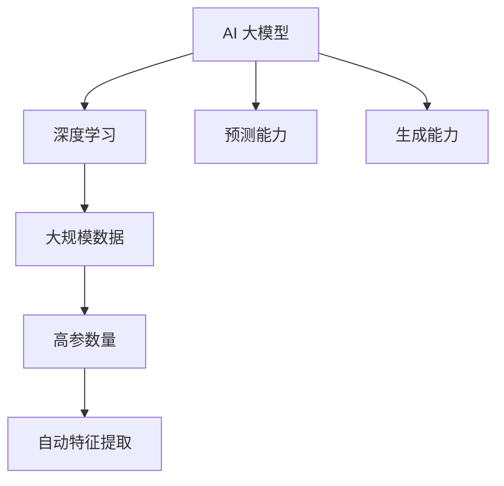

#### 1.2 AI大模型的技术架构

AI 大模型的技术架构主要包括以下几个部分：

1. **数据输入层**：接收外部输入数据，如文本、图像、语音等。
2. **模型层**：包含多层神经网络，每一层都对输入数据进行特征提取和变换。
3. **参数层**：存储模型的参数，如权重、偏置等。
4. **输出层**：将模型处理后的数据转化为预测结果或生成结果。

**技术架构 Mermaid 流程图**

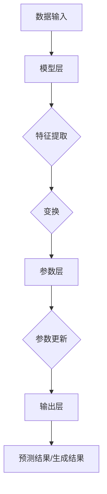

#### 1.3 AI大模型的分类与特点

AI 大模型可以根据训练数据来源、任务类型和应用领域进行分类：

1. **按照训练数据来源分类**：
   - **有监督学习模型**：使用标注数据训练。
   - **无监督学习模型**：使用未标注数据训练。
   - **半监督学习模型**：结合标注数据和未标注数据训练。

2. **按照任务类型分类**：
   - **分类模型**：对输入数据进行分类。
   - **回归模型**：对输入数据进行数值预测。
   - **生成模型**：生成新的数据。

3. **按照应用领域分类**：
   - **自然语言处理**：如文本分类、机器翻译。
   - **计算机视觉**：如图像识别、目标检测。
   - **语音识别**：如语音合成、语音识别。

**分类与特点 Mermaid 流程图**

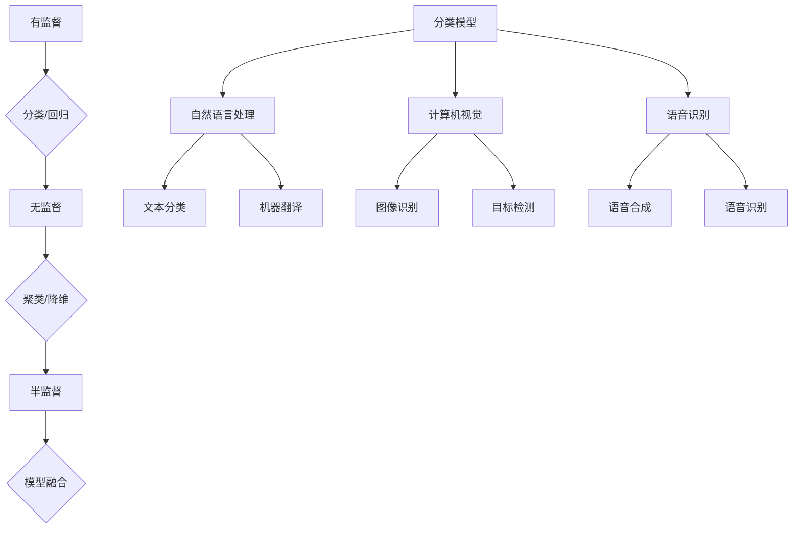

#### 1.4 AI大模型的发展历程

AI 大模型的发展历程可以分为以下几个阶段：

1. **初识阶段**（2012年以前）：神经网络的研究取得突破性进展，但受限于计算资源和数据量，大模型的训练效果不佳。
2. **增长阶段**（2012-2017年）：随着深度学习技术的崛起，大模型的训练算法和硬件支持得到提升，参数量和数据量开始增长。
3. **成熟阶段**（2017年至今）：预训练语言模型（如 GPT-3、BERT）的出现，使得大模型的训练和应用进入一个新的高度。

**发展历程 Mermaid 流程图**

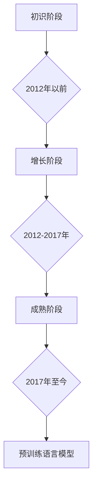

### 第2章：AI大模型的核心算法与原理

#### 2.1 神经网络与深度学习基础

神经网络（Neural Networks）是模仿人脑神经元工作原理的一种计算模型。深度学习（Deep Learning）是神经网络的一种扩展，通过多层神经网络结构，能够自动提取数据中的复杂特征。

**神经网络与深度学习基础 Mermaid 流程图**

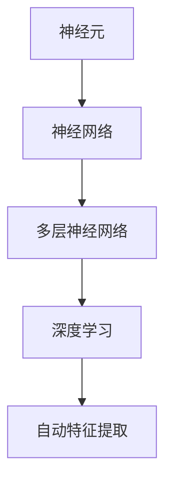

#### 2.2 预训练语言模型原理

预训练语言模型（Pre-trained Language Models）通过在大规模语料库上进行预训练，可以学习到语言中的通用知识，然后通过微调（Fine-tuning）应用到具体的任务中。

**预训练语言模型原理 Mermaid 流程图**

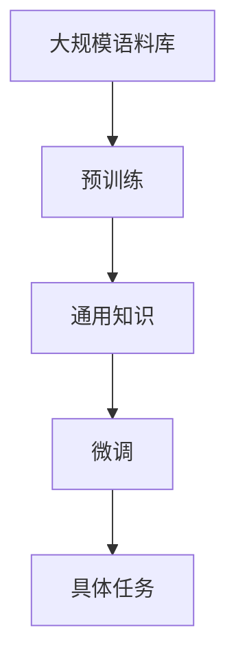

#### 2.3 大模型训练技巧

大模型的训练需要考虑数据预处理、计算资源管理、优化器选择等多个方面。以下是一些常见的训练技巧：

1. **数据预处理**：包括数据清洗、数据增强、批量归一化等。
2. **计算资源管理**：包括分布式训练、GPU/CPU资源分配等。
3. **优化器选择**：包括 SGD、Adam、AdaGrad 等。
4. **学习率调整**：包括学习率衰减、学习率预热等。

**大模型训练技巧 Mermaid 流 Rechard 流程图**

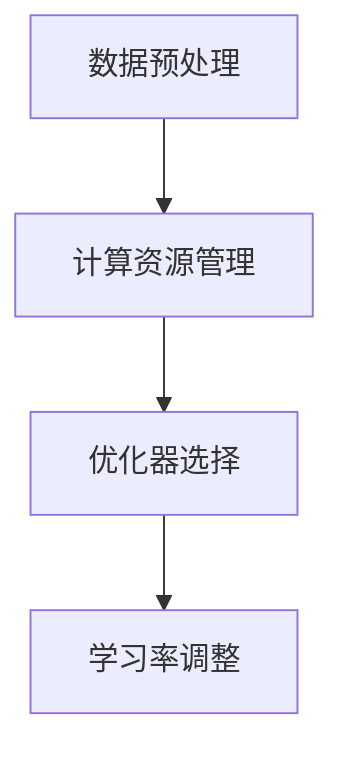

#### 2.4 大模型优化与调参

大模型的优化与调参是提高模型性能的关键步骤。以下是一些常见的优化方法：

1. **权值初始化**：包括 Xavier 初始化、He 初始化等。
2. **正则化**：包括 L1、L2 正则化、Dropout 等。
3. **激活函数**：包括 ReLU、Sigmoid、Tanh 等。
4. **网络结构调整**：包括网络层数、神经元数量、连接方式等。

**大模型优化与调参 Mermaid 流程图**

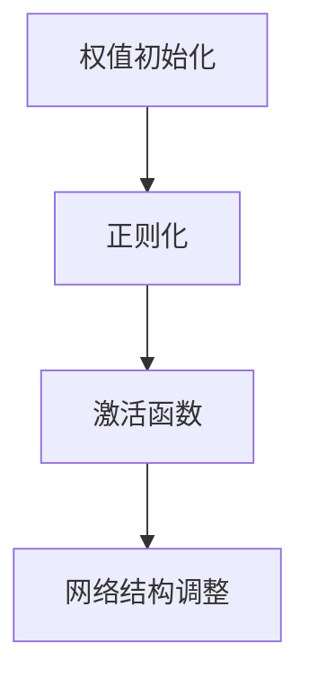

### 第3章：国际AI大模型创业环境分析

#### 3.1 国际AI市场概况

国际 AI 市场规模持续增长，根据多家市场研究机构的报告，预计未来几年内，全球 AI 市场规模将达到数千亿美元。以下是几个主要市场特点：

1. **市场规模**：美国、中国和欧盟是全球 AI 市场的主要区域，占据了全球 AI 市场的大部分份额。
2. **技术趋势**：深度学习、自然语言处理、计算机视觉等是当前 AI 技术的主要发展方向。
3. **行业应用**：金融、医疗、零售、制造业等行业是 AI 技术的主要应用领域。

**国际AI市场概况 Mermaid 流程图**

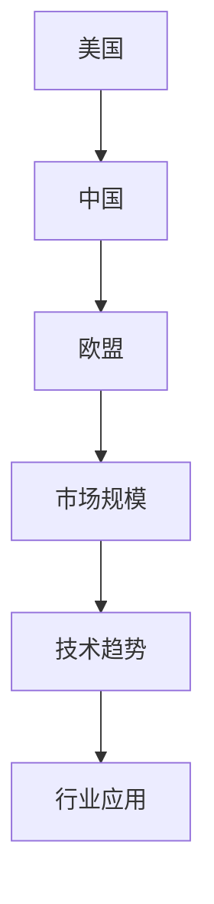

#### 3.2 国际AI创业生态

国际 AI 创业生态日益成熟，包括投资、研发、人才等多个方面。以下是国际 AI 创业生态的主要特点：

1. **投资环境**：风险投资和政府资金对 AI 创业的支持力度大，提供了丰富的资金来源。
2. **研发环境**：全球顶尖的大学和研究机构在 AI 领域的研究成果为创业提供了技术支持。
3. **人才环境**：国际 AI 创业人才流动性高，吸引了全球各地的优秀人才。

**国际AI创业生态 Mermaid 流程图**

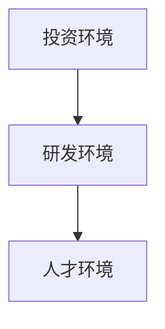

#### 3.3 国际AI创业优势与挑战

国际 AI 创业的优势包括：

1. **技术优势**：国际 AI 创业者可以接触到全球最先进的 AI 技术。
2. **市场优势**：国际市场广阔，为创业者提供了更多的机会。
3. **资源优势**：国际创业生态提供了丰富的资金、人才和资源。

但同时也面临着以下挑战：

1. **竞争压力**：国际市场竞争激烈，创业者需要不断提高自身竞争力。
2. **合规风险**：不同国家在数据隐私、网络安全等方面有不同的法律法规。
3. **文化差异**：国际创业需要考虑跨文化沟通和合作。

**国际AI创业优势与挑战 Mermaid 流程图**

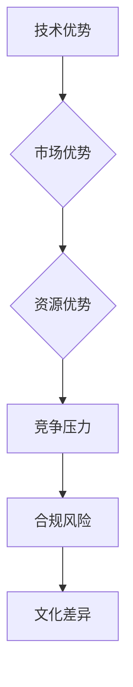

#### 3.4 国际AI创业案例分析

以下是几个国际 AI 创业成功案例：

1. **OpenAI**：一家总部位于美国的人工智能研究公司，其核心产品是 GPT-3 预训练语言模型。
2. **DeepMind**：一家总部位于英国的人工智能公司，其核心产品是 AlphaGo 人工智能围棋程序。
3. **SenseTime**：一家总部位于中国的人工智能公司，其核心产品是计算机视觉技术。

这些案例展示了国际 AI 创业的成功路径和策略，包括技术领先、市场定位、资源整合等方面。

**国际AI创业案例分析 Mermaid 流程图**

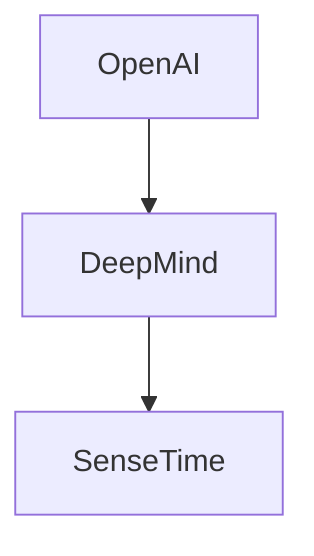

## 第二部分：AI大模型创业策略与实践

### 第4章：AI大模型创业策略制定

#### 4.1 创业团队建设

创业团队建设是 AI 大模型创业的首要任务，以下是一些建议：

1. **核心成员**：选择在 AI 领域有丰富经验的核心成员，如算法工程师、数据科学家、产品经理等。
2. **多元化**：团队应具备多元化背景，包括技术、市场、运营等方面，以提高团队的综合实力。
3. **沟通协作**：建立高效的沟通机制，确保团队成员之间的信息畅通。

**创业团队建设 Mermaid 流程图**

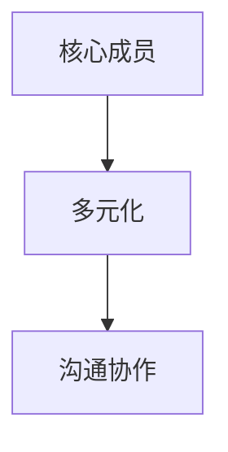

#### 4.2 创业方向与市场定位

创业方向与市场定位是决定 AI 大模型创业成功的关键因素，以下是一些建议：

1. **技术定位**：选择具有前沿性和创新性的技术方向，如预训练语言模型、生成模型等。
2. **市场定位**：选择具有高成长性和高竞争性的市场，如金融、医疗、零售等行业。
3. **差异化**：通过差异化策略，在市场中脱颖而出，如提供独特的功能、更好的用户体验等。

**创业方向与市场定位 Mermaid 流程图**

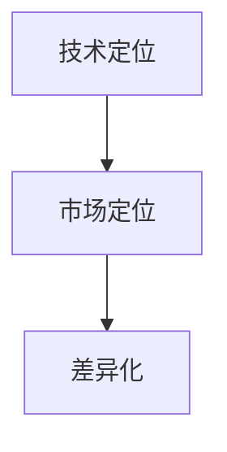

#### 4.3 创业资源整合与利用

创业资源整合与利用是确保 AI 大模型创业成功的重要因素，以下是一些建议：

1. **资金**：通过风险投资、政府资金、股权众筹等方式筹集资金。
2. **技术**：与高校、研究机构合作，获取前沿技术和研究成果。
3. **市场**：与行业合作伙伴建立合作关系，共同开拓市场。

**创业资源整合与利用 Mermaid 流程图**

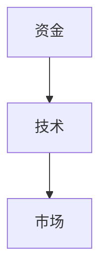

#### 4.4 创业路径选择

创业路径选择是决定 AI 大模型创业成功的重要因素，以下是一些建议：

1. **独立研发**：自主研发具有自主知识产权的核心技术，提高市场竞争力。
2. **合作开发**：与国内外知名企业、高校、研究机构合作，共同开发新产品。
3. **并购整合**：通过并购整合已有技术资源，快速进入市场。

**创业路径选择 Mermaid 流程图**

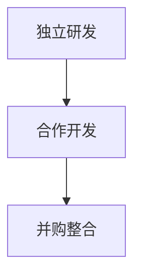

### 第5章：AI大模型创业项目管理

#### 5.1 项目立项与规划

项目立项与规划是确保 AI 大模型创业项目顺利推进的重要环节，以下是一些建议：

1. **项目立项**：明确项目目标、任务、资源等，形成项目立项报告。
2. **项目规划**：制定项目进度计划、预算计划、人力资源计划等，确保项目按计划推进。

**项目立项与规划 Mermaid 流程图**

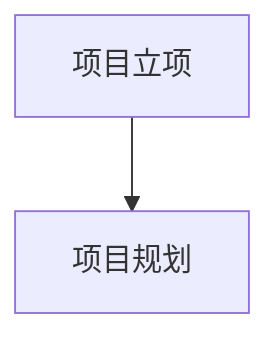

#### 5.2 项目研发管理

项目研发管理是确保 AI 大模型创业项目技术创新和高质量完成的重要环节，以下是一些建议：

1. **研发流程**：建立规范的研发流程，包括需求分析、设计、开发、测试等。
2. **技术评审**：定期进行技术评审，确保技术方向的正确性和项目的稳定性。
3. **风险管理**：识别和评估项目风险，制定风险应对措施。

**项目研发管理 Mermaid 流程图**

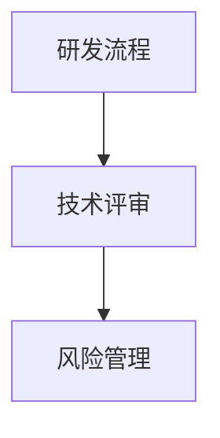

#### 5.3 项目风险控制

项目风险控制是确保 AI 大模型创业项目顺利进行的重要保障，以下是一些建议：

1. **风险识别**：识别项目中的潜在风险，如技术风险、市场风险、法律风险等。
2. **风险评估**：评估风险的影响程度和发生概率，制定风险应对策略。
3. **风险监控**：定期对项目风险进行监控，确保风险得到及时控制和解决。

**项目风险控制 Mermaid 流程图**

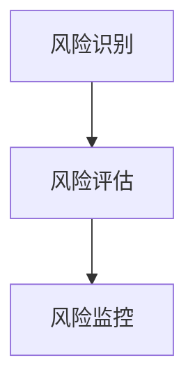

#### 5.4 项目团队协作

项目团队协作是确保 AI 大模型创业项目高效推进的重要保障，以下是一些建议：

1. **沟通机制**：建立高效的沟通机制，确保团队成员之间的信息畅通。
2. **协作工具**：使用项目管理工具，如 JIRA、Trello 等，提高团队协作效率。
3. **激励机制**：制定合理的激励机制，激发团队成员的积极性和创造力。

**项目团队协作 Mermaid 流程图**

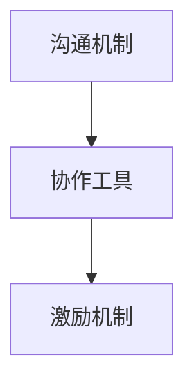

### 第6章：AI大模型产品设计与开发

#### 6.1 产品设计原则

AI 大模型产品的设计原则是确保产品功能完善、用户体验优良的重要基础，以下是一些建议：

1. **需求分析**：深入理解用户需求，明确产品的核心功能和目标。
2. **用户体验**：以用户为中心，设计简洁、易用、直观的界面。
3. **可扩展性**：设计具有可扩展性的架构，以适应未来业务的发展。

**产品设计原则 Mermaid 流程图**

```mermaid
graph TD
    A[需求分析]
    A --> B[用户体验]
    B --> C[可扩展性]
```

#### 6.2 产品需求分析

产品需求分析是确保产品满足用户需求和市场要求的关键环节，以下是一些建议：

1. **功能需求**：明确产品的功能模块和功能点。
2. **性能需求**：定义产品的性能指标，如响应时间、吞吐量等。
3. **安全性需求**：确保产品的数据安全和用户隐私保护。

**产品需求分析 Mermaid 流程图**

```mermaid
graph TD
    A[功能需求]
    A --> B[性能需求]
    B --> C[安全性需求]
```

#### 6.3 产品开发流程

产品开发流程是确保 AI 大模型产品高效、高质量完成的重要保障，以下是一些建议：

1. **需求分析**：明确产品需求，形成需求文档。
2. **设计阶段**：进行产品设计和详细设计。
3. **开发阶段**：根据设计文档进行代码开发和单元测试。
4. **测试阶段**：进行集成测试和系统测试，确保产品质量。

**产品开发流程 Mermaid 流程图**

```mermaid
graph TD
    A[需求分析]
    A --> B[设计阶段]
    B --> C[开发阶段]
    C --> D[测试阶段]
```

#### 6.4 产品迭代与优化

产品迭代与优化是确保 AI 大模型产品持续改进、满足用户需求和市场变化的重要环节，以下是一些建议：

1. **用户反馈**：收集用户反馈，了解产品的优势和不足。
2. **功能迭代**：根据用户反馈，进行产品的功能迭代和优化。
3. **性能优化**：通过技术优化和架构调整，提高产品的性能和稳定性。

**产品迭代与优化 Mermaid 流程图**

```mermaid
graph TD
    A[用户反馈]
    A --> B[功能迭代]
    B --> C[性能优化]
```

### 第7章：AI大模型创业商业模式探索

#### 7.1 创业商业模式概述

创业商业模式是指企业在特定市场环境中，通过提供有价值的产品或服务，实现盈利和持续发展的路径。以下是一些常见的创业商业模式：

1. **产品模式**：通过销售产品实现盈利，如硬件设备、软件工具等。
2. **服务模式**：通过提供服务实现盈利，如咨询服务、数据处理服务等。
3. **订阅模式**：通过用户订阅服务实现盈利，如云计算、在线教育等。
4. **广告模式**：通过广告收入实现盈利，如社交媒体、搜索引擎等。

**创业商业模式概述 Mermaid 流程图**

```mermaid
graph TD
    A[产品模式]
    A --> B[服务模式]
    B --> C[订阅模式]
    C --> D[广告模式]
```

#### 7.2 AI大模型盈利模式

AI 大模型创业的盈利模式主要包括以下几个方面：

1. **产品销售**：通过销售 AI 大模型产品（如预训练模型、推理服务）实现盈利。
2. **服务收费**：提供定制化服务（如数据分析、模型定制）收取服务费用。
3. **数据销售**：通过出售高质量数据集或数据服务实现盈利。
4. **广告投放**：在 AI 大模型产品中投放广告，通过广告收入实现盈利。

**AI大模型盈利模式 Mermaid 流程图**

```mermaid
graph TD
    A[产品销售]
    A --> B[服务收费]
    B --> C[数据销售]
    C --> D[广告投放]
```

#### 7.3 创业融资策略

创业融资策略是确保 AI 大模型创业项目顺利推进的重要环节，以下是一些建议：

1. **天使融资**：寻找天使投资者，通过股权融资筹集初始资金。
2. **风险投资**：寻找风险投资机构，通过多轮股权融资扩大公司规模。
3. **政府资金**：申请政府资金支持，如创新创业基金、税收优惠等。

**创业融资策略 Mermaid 流程图**

```mermaid
graph TD
    A[天使融资]
    A --> B[风险投资]
    B --> C[政府资金]
```

#### 7.4 创业成功案例分析

以下是一则 AI 大模型创业成功案例：

**案例：SenseTime（商汤科技）**

SenseTime（商汤科技）是一家全球领先的人工智能公司，成立于2014年，总部位于中国。公司专注于计算机视觉和深度学习技术，业务涵盖智能驾驶、智慧城市、智能手机等多个领域。

1. **商业模式**：SenseTime采用了“产品+服务”的商业模式，通过销售 AI 大模型产品（如计算机视觉算法）和提供定制化服务实现盈利。
2. **融资历程**：SenseTime获得了多轮融资，包括来自软银、阿里巴巴、腾讯等顶级投资者的投资。
3. **市场表现**：SenseTime在计算机视觉领域取得了显著成果，客户遍布全球，包括众多知名企业和政府机构。

**创业成功案例分析 Mermaid 流程图**

```mermaid
graph TD
    A[商业模式]
    A --> B[融资历程]
    B --> C[市场表现]
```

## 第三部分：AI大模型创业国际合作与拓展

### 第8章：国际AI合作与资源利用

#### 8.1 国际AI合作模式

国际 AI 合作模式主要包括以下几个方面：

1. **技术合作**：与国际知名研究机构、高校和企业合作，共同开展 AI 技术研究和开发。
2. **市场合作**：与国际企业合作，共同开拓全球市场，提高市场份额。
3. **人才合作**：与国际人才交流，引进海外优秀人才，提升团队实力。

**国际AI合作模式 Mermaid 流程图**

```mermaid
graph TD
    A[技术合作]
    A --> B[市场合作]
    B --> C[人才合作]
```

#### 8.2 国际AI合作资源获取

获取国际 AI 合作资源是 AI 大模型创业的关键，以下是一些建议：

1. **国际展会**：参加国际展会，了解行业动态，拓展国际合作机会。
2. **国际论坛**：参与国际论坛，与海外企业和专家交流，建立合作关系。
3. **国际组织**：加入国际组织，如 IEEE、ACM 等，获取更多合作资源。

**国际AI合作资源获取 Mermaid 流程图**

```mermaid
graph TD
    A[国际展会]
    A --> B[国际论坛]
    B --> C[国际组织]
```

#### 8.3 国际AI合作案例研究

以下是一则国际 AI 合作案例研究：

**案例：百度与国际医院的合作**

百度是一家全球领先的人工智能公司，与国际多家医院开展了深度合作，共同推动医疗健康领域的人工智能应用。

1. **合作内容**：百度与国际医院合作，开发基于深度学习的医疗影像诊断系统，提高诊断准确率和效率。
2. **合作成果**：合作项目在多个国家成功落地，为医疗行业带来了显著的变革。
3. **合作意义**：通过国际合作，百度不断提升自身技术实力，同时也为全球医疗健康领域的发展做出了贡献。

**国际AI合作案例研究 Mermaid 流程图**

```mermaid
graph TD
    A[合作内容]
    A --> B[合作成果]
    B --> C[合作意义]
```

#### 8.4 跨国创业团队的协作与管理

跨国创业团队的协作与管理是确保项目顺利进行的重要保障，以下是一些建议：

1. **文化融合**：尊重不同国家的文化差异，建立包容、开放的企业文化。
2. **沟通机制**：建立高效的跨国沟通机制，确保团队成员之间的信息畅通。
3. **团队建设**：定期组织团队建设活动，增强团队凝聚力。

**跨国创业团队的协作与管理 Mermaid 流程图**

```mermaid
graph TD
    A[文化融合]
    A --> B[沟通机制]
    B --> C[团队建设]
```

### 第9章：国际AI大模型市场拓展

#### 9.1 国际市场调研

国际市场调研是拓展国际 AI 大模型市场的基础，以下是一些建议：

1. **市场分析**：分析国际市场的需求、竞争格局、政策环境等。
2. **用户调研**：了解目标用户的偏好、需求、痛点等，为产品设计和市场策略提供依据。
3. **竞争对手分析**：分析竞争对手的产品、市场策略、优势等，找到自身的差异化优势。

**国际市场调研 Mermaid 流程图**

```mermaid
graph TD
    A[市场分析]
    A --> B[用户调研]
    B --> C[竞争对手分析]
```

#### 9.2 国际市场进入策略

国际市场进入策略是确保 AI 大模型产品在国际市场成功落地的重要环节，以下是一些建议：

1. **市场细分**：根据目标市场的特点和需求，进行市场细分，制定针对性的市场策略。
2. **本地化**：针对不同国家和地区的文化、法律、市场环境，进行产品本地化和服务本地化。
3. **渠道建设**：建立国际销售渠道，如与当地代理商、分销商合作，提高市场覆盖率。

**国际市场进入策略 Mermaid 流程图**

```mermaid
graph TD
    A[市场细分]
    A --> B[本地化]
    B --> C[渠道建设]
```

#### 9.3 国际市场竞争分析

国际市场竞争分析是制定国际市场策略的重要依据，以下是一些建议：

1. **竞争对手分析**：分析主要竞争对手的市场份额、产品特点、市场策略等。
2. **市场定位**：根据自身产品和市场优势，确定适当的市场定位。
3. **差异化策略**：通过产品差异化、服务差异化等手段，提高市场竞争力。

**国际市场竞争分析 Mermaid 流程图**

```mermaid
graph TD
    A[竞争对手分析]
    A --> B[市场定位]
    B --> C[差异化策略]
```

#### 9.4 国际化营销策略

国际化营销策略是推动 AI 大模型产品在国际市场成功的关键，以下是一些建议：

1. **品牌建设**：建立国际知名品牌，提高品牌影响力和市场认可度。
2. **多渠道推广**：通过多种渠道进行产品推广，如线上广告、线下活动、社交媒体等。
3. **合作营销**：与当地企业、机构合作，共同开展市场推广活动，提高市场影响力。

**国际化营销策略 Mermaid 流程图**

```mermaid
graph TD
    A[品牌建设]
    A --> B[多渠道推广]
    B --> C[合作营销]
```

### 附录

#### 附录A：AI大模型创业资源与工具

以下是为 AI 大模型创业提供的资源与工具：

1. **开发工具与平台**：如 TensorFlow、PyTorch、Google Colab 等。
2. **教育与培训资源**：如 Coursera、Udacity、edX 等。
3. **行业报告与资讯**：如 MarketsandMarkets、IDC、Gartner 等。
4. **国际AI大模型创业社区**：如 AI Village、AI Stack、AI Trends 等。

**AI大模型创业资源与工具 Mermaid 流程图**

```mermaid
graph TD
    A[开发工具与平台]
    A --> B[教育与培训资源]
    B --> C[行业报告与资讯]
    C --> D[国际AI大模型创业社区]
```

---

## 作者信息

**作者：AI天才研究院/AI Genius Institute & 禅与计算机程序设计艺术 /Zen And The Art of Computer Programming**  
本文由 AI 天才研究院和禅与计算机程序设计艺术共同撰写，旨在为 AI 大模型创业提供有价值的指导和建议。如果您有任何问题或建议，欢迎与我们联系。  
--- 

## 结语

AI 大模型创业是一项具有巨大潜力的领域，但同时也面临着诸多挑战。通过深入分析 AI 大模型的基础知识、创业环境、策略与实践，以及国际合作与拓展，本文为创业者提供了一套完整的创业指南。我们希望本文能够帮助读者在 AI 大模型创业的道路上取得成功，为全球 AI 产业的发展贡献力量。让我们一起迈向 AI 时代的辉煌！<|im_end|>

