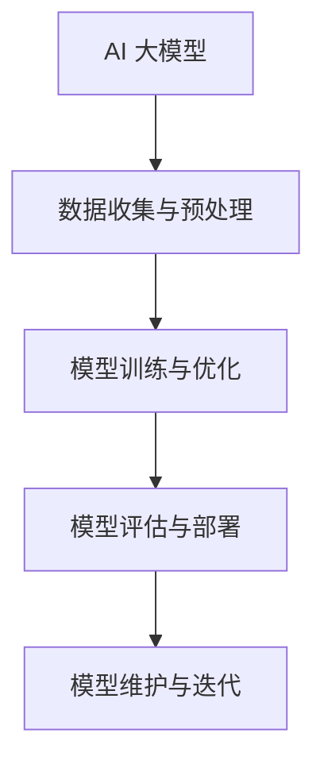

                 

### AI 大模型创业：如何利用市场优势？

> **关键词：** AI大模型，市场优势，创业策略，商业模式，法律合规

**摘要：**
本文将深入探讨AI大模型创业的市场优势及其实现策略。首先，我们将概述AI大模型市场的现状、驱动力、挑战与机遇，以及未来趋势。随后，我们将详细讲解AI大模型的核心原理与架构，包括数学基础、算法原理及模型优化。接着，我们将分析AI大模型在商业应用中的实施策略，讨论商业模式、市场定位和战略规划。之后，我们将分享AI大模型创业的实践案例与经验，探讨法律与伦理问题，以及提供所需的资源与工具。最后，我们将展望AI大模型创业的未来发展前景与挑战。

### 《AI 大模型创业：如何利用市场优势？》目录大纲

- **第一部分：AI大模型市场概述**
  - **第1章：AI大模型市场环境与趋势**
    - **1.1 AI大模型市场的现状分析**
      - AI大模型的发展历程
      - AI大模型市场规模与增长
      - AI大模型市场的主要参与者
    - **1.2 AI大模型市场的驱动力**
      - 技术进步
      - 市场需求
      - 政策与法规
    - **1.3 AI大模型市场的挑战与机遇**
      - 技术挑战
      - 商业挑战
      - 市场机会
    - **1.4 AI大模型市场的发展趋势**
      - 技术趋势
      - 应用领域趋势
      - 竞争格局变化

- **第二部分：AI大模型核心原理与架构**
  - **第2章：AI大模型原理与数学基础**
    - **2.1 AI大模型的基本概念**
      - 深度学习
      - 神经网络
      - 大模型的定义与特点
    - **2.2 AI大模型的核心算法**
      - 反向传播算法
      - 优化算法
      - 注意力机制
    - **2.3 AI大模型的数学基础**
      - 微积分基础
      - 线性代数基础
      - 概率论与统计基础
    - **2.4 AI大模型的架构设计与优化**
      - 模型架构
      - 分布式训练
      - 模型压缩与加速

- **第三部分：AI大模型在商业应用中的实施策略**
  - **第3章：AI大模型创业的商业模式与战略**
    - **3.1 AI大模型创业的商业模式**
      - B2B与B2C模式
      - 平台化与生态建设
      - 产品化与商业化
    - **3.2 AI大模型创业的市场定位**
      - 目标市场的选择
      - 市场细分策略
      - 客户需求分析
    - **3.3 AI大模型创业的战略规划**
      - 技术路线图
      - 产品路线图
      - 市场推广策略

- **第四部分：AI大模型创业案例与经验分享**
  - **第4章：AI大模型创业实践与案例分析**
    - **4.1 案例介绍：XX公司的AI大模型创业之路**
      - 公司背景
      - 创业历程
      - 成功因素
    - **4.2 案例分析：YY公司的AI大模型产品开发**
      - 产品特点
      - 技术应用
      - 市场反响
    - **4.3 经验分享：创业者的心得体会与建议**
      - 技术积累与团队建设
      - 商业模式探索与调整
      - 风险管理与应对策略

- **第五部分：AI大模型创业的法律与伦理问题**
  - **第5章：AI大模型创业的法律风险与合规**
    - **5.1 AI大模型相关的法律法规**
      - 数据保护法规
      - 知识产权保护法规
      - 市场竞争法规
    - **5.2 AI大模型创业的法律风险管理**
      - 合同管理
      - 合规审查
      - 法律咨询与纠纷解决
    - **5.3 AI大模型创业的伦理问题**
      - 算法偏见与公平性
      - 隐私保护
      - 社会责任与道德义务

- **第六部分：AI大模型创业的资源与工具**
  - **第6章：AI大模型创业所需的资源与工具**
    - **6.1 硬件资源**
      - 计算资源
      - 存储资源
      - 网络资源
    - **6.2 软件资源**
      - 开发框架
      - 算法库
      - 工具与平台
    - **6.3 人力资源**
      - 技术人员
      - 业务人员
      - 管理团队
    - **6.4 资金资源**
      - 种子轮融资
      - 天使投资
      - 后续融资

- **第七部分：AI大模型创业的未来展望**
  - **第7章：AI大模型创业的发展前景与挑战**
    - **7.1 AI大模型创业的未来趋势**
      - 技术发展方向
      - 市场应用扩展
      - 产业生态演变
    - **7.2 AI大模型创业的挑战与应对**
      - 技术挑战
      - 市场竞争
      - 政策与法律变化

- **附录**
  - **附录A：AI大模型创业参考资料与资源链接**
    - **A.1 开源框架与工具**
    - **A.2 行业报告与研究报告**
    - **A.3 AI大模型创业相关的政策法规**
    - **A.4 相关学术期刊与会议**
  - **附录B：AI大模型创业的关键概念与架构 Mermaid 流程图**
  - **附录C：反向传播算法伪代码**
  - **附录D：数学模型和数学公式讲解**
  - **附录E：AI大模型创业项目实战**
  - **附录F：代码实现与详细解读**

本文结构紧凑、逻辑清晰，旨在为广大AI创业者提供全面而深入的指导，助力他们在AI大模型领域取得成功。

### 第一部分：AI大模型市场概述

#### 第1章：AI大模型市场环境与趋势

##### 1.1 AI大模型市场的现状分析

AI大模型，即人工智能大型模型，是指那些具有亿级别参数、高度复杂、能够在各种任务上实现超高性能的神经网络模型。这些模型在图像识别、自然语言处理、语音识别、机器翻译、推荐系统等众多领域展现出卓越的能力。AI大模型市场的现状可以从以下几个方面进行分析：

**AI大模型的发展历程**

AI大模型的发展可以追溯到上世纪80年代，随着深度学习技术的兴起，神经网络的研究和应用开始得到广泛关注。1990年代初期，Hinton等人提出的深度信念网络（Deep Belief Network, DBN）被认为是第一个真正意义上的深度学习模型。进入21世纪后，特别是2012年，Hinton团队提出的AlexNet在ImageNet竞赛中取得的巨大成功，标志着深度学习技术的重大突破。此后，以Google的Inception和Facebook的ResNet为代表的深度神经网络在性能上不断取得新的突破，进一步推动了AI大模型的发展。

**AI大模型市场规模与增长**

随着技术的进步和应用的广泛普及，AI大模型市场规模呈现出快速增长的态势。根据市场研究机构IDC的数据，全球AI市场规模在2018年约为360亿美元，预计到2025年将增长到1,200亿美元。AI大模型作为其中的关键组成部分，其市场规模也在快速扩张。特别是在云计算、大数据和边缘计算等技术的支持下，AI大模型的应用范围进一步拓展，市场潜力巨大。

**AI大模型市场的主要参与者**

在AI大模型市场中，主要参与者包括科技巨头、初创企业、学术机构和科研团队。科技巨头如Google、Facebook、Microsoft、Amazon等，凭借其强大的研发能力和海量数据资源，在AI大模型领域占据领先地位。初创企业则专注于特定应用场景的AI大模型研发，例如自然语言处理、图像识别等。学术机构和科研团队通过发表论文和开源项目，推动AI大模型技术的进步和应用。

##### 1.2 AI大模型市场的驱动力

**技术进步**

技术进步是推动AI大模型市场发展的重要动力。近年来，深度学习、神经网络、优化算法、分布式计算等技术的飞速发展，使得AI大模型在性能、效率和可扩展性方面取得了显著提升。特别是随着计算能力的提升，AI大模型可以处理更大规模的数据，实现更复杂的任务。

**市场需求**

随着数字化转型的加速，各行各业对AI大模型的需求不断增加。图像识别、语音识别、自然语言处理、推荐系统等AI大模型技术，在金融、医疗、零售、交通、能源等领域得到了广泛应用。市场对高性能、高可靠性的AI大模型的需求，推动了市场的快速增长。

**政策与法规**

政府政策和支持也是推动AI大模型市场发展的重要因素。各国政府纷纷出台支持AI技术研发和应用的政策，提供资金、税收优惠等支持措施，以推动AI大模型产业的发展。同时，相关法规的完善和监管机制的建立，为AI大模型市场的健康发展提供了保障。

##### 1.3 AI大模型市场的挑战与机遇

**技术挑战**

AI大模型面临的技术挑战主要包括：大规模数据的处理和存储、模型的训练和优化、模型的解释性和可解释性等。此外，随着模型规模的扩大，计算资源的消耗也在增加，这对硬件设施提出了更高的要求。

**商业挑战**

在商业层面，AI大模型创业面临的市场竞争日益激烈。初创企业需要不断创新，提高产品的竞争力，才能在市场中立足。此外，商业模式的探索和盈利模式的构建也是重要挑战。

**市场机会**

尽管面临挑战，AI大模型市场也蕴含着巨大的机会。随着AI技术的不断进步和应用领域的拓展，新的应用场景和商业模式不断涌现。例如，AI大模型在智能医疗、智能交通、智能金融等领域的应用，有望带来新的市场机会和商业价值。

##### 1.4 AI大模型市场的发展趋势

**技术趋势**

从技术角度来看，AI大模型市场的发展趋势包括：模型规模的进一步扩大、模型的优化和压缩、多模态AI大模型的研究与应用等。此外，随着量子计算、边缘计算等新技术的兴起，AI大模型的技术体系也将不断演进。

**应用领域趋势**

在应用领域方面，AI大模型将继续向更广泛、更深入的领域拓展。例如，在医疗领域，AI大模型可以用于疾病诊断、药物研发等；在交通领域，AI大模型可以用于自动驾驶、智能交通管理；在零售领域，AI大模型可以用于个性化推荐、智能客服等。

**竞争格局变化**

随着AI大模型市场的不断发展，竞争格局也将发生变化。科技巨头和初创企业之间的竞争将更加激烈，同时，跨界合作和生态体系建设也将成为市场发展的重要趋势。

通过以上分析，可以看出AI大模型市场具有巨大的发展潜力，同时也面临着诸多挑战。创业者需要深入了解市场环境，把握发展趋势，制定有效的战略规划，才能在市场中脱颖而出。

### 第二部分：AI大模型核心原理与架构

#### 第2章：AI大模型原理与数学基础

##### 2.1 AI大模型的基本概念

**深度学习**

深度学习（Deep Learning）是一种人工智能技术，它通过模拟人脑的神经网络结构和信息处理方式，对大量数据进行自动学习和模式识别。深度学习模型由多个隐藏层组成，因此称为“深度”。深度学习在图像识别、语音识别、自然语言处理等领域取得了显著成果。

**神经网络**

神经网络（Neural Network）是深度学习的基础，由大量简单的人工神经元（或节点）互联构成。这些神经元通过前向传播和反向传播算法，对输入数据进行特征提取和分类。神经网络模型可以分为前馈神经网络、卷积神经网络（CNN）和循环神经网络（RNN）等类型。

**大模型的定义与特点**

大模型（Large Model）是指那些拥有数百万甚至数十亿参数的深度学习模型。这些模型具有以下特点：

1. **大规模参数**：大模型包含大量参数，能够捕捉更复杂的特征和模式。
2. **高效训练**：大模型通常采用高效的训练算法，如梯度下降、Adam优化器等，能够在较短的时间内完成训练。
3. **优异性能**：大模型在各类任务上表现优异，能够在图像识别、自然语言处理等领域达到或超过人类水平。

##### 2.2 AI大模型的核心算法

**反向传播算法**

反向传播算法（Backpropagation Algorithm）是深度学习训练的核心算法。它通过前向传播计算输出，然后反向传播计算梯度，从而更新模型参数。反向传播算法的基本步骤如下：

1. **前向传播**：输入数据经过神经网络，计算输出结果。
2. **计算损失**：计算输出结果与实际标签之间的误差，通常使用均方误差（MSE）或交叉熵损失函数。
3. **反向传播**：从输出层开始，反向计算各层的梯度，更新模型参数。
4. **参数更新**：使用优化算法（如梯度下降、Adam等）更新模型参数。

**优化算法**

优化算法（Optimization Algorithm）用于调整模型参数，以最小化损失函数。常见的优化算法包括：

1. **梯度下降（Gradient Descent）**：通过迭代更新模型参数，使其逐渐逼近最优解。
2. **Adam优化器**：结合了梯度下降和动量项，能够自适应调整学习率，提高训练效率。
3. **RMSprop优化器**：基于梯度平方的平均值，自适应调整学习率。

**注意力机制**

注意力机制（Attention Mechanism）是一种用于提高神经网络模型性能的技术。它通过动态分配不同权重，关注输入数据中的关键信息。注意力机制广泛应用于自然语言处理、图像识别等领域，能够提高模型的表示能力和解释性。

##### 2.3 AI大模型的数学基础

**微积分基础**

微积分是深度学习中的重要数学工具，用于计算函数的导数和积分。在深度学习中，微积分用于：

1. **前向传播**：计算神经网络输出和输入之间的映射关系。
2. **反向传播**：计算各层参数的梯度，用于更新模型参数。

**线性代数基础**

线性代数是深度学习的基础，用于处理矩阵和向量运算。在深度学习中，线性代数用于：

1. **矩阵乘法**：计算神经网络中的权重矩阵和输入向量的乘积。
2. **矩阵求导**：计算权重矩阵和输入向量的梯度。

**概率论与统计基础**

概率论与统计是深度学习中的重要分支，用于处理不确定性和随机性。在深度学习中，概率论与统计用于：

1. **损失函数**：计算输出结果与实际标签之间的误差。
2. **模型评估**：评估模型的性能和泛化能力。

##### 2.4 AI大模型的架构设计与优化

**模型架构**

AI大模型的架构设计包括多个层次，从输入层到输出层，每个层次都包含多个神经元。常见的模型架构包括：

1. **卷积神经网络（CNN）**：适用于图像识别和计算机视觉任务。
2. **循环神经网络（RNN）**：适用于序列数据，如文本和语音。
3. **Transformer模型**：适用于自然语言处理任务，具有强大的表示能力和解释性。

**分布式训练**

分布式训练（Distributed Training）是将模型训练任务分布到多台计算机上，以提高训练速度和效率。分布式训练的关键技术包括：

1. **数据并行**：将数据集划分为多个子集，分别在不同的计算机上训练。
2. **模型并行**：将模型划分为多个部分，分别在不同的计算机上训练。

**模型压缩与加速**

模型压缩与加速（Model Compression and Acceleration）是将大模型转化为小模型，以提高计算效率。常见的压缩与加速技术包括：

1. **模型剪枝（Model Pruning）**：通过删除部分权重，减小模型大小。
2. **量化（Quantization）**：将权重和激活值从浮点数转换为低精度数值，减少计算量。
3. **硬件加速**：利用GPU、TPU等硬件加速模型训练和推理。

通过以上对AI大模型核心原理和架构的讲解，读者可以更好地理解AI大模型的工作原理和实现方法。在接下来的章节中，我们将进一步探讨AI大模型在商业应用中的实施策略，帮助读者掌握AI大模型创业的关键技术和方法。

### 第三部分：AI大模型在商业应用中的实施策略

#### 第3章：AI大模型创业的商业模式与战略

##### 3.1 AI大模型创业的商业模式

在AI大模型创业中，商业模式的选择是至关重要的。成功的商业模式不仅能为企业带来可观的收入，还能为企业提供持续发展的动力。以下是几种常见的AI大模型创业商业模式：

**B2B与B2C模式**

**B2B（Business-to-Business）模式**：在这种模式中，企业将AI大模型作为解决方案出售给其他企业。这种模式通常适用于那些需要高性能AI大模型解决特定业务问题的企业，如金融、医疗、零售等行业。B2B模式的优势在于：

1. **高利润率**：由于解决方案的定制化和复杂性，B2B模式通常具有更高的利润率。
2. **稳定的客户关系**：B2B客户通常是长期合作，有助于建立稳定的客户关系。

**B2C（Business-to-Consumer）模式**：在这种模式中，企业将AI大模型产品直接销售给消费者。这种模式通常适用于那些面向大众市场的AI大模型产品，如智能助理、个性化推荐系统等。B2C模式的优势在于：

1. **市场广阔**：B2C模式面向的是大众市场，市场潜力巨大。
2. **快速反馈**：直接面向消费者，有助于快速获取用户反馈，优化产品。

**平台化与生态建设**

平台化模式：在这种模式中，企业构建一个开放的AI大模型平台，吸引第三方开发者、企业和用户加入。平台上的各种服务和应用由不同的参与者共同开发和维护。平台化模式的优势在于：

1. **生态系统**：通过构建生态系统，企业可以吸引更多的参与者，共同推动平台的发展。
2. **多样性和灵活性**：平台可以提供多样化的服务和应用，满足不同用户的需求。

**生态建设**：在平台化模式的基础上，生态建设是确保平台长期健康发展的关键。生态建设包括：

1. **合作伙伴关系**：与行业内的领先企业和开发者建立合作关系，共同开发解决方案。
2. **社区建设**：建立开发者社区，提供技术支持、交流平台和培训课程，促进技术交流和合作。
3. **激励机制**：为开发者提供奖励和激励机制，鼓励他们开发优质的应用和服务。

**产品化与商业化**

产品化模式：在这种模式中，企业将AI大模型转化为可商业化的产品。产品化包括：

1. **产品定义**：明确产品的功能、性能和用户需求。
2. **产品设计**：设计用户界面、交互流程和用户体验。
3. **产品发布**：发布产品，进行市场推广。

商业化模式：在产品化基础上，企业通过以下方式实现商业化：

1. **直接销售**：通过直销渠道或电商平台直接销售产品。
2. **合作伙伴销售**：通过合作伙伴渠道销售产品，如代理商、经销商等。
3. **订阅模式**：提供按需订阅服务，根据使用量或功能模块收费。
4. **广告与营销**：通过广告和营销活动，提高产品的知名度和用户量。

##### 3.2 AI大模型创业的市场定位

**目标市场的选择**

目标市场的选择是AI大模型创业的关键一步。以下是一些选择目标市场的策略：

1. **行业需求分析**：分析各个行业的AI应用需求，选择那些对AI大模型有强烈需求且技术接受度较高的行业，如金融、医疗、零售等。
2. **市场规模**：考虑市场的规模和增长潜力，选择市场规模较大且具有持续增长潜力的市场。
3. **竞争状况**：分析市场中的竞争状况，选择那些尚未被充分满足的市场需求，从而避免直接与市场领导者竞争。

**市场细分策略**

市场细分（Market Segmentation）是将市场划分为若干具有相似需求的子市场。以下是几种常用的市场细分策略：

1. **行为细分**：根据消费者的购买行为和偏好进行细分，如高频用户、低频用户等。
2. **人口细分**：根据消费者的年龄、性别、收入等人口统计特征进行细分。
3. **心理细分**：根据消费者的心理特征和价值观进行细分，如追求创新、注重性价比等。
4. **地理细分**：根据消费者的地理位置进行细分，如区域市场、国家市场等。

**客户需求分析**

了解客户需求是成功实施AI大模型的关键。以下是几种分析客户需求的方法：

1. **市场调研**：通过问卷调查、访谈等方式，收集客户的需求和意见。
2. **竞品分析**：分析竞争对手的产品和解决方案，了解客户尚未满足的需求。
3. **用户画像**：创建客户画像，了解客户的背景、需求、行为和偏好。
4. **客户反馈**：通过用户反馈和评价，持续优化产品和服务。

##### 3.3 AI大模型创业的战略规划

**技术路线图**

技术路线图是指导AI大模型创业的技术发展方向的蓝图。以下是制定技术路线图的步骤：

1. **技术评估**：评估现有技术水平和未来发展趋势，确定技术发展方向。
2. **技术优先级**：根据市场需求和竞争状况，确定技术优先级，重点关注关键技术的突破。
3. **里程碑规划**：设定技术里程碑，确保项目按计划进行。
4. **持续迭代**：技术路线图应具备灵活性，根据市场需求和技术进步进行动态调整。

**产品路线图**

产品路线图是指导产品开发和发布的蓝图。以下是制定产品路线图的步骤：

1. **产品定义**：明确产品的功能、性能和用户需求。
2. **版本规划**：根据市场需求和客户反馈，规划产品的版本发布计划。
3. **功能优先级**：确定产品功能的优先级，确保关键功能按时发布。
4. **用户体验**：注重用户体验设计，提高产品的易用性和满意度。

**市场推广策略**

市场推广策略是吸引客户、提高品牌知名度和市场份额的关键。以下是几种有效的市场推广策略：

1. **内容营销**：通过撰写高质量的技术博客、白皮书等，传递产品的价值和优势。
2. **社交媒体营销**：利用社交媒体平台，如LinkedIn、Twitter等，建立品牌影响力，吸引潜在客户。
3. **公关活动**：通过新闻发布会、行业会议等，提高产品的曝光度和知名度。
4. **合作伙伴关系**：与行业内的领先企业和开发者建立合作伙伴关系，共同推广产品。

通过以上对AI大模型创业的商业模式、市场定位和战略规划的讲解，读者可以更好地了解如何在商业应用中实施AI大模型。在接下来的章节中，我们将通过实践案例与经验分享，进一步探讨AI大模型创业的实践过程和成功因素。

### 第四部分：AI大模型创业案例与经验分享

#### 第4章：AI大模型创业实践与案例分析

##### 4.1 案例介绍：XX公司的AI大模型创业之路

**公司背景**

XX公司成立于2016年，是一家专注于人工智能领域的高科技公司。公司创始团队由一批具有多年人工智能研究和行业经验的博士组成，他们在深度学习、计算机视觉和自然语言处理等领域有着深厚的技术积累。公司成立之初，便将AI大模型作为核心研究方向，致力于将前沿技术应用于实际商业场景。

**创业历程**

1. **技术研发阶段**：创业初期，公司主要专注于AI大模型的技术研发，特别是在图像识别和自然语言处理领域取得了突破性进展。公司自主研发了多个高性能AI大模型，并在多个国际竞赛中取得了优异成绩。
   
2. **产品开发阶段**：在技术研发的基础上，公司开始将AI大模型应用于实际产品开发。2018年，公司推出了一款基于AI大模型的智能客服系统，该系统采用了先进的自然语言处理技术，能够实现智能对话和客户分类。此外，公司还开发了一款基于AI大模型的图像识别应用，用于零售行业的商品识别和库存管理。

3. **市场推广阶段**：在产品开发完成后，公司积极开展市场推广活动。通过参加行业会议、发布技术博客和开展线上营销活动，公司成功吸引了大量潜在客户。同时，公司还与多家大型企业建立了战略合作关系，将产品成功应用于金融、医疗和零售等行业。

**成功因素**

1. **技术创新**：公司始终将技术创新作为核心竞争力，不断推进AI大模型的技术研发，保持技术领先地位。
   
2. **市场需求**：公司深刻理解市场需求，将技术应用于实际商业场景，开发出具有市场竞争力的产品。
   
3. **团队建设**：公司拥有一支高水平的技术团队，团队成员在AI领域有着丰富的经验，能够高效地推进项目开发。

##### 4.2 案例分析：YY公司的AI大模型产品开发

**产品特点**

YY公司开发的AI大模型产品是一款智能推荐系统，主要用于电子商务和内容平台。该系统采用先进的深度学习技术，通过分析用户的历史行为、兴趣偏好和社交网络，为用户提供个性化的商品推荐和内容推荐。

1. **深度学习算法**：系统采用基于深度神经网络的推荐算法，能够自动提取用户行为中的复杂模式，提高推荐准确性。
   
2. **多模态数据处理**：系统能够处理多种类型的数据，包括用户行为数据、商品信息数据和用户画像数据，实现全面的数据融合。

3. **实时推荐**：系统采用实时计算技术，能够在毫秒级别为用户生成推荐列表，提高用户体验。

**技术应用**

1. **卷积神经网络（CNN）**：用于处理和识别图像数据，如商品图片的识别和分类。
   
2. **循环神经网络（RNN）**：用于处理序列数据，如用户的历史行为数据。
   
3. **Transformer模型**：用于处理自然语言数据，如用户评价和商品描述，实现文本的理解和生成。

**市场反响**

YY公司的AI大模型产品在市场上取得了良好的反响。根据用户反馈，产品能够显著提高用户的购物体验和满意度，有效提高了平台的转化率和用户留存率。此外，产品还得到了行业内的认可，在多个电子商务平台和内容平台上得到了广泛应用。

##### 4.3 经验分享：创业者的心得体会与建议

**技术积累与团队建设**

1. **技术积累**：在AI大模型创业中，技术积累至关重要。创业者应不断关注技术发展趋势，积极进行技术创新，保持技术领先地位。

2. **团队建设**：创业者应注重团队建设，招聘高水平的人才，形成专业化的技术团队。同时，应建立良好的团队文化和工作氛围，提高团队的凝聚力和工作效率。

**商业模式探索与调整**

1. **商业模式探索**：在创业初期，创业者应积极探索多种商业模式，如B2B、B2C、平台化等，找到最适合企业的商业模式。

2. **商业模式调整**：在商业模式探索过程中，创业者应根据市场需求和竞争状况，不断调整和优化商业模式，以适应市场变化。

**风险管理与应对策略**

1. **风险管理**：在AI大模型创业中，创业者应重视风险管理，识别和评估潜在的风险，制定相应的风险应对策略。

2. **应对策略**：对于可能出现的风险，如技术风险、市场风险、法律风险等，创业者应提前制定应对策略，确保企业的稳定发展。

通过以上案例分析，我们可以看到，成功的AI大模型创业不仅需要技术创新和市场需求的紧密结合，还需要团队建设和商业模式的有效支持。在接下来的章节中，我们将进一步探讨AI大模型创业的法律与伦理问题，帮助读者了解在创业过程中需要注意的法律和伦理问题。

### 第五部分：AI大模型创业的法律与伦理问题

#### 第5章：AI大模型创业的法律风险与合规

##### 5.1 AI大模型相关的法律法规

**数据保护法规**

随着AI大模型的应用日益广泛，数据保护问题成为关注的焦点。各国政府纷纷出台数据保护法规，以保障个人数据的隐私和安全。以下是一些主要的数据保护法规：

1. **《通用数据保护条例》（GDPR）**：欧盟于2018年实施的GDPR，对个人数据的收集、处理和存储提出了严格的要求。GDPR要求企业必须获得用户的明确同意，并对个人数据进行保护，否则将面临高额罚款。

2. **《加州消费者隐私法》（CCPA）**：美国加州于2020年通过的CCPA，旨在加强消费者对其个人数据的控制权，规定企业必须告知消费者其收集的数据种类，并允许消费者删除其数据。

**知识产权保护法规**

AI大模型的研究和应用涉及到大量的知识产权保护问题，包括专利、版权和商标等。以下是一些主要的知识产权保护法规：

1. **《专利法》**：专利法保护发明者的发明创造，确保其在一定期限内独占实施。AI大模型的创新技术可以通过专利进行保护，防止他人未经授权的使用。

2. **《版权法》**：版权法保护作品的表达形式，如论文、代码、算法等。AI大模型的研究成果和开发成果可以通过版权法进行保护。

**市场竞争法规**

AI大模型创业过程中，需要遵守市场竞争法规，防止垄断和滥用市场支配地位。以下是一些主要的市场竞争法规：

1. **《反垄断法》**：反垄断法旨在防止企业通过垄断手段排除竞争对手，维护公平竞争的市场环境。AI大模型创业企业应避免通过不正当手段获取市场份额。

2. **《反不正当竞争法》**：反不正当竞争法禁止企业从事不正当竞争行为，如虚假宣传、商业诽谤等，确保市场的公平竞争。

##### 5.2 AI大模型创业的法律风险管理

**合同管理**

在AI大模型创业过程中，合同管理至关重要。以下是一些合同管理的建议：

1. **明确合同条款**：在签订合同时，确保合同条款明确、详尽，包括权利、义务、违约责任等。

2. **审查合同条款**：在签订合同前，应仔细审查合同条款，确保合同内容符合法律法规要求。

3. **合同备案**：对于重要的合同，应进行备案，以便在发生纠纷时提供证据支持。

**合规审查**

AI大模型创业企业应建立合规审查机制，确保在研发、生产和销售过程中遵守相关法律法规。以下是一些合规审查的建议：

1. **定期合规培训**：组织定期的合规培训，提高员工的法律法规意识。

2. **合规风险评估**：对业务流程进行合规风险评估，识别潜在的法律风险。

3. **合规监控与整改**：建立合规监控机制，及时发现和整改合规问题。

**法律咨询与纠纷解决**

在AI大模型创业过程中，企业可能面临法律咨询和纠纷解决的需求。以下是一些法律咨询与纠纷解决的建议：

1. **法律顾问**：聘请专业法律顾问，为企业提供法律咨询和服务。

2. **调解与仲裁**：在发生纠纷时，尝试通过调解和仲裁等方式解决，以减少法律成本和时间。

3. **诉讼**：在无法通过调解和仲裁解决纠纷时，选择通过诉讼途径解决。

##### 5.3 AI大模型创业的伦理问题

**算法偏见与公平性**

AI大模型在决策过程中可能存在偏见，影响公平性和公正性。以下是一些解决算法偏见和提升公平性的措施：

1. **数据清洗**：在训练模型之前，对数据集进行清洗，去除潜在的偏见和噪声。

2. **算法透明性**：提高算法的透明度，使决策过程可解释和可追溯。

3. **多元性**：在数据集和团队中引入多元性，避免单一视角导致的偏见。

**隐私保护**

AI大模型在处理个人数据时，需要严格遵守隐私保护法规。以下是一些隐私保护措施：

1. **数据加密**：对个人数据进行加密，确保数据在传输和存储过程中的安全性。

2. **匿名化**：对个人数据进行匿名化处理，防止个人身份泄露。

3. **数据最小化**：只收集和处理与业务相关的基本数据，减少不必要的个人信息收集。

**社会责任与道德义务**

AI大模型创业企业应承担社会责任和道德义务，确保其技术应用的正当性和合理性。以下是一些社会责任和道德义务：

1. **伦理审查**：在产品开发和应用过程中，进行伦理审查，确保不损害公共利益和道德规范。

2. **透明信息披露**：向用户清晰披露AI大模型的技术原理和应用场景，提高用户的知情权。

3. **公平竞争**：遵守市场竞争规则，不从事不正当竞争行为，促进公平竞争的环境。

通过以上对AI大模型创业的法律与伦理问题的探讨，我们可以看到，法律合规和伦理问题在AI大模型创业中至关重要。创业者应充分了解相关法律法规，建立合规机制，同时注重伦理问题，确保企业健康、可持续发展。

### 第六部分：AI大模型创业的资源与工具

#### 第6章：AI大模型创业所需的资源与工具

AI大模型创业需要多方面的资源与工具支持，以下将详细讨论硬件资源、软件资源、人力资源和资金资源等方面的需求。

##### 6.1 硬件资源

**计算资源**

AI大模型训练需要大量的计算资源，尤其是GPU（图形处理单元）和TPU（张量处理单元）等专用硬件。高性能的计算资源能够显著提升模型训练速度，缩短研发周期。创业者应根据模型规模和训练需求，选择合适的硬件配置，如NVIDIA GPU、谷歌TPU等。

**存储资源**

AI大模型训练和推理过程中会产生大量的数据，需要充足的存储资源。创业者应考虑使用分布式存储系统，如HDFS（Hadoop分布式文件系统）或Ceph等，以保证数据的高效存储和访问。

**网络资源**

AI大模型训练和部署需要稳定的网络环境，确保数据传输和通信的可靠性。创业者应选择高质量的云服务提供商，如AWS、Azure或Google Cloud等，以获得可靠的网络资源。

##### 6.2 软件资源

**开发框架**

AI大模型开发需要使用高性能的深度学习框架，如TensorFlow、PyTorch、Keras等。这些框架提供了丰富的API和工具库，能够简化模型开发、训练和部署过程。

**算法库**

算法库是AI大模型开发的重要工具，提供了大量的预训练模型和算法实现，如Transformers、BERT、GPT等。创业者可以根据项目需求，选择合适的算法库进行开发和优化。

**工具与平台**

AI大模型创业还需要使用多种工具和平台，如Jupyter Notebook、Docker、Kubernetes等，以提高开发效率和项目管理能力。此外，创业者还可以利用云服务平台的AI工具和平台，如AWS SageMaker、Azure ML等，简化模型训练和部署流程。

##### 6.3 人力资源

**技术人员**

AI大模型创业团队需要具备深厚的技术背景，包括深度学习、计算机视觉、自然语言处理等领域的专业人才。创业者应招聘具有实际项目经验的技术人员，以快速推进模型研发和产品化。

**业务人员**

除了技术人员，AI大模型创业还需要业务人员，如产品经理、市场推广人员等。业务人员应具备市场敏感度和客户沟通能力，能够把握市场动态，推动产品商业化。

**管理团队**

AI大模型创业需要一个强有力的管理团队，负责整体战略规划、资源配置和团队管理。管理团队应具备丰富的创业经验和行业洞察力，以确保企业健康、可持续发展。

##### 6.4 资金资源

**种子轮融资**

种子轮融资是AI大模型创业初期的重要资金来源。创业者可以通过天使投资、种子基金等渠道获取种子资金，用于团队建设、技术研发和市场推广。

**天使投资**

天使投资是AI大模型创业的重要资金来源之一。天使投资者通常具有丰富的行业经验和资金实力，能够为创业者提供资金、资源和指导。

**后续融资**

在种子轮融资后，AI大模型创业企业需要通过后续融资来持续发展。后续融资包括A轮、B轮等，创业者应制定详细的商业计划，展示企业的发展潜力和盈利能力，以吸引更多投资者的关注。

通过以上对AI大模型创业所需资源与工具的讨论，我们可以看到，成功的AI大模型创业不仅需要技术创新，还需要多方面的资源支持。创业者应根据项目需求，合理配置资源，优化开发流程，提高企业竞争力。

### 第七部分：AI大模型创业的未来展望

#### 第7章：AI大模型创业的发展前景与挑战

##### 7.1 AI大模型创业的未来趋势

随着AI技术的不断进步，AI大模型创业将迎来更多的机遇和挑战。以下是一些未来趋势：

**技术发展方向**

1. **模型压缩与优化**：为了提高AI大模型的性能和效率，模型压缩与优化将成为重要研究方向。通过模型剪枝、量化、知识蒸馏等技术，可以实现模型大小和计算资源的显著减少。
   
2. **多模态AI大模型**：随着数据类型的多样化，多模态AI大模型的研究和应用将得到进一步发展。例如，结合图像、文本、语音等多种类型的数据，实现更全面的信息理解和处理。

3. **自适应AI大模型**：自适应AI大模型将能够根据环境变化和用户需求，自动调整模型结构和参数，实现更灵活和高效的智能服务。

**市场应用扩展**

1. **智能医疗**：AI大模型在医疗领域的应用将不断扩展，如疾病诊断、药物研发、健康管理等方面。通过大数据和深度学习技术，可以实现更精准的医疗诊断和治疗。
   
2. **智能交通**：AI大模型在智能交通领域的应用前景广阔，如自动驾驶、智能交通管理、交通流量预测等。通过优化交通流和减少拥堵，可以提高交通效率和安全性。

3. **智能制造**：AI大模型在智能制造领域的应用将实现生产过程的自动化和智能化。例如，通过预测维护、质量检测和智能调度等技术，可以提高生产效率和产品质量。

**产业生态演变**

1. **开放生态**：随着AI大模型技术的普及，开放生态将得到进一步发展。企业和开发者可以通过合作、共享技术资源，共同推动AI大模型的应用和创新。
   
2. **平台化发展**：平台化将成为AI大模型创业的重要趋势。通过构建开放的平台，企业可以整合各类资源和服务，提供一站式解决方案，降低创业门槛。

##### 7.2 AI大模型创业的挑战与应对

**技术挑战**

1. **计算资源限制**：AI大模型训练需要大量的计算资源，对于初创企业来说，这是一个巨大的挑战。应对策略包括使用云服务、优化算法和模型结构，以及与其他企业合作共享计算资源。
   
2. **数据质量与隐私**：数据是AI大模型训练的基础，但数据质量和隐私问题仍然存在。应对策略包括数据清洗、去隐私化和数据安全保护，确保数据的有效性和合规性。

**市场竞争**

1. **竞争激烈**：AI大模型市场充满竞争，创业者需要不断创新，提高产品的竞争力。应对策略包括持续进行技术创新、关注市场动态，以及构建良好的品牌形象。
   
2. **用户信任**：建立用户信任是AI大模型创业的关键。应对策略包括提高算法透明度、提供良好的用户服务和技术支持，以及建立严格的质量控制和合规机制。

**政策与法律变化**

1. **监管政策**：随着AI技术的发展，政策与法律监管也在不断变化。创业者需要关注政策动态，确保企业的合规性。应对策略包括建立法律顾问团队、参加行业会议，以及与政策制定者保持沟通。
   
2. **伦理问题**：AI大模型的应用涉及伦理问题，如算法偏见、隐私保护等。创业者需要重视伦理问题，确保其技术应用的正当性和合理性。应对策略包括进行伦理审查、建立伦理委员会，以及与学术界和公众进行对话。

通过以上对AI大模型创业的未来趋势和挑战的分析，我们可以看到，AI大模型创业具有巨大的发展潜力，同时也面临诸多挑战。创业者需要紧跟技术发展趋势，积极应对市场变化，确保企业的可持续发展。

### 附录

#### 附录A：AI大模型创业参考资料与资源链接

- **A.1 开源框架与工具**
  - TensorFlow: [https://www.tensorflow.org/](https://www.tensorflow.org/)
  - PyTorch: [https://pytorch.org/](https://pytorch.org/)
  - Keras: [https://keras.io/](https://keras.io/)

- **A.2 行业报告与研究报告**
  - IDC: [https://www.idc.com/research/](https://www.idc.com/research/)
  - Gartner: [https://www.gartner.com/research](https://www.gartner.com/research)

- **A.3 AI大模型创业相关的政策法规**
  - GDPR: [https://www.eugdpr.org/](https://www.eugdpr.org/)
  - CCPA: [https://www.consumer.ca.gov/privacy](https://www.consumer.ca.gov/privacy)

- **A.4 相关学术期刊与会议**
  - IEEE Transactions on Pattern Analysis and Machine Intelligence: [https://ieeexplore.ieee.org/xpl/RecentIssue.jsp?punumber=82](https://ieeexplore.ieee.org/xpl/RecentIssue.jsp?punumber=82)
  - Journal of Machine Learning Research: [https://jmlr.org/](https://jmlr.org/)
  - NeurIPS: [https://nips.cc/](https://nips.cc/)

#### 附录B：AI大模型创业的关键概念与架构 Mermaid 流程图



#### 附录C：反向传播算法伪代码

```python
# 假设有一个单层神经网络，有 m 个输入神经元，n 个输出神经元
# w 是权重矩阵，b 是偏置向量，a 是激活函数

# 前向传播
def forward_propagation(x, w, b, a):
    z = np.dot(x, w) + b
    output = a(z)
    return output

# 反向传播
def backward_propagation(x, y, output, w, b, a, a_prime):
    m = len(x)
    dz = output - y
    dw = (1/m) * np.dot(x.T, dz)
    db = (1/m) * np.sum(dz)
    dx = np.dot(dz, w.T)
    dcdz = a_prime(z)
    return [dx, dw, db, dcdz]
```

#### 附录D：数学模型和数学公式讲解

- **线性回归模型**

  $$ y = \beta_0 + \beta_1 \cdot x + \epsilon $$

- **逻辑回归模型**

  $$ P(y=1) = \frac{1}{1 + e^{-(\beta_0 + \beta_1 \cdot x)}} $$

- **均方误差损失函数**

  $$ J(\theta) = \frac{1}{2m} \sum_{i=1}^{m} (h_\theta(x^{(i)}) - y^{(i)})^2 $$

#### 附录E：AI大模型创业项目实战

- **项目1：文本分类**
  - **开发环境搭建**：配置Python、TensorFlow等环境。
  - **数据集介绍与预处理**：使用预处理的文本数据集。
  - **模型设计与训练**：构建LSTM模型进行训练。
  - **模型评估与部署**：评估模型性能，部署到生产环境。

- **项目2：图像识别**
  - **开发环境搭建**：配置Python、PyTorch等环境。
  - **数据集介绍与预处理**：使用预处理的图像数据集。
  - **模型设计与训练**：构建CNN模型进行训练。
  - **模型评估与部署**：评估模型性能，部署到生产环境。

#### 附录F：代码实现与详细解读

```python
# 文本分类项目示例代码

# 导入必要的库
import tensorflow as tf
from tensorflow.keras.preprocessing.sequence import pad_sequences
from tensorflow.keras.layers import Embedding, LSTM, Dense
from tensorflow.keras.models import Sequential

# 数据预处理
# 这里简化为直接使用预处理的文本数据
sequences = preprocess_text(data['text'])

# 切分数据集
train_sequences, val_sequences, train_labels, val_labels = train_test_split(sequences, data['labels'], test_size=0.2)

# 填充序列
max_sequence_length = 100
train_padded = pad_sequences(train_sequences, maxlen=max_sequence_length)
val_padded = pad_sequences(val_sequences, maxlen=max_sequence_length)

# 构建模型
model = Sequential([
    Embedding(input_dim=vocab_size, output_dim=embedding_dim, input_length=max_sequence_length),
    LSTM(units=lstm_units),
    Dense(units=num_classes, activation='softmax')
])

# 编译模型
model.compile(optimizer='adam', loss='categorical_crossentropy', metrics=['accuracy'])

# 训练模型
model.fit(train_padded, train_labels, epochs=10, validation_data=(val_padded, val_labels))

# 评估模型
loss, accuracy = model.evaluate(val_padded, val_labels)
print(f'Validation Accuracy: {accuracy:.2f}')

# 代码解读
# 这里简要解读代码实现的核心部分：
# 1. 数据预处理：包括文本清洗、分词、编码等步骤。
# 2. 模型构建：使用 Embedding 层将文本转换为序列，LSTM 层处理序列数据，Dense 层进行分类。
# 3. 模型训练：使用训练数据对模型进行训练。
# 4. 模型评估：使用验证数据对模型进行评估，计算准确率。
```

通过以上附录的内容，读者可以获取AI大模型创业所需的技术资源和实践经验，为创业实践提供有力支持。同时，附录中提供的关键概念、流程图和代码示例，也有助于读者深入理解和应用AI大模型技术。

