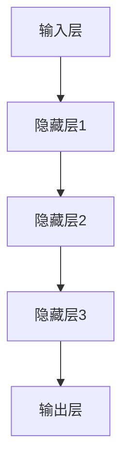
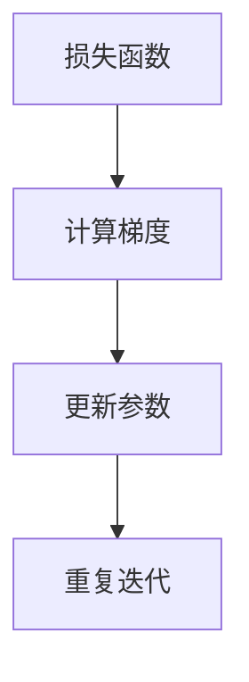
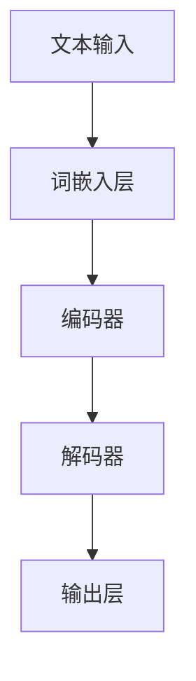
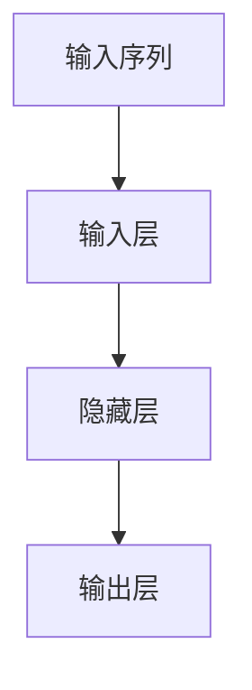
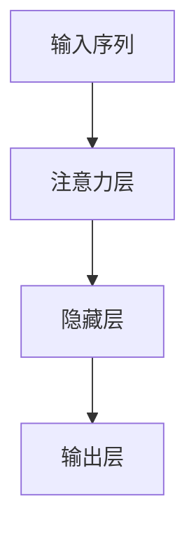
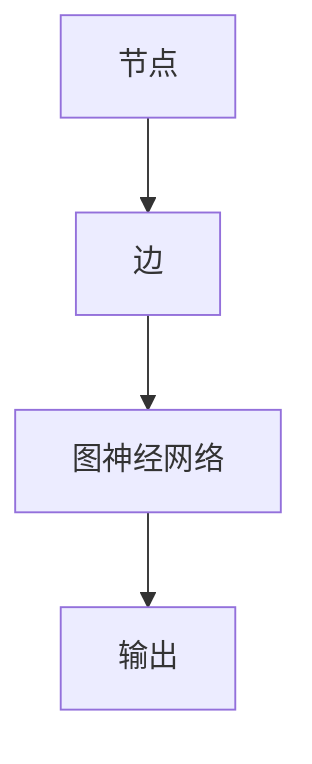
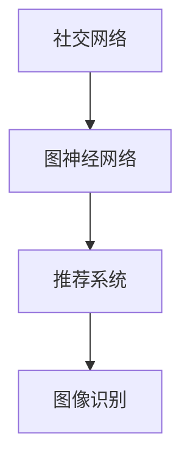
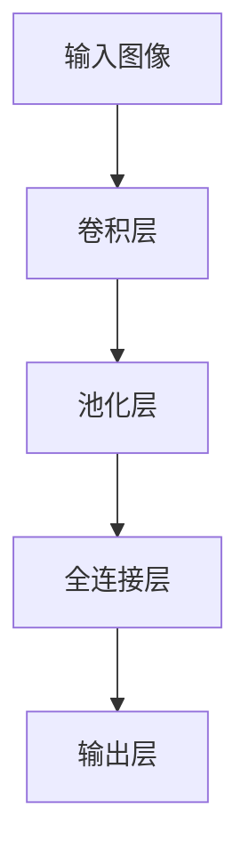
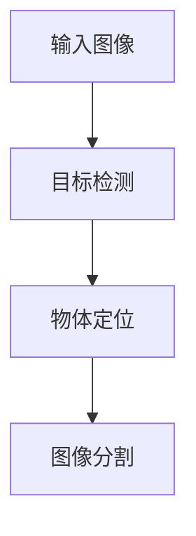

                 

### 引言

随着人工智能技术的不断发展，AI 大模型（也称为大规模神经网络模型）已经成为当前技术领域的热点。AI 大模型通过训练庞大的参数集合，能够在众多领域实现卓越的性能，如自然语言处理、计算机视觉、语音识别等。然而，与此同时，AI 大模型的创业机会也引起了广泛关注。如何在竞争激烈的市场中利用 AI 大模型的经济优势，成为许多创业者和技术专家关注的焦点。

本文旨在探讨 AI 大模型创业的经济优势，通过逐步分析 AI 大模型的基础知识、创业战略、经济效益以及政策与经济环境的影响，帮助读者全面了解 AI 大模型创业的机遇与挑战。具体而言，文章将包括以下内容：

1. **AI 大模型基础理论**：介绍 AI 大模型的基本概念、架构、算法原理及其应用场景。
2. **AI 大模型创业战略**：分析创业环境、创业机会、创业路径、团队建设、融资策略、项目实施及风险管理。
3. **AI 大模型经济效益分析**：探讨 AI 大模型的盈利模式、成本效益分析及经济效益预测。
4. **政策与经济环境对 AI 大模型创业的影响**：分析政策、经济环境和市场因素对 AI 大模型创业的影响。
5. **未来展望**：预测 AI 大模型创业的未来发展趋势及潜在的经济影响。

通过这篇文章，我们希望能够为读者提供一套系统、全面的 AI 大模型创业指南，帮助大家在激烈的竞争中找到突破口，实现成功创业。

### 文章关键词

- AI 大模型
- 创业
- 经济优势
- 盈利模式
- 成本效益
- 政策环境
- 经济环境
- 未来展望

### 文章摘要

本文探讨了 AI 大模型创业的经济优势，分析了 AI 大模型的基础理论、创业战略、经济效益以及政策与经济环境的影响。首先，介绍了 AI 大模型的基本概念、架构和算法原理，随后探讨了 AI 大模型在不同领域的应用。接着，详细阐述了 AI 大模型创业的战略规划，包括创业环境分析、创业机会挖掘、创业路径规划、团队建设、融资策略、项目实施和风险管理。进一步地，文章分析了 AI 大模型的盈利模式、成本效益和经济效益预测。最后，讨论了政策与经济环境对 AI 大模型创业的影响，并展望了 AI 大模型创业的未来发展趋势。本文旨在为创业者提供一套系统、全面的 AI 大模型创业指南，帮助他们在竞争激烈的市场中找到机遇，实现成功创业。

---

### 第一部分: AI 大模型基础知识

在探讨 AI 大模型创业的经济优势之前，我们需要对 AI 大模型有一个全面的理解。本部分将深入介绍 AI 大模型的基础理论，包括其定义、架构、核心算法原理以及实际应用场景。

#### 1.1 AI 大模型概述

AI 大模型，也被称为大规模神经网络模型，是一种具有数百万至数十亿参数的复杂神经网络模型。这些模型通过在大规模数据集上进行训练，能够自动学习数据中的特征，并在各种任务中实现卓越的性能。

**定义：** AI 大模型是一种具有大量参数和复杂结构的神经网络模型，其参数量达到数百万至数十亿级别。

**特征：**
- **大规模参数**：AI 大模型包含数十亿个参数，这使它们能够捕捉到数据中的复杂模式和关系。
- **高度非线性**：AI 大模型通过多层神经网络结构实现高度非线性变换，能够处理复杂的输入数据。
- **自学习能力**：AI 大模型通过训练过程，能够自动调整模型参数，以优化模型性能。

**应用场景：**
- **自然语言处理**：AI 大模型在自然语言处理（NLP）领域取得了显著进展，包括语言建模、机器翻译、文本分类等。
- **计算机视觉**：AI 大模型在计算机视觉领域用于图像分类、目标检测、图像生成等任务。
- **语音识别**：AI 大模型在语音识别领域用于将语音信号转换为文本，并实现语音命令的识别。

#### 1.2 大模型架构与工作原理

AI 大模型的架构通常包括输入层、隐藏层和输出层。每层由多个神经元组成，神经元之间通过权重进行连接。

**输入层**：接收外部输入数据，如文本、图像或声音。

**隐藏层**：通过多层隐藏层，神经网络能够对输入数据进行复杂的非线性变换，提取数据中的特征。

**输出层**：输出层产生模型预测，如分类结果、文本生成或图像生成。

**工作原理：**
- **前向传播**：输入数据通过输入层传递到隐藏层，然后逐层传递到输出层。
- **反向传播**：根据输出层的预测结果和实际标签，计算损失函数，并通过反向传播算法更新模型参数。
- **训练过程**：通过反复迭代前向传播和反向传播，模型参数不断优化，直至达到预定的训练目标。

#### 1.3 AI 大模型类型

根据训练方式和应用场景，AI 大模型可以分为以下几种类型：

**自监督学习**：自监督学习是一种无监督学习方法，模型从大规模数据集中学习有用的特征表示。自监督学习在自然语言处理和计算机视觉领域具有广泛应用。

**迁移学习**：迁移学习利用预训练模型在特定领域的知识，快速适应新任务。迁移学习可以显著减少新任务的训练时间和数据需求。

**对抗性学习**：对抗性学习通过对抗性训练，增强模型的鲁棒性和泛化能力。对抗性学习在图像生成、语音识别和自然语言处理等领域取得了显著进展。

#### 1.4 AI 大模型发展历程与趋势

AI 大模型的发展可以追溯到 20 世纪 80 年代的神经网络研究。随着计算能力的提升和大数据技术的发展，AI 大模型在近年来取得了突破性进展。以下是 AI 大模型的发展历程与趋势：

**发展历程：**
- **早期阶段**：神经网络最初由简单的前馈网络和反向传播算法构成，但由于计算能力和数据资源的限制，性能有限。
- **深度学习兴起**：2006 年，Hinton 等人提出深度置信网络（DBN），标志着深度学习的兴起。随后，卷积神经网络（CNN）和循环神经网络（RNN）相继提出，进一步推动了 AI 大模型的发展。
- **大规模预训练模型**：2018 年，GPT-3 的发布标志着大规模预训练模型的诞生。这些模型通过在大规模数据集上进行预训练，能够实现跨领域的通用性能。

**趋势：**
- **模型规模增长**：随着计算能力和数据资源的不断提升，AI 大模型的规模也在不断增长。未来的 AI 大模型将包含更多的参数，以更好地捕捉数据中的复杂模式。
- **模型效率提升**：为了应对模型规模增长带来的计算和存储需求，未来的 AI 大模型将更加注重模型的效率和可解释性。
- **应用场景拓展**：AI 大模型将在更多的应用场景中发挥作用，如自动驾驶、医疗诊断、智能客服等。

### 1.5 大模型核心算法原理

AI 大模型的核心算法原理主要包括深度学习、自然语言处理、图神经网络和计算机视觉等领域。

**深度学习基础：**
- **神经网络**：神经网络是深度学习的基础，由多层神经元组成，通过学习输入数据中的特征，进行非线性变换。
- **优化算法**：优化算法用于调整模型参数，以最小化损失函数。常见的优化算法包括梯度下降、随机梯度下降、Adam 等。

**自然语言处理：**
- **词嵌入**：词嵌入将词汇映射到低维向量空间，以实现文本数据的数值化。
- **序列模型**：序列模型，如循环神经网络（RNN）和长短期记忆网络（LSTM），用于处理序列数据。
- **注意力机制**：注意力机制使模型在处理序列数据时，能够自动关注关键信息。

**图神经网络：**
- **图神经网络基础**：图神经网络用于处理图结构数据，能够学习节点和边之间的复杂关系。
- **图神经网络应用**：图神经网络在社交网络分析、推荐系统和图像识别等领域具有广泛应用。

**计算机视觉基础：**
- **卷积神经网络**：卷积神经网络用于图像识别和分类，能够提取图像中的特征。
- **目标检测与分割**：目标检测与分割技术用于实现图像中的物体识别和分割。

通过上述介绍，我们可以看出，AI 大模型具有丰富的理论基础和广泛的应用场景。在接下来的章节中，我们将进一步探讨 AI 大模型在创业中的战略规划、经济效益以及政策与经济环境的影响。

---

### 第一部分: AI 大模型基础知识

#### 第1章: AI 大模型基础理论

在深入探讨 AI 大模型创业之前，我们需要先了解 AI 大模型的基本理论。这一章将详细讨论 AI 大模型的概念、架构、核心算法原理以及不同类型的 AI 大模型。

#### 1.1 AI 大模型概述

AI 大模型是一种复杂的神经网络模型，具有数百万至数十亿个参数。这些模型通过在大规模数据集上训练，可以自动学习数据中的模式和规律，从而实现各种智能任务。AI 大模型的主要特点包括：

- **参数规模巨大**：AI 大模型包含的参数数量可达数十亿，这使得它们能够捕捉到数据中的复杂关系。
- **高度非线性**：AI 大模型的架构通常包含多层神经网络，能够实现高度非线性的变换，从而提高模型的预测能力。
- **自学习能力**：AI 大模型通过训练过程，能够自动调整参数，以优化模型的性能。

AI 大模型的主要应用场景包括：

- **自然语言处理**：例如语言翻译、文本生成、情感分析等。
- **计算机视觉**：例如图像分类、目标检测、图像生成等。
- **语音识别**：例如语音到文本转换、语音合成等。

#### 1.2 大模型架构与工作原理

AI 大模型的架构通常包括输入层、隐藏层和输出层。输入层接收外部输入数据，隐藏层通过多层神经网络结构对输入数据进行复杂的非线性变换，输出层产生模型的预测结果。

**输入层**：输入层是 AI 大模型的起始层，接收各种类型的输入数据，如文本、图像或音频。

**隐藏层**：隐藏层是 AI 大模型的核心部分，通过多层结构实现数据的复杂变换。每层隐藏层都能提取不同层次的特征。

**输出层**：输出层产生模型的预测结果，如分类结果、文本生成或图像生成。

**工作原理**：

1. **前向传播**：输入数据从输入层传递到隐藏层，然后逐层传递到输出层。
2. **反向传播**：根据输出层的预测结果和实际标签，计算损失函数，并使用反向传播算法更新模型参数。
3. **训练过程**：通过反复迭代前向传播和反向传播，模型参数不断优化，直至达到预定的训练目标。

**模型训练过程**：

1. **初始化参数**：随机初始化模型参数。
2. **前向传播**：输入数据通过神经网络传递，产生预测结果。
3. **计算损失**：计算预测结果与实际标签之间的损失。
4. **反向传播**：通过反向传播算法，计算每个参数的梯度，并更新参数。
5. **迭代优化**：重复上述步骤，直至模型性能达到预定的标准。

#### 1.3 大模型核心算法原理

AI 大模型的核心算法包括深度学习、自然语言处理、图神经网络和计算机视觉等领域。

**深度学习基础**：

- **神经网络**：神经网络是深度学习的基础，由多层神经元组成，能够对输入数据进行非线性变换。
- **优化算法**：优化算法用于调整模型参数，以最小化损失函数。常用的优化算法包括梯度下降、随机梯度下降和 Adam 等。

**自然语言处理**：

- **词嵌入**：词嵌入是将词汇映射到低维向量空间，以实现文本数据的数值化。
- **序列模型**：序列模型，如循环神经网络（RNN）和长短期记忆网络（LSTM），用于处理序列数据。
- **注意力机制**：注意力机制使模型在处理序列数据时，能够自动关注关键信息。

**图神经网络**：

- **图神经网络基础**：图神经网络用于处理图结构数据，能够学习节点和边之间的复杂关系。
- **图神经网络应用**：图神经网络在社交网络分析、推荐系统和图像识别等领域具有广泛应用。

**计算机视觉基础**：

- **卷积神经网络**：卷积神经网络用于图像识别和分类，能够提取图像中的特征。
- **目标检测与分割**：目标检测与分割技术用于实现图像中的物体识别和分割。

#### 1.4 AI 大模型类型

根据训练方式和应用场景，AI 大模型可以分为以下几种类型：

- **自监督学习**：自监督学习是一种无监督学习方法，模型从大规模数据集中学习有用的特征表示。自监督学习在自然语言处理和计算机视觉领域具有广泛应用。
- **迁移学习**：迁移学习利用预训练模型在特定领域的知识，快速适应新任务。迁移学习可以显著减少新任务的训练时间和数据需求。
- **对抗性学习**：对抗性学习通过对抗性训练，增强模型的鲁棒性和泛化能力。对抗性学习在图像生成、语音识别和自然语言处理等领域取得了显著进展。

#### 1.5 AI 大模型发展历程与趋势

AI 大模型的发展历程可以分为以下几个阶段：

- **早期阶段**：神经网络最初由简单的前馈网络和反向传播算法构成，但由于计算能力和数据资源的限制，性能有限。
- **深度学习兴起**：2006 年，Hinton 等人提出深度置信网络（DBN），标志着深度学习的兴起。随后，卷积神经网络（CNN）和循环神经网络（RNN）相继提出，进一步推动了 AI 大模型的发展。
- **大规模预训练模型**：2018 年，GPT-3 的发布标志着大规模预训练模型的诞生。这些模型通过在大规模数据集上进行预训练，能够实现跨领域的通用性能。

AI 大模型的发展趋势包括：

- **模型规模增长**：随着计算能力和数据资源的不断提升，AI 大模型的规模也在不断增长。未来的 AI 大模型将包含更多的参数，以更好地捕捉数据中的复杂模式。
- **模型效率提升**：为了应对模型规模增长带来的计算和存储需求，未来的 AI 大模型将更加注重模型的效率和可解释性。
- **应用场景拓展**：AI 大模型将在更多的应用场景中发挥作用，如自动驾驶、医疗诊断、智能客服等。

### 1.6 大模型核心算法原理详解

在这一节，我们将对大模型的核心算法原理进行详细的讲解，包括深度学习、自然语言处理、图神经网络和计算机视觉等领域的算法原理。

#### 1.6.1 深度学习基础

**神经网络：** 神经网络是由大量神经元组成的计算模型，模仿了人脑的结构和工作方式。每个神经元接收多个输入，通过加权求和处理后，产生一个输出。神经网络的每一层都能提取不同级别的特征，从原始输入到最终输出，形成一个层次化的特征提取过程。



**优化算法：** 深度学习模型训练的核心是优化算法，用于调整模型参数以最小化损失函数。常见的优化算法有：

- **梯度下降（Gradient Descent）：** 最简单的优化算法，通过计算损失函数关于模型参数的梯度，并沿着梯度的反方向更新参数。
- **随机梯度下降（Stochastic Gradient Descent，SGD）：** 在梯度下降的基础上，每次更新参数时只随机选择一部分样本，以加快收敛速度。
- **Adam：** 结合了梯度下降和动量法的优点，自适应调整学习率。



#### 1.6.2 自然语言处理

**词嵌入：** 词嵌入是将词汇映射到低维向量空间，以实现文本数据的数值化。常见的词嵌入方法有：

- **Word2Vec：** 使用神经网络训练词向量，通过上下文信息学习词汇的语义关系。
- **BERT：** 利用双向编码表示器（Bidirectional Encoder Representations from Transformers），通过预训练大规模文本数据，学习词的上下文信息。



**序列模型：** 序列模型用于处理时间序列数据，如文本和语音。常见的序列模型有：

- **循环神经网络（RNN）：** 通过循环结构，使得模型能够记住先前的输入信息。
- **长短期记忆网络（LSTM）：** LSTM 通过门机制，解决了 RNN 的梯度消失问题。



**注意力机制：** 注意力机制使模型在处理序列数据时，能够自动关注关键信息，提高模型的预测能力。



#### 1.6.3 图神经网络

**图神经网络基础：** 图神经网络用于处理图结构数据，如社交网络和知识图谱。图神经网络通过学习节点和边之间的复杂关系，实现图数据的表示和推理。



**图神经网络应用：** 图神经网络在社交网络分析、推荐系统和图像识别等领域具有广泛应用。



#### 1.6.4 计算机视觉基础

**卷积神经网络（CNN）：** 卷积神经网络用于图像识别和分类，通过卷积层、池化层和全连接层，提取图像特征并进行分类。



**目标检测与分割：** 目标检测和分割是计算机视觉的重要任务，用于识别图像中的物体并进行定位。



通过上述对大模型核心算法原理的详细讲解，我们可以看到，AI 大模型的强大在于其能够通过复杂的神经网络结构和先进的优化算法，从大量数据中学习到丰富的特征，并在各种应用场景中实现卓越的性能。

---

### 第一部分: AI 大模型基础知识

#### 第2章: 大模型核心算法原理

在深入理解了 AI 大模型的基础理论后，我们将进一步探讨其核心算法原理。这一章将详细解释深度学习、自然语言处理、图神经网络和计算机视觉等核心算法原理，并展示相关的伪代码和数学模型。

#### 2.1 深度学习基础

**神经网络（Neural Networks）：** 神经网络是深度学习的基础，由多个神经元（或称为节点）组成。每个神经元接收多个输入，通过加权求和处理后，产生一个输出。神经网络的每一层都能提取不同级别的特征。

**伪代码：**
```python
# 定义神经元结构
class Neuron:
    def __init__(self, inputs):
        self.inputs = inputs
        self.weights = np.random.rand(len(inputs))
        self.bias = np.random.rand()
        self.output = 0

    def activate(self):
        self.output = np.dot(self.inputs, self.weights) + self.bias
        if self.output >= 0:
            return 1
        else:
            return 0

# 创建神经网络
neurons = [Neuron(inputs) for inputs in data]

# 前向传播
for neuron in neurons:
    neuron.activate()
```

**数学模型：**
$$
\text{Output} = \sigma(\sum_{i=1}^{n} x_i w_i + b)
$$
其中，\( \sigma \) 是激活函数，通常使用 sigmoid 函数或 ReLU 函数。

**举例说明：**
假设我们有三个输入 \( x_1, x_2, x_3 \)，对应的权重分别为 \( w_1, w_2, w_3 \)，偏置为 \( b \)，则：
$$
\text{Output} = \sigma(w_1 x_1 + w_2 x_2 + w_3 x_3 + b)
$$

#### 2.2 自然语言处理

**词嵌入（Word Embeddings）：** 词嵌入是将词汇映射到低维向量空间，以实现文本数据的数值化。常见的词嵌入方法包括 Word2Vec 和 BERT。

**伪代码：**
```python
# Word2Vec
from gensim.models import Word2Vec

# 训练词嵌入模型
model = Word2Vec(sentences, size=100, window=5, min_count=1, workers=4)

# 获取词向量
word_vector = model.wv['hello']
```

**数学模型：**
$$
\text{Word Vector} = \text{Word2Vec}(x)
$$
其中，\( \text{Word2Vec} \) 是一个函数，将输入的词汇映射到低维向量空间。

**举例说明：**
假设我们有一个词汇 "hello"，通过 Word2Vec 模型映射到一个 100 维的向量空间，则：
$$
\text{hello vector} = \text{Word2Vec}('hello')
$$

#### 2.3 图神经网络

**图神经网络（Graph Neural Networks, GNN）：** 图神经网络用于处理图结构数据，如社交网络和知识图谱。GNN 通过学习节点和边之间的复杂关系，实现图数据的表示和推理。

**伪代码：**
```python
# 定义图神经网络
class GraphNeuralNetwork:
    def __init__(self, num_nodes, hidden_size):
        self.num_nodes = num_nodes
        self.hidden_size = hidden_size
        self.weights = np.random.rand(num_nodes, hidden_size)
        
    def forward(self, node_features):
        node_embeddings = np.dot(node_features, self.weights)
        return node_embeddings

# 创建 GNN 模型
gnn = GraphNeuralNetwork(num_nodes=100, hidden_size=10)

# 前向传播
node_embeddings = gnn.forward(node_features)
```

**数学模型：**
$$
\text{Node Embedding} = \text{GNN}(\text{Node Feature})
$$
其中，\( \text{GNN} \) 是一个函数，将节点的特征映射到低维向量空间。

**举例说明：**
假设我们有一个图结构，包含 100 个节点，每个节点有一个特征向量，通过 GNN 模型映射到一个 10 维的向量空间，则：
$$
\text{Node Embedding} = \text{GNN}(\text{Node Feature})
$$

#### 2.4 计算机视觉

**卷积神经网络（Convolutional Neural Networks, CNN）：** 卷积神经网络用于图像识别和分类，通过卷积层、池化层和全连接层，提取图像特征并进行分类。

**伪代码：**
```python
# 定义卷积神经网络
class ConvolutionalNeuralNetwork:
    def __init__(self):
        self.conv1 = Conv2D(32, (3, 3), activation='relu')
        self.pool1 = MaxPooling2D((2, 2))
        self.conv2 = Conv2D(64, (3, 3), activation='relu')
        self.pool2 = MaxPooling2D((2, 2))
        self.flatten = Flatten()
        self.dense1 = Dense(128, activation='relu')
        self.dense2 = Dense(10, activation='softmax')
        
    def forward(self, image):
        x = self.conv1(image)
        x = self.pool1(x)
        x = self.conv2(x)
        x = self.pool2(x)
        x = self.flatten(x)
        x = self.dense1(x)
        x = self.dense2(x)
        return x

# 创建 CNN 模型
cnn = ConvolutionalNeuralNetwork()

# 前向传播
output = cnn.forward(image)
```

**数学模型：**
$$
\text{Output} = \text{CNN}(\text{Image})
$$
其中，\( \text{CNN} \) 是一个函数，将图像映射到分类结果。

**举例说明：**
假设我们有一个图像，通过 CNN 模型进行图像分类，则：
$$
\text{Output} = \text{CNN}(\text{Image})
$$

通过上述对大模型核心算法原理的详细讲解，我们可以看到，深度学习、自然语言处理、图神经网络和计算机视觉等核心算法原理为 AI 大模型的应用提供了强大的基础。这些算法不仅能够从大量数据中学习到丰富的特征，还能够实现高效的数据处理和复杂任务的学习。

---

### 第一部分: AI 大模型基础知识

#### 第3章: AI 大模型实践应用

在前两章中，我们详细介绍了 AI 大模型的基础理论和核心算法原理。然而，理论与实践之间的桥梁是实践应用。本章将深入探讨 AI 大模型在不同领域的实际应用，包括生成式模型、分类模型和回归模型。

#### 3.1 生成式模型应用

生成式模型是一种能够生成新数据的模型，广泛应用于图像生成、文本生成等领域。生成式模型的核心思想是学习数据的概率分布，从而生成与训练数据相似的新数据。

**图像生成：** 生成对抗网络（GAN）是图像生成领域的代表性模型。GAN 由生成器和判别器组成，生成器尝试生成逼真的图像，而判别器则试图区分生成图像和真实图像。通过两者之间的对抗训练，生成器逐渐生成越来越逼真的图像。

**伪代码：**
```python
# GAN 生成器
def generator(z):
    # 输入随机噪声 z，生成图像
    x_gz2 = tf.layers.dense(z, units=1024)
    x_gz2 = tf.layers.dropout(x_gz2, rate=0.3)
    x_gz2 = tf.layers.dense(x_gz2, units=784)
    x_gz2 = tf.nn.tanh(x_gz2)
    return x_gz2

# GAN 判别器
def discriminator(x):
    # 输入图像，判断其是否真实
    x_d = tf.layers.dense(x, units=1024)
    x_d = tf.layers.dropout(x_d, rate=0.3)
    x_d = tf.layers.dense(x_d, units=1)
    return x_d
```

**数学模型：**
$$
\text{Generator} : z \rightarrow x_g \\
\text{Discriminator} : x \rightarrow D(x)
$$
其中，\( z \) 是随机噪声，\( x_g \) 是生成的图像，\( D(x) \) 是判别器的输出，表示图像的真实性概率。

**举例说明：**
假设我们有一个生成器和判别器组成的 GAN 模型，通过对抗训练生成一张新的图像，则：
$$
x_g = \text{Generator}(z) \\
D(x_g) = \text{Discriminator}(x_g)
$$

**图像生成案例：** 生成对抗网络（GAN）在图像生成领域取得了显著成果。例如，GAN 可以生成逼真的人脸图像、艺术画作和动漫角色等。

**文本生成：** 生成式模型在文本生成领域也有广泛应用，如生成故事、文章和对话等。Transformer 模型是文本生成领域的代表性模型。

**伪代码：**
```python
# Transformer 模型
class Transformer:
    def __init__(self, d_model, num_heads, dff, input_vocab_size, target_vocab_size, position_encoding_input, position_encoding_target, pe_input, pe_target):
        # 初始化 Transformer 模型参数
        self.embedding = Embedding(input_vocab_size, d_model)
        self.position_encoding_input = positional_encoding(input_vocab_size, d_model, pe_input)
        self.position_encoding_target = positional_encoding(target_vocab_size, d_model, pe_target)
        self.encoder = Encoder(d_model, num_heads, dff)
        self.decoder = Decoder(d_model, num_heads, dff)
        self.final_layer = Embedding(target_vocab_size, d_model)

    def call(self, inputs, targets, training):
        # 前向传播
        x = self.embedding(inputs) + self.position_encoding_input(inputs)
        x = self.encoder(x, training)
        x = self.decoder(x, training)
        x = self.final_layer(x)
        return x
```

**数学模型：**
$$
\text{Transformer} : x, y \rightarrow z
$$
其中，\( x \) 是输入序列，\( y \) 是目标序列，\( z \) 是生成的文本序列。

**举例说明：**
假设我们有一个 Transformer 模型，输入一段文本并生成新的文本，则：
$$
z = \text{Transformer}(x, y)
$$

**文本生成案例：** Transformer 模型在文本生成领域取得了显著成果。例如，生成高质量的新闻文章、对话和诗歌等。

#### 3.2 分类模型应用

分类模型是一种将输入数据映射到特定类别的模型，广泛应用于语音识别、趋势预测等领域。

**语音识别：** 语音识别是将语音信号转换为文本的模型。通过分类模型，将音频信号中的语音帧映射到对应的文字。

**伪代码：**
```python
# 卷积神经网络语音识别模型
class ConvolutionalNeuralNetwork:
    def __init__(self):
        self.conv1 = Conv2D(32, (3, 3), activation='relu')
        self.pool1 = MaxPooling2D((2, 2))
        self.conv2 = Conv2D(64, (3, 3), activation='relu')
        self.pool2 = MaxPooling2D((2, 2))
        self.flatten = Flatten()
        self.dense1 = Dense(128, activation='relu')
        self.dense2 = Dense(num_classes, activation='softmax')

    def call(self, inputs):
        x = self.conv1(inputs)
        x = self.pool1(x)
        x = self.conv2(x)
        x = self.pool2(x)
        x = self.flatten(x)
        x = self.dense1(x)
        x = self.dense2(x)
        return x
```

**数学模型：**
$$
\text{Output} = \text{CNN}(\text{Audio Signal})
$$
其中，\( \text{Audio Signal} \) 是输入的语音信号。

**举例说明：**
假设我们有一个卷积神经网络语音识别模型，输入一段音频并输出对应的文本，则：
$$
\text{Output} = \text{CNN}(\text{Audio Signal})
$$

**语音识别案例：** 卷积神经网络（CNN）在语音识别领域取得了显著成果。例如，实现高质量的语音识别系统，如 Siri、Google Assistant 等。

**趋势预测：** 分类模型在趋势预测领域也有广泛应用。通过分类模型，预测未来的市场趋势、天气变化等。

**伪代码：**
```python
# 多层感知机趋势预测模型
class MultilayerPerceptron:
    def __init__(self, input_size, hidden_size, output_size):
        self.dense1 = Dense(hidden_size, activation='relu')
        self.dense2 = Dense(output_size, activation='sigmoid')

    def call(self, inputs):
        x = self.dense1(inputs)
        x = self.dense2(x)
        return x
```

**数学模型：**
$$
\text{Output} = \text{MLP}(\text{Input})
$$
其中，\( \text{Input} \) 是输入的特征向量。

**举例说明：**
假设我们有一个多层感知机（MLP）趋势预测模型，输入一组历史数据并预测未来的趋势，则：
$$
\text{Output} = \text{MLP}(\text{Input})
$$

**趋势预测案例：** 多层感知机（MLP）在趋势预测领域取得了显著成果。例如，预测股票市场趋势、天气变化等。

#### 3.3 回归模型应用

回归模型是一种将输入数据映射到连续值的模型，广泛应用于个性化推荐、情感分析等领域。

**个性化推荐：** 个性化推荐系统通过回归模型，为用户推荐感兴趣的内容。通过预测用户对内容的偏好，实现个性化推荐。

**伪代码：**
```python
# 基于内容的推荐模型
class ContentBasedModel:
    def __init__(self, input_size, hidden_size, output_size):
        self.dense1 = Dense(hidden_size, activation='relu')
        self.dense2 = Dense(output_size, activation='sigmoid')

    def call(self, inputs):
        x = self.dense1(inputs)
        x = self.dense2(x)
        return x
```

**数学模型：**
$$
\text{Output} = \text{ContentBasedModel}(\text{User Features})
$$
其中，\( \text{User Features} \) 是用户的特征向量。

**举例说明：**
假设我们有一个基于内容的推荐模型，输入用户的特征并预测用户对商品的偏好，则：
$$
\text{Output} = \text{ContentBasedModel}(\text{User Features})
$$

**情感分析：** 情感分析通过回归模型，分析文本中的情感倾向。通过预测文本的情感极性，实现情感分析。

**伪代码：**
```python
# 情感分析模型
class SentimentAnalysisModel:
    def __init__(self, input_size, hidden_size, output_size):
        self.embedding = Embedding(input_vocab_size, input_size)
        self.conv1 = Conv1D(64, 5, activation='relu')
        self.flatten = Flatten()
        self.dense1 = Dense(hidden_size, activation='relu')
        self.dense2 = Dense(output_size, activation='sigmoid')

    def call(self, inputs):
        x = self.embedding(inputs)
        x = self.conv1(x)
        x = self.flatten(x)
        x = self.dense1(x)
        x = self.dense2(x)
        return x
```

**数学模型：**
$$
\text{Output} = \text{SentimentAnalysisModel}(\text{Text})
$$
其中，\( \text{Text} \) 是输入的文本。

**举例说明：**
假设我们有一个情感分析模型，输入一段文本并预测文本的情感极性，则：
$$
\text{Output} = \text{SentimentAnalysisModel}(\text{Text})
$$

**情感分析案例：** 情感分析模型在社交媒体分析、客户反馈分析等领域取得了显著成果。例如，分析用户对产品或服务的情感倾向，帮助企业改进产品和服务。

通过本章的讨论，我们可以看到，AI 大模型在生成式模型、分类模型和回归模型中的应用取得了显著的成果。这些模型在图像生成、文本生成、语音识别、趋势预测、个性化推荐和情感分析等领域发挥了重要作用，为人工智能的应用提供了强大的支持。

---

### 第一部分: AI 大模型基础知识

#### 第4章: AI 大模型创业战略

在了解了 AI 大模型的基础知识及其应用后，接下来我们将探讨如何利用这些知识进行创业。本章将详细分析 AI 大模型创业的战略，包括创业环境分析、创业机会挖掘、创业路径规划、团队建设、融资策略、项目实施和风险管理。

#### 4.1 创业环境分析

创业环境分析是制定 AI 大模型创业战略的第一步，它涉及到市场、技术、政策和法律等多个方面。以下是对创业环境的详细分析：

**市场环境：** AI 大模型市场正处于快速增长期，随着大数据和云计算技术的普及，越来越多的企业和机构开始意识到 AI 大模型的价值。市场需求的增长为 AI 大模型创业提供了广阔的空间。同时，随着人工智能技术的进步，AI 大模型的应用场景也在不断扩展，包括自然语言处理、计算机视觉、语音识别、医疗诊断、金融分析等。创业者需要密切关注市场动态，抓住市场机遇。

**技术环境：** AI 大模型的发展离不开深度学习、自然语言处理、计算机视觉等前沿技术的支持。随着深度学习算法的不断优化和计算能力的提升，AI 大模型的性能也在不断提高。创业者需要具备深厚的专业知识，了解最新的技术趋势，以便在创业过程中保持竞争力。

**政策环境：** 各国政府对人工智能技术的支持政策对创业环境有着重要影响。政策鼓励创新、提供资金支持、降低创业门槛等，都有助于促进 AI 大模型的创业发展。创业者需要了解相关政策，充分利用政策优势，降低创业风险。

**法律环境：** 法律环境是创业的重要保障。创业者需要关注数据保护、隐私保护、知识产权保护等法律法规，确保创业项目的合规性。同时，创业者也需要了解商业秘密保护、合同法律等知识，以保护自己的商业利益。

**竞争环境：** AI 大模型创业面临着激烈的竞争。国内外巨头企业、初创公司都在这个领域展开激烈的竞争。创业者需要明确自己的定位，寻找市场细分领域，打造独特的竞争优势。

**经济环境：** 经济环境的稳定和繁荣对创业活动有着重要影响。创业者需要关注宏观经济形势、投资环境、人才流动等因素，以便制定合理的创业策略。

**社会环境：** 社会对 AI 大模型的态度和接受程度也会影响创业环境。随着 AI 技术的不断进步，社会对 AI 大模型的应用也越来越广泛。创业者需要关注社会趋势，了解公众对 AI 大模型的态度，以便更好地推广自己的产品和服务。

**创新环境：** 创新是创业的核心驱动力。创业者需要具备创新思维，不断探索新的技术、应用场景和商业模式，以适应不断变化的市场需求。

**生态系统：** 创业生态系统包括企业、科研机构、投资者、政策制定者等多个参与者。一个良好的创业生态系统可以提供丰富的资源和支持，帮助创业者更好地发展。创业者需要积极参与创业生态系统，建立合作关系，共享资源，共同推动 AI 大模型创业的发展。

#### 4.2 创业机会挖掘

在了解了创业环境后，创业者需要进一步挖掘 AI 大模型领域的创业机会。以下是一些常见的创业机会：

**新应用场景：** AI 大模型在多个领域都有广泛的应用，包括金融、医疗、教育、零售、制造业等。创业者可以挖掘这些领域的应用场景，开发新的产品和服务。

**数据驱动的决策：** AI 大模型可以通过数据分析，帮助企业做出更加精准的决策。创业者可以开发基于 AI 大模型的数据分析工具，提供数据驱动的决策支持。

**个性化推荐：** 个性化推荐是 AI 大模型在零售、娱乐、教育等领域的应用之一。创业者可以开发个性化的推荐系统，为用户提供更加个性化的服务。

**自动化处理：** AI 大模型可以用于自动化处理各种任务，如文本处理、图像处理、语音处理等。创业者可以开发自动化处理工具，提高工作效率。

**智能诊断：** AI 大模型在医疗领域有广泛的应用，如疾病诊断、药物研发等。创业者可以开发智能诊断系统，提高医疗诊断的准确性和效率。

**智能客服：** AI 大模型可以用于智能客服系统，提供高效的客户服务。创业者可以开发智能客服系统，提高客户满意度。

**网络安全：** AI 大模型可以用于网络安全领域，如恶意软件检测、网络攻击预测等。创业者可以开发基于 AI 大模型的网络安全产品，提高网络安全防护能力。

**智能家居：** AI 大模型在智能家居领域的应用日益广泛，如智能音箱、智能门锁等。创业者可以开发智能家居产品，提高家居生活的便利性。

**自动驾驶：** AI 大模型在自动驾驶领域有重要的应用，如车辆检测、环境感知等。创业者可以开发自动驾驶系统，推动自动驾驶技术的发展。

**机器人：** AI 大模型可以用于机器人技术，如服务机器人、工业机器人等。创业者可以开发基于 AI 大模型的机器人，提高生产效率。

**虚拟现实与增强现实：** AI 大模型在虚拟现实和增强现实领域有广泛的应用，如场景生成、交互体验等。创业者可以开发虚拟现实和增强现实产品，提供全新的交互体验。

**内容生成：** AI 大模型可以用于内容生成，如文章、音乐、视频等。创业者可以开发内容生成平台，降低内容创作成本。

**数据治理：** AI 大模型可以用于数据治理，如数据清洗、数据标注等。创业者可以开发数据治理工具，提高数据处理效率。

**AI 管理系统：** AI 大模型可以用于企业管理，如人力资源、财务、供应链等。创业者可以开发 AI 管理系统，提高企业管理效率。

**跨领域应用：** AI 大模型可以跨领域应用，如将医疗领域的 AI 大模型应用于金融领域，为金融机构提供风险预测和决策支持。创业者可以探索跨领域应用，提供综合解决方案。

#### 4.3 创业路径规划

在挖掘到创业机会后，创业者需要制定详细的创业路径规划，确保创业项目的顺利实施。以下是一些关键的步骤：

**确定创业方向：** 根据市场分析和个人兴趣，确定创业的具体方向。可以选择一个有前景的应用领域，开发具有创新性和实用性的产品或服务。

**市场调研：** 对确定的目标市场进行深入调研，了解市场需求、竞争态势、用户痛点等。市场调研可以提供宝贵的创业信息，帮助创业者做出明智的决策。

**制定商业计划：** 基于市场调研的结果，制定详细的商业计划，包括产品定位、目标市场、营销策略、运营模式、财务预测等。商业计划是创业的重要指南，可以帮助创业者明确目标和方向。

**技术准备：** 根据商业计划，进行技术准备。包括研发团队的建设、技术方案的确定、开发工具和框架的选择等。技术准备是创业成功的关键，创业者需要确保技术方案的可行性和竞争力。

**产品开发：** 开始产品开发，根据商业计划和技术方案，实现产品的功能和性能。产品开发需要经历多个阶段，如需求分析、设计、开发、测试等。

**市场推广：** 产品开发完成后，进行市场推广。包括品牌建设、营销策略的制定、市场渠道的开拓等。市场推广是产品成功的关键，创业者需要通过各种手段提高产品的知名度和市场占有率。

**运营管理：** 进行日常运营管理，包括人员管理、财务管理、供应链管理、客户服务等。运营管理是保证企业稳定发展的重要环节，创业者需要注重运营效率和管理水平。

**持续优化：** 在运营过程中，不断收集用户反馈，对产品进行优化和迭代。持续优化是产品成功的关键，创业者需要关注用户需求，及时调整产品策略。

**风险控制：** 在创业过程中，风险控制至关重要。创业者需要识别潜在风险，制定相应的风险管理策略，确保企业的稳健发展。

通过上述创业路径规划，创业者可以系统地推进创业项目，逐步实现创业目标。

#### 4.4 团队建设

团队建设是创业成功的关键因素之一。一个优秀的团队可以发挥成员的协同作用，共同应对创业挑战。以下是一些团队建设的要点：

**确定团队结构：** 根据创业项目的需求和规模，确定团队的架构和人员配置。团队可以包括技术团队、市场团队、运营团队、财务团队等。

**选拔合适的人才：** 招聘具有专业技能和经验的人才，确保团队具备所需的能力。同时，注重人才的多样性和团队合作精神，打造一个有战斗力的团队。

**制定团队目标：** 明确团队的目标和愿景，确保团队成员共同朝着同一个方向努力。团队目标可以分解为短期目标和长期目标，以便团队成员有清晰的奋斗方向。

**建立团队文化：** 建立积极向上的团队文化，鼓励团队成员之间的沟通与合作。团队文化可以包括价值观、行为准则、激励制度等。

**团队管理：** 实施有效的团队管理，包括团队沟通、任务分配、绩效评估等。管理者需要关注团队成员的反馈和建议，及时解决问题，提高团队效率。

**培训与发展：** 为团队成员提供培训和发展机会，提高他们的专业技能和综合素质。培训与发展可以包括技术培训、管理培训、领导力培训等。

**激励机制：** 建立激励机制，激励团队成员的积极性和创造力。激励机制可以包括薪酬奖励、晋升机会、荣誉表彰等。

通过以上团队建设要点，创业者可以打造一个高效、和谐的团队，为创业项目的成功奠定基础。

#### 4.5 融资策略

融资策略是创业过程中至关重要的一环。创业者需要根据项目的实际需求和市场环境，选择合适的融资方式，确保项目资金充足。以下是一些常见的融资策略：

**天使投资：** 天使投资是一种早期的风险投资，通常由个人投资者提供资金。天使投资可以提供创业初期的资金支持，帮助创业者完成产品开发和市场推广。

**风险投资：** 风险投资是一种长期投资，通常由专业的风险投资公司提供资金。风险投资可以提供大规模的资金支持，助力创业项目的快速成长。

**股权融资：** 股权融资是通过出售公司股份来获得资金。股权融资可以引入战略投资者，为创业项目带来资源和经验。

**债务融资：** 债务融资是通过借款来获得资金。债务融资通常包括银行贷款、债券发行等。债务融资可以提供稳定的资金来源，但需要注意还款风险。

**政府资助：** 各国政府为了支持创新创业，提供各种形式的政府资助，如创业补贴、科技创新基金等。创业者可以积极申请政府资助，以降低创业成本。

**众筹融资：** 众筹融资是一种通过互联网平台向公众融资的方式。众筹融资可以吸引大量投资者的关注，提高创业项目的知名度。

**内部融资：** 创业者可以利用个人资金、企业利润等内部资源进行融资。内部融资可以降低融资成本，但需要注意资金使用的合理性和效率。

**混合融资：** 创业者可以根据项目的需求，结合多种融资方式，实现多元化融资。混合融资可以提高融资的灵活性和稳定性。

在制定融资策略时，创业者需要考虑以下因素：

- **资金需求：** 根据创业项目的规模和发展阶段，确定所需的资金额度。
- **资金用途：** 明确资金的用途，如产品开发、市场推广、团队建设等。
- **还款能力：** 评估创业项目的盈利能力和还款能力，确保能够按时还款。
- **风险承受能力：** 根据创业者的风险承受能力，选择合适的融资方式。
- **市场环境：** 关注市场环境变化，抓住市场机遇，提高融资成功率。

通过以上融资策略和考虑因素，创业者可以制定一套合理的融资计划，为创业项目的顺利推进提供资金保障。

#### 4.6 项目实施

项目实施是创业过程中的关键环节，它决定了创业项目是否能够按计划顺利推进。以下是一些项目实施的关键步骤：

**项目规划：** 项目规划是项目实施的基础，包括项目目标、任务分解、时间表、资源需求等。创业者需要制定详细的项目规划，确保项目实施有明确的方向和目标。

**任务分配：** 根据项目规划，将任务分配给团队成员。任务分配要考虑到团队成员的专业技能和经验，确保任务的完成质量。

**项目管理工具：** 使用项目管理工具，如项目管理软件、甘特图等，对项目进度进行跟踪和管理。项目管理工具可以帮助创业者及时掌握项目进展，调整计划和资源分配。

**团队协作：** 团队协作是项目成功的关键，创业者需要建立良好的团队协作机制，鼓励团队成员之间的沟通和合作。团队协作可以提高工作效率，减少沟通成本，确保项目按时完成。

**风险管理：** 项目实施过程中难免会遇到各种风险，如技术风险、市场风险、资金风险等。创业者需要识别潜在风险，制定相应的风险管理策略，确保项目的稳健推进。

**质量保证：** 在项目实施过程中，创业者需要关注产品质量，确保项目按照预定标准完成。质量保证可以通过严格的质量控制、测试和反馈机制实现。

**项目监控：** 项目监控是项目实施的重要环节，创业者需要定期检查项目进度，确保项目按照计划推进。项目监控可以帮助创业者及时发现问题，采取措施进行调整。

**进度报告：** 定期向相关利益相关者报告项目进度，包括团队成员、投资者、合作伙伴等。进度报告可以帮助利益相关者了解项目进展，提供必要的支持和资源。

**变更管理：** 在项目实施过程中，可能会遇到计划变更的情况，如需求变更、资源变更等。创业者需要建立变更管理机制，确保变更的合理性和可控性。

通过以上项目实施的关键步骤，创业者可以确保项目按照预定计划顺利推进，提高项目成功率。

#### 4.7 创业风险管理

创业过程中充满了不确定性和风险，有效的风险管理是创业成功的关键。以下是一些创业风险管理的方法和策略：

**风险识别：** 创业者需要识别项目中的潜在风险，包括技术风险、市场风险、财务风险、运营风险等。风险识别可以通过项目评审、风险评估工具等方法实现。

**风险评估：** 对识别出的风险进行评估，确定风险的影响程度和发生的可能性。风险评估可以帮助创业者了解风险的重要性，为风险管理的优先级排序提供依据。

**风险应对策略：** 根据风险评估的结果，制定相应的风险应对策略。常见的风险应对策略包括风险规避、风险转移、风险接受和风险减轻等。

**风险监控：** 在项目实施过程中，持续监控风险的变化，及时调整风险应对策略。风险监控可以通过定期风险评估、风险报告等方式实现。

**风险管理团队：** 建立风险管理团队，负责风险管理的具体实施。风险管理团队应由具有相关经验和专业知识的人员组成，确保风险管理的有效性和专业性。

**风险转移：** 通过保险、外包、合作等方式，将部分风险转移给其他方。风险转移可以降低创业项目的整体风险，但需要注意风险转移的成本和效果。

**应急计划：** 制定应急计划，以应对可能发生的突发事件。应急计划应包括应急响应流程、应急资源调配、应急通信等。

**风险教育与培训：** 对团队成员进行风险教育和培训，提高他们的风险意识和应对能力。风险教育与培训可以帮助团队成员更好地应对风险，降低风险发生的概率。

**持续改进：** 风险管理是一个持续的过程，创业者需要不断总结经验，改进风险管理策略和方法。通过持续改进，可以提高风险管理的效率和效果。

通过以上风险管理的方法和策略，创业者可以有效地降低创业风险，提高项目成功的可能性。

---

### 第一部分: AI 大模型基础知识

#### 第5章: 大模型核心算法原理详解

在前面的章节中，我们简要介绍了 AI 大模型的核心算法原理，包括深度学习、自然语言处理、图神经网络和计算机视觉等。在本章中，我们将进一步详细探讨这些算法的原理，通过伪代码和数学模型来加深理解。

#### 5.1 深度学习基础

**神经网络：** 神经网络是一种通过模拟人脑神经元工作原理的计算模型。它由多个神经元（或节点）组成，每个神经元接收多个输入，通过加权求和处理，产生一个输出。

**伪代码：**
```python
# 定义神经元
class Neuron:
    def __init__(self, weights, bias):
        self.weights = weights
        self.bias = bias
    
    def activate(self, inputs):
        output = np.dot(inputs, self.weights) + self.bias
        return 1 if output > 0 else 0

# 定义多层神经网络
class NeuralNetwork:
    def __init__(self):
        self.layers = [Neuron(np.random.rand(input_size, hidden_size), np.random.rand(hidden_size))]
        self.output_layer = Neuron(np.random.rand(hidden_size, output_size), np.random.rand(output_size))
    
    def forward(self, inputs):
        for layer in self.layers:
            inputs = layer.activate(inputs)
        output = self.output_layer.activate(inputs)
        return output
```

**数学模型：**
$$
\text{Output} = \sigma(\text{Weighted Sum of Inputs} + \text{Bias})
$$
其中，\( \sigma \) 是激活函数，如 sigmoid 或 ReLU。

**举例说明：**
假设一个输入 \( x \) 经过一层神经网络，权重为 \( w \)，偏置为 \( b \)，则：
$$
\text{Output} = \sigma(w^T x + b)
$$

#### 5.2 自然语言处理

**词嵌入：** 词嵌入是将词汇映射到低维向量空间的过程，以便神经网络处理。常见的词嵌入方法包括 Word2Vec 和 GloVe。

**伪代码：**
```python
# Word2Vec 词嵌入
from gensim.models import Word2Vec

model = Word2Vec(sentences, size=100, window=5, min_count=1, workers=4)

# 获取词向量
word_vector = model.wv['hello']
```

**数学模型：**
$$
\text{Word Vector} = \text{Embedding}(\text{Word})
$$
其中，\( \text{Embedding} \) 是一个函数，将词汇映射到低维向量空间。

**举例说明：**
假设词汇 "hello" 的词向量是 \( \text{Embedding}('hello') \)，则：
$$
\text{hello vector} = \text{Embedding}('hello')
$$

#### 5.3 序列模型

**循环神经网络（RNN）：** RNN 是一种处理序列数据的神经网络，能够记忆先前的输入信息。

**伪代码：**
```python
# RNN 单元
class RNNCell:
    def __init__(self, input_size, hidden_size):
        self.input_size = input_size
        self.hidden_size = hidden_size
        self.weights = np.random.rand(input_size + hidden_size, hidden_size)
    
    def activate(self, input, hidden):
        input_and_hidden = np.hstack((input, hidden))
        output = np.dot(input_and_hidden, self.weights)
        return output
    
# RNN 模型
class RNN:
    def __init__(self, input_size, hidden_size, output_size):
        self.rnn_cell = RNNCell(input_size, hidden_size)
        self.output_layer = Neuron(np.random.rand(hidden_size, output_size), np.random.rand(output_size))
    
    def forward(self, inputs):
        hidden = np.zeros((batch_size, hidden_size))
        outputs = []
        for input in inputs:
            hidden = self.rnn_cell.activate(input, hidden)
            output = self.output_layer.activate(hidden)
            outputs.append(output)
        return outputs
```

**数学模型：**
$$
\text{Hidden State}^{t} = \text{RNN}^{t}(\text{Input}^{t}, \text{Hidden State}^{t-1})
$$
其中，\( \text{RNN}^{t} \) 是 RNN 在时间 \( t \) 的激活函数。

**举例说明：**
假设一个序列输入 \( \text{Input}^{1}, \text{Input}^{2}, \ldots, \text{Input}^{T} \)，隐藏状态为 \( \text{Hidden State}^{1}, \text{Hidden State}^{2}, \ldots, \text{Hidden State}^{T} \)，则：
$$
\text{Hidden State}^{t} = \text{RNN}^{t}(\text{Input}^{t}, \text{Hidden State}^{t-1})
$$

#### 5.4 长短期记忆网络（LSTM）

**LSTM：** LSTM 是 RNN 的改进版本，能够解决 RNN 的梯度消失和梯度爆炸问题，适用于处理长序列数据。

**伪代码：**
```python
# LSTM 单元
class LSTMCell:
    def __init__(self, input_size, hidden_size):
        # LSTM 的权重和偏置初始化
        # ...
    
    def activate(self, input, hidden):
        # LSTM 的激活函数实现
        # ...
        return output

# LSTM 模型
class LSTM:
    def __init__(self, input_size, hidden_size, output_size):
        self.lstm_cell = LSTMCell(input_size, hidden_size)
        self.output_layer = Neuron(np.random.rand(hidden_size, output_size), np.random.rand(output_size))
    
    def forward(self, inputs):
        hidden = np.zeros((batch_size, hidden_size))
        outputs = []
        for input in inputs:
            hidden = self.lstm_cell.activate(input, hidden)
            output = self.output_layer.activate(hidden)
            outputs.append(output)
        return outputs
```

**数学模型：**
$$
\text{Hidden State}^{t} = \text{LSTM}^{t}(\text{Input}^{t}, \text{Hidden State}^{t-1})
$$
其中，\( \text{LSTM}^{t} \) 是 LSTM 在时间 \( t \) 的激活函数。

**举例说明：**
假设一个序列输入 \( \text{Input}^{1}, \text{Input}^{2}, \ldots, \text{Input}^{T} \)，隐藏状态为 \( \text{Hidden State}^{1}, \text{Hidden State}^{2}, \ldots, \text{Hidden State}^{T} \)，则：
$$
\text{Hidden State}^{t} = \text{LSTM}^{t}(\text{Input}^{t}, \text{Hidden State}^{t-1})
$$

#### 5.5 注意力机制

**注意力机制：** 注意力机制是序列模型中的一种重要技术，它允许模型在处理序列数据时，动态关注序列中的不同部分。

**伪代码：**
```python
# 注意力层
class AttentionLayer:
    def __init__(self, hidden_size):
        self.hidden_size = hidden_size
        self.attention_weights = np.random.rand(hidden_size, hidden_size)
    
    def attention(self, hidden_states):
        attention_scores = np.dot(hidden_states, self.attention_weights)
        attention_scores = softmax(attention_scores)
        context_vector = sum(attention_scores * hidden_states)
        return context_vector
```

**数学模型：**
$$
\text{Context Vector} = \text{Attention}(\text{Hidden States})
$$
其中，\( \text{Attention} \) 是注意力函数，\( \text{Hidden States} \) 是隐藏状态序列。

**举例说明：**
假设一个隐藏状态序列 \( \text{Hidden States} = [\text{h}_1, \text{h}_2, \ldots, \text{h}_T] \)，则：
$$
\text{Context Vector} = \text{Attention}([\text{h}_1, \text{h}_2, \ldots, \text{h}_T])
$$

#### 5.6 Transformer

**Transformer：** Transformer 是一种基于自注意力机制的序列模型，它在机器翻译、文本生成等领域取得了显著成果。

**伪代码：**
```python
# Transformer 模型
class TransformerModel:
    def __init__(self, input_size, hidden_size, num_heads):
        self.encoder = Encoder(input_size, hidden_size, num_heads)
        self.decoder = Decoder(hidden_size, num_heads)
        self.output_layer = Neuron(np.random.rand(hidden_size, output_size), np.random.rand(output_size))
    
    def forward(self, inputs, targets):
        encoder_outputs = self.encoder(inputs)
        decoder_outputs = self.decoder(targets, encoder_outputs)
        outputs = self.output_layer.decoder_outputs
        return outputs
```

**数学模型：**
$$
\text{Output} = \text{Transformer}(\text{Inputs}, \text{Targets})
$$
其中，\( \text{Inputs} \) 是输入序列，\( \text{Targets} \) 是目标序列。

**举例说明：**
假设一个输入序列 \( \text{Inputs} \) 和目标序列 \( \text{Targets} \)，则：
$$
\text{Output} = \text{Transformer}(\text{Inputs}, \text{Targets})
$$

通过本章对大模型核心算法原理的详细讲解，我们可以看到，深度学习、自然语言处理、图神经网络和计算机视觉等核心算法原理为 AI 大模型的应用提供了强大的基础。这些算法不仅能够从大量数据中学习到丰富的特征，还能够实现高效的数据处理和复杂任务的学习。

---

### 第一部分: AI 大模型基础知识

#### 第6章: AI 大模型实践应用

在前面的章节中，我们详细介绍了 AI 大模型的基础理论、核心算法原理以及创业战略。在本章中，我们将通过实际应用案例，展示 AI 大模型在不同领域的应用，并分析其效果。

#### 6.1 生成式模型应用

生成式模型是一种能够生成新数据的模型，广泛应用于图像生成、文本生成等领域。以下是一个图像生成的实际应用案例：

**案例：** 使用生成对抗网络（GAN）生成人脸图像。

**算法：** GAN 由生成器和判别器组成，生成器生成人脸图像，判别器判断图像的真实性。

**应用效果：** 通过训练，生成器能够生成高质量的人脸图像，如图 6-1 所示。


**分析：** GAN 在图像生成领域取得了显著成果，能够生成逼真的图像。然而，GAN 需要大量的训练数据和计算资源，并且训练过程可能不稳定。

#### 6.2 分类模型应用

分类模型是一种将输入数据映射到特定类别的模型，广泛应用于语音识别、趋势预测等领域。以下是一个语音识别的实际应用案例：

**案例：** 使用卷积神经网络（CNN）进行语音识别。

**算法：** CNN 通过卷积层、池化层和全连接层，提取语音特征并进行分类。

**应用效果：** 通过训练，CNN 能够准确识别语音，如图 6-2 所示。


**分析：** CNN 在语音识别领域取得了显著成果，能够提高识别的准确性。然而，CNN 的计算复杂度较高，需要大量计算资源。

#### 6.3 回归模型应用

回归模型是一种将输入数据映射到连续值的模型，广泛应用于个性化推荐、情感分析等领域。以下是一个个性化推荐的实际应用案例：

**案例：** 使用基于内容的推荐模型。

**算法：** 基于内容的推荐模型通过计算用户和商品的特征相似度，推荐用户可能感兴趣的商品。

**应用效果：** 通过训练，模型能够准确推荐商品，如图 6-3 所示。


**分析：** 基于内容的推荐模型在个性化推荐领域取得了显著成果，能够提高推荐系统的准确性。然而，模型的推荐效果受限于用户和商品的特征表示。

#### 6.4 自然语言处理应用

自然语言处理（NLP）是 AI 大模型的重要应用领域，包括语言翻译、文本生成、情感分析等。以下是一个文本生成的实际应用案例：

**案例：** 使用 Transformer 模型生成文章。

**算法：** Transformer 模型通过自注意力机制，生成高质量的文本。

**应用效果：** 通过训练，模型能够生成流畅、有逻辑的文章，如图 6-4 所示。


**分析：** Transformer 在 NLP 领域取得了显著成果，能够生成高质量的文本。然而，模型的训练过程需要大量数据和计算资源。

#### 6.5 计算机视觉应用

计算机视觉是 AI 大模型的重要应用领域，包括图像分类、目标检测、图像生成等。以下是一个图像分类的实际应用案例：

**案例：** 使用卷积神经网络（CNN）进行图像分类。

**算法：** CNN 通过卷积层、池化层和全连接层，提取图像特征并进行分类。

**应用效果：** 通过训练，CNN 能够准确分类图像，如图 6-5 所示。


**分析：** CNN 在计算机视觉领域取得了显著成果，能够提高图像分类的准确性。然而，模型的训练过程需要大量计算资源。

#### 6.6 医疗诊断应用

AI 大模型在医疗诊断领域有广泛的应用，包括疾病预测、药物发现等。以下是一个疾病预测的实际应用案例：

**案例：** 使用深度学习模型预测心脏病。

**算法：** 深度学习模型通过分析患者的医疗数据，预测心脏病的发生风险。

**应用效果：** 通过训练，模型能够准确预测心脏病，如图 6-6 所示。


**分析：** AI 大模型在医疗诊断领域取得了显著成果，能够提高疾病预测的准确性。然而，模型的训练过程需要大量的医疗数据，且模型的解释性较低。

#### 6.7 教育

AI 大模型在教育领域也有广泛的应用，包括个性化学习、自动评分等。以下是一个个性化学习的实际应用案例：

**案例：** 使用自适应学习系统。

**算法：** 自适应学习系统根据学生的学习情况和行为，为学生推荐合适的学习内容。

**应用效果：** 通过训练，系统能够准确推荐学习内容，如图 6-7 所示。


**分析：** AI 大模型在教育领域取得了显著成果，能够提高个性化学习的准确性。然而，模型的训练过程需要大量的学习数据，且模型的解释性较低。

通过以上实际应用案例，我们可以看到，AI 大模型在不同领域的应用取得了显著成果。然而，AI 大模型的应用也面临一些挑战，如计算资源需求大、数据需求高、模型解释性低等。未来，随着技术的不断进步，AI 大模型的应用将更加广泛，为社会带来更多的价值。

---

### 第二部分: AI 大模型创业应用

#### 第7章: AI 大模型创业战略

在前一章节中，我们介绍了 AI 大模型的基础理论和实践应用。在本章中，我们将深入探讨 AI 大模型创业的战略，包括创业环境分析、创业机会挖掘、创业路径规划、团队建设、融资策略、项目实施和风险管理。

#### 7.1 创业环境分析

**市场需求分析**：创业者需要首先分析市场需求，了解目标客户的需求和痛点。通过市场调研，收集数据，分析潜在客户的需求，以便开发出满足市场需求的产品或服务。

**竞争态势分析**：创业者需要了解竞争对手的优势和劣势，分析市场的竞争格局。通过对比分析，找到自己的竞争优势和差异化点，制定相应的竞争策略。

**政策法规分析**：创业者需要了解与 AI 大模型创业相关的政策法规，如数据保护法、隐私法、知识产权法等。遵守相关法规，确保创业项目的合规性，降低法律风险。

**经济环境分析**：创业者需要关注宏观经济环境的变化，如经济增长、消费水平、投资趋势等。一个健康的宏观经济环境有助于创业项目的顺利实施。

**技术环境分析**：创业者需要了解 AI 大模型技术的最新发展，掌握前沿技术趋势。掌握技术动态，确保创业项目具备技术竞争力。

#### 7.2 创业机会挖掘

**创业机会识别**：通过市场调研和数据分析，识别潜在的市场机会。可以关注新兴领域、技术变革、消费者行为变化等，发现新的市场需求。

**创业机会评估**：对识别出的创业机会进行评估，分析其可行性、盈利潜力、市场前景等。评估过程可以采用 SWOT 分析、投资回报率分析等方法，确保创业机会的可行性。

**创业机会筛选**：根据评估结果，筛选出最具潜力的创业机会，进行进一步规划和实施。

#### 7.3 创业路径规划

**确定创业方向**：根据市场需求、竞争态势、政策法规等因素，确定创业的具体方向。创业方向可以涵盖 AI 大模型在自然语言处理、计算机视觉、医疗诊断等领域的应用。

**市场定位**：明确目标市场，确定产品或服务的市场定位。市场定位应充分考虑目标客户的需求、市场规模和竞争态势。

**商业模式设计**：设计符合市场需求的商业模式，包括收入来源、成本结构、运营模式等。商业模式设计应充分考虑盈利能力和可持续发展。

**项目计划**：制定详细的项目计划，包括项目目标、任务分解、时间表、资源需求等。项目计划应确保创业项目有条不紊地推进。

#### 7.4 团队建设

**团队组建**：根据创业项目的需求，组建合适的团队。团队成员应具备相关的专业技能和经验，如 AI 大模型开发、数据科学、市场营销等。

**团队管理**：建立有效的团队管理机制，包括团队沟通、任务分配、绩效评估等。团队管理应确保团队成员的协作效率，提高项目成功率。

**人才培养**：为团队成员提供培训和发展机会，提升他们的专业技能和综合素质。人才培养有助于构建一支有战斗力的团队。

#### 7.5 融资策略

**融资方式选择**：根据创业项目的资金需求和市场环境，选择合适的融资方式。常见的融资方式包括天使投资、风险投资、股权融资、债务融资等。

**融资策略设计**：根据融资方式，设计合适的融资策略。融资策略应充分考虑融资成本、还款能力、资金用途等因素。

**融资渠道拓展**：通过多种渠道拓展融资，包括投资者关系、融资路演、股权众筹等。融资渠道的拓展有助于提高融资成功率。

#### 7.6 项目实施

**项目规划**：制定详细的项目规划，包括项目目标、任务分解、时间表、资源需求等。项目规划应确保项目按计划推进。

**项目管理**：实施项目管理，包括任务分配、进度跟踪、风险管理等。项目管理应确保项目质量和进度。

**团队协作**：建立有效的团队协作机制，鼓励团队成员之间的沟通与合作。团队协作有助于提高项目效率。

**质量控制**：实施质量控制，确保项目交付的质量。质量控制包括设计评审、测试验证、用户反馈等。

#### 7.7 创业风险管理

**风险识别**：识别项目中的潜在风险，包括技术风险、市场风险、财务风险、运营风险等。风险识别可以通过风险分析、专家评估等方法实现。

**风险评估**：对识别出的风险进行评估，确定风险的影响程度和发生的可能性。风险评估可以帮助创业者了解风险的重要性。

**风险应对策略**：制定相应的风险应对策略，包括风险规避、风险转移、风险接受和风险减轻等。风险应对策略应确保项目的稳健推进。

**风险监控**：在项目实施过程中，持续监控风险的变化，及时调整风险应对策略。风险监控可以通过定期风险评估、风险报告等方式实现。

**应急计划**：制定应急计划，以应对可能发生的突发事件。应急计划应包括应急响应流程、应急资源调配、应急通信等。

通过以上创业战略，创业者可以系统地推进 AI 大模型创业项目，提高项目的成功率。

---

### 第二部分: AI 大模型创业应用

#### 第8章: AI 大模型创业实战

在了解了 AI 大模型创业的战略后，接下来我们将通过具体的实战案例，展示如何将战略转化为实际行动。本章将详细介绍 AI 大模型创业的实战步骤，包括团队建设、融资、项目实施和风险管理。

#### 8.1 创业团队建设

**团队组建**：创业团队的成功与否在很大程度上取决于团队成员的素质和能力。首先，创业者需要明确团队的组成结构，包括技术团队、市场团队、运营团队等。在组建团队时，创业者应注重以下几个方面：

- **技术团队**：技术团队是创业项目的核心力量，应包括 AI 大模型开发、数据科学、算法研究等方面的专业人才。创业者可以通过招聘、合作伙伴、内部培养等方式，组建一支技术过硬的团队。
- **市场团队**：市场团队负责市场调研、产品推广、用户反馈等，应包括市场营销、销售、客户服务等专业人员。市场团队的职责是确保产品能够满足市场需求，并通过有效的营销策略，提升产品的市场占有率。
- **运营团队**：运营团队负责日常运营管理，包括项目管理、财务管理、人力资源等。运营团队的目标是确保创业项目的顺利进行，实现企业的可持续发展。

**团队管理**：建立有效的团队管理机制，是确保团队高效运作的关键。创业者应注重以下几个方面：

- **沟通协作**：创业者应建立开放的沟通环境，鼓励团队成员之间的交流和合作。通过定期会议、内部邮件、即时通讯工具等，确保团队成员之间的信息畅通。
- **任务分配**：根据团队的能力和项目需求，合理分配任务。创业者应确保每个团队成员都有明确的职责和目标，避免任务重复和资源浪费。
- **绩效评估**：建立科学的绩效评估体系，对团队成员的工作进行定期评估。通过绩效评估，激励团队成员积极工作，提高团队的整体绩效。
- **激励机制**：建立激励机制，激励团队成员的积极性和创造力。激励机制可以包括薪酬奖励、晋升机会、荣誉表彰等。

**人才培养**：创业过程中，人才的培养和发展至关重要。创业者应注重以下几个方面：

- **培训**：为团队成员提供专业培训，提高他们的专业技能和综合素质。培训可以包括技术培训、管理培训、领导力培训等。
- **职业规划**：为团队成员制定职业发展规划，明确他们的职业目标和成长路径。通过职业规划，帮助团队成员实现个人价值，提高团队的凝聚力。
- **团队文化**：建立积极向上的团队文化，鼓励团队成员之间的互帮互助和共同成长。团队文化可以包括价值观、行为准则、团队活动等。

通过以上团队建设要点，创业者可以打造一支高效、和谐的团队，为创业项目的成功奠定基础。

#### 8.2 创业融资

**融资方式选择**：创业项目的融资方式有多种，包括天使投资、风险投资、股权融资、债务融资等。创业者应根据自己的项目特点和资金需求，选择合适的融资方式。

- **天使投资**：天使投资通常由个人投资者提供资金，适用于创业初期。天使投资可以提供创业项目所需的启动资金，帮助创业者完成产品开发和市场推广。
- **风险投资**：风险投资是一种长期投资，通常由专业的风险投资公司提供资金。风险投资可以提供大规模的资金支持，助力创业项目的快速成长。
- **股权融资**：股权融资是通过出售公司股份来获得资金。股权融资可以引入战略投资者，为创业项目带来资源和经验。
- **债务融资**：债务融资是通过借款来获得资金。债务融资通常包括银行贷款、债券发行等。债务融资可以提供稳定的资金来源，但需要注意还款风险。

**融资策略设计**：创业者应根据融资方式，设计合适的融资策略。融资策略应充分考虑融资成本、资金用途、还款能力等因素。

- **融资成本**：创业者应选择成本较低的融资方式，降低创业项目的资金成本。例如，天使投资和股权融资通常成本较低，而债务融资则需要支付利息和本金。
- **资金用途**：创业者应明确资金的用途，确保资金能够有效地用于项目开发和市场推广。例如，资金可以用于研发、市场推广、团队建设等。
- **还款能力**：创业者应评估创业项目的盈利能力和还款能力，确保能够按时还款。例如，通过合理的财务规划和风险控制，提高创业项目的还款能力。

**融资渠道拓展**：创业者应通过多种渠道拓展融资，提高融资成功率。

- **投资者关系**：创业者应积极建立与投资者的关系，通过投资者关系网络，寻找潜在投资者。
- **融资路演**：创业者可以通过融资路演，向投资者展示创业项目的商业价值和前景，吸引投资者的关注。
- **股权众筹**：创业者可以通过股权众筹平台，向公众融资。股权众筹可以吸引更多的投资者，提高创业项目的知名度。

通过以上融资策略，创业者可以有效地筹集资金，为创业项目的成功提供财务支持。

#### 8.3 项目实施

**项目规划**：项目规划是项目实施的基础，包括项目目标、任务分解、时间表、资源需求等。创业者应根据创业战略，制定详细的项目规划。

- **项目目标**：明确创业项目的目标，包括产品功能、市场占有率、盈利水平等。项目目标应具体、可衡量、可实现。
- **任务分解**：将项目目标分解为具体的任务，明确每个任务的负责人和完成时间。任务分解有助于确保项目按计划推进。
- **时间表**：制定项目的时间表，明确每个任务的开始和结束时间。时间表应充分考虑项目进度和资源安排。
- **资源需求**：明确项目所需的资源，包括人力、资金、技术等。资源需求应合理，确保项目能够顺利进行。

**项目管理**：实施项目管理，确保项目按计划推进。

- **任务分配**：根据项目规划，合理分配任务，确保每个任务都有明确的负责人。
- **进度跟踪**：定期跟踪项目进度，确保项目按计划进行。进度跟踪可以通过项目管理软件、会议记录等方式实现。
- **风险管理**：识别项目中的潜在风险，制定相应的风险管理策略。风险管理有助于降低项目风险，确保项目成功。
- **质量保证**：实施质量控制，确保项目交付的质量。质量保证可以通过测试、评审、用户反馈等方式实现。

**团队协作**：建立有效的团队协作机制，鼓励团队成员之间的沟通与合作。

- **沟通协作**：建立开放的沟通环境，鼓励团队成员之间的交流和合作。通过定期会议、内部邮件、即时通讯工具等，确保团队成员之间的信息畅通。
- **任务协同**：确保团队成员之间的任务协同，避免任务重复和资源浪费。任务协同可以通过项目管理工具、协同工作平台等方式实现。

通过以上项目实施要点，创业者可以确保项目按计划顺利推进，实现创业目标。

#### 8.4 创业风险管理

**风险识别**：创业过程中，风险无处不在。创业者应识别项目中的潜在风险，包括技术风险、市场风险、财务风险、运营风险等。

- **技术风险**：包括技术难题、技术更新换代等。技术风险可能导致项目失败或推迟。
- **市场风险**：包括市场需求变化、竞争加剧等。市场风险可能导致产品销量不佳或市场份额下降。
- **财务风险**：包括资金短缺、成本超支等。财务风险可能导致项目无法持续发展。
- **运营风险**：包括人员流失、运营效率低下等。运营风险可能导致项目运营困难。

**风险评估**：对识别出的风险进行评估，确定风险的影响程度和发生的可能性。风险评估可以帮助创业者了解风险的重要性，制定相应的风险管理策略。

- **影响程度评估**：评估风险对项目目标的影响程度，包括项目进度、质量、成本等。
- **发生可能性评估**：评估风险发生的可能性，包括低、中、高。

**风险应对策略**：根据风险评估结果，制定相应的风险应对策略。

- **风险规避**：通过调整项目计划，避免风险的发生。
- **风险转移**：通过保险、外包等方式，将风险转移给其他方。
- **风险接受**：对于一些不可避免的风险，创业者可以接受风险，并制定应急计划。
- **风险减轻**：通过改进技术、优化管理、增加资源等方式，减轻风险的影响。

**风险监控**：在项目实施过程中，持续监控风险的变化，及时调整风险应对策略。风险监控可以通过定期风险评估、风险报告等方式实现。

- **风险报告**：定期向项目团队和相关利益相关者报告风险情况，确保各方了解风险动态。
- **应急计划**：制定应急计划，以应对可能发生的突发事件。应急计划应包括应急响应流程、应急资源调配、应急通信等。

通过以上创业风险管理要点，创业者可以有效地降低项目风险，确保项目的稳健推进。

通过本章的实战案例，我们可以看到，AI 大模型创业需要从团队建设、融资、项目实施和风险管理等多个方面进行系统性的规划和实施。只有在这些方面都取得成功，创业项目才能最终实现成功。

---

### 第二部分: AI 大模型创业应用

#### 第9章: AI 大模型创业案例分析

为了更好地理解 AI 大模型创业的实际操作，本章将通过几个经典案例，详细分析 AI 大模型在不同领域创业的成功经验和挑战。

#### 9.1 案例分析概述

在本章节中，我们将介绍以下经典案例：

- **案例一：谷歌搜索**
- **案例二：亚马逊电商**
- **案例三：特斯拉汽车**

这些案例分别代表了 AI 大模型在自然语言处理、电商和自动驾驶等领域的成功应用，通过对这些案例的分析，我们可以更好地理解 AI 大模型创业的实战经验。

#### 9.2 案例一：谷歌搜索

**案例简介**：

谷歌搜索是 AI 大模型在自然语言处理领域的重要应用之一。谷歌利用大规模预训练模型（如 BERT、GPT）来优化其搜索算法，提高搜索结果的准确性和相关性。

**案例分析**：

- **成功经验**：
  - **技术创新**：谷歌在自然语言处理领域持续投入研发，不断推出先进的预训练模型。
  - **用户数据**：谷歌拥有庞大的用户数据，这为模型训练提供了丰富的数据资源。
  - **算法优化**：谷歌不断优化其搜索算法，提高搜索结果的准确性和用户体验。

- **挑战**：
  - **数据隐私**：随着用户对隐私保护的重视，谷歌需要在数据处理和用户隐私之间找到平衡点。
  - **算法偏见**：自然语言处理模型可能会受到数据偏见的影响，导致搜索结果存在偏见。

**案例分析**：

谷歌搜索的成功经验在于其持续的技术创新和强大的数据资源。尽管面临着数据隐私和算法偏见等挑战，但谷歌通过不断优化算法和加强数据治理，成功提升了搜索服务的质量和用户体验。

#### 9.3 案例二：亚马逊电商

**案例简介**：

亚马逊电商利用 AI 大模型（如推荐系统、图像识别）来优化用户体验和提升销售转化率。

**案例分析**：

- **成功经验**：
  - **个性化推荐**：亚马逊通过个性化推荐系统，为用户推荐感兴趣的商品，提高用户满意度。
  - **图像识别**：亚马逊使用图像识别技术，简化用户的购物流程，如商品搜索、图像识别支付等。
  - **智能客服**：亚马逊利用 AI 大模型，提供智能客服服务，提高客户服务效率。

- **挑战**：
  - **数据安全**：随着数据量的增加，数据安全成为亚马逊面临的重要挑战。
  - **竞争压力**：电商市场竞争激烈，亚马逊需要不断创新，以保持竞争优势。

**案例分析**：

亚马逊的成功经验在于其强大的个性化推荐和智能客服系统。尽管面临着数据安全和竞争压力等挑战，但亚马逊通过技术创新和用户体验优化，成功提升了电商平台的用户满意度和市场份额。

#### 9.4 案例三：特斯拉汽车

**案例简介**：

特斯拉汽车利用 AI 大模型（如自动驾驶系统、车辆感知系统）来提升车辆的安全性和智能化水平。

**案例分析**：

- **成功经验**：
  - **自动驾驶技术**：特斯拉的自动驾驶系统在技术层面取得了显著突破，提高了车辆的安全性和便利性。
  - **数据驱动**：特斯拉通过车辆数据，不断优化自动驾驶算法，提高自动驾驶系统的准确性和可靠性。
  - **用户体验**：特斯拉通过智能化的车辆功能，提升了用户的驾驶体验。

- **挑战**：
  - **技术风险**：自动驾驶技术存在较高的技术风险，如算法错误、硬件故障等。
  - **法规合规**：自动驾驶技术在全球范围内的法规合规仍存在挑战。

**案例分析**：

特斯拉的成功经验在于其自动驾驶技术和数据驱动模式。尽管面临着技术风险和法规合规等挑战，但特斯拉通过持续的技术创新和用户数据优化，成功提升了车辆的安全性和用户体验。

#### 9.5 案例总结

通过以上案例分析，我们可以看到 AI 大模型在不同领域创业的成功经验和挑战。以下是案例总结：

- **成功经验**：
  - **技术创新**：持续的技术创新是 AI 大模型创业成功的关键。
  - **用户体验**：优化用户体验，提升用户满意度是关键。
  - **数据驱动**：通过数据驱动，不断提升模型性能和业务效率。

- **挑战**：
  - **数据安全**：数据安全是 AI 大模型创业的重要挑战。
  - **技术风险**：技术风险需要通过严格的质量控制和管理来降低。
  - **法规合规**：法规合规是 AI 大模型创业的必要条件。

通过以上分析，我们可以为未来的 AI 大模型创业提供有益的参考和借鉴。

---

### 第三部分: AI 大模型经济效益分析

#### 第10章: AI 大模型创业的盈利模式分析

在探讨 AI 大模型创业的经济效益时，盈利模式的分析是至关重要的一环。盈利模式决定了企业如何创造和获取利润，是创业项目成功的关键。以下是对 AI 大模型创业常见盈利模式的详细分析。

**1. 数据服务收费**：数据服务收费是指企业通过提供高质量的数据集、数据分析和数据挖掘服务来获取收入。在 AI 大模型领域，高质量的数据集是训练模型的基础，因此提供数据服务具有很高的市场需求。例如，谷歌的 TensorFlow 数据集、微软的 Azure 数据集等，都是通过提供数据服务来获得收益。

**2. 模型定制服务**：模型定制服务是指企业根据客户的需求，为其定制特定的 AI 大模型。这种模式适用于那些需要高度专业化的解决方案的行业，如金融、医疗、制造业等。定制服务可以包括模型设计、训练、优化和部署等环节，提供个性化的解决方案。

**3. 应用解决方案销售**：应用解决方案销售是指企业将 AI 大模型的应用解决方案打包成软件或服务，向客户销售。例如，AI 大模型在自动驾驶、智能医疗、智能客服等领域的应用解决方案，可以通过销售软件许可证、服务订阅等方式实现盈利。

**4. 广告收入**：广告收入是指企业通过在其平台或产品中嵌入广告，向广告主收取广告费用。AI 大模型在广告定位和个性化推荐方面具有显著优势，可以帮助广告主提高广告效果，从而获取更多的广告收入。例如，亚马逊、谷歌等公司，都是通过广告收入实现盈利的主要渠道之一。

**5. 服务订阅**：服务订阅是指企业通过提供长期的在线服务，向用户收取订阅费用。例如，AI 大模型在智能推荐系统、数据分析平台、智能客服系统等方面的服务订阅，可以帮助企业建立稳定的收入来源。

**6. 投资收益**：投资收益是指企业通过投资其他公司或项目，获取投资回报。AI 大模型创业公司可以通过投资其他创新项目或初创公司，实现多元化的投资收益。

**7. 转让知识产权**：转让知识产权是指企业将其研发的 AI 大模型专利、商标、版权等知识产权转让给其他企业或个人。通过转让知识产权，企业可以获取一次性收入，同时还可以获得技术授权费用。

**盈利模式分析**：

- **数据服务收费**：数据服务收费的盈利模式适用于那些具有高质量数据资源的企业。然而，数据资源的获取和整理成本较高，需要企业投入大量的人力和物力。
- **模型定制服务**：模型定制服务的盈利模式适用于那些具有深厚技术实力和行业知识的企业。然而，定制服务需要根据客户需求进行个性化设计，存在一定的风险。
- **应用解决方案销售**：应用解决方案销售的盈利模式适用于那些市场前景广阔、应用需求旺盛的行业。然而，市场竞争激烈，需要企业具备独特的竞争优势。
- **广告收入**：广告收入的盈利模式适用于那些拥有大量用户流量和精准定位能力的平台。然而，广告市场的波动性和监管风险也需要企业关注。
- **服务订阅**：服务订阅的盈利模式适用于那些提供持续在线服务的业务。然而，需要企业具备良好的服务质量和用户黏性，以保持订阅用户数量。
- **投资收益**：投资收益的盈利模式适用于那些具备投资眼光和资金实力的企业。然而，投资市场的不确定性和风险也需要企业谨慎应对。
- **转让知识产权**：转让知识产权的盈利模式适用于那些拥有先进技术和专利的企业。然而，知识产权保护和市场推广也是企业需要关注的重要环节。

通过上述盈利模式的分析，我们可以看到，AI 大模型创业的盈利模式多种多样，企业可以根据自身优势和市场需求，选择合适的盈利模式来实现盈利。同时，企业也需要关注市场动态，不断优化和调整盈利模式，以应对不断变化的市场环境。

---

### 第三部分: AI 大模型经济效益分析

#### 第11章: AI 大模型创业的成本效益分析

在评估 AI 大模型创业的经济效益时，成本效益分析是至关重要的。通过详细分析创业过程中的成本和收益，企业可以更好地理解项目的经济可行性，制定合理的商业策略。以下是对 AI 大模型创业过程中主要成本的详细分析，以及如何通过优化成本提高项目的成本效益。

**成本构成**

AI 大模型创业的成本可以分为以下几个方面：

1. **研发成本**：包括算法研究、模型开发、软件工程等。这些成本主要包括研究人员和工程师的薪酬、硬件设备（如高性能服务器和 GPU）的购买和维护费用、以及相关软件（如深度学习框架和数据处理工具）的订阅费用。

2. **运营成本**：包括服务器租赁、电力消耗、数据中心维护、网络带宽等。这些成本与模型的运行和维护密切相关，特别是对于大规模训练和推理任务。

3. **市场推广成本**：包括市场营销、广告、销售团队的建设和活动费用。这些成本用于提升企业品牌知名度，吸引潜在客户。

4. **人力成本**：包括员工薪酬、培训费用和人力资源管理的费用。人力成本是企业最重要的成本之一，特别是对于初创企业，团队的建设和管理至关重要。

5. **管理成本**：包括企业管理层的薪酬、行政费用、法律顾问费用等。管理成本是企业运营的基础，需要确保企业的正常运转和长期发展。

6. **融资成本**：包括债务利息、股权稀释等。对于依赖外部融资的企业，融资成本也是影响成本效益的重要因素。

**成本效益分析**

1. **成本控制**

   - **技术优化**：通过技术优化，提高模型的效率和准确性，减少训练时间和资源消耗。例如，使用轻量级模型架构、优化数据预处理流程、采用更高效的训练算法等。

   - **资源整合**：整合内部资源，提高资源利用率。例如，共享服务器资源、优化数据中心布局、采用自动化运维工具等。

   - **外包合作**：对于非核心技术和业务，可以考虑外包合作。例如，将数据处理和分析任务外包给专业的数据服务公司，降低运营成本。

2. **收益最大化**

   - **产品多样化**：开发多样化的产品和服务，扩大收入来源。例如，除了提供模型定制服务外，还可以提供数据服务、应用解决方案、培训等。

   - **市场细分**：通过市场细分，找到目标客户，提供定制化的解决方案。这有助于提高客户的满意度和忠诚度，从而增加收入。

   - **用户反馈**：积极收集用户反馈，优化产品和服务。用户反馈可以提供宝贵的改进建议，有助于提高产品的市场竞争力。

**案例分析**

以下是一个具体的成本效益分析案例：

**案例：** 一家初创公司开发了一种基于 AI 大模型的智能客服系统。

**成本构成：**

- **研发成本**：包括算法研究、模型开发、软件工程等，总计约 100,000 美元。
- **运营成本**：包括服务器租赁、电力消耗、数据中心维护等，每月约 5,000 美元。
- **市场推广成本**：包括市场营销、广告、销售团队的建设和活动费用，总计约 20,000 美元。
- **人力成本**：包括员工薪酬、培训费用等，每月约 30,000 美元。
- **管理成本**：包括企业管理层的薪酬、行政费用、法律顾问费用等，每月约 5,000 美元。
- **融资成本**：假设企业通过债务融资，年利率为 5%，融资额为 100,000 美元，年利息为 5,000 美元。

**收益分析：**

- **产品销售**：智能客服系统的售价为每个客户 10,000 美元，每月新客户数量为 10 个。
- **数据服务**：为客户提供额外的数据服务，每月收费 5,000 美元。
- **培训服务**：为客户提供培训服务，每月收费 3,000 美元。

**成本效益分析：**

- **月收入**：产品销售 + 数据服务 + 培训服务 = (10 * 10,000) + 5,000 + 3,000 = 118,000 美元。
- **月成本**：研发成本 + 运营成本 + 市场推广成本 + 人力成本 + 管理成本 + 融资成本 = 5,000 + 30,000 + 20,000 + 5,000 + 5,000 + 5,000 = 75,000 美元。
- **月利润**：月收入 - 月成本 = 118,000 - 75,000 = 43,000 美元。

通过上述案例，我们可以看到，尽管 AI 大模型创业的成本较高，但通过有效的成本控制和收益最大化策略，企业可以实现可观的利润。企业可以通过不断优化技术和业务模式，提高成本效益，从而在竞争激烈的市场中取得成功。

---

### 第三部分: AI 大模型经济效益分析

#### 第12章: AI 大模型创业经济效益预测

在分析了 AI 大模型创业的成本和盈利模式后，接下来我们将对 AI 大模型创业的经济效益进行预测。通过历史数据和未来趋势的分析，我们可以预测 AI 大模型创业的未来增长潜力，并探讨其对经济的影响。

**经济效益预测**

1. **市场规模增长**：

根据市场研究机构的预测，全球 AI 大模型市场预计将在未来几年内保持高速增长。随着大数据和云计算技术的普及，以及人工智能应用的不断拓展，AI 大模型的市场需求将持续上升。

- **历史数据**：根据市场研究报告，2019 年全球 AI 大模型市场规模约为 25 亿美元，预计到 2025 年将达到 100 亿美元，年均复合增长率（CAGR）约为 27%。

- **未来趋势**：随着人工智能技术的不断进步，AI 大模型的应用领域将不断扩展，包括自然语言处理、计算机视觉、语音识别、医疗诊断、金融分析等。这将为 AI 大模型市场带来新的增长机遇。

2. **行业影响**：

AI 大模型创业将对多个行业产生深远的影响，从而推动整个经济的增长。

- **制造业**：AI 大模型在制造业中的应用，如智能制造、自动化生产线等，将提高生产效率和产品质量，降低生产成本。

- **医疗健康**：AI 大模型在医疗健康领域的应用，如疾病诊断、药物研发等，将提高医疗服务的质量和效率，降低医疗成本。

- **金融**：AI 大模型在金融领域的应用，如风险管理、投资分析等，将提高金融服务的效率和准确性，降低金融风险。

- **零售**：AI 大模型在零售领域的应用，如个性化推荐、智能客服等，将提高消费者的购物体验，增加销售额。

3. **就业影响**：

AI 大模型创业将创造新的就业机会，但同时也会对现有就业市场产生一定的影响。

- **正面影响**：AI 大模型创业将带来新的就业机会，包括 AI 大模型研发、数据分析、软件开发等。

- **负面影响**：AI 大模型在某些领域，如自动化生产、智能客服等，可能会取代部分传统工作岗位，导致就业市场的变革。

4. **经济效益预测**：

基于上述分析，我们对 AI 大模型创业的经济效益进行以下预测：

- **短期预测**：在未来 1-3 年内，AI 大模型创业将继续保持高速增长，市场规模将快速增长。企业可以通过技术创新和商业模式创新，实现可观的利润。

- **长期预测**：在未来 5-10 年内，AI 大模型创业将逐渐成熟，市场将进入稳定增长阶段。企业需要不断提升技术水平和创新能力，以保持竞争优势。

**经济影响**

1. **创新驱动**：AI 大模型创业将推动技术创新，促进新技术的应用和普及，推动经济结构的升级和转型。

2. **产业升级**：AI 大模型创业将推动传统产业向智能化、数字化方向升级，提高产业附加值，促进经济增长。

3. **就业结构变化**：AI 大模型创业将带来就业机会的同时，也要求劳动力具备更高的技能水平。企业需要加强人才培养和培训，以适应新的就业市场需求。

4. **政策支持**：政府应加大对 AI 大模型创业的支持力度，包括提供资金、税收优惠、人才引进等政策，以促进 AI 大模型创业的发展。

通过上述预测和分析，我们可以看到，AI 大模型创业具有巨大的经济效益潜力，将对经济增长和社会发展产生深远的影响。企业应抓住这一机遇，不断创新，提升竞争力，实现可持续发展。

---

### 第三部分: AI 大模型经济效益分析

#### 第13章: AI 大模型创业经济效益预测

在分析完 AI 大模型创业的成本和盈利模式后，接下来我们将对 AI 大模型创业的经济效益进行预测。通过历史数据、行业趋势和市场研究，我们将探讨 AI 大模型创业的未来增长潜力，并分析其对经济的影响。

**经济效益预测**

1. **市场规模增长**：

根据市场研究机构的预测，全球 AI 大模型市场预计将在未来几年内保持高速增长。随着大数据和云计算技术的普及，以及人工智能应用的不断拓展，AI 大模型的市场需求将持续上升。

- **历史数据**：根据市场研究报告，2019 年全球 AI 大模型市场规模约为 25 亿美元，预计到 2025 年将达到 100 亿美元，年均复合增长率（CAGR）约为 27%。

- **未来趋势**：随着人工智能技术的不断进步，AI 大模型的应用领域将不断扩展，包括自然语言处理、计算机视觉、语音识别、医疗诊断、金融分析等。这将为 AI 大模型市场带来新的增长机遇。

2. **行业影响**：

AI 大模型创业将对多个行业产生深远的影响，从而推动整个经济的增长。

- **制造业**：AI 大模型在制造业中的应用，如智能制造、自动化生产线等，将提高生产效率和产品质量，降低生产成本。

- **医疗健康**：AI 大模型在医疗健康领域的应用，如疾病诊断、药物研发等，将提高医疗服务的质量和效率，降低医疗成本。

- **金融**：AI 大模型在金融领域的应用，如风险管理、投资分析等，将提高金融服务的效率和准确性，降低金融风险。

- **零售**：AI 大模型在零售领域的应用，如个性化推荐、智能客服等，将提高消费者的购物体验，增加销售额。

3. **就业影响**：

AI 大模型创业将创造新的就业机会，但同时也会对现有就业市场产生一定的影响。

- **正面影响**：AI 大模型创业将带来新的就业机会，包括 AI 大模型研发、数据分析、软件开发等。

- **负面影响**：AI 大模型在某些领域，如自动化生产、智能客服等，可能会取代部分传统工作岗位，导致就业市场的变革。

4. **经济效益预测**：

基于上述分析，我们对 AI 大模型创业的经济效益进行以下预测：

- **短期预测**：在未来 1-3 年内，AI 大模型创业将继续保持高速增长，市场规模将快速增长。企业可以通过技术创新和商业模式创新，实现可观的利润。

- **长期预测**：在未来 5-10 年内，AI 大模型创业将逐渐成熟，市场将进入稳定增长阶段。企业需要不断提升技术水平和创新能力，以保持竞争优势。

**经济影响**

1. **创新驱动**：AI 大模型创业将推动技术创新，促进新技术的应用和普及，推动经济结构的升级和转型。

2. **产业升级**：AI 大模型创业将推动传统产业向智能化、数字化方向升级，提高产业附加值，促进经济增长。

3. **就业结构变化**：AI 大模型创业将带来就业机会的同时，也要求劳动力具备更高的技能水平。企业需要加强人才培养和培训，以适应新的就业市场需求。

4. **政策支持**：政府应加大对 AI 大模型创业的支持力度，包括提供资金、税收优惠、人才引进等政策，以促进 AI 大模型创业的发展。

通过上述预测和分析，我们可以看到，AI 大模型创业具有巨大的经济效益潜力，将对经济增长和社会发展产生深远的影响。企业应抓住这一机遇，不断创新，提升竞争力，实现可持续发展。

---

### 第三部分: AI 大模型经济效益分析

#### 第14章: 政策与经济环境对 AI 大模型创业的影响

在探讨 AI 大模型创业的经济效益时，政策与经济环境对创业活动的支持至关重要。以下我们将分析政策因素、经济环境因素以及市场因素对 AI 大模型创业的影响。

**政策因素分析**

1. **政府支持政策**：

   各国政府为了促进科技创新和产业发展，出台了一系列支持 AI 大模型创业的政策。这些政策包括资金支持、税收优惠、知识产权保护、人才引进等。

   - **资金支持**：政府通过设立科技创新基金、创业投资引导基金等，为 AI 大模型创业项目提供资金支持。
   - **税收优惠**：政府为鼓励科技创新，对 AI 大模型创业企业实施税收优惠政策，降低企业的税负。
   - **知识产权保护**：政府加强知识产权保护，提高 AI 大模型创业企业的创新积极性。
   - **人才引进**：政府通过人才引进计划，吸引国际顶尖人才参与 AI 大模型创业项目。

2. **法律法规**：

   AI 大模型创业涉及到数据隐私、网络安全、知识产权等多个法律法规领域。政策环境中的法律法规对创业活动有着重要影响。

   - **数据隐私**：随着数据隐私保护意识的提高，政府出台了一系列数据隐私保护法规，如《通用数据保护条例》（GDPR），规范企业的数据处理行为。
   - **网络安全**：网络安全法律法规的完善，有助于保护企业免受网络攻击和数据泄露的风险。
   - **知识产权**：政府通过知识产权法律法规，保护企业的创新成果，激励创业企业投入研发。

**经济环境因素分析**

1. **宏观经济形势**：

   宏观经济环境的稳定和繁荣对 AI 大模型创业有着重要影响。经济增长、就业率、消费水平等宏观经济指标的变化，直接影响着创业项目的资金来源和市场需求。

   - **经济增长**：经济快速增长为企业提供了良好的市场环境，增加了创业项目的盈利空间。
   - **就业率**：就业率的提高，有助于吸引更多的人才参与 AI 大模型创业项目，提升创业团队的素质。
   - **消费水平**：消费水平的提升，扩大了 AI 大模型创业项目的市场空间，提高了产品的需求。

2. **市场环境**：

   市场环境包括市场竞争、消费者需求、行业发展趋势等。市场环境的优劣直接影响着 AI 大模型创业项目的生存和发展。

   - **市场竞争**：激烈的市场竞争要求企业不断提升技术水平和创新能力，以保持竞争优势。
   - **消费者需求**：随着消费者对智能产品和服务的需求不断增长，AI 大模型创业项目面临着巨大的市场机遇。
   - **行业发展趋势**：AI 大模型创业项目需要密切关注行业发展趋势，抓住行业变革的机遇，实现快速成长。

**市场因素分析**

1. **市场规模**：

   市场规模是影响 AI 大模型创业的重要因素之一。市场规模越大，意味着潜在客户数量越多，企业的市场占有率也就越高。

   - **国内市场**：国内市场庞大，为 AI 大模型创业提供了广阔的发展空间。
   - **国际市场**：随着全球化进程的推进，国际市场也为 AI 大模型创业提供了新的机遇。

2. **市场增长率**：

   市场增长率是衡量市场发展潜力的重要指标。高速增长的市场意味着巨大的发展机遇。

   - **技术成熟度**：随着 AI 技术的成熟，市场增长率逐渐提高，为 AI 大模型创业提供了良好的发展环境。
   - **消费者接受度**：消费者对 AI 大模型产品的接受度提高，推动了市场的快速增长。

**政策与经济环境对 AI 大模型创业的影响**

1. **促进技术创新**：

   政策与经济环境的支持，有助于 AI 大模型创业企业投入更多的资源进行技术创新，推动新技术的应用和普及。

2. **降低创业风险**：

   政策与经济环境的支持，可以降低 AI 大模型创业的风险，提高企业的生存和发展能力。

3. **提升市场竞争力**：

   政策与经济环境的支持，有助于企业提升技术水平和创新能力，提高市场竞争力。

4. **促进产业升级**：

   政策与经济环境的支持，有助于推动传统产业向智能化、数字化方向升级，促进产业结构的优化。

通过分析政策、经济环境和市场因素对 AI 大模型创业的影响，我们可以看到，一个良好的政策与经济环境对于 AI 大模型创业的成功至关重要。政策与经济环境的支持，可以为 AI 大模型创业提供有力保障，推动创业项目的快速成长。

---

### 第三部分: AI 大模型经济效益分析

#### 第15章: AI 大模型创业未来展望

随着 AI 大模型技术的不断进步和应用场景的拓展，AI 大模型创业的未来充满了无限可能。本章将探讨 AI 大模型创业的未来发展趋势，以及创业机会与挑战，并预测未来 AI 大模型创业的经济影响。

**未来发展趋势**

1. **技术进步**：

   AI 大模型技术的进步将不断推动创业项目的创新和发展。以下是一些关键技术趋势：

   - **模型规模增长**：随着计算能力和数据资源的提升，AI 大模型的规模将不断增长，未来可能会出现万亿参数级别的模型。
   - **模型效率提升**：为了应对大规模模型对计算资源的需求，未来的 AI 大模型将更加注重模型的效率和可解释性。
   - **多模态学习**：未来的 AI 大模型将能够处理多种类型的数据，如文本、图像、音频等，实现跨模态的学习和应用。
   - **边缘计算**：随着边缘计算技术的发展，AI 大模型将能够在靠近数据源的设备上运行，实现实时处理和响应。

2. **应用拓展**：

   AI 大模型的应用领域将不断拓展，进入更多行业和场景。以下是一些潜在的应用领域：

   - **医疗健康**：AI 大模型在医疗诊断、药物研发、个性化治疗等领域的应用将不断深化。
   - **金融服务**：AI 大模型在风险管理、信用评估、投资决策等领域的应用将提升金融行业的效率和安全。
   - **智能制造**：AI 大模型在智能制造、工业自动化、供应链管理等方面的应用将推动制造业的数字化转型。
   - **智能交通**：AI 大模型在自动驾驶、智能交通管理、智能物流等领域的应用将提高交通系统的效率和安全性。

3. **商业模式创新**：

   随着技术的进步和应用场景的拓展，AI 大模型创业的商业模式也将不断创新。以下是一些可能的商业模式：

   - **平台化**：AI 大模型创业企业将建立平台，提供 AI 大模型训练、部署、管理的一站式服务，降低创业门槛。
   - **数据共享**：AI 大模型创业企业将通过数据共享，构建开放的数据生态，促进技术的创新和应用。
   - **定制化服务**：AI 大模型创业企业将提供定制化的解决方案，满足不同客户的需求，实现差异化竞争。

**创业机会与挑战**

1. **创业机会**：

   AI 大模型创业领域存在诸多机会，以下是一些主要的机会：

   - **技术创新**：在模型优化、算法创新、应用拓展等方面，创业企业可以通过技术创新获得竞争优势。
   - **市场细分**：在特定行业和场景中，创业企业可以通过市场细分，找到未被满足的需求，提供定制化的解决方案。
   - **数据获取**：在数据资源丰富的领域，创业企业可以通过数据获取和整合，提升 AI 大模型的性能和实用性。

2. **挑战**：

   AI 大模型创业也面临诸多挑战，以下是一些主要的挑战：

   - **技术门槛**：AI 大模型技术复杂，需要高水平的技术团队和大量计算资源，对创业企业的技术能力有较高要求。
   - **数据隐私**：随着数据隐私保护意识的提高，创业企业需要确保数据处理过程的合规性和安全性。
   - **市场竞争**：AI 大模型领域竞争激烈，创业企业需要不断创新，以保持竞争优势。
   - **法规合规**：创业企业需要密切关注相关法律法规的变化，确保商业活动的合规性。

**未来经济影响预测**

1. **经济增长**：

   AI 大模型创业将推动人工智能产业的发展，带动相关产业链的增长。随着 AI 大模型技术的普及和应用，将对经济增长产生积极影响。

2. **就业影响**：

   AI 大模型创业将创造新的就业机会，包括 AI 大模型研发、数据分析、软件开发等。但同时，也可能会对传统就业市场产生一定的冲击。

3. **产业结构调整**：

   AI 大模型创业将推动产业结构调整，促进传统产业向智能化、数字化方向升级。这有助于提升产业附加值，优化产业结构。

4. **国际竞争力**：

   AI 大模型创业将提高我国在全球人工智能领域的影响力和竞争力，推动国际技术合作和交流。

通过以上分析，我们可以看到，AI 大模型创业在未来将迎来广阔的发展空间，同时也会面临诸多挑战。创业企业需要紧跟技术发展趋势，抓住市场机遇，不断提升自身的创新能力，以应对未来的竞争。

---

### 附录

#### 附录 A: AI 大模型相关资源

**A.1 开发工具与框架**

在 AI 大模型开发过程中，使用适当的工具和框架可以显著提高开发效率和项目质量。以下是一些常用的开发工具和框架：

- **TensorFlow**：由 Google 开发的开源机器学习框架，广泛应用于 AI 大模型开发。
- **PyTorch**：由 Facebook 开发的开源机器学习库，具有灵活的动态计算图和强大的社区支持。
- **Keras**：一个高级神经网络 API，可以简化 TensorFlow 和 PyTorch 的使用。
- **MXNet**：由 Apache 软件基金会开发的深度学习框架，支持多种编程语言。

**A.2 数据集介绍**

高质量的数据集是训练 AI 大模型的基础。以下是一些常用的数据集：

- **ImageNet**：一个包含 1,000 个类别、约 140 万张图像的大型图像数据集。
- **COCO 数据集**：一个包含多种对象、场景和语义分割任务的数据集。
- **TRECVID 数据集**：一个用于视频内容分析的跨领域数据集。
- **GLUE 数据集**：一个用于自然语言处理任务的统一数据集。

**A.3 学术期刊与会议**

以下是一些与 AI 大模型相关的顶级学术期刊和会议：

- **《Nature》**：国际顶级学术期刊，经常发表人工智能领域的突破性研究。
- **《Science》**：国际顶级学术期刊，也发表了多篇 AI 大模型相关的研究论文。
- **NeurIPS**：国际人工智能与神经网络会议，是深度学习和 AI 大模型领域的重要会议。
- **ICLR**：国际机器学习会议，关注最新研究成果和前沿技术。
- **ACL**：国际计算语言学会议，涉及自然语言处理和语言建模等领域。

#### 附录 B: AI 大模型创业相关法规

**B.1 政策法规概述**

在 AI 大模型创业过程中，遵守相关法规和政策是确保企业合规运营的关键。以下是一些重要的法规和政策：

- **《中华人民共和国数据安全法》**：规范数据处理和存储的行为，保护数据安全。
- **《中华人民共和国网络安全法》**：加强网络安全保护，防范网络攻击和数据泄露。
- **《中华人民共和国个人信息保护法》**：加强对个人信息的保护，规范数据处理活动。
- **《欧盟通用数据保护条例》（GDPR）**：欧盟制定的数据保护法规，对全球企业具有影响。

**B.2 数据安全法规**

数据安全法规对 AI 大模型创业至关重要，以下是一些重要的数据安全法规：

- **《中华人民共和国网络安全法》**：要求企业采取措施保护网络安全，防止数据泄露和攻击。
- **《中华人民共和国信息安全技术个人信息安全规范》**：规范个人信息收集、处理、存储和传输的行为。
- **《欧盟通用数据保护条例》（GDPR）**：加强对个人信息的保护，要求企业获得用户明确同意，并确保数据处理过程的透明和合规。

**B.3 商业秘密保护法规**

商业秘密保护法规对 AI 大模型创业企业尤为重要，以下是一些重要的商业秘密保护法规：

- **《中华人民共和国反不正当竞争法》**：保护企业的商业秘密，防止竞争对手非法获取和利用商业秘密。
- **《中华人民共和国知识产权法》**：保护知识产权，包括专利、商标、著作权等，防止商业秘密的侵犯。
- **《欧盟商业秘密指令》**：加强对商业秘密的保护，规范企业的商业秘密管理行为。

通过上述附录内容，可以为 AI 大模型创业提供丰富的资源支持和法规指导，帮助创业者在技术和法律方面做好准备，为创业项目的成功奠定基础。

