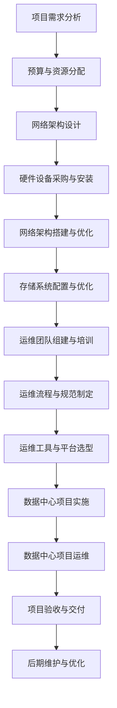

                 

# 《AI大模型应用数据中心建设：数据中心产业发展》

> **关键词：** AI大模型、数据中心建设、数据中心产业、基础设施、产业发展分析、项目实战

> **摘要：** 本文旨在探讨AI大模型应用数据中心的建设及其对数据中心产业的影响。文章首先概述了数据中心建设的重要性，随后深入分析了数据中心基础设施，包括服务器硬件、网络基础设施和存储系统。接着，文章详细介绍了AI大模型数据中心建设原则、架构设计和数据处理流程。最后，文章从产业发展现状、政策法规和产业生态系统三个方面对数据中心产业进行了全面分析，并提供了数据中心建设项目的实际操作指南。本文旨在为数据中心建设者和研究者提供有价值的参考。

### 《AI大模型应用数据中心建设：数据中心产业发展》目录大纲

# 第一部分: 数据中心建设概述

## 1.1 数据中心建设的重要性

### 1.1.1 数据中心在经济中的作用

数据中心是现代信息社会的重要基础设施，其作用不仅仅是存储和交换数据，更是支撑各类互联网服务和业务应用的核心。在经济方面，数据中心有着以下几个重要作用：

1. **促进产业升级**：数据中心为各行各业提供了强大的计算和存储支持，推动了信息化、数字化和智能化转型，提升了整体产业竞争力。
2. **降低成本**：数据中心通过规模化运营和资源优化，实现了成本的显著降低，为企业节省了大量的硬件购置和维护成本。
3. **增加就业机会**：数据中心的运营和管理需要大量专业人才，从技术支持到运维管理，为市场提供了丰富的就业机会。
4. **提升服务品质**：数据中心提供了高效、可靠、安全的数据服务，满足了用户对数据存储和计算的高要求。

### 1.1.2 数据中心在AI大模型应用中的关键作用

随着人工智能技术的迅猛发展，AI大模型的应用需求日益增加。数据中心在AI大模型应用中具有以下几个关键作用：

1. **计算资源提供**：AI大模型训练和推理需要巨大的计算资源，数据中心提供了高效的计算能力，支撑了AI大模型的应用。
2. **数据存储和管理**：数据中心拥有海量的存储空间，能够高效地存储和管理AI大模型所需的大量数据。
3. **数据分析和处理**：数据中心通过分布式计算和存储技术，能够对AI大模型数据进行高效的处理和分析，提供有价值的信息。
4. **安全性和可靠性**：数据中心具有严格的网络安全和物理安全措施，保障了AI大模型数据和系统的安全性。

### 1.1.3 当前数据中心发展的挑战与机遇

当前数据中心发展面临以下挑战和机遇：

1. **挑战**：
   - **能耗问题**：数据中心的能耗问题日益突出，如何实现绿色、高效的数据中心建设成为重要挑战。
   - **安全威胁**：随着数据中心规模的扩大，网络安全威胁也日益增加，如何保障数据中心安全成为关键问题。
   - **人才短缺**：数据中心建设和管理需要大量专业人才，但目前人才供给不足，人才培养和储备成为重要挑战。

2. **机遇**：
   - **技术创新**：随着云计算、大数据、人工智能等技术的不断发展，数据中心建设迎来了新的技术机遇。
   - **市场扩展**：全球数据中心市场持续增长，为数据中心建设提供了广阔的市场空间。
   - **政策支持**：各国政府纷纷出台政策支持数据中心建设，为数据中心发展提供了有力保障。

## 1.2 数据中心的发展历程

### 1.2.1 第一代数据中心

第一代数据中心起源于20世纪60年代，主要以主机为中心，提供基本的计算和数据存储功能。这个阶段的数据中心规模较小，主要服务于科研机构和大型企业。

### 1.2.2 第二代数据中心

第二代数据中心出现在20世纪80年代，随着个人计算机和网络的普及，数据中心逐渐从主机为中心转向分布式计算。这一时期的数据中心规模扩大，开始引入网络技术和存储设备，为更多用户提供了数据服务。

### 1.2.3 第三代数据中心

第三代数据中心出现在21世纪，随着互联网的普及和云计算的兴起，数据中心开始向大规模、分布式、智能化方向发展。这一时期的数据中心具有以下特点：

1. **大规模计算和存储能力**：数据中心采用了高性能服务器和存储设备，能够提供强大的计算和存储能力。
2. **网络架构优化**：数据中心采用了更加复杂的网络架构，如多级交换架构和负载均衡技术，提高了数据传输效率和网络稳定性。
3. **智能化管理**：数据中心引入了自动化管理工具，实现了资源调度、故障监测和优化等智能化管理。

### 1.2.4 未来数据中心发展趋势

未来数据中心发展趋势包括以下几个方面：

1. **绿色数据中心**：随着环保意识的提高，绿色数据中心将成为主流，通过节能技术、可再生能源和高效制冷技术，降低数据中心的能耗。
2. **边缘计算**：随着物联网和5G技术的发展，边缘计算将逐渐兴起，数据中心将向边缘节点延伸，提供更加接近用户的服务。
3. **智能化和自动化**：数据中心将引入更多人工智能和自动化技术，实现资源优化、故障预测和自动化运维。
4. **数据隐私和安全**：随着数据隐私和安全问题的日益突出，数据中心将加强数据加密、安全隔离和访问控制等安全措施。

# 第二部分: 数据中心基础设施

## 2.1 数据中心基础设施概述

### 2.1.1 数据中心基础设施的定义

数据中心基础设施是指为数据中心提供计算、存储、网络和物理安全等支持的各种设备和系统的集合。数据中心基础设施包括以下几个主要组成部分：

1. **服务器**：服务器是数据中心的核心计算设备，负责运行各类应用和存储数据。
2. **存储系统**：存储系统用于存储和管理数据，包括磁盘阵列、固态硬盘等。
3. **网络设备**：网络设备包括交换机、路由器、防火墙等，负责数据传输和网络管理。
4. **制冷系统**：制冷系统用于维持数据中心温度，防止设备过热。
5. **电源系统**：电源系统提供数据中心所需的电力，包括不间断电源（UPS）和备用电源。
6. **物理安全**：物理安全包括门禁系统、视频监控系统、消防系统等，保障数据中心的物理安全。

### 2.1.2 数据中心基础设施的主要组成部分

数据中心基础设施的主要组成部分包括：

1. **服务器硬件**：
   - **硬件选型**：服务器硬件包括CPU、内存、硬盘等，根据应用需求进行选型和配置。
   - **硬件维护与升级**：定期进行硬件维护和升级，确保服务器硬件的稳定性和性能。
   - **硬件故障处理**：在硬件故障发生时，能够快速诊断和修复，降低故障影响。

2. **网络基础设施**：
   - **网络架构设计**：设计高效、稳定、灵活的网络架构，满足数据传输需求。
   - **网络设备选型与配置**：选择合适的网络设备，进行合理的网络配置，确保网络性能和稳定性。
   - **网络安全策略**：制定网络安全策略，包括防火墙设置、入侵检测、访问控制等，保障网络安全。

3. **存储系统**：
   - **存储系统类型与架构**：包括磁盘阵列、固态硬盘、分布式存储等，根据数据特点和需求选择合适的存储系统架构。
   - **存储性能优化**：通过存储优化技术，如缓存、快照、数据去重等，提高存储系统性能。
   - **数据备份与恢复**：制定数据备份策略，确保数据在意外情况下的安全性和可恢复性。

4. **制冷系统**：
   - **制冷方式选择**：根据数据中心规模和散热需求，选择合适的制冷方式，如风冷、液冷等。
   - **制冷系统维护与优化**：定期维护制冷系统，提高制冷效率，降低能耗。

5. **电源系统**：
   - **电源系统设计**：设计可靠、稳定的电源系统，满足数据中心电力需求。
   - **UPS系统配置**：配置不间断电源（UPS），保障电力中断时的持续供电。
   - **备用电源**：配置备用电源，如发电机组，确保在主电源故障时能够迅速切换。

6. **物理安全**：
   - **门禁系统**：设置门禁系统，限制人员进入，确保数据中心物理安全。
   - **视频监控系统**：安装视频监控系统，监控数据中心内部和周边环境，保障数据安全。
   - **消防系统**：配置消防系统，包括灭火器、自动喷水灭火系统等，确保数据中心安全。

## 2.2 服务器硬件

### 2.2.1 服务器的选择与配置

服务器的选择与配置是数据中心建设的关键环节，直接关系到数据中心的性能和可靠性。以下是服务器选择与配置的关键点：

1. **硬件选型**：
   - **CPU**：根据计算需求选择合适的CPU，如高性能CPU、多核CPU等。
   - **内存**：根据应用需求配置足够的内存，确保系统运行稳定。
   - **硬盘**：选择合适的硬盘类型，如固态硬盘（SSD）、机械硬盘（HDD）等，根据数据访问速度和容量需求进行配置。
   - **主板**：选择支持所需扩展和接口的主板，确保硬件兼容性。

2. **硬件配置**：
   - **计算能力**：根据应用需求配置合适的CPU和内存，确保服务器具备足够的计算能力。
   - **存储容量**：根据数据存储需求配置足够的硬盘容量，确保数据存储需求得到满足。
   - **网络接口**：根据网络需求配置足够的网络接口，确保数据传输速度和稳定性。
   - **扩展性**：考虑服务器的扩展性，如可扩展的CPU插槽、硬盘接口等，为未来的扩展提供支持。

### 2.2.2 服务器硬件的维护与升级

服务器硬件的维护与升级是保证数据中心稳定运行的重要措施。以下是服务器硬件维护与升级的关键点：

1. **硬件维护**：
   - **定期检查**：定期对服务器硬件进行检查，包括CPU、内存、硬盘等，确保硬件运行正常。
   - **清洁与保养**：定期清洁服务器内部，包括风扇、散热片等，保持硬件的良好散热状态。
   - **故障排查**：在硬件故障发生时，及时进行故障排查和修复，降低故障影响。

2. **硬件升级**：
   - **性能升级**：根据业务需求，定期对服务器硬件进行性能升级，如更换更高性能的CPU、增加内存等。
   - **功能升级**：根据技术发展和业务需求，对服务器硬件进行功能升级，如增加网络接口、添加新的存储设备等。

### 2.2.3 服务器硬件故障处理

服务器硬件故障是数据中心运营中常见的问题，及时有效的故障处理是确保数据中心稳定运行的关键。以下是服务器硬件故障处理的关键步骤：

1. **故障诊断**：
   - **系统监控**：通过系统监控工具，实时监控服务器硬件的运行状态，及时发现故障。
   - **故障定位**：根据故障现象，进行故障定位，确定故障原因。

2. **故障处理**：
   - **硬件更换**：如果故障是由于硬件损坏引起的，及时进行硬件更换，确保系统恢复正常。
   - **软件修复**：如果故障是由于软件故障引起的，通过修复或更新软件解决故障。
   - **数据备份与恢复**：在故障发生前，及时备份数据，确保在故障发生时能够快速恢复。

3. **故障分析**：
   - **故障原因分析**：对故障原因进行深入分析，找出故障根本原因，防止类似故障再次发生。
   - **故障报告**：记录故障处理过程和结果，形成故障报告，为后续故障处理提供参考。

## 2.3 网络基础设施

### 2.3.1 数据中心的网络架构设计

数据中心的网络架构设计是确保数据中心高效、稳定、安全运行的关键。以下是数据中心网络架构设计的关键点：

1. **层次化架构**：采用层次化架构，将网络划分为核心层、汇聚层和接入层，实现网络层次化管理和优化。

2. **冗余设计**：通过冗余设计，提高网络的可靠性和容错能力。例如，在核心层和汇聚层使用冗余交换机和路由器，实现链路冗余和设备冗余。

3. **负载均衡**：采用负载均衡技术，实现网络流量的合理分配，避免单点过载和性能瓶颈。

4. **安全策略**：制定网络安全策略，包括防火墙设置、入侵检测、访问控制等，保障网络安全。

5. **QoS策略**：采用QoS（服务质量）策略，对网络流量进行分类和管理，确保关键业务的带宽需求和网络质量。

### 2.3.2 网络设备的选型与配置

网络设备的选型与配置是数据中心网络架构实现的基础。以下是网络设备选型与配置的关键点：

1. **设备选型**：
   - **交换机**：根据数据中心规模和业务需求，选择合适的交换机类型，如核心交换机、汇聚交换机和接入交换机。
   - **路由器**：根据网络拓扑和需求，选择合适的路由器，确保网络路由和转发功能。
   - **防火墙**：选择具备高安全性能的防火墙，保障网络安全。
   - **负载均衡器**：根据负载均衡需求，选择合适的负载均衡设备。

2. **设备配置**：
   - **接口配置**：根据网络拓扑和连接需求，配置合适的接口类型和数量。
   - **IP地址分配**：合理分配IP地址，确保网络设备之间能够正常通信。
   - **安全策略配置**：配置防火墙规则、访问控制列表等安全策略，保障网络安全。

### 2.3.3 网络安全策略

网络安全策略是数据中心网络架构的重要组成部分，保障数据中心网络的安全和稳定运行。以下是网络安全策略的关键点：

1. **防火墙设置**：配置防火墙规则，过滤非法访问和恶意攻击，防止网络入侵。

2. **入侵检测与防御**：部署入侵检测与防御系统，实时监控网络流量，发现并阻止恶意攻击。

3. **访问控制**：设置访问控制策略，限制对数据中心的访问权限，确保只有授权用户能够访问关键资源和系统。

4. **加密传输**：采用加密技术，保障数据在传输过程中的安全性和完整性。

5. **日志审计**：记录网络设备的安全日志，定期审计和分析日志，及时发现和应对潜在的安全威胁。

## 2.4 存储系统

### 2.4.1 存储系统的类型与架构

存储系统是数据中心基础设施的核心组成部分，用于存储和管理大量的数据。以下是存储系统的类型与架构：

1. **存储系统类型**：
   - **直接 Attached Storage (DAS)**：DAS是将存储设备直接连接到服务器，存储设备与服务器之间通过SCSI、SATA等接口进行连接。
   - **Network Attached Storage (NAS)**：NAS是将存储设备通过网络连接到服务器，存储设备独立运行，通过CIFS或NFS协议提供文件存储服务。
   - **Storage Area Network (SAN)**：SAN是一种独立的网络，专门用于连接存储设备和服务器，采用光纤通道或iSCSI协议进行数据传输。

2. **存储系统架构**：
   - **分布式存储**：分布式存储将数据分散存储在多个节点上，通过分布式文件系统或分布式存储协议进行数据管理和访问。
   - **集中式存储**：集中式存储将数据集中存储在中心节点上，通过SAN或NAS协议提供数据访问服务。
   - **混合存储**：混合存储结合了分布式存储和集中式存储的优势，将数据在不同存储系统之间进行动态迁移和优化。

### 2.4.2 存储系统的性能优化

存储系统的性能优化是提高数据中心存储效率的重要手段。以下是存储系统性能优化的方法：

1. **存储策略优化**：
   - **数据去重**：通过数据去重技术，减少存储空间占用，提高存储效率。
   - **压缩**：对存储数据进行压缩，减少存储空间占用，提高存储性能。
   - **缓存**：使用缓存技术，将频繁访问的数据存储在高速缓存中，提高数据访问速度。

2. **存储设备优化**：
   - **SSD使用**：使用固态硬盘（SSD）替代机械硬盘（HDD），提高数据读写速度和存储性能。
   - **RAID技术**：采用RAID（冗余数组磁盘技术），提高数据存储的可靠性和性能。
   - **存储池**：将多个存储设备组成存储池，实现存储资源的动态分配和优化。

3. **存储网络优化**：
   - **网络带宽**：提高存储网络的带宽，减少数据传输延迟，提高存储性能。
   - **网络拓扑**：优化存储网络拓扑结构，减少网络传输路径，提高数据传输速度。
   - **网络优化工具**：使用网络优化工具，如负载均衡器、链路聚合等，提高网络性能和稳定性。

### 2.4.3 存储系统的数据备份与恢复

存储系统的数据备份与恢复是保障数据安全和业务连续性的重要措施。以下是存储系统数据备份与恢复的方法：

1. **备份策略**：
   - **全备份**：对整个存储系统进行备份，确保数据的完整性和一致性。
   - **增量备份**：仅备份上次备份后发生变化的数据，减少备份时间和存储空间占用。
   - **差异备份**：备份自上次全备份后发生变化的数据，减少备份次数和存储空间占用。

2. **备份存储**：
   - **本地备份**：将备份数据存储在本地存储设备上，如硬盘、磁带等。
   - **远程备份**：将备份数据存储在远程存储设备上，如远程备份服务器、云存储等。

3. **恢复策略**：
   - **本地恢复**：从本地存储设备恢复备份数据，确保数据的快速恢复。
   - **远程恢复**：从远程存储设备恢复备份数据，确保数据的异地备份和恢复。
   - **数据验证**：在恢复数据前，对备份数据进行验证，确保数据的完整性和一致性。

4. **恢复流程**：
   - **备份验证**：在恢复前，验证备份数据的完整性和一致性，确保数据可恢复。
   - **数据恢复**：根据恢复策略，从备份数据中恢复数据，确保数据的正确性和完整性。
   - **数据验证**：在恢复后，对恢复的数据进行验证，确保数据的正确性和完整性。

# 第三部分: AI大模型数据中心建设

## 3.1 AI大模型数据中心建设原则

AI大模型数据中心建设需要遵循一系列原则，确保数据中心的可靠性和高效性。以下是AI大模型数据中心建设的主要原则：

### 3.1.1 可靠性与稳定性要求

1. **硬件可靠性**：选择具有高可靠性的服务器、存储设备和网络设备，降低硬件故障率。
2. **网络稳定性**：设计冗余的网络架构，确保数据传输的稳定性和可靠性。
3. **电力供应**：配置可靠的电力系统，包括UPS和备用电源，确保电力供应的连续性。
4. **环境稳定性**：保持数据中心环境的稳定性，包括温度、湿度、空气质量等，防止设备损坏。

### 3.1.2 可扩展性与弹性需求

1. **硬件扩展性**：选择具有扩展性的硬件设备，如可扩展的CPU插槽、硬盘接口等，为未来的扩展提供支持。
2. **存储扩展性**：采用分布式存储架构，实现存储资源的动态扩展和负载均衡。
3. **网络扩展性**：设计灵活的网络架构，支持网络设备的动态添加和调整，满足不断增长的网络需求。
4. **计算资源弹性**：通过虚拟化和容器化技术，实现计算资源的动态分配和弹性扩展。

### 3.1.3 能耗与成本控制

1. **节能设计**：采用绿色数据中心技术和节能设备，降低能耗，提高能源利用效率。
2. **设备优化**：通过硬件优化和软件优化，提高设备的利用率和性能，降低能耗。
3. **能源管理**：建立完善的能源管理体系，实时监控能源消耗，优化能源使用。
4. **成本控制**：通过采购、运维和管理等多方面的优化，降低数据中心的建设和运营成本。

## 3.2 AI大模型数据中心架构设计

AI大模型数据中心架构设计是确保数据中心能够高效支持AI大模型应用的关键。以下是AI大模型数据中心架构设计的主要方面：

### 3.2.1 数据中心整体架构设计

1. **计算资源**：根据AI大模型的应用需求，设计合理的计算资源分配，确保计算资源的高效利用。
2. **存储资源**：设计分布式存储架构，提供高性能、高可靠性的存储服务。
3. **网络架构**：设计高效、稳定、灵活的网络架构，实现数据的高速传输和访问。
4. **安全体系**：建立完善的安全体系，包括网络安全、数据安全和系统安全，保障数据中心的安全运行。

### 3.2.2 AI大模型计算资源规划

1. **计算节点规划**：根据AI大模型的需求，规划计算节点的数量和配置，确保计算资源充足。
2. **GPU资源规划**：由于AI大模型通常需要大量的GPU资源，因此需要合理规划GPU资源的分配，确保GPU资源的高效利用。
3. **集群管理**：采用集群管理技术，实现对计算资源的动态分配和调度，提高计算资源的利用率。

### 3.2.3 AI大模型存储资源规划

1. **数据存储架构**：根据AI大模型的应用特点，设计合理的存储架构，包括数据存储的位置、访问模式和数据保护机制。
2. **数据存储类型**：根据数据的特点和需求，选择合适的存储类型，如热数据存储、冷数据存储等。
3. **存储性能优化**：通过缓存、快照、数据去重等存储优化技术，提高存储系统的性能和效率。

## 3.3 AI大模型数据处理流程

AI大模型数据处理流程是数据中心的重要功能之一，确保AI大模型能够高效、准确地处理和分析数据。以下是AI大模型数据处理流程的主要环节：

### 3.3.1 数据采集与预处理

1. **数据采集**：从各种数据源（如传感器、数据库、文件等）采集数据，确保数据的完整性和准确性。
2. **数据清洗**：对采集到的数据进行清洗，去除无效数据、处理异常值等，提高数据质量。
3. **数据转换**：将不同格式和结构的数据转换为统一的格式，便于后续的数据处理和分析。

### 3.3.2 数据存储与索引

1. **数据存储**：将预处理后的数据存储到存储系统中，确保数据的安全性和可靠性。
2. **数据索引**：建立数据索引，提高数据的查询效率和访问速度。

### 3.3.3 数据分析与模型训练

1. **特征提取**：从数据中提取特征，为模型训练提供输入。
2. **模型训练**：采用机器学习和深度学习算法，对数据进行训练，构建AI大模型。
3. **模型评估**：评估模型的性能，包括准确率、召回率、F1值等指标，确保模型的有效性。

### 3.3.4 模型部署与推理

1. **模型部署**：将训练好的模型部署到数据中心，为实际应用提供支持。
2. **模型推理**：利用部署好的模型，对新的数据进行推理，提供预测和决策支持。

# 第四部分: 数据中心产业发展分析

## 4.1 数据中心产业发展现状

数据中心产业发展现状是分析数据中心建设的关键。以下是数据中心产业发展现状的概述：

### 4.1.1 全球数据中心产业发展趋势

1. **市场规模**：全球数据中心市场规模持续扩大，预计未来几年仍将保持高速增长。
2. **区域分布**：北美和欧洲是全球数据中心产业的主要市场，亚太地区数据中心产业发展迅速，市场规模逐年增加。
3. **技术进步**：随着云计算、大数据、人工智能等技术的不断进步，数据中心技术也在不断更新和优化，如边缘计算、容器化技术、自动化运维等。

### 4.1.2 我国数据中心产业发展现状

1. **市场规模**：我国数据中心市场规模逐年扩大，已成为全球最大的数据中心市场之一。
2. **区域分布**：东部地区是我国数据中心产业的主要发展区域，如北京、上海、广州等地，西部地区数据中心产业发展相对滞后。
3. **技术进步**：我国数据中心产业在技术创新方面取得了显著进展，如云计算、大数据、人工智能等技术的应用，推动了数据中心产业的快速发展。

### 4.1.3 数据中心产业发展面临的挑战与机遇

1. **挑战**：
   - **能源消耗**：数据中心能耗问题日益突出，如何实现绿色、高效的数据中心建设成为重要挑战。
   - **网络安全**：随着数据中心规模的扩大，网络安全威胁也日益增加，如何保障数据中心安全成为关键问题。
   - **人才短缺**：数据中心建设和管理需要大量专业人才，但目前人才供给不足，人才培养和储备成为重要挑战。

2. **机遇**：
   - **技术创新**：随着云计算、大数据、人工智能等技术的不断发展，数据中心建设迎来了新的技术机遇。
   - **市场扩展**：全球数据中心市场持续增长，为数据中心建设提供了广阔的市场空间。
   - **政策支持**：各国政府纷纷出台政策支持数据中心建设，为数据中心发展提供了有力保障。

## 4.2 数据中心产业政策与法规

数据中心产业政策与法规是数据中心建设和发展的重要依据。以下是数据中心产业政策与法规的概述：

### 4.2.1 国际数据中心产业政策与法规

1. **国际组织政策**：国际标准化组织（ISO）、国际电信联盟（ITU）等国际组织制定了数据中心建设的相关标准和法规，为数据中心建设提供了技术指导。
2. **各国政策**：各国政府纷纷出台政策，支持数据中心建设和发展。如美国、欧盟等发达国家在数据中心能源消耗、碳排放、网络安全等方面制定了严格的法规。

### 4.2.2 我国数据中心产业政策与法规

1. **国家政策**：我国政府高度重视数据中心产业发展，出台了一系列政策，如《国家信息化发展战略纲要》、《大数据产业发展规划（2016-2020年）》等，为数据中心建设提供了政策支持。
2. **地方政策**：各地政府也根据本地实际情况，出台了一系列政策，鼓励数据中心建设和发展。如税收优惠、土地优惠等政策，为数据中心建设提供了有利条件。

### 4.2.3 数据中心产业政策与法规对建设的影响

1. **环境影响**：数据中心产业政策与法规对数据中心建设的影响主要体现在能源消耗、碳排放、环保等方面。通过制定严格的环保法规，推动数据中心实现绿色、高效的建设。
2. **安全影响**：数据中心产业政策与法规对数据中心建设的影响主要体现在网络安全、数据保护等方面。通过制定严格的网络安全法规，保障数据中心的安全运行。
3. **市场影响**：数据中心产业政策与法规对数据中心建设的影响还体现在市场规范、市场秩序等方面。通过制定市场法规，规范市场行为，促进数据中心产业的健康发展。

## 4.3 数据中心产业生态系统

数据中心产业生态系统是数据中心建设和发展的重要支撑。以下是数据中心产业生态系统的概述：

### 4.3.1 数据中心产业链分析

数据中心产业链包括硬件设备制造商、数据中心服务提供商、电信运营商、网络设备制造商等多个环节。各环节之间相互协作，共同推动数据中心产业的发展。

### 4.3.2 数据中心产业联盟与标准

数据中心产业联盟和标准组织在数据中心产业发展中发挥着重要作用。如国际数据中心协会（IDCA）、中国数据中心联盟（CCDA）等组织，通过制定标准和规范，推动数据中心产业的发展。

### 4.3.3 数据中心产业投资与并购

数据中心产业投资与并购是推动数据中心产业发展的重要动力。通过投资和并购，企业可以扩大市场份额，提升技术实力，推动数据中心产业的创新和发展。

# 第五部分: 项目实战

## 5.1 数据中心建设项目规划

数据中心建设项目的规划是确保项目成功的关键。以下是数据中心建设项目规划的主要环节：

### 5.1.1 项目需求分析

1. **业务需求**：分析业务需求和数据需求，确定数据中心的建设目标和功能需求。
2. **性能需求**：分析系统的性能需求，包括计算能力、存储容量、网络带宽等。
3. **安全需求**：分析系统的安全需求，包括网络安全、数据安全、系统安全等。

### 5.1.2 项目预算与资源分配

1. **预算编制**：根据项目需求，编制项目预算，包括硬件设备、软件工具、人力资源等。
2. **资源分配**：合理分配项目资源，确保项目各阶段的资源需求得到满足。

### 5.1.3 项目进度与风险管理

1. **进度计划**：制定项目进度计划，明确项目各阶段的任务和时间节点。
2. **风险管理**：识别项目风险，制定风险管理策略，降低项目风险。

## 5.2 数据中心项目实施

数据中心项目实施是项目成功的关键环节。以下是数据中心项目实施的主要环节：

### 5.2.1 硬件设备采购与安装

1. **设备采购**：根据项目需求，采购合适的硬件设备，包括服务器、存储设备、网络设备等。
2. **设备安装**：安装硬件设备，确保设备符合技术规范，并进行系统调试。

### 5.2.2 网络架构搭建与优化

1. **网络设计**：设计合理的网络架构，包括核心层、汇聚层和接入层。
2. **网络搭建**：搭建网络架构，配置网络设备，确保网络连通性和稳定性。
3. **网络优化**：通过负载均衡、QoS策略等优化网络性能，提高网络效率。

### 5.2.3 存储系统配置与优化

1. **存储系统配置**：配置存储系统，包括存储设备、存储网络等。
2. **存储优化**：通过数据去重、压缩、缓存等优化存储性能，提高存储效率。

## 5.3 数据中心项目运维

数据中心项目运维是确保数据中心稳定运行的关键。以下是数据中心项目运维的主要环节：

### 5.3.1 运维团队组建与培训

1. **团队组建**：组建运维团队，明确团队成员的职责和任务。
2. **技能培训**：对运维团队成员进行技能培训，提高运维能力。

### 5.3.2 运维流程与规范制定

1. **运维流程**：制定运维流程，明确运维任务和操作步骤。
2. **规范制定**：制定运维规范，确保运维工作有序进行。

### 5.3.3 运维工具与平台选型

1. **工具选型**：选择合适的运维工具，提高运维效率。
2. **平台选型**：搭建运维平台，实现对数据中心设备和网络的实时监控和管理。

# 附录

## 附录 A: 数据中心建设参考文档与资源

### A.1 国际数据中心建设标准与指南

1. **ISO/IEC 27001**：国际标准化组织（ISO）和 国际电工委员会（IEC）共同制定的网络安全管理体系标准。
2. **TIA-942**：美国电信行业协会（TIA）制定的数据中心设施标准。
3. **Uptime Institute**：数据中心性能等级标准，包括 Tier I-Tier IV。

### A.2 国内数据中心建设标准与指南

1. **GB 50174-2017**：数据中心设计规范。
2. **GB 50459-2009**：数据中心工程施工及验收规范。
3. **GB/T 29246-2012**：数据中心运维管理规范。

### A.3 数据中心建设案例分析

1. **阿里巴巴数据中心建设案例**：介绍了阿里巴巴数据中心的建设过程、技术特点和运营管理经验。
2. **谷歌数据中心建设案例**：介绍了谷歌数据中心的绿色设计、高效能源利用和自动化运维。

### A.4 数据中心建设相关法规与政策

1. **《中华人民共和国网络安全法》**：明确了数据中心的安全要求和责任。
2. **《数据中心能效管理指南》**：指导数据中心实现能效管理。
3. **各地数据中心优惠政策**：介绍了各地对数据中心建设的优惠政策，如税收优惠、土地优惠等。 

### A.5 数据中心建设常用工具与软件

1. **VMware**：虚拟化平台，用于服务器虚拟化和网络虚拟化。
2. **Ansible**：自动化运维工具，用于配置管理、自动化部署等。
3. **Prometheus**：监控和告警工具，用于实时监控数据中心设备和系统。
4. **Kubernetes**：容器编排平台，用于容器化应用部署和管理。

### A.6 数据中心建设参考书籍

1. **《数据中心建设与管理》**：介绍了数据中心的设计、建设和运维。
2. **《数据中心基础设施管理》**：讲述了数据中心基础设施管理的最佳实践。
3. **《数据中心能效优化》**：介绍了数据中心能效优化的方法和技巧。

## 附录 B: 术语表

### **AI大模型**：一种基于深度学习的技术，用于模拟人类智能行为，具有自主学习、推理和决策能力。

### **数据中心**：一种提供计算、存储、网络和物理安全等基础设施的服务平台，用于支持各类互联网服务和业务应用。

### **基础设施**：指数据中心所包含的各种设备和系统，包括服务器、存储系统、网络设备、制冷系统和电源系统等。

### **边缘计算**：一种将计算、存储和网络功能分布在网络边缘的技术，用于提高数据处理速度和降低网络延迟。

### **云计算**：一种通过网络提供计算资源、存储资源和应用程序等服务的技术，具有灵活、高效、可扩展的特点。

### **虚拟化**：一种通过虚拟化技术将物理资源抽象为逻辑资源，实现资源隔离和高效利用的技术。

### **容器化**：一种通过容器技术封装应用程序及其依赖项，实现应用程序的轻量级、可移植和弹性运行的技术。

### **数据中心产业**：指数据中心建设和运营相关的产业链，包括硬件设备制造、数据中心服务提供商、电信运营商、网络设备制造商等。

### **数据中心联盟**：指数据中心产业内各种组织、企业和机构的联盟，通过合作和交流，推动数据中心产业的发展。

### **数据中心建设标准**：指用于指导数据中心设计、建设和运维的技术规范和指南。

### **数据中心政策与法规**：指各国政府制定的关于数据中心建设、运营和管理的相关政策法规，用于规范数据中心产业的发展。

## 附录 C: 数据中心建设流程图

### 附录 D: 数据中心建设时间表

| 阶段       | 起始时间  | 结束时间  | 主要任务            |
| ---------- | -------- | -------- | ------------------- |
| 项目需求分析 | 2023-01-01 | 2023-02-28 | 业务需求分析、性能需求分析、安全需求分析 |
| 预算与资源分配 | 2023-03-01 | 2023-04-30 | 预算编制、资源分配            |
| 网络架构设计 | 2023-05-01 | 2023-06-30 | 网络设计、网络搭建、网络优化       |
| 硬件设备采购与安装 | 2023-07-01 | 2023-08-31 | 硬件设备采购、设备安装、系统调试     |
| 存储系统配置与优化 | 2023-09-01 | 2023-10-31 | 存储系统配置、存储优化           |
| 运维团队组建与培训 | 2023-11-01 | 2023-12-31 | 运维团队组建、技能培训           |
| 运维流程与规范制定 | 2024-01-01 | 2024-02-28 | 运维流程制定、规范制定           |
| 运维工具与平台选型 | 2024-03-01 | 2024-04-30 | 运维工具选型、平台搭建           |
| 数据中心项目实施 | 2024-05-01 | 2024-06-30 | 硬件设备安装、网络搭建、存储优化       |
| 数据中心项目运维 | 2024-07-01 | 2024-12-31 | 运维团队运营、故障处理、性能优化       |
| 项目验收与交付 | 2025-01-01 | 2025-02-28 | 项目验收、交付使用、后期维护         |

## 附录 E: 数据中心建设常用命令和操作

### **服务器硬件配置**

- **CPU配置**：
  - `lscpu`：查看CPU详细信息。
  - `cat /proc/cpuinfo`：查看CPU的详细信息。

- **内存配置**：
  - `free -h`：查看内存使用情况。
  - `sudo dmidecode --type 17`：查看内存详细信息。

- **硬盘配置**：
  - `lsblk`：查看硬盘信息。
  - `sudo fdisk -l`：查看硬盘分区信息。

### **网络配置**

- **IP配置**：
  - `ifconfig`：查看网络接口配置。
  - `sudo nano /etc/sysconfig/network-scripts/ifcfg-eth0`：编辑网络接口配置文件。

- **路由配置**：
  - `route`：查看路由表。
  - `sudo nano /etc/sysconfig/gateway`：编辑默认网关配置文件。

### **存储系统配置**

- **存储设备监控**：
  - `smartctl -a /dev/sda`：查看硬盘智能监控信息。

- **文件系统格式化**：
  - `sudo mkfs.ext4 /dev/sda1`：创建EXT4文件系统。

### **系统监控和故障处理**

- **系统资源监控**：
  - `htop`：查看系统资源使用情况。
  - `iotop`：查看I/O资源使用情况。

- **故障处理**：
  - `dmesg`：查看系统错误日志。
  - `journalctl`：查看系统日志。

## 附录 F: 数据中心建设常见问题和解决方案

### **服务器硬件故障**

**问题**：服务器硬件出现故障，导致系统无法启动。

**解决方案**：
1. **硬件检测**：使用硬件检测工具，如`memtest86+`，检测内存故障。
2. **重置BIOS**：清除CMOS设置，重置BIOS到出厂设置。
3. **更换硬件**：如果硬件故障严重，需要更换故障硬件。

### **网络故障**

**问题**：网络连接不稳定，导致数据传输缓慢。

**解决方案**：
1. **网络设备重启**：重启网络设备，如交换机、路由器等。
2. **检查网络配置**：检查网络接口配置文件，确保IP地址、子网掩码、网关等配置正确。
3. **网络监控工具**：使用网络监控工具，如`ping`、`traceroute`等，排查网络故障。

### **存储系统故障**

**问题**：存储系统无法访问或数据损坏。

**解决方案**：
1. **硬盘检测**：使用硬盘检测工具，如`smartctl`，检测硬盘故障。
2. **数据恢复**：如果数据损坏，使用数据恢复工具，如`TestDisk`，尝试恢复数据。
3. **备份恢复**：如果备份数据完整，从备份中恢复数据。

### **系统故障**

**问题**：系统无法启动或应用程序崩溃。

**解决方案**：
1. **系统恢复**：使用系统安装盘或恢复工具，如`System Rescue CD`，进行系统恢复。
2. **重装系统**：如果系统恢复无效，重新安装操作系统。
3. **软件故障排查**：检查应用程序的错误日志，排查软件故障。

## 附录 G: 数据中心建设相关指标和性能评测

### **硬件性能指标**

- **CPU性能**：使用`CPU`利用率、`CPU`负载、`CPU`缓存命中率等指标，评估CPU性能。
- **内存性能**：使用`内存`利用率、`内存`访问速度、`内存`带宽等指标，评估内存性能。
- **硬盘性能**：使用`硬盘`读写速度、`硬盘`I/O请求速率等指标，评估硬盘性能。

### **网络性能指标**

- **网络带宽**：使用`网络带宽`利用率、`网络带宽`吞吐量等指标，评估网络带宽性能。
- **网络延迟**：使用`网络延迟`、`网络延迟抖动`等指标，评估网络延迟性能。
- **网络丢包率**：使用`网络丢包率`、`网络连接稳定性`等指标，评估网络丢包性能。

### **存储性能指标**

- **存储吞吐量**：使用`存储吞吐量`、`存储I/O请求速率`等指标，评估存储性能。
- **存储延迟**：使用`存储延迟`、`存储延迟抖动`等指标，评估存储延迟性能。
- **存储IOPS**：使用`存储IOPS`、`存储吞吐量`等指标，评估存储IOPS性能。

### **数据中心性能评测**

- **整体性能评测**：使用`整体性能评分`、`服务响应时间`等指标，评估数据中心整体性能。
- **可靠性评测**：使用`系统可用性`、`故障恢复时间`等指标，评估数据中心的可靠性。
- **安全性评测**：使用`安全漏洞扫描结果`、`安全事件响应时间`等指标，评估数据中心的安全性。

## 附录 H: 数据中心建设常见故障排除

### **硬件故障排除**

1. **CPU故障**：检查CPU风扇、散热片是否正常工作，检查CPU插槽是否接触不良，检查CPU电源连接是否正常。
2. **内存故障**：检查内存条是否插拔牢固，检查内存条是否有物理损坏，使用内存检测工具进行故障排查。
3. **硬盘故障**：检查硬盘电源连接、数据线连接是否正常，使用硬盘检测工具进行故障排查，尝试更换硬盘。
4. **电源故障**：检查电源是否正常工作，检查电源线连接是否牢固，尝试更换电源。

### **网络故障排除**

1. **网络设备故障**：检查网络设备是否正常工作，检查网络设备电源连接是否正常，尝试重启网络设备。
2. **网络接口故障**：检查网络接口是否接触不良，检查网络接口卡是否损坏，尝试更换网络接口卡。
3. **网络线缆故障**：检查网络线缆是否破损，检查网络线缆连接是否牢固，尝试更换网络线缆。
4. **网络配置故障**：检查网络配置文件是否正确，检查IP地址、子网掩码、网关等配置是否正确。

### **存储故障排除**

1. **存储设备故障**：检查存储设备是否正常工作，检查存储设备电源连接是否正常，尝试重启存储设备。
2. **存储网络故障**：检查存储网络设备是否正常工作，检查存储网络线缆连接是否牢固，尝试更换存储网络设备。
3. **文件系统故障**：检查文件系统是否正常，使用文件系统修复工具进行故障排查，尝试重新格式化硬盘。
4. **数据损坏故障**：使用数据恢复工具进行故障排查，尝试恢复数据，如果数据无法恢复，考虑备份数据。

### **系统故障排除**

1. **系统启动故障**：检查启动顺序、启动项设置是否正确，检查硬盘是否损坏，使用系统安装盘进行故障排查。
2. **应用程序故障**：检查应用程序的错误日志，尝试卸载或重新安装应用程序。
3. **操作系统故障**：检查操作系统更新日志，尝试重新安装操作系统，或者使用系统恢复工具进行故障排查。
4. **硬件兼容性故障**：检查硬件设备是否与操作系统兼容，尝试更换硬件设备。

## 附录 I: 数据中心建设安全注意事项

### **网络安全**

1. **防火墙设置**：配置防火墙规则，阻止非法访问和恶意攻击。
2. **访问控制**：设置访问控制策略，限制对数据中心的访问权限。
3. **入侵检测**：部署入侵检测系统，实时监控网络流量，发现并阻止恶意攻击。

### **数据安全**

1. **数据加密**：对敏感数据进行加密，防止数据泄露。
2. **数据备份**：定期备份数据，确保数据在意外情况下的安全性和可恢复性。
3. **访问审计**：记录数据访问日志，定期审计和分析日志，及时发现和应对潜在的安全威胁。

### **物理安全**

1. **门禁系统**：设置门禁系统，限制人员进入，确保数据中心物理安全。
2. **视频监控**：安装视频监控系统，监控数据中心内部和周边环境，保障数据安全。
3. **消防系统**：配置消防系统，包括灭火器、自动喷水灭火系统等，确保数据中心安全。

### **安全培训**

1. **员工培训**：对员工进行安全培训，提高员工的安全意识和防范能力。
2. **安全意识**：定期进行安全意识宣传，提高员工对网络安全和数据安全的重视程度。
3. **应急预案**：制定应急预案，确保在发生安全事件时能够迅速响应和处理。

## 附录 J: 数据中心建设案例分析

### **案例 1：阿里巴巴数据中心建设**

**项目背景**：随着阿里巴巴业务的快速扩张，对数据中心的需求不断增加，为了满足业务需求，阿里巴巴决定建设一个新的数据中心。

**建设目标**：建设一个具有高可靠性、高性能、高安全性的数据中心，支持阿里巴巴的云计算、大数据和人工智能业务。

**建设过程**：
1. **需求分析**：分析阿里巴巴的业务需求，确定数据中心的规模、性能和安全要求。
2. **设计方案**：设计数据中心的整体架构，包括硬件设备、网络架构、存储系统等。
3. **硬件采购**：采购高性能服务器、存储设备、网络设备等硬件设备。
4. **网络搭建**：搭建高效、稳定的网络架构，确保数据传输的速度和可靠性。
5. **存储配置**：配置高性能的存储系统，满足海量数据存储需求。
6. **系统部署**：部署云计算、大数据和人工智能系统，确保数据中心功能完善。
7. **运维管理**：组建运维团队，制定运维流程和规范，确保数据中心稳定运行。

**建设成果**：阿里巴巴数据中心建设完成后，成功支持了阿里巴巴的云计算、大数据和人工智能业务，为阿里巴巴的快速发展提供了坚实的技术支持。

### **案例 2：谷歌数据中心建设**

**项目背景**：谷歌是一家全球性的科技公司，其业务覆盖了搜索、广告、云计算等多个领域。为了满足不断增长的业务需求，谷歌决定建设一系列数据中心。

**建设目标**：建设高效、绿色、安全的数据中心，支持谷歌的全球业务。

**建设过程**：
1. **需求分析**：分析谷歌的业务需求，确定数据中心的建设目标和功能需求。
2. **设计方案**：设计数据中心的整体架构，包括硬件设备、网络架构、制冷系统等。
3. **硬件采购**：采购高效、绿色、安全的硬件设备，包括服务器、存储设备、网络设备等。
4. **网络搭建**：搭建高效、稳定的网络架构，确保数据传输的速度和可靠性。
5. **制冷系统**：设计高效的制冷系统，降低数据中心的能耗。
6. **能源管理**：建立完善的能源管理体系，提高能源利用效率。
7. **运维管理**：组建运维团队，制定运维流程和规范，确保数据中心稳定运行。

**建设成果**：谷歌数据中心建设完成后，成功支持了谷歌的全球业务，成为了全球最先进的数据中心之一。谷歌通过技术创新和绿色设计，实现了数据中心的能源消耗最低，为全球数据中心建设树立了榜样。

### **案例 3：腾讯数据中心建设**

**项目背景**：腾讯是一家全球领先的互联网科技公司，其业务涵盖了社交、游戏、云计算等多个领域。为了满足不断增长的业务需求，腾讯决定建设一系列数据中心。

**建设目标**：建设高效、可靠、安全的数据中心，支持腾讯的全球业务。

**建设过程**：
1. **需求分析**：分析腾讯的业务需求，确定数据中心的建设目标和功能需求。
2. **设计方案**：设计数据中心的整体架构，包括硬件设备、网络架构、存储系统等。
3. **硬件采购**：采购高性能服务器、存储设备、网络设备等硬件设备。
4. **网络搭建**：搭建高效、稳定的网络架构，确保数据传输的速度和可靠性。
5. **存储配置**：配置高性能的存储系统，满足海量数据存储需求。
6. **系统部署**：部署云计算、大数据和人工智能系统，确保数据中心功能完善。
7. **运维管理**：组建运维团队，制定运维流程和规范，确保数据中心稳定运行。

**建设成果**：腾讯数据中心建设完成后，成功支持了腾讯的全球业务，为腾讯的快速发展提供了坚实的技术支持。腾讯通过技术创新和高效管理，实现了数据中心的快速部署和高效运行，为全球数据中心建设提供了有益的经验。

## 附录 K: 数据中心建设常见误区与建议

### **误区 1：过度依赖硬件**

**问题**：在数据中心建设中，过度依赖高端硬件，认为只有高性能硬件才能满足业务需求。

**建议**：合理选择硬件，根据业务需求进行硬件配置。高性能硬件固然重要，但合理利用现有硬件资源同样关键。通过优化软件、虚拟化和容器化技术，提高硬件利用率和性能。

### **误区 2：忽视安全**

**问题**：在数据中心建设中，忽视安全性的重要性，只注重硬件和网络性能。

**建议**：安全是数据中心建设的重要方面，需要从网络安全、数据安全、系统安全等多方面进行综合设计。制定完善的安全策略和应急预案，确保数据中心的安全运行。

### **误区 3：单一架构设计**

**问题**：在数据中心设计中，采用单一架构，缺乏冗余和灵活性。

**建议**：采用多层次、分布式架构，实现硬件和网络的冗余，提高数据中心的可靠性和灵活性。通过负载均衡和动态资源分配，提高数据中心的性能和效率。

### **误区 4：忽视运维管理**

**问题**：在数据中心建设中，只关注硬件和网络，忽视运维管理。

**建议**：建立完善的运维管理体系，包括运维流程、规范、工具和平台。组建专业的运维团队，提高运维效率，确保数据中心稳定运行。

### **误区 5：忽略能耗管理**

**问题**：在数据中心建设中，忽视能耗管理，导致能源消耗过高。

**建议**：采用绿色数据中心技术和节能设备，优化数据中心能耗。建立能源管理体系，实时监控能耗，优化能源使用。

### **误区 6：缺乏可持续性规划**

**问题**：在数据中心建设中，缺乏对可持续性的规划，导致环境问题。

**建议**：在数据中心建设中，考虑环境因素，采用环保材料和绿色能源。通过优化设计和节能技术，降低数据中心对环境的影响。

## 附录 L: 数据中心建设相关术语和概念

### **数据中心**：一种提供计算、存储、网络和物理安全等基础设施的服务平台，用于支持各类互联网服务和业务应用。

### **硬件设备**：包括服务器、存储设备、网络设备、电源设备等，用于数据中心建设和运营的物理设备。

### **网络架构**：数据中心的网络拓扑结构，包括核心层、汇聚层和接入层，用于数据传输和访问。

### **虚拟化**：通过虚拟化技术将物理资源抽象为逻辑资源，实现资源隔离和高效利用。

### **容器化**：通过容器技术封装应用程序及其依赖项，实现应用程序的轻量级、可移植和弹性运行。

### **云计算**：通过网络提供计算资源、存储资源和应用程序等服务的技术，具有灵活、高效、可扩展的特点。

### **边缘计算**：一种将计算、存储和网络功能分布在网络边缘的技术，用于提高数据处理速度和降低网络延迟。

### **分布式存储**：将数据分散存储在多个节点上，通过分布式文件系统或分布式存储协议进行数据管理和访问。

### **数据中心产业**：指数据中心建设和运营相关的产业链，包括硬件设备制造、数据中心服务提供商、电信运营商、网络设备制造商等。

### **数据中心联盟**：指数据中心产业内各种组织、企业和机构的联盟，通过合作和交流，推动数据中心产业的发展。

### **数据中心建设标准**：指用于指导数据中心设计、建设和运维的技术规范和指南。

### **数据中心政策与法规**：指各国政府制定的关于数据中心建设、运营和管理的相关政策法规，用于规范数据中心产业的发展。

### **数据中心性能评测**：指对数据中心性能进行评估，包括硬件性能、网络性能、存储性能等方面。

### **数据中心安全**：指保障数据中心的安全性和稳定性，包括网络安全、数据安全和系统安全等方面。

### **数据中心运维**：指对数据中心进行日常运营和维护，确保数据中心稳定运行。

### **数据中心建设流程**：指数据中心建设的整体流程，包括项目需求分析、预算与资源分配、网络架构设计、硬件设备采购与安装、存储系统配置与优化、运维团队组建与培训、运维流程与规范制定等。

## 附录 M: 数据中心建设参考书籍和文献

### **参考书籍**

1. **《数据中心建设与管理》**：介绍了数据中心的设计、建设和运维。
2. **《数据中心基础设施管理》**：讲述了数据中心基础设施管理的最佳实践。
3. **《数据中心能效优化》**：介绍了数据中心能效优化的方法和技巧。
4. **《云计算与数据中心》**：讲述了云计算和数据中心的关系，以及数据中心的建设和管理。
5. **《网络架构设计》**：介绍了网络架构的设计原则和方法。

### **参考文献**

1. **《数据中心技术白皮书》**：介绍了数据中心的技术原理和发展趋势。
2. **《数据中心能效管理指南》**：提供了数据中心能效管理的最佳实践和指南。
3. **《数据中心建设标准与规范》**：介绍了数据中心建设的技术标准和规范。
4. **《数据中心产业政策与法规》**：介绍了数据中心产业的政策法规和发展趋势。
5. **《数据中心案例分析》**：介绍了国内外知名数据中心的建设和运营案例。

### **在线资源**

1. **数据中心技术论坛**：提供了数据中心技术交流和学习的平台。
2. **数据中心产业报告**：提供了数据中心产业的最新报告和统计数据。
3. **数据中心建设指南**：提供了数据中心建设的指南和最佳实践。
4. **数据中心标准与规范**：提供了数据中心建设的技术标准和规范。
5. **数据中心技术博客**：提供了数据中心技术博客和教程，供学习参考。

## 附录 N: 数据中心建设常用软件工具和平台

### **服务器管理工具**

1. **Ansible**：用于配置管理、自动化部署等。
2. **Puppet**：用于配置管理、自动化部署等。
3. **Chef**：用于配置管理、自动化部署等。

### **网络管理工具**

1. **Nagios**：用于网络监控和故障检测。
2. **Zabbix**：用于网络监控和故障检测。
3. **SolarWinds**：用于网络监控和管理。

### **存储管理工具**

1. **NFS**：用于网络文件系统管理。
2. **CIFS**：用于共享文件系统管理。
3. **SAN Manager**：用于存储区域网络管理。

### **运维平台**

1. **AWS CloudFormation**：用于基础设施即代码。
2. **Azure Automation**：用于自动化运维。
3. **Google Cloud Deployment Manager**：用于自动化运维。

### **监控工具**

1. **Prometheus**：用于监控和告警。
2. **Grafana**：用于数据可视化和监控。
3. **Kibana**：用于日志分析和监控。

### **虚拟化平台**

1. **VMware**：用于服务器虚拟化。
2. **KVM**：用于服务器虚拟化。
3. **Hyper-V**：用于服务器虚拟化。

### **容器化平台**

1. **Docker**：用于容器化。
2. **Kubernetes**：用于容器编排和管理。

### **备份工具**

1. **Bacula**：用于备份和恢复。
2. **Veam**：用于备份和恢复。
3. **Borg**：用于备份和恢复。

## 附录 O: 数据中心建设相关术语和缩略词

### **术语**

- **数据中心**（Data Center）：提供计算、存储、网络和安全等基础设施的服务平台。
- **云计算**（Cloud Computing）：通过互联网提供计算资源、存储资源和应用程序等服务。
- **虚拟化**（Virtualization）：通过软件将物理资源抽象为虚拟资源，实现资源隔离和高效利用。
- **边缘计算**（Edge Computing）：将计算、存储和网络功能分布在网络边缘，提高数据处理速度和降低网络延迟。
- **分布式存储**（Distributed Storage）：将数据分散存储在多个节点上，通过分布式文件系统或分布式存储协议进行数据管理和访问。
- **存储区域网络**（SAN）：一种独立的网络，专门用于连接存储设备和服务器，采用光纤通道或iSCSI协议进行数据传输。
- **网络附件存储**（NAS）：将存储设备通过网络连接到服务器，存储设备独立运行，通过CIFS或NFS协议提供文件存储服务。
- **数据中心联盟**（Data Center Alliance）：数据中心产业内各种组织、企业和机构的联盟，通过合作和交流，推动数据中心产业的发展。
- **数据中心建设标准**（Data Center Construction Standard）：用于指导数据中心设计、建设和运维的技术规范和指南。

### **缩略词**

- **CPU**：中央处理器（Central Processing Unit）
- **RAM**：随机存储器（Random Access Memory）
- **HDD**：机械硬盘（Hard Disk Drive）
- **SSD**：固态硬盘（Solid State Drive）
- **UPS**：不间断电源（Uninterruptible Power Supply）
- **RAID**：冗余数组磁盘技术（Redundant Array of Independent Disks）
- **VM**：虚拟机（Virtual Machine）
- **VMM**：虚拟机监控器（Virtual Machine Monitor）
- **NFV**：网络功能虚拟化（Network Functions Virtualization）
- **SDN**：软件定义网络（Software-Defined Networking）
- **IoT**：物联网（Internet of Things）
- **AI**：人工智能（Artificial Intelligence）
- **ML**：机器学习（Machine Learning）
- **DL**：深度学习（Deep Learning）
- **CDN**：内容分发网络（Content Delivery Network）
- **IoT**：物联网（Internet of Things）
- **IoT**：物联网（Internet of Things）

## 附录 P: 数据中心建设相关考试和认证

### **考试**

- **数据中心设计考试**：评估考生对数据中心设计原则、架构设计和实施过程的了解。
- **数据中心运维考试**：评估考生对数据中心运维流程、规范和工具的了解。
- **云计算考试**：评估考生对云计算技术、架构和实施过程的了解。
- **网络安全考试**：评估考生对网络安全技术、策略和实施过程的了解。

### **认证**

- **数据中心设计师认证**：认证考生对数据中心设计原则、架构设计和实施过程的深入理解。
- **数据中心运维工程师认证**：认证考生对数据中心运维流程、规范和工具的熟练掌握。
- **云计算工程师认证**：认证考生对云计算技术、架构和实施过程的深入理解。
- **网络安全工程师认证**：认证考生对网络安全技术、策略和实施过程的深入理解。

## 附录 Q: 数据中心建设相关期刊和会议

### **期刊**

- **《计算机科学》**：介绍计算机科学领域的研究成果和技术发展。
- **《计算机网络技术》**：介绍计算机网络技术的研究成果和技术发展。
- **《人工智能》**：介绍人工智能领域的研究成果和技术发展。
- **《数据科学》**：介绍数据科学领域的研究成果和技术发展。
- **《云计算》**：介绍云计算领域的研究成果和技术发展。
- **《物联网》**：介绍物联网领域的研究成果和技术发展。

### **会议**

- **国际计算机学会（ACM）**：举办计算机科学领域的国际会议，如ACM SIGARCH、ACM SIGCOMM等。
- **国际电气和电子工程师学会（IEEE）**：举办计算机网络、人工智能、云计算等领域的重要会议，如IEEE IC

