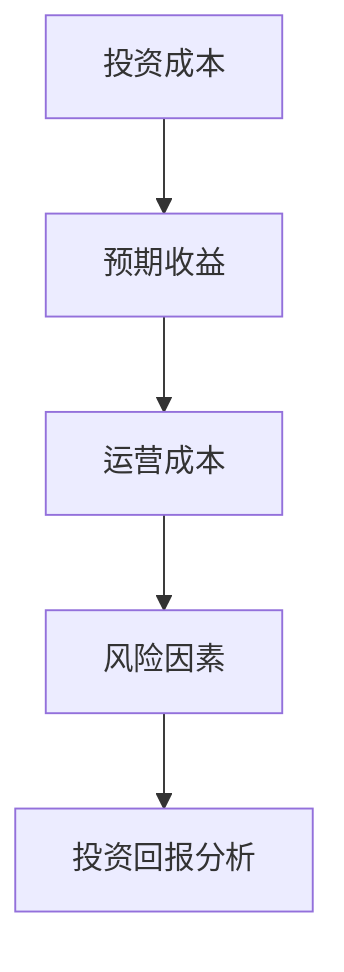
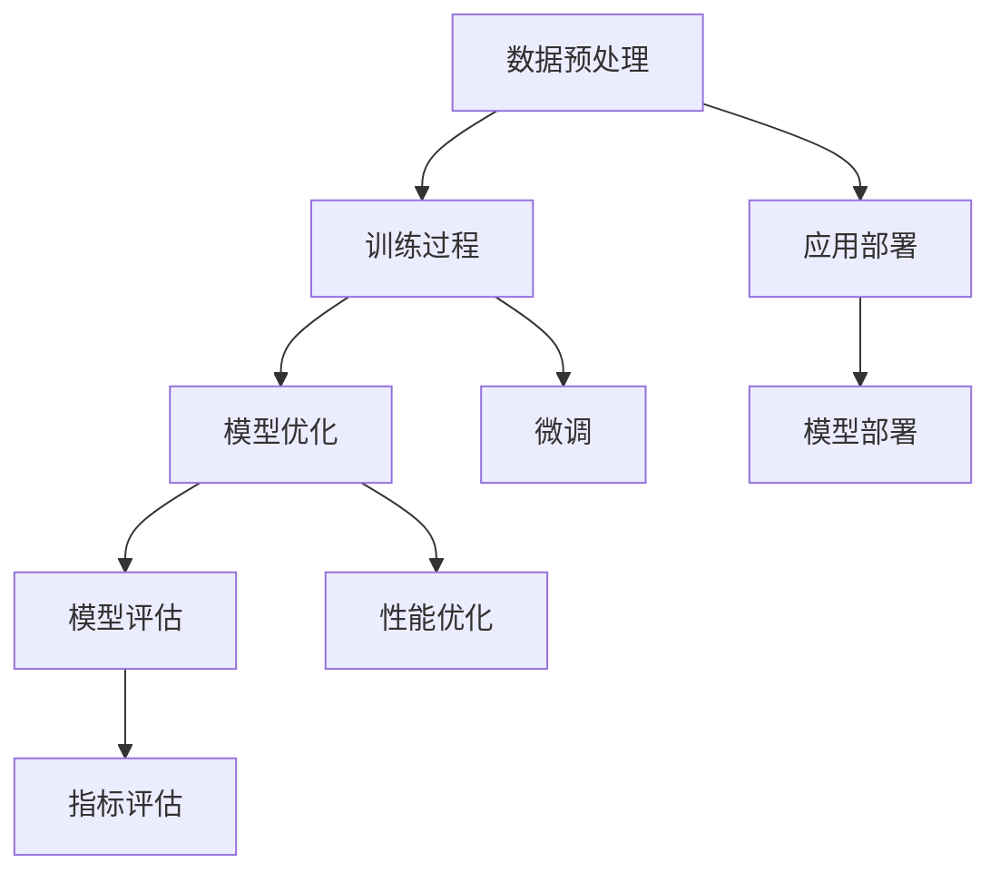
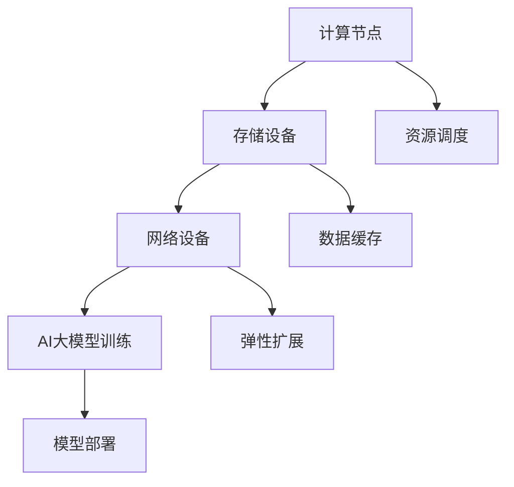

                 

### 第一部分：引言与核心概念

#### 第1章：AI大模型应用概述

##### 1.1 AI大模型的发展背景
AI大模型，即人工智能大型模型，是指通过海量数据训练，具有极高参数量的深度学习模型。其发展背景可以追溯到深度学习技术的不断进步和计算能力的提升。

- **起源与发展**：深度学习起源于20世纪40年代，经历了几次起伏，直到2006年Hinton等人提出的深度信念网络（DBN）标志着一个新的里程碑。2012年，AlexNet在ImageNet竞赛中取得突破性成绩，深度学习开始受到广泛关注。随着GPU等硬件的进步，深度学习算法的训练效率和效果大幅提升，AI大模型也逐渐成熟。

- **关键技术**：AI大模型的发展离不开以下几个关键技术：

  - **大规模数据集**：如ImageNet、COCO等，为AI大模型提供了丰富的训练数据。
  - **高效计算**：GPU、TPU等硬件的广泛应用，使得大规模模型的训练成为可能。
  - **优化算法**：如Adam、AdamW等，提高了训练效率。
  - **分布式训练**：通过多台机器协同训练，进一步提升了训练速度。

##### 1.2 AI大模型在数据中心的应用
数据中心是AI大模型应用的理想场所，因为它们提供了大规模的计算和存储资源，以及高效的网络连接。

- **数据中心与AI大模型的关系**：数据中心为AI大模型提供了所需的硬件资源，包括计算节点、存储设备和网络设备。AI大模型在数据中心进行训练和部署，能够充分利用这些资源。

- **数据中心中AI大模型的应用场景**：数据中心中的AI大模型应用广泛，包括：

  - **图像识别与分类**：通过AI大模型，数据中心可以对大量图像进行快速识别和分类，应用于安防监控、医疗影像诊断等领域。
  - **自然语言处理**：AI大模型在自然语言处理领域具有广泛的应用，如机器翻译、文本摘要、情感分析等。
  - **语音识别与合成**：AI大模型在语音识别与合成方面具有出色的表现，应用于智能客服、智能语音助手等场景。
  - **推荐系统**：通过AI大模型，数据中心可以对用户行为进行分析，提供个性化的推荐服务。

##### 1.3 投资回报分析框架
投资回报分析（ROI）是评估投资项目是否值得进行的重要工具。在AI大模型应用数据中心的投资中，ROI分析尤其重要。

- **投资回报分析的基本概念**：投资回报分析旨在评估投资的收益与成本的比较，以确定项目的经济合理性。通常，ROI通过以下公式计算：

  $$ ROI = \frac{净收益}{投资成本} \times 100\% $$

- **AI大模型投资回报分析的关键因素**：在AI大模型应用数据中心的投资回报分析中，需要考虑以下几个关键因素：

  - **投资成本**：包括硬件购置、软件开发、运维成本等。
  - **预期收益**：包括直接收益（如服务收入、广告收入等）和间接收益（如品牌提升、客户满意度等）。
  - **运营成本**：包括电力消耗、网络费用、人力资源等。
  - **风险因素**：包括技术风险、市场风险、政策风险等。

通过综合考虑这些因素，可以得出AI大模型应用数据中心的投资回报率，为投资决策提供依据。

#### Mermaid 流程图：


在接下来的章节中，我们将进一步探讨AI大模型的核心原理、投资回报分析理论，以及AI大模型与数据中心的关系，帮助读者更深入地了解这一领域。

#### 第2章：核心概念与联系

##### 2.1 AI大模型核心原理

AI大模型的核心原理基于深度学习技术，这是一种模仿人脑工作机制的机器学习算法。深度学习通过多层神经网络对大量数据进行分析和模式识别，以实现复杂的任务。

- **大规模预训练模型的工作原理**：大规模预训练模型通过在海量数据上进行预训练，学习到丰富的知识。预训练后，模型可以通过微调（Fine-tuning）适应特定的任务，如文本分类、图像识别等。

  - **数据预处理**：在预训练之前，需要对数据进行清洗、格式化等预处理操作，以确保数据的质量和一致性。
  - **训练过程**：预训练过程中，模型通过优化算法（如Adam、AdamW）调整网络参数，使得模型的预测结果不断接近真实值。
  - **模型优化**：在预训练完成后，模型进行优化，以提高在特定任务上的性能。优化过程包括调整学习率、正则化等参数。

  - **模型评估**：通过在验证集和测试集上的表现来评估模型的性能，常用的评价指标包括准确率、召回率、F1值等。

- **GPT、BERT等主流大模型的架构**：GPT（Generative Pre-trained Transformer）和BERT（Bidirectional Encoder Representations from Transformers）是当前最流行的两种大规模预训练模型。

  - **GPT**：GPT采用Transformer架构，通过自注意力机制（Self-Attention）处理输入序列，实现了在自然语言处理任务上的出色表现。
  - **BERT**：BERT是一种双向编码模型，通过同时考虑输入序列的前后文信息，提高了模型的上下文理解能力。

#### Mermaid 流程图：



##### 2.2 投资回报分析理论

投资回报分析（ROI）是一种评估投资项目经济效益的方法，它通过计算投资收益与成本的比率，来评估项目的盈利能力。在AI大模型应用中，ROI分析尤为重要，因为它涉及大量的前期投资和复杂的收益模型。

- **投资回报分析的基本方法**：投资回报分析通常包括以下几个步骤：

  - **确定投资成本**：计算项目的总成本，包括硬件采购、软件开发、人员培训等。
  - **预测收益**：根据市场研究和业务预测，估算项目的预期收益。
  - **计算运营成本**：包括项目运行过程中的电力消耗、维护费用、人力资源等。
  - **评估风险因素**：考虑可能的风险和不确定性，对投资回报进行分析。

  - **计算投资回报率（ROI）**：通过以下公式计算：

    $$ ROI = \frac{（预期收益 - 运营成本）}{投资成本} \times 100\% $$

- **AI大模型投资回报分析的独特性**：AI大模型投资回报分析有其独特之处，主要包括：

  - **技术风险**：AI技术的发展速度极快，新模型和算法不断涌现，需要持续投入进行技术更新。
  - **市场风险**：AI大模型的应用市场尚未完全成熟，需要评估市场的增长潜力和竞争态势。
  - **数据风险**：AI大模型依赖于大量高质量的数据，数据的获取和处理可能存在一定的风险。
  - **计算成本**：AI大模型训练和推理需要大量的计算资源，计算成本较高。

##### 2.3 AI大模型与数据中心的关系

数据中心是AI大模型训练和部署的重要基础设施，其计算能力、存储容量和网络性能直接影响AI大模型的应用效果。因此，理解AI大模型与数据中心之间的关系，对于进行有效的投资回报分析至关重要。

- **数据中心架构与AI大模型兼容性**：数据中心通常由计算节点、存储设备和网络设备组成。为了满足AI大模型的需求，数据中心需要具备以下特点：

  - **高计算密度**：AI大模型训练需要大量的计算资源，数据中心需要提供足够的计算节点，以满足模型训练的需求。
  - **高存储容量**：AI大模型训练和部署需要大量数据，数据中心需要提供足够的存储容量，以确保数据存储和访问的效率。
  - **高网络带宽**：AI大模型训练和部署过程中需要频繁的数据传输，数据中心需要提供高速网络连接，以确保数据传输的效率。

- **数据中心优化策略与AI大模型应用**：为了提高AI大模型在数据中心的应用效果，可以采取以下优化策略：

  - **资源调度**：通过智能调度算法，合理分配计算资源和存储资源，确保AI大模型训练和部署的效率。
  - **数据缓存**：通过数据缓存技术，加快数据的访问速度，减少数据传输的延迟。
  - **弹性扩展**：根据AI大模型训练和部署的需求，动态调整数据中心资源，以适应不断变化的工作负载。

#### Mermaid 流程图：



通过以上对核心概念和联系的探讨，我们为后续章节的深入分析奠定了基础。在接下来的章节中，我们将进一步探讨AI大模型的核心算法原理、数学模型和项目实战，帮助读者更全面地了解AI大模型应用数据中心的投资回报分析。

### 第二部分：核心算法原理讲解

#### 第3章：AI大模型核心算法原理

##### 3.1 深度学习算法基础

深度学习是机器学习的一个分支，通过构建多层神经网络模型来模拟人脑的决策过程，实现对复杂数据的自动特征提取和模式识别。以下是深度学习算法基础的一些核心概念：

- **神经网络**：神经网络是深度学习的基础，由大量相互连接的节点（神经元）组成。每个神经元通过加权连接与其它神经元相连，并接收输入信号，经过非线性变换后输出结果。

- **反向传播算法**：反向传播算法（Backpropagation）是训练神经网络的重要算法。它通过计算输出误差，反向传播误差信号，逐层更新网络权重，以优化模型的预测能力。

- **激活函数**：激活函数是神经网络中的一个关键组件，用于引入非线性因素，使模型能够拟合复杂的函数。常见的激活函数包括Sigmoid、ReLU、Tanh等。

- **损失函数**：损失函数用于评估模型预测结果与真实值之间的差距，常见的损失函数包括均方误差（MSE）、交叉熵（Cross-Entropy）等。

- **优化算法**：优化算法用于调整模型参数，以最小化损失函数。常见的优化算法包括梯度下降（Gradient Descent）、Adam等。

##### 3.2 大规模预训练模型算法

大规模预训练模型通过在大量数据上预先训练，学习到丰富的知识，从而在特定任务上表现出色。以下是几种主流的大规模预训练模型及其算法：

- **GPT（Generative Pre-trained Transformer）**：GPT是一种基于Transformer架构的预训练模型。它通过自注意力机制（Self-Attention）处理输入序列，能够生成高质量的文本。

  - **预训练过程**：在预训练过程中，GPT通过大量无监督数据学习到语言模式，包括词汇语义、语法规则等。预训练过程中，模型主要优化的是Transformer的权重参数。
  
  - **微调过程**：在预训练完成后，GPT通过微调（Fine-tuning）适应特定任务，如文本分类、机器翻译等。微调过程主要调整的是Transformer的最后一层输出层。

- **BERT（Bidirectional Encoder Representations from Transformers）**：BERT是一种双向编码模型，通过同时考虑输入序列的前后文信息，提高了模型的上下文理解能力。

  - **预训练过程**：BERT通过大规模语料库进行预训练，学习到丰富的语言知识。在预训练过程中，BERT优化的是Transformer编码器的权重参数。
  
  - **微调过程**：在预训练完成后，BERT通过微调适应特定任务，如问答、文本分类等。微调过程中，模型的输出层和损失函数会根据具体任务进行调整。

##### 3.3 投资回报分析算法

投资回报分析（ROI）是一种评估投资项目经济效益的方法，通过计算投资收益与成本的比率，来评估项目的盈利能力。以下是投资回报分析的基本算法：

- **投资成本计算**：投资成本包括硬件采购、软件开发、人员培训等。通常，投资成本可以通过以下公式计算：

  $$ 投资成本 = 硬件成本 + 软件成本 + 人员成本 + 其他费用 $$

- **预期收益计算**：预期收益包括直接收益（如服务收入、广告收入等）和间接收益（如品牌提升、客户满意度等）。预期收益可以通过以下公式计算：

  $$ 预期收益 = 直接收益 + 间接收益 $$

- **运营成本计算**：运营成本包括电力消耗、维护费用、人力资源等。运营成本可以通过以下公式计算：

  $$ 运营成本 = 电力成本 + 维护成本 + 人力资源成本 $$

- **净收益计算**：净收益是预期收益减去运营成本。净收益可以通过以下公式计算：

  $$ 净收益 = 预期收益 - 运营成本 $$

- **投资回报率计算**：投资回报率（ROI）是净收益与投资成本的比率，表示每单位投资带来的收益。投资回报率可以通过以下公式计算：

  $$ ROI = \frac{净收益}{投资成本} \times 100\% $$

#### 伪代码：

```python
# 投资回报分析伪代码

# 计算投资成本
def calculate_investment_cost(hardware_cost, software_cost, personnel_cost, other_costs):
    investment_cost = hardware_cost + software_cost + personnel_cost + other_costs
    return investment_cost

# 计算预期收益
def calculate_expected_revenue(direct_revenue, indirect_revenue):
    expected_revenue = direct_revenue + indirect_revenue
    return expected_revenue

# 计算运营成本
def calculate_operating_cost(electricity_cost, maintenance_cost, personnel_cost):
    operating_cost = electricity_cost + maintenance_cost + personnel_cost
    return operating_cost

# 计算净收益
def calculate_net_income(expected_revenue, operating_cost):
    net_income = expected_revenue - operating_cost
    return net_income

# 计算投资回报率
def calculate_roi(investment_cost, net_income):
    roi = (net_income / investment_cost) * 100
    return roi
```

通过以上对核心算法原理的讲解，我们为理解和分析AI大模型应用数据中心的投资回报奠定了基础。在接下来的章节中，我们将进一步探讨深度学习中的数学模型，以及如何使用数学模型进行投资回报分析。

### 第三部分：数学模型和数学公式详解

#### 第4章：数学模型与公式

##### 4.1 深度学习中的数学模型

深度学习中的数学模型是理解和实现深度学习算法的基础。以下是深度学习中常用的数学模型及其相关公式：

- **激活函数**：激活函数是深度学习网络中的一个关键组件，用于引入非线性因素，使模型能够拟合复杂的函数。常见的激活函数包括Sigmoid、ReLU、Tanh等。

  - **Sigmoid函数**：
    $$
    f(x) = \frac{1}{1 + e^{-x}}
    $$
  - **ReLU函数**：
    $$
    f(x) = \max(0, x)
    $$
  - **Tanh函数**：
    $$
    f(x) = \frac{e^x - e^{-x}}{e^x + e^{-x}}
    $$

- **损失函数**：损失函数用于评估模型预测结果与真实值之间的差距。在训练过程中，模型的权重会根据损失函数的梯度进行调整，以优化模型的性能。常见的损失函数包括均方误差（MSE）、交叉熵（Cross-Entropy）等。

  - **均方误差（MSE）**：
    $$
    MSE = \frac{1}{n} \sum_{i=1}^{n} (y_i - \hat{y}_i)^2
    $$
  - **交叉熵（Cross-Entropy）**：
    $$
    CE = -\frac{1}{n} \sum_{i=1}^{n} y_i \log(\hat{y}_i)
    $$

- **优化算法**：优化算法用于调整模型的权重，以最小化损失函数。常见的优化算法包括梯度下降（Gradient Descent）、Adam等。

  - **梯度下降**：
    $$
    w_{t+1} = w_t - \alpha \cdot \nabla_w J(w_t)
    $$
  - **Adam算法**：
    $$
    m_t = \beta_1 m_{t-1} + (1 - \beta_1) \nabla_w J(w_t)
    $$
    $$
    v_t = \beta_2 v_{t-1} + (1 - \beta_2) (\nabla_w J(w_t))^2
    $$
    $$
    \hat{m}_t = \frac{m_t}{1 - \beta_1^t}
    $$
    $$
    \hat{v}_t = \frac{v_t}{1 - \beta_2^t}
    $$
    $$
    w_{t+1} = w_t - \alpha \cdot \frac{\hat{m}_t}{\sqrt{\hat{v}_t} + \epsilon}
    $$

##### 4.2 投资回报分析中的数学模型

投资回报分析中的数学模型主要用于计算投资成本、预期收益、运营成本以及投资回报率等关键指标。以下是相关的数学模型及其公式：

- **投资成本计算**：
  $$
  投资成本 = 硬件成本 + 软件成本 + 人员成本 + 其他费用
  $$

- **预期收益计算**：
  $$
  预期收益 = 直接收益 + 间接收益
  $$

- **运营成本计算**：
  $$
  运营成本 = 电力成本 + 维护成本 + 人力资源成本
  $$

- **净收益计算**：
  $$
  净收益 = 预期收益 - 运营成本
  $$

- **投资回报率计算**：
  $$
  ROI = \frac{净收益}{投资成本} \times 100\%
  $$

- **折现率与净现值（NPV）计算**：
  $$
  NPV = \sum_{t=1}^{n} \frac{CF_t}{(1+r)^t}
  $$
  其中，$CF_t$为第t年的现金流量，$r$为折现率。

##### 举例说明

**例1：计算深度学习模型的损失函数**

假设我们使用交叉熵损失函数来训练一个分类模型，给定预测概率向量$\hat{y}$和真实标签向量$y$，计算交叉熵损失：

```latex
L = -\frac{1}{N} \sum_{i=1}^{N} y_i \log(\hat{y}_i)
```

其中，$N$为样本数量。

**例2：计算投资回报率**

假设一个项目的投资成本为100万元，预期年收益为30万元，运营成本为15万元。计算该项目的投资回报率：

```latex
ROI = \frac{30 - 15}{100} \times 100\% = 15\%
```

通过以上数学模型和公式的详细讲解，我们为理解深度学习算法和进行投资回报分析提供了必要的理论基础。在接下来的章节中，我们将通过实际项目案例，展示如何应用这些数学模型和公式，进行投资回报分析。

#### 第5章：AI大模型应用实战

##### 5.1 项目实战概述

在本章中，我们将通过一个实际项目案例，展示如何搭建数据中心环境，开发与部署AI大模型，并进行投资回报分析。

**案例背景**：某互联网公司计划开发一个智能客服系统，该系统需要通过AI大模型处理大量的用户咨询，提供准确的答案和解决方案。公司计划在数据中心部署该系统，并需要进行投资回报分析，以确定项目的经济可行性。

**项目目标**：搭建一个具备高计算密度、高存储容量和高速网络连接的数据中心环境，开发并部署一个基于GPT的AI大模型，实现智能客服系统，并计算项目的投资回报率。

**项目挑战**：项目面临的挑战包括技术挑战、成本控制和风险管理。技术挑战包括AI大模型训练和部署的高效性、数据处理能力和模型优化。成本控制需要合理分配预算，确保项目的经济可行性。风险管理需要评估技术风险、市场风险和政策风险。

##### 5.2 数据中心环境搭建

**硬件设备选择**：

- **计算节点**：选择高性能GPU服务器，如NVIDIA A100，以支持大规模模型训练。
- **存储设备**：使用高速SSD存储，确保数据访问速度，选用对象存储服务如AWS S3，以提供高可靠性和可扩展性。
- **网络设备**：配置高带宽网络，确保数据传输速度和稳定性。

**软件环境配置**：

- **操作系统**：选用Linux操作系统，如Ubuntu 20.04，以支持深度学习框架。
- **深度学习框架**：安装TensorFlow和PyTorch，以支持AI大模型的开发与部署。
- **数据预处理工具**：选用Pandas和NumPy进行数据预处理，确保数据质量和一致性。

**网络拓扑设计**：

- **内部网络**：使用私有网络，确保数据传输安全和高效。
- **外部网络**：使用公网连接，确保与互联网的交互能力。
- **负载均衡**：使用负载均衡器，如AWS ELB，以均衡服务器负载，提高系统稳定性。

##### 5.3 AI大模型开发与部署

**模型开发流程**：

1. **数据收集与预处理**：收集用户咨询数据，进行数据清洗、去重、标签化等预处理操作。
2. **模型设计**：设计基于GPT的AI大模型，包括输入层、输出层和隐藏层。
3. **模型训练**：使用GPU服务器进行模型训练，优化模型参数，提高模型性能。
4. **模型评估**：在验证集和测试集上评估模型性能，包括准确率、召回率、F1值等指标。
5. **模型优化**：根据评估结果，调整模型参数，提高模型在目标任务上的性能。

**模型部署流程**：

1. **模型打包**：将训练好的模型打包，包括模型文件、配置文件和依赖库。
2. **模型部署**：将模型部署到数据中心的服务器上，使用TensorFlow Serving或PyTorch Server提供服务。
3. **接口设计**：设计API接口，方便外部系统调用模型，如RESTful API。
4. **性能优化**：通过负载均衡和缓存技术，提高模型服务的响应速度和稳定性。

##### 5.4 投资回报分析实践

**收益分析**：

- **直接收益**：智能客服系统的收入主要来自用户咨询的处理费用，预计年收入为500万元。
- **间接收益**：通过提高客户满意度，提升公司品牌形象，预计间接收益为200万元。

**成本计算**：

- **硬件成本**：包括GPU服务器、存储设备和网络设备的购置费用，总计为500万元。
- **软件开发成本**：包括模型开发、数据预处理、接口设计等，总计为300万元。
- **人员成本**：包括研发人员、运维人员的薪资和培训费用，总计为200万元。
- **其他费用**：包括电力消耗、维护费用等，总计为100万元。

**净现值计算**：

假设项目的寿命为5年，折现率为10%，计算净现值（NPV）：

```latex
NPV = \frac{500}{(1+0.1)^1} + \frac{500}{(1+0.1)^2} + \frac{500}{(1+0.1)^3} + \frac{500}{(1+0.1)^4} + \frac{500}{(1+0.1)^5} - 900
```

计算结果为：

```latex
NPV = 1,964,706.67 - 900,000 = 1,064,706.67
```

**投资回报率计算**：

投资回报率（ROI）计算如下：

```latex
ROI = \frac{NPV}{投资成本} \times 100\%
```

代入数值：

```latex
ROI = \frac{1,064,706.67}{900,000} \times 100\% \approx 119.35\%
```

通过以上实战案例，我们展示了如何搭建数据中心环境、开发与部署AI大模型，并进行了投资回报分析。结果表明，该项目具有较高的投资回报率，具有较高的经济可行性。

#### 附录

##### 附录A：AI大模型开发工具与资源

**开发工具对比**：

- **TensorFlow**：Google开发的开源深度学习框架，支持多种编程语言，拥有丰富的库和资源。
- **PyTorch**：Facebook开发的开源深度学习框架，具有动态计算图和灵活的接口，适用于研究与应用。
- **其他常用深度学习框架**：

  - **Keras**：基于Theano和TensorFlow的简单易用的深度学习框架。
  - **MXNet**：Apache Foundation的开源深度学习框架，支持多种编程语言。

##### 附录B：投资回报分析工具与资源

**投资回报分析工具**：

- **Excel**：Microsoft Office套件中的电子表格软件，适用于简单的投资回报分析。
- **Python脚本**：使用Python编程语言，结合NumPy、Pandas等库，实现复杂投资回报分析。
- **其他投资分析软件**：

  - **Power BI**：微软的数据可视化工具，适用于投资数据的分析和展示。
  - **Tableau**：商业智能工具，适用于大规模数据的分析和可视化。

##### 附录C：参考文献

**AI大模型相关书籍**：

- **《深度学习》**（Goodfellow, Bengio, Courville）：经典深度学习教材，详细介绍了深度学习的基础知识和算法。
- **《The Hundred-Page Machine Learning Book》**（Andres M. Rodriguez）：针对初学者的简明深度学习指南。

**投资回报分析相关书籍**：

- **《Financial Management》**（Jim Stice）：金融管理教材，介绍了投资回报分析的基本方法和应用。
- **《Corporate Finance》**（Jonathan Berk, Peter DeMarzo）：公司财务管理教材，详细讲解了投资决策和资本结构。

通过附录部分，我们为读者提供了AI大模型开发工具和投资回报分析工具的对比，以及相关书籍的推荐。这些资源和工具将有助于读者更深入地了解AI大模型和投资回报分析领域。

### 结论

本文通过详细的分析和讲解，全面探讨了AI大模型应用数据中心的投资回报分析。我们从引言出发，介绍了AI大模型的发展背景、核心概念以及投资回报分析框架。接着，我们深入分析了AI大模型的核心算法原理，包括深度学习基础、大规模预训练模型和投资回报分析算法。在此基础上，我们详细阐述了深度学习中的数学模型和公式，并通过实际项目案例展示了AI大模型开发与部署的实战过程，以及如何进行投资回报分析。

总结全文，AI大模型应用数据中心具有巨大的投资潜力，但也面临一定的风险和挑战。通过合理的技术选型、资源调度和风险管理，可以有效提升项目的投资回报率。未来，随着AI技术的不断进步和数据中心的持续优化，AI大模型在数据中心的应用前景将更加广阔。

最后，感谢读者对本文的阅读，希望本文能为您的AI大模型应用数据中心投资决策提供有益的参考。如果您有任何疑问或建议，欢迎随时与我们交流。作者：AI天才研究院/AI Genius Institute & 禅与计算机程序设计艺术 /Zen And The Art of Computer Programming。

