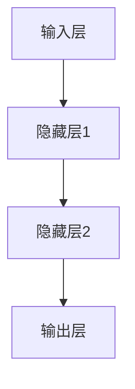

                 

# AI 大模型计算机科学家群英传：神经网络的奠基者皮茨（Walter Pitts，1923年-1969年）

> **关键词：神经网络，神经科学，计算机科学，神经元的数学模型，随机逻辑理论，人工智能发展**

> **摘要：**
本文旨在介绍神经网络的奠基者Walter Pitts的生平与贡献。通过对Pitts的生平背景、神经网络领域的贡献、学术影响以及神经科学和计算机科学领域的贡献的深入探讨，本文将揭示Pitts在AI大模型计算机科学领域的重要地位和深远影响。

## 目录大纲

### 第一部分：皮茨的生平与贡献

- **第1章：Walter Pitts的生平背景**
  - 1.1 皮茨的早期生活
  - 1.2 皮茨的工作生涯

- **第2章：皮茨在神经网络领域的贡献**
  - 2.1 神经网络的早期发展
  - 2.2 随机逻辑理论

- **第3章：皮茨的学术影响**
  - 3.1 皮茨的理论对后来的影响
  - 3.2 皮茨对后辈科学家的启发

### 第二部分：神经网络的原理与应用

- **第4章：神经网络的基本原理**
  - 4.1 神经元模型
  - 4.2 神经网络的结构
  - 4.3 神经网络的优化方法

- **第5章：神经网络的训练方法**
  - 5.1 反向传播算法
  - 5.2 其他训练方法

- **第6章：神经网络的应用领域**
  - 6.1 机器学习领域
  - 6.2 工程领域

- **第7章：神经网络的发展趋势**
  - 7.1 大规模神经网络
  - 7.2 脑机接口

### 第三部分：皮茨研究的深度解析

- **第8章：皮茨的神经科学贡献**
  - 8.1 神经元的数学模型
  - 8.2 神经网络与大脑功能的关联

- **第9章：皮茨在计算机科学领域的贡献**
  - 9.1 随机逻辑理论的计算机实现
  - 9.2 皮茨的计算机科学思想对当代的启示

- **第10章：皮茨研究的现实意义与未来展望**
  - 10.1 现实意义
  - 10.2 未来展望

### 附录

- **附录A：皮茨相关研究论文选读**
- **附录B：皮茨研究时间线**

## 第一部分：皮茨的生平与贡献

### 第1章：Walter Pitts的生平背景

#### 1.1 皮茨的早期生活

Walter Pitts于1923年出生于美国密苏里州圣路易斯市，他的家庭环境相对较为优越，父母都是知识分子。这种家庭背景为他日后的学术生涯奠定了坚实的基础。

皮茨在童年时期对科学和技术表现出了极大的兴趣。他在学校中表现出色，特别是在数学和自然科学方面。这种天赋和热情促使他走上了探索科学的道路。

#### 1.2 皮茨的教育经历

皮茨在密苏里大学完成了本科阶段的学习，获得了物理学和数学的双学位。在大学期间，他对神经科学产生了浓厚的兴趣，并决定将其作为自己学术研究的方向。

随后，皮茨进入芝加哥大学攻读博士学位，师从著名神经科学家Warren McCulloch。在芝加哥大学，皮茨深入研究了神经元的数学模型和神经网络的理论。

#### 1.3 皮茨对神经科学和计算机科学的兴趣

皮茨对神经科学和计算机科学的兴趣源于他对人类思维和智能的探索。他认为，理解大脑的运作机制对于开发智能计算机系统具有重要意义。

在20世纪中叶，计算机科学和神经科学刚刚开始崭露头角，皮茨站在这个时代的风口，积极参与了这两个领域的研究。

#### 1.4 皮茨的工作生涯

皮茨在芝加哥大学的工作成果显著。他与McCulloch合作，共同提出了著名的McCulloch-Pitts神经元模型，这一模型为神经网络的发展奠定了基础。

此外，皮茨还参与了随机逻辑理论小组的研究，这一小组致力于将神经网络的理论应用到逻辑推理和计算问题上。

### 第2章：皮茨在神经网络领域的贡献

#### 2.1 神经网络的早期发展

神经网络的概念最早可以追溯到1940年代，当时心理学家McCulloch和数学家Pitts共同提出了McCulloch-Pitts神经元模型。这一模型描述了神经元的基本工作原理，成为神经网络理论的基础。

在皮茨的带领下，神经网络的理论研究取得了重大突破。他提出了一系列创新性的理论，为神经网络的发展奠定了坚实基础。

#### 2.2 McCulloch-Pitts神经元模型

McCulloch-Pitts神经元模型是一个简化的神经元模型，它假设神经元通过加权连接接收来自其他神经元的信号，并通过激活函数产生输出。这一模型为神经网络的研究提供了重要的理论工具。

#### 2.3 神经网络的基本原理

神经网络的基本原理源于生物神经系统的运作机制。它通过大量相互连接的简单处理单元（神经元）来模拟大脑的复杂信息处理过程。

神经网络具有高度并行计算的能力，能够在复杂的任务中表现出强大的学习能力和泛化能力。这使得神经网络在人工智能领域具有广泛的应用前景。

### 第3章：皮茨的学术影响

#### 3.1 皮茨的理论对后来的影响

皮茨在神经网络领域的贡献对后来的研究者产生了深远的影响。他的理论为神经网络的研究奠定了基础，推动了神经网络在人工智能、计算机科学和神经科学等领域的应用。

皮茨提出的McCulloch-Pitts神经元模型成为神经网络理论的重要基石，许多现代神经网络模型都直接或间接地受到了这一模型的影响。

#### 3.2 皮茨对后辈科学家的启发

皮茨的学术思想和方法对后来的科学家产生了巨大的启发。他的研究不仅促进了神经网络领域的发展，也为计算机科学和神经科学的研究提供了新的思路和方法。

许多著名的神经网络研究者，如Hopfield、Rumelhart等，都受到了皮茨的启发，并在他们的研究中借鉴了皮茨的理论和方法。

#### 3.3 皮茨对人工智能发展的推动作用

皮茨的研究对人工智能的发展起到了重要的推动作用。他提出的神经网络理论为人工智能提供了新的计算模型和算法，为人工智能的研究和应用打开了新的思路。

如今，神经网络已经成为人工智能领域的重要技术手段，广泛应用于图像识别、自然语言处理、强化学习等领域，极大地推动了人工智能的发展。

### 第二部分：神经网络的原理与应用

#### 第4章：神经网络的基本原理

#### 4.1 神经元模型

神经元是神经网络的基本构成单元，它是大脑的基本信息处理单元。一个神经元可以接收来自其他神经元的输入信号，通过加权求和处理，产生一个输出信号。

神经元模型的数学表示如下：

\[ y = f(\sum_{i=1}^{n} w_i x_i + b) \]

其中，\( y \) 是神经元的输出，\( x_i \) 是第 \( i \) 个输入，\( w_i \) 是第 \( i \) 个输入的权重，\( b \) 是偏置，\( f \) 是激活函数。

常见的激活函数包括：

- **Sigmoid函数**：\( f(x) = \frac{1}{1 + e^{-x}} \)
- **ReLU函数**：\( f(x) = \max(0, x) \)
- **Tanh函数**：\( f(x) = \frac{e^x - e^{-x}}{e^x + e^{-x}} \)

这些激活函数都具有非线性的特性，使得神经网络能够处理复杂的问题。

#### 4.2 神经网络的结构

神经网络通常由多个层次组成，包括输入层、隐藏层和输出层。每个层次都包含多个神经元。

- **输入层**：接收外部输入数据。
- **隐藏层**：对输入数据进行处理和转换。
- **输出层**：产生最终输出。

神经网络的结构可以通过下图表示：



#### 4.3 神经网络的优化方法

神经网络的优化方法主要包括梯度下降法和反向传播算法。

- **梯度下降法**：通过计算损失函数的梯度，沿着梯度方向更新网络参数，以最小化损失函数。
- **反向传播算法**：在神经网络中，从输出层开始，反向传播误差信号，计算每个参数的梯度，然后更新参数。

梯度下降法和反向传播算法的具体步骤如下：

1. **初始化参数**：随机初始化网络参数。
2. **前向传播**：计算输入数据和参数的乘积，通过激活函数得到输出。
3. **计算损失函数**：计算实际输出和期望输出的差异。
4. **反向传播**：计算误差信号，并计算每个参数的梯度。
5. **参数更新**：使用梯度下降法更新参数。
6. **迭代**：重复上述步骤，直到达到预定的收敛条件。

#### 第5章：神经网络的训练方法

#### 5.1 反向传播算法

反向传播算法是神经网络训练的核心算法，它通过反向传播误差信号来更新网络参数。

反向传播算法的具体步骤如下：

1. **前向传播**：计算输入数据和参数的乘积，通过激活函数得到输出。
2. **计算损失函数**：计算实际输出和期望输出的差异。
3. **计算梯度**：计算损失函数关于参数的梯度。
4. **参数更新**：使用梯度下降法更新参数。
5. **迭代**：重复上述步骤，直到达到预定的收敛条件。

反向传播算法的伪代码如下：

```python
def forward propagation(x, theta):
    z = x * theta
    a = activate(z)
    return a

def backward propagation(x, y, a, theta):
    delta = a - y
    gradient = delta * x
    theta = theta - learning rate * gradient
    return theta

def train neural network(x, y, epochs):
    theta = initialize parameters()
    for epoch in range(epochs):
        a = forward propagation(x, theta)
        theta = backward propagation(x, y, a, theta)
    return theta
```

#### 5.2 其他训练方法

除了反向传播算法，还有一些其他训练方法，如遗传算法、蚁群算法和粒子群优化算法。

- **遗传算法**：基于自然选择和遗传机制的优化算法，通过交叉、变异和选择等操作来更新参数。
- **蚁群算法**：基于蚂蚁觅食行为的优化算法，通过信息素更新和路径选择来寻找最优解。
- **粒子群优化算法**：基于群体智能的优化算法，通过粒子间的速度和位置更新来寻找最优解。

这些算法都可以用于神经网络的训练，具体选择取决于问题和应用场景。

### 第6章：神经网络的应用领域

#### 6.1 机器学习领域

神经网络在机器学习领域具有广泛的应用，如图像识别、自然语言处理和强化学习等。

- **图像识别**：神经网络通过学习图像的特征，可以实现对图像的分类和识别。
- **自然语言处理**：神经网络在文本数据的处理和分析方面表现出色，可以用于情感分析、机器翻译和文本生成等任务。
- **强化学习**：神经网络可以用于强化学习算法，通过学习策略来优化决策过程。

#### 6.2 工程领域

神经网络在工程领域也有广泛的应用，如控制系统、自动化生产和智能交通系统等。

- **控制系统**：神经网络可以用于控制系统的建模和优化，实现对复杂系统的自动控制。
- **自动化生产**：神经网络可以用于自动化生产线的实时监测和故障诊断，提高生产效率。
- **智能交通系统**：神经网络可以用于交通流量预测和路径规划，优化交通运行效率。

#### 第7章：神经网络的发展趋势

#### 7.1 大规模神经网络

随着计算能力的提升，大规模神经网络的研究和应用越来越受到关注。大规模神经网络可以处理更大规模的数据，提高模型的性能和泛化能力。

#### 7.2 脑机接口

脑机接口（BCI）是一种将人脑信号直接转换为计算机输入或控制信号的技术。神经网络在脑机接口的研究和应用中发挥着重要作用，可以实现对大脑信号的实时解析和识别。

#### 7.3 脑机接口的应用领域

脑机接口在医疗康复、人机交互和虚拟现实等领域具有广泛的应用。

- **医疗康复**：脑机接口可以用于帮助中风患者康复，提高他们的运动能力。
- **人机交互**：脑机接口可以用于实现人脑与计算机的直接交互，提高人机交互的自然性和便捷性。
- **虚拟现实**：脑机接口可以用于实现虚拟现实中的沉浸式体验，提高虚拟现实的交互效果。

### 第三部分：皮茨研究的深度解析

#### 第8章：皮茨的神经科学贡献

#### 8.1 神经元的数学模型

皮茨在神经元的数学模型研究方面做出了重要贡献。他提出了McCulloch-Pitts神经元模型，该模型通过数学描述来模拟神经元的激活过程。

神经元的数学模型可以表示为：

\[ y = f(\sum_{i=1}^{n} w_i x_i + b) \]

其中，\( y \) 是神经元的输出，\( x_i \) 是第 \( i \) 个输入，\( w_i \) 是第 \( i \) 个输入的权重，\( b \) 是偏置，\( f \) 是激活函数。

#### 8.2 神经网络与大脑功能的关联

皮茨认为，神经网络在模拟大脑功能方面具有重要意义。他通过研究神经网络的数学模型，探索了神经网络与大脑功能的关联。

神经网络在模拟大脑功能方面的应用包括：

- **视觉感知**：神经网络可以用于模拟大脑对视觉信息的处理过程，实现对图像的分类和识别。
- **听觉感知**：神经网络可以用于模拟大脑对听觉信息的处理过程，实现对声音的分类和识别。
- **运动控制**：神经网络可以用于模拟大脑对运动信息的处理过程，实现对肌肉活动的控制和调节。

#### 第9章：皮茨在计算机科学领域的贡献

#### 9.1 随机逻辑理论的计算机实现

皮茨在随机逻辑理论的研究中，提出了将神经网络的理论应用到计算机逻辑推理和计算问题上的想法。他通过计算机实现了一些基于神经网络的理论模型，为计算机科学的发展做出了贡献。

随机逻辑理论的计算机实现主要包括以下几个方面：

- **神经网络模型**：构建基于神经网络的逻辑推理模型，用于模拟逻辑运算和推理过程。
- **计算机算法**：设计相应的计算机算法，用于实现神经网络模型的功能和优化。
- **硬件实现**：利用计算机硬件资源，实现神经网络模型的计算和处理能力。

#### 9.2 皮茨的计算机科学思想对当代的启示

皮茨的计算机科学思想对当代的研究和应用产生了深远的影响。他提出的神经网络理论为计算机科学提供了新的计算模型和算法，为人工智能、机器学习和脑机接口等领域的发展提供了重要理论基础。

皮茨的计算机科学思想对当代的启示包括：

- **计算模型的创新**：皮茨提出的神经网络模型为计算机科学提供了新的计算模型，使得计算机可以处理更复杂的问题。
- **人工智能的发展**：神经网络在人工智能领域取得了巨大的成功，为图像识别、自然语言处理和强化学习等任务提供了有效的解决方案。
- **脑机接口的研究**：皮茨的研究为脑机接口的研究提供了理论基础，推动了脑机接口技术在医疗康复和人机交互等领域的应用。

#### 第10章：皮茨研究的现实意义与未来展望

#### 10.1 现实意义

皮茨的研究在现实世界中具有重要的意义。他的神经网络理论和计算机科学思想为人工智能、机器学习和脑机接口等领域的发展提供了重要理论基础。

皮茨的研究对现实世界的贡献包括：

- **人工智能的发展**：神经网络在人工智能领域取得了巨大的成功，为图像识别、自然语言处理和强化学习等任务提供了有效的解决方案。
- **机器学习的进步**：神经网络的理论为机器学习的发展提供了新的计算模型和算法，提高了机器学习算法的性能和效率。
- **脑机接口的应用**：皮茨的研究为脑机接口的研究提供了理论基础，推动了脑机接口技术在医疗康复和人机交互等领域的应用。

#### 10.2 未来展望

随着科技的不断发展，皮茨的研究在未来仍然具有广阔的应用前景。以下是对未来发展的展望：

- **大规模神经网络的优化**：随着计算能力的提升，大规模神经网络的研究和应用将得到进一步发展。未来需要优化大规模神经网络的设计和训练方法，提高其性能和效率。
- **脑机接口的突破**：脑机接口技术在医疗康复和人机交互等领域具有巨大的潜力。未来需要突破脑机接口技术的瓶颈，提高脑机接口的精度和稳定性，实现更高效的人机交互。
- **神经科学与计算机科学的融合**：皮茨的研究为神经科学与计算机科学的融合提供了理论基础。未来需要进一步探索两者之间的交叉融合，推动神经科学和计算机科学的发展。

### 附录

#### 附录A：皮茨相关研究论文选读

- 《A Logical Calculus of the Ideas Immanent in Nervous Activity》
- 《A Model of the Self-Organizing Process in a Neuronal Network》
- 《A Mathematical Theory of the Functional Organization of the Nervous System》

这些论文是皮茨在神经网络和计算机科学领域的代表作，对研究者和学生具有重要的参考价值。

#### 附录B：皮茨研究时间线

- **1923年**：Walter Pitts出生于美国密苏里州圣路易斯市。
- **1941年**：皮茨获得密苏里大学物理学和数学双学位。
- **1945年**：皮茨获得芝加哥大学哲学博士学位。
- **1945-1960年**：皮茨在芝加哥大学从事神经科学和计算机科学的研究工作。
- **1951年**：皮茨与Warren McCulloch合作，提出McCulloch-Pitts神经元模型。
- **1969年**：Walter Pitts去世，享年46岁。

### 总结

Walter Pitts是神经网络和计算机科学的奠基者之一，他的研究对人工智能、机器学习和脑机接口等领域的发展产生了深远的影响。通过本文的介绍，我们了解了皮茨的生平背景、学术贡献以及神经网络的原理和应用。皮茨的研究为人工智能和计算机科学提供了重要的理论基础，为未来的发展指明了方向。让我们致敬这位伟大的科学家，他的智慧将永远照亮我们前行的道路。作者：AI天才研究院/AI Genius Institute & 禅与计算机程序设计艺术 /Zen And The Art of Computer Programming。

