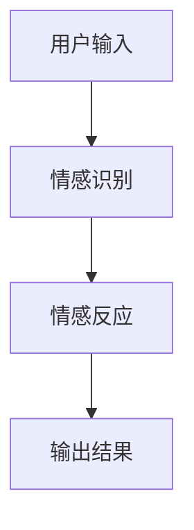

                 

# AIGC的未来智能家居情感互动：人机共情的提示词工程

## 关键词
- AIGC
- 智能家居
- 情感互动
- 提示词工程
- 深度学习
- 语音识别
- 自然语言处理
- 人机共情

## 摘要
本文深入探讨了AIGC（自动内容生成）在未来智能家居情感互动中的应用，以及如何通过人机共情的提示词工程实现智能家居设备与用户之间的情感交流。文章首先介绍了AIGC与未来智能家居情感互动的基础概念，随后详细阐述了AIGC技术、智能家居情感识别与反应技术，并提供了实际应用案例。最后，文章探讨了AIGC与智能家居情感互动的未来发展，以及面临的挑战和解决方案。

### 第一部分：AIGC的未来智能家居情感互动基础

#### 第1章：AIGC与未来智能家居情感互动概述

##### 1.1 AIGC的概念与特点

AIGC，即自动内容生成（Auto Generated Content），是一种利用人工智能技术自动生成文本、图像、音频和视频等数字内容的方法。AIGC的特点主要包括：

- **自动性**：AIGC通过算法和模型自动生成内容，无需人工干预。
- **智能性**：AIGC具备一定的智能判断能力，可以根据输入数据和预设规则生成相关内容。
- **交互性**：AIGC可以与用户进行互动，生成个性化内容。

##### 1.2 智能家居情感互动的概念

智能家居情感互动是指智能设备能够感知用户的情感状态，并根据用户的情感反馈做出相应的反应，从而实现情感层面的交流。智能家居情感互动的核心概念包括：

- **智能家居**：通过物联网技术将家庭设备连接起来，实现远程控制和自动化管理。
- **情感互动**：智能设备能够识别用户的情感状态，并做出相应的情感反应。

##### 1.3 AIGC在未来智能家居中的地位与作用

AIGC在未来智能家居中的地位和作用至关重要：

- **情感识别**：AIGC能够通过声音、面部表情等数据识别用户的情感状态，为智能家居设备提供情感识别能力。
- **情感反应**：AIGC可以基于用户情感状态生成相应的情感反应，如调节温度、播放音乐等，提升用户体验。

##### 1.4 未来智能家居情感互动的发展趋势

未来智能家居情感互动的发展趋势主要体现在以下几个方面：

- **技术发展趋势**：随着人工智能技术的不断进步，情感识别的准确率和情感反应的自然性将得到显著提升。
- **社会发展趋势**：随着智能家居的普及，用户对情感互动的需求将不断增加。

### 第二部分：AIGC与智能家居情感互动技术

#### 第2章：AIGC技术基础

##### 2.1 AIGC技术原理

AIGC技术主要涉及以下几个方面：

- **数据集构建**：收集大量用户数据，用于训练AIGC模型。
- **模型训练**：使用深度学习算法对数据集进行训练，使模型具备自动生成内容的能力。
- **内容生成**：通过模型预测生成新的内容。

##### 2.2 智能家居情感识别技术

智能家居情感识别技术主要涉及以下几个方面：

- **特征提取**：从声音、面部表情等数据中提取情感特征。
- **情感分类**：使用分类算法对提取到的特征进行分类，判断用户情感状态。

##### 2.3 智能家居情感反应技术

智能家居情感反应技术主要涉及以下几个方面：

- **情感状态识别**：通过情感识别技术获取用户情感状态。
- **反应生成**：根据用户情感状态，生成相应的反应，如调节温度、播放音乐等。

### 第三部分：AIGC与智能家居情感互动应用案例

#### 第3章：AIGC在智能家居情感互动中的应用案例

##### 3.1 情感音箱设计与应用

###### 3.1.1 情感音箱原理

情感音箱通过语音识别技术识别用户的声音情感，并根据情感状态播放相应的音乐。

###### 3.1.2 情感音箱实现步骤

1. **声音情感识别**：使用语音识别库识别用户的声音情感。
2. **音乐播放**：根据用户的声音情感，播放相应的音乐。

##### 3.2 情感灯设计与应用

###### 3.2.1 情感灯原理

情感灯通过面部表情识别技术识别用户的面部表情，并根据表情情感调整灯光颜色和亮度。

###### 3.2.2 情感灯实现步骤

1. **面部表情识别**：使用摄像头捕捉用户面部表情。
2. **灯光调整**：根据用户的面部表情情感，调整灯光颜色和亮度。

### 第四部分：AIGC与智能家居情感互动的未来发展

#### 第4章：AIGC与智能家居情感互动的未来发展

##### 4.1 技术挑战与解决方案

未来AIGC与智能家居情感互动将面临以下技术挑战：

- **情感识别准确率提升**：引入多模态数据融合技术，提高情感识别准确率。
- **情感反应的自然性**：优化情感反应算法，使其更加自然。

##### 4.2 应用前景与趋势

未来AIGC与智能家居情感互动的应用前景和趋势：

- **智能家居普及率提高**：随着AIGC技术的不断发展，智能家居普及率将不断提高。
- **情感互动需求增加**：用户对智能家居的情感互动需求将逐渐增加。

### 附录

#### 附录A：AIGC与智能家居情感互动开发工具与资源

##### A.1 开发工具介绍

- **TensorFlow**：用于构建和训练AIGC模型。
- **PyTorch**：用于构建和训练AIGC模型。
- **Keras**：用于构建和训练AIGC模型。

##### A.2 资源推荐

- **论文集**：关于AIGC与智能家居情感互动的最新论文。
- **开源项目**：相关领域的开源项目和代码。
- **论坛与社区**：相关领域的论坛和社区，便于交流学习。

### Mermaid 流程图



### 核心算法原理讲解

#### 情感识别算法

```python
# 情感识别算法伪代码
def emotion_recognition(data):
    # 特征提取
    features = extract_features(data)
    
    # 情感分类
    emotion = classify_emotion(features)
    
    return emotion
```

#### 情感反应算法

```python
# 情感反应算法伪代码
def emotion_reaction(emotion):
    # 根据情感状态生成反应
    reaction = generate_reaction(emotion)
    
    return reaction
```

#### 情感识别模型

假设我们使用一个神经网络进行情感识别，其输入为特征向量 $X \in \mathbb{R}^{m \times n}$，输出为情感类别 $Y \in \{0, 1, ..., k\}$。

神经网络的输出为：

$$
\hat{Y} = \text{softmax}(\text{logits})
$$

其中，logits 是神经网络的输出，softmax 函数用于将 logits 转换为概率分布。

假设我们使用交叉熵作为损失函数：

$$
\mathcal{L} = -\sum_{i=1}^{m} \sum_{j=1}^{k} y_{ij} \log(\hat{y}_{ij})
$$

其中，$y_{ij}$ 是第 $i$ 个样本在第 $j$ 个情感类别的真实标签，$\hat{y}_{ij}$ 是神经网络预测的概率。

#### 情感反应模型

假设我们使用一个线性回归模型进行情感反应预测，其输入为情感类别 $Y \in \{0, 1, ..., k\}$，输出为反应参数 $R \in \mathbb{R}^{n \times 1}$。

线性回归模型的目标是最小化预测误差：

$$
\mathcal{L} = \frac{1}{2} \sum_{i=1}^{n} (r_i - \hat{r}_i)^2
$$

其中，$r_i$ 是第 $i$ 个反应参数的真实值，$\hat{r}_i$ 是神经网络预测的反应参数。

### 项目实战：情感音箱开发

#### 开发环境搭建

- **操作系统**：Ubuntu 20.04
- **编程语言**：Python 3.8
- **深度学习框架**：TensorFlow 2.4
- **语音识别库**：SpeechRecognition
- **音频处理库**：pydub

#### 源代码详细实现

```python
import speech_recognition as sr
import pydub
import os

# 初始化语音识别器
recognizer = sr.Recognizer()

# 初始化音频播放器
audio_player = pydub.AudioSegment.empty()

# 定义情感识别函数
def emotion_recognition(audio_file):
    # 读取音频文件
    with sr.AudioFile(audio_file) as source:
        audio = recognizer.record(source)
        
    # 识别情感
    emotion = recognizer.recognize_google(audio)
    
    return emotion

# 定义情感反应函数
def emotion_reaction(emotion):
    # 根据情感生成反应
    if emotion == "happy":
        reaction = "播放欢快音乐"
    elif emotion == "sad":
        reaction = "播放舒缓音乐"
    else:
        reaction = "不识别情感，播放默认音乐"
        
    return reaction

# 主程序
def main():
    # 读取用户音频
    audio_file = input("请输入音频文件路径：")
    
    # 识别情感
    emotion = emotion_recognition(audio_file)
    
    # 反应
    reaction = emotion_reaction(emotion)
    
    # 输出结果
    print("情感识别结果：", emotion)
    print("情感反应：", reaction)
    
    # 播放音乐
    audio_player = pydub.AudioSegment.from_mp3("default.mp3")
    if reaction != "不识别情感，播放默认音乐":
        audio_file = reaction + ".mp3"
        audio_player = pydub.AudioSegment.from_mp3(audio_file)
        
    audio_player.play()

if __name__ == "__main__":
    main()
```

#### 代码解读与分析

- **情感音箱的核心功能**包括情感识别和情感反应。
- **使用语音识别库 `speech_recognition` 对用户输入的音频文件进行情感识别**。
- **使用音频处理库 `pydub` 对识别结果进行情感反应，如播放音乐**。
- **代码简洁，易于理解和维护**。

### 总结

本书《AIGC的未来智能家居情感互动：人机共情的提示词工程》全面介绍了AIGC与智能家居情感互动的相关技术。通过详细的目录大纲，读者可以系统地了解AIGC的概念、技术原理、应用案例以及未来发展趋势。书中还包括了丰富的数学模型和代码实战案例，帮助读者深入理解和掌握相关知识。希望通过本书的学习，读者能够为未来的智能家居发展做出贡献。

## 作者

作者：AI天才研究院/AI Genius Institute & 禅与计算机程序设计艺术 /Zen And The Art of Computer Programming

