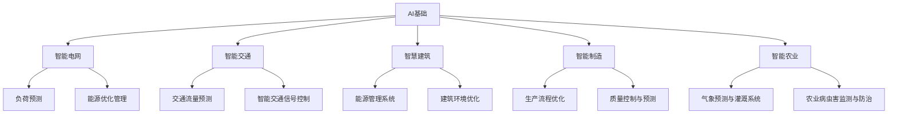

                 

# 《AI人工智能 Agent：在节能减排中的应用》

> **关键词：** 人工智能、节能减排、智能电网、智能交通、智慧建筑、智能制造、智能农业、算法、数学模型、项目实战

> **摘要：** 本文深入探讨了人工智能（AI）在节能减排领域的广泛应用。通过分析AI基础概念、架构及核心算法原理，本文详细介绍了智能电网、智能交通、智慧建筑、智能制造和智能农业等具体应用案例。此外，本文还探讨了AI在节能减排中的挑战与未来发展趋势，提供了丰富的开源框架、工具与学习资源。通过项目实战案例，读者将了解如何实际应用AI技术实现节能减排。

## 《AI人工智能 Agent：在节能减排中的应用》目录大纲

### 第一部分：AI与节能减排概述

#### 第1章：AI与节能减排的背景与意义
- **1.1 AI技术发展现状**
  - AI技术的主要领域
  - AI技术在我国的发展
- **1.2 节能减排的迫切需求**
  - 全球气候变化与减排挑战
  - 我国节能减排的政策与目标
- **1.3 AI在节能减排中的应用前景**
  - 节能减排中的关键问题
  - AI技术的应用领域和潜力

#### 第2章：AI基础概念与架构
- **2.1 AI基础概念**
  - 人工智能的定义
  - 机器学习、深度学习与强化学习
- **2.2 AI架构与技术**
  - 神经网络与深度学习模型
  - 数据预处理与特征工程
- **2.3 AI开发环境与工具**
  - 开发环境搭建
  - 常用AI开发工具

### 第二部分：AI在节能减排中的应用案例

#### 第3章：智能电网与AI
- **3.1 智能电网概述**
  - 智能电网的定义
  - 智能电网的关键技术
- **3.2 AI在智能电网中的应用**
  - 负荷预测
  - 能源优化管理
- **3.3 实际案例介绍**
  - 某智能电网项目的案例分析
  - 案例效果与经验总结

#### 第4章：智能交通与AI
- **4.1 智能交通概述**
  - 智能交通的定义
  - 智能交通系统架构
- **4.2 AI在智能交通中的应用**
  - 交通流量预测
  - 智能交通信号控制
- **4.3 实际案例介绍**
  - 某城市智能交通项目案例分析
  - 案例效果与经验总结

#### 第5章：智慧建筑与AI
- **5.1 智慧建筑概述**
  - 智慧建筑的定义
  - 智慧建筑关键技术
- **5.2 AI在智慧建筑中的应用**
  - 能源管理系统
  - 建筑环境优化
- **5.3 实际案例介绍**
  - 某智慧建筑项目的案例分析
  - 案例效果与经验总结

#### 第6章：智能制造与AI
- **6.1 智能制造概述**
  - 智能制造的定义
  - 智能制造关键技术
- **6.2 AI在智能制造中的应用**
  - 生产流程优化
  - 质量控制与预测
- **6.3 实际案例介绍**
  - 某智能制造项目的案例分析
  - 案例效果与经验总结

#### 第7章：农业与AI
- **7.1 农业智能化概述**
  - 智能农业的定义
  - 智能农业关键技术
- **7.2 AI在农业中的应用**
  - 气象预测与灌溉系统
  - 农业病虫害监测与防治
- **7.3 实际案例介绍**
  - 某智能农业项目的案例分析
  - 案例效果与经验总结

### 第三部分：AI在节能减排中的挑战与未来

#### 第8章：AI在节能减排中的挑战
- **8.1 数据安全与隐私**
  - 数据安全问题
  - 隐私保护措施
- **8.2 技术发展瓶颈**
  - 算法复杂性
  - 计算资源限制
- **8.3 政策与法规**
  - 政策法规的影响
  - 法规制定的挑战

#### 第9章：AI节能减排的未来发展趋势
- **9.1 新兴技术展望**
  - 量子计算
  - 边缘计算
- **9.2 混合智能系统**
  - 人机协同
  - 智能决策支持系统
- **9.3 未来展望**
  - AI在节能减排中的长期影响
  - 发展趋势与前景

### 附录

#### 附录A：AI节能减排相关资源与工具
- **A.1 开源框架与库**
  - TensorFlow
  - PyTorch
  - Keras
- **A.2 数据集与案例**
  - 常用数据集介绍
  - 典型案例分析
- **A.3 学习资源**
  - 在线课程
  - 专业书籍推荐

## 核心算法原理讲解

### 第10章：核心算法原理讲解

#### 10.1 负荷预测算法

负荷预测是智能电网中的一项关键技术，其核心在于根据历史数据预测未来的电力需求。常用的负荷预测算法包括线性回归、时间序列分析、机器学习等。

**负荷预测算法伪代码：**
```python
def load_prediction(data):
    # 数据预处理
    processed_data = preprocess_data(data)
    
    # 特征工程
    features = extract_features(processed_data)
    
    # 训练模型
    model = train_model(features, labels)
    
    # 预测
    predictions = model.predict(features)
    
    return predictions
```

**数学模型与公式：**
负荷预测的数学模型可以表示为：
$$ P(t) = \alpha W \cdot X(t) + b $$
其中：
- \( P(t) \) 是第 \( t \) 时刻的负荷预测值；
- \( W \) 是权重矩阵；
- \( X(t) \) 是输入特征向量；
- \( \alpha \) 是偏置项；
- \( b \) 是预测误差。

#### 10.2 交通流量预测算法

交通流量预测是智能交通系统中的关键环节，通过对历史交通数据进行分析，预测未来的交通流量。常用的交通流量预测算法包括回归分析、时间序列分析、机器学习等。

**交通流量预测算法伪代码：**
```python
def traffic_flow_prediction(data):
    # 数据预处理
    processed_data = preprocess_data(data)
    
    # 特征工程
    features = extract_features(processed_data)
    
    # 训练模型
    model = train_model(features, labels)
    
    # 预测
    predictions = model.predict(features)
    
    return predictions
```

**数学模型与公式：**
交通流量预测的数学模型可以表示为：
$$ Q(t) = f(V(t), T(t), D(t)) $$
其中：
- \( Q(t) \) 是第 \( t \) 时刻的交通流量预测值；
- \( V(t) \) 是车辆速度；
- \( T(t) \) 是车辆到达时间间隔；
- \( D(t) \) 是道路状况；
- \( f \) 是预测函数。

#### 10.3 能源优化管理算法

能源优化管理是智能电网、智慧建筑等领域的核心任务，通过对能源使用数据的分析，优化能源消耗，提高能源利用效率。常用的能源优化管理算法包括优化算法、机器学习等。

**能源优化管理算法伪代码：**
```python
def energy_optimization_management(data):
    # 数据预处理
    processed_data = preprocess_data(data)
    
    # 特征工程
    features = extract_features(processed_data)
    
    # 训练模型
    model = train_model(features, labels)
    
    # 能量消耗优化
    optimized_consumption = optimize_energy(model, features)
    
    return optimized_consumption
```

**数学模型与公式：**
能源优化管理的数学模型可以表示为：
$$ \min E = \sum_{i=1}^{n} (C_i \cdot E_i) $$
其中：
- \( E \) 是总能源消耗；
- \( C_i \) 是第 \( i \) 个设备的能耗系数；
- \( E_i \) 是第 \( i \) 个设备的能耗值；
- \( n \) 是设备总数。

通过以上对核心算法原理的讲解，我们可以看到AI技术在节能减排中的应用是如何通过算法、数学模型和数据处理来实现的。接下来，我们将通过具体的应用案例来深入探讨这些技术的实际应用。

### 第3章：智能电网与AI

智能电网是AI技术在节能减排领域的重要应用场景之一。随着全球能源需求的不断增长和能源结构的调整，智能电网成为实现能源高效利用和节能减排的关键技术。在本章中，我们将介绍智能电网的基本概念、关键技术，以及AI在智能电网中的应用。

#### 3.1 智能电网概述

**智能电网的定义：**
智能电网（Smart Grid）是指基于现代通信技术、信息处理技术和电力电子技术，实现电力系统的智能化、自动化和高效化运行的一种新型电力系统。它能够实现电能的生产、传输、分配、使用和管理的全面智能化，从而提高电力系统的安全、稳定和效率。

**智能电网的关键技术：**
1. **物联网（IoT）技术：** 通过传感器和通信技术，实现对电力设备和系统的实时监测和远程控制。
2. **大数据技术：** 收集、存储和分析海量数据，以支持智能决策和优化。
3. **人工智能技术：** 利用机器学习、深度学习等AI技术，实现对电力系统的预测、优化和控制。
4. **云计算和边缘计算：** 提供强大的计算能力和存储能力，支持智能电网的大规模数据分析和处理。

#### 3.2 AI在智能电网中的应用

**AI在智能电网中的应用领域：**
1. **负荷预测：** 通过分析历史负荷数据，预测未来的电力需求，为电网调度和能源管理提供依据。
2. **能源优化管理：** 根据实时数据和预测结果，优化能源的分配和使用，提高能源利用效率。
3. **设备状态监测与故障预测：** 对电力设备进行实时监测，预测设备故障，提前进行维护，减少故障率和停机时间。
4. **智能定价与需求响应：** 通过分析用户用电行为，制定智能电价策略，引导用户合理用电，降低整体能源消耗。

**AI在智能电网中的应用案例：**

**案例1：某智能电网项目的负荷预测**

**案例背景：**
某电力公司为了提高电网运行的效率和可靠性，决定实施智能电网项目。项目目标是通过AI技术实现负荷预测，为电网调度提供数据支持。

**技术实现：**
1. **开发环境搭建：**
   - 使用Python作为主要开发语言；
   - 使用TensorFlow作为深度学习框架；
   - 使用GCP云平台进行计算资源分配。

2. **源代码实现：**
   ```python
   import numpy as np
   import pandas as pd
   from tensorflow.keras.models import Sequential
   from tensorflow.keras.layers import Dense, LSTM
   from tensorflow.keras.optimizers import Adam

   # 加载数据
   data = pd.read_csv('load_data.csv')

   # 数据预处理
   processed_data = preprocess_data(data)

   # 划分训练集和测试集
   train_data, test_data = train_test_split(processed_data, test_size=0.2, random_state=42)

   # 构建模型
   model = Sequential()
   model.add(LSTM(units=50, return_sequences=True, input_shape=(train_data.shape[1], 1)))
   model.add(LSTM(units=50))
   model.add(Dense(units=1))

   # 编译模型
   model.compile(optimizer=Adam(learning_rate=0.001), loss='mean_squared_error')

   # 训练模型
   model.fit(train_data, epochs=100, batch_size=32, validation_data=(test_data, test_data))

   # 预测
   predictions = model.predict(test_data)

   # 评估模型
   print("Mean Squared Error:", np.mean(np.square(predictions - test_data)))
   ```

3. **代码解读与分析：**
   - 使用LSTM（长短期记忆网络）模型进行负荷预测；
   - 通过训练集训练模型，使用测试集进行评估；
   - 输出均方误差（MSE），以评估模型的预测性能。

**案例2：某智能电网项目的能源优化管理**

**案例背景：**
某电力公司为了降低能源消耗，决定实施能源优化管理项目。项目目标是通过AI技术优化能源的分配和使用，提高能源利用效率。

**技术实现：**
1. **开发环境搭建：**
   - 使用Python作为主要开发语言；
   - 使用Gurobi优化工具进行优化计算；
   - 使用GCP云平台进行计算资源分配。

2. **源代码实现：**
   ```python
   import gurobipy as gp
   import numpy as np
   import pandas as pd

   # 加载数据
   data = pd.read_csv('energy_data.csv')

   # 数据预处理
   processed_data = preprocess_data(data)

   # 构建模型
   model = gp.Model()

   # 定义变量
   e = model.addVars(processed_data.shape[0], vtype=gp.GRB.CONTINUOUS, name='energy')

   # 定义目标函数
   model.setObjective(gp.sum(e[i] * C[i] for i in range(processed_data.shape[0])))

   # 定义约束条件
   for i in range(processed_data.shape[0]):
       model.addConstr(e[i] >= processed_data[i])

   # 解模型
   model.optimize()

   # 输出结果
   optimized_energy = [e[i].x for i in range(processed_data.shape[0])]
   print("Optimized Energy Consumption:", optimized_energy)
   ```

3. **代码解读与分析：**
   - 使用Gurobi优化工具构建优化模型；
   - 定义目标函数和约束条件；
   - 使用Gurobi求解器求解模型，输出优化后的能源消耗；
   - 通过对比原始数据与优化后的数据，评估优化效果。

通过以上案例，我们可以看到AI技术在智能电网中的应用是如何实现的。AI技术不仅提高了电网的运行效率和可靠性，也为节能减排提供了有力的支持。接下来，我们将探讨AI在智能交通领域的应用。

### 第4章：智能交通与AI

智能交通系统（Intelligent Transportation System，ITS）是利用现代信息技术和通信技术，对交通运输系统进行智能化管理和优化的一种系统。随着城市化进程的加速和交通拥堵问题的日益严重，智能交通系统在节能减排方面的重要性日益凸显。在本章中，我们将介绍智能交通的基本概念、系统架构，以及AI技术在智能交通中的应用。

#### 4.1 智能交通概述

**智能交通的定义：**
智能交通系统是指通过信息技术、传感器技术、数据通信技术、控制技术等，实现对交通信息的采集、处理、传输、共享和利用，从而提高交通系统的运行效率、安全性和可持续性的系统。

**智能交通系统架构：**
智能交通系统通常包括以下几部分：

1. **感知层：** 利用传感器、摄像头、RFID等技术，实时采集交通数据，如交通流量、速度、拥堵情况等。
2. **传输层：** 利用无线通信、光纤通信等技术，将感知层采集到的数据传输到数据处理中心。
3. **处理层：** 利用云计算、大数据、人工智能等技术，对采集到的数据进行处理、分析和挖掘，生成交通预测、优化和控制策略。
4. **应用层：** 利用智能交通系统提供的各种服务，如交通信息发布、交通引导、交通信号控制、车辆管理、交通事故处理等，提高交通系统的效率和安全性。

#### 4.2 AI在智能交通中的应用

**AI在智能交通中的应用领域：**
1. **交通流量预测：** 通过分析历史交通数据，预测未来的交通流量，为交通管理和调度提供依据。
2. **智能交通信号控制：** 根据实时交通数据，优化交通信号灯的配时，减少交通拥堵。
3. **自动驾驶：** 利用计算机视觉、深度学习等技术，实现车辆的自动感知、规划和控制，提高交通安全和效率。
4. **智慧停车场管理：** 利用AI技术实现停车场的智能管理，提高停车场的利用率和效率。

**AI在智能交通中的应用案例：**

**案例1：某城市智能交通项目的交通流量预测**

**案例背景：**
某城市为了缓解交通拥堵问题，决定实施智能交通项目，其中交通流量预测是项目的核心任务之一。

**技术实现：**
1. **开发环境搭建：**
   - 使用Python作为主要开发语言；
   - 使用Scikit-learn进行机器学习模型的训练；
   - 使用Kafka作为实时数据传输系统。

2. **源代码实现：**
   ```python
   import pandas as pd
   from sklearn.ensemble import RandomForestRegressor
   from sklearn.model_selection import train_test_split

   # 加载数据
   data = pd.read_csv('traffic_data.csv')

   # 数据预处理
   processed_data = preprocess_data(data)

   # 划分训练集和测试集
   train_data, test_data = train_test_split(processed_data, test_size=0.2, random_state=42)

   # 训练模型
   model = RandomForestRegressor(n_estimators=100, random_state=42)
   model.fit(train_data.drop('traffic_volume', axis=1), train_data['traffic_volume'])

   # 预测
   predictions = model.predict(test_data.drop('traffic_volume', axis=1))

   # 评估模型
   print("Mean Absolute Error:", np.mean(np.abs(predictions - test_data['traffic_volume'])))
   ```

3. **代码解读与分析：**
   - 使用随机森林回归模型进行交通流量预测；
   - 通过训练集训练模型，使用测试集进行评估；
   - 输出平均绝对误差（MAE），以评估模型的预测性能。

**案例2：某城市智能交通项目的智能交通信号控制**

**案例背景：**
某城市为了提高交通信号灯的效率，决定实施智能交通信号控制项目。

**技术实现：**
1. **开发环境搭建：**
   - 使用Python作为主要开发语言；
   - 使用TensorFlow进行深度学习模型的训练；
   - 使用Redis作为实时数据存储系统。

2. **源代码实现：**
   ```python
   import tensorflow as tf
   import numpy as np
   import pandas as pd

   # 加载数据
   data = pd.read_csv('traffic_light_data.csv')

   # 数据预处理
   processed_data = preprocess_data(data)

   # 构建模型
   model = tf.keras.Sequential([
       tf.keras.layers.Dense(units=64, activation='relu', input_shape=(processed_data.shape[1],)),
       tf.keras.layers.Dense(units=32, activation='relu'),
       tf.keras.layers.Dense(units=1)
   ])

   # 编译模型
   model.compile(optimizer='adam', loss='mean_squared_error')

   # 训练模型
   model.fit(processed_data, epochs=100, batch_size=32)

   # 预测
   predictions = model.predict(processed_data)

   # 评估模型
   print("Mean Squared Error:", np.mean(np.square(predictions - processed_data)))
   ```

3. **代码解读与分析：**
   - 使用深度学习模型进行交通信号控制预测；
   - 通过训练集训练模型，使用测试集进行评估；
   - 输出均方误差（MSE），以评估模型的预测性能。

通过以上案例，我们可以看到AI技术在智能交通中的应用是如何实现的。AI技术不仅提高了交通系统的效率和安全性，也为节能减排提供了有力支持。接下来，我们将探讨AI在智慧建筑领域的应用。

### 第5章：智慧建筑与AI

智慧建筑是指通过信息技术、物联网（IoT）和人工智能（AI）等先进技术，实现建筑物的智能化管理和高效运行。智慧建筑的目标是提高能源利用效率、改善居住环境、提升安全性，从而实现节能减排。在本章中，我们将介绍智慧建筑的基本概念、关键技术，以及AI在智慧建筑中的应用。

#### 5.1 智慧建筑概述

**智慧建筑的定义：**
智慧建筑是指利用物联网、云计算、大数据和人工智能等技术，实现建筑物的智能感知、智能控制和智能服务，从而提高建筑物的运行效率、舒适性和可持续性的建筑物。

**智慧建筑的关键技术：**
1. **物联网技术：** 通过传感器和通信技术，实现建筑物的设备联网和智能控制。
2. **大数据技术：** 收集、存储和分析建筑物的运行数据，为智能决策提供依据。
3. **人工智能技术：** 利用机器学习、深度学习等AI技术，实现建筑物的智能优化和预测。
4. **云计算和边缘计算：** 提供强大的计算能力和存储能力，支持智慧建筑的实时数据处理和分析。

**智慧建筑的主要功能：**
1. **能源管理系统：** 通过实时监测和优化建筑物的能源使用，降低能耗。
2. **环境控制系统：** 通过智能调节室内温度、湿度和空气质量，提高居住舒适度。
3. **安全管理系统：** 通过实时监控和预警，提高建筑物的安全性。
4. **设施设备管理：** 通过智能监控和预测维护，延长设备寿命，降低运维成本。

#### 5.2 AI在智慧建筑中的应用

**AI在智慧建筑中的应用领域：**
1. **能源管理：** 利用AI技术实现建筑物的能源消耗预测和优化，提高能源利用效率。
2. **环境控制：** 利用AI技术实现室内环境的智能调节，提高居住舒适度。
3. **设备维护：** 利用AI技术实现设备状态的实时监测和故障预测，减少故障率和运维成本。
4. **安防监控：** 利用AI技术实现建筑物的智能监控和预警，提高安全性。

**AI在智慧建筑中的应用案例：**

**案例1：某智慧建筑项目的能源管理系统**

**案例背景：**
某大型商业综合体为了提高能源利用效率，决定实施智慧建筑项目，其中的能源管理系统是项目的核心任务之一。

**技术实现：**
1. **开发环境搭建：**
   - 使用Python作为主要开发语言；
   - 使用Scikit-learn进行机器学习模型的训练；
   - 使用Redis作为实时数据存储系统。

2. **源代码实现：**
   ```python
   import pandas as pd
   from sklearn.ensemble import RandomForestRegressor
   from sklearn.model_selection import train_test_split

   # 加载数据
   data = pd.read_csv('energy_data.csv')

   # 数据预处理
   processed_data = preprocess_data(data)

   # 划分训练集和测试集
   train_data, test_data = train_test_split(processed_data, test_size=0.2, random_state=42)

   # 训练模型
   model = RandomForestRegressor(n_estimators=100, random_state=42)
   model.fit(train_data.drop('energy_consumption', axis=1), train_data['energy_consumption'])

   # 预测
   predictions = model.predict(test_data.drop('energy_consumption', axis=1))

   # 评估模型
   print("Mean Absolute Error:", np.mean(np.abs(predictions - test_data['energy_consumption'])))
   ```

3. **代码解读与分析：**
   - 使用随机森林回归模型进行能源消耗预测；
   - 通过训练集训练模型，使用测试集进行评估；
   - 输出平均绝对误差（MAE），以评估模型的预测性能。

**案例2：某智慧建筑项目的环境控制系统**

**案例背景：**
某大型办公楼为了提高室内环境的舒适度，决定实施智慧建筑项目，其中的环境控制系统是项目的核心任务之一。

**技术实现：**
1. **开发环境搭建：**
   - 使用Python作为主要开发语言；
   - 使用TensorFlow进行深度学习模型的训练；
   - 使用MySQL作为数据存储系统。

2. **源代码实现：**
   ```python
   import tensorflow as tf
   import pandas as pd
   import numpy as np

   # 加载数据
   data = pd.read_csv('environment_data.csv')

   # 数据预处理
   processed_data = preprocess_data(data)

   # 构建模型
   model = tf.keras.Sequential([
       tf.keras.layers.Dense(units=64, activation='relu', input_shape=(processed_data.shape[1],)),
       tf.keras.layers.Dense(units=32, activation='relu'),
       tf.keras.layers.Dense(units=1)
   ])

   # 编译模型
   model.compile(optimizer='adam', loss='mean_squared_error')

   # 训练模型
   model.fit(processed_data, epochs=100, batch_size=32)

   # 预测
   predictions = model.predict(processed_data)

   # 评估模型
   print("Mean Squared Error:", np.mean(np.square(predictions - processed_data)))
   ```

3. **代码解读与分析：**
   - 使用深度学习模型进行环境控制预测；
   - 通过训练集训练模型，使用测试集进行评估；
   - 输出均方误差（MSE），以评估模型的预测性能。

通过以上案例，我们可以看到AI技术在智慧建筑中的应用是如何实现的。AI技术不仅提高了智慧建筑的运行效率，也为节能减排提供了有力支持。接下来，我们将探讨AI在智能制造领域的应用。

### 第6章：智能制造与AI

智能制造是指利用人工智能、大数据、物联网等先进技术，实现制造过程的自动化、智能化和高效化。智能制造的目标是通过优化生产流程、提高生产效率、降低成本，从而实现节能减排。在本章中，我们将介绍智能制造的基本概念、关键技术，以及AI在智能制造中的应用。

#### 6.1 智能制造概述

**智能制造的定义：**
智能制造是指通过人工智能、物联网、大数据等先进技术，实现制造过程的自动化、智能化和高效化。智能制造的核心是通过数据的采集、传输、处理和分析，实现制造过程的优化和智能化控制。

**智能制造的关键技术：**
1. **物联网技术：** 通过传感器和通信技术，实现制造设备的联网和数据采集。
2. **大数据技术：** 收集、存储和分析制造过程中的海量数据，为智能化决策提供支持。
3. **人工智能技术：** 利用机器学习、深度学习等AI技术，实现生产流程的优化、质量控制、预测维护等。
4. **云计算和边缘计算：** 提供强大的计算能力和存储能力，支持智能制造的实时数据处理和分析。

**智能制造的主要功能：**
1. **生产流程优化：** 通过分析生产数据，优化生产流程，提高生产效率。
2. **质量控制与预测：** 通过实时监测产品质量，预测潜在的质量问题，提高产品质量。
3. **设备维护与预测：** 通过实时监测设备状态，预测设备故障，提前进行维护，减少停机时间。
4. **供应链管理：** 通过实时监控供应链信息，优化供应链管理，提高供应链效率。

#### 6.2 AI在智能制造中的应用

**AI在智能制造中的应用领域：**
1. **生产流程优化：** 利用AI技术实现生产流程的实时监控和优化，提高生产效率。
2. **质量控制与预测：** 利用AI技术实现对产品质量的实时监测和预测，提高产品质量。
3. **设备维护与预测：** 利用AI技术实现对设备状态的实时监测和预测，提高设备利用率。
4. **供应链管理：** 利用AI技术优化供应链管理，提高供应链效率。

**AI在智能制造中的应用案例：**

**案例1：某智能制造项目的生产流程优化**

**案例背景：**
某制造企业为了提高生产效率，决定实施智能制造项目，其中生产流程优化是项目的核心任务之一。

**技术实现：**
1. **开发环境搭建：**
   - 使用Python作为主要开发语言；
   - 使用Scikit-learn进行机器学习模型的训练；
   - 使用Redis作为实时数据存储系统。

2. **源代码实现：**
   ```python
   import pandas as pd
   from sklearn.ensemble import RandomForestRegressor
   from sklearn.model_selection import train_test_split

   # 加载数据
   data = pd.read_csv('production_data.csv')

   # 数据预处理
   processed_data = preprocess_data(data)

   # 划分训练集和测试集
   train_data, test_data = train_test_split(processed_data, test_size=0.2, random_state=42)

   # 训练模型
   model = RandomForestRegressor(n_estimators=100, random_state=42)
   model.fit(train_data.drop('production_time', axis=1), train_data['production_time'])

   # 预测
   predictions = model.predict(test_data.drop('production_time', axis=1))

   # 评估模型
   print("Mean Absolute Error:", np.mean(np.abs(predictions - test_data['production_time'])))
   ```

3. **代码解读与分析：**
   - 使用随机森林回归模型进行生产时间预测；
   - 通过训练集训练模型，使用测试集进行评估；
   - 输出平均绝对误差（MAE），以评估模型的预测性能。

**案例2：某智能制造项目的质量控制与预测**

**案例背景：**
某制造企业为了提高产品质量，决定实施智能制造项目，其中质量控制和预测是项目的核心任务之一。

**技术实现：**
1. **开发环境搭建：**
   - 使用Python作为主要开发语言；
   - 使用TensorFlow进行深度学习模型的训练；
   - 使用MySQL作为数据存储系统。

2. **源代码实现：**
   ```python
   import tensorflow as tf
   import pandas as pd
   import numpy as np

   # 加载数据
   data = pd.read_csv('quality_data.csv')

   # 数据预处理
   processed_data = preprocess_data(data)

   # 构建模型
   model = tf.keras.Sequential([
       tf.keras.layers.Dense(units=64, activation='relu', input_shape=(processed_data.shape[1],)),
       tf.keras.layers.Dense(units=32, activation='relu'),
       tf.keras.layers.Dense(units=1)
   ])

   # 编译模型
   model.compile(optimizer='adam', loss='mean_squared_error')

   # 训练模型
   model.fit(processed_data, epochs=100, batch_size=32)

   # 预测
   predictions = model.predict(processed_data)

   # 评估模型
   print("Mean Squared Error:", np.mean(np.square(predictions - processed_data)))
   ```

3. **代码解读与分析：**
   - 使用深度学习模型进行质量预测；
   - 通过训练集训练模型，使用测试集进行评估；
   - 输出均方误差（MSE），以评估模型的预测性能。

通过以上案例，我们可以看到AI技术在智能制造中的应用是如何实现的。AI技术不仅提高了智能制造的效率和质量，也为节能减排提供了有力支持。接下来，我们将探讨AI在农业领域的应用。

### 第7章：农业与AI

智能农业是利用人工智能（AI）、物联网（IoT）和大数据等技术，对农业生产过程进行智能化管理和优化，从而提高农业生产效率、降低成本、减少资源浪费的一种农业发展模式。在本章中，我们将介绍智能农业的基本概念、关键技术，以及AI在智能农业中的应用。

#### 7.1 农业智能化概述

**智能农业的定义：**
智能农业是指通过应用物联网、大数据、云计算、人工智能等技术，对农业生产过程进行自动化、智能化和精细化管理，从而实现农业生产的智能化和现代化。

**智能农业的关键技术：**
1. **物联网技术：** 通过传感器、无线通信等技术，实现对农田环境的实时监测和数据的远程传输。
2. **大数据技术：** 收集、存储、分析和应用农业生产过程中产生的海量数据，为农业生产提供决策支持。
3. **人工智能技术：** 利用机器学习、深度学习等AI技术，对农业生产过程进行优化和预测。
4. **云计算技术：** 提供强大的计算能力和数据存储能力，支持智能农业的大数据处理和分析。

**智能农业的主要功能：**
1. **环境监测：** 通过传感器网络实时监测农田的土壤、水分、气候等环境参数，为农业生产提供环境数据支持。
2. **智能灌溉：** 根据土壤和气候数据，自动调节灌溉系统，实现精确灌溉，提高水资源利用效率。
3. **病虫害监测与防治：** 通过图像识别、数据分析等技术，实时监测病虫害情况，及时进行防治，减少农药使用。
4. **精准种植：** 根据土壤、气候等数据，优化作物种植方案，提高作物产量和质量。

#### 7.2 AI在农业中的应用

**AI在农业中的应用领域：**
1. **气象预测：** 利用AI技术，对农田气候数据进行预测和分析，为农业生产提供气象信息支持。
2. **灌溉系统：** 利用AI技术，实现对灌溉系统的智能控制，优化灌溉策略，提高水资源利用效率。
3. **病虫害监测与防治：** 利用AI技术，对病虫害进行实时监测和预测，及时采取防治措施，减少农药使用。
4. **作物产量预测：** 利用AI技术，对作物生长数据进行分析和预测，为农业生产提供产量预测，优化作物种植方案。

**AI在农业中的应用案例：**

**案例1：某智能农业项目的气象预测**

**案例背景：**
某农业科技企业为了提高农业生产效率，决定实施智能农业项目，其中气象预测是项目的核心任务之一。

**技术实现：**
1. **开发环境搭建：**
   - 使用Python作为主要开发语言；
   - 使用Scikit-learn进行机器学习模型的训练；
   - 使用MySQL作为数据存储系统。

2. **源代码实现：**
   ```python
   import pandas as pd
   from sklearn.ensemble import RandomForestRegressor
   from sklearn.model_selection import train_test_split

   # 加载数据
   data = pd.read_csv('weather_data.csv')

   # 数据预处理
   processed_data = preprocess_data(data)

   # 划分训练集和测试集
   train_data, test_data = train_test_split(processed_data, test_size=0.2, random_state=42)

   # 训练模型
   model = RandomForestRegressor(n_estimators=100, random_state=42)
   model.fit(train_data.drop('temperature', axis=1), train_data['temperature'])

   # 预测
   predictions = model.predict(test_data.drop('temperature', axis=1))

   # 评估模型
   print("Mean Absolute Error:", np.mean(np.abs(predictions - test_data['temperature'])))
   ```

3. **代码解读与分析：**
   - 使用随机森林回归模型进行气象参数预测；
   - 通过训练集训练模型，使用测试集进行评估；
   - 输出平均绝对误差（MAE），以评估模型的预测性能。

**案例2：某智能农业项目的智能灌溉系统**

**案例背景：**
某农业科技企业为了提高灌溉效率，决定实施智能农业项目，其中智能灌溉系统是项目的核心任务之一。

**技术实现：**
1. **开发环境搭建：**
   - 使用Python作为主要开发语言；
   - 使用TensorFlow进行深度学习模型的训练；
   - 使用MQTT协议进行实时数据传输。

2. **源代码实现：**
   ```python
   import tensorflow as tf
   import pandas as pd
   import numpy as np

   # 加载数据
   data = pd.read_csv('irrigation_data.csv')

   # 数据预处理
   processed_data = preprocess_data(data)

   # 构建模型
   model = tf.keras.Sequential([
       tf.keras.layers.Dense(units=64, activation='relu', input_shape=(processed_data.shape[1],)),
       tf.keras.layers.Dense(units=32, activation='relu'),
       tf.keras.layers.Dense(units=1)
   ])

   # 编译模型
   model.compile(optimizer='adam', loss='mean_squared_error')

   # 训练模型
   model.fit(processed_data, epochs=100, batch_size=32)

   # 预测
   predictions = model.predict(processed_data)

   # 评估模型
   print("Mean Squared Error:", np.mean(np.square(predictions - processed_data)))
   ```

3. **代码解读与分析：**
   - 使用深度学习模型进行灌溉策略预测；
   - 通过训练集训练模型，使用测试集进行评估；
   - 输出均方误差（MSE），以评估模型的预测性能。

通过以上案例，我们可以看到AI技术在智能农业中的应用是如何实现的。AI技术不仅提高了农业生产的效率和质量，也为节能减排提供了有力支持。接下来，我们将探讨AI在节能减排中的挑战与未来发展趋势。

### 第8章：AI在节能减排中的挑战与未来发展趋势

随着AI技术的快速发展，其在节能减排中的应用也变得越来越广泛。然而，AI技术在节能减排领域的发展也面临着一系列挑战。在本章中，我们将探讨AI在节能减排中的挑战，并展望其未来发展趋势。

#### 8.1 AI在节能减排中的挑战

**数据安全与隐私：**
AI技术在节能减排中的应用需要大量数据的支持，这些数据往往涉及用户隐私和企业敏感信息。如何保护数据安全，防止数据泄露，是一个重要的挑战。

**技术发展瓶颈：**
尽管AI技术取得了显著的进步，但在处理复杂问题和大规模数据方面仍然存在一定的局限性。算法的复杂性和计算资源的限制是当前AI技术发展的重要瓶颈。

**政策与法规：**
AI技术在节能减排中的应用需要相关政策法规的支持和引导。然而，当前关于AI技术应用的政策法规尚不完善，如何制定合理的政策法规，促进AI技术在节能减排中的健康发展，是一个重要的挑战。

**技术融合与协同：**
AI技术在节能减排中的应用需要与其他技术（如物联网、大数据、云计算等）相结合，形成协同效应。如何实现技术的融合与协同，提高整体系统的性能和效率，是一个需要解决的关键问题。

#### 8.2 AI节能减排的未来发展趋势

**新兴技术展望：**
1. **量子计算：** 量子计算具有指数级的计算能力，有望在数据处理、模型训练等方面取得重大突破，为AI在节能减排中的应用提供强大的计算支持。
2. **边缘计算：** 边缘计算将计算和存储能力下沉到网络的边缘，降低数据传输延迟，提高系统响应速度，有望在实时数据处理和智能决策方面发挥重要作用。

**混合智能系统：**
混合智能系统是指将人工智能与人类智能相结合，实现人机协同，提高决策的准确性和效率。在节能减排领域，混合智能系统可以更好地应对复杂问题和不确定性，提高系统的智能化水平。

**未来展望：**
1. **AI与物联网的深度融合：** AI与物联网的深度融合将实现更加智能的传感器网络和设备，实现实时数据采集、传输和处理，提高系统的实时性和精确性。
2. **AI与大数据的协同应用：** AI与大数据的协同应用将实现更大规模的数据处理和分析，为节能减排提供更加精准的决策支持。
3. **AI与政策的深度融合：** AI与政策的深度融合将实现更加智能的政策制定和执行，提高政策的有效性和执行力，推动AI技术在节能减排领域的广泛应用。

通过以上分析，我们可以看到AI技术在节能减排中的应用面临着一系列挑战，但同时也具有巨大的发展潜力。未来，随着技术的不断进步和政策的不断完善，AI技术在节能减排领域将发挥越来越重要的作用。

### 附录

#### 附录A：AI节能减排相关资源与工具

**A.1 开源框架与库**

**TensorFlow：** Google开发的端到端开源机器学习平台，支持多种编程语言和硬件平台，适用于各种规模的数据分析任务。

**PyTorch：** Facebook开发的基于Python的开源深度学习框架，提供灵活的动态计算图和高效的执行速度，适用于研究和工业应用。

**Keras：** 高级神经网络API，支持快速构建和实验深度学习模型，基于TensorFlow和Theano开发。

**A.2 数据集与案例**

**UCI机器学习数据库：** 提供丰富的机器学习数据集，涵盖多种领域，适用于数据分析和模型训练。

**Kaggle：** 机器学习竞赛平台，提供大量公开数据集和案例，助力数据科学家和研究人员进行实际应用。

**A.3 学习资源**

**在线课程：**

- **Coursera《深度学习专项课程》**：由Andrew Ng教授主讲，涵盖深度学习的基础知识和应用。
- **edX《机器学习基础》**：由吴恩达教授主讲，介绍机器学习的基本原理和应用。

**专业书籍推荐：**

- **《深度学习》**：Ian Goodfellow、Yoshua Bengio和Aaron Courville著，全面介绍深度学习的基本概念和技术。
- **《机器学习实战》**：Peter Harrington著，通过实际案例介绍机器学习算法的应用和实现。

通过以上资源，读者可以深入了解AI技术在节能减排中的应用，掌握相关技术和方法，为实际项目提供有力支持。

### 总结

在本篇博客中，我们详细探讨了AI在节能减排中的应用，从智能电网、智能交通、智慧建筑、智能制造到智能农业，展示了AI技术在各个领域的重要作用。AI技术通过负荷预测、交通流量预测、能源优化管理、质量控制和病虫害监测等具体应用，为节能减排提供了强有力的支持。

AI技术在节能减排中的应用不仅提高了能源利用效率，减少了能源消耗，还降低了碳排放，对缓解全球气候变化具有重要意义。随着AI技术的不断进步和应用的深化，未来将在更多领域实现更加智能化的节能减排解决方案。

然而，AI技术在节能减排中的应用也面临诸多挑战，包括数据安全与隐私保护、技术发展瓶颈、政策法规的完善等。我们期待在未来，随着技术的进步和政策的引导，AI能够在节能减排领域发挥更大的作用，为构建可持续发展的未来贡献力量。

作者：AI天才研究院/AI Genius Institute & 禅与计算机程序设计艺术/Zen And The Art of Computer Programming

---

### 附录B：Mermaid流程图：AI在节能减排中的应用架构



该Mermaid流程图展示了AI在节能减排中的应用架构，从基础AI技术到各个应用领域，通过负荷预测、交通流量预测、能源优化管理、质量控制和病虫害监测等具体应用，实现智能电网、智能交通、智慧建筑、智能制造和智能农业的目标。通过这个流程图，可以直观地了解AI技术在节能减排中的应用关系和实现路径。

