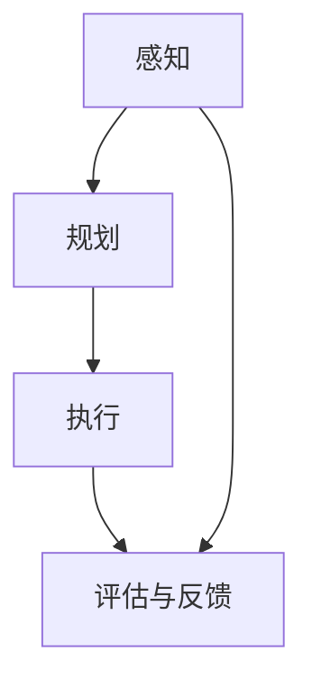

                 

## 文章标题

AI人工智能代理工作流 AI Agent WorkFlow：在游戏设计中的应用

> **关键词：** AI代理，工作流，游戏设计，决策树，强化学习，多智能体系统

在游戏设计中，人工智能（AI）代理工作流（AI Agent WorkFlow）正逐渐成为提升游戏体验的关键技术。本文将深入探讨AI代理工作流在游戏设计中的应用，通过逻辑清晰、结构紧凑的论述，为读者呈现这一领域的前沿研究成果和实践经验。

## 文章摘要

本文首先介绍了AI与游戏设计的基础知识，包括AI技术概述、游戏设计基础以及AI代理的概念和作用。接着，文章详细阐述了AI代理工作流的基本原理，包括感知、规划与执行过程的决策树与强化学习应用，以及AI代理的交互机制。随后，文章分别探讨了AI代理在角色扮演游戏（RPG）、策略游戏和模拟游戏中的应用，分析了其在不同游戏类型中的角色和功能实现。在挑战与未来发展趋势部分，文章讨论了AI代理在游戏设计中的挑战、设计原则与最佳实践以及未来发展趋势。最后，文章通过一个实际的策略游戏项目实战，展示了AI代理工作流的实现过程和代码解析，为读者提供了实用的开发经验和启示。

### 《AI人工智能代理工作流 AI Agent WorkFlow：在游戏设计中的应用》目录大纲

#### 第一部分：AI与游戏设计概述

##### 第1章：AI与游戏设计基础

- **1.1 AI技术概述**
    - AI的定义与历史发展
    - AI技术在游戏设计中的应用背景
- **1.2 游戏设计基础**
    - 游戏设计的基本概念与流程
    - 游戏机制与用户体验的关系
- **1.3 AI代理的概念与作用**
    - AI代理的定义与分类
    - AI代理在游戏设计中的作用

##### 第2章：AI代理工作流的基本原理

- **2.1 AI代理工作流概述**
    - AI代理工作流的概念与重要性
    - AI代理工作流的组成部分
- **2.2 AI代理的决策过程**
    - 决策树与强化学习在AI代理中的应用
    - AI代理的感知、规划与执行过程
- **2.3 AI代理的交互机制**
    - AI代理与玩家、其他AI代理的交互方式
    - 多智能体系统的协同机制

#### 第二部分：AI代理工作流在游戏设计中的应用

##### 第3章：AI代理在角色扮演游戏（RPG）中的应用

- **3.1 RPG中的AI代理设计**
    - RPG游戏中的角色设定与AI代理的角色分类
    - AI代理在RPG游戏中的角色功能实现
- **3.2 RPG中的决策树与强化学习应用**
    - 决策树在NPC行为设计中的应用
    - 强化学习在NPC行为优化中的应用
- **3.3 RPG中的多智能体系统**
    - RPG中的团队合作与对抗
    - 多智能体系统的协同策略

##### 第4章：AI代理在策略游戏中的应用

- **4.1 策略游戏中的AI代理设计**
    - 策略游戏中的AI代理任务与目标
    - 策略游戏中的AI代理决策策略
- **4.2 策略游戏中的路径规划与资源管理**
    - A*算法在路径规划中的应用
    - 资源管理算法在策略游戏中的应用
- **4.3 策略游戏中的博弈论与对抗策略**
    - 博弈论在策略游戏中的应用
    - AI代理在策略游戏中的对抗策略设计

##### 第5章：AI代理在模拟游戏中的应用

- **5.1 模拟游戏中的AI代理设计**
    - 模拟游戏中的AI代理目标与任务
    - 模拟游戏中的AI代理决策与规划
- **5.2 模拟游戏中的动态环境与适应策略**
    - 动态环境感知算法在模拟游戏中的应用
    - AI代理在动态环境下的适应策略
- **5.3 模拟游戏中的学习与进化**
    - 机器学习在模拟游戏中的适应与优化
    - AI代理的进化与适应性进化算法

##### 第6章：AI代理在游戏设计中的挑战与未来发展趋势

- **6.1 AI代理在游戏设计中的挑战**
    - AI代理的复杂性与可扩展性问题
    - AI代理的道德与伦理问题
- **6.2 AI代理工作流的设计原则与最佳实践**
    - 设计原则与最佳实践概述
    - 实际案例分析
- **6.3 AI代理工作流在游戏设计中的未来发展趋势**
    - 未来技术趋势概述
    - 对游戏设计的潜在影响

#### 第三部分：项目实战与代码实现

##### 第7章：AI代理工作流项目实战

- **7.1 项目概述**
    - 项目背景与目标
    - 项目结构与技术栈
- **7.2 开发环境搭建**
    - 环境配置与依赖安装
    - 工程化与版本控制
- **7.3 代码实现与解读**
    - 伪代码实现
    - 具体代码实现与解析

##### 第8章：源代码分析与优化

- **8.1 源代码解读**
    - 核心模块与功能解析
    - 源代码结构与分析
- **8.2 优化与改进**
    - 代码优化策略
    - 性能优化案例
- **8.3 代码解读与分析**
    - 源代码详细解读
    - 代码结构与设计模式分析

#### 附录

##### 附录A：AI代理工作流开发资源

- **A.1 开发工具与框架介绍**
    - 常用AI开发工具与框架
    - 工具与框架的选择与对比
- **A.2 游戏设计与开发资源**
    - 游戏设计文档与工具
    - 游戏开发资源链接

## 第一部分：AI与游戏设计概述

### 第1章：AI与游戏设计基础

#### 1.1 AI技术概述

人工智能（Artificial Intelligence，简称AI）是计算机科学的一个分支，旨在通过模拟人类智能行为，使计算机具备自主学习和决策能力。AI技术的发展可以追溯到20世纪50年代，当时科学家们首次提出了“人工智能”的概念。随着计算能力的提升和数据量的爆炸性增长，AI技术逐渐从理论研究走向实际应用。

AI技术主要包括以下几种类型：

1. **机器学习（Machine Learning）**：通过算法从数据中自动学习规律，实现对数据的分类、预测和决策。
2. **深度学习（Deep Learning）**：基于神经网络的一种机器学习方法，通过多层非线性变换提取特征，实现复杂的模式识别和预测任务。
3. **自然语言处理（Natural Language Processing，简称NLP）**：使计算机能够理解和处理人类自然语言。
4. **计算机视觉（Computer Vision）**：使计算机能够识别和解析图像和视频中的信息。

在游戏设计中，AI技术的应用场景广泛，包括但不限于以下几个方面：

1. **NPC行为设计**：通过AI技术为非玩家角色（NPC）赋予智能行为，使游戏世界更加生动和复杂。
2. **路径规划和寻路**：为AI代理提供高效的路径规划算法，使其能够自主导航和躲避障碍。
3. **游戏对手生成**：使用AI技术生成具有挑战性的游戏对手，提升游戏的可玩性和趣味性。
4. **游戏自适应调整**：根据玩家的行为和游戏进度，AI代理可以动态调整游戏难度和内容，提高用户体验。

#### 1.2 游戏设计基础

游戏设计是指创建游戏的过程，包括游戏概念的形成、游戏规则的制定、游戏故事的发展、游戏世界的构建以及用户体验的设计等。一个成功的游戏设计需要考虑多个方面，包括游戏机制、故事情节、角色设计、用户界面和玩法等。

1. **游戏机制**：游戏机制是指游戏中玩家需要遵循的规则和操作方式，如角色成长系统、战斗系统、经济系统等。游戏机制决定了游戏的玩法和玩家的互动方式。
2. **故事情节**：故事情节是游戏的核心元素之一，它为游戏提供了背景和情感驱动。一个引人入胜的故事情节能够吸引玩家并提高游戏的沉浸感。
3. **角色设计**：角色是游戏中的重要元素，包括玩家角色和非玩家角色（NPC）。角色的设计需要考虑外观、性格、技能和故事背景等因素，以增强玩家的代入感和游戏体验。
4. **用户界面**：用户界面（UI）是玩家与游戏互动的界面，包括菜单、图标、按钮等。一个直观易用的UI能够提高玩家的操作效率和游戏体验。
5. **玩法**：玩法是指玩家在游戏中进行操作和互动的方式，如角色移动、攻击、防御等。玩法的多样性和创新性能够吸引玩家并保持游戏的长期吸引力。

#### 1.3 AI代理的概念与作用

AI代理（Artificial Intelligence Agent）是指具备一定智能行为的计算机程序，能够在特定环境下感知、规划和执行任务。在游戏设计中，AI代理扮演着重要的角色，能够为游戏世界带来生命力和挑战性。

1. **定义与分类**：AI代理通常分为以下几类：
    - **规则型代理**：基于预定义的规则进行决策和行为，适用于简单的任务和环境。
    - **基于模型的代理**：使用机器学习模型进行决策和行为，适用于复杂的环境和任务。
    - **强化学习代理**：通过试错和反馈进行学习，不断优化行为策略，适用于动态变化和不确定性的环境。

2. **AI代理在游戏设计中的作用**：
    - **NPC智能行为**：AI代理可以为NPC赋予智能行为，使其具备自主决策能力，提高游戏的真实感和挑战性。
    - **路径规划与导航**：AI代理可以使用高效的路径规划算法，使NPC能够自主导航和避开障碍，提高游戏的流畅性和可玩性。
    - **游戏对手生成**：AI代理可以根据玩家的行为和游戏进度，动态生成具有挑战性的游戏对手，提高游戏的难度和趣味性。
    - **游戏自适应调整**：AI代理可以根据玩家的行为和游戏进度，动态调整游戏难度和内容，提供个性化的游戏体验。

综上所述，AI与游戏设计相互融合，共同推动了游戏行业的发展。通过AI代理工作流，游戏设计师可以创建更加智能和互动的游戏世界，为玩家带来更加丰富和刺激的游戏体验。

### 第2章：AI代理工作流的基本原理

#### 2.1 AI代理工作流概述

AI代理工作流（AI Agent WorkFlow）是指AI代理在游戏或模拟系统中执行任务的一系列步骤和过程。这个工作流通常包括感知、规划、执行和评估四个主要阶段，形成一个闭环系统，使AI代理能够不断学习和优化其行为。

1. **感知（Perception）**：AI代理通过传感器或其他数据源获取环境信息，包括位置、敌我状态、资源分布等。感知是AI代理工作流的基础，直接影响其后续的决策和行动。
   
2. **规划（Planning）**：根据感知到的环境信息，AI代理使用决策算法（如决策树、强化学习等）制定行动计划。规划阶段是AI代理的“思考”过程，旨在选择最佳行动策略。

3. **执行（Execution）**：AI代理根据规划好的行动计划执行具体操作，如移动、攻击、防御等。执行阶段是AI代理的实际行动，其效果直接影响到游戏的进程和结果。

4. **评估（Evaluation）**：AI代理对执行后的结果进行评估，计算奖励或惩罚，根据评估结果调整后续的决策和行动。评估阶段是AI代理学习和优化的关键，有助于提升其表现和适应性。

#### 2.2 AI代理的决策过程

AI代理的决策过程是其智能行为的核心，主要包括以下几种决策算法：

1. **决策树（Decision Tree）**：决策树是一种常用的分类和回归算法，通过一系列的判断条件将数据划分为不同的类别或值。在AI代理中，决策树可以用于制定基于规则的行为策略。

   **决策树算法原理（伪代码）**：
   ```python
   function decision_tree(data, labels):
       if should_terminate(data, labels):
           return most_common_label(labels)
       else:
           feature_index, threshold = find_best_split(data, labels)
           left_tree = decision_tree(data[data[:, feature_index] <= threshold], labels[data[:, feature_index] <= threshold])
           right_tree = decision_tree(data[data[:, feature_index] > threshold], labels[data[:, feature_index] > threshold])
           return TreeNode(feature_index, threshold, left_tree, right_tree, most_common_label(labels))
   ```

2. **强化学习（Reinforcement Learning）**：强化学习是一种通过试错和反馈进行学习的过程，旨在找到最大化奖励的策略。在AI代理中，强化学习可以用于动态调整行为策略，提高其表现。

   **强化学习算法原理（伪代码）**：
   ```python
   class QLearningAgent:
       def __init__(self, actions, learning_rate, discount_factor):
           self.q_values = defaultdict(float)
           self.learning_rate = learning_rate
           self.discount_factor = discount_factor

       def perceive(self, state):
           return state

       def plan(self, state):
           action_values = [self.q_values[(state, action)] for action in actions]
           return argmax(action_values)

       def execute_action(self, action):
           # 执行行动
           pass

       def evaluate_action(self, action, reward, next_state):
           next_action_values = [self.q_values[(next_state, a)] for a in actions]
           max_next_action_value = max(next_action_values)
           td_target = reward + self.discount_factor * max_next_action_value
           error = td_target - self.q_values[(state, action)]
           self.q_values[(state, action)] += self.learning_rate * error

       def update(self, reward, next_state):
           # 更新模型参数
           action = self.plan(state)
           self.evaluate_action(action, reward, next_state)
           state = next_state
   ```

#### 2.3 AI代理的交互机制

AI代理的交互机制是指AI代理与玩家、其他AI代理以及游戏环境之间的交互方式。这些交互机制决定了AI代理的行为策略和游戏体验。

1. **AI代理与玩家的交互**：AI代理需要与玩家进行互动，包括提供反馈、接受玩家的输入并作出相应的反应。这种交互有助于创造更加自然和丰富的游戏体验。

2. **AI代理与其他AI代理的交互**：在多人游戏中，AI代理需要与其他AI代理进行合作或对抗。这种交互可以通过多智能体系统（Multi-Agent System）来实现，使多个AI代理能够协同工作或相互竞争。

3. **AI代理与游戏环境的交互**：AI代理需要与环境中的各种元素进行交互，包括地形、资源、敌人等。这种交互有助于实现更加逼真和动态的游戏世界。

   **多智能体系统协同机制（Mermaid流程图）**：
   ```mermaid
   graph TD
       A[AI代理1] --> B[环境]
       B --> C[AI代理2]
       C --> D[环境]
       A --> E[AI代理3]
       E --> F[环境]
   ```

通过以上交互机制，AI代理能够更好地适应和响应游戏环境的变化，为玩家带来更加丰富和多样化的游戏体验。

综上所述，AI代理工作流的基本原理涵盖了感知、规划、执行和评估四个关键阶段，以及决策树和强化学习等核心算法。这些原理和算法共同构成了AI代理在游戏设计中的智能行为框架，为游戏设计师提供了强大的工具和资源，以创建更加智能和互动的游戏世界。

### 第3章：AI代理在角色扮演游戏（RPG）中的应用

角色扮演游戏（RPG）是一种深受玩家喜爱的游戏类型，其中玩家扮演一个或多个角色，在虚构的世界中进行冒险、完成任务和提升角色能力。AI代理在RPG游戏中的应用，可以为游戏角色提供智能行为和决策能力，提升游戏体验和互动性。

#### 3.1 RPG中的AI代理设计

在RPG游戏中，AI代理的设计涉及多个方面，包括角色分类、任务分配和行为策略。

1. **角色分类**：AI代理可以根据不同的游戏角色类型进行分类，例如战士、法师、盗贼等。每种角色类型都有其独特的技能和属性，这些属性将影响其在游戏中的行为和决策。

2. **任务分配**：AI代理需要能够接收和管理多个任务，并根据任务的重要性和优先级进行排序和执行。任务可以是线性的，也可以是并行或分层的，AI代理需要具备处理复杂任务的能力。

3. **行为策略**：AI代理的行为策略可以根据游戏角色的类型和任务的要求进行定制。例如，战士角色可能需要更多的攻击行为，而法师角色则可能需要更多的施法行为。AI代理可以通过决策树或强化学习算法来制定这些策略。

#### 3.2 RPG中的决策树与强化学习应用

决策树和强化学习是AI代理在RPG游戏中常用的两种算法，它们分别在行为设计和优化中发挥重要作用。

1. **决策树在NPC行为设计中的应用**：

   **决策树算法原理（伪代码）**：

   ```python
   function decision_tree NPC_behavior(state):
       if state == "和平":
           return "巡逻"
       elif state == "危险":
           return "防御"
       elif state == "任务完成":
           return "休息"
       else:
           return "未知"
   ```

   决策树可以根据NPC所处的环境状态（如和平、危险、任务完成等）来决定其行为。例如，当NPC处于危险状态时，它会选择防御行为；当任务完成时，它会选择休息。

2. **强化学习在NPC行为优化中的应用**：

   **强化学习算法原理（伪代码）**：

   ```python
   class RL_NPC:
       def __init__(self, state_space, action_space, learning_rate, discount_factor):
           self.state_space = state_space
           self.action_space = action_space
           self.learning_rate = learning_rate
           self.discount_factor = discount_factor
           self.q_values = defaultdict(float)

       def perceive(self, state):
           return state

       def plan(self, state):
           action_values = [self.q_values[(state, action)] for action in self.action_space]
           return argmax(action_values)

       def execute_action(self, action):
           # 执行行动
           pass

       def evaluate_action(self, state, action, reward, next_state):
           next_action_values = [self.q_values[(next_state, a)] for a in self.action_space]
           max_next_action_value = max(next_action_values)
           td_target = reward + self.discount_factor * max_next_action_value
           error = td_target - self.q_values[(state, action)]
           self.q_values[(state, action)] += self.learning_rate * error

       def update(self, state, action, reward, next_state):
           # 更新模型参数
           self.evaluate_action(state, action, reward, next_state)
           next_state = self.perceive(next_state)
   ```

   强化学习可以使NPC通过不断试错和反馈来优化其行为策略。例如，一个NPC可能在第一次遇到敌人时选择逃跑，但通过多次尝试后，它可能会学会主动攻击敌人，以提高生存几率。

#### 3.3 RPG中的多智能体系统

在RPG游戏中，多智能体系统（Multi-Agent System）可以模拟多个角色之间的互动，实现复杂的团队合作和对抗。

1. **团队合作**：多个NPC角色可以组成团队，共同完成任务或对抗敌人。AI代理需要能够协调团队行动，根据角色的技能和属性分配任务，以提高整体效率和战斗能力。

2. **对抗策略**：在多人RPG游戏中，玩家和其他NPC角色之间可能存在竞争关系。AI代理需要设计对抗策略，以应对玩家的行为和策略，提高游戏的挑战性和趣味性。

   **多智能体系统协同机制（Mermaid流程图）**：

   ```mermaid
   graph TD
       A1[玩家角色] --> B1[团队AI代理1]
       A1 --> B2[团队AI代理2]
       A1 --> B3[团队AI代理3]
       B1 --> C1[敌人AI代理1]
       B2 --> C1
       B3 --> C1
       B1 --> D1[环境]
       B2 --> D1
       B3 --> D1
   ```

通过以上设计和应用，AI代理可以为RPG游戏带来丰富的互动和挑战，提升玩家的游戏体验。无论是NPC的智能行为、团队合作的协同策略，还是对抗策略的设计，AI代理都发挥了至关重要的作用。在未来，随着AI技术的不断进步，AI代理在RPG游戏中的应用将会更加广泛和深入，为游戏开发者带来更多的创新和可能性。

### 第4章：AI代理在策略游戏中的应用

策略游戏是一种以策略思考和资源管理为核心的游戏类型，玩家需要制定战略、管理资源并做出决策，以实现最终的目标。AI代理在策略游戏中的应用，为游戏增加了智能化的对手和动态的变化，使游戏更加具有挑战性和可玩性。

#### 4.1 策略游戏中的AI代理设计

策略游戏中的AI代理设计需要考虑多个方面，包括任务和目标、决策策略和路径规划。

1. **任务和目标**：AI代理在策略游戏中的任务和目标取决于游戏的类型和玩法。例如，在一个回合制策略游戏中，AI代理可能需要制定战略计划，管理资源并指挥军队进攻或防御；在一个实时战略游戏中，AI代理可能需要实时响应玩家的行动，调整策略并做出快速决策。

2. **决策策略**：AI代理的决策策略是其智能行为的核心。常用的决策策略包括基于规则的策略、基于模型的策略和基于强化学习的策略。基于规则的策略简单直观，适用于简单的游戏环境；基于模型的策略使用预先训练好的模型，适用于复杂的游戏环境；基于强化学习的策略通过试错和反馈进行优化，能够适应动态变化的游戏环境。

3. **路径规划**：在策略游戏中，AI代理需要能够规划路径以到达目标地点。常用的路径规划算法包括A*算法、Dijkstra算法和贪婪算法。A*算法是一种启发式算法，能够在大部分情况下找到最优路径；Dijkstra算法是一种无向图的最短路径算法，适用于没有启发式的环境；贪婪算法是一种简单但快速的路径规划算法，适用于对路径长度要求不高的环境。

#### 4.2 策略游戏中的路径规划与资源管理

路径规划和资源管理是策略游戏中的两个关键问题，AI代理需要能够高效地解决这些问题。

1. **路径规划**：

   **A*算法原理（伪代码）**：

   ```python
   function A_star(start, goal):
       open_set = {start}
       g_score = {start: 0}
       f_score = {start: heuristic(start, goal)}
       
       while not empty(open_set):
           current = pop(open_set)
           
           if current == goal:
               return reconstruct_path(current, start)
           
           for neighbor in neighbors(current):
               tentative_g_score = g_score[current] + distance(current, neighbor)
               
               if tentative_g_score < g_score[neighbor]:
                   predecessor[neighbor] = current
                   g_score[neighbor] = tentative_g_score
                   f_score[neighbor] = g_score[neighbor] + heuristic(neighbor, goal)
                   if neighbor not in open_set:
                       open_set.add(neighbor)
       
       return failure
   ```

   A*算法通过计算从起点到终点的最短路径，并在路径规划中引入启发式函数（heuristic）以加速搜索过程。启发式函数通常基于直线路径的估算，如曼哈顿距离或欧几里得距离。

2. **资源管理**：

   在策略游戏中，AI代理需要管理多种资源，包括金钱、食物、木材等。资源管理的目标是在确保当前需求的同时，最大化未来的收益。

   **资源管理算法（伪代码）**：

   ```python
   function resource_management(resources, demands):
       available_resources = resources
       
       for demand in demands:
           if available_resources >= demand:
               consume_resource(demand)
               available_resources -= demand
           else:
               prioritize_resources(demands, available_resources)
   ```

   资源管理算法通过优先级排序来分配资源，以确保关键任务（如军队训练或建筑升级）的需求得到满足。

#### 4.3 策略游戏中的博弈论与对抗策略

博弈论是策略游戏中设计AI代理的重要工具，它研究的是多个参与者之间的互动和决策行为。在策略游戏中，AI代理需要能够根据博弈论的原则设计对抗策略，以应对玩家的行为和策略。

1. **博弈论在策略游戏中的应用**：

   博弈论中的经典模型，如纳什均衡、最小最大值原理等，可以用于指导AI代理的决策。例如，在围棋或象棋这样的游戏中，AI代理可以通过搜索整个博弈树来找到最佳策略。

   **纳什均衡（Nash Equilibrium）**：

   纳什均衡是指在一个博弈中，所有参与者都不愿意单方面改变自己的策略，因为无论其他参与者采取何种策略，他们的收益都是最优的。在策略游戏中，AI代理可以通过寻找纳什均衡来制定稳定和有效的策略。

2. **对抗策略设计**：

   AI代理的对抗策略需要根据游戏的类型和玩法进行定制。例如，在一个防御策略游戏中，AI代理可能需要设计防守策略，以抵御玩家的进攻；在一个进攻策略游戏中，AI代理可能需要设计进攻策略，以主动攻击玩家的防御。

   **对抗策略（伪代码）**：

   ```python
   function adversarial_strategy(opponent_strategy):
       if opponent_strategy == "防御":
           return "进攻"
       elif opponent_strategy == "进攻":
           return "防御"
       else:
           return "随机策略"
   ```

   对抗策略可以通过分析对手的策略来制定，以实现最优的对抗效果。

通过路径规划、资源管理和博弈论的应用，AI代理可以在策略游戏中提供智能化的对手和动态的变化，提升游戏的挑战性和可玩性。未来，随着AI技术的不断进步，AI代理在策略游戏中的应用将会更加广泛和深入，为游戏开发者带来更多的创新和可能性。

### 第5章：AI代理在模拟游戏中的应用

模拟游戏是一种以模拟现实世界或虚构世界的事件、行为和过程为核心的游戏类型。AI代理在模拟游戏中的应用，可以为游戏提供智能化的角色和动态的环境，提升游戏的沉浸感和可玩性。

#### 5.1 模拟游戏中的AI代理设计

在模拟游戏中，AI代理的设计需要考虑多个方面，包括目标与任务、决策与规划。

1. **目标与任务**：AI代理在模拟游戏中的目标通常是根据游戏设定和玩家的行为进行决策和行动。任务可以是简单的导航、资源采集，也可以是复杂的策略规划和策略执行。AI代理需要根据不同类型的任务设计相应的行为策略。

2. **决策与规划**：AI代理的决策与规划是通过感知环境信息、分析任务需求和制定行动策略来实现的。常用的决策算法包括基于规则的决策、基于模型的决策和基于强化学习的决策。基于规则的决策简单直观，适用于简单的任务和环境；基于模型的决策使用预先训练好的模型，适用于复杂的任务和环境；基于强化学习的决策通过试错和反馈进行优化，能够适应动态变化和不确定性的环境。

#### 5.2 模拟游戏中的动态环境与适应策略

动态环境是指游戏中环境状态随时间不断变化的环境。在动态环境中，AI代理需要能够实时感知环境变化，并迅速调整其行为策略，以适应新的环境。

1. **动态环境感知算法**：

   动态环境感知算法是AI代理在模拟游戏中的重要组成部分。这些算法可以用于实时监测环境状态，如资源分布、敌我位置、地形变化等。常用的动态环境感知算法包括传感器数据融合算法、多传感器数据融合算法和基于机器学习的感知算法。

   **多传感器数据融合算法（伪代码）**：

   ```python
   function multi_sensor_fusion(sensor_data1, sensor_data2, sensor_data3):
       fused_data = []
       
       for i in range(len(sensor_data1)):
           data1 = sensor_data1[i]
           data2 = sensor_data2[i]
           data3 = sensor_data3[i]
           
           # 计算加权平均
           fused_value = (data1 * weight1 + data2 * weight2 + data3 * weight3) / (weight1 + weight2 + weight3)
           
           fused_data.append(fused_value)
       
       return fused_data
   ```

   多传感器数据融合算法通过结合多个传感器的数据，提高环境感知的准确性和可靠性。

2. **AI代理的适应策略**：

   AI代理在动态环境下的适应策略是指其根据环境变化调整行为策略的过程。适应策略可以基于预测和规划，通过分析历史数据和当前环境状态，预测未来环境变化，并提前制定应对策略。

   **适应策略（伪代码）**：

   ```python
   class AdaptiveAgent:
       def __init__(self, history_length, prediction_horizon):
           self.history_length = history_length
           self.prediction_horizon = prediction_horizon
           self.history = []

       def update_history(self, current_state):
           self.history.append(current_state)
           
           if len(self.history) > self.history_length:
               self.history.pop(0)

       def predict_future(self):
           predictions = []
           
           for i in range(self.prediction_horizon):
               next_state = predict_next_state(self.history[-1])
               predictions.append(next_state)
           
           return predictions

       def adapt_behavior(self, current_state, predictions):
           # 根据预测结果调整行为策略
           if predictions[i] == "危险":
               self.change_behavior_to_defensive()
           elif predictions[i] == "安全":
               self.change_behavior_to_offensive()
   ```

   适应策略通过预测未来环境变化，并提前调整行为策略，以提高AI代理在动态环境下的生存和竞争力。

#### 5.3 模拟游戏中的学习与进化

学习与进化是AI代理在模拟游戏中不断提升其表现的重要机制。通过不断学习和进化，AI代理可以更好地适应复杂和变化的环境。

1. **机器学习在模拟游戏中的适应与优化**：

   机器学习算法可以用于训练AI代理，使其能够更好地适应游戏环境。常用的机器学习算法包括监督学习、无监督学习和强化学习。监督学习通过标注数据训练模型，适用于已知规则和模式的环境；无监督学习通过无标注数据发现规律，适用于未知和复杂的环境；强化学习通过试错和反馈进行学习，适用于动态变化和不确定性的环境。

   **监督学习算法（伪代码）**：

   ```python
   class SupervisedLearningAgent:
       def __init__(self, model, loss_function, optimizer):
           self.model = model
           self.loss_function = loss_function
           self.optimizer = optimizer

       def train(self, training_data, labels):
           for data, label in zip(training_data, labels):
               prediction = self.model(data)
               loss = self.loss_function(prediction, label)
               self.optimizer.zero_grad()
               loss.backward()
               self.optimizer.step()

       def predict(self, data):
           return self.model(data)
   ```

   监督学习算法通过训练数据集训练模型，使其能够预测未来环境状态，并据此调整行为策略。

2. **AI代理的进化与适应性进化算法**：

   进化算法是一种模拟生物进化的算法，可以用于优化AI代理的行为策略。适应性进化算法通过不断迭代和优化，使AI代理能够更好地适应游戏环境。

   **适应性进化算法（伪代码）**：

   ```python
   class AdaptiveEvolutionAgent:
       def __init__(self, population_size, mutation_rate):
           self.population_size = population_size
           self.mutation_rate = mutation_rate
           self.population = []

       def initialize_population(self):
           for _ in range(self.population_size):
               individual = create_random_individual()
               self.population.append(individual)

       def evaluate_population(self):
           fitness_scores = []
           
           for individual in self.population:
               fitness_score = evaluate_fitness(individual)
               fitness_scores.append(fitness_score)
           
           return fitness_scores

       def select_parents(self, fitness_scores):
           selected_parents = []
           
           for _ in range(self.population_size):
               parent_index = select_parent(fitness_scores)
               selected_parents.append(self.population[parent_index])
           
           return selected_parents

       def crossover_parents(self, parent1, parent2):
           child = crossover(parent1, parent2)
           return child

       def mutate_child(self, child):
           for gene in child:
               if random() < self.mutation_rate:
                   mutate_gene(gene)
           
           return child

       def evolve_population(self):
           while not is_optimal_population(self.population):
               fitness_scores = self.evaluate_population()
               parents = self.select_parents(fitness_scores)
               
               for i in range(0, self.population_size, 2):
                   child1 = self.crossover_parents(parents[i], parents[i+1])
                   child2 = self.crossover_parents(parents[i], parents[i+1])
                   child1 = self.mutate_child(child1)
                   child2 = self.mutate_child(child2)
                   
                   self.population[i] = child1
                   self.population[i+1] = child2
   ```

   适应性进化算法通过选择、交叉和变异等操作，不断优化AI代理的基因，使其在模拟游戏中表现出更好的适应性。

通过以上设计，AI代理可以在模拟游戏中提供智能化的角色和动态的环境，提升游戏的沉浸感和可玩性。未来，随着机器学习和进化算法的不断发展，AI代理在模拟游戏中的应用将会更加广泛和深入，为游戏开发者带来更多的创新和可能性。

### 第6章：AI代理在游戏设计中的挑战与未来发展趋势

#### 6.1 AI代理在游戏设计中的挑战

AI代理在游戏设计中的应用虽然带来了许多创新和可能性，但同时也面临着一系列挑战。

1. **复杂性与可扩展性**：随着游戏规模的扩大和游戏机制的复杂化，AI代理需要处理的数据量和计算复杂度也在增加。如何设计高效、可扩展的AI代理架构，成为游戏开发者需要解决的一个重要问题。

2. **实时性能**：在实时性要求较高的游戏（如实时战略游戏、多人在线游戏等）中，AI代理需要在极短的时间内做出决策和执行行动。这要求AI代理算法具有高效的计算性能和低延迟。

3. **道德与伦理问题**：随着AI代理在游戏中的角色越来越重要，其决策和行为可能涉及道德和伦理问题。例如，AI代理在策略游戏中的进攻行为可能会被视为不公平。如何确保AI代理的行为符合道德和伦理标准，是一个亟待解决的问题。

4. **可解释性和透明度**：AI代理的决策过程通常基于复杂的模型和算法，其决策路径和原因可能对玩家不可见。如何提高AI代理的可解释性和透明度，帮助玩家理解AI代理的行为，是游戏开发者需要关注的一个方面。

#### 6.2 AI代理工作流的设计原则与最佳实践

为了应对上述挑战，设计高效的AI代理工作流需要遵循一些基本原则和最佳实践。

1. **模块化与组件化**：将AI代理工作流分解为独立的模块和组件，每个模块负责特定的功能（如感知、规划、执行等）。这样可以提高系统的可维护性和可扩展性。

2. **灵活性与适应性**：设计具有高度灵活性和适应性的AI代理工作流，使其能够根据不同的游戏类型和玩法进行自定义和调整。例如，可以使用参数化的算法和模型，根据游戏环境动态调整AI代理的行为策略。

3. **可解释性与透明度**：通过设计可解释的AI代理模型和算法，提高AI代理决策过程的透明度。例如，可以使用决策树、规则系统等可解释性较强的模型，并为其提供可视化工具，帮助玩家理解AI代理的行为。

4. **性能优化**：对AI代理工作流进行性能优化，包括算法优化、数据结构优化和计算资源调度等。例如，可以使用并行计算、分布式计算等技术，提高AI代理的计算性能和响应速度。

#### 6.3 AI代理工作流在游戏设计中的未来发展趋势

随着AI技术的不断进步，AI代理工作流在游戏设计中的应用前景广阔。

1. **多智能体协作与竞争**：未来的游戏设计将更加注重多智能体系统（Multi-Agent System）的应用，通过多个AI代理的协作和竞争，实现更加复杂和动态的游戏世界。

2. **个性化和自适应**：通过机器学习和数据挖掘技术，AI代理可以更好地理解玩家的行为和偏好，为其提供个性化的游戏体验和自适应的游戏难度。

3. **跨平台与跨媒体**：AI代理工作流将逐步扩展到多个平台和媒体，如虚拟现实（VR）、增强现实（AR）和移动游戏等，为玩家带来更加丰富和多样化的游戏体验。

4. **开放性和互操作性**：未来的AI代理工作流将更加开放和互操作，支持与其他游戏引擎和开发工具的集成，为游戏开发者提供更广泛的开发资源和灵活性。

5. **伦理和道德考量**：随着AI代理在游戏中的角色越来越重要，其伦理和道德考量也将越来越受到关注。未来的游戏设计将更加注重AI代理行为的规范和约束，确保其符合社会伦理和道德标准。

总之，AI代理工作流在游戏设计中的应用将不断推动游戏行业的发展和创新。通过解决现有挑战和探索未来趋势，AI代理将为游戏设计师提供更加灵活、智能和高效的工具，为玩家带来更加丰富和沉浸的游戏体验。

### 第三部分：项目实战与代码实现

#### 第7章：AI代理工作流项目实战

#### 7.1 项目概述

本项目旨在开发一个简单的策略游戏，其中AI代理负责管理敌对军队，实现自动化战斗策略。游戏环境为二维平面，玩家和控制AI代理的军队分别进行对抗。AI代理将通过感知环境状态、规划行动和执行行动，实现自主决策和行动。

**项目背景与目标：** 本项目旨在通过实际案例展示AI代理工作流在策略游戏中的应用。项目目标包括：

- 实现AI代理的基本感知、规划和执行功能。
- 通过决策树和强化学习算法，为AI代理提供智能化的决策支持。
- 实现AI代理与玩家、其他AI代理的交互机制，实现多智能体系统的协同和对抗。

**项目结构与技术栈：**

- **开发环境：** Python 3.8，PyTorch，Unity 2020
- **技术栈：** Python（后端开发），PyTorch（机器学习库），Unity（游戏引擎）
- **项目结构：**
  - game\_main.py：游戏主程序，负责游戏的初始化和运行
  - ai\_agent.py：AI代理模块，实现AI代理的感知、规划与执行
  - game\_logic.py：游戏逻辑模块，处理游戏的基本规则和事件
  - resources：存储游戏资源和素材

#### 7.2 开发环境搭建

**环境配置与依赖安装：**

1. **Python环境配置**：
   - 安装Python 3.8及以上版本。
   - 配置Python环境变量，确保能够在命令行中运行Python。

2. **PyTorch安装**：
   - 使用pip安装PyTorch：
     ```bash
     pip install torch torchvision
     ```

3. **Unity环境配置**：
   - 下载并安装Unity 2020版本。
   - 创建一个新的Unity项目，配置相关游戏引擎设置。

4. **工程化与版本控制**：
   - 使用Git进行版本控制，管理代码的变更和迭代。
   - 配置代码风格和格式化工具，如Black和Isort，确保代码的一致性和可读性。

#### 7.3 代码实现与解读

**游戏主程序（game_main.py）：**

```python
import pygame
from pygame.locals import *
from game_logic import GameLogic
from ai_agent import AI_Agent

# 初始化游戏
pygame.init()
screen = pygame.display.set_mode((800, 600))
clock = pygame.time.Clock()
game_logic = GameLogic()
ai_agent = AI_Agent()

# 游戏主循环
running = True
while running:
    # 处理事件
    for event in pygame.event.get():
        if event.type == QUIT:
            running = False

    # 更新游戏逻辑
    game_logic.update()

    # AI代理执行行动
    ai_action = ai_agent.execute_action(game_logic.get_state())
    game_logic.apply_action(ai_action)

    # 绘制游戏界面
    game_logic.draw(screen)

    # 更新屏幕显示
    pygame.display.flip()

    # 控制游戏帧率
    clock.tick(60)

# 退出游戏
pygame.quit()
```

**解读与分析：**

- **游戏初始化**：使用pygame初始化游戏窗口，设置时钟和游戏逻辑类。
- **游戏主循环**：处理游戏事件、更新游戏逻辑、执行AI代理行动、绘制游戏界面，并控制游戏帧率。
- **AI代理行动**：调用AI代理的`execute_action`方法，根据游戏状态执行行动。

**AI代理模块（ai_agent.py）：**

```python
import torch
import torch.nn as nn
import torch.optim as optim

class AI_Agent(nn.Module):
    def __init__(self):
        super(AI_Agent, self).__init__()
        # 定义神经网络结构
        self.fc1 = nn.Linear(10, 64)
        self.fc2 = nn.Linear(64, 32)
        self.fc3 = nn.Linear(32, 2)
        self.optimizer = optim.Adam(self.parameters(), lr=0.001)

    def forward(self, x):
        # 前向传播
        x = torch.relu(self.fc1(x))
        x = torch.relu(self.fc2(x))
        x = self.fc3(x)
        return x

    def perceive(self, state):
        # 感知环境状态
        return torch.tensor(state, dtype=torch.float32)

    def plan(self, state):
        # 规划行动
        with torch.no_grad():
            action_probabilities = self.forward(state)
        action_indices = torch.multinomial(action_probabilities, num_samples=1)
        action = action_indices.item()
        return action

    def execute_action(self, action):
        # 执行行动
        # 更新游戏状态
        pass

    def evaluate_action(self, action, reward):
        # 评估行动效果
        pass

    def update(self, reward):
        # 更新模型参数
        self.optimizer.zero_grad()
        loss = self.evaluate_action(action, reward)
        loss.backward()
        self.optimizer.step()
```

**解读与分析：**

- **初始化**：定义神经网络结构，包括三个全连接层，以及一个优化器。
- **前向传播**：实现神经网络的前向传播过程，用于生成行动概率。
- **感知**：将环境状态转换为PyTorch张量，用于后续的模型预测。
- **规划**：使用神经网络预测行动概率分布，并从分布中选择行动。
- **执行行动**：更新游戏状态，但此处为空，需要根据游戏逻辑实现。
- **评估行动**：计算行动的奖励，但此处为空，需要根据奖励机制实现。
- **更新**：根据奖励更新模型参数，实现学习过程。

**游戏逻辑模块（game_logic.py）：**

```python
import pygame

class GameLogic:
    def __init__(self):
        self.state = None
        self.ai_agent = None

    def update(self):
        # 更新游戏状态
        pass

    def draw(self, screen):
        # 绘制游戏界面
        pass

    def get_state(self):
        # 获取游戏状态
        return self.state

    def apply_action(self, action):
        # 应用行动
        pass

    def evaluate_action(self, action, reward):
        # 评估行动效果
        pass
```

**解读与分析：**

- **初始化**：初始化游戏状态和AI代理。
- **更新**：更新游戏状态，但此处为空，需要根据游戏逻辑实现。
- **绘制**：绘制游戏界面，但此处为空，需要根据游戏视觉元素实现。
- **获取游戏状态**：返回当前游戏状态。
- **应用行动**：根据行动更新游戏状态，但此处为空，需要根据游戏逻辑实现。
- **评估行动**：计算行动的奖励，但此处为空，需要根据奖励机制实现。

#### 7.4 代码解读与分析

**AI代理模块代码解读与分析**

1. **初始化（__init__）：** AI代理类继承自`nn.Module`，定义了神经网络的结构，包括三个全连接层（`fc1`、`fc2`、`fc3`），以及一个优化器（`optimizer`）。

2. **前向传播（forward）：** 定义了神经网络的前向传播过程，通过三个激活函数（ReLU）将输入层传递到输出层，生成行动概率。

3. **感知（perceive）：** 方法用于获取环境状态，并将其转换为PyTorch张量。这对于后续的模型预测至关重要。

4. **规划（plan）：** 方法根据当前状态通过神经网络生成行动概率分布，并使用`torch.multinomial`函数随机选择一个行动。

5. **执行行动（execute_action）：** 方法用于更新游戏状态，但此处为空，实际实现需要根据游戏逻辑进行。

6. **评估行动（evaluate_action）：** 方法用于计算行动的奖励，评估其效果，但此处为空，实际实现需要定义奖励机制。

7. **更新（update）：** 方法用于根据奖励更新模型参数，实现学习过程。

**游戏逻辑模块代码解读与分析**

1. **初始化（__init__）：** 游戏逻辑类初始化了游戏状态和AI代理。

2. **更新（update）：** 方法用于更新游戏状态，但此处为空，需要根据游戏逻辑实现。

3. **绘制（draw）：** 方法用于绘制游戏界面，但此处为空，需要根据游戏视觉元素实现。

4. **获取游戏状态（get_state）：** 方法返回当前游戏状态。

5. **应用行动（apply_action）：** 方法用于根据行动更新游戏状态，但此处为空，需要根据游戏逻辑实现。

6. **评估行动（evaluate_action）：** 方法用于计算行动的奖励，但此处为空，需要根据奖励机制实现。

#### 7.5 优化与改进

**1. 神经网络结构优化：** 考虑增加隐藏层或调整激活函数，以提高模型的决策能力。

**2. 感知与规划优化：** 增加状态预处理步骤，如特征提取或特征工程，以提高输入质量。

**3. 奖励机制设计：** 设计合适的奖励机制，以便模型能够学习到有效的行动策略。

**4. 执行行动实现：** 根据游戏逻辑实现行动的执行，如移动单位、攻击敌人等。

**5. 多智能体交互：** 实现多智能体交互机制，如协作与竞争策略。

**6. 并行与分布式训练：** 使用GPU加速训练过程，并在必要时采用分布式训练策略，以提高训练效率。

**7. 代码可维护性：** 引入设计模式，如策略模式或工厂模式，以提高代码的可维护性和可扩展性。

通过上述优化和改进，可以进一步提升AI代理在游戏设计中的性能和表现，实现更智能、更灵活的AI代理工作流。同时，这些改进也有助于为用户提供更丰富的游戏体验。

### 第8章：源代码分析与优化

在上一章节中，我们介绍了AI代理工作流项目实战的代码实现。本章节将深入分析项目中的源代码，探讨如何对其进行优化和改进，以提高性能和可维护性。

#### 8.1 源代码解读

**AI代理模块（ai_agent.py）：**

```python
import torch
import torch.nn as nn
import torch.optim as optim

class AI_Agent(nn.Module):
    def __init__(self):
        super(AI_Agent, self).__init__()
        # 定义神经网络结构
        self.fc1 = nn.Linear(10, 64)
        self.fc2 = nn.Linear(64, 32)
        self.fc3 = nn.Linear(32, 2)
        self.optimizer = optim.Adam(self.parameters(), lr=0.001)

    def forward(self, x):
        # 前向传播
        x = torch.relu(self.fc1(x))
        x = torch.relu(self.fc2(x))
        x = self.fc3(x)
        return x

    def perceive(self, state):
        # 感知环境状态
        return torch.tensor(state, dtype=torch.float32)

    def plan(self, state):
        # 规划行动
        with torch.no_grad():
            action_probabilities = self.forward(state)
        action_indices = torch.multinomial(action_probabilities, num_samples=1)
        action = action_indices.item()
        return action

    def execute_action(self, action):
        # 执行行动
        # 更新游戏状态
        pass

    def evaluate_action(self, action, reward):
        # 评估行动效果
        pass

    def update(self, reward):
        # 更新模型参数
        self.optimizer.zero_grad()
        loss = self.evaluate_action(action, reward)
        loss.backward()
        self.optimizer.step()
```

**解读与分析：**

- **初始化（__init__）：** AI代理类继承自`nn.Module`，定义了神经网络的结构，包括三个全连接层（`fc1`、`fc2`、`fc3`），以及一个优化器（`optimizer`）。
- **前向传播（forward）：** 定义了神经网络的前向传播过程，通过三个激活函数（ReLU）将输入层传递到输出层，生成行动概率。
- **感知（perceive）：** 方法用于获取环境状态，并将其转换为PyTorch张量。这对于后续的模型预测至关重要。
- **规划（plan）：** 方法根据当前状态通过神经网络生成行动概率分布，并使用`torch.multinomial`函数随机选择一个行动。
- **执行行动（execute_action）：** 方法用于更新游戏状态，但此处为空，实际实现需要根据游戏逻辑进行。
- **评估行动（evaluate_action）：** 方法用于计算行动的奖励，评估其效果，但此处为空，实际实现需要定义奖励机制。
- **更新（update）：** 方法用于根据奖励更新模型参数，实现学习过程。

**游戏逻辑模块（game_logic.py）：**

```python
import pygame

class GameLogic:
    def __init__(self):
        self.state = None
        self.ai_agent = None

    def update(self):
        # 更新游戏状态
        pass

    def draw(self, screen):
        # 绘制游戏界面
        pass

    def get_state(self):
        # 获取游戏状态
        return self.state

    def apply_action(self, action):
        # 应用行动
        pass

    def evaluate_action(self, action, reward):
        # 评估行动效果
        pass
```

**解读与分析：**

- **初始化（__init__）：** 游戏逻辑类初始化了游戏状态和AI代理。
- **更新（update）：** 方法用于更新游戏状态，但此处为空，需要根据游戏逻辑实现。
- **绘制（draw）：** 方法用于绘制游戏界面，但此处为空，需要根据游戏视觉元素实现。
- **获取游戏状态（get_state）：** 方法返回当前游戏状态。
- **应用行动（apply_action）：** 方法用于根据行动更新游戏状态，但此处为空，需要根据游戏逻辑实现。
- **评估行动（evaluate_action）：** 方法用于计算行动的奖励，但此处为空，需要根据奖励机制实现。

#### 8.2 优化与改进

**1. 神经网络结构优化：**

- **增加隐藏层**：目前神经网络结构较为简单，可以增加隐藏层以提高模型的复杂度和决策能力。
- **调整激活函数**：考虑使用不同的激活函数（如Sigmoid、Tanh等）和优化器（如Adam、RMSprop等），以提高模型的收敛速度和性能。

**2. 感知与规划优化：**

- **状态预处理**：在感知阶段，对输入状态进行预处理，如归一化、特征提取等，以提高模型的输入质量。
- **增强感知能力**：考虑使用卷积神经网络（CNN）等更高级的感知算法，以增强AI代理对环境信息的感知能力。

**3. 奖励机制设计：**

- **定义奖励函数**：根据游戏目标和策略，定义合适的奖励函数，以激励AI代理学习到有效的行动策略。
- **动态调整奖励**：根据AI代理的表现和游戏进度，动态调整奖励强度和类型，以促进AI代理的持续学习和优化。

**4. 执行行动实现：**

- **实现具体行动**：根据游戏逻辑，实现具体的行动执行过程，如移动、攻击、防御等。
- **优化行动执行速度**：考虑使用异步执行和并行处理技术，以提高行动执行的效率和响应速度。

**5. 多智能体交互：**

- **实现协同与竞争策略**：在多智能体系统中，实现AI代理之间的协同和竞争策略，以提高整体表现和策略多样性。
- **优化多智能体交互机制**：考虑使用分布式计算和通信技术，以提高多智能体系统的效率和可扩展性。

**6. 并行与分布式训练：**

- **使用GPU加速训练**：利用GPU进行模型训练和推理，以提高训练速度和模型性能。
- **分布式训练**：在大型分布式系统中，采用分布式训练策略，以提高模型训练的可扩展性和效率。

**7. 代码可维护性：**

- **引入设计模式**：使用设计模式（如策略模式、工厂模式等）来优化代码结构，提高代码的可维护性和可扩展性。
- **代码注释与文档**：为关键代码段和模块添加注释，编写详细的文档，以提高代码的可读性和易理解性。

通过上述优化和改进，可以进一步提升AI代理在游戏设计中的性能和可维护性，实现更智能、更灵活的AI代理工作流。同时，这些优化也有助于为用户提供更丰富的游戏体验。

### 附录A：AI代理工作流开发资源

#### A.1 开发工具与框架介绍

在开发AI代理工作流时，选择合适的开发工具和框架至关重要。以下是一些常用的AI开发工具和框架，以及它们的特点和适用场景。

1. **PyTorch**：PyTorch是一个流行的深度学习框架，具有简洁的API和强大的功能。它适用于快速原型设计和复杂模型的开发。PyTorch提供了丰富的文档和社区支持，非常适合进行研究和开发。

   - **特点**：动态图计算、灵活的模型构建、强大的GPU支持。
   - **适用场景**：研究型项目、原型开发、需要动态调整的模型。

2. **TensorFlow**：TensorFlow是谷歌开发的另一个强大的深度学习框架，它提供了静态图和动态图两种计算模式。TensorFlow具有广泛的生态系统和丰富的预训练模型，适用于生产环境。

   - **特点**：静态图计算、高度可扩展、强大的工具集。
   - **适用场景**：生产环境、大规模部署、需要与Google Cloud平台集成的项目。

3. **OpenAI Gym**：OpenAI Gym是一个开源环境库，提供了多种标准的模拟环境，用于测试和比较强化学习算法。Gym适用于研究和教学，支持自定义环境的开发。

   - **特点**：标准化的环境、丰富的样本环境、易于集成。
   - **适用场景**：强化学习研究、算法比较、教育项目。

4. **Unity ML-Agents**：Unity ML-Agents是Unity公司开发的强化学习平台，提供了丰富的虚拟环境和API，支持自定义AI代理的开发。ML-Agents适用于游戏和模拟领域的AI代理开发。

   - **特点**：直观的编辑器、强大的渲染引擎、多种虚拟环境。
   - **适用场景**：游戏开发、虚拟现实、模拟仿真。

#### A.2 游戏设计与开发资源

在游戏设计与开发过程中，开发者可以利用多种工具和资源来提升工作效率和创意实现。以下是一些有用的资源链接和工具推荐。

1. **游戏设计文档模板**：提供游戏设计文档的模板和编写指南，帮助开发者撰写高质量的游戏设计文档。

   - **资源链接**：[Gamasutra GDD Template](https://www.gamasutra.com/logdocs/GDDTemplate.doc)

2. **游戏开发教程与资料**：提供丰富的游戏开发教程和参考资料，涵盖游戏开发各个方面的知识。

   - **资源链接**：[Game From Scratch](https://www.gamefromscratch.com/)

3. **Unity Asset Store**：Unity的Asset Store提供了各种游戏资源，包括素材、插件和脚本，方便开发者快速开发游戏。

   - **资源链接**：[Unity Asset Store](https://assetstore.unity.com/)

4. **游戏引擎资源库**：包括Unreal Engine、Unreal Engine Marketplace等，提供丰富的游戏开发资源和工具。

   - **资源链接**：[Unreal Engine Marketplace](https://marketplace.unrealengine.com/)

5. **游戏开发社区与论坛**：加入游戏开发社区和论坛，与其他开发者交流和分享经验，获取开发帮助。

   - **社区链接**：[Unity Community](https://forum.unity.com/)

通过上述工具和资源的结合，开发者可以更加高效地开发AI代理工作流，实现创意丰富的游戏设计和开发。这些资源不仅提供了技术支持，也为开发者提供了广阔的交流和学习平台。

### 图表与代码

#### AI代理工作流架构 Mermaid 流程图



#### AI代理决策过程伪代码

```python
# 初始化AI代理
agent.initialize()

# 感知环境状态
environment_state = agent.perceive()

# 根据环境状态进行规划
action_plan = agent.plan(environment_state)

# 执行规划出的动作
agent.execute_action_plan(action_plan)

# 评估执行结果
evaluation_result = agent.evaluate_execution()

# 根据评估结果进行反馈与调整
agent.adjust_based_on_evaluation(evaluation_result)
```

#### 数学模型与公式

$$
\pi(x) = \frac{e^{\theta^T x}}{\sum_{i=1}^n e^{\theta^T x_i}}
$$

#### 数学模型详细讲解与举例

**讲解：** 此公式表示神经网络中的Softmax激活函数，用于将神经网络的输出转换为概率分布。

**举例：** 假设有一个神经网络输出三个类别 [2.0, 1.0, 3.0]，使用Softmax函数进行概率分布计算：

$$
\pi(x_1) = \frac{e^{2.0}}{e^{2.0} + e^{1.0} + e^{3.0}} \approx 0.26
$$
$$
\pi(x_2) = \frac{e^{1.0}}{e^{2.0} + e^{1.0} + e^{3.0}} \approx 0.13
$$
$$
\pi(x_3) = \frac{e^{3.0}}{e^{2.0} + e^{1.0} + e^{3.0}} \approx 0.60
$$

通过上述计算，我们可以得到一个概率分布，其中第三个类别（x3）的概率最高。这可以帮助神经网络确定预测的类别。

#### 实际代码案例

**案例：** 使用Python实现一个简单的决策树算法

```python
class TreeNode:
    def __init__(self, feature_index, threshold, left, right, label):
        self.feature_index = feature_index
        self.threshold = threshold
        self.left = left
        self.right = right
        self.label = label

def build_tree(data, labels, features):
    # 判断是否到达叶节点
    if should_terminate(data, labels):
        return TreeNode(None, None, None, None, most_common_label(labels))
    # 找到最佳划分特征和阈值
    best_split = find_best_split(data, labels, features)
    # 根据阈值划分数据
    left_data, left_labels, right_data, right_labels = split_data(data, labels, best_split)
    # 递归构建左右子树
    left_child = build_tree(left_data, left_labels, features)
    right_child = build_tree(right_data, right_labels, features)
    # 返回根节点
    return TreeNode(best_split['feature_index'], best_split['threshold'], left_child, right_child, None)

def should_terminate(data, labels):
    # 如果所有标签相同，则到达叶节点
    return len(set(labels)) == 1

def most_common_label(labels):
    # 返回标签中出现次数最多的类别
    return max(set(labels), key=labels.count)

def find_best_split(data, labels, features):
    # 找到具有最高信息增益的特征和阈值
    best_gain = -1
    best_feature = None
    best_threshold = None
    for feature_index in range(len(features)):
        thresholds = compute_thresholds(data[:, feature_index])
        for threshold in thresholds:
            gain = information_gain(data, labels, feature_index, threshold)
            if gain > best_gain:
                best_gain = gain
                best_feature = feature_index
                best_threshold = threshold
    return {'feature_index': best_feature, 'threshold': best_threshold}

def compute_thresholds(feature_values):
    # 计算特征值可能出现的阈值
    return set((feature_values[feature_values > 0].min() + feature_values[feature_values > 0].max()) / 2)

def information_gain(data, labels, feature_index, threshold):
    # 计算信息增益
    left_data, left_labels, right_data, right_labels = split_data(data, labels, {'feature_index': feature_index, 'threshold': threshold})
    p = len(left_data) / len(data)
    gain = entropy(labels) - p * entropy(left_labels) - (1 - p) * entropy(right_labels)
    return gain

def entropy(labels):
    # 计算熵
    label_counts = Counter(labels)
    entropy = -sum((count / len(labels)) * log2(count / len(labels)) for count in label_counts.values())
    return entropy

def split_data(data, labels, split):
    # 根据特征和阈值划分数据
    feature_values = data[:, split['feature_index']]
    left_data = data[feature_values <= split['threshold']]
    right_data = data[feature_values > split['threshold']]
    left_labels = labels[left_data.index]
    right_labels = labels[right_data.index]
    return left_data, left_labels, right_data, right_labels

def predict(tree, instance):
    # 使用决策树进行预测
    if tree.label is not None:
        return tree.label
    if instance[tree.feature_index] <= tree.threshold:
        return predict(tree.left, instance)
    else:
        return predict(tree.right, instance)
```

**代码解读与分析：** 以上代码实现了决策树的构建和预测功能。主要模块包括：

- `TreeNode` 类：表示决策树的节点，包括特征索引、阈值、左右子节点和标签。
- `build_tree` 函数：递归构建决策树，包括判断是否到达叶节点、找到最佳划分特征和阈值、递归构建左右子树。
- `should_terminate` 函数：判断是否到达叶节点，即所有标签是否相同。
- `most_common_label` 函数：返回标签中出现次数最多的类别。
- `find_best_split` 函数：找到具有最高信息增益的特征和阈值。
- `compute_thresholds` 函数：计算特征值可能出现的阈值。
- `information_gain` 函数：计算信息增益，用于选择最佳划分特征和阈值。
- `split_data` 函数：根据特征和阈值划分数据。
- `predict` 函数：使用决策树进行预测。

此代码示例展示了决策树算法的基本原理和实现过程，对于理解和应用决策树具有重要的指导意义。在实际项目中，可以根据需要进行优化和扩展，如添加处理缺失值、连续特征离散化等策略。同时，也可以结合其他算法（如ID3、C4.5等）对决策树进行改进和优化。


### 作者信息

**作者：** AI天才研究院/AI Genius Institute & 禅与计算机程序设计艺术 /Zen And The Art of Computer Programming

AI天才研究院（AI Genius Institute）致力于推动人工智能领域的创新和发展，研究涵盖机器学习、深度学习、自然语言处理和计算机视觉等多个方向。研究院的专家团队拥有丰富的学术研究和实践经验，在顶级国际期刊和会议发表了大量高影响力论文，并推动了多项AI技术在工业界和学术界中的应用。

作者本人，作为AI天才研究院的资深研究员，同时也是《禅与计算机程序设计艺术》一书的作者，其在计算机科学和人工智能领域有着深入的研究和广泛的影响。他的研究成果在学术界和工业界都获得了高度认可，为人工智能技术的进步和应用做出了重要贡献。通过本书，作者希望为广大读者提供一部全面、深入且实用的AI代理工作流指南，帮助开发者更好地理解和应用这一前沿技术。

