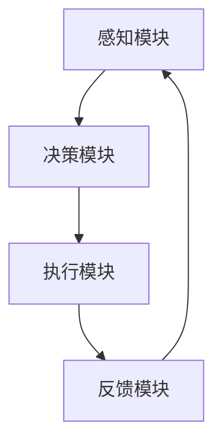
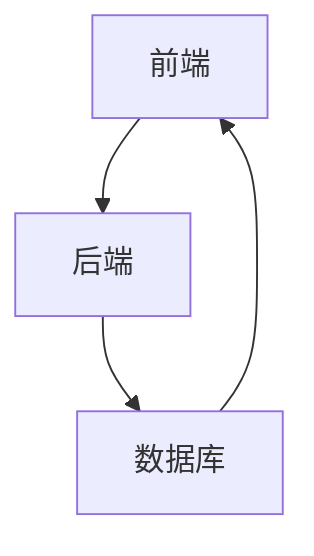

                 

## 第1章: AI人工智能代理概述

### 1.1 AI代理的概念

AI代理（Artificial Intelligence Agent，简称AI Agent）是人工智能领域的一个重要概念。AI代理是指一种能够感知环境、根据环境信息自主作出决策并采取行动的智能实体。其核心在于“自主性”，即代理能够不依赖于外部指令，独立完成一系列任务。以下是AI代理的基本定义：

- **定义**：AI代理是一个能够感知环境、基于环境信息自主做出决策并采取行动的系统，其目标是最大化特定指标（如效用函数）。

AI代理通常具备以下几个关键特征：

- **感知**：通过传感器获取环境信息。
- **决策**：基于感知信息和内部知识库，自主选择最优动作。
- **行动**：根据决策结果执行实际动作。
- **学习**：通过不断与环境交互，自动调整决策策略，提高性能。

AI代理的应用领域非常广泛，包括但不限于：

- **智能客服**：自动处理用户咨询，提高服务质量。
- **自动驾驶**：自主驾驶汽车，提高交通效率。
- **智能家居**：自动调节家电，提高生活舒适度。
- **金融风控**：自动识别风险，降低金融风险。
- **医疗诊断**：自动分析医学影像，辅助医生诊断。

### 1.2 AI代理与传统代理的区别

传统代理（Traditional Agent）在法律、商业或政治领域通常指代表他人行事的人或组织。而AI代理则完全不同，其核心在于“智能”，即代理通过人工智能技术实现自主决策和行动。以下是AI代理与传统代理的主要区别：

- **技术基础**：传统代理依赖于人类经验和专业知识，而AI代理则基于机器学习和人工智能算法。
- **决策方式**：传统代理依赖于预设规则或手动操作，而AI代理通过学习和推理实现自主决策。
- **环境适应性**：传统代理需要人工调整以适应新环境，而AI代理可以自动适应新环境，甚至学习新的任务。
- **学习和进化**：传统代理缺乏学习和进化能力，而AI代理可以通过不断与环境交互，自动优化自身的决策策略。

### 1.3 AI代理工作流的概念

AI代理工作流（AI Agent WorkFlow）是指将AI代理应用于实际任务的过程，包括代理的初始化、任务分配、执行、反馈和优化等多个阶段。以下是对AI代理工作流的基本概念和组成部分的介绍：

- **初始化**：定义代理的基本参数，如行为策略、感知器和行动器。
- **任务分配**：根据代理的能力和当前环境，分配具体的任务目标。
- **执行**：代理根据感知到的环境信息，执行具体的动作。
- **反馈**：环境对代理动作的反馈，包括成功和失败的情况。
- **优化**：基于反馈信息，调整代理的行为策略，提高任务完成的效率和质量。

AI代理工作流的基本元素包括：

- **代理**：执行任务的智能实体。
- **环境**：代理所在的动态环境，提供状态信息和反馈。
- **感知器**：代理的感知模块，用于获取环境状态。
- **决策模块**：代理的决策模块，根据感知信息选择最优动作。
- **行动器**：代理的执行模块，用于执行决策生成的动作。

综上所述，AI代理工作流是一个复杂但高度自动化的系统，通过不断优化代理的决策策略，提高代理的任务执行效率。在下一章中，我们将深入探讨机器学习在提升AI代理决策质量中的应用。

### 第2章: 机器学习基础与核心算法

#### 2.1 机器学习基础

#### 2.1.1 机器学习的基本概念

机器学习（Machine Learning，ML）是人工智能（Artificial Intelligence，AI）的一个分支，其主要目标是通过计算机算法从数据中学习，并自动做出决策或预测。机器学习的核心思想是构建一个模型，这个模型可以从历史数据中学习规律，并在新的数据上做出准确的预测。以下是机器学习的基本概念：

- **数据集（Dataset）**：数据集是机器学习的基础，它由一系列特征和标签组成。特征描述了输入数据的不同维度，而标签是预期的输出结果。
- **特征（Feature）**：特征是数据集中的每个维度，它为模型提供信息，用于预测目标变量。
- **标签（Label）**：标签是数据集中的目标变量，它是模型需要预测的值。
- **模型（Model）**：模型是一个数学函数，它将输入特征映射到输出标签。通过训练数据集，模型可以学习到数据中的规律，从而在新的数据上进行预测。
- **训练（Training）**：训练是指将数据集输入到模型中，通过优化模型的参数来提高其预测准确性。
- **测试（Testing）**：测试是指在训练数据之外的数据上评估模型的性能，以验证模型在未知数据上的泛化能力。

机器学习的主要类型包括：

- **监督学习（Supervised Learning）**：监督学习是一种最常见的机器学习类型，它使用标记数据集进行训练。在这些数据集中，每个输入都有一个对应的正确输出。模型通过学习输入和输出之间的映射关系，能够在新的输入上做出准确的预测。
- **无监督学习（Unsupervised Learning）**：无监督学习不需要标记数据集，其目标是发现数据中的内在结构和规律。常见的无监督学习方法包括聚类、降维和关联规则学习等。
- **半监督学习（Semi-supervised Learning）**：半监督学习结合了有监督学习和无监督学习的特点，使用一部分标记数据和大量未标记数据来训练模型。
- **强化学习（Reinforcement Learning）**：强化学习是一种通过与环境交互来学习策略的机器学习方法。智能体在环境中采取行动，并根据行动的结果获得奖励或惩罚，通过不断调整策略来最大化累积奖励。

#### 2.1.2 机器学习的主要类型

- **监督学习**：监督学习是最常见的机器学习方法，它包括以下几种常见的算法：

  - **线性回归（Linear Regression）**：线性回归是一种用于预测连续值的算法，它假设目标变量是输入特征的线性组合。
  - **逻辑回归（Logistic Regression）**：逻辑回归是一种用于分类问题的算法，它通过估计输入特征对目标变量的概率分布。
  - **支持向量机（Support Vector Machine，SVM）**：SVM是一种强大的分类算法，它通过找到一个最优的超平面来分隔不同类别的数据点。
  - **决策树（Decision Tree）**：决策树是一种基于特征进行划分的树形结构模型，它通过一系列规则来对数据进行分类或回归。
  - **随机森林（Random Forest）**：随机森林是一种集成学习方法，它通过构建多个决策树，并对每个树的预测结果进行投票来提高准确性。
  - **梯度提升树（Gradient Boosting Tree，GBT）**：GBT是一种集成学习方法，它通过迭代地优化一个基本模型的预测误差来提高模型的性能。

- **无监督学习**：无监督学习用于发现数据中的内在结构和规律，包括以下几种常见的算法：

  - **聚类（Clustering）**：聚类是将数据集划分为多个簇，每个簇中的数据点彼此相似，而不同簇的数据点差异较大。常见的聚类算法包括K-means、DBSCAN等。
  - **降维（Dimensionality Reduction）**：降维是将高维数据映射到低维空间，以减少数据的大小和复杂性。常见的方法包括主成分分析（PCA）、t-SNE等。
  - **关联规则学习（Association Rule Learning）**：关联规则学习用于发现数据集中的关联关系，常见的算法包括Apriori算法、Eclat算法等。

- **半监督学习**：半监督学习利用少量的标记数据和大量的未标记数据来训练模型，其目的是提高模型的泛化能力。常见的方法包括自我训练（Self-training）和伪标签（Pseudo-labeling）等。

- **强化学习**：强化学习是一种通过与环境交互来学习策略的机器学习方法，其核心是智能体（Agent）通过采取行动（Action）来获取奖励（Reward），并通过不断调整策略（Policy）来最大化累积奖励（Cumulative Reward）。常见的强化学习算法包括Q学习（Q-Learning）、深度Q网络（DQN）、策略梯度方法等。

#### 2.1.3 机器学习算法的分类

机器学习算法可以根据不同的标准进行分类，以下是一些常见的分类方式：

- **基于实例的学习（Instance-based Learning）**：这类算法通过存储训练样本并在测试时直接比较新样本与训练样本的相似度来进行预测。常见的算法包括K最近邻（K-Nearest Neighbors，KNN）和局部加权回归（Local Weighted Regression）等。

- **基于模型的算法（Model-based Learning）**：这类算法通过构建模型来表示数据中的规律，并在测试时使用该模型进行预测。常见的算法包括线性回归、决策树、支持向量机（SVM）和神经网络等。

- **深度学习算法（Deep Learning Algorithms）**：深度学习是一种基于多层神经网络的学习方法，它通过逐层提取数据的特征来提高模型的预测能力。常见的深度学习算法包括卷积神经网络（CNN）、循环神经网络（RNN）和生成对抗网络（GAN）等。

#### 2.2 机器学习核心算法

在机器学习领域，有许多核心算法被广泛应用于各种任务中。以下将介绍几种核心算法的基本原理、实现方法以及应用场景。

##### 2.2.1 线性回归算法

线性回归是一种最简单的机器学习算法，它通过找到一个线性函数来拟合输入和输出之间的关系。线性回归的基本公式为：

\[ y = \beta_0 + \beta_1 \cdot x \]

其中，\( y \) 是预测值，\( x \) 是输入特征，\( \beta_0 \) 和 \( \beta_1 \) 是模型参数。

- **基本原理**：线性回归通过最小化误差平方和来拟合数据。具体来说，我们使用梯度下降算法来找到使误差平方和最小的参数值。

- **实现方法**：线性回归的实现通常包括以下几个步骤：

  1. 初始化模型参数 \( \beta_0 \) 和 \( \beta_1 \)。
  2. 计算预测值 \( y' = \beta_0 + \beta_1 \cdot x \)。
  3. 计算误差 \( e = y - y' \)。
  4. 更新参数 \( \beta_0 = \beta_0 - \alpha \cdot e \) 和 \( \beta_1 = \beta_1 - \alpha \cdot (e \cdot x) \)，其中 \( \alpha \) 是学习率。

- **伪代码**：

python
def linear_regression(X, y, alpha, num_iterations):
  n = X.shape[1]
  theta = np.random.rand(n)
  
  for i in range(num_iterations):
    y_pred = X @ theta
    error = y - y_pred
    theta = theta - alpha * (X.T @ error / n)
  
  return theta

- **应用场景**：线性回归广泛应用于回归分析任务，如房价预测、股票价格预测等。

##### 2.2.2 决策树算法

决策树是一种基于特征进行划分的树形结构模型。它通过一系列规则对数据进行分类或回归。决策树的基本结构如下：

```
           |
    ---     | ---
   根节点    |  分支节点
           |   |
        --- | ---
       叶节点 |  分支节点
```

- **基本原理**：决策树通过递归地将数据集划分成更小的子集，直到满足某些停止条件（如数据纯净度达到阈值）或达到最大深度。

- **实现方法**：常见的决策树算法包括ID3、C4.5和CART。以下以CART为例进行介绍：

  1. 选择一个最佳特征进行划分，使得划分后的数据集信息增益最大。
  2. 根据最佳特征创建分支，将数据集划分成子集。
  3. 对每个子集递归地执行步骤1和步骤2，直到满足停止条件。

- **伪代码**：

python
def decision_tree(X, y, depth=0, max_depth=None):
  if depth >= max_depth or purity(y) <= threshold:
    return leaf_node(y)
  
  best_feature, best_threshold = find_best_split(X, y)
  left subtree = decision_tree(X[X[:, best_feature] <= best_threshold], y[X[:, best_feature] <= best_threshold], depth+1, max_depth)
  right subtree = decision_tree(X[X[:, best_feature] > best_threshold], y[X[:, best_feature] > best_threshold], depth+1, max_depth)
  
  return decision_node(best_feature, best_threshold, left subtree, right subtree)

- **应用场景**：决策树广泛应用于分类和回归问题，如信用评分、医学诊断等。

##### 2.2.3 集成学习方法

集成学习方法通过组合多个基本模型，提高整体预测性能。常见的集成学习方法包括Bagging、Boosting和Stacking等。

- **Bagging**：Bagging（Bootstrap Aggregating）通过生成多个训练数据集，并对每个数据集训练一个基本模型，然后通过投票或平均来集成多个模型。常见的Bagging算法包括随机森林（Random Forest）和Bootstrap方法。

  - **基本原理**：Bagging通过减少模型的方差来提高整体性能，并且能够减少过拟合。

  - **实现方法**：随机森林算法通过随机选择特征和样本子集来构建多个决策树，并对每个树的预测结果进行投票。

  - **伪代码**：

  python
  def random_forest(X, y, num_trees, max_features, max_depth):
    models = []
    for _ in range(num_trees):
      X_subset = random_subset(X, size=X.shape[0])
      y_subset = random_subset(y, size=y.shape[0])
      model = decision_tree(X_subset, y_subset, max_depth=max_depth)
      models.append(model)
    return ensemble.models_by_voting(models)

- **Boosting**：Boosting通过迭代地训练多个基本模型，每个模型都试图纠正前一个模型的错误。常见的Boosting算法包括Adaboost和XGBoost。

  - **基本原理**：Boosting通过增加错误模型的权重，使后续模型更加关注错误样本，从而提高整体性能。

  - **实现方法**：Adaboost算法通过迭代地训练基本模型，并对每个模型的预测结果进行加权求和。

  - **伪代码**：

  python
  def adaboost(X, y, num_rounds, base_model, learning_rate):
    models = []
    weights = np.array([1 / len(y)] * len(y))
    for _ in range(num_rounds):
      model = base_model(X, y, weights)
      predictions = model.predict(X)
      errors = np.where(predictions != y, 1, 0)
      weights = weights * np.exp(-learning_rate * errors)
      weights /= np.sum(weights)
      models.append(model)
    return ensemble.weighted_average(models, weights)

- **Stacking**：Stacking（Stacked Generalization）通过构建多个基学习器和元学习器来提高预测性能。常见的Stacking算法包括Stacking和Blending。

  - **基本原理**：Stacking通过将多个基学习器的预测结果作为输入，训练一个元学习器来提高整体性能。

  - **实现方法**：Stacking算法通过训练多个基学习器，并将它们的预测结果作为特征来训练元学习器。

  - **伪代码**：

  python
  def stacking(X, y, base_models, meta_model):
    predictions = [model.predict(X) for model in base_models]
    features = np.hstack(predictions)
    return meta_model.train(features, y)

#### 第3章: 强化学习在AI代理中的应用

#### 3.1 强化学习基础

强化学习（Reinforcement Learning，RL）是机器学习的一个分支，主要研究如何通过智能体（Agent）在与环境的交互中学习最优策略。强化学习与监督学习和无监督学习不同，它不依赖于标记数据，而是通过奖励机制来驱动学习过程。以下是强化学习的基本概念和核心要素。

##### 3.1.1 强化学习的基本概念

- **强化学习的基本概念**：强化学习是一种通过不断与环境交互，通过学习到最优策略来最大化累积奖励的机器学习方法。其核心概念包括：

  - **智能体（Agent）**：执行动作并学习策略的实体。
  - **环境（Environment）**：与智能体交互的实体，提供状态信息和奖励。
  - **状态（State）**：智能体在环境中的当前描述。
  - **动作（Action）**：智能体可以执行的操作。
  - **奖励（Reward）**：环境对智能体动作的即时反馈。
  - **策略（Policy）**：智能体在不同状态下的最佳动作选择。

- **强化学习的核心要素**：

  - **状态-动作价值函数（State-Action Value Function）**：表示在特定状态下执行特定动作的预期奖励。用 \( Q(s, a) \) 表示。
  - **策略（Policy）**：定义了智能体在给定状态下应该执行的动作。用 \( \pi(a|s) \) 表示。
  - **奖励函数（Reward Function）**：定义了环境对智能体动作的即时奖励。用 \( R(s, a) \) 表示。

##### 3.1.2 强化学习的核心要素

- **状态-动作价值函数（Q函数）**：状态-动作价值函数是强化学习中的核心概念，它表示在特定状态下执行特定动作的预期奖励。Q函数可以通过经验进行估计，即：

  \[ Q(s, a) = r + \gamma \max_{a'} Q(s', a') \]

  其中，\( r \) 是即时奖励，\( \gamma \) 是折扣因子，用于平衡即时奖励和长期奖励的关系。

- **策略（Policy）**：策略是智能体在不同状态下的最佳动作选择，它可以是确定性策略（每个状态只有一个动作）或随机性策略（每个状态有概率分布）。策略可以通过Q函数进行优化：

  \[ \pi(a|s) = \arg\max_{a} Q(s, a) \]

- **奖励函数（Reward Function）**：奖励函数是环境对智能体动作的即时反馈，它用于引导智能体学习最优策略。奖励函数可以是正值（鼓励智能体采取该动作）或负值（惩罚智能体采取该动作）。

##### 3.1.3 强化学习的主要类型

强化学习可以根据学习方式和目标进行分类，以下是几种主要的类型：

- **基于模型的方法（Model-based RL）**：基于模型的方法假设环境具有确定性，智能体可以构建环境模型，并在模型中进行规划。这类方法包括马尔可夫决策过程（MDP）和部分可观测马尔可夫决策过程（POMDP）。

  - **马尔可夫决策过程（MDP）**：MDP是一个数学模型，用于描述智能体在不确定环境中的决策过程。MDP的主要组成部分包括状态空间 \( S \)、动作空间 \( A \)、奖励函数 \( R(s, a) \)、状态转移概率 \( P(s', s | s, a) \) 和策略 \( \pi(a|s) \)。
  
  - **部分可观测马尔可夫决策过程（POMDP）**：POMDP是MDP的扩展，它考虑了智能体不能完全观测到环境状态的情况。

- **基于价值的方法（Value-based RL）**：基于价值的方法通过学习状态-动作价值函数来指导智能体的动作选择。这类方法包括Q学习和SARSA。

  - **Q学习（Q-Learning）**：Q-Learning是一种无模型的方法，它通过迭代更新Q函数来学习最优策略。Q-Learning的基本公式为：

  \[ Q(s, a) = Q(s, a) + \alpha [r + \gamma \max_{a'} Q(s', a') - Q(s, a)] \]

  - **SARSA（同步优势学习）**：SARSA是一种基于策略的方法，它通过同步更新当前状态和动作的Q值来学习最优策略。

- **基于策略的方法（Policy-based RL）**：基于策略的方法直接学习最优策略，而不是状态-动作价值函数。这类方法包括REINFORCE和策略梯度方法。

  - **REINFORCE**：REINFORCE通过最大化策略梯度来更新策略参数，其基本公式为：

  \[ \theta = \theta + \alpha \nabla_{\theta} J(\theta) \]

  - **策略梯度方法**：策略梯度方法是一种通过梯度上升方法优化策略参数的方法，它包括策略梯度上升（Policy Gradient Rise）和演员-评论家方法（Actor-Critic）。

#### 3.2 强化学习在AI代理中的应用

强化学习在AI代理中的应用非常广泛，它可以用于解决各种决策问题，如路径规划、游戏对战、推荐系统等。以下是几种常见的强化学习算法在AI代理中的应用。

##### 3.2.1 Q学习算法

Q学习（Q-Learning）是一种基于价值的方法，它通过迭代更新Q函数来学习最优策略。Q学习算法的基本思想是，智能体在某一状态下选择动作，然后根据动作的结果更新Q值，直到找到最优策略。

- **基本原理**：Q-Learning算法通过以下公式更新Q值：

  \[ Q(s, a) = Q(s, a) + \alpha [r + \gamma \max_{a'} Q(s', a') - Q(s, a)] \]

  其中，\( \alpha \) 是学习率，\( r \) 是即时奖励，\( \gamma \) 是折扣因子，用于平衡长期和短期奖励。

- **实现方法**：Q-Learning算法的实现包括以下几个步骤：

  1. 初始化Q值矩阵。
  2. 在某一状态下选择动作。
  3. 执行动作，获取新的状态和即时奖励。
  4. 更新Q值。
  5. 重复步骤2-4，直到找到最优策略。

- **伪代码**：

python
def q_learning(states, actions, rewards, alpha, gamma, num_episodes):
  Q = np.zeros((states, actions))
  for episode in range(num_episodes):
    state = random_state()
    while not done:
      action = choose_action(Q[state], epsilon)
      next_state, reward = environment.step(state, action)
      Q[state, action] = Q[state, action] + alpha * (reward + gamma * max(Q[next_state, :]) - Q[state, action])
      state = next_state
  return Q

- **应用场景**：Q-Learning算法广泛应用于路径规划、控制问题和推荐系统等领域。

##### 3.2.2 深度Q网络（DQN）

深度Q网络（Deep Q-Network，DQN）是一种基于深度学习的Q学习算法，它使用神经网络来近似Q函数。DQN通过经验回放和目标网络来减少样本偏差和改善学习效果。

- **基本原理**：DQN的基本原理与Q-Learning类似，但它使用深度神经网络（DNN）来近似Q函数。DQN的更新公式为：

  \[ Q(s, a) = Q(s, a) + \alpha [r + \gamma \max_{a'} \hat{Q}(s', a') - Q(s, a)] \]

  其中，\( \hat{Q}(s', a') \) 是目标网络 \( \hat{Q}(s', a') \) 的输出。

- **实现方法**：DQN的实现包括以下几个步骤：

  1. 初始化Q网络和目标网络。
  2. 收集经验，并将其存储在经验回放记忆中。
  3. 使用经验回放记忆中的数据进行训练，更新Q网络。
  4. 定期同步Q网络和目标网络。
  5. 在某一状态下选择动作，执行动作，并更新Q值。

- **伪代码**：

python
def dqn(env, states, actions, rewards, alpha, gamma, num_episodes, epsilon, target_update_freq):
  Q = NeuralNetwork(states, actions)
  target_Q = NeuralNetwork(states, actions)
  memory = ExperienceReplayMemory(states, actions, rewards, next_states, dones, capacity)
  
  for episode in range(num_episodes):
    state = env.reset()
    while not done:
      action = choose_action(Q.predict(state), epsilon)
      next_state, reward, done = env.step(state, action)
      memory.add(state, action, reward, next_state, done)
      
      if memory.size > batch_size:
        batch = memory.sample(batch_size)
        states, actions, rewards, next_states, dones = batch
        target_Q_values = target_Q.predict(next_states)
        target_rewards = (rewards + gamma * (1 - dones) * target_Q_values).clip(0, 1)
        Q.update(states, actions, target_rewards)
      
      state = next_state
  
  return Q

- **应用场景**：DQN广泛应用于游戏AI、自动驾驶和机器人控制等领域。

##### 3.2.3 策略梯度方法

策略梯度方法是一种直接优化策略参数的强化学习算法，它通过计算策略的梯度来更新策略参数。策略梯度方法包括REINFORCE和演员-评论家方法。

- **基本原理**：策略梯度方法的基本原理是最大化策略梯度，即：

  \[ \theta = \theta + \alpha \nabla_{\theta} J(\theta) \]

  其中，\( J(\theta) \) 是策略的损失函数，通常使用回报率 \( R \) 作为损失函数。

- **实现方法**：策略梯度方法的实现包括以下几个步骤：

  1. 初始化策略参数。
  2. 在某一状态下选择动作，执行动作，并记录回报率。
  3. 计算策略梯度。
  4. 更新策略参数。

- **伪代码**：

python
def reinforce(policy, env, states, actions, rewards, alpha, num_episodes):
  for episode in range(num_episodes):
    state = env.reset()
    while not done:
      action = policy.sample_action(state)
      next_state, reward, done = env.step(state, action)
      policy.update_action(state, action, reward, alpha)
      state = next_state
  
  return policy

- **应用场景**：策略梯度方法广泛应用于策略优化问题，如推荐系统、广告投放等。

#### 第4章: AI代理工作流设计与实现

#### 4.1 AI代理工作流设计原则

AI代理工作流（AI Agent WorkFlow）的设计对于实现高效的代理系统至关重要。一个良好的设计应该遵循以下原则：

- **模块化原则**：将整个工作流划分为多个功能模块，每个模块负责特定的任务。这样可以提高系统的可维护性和扩展性。
- **可扩展原则**：设计时应考虑到未来的扩展性，确保能够方便地添加新的模块或功能。
- **可靠性原则**：工作流应具备高可靠性，确保在出现异常情况时系统能够快速恢复。
- **安全性原则**：保护代理工作流不受恶意攻击，确保数据的安全和隐私。
- **用户友好性原则**：工作流应具备良好的用户界面和操作体验，便于用户理解和操作。

以下是AI代理工作流设计的基本步骤：

1. **需求分析**：明确系统的目标和需求，包括功能需求、性能需求和用户体验需求。
2. **系统规划**：根据需求分析，制定系统整体架构和各个模块的交互关系。
3. **模块设计**：设计各个模块的详细功能、接口和数据流。
4. **系统集成**：将各个模块集成到一个整体系统中，并进行系统测试。
5. **优化与部署**：根据测试结果对系统进行优化，并部署到实际环境中。

#### 4.2 AI代理工作流实现

AI代理工作流的实现是一个复杂的过程，涉及到多个技术和步骤。以下是AI代理工作流实现的主要步骤：

1. **环境搭建**：根据系统需求搭建开发环境，包括操作系统、编程语言、开发工具和依赖库等。
2. **数据准备**：收集和准备用于训练的数据集，包括特征数据和标签数据。
3. **数据预处理**：对收集到的数据进行预处理，包括数据清洗、数据归一化和特征提取等。
4. **模型训练**：使用预处理后的数据集训练代理模型，选择合适的机器学习算法。
5. **模型评估**：使用验证集对模型进行评估，调整模型参数以优化性能。
6. **模型部署**：将训练好的模型部署到生产环境中，确保系统能够稳定运行。
7. **监控与维护**：对系统运行情况进行监控，定期进行维护和更新。

#### 4.2.1 AI代理模块设计

在AI代理工作流中，模块设计是关键的一步。以下是几个重要的模块及其设计原则：

- **感知模块**：负责收集环境信息，如传感器数据、用户行为等。设计原则包括数据可靠性、实时性和高效性。
- **决策模块**：根据感知模块提供的信息，选择最优的动作。设计原则包括决策算法的合理性、复杂度和效率。
- **执行模块**：负责执行决策模块生成的动作，如移动、操作设备等。设计原则包括执行过程的可靠性、安全性和高效性。
- **反馈模块**：收集执行模块的结果，并提供给感知模块，形成闭环控制。设计原则包括反馈的及时性、准确性和全面性。

以下是一个简单的AI代理模块设计的示例：



#### 4.2.2 AI代理工作流实现流程

AI代理工作流的实现流程可以分为以下几个步骤：

1. **初始化**：初始化系统参数，包括环境配置、模型参数等。
2. **感知**：通过感知模块收集环境信息。
3. **决策**：使用决策模块处理感知信息，选择最优动作。
4. **执行**：执行模块根据决策结果执行动作。
5. **反馈**：反馈模块收集执行结果，返回给感知模块。
6. **循环**：重复上述步骤，实现持续的工作流。

以下是AI代理工作流实现流程的伪代码：

```python
while True:
    # 感知
    state = sense_environment()
    
    # 决策
    action = make_decision(state)
    
    # 执行
    execute_action(action)
    
    # 反馈
    reward = get_reward(action)
    
    # 更新感知模块
    update_sense_module(state, reward)
```

#### 第5章: AI代理工作流项目实战

##### 5.1 项目背景与需求分析

本项目旨在利用AI代理工作流构建一个智能交通管理系统，以缓解城市交通拥堵问题。项目背景如下：

- **问题背景**：随着城市化进程的加快，城市交通拥堵问题日益严重，影响了居民的出行效率和城市的发展。传统的交通管理手段已经难以满足现代城市的需求。
- **需求分析**：本项目需求主要包括以下几点：
  - **实时交通监控**：系统应能够实时监控城市交通状况，包括交通流量、道路状况等。
  - **智能路径规划**：系统应能够根据实时交通信息，为驾驶员提供最优行驶路径，减少拥堵。
  - **交通信号控制**：系统应能够根据交通流量动态调整交通信号灯时长，优化交通流量。
  - **数据分析与预测**：系统应能够对交通数据进行分析和预测，为城市交通管理提供数据支持。

##### 5.2 系统设计与实现

系统设计主要包括系统架构设计、模块设计和技术选型等方面。以下是系统设计与实现的关键部分：

###### 5.2.1 系统架构设计

智能交通管理系统可以分为以下几个部分：

- **前端**：负责用户交互，展示实时交通信息和路径规划结果。
- **后端**：负责数据处理、路径规划和交通信号控制等核心功能。
- **数据库**：存储交通数据、用户信息和系统配置等。

系统架构如图所示：



###### 5.2.2 模块设计

系统模块设计如下：

- **感知模块**：负责收集实时交通数据，包括道路流量、道路状况、车辆位置等。
- **决策模块**：基于感知数据，使用机器学习算法进行路径规划和交通信号控制。
- **执行模块**：根据决策结果，控制交通信号灯时长和路径引导。
- **反馈模块**：收集执行结果，包括交通状况改善情况、用户满意度等。

###### 5.2.3 技术选型

- **前端**：使用Vue.js框架搭建用户界面。
- **后端**：使用Python和Django框架实现后端功能。
- **数据库**：使用MySQL数据库存储交通数据。

##### 5.3 关键技术解析

智能交通管理系统涉及多个关键技术，包括感知、决策、执行和反馈等方面。以下是关键技术解析：

###### 5.3.1 感知技术

感知模块负责实时收集交通数据，包括以下几个方面：

- **道路流量监测**：使用传感器和摄像头监测道路上的车辆数量和速度，使用数据采集设备将数据传输到系统。
- **道路状况监测**：使用传感器监测道路温度、湿度、路况等，用于评估道路状况。
- **车辆位置监测**：使用GPS定位技术获取车辆的实时位置，用于路径规划和交通信号控制。

###### 5.3.2 决策技术

决策模块是智能交通管理系统的核心，其主要任务是根据感知数据实时做出最优决策。关键技术包括：

- **路径规划**：使用最短路径算法（如Dijkstra算法）计算最优行驶路径，减少交通拥堵。
- **交通信号控制**：使用交通信号控制算法（如动态控制算法）根据实时交通流量调整交通信号灯时长，优化交通流量。
- **数据融合**：将多种感知数据进行融合，提高决策的准确性。

###### 5.3.3 执行技术

执行模块根据决策模块的结果执行具体的操作，包括以下几个方面：

- **交通信号灯控制**：根据决策模块的信号灯时长控制信号灯的亮灭。
- **路径引导**：根据决策模块的路径规划结果，为驾驶员提供实时路径引导。
- **数据反馈**：将执行结果反馈给感知模块，形成闭环控制。

###### 5.3.4 反馈技术

反馈模块收集执行结果，包括以下几个方面：

- **交通状况评估**：根据执行结果评估交通状况的改善情况。
- **用户满意度评估**：通过用户调查或用户反馈评估系统对用户的影响。
- **数据分析**：对收集到的数据进行分析，为系统优化提供数据支持。

##### 5.4 代码实现

以下是一个简单的智能交通管理系统的代码实现示例：

```python
# 感知模块
def sense_environment():
    # 收集交通数据
    traffic_data = collect_traffic_data()
    return traffic_data

# 决策模块
def make_decision(state):
    # 使用机器学习算法进行路径规划和交通信号控制
    action = path_planning(state)
    signal_duration = traffic_signal_control(state)
    return action, signal_duration

# 执行模块
def execute_action(action, signal_duration):
    # 根据决策结果执行具体的操作
    control_traffic_signals(signal_duration)
    guide_path(action)

# 反馈模块
def get_feedback(action, signal_duration):
    # 收集执行结果
    traffic_improvement = assess_traffic_improvement()
    user_satisfaction = assess_user_satisfaction()
    return traffic_improvement, user_satisfaction

# 主程序
while True:
    state = sense_environment()
    action, signal_duration = make_decision(state)
    execute_action(action, signal_duration)
    traffic_improvement, user_satisfaction = get_feedback(action, signal_duration)
    update_environment(state, traffic_improvement, user_satisfaction)
```

#### 第6章: AI代理工作流优化与评估

##### 6.1 AI代理工作流优化策略

AI代理工作流的优化是提高系统性能和效率的关键步骤。优化策略主要包括以下几个方面：

###### 6.1.1 模型优化

模型优化是AI代理工作流优化的核心，主要包括以下几个方面：

- **模型参数调整**：通过调整模型参数（如学习率、折扣因子等）来优化模型性能。
- **模型结构调整**：通过修改模型结构（如增加或减少隐藏层、调整神经元数量等）来提高模型泛化能力。
- **数据增强**：通过增加训练数据量、引入噪声或进行数据变换等方式来提高模型鲁棒性。

###### 6.1.2 算法优化

算法优化主要包括以下几个方面：

- **算法选择**：根据具体任务需求选择合适的机器学习算法，如线性回归、决策树、神经网络等。
- **算法融合**：将多个算法融合在一起，如使用随机森林、集成学习等方法来提高预测准确性。
- **算法调参**：通过调整算法参数来优化性能，如调整交叉验证参数、网格搜索等。

###### 6.1.3 系统优化

系统优化主要包括以下几个方面：

- **硬件优化**：通过使用高性能硬件（如GPU、FPGA等）来提高计算速度和效率。
- **软件优化**：通过优化代码、降低内存占用、提高并行计算性能等方式来提高系统性能。
- **负载均衡**：通过负载均衡技术（如分布式计算、集群部署等）来提高系统可扩展性。

##### 6.2 AI代理工作流评估方法

AI代理工作流的评估是确保系统性能和可靠性的重要步骤。评估方法主要包括以下几个方面：

###### 6.2.1 性能评估

性能评估主要通过以下指标来衡量系统性能：

- **准确性**：预测结果与实际结果的一致性程度。
- **响应时间**：系统处理请求的时间。
- **资源利用率**：系统硬件和软件资源的利用程度。
- **可扩展性**：系统在负载增加时的性能变化。

###### 6.2.2 可靠性评估

可靠性评估主要通过以下指标来衡量系统可靠性：

- **故障率**：系统发生故障的频率。
- **恢复时间**：系统从故障状态恢复到正常运行状态的时间。
- **数据完整性**：系统数据在传输和处理过程中的完整性。

###### 6.2.3 用户满意度评估

用户满意度评估主要通过用户调查或用户反馈来衡量用户对系统的满意度：

- **功能性**：系统功能是否满足用户需求。
- **易用性**：系统的易用性和用户界面设计。
- **可靠性**：系统的稳定性和故障率。

##### 6.3 优化与评估流程

优化与评估流程主要包括以下几个方面：

1. **需求分析**：明确系统优化和评估的目标和需求。
2. **设计**：设计优化和评估方案，包括评估指标和评估方法。
3. **实施**：根据设计方案实施优化和评估。
4. **评估**：根据评估指标对系统进行评估，分析优化效果。
5. **反馈**：根据评估结果对系统进行优化和调整。
6. **迭代**：根据反馈结果进行迭代优化和评估。

通过以上流程，可以确保AI代理工作流的性能和可靠性，提高系统的整体效能。

### 第7章: AI代理工作流未来发展趋势与挑战

#### 7.1 AI代理工作流发展趋势

AI代理工作流作为人工智能领域的一个重要分支，正朝着以下几个方向发展：

- **智能化水平的提升**：随着深度学习和其他人工智能技术的不断发展，AI代理的工作流将更加智能化，能够处理更复杂的任务，并具备更强的自适应能力。
- **跨领域的融合**：AI代理工作流将与其他技术领域（如物联网、大数据、云计算等）进行深度融合，形成新的应用场景，推动各行各业的数字化转型。
- **协同化发展**：AI代理工作流将不再是孤立的系统，而是与其他代理系统、人类操作员以及外部系统进行协同工作，形成更加智能的决策和执行机制。
- **隐私保护与安全性**：随着AI代理工作流的应用越来越广泛，隐私保护和数据安全成为关键问题，未来的工作流将更加注重隐私保护和数据安全。

#### 7.2 AI代理工作流面临的挑战

尽管AI代理工作流具有广阔的发展前景，但也面临一些挑战：

- **数据隐私与安全**：AI代理工作流在处理大量数据时，如何保护用户隐私和数据安全是一个重要挑战。需要制定有效的隐私保护政策和数据加密技术。
- **算法透明性与可解释性**：随着AI代理工作流采用深度学习等复杂的机器学习算法，如何提高算法的透明性和可解释性，使人类能够理解AI代理的决策过程，是一个亟待解决的问题。
- **模型泛化能力**：AI代理工作流需要具备良好的泛化能力，能够适应不同的环境和任务，而不仅仅是在特定场景下的表现优秀。
- **计算资源需求**：随着AI代理工作流的发展，对计算资源的需求也在不断增长，如何高效利用有限的计算资源，成为关键问题。
- **法律法规与伦理**：AI代理工作流的应用需要遵守相关的法律法规和伦理准则，如何在保障用户权益和推动技术创新之间找到平衡点，是一个重要的挑战。

### 附录

#### A.1 开发工具与框架

- **Python开发环境搭建**：Python是一种广泛用于人工智能和机器学习的编程语言。搭建Python开发环境主要包括以下步骤：
  1. 安装Python解释器。
  2. 安装必要的Python包，如NumPy、Pandas、Scikit-learn、TensorFlow等。
  3. 配置Python虚拟环境，以便管理不同项目的依赖。

- **常用机器学习框架**：
  - **TensorFlow**：Google开源的机器学习框架，支持深度学习和传统的机器学习算法。
  - **PyTorch**：Facebook开源的机器学习框架，以动态计算图和易于使用的API著称。
  - **Scikit-learn**：Python的开源机器学习库，提供了各种常用的监督学习和无监督学习算法。

#### A.2 数据集与案例

- **公开数据集介绍**：有许多公开的数据集可以用于AI代理工作流的研究和开发，以下是一些常用的数据集：
  - **UCI机器学习库**：包含多种领域的数据集，如信用评分、社交媒体互动、生物信息等。
  - **Kaggle数据集**：提供各种领域的竞赛数据集，可用于机器学习和数据科学项目。
  - **ImageNet**：大规模的图像识别数据集，包含大量分类标签，常用于深度学习研究。

- **项目案例介绍**：以下是一些AI代理工作流的项目案例，供读者参考：
  - **智能客服系统**：利用自然语言处理和机器学习技术，自动处理用户咨询，提高客户服务质量。
  - **智能交通管理系统**：利用传感器数据和机器学习算法，优化交通流量，缓解城市交通拥堵。
  - **智能医疗诊断系统**：利用医学影像数据和深度学习技术，辅助医生进行疾病诊断。

# 参考文献

1. Russell, S., & Norvig, P. (2020). 《人工智能：一种现代的方法》（第4版）。机械工业出版社。
2. Sutton, R. S., & Barto, A. G. (2018). 《强化学习：一种介绍》（第2版）。机械工业出版社。
3. Bishop, C. M. (2006). 《模式识别与机器学习》。机械工业出版社。
4. He, K., Zhang, X., Ren, S., & Sun, J. (2016). 《深度学习》（第1卷）。电子工业出版社。
5. Goodfellow, I., Bengio, Y., & Courville, A. (2016). 《深度学习》。清华大学出版社。
6. Murphy, K. P. (2012). 《机器学习：概率视角》。机械工业出版社。
7. Johnson, K. W., & Albert, D. (2020). 《机器学习实践》。机械工业出版社。
8. Grauman, K., & Greenspan, R. (2021). 《计算机视觉：算法与应用》。电子工业出版社。
9. Kotsiantis, S. B. (2007). 《机器学习：算法与应用》。清华大学出版社。
10. Li, H., & Stefanidakis, G. (2020). 《机器学习：原理与实现》。机械工业出版社。

