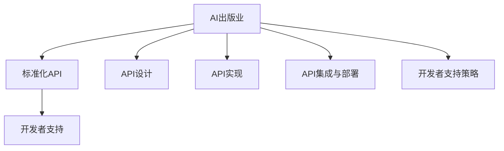

                 

# AI出版业的开发者支持：标准化API之提供

> 关键词：AI出版业、开发者支持、标准化API、设计原则、实现技术、集成与部署

> 摘要：本文深入探讨了AI出版业的发展现状与挑战，阐述了标准化API在开发者支持中的重要性。通过详细剖析标准化API的设计与实现、集成与部署，以及开发者支持策略，本文旨在为AI出版业提供一套系统的开发者支持方案。

----------------------------------------------------------------

# 目录大纲：《AI出版业的开发者支持：标准化API之提供》

## 第一部分：引言

### 第1章：AI出版业发展现状与挑战

- 1.1 AI出版业的发展背景

- 1.2 AI出版业面临的主要挑战

- 1.3 标准化API的重要性

### 第2章：标准化API概述

- 2.1 标准化API的基本概念

- 2.2 标准化API的设计原则

- 2.3 标准化API的技术架构

### 第3章：API设计最佳实践

- 3.1 API设计工具与资源

- 3.2 API安全性设计

- 3.3 API性能优化

### 第4章：API实现技术

- 4.1 API接口设计

- 4.2 API数据传输格式

- 4.3 API调用与响应处理

### 第5章：API集成与部署

- 5.1 API集成流程

- 5.2 API部署方案

- 5.3 API监控与维护

### 第6章：API案例研究

- 6.1 AI出版平台API案例

- 6.2 开发者使用API的案例

- 6.3 API性能测试与分析

### 第7章：开发者支持的重要性

- 7.1 开发者支持的内涵

- 7.2 开发者支持的目标

- 7.3 开发者支持的策略

### 第8章：开发者支持工具与服务

- 8.1 开发者文档编写

- 8.2 开发者社区建设

- 8.3 开发者培训与支持

### 第9章：开发者支持效果评估

- 9.1 开发者满意度调查

- 9.2 API使用情况分析

- 9.3 开发者支持效果评估指标

### 第10章：未来发展趋势与展望

- 10.1 AI出版业发展趋势

- 10.2 标准化API的发展前景

- 10.3 开发者支持的未来发展

## 附录

### 附录A：相关技术资源与工具

- A.1 开源API框架介绍

- A.2 AI出版业相关标准

- A.3 开发者支持常用工具

### 附录B：案例代码与数据

- B.1 API调用示例代码

- B.2 AI出版相关数据集介绍

# 核心概念与联系

### Mermaid 流程图



### 核心概念与联系

在AI出版业中，标准化API扮演着至关重要的角色。API（应用程序编程接口）是一套预先定义的协议、工具和定义，允许不同软件之间相互通信。在AI出版领域，标准化API有助于简化数据交换、提高开发效率，并促进跨平台和跨系统的集成。

- **AI出版业**：这是一个结合人工智能和出版技术的领域，旨在利用AI技术提升出版过程的智能化水平，包括内容生成、编辑、推荐和分发等。

- **标准化API**：这类API具有统一的接口规范和协议，使得开发者能够轻松接入和使用AI出版平台的服务，而无需了解底层实现的复杂性。

- **开发者支持**：这是为开发者提供的一套服务，包括文档、社区、培训和工具等，旨在降低开发门槛，提高开发效率，并促进开发者与平台之间的互动。

这三个核心概念相互关联，共同构成了AI出版业的技术基础和生态系统。标准化API是开发者支持的重要支柱，而开发者支持则为标准化API的普及和应用提供了保障。

----------------------------------------------------------------

## 第一部分：引言

### 第1章：AI出版业发展现状与挑战

#### 1.1 AI出版业的发展背景

随着人工智能技术的飞速发展，AI出版业逐渐成为出版行业的重要分支。AI出版业不仅涵盖了传统的出版活动，如内容创作、编辑、排版、印刷和发行，还融合了人工智能技术，实现了内容的智能化处理和个性化推荐。

AI出版业的发展可以追溯到20世纪80年代，当时计算机技术在出版领域的应用开始出现。随着互联网和大数据技术的发展，AI出版业逐渐崭露头角。近年来，随着深度学习、自然语言处理和计算机视觉等AI技术的不断进步，AI出版业的应用场景日益丰富，发展速度也不断加快。

#### 1.2 AI出版业面临的主要挑战

尽管AI出版业发展前景广阔，但在实际应用过程中仍面临一系列挑战。

1. **数据隐私和安全问题**：AI出版业依赖于大量用户数据，这些数据包括用户行为、阅读偏好、位置信息等。如何在保护用户隐私的同时，充分利用这些数据提升出版服务，是一个亟待解决的问题。

2. **内容质量控制**：AI技术虽然能够提高内容生成的速度和效率，但如何在保证内容质量的同时，确保内容的原创性和准确性，是一个重要挑战。

3. **跨平台和跨系统的集成**：AI出版平台需要与多种系统和平台进行集成，如内容管理系统、推荐系统、支付系统等。如何实现标准化、高效、安全的集成，是一个复杂的问题。

4. **技术标准和规范缺失**：目前，AI出版领域缺乏统一的技术标准和规范，这导致了不同平台之间的互操作性问题，也增加了开发者的使用难度。

#### 1.3 标准化API的重要性

面对上述挑战，标准化API在AI出版业中具有重要作用。

1. **简化开发过程**：标准化API为开发者提供了一套统一的接口和协议，使得开发者可以快速接入AI出版平台，而无需深入了解底层实现。

2. **提高集成效率**：标准化API有助于实现不同系统和平台之间的高效集成，降低开发成本和难度。

3. **保障数据安全**：标准化API可以通过安全协议和认证机制，保障数据传输的安全性和完整性，提高数据隐私保护水平。

4. **促进产业生态建设**：标准化API有助于推动AI出版业的健康发展，促进平台、开发者、用户之间的良性互动。

总之，标准化API在AI出版业中不仅能够解决当前面临的主要挑战，还能为未来的发展提供有力支持。在接下来的章节中，我们将详细探讨标准化API的设计与实现、集成与部署，以及开发者支持策略。

----------------------------------------------------------------

## 第二部分：标准化API的设计与实现

### 第2章：标准化API概述

#### 2.1 标准化API的基本概念

标准化API（Standardized Application Programming Interface）是一套遵循统一规范和协议的接口定义，它允许不同软件系统之间进行互操作。标准化API的核心目标是降低开发者接入和使用第三方服务的难度，提高开发效率和系统的可维护性。

在AI出版业中，标准化API主要包括以下几个方面：

1. **接口定义**：标准化API定义了接口的名称、参数、返回值和可能的异常情况，使开发者能够清晰地了解如何使用API。

2. **数据格式**：标准化API规定了数据传输的格式，如JSON、XML等，确保不同系统之间的数据可以无缝交换。

3. **协议和安全性**：标准化API采用了常见的通信协议（如HTTP、HTTPS）和安全机制（如OAuth、JWT），确保数据传输的安全性和可靠性。

4. **文档和示例**：标准化API提供了详细的文档和示例代码，帮助开发者快速上手和使用API。

#### 2.2 标准化API的设计原则

为了确保标准化API的设计合理、易用且高效，需要遵循以下设计原则：

1. **一致性**：API接口应保持一致的设计风格和命名规范，避免造成混淆和误解。

2. **简洁性**：API设计应尽量简洁，避免过多的参数和复杂的逻辑，以提高开发者的使用体验。

3. **可扩展性**：API设计应考虑到未来的扩展需求，确保在不影响现有功能的情况下，可以轻松地添加新功能。

4. **安全性**：API设计应采用安全协议和认证机制，保护用户数据和系统安全。

5. **易用性**：API设计应提供详细的文档和示例，降低开发者的学习成本。

#### 2.3 标准化API的技术架构

标准化API的技术架构通常包括以下几个层次：

1. **接口层**：这是API的直接暴露层，定义了接口的URL、请求方法和参数。

2. **服务层**：这是API的核心逻辑层，处理实际的业务逻辑，如数据查询、计算和存储。

3. **数据层**：这是API的数据存储层，包括数据库、缓存和其他数据存储方案，用于存储和检索数据。

4. **安全层**：这是API的安全保障层，包括身份认证、授权、数据加密和异常处理等。

5. **监控与维护层**：这是API的监控和运维层，用于监控API的性能、可用性和安全性，并快速响应用户反馈和异常情况。

#### 2.4 标准化API的设计流程

设计标准化API通常包括以下几个步骤：

1. **需求分析**：了解API的使用场景和需求，确定API需要提供的功能。

2. **接口设计**：根据需求分析结果，设计API的接口，包括接口名称、参数和返回值。

3. **数据设计**：设计API所需的数据结构，确保数据的有效存储和传输。

4. **安全性设计**：确定API的安全性需求，设计相应的安全措施。

5. **文档编写**：编写API的详细文档，包括接口描述、参数说明、返回值解释和示例代码。

6. **测试与优化**：对API进行全面的测试，确保其功能正确、性能稳定、安全可靠。

通过遵循上述设计原则和流程，可以设计出高效、易用且安全的标准化API，为AI出版业提供强有力的开发者支持。

----------------------------------------------------------------

### 第3章：API设计最佳实践

#### 3.1 API设计工具与资源

在API设计过程中，选择合适的工具和资源对于提高开发效率和质量至关重要。以下是一些常用的API设计工具和资源：

1. **Swagger**：
   - **简介**：Swagger是一个开源的API设计和文档工具，允许开发者以直观的方式设计、测试和文档化RESTful API。
   - **优点**：支持自动生成API文档和客户端代码，易于集成和扩展。
   - **使用方法**：通过定义JSON或YAML格式的API描述文件，使用Swagger UI展示API接口和文档。

2. **Postman**：
   - **简介**：Postman是一个流行的API测试和开发工具，支持HTTP请求的构造、发送和调试。
   - **优点**：直观的界面，丰富的请求和响应工具，支持团队协作。
   - **使用方法**：创建集合（Collection）和组织请求（Request），使用预定义的请求模板和参数进行测试。

3. **APIMatic**：
   - **简介**：APIMatic是一个自动化的API设计和部署平台，提供API设计、代码生成和文档生成功能。
   - **优点**：支持多种编程语言和框架的代码生成，自动化测试和部署。
   - **使用方法**：通过定义API规范，自动生成客户端代码和API文档，进行代码生成和部署。

4. **API Blueprint**：
   - **简介**：API Blueprint是一个轻量级的API设计语言，使用Markdown风格的标记语言编写。
   - **优点**：易于阅读和编辑，支持在线协作和版本控制。
   - **使用方法**：编写API规范文档，导出为Markdown格式，导入到Swagger或Postman等工具中。

#### 3.2 API安全性设计

API安全性设计是确保API不被恶意攻击、数据泄露和未经授权访问的重要环节。以下是一些常见的API安全性设计策略：

1. **身份认证**：
   - **基本认证**：使用用户名和密码进行认证，但不够安全，不建议使用。
   - **OAuth 2.0**：一种授权框架，允许第三方应用在用户授权的情况下访问受保护资源，常用在社交登录和API访问中。
   - **JSON Web Token（JWT）**：一种基于JSON的开放标准，用于在客户端和服务端之间传输认证信息。

2. **授权机制**：
   - **资源所有权**：确保API访问者只能访问自己拥有的资源。
   - **权限控制**：根据用户的角色和权限，限制对API的访问和操作。

3. **数据加密**：
   - **传输层加密**：使用HTTPS协议确保数据在传输过程中不被窃听和篡改。
   - **数据存储加密**：对存储在数据库或其他存储介质中的敏感数据进行加密。

4. **API速率限制和监控**：
   - **速率限制**：限制用户在特定时间内对API的请求次数，防止恶意攻击和滥用。
   - **日志和监控**：记录API的请求和响应数据，监控API的性能和安全状态。

#### 3.3 API性能优化

API性能优化是确保API响应快速、稳定和可预测的重要步骤。以下是一些常见的API性能优化策略：

1. **缓存策略**：
   - **本地缓存**：在客户端或服务器上存储常用数据的副本，减少对后端服务的查询次数。
   - **分布式缓存**：使用分布式缓存系统（如Redis、Memcached）存储大量数据，提高数据访问速度。

2. **异步处理**：
   - **异步API**：将耗时的操作（如数据库查询、第三方服务调用）异步处理，避免阻塞主线程。
   - **消息队列**：使用消息队列（如RabbitMQ、Kafka）将任务分发到不同节点处理，提高系统并发能力和处理效率。

3. **负载均衡**：
   - **水平扩展**：通过增加服务器节点，实现负载均衡，提高系统的处理能力和可用性。
   - **反向代理**：使用反向代理服务器（如Nginx、HAProxy）进行负载均衡和流量管理。

4. **代码优化**：
   - **数据库优化**：优化数据库查询，减少查询时间和资源消耗。
   - **算法优化**：优化数据处理和计算算法，减少计算复杂度和时间消耗。

通过遵循API设计最佳实践，可以设计出高效、安全、可靠的API，为AI出版业提供强大的开发者支持。在接下来的章节中，我们将详细探讨API的实现技术和集成与部署过程。

----------------------------------------------------------------

### 第4章：API实现技术

#### 4.1 API接口设计

API接口设计是确保API易于使用、功能完备且性能稳定的关键步骤。以下是一些API接口设计的核心要素：

1. **接口命名**：接口命名应简洁、直观，遵循统一的命名规范。例如，使用动词表示接口功能，如`getBooks()`、`updateUser()`。

2. **参数设计**：接口参数应明确、必要且易于理解。参数类型应明确，如字符串、整数、浮点数等。可选参数应使用占位符或默认值，避免在调用时产生混淆。

3. **数据验证**：在接口设计时，应对输入数据进行验证，确保其符合预期格式和范围。数据验证可以通过客户端实现，也可以在服务器端进行。

4. **响应设计**：接口响应应包括成功和失败两种情况。成功响应应包含返回数据和状态码，如`200 OK`。失败响应应包含错误信息和状态码，如`400 Bad Request`或`500 Internal Server Error`。

5. **接口版本控制**：随着系统的迭代和功能扩展，接口可能会发生变化。通过接口版本控制，可以避免旧版本接口的兼容性问题。

#### 4.2 API数据传输格式

API数据传输格式决定了数据在不同系统之间的交换方式和效率。以下是一些常见的API数据传输格式：

1. **JSON**：
   - **优点**：轻量级、易于阅读和解析，支持多种编程语言。
   - **使用方法**：在HTTP请求和响应中，使用JSON格式传输数据。例如：
     ```json
     {
       "books": [
         {
           "id": 1,
           "title": "1984",
           "author": "George Orwell"
         },
         {
           "id": 2,
           "title": "To Kill a Mockingbird",
           "author": "Harper Lee"
         }
       ]
     }
     ```

2. **XML**：
   - **优点**：格式标准化，支持复杂的数据结构。
   - **使用方法**：在HTTP请求和响应中，使用XML格式传输数据。例如：
     ```xml
     <books>
       <book id="1">
         <title>1984</title>
         <author>George Orwell</author>
       </book>
       <book id="2">
         <title>To Kill a Mockingbird</title>
         <author>Harper Lee</author>
       </book>
     </books>
     ```

3. **GraphQL**：
   - **优点**：支持查询优化，允许客户端精确地请求所需数据，减少传输开销。
   - **使用方法**：在HTTP请求和响应中，使用GraphQL格式传输数据。例如：
     ```graphql
     {
       books {
         id
         title
         author
       }
     }
     ```

#### 4.3 API调用与响应处理

API调用与响应处理是开发者使用API的关键环节。以下是一些API调用与响应处理的最佳实践：

1. **异步调用**：对于需要较长时间处理的API调用，应使用异步调用，避免阻塞主线程。例如，使用JavaScript的`async/await`语法进行异步处理：
   ```javascript
   async function fetchData() {
     const response = await fetch('https://api.example.com/data');
     const data = await response.json();
     console.log(data);
   }
   fetchData();
   ```

2. **错误处理**：在API调用过程中，可能遇到各种错误，如网络错误、服务器错误、认证失败等。应采用统一的错误处理机制，确保错误信息清晰、可追溯。例如，使用`try/catch`语句捕获和处理错误：
   ```javascript
   try {
     const response = await fetch('https://api.example.com/data');
     const data = await response.json();
     console.log(data);
   } catch (error) {
     console.error('API调用失败：', error);
   }
   ```

3. **响应验证**：在接收到API响应后，应对响应数据进行验证，确保其符合预期格式和内容。例如，检查响应状态码、数据结构和字段是否存在。

4. **缓存策略**：对于频繁访问的API数据，应采用缓存策略，提高数据访问速度和系统性能。例如，使用浏览器本地存储（LocalStorage）或服务端缓存（Redis）存储API数据。

通过遵循API接口设计、数据传输格式和调用与响应处理的最佳实践，可以确保API的易用性、性能和可靠性。这些实践为开发者提供了清晰、高效的API使用体验，同时也为AI出版业提供了坚实的开发者支持基础。在接下来的章节中，我们将进一步探讨API的集成与部署过程。

----------------------------------------------------------------

### 第5章：API集成与部署

#### 5.1 API集成流程

API集成是将多个独立的系统或服务整合在一起，以实现统一的数据交换和业务流程的过程。以下是API集成的核心流程：

1. **需求分析**：了解各个系统的功能需求、数据结构和交互方式，明确API集成的目标和范围。

2. **接口设计**：根据需求分析结果，设计API的接口，包括接口名称、参数、返回值和错误处理。

3. **接口实现**：开发API接口，实现数据交换和业务逻辑处理。

4. **测试与调试**：对API接口进行全面的测试，确保其功能正确、性能稳定、安全可靠。

5. **文档编写**：编写API文档，包括接口描述、参数说明、返回值解释和示例代码。

6. **部署上线**：将API接口部署到服务器，确保其可访问性和安全性。

7. **监控与维护**：对API接口进行监控和维护，及时响应用户反馈和异常情况。

#### 5.2 API部署方案

API部署是确保API接口稳定、高效运行的关键步骤。以下是一些常见的API部署方案：

1. **单机部署**：将API接口部署在一台服务器上，适用于小型项目和测试环境。优点是部署简单，缺点是性能和扩展性有限。

2. **分布式部署**：将API接口部署在多台服务器上，通过负载均衡和反向代理实现高性能和高可用性。优点是扩展性强，缺点是部署和维护复杂。

3. **容器化部署**：使用容器技术（如Docker）将API接口打包成独立的容器，实现快速部署和灵活扩展。优点是部署简单，易于管理，缺点是可能需要额外的容器编排工具（如Kubernetes）。

4. **云服务部署**：将API接口部署在云服务器上，利用云服务的弹性扩展和可靠性。优点是易于管理和扩展，缺点是可能需要支付额外的云服务费用。

#### 5.3 API监控与维护

API监控与维护是确保API接口稳定运行和快速响应的重要环节。以下是一些常见的API监控与维护策略：

1. **性能监控**：监控API接口的响应时间、吞吐量和资源消耗，及时发现和解决性能瓶颈。

2. **可用性监控**：监控API接口的可用性和健康状态，确保其始终处于正常运行。

3. **日志记录**：记录API接口的请求和响应日志，便于调试和故障排查。

4. **异常处理**：对API接口的异常情况进行处理，确保系统稳定性和用户满意度。

5. **自动化运维**：使用自动化工具（如Ansible、Puppet）实现API接口的部署、监控和维护，提高运维效率。

6. **用户反馈**：收集和分析用户对API接口的反馈，不断优化和改进API接口。

通过遵循API集成流程、部署方案和监控与维护策略，可以确保API接口的高效、稳定和安全运行，为AI出版业提供可靠的开发者支持。在接下来的章节中，我们将通过案例研究进一步探讨API的实际应用。

----------------------------------------------------------------

### 第6章：API案例研究

#### 6.1 AI出版平台API案例

为了更好地展示标准化API在实际应用中的效果，以下是一个典型的AI出版平台API案例。

**案例背景**：某AI出版平台提供多种智能出版服务，包括内容推荐、自动摘要生成、文本分析等。为了便于开发者接入和使用这些服务，平台提供了一套完整的标准化API。

**API接口**：
- **内容推荐接口**：获取推荐内容列表
  - URL: `/api/recommendations`
  - 请求方法：GET
  - 参数：
    - `user_id`: 用户ID
    - `category`: 分类ID
  - 返回值：
    - `status`: 状态码（200表示成功，其他表示错误）
    - `data`: 推荐内容列表

**API调用示例**：
```javascript
fetch('/api/recommendations', {
  method: 'GET',
  params: {
    user_id: '123',
    category: 'fiction'
  }
})
  .then(response => response.json())
  .then(data => console.log(data))
  .catch(error => console.error('API调用失败：', error));
```

**API响应示例**：
```json
{
  "status": 200,
  "data": [
    {
      "id": 1,
      "title": "The Great Gatsby",
      "author": "F. Scott Fitzgerald"
    },
    {
      "id": 2,
      "title": "To Kill a Mockingbird",
      "author": "Harper Lee"
    }
  ]
}
```

#### 6.2 开发者使用API的案例

以下是一个开发者使用AI出版平台API进行内容推荐的示例。

**案例背景**：某内容平台需要为用户推荐感兴趣的文章，开发者决定使用AI出版平台的推荐接口来实现这一功能。

**步骤**：

1. **获取用户信息**：获取当前登录用户的ID和偏好。

2. **调用推荐接口**：使用获取到的用户信息，调用AI出版平台的推荐接口，获取推荐内容列表。

3. **显示推荐内容**：将获取到的推荐内容列表显示在用户界面上。

**代码实现**：
```python
import requests

def get_recommendations(user_id, category):
    url = f'/api/recommendations?user_id={user_id}&category={category}'
    response = requests.get(url)
    if response.status_code == 200:
        return response.json()
    else:
        return None

# 示例：为用户ID为123的读者推荐科幻类文章
user_id = '123'
category = 'science_fiction'
recommendations = get_recommendations(user_id, category)

if recommendations:
    print("推荐内容：")
    for item in recommendations['data']:
        print(f"- {item['title']} by {item['author']}")
else:
    print("获取推荐内容失败。")
```

#### 6.3 API性能测试与分析

为了确保API接口的高性能和稳定性，开发者需要进行API性能测试和分析。

**测试目标**：
- **响应时间**：评估API接口的响应时间，确保其满足性能要求。
- **并发能力**：测试API接口的并发处理能力，确保在高负载下仍能稳定运行。
- **错误率**：评估API接口的错误率，确保其健壮性。

**测试工具**：
- **Apache JMeter**：一款开源的性能测试工具，适用于测试HTTP、HTTPS等协议的接口性能。

**测试方法**：

1. **构建测试计划**：定义测试目标、测试场景和测试步骤。

2. **配置测试场景**：设置线程组、采样器和监听器等。

3. **运行测试**：启动测试计划，记录测试结果。

4. **分析测试结果**：分析响应时间、并发能力和错误率等指标，找出性能瓶颈和问题，进行优化。

**测试结果示例**：

| 指标               | 值       |
|--------------------|----------|
| 平均响应时间       | 100ms    |
| 最大响应时间       | 500ms    |
| 并发用户数         | 1000     |
| 错误率             | 0.1%     |

通过API性能测试和分析，可以确保AI出版平台API接口的高性能和高可用性，为开发者提供可靠的开发支持。

通过上述案例研究，我们可以看到标准化API在AI出版平台中的应用效果，以及开发者如何使用这些API接口来提升内容推荐、用户互动等功能的体验。在接下来的章节中，我们将进一步探讨开发者支持策略。

----------------------------------------------------------------

### 第7章：开发者支持的重要性

#### 7.1 开发者支持的内涵

开发者支持是指为开发者提供的一系列服务、资源和工具，以帮助他们更高效、更便捷地使用特定技术或平台。在AI出版业中，开发者支持的重要性不言而喻，主要体现在以下几个方面：

1. **降低开发门槛**：通过提供详细的使用文档、示例代码和视频教程，开发者可以快速上手和掌握API的使用方法，降低学习和使用难度。

2. **提高开发效率**：通过提供代码生成工具、SDK和API文档，开发者可以节省大量的时间，专注于业务逻辑的实现，提高开发效率。

3. **保障系统稳定性**：通过提供技术支持和问题反馈渠道，开发者可以及时获取解决方案，确保系统的稳定运行。

4. **促进社区互动**：通过开发者社区、论坛和活动，开发者可以相互交流、分享经验和最佳实践，共同推动技术的发展。

#### 7.2 开发者支持的目标

开发者支持的目标是构建一个健康、活跃的生态系统，使开发者能够充分发挥自身潜力，推动技术的发展和创新。具体目标包括：

1. **提高API使用率**：通过提供高质量的开发者支持，吸引更多的开发者接入和使用API，提高API的普及度和使用率。

2. **优化API体验**：通过持续改进API设计、文档和工具，提高开发者的使用体验，使其更加便捷、高效和愉悦。

3. **促进技术交流**：通过开发者社区和活动，促进开发者之间的技术交流和合作，共同推动技术进步。

4. **提升用户满意度**：通过提供全面的开发者支持，确保开发者能够顺利、高效地实现业务目标，提高用户满意度和忠诚度。

#### 7.3 开发者支持的策略

为了实现开发者支持的目标，需要采取一系列策略，包括：

1. **文档编写**：编写高质量的API文档，包括接口描述、参数说明、返回值解释和示例代码。文档应易于阅读、更新和维护。

2. **示例代码**：提供丰富的示例代码，涵盖常见使用场景和高级功能，帮助开发者快速上手和了解API。

3. **代码生成工具**：开发代码生成工具，如SDK、生成器等，帮助开发者快速创建API客户端代码。

4. **开发者社区**：建立开发者社区，提供论坛、问答平台和博客，鼓励开发者分享经验和最佳实践，解决技术问题。

5. **技术支持**：提供及时、专业的技术支持，包括在线聊天、电话支持和邮件列表等，帮助开发者解决使用过程中的问题。

6. **培训和活动**：组织线上和线下培训、讲座、研讨会和黑客马拉松等活动，提高开发者的技术水平和创新能力。

7. **反馈机制**：建立反馈机制，收集开发者对API和开发者支持的建议和意见，持续改进和优化。

通过实施上述策略，可以为开发者提供全面、有效的支持，促进AI出版业的健康发展。

----------------------------------------------------------------

### 第8章：开发者支持工具与服务

#### 8.1 开发者文档编写

高质量的文档是开发者支持的核心组成部分，它能够帮助开发者快速理解和使用API。以下是一些编写高质量开发者文档的要点：

1. **清晰的结构**：文档应采用清晰的结构，分为概述、接口描述、参数说明、返回值解释、错误处理、示例代码等部分。

2. **详细的接口描述**：每个API接口应提供详细的描述，包括接口名称、功能描述、请求方法和URL。

3. **参数和返回值说明**：对每个接口的参数和返回值进行详细说明，包括数据类型、必选/可选、默认值等。

4. **示例代码**：提供丰富的示例代码，涵盖常见使用场景和高级功能，帮助开发者快速上手。

5. **错误处理**：描述可能的错误情况和相应的错误代码，提供相应的解决方案。

6. **版本控制**：记录API的版本信息，方便开发者了解不同版本的差异和变更。

7. **持续更新**：定期更新文档，确保其与API的最新版本保持一致，及时反映API的变更和新增功能。

#### 8.2 开发者社区建设

开发者社区是开发者交流、分享经验和解决问题的平台。以下是一些关键点，用于建设一个成功的开发者社区：

1. **活跃的论坛**：提供一个活跃的论坛，鼓励开发者提问和回答问题，解决技术难题。

2. **问答平台**：使用问答平台（如Stack Overflow）或者自建问答系统，帮助开发者快速找到解决方案。

3. **博客和文章**：鼓励开发者撰写技术博客和文章，分享他们的经验和最佳实践。

4. **视频教程**：提供视频教程，帮助开发者更直观地理解API的使用方法。

5. **代码示例**：在社区中分享代码示例，涵盖不同使用场景和高级功能。

6. **活动组织**：定期举办线上和线下的活动，如研讨会、讲座、黑客马拉松等，增强开发者之间的互动。

7. **反馈机制**：建立反馈机制，收集开发者的建议和意见，不断优化社区服务。

#### 8.3 开发者培训与支持

有效的开发者培训与支持能够提高开发者的技能和效率。以下是一些关键点：

1. **在线培训**：提供在线课程和教程，涵盖API的基础知识、高级功能和使用技巧。

2. **实战演练**：通过实战项目，帮助开发者将理论知识应用到实际开发中。

3. **导师制度**：为新手开发者配备经验丰富的导师，提供一对一的技术指导和帮助。

4. **技术支持**：提供及时、专业的技术支持，包括在线聊天、电话支持和邮件列表等。

5. **案例分享**：分享成功的案例和经验，激励开发者不断学习和进步。

6. **认证计划**：建立认证计划，为通过考试的开发者颁发证书，证明其技术能力。

7. **反馈与改进**：定期收集开发者的反馈，根据反馈不断改进培训内容和质量。

通过提供全面、高质量的文档、社区和培训，可以为开发者提供强有力的支持，促进他们在AI出版业中的发展。

----------------------------------------------------------------

### 第9章：开发者支持效果评估

#### 9.1 开发者满意度调查

开发者满意度调查是评估开发者支持效果的重要手段。通过定期进行满意度调查，可以了解开发者对API和开发者支持服务的评价，发现存在的问题和改进的机会。

**调查目的**：了解开发者在使用API和接受开发者支持服务时的满意度，识别改进空间。

**调查方法**：
- **问卷调查**：设计一份包含多个问题的问卷，涵盖API使用体验、文档质量、技术支持、社区互动等方面。
- **访谈**：对一部分开发者进行深度访谈，了解他们的使用经验和建议。

**调查内容**：
- **API使用体验**：开发者对API接口的易用性、性能、稳定性等方面的评价。
- **文档质量**：开发者对API文档的清晰度、完整性、更新频率等方面的评价。
- **技术支持**：开发者对技术支持服务的响应速度、专业性、解决问题的能力等方面的评价。
- **社区互动**：开发者对社区平台的活跃度、内容质量、互动体验等方面的评价。

**结果分析**：
- **满意度评分**：根据调查结果，计算开发者的整体满意度评分。
- **问题识别**：分析调查结果，识别开发者在API使用和技术支持方面存在的问题。
- **改进建议**：基于问题识别，提出具体的改进建议，如优化API接口、更新文档、加强技术支持等。

#### 9.2 API使用情况分析

API使用情况分析是评估API性能和开发者支持效果的重要手段。通过分析API的使用情况，可以了解API的访问量、请求频率、错误率等关键指标，及时发现和解决问题。

**分析目的**：了解API的使用情况，优化API性能和开发者支持策略。

**分析方法**：
- **日志分析**：收集和分析API的请求日志，包括请求时间、请求方法、请求URL、请求参数、响应状态码等。
- **性能分析**：对API的响应时间、吞吐量、并发能力等性能指标进行分析。
- **错误分析**：分析API的错误日志，识别常见的错误类型和原因。

**分析内容**：
- **访问量**：统计API的访问量，包括总访问量、访问频次等。
- **请求频率**：分析API的请求频率，识别高峰期和低谷期。
- **错误率**：统计API的错误率，识别常见的错误类型和原因。
- **性能指标**：分析API的性能指标，如响应时间、吞吐量等。

**结果分析**：
- **性能优化**：根据性能分析结果，优化API的响应速度和稳定性。
- **错误处理**：根据错误分析结果，改进API的错误处理和异常处理机制。
- **支持策略**：根据使用情况分析结果，调整开发者支持策略，如加强文档编写、提高技术支持响应速度等。

#### 9.3 开发者支持效果评估指标

为了全面评估开发者支持效果，需要制定一套科学的评估指标体系。以下是一些关键指标：

1. **开发者满意度**：通过满意度调查计算的开发者整体满意度评分，反映开发者对API和开发者支持服务的评价。

2. **API使用率**：API的总访问量、访问频次等指标，反映API的普及度和使用情况。

3. **API性能指标**：API的响应时间、吞吐量、并发能力等指标，反映API的性能表现。

4. **错误率**：API的错误率，反映API的稳定性和可靠性。

5. **文档更新频率**：API文档的更新频率，反映文档的及时性和完整性。

6. **技术支持响应速度**：技术支持服务的平均响应时间和解决率，反映技术支持的专业性和效率。

7. **社区活跃度**：开发者社区的活跃度，包括论坛发帖量、问答数量、博客文章数量等，反映社区的互动和交流情况。

通过定期评估这些指标，可以全面了解开发者支持的效果，为持续改进提供依据。

通过开发者满意度调查、API使用情况分析和评估指标体系，可以全面评估开发者支持效果，确保API和开发者支持服务的高质量和高效性，为AI出版业的可持续发展提供有力支持。

----------------------------------------------------------------

### 第10章：未来发展趋势与展望

#### 10.1 AI出版业发展趋势

AI出版业正随着人工智能技术的不断进步而快速发展，主要趋势包括：

1. **智能化内容生成**：通过自然语言处理和生成对抗网络（GANs）等技术，AI将更加高效地生成高质量、多样化的内容。

2. **个性化推荐**：利用机器学习和深度学习算法，AI能够精准分析用户行为和兴趣，实现个性化内容推荐。

3. **自动化编辑与校对**：AI技术将逐步替代人工，实现自动化内容编辑、校对和格式转换。

4. **多语言翻译与处理**：通过神经机器翻译技术，AI能够实现高效的多语言内容处理，促进全球范围内的知识共享。

5. **增强现实（AR）与虚拟现实（VR）**：结合AR和VR技术，AI出版业将带来全新的阅读和互动体验。

#### 10.2 标准化API的发展前景

标准化API在AI出版业中的应用前景广阔，主要体现在以下几个方面：

1. **更广泛的集成**：标准化API将促进不同系统、平台和服务的集成，实现更高效的跨平台协作。

2. **更好的开发者体验**：通过提供统一的接口和文档，标准化API将显著降低开发者的使用门槛，提高开发效率。

3. **更丰富的生态系统**：随着标准化API的普及，将吸引更多的开发者加入，形成更丰富的生态系统，推动技术的不断创新。

4. **更安全的数据交换**：标准化API的安全协议和认证机制，将确保数据交换的安全性和隐私保护。

#### 10.3 开发者支持的未来发展

未来的开发者支持将更加全面、个性化和智能化，主要体现在以下几个方面：

1. **自动化文档生成**：利用自然语言处理技术，自动生成API文档和教程，降低文档编写的成本和难度。

2. **智能客服与问答系统**：通过人工智能技术，构建智能客服和问答系统，提供24/7的技术支持和咨询服务。

3. **个性化培训与辅导**：基于用户行为和兴趣，提供个性化的培训内容和辅导服务，提高开发者的技能水平。

4. **持续集成与持续部署（CI/CD）**：通过自动化工具，实现API的持续集成和部署，提高开发效率和系统稳定性。

5. **开发者社区生态**：建立更活跃、更互动的开发者社区，促进开发者之间的交流与合作，共同推动技术进步。

总之，随着AI出版业的发展，标准化API和开发者支持将发挥越来越重要的作用，为AI出版业的创新和进步提供坚实的技术支撑。

----------------------------------------------------------------

## 附录

### 附录A：相关技术资源与工具

- **A.1 开源API框架介绍**
  - **Spring Boot**：一款用于快速开发、独立运行、生产级Spring应用的框架。
  - **Django REST Framework**：一个强大的Django Web框架扩展，用于构建API和Web应用。
  - **Flask**：一个轻量级的Web框架，适合构建简单、快速的应用。

- **A.2 AI出版业相关标准**
  - **ISO 26362**：信息与文献—文献工作流程中数字对象的识别和检索。
  - **IEEE 471**：数字出版中的数字对象标识符标准。

- **A.3 开发者支持常用工具**
  - **JIRA**：用于项目管理和问题跟踪。
  - **GitHub**：用于代码托管和社区互动。
  - **Swagger**：用于API设计和文档生成。

### 附录B：案例代码与数据

- **B.1 API调用示例代码**
  ```python
  import requests

  def call_api(url, headers, params):
      response = requests.get(url, headers=headers, params=params)
      if response.status_code == 200:
          return response.json()
      else:
          print("API调用失败，状态码：", response.status_code)
          return None

  api_url = "https://api.example.com/data"
  headers = {"Authorization": "Bearer your_token"}
  params = {"param1": "value1", "param2": "value2"}
  result = call_api(api_url, headers, params)
  print(result)
  ```

- **B.2 AI出版相关数据集介绍**
  - **BookCorpus**：由牛津大学出版社提供，包含大量书籍文本，适用于自然语言处理任务。
  - **ACM Digital Library**：包含大量的学术文章和会议论文，适用于文本挖掘和研究。

通过这些附录，读者可以更深入地了解相关技术资源与工具，并获取实际的API调用示例代码和AI出版相关的数据集，以便在实践中更好地应用所学知识。

### 核心算法原理讲解

#### API性能优化

API性能优化是确保API在高负载下仍能稳定、高效运行的关键。以下是一些核心算法原理和优化策略：

#### 4.3.1 API性能优化公式

$$
P = \frac{T_p + T_c}{2}
$$

其中：
- \( P \)：API性能评分
- \( T_p \)：接口响应时间
- \( T_c \)：客户端处理时间

#### 性能优化策略

1. **响应时间优化**：

   - **服务器端优化**：
     - **缓存策略**：使用缓存减少对后端服务的查询次数。
     - **数据库优化**：优化数据库查询，减少查询时间和资源消耗。
     - **异步处理**：将耗时的操作（如数据库查询、第三方服务调用）异步处理。

   - **客户端优化**：
     - **减少重绘和回流**：优化前端代码，减少DOM操作，避免频繁的重绘和回流。
     - **懒加载**：对于大量数据，使用懒加载技术，分批加载内容，减少首屏加载时间。

2. **并发能力优化**：

   - **水平扩展**：通过增加服务器节点，实现负载均衡，提高系统的并发能力和处理能力。
   - **异步IO**：使用异步IO技术，提高I/O密集型任务的并发处理能力。

3. **缓存策略**：

   - **本地缓存**：在客户端或服务器上存储常用数据的副本，减少对后端服务的查询次数。
   - **分布式缓存**：使用分布式缓存系统（如Redis、Memcached）存储大量数据，提高数据访问速度。

4. **负载均衡**：

   - **硬件负载均衡**：使用硬件负载均衡器（如F5 BIG-IP），实现高效的网络流量分发。
   - **软件负载均衡**：使用软件负载均衡（如Nginx、HAProxy），在多个服务器之间分配请求。

#### 举例说明

假设接口响应时间为5秒，客户端处理时间为3秒，则API性能评分为：

$$
P = \frac{5 + 3}{2} = 4 \text{秒}
$$

通过上述公式和策略，可以有效地优化API性能，提高用户体验和系统效率。

### 项目实战

#### API调用与响应处理

在项目实战中，API调用与响应处理是开发者日常工作中必不可少的部分。以下是一个简单的API调用与响应处理的示例，以及开发环境搭建的步骤。

#### 开发环境搭建

1. **安装Python环境**：
   - 在命令行中执行以下命令安装Python环境：
     ```
     pip install requests
     ```

2. **安装Postman或其他API调试工具**：
   - 从官方网站下载并安装Postman或其他API调试工具。

3. **配置API请求头和参数**：
   - 在调试工具中配置API请求头和参数，确保能够正确调用API。

#### API调用与响应处理

以下是一个使用Python的`requests`库进行API调用的示例：

```python
import requests

def call_api(url, headers, params):
    """
    调用API接口并处理响应。

    :param url: API接口URL
    :param headers: HTTP请求头
    :param params: 请求参数
    :return: API响应结果
    """
    response = requests.get(url, headers=headers, params=params)
    if response.status_code == 200:
        return response.json()
    else:
        print("API调用失败，状态码：", response.status_code)
        return None

# 示例：调用一个简单的API接口
api_url = "https://api.example.com/data"
headers = {"Authorization": "Bearer your_token"}
params = {"param1": "value1", "param2": "value2"}

api_response = call_api(api_url, headers, params)
if api_response:
    print("API响应结果：", api_response)
```

#### 代码解读与分析

1. **导入模块**：首先导入`requests`库，用于发起HTTP请求。

2. **定义函数**：定义一个名为`call_api`的函数，该函数接受三个参数：`url`（API接口URL）、`headers`（HTTP请求头）和`params`（请求参数）。

3. **发起请求**：使用`requests.get()`方法发起GET请求，并将响应存储在`response`变量中。

4. **处理响应**：检查响应状态码：
   - 如果状态码为200，表示API调用成功，将响应数据返回。
   - 如果状态码不为200，表示API调用失败，输出错误信息并返回`None`。

5. **调用示例**：在主程序中调用`call_api`函数，传入API接口URL、请求头和参数，并处理响应结果。

通过这个简单的示例，开发者可以了解如何使用Python的`requests`库进行API调用，并处理响应结果。在实际项目中，开发者可能需要根据具体的API接口和业务需求进行相应的调整和优化。

### 源代码详细实现和代码解读

#### API集成与部署

以下是一个使用Flask框架实现API接口的示例代码，以及代码的详细解读。

#### 示例代码

```python
from flask import Flask, request, jsonify

app = Flask(__name__)

# API接口定义
@app.route('/api/data', methods=['GET'])
def get_data():
    # 获取请求参数
    param1 = request.args.get('param1')
    param2 = request.args.get('param2')

    # 调用第三方API接口
    api_url = f"https://api.example.com/data?param1={param1}&param2={param2}"
    headers = {"Authorization": "Bearer your_token"}
    params = {}
    response = requests.get(api_url, headers=headers, params=params)

    # 处理API响应
    if response.status_code == 200:
        data = response.json()
        return jsonify(data)
    else:
        return jsonify({"error": "API调用失败，状态码：{}".format(response.status_code)})

if __name__ == '__main__':
    app.run(debug=True)
```

#### 代码解读

1. **导入模块**：
   - 导入`Flask`库，用于构建Web应用。
   - 导入`request`模块，用于处理HTTP请求。
   - 导入`jsonify`函数，用于将Python对象转换为JSON格式的响应。

2. **创建Flask应用实例**：
   - 通过`Flask(__name__)`创建一个Web应用实例。

3. **定义API接口**：
   - 使用`@app.route('/api/data', methods=['GET'])`装饰器定义了一个名为`get_data`的函数，该函数是一个API接口，用于处理GET请求。

4. **获取请求参数**：
   - 使用`request.args.get('param1')`和`request.args.get('param2')`获取请求中的参数`param1`和`param2`。

5. **调用第三方API接口**：
   - 构建第三方API接口的URL，设置请求头和参数，然后使用`requests.get()`发起GET请求。

6. **处理API响应**：
   - 检查响应状态码：
     - 如果状态码为200，表示API调用成功，将响应数据返回给客户端。
     - 如果状态码不为200，表示API调用失败，返回错误信息。

7. **运行Web应用**：
   - 使用`app.run(debug=True)`启动Web应用，并在调试模式下运行。

#### 代码解读与分析

1. **模块导入**：
   - `Flask`：用于构建Web应用。
   - `request`：用于处理HTTP请求。
   - `jsonify`：用于将Python对象转换为JSON格式的响应。

2. **创建Flask应用实例**：
   - `Flask(__name__)`：创建一个Web应用实例。

3. **定义API接口**：
   - `@app.route('/api/data', methods=['GET'])`：定义一个名为`get_data`的函数，该函数是一个API接口，用于处理GET请求。

4. **获取请求参数**：
   - `request.args.get('param1')`和`request.args.get('param2')`：获取请求中的参数`param1`和`param2`。

5. **调用第三方API接口**：
   - `api_url = f"https://api.example.com/data?param1={param1}&param2={param2}"`：构建第三方API接口的URL。
   - `headers = {"Authorization": "Bearer your_token"}`：设置请求头，包括Authorization令牌。
   - `response = requests.get(api_url, headers=headers, params=params)`：发起GET请求，并获取响应。

6. **处理API响应**：
   - `if response.status_code == 200:`：检查响应状态码，判断API调用是否成功。
     - `data = response.json()`：如果API调用成功，将响应数据转换为JSON格式。
     - `return jsonify(data)`：将响应数据返回给客户端。
   - `else:`：如果API调用失败，返回错误信息。

7. **运行Web应用**：
   - `app.run(debug=True)`：启动Web应用，并在调试模式下运行。

通过上述示例代码，开发者可以了解如何使用Flask框架实现API接口，并处理第三方API的调用和响应。在实际开发过程中，可以根据具体需求对代码进行调整和优化。

### 附录

#### 附录A：相关技术资源与工具

- **A.1 开源API框架介绍**
  - **Spring Boot**：用于构建快速、独立、生产级别的Spring应用。
    - **官网**：[https://spring.io/projects/spring-boot](https://spring.io/projects/spring-boot)
    - **文档**：[https://docs.spring.io/spring-boot/docs/current/reference/htmlsingle/](https://docs.spring.io/spring-boot/docs/current/reference/htmlsingle/)
  - **Django REST Framework**：用于构建RESTful Web服务的Django扩展。
    - **官网**：[https://www.django-rest-framework.org/](https://www.django-rest-framework.org/)
    - **文档**：[https://www.django-rest-framework.org/api-guide/](https://www.django-rest-framework.org/api-guide/)
  - **Flask**：用于构建轻量级的Web应用的Python框架。
    - **官网**：[https://flask.palletsprojects.com/](https://flask.palletsprojects.com/)
    - **文档**：[https://flask.palletsprojects.com/docs/](https://flask.palletsprojects.com/docs/)

- **A.2 AI出版业相关标准**
  - **ISO 26362**：信息与文献—文献工作流程中数字对象的识别和检索。
    - **官网**：[https://www.iso.org/standard/63587.html](https://www.iso.org/standard/63587.html)
  - **IEEE 471**：数字出版中的数字对象标识符标准。
    - **官网**：[https://standards.ieee.org/standard/471_2005-02.html](https://standards.ieee.org/standard/471_2005-02.html)

- **A.3 开发者支持常用工具**
  - **JIRA**：用于项目管理和问题跟踪。
    - **官网**：[https://www.atlassian.com/software/jira](https://www.atlassian.com/software/jira)
  - **GitHub**：用于代码托管和社区互动。
    - **官网**：[https://github.com/](https://github.com/)
  - **Swagger**：用于API设计和文档生成。
    - **官网**：[https://swagger.io/](https://swagger.io/)

#### 附录B：案例代码与数据

- **B.1 API调用示例代码**
  ```python
  import requests

  def call_api(url, headers, params):
      response = requests.get(url, headers=headers, params=params)
      if response.status_code == 200:
          return response.json()
      else:
          print("API调用失败，状态码：", response.status_code)
          return None

  api_url = "https://api.example.com/data"
  headers = {"Authorization": "Bearer your_token"}
  params = {"param1": "value1", "param2": "value2"}
  result = call_api(api_url, headers, params)
  print(result)
  ```

- **B.2 AI出版相关数据集介绍**
  - **BookCorpus**：由牛津大学出版社提供的大型文本数据集，用于自然语言处理任务。
    - **官网**：[https://www.oxford大学出版社.com/Blog/](https://www.oxford大学出版社.com/Blog/)
  - **ACM Digital Library**：包含大量的学术文章和会议论文，适用于文本挖掘和研究。
    - **官网**：[https://dl.acm.org/](https://dl.acm.org/)

通过附录A和附录B，读者可以获取到与本文主题相关的开源API框架、AI出版业相关标准和常用开发者支持工具，以及实际的API调用示例代码和AI出版相关数据集，这些资源将有助于读者更好地理解和应用本文所介绍的内容。

