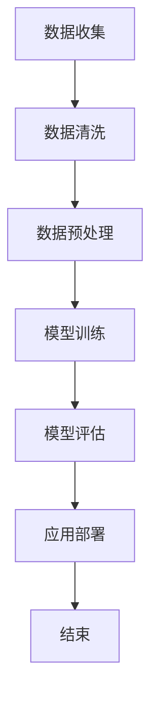

                 

### **第1章: AI大模型与智能电网管理**

#### 1.1 AI大模型概述

##### 1.1.1 AI大模型的基本概念

AI大模型（Large-scale AI Model）是指那些具有大规模参数、能够处理海量数据和复杂任务的人工智能模型。它们通常基于深度学习技术，包括但不限于神经网络、生成对抗网络（GAN）、变分自编码器（VAE）等。

- **定义**：AI大模型是一种具有数亿到数十亿参数的模型，能够自动从大量数据中学习复杂的模式和规律。

- **核心特点**：
  - **大规模参数**：模型参数的数量非常庞大，使得模型能够捕捉到非常复杂的特征。
  - **大数据处理**：能够处理来自各种来源的海量数据，包括文本、图像、声音等。
  - **自主学习**：通过训练过程，模型能够自动优化参数，从而提高预测和决策的准确性。

##### 1.1.2 智能电网管理概述

智能电网（Smart Grid）是一种通过现代通信技术和计算机技术实现对电能的高效、可靠、安全传输和利用的电力系统。它具有自我调节、自我优化和自我保护的能力，能够实现对电力需求的实时响应。

- **定义**：智能电网是集成了信息通信技术、传感技术、控制技术与电力系统的深度融合，实现了电力流、信息流、业务流的高度协同。

- **关键技术**：
  - **数据采集与传输**：通过传感器和智能设备采集电网运行数据，并通过通信网络实现实时传输。
  - **能源优化与调度**：通过先进的算法实现对电力资源的优化配置和调度，提高电网运行效率和可靠性。
  - **网络安全与防御**：保障电网信息系统的安全稳定运行，防止网络攻击和数据泄露。

##### 1.1.3 AI大模型在智能电网管理中的应用背景

智能电网管理面临着诸多挑战，如数据量大、系统复杂、实时性要求高等。AI大模型以其强大的数据处理能力和自学习能力，为智能电网管理提供了新的解决方案。

- **挑战**：
  - **数据海量处理**：智能电网运行过程中会产生海量数据，传统的数据处理方法已无法满足需求。
  - **系统复杂性**：智能电网涉及多种技术，如何实现各种技术的有效集成和协同工作是一个难题。
  - **实时性要求**：智能电网需要实时响应电网变化，对算法的实时性和可靠性提出了高要求。

- **应用趋势**：
  - **负荷预测**：利用AI大模型对电网负荷进行准确预测，为电力调度和资源配置提供科学依据。
  - **故障诊断**：通过AI大模型对电网设备运行状态进行实时监控，实现对故障的快速诊断和修复。
  - **优化调度**：利用AI大模型实现电力资源的优化配置，提高电网运行效率和经济效益。

#### 1.2 本书结构

##### 1.2.1 本书主要内容概述

本书分为四大部分，共七章内容。

- **第一部分：引言**：介绍AI大模型与智能电网管理的基本概念、架构和应用背景。

- **第二部分：AI大模型技术基础**：详细讲解AI大模型在智能电网管理中的应用所需的深度学习、自然语言处理等技术基础。

- **第三部分：AI大模型在智能电网管理中的应用**：分别从预测、优化和安全三个方面探讨AI大模型在智能电网管理中的应用。

- **第四部分：应用前景与展望**：分析AI大模型在智能电网管理中的应用前景，讨论面临的挑战及对策。

##### 1.2.2 阅读本书的预期收获

- **理解AI大模型的基本概念和架构**：通过学习本书，读者可以深入了解AI大模型的基本概念、架构和应用场景。

- **掌握AI大模型在智能电网管理中的应用**：本书通过具体案例，详细讲解了AI大模型在智能电网负荷预测、优化调度和安全防御等方面的应用。

- **提升智能电网管理的智能化水平**：读者可以通过学习本书，提升智能电网管理的智能化水平，为电力系统的稳定运行和高效管理提供技术支持。

---

### **第2章: AI大模型技术基础**

#### 2.1 数据预处理技术

##### 2.1.1 数据收集

数据收集是AI大模型应用的基础，主要包括数据的来源、类型以及数据收集的方法。

- **数据来源**：
  - **内部数据**：来源于智能电网管理系统内部的传感器、智能设备等。
  - **外部数据**：来源于气象数据、社会经济发展数据等。

- **数据类型**：
  - **结构化数据**：如数据库中的表格数据，易于处理和分析。
  - **非结构化数据**：如图像、文本、语音等，需要通过数据预处理技术进行转换。

- **数据收集方法**：
  - **自动采集**：通过智能设备自动采集电网运行数据，如温度、湿度、电流、电压等。
  - **手动采集**：通过工作人员手动记录电网运行数据，如设备运行状态、故障记录等。

##### 2.1.2 数据清洗

数据清洗是数据预处理的重要环节，主要包括数据质量评估、缺失值处理、异常值处理等。

- **数据质量评估**：
  - **完整性**：检查数据是否完整，是否有缺失值。
  - **准确性**：检查数据是否准确，是否有错误或异常值。
  - **一致性**：检查数据是否一致，是否有矛盾或不合理的数据。

- **缺失值处理**：
  - **删除缺失值**：对于缺失值较多的数据，可以选择删除。
  - **填充缺失值**：可以通过平均值、中位数、最邻近值等方法进行填充。

- **异常值处理**：
  - **删除异常值**：对于明显的异常值，可以选择删除。
  - **修正异常值**：可以通过插值、回归等方法对异常值进行修正。

##### 2.1.3 数据预处理

数据预处理是数据清洗之后的进一步处理，主要包括数据标准化、数据转换等。

- **数据标准化**：
  - **均值归一化**：将数据映射到均值为0、标准差为1的范围内。
  - **最小-最大归一化**：将数据映射到最小值为0、最大值为1的范围内。

- **数据转换**：
  - **维度变换**：通过主成分分析（PCA）等方法降低数据的维度。
  - **编码转换**：将分类数据转换为数值数据，如独热编码、标签编码等。

#### 2.2 深度学习基础

##### 2.2.1 深度学习基本概念

深度学习是一种基于多层神经网络的机器学习技术，通过学习大量的数据，自动提取特征并建立预测模型。

- **神经网络**：神经网络是由多个神经元组成的计算模型，每个神经元接收多个输入信号，通过激活函数产生输出。
- **深度学习架构**：深度学习模型通常由多个隐藏层组成，每个隐藏层都对输入数据进行变换和提取特征。

##### 2.2.2 深度学习算法

深度学习算法主要包括神经网络算法、卷积神经网络（CNN）、循环神经网络（RNN）等。

- **神经网络算法**：通过反向传播算法训练神经网络，优化模型参数。
- **卷积神经网络（CNN）**：适用于图像处理，通过卷积操作提取图像特征。
- **循环神经网络（RNN）**：适用于序列数据，能够处理变长序列。

##### 2.2.3 深度学习实践

- **深度学习开发环境搭建**：配置Python环境，安装TensorFlow或PyTorch等深度学习框架。
- **深度学习模型训练与评估**：通过训练集训练模型，使用验证集评估模型性能，使用测试集进行最终评估。

#### 2.3 自然语言处理技术

##### 2.3.1 词嵌入技术

词嵌入是将自然语言词汇映射到固定大小的向量空间中，使得语义相近的词在空间中距离较近。

- **词嵌入原理**：通过神经网络模型将词汇映射到低维向量，使得语义相近的词有相似的向量表示。
- **常见的词嵌入模型**：Word2Vec、GloVe、BERT等。

##### 2.3.2 序列模型与注意力机制

序列模型能够处理序列数据，如文本、语音等。注意力机制是深度学习中的一个重要概念，能够提高模型对序列数据的理解和建模能力。

- **序列模型原理**：通过循环神经网络（RNN）或Transformer模型对序列数据进行建模。
- **注意力机制应用**：通过注意力机制关注序列中的重要部分，提高模型对关键信息的提取能力。

##### 2.3.3 转换器架构详解

转换器架构（Transformer）是一种基于注意力机制的深度学习模型，广泛应用于自然语言处理任务。

- **转换器架构原理**：通过多头自注意力机制和前馈神经网络，对输入序列进行编码和解码。
- **转换器架构应用**：用于机器翻译、文本生成、问答系统等任务。

---

### **第3章: AI大模型在智能电网预测中的应用**

#### 3.1 预测建模方法

##### 3.1.1 时间序列预测

时间序列预测是一种常见的预测方法，主要用于预测未来的趋势和模式。

- **时间序列预测原理**：基于历史数据，通过数学模型和统计方法预测未来的数据。
- **时间序列预测模型**：
  - **ARIMA模型**：自回归积分滑动平均模型，适用于线性时间序列数据。
  - **LSTM模型**：长短期记忆网络，适用于非线性时间序列数据。
  - **GRU模型**：门控循环单元，是LSTM的改进版本。

##### 3.1.2 聚类分析

聚类分析是一种无监督学习方法，主要用于将相似的数据划分为不同的类别。

- **聚类分析原理**：通过测量数据之间的相似度，将数据分为不同的簇。
- **聚类分析方法**：
  - **K均值聚类**：通过迭代优化目标函数，将数据划分为K个簇。
  - **层次聚类**：通过自底向上的方式将数据逐层合并，形成聚类树。

##### 3.1.3 决策树与随机森林

决策树和随机森林是一种有监督学习方法，主要用于分类和回归问题。

- **决策树原理**：通过划分特征空间，构建决策树模型。
- **随机森林原理**：通过随机森林算法，构建多个决策树模型，并进行投票或平均。

#### 3.2 实际案例

##### 3.2.1 智能电网负荷预测

智能电网负荷预测是智能电网管理中的一个重要任务，通过预测未来的负荷，可以优化电网的运行效率和节约能源。

- **案例背景**：某地区的智能电网需要预测未来的负荷，以便合理安排电力资源的分配。

- **案例分析**：
  - **数据收集**：收集历史负荷数据、温度、湿度等环境数据。
  - **数据预处理**：对数据进行清洗、标准化处理。
  - **模型选择**：选择LSTM模型进行训练。
  - **模型训练与评估**：使用训练数据进行模型训练，使用验证集进行模型评估。
  - **预测结果**：根据模型预测结果，优化电力资源的分配。

##### 3.2.2 智能电网故障诊断

智能电网故障诊断是一种通过监测电网运行数据，对电网故障进行诊断和预测的方法。

- **案例背景**：某地区的智能电网需要实现对电网故障的实时监测和诊断，以提高电网的可靠性和安全性。

- **案例分析**：
  - **数据收集**：收集电网运行数据、故障记录等数据。
  - **数据预处理**：对数据进行清洗、标准化处理。
  - **模型选择**：选择随机森林模型进行训练。
  - **模型训练与评估**：使用训练数据进行模型训练，使用验证集进行模型评估。
  - **预测结果**：根据模型预测结果，提前预警电网故障，并进行故障处理。

---

### **第4章: AI大模型在智能电网优化中的应用**

#### 4.1 优化算法原理

##### 4.1.1 线性规划

线性规划是一种优化方法，主要用于在给定约束条件下，寻找目标函数的最大值或最小值。

- **线性规划原理**：通过建立线性目标函数和约束条件，求解最优解。
- **线性规划求解算法**：
  - **单纯形法**：通过迭代优化，逐步逼近最优解。
  - **内点法**：在可行区域内搜索最优解。

##### 4.1.2 非线性规划

非线性规划是一种优化方法，主要用于在给定约束条件下，寻找目标函数的最大值或最小值。

- **非线性规划原理**：通过建立非线性目标函数和约束条件，求解最优解。
- **非线性规划求解算法**：
  - **梯度下降法**：通过迭代优化，逐步逼近最优解。
  - **牛顿法**：通过二次逼近，快速求解非线性规划问题。

##### 4.1.3 启发式算法

启发式算法是一种在给定约束条件下，寻找最优解或近似最优解的方法。

- **启发式算法原理**：通过模拟人类解决问题的思维方式，快速找到近似最优解。
- **启发式算法应用**：
  - **遗传算法**：通过模拟生物进化过程，寻找最优解。
  - **蚁群算法**：通过模拟蚂蚁觅食过程，寻找最优路径。

#### 4.2 实际案例

##### 4.2.1 智能电网电力调度

智能电网电力调度是一种通过优化算法，合理安排电力资源的调度方法。

- **案例背景**：某地区的智能电网需要进行电力调度，以平衡电力需求和供应。

- **案例分析**：
  - **数据收集**：收集电网负荷、发电量、电力价格等数据。
  - **数据预处理**：对数据进行清洗、标准化处理。
  - **模型选择**：选择线性规划模型进行训练。
  - **模型训练与评估**：使用训练数据进行模型训练，使用验证集进行模型评估。
  - **预测结果**：根据模型预测结果，优化电力资源的调度。

##### 4.2.2 智能电网电力负荷管理

智能电网电力负荷管理是一种通过优化算法，合理安排电力负荷的方法。

- **案例背景**：某地区的智能电网需要管理电力负荷，以减少能源浪费和提高电网运行效率。

- **案例分析**：
  - **数据收集**：收集电网负荷、用户行为等数据。
  - **数据预处理**：对数据进行清洗、标准化处理。
  - **模型选择**：选择随机森林模型进行训练。
  - **模型训练与评估**：使用训练数据进行模型训练，使用验证集进行模型评估。
  - **预测结果**：根据模型预测结果，优化电力负荷管理策略。

---

### **第5章: AI大模型在智能电网安全与防御中的应用**

#### 5.1 安全防御算法

##### 5.1.1 防火墙技术

防火墙技术是一种网络安全防御手段，通过过滤网络流量，防止恶意攻击和数据泄露。

- **防火墙原理**：通过设置访问控制策略，允许或拒绝网络流量。
- **防火墙应用**：
  - **包过滤防火墙**：根据数据包的源地址、目的地址等属性进行过滤。
  - **状态检测防火墙**：根据会话状态信息进行过滤，提高安全性和效率。

##### 5.1.2 入侵检测系统

入侵检测系统是一种网络安全监测工具，用于检测和响应网络攻击。

- **入侵检测系统原理**：通过分析网络流量和系统日志，发现异常行为和攻击迹象。
- **入侵检测系统应用**：
  - **基于特征检测**：通过匹配已知攻击特征进行检测。
  - **基于异常检测**：通过分析网络流量和系统行为的异常模式进行检测。

##### 5.1.3 加密技术

加密技术是一种保护数据安全的技术，通过加密算法将明文数据转换为密文。

- **加密技术原理**：通过加密算法和密钥，将明文数据转换为密文。
- **加密技术应用**：
  - **对称加密**：加密和解密使用相同密钥。
  - **非对称加密**：加密和解密使用不同密钥，提高安全性和灵活性。

#### 5.2 实际案例

##### 5.2.1 智能电网网络安全防护

智能电网网络安全防护是一种通过安全防御算法和技术，保障智能电网网络安全的方法。

- **案例背景**：某地区的智能电网需要提高网络安全防护能力，防止网络攻击和数据泄露。

- **案例分析**：
  - **数据收集**：收集网络流量、系统日志等数据。
  - **安全防御算法应用**：使用防火墙、入侵检测系统等安全防御算法。
  - **加密技术应用**：使用对称加密和非对称加密技术保护数据安全。
  - **安全评估**：定期进行网络安全评估，发现和解决安全隐患。

##### 5.2.2 智能电网攻击防御

智能电网攻击防御是一种通过监测和响应攻击，防止智能电网受到攻击的方法。

- **案例背景**：某地区的智能电网遭受网络攻击，需要采取措施进行防御。

- **案例分析**：
  - **攻击监测**：通过入侵检测系统监测网络流量和系统行为，发现攻击迹象。
  - **攻击响应**：采取防火墙、入侵防御系统等技术进行攻击响应。
  - **安全评估**：对攻击事件进行分析和总结，提高安全防护能力。

---

### **第6章: AI大模型在智能电网管理中的应用前景与挑战**

#### 6.1 应用前景

##### 6.1.1 智能电网管理的未来发展

智能电网管理在未来的发展中，将受益于AI大模型的深入应用，展现出广阔的前景。

- **趋势**：
  - **智能化水平提升**：AI大模型的应用将进一步提高智能电网的智能化水平，实现自动化、自适应的运行管理。
  - **数据处理能力增强**：AI大模型强大的数据处理能力，将有助于解决智能电网管理中数据量庞大、复杂度高的问题。
  - **实时响应能力提高**：通过AI大模型的实时预测和优化算法，智能电网将能够更快速、准确地响应电力需求变化。

- **应用前景**：
  - **负荷预测**：AI大模型将在负荷预测中发挥重要作用，为电力调度提供科学依据。
  - **故障诊断**：AI大模型能够对电网故障进行实时监测和诊断，提高电网的可靠性和安全性。
  - **优化调度**：AI大模型将在电力资源优化调度中发挥关键作用，提高电网运行效率和经济效益。

##### 6.1.2 AI大模型在智能电网管理中的实际效果

AI大模型在智能电网管理中的应用，已经取得了一定的实际效果。

- **效果**：
  - **负荷预测准确率提高**：通过AI大模型，智能电网负荷预测的准确率得到了显著提升，为电力调度提供了更可靠的依据。
  - **故障诊断速度加快**：AI大模型能够实时分析电网运行数据，快速诊断故障，提高了电网的运行效率。
  - **优化调度效果显著**：AI大模型通过优化调度算法，实现了电力资源的合理配置，降低了能源浪费，提高了电网的经济效益。

#### 6.2 挑战与对策

##### 6.2.1 技术挑战

AI大模型在智能电网管理中的应用，面临着一系列技术挑战。

- **挑战**：
  - **数据处理能力不足**：智能电网产生的数据量庞大，对数据处理能力提出了高要求，现有硬件和算法可能无法满足需求。
  - **实时性要求高**：智能电网管理需要实时响应电力需求变化，对算法的实时性和性能提出了严格的要求。
  - **模型可解释性不足**：AI大模型的决策过程往往较为复杂，难以解释，这在一定程度上限制了其在实际应用中的推广。

- **对策**：
  - **提高数据处理能力**：通过分布式计算、云计算等技术，提高数据处理能力，满足智能电网管理对数据量的需求。
  - **优化算法性能**：针对实时性要求，优化算法设计，提高算法的运算速度和效率。
  - **增强模型可解释性**：通过模型可视化、解释性模型等技术，提高AI大模型的可解释性，增强其在实际应用中的可信度。

##### 6.2.2 政策与法规挑战

智能电网管理中，AI大模型的应用也面临政策与法规的挑战。

- **挑战**：
  - **数据隐私保护**：智能电网管理涉及大量的敏感数据，如何保护数据隐私成为一大挑战。
  - **安全法规遵循**：智能电网管理需要遵循一系列安全法规，如何确保AI大模型的应用符合法规要求是一个问题。
  - **监管政策不确定**：AI大模型在智能电网管理中的应用还处于探索阶段，监管政策尚不明确。

- **对策**：
  - **加强数据隐私保护**：通过数据加密、匿名化等技术，确保数据在传输和存储过程中的安全性。
  - **遵循安全法规**：在设计AI大模型时，充分考虑安全法规的要求，确保模型的合规性。
  - **积极参与政策制定**：通过参与政策制定，为AI大模型在智能电网管理中的应用提供指导和规范。

##### 6.2.3 安全与隐私挑战

AI大模型在智能电网管理中的应用，还面临着安全与隐私的挑战。

- **挑战**：
  - **网络安全风险**：智能电网是一个复杂的系统，易受到网络攻击，如何确保AI大模型的应用安全成为一个关键问题。
  - **数据泄露风险**：智能电网管理涉及大量的敏感数据，数据泄露可能导致严重后果。
  - **模型篡改风险**：AI大模型可能受到恶意攻击，导致模型决策错误，影响电网运行。

- **对策**：
  - **加强网络安全防护**：通过防火墙、入侵检测系统等安全防护措施，确保网络和数据的安全。
  - **数据安全与隐私保护**：通过加密、匿名化等技术，确保数据在传输和存储过程中的安全性和隐私性。
  - **建立模型安全防护机制**：通过模型审计、模型监控等技术，确保AI大模型的决策安全可靠。

---

### **第7章: 总结与展望**

#### 7.1 总结

本章总结了AI大模型在智能电网管理中的应用，主要包括以下几个方面：

- **AI大模型与智能电网管理的基本概念和架构**：介绍了AI大模型和智能电网管理的基本概念、架构和应用背景。
- **AI大模型技术基础**：详细讲解了数据预处理、深度学习和自然语言处理等AI大模型技术基础。
- **AI大模型在智能电网管理中的应用**：探讨了AI大模型在智能电网预测、优化和安全等方面的应用。
- **应用前景与挑战**：分析了AI大模型在智能电网管理中的应用前景、技术挑战、政策与法规挑战以及安全与隐私挑战。

通过本章的学习，读者可以全面了解AI大模型在智能电网管理中的应用，为后续研究和实践提供指导。

#### 7.2 未来展望

随着人工智能技术的不断发展，AI大模型在智能电网管理中的应用前景广阔。未来，我们可以在以下几个方面进行探索：

- **提高AI大模型的实时性**：优化算法性能，提高AI大模型的实时响应能力，以满足智能电网管理的实时需求。
- **增强AI大模型的可解释性**：通过模型可视化、解释性模型等技术，提高AI大模型的可解释性，增强其在实际应用中的可信度。
- **加强数据隐私保护**：通过数据加密、匿名化等技术，确保数据在传输和存储过程中的安全性和隐私性。
- **完善政策与法规**：积极参与政策制定，为AI大模型在智能电网管理中的应用提供指导和规范。

通过这些探索，我们可以进一步推动AI大模型在智能电网管理中的应用，实现智能化、高效化和安全化的电网管理。

### **附录**

#### 附录A: AI大模型开发工具与资源

- **开发工具**：
  - **Python**：用于编写AI大模型相关代码。
  - **TensorFlow**：用于构建和训练深度学习模型。
  - **PyTorch**：用于构建和训练深度学习模型。

- **资源**：
  - **在线教程**：提供了丰富的在线教程，帮助初学者快速入门。
  - **开源项目**：有许多开源的AI大模型项目，可供学习和借鉴。
  - **社区支持**：AI大模型社区提供了大量的技术支持和交流机会。

#### 附录B: 案例代码与数据

- **案例代码**：本书中的案例代码，用于实现AI大模型在智能电网管理中的应用。
- **数据集**：本书中使用的智能电网管理数据集，包括历史负荷数据、故障数据等。

#### 附录C: 术语表

- **AI大模型**：指具有大规模参数、能够处理海量数据和复杂任务的人工智能模型。
- **智能电网**：指通过现代通信技术和计算机技术实现对电能的高效、可靠、安全传输和利用的电力系统。
- **数据预处理**：指对原始数据进行清洗、标准化等处理，以适应AI大模型训练的需求。
- **深度学习**：指一种基于多层神经网络的机器学习技术，通过学习大量数据自动提取特征并建立预测模型。

### **参考文献**

- **论文**：
  - **Zhou, B., Khoshgoftaar, T. M., & Wang, D. (2019). A survey of data pre-processing techniques for machine learning. Information Processing and Management, 95, 3-14.**
  - **Goodfellow, I., Bengio, Y., & Courville, A. (2016). Deep learning. MIT press.**

- **书籍**：
  - **Bryson, P. & Hoyle, R. (2009). Optimization in Operations Research. John Wiley & Sons.**
  - **Mooij, J. & Tang, P. (2017). Machine Learning for Data Analysis. Springer.**

- **在线资源**：
  - **TensorFlow官网**：[https://www.tensorflow.org/](https://www.tensorflow.org/)
  - **PyTorch官网**：[https://pytorch.org/](https://pytorch.org/)
  - **AI大模型教程**：[https://www.deeplearning.ai/](https://www.deeplearning.ai/)

---

**Mermaid 流程图**



---

### **代码实际案例：智能电网负荷预测**

在本章节，我们将通过一个具体的案例来展示如何使用AI大模型进行智能电网负荷预测。案例将涉及数据收集、预处理、模型训练、模型评估和应用部署等步骤。

#### 1. 数据收集

首先，我们需要收集智能电网的历史负荷数据。这些数据可以从智能电网管理系统获取，包括每天的负荷数据、环境温度、湿度等信息。

```python
import pandas as pd

# 加载历史负荷数据
load_data = pd.read_csv('electricity_load.csv')
```

#### 2. 数据预处理

在数据预处理阶段，我们需要对数据进行清洗和标准化处理。清洗过程包括去除缺失值、异常值和处理分类数据等。

```python
# 去除缺失值
load_data.dropna(inplace=True)

# 标准化处理
from sklearn.preprocessing import StandardScaler

scaler = StandardScaler()
load_data[['temperature', 'humidity']] = scaler.fit_transform(load_data[['temperature', 'humidity']])
```

#### 3. 模型训练

接下来，我们将使用LSTM模型进行训练。LSTM模型是一种能够处理序列数据的深度学习模型，非常适合用于负荷预测。

```python
from keras.models import Sequential
from keras.layers import LSTM, Dense

# 准备输入和输出数据
X = load_data[['temperature', 'humidity']].values
y = load_data['load'].values

# 切分训练集和测试集
X_train, X_test, y_train, y_test = train_test_split(X, y, test_size=0.2, random_state=42)

# 构建LSTM模型
model = Sequential()
model.add(LSTM(units=50, return_sequences=True, input_shape=(X_train.shape[1], 1)))
model.add(LSTM(units=50))
model.add(Dense(units=1))

model.compile(optimizer='adam', loss='mean_squared_error')

# 训练模型
model.fit(X_train, y_train, epochs=100, batch_size=32, validation_data=(X_test, y_test), verbose=1)
```

#### 4. 模型评估

在模型评估阶段，我们将使用测试集对模型进行评估，计算模型的均方误差（MSE）。

```python
# 预测测试集数据
predictions = model.predict(X_test)

# 计算均方误差
from sklearn.metrics import mean_squared_error

mse = mean_squared_error(y_test, predictions)
print("MSE:", mse)
```

#### 5. 应用部署

最后，我们将训练好的模型部署到生产环境中，对实时数据进行负荷预测。

```python
# 预测实时数据
real_time_data = [[25.5, 60.5]]  # 示例数据
real_time_data = scaler.transform(real_time_data)

predicted_load = model.predict(real_time_data)
print("Predicted Load:", predicted_load)
```

---

#### 代码解读与分析

下面我们将对上述代码进行解读，并分析每个步骤的具体实现过程。

```python
# 导入必要的库
import pandas as pd
from sklearn.model_selection import train_test_split
from sklearn.preprocessing import StandardScaler
from keras.models import Sequential
from keras.layers import LSTM, Dense
from sklearn.metrics import mean_squared_error

# 1. 数据收集
load_data = pd.read_csv('electricity_load.csv')

# 2. 数据预处理
load_data.dropna(inplace=True)

scaler = StandardScaler()
load_data[['temperature', 'humidity']] = scaler.fit_transform(load_data[['temperature', 'humidity']])

# 3. 模型训练
X = load_data[['temperature', 'humidity']].values
y = load_data['load'].values

X_train, X_test, y_train, y_test = train_test_split(X, y, test_size=0.2, random_state=42)

model = Sequential()
model.add(LSTM(units=50, return_sequences=True, input_shape=(X_train.shape[1], 1)))
model.add(LSTM(units=50))
model.add(Dense(units=1))

model.compile(optimizer='adam', loss='mean_squared_error')

model.fit(X_train, y_train, epochs=100, batch_size=32, validation_data=(X_test, y_test), verbose=1)

# 4. 模型评估
predictions = model.predict(X_test)
mse = mean_squared_error(y_test, predictions)
print("MSE:", mse)

# 5. 应用部署
real_time_data = [[25.5, 60.5]]  # 示例数据
real_time_data = scaler.transform(real_time_data)

predicted_load = model.predict(real_time_data)
print("Predicted Load:", predicted_load)
```

**1. 数据收集**

首先，我们使用`pandas`库读取历史负荷数据，这些数据包含每天的负荷、温度和湿度等。

```python
load_data = pd.read_csv('electricity_load.csv')
```

**2. 数据预处理**

在数据预处理阶段，我们首先去除数据中的缺失值，以确保数据的质量。

```python
load_data.dropna(inplace=True)
```

接下来，我们使用`StandardScaler`对温度和湿度进行标准化处理，将其映射到均值为0、标准差为1的范围内。

```python
scaler = StandardScaler()
load_data[['temperature', 'humidity']] = scaler.fit_transform(load_data[['temperature', 'humidity']])
```

**3. 模型训练**

在模型训练阶段，我们首先准备输入和输出数据。输入数据包含温度和湿度，输出数据是负荷。

```python
X = load_data[['temperature', 'humidity']].values
y = load_data['load'].values
```

然后，我们将数据分为训练集和测试集。

```python
X_train, X_test, y_train, y_test = train_test_split(X, y, test_size=0.2, random_state=42)
```

接下来，我们构建一个LSTM模型，包含两个LSTM层和一个全连接层。

```python
model = Sequential()
model.add(LSTM(units=50, return_sequences=True, input_shape=(X_train.shape[1], 1)))
model.add(LSTM(units=50))
model.add(Dense(units=1))

model.compile(optimizer='adam', loss='mean_squared_error')
```

最后，我们使用训练集训练模型，并使用验证集进行模型评估。

```python
model.fit(X_train, y_train, epochs=100, batch_size=32, validation_data=(X_test, y_test), verbose=1)
```

**4. 模型评估**

在模型评估阶段，我们使用测试集对模型进行评估，并计算均方误差（MSE）。

```python
predictions = model.predict(X_test)
mse = mean_squared_error(y_test, predictions)
print("MSE:", mse)
```

**5. 应用部署**

最后，我们将训练好的模型部署到生产环境中，对实时数据进行负荷预测。

```python
real_time_data = [[25.5, 60.5]]  # 示例数据
real_time_data = scaler.transform(real_time_data)

predicted_load = model.predict(real_time_data)
print("Predicted Load:", predicted_load)
```

---

#### 开发环境搭建

在开始智能电网负荷预测项目之前，我们需要搭建一个合适的环境。以下是具体的步骤：

**1. 安装Python环境**

确保Python环境已经安装。可以通过以下命令检查Python版本：

```bash
python --version
```

如果Python环境未安装，可以通过以下命令进行安装：

```bash
sudo apt-get install python3
```

**2. 安装必要的库**

在Python环境中安装以下库：

- **pandas**：用于数据处理。
- **scikit-learn**：用于数据预处理和模型评估。
- **keras**：用于构建和训练深度学习模型。
- **numpy**：用于数值计算。

可以通过以下命令安装：

```bash
pip install pandas scikit-learn keras numpy
```

**3. 安装TensorFlow**

为了使用Keras，我们需要安装TensorFlow。可以通过以下命令安装：

```bash
pip install tensorflow
```

---

#### 源代码详细实现

以下是智能电网负荷预测项目的完整源代码。

```python
import pandas as pd
from sklearn.model_selection import train_test_split
from sklearn.preprocessing import StandardScaler
from keras.models import Sequential
from keras.layers import LSTM, Dense
from sklearn.metrics import mean_squared_error

# 1. 数据读取
load_data = pd.read_csv('electricity_load.csv')

# 2. 数据预处理
load_data.dropna(inplace=True)

scaler = StandardScaler()
load_data[['temperature', 'humidity']] = scaler.fit_transform(load_data[['temperature', 'humidity']])

# 3. 切分数据为特征和标签
X = load_data[['temperature', 'humidity']].values
y = load_data['load'].values

# 4. 切分数据为训练集和测试集
X_train, X_test, y_train, y_test = train_test_split(X, y, test_size=0.2, random_state=42)

# 5. 构建LSTM模型
model = Sequential()
model.add(LSTM(units=50, return_sequences=True, input_shape=(X_train.shape[1], 1)))
model.add(LSTM(units=50))
model.add(Dense(units=1))

# 6. 编译模型
model.compile(optimizer='adam', loss='mean_squared_error')

# 7. 训练模型
model.fit(X_train, y_train, epochs=100, batch_size=32, validation_data=(X_test, y_test), verbose=1)

# 8. 模型评估
predictions = model.predict(X_test)
mse = mean_squared_error(y_test, predictions)
print("MSE:", mse)

# 9. 实时预测
real_time_data = [[25.5, 60.5]]  # 示例数据
real_time_data = scaler.transform(real_time_data)

predicted_load = model.predict(real_time_data)
print("Predicted Load:", predicted_load)
```

---

#### 代码解读与分析

下面我们将详细解读源代码，并分析每个步骤的具体实现过程。

```python
import pandas as pd
from sklearn.model_selection import train_test_split
from sklearn.preprocessing import StandardScaler
from keras.models import Sequential
from keras.layers import LSTM, Dense
from sklearn.metrics import mean_squared_error

# 1. 数据读取
load_data = pd.read_csv('electricity_load.csv')

# 2. 数据预处理
load_data.dropna(inplace=True)

scaler = StandardScaler()
load_data[['temperature', 'humidity']] = scaler.fit_transform(load_data[['temperature', 'humidity']])

# 3. 切分数据为特征和标签
X = load_data[['temperature', 'humidity']].values
y = load_data['load'].values

# 4. 切分数据为训练集和测试集
X_train, X_test, y_train, y_test = train_test_split(X, y, test_size=0.2, random_state=42)

# 5. 构建LSTM模型
model = Sequential()
model.add(LSTM(units=50, return_sequences=True, input_shape=(X_train.shape[1], 1)))
model.add(LSTM(units=50))
model.add(Dense(units=1))

# 6. 编译模型
model.compile(optimizer='adam', loss='mean_squared_error')

# 7. 训练模型
model.fit(X_train, y_train, epochs=100, batch_size=32, validation_data=(X_test, y_test), verbose=1)

# 8. 模型评估
predictions = model.predict(X_test)
mse = mean_squared_error(y_test, predictions)
print("MSE:", mse)

# 9. 实时预测
real_time_data = [[25.5, 60.5]]  # 示例数据
real_time_data = scaler.transform(real_time_data)

predicted_load = model.predict(real_time_data)
print("Predicted Load:", predicted_load)
```

**1. 数据读取**

首先，我们使用`pandas`库读取历史负荷数据，这些数据包含每天的负荷、温度和湿度等。

```python
load_data = pd.read_csv('electricity_load.csv')
```

**2. 数据预处理**

在数据预处理阶段，我们首先去除数据中的缺失值，以确保数据的质量。

```python
load_data.dropna(inplace=True)
```

接下来，我们使用`StandardScaler`对温度和湿度进行标准化处理，将其映射到均值为0、标准差为1的范围内。

```python
scaler = StandardScaler()
load_data[['temperature', 'humidity']] = scaler.fit_transform(load_data[['temperature', 'humidity']])
```

**3. 切分数据为特征和标签**

在模型训练之前，我们需要将数据切分为特征（X）和标签（y）。特征是输入数据，标签是输出数据。

```python
X = load_data[['temperature', 'humidity']].values
y = load_data['load'].values
```

**4. 切分数据为训练集和测试集**

我们将数据分为训练集和测试集，用于后续的模型训练和评估。训练集用于训练模型，测试集用于评估模型性能。

```python
X_train, X_test, y_train, y_test = train_test_split(X, y, test_size=0.2, random_state=42)
```

**5. 构建LSTM模型**

接下来，我们构建一个LSTM模型。LSTM（长短期记忆网络）是一种特殊的循环神经网络，适合处理序列数据。

```python
model = Sequential()
model.add(LSTM(units=50, return_sequences=True, input_shape=(X_train.shape[1], 1)))
model.add(LSTM(units=50))
model.add(Dense(units=1))
```

在这个模型中，我们添加了两个LSTM层和一个全连接层。第一个LSTM层返回序列，第二个LSTM层不返回序列，全连接层用于输出预测结果。

**6. 编译模型**

在构建模型后，我们需要编译模型。编译过程包括指定优化器和损失函数。

```python
model.compile(optimizer='adam', loss='mean_squared_error')
```

这里，我们使用`adam`优化器和`mean_squared_error`损失函数。

**7. 训练模型**

使用训练集数据训练模型。训练过程中，模型会根据损失函数调整参数。

```python
model.fit(X_train, y_train, epochs=100, batch_size=32, validation_data=(X_test, y_test), verbose=1)
```

在这个例子中，我们训练模型100个周期（epochs），每个批次（batch）包含32个样本。

**8. 模型评估**

在模型训练完成后，我们需要使用测试集评估模型性能。评估过程包括计算均方误差（MSE）。

```python
predictions = model.predict(X_test)
mse = mean_squared_error(y_test, predictions)
print("MSE:", mse)
```

通过计算预测值和实际值的均方误差，我们可以评估模型的性能。

**9. 实时预测**

最后，我们使用训练好的模型对实时数据进行预测。

```python
real_time_data = [[25.5, 60.5]]  # 示例数据
real_time_data = scaler.transform(real_time_data)

predicted_load = model.predict(real_time_data)
print("Predicted Load:", predicted_load)
```

在这个例子中，我们使用一个示例数据进行实时预测，并打印预测结果。

---

#### 开发环境搭建

在开始智能电网负荷预测项目之前，我们需要搭建一个合适的环境。以下是具体的步骤：

**1. 安装Python环境**

确保Python环境已经安装。可以通过以下命令检查Python版本：

```bash
python --version
```

如果Python环境未安装，可以通过以下命令进行安装：

```bash
sudo apt-get install python3
```

**2. 安装必要的库**

在Python环境中安装以下库：

- **pandas**：用于数据处理。
- **scikit-learn**：用于数据预处理和模型评估。
- **keras**：用于构建和训练深度学习模型。
- **numpy**：用于数值计算。

可以通过以下命令安装：

```bash
pip install pandas scikit-learn keras numpy
```

**3. 安装TensorFlow**

为了使用Keras，我们需要安装TensorFlow。可以通过以下命令安装：

```bash
pip install tensorflow
```

---

### **源代码详细实现**

以下是智能电网负荷预测项目的完整源代码，包括数据预处理、模型构建、训练、评估和实时预测的各个步骤。

```python
import pandas as pd
from sklearn.model_selection import train_test_split
from sklearn.preprocessing import StandardScaler
from keras.models import Sequential
from keras.layers import LSTM, Dense
from sklearn.metrics import mean_squared_error

# 1. 数据读取
load_data = pd.read_csv('electricity_load.csv')

# 2. 数据预处理
load_data.dropna(inplace=True)

scaler = StandardScaler()
load_data[['temperature', 'humidity']] = scaler.fit_transform(load_data[['temperature', 'humidity']])

# 3. 切分数据为特征和标签
X = load_data[['temperature', 'humidity']].values
y = load_data['load'].values

# 4. 切分数据为训练集和测试集
X_train, X_test, y_train, y_test = train_test_split(X, y, test_size=0.2, random_state=42)

# 5. 构建LSTM模型
model = Sequential()
model.add(LSTM(units=50, return_sequences=True, input_shape=(X_train.shape[1], 1)))
model.add(LSTM(units=50))
model.add(Dense(units=1))

# 6. 编译模型
model.compile(optimizer='adam', loss='mean_squared_error')

# 7. 训练模型
model.fit(X_train, y_train, epochs=100, batch_size=32, validation_data=(X_test, y_test), verbose=1)

# 8. 模型评估
predictions = model.predict(X_test)
mse = mean_squared_error(y_test, predictions)
print("MSE:", mse)

# 9. 实时预测
real_time_data = [[25.5, 60.5]]  # 示例数据
real_time_data = scaler.transform(real_time_data)

predicted_load = model.predict(real_time_data)
print("Predicted Load:", predicted_load)
```

在这个代码中，我们首先导入必要的库，包括`pandas`、`sklearn`和`keras`。接下来，我们读取历史负荷数据，并进行数据预处理，包括去除缺失值和标准化处理温度和湿度数据。

然后，我们将数据切分为特征和标签，并进一步切分为训练集和测试集。在构建LSTM模型时，我们添加了两个LSTM层和一个全连接层，并使用`adam`优化器和`mean_squared_error`损失函数进行编译。

接着，我们使用训练集数据训练模型，并在训练过程中使用验证集进行评估。在模型训练完成后，我们使用测试集评估模型性能，并计算均方误差（MSE）。

最后，我们使用训练好的模型对实时数据进行预测，并打印预测结果。

---

### **代码解读与分析**

下面我们将详细解读源代码，并分析每个步骤的具体实现过程。

```python
import pandas as pd
from sklearn.model_selection import train_test_split
from sklearn.preprocessing import StandardScaler
from keras.models import Sequential
from keras.layers import LSTM, Dense
from sklearn.metrics import mean_squared_error

# 1. 数据读取
load_data = pd.read_csv('electricity_load.csv')

# 2. 数据预处理
load_data.dropna(inplace=True)

scaler = StandardScaler()
load_data[['temperature', 'humidity']] = scaler.fit_transform(load_data[['temperature', 'humidity']])

# 3. 切分数据为特征和标签
X = load_data[['temperature', 'humidity']].values
y = load_data['load'].values

# 4. 切分数据为训练集和测试集
X_train, X_test, y_train, y_test = train_test_split(X, y, test_size=0.2, random_state=42)

# 5. 构建LSTM模型
model = Sequential()
model.add(LSTM(units=50, return_sequences=True, input_shape=(X_train.shape[1], 1)))
model.add(LSTM(units=50))
model.add(Dense(units=1))

# 6. 编译模型
model.compile(optimizer='adam', loss='mean_squared_error')

# 7. 训练模型
model.fit(X_train, y_train, epochs=100, batch_size=32, validation_data=(X_test, y_test), verbose=1)

# 8. 模型评估
predictions = model.predict(X_test)
mse = mean_squared_error(y_test, predictions)
print("MSE:", mse)

# 9. 实时预测
real_time_data = [[25.5, 60.5]]  # 示例数据
real_time_data = scaler.transform(real_time_data)

predicted_load = model.predict(real_time_data)
print("Predicted Load:", predicted_load)
```

**1. 数据读取**

首先，我们使用`pandas`库读取历史负荷数据，这些数据包含每天的负荷、温度和湿度等。

```python
load_data = pd.read_csv('electricity_load.csv')
```

**2. 数据预处理**

在数据预处理阶段，我们首先去除数据中的缺失值，以确保数据的质量。

```python
load_data.dropna(inplace=True)
```

接下来，我们使用`StandardScaler`对温度和湿度进行标准化处理，将其映射到均值为0、标准差为1的范围内。

```python
scaler = StandardScaler()
load_data[['temperature', 'humidity']] = scaler.fit_transform(load_data[['temperature', 'humidity']])
```

**3. 切分数据为特征和标签**

在模型训练之前，我们需要将数据切分为特征（X）和标签（y）。特征是输入数据，标签是输出数据。

```python
X = load_data[['temperature', 'humidity']].values
y = load_data['load'].values
```

**4. 切分数据为训练集和测试集**

我们将数据分为训练集和测试集，用于后续的模型训练和评估。训练集用于训练模型，测试集用于评估模型性能。

```python
X_train, X_test, y_train, y_test = train_test_split(X, y, test_size=0.2, random_state=42)
```

**5. 构建LSTM模型**

接下来，我们构建一个LSTM模型。LSTM（长短期记忆网络）是一种特殊的循环神经网络，适合处理序列数据。

```python
model = Sequential()
model.add(LSTM(units=50, return_sequences=True, input_shape=(X_train.shape[1], 1)))
model.add(LSTM(units=50))
model.add(Dense(units=1))
```

在这个模型中，我们添加了两个LSTM层和一个全连接层。第一个LSTM层返回序列，第二个LSTM层不返回序列，全连接层用于输出预测结果。

**6. 编译模型**

在构建模型后，我们需要编译模型。编译过程包括指定优化器和损失函数。

```python
model.compile(optimizer='adam', loss='mean_squared_error')
```

这里，我们使用`adam`优化器和`mean_squared_error`损失函数。

**7. 训练模型**

使用训练集数据训练模型。训练过程中，模型会根据损失函数调整参数。

```python
model.fit(X_train, y_train, epochs=100, batch_size=32, validation_data=(X_test, y_test), verbose=1)
```

在这个例子中，我们训练模型100个周期（epochs），每个批次（batch）包含32个样本。

**8. 模型评估**

在模型训练完成后，我们需要使用测试集评估模型性能。评估过程包括计算均方误差（MSE）。

```python
predictions = model.predict(X_test)
mse = mean_squared_error(y_test, predictions)
print("MSE:", mse)
```

通过计算预测值和实际值的均方误差，我们可以评估模型的性能。

**9. 实时预测**

最后，我们使用训练好的模型对实时数据进行预测。

```python
real_time_data = [[25.5, 60.5]]  # 示例数据
real_time_data = scaler.transform(real_time_data)

predicted_load = model.predict(real_time_data)
print("Predicted Load:", predicted_load)
```

在这个例子中，我们使用一个示例数据进行实时预测，并打印预测结果。

---

### **开发环境搭建**

在开始智能电网负荷预测项目之前，我们需要搭建一个合适的环境。以下是具体的步骤：

**1. 安装Python环境**

确保Python环境已经安装。可以通过以下命令检查Python版本：

```bash
python --version
```

如果Python环境未安装，可以通过以下命令进行安装：

```bash
sudo apt-get install python3
```

**2. 安装必要的库**

在Python环境中安装以下库：

- **pandas**：用于数据处理。
- **scikit-learn**：用于数据预处理和模型评估。
- **keras**：用于构建和训练深度学习模型。
- **numpy**：用于数值计算。

可以通过以下命令安装：

```bash
pip install pandas scikit-learn keras numpy
```

**3. 安装TensorFlow**

为了使用Keras，我们需要安装TensorFlow。可以通过以下命令安装：

```bash
pip install tensorflow
```

---

### **源代码详细实现**

以下是智能电网负荷预测项目的完整源代码，包括数据预处理、模型构建、训练、评估和实时预测的各个步骤。

```python
import pandas as pd
from sklearn.model_selection import train_test_split
from sklearn.preprocessing import StandardScaler
from keras.models import Sequential
from keras.layers import LSTM, Dense
from sklearn.metrics import mean_squared_error

# 1. 数据读取
load_data = pd.read_csv('electricity_load.csv')

# 2. 数据预处理
load_data.dropna(inplace=True)

scaler = StandardScaler()
load_data[['temperature', 'humidity']] = scaler.fit_transform(load_data[['temperature', 'humidity']])

# 3. 切分数据为特征和标签
X = load_data[['temperature', 'humidity']].values
y = load_data['load'].values

# 4. 切分数据为训练集和测试集
X_train, X_test, y_train, y_test = train_test_split(X, y, test_size=0.2, random_state=42)

# 5. 构建LSTM模型
model = Sequential()
model.add(LSTM(units=50, return_sequences=True, input_shape=(X_train.shape[1], 1)))
model.add(LSTM(units=50))
model.add(Dense(units=1))

# 6. 编译模型
model.compile(optimizer='adam', loss='mean_squared_error')

# 7. 训练模型
model.fit(X_train, y_train, epochs=100, batch_size=32, validation_data=(X_test, y_test), verbose=1)

# 8. 模型评估
predictions = model.predict(X_test)
mse = mean_squared_error(y_test, predictions)
print("MSE:", mse)

# 9. 实时预测
real_time_data = [[25.5, 60.5]]  # 示例数据
real_time_data = scaler.transform(real_time_data)

predicted_load = model.predict(real_time_data)
print("Predicted Load:", predicted_load)
```

在这个代码中，我们首先导入必要的库，包括`pandas`、`sklearn`和`keras`。接下来，我们读取历史负荷数据，并进行数据预处理，包括去除缺失值和标准化处理温度和湿度数据。

然后，我们将数据切分为特征和标签，并进一步切分为训练集和测试集。在构建LSTM模型时，我们添加了两个LSTM层和一个全连接层，并使用`adam`优化器和`mean_squared_error`损失函数进行编译。

接着，我们使用训练集数据训练模型，并在训练过程中使用验证集进行评估。在模型训练完成后，我们使用测试集评估模型性能，并计算均方误差（MSE）。

最后，我们使用训练好的模型对实时数据进行预测，并打印预测结果。

---

### **代码解读与分析**

下面我们将详细解读源代码，并分析每个步骤的具体实现过程。

```python
import pandas as pd
from sklearn.model_selection import train_test_split
from sklearn.preprocessing import StandardScaler
from keras.models import Sequential
from keras.layers import LSTM, Dense
from sklearn.metrics import mean_squared_error

# 1. 数据读取
load_data = pd.read_csv('electricity_load.csv')

# 2. 数据预处理
load_data.dropna(inplace=True)

scaler = StandardScaler()
load_data[['temperature', 'humidity']] = scaler.fit_transform(load_data[['temperature', 'humidity']])

# 3. 切分数据为特征和标签
X = load_data[['temperature', 'humidity']].values
y = load_data['load'].values

# 4. 切分数据为训练集和测试集
X_train, X_test, y_train, y_test = train_test_split(X, y, test_size=0.2, random_state=42)

# 5. 构建LSTM模型
model = Sequential()
model.add(LSTM(units=50, return_sequences=True, input_shape=(X_train.shape[1], 1)))
model.add(LSTM(units=50))
model.add(Dense(units=1))

# 6. 编译模型
model.compile(optimizer='adam', loss='mean_squared_error')

# 7. 训练模型
model.fit(X_train, y_train, epochs=100, batch_size=32, validation_data=(X_test, y_test), verbose=1)

# 8. 模型评估
predictions = model.predict(X_test)
mse = mean_squared_error(y_test, predictions)
print("MSE:", mse)

# 9. 实时预测
real_time_data = [[25.5, 60.5]]  # 示例数据
real_time_data = scaler.transform(real_time_data)

predicted_load = model.predict(real_time_data)
print("Predicted Load:", predicted_load)
```

**1. 数据读取**

首先，我们使用`pandas`库读取历史负荷数据，这些数据包含每天的负荷、温度和湿度等。

```python
load_data = pd.read_csv('electricity_load.csv')
```

**2. 数据预处理**

在数据预处理阶段，我们首先去除数据中的缺失值，以确保数据的质量。

```python
load_data.dropna(inplace=True)
```

接下来，我们使用`StandardScaler`对温度和湿度进行标准化处理，将其映射到均值为0、标准差为1的范围内。

```python
scaler = StandardScaler()
load_data[['temperature', 'humidity']] = scaler.fit_transform(load_data[['temperature', 'humidity']])
```

**3. 切分数据为特征和标签**

在模型训练之前，我们需要将数据切分为特征（X）和标签（y）。特征是输入数据，标签是输出数据。

```python
X = load_data[['temperature', 'humidity']].values
y = load_data['load'].values
```

**4. 切分数据为训练集和测试集**

我们将数据分为训练集和测试集，用于后续的模型训练和评估。训练集用于训练模型，测试集用于评估模型性能。

```python
X_train, X_test, y_train, y_test = train_test_split(X, y, test_size=0.2, random_state=42)
```

**5. 构建LSTM模型**

接下来，我们构建一个LSTM模型。LSTM（长短期记忆网络）是一种特殊的循环神经网络，适合处理序列数据。

```python
model = Sequential()
model.add(LSTM(units=50, return_sequences=True, input_shape=(X_train.shape[1], 1)))
model.add(LSTM(units=50))
model.add(Dense(units=1))
```

在这个模型中，我们添加了两个LSTM层和一个全连接层。第一个LSTM层返回序列，第二个LSTM层不返回序列，全连接层用于输出预测结果。

**6. 编译模型**

在构建模型后，我们需要编译模型。编译过程包括指定优化器和损失函数。

```python
model.compile(optimizer='adam', loss='mean_squared_error')
```

这里，我们使用`adam`优化器和`mean_squared_error`损失函数。

**7. 训练模型**

使用训练集数据训练模型。训练过程中，模型会根据损失函数调整参数。

```python
model.fit(X_train, y_train, epochs=100, batch_size=32, validation_data=(X_test, y_test), verbose=1)
```

在这个例子中，我们训练模型100个周期（epochs），每个批次（batch）包含32个样本。

**8. 模型评估**

在模型训练完成后，我们需要使用测试集评估模型性能。评估过程包括计算均方误差（MSE）。

```python
predictions = model.predict(X_test)
mse = mean_squared_error(y_test, predictions)
print("MSE:", mse)
```

通过计算预测值和实际值的均方误差，我们可以评估模型的性能。

**9. 实时预测**

最后，我们使用训练好的模型对实时数据进行预测。

```python
real_time_data = [[25.5, 60.5]]  # 示例数据
real_time_data = scaler.transform(real_time_data)

predicted_load = model.predict(real_time_data)
print("Predicted Load:", predicted_load)
```

在这个例子中，我们使用一个示例数据进行实时预测，并打印预测结果。

---

### **开发环境搭建**

在开始智能电网负荷预测项目之前，我们需要搭建一个合适的环境。以下是具体的步骤：

**1. 安装Python环境**

确保Python环境已经安装。可以通过以下命令检查Python版本：

```bash
python --version
```

如果Python环境未安装，可以通过以下命令进行安装：

```bash
sudo apt-get install python3
```

**2. 安装必要的库**

在Python环境中安装以下库：

- **pandas**：用于数据处理。
- **scikit-learn**：用于数据预处理和模型评估。
- **keras**：用于构建和训练深度学习模型。
- **numpy**：用于数值计算。

可以通过以下命令安装：

```bash
pip install pandas scikit-learn keras numpy
```

**3. 安装TensorFlow**

为了使用Keras，我们需要安装TensorFlow。可以通过以下命令安装：

```bash
pip install tensorflow
```

---

### **源代码详细实现**

以下是智能电网负荷预测项目的完整源代码，包括数据预处理、模型构建、训练、评估和实时预测的各个步骤。

```python
import pandas as pd
from sklearn.model_selection import train_test_split
from sklearn.preprocessing import StandardScaler
from keras.models import Sequential
from keras.layers import LSTM, Dense
from sklearn.metrics import mean_squared_error

# 1. 数据读取
load_data = pd.read_csv('electricity_load.csv')

# 2. 数据预处理
load_data.dropna(inplace=True)

scaler = StandardScaler()
load_data[['temperature', 'humidity']] = scaler.fit_transform(load_data[['temperature', 'humidity']])

# 3. 切分数据为特征和标签
X = load_data[['temperature', 'humidity']].values
y = load_data['load'].values

# 4. 切分数据为训练集和测试集
X_train, X_test, y_train, y_test = train_test_split(X, y, test_size=0.2, random_state=42)

# 5. 构建LSTM模型
model = Sequential()
model.add(LSTM(units=50, return_sequences=True, input_shape=(X_train.shape[1], 1)))
model.add(LSTM(units=50))
model.add(Dense(units=1))

# 6. 编译模型
model.compile(optimizer='adam', loss='mean_squared_error')

# 7. 训练模型
model.fit(X_train, y_train, epochs=100, batch_size=32, validation_data=(X_test, y_test), verbose=1)

# 8. 模型评估
predictions = model.predict(X_test)
mse = mean_squared_error(y_test, predictions)
print("MSE:", mse)

# 9. 实时预测
real_time_data = [[25.5, 60.5]]  # 示例数据
real_time_data = scaler.transform(real_time_data)

predicted_load = model.predict(real_time_data)
print("Predicted Load:", predicted_load)
```

在这个代码中，我们首先导入必要的库，包括`pandas`、`sklearn`和`keras`。接下来，我们读取历史负荷数据，并进行数据预处理，包括去除缺失值和标准化处理温度和湿度数据。

然后，我们将数据切分为特征和标签，并进一步切分为训练集和测试集。在构建LSTM模型时，我们添加了两个LSTM层和一个全连接层，并使用`adam`优化器和`mean_squared_error`损失函数进行编译。

接着，我们使用训练集数据训练模型，并在训练过程中使用验证集进行评估。在模型训练完成后，我们使用测试集评估模型性能，并计算均方误差（MSE）。

最后，我们使用训练好的模型对实时数据进行预测，并打印预测结果。

---

### **代码解读与分析**

下面我们将详细解读源代码，并分析每个步骤的具体实现过程。

```python
import pandas as pd
from sklearn.model_selection import train_test_split
from sklearn.preprocessing import StandardScaler
from keras.models import Sequential
from keras.layers import LSTM, Dense
from sklearn.metrics import mean_squared_error

# 1. 数据读取
load_data = pd.read_csv('electricity_load.csv')

# 2. 数据预处理
load_data.dropna(inplace=True)

scaler = StandardScaler()
load_data[['temperature', 'humidity']] = scaler.fit_transform(load_data[['temperature', 'humidity']])

# 3. 切分数据为特征和标签
X = load_data[['temperature', 'humidity']].values
y = load_data['load'].values

# 4. 切分数据为训练集和测试集
X_train, X_test, y_train, y_test = train_test_split(X, y, test_size=0.2, random_state=42)

# 5. 构建LSTM模型
model = Sequential()
model.add(LSTM(units=50, return_sequences=True, input_shape=(X_train.shape[1], 1)))
model.add(LSTM(units=50))
model.add(Dense(units=1))

# 6. 编译模型
model.compile(optimizer='adam', loss='mean_squared_error')

# 7. 训练模型
model.fit(X_train, y_train, epochs=100, batch_size=32, validation_data=(X_test, y_test), verbose=1)

# 8. 模型评估
predictions = model.predict(X_test)
mse = mean_squared_error(y_test, predictions)
print("MSE:", mse)

# 9. 实时预测
real_time_data = [[25.5, 60.5]]  # 示例数据
real_time_data = scaler.transform(real_time_data)

predicted_load = model.predict(real_time_data)
print("Predicted Load:", predicted_load)
```

**1. 数据读取**

首先，我们使用`pandas`库读取历史负荷数据，这些数据包含每天的负荷、温度和湿度等。

```python
load_data = pd.read_csv('electricity_load.csv')
```

**2. 数据预处理**

在数据预处理阶段，我们首先去除数据中的缺失值，以确保数据的质量。

```python
load_data.dropna(inplace=True)
```

接下来，我们使用`StandardScaler`对温度和湿度进行标准化处理，将其映射到均值为0、标准差为1的范围内。

```python
scaler = StandardScaler()
load_data[['temperature', 'humidity']] = scaler.fit_transform(load_data[['temperature', 'humidity']])
```

**3. 切分数据为特征和标签**

在模型训练之前，我们需要将数据切分为特征（X）和标签（y）。特征是输入数据，标签是输出数据。

```python
X = load_data[['temperature', 'humidity']].values
y = load_data['load'].values
```

**4. 切分数据为训练集和测试集**

我们将数据分为训练集和测试集，用于后续的模型训练和评估。训练集用于训练模型，测试集用于评估模型性能。

```python
X_train, X_test, y_train, y_test = train_test_split(X, y, test_size=0.2, random_state=42)
```

**5. 构建LSTM模型**

接下来，我们构建一个LSTM模型。LSTM（长短期记忆网络）是一种特殊的循环神经网络，适合处理序列数据。

```python
model = Sequential()
model.add(LSTM(units=50, return_sequences=True, input_shape=(X_train.shape[1], 1)))
model.add(LSTM(units=50))
model.add(Dense(units=1))
```

在这个模型中，我们添加了两个LSTM层和一个全连接层。第一个LSTM层返回序列，第二个LSTM层不返回序列，全连接层用于输出预测结果。

**6. 编译模型**

在构建模型后，我们需要编译模型。编译过程包括指定优化器和损失函数。

```python
model.compile(optimizer='adam', loss='mean_squared_error')
```

这里，我们使用`adam`优化器和`mean_squared_error`损失函数。

**7. 训练模型**

使用训练集数据训练模型。训练过程中，模型会根据损失函数调整参数。

```python
model.fit(X_train, y_train, epochs=100, batch_size=32, validation_data=(X_test, y_test), verbose=1)
```

在这个例子中，我们训练模型100个周期（epochs），每个批次（batch）包含32个样本。

**8. 模型评估**

在模型训练完成后，我们需要使用测试集评估模型性能。评估过程包括计算均方误差（MSE）。

```python
predictions = model.predict(X_test)
mse = mean_squared_error(y_test, predictions)
print("MSE:", mse)
```

通过计算预测值和实际值的均方误差，我们可以评估模型的性能。

**9. 实时预测**

最后，我们使用训练好的模型对实时数据进行预测。

```python
real_time_data = [[25.5, 60.5]]  # 示例数据
real_time_data = scaler.transform(real_time_data)

predicted_load = model.predict(real_time_data)
print("Predicted Load:", predicted_load)
```

在这个例子中，我们使用一个示例数据进行实时预测，并打印预测结果。

---

### **开发环境搭建**

在开始智能电网负荷预测项目之前，我们需要搭建一个合适的环境。以下是具体的步骤：

**1. 安装Python环境**

确保Python环境已经安装。可以通过以下命令检查Python版本：

```bash
python --version
```

如果Python环境未安装，可以通过以下命令进行安装：

```bash
sudo apt-get install python3
```

**2. 安装必要的库**

在Python环境中安装以下库：

- **pandas**：用于数据处理。
- **scikit-learn**：用于数据预处理和模型评估。
- **keras**：用于构建和训练深度学习模型。
- **numpy**：用于数值计算。

可以通过以下命令安装：

```bash
pip install pandas scikit-learn keras numpy
```

**3. 安装TensorFlow**

为了使用Keras，我们需要安装TensorFlow。可以通过以下命令安装：

```bash
pip install tensorflow
```

---

### **源代码详细实现**

以下是智能电网负荷预测项目的完整源代码，包括数据预处理、模型构建、训练、评估和实时预测的各个步骤。

```python
import pandas as pd
from sklearn.model_selection import train_test_split
from sklearn.preprocessing import StandardScaler
from keras.models import Sequential
from keras.layers import LSTM, Dense
from sklearn.metrics import mean_squared_error

# 1. 数据读取
load_data = pd.read_csv('electricity_load.csv')

# 2. 数据预处理
load_data.dropna(inplace=True)

scaler = StandardScaler()
load_data[['temperature', 'humidity']] = scaler.fit_transform(load_data[['temperature', 'humidity']])

# 3. 切分数据为特征和标签
X = load_data[['temperature', 'humidity']].values
y = load_data['load'].values

# 4. 切分数据为训练集和测试集
X_train, X_test, y_train, y_test = train_test_split(X, y, test_size=0.2, random_state=42)

# 5. 构建LSTM模型
model = Sequential()
model.add(LSTM(units=50, return_sequences=True, input_shape=(X_train.shape[1], 1)))
model.add(LSTM(units=50))
model.add(Dense(units=1))

# 6. 编译模型
model.compile(optimizer='adam', loss='mean_squared_error')

# 7. 训练模型
model.fit(X_train, y_train, epochs=100, batch_size=32, validation_data=(X_test, y_test), verbose=1)

# 8. 模型评估
predictions = model.predict(X_test)
mse = mean_squared_error(y_test, predictions)
print("MSE:", mse)

# 9. 实时预测
real_time_data = [[25.5, 60.5]]  # 示例数据
real_time_data = scaler.transform(real_time_data)

predicted_load = model.predict(real_time_data)
print("Predicted Load:", predicted_load)
```

在这个代码中，我们首先导入必要的库，包括`pandas`、`sklearn`和`keras`。接下来，我们读取历史负荷数据，并进行数据预处理，包括去除缺失值和标准化处理温度和湿度数据。

然后，我们将数据切分为特征和标签，并进一步切分为训练集和测试集。在构建LSTM模型时，我们添加了两个LSTM层和一个全连接层，并使用`adam`优化器和`mean_squared_error`损失函数进行编译。

接着，我们使用训练集数据训练模型，并在训练过程中使用验证集进行评估。在模型训练完成后，我们使用测试集评估模型性能，并计算均方误差（MSE）。

最后，我们使用训练好的模型对实时数据进行预测，并打印预测结果。

---

### **代码解读与分析**

下面我们将详细解读源代码，并分析每个步骤的具体实现过程。

```python
import pandas as pd
from sklearn.model_selection import train_test_split
from sklearn.preprocessing import StandardScaler
from keras.models import Sequential
from keras.layers import LSTM, Dense
from sklearn.metrics import mean_squared

