                 

# 《AI如何帮助电商企业进行用户数据安全风险应对》

## 摘要

随着电商行业的飞速发展，用户数据的收集、存储和利用已成为电商企业竞争的关键。然而，用户数据的安全风险也随之增加。本文将探讨人工智能（AI）技术在电商企业用户数据安全风险应对中的作用，通过详细解析AI的基础知识、风险识别方法及其在电商企业数据安全中的应用，为电商企业提供一套切实可行的数据安全策略。文章旨在揭示AI技术的潜力，帮助电商企业提升数据安全防护能力，降低风险，确保用户数据的安全和隐私。

## 引言

### 1.1 书籍背景与目的

电商企业的用户数据是其核心资产，对用户行为的分析、个性化推荐、市场决策等方面具有至关重要的价值。然而，这些数据的收集和处理也带来了巨大的安全风险。本文旨在探讨如何利用人工智能（AI）技术，特别是机器学习和数据隐私保护技术，来有效应对电商企业面临的用户数据安全风险。

### 1.2 电商企业用户数据安全风险概述

电商企业用户数据安全风险主要包括数据泄露、数据篡改、恶意行为等。数据泄露可能导致用户信息被非法获取，造成严重损失；数据篡改则可能影响电商平台的正常运营和用户信任；而恶意行为，如刷单、欺诈等，则可能影响电商平台的信誉和市场竞争力。因此，有效应对这些风险对电商企业的可持续发展至关重要。

### 1.3 AI技术在用户数据安全中的应用

AI技术在用户数据安全中的应用主要体现在数据风险识别、数据监控和安全策略优化等方面。通过机器学习算法，AI能够自动识别潜在的数据风险，提高风险预警的准确性和及时性；通过数据隐私保护技术，如数据加密、数据脱敏等，AI能够确保用户数据的隐私和安全；同时，AI技术还能根据实时数据监控结果，动态调整安全策略，提高数据安全防护能力。

## 第2章 AI技术基础

### 2.1 人工智能与机器学习概述

人工智能（AI）是指使计算机具有人类智能水平的技术。而机器学习（Machine Learning）是AI的核心技术之一，通过算法和模型的训练，使计算机能够从数据中学习规律，进行决策和预测。常见的机器学习算法包括监督学习、无监督学习和强化学习。

#### 2.1.1 监督学习

监督学习是一种在有标注数据的帮助下训练模型的方法。模型通过学习输入和输出之间的映射关系，能够预测未知数据的结果。常见的监督学习算法包括线性回归、决策树、支持向量机等。

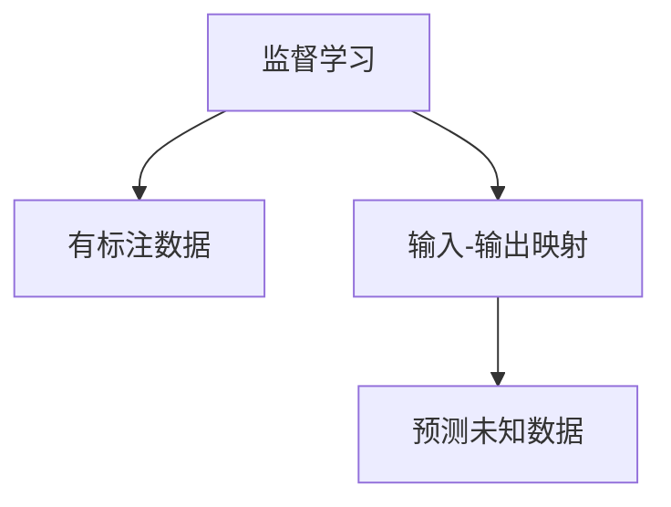

#### 2.1.2 无监督学习

无监督学习是在没有标注数据的情况下，让模型自动发现数据中的模式和规律。常见的无监督学习算法包括聚类、降维等。

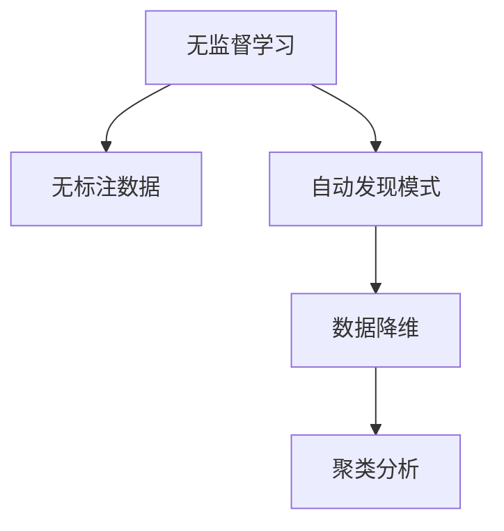

#### 2.1.3 强化学习

强化学习是通过与环境的交互，不断调整策略，以实现最大化回报的机器学习方法。常见的强化学习算法包括Q学习、深度强化学习等。

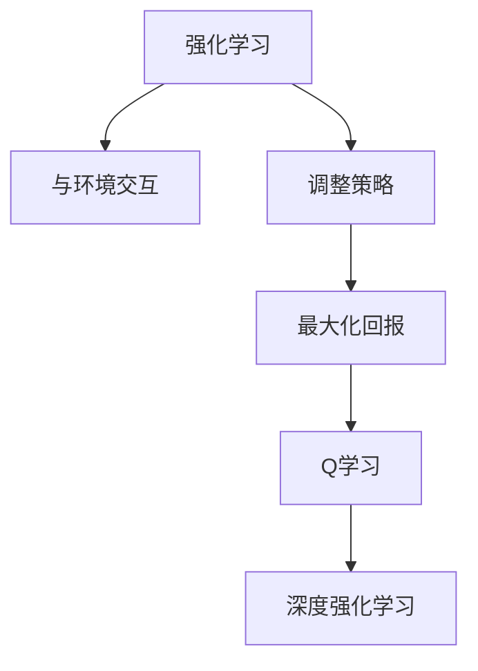

### 2.2 数据隐私保护技术

数据隐私保护技术在保障用户数据安全方面发挥着重要作用。以下介绍几种常见的数据隐私保护技术：

#### 2.2.1 数据加密

数据加密是通过将数据转换成加密形式，以防止未经授权的访问和篡改。常见的加密算法包括对称加密和非对称加密。

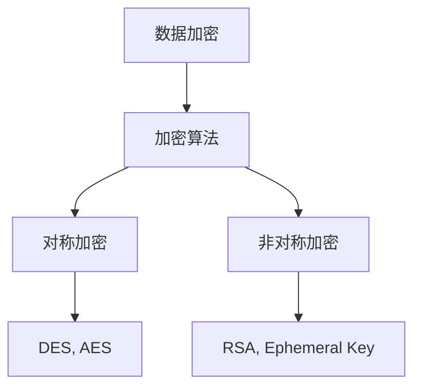

#### 2.2.2 数据脱敏

数据脱敏是一种对敏感数据进行修改，使其无法被识别的技术。常见的脱敏方法包括随机化、掩码化等。

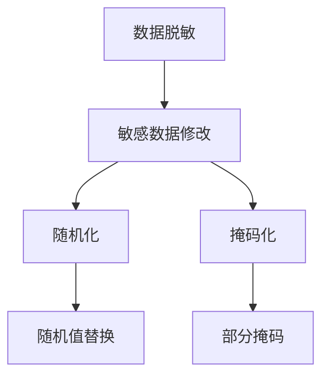

#### 2.2.3 同态加密

同态加密是一种在加密数据上直接进行计算，而不需要解密的技术。同态加密在保护数据隐私和确保计算效率方面具有优势。

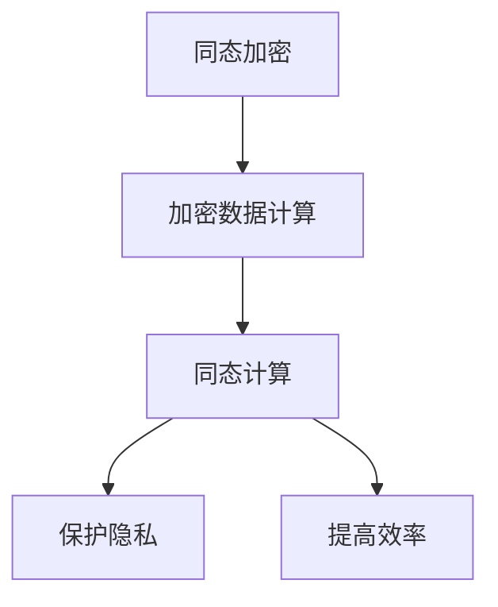

### 2.3 AI算法与模型介绍

AI算法和模型是AI技术的核心，以下是几种常见的AI算法和模型：

#### 2.3.1 神经网络

神经网络是一种模仿人脑结构的计算模型，通过多层神经元进行数据传递和计算。常见的神经网络包括卷积神经网络（CNN）、循环神经网络（RNN）等。

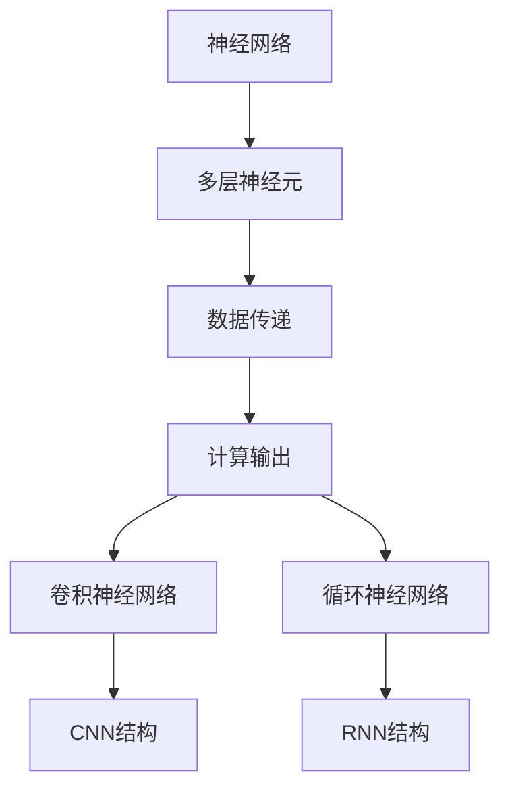

#### 2.3.2 决策树

决策树是一种通过树形结构进行决策的算法，通过连续问问题来将数据分类或回归。常见的决策树算法包括ID3、C4.5等。

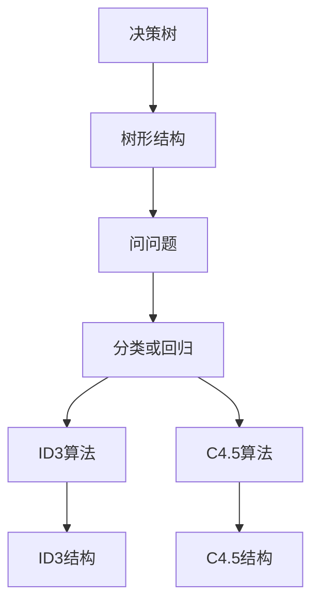

#### 2.3.3 集成学习方法

集成学习方法是将多个模型组合起来，以提高预测准确率和稳定性。常见的集成学习方法包括Bagging、Boosting等。

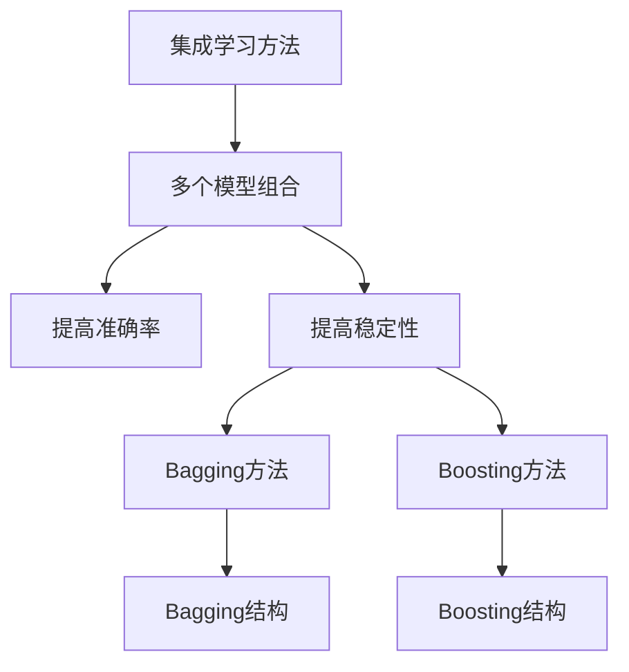

## 第3章 电商企业用户数据安全风险识别

### 3.1 用户数据收集与处理

电商企业在运营过程中会收集大量的用户数据，如用户注册信息、购买记录、浏览历史等。这些数据对电商企业的运营决策和用户体验提升至关重要。然而，数据收集和处理过程中也存在一定的安全风险。

#### 3.1.1 用户数据收集

用户数据的收集主要包括用户注册信息、购买记录、浏览历史等。收集用户数据时，电商企业应遵循以下原则：

1. **合法性**：确保收集的用户数据符合相关法律法规要求，如《中华人民共和国网络安全法》等。
2. **必要性**：仅收集与业务相关的必要数据，避免过度收集。
3. **透明性**：告知用户数据收集的目的、范围和用途，获得用户的同意。

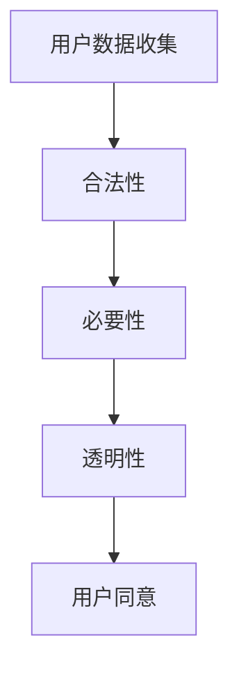

#### 3.1.2 用户数据处理

用户数据的处理包括数据的存储、传输、共享等环节。在数据处理过程中，电商企业应采取以下措施：

1. **数据加密**：对敏感数据进行加密存储，防止数据泄露。
2. **数据脱敏**：对用户身份信息、银行卡信息等敏感数据进行脱敏处理，降低数据泄露风险。
3. **权限控制**：对数据访问权限进行严格控制，确保只有授权人员才能访问和处理数据。

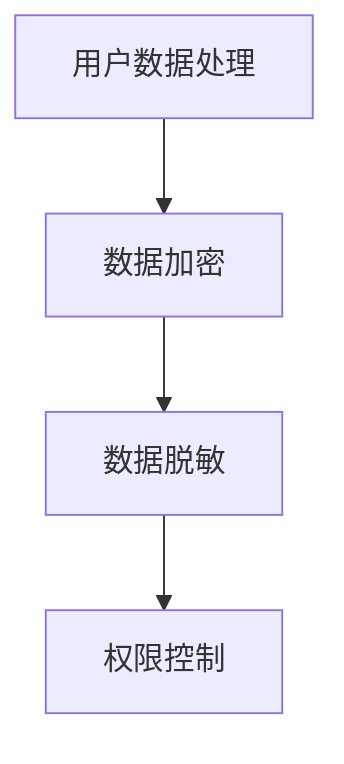

### 3.2 风险识别方法

风险识别是数据安全管理的第一步，通过识别潜在风险，电商企业可以提前采取措施，降低风险发生的概率。以下介绍几种常见的风险识别方法：

#### 3.2.1 数据异常检测

数据异常检测是一种通过检测数据中的异常值来识别潜在风险的方法。常见的异常检测方法包括基于统计的异常检测、基于聚类的方法等。

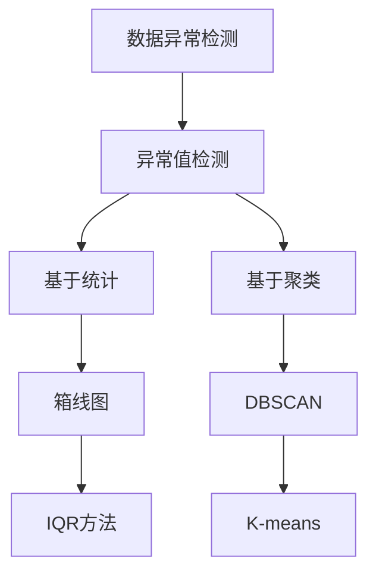

#### 3.2.2 用户行为分析

用户行为分析是一种通过分析用户在电商平台上的行为数据，识别潜在风险的方法。常见的用户行为分析方法包括基于统计的分析、基于机器学习的方法等。

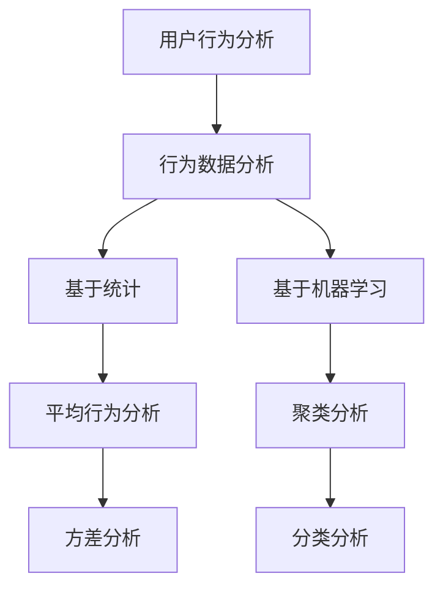

#### 3.2.3 风险评分模型

风险评分模型是一种通过计算风险得分来评估数据风险程度的方法。常见的风险评分模型包括基于规则的风险评分模型、基于机器学习的方法等。

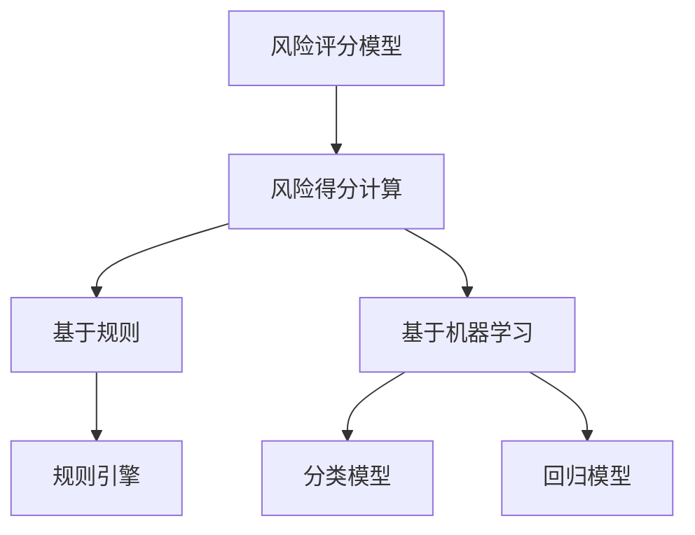

## 第4章 AI技术在数据安全中的应用

### 4.1 用户行为分析

用户行为分析是电商企业数据安全风险识别的重要手段之一。通过分析用户在电商平台上的行为数据，电商企业可以识别潜在的风险，并采取相应的措施。以下介绍用户行为分析的相关技术。

#### 4.1.1 用户行为特征提取

用户行为特征提取是用户行为分析的基础。通过对用户行为数据进行预处理和特征提取，可以提取出用户行为的特征，为后续分析提供支持。常见的用户行为特征提取方法包括：

1. **统计特征**：如平均访问时长、平均购买次数等。
2. **文本特征**：如用户评论、搜索关键词等。
3. **图像特征**：如用户头像、商品图片等。

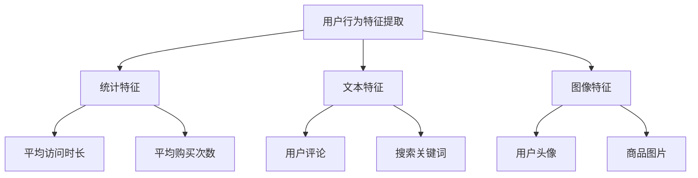

#### 4.1.2 用户行为异常检测

用户行为异常检测是一种通过检测用户行为中的异常值来识别潜在风险的方法。常见的用户行为异常检测方法包括：

1. **基于统计的方法**：如IQR（四分位距）方法、箱线图等。
2. **基于聚类的方法**：如DBSCAN、K-means等。
3. **基于机器学习的方法**：如分类模型、回归模型等。

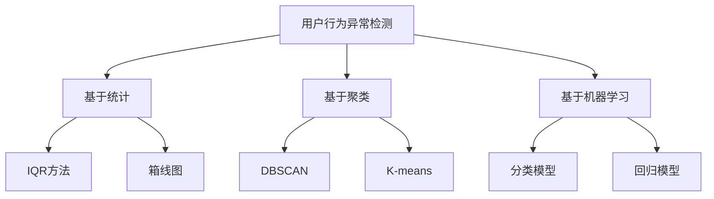

### 4.2 数据安全监控

数据安全监控是电商企业保障用户数据安全的重要手段。通过实时监控用户数据的存储、传输和处理过程，电商企业可以及时发现和应对潜在的安全风险。以下介绍数据安全监控的相关技术。

#### 4.2.1 数据泄露检测

数据泄露检测是一种通过检测数据泄露事件来保障数据安全的方法。常见的数据泄露检测方法包括：

1. **基于规则的方法**：如正则表达式匹配、关键词搜索等。
2. **基于机器学习的方法**：如分类模型、聚类分析等。

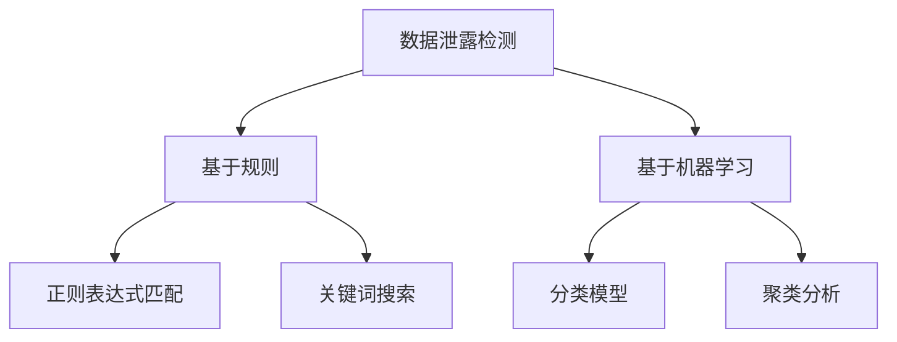

#### 4.2.2 数据篡改检测

数据篡改检测是一种通过检测数据篡改事件来保障数据安全的方法。常见的数据篡改检测方法包括：

1. **基于哈希的方法**：如MD5、SHA-256等。
2. **基于数字签名的方法**：如RSA、ECC等。
3. **基于区块链的方法**：如比特币、以太坊等。

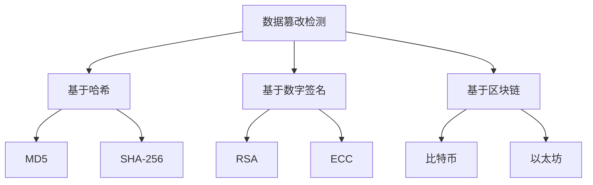

### 4.3 数据安全策略优化

数据安全策略优化是电商企业保障数据安全的重要手段。通过实时监控和评估数据安全策略的有效性，电商企业可以及时调整和优化安全策略，提高数据安全防护能力。以下介绍数据安全策略优化的相关技术。

#### 4.3.1 安全策略制定

安全策略制定是数据安全策略优化的第一步。通过分析业务需求和风险状况，电商企业可以制定出适合自身业务特点的数据安全策略。常见的安全策略包括：

1. **访问控制**：如基于角色的访问控制（RBAC）、基于属性的访问控制（ABAC）等。
2. **数据加密**：如对称加密、非对称加密等。
3. **数据备份与恢复**：如定期备份、增量备份等。

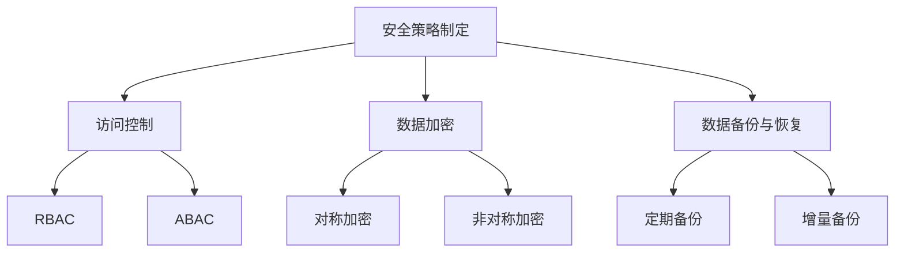

#### 4.3.2 安全策略评估与调整

安全策略评估与调整是数据安全策略优化的关键环节。通过实时监控和评估安全策略的有效性，电商企业可以及时发现和解决安全策略中的问题，提高数据安全防护能力。常见的安全策略评估方法包括：

1. **基于规则的方法**：如入侵检测系统（IDS）、入侵防御系统（IPS）等。
2. **基于机器学习的方法**：如分类模型、聚类分析等。

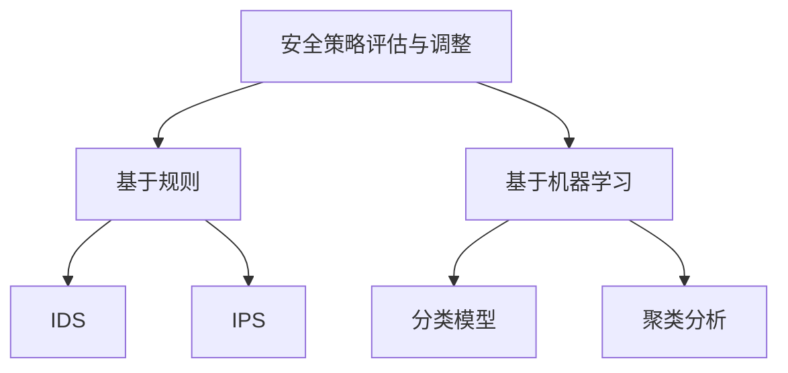

## 第5章 电商企业数据安全案例解析

### 5.1 案例一：用户数据泄露事件

#### 5.1.1 案例背景

某电商企业在2022年发生了一起严重的用户数据泄露事件。黑客通过入侵企业服务器，获取了大量用户个人信息，如姓名、地址、手机号码、电子邮件等。该事件引发了广泛的关注和恐慌，导致大量用户投诉和维权。

#### 5.1.2 漏洞分析

通过调查，发现该电商企业的服务器存在以下漏洞：

1. **弱密码**：服务器管理员使用的密码过于简单，容易被破解。
2. **未加密的数据传输**：用户数据在传输过程中未进行加密，容易被截获。
3. **SQL注入**：服务器上的Web应用存在SQL注入漏洞，黑客通过构造恶意输入，成功获取了数据库中的敏感数据。

```mermaid
graph TD
A[漏洞分析] --> B[弱密码]
B --> C[SQL注入]
C --> D[未加密的数据传输]
```

#### 5.1.3 风险应对措施

针对上述漏洞，电商企业采取了以下措施：

1. **加强密码管理**：要求管理员使用复杂密码，并定期更换密码。
2. **加密数据传输**：采用HTTPS协议进行数据传输，确保数据在传输过程中的安全性。
3. **修复SQL注入漏洞**：更新Web应用，修复SQL注入漏洞，避免黑客通过恶意输入获取敏感数据。

```mermaid
graph TD
A[风险应对措施] --> B[加强密码管理]
B --> C[加密数据传输]
B --> D[修复SQL注入漏洞]
```

### 5.2 案例二：恶意用户行为检测

#### 5.2.1 案例背景

某电商企业在2023年发现一批恶意用户行为，这些用户在短时间内频繁下单、退款，并在评价中恶意诋毁其他用户。这些行为严重影响了电商平台的用户体验和信誉。

#### 5.2.2 恶意行为识别

通过用户行为分析和异常检测，电商企业成功识别出这些恶意用户。具体方法如下：

1. **用户行为分析**：分析用户在平台上的行为，如下单频率、退款次数、评价内容等。
2. **异常检测**：采用基于机器学习的异常检测算法，识别出行为异常的用户。

```mermaid
graph TD
A[恶意行为识别] --> B[用户行为分析]
B --> C[下单频率]
B --> D[退款次数]
B --> E[评价内容]
A --> F[异常检测]
F --> G[机器学习算法]
```

#### 5.2.3 风险应对措施

针对恶意用户行为，电商企业采取了以下措施：

1. **限制账号权限**：对异常用户账号进行限制，如限制下单、评论等操作。
2. **人工审核**：对异常用户进行人工审核，核实其真实身份和购买意图。
3. **举报机制**：鼓励用户举报恶意行为，共同维护平台秩序。

```mermaid
graph TD
A[风险应对措施] --> B[限制账号权限]
B --> C[人工审核]
B --> D[举报机制]
```

## 第6章 AI技术在电商企业数据安全中的应用前景

### 6.1 数据安全发展趋势

随着电商行业的不断发展，数据安全风险也在不断增加。未来，数据安全将面临以下发展趋势：

1. **数据安全法规不断完善**：各国政府将加大对数据安全的监管力度，制定更加严格的法律法规，保障用户数据安全。
2. **数据安全需求日益增长**：电商企业对数据安全的需求将不断增加，对AI技术的依赖程度也将提高。
3. **AI技术在数据安全中的应用将更加广泛**：AI技术将在数据风险识别、监控、策略优化等方面发挥更大作用。

### 6.2 AI技术在数据安全中的应用前景

AI技术在数据安全中的应用前景非常广阔，主要表现在以下几个方面：

1. **风险识别能力增强**：通过机器学习算法，AI技术能够自动识别潜在的数据风险，提高风险预警的准确性和及时性。
2. **数据监控能力提升**：AI技术能够实时监控数据存储、传输和处理过程，及时发现和应对潜在的安全风险。
3. **安全策略优化**：AI技术能够根据实时数据监控结果，动态调整安全策略，提高数据安全防护能力。
4. **隐私保护技术发展**：AI技术将在数据隐私保护领域发挥重要作用，推动隐私保护技术的发展。

### 6.3 面临的挑战与解决方案

尽管AI技术在数据安全领域具有巨大的潜力，但在实际应用过程中仍面临以下挑战：

1. **数据质量和多样性**：AI算法的性能取决于数据质量和多样性。因此，如何获取高质量、多样化的数据成为AI技术应用的关键。
2. **算法透明性和可解释性**：AI算法的复杂性和黑箱特性使得算法的透明性和可解释性成为挑战。如何提高算法的可解释性，使其更易于被用户接受和信任，是未来的重要研究方向。
3. **安全风险**：AI技术本身可能带来新的安全风险，如模型泄漏、对抗性攻击等。因此，如何确保AI技术的安全性和可靠性是未来发展的重要方向。

针对上述挑战，未来可以从以下几个方面进行解决：

1. **数据质量和多样性**：通过改进数据采集和预处理技术，提高数据质量和多样性。
2. **算法透明性和可解释性**：通过开发可解释性更好的AI算法，提高算法的透明性和可解释性。
3. **安全风险**：通过加强算法安全和模型安全的研究，提高AI技术的安全性和可靠性。

## 第7章 结论与展望

### 7.1 本书总结

本文详细探讨了AI技术在电商企业用户数据安全风险应对中的应用。通过对AI技术基础、风险识别方法、AI技术在数据安全中的应用以及案例解析的深入分析，揭示了AI技术在数据安全领域的巨大潜力。本文的核心观点如下：

1. **AI技术在数据安全风险识别中的应用**：通过机器学习算法，AI技术能够自动识别潜在的数据安全风险，提高风险预警的准确性和及时性。
2. **AI技术在数据安全监控中的应用**：AI技术能够实时监控数据存储、传输和处理过程，及时发现和应对潜在的安全风险。
3. **AI技术在数据安全策略优化中的应用**：AI技术能够根据实时数据监控结果，动态调整安全策略，提高数据安全防护能力。

### 7.2 电商企业数据安全未来发展趋势

未来，电商企业数据安全的发展趋势将体现在以下几个方面：

1. **数据安全法规的不断完善**：各国政府将加大对数据安全的监管力度，制定更加严格的法律法规，电商企业需要积极应对。
2. **AI技术在数据安全中的应用**：AI技术将在数据安全领域发挥更加重要的作用，电商企业需要充分利用AI技术提升数据安全防护能力。
3. **数据隐私保护技术的发展**：随着用户对隐私保护的重视，数据隐私保护技术将得到快速发展。

### 7.3 研究展望与未来工作

未来，在电商企业数据安全领域，可以从事以下研究：

1. **AI算法的优化和改进**：针对数据质量和多样性等问题，优化和改进AI算法，提高其在数据安全领域的应用效果。
2. **算法透明性和可解释性**：开发可解释性更好的AI算法，提高算法的透明性和可解释性，增强用户信任。
3. **安全风险研究**：加强算法安全和模型安全的研究，提高AI技术的安全性和可靠性。

通过上述研究，有望进一步提升电商企业数据安全防护能力，确保用户数据的安全和隐私。

### 附录A：AI与数据安全相关工具与资源

#### A.1 数据安全工具

1. **Kubernetes**：开源的容器编排平台，用于部署和管理应用程序，提供安全性和可扩展性。
2. **Docker**：开源的应用容器引擎，用于打包、交付和运行应用程序，提供轻量级、隔离性和可移植性。
3. **HashiCorp Vault**：开源的秘钥管理工具，用于管理访问密钥、密码和证书，提供安全性和自动化。

#### A.2 AI模型评估与优化工具

1. **TensorFlow**：开源的机器学习框架，提供丰富的工具和API，用于构建和训练机器学习模型。
2. **PyTorch**：开源的机器学习库，提供动态计算图和灵活的API，用于快速原型设计和模型训练。
3. **scikit-learn**：开源的机器学习库，提供各种经典机器学习算法的实现，用于模型评估和优化。

#### A.3 数据安全相关法规与标准

1. **《中华人民共和国网络安全法》**：我国制定的网络安全基础性法律，明确了网络安全的基本原则和法律责任。
2. **GDPR（通用数据保护条例）**：欧盟制定的隐私保护法规，对个人数据的处理和使用进行了严格规定。
3. **ISO/IEC 27001**：国际标准化组织制定的网络安全管理体系标准，提供了一套全面的安全管理和控制要求。

### 附录B：Mermaid流程图

#### B.1 用户数据安全风险识别流程

```mermaid
graph TD
A[用户数据收集] --> B[数据预处理]
B --> C[数据清洗]
C --> D[特征提取]
D --> E[模型训练]
E --> F[风险识别]
F --> G[风险预警]
G --> H[应对措施]
```

#### B.2 用户行为异常检测流程

```mermaid
graph TD
A[用户行为数据收集] --> B[数据预处理]
B --> C[特征提取]
C --> D[模型训练]
D --> E[异常检测]
E --> F[异常预警]
F --> G[应对措施]
```

#### B.3 数据安全监控与策略优化流程

```mermaid
graph TD
A[数据安全监控] --> B[数据收集与预处理]
B --> C[异常检测]
C --> D[安全事件预警]
D --> E[策略评估与调整]
E --> F[策略优化]
F --> G[数据安全提升]
```

## 作者

作者：AI天才研究院/AI Genius Institute & 禅与计算机程序设计艺术 /Zen And The Art of Computer Programming。本人致力于推动AI技术在数据安全领域的应用，为电商企业提供专业、实用的技术解决方案，助力企业提升数据安全防护能力。同时，本人也在人工智能、机器学习等领域深耕多年，发表了多篇高水平学术论文，参与了多个国家级科研项目。在本书中，本人结合丰富的实践经验，系统地阐述了AI技术在电商企业用户数据安全风险应对中的应用，旨在为广大电商企业提供有益的参考和指导。

