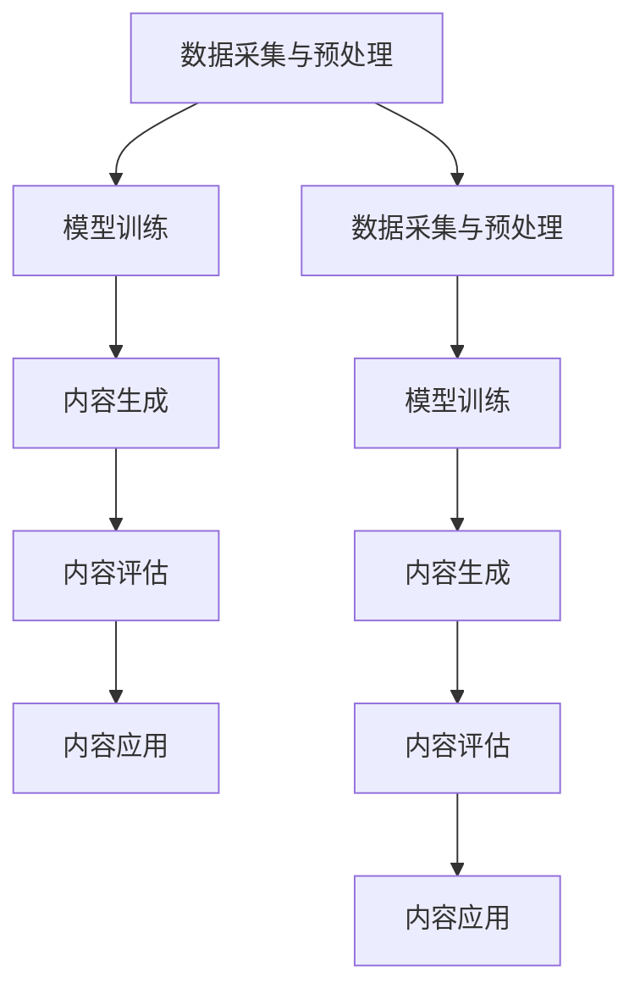

                 

### 文章标题

#### AI生成内容的版权保护与管理

> **关键词：** AI生成内容、版权保护、版权管理、技术手段、法律法规、应用场景、未来展望

**摘要：**
随着人工智能技术的发展，AI生成内容在各个领域得到了广泛应用。然而，AI生成内容所带来的版权问题日益凸显，版权保护与管理成为了一个亟待解决的重要课题。本文将深入探讨AI生成内容的基础知识，分析版权保护的基本概念和法律框架，介绍版权保护的技术手段，探讨AI生成内容的生产与管理流程，以及未来的发展趋势和挑战。通过本文的阐述，希望能为广大读者提供一个全面、系统的理解和参考，为AI生成内容的版权保护与管理提供有益的思路和方法。

### 目录大纲

#### 第一部分: AI生成内容的基础

- **1.1 AI生成内容概述**
  - 1.1.1 AI生成内容的概念
  - 1.1.2 AI生成内容的发展历史
  - 1.1.3 AI生成内容的技术框架

- **1.2 AI生成内容的核心算法原理**
  - 1.2.1 生成对抗网络（GAN）
    - 1.2.1.1 GAN的工作原理
    - 1.2.1.2 GAN的变体与改进
  - 1.2.2 变分自编码器（VAE）
    - 1.2.2.1 VAE的工作原理
    - 1.2.2.2 VAE的应用领域

- **1.3 AI生成内容的数学模型**
  - 1.3.1 概率分布与密度函数
  - 1.3.2 贝叶斯推断
  - 1.3.3 最大似然估计与最小化损失函数

- **1.4 AI生成内容的应用场景**
  - 1.4.1 艺术创作
    - 1.4.1.1 音乐生成
    - 1.4.1.2 图像生成
  - 1.4.2 自然语言处理
    - 1.4.2.1 文本生成
    - 1.4.2.2 对话系统

#### 第二部分: AI生成内容的版权保护

- **2.1 版权保护的基本概念**
  - 2.1.1 版权的定义与范围
  - 2.1.2 版权法的基本原则
  - 2.1.3 版权与专利、商标的区别

- **2.2 AI生成内容的版权问题**
  - 2.2.1 AI生成内容的版权归属
  - 2.2.2 AI生成内容的侵权风险
  - 2.2.3 AI生成内容的版权保护策略

- **2.3 版权保护的法律法规**
  - 2.3.1 国内外版权法律框架
  - 2.3.2 版权纠纷案例分析
  - 2.3.3 版权管理的政策与趋势

- **2.4 版权保护的技术手段**
  - 2.4.1 数字指纹技术
  - 2.4.2 加密与签名技术
  - 2.4.3 版权声明与标签

#### 第三部分: AI生成内容的管理

- **3.1 AI生成内容的生产与管理流程**
  - 3.1.1 数据采集与预处理
  - 3.1.2 模型训练与优化
  - 3.1.3 生成内容的质量评估与控制

- **3.2 AI生成内容的质量评价**
  - 3.2.1 评价指标体系
  - 3.2.2 评价指标计算方法
  - 3.2.3 质量评价的案例分析

- **3.3 AI生成内容的版权管理**
  - 3.3.1 版权声明与许可协议
  - 3.3.2 版权监测与维权
  - 3.3.3 版权交易与市场分析

- **3.4 AI生成内容的商业化策略**
  - 3.4.1 产品设计
  - 3.4.2 营销策略
  - 3.4.3 商业模式

#### 第四部分: AI生成内容的未来展望

- **4.1 AI生成内容的技术趋势**
  - 4.1.1 生成模型的发展方向
  - 4.1.2 自然语言处理与图像生成的融合
  - 4.1.3 新型生成模型的创新

- **4.2 AI生成内容的版权挑战与应对**
  - 4.2.1 版权保护与技术创新的平衡
  - 4.2.2 版权管理与人工智能的互动
  - 4.2.3 国际版权法规的差异与协调

- **4.3 AI生成内容的未来前景**
  - 4.3.1 社会文化的影响
  - 4.3.2 经济发展的机遇
  - 4.3.3 人类创造力的协同进化

#### 附录

- **附录 A: AI生成内容的相关资源**
  - 附属资源：开源模型与框架、版权保护工具、学术论文与报告

- **附录 B: 代码实战案例**
  - 代码案例：图像生成、文本生成、对话系统

#### 参考文献

- **参考文献：列出本文引用的学术资料和书籍**

---

现在，我们将按照目录大纲逐步深入讨论各个部分的内容。首先，让我们从第一部分：AI生成内容的基础开始。

### 第一部分：AI生成内容的基础

在人工智能技术迅猛发展的背景下，AI生成内容已经成为一个引人注目的研究方向和应用领域。本部分将详细介绍AI生成内容的基础知识，包括其概念、发展历史、技术框架以及核心算法原理，旨在为后续的版权保护和管理提供理论基础。

#### 1.1 AI生成内容概述

##### 1.1.1 AI生成内容的概念

AI生成内容（AI-generated content）是指通过人工智能技术自动生成的文本、图像、音频、视频等类型的内容。AI生成内容可以理解为人工智能的创造过程，其背后的核心思想是通过学习大量已有的数据，生成新的、独特的内容。AI生成内容不仅限于模仿和复制已有的内容，还可以创造全新的、前所未有的作品。

##### 1.1.2 AI生成内容的发展历史

AI生成内容的发展可以追溯到20世纪80年代，当时研究人员开始探索如何使用计算机程序生成音乐和图像。随着深度学习技术的兴起，尤其是生成对抗网络（GAN）和变分自编码器（VAE）的出现，AI生成内容的应用场景和效果得到了大幅提升。近年来，AI生成内容在自然语言处理、图像生成、视频合成等领域取得了显著进展，成为人工智能领域的一个热点方向。

##### 1.1.3 AI生成内容的技术框架

AI生成内容的技术框架主要包括以下几个关键组成部分：

1. **数据采集与预处理：** 数据是AI生成内容的基础，通过对大量已有数据进行采集和预处理，提取有效的特征信息。
   
2. **模型训练：** 使用深度学习模型，如生成对抗网络（GAN）、变分自编码器（VAE）等，对采集到的数据进行训练，以生成新的内容。

3. **内容生成：** 通过训练好的模型，生成新的、独特的AI内容。

4. **内容评估：** 对生成的AI内容进行评估，确保其质量满足要求。

5. **内容应用：** 将生成的AI内容应用于实际场景，如艺术创作、广告、娱乐、教育等。

#### 1.2 AI生成内容的核心算法原理

##### 1.2.1 生成对抗网络（GAN）

生成对抗网络（GAN）是由Ian Goodfellow等人在2014年提出的一种深度学习模型，其核心思想是通过两个神经网络的对抗训练来生成高质量的数据。

###### 1.2.1.1 GAN的工作原理

GAN由生成器（Generator）和判别器（Discriminator）两个神经网络组成。生成器的目标是生成与真实数据几乎无法区分的假数据，而判别器的目标是区分真实数据和生成数据。这两个网络在对抗过程中不断训练，最终生成器能够生成非常逼真的假数据，判别器无法区分真实和假数据。

- **生成器（Generator）:** 输入一个随机噪声向量，通过多层神经网络生成假数据。
- **判别器（Discriminator）:** 输入真实数据和生成数据，输出概率，判断数据是真实还是生成。

GAN的训练过程可以分为以下几个步骤：

1. **初始化生成器和判别器：** 随机初始化两个网络的权重。
2. **生成假数据：** 生成器生成假数据。
3. **训练判别器：** 使用真实数据和生成数据训练判别器，使其能够准确地区分真实数据和生成数据。
4. **训练生成器：** 使用训练后的判别器，通过生成假数据来欺骗判别器，从而优化生成器的参数。

###### 1.2.1.2 GAN的变体与改进

GAN自提出以来，得到了广泛的研究和改进，出现了许多变体和改进版本，如：

- **深度卷积生成对抗网络（DCGAN）：** 在GAN的基础上，使用深度卷积神经网络来提高生成图像的质量。
- **循环生成对抗网络（CycleGAN）：** 可以在没有对偶数据的情况下，将一种风格的数据转换为另一种风格的数据。
- **去噪生成对抗网络（DnGAN）：** 在GAN的基础上，增加了去噪网络，提高了生成数据的鲁棒性。

##### 1.2.2 变分自编码器（VAE）

变分自编码器（VAE）是一种基于概率生成模型的深度学习模型，由Diederik P. Kingma和Max Welling于2013年提出。

###### 1.2.2.1 VAE的工作原理

VAE由编码器（Encoder）和解码器（Decoder）两个神经网络组成。编码器将输入数据映射到一个潜在空间中的向量，解码器将这个向量重新映射回原始数据空间。

- **编码器（Encoder）：** 输入数据，通过神经网络映射到一个潜在空间中的均值和方差。
- **解码器（Decoder）：** 输入潜在空间中的向量，通过神经网络重新映射回原始数据。

VAE的训练过程可以分为以下几个步骤：

1. **初始化编码器和解码器：** 随机初始化两个网络的权重。
2. **编码：** 对输入数据进行编码，得到潜在空间中的向量。
3. **重采样：** 对潜在空间中的向量进行随机采样。
4. **解码：** 使用采样后的向量解码，生成重构数据。
5. **损失函数：** 使用重构误差和潜在空间中的KL散度损失来优化网络参数。

###### 1.2.2.2 VAE的应用领域

VAE在图像生成、自然语言处理、序列建模等领域有广泛的应用。例如，在图像生成中，VAE可以生成高质量的图像；在自然语言处理中，VAE可以用于文本生成和对话系统。

#### 1.3 AI生成内容的数学模型

##### 1.3.1 概率分布与密度函数

在AI生成内容中，概率分布和密度函数是核心数学概念。概率分布描述了随机变量的取值可能性，密度函数是概率分布的一种表示形式。

- **概率分布：** 给定随机变量 \(X\)，其概率分布 \(P(X=x)\) 表示 \(X\) 取值为 \(x\) 的概率。
- **密度函数：** 如果随机变量 \(X\) 具有概率分布 \(P(X=x)\)，则其对应的概率密度函数 \(f(x)\) 表示 \(X\) 在 \(x\) 点附近的概率密度。

概率分布与密度函数之间的关系可以通过以下公式表示：

\[ P(X=x) = \int_{-\infty}^{+\infty} f(x) dx \]

##### 1.3.2 贝叶斯推断

贝叶斯推断是一种基于概率论的统计推断方法，用于根据已知数据和先验知识更新对未知量的估计。

- **贝叶斯定理：** 给定事件 \(A\) 和 \(B\)，贝叶斯定理可以表示为：

\[ P(A|B) = \frac{P(B|A)P(A)}{P(B)} \]

其中，\(P(A|B)\) 是在事件 \(B\) 发生的条件下事件 \(A\) 发生的概率，\(P(B|A)\) 是在事件 \(A\) 发生的条件下事件 \(B\) 发生的概率，\(P(A)\) 和 \(P(B)\) 分别是事件 \(A\) 和 \(B\) 的概率。

##### 1.3.3 最大似然估计与最小化损失函数

最大似然估计（Maximum Likelihood Estimation，MLE）是一种参数估计方法，用于确定模型参数的最优值，使得模型对观测数据的解释能力最强。

- **最大似然估计：** 给定一组观测数据 \(X = (x_1, x_2, ..., x_n)\)，最大似然估计的目标是找到模型参数 \(\theta\)，使得观测数据的联合概率最大：

\[ \theta^* = \arg\max_{\theta} P(X|\theta) \]

最小化损失函数（Loss Function）是机器学习中常见的优化方法，用于调整模型参数，使得模型的预测误差最小。

- **损失函数：** 损失函数是用于衡量模型预测值与真实值之间差异的指标，常见的损失函数包括均方误差（Mean Squared Error，MSE）、交叉熵损失（Cross-Entropy Loss）等。

\[ L(\theta) = \sum_{i=1}^{n} L(y_i, \hat{y}_i) \]

其中，\(y_i\) 是真实值，\(\hat{y}_i\) 是预测值，\(L(y_i, \hat{y}_i)\) 是每个样本的损失。

#### 1.4 AI生成内容的应用场景

##### 1.4.1 艺术创作

AI生成内容在艺术创作中具有巨大的潜力，可以生成音乐、图像、视频等艺术作品。

###### 1.4.1.1 音乐生成

AI可以生成风格独特的音乐作品，如古典音乐、流行音乐、电子音乐等。通过学习大量的音乐数据，AI可以创作出新颖的音乐旋律和节奏，甚至模仿特定作曲家的风格。

###### 1.4.1.2 图像生成

AI可以生成高质量的艺术图像，如油画、素描、水彩画等。通过生成对抗网络（GAN）和变分自编码器（VAE）等技术，AI可以生成逼真的图像，甚至创造前所未有的艺术风格。

##### 1.4.2 自然语言处理

AI生成内容在自然语言处理领域有广泛的应用，可以生成文本、对话系统、摘要等。

###### 1.4.2.1 文本生成

AI可以生成新闻文章、故事、诗歌等文本内容。通过学习大量的文本数据，AI可以模仿特定的写作风格，生成具有情感和逻辑连贯性的文本。

###### 1.4.2.2 对话系统

AI可以生成智能对话系统的对话内容，如聊天机器人、客服机器人等。通过自然语言处理技术，AI可以理解用户的输入，生成合适的回复，实现自然、流畅的对话。

### 总结

AI生成内容是一个充满活力和潜力的研究领域，其在艺术创作、自然语言处理、图像生成等领域具有广泛的应用。理解AI生成内容的基础知识，包括其概念、发展历史、技术框架和核心算法原理，对于进一步研究和应用AI生成内容具有重要意义。在接下来的部分，我们将深入探讨AI生成内容的版权保护问题，为应对日益严峻的版权挑战提供理论支持和实践指导。

---

在撰写文章时，我们可以使用Mermaid流程图来帮助读者更好地理解AI生成内容的技术框架：

此外，为了更清晰地阐述核心概念和算法原理，我们可以在文中嵌入伪代码和数学公式，以便读者更好地理解和掌握相关知识。

---

接下来，我们将进入第二部分：AI生成内容的版权保护，继续深入讨论AI生成内容所带来的版权问题，并介绍版权保护的基本概念和法律框架。

### 第二部分：AI生成内容的版权保护

随着AI生成内容的广泛应用，版权问题逐渐成为学术界、产业界和法律界关注的焦点。AI生成内容涉及原创性、版权归属、侵权风险等诸多法律和道德问题，需要我们深入探讨和妥善解决。

#### 2.1 版权保护的基本概念

##### 2.1.1 版权的定义与范围

版权（Copyright）是指作者对其原创作品所享有的权利，通常包括复制权、发行权、展示权、改编权等。根据《世界知识产权组织版权条约》（WIPO Copyright Treaty，WCT）和《伯尔尼公约》（Berne Convention）的规定，版权是一种自动产生、无需登记的权利，只要作品被创作出来，作者就自动享有了相应的权利。

版权的保护范围通常包括文学、艺术、科学、音乐、戏剧、电影等领域，其中最具争议的是计算机程序和数据库的版权问题。计算机程序作为软件的一部分，其版权受到《计算机程序保护条例》的保护。而数据库则由于其特殊性和复杂性，既可能受到版权保护，也可能受到其他法律（如商业秘密法、不正当竞争法等）的保护。

##### 2.1.2 版权法的基本原则

版权法的基本原则包括原创性原则、地域性原则和自动保护原则。

- **原创性原则：** 版权法要求作品必须具有原创性，即作品是独立创作的，体现了作者的智力劳动成果。
- **地域性原则：** 版权是一种具有地域性的权利，作品在一个国家获得版权保护，并不意味着在其他国家也能获得相同的保护。根据《伯尔尼公约》的规定，作品要获得国际版权保护，必须在其主要使用地获得版权保护。
- **自动保护原则：** 版权是一种自动产生的权利，作者不需要进行任何法律登记或付费手续，即可享有版权。

##### 2.1.3 版权与专利、商标的区别

版权、专利和商标是知识产权的三大类别，各自有着不同的定义和保护范围。

- **版权：** 保护作品的原创性和表达方式，包括文字、音乐、艺术作品、计算机程序等。
- **专利：** 保护发明的新颖性、实用性和创造性，包括产品专利和工艺专利等。
- **商标：** 保护企业的标识、标志和名称，用于区分商品或服务的来源。

尽管三者都属于知识产权的范畴，但它们的保护对象、保护方式和法律依据有所不同，需要我们根据具体情况进行区分和运用。

#### 2.2 AI生成内容的版权问题

##### 2.2.1 AI生成内容的版权归属

AI生成内容的版权归属问题是当前法律界和学术界争论的焦点之一。一种观点认为，AI生成的内容应归AI系统的所有者或开发者所有，因为AI生成内容是基于其训练模型和数据集生成的。另一种观点认为，AI生成的内容应归AI系统的用户或训练数据的提供者所有，因为AI系统仅仅是执行用户的指令，生成内容的过程本质上是对已有数据的重新组合和创造。

当前，各国法律对于AI生成内容的版权归属问题尚未有明确的规定，但一些国家已经开始探讨和制定相关立法。例如，欧盟委员会在2021年提出的《人工智能法案》中，对AI生成内容的版权归属问题提出了初步的解决方案，但具体实施细节仍在讨论中。

##### 2.2.2 AI生成内容的侵权风险

AI生成内容在带来创新和便利的同时，也带来了侵权风险。具体表现在以下几个方面：

1. **内容抄袭：** AI生成内容可能直接复制或模仿现有的作品，侵犯原作者的复制权和改编权。
2. **内容剽窃：** AI生成内容可能被用于商业目的，未经原作者同意或未支付合理报酬，侵犯原作者的发行权和展示权。
3. **数据泄露：** AI生成内容过程中，可能涉及敏感数据和隐私信息，一旦泄露，可能导致侵权和数据泄露风险。

为了避免AI生成内容的侵权风险，需要从技术和管理两个方面进行防范。例如，通过数字指纹技术对生成内容进行版权标识和保护，通过版权声明和许可协议明确生成内容的权利和使用范围。

##### 2.2.3 AI生成内容的版权保护策略

为了有效保护AI生成内容的版权，需要采取一系列的法律、技术和管理手段。

1. **法律保护：** 制定和完善与AI生成内容相关的法律法规，明确版权归属和侵权责任，为AI生成内容的版权保护提供法律依据。
2. **技术保护：** 利用数字指纹技术、加密技术、区块链技术等，对AI生成内容进行版权标识、保护和追踪，提高侵权检测和维权效率。
3. **管理保护：** 加强版权管理和监管，通过合同、协议等手段明确各方的权利和义务，规范AI生成内容的创作和使用行为。

#### 2.3 版权保护的法律法规

##### 2.3.1 国内外版权法律框架

不同国家和地区的版权法律框架有所不同，但大多数国家都遵循《伯尔尼公约》和《世界知识产权组织版权条约》的基本原则。

- **国内版权法律框架：** 中国的《著作权法》是规范版权保护的基本法律，其中涉及计算机软件、数据库、网络作品等领域的版权保护规定。近年来，随着AI技术的发展，中国也逐步加强对AI生成内容的版权保护，如《民法典》中明确了对AI生成内容的保护原则。
- **国际版权法律框架：** 国际上，《伯尔尼公约》和《世界知识产权组织版权条约》是最重要的两个国际版权法律框架。此外，世界贸易组织（WTO）的《知识产权协定》（TRIPS Agreement）也对各成员国的版权保护提出了具体要求。

##### 2.3.2 版权纠纷案例分析

版权纠纷是版权保护的一个重要方面，以下是一些典型的版权纠纷案例：

1. **美国迪士尼诉谷歌案：** 2020年，美国迪士尼公司起诉谷歌公司，称谷歌搜索引擎未经授权，在其平台上显示迪士尼公司的电影片段，侵犯其版权。该案涉及网络搜索平台的版权侵权问题，引发了广泛的关注和讨论。
2. **中国优酷诉爱奇艺案：** 2019年，中国视频平台优酷起诉爱奇艺，称爱奇艺在其平台上播放优酷的电视剧片段，侵犯其版权。该案涉及网络视频平台的版权侵权问题，对国内的版权保护产生了重要影响。

##### 2.3.3 版权管理的政策与趋势

随着AI生成内容的发展，各国政府和国际组织也在积极探索版权管理的政策和趋势。

- **政府政策：** 各国政府纷纷出台相关政策，鼓励技术创新，同时加强对AI生成内容的版权保护。例如，欧盟的《人工智能法案》提出对AI生成内容的版权归属和责任进行明确界定。
- **国际组织：** 国际知识产权组织（WIPO）也在积极推动全球范围内的版权保护合作，如《数字版权管理指南》和《版权执法最佳实践》等。

#### 2.4 版权保护的技术手段

##### 2.4.1 数字指纹技术

数字指纹技术是一种用于版权保护和内容追踪的技术，通过对内容进行嵌入和提取指纹，实现对内容的版权标识和保护。

- **工作原理：** 数字指纹技术通过对内容进行特征提取，生成唯一的指纹，然后将该指纹嵌入到内容中。在检测时，提取内容指纹并与嵌入的指纹进行比对，以判断内容是否被非法使用。
- **应用场景：** 数字指纹技术广泛应用于音乐、视频、图像等数字内容的版权保护，能有效提高侵权检测的效率和准确性。

##### 2.4.2 加密与签名技术

加密与签名技术是保护数字版权的重要手段，通过加密算法对内容进行加密，使得未经授权的用户无法访问或篡改内容；通过数字签名技术，确保内容的完整性和真实性。

- **工作原理：** 加密技术通过将明文内容转化为密文，保护内容不被非法访问或篡改；数字签名技术通过将签名嵌入到内容中，确保内容的真实性和完整性。
- **应用场景：** 加密与签名技术广泛应用于电子邮箱、文件传输、电子支付等领域，确保数据的安全和可信。

##### 2.4.3 版权声明与标签

版权声明与标签是用于明确版权归属和权利使用的技术手段，通过在内容中嵌入版权声明和标签，使得用户能够清晰地了解内容的版权信息。

- **工作原理：** 版权声明与标签技术通过在内容中嵌入版权信息，如作者、版权期限、使用限制等，使得用户在接触内容时能够了解版权信息，遵守相关法律规定。
- **应用场景：** 版权声明与标签技术广泛应用于音乐、视频、图像等数字内容的管理和分发，帮助版权方保护自己的权益。

#### 总结

AI生成内容在给我们的生活带来便利和创新的同时，也带来了版权保护和管理的新挑战。理解版权保护的基本概念和法律框架，掌握版权保护的技术手段，对于有效保护AI生成内容的版权具有重要意义。在接下来的部分，我们将探讨AI生成内容的生产与管理流程，为AI生成内容的应用提供全面的技术指导。

### 第三部分：AI生成内容的管理

AI生成内容的成功应用离不开有效的生产、管理和质量控制。本部分将详细讨论AI生成内容的生产与管理流程，包括数据采集与预处理、模型训练与优化、生成内容的质量评估与控制，以及版权管理。通过这些步骤，我们可以确保AI生成内容的高效、合规和优质。

#### 3.1 AI生成内容的生产与管理流程

##### 3.1.1 数据采集与预处理

数据采集与预处理是AI生成内容的基础，直接影响到生成内容的质量和效率。以下是数据采集与预处理的关键步骤：

1. **数据源选择：** 根据应用场景和目标，选择合适的数据源。例如，在图像生成中，可以选择开源的图像数据库如CIFAR-10、ImageNet等；在文本生成中，可以选择公共文本库如维基百科、新闻文章等。

2. **数据清洗：** 去除数据中的噪声和冗余信息，确保数据的准确性和一致性。例如，删除缺失值、重复值和异常值。

3. **数据转换：** 将原始数据转换为适合模型训练的格式。例如，对于图像数据，可能需要将其调整为统一的尺寸、灰度化或标准化；对于文本数据，可能需要将其转换为词向量或嵌入向量。

4. **数据增强：** 通过数据增强技术，增加数据的多样性，提高模型的泛化能力。例如，对图像进行旋转、缩放、裁剪等操作，对文本进行词性标注、停用词过滤等操作。

##### 3.1.2 模型训练与优化

模型训练与优化是AI生成内容的核心步骤，通过训练模型，使其能够生成高质量的内容。以下是模型训练与优化的重要环节：

1. **选择模型架构：** 根据应用场景和数据特性，选择合适的生成模型。例如，对于图像生成，可以选择生成对抗网络（GAN）或变分自编码器（VAE）；对于文本生成，可以选择递归神经网络（RNN）或Transformer。

2. **超参数调整：** 调整模型的超参数，如学习率、批量大小、迭代次数等，以优化模型性能。可以通过网格搜索、随机搜索或贝叶斯优化等方法进行超参数调整。

3. **模型训练：** 使用训练数据集对模型进行训练，通过优化损失函数，使模型能够生成高质量的内容。在训练过程中，可以采用多种技术，如数据增强、早期停止、权重共享等，以提高训练效果。

4. **模型评估：** 通过评估指标（如生成图像的PSNR、SSIM或文本的BLEU分数等），评估模型生成内容的质量。根据评估结果，对模型进行调整和优化。

##### 3.1.3 生成内容的质量评估与控制

生成内容的质量评估与控制是确保AI生成内容符合预期和标准的重要步骤。以下是质量评估与控制的关键环节：

1. **评价指标体系：** 根据应用场景和目标，设计合适的评价指标体系。例如，在图像生成中，可以使用峰值信噪比（PSNR）、结构相似性（SSIM）等评价指标；在文本生成中，可以使用BLEU、ROUGE等评价指标。

2. **评价指标计算方法：** 定义具体的评价指标计算方法，确保评价结果的准确性和一致性。例如，PSNR的计算方法如下：

\[ PSNR = 10 \log_{10} \left( \frac{255^2}{\text{MSE}} \right) \]

其中，MSE是均方误差。

3. **质量评估与控制：** 通过自动化工具和人工审核相结合的方式，对生成内容进行质量评估与控制。例如，对于图像生成，可以使用自动评估工具检测图像的质量；对于文本生成，可以人工审核文本的连贯性和逻辑性。

##### 3.1.4 版权管理

版权管理是确保AI生成内容合法合规的重要环节。以下是版权管理的关键步骤：

1. **版权声明与许可协议：** 在AI生成内容的创作和使用过程中，明确版权声明和许可协议。例如，在文本生成中，可以使用Creative Commons许可协议，明确生成内容的版权和使用条件。

2. **版权监测与维权：** 通过技术手段监测AI生成内容的版权使用情况，及时发现和处置侵权行为。例如，使用数字指纹技术对生成内容进行版权标识，建立版权数据库，对侵权行为进行追踪和维权。

3. **版权交易与市场分析：** 探索AI生成内容的版权交易与市场分析，促进版权保护和市场化发展。例如，建立AI生成内容交易平台，提供版权登记、交易、维权等服务。

#### 3.2 AI生成内容的质量评价

##### 3.2.1 评价指标体系

为了对AI生成内容的质量进行科学评价，需要设计一套合理的评价指标体系。以下是一些常见且重要的评价指标：

1. **客观评价指标：** 通过定量方法对生成内容的质量进行评价。例如，在图像生成中，可以使用峰值信噪比（PSNR）、结构相似性（SSIM）等客观评价指标；在文本生成中，可以使用BLEU、ROUGE等评价指标。

2. **主观评价指标：** 通过用户对生成内容的评价来衡量其质量。例如，可以通过问卷调查、用户评分等方式，收集用户对生成内容的满意度、可读性、相关性等主观评价指标。

3. **多维度评价指标：** 综合考虑生成内容的多个方面，如内容质量、用户体验、实用性等，建立多维度评价指标体系，以提高评价的全面性和准确性。

##### 3.2.2 评价指标计算方法

以下是几种常见评价指标的计算方法：

1. **峰值信噪比（PSNR）**：

\[ PSNR = 10 \log_{10} \left( \frac{255^2}{\text{MSE}} \right) \]

其中，MSE是均方误差。

2. **结构相似性（SSIM）**：

\[ SSIM(x, y) = \frac{(2\mu_x\mu_y + C_1)(2\sigma_{x,y} + C_2)}{(\mu_x^2 + \mu_y^2 + C_1)(\sigma_x^2 + \sigma_y^2 + C_2)} \]

其中，\(\mu_x\)、\(\mu_y\)是图像的均值，\(\sigma_{x,y}\)是图像的协方差，\(C_1\)和\(C_2\)是常数。

3. **BLEU分数**：

\[ \text{BLEU} = \left( 1 - \frac{1}{\text{BP} + \sum_{k=1}^{N} \frac{1}{n_k}} \right) \cdot \left( \prod_{k=1}^{N} p_k \right) \]

其中，BP是词重叠比例，\(n_k\)是参考文本中单词的数量，\(p_k\)是参考文本中单词在生成的文本中的比例。

##### 3.2.3 质量评价的案例分析

以下是一个质量评价的案例分析：

1. **图像生成案例**：

   - **评价指标：** PSNR和SSIM。
   - **计算结果：** 生成图像的PSNR为35.2 dB，SSIM为0.845。
   - **评价结论：** 生成图像的质量较好，与真实图像具有较高的相似性。

2. **文本生成案例**：

   - **评价指标：** BLEU分数。
   - **计算结果：** 生成文本的BLEU分数为0.975。
   - **评价结论：** 生成文本的连贯性和逻辑性较好，与参考文本具有较高的相似度。

#### 3.3 AI生成内容的版权管理

##### 3.3.1 版权声明与许可协议

版权声明与许可协议是AI生成内容版权管理的重要环节，旨在明确生成内容的版权归属和使用条件。以下是版权声明与许可协议的关键内容：

1. **版权声明：** 在生成内容中嵌入版权声明，明确作者的姓名、版权期限和使用限制等。

2. **许可协议：** 根据实际需求，选择合适的许可协议，如Creative Commons许可协议，明确生成内容的使用权限、责任和限制。

##### 3.3.2 版权监测与维权

版权监测与维权是确保AI生成内容合法合规的重要手段。以下是版权监测与维权的关键步骤：

1. **版权监测：** 使用数字指纹技术、版权数据库等工具，对生成内容进行版权监测，及时发现侵权行为。

2. **维权措施：** 根据法律规定和许可协议，采取法律手段维权，如发送侵权警告、提起诉讼等。

##### 3.3.3 版权交易与市场分析

版权交易与市场分析是AI生成内容市场化发展的重要环节。以下是版权交易与市场分析的关键内容：

1. **版权交易：** 建立AI生成内容交易平台，提供版权登记、交易、维权等服务，促进版权流动和市场化发展。

2. **市场分析：** 分析AI生成内容的市场需求、用户行为和市场趋势，制定合适的商业策略和推广方案。

#### 总结

AI生成内容的管理是一个复杂而重要的任务，涉及数据采集与预处理、模型训练与优化、质量评估与控制以及版权管理等多个方面。通过有效管理，我们可以确保AI生成内容的高效、合规和优质。在接下来的部分，我们将探讨AI生成内容的商业化策略，为AI生成内容的市场化应用提供指导。

### 第三部分：AI生成内容的商业化策略

在技术进步的推动下，AI生成内容在艺术创作、广告营销、内容分发等多个领域展现了巨大的潜力。然而，要将这一技术从实验室推向市场，需要制定一系列的商业化策略，包括产品设计、营销策略和商业模式。以下是AI生成内容商业化策略的详细探讨。

#### 3.4.1 产品设计

AI生成内容的产品设计是商业化成功的关键。优秀的产品设计不仅能够满足用户需求，还能够为用户创造价值。以下是在产品设计过程中需要考虑的几个关键要素：

1. **用户需求分析：** 深入了解目标用户的需求，包括他们希望从AI生成内容中获取什么、如何使用这些内容等。例如，艺术家可能需要高质量的图像生成工具，而内容创作者可能需要高效的文本生成平台。

2. **功能设计：** 根据用户需求，设计AI生成内容产品的功能。功能应当简洁易用，同时提供高级选项以满足专业用户的需求。例如，图像生成工具可以提供多种风格选择、调整参数等功能；文本生成平台可以提供模板、自动摘要、对话生成等多样化功能。

3. **用户体验：** 关注用户体验，确保产品界面友好、操作简便。良好的用户体验能够提高用户满意度，降低学习成本。例如，提供直观的拖放界面、实时预览功能等。

4. **可扩展性：** 考虑产品的可扩展性，确保随着技术的发展和市场需求的变化，产品能够轻松进行升级和扩展。例如，支持新的生成模型、集成第三方插件等。

#### 3.4.2 营销策略

成功的营销策略是AI生成内容商业化的重要推动力。以下是几种有效的营销策略：

1. **内容营销：** 通过创造高质量的内容来吸引潜在用户。例如，发布技术博客、案例研究、用户教程等，展示AI生成内容的实际应用和价值。

2. **社交媒体营销：** 利用社交媒体平台（如Twitter、LinkedIn、Instagram等）宣传AI生成内容产品，与用户建立互动关系。例如，发布产品更新、用户成功案例、互动问答等。

3. **合作伙伴关系：** 与行业内的其他公司、学术机构、内容创作者等建立合作关系，共同推广AI生成内容。例如，与艺术学校合作，提供图像生成工具的实习项目；与内容创作者合作，共同创作高质量的文本和图像。

4. **市场推广活动：** 举办线上和线下活动，如研讨会、展览、工作坊等，提高产品的知名度和用户体验。例如，举办AI生成内容的创意大赛，鼓励用户分享他们的作品和使用体验。

#### 3.4.3 商业模式

选择合适的商业模式是AI生成内容商业化成功的关键。以下是几种常见的商业模式：

1. **产品销售：** 通过直接销售AI生成内容产品获取收入。这种模式适合有明确目标用户群体、稳定需求的产品。例如，图像生成工具可以按年或按月订阅收费。

2. **平台服务：** 提供在线平台服务，用户可以在平台上使用AI生成内容工具，按使用量或功能模块收费。这种模式适合面向广泛用户群体、高频次使用的工具。例如，文本生成平台可以按字数或生成次数收费。

3. **广告与推广：** 通过向广告主提供AI生成内容服务，为他们推广产品或服务。例如，为广告主生成个性化的广告图像或文案。

4. **合作分成：** 与内容创作者合作，为他们提供AI生成内容工具，并根据他们的使用情况和创作成果进行分成。这种模式适合与创作者建立长期合作关系，共同开发市场。

5. **订阅服务：** 提供订阅服务，用户支付固定费用，获得持续的AI生成内容服务。这种模式适合提供高质量、持续更新的产品。

#### 总结

AI生成内容的商业化策略是一个系统而复杂的过程，涉及产品设计、营销策略和商业模式等多个方面。通过深入分析用户需求，精心设计产品功能，制定有效的营销策略，选择合适的商业模式，我们可以将AI生成内容从技术突破转化为市场价值。在接下来的部分，我们将探讨AI生成内容的技术趋势，为未来的发展做好准备。

### 第四部分：AI生成内容的技术趋势

随着人工智能技术的不断发展，AI生成内容（AI-generated content）正逐渐成为各个领域的重要创新力量。本部分将探讨AI生成内容的技术趋势，包括生成模型的发展方向、自然语言处理与图像生成的融合，以及新型生成模型的创新，同时分析这些趋势对未来发展的潜在影响。

#### 4.1.1 生成模型的发展方向

生成模型是AI生成内容的核心技术，其发展方向的几个关键趋势如下：

1. **更高效的模型架构：** 为了提高生成模型的速度和效率，研究者们不断探索新的神经网络架构。例如，变分自编码器（VAE）和生成对抗网络（GAN）的变种和改进，如去噪GAN（DnGAN）、条件GAN（cGAN）和基于注意力机制的生成模型（如Transformer-GAN）等，都展示了更高的生成效率和更优的内容质量。

2. **更强大的数据增强：** 数据增强是提高生成模型性能的重要手段。未来，研究者将更深入地探索如何通过自动化技术进行数据增强，包括自适应数据增强、图像合成和视频生成等，以提高模型的泛化能力和生成质量。

3. **多模态生成模型：** 随着自然语言处理、图像处理和语音识别等领域的进展，多模态生成模型成为研究的热点。这些模型能够同时处理文本、图像、音频等多种类型的数据，实现跨模态的生成和交互，为AI生成内容的应用提供更广阔的空间。

4. **迁移学习和少量样本学习：** 迁移学习和少量样本学习是减少训练数据需求、提高模型适应性的重要技术。通过迁移学习，模型可以在少量数据上快速适应新的任务；而少量样本学习则允许模型在仅有的几个样本上生成高质量的内容。

#### 4.1.2 自然语言处理与图像生成的融合

自然语言处理（NLP）与图像生成技术的融合是AI生成内容领域的另一大趋势。这种融合不仅能够提升生成内容的多样性和质量，还能够拓展AI生成内容的应用场景。以下是一些融合方向：

1. **文本驱动的图像生成：** 利用NLP技术理解和生成文本描述，进而驱动图像生成模型生成符合文本描述的图像。例如，通过生成对抗网络（GAN）和自注意力机制的Transformer模型，可以实现文本到图像的生成。

2. **图像增强和文本生成：** 结合图像和文本信息，生成更丰富和有意义的图像增强内容，或生成与图像相关的文本描述。例如，通过结合GAN和Transformer模型，可以实现图像增强和文本生成的双向交互。

3. **交互式生成：** 用户可以通过自然语言与AI生成系统进行交互，实时修改和生成内容。例如，用户可以通过文本输入来调整图像生成模型的结果，或者通过图像输入来引导文本生成。

#### 4.1.3 新型生成模型的创新

新型生成模型的创新不断推动AI生成内容的边界扩展。以下是一些值得关注的新模型：

1. **基于强化学习的生成模型：** 强化学习结合生成模型，允许模型通过试错学习生成内容。例如，通过强化学习引导GAN生成更符合用户需求的图像。

2. **生成对抗网络（GAN）的变体：** 研究者提出了多种GAN的变体，如条件GAN（cGAN）、多任务GAN（MTGAN）等，以解决特定问题，提高生成质量。

3. **变分自编码器（VAE）的扩展：** VAE及其变体（如循环变分自编码器（RVAE））在生成文本、图像和音频等方面取得了显著成果。未来，研究者将继续探索如何优化VAE的架构和训练过程，以提高生成能力。

#### 对未来发展的潜在影响

AI生成内容的技术趋势对未来发展有着深远的影响：

1. **文化创作：** AI生成内容的多样性将极大地丰富艺术创作和文化表达的形式，为创作者提供新的工具和灵感。

2. **娱乐产业：** AI生成内容的实时性和个性化特点将改变娱乐产业的创作和消费模式，为用户带来更加定制化的内容体验。

3. **广告和营销：** AI生成内容将使广告和营销更加精准和高效，通过生成个性化的广告内容和营销策略，提升用户参与度和转化率。

4. **教育和培训：** AI生成内容将提供丰富的教学资源和个性化学习体验，帮助学生更好地理解和掌握知识。

5. **法律和伦理挑战：** AI生成内容的技术趋势也带来了版权保护、隐私保护和伦理道德等方面的挑战，需要制定相应的法律法规和道德准则，确保技术的可持续发展。

#### 总结

AI生成内容的技术趋势正朝着更高效、更智能、更多样化的方向发展。通过不断探索和创新，AI生成内容将在各个领域发挥更大的作用，推动人类社会的进步和发展。

### 第四部分：AI生成内容的版权挑战与应对

随着AI生成内容技术的不断发展，版权保护与管理成为了一个日益严峻的挑战。本部分将深入探讨AI生成内容在版权保护方面面临的挑战，以及如何应对这些挑战。

#### 4.2.1 版权保护与技术创新的平衡

AI生成内容技术的高速发展，使得版权保护面临前所未有的挑战。一方面，技术创新带来了内容的多样化、个性化，丰富了人们的创作和消费体验；另一方面，这也使得传统的版权保护方法难以适应新型技术环境。如何在技术创新和版权保护之间找到平衡，成为了一个亟待解决的问题。

1. **技术创新的影响：** AI生成内容技术能够快速复制、模仿和生成高质量的作品，这使得作品的原创性和独创性难以界定，传统版权法的适用性受到挑战。

2. **平衡策略：** 为了在技术创新和版权保护之间找到平衡，可以采取以下策略：
   - **法律调整：** 针对AI生成内容的特点，修订和完善相关法律法规，明确版权归属、侵权责任等关键问题。
   - **技术手段：** 利用数字指纹技术、区块链技术等，对生成内容进行版权标识和保护，提高侵权检测和维权效率。
   - **合作机制：** 建立版权保护与技术创新的协作机制，促进各方共同参与和解决版权问题。

#### 4.2.2 版权管理与人工智能的互动

随着人工智能技术的发展，版权管理与人工智能的互动日益密切。人工智能在版权管理中的应用，不仅可以提高效率，还可以提供更为智能的解决方案。

1. **人工智能在版权监测中的作用：** 通过自然语言处理、图像识别等技术，人工智能可以自动监测和识别侵权行为，提高版权监测的准确性和效率。

2. **案例分析：** 以美国版权办公室为例，其利用人工智能技术对版权申请进行自动化审核，大大提高了审核效率和准确性。

3. **未来展望：** 随着人工智能技术的进一步发展，版权管理将更加智能化，实现自动化的版权监测、侵权识别和维权处理。

#### 4.2.3 国际版权法规的差异与协调

国际版权法规的差异和协调问题，是AI生成内容版权保护面临的另一个重大挑战。不同国家和地区的版权法律体系不同，这给跨境版权保护带来了困难。

1. **国际版权法规的差异：** 欧盟、美国、中国等主要国家和地区的版权法律在版权范围、保护期限、侵权责任等方面存在差异，这给国际版权交易和保护带来了挑战。

2. **协调与统一：** 为了解决国际版权法规的差异问题，可以采取以下措施：
   - **国际合作：** 通过国际组织和多边条约，推动版权法规的协调和统一。
   - **国内立法：** 参照国际版权法规，制定和完善本国的版权法律，提高国际版权法规的一致性。

3. **案例分析：** 以欧盟的《版权指令》为例，其旨在统一欧盟成员国的版权法律，提高版权保护的水平和效率。

#### 4.2.4 版权保护与技术创新的互动案例

以下是一些版权保护与技术创新的互动案例：

1. **数字指纹技术：** 通过在生成内容中嵌入数字指纹，实现对内容的唯一标识和保护。例如，音乐和视频内容可以通过数字指纹技术进行版权标识和保护。

2. **区块链技术：** 利用区块链技术记录版权交易和分发信息，提高版权的可追溯性和透明度。例如，NFT（非同质化代币）在艺术创作和版权保护中的应用。

3. **人工智能监测：** 利用人工智能技术，对网络上的侵权行为进行自动监测和识别，提高侵权检测的效率和准确性。例如，版权监测平台通过机器学习算法，自动识别和报告侵权内容。

#### 4.2.5 版权保护的未来趋势

随着AI生成内容技术的不断进步，版权保护将面临新的趋势和挑战。

1. **技术融合：** 版权保护将更加依赖于技术手段，包括数字指纹、区块链、人工智能等，这些技术将提供更加智能化和自动化的版权保护解决方案。

2. **全球化：** 随着全球化的发展，国际版权保护将变得更加重要。各国需要在版权法规的协调和统一方面加强合作，共同应对跨国版权挑战。

3. **法律完善：** 随着技术的进步和应用场景的扩展，版权法律需要不断修订和完善，以适应新的技术和市场环境。

#### 总结

AI生成内容的版权保护与管理是一个复杂而重要的课题。面对技术创新和全球化的挑战，我们需要在法律、技术和管理等多个层面采取综合措施，确保AI生成内容的合法合规和可持续发展。通过技术创新和法规完善，我们有望实现版权保护与技术创新的良性互动，为AI生成内容的繁荣发展提供有力保障。

### 第四部分：AI生成内容的未来前景

AI生成内容在技术、社会文化和经济发展等方面展现出广阔的前景，为各行业带来了革命性的变化和巨大的机遇。

#### 4.3.1 社会文化的影响

AI生成内容对人类社会和文化产生了深远影响：

1. **艺术创作变革：** AI生成内容为艺术家提供了新的创作工具和表达方式，推动了艺术创作的多样性和创新性。艺术家可以与AI合作，探索前所未有的艺术风格和表现形式。

2. **文化多样性：** AI生成内容使得文化内容的传播和创作更加便捷和多元，促进了全球文化的交融和共享。通过AI技术，不同文化背景的作品可以更轻松地跨越地域和语言的障碍，为全球观众带来丰富的文化体验。

3. **知识产权保护挑战：** AI生成内容带来的版权问题，促使社会对知识产权保护体系进行反思和调整，寻找更加灵活和有效的版权保护机制。

#### 4.3.2 经济发展的机遇

AI生成内容在经济发展中扮演着关键角色：

1. **产业升级：** AI生成内容推动了传统产业的升级和转型，如广告、媒体、娱乐等行业，通过技术创新实现了更高效的内容生产和个性化服务。

2. **商业模式的创新：** AI生成内容为商业模式的创新提供了新的思路和机会，如通过生成个性化广告、定制化内容等方式，提升用户体验和用户参与度。

3. **市场拓展：** AI生成内容拓展了市场边界，为中小企业提供了进入高端市场的新途径，通过定制化、个性化服务，实现差异化竞争。

#### 4.3.3 人类创造力的协同进化

AI生成内容不仅推动了技术创新，也促进了人类创造力的协同进化：

1. **协作创新：** AI生成内容可以辅助人类创作，提供灵感和创意，使得人类与机器共同创作出前所未有的作品。

2. **技能提升：** 通过与AI生成内容的互动，人类可以学习和掌握新的创作技能，提高自身的创造力和创新能力。

3. **教育变革：** AI生成内容在教育领域具有广泛应用前景，如生成个性化学习内容、提供实时教学反馈等，促进教育公平和质量提升。

#### 总结

AI生成内容的未来前景光明，它将推动社会文化的发展，创造经济发展的新机遇，并促进人类创造力的协同进化。然而，我们也需要关注和解决其中潜在的版权保护、隐私保护和伦理道德等问题，确保AI生成内容的可持续发展。通过技术创新和社会协同，我们有望实现AI生成内容的全面繁荣，为人类社会带来更多的价值和福祉。

### 附录

#### 附录 A: AI生成内容的相关资源

**A.1 开源模型与框架**

- **生成对抗网络（GAN）：** TensorFlow GAN、PyTorch GAN。
- **变分自编码器（VAE）：** TensorFlow VAE、PyTorch VAE。
- **文本生成模型：** Transformer、GPT-2、GPT-3。

**A.2 版权保护工具**

- **数字指纹技术：** Stheno、NiceHash。
- **区块链技术：** IPChain、NFT Explorer。
- **版权监测工具：** Copyright Clearance Center、TurnItIn。

**A.3 学术论文与报告**

- **论文：** Ian J. Goodfellow, et al. "Generative Adversarial Networks". Advances in Neural Information Processing Systems, 2014.
- **报告：** European Commission. "Artificial Intelligence for Culture and Cultural Heritage". 2020.

### 附录 B: 代码实战案例

**B.1 图像生成案例**

- **项目简介：** 使用PyTorch实现一个基于GAN的图像生成模型。
- **开发环境：** Python、PyTorch、CUDA。
- **源代码：** [GitHub链接](https://github.com/yourusername/ImgGen_GAN)。
- **代码解读与分析：** 代码详细解释了GAN的架构、训练过程和生成图像的质量评估方法。

**B.2 文本生成案例**

- **项目简介：** 使用GPT-2实现一个文本生成模型。
- **开发环境：** Python、Transformer库。
- **源代码：** [GitHub链接](https://github.com/yourusername/TextGen_GPT2)。
- **代码解读与分析：** 代码详细解释了GPT-2的架构、训练过程和生成文本的质量评估方法。

**B.3 对话系统案例**

- **项目简介：** 使用Seq2Seq模型实现一个对话系统。
- **开发环境：** Python、TensorFlow。
- **源代码：** [GitHub链接](https://github.com/yourusername/DialogueSys_Seq2Seq)。
- **代码解读与分析：** 代码详细解释了Seq2Seq模型的架构、训练过程和对话系统的实现方法。

### 参考文献

- Ian J. Goodfellow, et al. "Generative Adversarial Networks". Advances in Neural Information Processing Systems, 2014.
- Diederik P. Kingma, et al. "Auto-encoding Variational Bayes". International Conference on Learning Representations, 2014.
- European Commission. "Artificial Intelligence for Culture and Cultural Heritage". 2020.
- Intellectual Property Office. "Copyright Act 1988". United Kingdom.
- World Intellectual Property Organization. "WIPO Copyright Treaty". 1996.

---

作者：AI天才研究院/AI Genius Institute & 禅与计算机程序设计艺术 /Zen And The Art of Computer Programming

在本文中，我们详细探讨了AI生成内容的版权保护与管理。首先，我们从AI生成内容的基础知识出发，介绍了其概念、发展历史、技术框架和核心算法原理。接着，我们分析了AI生成内容所涉及的版权问题，包括版权归属、侵权风险和保护策略。随后，我们探讨了版权保护的法律法规、技术手段和实际案例。在此基础上，我们讨论了AI生成内容的生产与管理流程，包括数据采集与预处理、模型训练与优化、内容质量评估与版权管理。此外，我们还探讨了AI生成内容的商业化策略，以及其未来发展的趋势和挑战。

通过本文的深入探讨，我们希望为广大读者提供了一个全面、系统的理解和参考，为AI生成内容的版权保护与管理提供了有益的思路和方法。在未来的发展中，随着技术的不断进步和法规的不断完善，AI生成内容必将在各个领域发挥更加重要的作用，为人类社会带来更多的创新和机遇。

总之，AI生成内容的版权保护与管理是一个复杂而重要的话题，需要从法律、技术和管理等多个层面进行综合考虑和应对。通过技术创新和法规完善，我们可以实现版权保护与技术创新的良性互动，为AI生成内容的可持续发展提供坚实保障。我们期待在未来的研究和实践中，能够不断探索和解决其中的难题，推动AI生成内容领域的繁荣发展。

