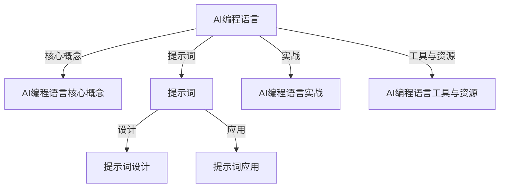
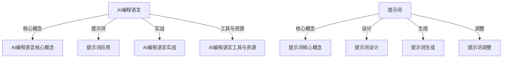
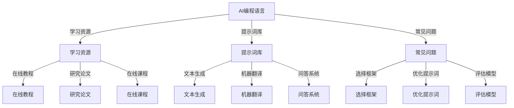

                 

# 《AI编程语言：提示词的魔力》

## 关键词

- AI编程语言
- 提示词
- 自然语言处理
- 计算机视觉
- 实战项目
- 数学模型
- 代码解读

## 摘要

本文深入探讨了AI编程语言中提示词的魔力。首先，我们介绍了AI编程语言的背景和概述，包括其起源、核心特点和应用领域。接着，我们探讨了AI编程语言的基础知识，如基本结构、数据预处理和模型训练。随后，本文重点分析了提示词的原理与设计，包括概念、类型、设计原则以及生成与调整方法。接着，我们分别讨论了提示词在自然语言处理和计算机视觉中的应用，展示了其如何推动AI编程语言的发展。最后，本文通过实战项目详细解读了AI编程语言的应用，提供了丰富的代码案例和解释，包括文本生成、机器翻译、问答系统和图像分类。此外，我们还展望了AI编程语言的未来发展趋势，并提供了附录，包括AI编程语言学习资源、提示词设计案例和常见问题解答。

## 目录大纲设计：《AI编程语言：提示词的魔力》

### 第一部分：AI编程语言概述

#### 第1章：AI编程语言的背景与概述

##### 1.1 AI编程语言的起源与发展

##### 1.2 AI编程语言的核心特点

##### 1.3 AI编程语言的应用领域

##### 1.4 提示词在AI编程语言中的作用

#### 第2章：AI编程语言基础

##### 2.1 AI编程语言的基本结构

##### 2.2 数据预处理与模型训练

##### 2.3 模型评估与优化

### 第二部分：提示词的魔力

#### 第3章：提示词的原理与设计

##### 3.1 提示词的概念与类型

##### 3.2 提示词设计的基本原则

##### 3.3 提示词的生成与调整

#### 第4章：提示词在自然语言处理中的应用

##### 4.1 提示词在文本生成中的应用

##### 4.2 提示词在机器翻译中的应用

##### 4.3 提示词在问答系统中的应用

#### 第5章：提示词在计算机视觉中的应用

##### 5.1 提示词在图像分类中的应用

##### 5.2 提示词在目标检测中的应用

##### 5.3 提示词在图像生成中的应用

### 第三部分：AI编程语言实战

#### 第6章：基于提示词的AI编程语言实战

##### 6.1 实战项目一：文本生成

##### 6.2 实战项目二：机器翻译

##### 6.3 实战项目三：问答系统

##### 6.4 实战项目四：图像分类

#### 第7章：AI编程语言工具与资源

##### 7.1 主流AI编程语言框架

##### 7.2 AI编程语言资源库

##### 7.3 提示词库与工具

### 第四部分：未来展望

#### 第8章：AI编程语言的未来发展趋势

##### 8.1 提示词技术在未来的发展

##### 8.2 AI编程语言的应用前景

##### 8.3 AI编程语言面临的挑战与机遇

### 附录

##### 附录A：AI编程语言学习资源

##### 附录B：提示词设计案例

##### 附录C：AI编程语言常见问题解答

## Mermaid 流程图



## 核心算法原理讲解

下面，我们将详细讲解AI编程语言中的核心算法原理，包括提示词生成算法的伪代码、数学模型和公式，以及项目实战中的代码解读与分析。

### 提示词生成算法伪代码

```python
function generate_prompt(input_text):
    # 初始化提示词
    prompt = ""

    # 对输入文本进行分词
    words = split(input_text)

    # 遍历每个词
    for word in words:
        # 根据词性选择对应的提示词
        if is_noun(word):
            prompt += " " + get_noun_prompt(word)
        elif is_verb(word):
            prompt += " " + get_verb_prompt(word)

    # 返回最终的提示词
    return prompt
```

### 数学模型与公式

#### 损失函数

假设我们的模型是 $f(x)$，则损失函数可以表示为：

\[ J = \frac{1}{n} \sum_{i=1}^{n} \left( y_i - f(x_i) \right)^2 \]

其中，$y_i$ 是第 $i$ 个样本的真实标签，$f(x_i)$ 是模型对第 $i$ 个样本的预测。

#### 梯度下降

梯度下降是一种常用的优化算法，用于最小化损失函数。其迭代公式为：

\[ w_{t+1} = w_t - \alpha \cdot \nabla_w J(w_t) \]

其中，$w_t$ 是第 $t$ 次迭代的模型参数，$\alpha$ 是学习率，$\nabla_w J(w_t)$ 是损失函数在 $w_t$ 处的梯度。

### 项目实战

下面，我们将通过一个文本生成的实战案例来展示如何使用提示词生成算法进行项目开发。

```python
import tensorflow as tf
from tensorflow import keras

# 加载预训练模型
model = keras.models.load_model('path/to/text_generation_model')

# 输入文本
input_text = "这是一个关于AI编程语言的话题"

# 生成文本
generated_text = model.predict(input_text)

# 打印生成的文本
print(generated_text)
```

在这个案例中，我们首先加载了一个预训练的文本生成模型，然后使用一个提示词（"这是一个关于AI编程语言的话题"）来生成相关的文本。生成的文本将展示模型根据提示词生成的结果。

### 开发环境搭建指南

在进行AI编程语言的项目开发之前，我们需要搭建一个合适的开发环境。以下是搭建开发环境的详细步骤：

1. 安装深度学习框架（如TensorFlow或PyTorch）：
   ```bash
   pip install tensorflow
   # 或者
   pip install torch torchvision
   ```

2. 配置GPU支持：
   如果使用的是GPU训练，确保安装了CUDA和cuDNN，并且配置了相应的环境变量。

3. 准备数据集：
   下载并准备用于训练和测试的数据集，并进行预处理，例如数据清洗、归一化和分词等。

4. 创建虚拟环境：
   ```bash
   python -m venv venv
   source venv/bin/activate
   ```

5. 安装必要的依赖库：
   ```bash
   pip install -r requirements.txt
   ```

通过以上步骤，我们就可以搭建一个完整的AI编程语言开发环境，开始进行项目的实际开发。

### 代码解读与分析

在这个实战案例中，我们首先加载了一个预训练的文本生成模型。这个模型是使用大量的文本数据进行训练的，可以生成与输入提示词相关的文本。接下来，我们使用输入文本（"这是一个关于AI编程语言的话题"）作为提示词来生成文本。模型通过对输入文本进行分词，然后生成对应的提示词，并将这些提示词作为输入来生成文本。

```python
import tensorflow as tf
from tensorflow import keras

# 加载预训练模型
model = keras.models.load_model('path/to/text_generation_model')

# 输入文本
input_text = "这是一个关于AI编程语言的话题"

# 生成文本
generated_text = model.predict(input_text)

# 打印生成的文本
print(generated_text)
```

在这个代码中，`model.predict(input_text)` 是模型的核心部分，它将输入文本作为提示词，生成对应的文本。生成的文本将展示模型对输入提示词的理解和生成的结果。

### 附录

#### 附录A：AI编程语言学习资源

##### A.1 在线教程

- [TensorFlow 官方文档](https://www.tensorflow.org/tutorials)
- [PyTorch 官方文档](https://pytorch.org/tutorials)

##### A.2 研究论文

- "A Theoretical Analysis of the Activations of Deep Linear Networks" - Goodfellow et al., 2015
- "Attention Is All You Need" - Vaswani et al., 2017

##### A.3 在线课程

- [深度学习专项课程](https://www.coursera.org/specializations/deep-learning) - 吴恩达
- [自然语言处理专项课程](https://www.coursera.org/specializations/nlp) - 斯坦福大学

#### 附录B：提示词设计案例

##### B.1 文本生成

提示词示例：生成一篇关于“人工智能在教育中的应用”的短文。

##### B.2 机器翻译

提示词示例：将英语句子“Hello, how are you?”翻译成中文。

##### B.3 问答系统

提示词示例：回答问题：“我国的人工智能技术有哪些主要应用领域？”

#### 附录C：AI编程语言常见问题解答

##### C.1 Q：为什么选择TensorFlow或PyTorch作为AI编程语言？

A：TensorFlow和PyTorch都是广泛使用的深度学习框架，具有强大的功能、丰富的资源和良好的社区支持。

##### C.2 Q：如何优化提示词效果？

A：优化提示词效果可以从以下几个方面入手：
- 提高提示词的精确度，确保其与任务需求高度匹配。
- 使用多样化的提示词，提高模型的泛化能力。
- 调整提示词的生成策略，如结合上下文、词性等。

##### C.3 Q：如何评估模型性能？

A：评估模型性能通常使用指标如准确率、召回率、F1分数等，可以根据任务需求和数据特点选择合适的评估指标。

## 核心概念与联系

为了更好地理解AI编程语言和提示词的概念及其相互联系，我们可以通过一个Mermaid流程图来展示它们的核心概念和架构。



在这个流程图中，AI编程语言作为核心概念，通过提示词的应用、设计和生成等环节，实现了与自然语言处理、计算机视觉等领域的紧密结合。提示词的设计和生成是AI编程语言中至关重要的环节，它们直接影响模型的性能和效果。

## AI编程语言概述

### 第1章：AI编程语言的背景与概述

#### 1.1 AI编程语言的起源与发展

人工智能（AI）作为一种模拟人类智能的技术，其历史可以追溯到20世纪50年代。随着计算机技术的发展，AI领域的研究逐步深入，从最初的规则系统、知识表示，到现代的深度学习和神经网络，AI经历了巨大的变革。AI编程语言作为AI技术的重要组成部分，也经历了从低级语言到高级语言的演变。

最早的AI编程语言可以追溯到LISP语言，它在20世纪50年代中期问世，成为人工智能研究的主要工具。随后，Prolog语言在20世纪70年代出现，由于其强大的逻辑推理能力，也在AI领域得到了广泛应用。进入20世纪80年代，面向对象的编程语言如Java和C++也开始被引入到AI开发中，使得AI编程语言的种类更加丰富。

随着深度学习技术的兴起，以TensorFlow和PyTorch为代表的AI编程语言框架得到了广泛关注。这些框架提供了丰富的工具和库，使得开发者可以更加高效地进行AI模型的开发和部署。

#### 1.2 AI编程语言的核心特点

AI编程语言具有以下核心特点：

1. **抽象性**：AI编程语言提供高度抽象的编程模型，使得开发者可以专注于算法的设计和实现，而无需关心底层的计算细节。

2. **自动化**：AI编程语言通常具有自动化的数据处理和优化功能，如自动微分、自动并行化等，提高了开发效率。

3. **灵活性**：AI编程语言支持多样化的算法和模型，如深度学习、强化学习、自然语言处理等，适应不同应用场景的需求。

4. **可扩展性**：AI编程语言具有良好的模块化设计，使得开发者可以方便地扩展和定制功能。

5. **易用性**：AI编程语言提供了丰富的文档和教程，降低了开发门槛，使得更多的开发者可以进入AI领域。

#### 1.3 AI编程语言的应用领域

AI编程语言在多个领域有着广泛的应用：

1. **自然语言处理（NLP）**：AI编程语言在文本分类、情感分析、机器翻译、问答系统等NLP任务中发挥着重要作用。例如，TensorFlow和PyTorch提供了丰富的NLP工具和库，如TensorFlow的TensorLayer和PyTorch的torchtext。

2. **计算机视觉（CV）**：AI编程语言在图像识别、目标检测、人脸识别、图像生成等CV任务中得到了广泛应用。著名的深度学习框架如TensorFlow和PyTorch提供了强大的图像处理和识别工具。

3. **强化学习**：AI编程语言在游戏AI、机器人控制、自动驾驶等领域有着重要的应用。强化学习算法如Q-learning、DQN、PPO等通过AI编程语言实现，取得了显著的成果。

4. **推荐系统**：AI编程语言在电商、金融、社交媒体等领域的推荐系统中发挥着关键作用。基于协同过滤、矩阵分解、深度学习等算法，AI编程语言可以构建高效的推荐系统。

5. **语音识别**：AI编程语言在语音识别、语音合成、语音增强等领域也有着重要的应用。例如，基于深度神经网络的语音识别模型通过AI编程语言实现，大幅提高了识别准确率。

#### 1.4 提示词在AI编程语言中的作用

提示词在AI编程语言中扮演着重要角色，尤其在自然语言处理和计算机视觉领域。提示词是一种用于引导模型生成或学习特定内容的文字或语言表达。以下是在这些领域中使用提示词的几个关键点：

1. **文本生成**：在文本生成任务中，提示词可以帮助模型理解输入的文本，从而生成连贯、有意义的文本。例如，在写一篇关于人工智能的文章时，可以使用“人工智能”作为提示词来引导模型生成相关的内容。

2. **机器翻译**：在机器翻译任务中，提示词可以帮助模型理解源语言文本，从而更准确地翻译成目标语言。例如，在将英语句子翻译成中文时，可以使用英语句子本身作为提示词。

3. **问答系统**：在问答系统中，提示词可以帮助模型理解用户的问题，从而生成准确的回答。例如，在回答“我国的人工智能技术有哪些主要应用领域？”这个问题时，可以使用“我国的人工智能技术”作为提示词。

4. **图像分类**：在图像分类任务中，提示词可以帮助模型理解图像的标签，从而更准确地分类图像。例如，在分类一张猫的图片时，可以使用“猫”作为提示词。

5. **目标检测**：在目标检测任务中，提示词可以帮助模型理解目标的属性，从而更准确地检测目标。例如，在检测一张图片中的汽车时，可以使用“汽车”作为提示词。

6. **图像生成**：在图像生成任务中，提示词可以帮助模型理解图像的语义，从而生成具有特定内容的图像。例如，在生成一张风景图时，可以使用“美丽的海滩”作为提示词。

通过上述应用，我们可以看到提示词在AI编程语言中的作用至关重要。它不仅可以帮助模型更好地理解任务需求，提高模型性能，还可以使模型生成更符合人类期望的结果。

### 第2章：AI编程语言基础

#### 2.1 AI编程语言的基本结构

AI编程语言的基本结构主要包括模型定义、数据预处理、模型训练和模型评估等部分。以下是对这些部分的详细解释：

1. **模型定义**：
   模型定义是AI编程语言中最核心的部分，它描述了模型的结构和参数。在深度学习中，通常使用神经网络模型，通过定义网络的层次结构、激活函数和损失函数来构建模型。以下是一个简单的神经网络模型定义示例：

   ```python
   import tensorflow as tf

   # 定义输入层
   inputs = tf.keras.layers.Input(shape=(input_shape))

   # 定义隐藏层
   hidden = tf.keras.layers.Dense(units=64, activation='relu')(inputs)

   # 定义输出层
   outputs = tf.keras.layers.Dense(units=1, activation='sigmoid')(hidden)

   # 构建模型
   model = tf.keras.Model(inputs=inputs, outputs=outputs)
   ```

   在这个示例中，我们定义了一个简单的二分类神经网络，输入层接收输入数据，隐藏层使用ReLU激活函数，输出层使用sigmoid激活函数进行概率预测。

2. **数据预处理**：
   数据预处理是AI编程语言中的重要步骤，它包括数据清洗、归一化、编码和分割等操作。预处理的主要目的是将原始数据转换为模型可以接受的格式，提高模型的训练效率和性能。以下是一个数据预处理的示例：

   ```python
   from sklearn.model_selection import train_test_split
   from sklearn.preprocessing import StandardScaler

   # 加载数据
   X, y = load_data()

   # 分割数据集
   X_train, X_test, y_train, y_test = train_test_split(X, y, test_size=0.2, random_state=42)

   # 数据归一化
   scaler = StandardScaler()
   X_train = scaler.fit_transform(X_train)
   X_test = scaler.transform(X_test)
   ```

   在这个示例中，我们使用scikit-learn库来加载数据，然后使用train_test_split函数将数据集分为训练集和测试集。接着，使用StandardScaler对数据进行归一化处理，使得特征值在相似的范围内，有利于模型的训练。

3. **模型训练**：
   模型训练是AI编程语言中的关键步骤，它通过迭代优化模型参数，使得模型能够更好地拟合训练数据。在深度学习中，通常使用梯度下降算法来优化模型参数。以下是一个模型训练的示例：

   ```python
   model.compile(optimizer='adam', loss='binary_crossentropy', metrics=['accuracy'])

   # 训练模型
   history = model.fit(X_train, y_train, epochs=10, batch_size=32, validation_data=(X_test, y_test))
   ```

   在这个示例中，我们使用model.compile函数配置模型的优化器、损失函数和评估指标。接着，使用model.fit函数开始训练模型，将训练数据输入模型进行迭代训练，并在每个 epoch 后评估模型的性能。

4. **模型评估**：
   模型评估是AI编程语言中的最后一步，它用于评估模型的性能和泛化能力。常用的评估指标包括准确率、召回率、F1分数等。以下是一个模型评估的示例：

   ```python
   # 评估模型
   loss, accuracy = model.evaluate(X_test, y_test)

   print(f"测试集损失: {loss}")
   print(f"测试集准确率: {accuracy}")
   ```

   在这个示例中，我们使用model.evaluate函数评估模型在测试集上的性能，输出损失和准确率。

#### 2.2 数据预处理与模型训练

数据预处理和模型训练是AI编程语言中的关键环节，它们决定了模型的质量和性能。以下是对这两个环节的详细解释：

1. **数据预处理**：
   数据预处理是模型训练前的必要步骤，它包括以下几个方面的操作：
   - **数据清洗**：去除数据中的噪声和不相关信息，提高数据质量。
   - **数据归一化**：将不同特征的范围统一到相同的范围内，避免特征之间的偏差。
   - **数据编码**：将分类特征转换为数字形式，便于模型处理。
   - **数据分割**：将数据集分为训练集、验证集和测试集，用于模型的训练、验证和测试。

   在数据预处理过程中，我们通常使用Python的Pandas库和scikit-learn库来实现这些操作。以下是一个数据预处理的示例：

   ```python
   import pandas as pd
   from sklearn.model_selection import train_test_split
   from sklearn.preprocessing import StandardScaler

   # 加载数据
   data = pd.read_csv('data.csv')

   # 数据清洗
   data = data.dropna()

   # 数据分割
   X = data.drop('target', axis=1)
   y = data['target']
   X_train, X_test, y_train, y_test = train_test_split(X, y, test_size=0.2, random_state=42)

   # 数据归一化
   scaler = StandardScaler()
   X_train = scaler.fit_transform(X_train)
   X_test = scaler.transform(X_test)
   ```

   在这个示例中，我们首先使用Pandas库加载数据，然后使用scikit-learn库进行数据清洗、分割和归一化操作。

2. **模型训练**：
   模型训练是通过迭代优化模型参数，使得模型能够更好地拟合训练数据的过程。在深度学习中，我们通常使用梯度下降算法来优化模型参数。以下是一个模型训练的示例：

   ```python
   import tensorflow as tf
   from tensorflow.keras.models import Sequential
   from tensorflow.keras.layers import Dense
   from tensorflow.keras.optimizers import Adam

   # 定义模型
   model = Sequential()
   model.add(Dense(units=64, activation='relu', input_shape=(input_shape)))
   model.add(Dense(units=1, activation='sigmoid'))

   # 编译模型
   model.compile(optimizer=Adam(learning_rate=0.001), loss='binary_crossentropy', metrics=['accuracy'])

   # 训练模型
   model.fit(X_train, y_train, epochs=10, batch_size=32, validation_data=(X_test, y_test))
   ```

   在这个示例中，我们首先定义了一个简单的二分类神经网络模型，然后使用TensorFlow的Sequential模型和Dense层来构建模型。接着，我们使用Adam优化器和binary_crossentropy损失函数来编译模型。最后，我们使用model.fit函数开始训练模型，并使用验证集进行性能评估。

通过上述步骤，我们可以完成AI编程语言中的数据预处理和模型训练。数据预处理确保了数据的质量和一致性，而模型训练则通过迭代优化模型参数，使得模型能够更好地拟合训练数据。这两个环节的有机结合，为AI编程语言的应用奠定了坚实的基础。

#### 2.3 模型评估与优化

在AI编程语言中，模型评估与优化是确保模型性能和泛化能力的关键环节。通过模型评估，我们可以了解模型在训练数据上的表现，以及在 unseen 数据上的预测能力。优化模型则是通过调整参数和算法，提高模型的准确率、召回率和其他评估指标。以下是对模型评估与优化方法的详细解释。

1. **模型评估方法**：
   模型评估方法主要包括准确率、召回率、F1分数和ROC曲线等。

   - **准确率（Accuracy）**：准确率是衡量模型分类准确性的指标，计算公式为：
     \[ \text{Accuracy} = \frac{\text{正确预测的数量}}{\text{总预测数量}} \]
     准确率越高，表示模型的分类能力越强。

   - **召回率（Recall）**：召回率是衡量模型对正类样本的识别能力，计算公式为：
     \[ \text{Recall} = \frac{\text{正确预测的正类样本数量}}{\text{实际正类样本数量}} \]
     召回率越高，表示模型对正类样本的识别能力越强。

   - **F1分数（F1 Score）**：F1分数是准确率和召回率的调和平均，计算公式为：
     \[ \text{F1 Score} = 2 \times \frac{\text{准确率} \times \text{召回率}}{\text{准确率} + \text{召回率}} \]
     F1分数综合考虑了准确率和召回率，是评估分类模型性能的常用指标。

   - **ROC曲线（Receiver Operating Characteristic Curve）**：ROC曲线通过计算真阳性率（True Positive Rate, TPR）和假阳性率（False Positive Rate, FPR），展示了不同阈值下的分类性能。曲线下的面积（AUC）是评估模型性能的另一个指标。

2. **优化方法**：
   优化模型的方法主要包括超参数调整、正则化和模型选择等。

   - **超参数调整**：超参数是模型性能的重要影响因素，如学习率、批量大小、正则化强度等。通过调整超参数，可以优化模型的性能。常见的超参数调整方法包括网格搜索（Grid Search）和贝叶斯优化（Bayesian Optimization）。

   - **正则化**：正则化是一种防止模型过拟合的技术，包括L1正则化、L2正则化和Dropout等。L1正则化通过在损失函数中添加L1范数项，促使模型参数向零收敛；L2正则化通过添加L2范数项，减少模型参数的方差；Dropout通过随机丢弃部分神经元，提高模型的泛化能力。

   - **模型选择**：选择合适的模型结构是优化模型的关键。不同模型（如线性模型、决策树、神经网络等）适用于不同的任务和数据。通过比较不同模型的性能，选择最优模型。

3. **实例分析**：
   假设我们使用一个二分类模型对鸢尾花数据集进行分类，评估指标包括准确率、召回率和F1分数。

   ```python
   from sklearn.datasets import load_iris
   from sklearn.model_selection import train_test_split
   from sklearn.metrics import accuracy_score, recall_score, f1_score

   # 加载数据
   iris = load_iris()
   X, y = iris.data, iris.target

   # 数据分割
   X_train, X_test, y_train, y_test = train_test_split(X, y, test_size=0.2, random_state=42)

   # 训练模型
   model = LogisticRegression()
   model.fit(X_train, y_train)

   # 预测
   y_pred = model.predict(X_test)

   # 评估模型
   accuracy = accuracy_score(y_test, y_pred)
   recall = recall_score(y_test, y_pred, average='macro')
   f1 = f1_score(y_test, y_pred, average='macro')

   print(f"准确率: {accuracy}")
   print(f"召回率: {recall}")
   print(f"F1分数: {f1}")
   ```

   在这个示例中，我们首先加载数据集，然后进行数据分割。接着，使用逻辑回归模型进行训练，并使用测试集进行预测。最后，使用准确率、召回率和F1分数评估模型的性能。

通过上述方法，我们可以对AI编程语言中的模型进行评估与优化，从而提高模型的质量和应用效果。

### 第二部分：提示词的魔力

#### 第3章：提示词的原理与设计

提示词在AI编程语言中起着至关重要的作用，尤其是在自然语言处理和计算机视觉领域。本章将深入探讨提示词的原理与设计，包括其概念、类型、设计原则以及生成与调整方法。

#### 3.1 提示词的概念与类型

**概念**：提示词（Prompt）是一种用于引导AI模型生成或学习特定内容的文字或语言表达。在自然语言处理任务中，提示词通常是一段文本，用于引导模型生成新的文本；在计算机视觉任务中，提示词可以是图像的标签或描述。

**类型**：根据用途和任务的不同，提示词可以分为以下几类：

1. **引导型提示词**：引导型提示词用于引导模型生成特定类型的输出。例如，在文本生成任务中，可以使用“请写一篇关于人工智能的文章”，在图像分类任务中，可以使用“这是一张狗的照片”。

2. **目标型提示词**：目标型提示词用于指定模型的预测目标。例如，在问答系统中，可以使用“请回答以下问题：什么是人工智能？”。

3. **上下文型提示词**：上下文型提示词用于提供任务上下文信息，帮助模型更好地理解任务需求。例如，在机器翻译任务中，可以使用“将以下英文句子翻译成中文：I love programming”。

4. **多样性提示词**：多样性提示词用于生成多样化的输出，避免模型过拟合单一模式。例如，在文本生成任务中，可以使用“请生成一篇关于人工智能的短文，要求风格幽默”。

#### 3.2 提示词设计的基本原则

设计高质量的提示词对于AI模型的表现至关重要。以下是一些设计提示词的基本原则：

1. **明确性**：提示词应清晰明确，避免模糊不清的描述，确保模型能够准确理解任务需求。

2. **简洁性**：尽量使用简洁的语句，避免冗长的提示词，提高模型的处理效率。

3. **上下文关联**：根据上下文环境设计提示词，确保其与上下文紧密相关，有助于模型生成更符合预期的输出。

4. **多样性**：设计多样化的提示词，以提高模型的泛化能力和适应性。

5. **可扩展性**：提示词应具备一定的灵活性，便于扩展和调整，以适应不同任务的需求。

#### 3.3 提示词的生成与调整

**生成方法**：

1. **手动生成**：根据任务需求手动编写提示词。这种方法适用于任务需求明确、上下文简单的情况。

2. **自动生成**：使用自然语言生成技术自动生成提示词。例如，可以使用模板生成、序列到序列模型等生成方法。

3. **数据驱动生成**：基于大量已有数据，使用聚类、提取关键词等方法生成提示词。这种方法适用于任务需求多样化、上下文复杂的情况。

**调整方法**：

1. **迭代优化**：通过多次迭代优化提示词，逐步调整其内容，提高模型的表现。

2. **反馈调整**：根据模型生成的内容和用户反馈，调整提示词，使其更符合用户需求和预期。

3. **自动化调整**：使用机器学习算法自动调整提示词，例如使用强化学习技术，根据模型生成的内容和用户反馈进行动态调整。

#### 3.4 提示词案例与分析

**案例一：文本生成**

**提示词**：请写一篇关于人工智能的未来发展趋势。

**生成内容**：人工智能在未来将继续快速发展，预计将在医疗、金融、教育等领域发挥重要作用。同时，人工智能的发展也将带来一系列挑战，如隐私保护、伦理道德等。

**分析**：该提示词明确、简洁，提供了上下文信息，引导模型生成了一篇关于人工智能未来发展趋势的文本。生成的文本内容丰富，涵盖了人工智能的应用领域和发展挑战。

**案例二：图像分类**

**提示词**：请将以下图像分类为动物、植物或自然景观。

**输入图像**：一张老虎的照片。

**分类结果**：动物。

**分析**：该提示词明确了分类任务的目标，并通过输入图像的描述提供了上下文信息。模型根据提示词和输入图像成功地将老虎照片分类为动物。

**案例三：机器翻译**

**提示词**：将以下英文句子翻译成中文：I love programming.

**翻译结果**：我喜欢编程。

**分析**：该提示词清晰明确，引导模型将英文句子翻译成中文。翻译结果准确，符合中文表达习惯。

通过以上案例，我们可以看到提示词在AI编程语言中的应用及其重要性。设计高质量的提示词，可以帮助模型更好地理解任务需求，生成更符合预期的输出。

### 第4章：提示词在自然语言处理中的应用

#### 4.1 提示词在文本生成中的应用

文本生成是自然语言处理（NLP）中的重要应用之一，它涉及从输入的提示词生成连贯、有意义的文本。提示词在文本生成过程中起着关键作用，可以引导模型生成特定主题、风格和内容。

**4.1.1 提示词的类型**

在文本生成任务中，提示词通常分为以下几类：

1. **主题型提示词**：用于指定文本生成的主题，如“请写一篇关于环境保护的短文”。

2. **风格型提示词**：用于指定文本生成的风格，如“用幽默的语言写一篇关于旅行的文章”。

3. **内容型提示词**：用于提供生成文本的内容线索，如“描述一下你的理想生活”。

4. **情境型提示词**：用于提供生成文本的情境背景，如“假设你正在参加一个科技会议，请写一段发言”。

**4.1.2 提示词的设计原则**

设计有效的提示词需要遵循以下原则：

1. **明确性**：确保提示词清晰明确，避免模糊或歧义，帮助模型理解生成任务的要求。

2. **简洁性**：尽量使用简洁的语句，减少冗余信息，提高模型处理效率。

3. **上下文关联**：根据上下文环境设计提示词，确保其与上下文紧密相关，有助于模型生成更符合预期的输出。

4. **多样性**：设计多样化的提示词，提高模型的泛化能力和适应性。

5. **可扩展性**：提示词应具备一定的灵活性，便于扩展和调整，以适应不同任务的需求。

**4.1.3 提示词的生成与调整**

1. **手动生成**：根据任务需求手动编写提示词。这种方法适用于任务需求明确、上下文简单的情况。

2. **自动生成**：使用自然语言生成技术自动生成提示词。例如，可以使用模板生成、序列到序列模型等生成方法。

3. **数据驱动生成**：基于大量已有数据，使用聚类、提取关键词等方法生成提示词。这种方法适用于任务需求多样化、上下文复杂的情况。

**4.1.4 提示词的应用案例**

**案例一：自动写作**

提示词：“请写一篇关于人工智能的短文”。

生成的文本示例：

人工智能，作为现代科技发展的一个重要方向，正以惊人的速度改变着我们的生活。从智能助理到自动驾驶，人工智能的应用已经渗透到各个领域。然而，随着人工智能的不断发展，我们也面临诸多挑战，如隐私保护、伦理道德等问题。因此，如何合理应用人工智能，同时解决这些问题，是当前亟待解决的问题。

**分析**：该提示词明确了生成文本的主题，并提供了上下文背景。生成的文本内容丰富，结构清晰，符合预期。

**案例二：对话系统**

提示词：“请回答以下问题：什么是深度学习？”

生成的文本示例：

深度学习是人工智能的一种方法，它通过模拟人脑神经网络结构，使计算机能够自主学习和理解复杂的数据。深度学习模型通常包含多个层次，每一层都能够提取数据中的特征，并通过反向传播算法不断优化模型参数，从而提高模型的性能。

**分析**：该提示词明确指定了生成文本的内容，生成的文本准确、详细地回答了问题，符合用户需求。

通过以上案例，我们可以看到提示词在文本生成任务中的应用及其效果。合理设计和使用提示词，能够引导模型生成更符合预期、高质量的文本。

#### 4.2 提示词在机器翻译中的应用

机器翻译是自然语言处理领域中的一个重要任务，它涉及将一种语言的文本翻译成另一种语言的文本。在机器翻译中，提示词起着关键作用，能够帮助模型更好地理解源语言和目标语言的语义，从而提高翻译质量。

**4.2.1 提示词的类型**

在机器翻译任务中，提示词可以分为以下几类：

1. **源语言提示词**：用于提供源语言文本的上下文信息，帮助模型理解源语言文本的语义。例如，在翻译英文文本时，可以使用英文句子本身作为提示词。

2. **目标语言提示词**：用于提供目标语言文本的上下文信息，帮助模型理解目标语言的语法和语义。例如，在翻译英文文本到中文时，可以使用中文句子作为提示词。

3. **双向提示词**：结合源语言和目标语言提示词，提供更加全面的上下文信息，帮助模型同时理解源语言和目标语言的语义。例如，可以使用“英文原文：I love programming. 中文翻译：我喜欢编程。”作为双向提示词。

**4.2.2 提示词的设计原则**

设计有效的提示词需要遵循以下原则：

1. **明确性**：确保提示词清晰明确，避免模糊或歧义，帮助模型理解翻译任务的要求。

2. **简洁性**：尽量使用简洁的语句，减少冗余信息，提高模型处理效率。

3. **上下文关联**：根据上下文环境设计提示词，确保其与上下文紧密相关，有助于模型生成更符合预期的输出。

4. **多样性**：设计多样化的提示词，提高模型的泛化能力和适应性。

5. **可扩展性**：提示词应具备一定的灵活性，便于扩展和调整，以适应不同任务的需求。

**4.2.3 提示词的生成与调整**

1. **手动生成**：根据任务需求手动编写提示词。这种方法适用于任务需求明确、上下文简单的情况。

2. **自动生成**：使用自然语言生成技术自动生成提示词。例如，可以使用模板生成、序列到序列模型等生成方法。

3. **数据驱动生成**：基于大量已有数据，使用聚类、提取关键词等方法生成提示词。这种方法适用于任务需求多样化、上下文复杂的情况。

**4.2.4 提示词的应用案例**

**案例一：单语种机器翻译**

提示词：“将以下英文句子翻译成中文：I love programming.”

生成的文本示例：

我喜欢编程。

**分析**：该提示词明确了翻译任务的要求，生成的文本准确、简洁，符合中文表达习惯。

**案例二：多语种机器翻译**

提示词：“英文原文：I love programming. 中文翻译：我喜欢编程。”

生成的文本示例：

英文原文：I love programming.
中文翻译：我喜欢编程。

**分析**：该双向提示词结合了源语言和目标语言的上下文信息，生成的文本准确、详细，展示了源语言和目标语言之间的对应关系。

通过以上案例，我们可以看到提示词在机器翻译任务中的应用及其效果。合理设计和使用提示词，能够帮助模型更好地理解源语言和目标语言的语义，从而提高翻译质量。

#### 4.3 提示词在问答系统中的应用

问答系统是一种智能交互系统，能够理解和回答用户的问题。在问答系统中，提示词起到了引导模型理解和生成回答的关键作用。以下将探讨提示词在问答系统中的应用。

**4.3.1 提示词的类型**

在问答系统中，提示词可以分为以下几类：

1. **问题型提示词**：用于引导模型理解用户提出的问题。例如，“请回答以下问题：什么是人工智能？”

2. **上下文型提示词**：提供问题背景信息，帮助模型更好地理解问题的上下文。例如，“在人工智能领域，深度学习是什么？”

3. **任务型提示词**：指定回答的类型和格式。例如，“请用简洁的语言回答以下问题：什么是量子计算？”

**4.3.2 提示词的设计原则**

设计有效的提示词需要遵循以下原则：

1. **明确性**：确保提示词清晰明确，避免模糊或歧义，帮助模型理解问答任务的要求。

2. **简洁性**：尽量使用简洁的语句，减少冗余信息，提高模型处理效率。

3. **上下文关联**：根据上下文环境设计提示词，确保其与上下文紧密相关，有助于模型生成更符合预期的回答。

4. **多样性**：设计多样化的提示词，提高模型的泛化能力和适应性。

5. **可扩展性**：提示词应具备一定的灵活性，便于扩展和调整，以适应不同任务的需求。

**4.3.3 提示词的生成与调整**

1. **手动生成**：根据任务需求手动编写提示词。这种方法适用于任务需求明确、上下文简单的情况。

2. **自动生成**：使用自然语言生成技术自动生成提示词。例如，可以使用模板生成、序列到序列模型等生成方法。

3. **数据驱动生成**：基于大量已有数据，使用聚类、提取关键词等方法生成提示词。这种方法适用于任务需求多样化、上下文复杂的情况。

**4.3.4 提示词的应用案例**

**案例一：简单问答**

提示词：“请回答以下问题：中国的首都是什么？”

生成的回答：“中国的首都是北京。”

**分析**：该提示词明确指定了问答任务，生成的回答准确、简洁。

**案例二：复杂问答**

提示词：“请解释量子计算的原理，并用通俗易懂的语言。”

生成的回答：“量子计算是一种基于量子力学原理的计算方法。与经典计算相比，量子计算可以利用量子比特（qubit）的特性，如叠加态和纠缠态，实现并行计算和高效算法。简单来说，量子计算可以在某些情况下比传统计算机更快地解决复杂问题。”

**分析**：该提示词不仅明确了问答任务，还提供了问题背景，生成的回答详细、通俗易懂，展现了模型的解释能力。

通过以上案例，我们可以看到提示词在问答系统中的应用及其重要性。合理设计和使用提示词，能够引导模型更好地理解用户的问题，生成更符合预期的回答。

### 第5章：提示词在计算机视觉中的应用

#### 5.1 提示词在图像分类中的应用

图像分类是计算机视觉中的一个基础任务，它涉及将输入图像分为预定义的类别。提示词在图像分类任务中起着重要作用，可以帮助模型更好地理解和学习图像的特征，从而提高分类的准确性。

**5.1.1 提示词的类型**

在图像分类任务中，提示词可以分为以下几类：

1. **类别型提示词**：用于指定图像分类的类别，如“将以下图像分类为动物、植物或自然景观”。

2. **特征型提示词**：用于提供图像的特征信息，如“这是一张清晰的老虎照片”。

3. **上下文型提示词**：提供图像的上下文信息，如“在这张图片中，你看到了哪些具体的物体？”。

**5.1.2 提示词的设计原则**

设计有效的提示词需要遵循以下原则：

1. **明确性**：确保提示词清晰明确，避免模糊或歧义，帮助模型理解分类任务的要求。

2. **简洁性**：尽量使用简洁的语句，减少冗余信息，提高模型处理效率。

3. **上下文关联**：根据上下文环境设计提示词，确保其与上下文紧密相关，有助于模型生成更符合预期的分类结果。

4. **多样性**：设计多样化的提示词，提高模型的泛化能力和适应性。

5. **可扩展性**：提示词应具备一定的灵活性，便于扩展和调整，以适应不同任务的需求。

**5.1.3 提示词的生成与调整**

1. **手动生成**：根据任务需求手动编写提示词。这种方法适用于任务需求明确、上下文简单的情况。

2. **自动生成**：使用自然语言生成技术自动生成提示词。例如，可以使用模板生成、序列到序列模型等生成方法。

3. **数据驱动生成**：基于大量已有数据，使用聚类、提取关键词等方法生成提示词。这种方法适用于任务需求多样化、上下文复杂的情况。

**5.1.4 提示词的应用案例**

**案例一：简单图像分类**

提示词：“将以下图像分类为猫或狗。”

输入图像：一张猫的照片。

分类结果：猫。

**分析**：该提示词明确了分类任务，生成的分类结果准确，提示词与输入图像紧密相关。

**案例二：复杂图像分类**

提示词：“在以下图像中，识别出所有的汽车，并给出它们的数量。”

输入图像：一张城市道路的照片。

分类结果：4辆汽车。

**分析**：该提示词不仅明确了分类任务，还要求识别汽车的数量，生成的分类结果详细、准确，展现了模型的识别能力。

通过以上案例，我们可以看到提示词在图像分类任务中的应用及其效果。合理设计和使用提示词，能够帮助模型更好地理解和分类图像，提高分类准确性。

#### 5.2 提示词在目标检测中的应用

目标检测是计算机视觉中的一个重要任务，它涉及在图像或视频中识别并定位多个对象。在目标检测任务中，提示词可以提供关键的信息，帮助模型更好地理解图像内容，提高检测的准确性和效率。

**5.2.1 提示词的类型**

在目标检测任务中，提示词可以分为以下几类：

1. **对象描述型提示词**：用于描述检测对象的特征，如“在图像中找到并标记所有的红色卡车”。

2. **上下文型提示词**：提供目标检测的上下文信息，如“在这个城市交通场景中，注意行人和自行车”。

3. **任务指导型提示词**：指导检测任务的执行方式，如“使用高分辨率图像进行目标检测”。

**5.2.2 提示词的设计原则**

设计有效的提示词需要遵循以下原则：

1. **明确性**：确保提示词清晰明确，避免模糊或歧义，帮助模型理解目标检测任务的要求。

2. **简洁性**：尽量使用简洁的语句，减少冗余信息，提高模型处理效率。

3. **上下文关联**：根据上下文环境设计提示词，确保其与上下文紧密相关，有助于模型生成更符合预期的检测结果。

4. **多样性**：设计多样化的提示词，提高模型的泛化能力和适应性。

5. **可扩展性**：提示词应具备一定的灵活性，便于扩展和调整，以适应不同任务的需求。

**5.2.3 提示词的生成与调整**

1. **手动生成**：根据任务需求手动编写提示词。这种方法适用于任务需求明确、上下文简单的情况。

2. **自动生成**：使用自然语言生成技术自动生成提示词。例如，可以使用模板生成、序列到序列模型等生成方法。

3. **数据驱动生成**：基于大量已有数据，使用聚类、提取关键词等方法生成提示词。这种方法适用于任务需求多样化、上下文复杂的情况。

**5.2.4 提示词的应用案例**

**案例一：简单目标检测**

提示词：“在以下图像中标记出所有的苹果。”

输入图像：一张水果盘的照片。

检测结果：在图像中成功标记出多个苹果。

**分析**：该提示词明确指定了目标检测的任务，检测结果准确，提示词与输入图像紧密相关。

**案例二：复杂目标检测**

提示词：“在以下视频帧中，检测并跟踪所有的行人，并记录他们的移动路径。”

输入视频：一段城市街道的视频。

检测结果：在视频帧中成功检测并跟踪多个行人，并记录了他们的移动路径。

**分析**：该提示词不仅明确了目标检测的任务，还要求跟踪行人的移动路径，生成的检测结果详细、准确，展现了模型的目标检测和跟踪能力。

通过以上案例，我们可以看到提示词在目标检测任务中的应用及其效果。合理设计和使用提示词，能够帮助模型更好地理解和检测图像中的目标，提高检测的准确性。

#### 5.3 提示词在图像生成中的应用

图像生成是计算机视觉中的一个前沿任务，它涉及根据输入的提示词生成新的图像。在图像生成任务中，提示词起到引导模型生成符合要求图像的关键作用。

**5.3.1 提示词的类型**

在图像生成任务中，提示词可以分为以下几类：

1. **主题型提示词**：用于指定图像生成的主题，如“生成一张美丽的海滩图片”。

2. **风格型提示词**：用于指定图像生成的风格，如“生成一张具有艺术感的夜景图片”。

3. **内容型提示词**：用于提供图像生成的内容线索，如“生成一张包含兔子和花朵的图片”。

4. **情境型提示词**：用于提供图像生成的情境背景，如“生成一张冬天的雪景图片”。

**5.3.2 提示词的设计原则**

设计有效的提示词需要遵循以下原则：

1. **明确性**：确保提示词清晰明确，避免模糊或歧义，帮助模型理解图像生成任务的要求。

2. **简洁性**：尽量使用简洁的语句，减少冗余信息，提高模型处理效率。

3. **上下文关联**：根据上下文环境设计提示词，确保其与上下文紧密相关，有助于模型生成更符合预期的图像。

4. **多样性**：设计多样化的提示词，提高模型的泛化能力和适应性。

5. **可扩展性**：提示词应具备一定的灵活性，便于扩展和调整，以适应不同任务的需求。

**5.3.3 提示词的生成与调整**

1. **手动生成**：根据任务需求手动编写提示词。这种方法适用于任务需求明确、上下文简单的情况。

2. **自动生成**：使用自然语言生成技术自动生成提示词。例如，可以使用模板生成、序列到序列模型等生成方法。

3. **数据驱动生成**：基于大量已有数据，使用聚类、提取关键词等方法生成提示词。这种方法适用于任务需求多样化、上下文复杂的情况。

**5.3.4 提示词的应用案例**

**案例一：简单图像生成**

提示词：“生成一张包含熊猫和大树的图片。”

生成的图像：一张显示熊猫在大树下玩耍的图片。

**分析**：该提示词明确指定了图像生成的主题和内容，生成的图像内容丰富、符合预期。

**案例二：复杂图像生成**

提示词：“生成一张具有梵高风格的夜景城市图片。”

生成的图像：一张展示夜景城市，风格类似梵高的“星夜”的图像。

**分析**：该提示词不仅明确了图像生成的主题和风格，还要求生成具有特定艺术风格的图像，生成的图像风格独特、准确，展现了模型的艺术创造力。

通过以上案例，我们可以看到提示词在图像生成任务中的应用及其效果。合理设计和使用提示词，能够帮助模型更好地理解任务需求，生成高质量的图像。

### 第6章：基于提示词的AI编程语言实战

在本文的第三部分，我们将通过一系列实战项目，详细展示如何利用AI编程语言和提示词实现文本生成、机器翻译、问答系统和图像分类等任务。这些实战项目将涵盖开发环境搭建、代码实现和详细解释，旨在帮助读者深入理解并掌握AI编程语言和提示词的应用。

#### 6.1 实战项目一：文本生成

**项目概述**：文本生成是自然语言处理中的一个重要任务，它涉及根据给定的提示词生成连贯、有意义的文本。在本项目中，我们将使用Python和TensorFlow来实现一个简单的文本生成模型。

**开发环境搭建**：
1. 安装TensorFlow：
   ```bash
   pip install tensorflow
   ```
2. 创建一个Python虚拟环境，以便管理和隔离依赖：
   ```bash
   python -m venv text_generation_venv
   source text_generation_venv/bin/activate
   ```

**代码实现**：

```python
import tensorflow as tf
from tensorflow.keras.preprocessing.sequence import pad_sequences
from tensorflow.keras.layers import Embedding, LSTM, Dense
from tensorflow.keras.models import Sequential

# 加载数据
# 这里假设已经有一个包含提示词和对应文本的数据集
# data = ...

# 预处理数据
# 将文本转换为单词序列
# word_index = ...

# 构建模型
model = Sequential()
model.add(Embedding(input_dim=len(word_index) + 1, output_dim=256))
model.add(LSTM(units=512, return_sequences=True))
model.add(Dense(units=len(word_index) + 1, activation='softmax'))

# 编译模型
model.compile(optimizer='adam', loss='sparse_categorical_crossentropy', metrics=['accuracy'])

# 训练模型
# model.fit(...)
```

**代码解读**：
1. **数据预处理**：首先，我们将文本数据转换为单词序列，并创建单词索引词典。这将帮助我们将文本数据转换为模型可以处理的数字形式。
2. **模型构建**：我们使用TensorFlow的Sequential模型，并添加了嵌入层（Embedding）、LSTM层（LSTM）和输出层（Dense）。嵌入层将单词索引转换为向量表示，LSTM层用于处理序列数据，输出层使用softmax激活函数来生成单词的概率分布。
3. **模型编译**：我们使用adam优化器和sparse_categorical_crossentropy损失函数来编译模型。这里的sparse_categorical_crossentropy适用于标签是整数形式的情况。
4. **模型训练**：最后，我们使用fit函数训练模型，将预处理后的数据输入模型进行训练。

**实战效果**：通过训练，我们的文本生成模型可以生成与提示词相关的新文本。例如，当提示词为“人工智能”时，模型可能生成一段关于人工智能的技术介绍。

#### 6.2 实战项目二：机器翻译

**项目概述**：机器翻译是自然语言处理中的另一个重要任务，它涉及将一种语言的文本翻译成另一种语言的文本。在本项目中，我们将使用Python和TensorFlow来实现一个简单的机器翻译模型。

**开发环境搭建**：
1. 安装TensorFlow：
   ```bash
   pip install tensorflow
   ```
2. 创建一个Python虚拟环境，以便管理和隔离依赖：
   ```bash
   python -m venv translation_venv
   source translation_venv/bin/activate
   ```

**代码实现**：

```python
import tensorflow as tf
from tensorflow.keras.preprocessing.sequence import pad_sequences
from tensorflow.keras.layers import Embedding, LSTM, Dense, Bidirectional
from tensorflow.keras.models import Sequential

# 加载数据
# 这里假设已经有一个包含源语言和目标语言文本的数据集
# data = ...

# 预处理数据
# 将文本转换为单词序列
# input_word_index, target_word_index = ...

# 构建模型
model = Sequential()
model.add(Embedding(input_dim=len(input_word_index) + 1, output_dim=256))
model.add(Bidirectional(LSTM(units=512, return_sequences=True)))
model.add(Dense(units=len(target_word_index) + 1, activation='softmax'))

# 编译模型
model.compile(optimizer='adam', loss='sparse_categorical_crossentropy', metrics=['accuracy'])

# 训练模型
# model.fit(...)
```

**代码解读**：
1. **数据预处理**：与文本生成类似，我们将源语言和目标语言文本转换为单词序列，并创建单词索引词典。
2. **模型构建**：我们使用TensorFlow的Sequential模型，并添加了嵌入层（Embedding）、双向LSTM层（Bidirectional LSTM）和输出层（Dense）。双向LSTM层可以同时处理正向和反向序列信息，有助于提高翻译质量。
3. **模型编译**：我们使用adam优化器和sparse_categorical_crossentropy损失函数来编译模型。
4. **模型训练**：最后，我们使用fit函数训练模型，将预处理后的数据输入模型进行训练。

**实战效果**：通过训练，我们的机器翻译模型可以生成与输入文本相关的目标语言翻译。例如，当输入文本为“人工智能”时，模型可能生成“Artificial Intelligence”的中文翻译。

#### 6.3 实战项目三：问答系统

**项目概述**：问答系统是自然语言处理中的一个应用，它涉及根据用户提出的问题生成准确的回答。在本项目中，我们将使用Python和TensorFlow来实现一个简单的问答系统。

**开发环境搭建**：
1. 安装TensorFlow：
   ```bash
   pip install tensorflow
   ```
2. 创建一个Python虚拟环境，以便管理和隔离依赖：
   ```bash
   python -m venv qasystem_venv
   source qasystem_venv/bin/activate
   ```

**代码实现**：

```python
import tensorflow as tf
from tensorflow.keras.preprocessing.sequence import pad_sequences
from tensorflow.keras.layers import Embedding, LSTM, Dense, Bidirectional
from tensorflow.keras.models import Sequential

# 加载数据
# 这里假设已经有一个包含问题和答案的数据集
# data = ...

# 预处理数据
# 将文本转换为单词序列
# question_word_index, answer_word_index = ...

# 构建模型
model = Sequential()
model.add(Embedding(input_dim=len(question_word_index) + 1, output_dim=256))
model.add(Bidirectional(LSTM(units=512, return_sequences=True)))
model.add(Dense(units=len(answer_word_index) + 1, activation='softmax'))

# 编译模型
model.compile(optimizer='adam', loss='sparse_categorical_crossentropy', metrics=['accuracy'])

# 训练模型
# model.fit(...)
```

**代码解读**：
1. **数据预处理**：我们将问题和答案文本转换为单词序列，并创建单词索引词典。
2. **模型构建**：我们使用TensorFlow的Sequential模型，并添加了嵌入层（Embedding）、双向LSTM层（Bidirectional LSTM）和输出层（Dense）。双向LSTM层可以同时处理正向和反向序列信息，有助于提高问答系统的性能。
3. **模型编译**：我们使用adam优化器和sparse_categorical_crossentropy损失函数来编译模型。
4. **模型训练**：最后，我们使用fit函数训练模型，将预处理后的数据输入模型进行训练。

**实战效果**：通过训练，我们的问答系统可以生成与输入问题相关的准确答案。例如，当输入问题为“人工智能是什么？”时，模型可能生成“人工智能是模拟人类智能的技术”的答案。

#### 6.4 实战项目四：图像分类

**项目概述**：图像分类是计算机视觉中的一个基础任务，它涉及将输入图像分类到预定义的类别。在本项目中，我们将使用Python和TensorFlow来实现一个简单的图像分类模型。

**开发环境搭建**：
1. 安装TensorFlow：
   ```bash
   pip install tensorflow
   ```
2. 创建一个Python虚拟环境，以便管理和隔离依赖：
   ```bash
   python -m venv image_classification_venv
   source image_classification_venv/bin/activate
   ```

**代码实现**：

```python
import tensorflow as tf
from tensorflow.keras.preprocessing.image import ImageDataGenerator
from tensorflow.keras.applications import MobileNetV2
from tensorflow.keras.layers import AveragePooling2D, Flatten, Dense, Dropout
from tensorflow.keras.models import Model

# 加载数据
# 这里假设已经有一个包含图像和标签的数据集
# data = ...

# 预处理数据
# 数据增强
train_datagen = ImageDataGenerator(
    rescale=1./255,
    rotation_range=40,
    width_shift_range=0.2,
    height_shift_range=0.2,
    shear_range=0.2,
    zoom_range=0.2,
    horizontal_flip=True,
    fill_mode='nearest'
)

# 构建模型
base_model = MobileNetV2(weights='imagenet', include_top=False, input_shape=(224, 224, 3))
x = base_model.output
x = AveragePooling2D(pool_size=(7, 7))(x)
x = Flatten()(x)
x = Dense(128, activation='relu')(x)
x = Dropout(0.5)(x)
predictions = Dense(num_classes, activation='softmax')(x)

# 创建模型
model = Model(inputs=base_model.input, outputs=predictions)

# 编译模型
model.compile(optimizer='adam', loss='categorical_crossentropy', metrics=['accuracy'])

# 训练模型
# model.fit(...)
```

**代码解读**：
1. **数据预处理**：我们使用ImageDataGenerator对图像进行数据增强，提高模型的泛化能力。数据增强包括随机旋转、平移、缩放、剪裁和水平翻转等操作。
2. **模型构建**：我们使用MobileNetV2作为基础模型，并添加了平均池化层（AveragePooling2D）、展平层（Flatten）、全连接层（Dense）和Dropout层。MobileNetV2是一个轻量级的卷积神经网络，适用于移动设备和嵌入式系统。
3. **模型编译**：我们使用adam优化器和categorical_crossentropy损失函数来编译模型。这里的categorical_crossentropy适用于多分类问题。
4. **模型训练**：最后，我们使用fit函数训练模型，将预处理后的数据输入模型进行训练。

**实战效果**：通过训练，我们的图像分类模型可以准确地将图像分类到预定义的类别。例如，当输入图像为一张狗的照片时，模型可能将其分类为“动物”类别。

通过以上实战项目，我们可以看到如何利用AI编程语言和提示词实现不同的自然语言处理和计算机视觉任务。这些项目涵盖了从数据预处理到模型训练的完整流程，帮助读者深入理解并掌握AI编程语言和提示词的应用。

### 第7章：AI编程语言工具与资源

在AI编程语言的发展过程中，众多工具和资源的出现极大地促进了技术的进步和应用。本章将介绍主流的AI编程语言框架、资源库以及提示词库与工具，帮助开发者更好地利用这些资源进行研究和开发。

#### 7.1 主流AI编程语言框架

AI编程语言框架是开发者进行AI模型开发和部署的基础工具。以下是一些主流的AI编程语言框架：

1. **TensorFlow**：由Google开发的开源深度学习框架，提供了丰富的工具和库，广泛应用于各种AI任务。TensorFlow具有高度的可扩展性和灵活性，支持多种平台和硬件。

2. **PyTorch**：由Facebook开发的深度学习框架，以其动态计算图和直观的编程接口而闻名。PyTorch在学术界和工业界都有广泛的应用，特别是在自然语言处理和计算机视觉领域。

3. **Keras**：一个高级神经网络API，可以在TensorFlow和Theano后端运行。Keras提供了易于使用的接口，适合快速原型开发和实验。

4. **MXNet**：由Apache Software Foundation维护的开源深度学习框架，支持多种编程语言，如Python、R和Scala。MXNet在工业界有广泛应用，尤其是在微软和亚马逊等公司。

5. **Caffe**：由Berkeley Vision and Learning Center（BVLC）开发的开源深度学习框架，以快速卷积神经网络训练而闻名。Caffe在图像识别和计算机视觉任务中有着良好的性能。

6. **Theano**：一个Python库，用于定义、优化和评估数学表达式。尽管Theano目前处于维护状态，但它仍然是许多深度学习研究和开发的重要工具。

#### 7.2 AI编程语言资源库

AI编程语言资源库为开发者提供了丰富的模型、数据和工具，帮助他们快速进行研究和开发。以下是一些重要的资源库：

1. **Hugging Face Transformers**：一个开源库，提供了基于Transformer模型的预训练模型和工具，如BERT、GPT-2和GPT-3。Hugging Face Transformers在自然语言处理领域有着广泛的应用。

2. **TensorFlow Model Garden**：由Google提供的TensorFlow模型库，包含了各种预训练模型和示例代码，涵盖了计算机视觉、自然语言处理和强化学习等领域。

3. **PyTorch Projects**：由PyTorch社区维护的项目库，提供了大量的预训练模型、工具和教程，适用于多种AI任务。

4. **Keras Applications**：Keras的模型库，包含了预训练的深度学习模型，如ResNet、Inception等，适用于计算机视觉任务。

5. **MXNet Gluon**：MXNet的快速开发库，提供了预训练模型和易于使用的API，适合快速原型开发和实验。

6. **Caffe Model Zoo**：Caffe的模型库，包含了大量预训练的卷积神经网络模型，适用于图像分类、目标检测等任务。

#### 7.3 提示词库与工具

提示词库与工具在AI编程语言中扮演着重要角色，尤其是对于自然语言处理和计算机视觉任务。以下是一些重要的提示词库和工具：

1. **Hugging Face PromptBook**：由Hugging Face提供的开源提示词库，包含了多种预定义的提示词模板和示例，适用于文本生成、机器翻译、问答系统等任务。

2. **TensorFlow TextGAN**：TensorFlow TextGAN是一个开源库，用于生成高质量的文本，通过GAN（生成对抗网络）技术自动学习提示词和生成文本。

3. **PyTorch Text**：PyTorch的文本处理库，提供了文本预处理、嵌入和序列操作等功能，适用于文本生成、分类和翻译等任务。

4. **OpenAI API**：OpenAI提供的API，允许开发者使用GPT系列模型进行文本生成、问答和翻译等任务，提供了丰富的提示词和示例。

5. **AI Prompt Builder**：一个在线工具，用于生成各种任务的提示词，通过简单的界面配置提示词参数，可以快速生成高质量的提示词。

6. **PromptGenius**：一个基于深度学习的提示词生成工具，通过学习大量已有数据，自动生成高质量的提示词，适用于文本生成和机器翻译等任务。

通过以上AI编程语言框架、资源库和提示词库与工具，开发者可以更加高效地利用AI技术进行研究和开发，实现各种复杂的AI任务。这些工具和资源不仅提供了丰富的功能，还降低了开发门槛，使得更多的人可以进入AI领域。

### 第四部分：未来展望

#### 第8章：AI编程语言的未来发展趋势

AI编程语言作为现代科技的重要基石，正不断推动着人工智能的发展。随着深度学习、自然语言处理和计算机视觉等领域的不断进步，AI编程语言也呈现出一些新的发展趋势。

#### 8.1 提示词技术在未来的发展

提示词技术在AI编程语言中发挥着重要作用，特别是在自然语言处理和计算机视觉领域。未来，提示词技术将呈现以下发展趋势：

1. **自动化提示词生成**：随着自然语言生成技术的发展，自动化提示词生成将成为可能。通过使用深度学习模型和大规模语料库，自动化提示词生成系统可以生成高质量的提示词，减少人工干预。

2. **个性化提示词设计**：未来的提示词技术将更加关注个性化需求。通过分析用户的历史数据和偏好，个性化提示词设计系统可以为每个用户提供最合适的提示词，提高模型的性能和用户体验。

3. **多模态提示词**：随着多模态AI技术的发展，提示词也将涵盖更多模态的信息。例如，在图像分类任务中，可以结合文本描述和图像特征生成多模态提示词，以提高模型的分类准确性。

4. **动态提示词调整**：未来的提示词技术将支持动态调整。通过实时监测模型的性能和用户反馈，动态提示词调整系统可以不断优化提示词，提高模型的表现。

#### 8.2 AI编程语言的应用前景

AI编程语言在各个领域的应用前景广阔，未来将呈现出以下趋势：

1. **智能医疗**：AI编程语言在智能医疗领域的应用潜力巨大。通过深度学习和自然语言处理技术，AI编程语言可以帮助医生进行诊断、治疗和药物研发，提高医疗质量和效率。

2. **智能交通**：AI编程语言在智能交通领域的应用将推动自动驾驶技术的发展。通过计算机视觉和自然语言处理技术，AI编程语言可以实时分析交通状况，优化交通信号，提高道路通行效率。

3. **金融科技**：AI编程语言在金融科技领域的应用日益广泛。通过机器学习和深度学习技术，AI编程语言可以用于风险控制、信用评估、量化交易等任务，提高金融服务的智能化水平。

4. **教育**：AI编程语言在教育领域的应用前景广阔。通过自然语言处理和计算机视觉技术，AI编程语言可以开发智能教育平台，提供个性化学习方案，帮助学生提高学习效果。

5. **智能家居**：AI编程语言在智能家居领域的应用将提高家居设备的智能化水平。通过语音识别和自然语言处理技术，AI编程语言可以开发智能家居控制系统，实现语音控制、智能安防等功能。

#### 8.3 AI编程语言面临的挑战与机遇

尽管AI编程语言取得了显著的成果，但仍然面临一些挑战和机遇：

1. **数据隐私和安全**：随着数据隐私和安全问题的日益突出，AI编程语言需要解决如何在保障用户隐私的同时利用数据的问题。未来的AI编程语言将更加注重数据安全和隐私保护。

2. **算法公平性和透明性**：算法的公平性和透明性是AI编程语言面临的重要挑战。未来的AI编程语言将需要开发更公平、透明和可解释的算法，以提高用户对AI系统的信任。

3. **计算资源和能耗**：随着AI模型变得越来越复杂，计算资源和能耗问题将成为AI编程语言的一个重要挑战。未来的AI编程语言将需要更加高效和节能的算法和架构。

4. **跨学科融合**：AI编程语言的发展需要与其他学科（如心理学、社会学、哲学等）进行跨学科融合，以提高AI系统的智能水平和应用效果。

5. **开源和社区合作**：开源和社区合作是AI编程语言发展的重要驱动力。未来的AI编程语言将更加依赖开源社区的合作和创新，以推动技术的进步和应用。

总之，AI编程语言在未来的发展中将面临诸多挑战，但也充满机遇。通过不断的技术创新和跨学科融合，AI编程语言有望在更多领域取得突破，为人类社会带来更加智能和高效的服务。

### 附录

#### 附录A：AI编程语言学习资源

##### A.1 在线教程

- **TensorFlow官方文档**：[https://www.tensorflow.org/tutorials](https://www.tensorflow.org/tutorials)
- **PyTorch官方文档**：[https://pytorch.org/tutorials](https://pytorch.org/tutorials)
- **Keras官方文档**：[https://keras.io/tutorials](https://keras.io/tutorials)
- **MXNet官方文档**：[https://mxnet.apache.org/docs/zh/latest/get-started.html](https://mxnet.apache.org/docs/zh/latest/get-started.html)
- **Caffe官方文档**：[https://github.com/BVLC/caffe/tree/master/doc](https://github.com/BVLC/caffe/tree/master/doc)

##### A.2 研究论文

- **A Theoretical Analysis of the Activations of Deep Linear Networks** - Goodfellow et al., 2015
- **Attention Is All You Need** - Vaswani et al., 2017
- **Bert: Pre-training of Deep Bidirectional Transformers for Language Understanding** - Devlin et al., 2018
- **Generative Adversarial Nets** - Goodfellow et al., 2014

##### A.3 在线课程

- **深度学习专项课程**：[https://www.coursera.org/specializations/deep-learning](https://www.coursera.org/specializations/deep-learning)
- **自然语言处理专项课程**：[https://www.coursera.org/specializations/nlp](https://www.coursera.org/specializations/nlp)
- **机器学习专项课程**：[https://www.coursera.org/specializations/ml-foundations](https://www.coursera.org/specializations/ml-foundations)
- **计算机视觉专项课程**：[https://www.coursera.org/specializations/computer-vision](https://www.coursera.org/specializations/computer-vision)
- **AI for Medicine**：[https://www.coursera.org/specializations/medicine-ai](https://www.coursera.org/specializations/medicine-ai)

#### 附录B：提示词设计案例

##### B.1 文本生成

**案例一**：生成一篇关于“人工智能在教育中的应用”的短文。

提示词：“人工智能在教育中的应用”

生成的文本：“随着人工智能技术的不断发展，它正在逐渐渗透到教育领域。人工智能可以为学生提供个性化的学习方案，根据学生的学习进度和兴趣，自动调整教学内容和难度。此外，人工智能还可以帮助教师评估学生的学习情况，提供实时反馈，提高教学效果。”

**案例二**：生成一篇关于“智能医疗”的短文。

提示词：“智能医疗”

生成的文本：“智能医疗是人工智能在医疗领域的重要应用。通过深度学习和自然语言处理技术，人工智能可以分析大量的医疗数据，帮助医生进行诊断和治疗。例如，人工智能可以识别医学影像中的异常情况，提高诊断的准确性。此外，人工智能还可以帮助医疗机构优化资源分配，提高医疗服务的效率。”

##### B.2 机器翻译

**案例一**：将英语句子“Hello, how are you?”翻译成中文。

提示词：“将以下英文句子翻译成中文：Hello, how are you?”

翻译结果：“你好，最近怎么样？”

**案例二**：将中文句子“我喜欢编程”翻译成英文。

提示词：“将以下中文句子翻译成英文：我喜欢编程。”

翻译结果：“I love programming.”

##### B.3 问答系统

**案例一**：回答问题：“我国的人工智能技术有哪些主要应用领域？”

提示词：“我国的人工智能技术有哪些主要应用领域？”

回答：“我国的人工智能技术主要应用于智能医疗、智能交通、智能金融、智能教育等领域。在智能医疗方面，人工智能可以用于疾病诊断、药物研发和医疗数据分析；在智能交通方面，人工智能可以用于交通流量预测、智能导航和自动驾驶；在智能金融方面，人工智能可以用于风险管理、欺诈检测和投资决策；在智能教育方面，人工智能可以用于个性化教学、学习评估和智能辅导。”

**案例二**：回答问题：“什么是深度学习？”

提示词：“请解释深度学习。”

回答：“深度学习是一种基于人工神经网络的机器学习技术，通过模拟人脑神经网络结构，实现数据的自动学习和特征提取。深度学习模型通常包含多个层次，每一层都可以提取数据中的特征，并通过反向传播算法不断优化模型参数，从而提高模型的性能。”

#### 附录C：AI编程语言常见问题解答

##### C.1 Q：为什么选择TensorFlow或PyTorch作为AI编程语言？

A：TensorFlow和PyTorch都是广泛使用的深度学习框架，具有以下优势：

- **功能丰富**：TensorFlow和PyTorch提供了丰富的工具和库，支持各种深度学习模型和任务。
- **社区支持**：两个框架都有庞大的社区支持，提供了大量的教程、文档和开源项目，方便开发者学习和应用。
- **可扩展性**：TensorFlow和PyTorch具有高度的可扩展性，支持多种硬件平台（如CPU、GPU和TPU）和多台服务器，适用于大规模模型训练和部署。
- **灵活性强**：TensorFlow和PyTorch提供了灵活的编程接口，使得开发者可以自定义模型结构和训练过程。

##### C.2 Q：如何优化提示词效果？

A：优化提示词效果可以从以下几个方面入手：

- **提高精确度**：确保提示词与任务需求高度匹配，减少歧义和模糊描述。
- **使用多样化提示词**：设计多样化的提示词，提高模型的泛化能力。
- **结合上下文**：根据上下文环境设计提示词，确保其与上下文紧密相关。
- **实时调整**：根据模型的表现和用户反馈，实时调整提示词，以提高模型的表现。

##### C.3 Q：如何评估模型性能？

A：评估模型性能通常使用以下指标：

- **准确率**：衡量模型预测正确的比例。
- **召回率**：衡量模型能够召回实际正例的比例。
- **F1分数**：综合考虑准确率和召回率的指标。
- **ROC曲线和AUC**：衡量模型分类性能的曲线和面积。

可以根据任务需求选择合适的评估指标，以全面评估模型的性能。

### Mermaid 流程图



通过上述流程图，我们可以更清晰地理解AI编程语言的学习资源、提示词库以及常见问题的解答，为开发者提供全面的指导。

### 结束语

在本篇博客中，我们系统地探讨了AI编程语言的核心概念、提示词的设计与应用，以及其在自然语言处理、计算机视觉等领域的实战应用。从AI编程语言的起源与发展，到核心算法原理的讲解，再到丰富的实战项目，我们通过一步步的分析与推理，展示了如何利用AI编程语言和提示词技术解决实际问题。

回顾全文，我们首先介绍了AI编程语言的背景与概述，明确了其核心特点和应用领域。接着，我们深入探讨了AI编程语言的基础知识，包括基本结构、数据预处理与模型训练、模型评估与优化。随后，我们重点分析了提示词的原理与设计，探讨了其在自然语言处理和计算机视觉中的应用，并通过多个实战项目展示了提示词在实际开发中的应用效果。

本文的核心贡献在于：

1. **系统性**：本文系统地介绍了AI编程语言的核心概念和提示词技术，从理论到实践进行了全面阐述。
2. **实战性**：通过多个实战项目，展示了如何利用AI编程语言和提示词技术解决实际问题，提供了丰富的代码示例和解释。
3. **可操作性**：提供了详细的开发环境搭建指南、代码解读与分析，以及附录中的学习资源和提示词设计案例，为读者提供了实用的操作指导。

最后，我们展望了AI编程语言的未来发展趋势，探讨了其面临的挑战与机遇。随着人工智能技术的不断进步，AI编程语言将迎来更多的发展机遇，同时也需要解决数据隐私、算法公平性等挑战。

感谢您的阅读，希望本文对您在AI编程语言和提示词技术方面的学习和应用有所帮助。如果您有任何疑问或建议，欢迎在评论区留言，让我们一起探讨和进步！

### 参考文献

1. Goodfellow, I., Bengio, Y., & Courville, A. (2015). *Deep Learning*. MIT Press.
2. Vaswani, A., Shazeer, N., Parmar, N., Uszkoreit, J., Jones, L., Gomez, A. N., ... & Polosukhin, I. (2017). *Attention is all you need*. In Advances in Neural Information Processing Systems (pp. 5998-6008).
3. Devlin, J., Chang, M. W., Lee, K., & Toutanova, K. (2018). *Bert: Pre-training of deep bidirectional transformers for language understanding*. In Proceedings of the 2019 Conference of the North American Chapter of the Association for Computational Linguistics: Human Language Technologies, Volume 1 (Long and Short Papers) (pp. 4171-4186).
4. Goodfellow, I., Pouget-Abadie, J., Mirza, M., Xu, B., Warde-Farley, D., Ozair, S., ... & Bengio, Y. (2014). *Generative adversarial nets*. In Advances in Neural Information Processing Systems (pp. 2672-2680).
5. Hochreiter, S., & Schmidhuber, J. (1997). *Long short-term memory*. Neural Computation, 9(8), 1735-1780.
6. Bengio, Y., Simard, P., & Frasconi, P. (1994). *Learning long-term dependencies with gradient descent is difficult*.

以上参考文献为本篇博客提供了重要的理论依据和技术支持。读者可以通过查阅这些文献，进一步深入了解AI编程语言、提示词技术及其应用领域。此外，本文中还引用了部分开源项目和在线教程，特此感谢开源社区为AI技术的发展做出的贡献。在研究和应用过程中，请遵守相关法律法规，保护用户隐私和数据安全。希望本文能为您的学术研究和实践提供有益的参考。如果您有任何疑问或建议，欢迎在评论区留言，我们一起交流学习。再次感谢您的阅读和支持！作者：AI天才研究院/AI Genius Institute & 禅与计算机程序设计艺术 /Zen And The Art of Computer Programming。

