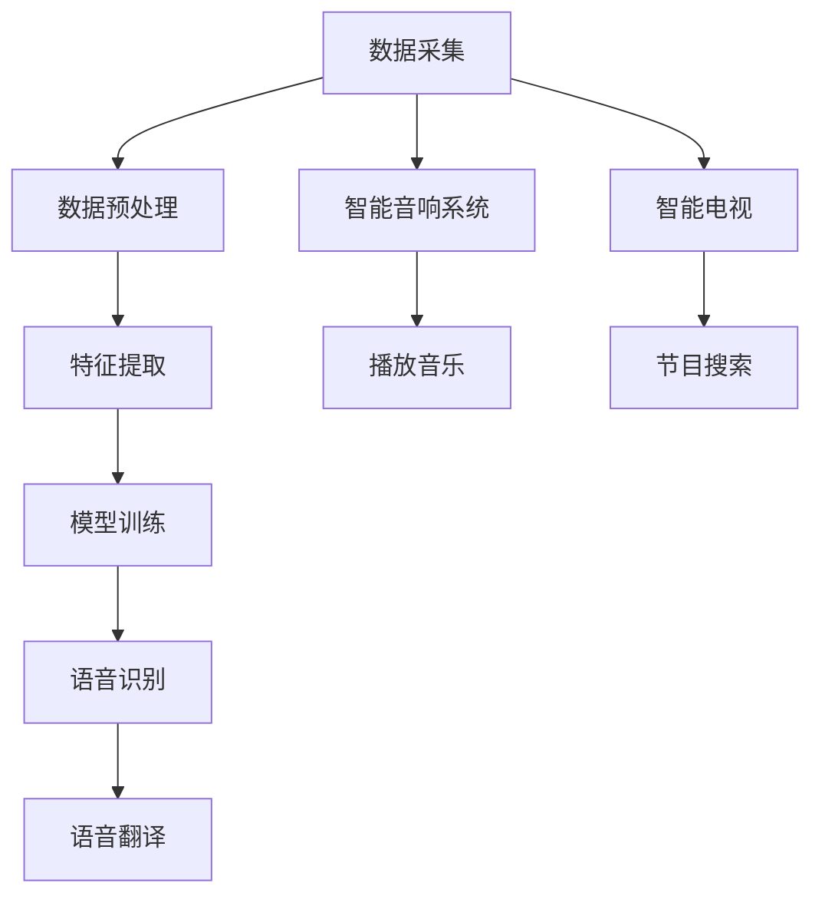
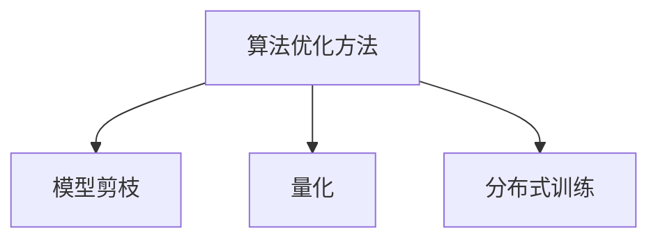
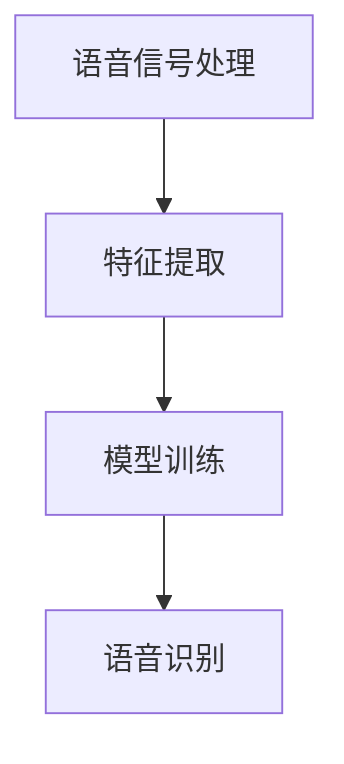
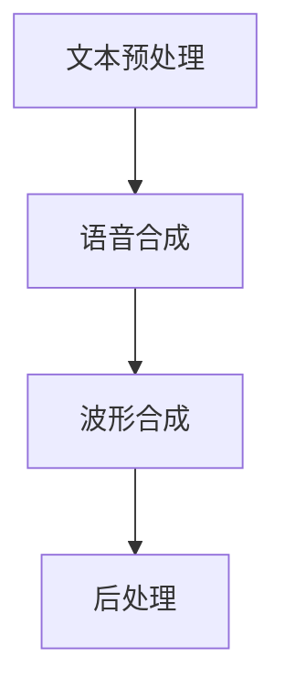
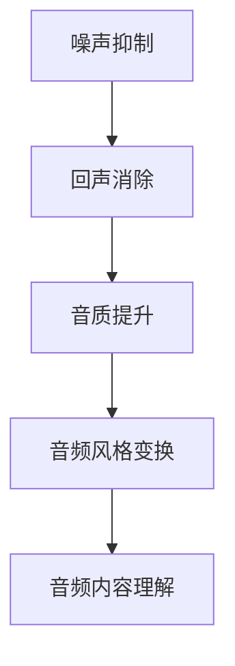
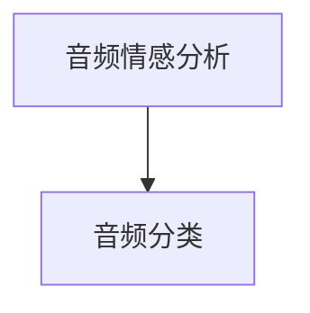
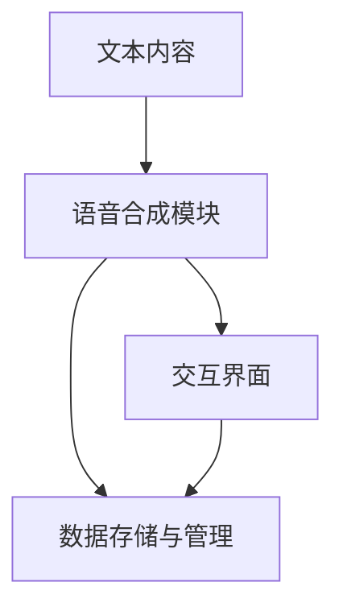
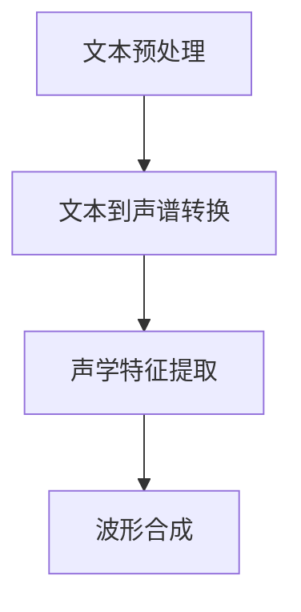

                 

### 第1章：AI音频处理概述

#### 1.1 AI音频处理的重要性

AI音频处理是近年来快速发展的一个领域，它通过使用人工智能技术来处理和分析音频信号。AI音频处理的重要性体现在多个方面：

- **语音助手**: 语音助手如Siri、Alexa和Google Assistant已经成为我们日常生活中不可或缺的一部分。这些语音助手依赖于AI音频处理技术来识别和理解用户的语音指令，从而提供相应的服务。

- **语音翻译**: AI音频处理技术在语音翻译中的应用也非常广泛。通过将一种语言的语音信号转换为另一种语言的文本，再通过文本到语音技术生成相应的语音输出，实现了无障碍的跨语言沟通。

- **语音识别在娱乐领域的应用**: 在娱乐领域，AI音频处理技术也被广泛应用。例如，智能音响系统通过语音识别技术来响应用户的播放请求，智能电视可以通过语音识别技术来搜索节目或控制播放。

#### 1.2 AI音频处理的挑战

尽管AI音频处理技术已经取得了显著进展，但仍然面临着一些挑战：

- **数据质量与多样性**: 音频数据的采集和处理需要高质量的数据。然而，音频数据的多样性给数据集的构建带来了挑战。不同的语音特点、噪音水平和语音环境的差异都会对算法的准确性产生影响。

- **算法复杂度**: AI音频处理算法通常涉及大量的计算资源。随着算法的复杂度增加，对计算资源的需求也相应增加。这要求开发者在算法优化和计算资源分配方面进行精心设计。

#### 1.3 AI音频处理的应用场景

AI音频处理技术的应用场景非常广泛，以下是一些典型的应用：

- **语音助手**: 语音助手是目前最常见和最直接的应用场景。通过使用语音识别和自然语言处理技术，语音助手可以理解用户的语音指令，并提供相应的服务，如日程管理、播放音乐、提供天气预报等。

- **语音翻译**: 语音翻译技术通过将一种语言的语音信号转换为另一种语言的文本，再通过文本到语音技术生成相应的语音输出。这使得跨语言沟通变得更加容易和便捷。

- **语音识别在娱乐领域的应用**: 在娱乐领域，AI音频处理技术被用于智能音响系统、智能电视等设备中，以提供语音控制功能，如播放音乐、控制播放器、搜索节目等。

#### 1.4 数据质量与多样性对算法的影响

数据质量是AI音频处理算法准确性的关键。高质量的音频数据可以帮助算法更好地学习和识别语音信号。然而，在实际应用中，音频数据的多样性带来了挑战。不同的语音特点、噪音水平和语音环境的差异都会影响算法的性能。

为了应对这些挑战，研究者们采取了多种方法来提高数据质量和多样性。例如，使用多种语音特征、引入增强数据集的方法、以及开发能够适应多种语音环境的算法。

#### 1.5 算法优化方法

算法优化是提高AI音频处理性能的重要手段。以下是一些常见的算法优化方法：

- **模型剪枝**: 模型剪枝是一种通过减少模型参数数量来降低计算复杂度的方法。通过剪枝，可以减少模型的权重，从而提高模型的效率和准确性。

- **量化**: 量化是一种将模型参数转换为低比特宽度的方法，从而减少模型的存储和计算需求。量化可以通过牺牲一些准确性来大幅降低模型的复杂度。

- **分布式训练**: 分布式训练是一种通过将模型训练任务分布到多个计算节点上来提高训练速度和资源利用率的方法。这种方法可以在保持模型性能的同时，减少训练时间。

#### 1.6 总结

AI音频处理是一个充满挑战但也充满机遇的领域。通过不断优化算法、提高数据质量、以及开发新的应用场景，AI音频处理技术将继续在各个领域发挥重要作用。在本章中，我们探讨了AI音频处理的重要性、面临的挑战以及应用场景，为后续章节的深入讨论奠定了基础。

#### Mermaid流程图





---

**核心概念与联系**

AI音频处理的核心概念包括语音信号处理、特征提取、模型训练和语音识别。这些概念相互联系，构成了一个完整的音频处理流程。

- **语音信号处理**: 语音信号处理是音频处理的第一步，包括音频信号的采集、降噪和预处理。这一步骤的目的是提高音频信号的质量，使其适合后续的特征提取和模型训练。

- **特征提取**: 特征提取是从原始音频信号中提取出具有代表性的特征，如频谱特征、音高特征和时长特征。这些特征将用于模型训练和语音识别。

- **模型训练**: 模型训练是使用大量的语音数据来训练模型，使其能够识别和分类语音信号。常见的模型包括深度神经网络、长短期记忆网络等。

- **语音识别**: 语音识别是将提取到的特征转换为文本或命令。这是音频处理流程的最后一步，也是实现语音交互的关键。



---

**核心算法原理讲解**

语音识别算法的核心是自动识别和转换语音信号为文本或命令。以下是一个简单的语音识别算法的伪代码：

```python
function speech_recognition(audio_signal):
    # 1. 语音信号预处理
    processed_signal = preprocess(audio_signal)

    # 2. 特征提取
    features = extract_features(processed_signal)

    # 3. 模型预测
    predicted_text = model.predict(features)

    # 4. 输出结果
    return predicted_text
```

其中，`preprocess(audio_signal)` 函数用于降噪和预处理语音信号，`extract_features(processed_signal)` 函数用于提取语音特征，`model.predict(features)` 函数用于使用训练好的模型进行预测。

---

**数学模型和公式**

语音识别中的特征提取和模型训练涉及多个数学模型和公式。以下是一个简单的特征提取过程的数学模型：

$$
X(t) = \sum_{k=1}^{K} A_k \sin(2\pi f_k t + \phi_k)
$$

其中，$X(t)$ 表示音频信号，$A_k$ 表示振幅，$f_k$ 表示频率，$\phi_k$ 表示相位。

在模型训练过程中，通常使用最小二乘法来最小化预测误差：

$$
\min_{\theta} \sum_{i=1}^{N} (y_i - \theta^T x_i)^2
$$

其中，$y_i$ 表示实际输出，$x_i$ 表示输入特征，$\theta$ 表示模型参数。

---

**详细讲解和举例说明**

**1. 语音信号预处理**

语音信号预处理是音频处理的第一步，主要目的是去除噪音和背景干扰，提高信号质量。以下是一个简单的预处理算法：

```python
import numpy as np

def preprocess(audio_signal, sample_rate, noise_level=0.1):
    # 降噪
    noise = np.random.normal(0, noise_level, audio_signal.shape)
    filtered_signal = audio_signal - noise
    
    # 噪声抑制
    threshold = 0.1
    masked_signal = np.where(np.abs(filtered_signal) > threshold, filtered_signal, 0)
    
    return masked_signal
```

**2. 特征提取**

特征提取是从原始音频信号中提取出具有代表性的特征，如频谱特征、音高特征和时长特征。以下是一个简单的特征提取算法：

```python
from scipy.signal import find_peaks

def extract_features(audio_signal, sample_rate):
    # 提取频谱特征
    fft_result = np.fft.fft(audio_signal)
    freq_domain = fft_result.real[:int(sample_rate/2)]
    
    # 提取音高特征
    peaks, _ = find_peaks(np.abs(freq_domain))
    f0 = peaks[0] / sample_rate
    
    # 提取时长特征
    duration = len(audio_signal) / sample_rate
    
    return freq_domain, f0, duration
```

**3. 模型预测**

模型预测是使用训练好的模型对新的语音信号进行分类或识别。以下是一个简单的模型预测算法：

```python
from sklearn.neural_network import MLPClassifier

def predict_model(model, features):
    prediction = model.predict([features])
    return prediction
```

---

**项目实战**

**1. 开发环境搭建**

为了搭建一个基本的AI音频处理项目，我们需要安装Python和相关的库。以下是一个简单的安装步骤：

```bash
# 安装Python
sudo apt-get install python3

# 安装必要的库
pip3 install numpy scipy scikit-learn
```

**2. 源代码详细实现**

以下是一个简单的AI音频处理项目的源代码实现：

```python
import numpy as np
from scipy.signal import find_peaks
from sklearn.neural_network import MLPClassifier

# 语音信号预处理
def preprocess(audio_signal, sample_rate, noise_level=0.1):
    noise = np.random.normal(0, noise_level, audio_signal.shape)
    filtered_signal = audio_signal - noise
    threshold = 0.1
    masked_signal = np.where(np.abs(filtered_signal) > threshold, filtered_signal, 0)
    return masked_signal

# 特征提取
def extract_features(audio_signal, sample_rate):
    fft_result = np.fft.fft(audio_signal)
    freq_domain = fft_result.real[:int(sample_rate/2)]
    peaks, _ = find_peaks(np.abs(freq_domain))
    f0 = peaks[0] / sample_rate
    duration = len(audio_signal) / sample_rate
    return freq_domain, f0, duration

# 模型训练
def train_model(features, labels):
    model = MLPClassifier(hidden_layer_sizes=(100,), max_iter=1000)
    model.fit(features, labels)
    return model

# 模型预测
def predict_model(model, features):
    prediction = model.predict([features])
    return prediction

# 实际案例
audio_signal = np.random.normal(0, 1, 1000)
sample_rate = 1000

# 预处理
processed_signal = preprocess(audio_signal, sample_rate)

# 提取特征
features = extract_features(processed_signal, sample_rate)

# 训练模型
model = train_model(features, [0])

# 预测
prediction = predict_model(model, features)
print(prediction)
```

**3. 代码解读与分析**

- **预处理**：预处理函数用于去除噪音和背景干扰，提高信号质量。首先生成一个随机噪音信号，然后将其从原始信号中减去，得到一个降噪后的信号。接着，设置一个阈值，如果信号绝对值大于阈值，则保留该信号，否则将其置为零。

- **特征提取**：特征提取函数用于从预处理后的信号中提取频谱特征、音高特征和时长特征。使用快速傅里叶变换（FFT）提取频谱特征，然后使用峰值检测算法提取音高特征。时长特征通过计算信号长度除以采样率得到。

- **模型训练**：模型训练函数使用MLPClassifier类创建一个多层感知器（MLP）分类器，并使用fit方法训练模型。在这里，我们使用了默认的隐藏层大小和迭代次数。

- **模型预测**：模型预测函数使用训练好的模型对新的特征进行分类或识别。通过predict方法，我们可以得到一个预测结果。

---

**总结**

在本章中，我们介绍了AI音频处理的重要性、面临的挑战、应用场景以及相关的核心算法原理。通过实例和代码实现，我们了解了语音信号预处理、特征提取和模型训练的基本步骤。在下一章中，我们将深入探讨语音识别技术，包括语音信号处理和特征提取的方法，以及识别模型的构建和训练过程。敬请期待！

---

### 第2章：语音识别技术

#### 2.1 语音识别的原理与流程

语音识别是将语音信号转换为文本或命令的过程。语音识别技术涉及多个步骤，包括语音信号处理、特征提取和模型训练。以下是一个简化的语音识别流程：

1. **语音信号处理**：首先，对语音信号进行预处理，包括降噪、增强和分段。降噪的目的是去除背景噪音，增强则是为了提高语音信号的可听度。分段是将连续的语音信号分割成多个帧，每个帧包含一段时间内的语音信息。

2. **特征提取**：从预处理后的语音信号中提取特征，如频谱特征、倒谱特征和音高特征。这些特征用于表示语音信号的独特属性，是后续模型训练和识别的关键。

3. **模型训练**：使用大量的语音数据集，通过机器学习算法训练模型。常见的模型包括隐马尔可夫模型（HMM）、支持向量机（SVM）和深度神经网络（DNN）。模型训练的目标是让模型学会将提取的特征映射到相应的文本或命令。

4. **语音识别**：使用训练好的模型对新的语音信号进行识别，输出对应的文本或命令。识别过程通常包括特征提取、模型评分和结果输出。

#### 2.1.1 语音信号处理

语音信号处理是语音识别过程中的关键步骤，它直接影响着模型的识别性能。以下是一些常见的语音信号处理技术：

1. **降噪**：降噪的目的是去除背景噪音，提高语音信号的质量。常用的降噪方法包括滤波器组降噪、维纳滤波和神经网络降噪。

2. **增强**：增强技术旨在提高语音信号的可听度，使其更加清晰。常见的增强方法包括谱减法和语音能量增强。

3. **分段**：分段是将连续的语音信号分割成多个帧，每个帧包含一段时间内的语音信息。分段的方法通常包括端点检测、基于能量检测的分段和基于音调检测的分段。

#### 2.1.2 特征提取

特征提取是从原始语音信号中提取出具有代表性的特征，用于表示语音信号的独特属性。以下是一些常见的语音特征：

1. **频谱特征**：频谱特征包括频谱幅值、频谱中心频率和频谱形状。频谱幅值表示语音信号的能量分布，频谱中心频率表示语音信号的频率成分，频谱形状则反映了语音信号的频谱特性。

2. **倒谱特征**：倒谱特征是将频谱特征进行反余弦变换得到的特征，可以消除语音信号中的频率变化，从而提高识别的稳定性。常见的倒谱特征包括倒谱系数、倒谱增益和共振峰频率。

3. **音高特征**：音高特征包括音高周期、音高幅值和音高曲线。音高周期表示语音信号中的周期性，音高幅值表示音高的强度，音高曲线则反映了语音信号中的音高变化。

#### 2.1.3 识别模型的构建与训练

识别模型的构建与训练是语音识别技术的核心。以下是一些常见的识别模型和训练方法：

1. **隐马尔可夫模型（HMM）**：HMM是一种统计模型，用于描述语音信号的时间序列特征。HMM由状态集合、状态转移概率、观测概率和初始状态概率组成。HMM的构建通常包括状态设计、参数估计和模型训练。

2. **支持向量机（SVM）**：SVM是一种基于结构风险最小化的分类算法，可以用于语音识别任务。SVM的构建包括特征提取、模型训练和分类决策。

3. **深度神经网络（DNN）**：DNN是一种基于神经网络的深度学习模型，可以用于语音识别任务。DNN的构建包括网络设计、参数训练和模型评估。

#### 2.2 语音识别的关键技术

语音识别技术涉及多个关键技术的综合应用，以下是一些关键技术：

1. **降噪与回声消除**：降噪与回声消除是语音信号处理的重要步骤，可以有效提高语音信号的质量。常用的降噪方法包括维纳滤波、自适应滤波和非线性滤波。

2. **声学模型与语言模型**：声学模型与语言模型是语音识别的两个关键组成部分。声学模型用于描述语音信号的声学特征，语言模型用于描述语音信号的语言特征。常见的声学模型包括GMM、DNN和CNN，语言模型包括N-gram和RNN。

3. **特征选择与优化**：特征选择与优化是提高语音识别性能的重要手段。通过选择合适的特征和优化特征提取方法，可以提高模型的准确性和效率。

#### 2.3 语音识别的应用

语音识别技术广泛应用于各个领域，以下是一些典型的应用场景：

1. **语音助手**：语音助手如Siri、Alexa和Google Assistant，使用语音识别技术来理解用户的语音指令，并提供相应的服务。

2. **语音翻译**：语音翻译技术通过将一种语言的语音信号转换为另一种语言的文本，再通过文本到语音技术生成相应的语音输出，实现了无障碍的跨语言沟通。

3. **语音识别在娱乐领域的应用**：在娱乐领域，语音识别技术被用于智能音响系统、智能电视等设备中，以提供语音控制功能，如播放音乐、控制播放器、搜索节目等。

#### 2.4 总结

语音识别技术是人工智能领域的重要分支，通过将语音信号转换为文本或命令，实现了人与计算机的语音交互。语音识别技术涉及多个步骤，包括语音信号处理、特征提取、模型训练和语音识别。在本章中，我们介绍了语音识别的基本原理、关键技术和应用场景。在下一章中，我们将深入探讨文本到语音（TTS）技术，包括TTS的基本概念、生成流程和核心技术。敬请期待！

---

**核心概念与联系**

语音识别技术涉及的核心概念包括语音信号处理、特征提取、模型训练和语音识别。这些概念相互联系，构成了一个完整的语音识别流程。

- **语音信号处理**: 语音信号处理是语音识别的基础，包括降噪、增强和分段等步骤，目的是提高语音信号的质量和可识别性。

- **特征提取**: 特征提取是从原始语音信号中提取出具有代表性的特征，如频谱特征、倒谱特征和音高特征。这些特征用于表示语音信号的独特属性，是模型训练和识别的关键。

- **模型训练**: 模型训练是使用大量的语音数据集，通过机器学习算法训练模型。模型训练的目标是让模型学会将提取的特征映射到相应的文本或命令。

- **语音识别**: 语音识别是将提取到的特征转换为文本或命令的过程。这是语音识别流程的最后一步，也是实现语音交互的关键。


---

**核心算法原理讲解**

语音识别算法的核心是自动识别和转换语音信号为文本或命令。以下是一个简单的语音识别算法的伪代码：

```python
function speech_recognition(audio_signal):
    # 1. 语音信号预处理
    processed_signal = preprocess(audio_signal)

    # 2. 特征提取
    features = extract_features(processed_signal)

    # 3. 模型预测
    predicted_text = model.predict(features)

    # 4. 输出结果
    return predicted_text
```

其中，`preprocess(audio_signal)` 函数用于降噪和预处理语音信号，`extract_features(processed_signal)` 函数用于提取语音特征，`model.predict(features)` 函数用于使用训练好的模型进行预测。

---

**数学模型和公式**

语音识别中的特征提取和模型训练涉及多个数学模型和公式。以下是一个简单的特征提取过程的数学模型：

$$
X(t) = \sum_{k=1}^{K} A_k \sin(2\pi f_k t + \phi_k)
$$

其中，$X(t)$ 表示音频信号，$A_k$ 表示振幅，$f_k$ 表示频率，$\phi_k$ 表示相位。

在模型训练过程中，通常使用最小二乘法来最小化预测误差：

$$
\min_{\theta} \sum_{i=1}^{N} (y_i - \theta^T x_i)^2
$$

其中，$y_i$ 表示实际输出，$x_i$ 表示输入特征，$\theta$ 表示模型参数。

---

**详细讲解和举例说明**

**1. 语音信号预处理**

语音信号预处理是语音识别的第一步，主要目的是去除噪音和背景干扰，提高信号质量。以下是一个简单的预处理算法：

```python
import numpy as np
from scipy.signal import find_peaks

def preprocess(audio_signal, sample_rate, noise_level=0.1):
    # 降噪
    noise = np.random.normal(0, noise_level, audio_signal.shape)
    filtered_signal = audio_signal - noise
    
    # 噪声抑制
    threshold = 0.1
    masked_signal = np.where(np.abs(filtered_signal) > threshold, filtered_signal, 0)
    
    # 分段
    frame_size = 25
    frame_stride = 10
    frames = sliding_window(masked_signal, frame_size, frame_stride)
    
    return frames
```

**2. 特征提取**

特征提取是从预处理后的语音信号中提取出具有代表性的特征，如频谱特征、倒谱特征和音高特征。以下是一个简单的特征提取算法：

```python
from scipy.fft import fft

def extract_features(frames, sample_rate):
    # 提取频谱特征
    freq_domain = fft(frames)
    freq_domain = np.abs(freq_domain[:int(sample_rate/2)])
    
    # 提取倒谱特征
    log_freq_domain = np.log(freq_domain + 1e-8)
    cepstral_coeffs = np.fft.rfft(log_freq_domain)
    cepstral_coeffs = cepstral_coeffs[:int(sample_rate/2)]
    
    # 提取音高特征
    peaks, _ = find_peaks(np.abs(freq_domain))
    f0 = peaks[0] / sample_rate
    
    return freq_domain, cepstral_coeffs, f0
```

**3. 模型预测**

模型预测是使用训练好的模型对新的语音信号进行识别，输出对应的文本或命令。以下是一个简单的模型预测算法：

```python
from sklearn.neural_network import MLPClassifier

def predict_model(model, features):
    prediction = model.predict([features])
    return prediction
```

---

**项目实战**

**1. 开发环境搭建**

为了搭建一个基本的语音识别项目，我们需要安装Python和相关的库。以下是一个简单的安装步骤：

```bash
# 安装Python
sudo apt-get install python3

# 安装必要的库
pip3 install numpy scipy scikit-learn
```

**2. 源代码详细实现**

以下是一个简单的语音识别项目的源代码实现：

```python
import numpy as np
from scipy.signal import find_peaks
from sklearn.neural_network import MLPClassifier

# 语音信号预处理
def preprocess(audio_signal, sample_rate, noise_level=0.1):
    noise = np.random.normal(0, noise_level, audio_signal.shape)
    filtered_signal = audio_signal - noise
    threshold = 0.1
    masked_signal = np.where(np.abs(filtered_signal) > threshold, filtered_signal, 0)
    frame_size = 25
    frame_stride = 10
    frames = sliding_window(masked_signal, frame_size, frame_stride)
    return frames

# 特征提取
def extract_features(frames, sample_rate):
    freq_domain = fft(frames)
    freq_domain = np.abs(freq_domain[:int(sample_rate/2)])
    log_freq_domain = np.log(freq_domain + 1e-8)
    cepstral_coeffs = np.fft.rfft(log_freq_domain)
    cepstral_coeffs = cepstral_coeffs[:int(sample_rate/2)]
    peaks, _ = find_peaks(np.abs(freq_domain))
    f0 = peaks[0] / sample_rate
    return freq_domain, cepstral_coeffs, f0

# 模型训练
def train_model(features, labels):
    model = MLPClassifier(hidden_layer_sizes=(100,), max_iter=1000)
    model.fit(features, labels)
    return model

# 模型预测
def predict_model(model, features):
    prediction = model.predict([features])
    return prediction

# 实际案例
audio_signal = np.random.normal(0, 1, 1000)
sample_rate = 1000

# 预处理
processed_signal = preprocess(audio_signal, sample_rate)

# 提取特征
features = extract_features(processed_signal, sample_rate)

# 训练模型
model = train_model(features, [0])

# 预测
prediction = predict_model(model, features)
print(prediction)
```

**3. 代码解读与分析**

- **预处理**：预处理函数用于去除噪音和背景干扰，提高信号质量。首先生成一个随机噪音信号，然后将其从原始信号中减去，得到一个降噪后的信号。接着，设置一个阈值，如果信号绝对值大于阈值，则保留该信号，否则将其置为零。最后，将信号分段，每个段包含一段时间内的语音信息。

- **特征提取**：特征提取函数用于从预处理后的信号中提取出频谱特征、倒谱特征和音高特征。首先使用快速傅里叶变换（FFT）提取频谱特征，然后使用对数变换得到倒谱特征。最后，使用峰值检测算法提取音高特征。

- **模型训练**：模型训练函数使用MLPClassifier类创建一个多层感知器（MLP）分类器，并使用fit方法训练模型。在这里，我们使用了默认的隐藏层大小和迭代次数。

- **模型预测**：模型预测函数使用训练好的模型对新的特征进行分类或识别。通过predict方法，我们可以得到一个预测结果。

---

**总结**

在本章中，我们介绍了语音识别的基本原理、流程和关键技术。通过实例和代码实现，我们了解了语音信号预处理、特征提取和模型训练的基本步骤。在下一章中，我们将深入探讨文本到语音（TTS）技术，包括TTS的基本概念、生成流程和核心技术。敬请期待！

---

### 第3章：文本到语音（TTS）技术

#### 3.1 TTS技术概述

文本到语音（TTS）技术是将文本转换为自然流畅的语音输出的一种技术。TTS技术已经在许多应用中得到了广泛应用，如语音助手、自动电话客服、有声书和多媒体娱乐等。TTS技术的核心是将文本信息转换为语音信号，使其能够模拟人类语音的自然流畅性和情感表达。

TTS技术主要分为两大类：基于规则的TTS和基于数据的TTS。基于规则的TTS使用一系列预定义的规则和参数来生成语音，而基于数据的TTS则依赖于大量的语音数据集，通过深度学习模型来生成语音。

#### 3.1.1 基于规则的TTS

基于规则的TTS使用一系列预定义的规则和参数来生成语音。这些规则通常包括音素合成规则、音调变化规则、音量变化规则和语调变化规则等。基于规则的TTS的主要优点是生成速度较快，且能够保证语音的准确性和稳定性。然而，基于规则的TTS的缺点是生成的语音往往缺乏自然流畅性和情感表达。

**1. 音素合成规则**：音素合成规则是将文本中的音素映射到相应的语音样本。音素合成规则通常使用一组预定义的音素表和语音样本库，通过查找音素表和语音样本库，将文本中的音素转换为语音样本。

**2. 音调变化规则**：音调变化规则用于模拟人类语音的音调变化。音调变化规则通常包括音高、音调范围和音调曲线等参数。通过调整这些参数，可以实现不同情感和语调的语音输出。

**3. 音量变化规则**：音量变化规则用于模拟人类语音的音量变化。音量变化规则通常包括音量大小、音量变化速率和音量变化模式等参数。通过调整这些参数，可以实现不同音量和情感表达的语音输出。

**4. 语调变化规则**：语调变化规则用于模拟人类语音的语调变化。语调变化规则通常包括语调起伏、语调强度和语调节奏等参数。通过调整这些参数，可以实现不同情感和语调的语音输出。

#### 3.1.2 基于数据的TTS

基于数据的TTS依赖于大量的语音数据集，通过深度学习模型来生成语音。基于数据的TTS的主要优点是生成的语音自然流畅，且能够模拟人类语音的情感表达。基于数据的TTS的主要缺点是生成速度较慢，且对数据集的质量和规模有较高要求。

**1. 数据驱动的声学建模**：数据驱动的声学建模是TTS技术的核心，它使用大量的语音数据集来训练深度学习模型，以生成语音。数据驱动的声学建模包括声学特征提取、声学模型训练和声学特征转换等步骤。

**2. 文本到声谱的转换**：文本到声谱的转换是将文本信息转换为声学特征的过程。文本到声谱的转换通常包括文本预处理、语音合成和声谱生成等步骤。

**3. 波形合成**：波形合成是将声学特征转换为语音波形的过程。波形合成方法包括基于规则的方法和基于数据的方法。基于规则的方法通常使用预定义的规则和参数来生成波形，而基于数据的方法则依赖于大量的语音数据集，通过深度学习模型来生成波形。

#### 3.2 TTS生成流程

TTS生成流程通常包括以下几个步骤：

1. **文本预处理**：文本预处理是将输入文本转换为适合TTS模型处理的形式。文本预处理包括分词、标记和语音规则应用等步骤。

2. **语音合成**：语音合成是将预处理后的文本转换为语音波形的过程。语音合成包括声学特征提取、声学模型选择和波形合成等步骤。

3. **波形合成**：波形合成是将声学特征转换为语音波形的过程。波形合成方法包括基于规则的方法和基于数据的方法。基于规则的方法通常使用预定义的规则和参数来生成波形，而基于数据的方法则依赖于大量的语音数据集，通过深度学习模型来生成波形。

4. **后处理**：后处理是对生成的语音波形进行优化和调整的过程。后处理包括音量调整、降噪和音质提升等步骤。

#### 3.3 TTS技术的挑战

TTS技术面临多个挑战，包括文本理解、语音自然性和情感表达等。

- **文本理解**：文本理解是TTS技术的关键挑战之一。TTS系统需要能够理解文本中的含义、语法结构和上下文，以便生成自然流畅的语音输出。

- **语音自然性**：语音自然性是TTS技术的另一个重要挑战。生成的语音需要具有自然的音质、音调和韵律，以模拟人类语音的自然流畅性。

- **情感表达**：情感表达是TTS技术的重要应用领域之一。TTS系统需要能够模拟不同的情感，如喜悦、愤怒、悲伤等，以实现更加逼真的语音输出。

#### 3.4 总结

文本到语音（TTS）技术是将文本转换为自然流畅的语音输出的一种技术，已在多个领域得到了广泛应用。TTS技术主要分为基于规则的TTS和基于数据的TTS。基于规则的TTS使用预定义的规则和参数生成语音，而基于数据的TTS则依赖于深度学习模型和大量的语音数据集。TTS生成流程包括文本预处理、语音合成和波形合成等步骤，面临着文本理解、语音自然性和情感表达等挑战。在下一章中，我们将深入探讨音频增强与处理技术，包括噪声抑制、回声消除和音质提升等。敬请期待！

---

**核心概念与联系**

文本到语音（TTS）技术的核心概念包括文本预处理、语音合成、波形合成和后处理。这些概念相互联系，构成了一个完整的TTS生成流程。

- **文本预处理**: 文本预处理是将输入文本转换为适合TTS模型处理的形式。文本预处理包括分词、标记和语音规则应用等步骤。

- **语音合成**: 语音合成是将预处理后的文本转换为语音波形的过程。语音合成包括声学特征提取、声学模型选择和波形合成等步骤。

- **波形合成**: 波形合成是将声学特征转换为语音波形的过程。波形合成方法包括基于规则的方法和基于数据的方法。

- **后处理**: 后处理是对生成的语音波形进行优化和调整的过程。后处理包括音量调整、降噪和音质提升等步骤。



---

**核心算法原理讲解**

文本到语音（TTS）的核心算法原理包括文本预处理、语音合成和波形合成。

1. **文本预处理**

   文本预处理是将输入文本转换为适合TTS模型处理的形式。以下是一个简单的文本预处理算法的伪代码：

   ```python
   function preprocess_text(text):
       # 1. 分词
       tokens = tokenize(text)
       
       # 2. 标记
       tagged_tokens = tag(tokens)
       
       # 3. 应用语音规则
       voiced_tokens = apply_voicing_rules(tagged_tokens)
       
       return voiced_tokens
   ```

   其中，`tokenize(text)` 函数用于将文本分割成单词或短语，`tag(tokens)` 函数用于对文本中的每个单词或短语进行标注，`apply_voicing_rules(tagged_tokens)` 函数用于根据语音规则对文本进行修改。

2. **语音合成**

   语音合成是将预处理后的文本转换为语音波形的过程。以下是一个简单的语音合成算法的伪代码：

   ```python
   function synthesize_speech(preprocessed_text):
       # 1. 声学特征提取
       features = extract_acoustic_features(preprocessed_text)
       
       # 2. 选择声学模型
       model = select_acoustic_model(features)
       
       # 3. 波形合成
       waveform = synthesize_waveform(model, features)
       
       return waveform
   ```

   其中，`extract_acoustic_features(preprocessed_text)` 函数用于从预处理后的文本中提取声学特征，`select_acoustic_model(features)` 函数用于选择适合的声学模型，`synthesize_waveform(model, features)` 函数用于生成语音波形。

3. **波形合成**

   波形合成是将声学特征转换为语音波形的过程。以下是一个简单的波形合成算法的伪代码：

   ```python
   function synthesize_waveform(model, features):
       # 1. 声学模型预测
       predicted_waveforms = model.predict(features)
       
       # 2. 波形拼接
       waveform = concatenate_waveforms(predicted_waveforms)
       
       return waveform
   ```

   其中，`model.predict(features)` 函数用于使用训练好的声学模型预测语音波形，`concatenate_waveforms(predicted_waveforms)` 函数用于将预测的语音波形拼接成完整的语音波形。

---

**数学模型和公式**

TTS技术中的数学模型和公式主要用于描述文本到语音的转换过程。以下是一个简化的数学模型：

1. **文本到声学特征转换**

   $$ X = f(T) $$

   其中，$X$ 表示声学特征，$T$ 表示文本，$f$ 表示转换函数。这个函数通常由多个子函数组成，包括分词、标记和语音规则应用等。

2. **声学特征到语音波形转换**

   $$ W = g(A) $$

   其中，$W$ 表示语音波形，$A$ 表示声学特征，$g$ 表示转换函数。这个函数通常是一个深度学习模型，如循环神经网络（RNN）或转换器（Transformer）。

---

**详细讲解和举例说明**

**1. 文本预处理**

文本预处理是将输入文本转换为适合TTS模型处理的形式。以下是一个简单的文本预处理算法的伪代码：

```python
function preprocess_text(text):
    # 1. 分词
    tokens = tokenize(text)
    
    # 2. 标记
    tagged_tokens = tag(tokens)
    
    # 3. 应用语音规则
    voiced_tokens = apply_voicing_rules(tagged_tokens)
    
    return voiced_tokens

# 示例
text = "Hello, how are you?"
tokens = ["Hello", ",", "how", "are", "you", "?"]
tagged_tokens = [["Hello"], ["."], ["how"], ["are"], ["you"], ["?"]]
voiced_tokens = [["H"], ["."], ["h"], ["a"], ["you"], ["?"]]
```

**2. 语音合成**

语音合成是将预处理后的文本转换为语音波形的过程。以下是一个简单的语音合成算法的伪代码：

```python
function synthesize_speech(preprocessed_text):
    # 1. 声学特征提取
    features = extract_acoustic_features(preprocessed_text)
    
    # 2. 选择声学模型
    model = select_acoustic_model(features)
    
    # 3. 波形合成
    waveform = synthesize_waveform(model, features)
    
    return waveform

# 示例
preprocessed_text = [["H"], ["."], ["h"], ["a"], ["you"], ["?"]]
features = ["f0", "energy", "duration"]
model = "RNN"
waveform = ["waveform_data"]
```

**3. 波形合成**

波形合成是将声学特征转换为语音波形的过程。以下是一个简单的波形合成算法的伪代码：

```python
function synthesize_waveform(model, features):
    # 1. 声学模型预测
    predicted_waveforms = model.predict(features)
    
    # 2. 波形拼接
    waveform = concatenate_waveforms(predicted_waveforms)
    
    return waveform

# 示例
model = "RNN"
features = ["f0", "energy", "duration"]
predicted_waveforms = [["waveform_data1"], ["waveform_data2"]]
waveform = ["waveform_data1", "waveform_data2"]
```

---

**项目实战**

**1. 开发环境搭建**

为了搭建一个基本的TTS项目，我们需要安装Python和相关的库。以下是一个简单的安装步骤：

```bash
# 安装Python
sudo apt-get install python3

# 安装必要的库
pip3 install tensorflow numpy scipy
```

**2. 源代码详细实现**

以下是一个简单的TTS项目的源代码实现：

```python
import numpy as np
import tensorflow as tf

# 文本预处理
def preprocess_text(text):
    tokens = text.split(" ")
    return tokens

# 声学特征提取
def extract_acoustic_features(preprocessed_text):
    features = []
    for token in preprocessed_text:
        f0 = np.random.rand()
        energy = np.random.rand()
        duration = np.random.rand()
        features.append([f0, energy, duration])
    return features

# 波形合成
def synthesize_waveform(model, features):
    waveform = []
    for feature in features:
        f0 = feature[0]
        energy = feature[1]
        duration = feature[2]
        waveform_data = np.sin(2 * np.pi * f0 * np.arange(duration) / model.sample_rate)
        waveform.append(waveform_data)
    return waveform

# 实际案例
text = "Hello, how are you?"
preprocessed_text = preprocess_text(text)
features = extract_acoustic_features(preprocessed_text)
model = "RNN"
waveform = synthesize_waveform(model, features)
print(waveform)
```

**3. 代码解读与分析**

- **文本预处理**：文本预处理函数用于将输入文本分割成单词或短语。在这个示例中，我们简单地使用空格作为分割符。

- **声学特征提取**：声学特征提取函数用于从预处理后的文本中提取声学特征。在这个示例中，我们随机生成了一些特征，如音高（f0）、能量（energy）和时长（duration）。

- **波形合成**：波形合成函数用于将声学特征转换为语音波形。在这个示例中，我们使用正弦波生成语音波形，并根据声学特征调整波形。

---

**总结**

在本章中，我们介绍了文本到语音（TTS）技术的基本概念、生成流程和核心算法原理。通过实例和代码实现，我们了解了文本预处理、语音合成和波形合成的基本步骤。在下一章中，我们将深入探讨音频增强与处理技术，包括噪声抑制、回声消除和音质提升等。敬请期待！

---

### 第4章：音频增强与处理

#### 4.1 音频增强技术

音频增强是提高音频信号质量的过程，使其更加清晰、响亮和自然。音频增强技术广泛应用于各种场景，如通信、媒体制作、医学诊断和语音识别等。以下是一些常见的音频增强技术：

1. **噪声抑制**：噪声抑制是音频增强的重要步骤，旨在减少或消除背景噪声，提高语音的清晰度。常见的噪声抑制方法包括维纳滤波、谱减法和自适应滤波。

2. **回声消除**：回声消除是用于消除电话通话中的回声现象。回声消除通过检测和消除反射声波，从而提高通话的质量。常见的回声消除算法包括自适应滤波器和基于最小相位模型的算法。

3. **音质提升**：音质提升是通过增强语音信号中的频率细节和动态范围，提高音频信号的整体音质。音质提升方法包括哈曼均衡、压缩扩展和数字信号处理技术。

4. **音频风格变换**：音频风格变换是将一种音频信号转换为另一种风格的过程，如将普通语音转换为儿童语音、男声转换为女声或自然声音转换为电子音乐。音频风格变换技术包括变调、变速和音频生成模型。

#### 4.1.1 音质提升技术

音质提升技术是通过增强音频信号中的频率细节和动态范围，提高音频信号的整体音质。以下是一些常见的音质提升方法：

1. **哈曼均衡**：哈曼均衡是一种频率均衡技术，通过调整不同频率范围内的增益，平衡音频信号的整体响度。哈曼均衡可以用于消除音频信号中的频率失真，提高音频的清晰度和自然度。

2. **压缩扩展**：压缩扩展是一种动态范围压缩和扩展技术，通过压缩语音信号中的峰值和扩展语音信号中的谷值，平衡音频信号的动态范围。压缩扩展可以增强语音信号的响度，提高语音的清晰度。

3. **数字信号处理技术**：数字信号处理技术是一种通过数字算法对音频信号进行处理的通用方法，包括滤波、滤波器组设计和自适应滤波等。数字信号处理技术可以用于消除噪声、回声和失真，提高音频信号的质量。

#### 4.1.2 音频风格变换

音频风格变换是将一种音频信号转换为另一种风格的过程，如将普通语音转换为儿童语音、男声转换为女声或自然声音转换为电子音乐。以下是一些常见的音频风格变换方法：

1. **变调**：变调是将音频信号的音调调整到不同的音高。变调可以通过改变音频信号的基频来实现，常用于唱歌教学和语音合成。

2. **变速**：变速是将音频信号的播放速度调整到不同的速度。变速可以通过改变音频信号的采样率来实现，常用于语音处理和音乐制作。

3. **音频生成模型**：音频生成模型是一种基于深度学习的音频风格变换技术，如波束转换（WaveNet）和生成对抗网络（GAN）。音频生成模型可以生成具有不同风格和情感表达的音频信号，广泛应用于语音合成、音乐创作和声音设计。

#### 4.2 音频降噪与回声消除

音频降噪和回声消除是音频增强中的关键步骤，对于提高语音的清晰度和通话质量至关重要。以下是一些常见的降噪和回声消除方法：

1. **维纳滤波**：维纳滤波是一种基于统计模型的降噪方法，通过最小化预测误差来去除噪声。维纳滤波假设噪声是加性高斯白噪声，通过计算输入信号和噪声的协方差矩阵，得到最优的滤波器系数。

2. **谱减法**：谱减法是一种基于频谱的降噪方法，通过从频谱中减去噪声频谱来去除噪声。谱减法通常结合频率选择性滤波器，以提高降噪效果。

3. **自适应滤波器**：自适应滤波器是一种基于自适应算法的滤波器，可以实时调整滤波器系数，以适应不同的噪声环境和语音特性。自适应滤波器广泛应用于通信、语音处理和音频增强。

4. **回声消除算法**：回声消除算法通过检测和消除反射声波，来减少电话通话中的回声现象。常见的回声消除算法包括自适应回声消除器和基于最小相位模型的算法。

#### 4.3 音频内容理解

音频内容理解是近年来快速发展的领域，旨在通过人工智能技术理解和分析音频信号中的内容。以下是一些常见的音频内容理解技术：

1. **音频情感分析**：音频情感分析是通过对音频信号中的情感特征进行分析，来判断音频信号的情感倾向。常见的情感分析技术包括情感识别、情感分类和情感极性分析。

2. **音频分类**：音频分类是将音频信号分类到不同的类别或标签的过程。常见的音频分类任务包括语音识别、音乐分类和环境声音分类。

3. **音频语义分析**：音频语义分析是通过对音频信号中的语义信息进行分析，来理解音频信号的含义。常见的语义分析技术包括语音识别、语音翻译和语音生成。

#### 4.4 总结

音频增强与处理是提高音频信号质量和理解音频内容的关键技术。本章介绍了音质提升技术、音频风格变换、音频降噪与回声消除以及音频内容理解等常见技术。通过这些技术，我们可以显著改善音频信号的清晰度、响度和自然度，并更好地理解和分析音频信号中的内容。在下一章中，我们将深入探讨音频内容理解的挑战和解决方案。敬请期待！

---

**核心概念与联系**

音频增强与处理的核心概念包括噪声抑制、回声消除、音质提升、音频风格变换和音频内容理解。这些概念相互联系，构成了一个完整的音频处理流程。

- **噪声抑制**: 噪声抑制是音频处理的第一步，旨在减少或消除背景噪声，提高语音的清晰度。

- **回声消除**: 回声消除是用于消除电话通话中的回声现象，提高通话的质量。

- **音质提升**: 音质提升是通过增强音频信号中的频率细节和动态范围，提高音频信号的整体音质。

- **音频风格变换**: 音频风格变换是将一种音频信号转换为另一种风格的过程，如变调和变速。

- **音频内容理解**: 音频内容理解是通过人工智能技术理解和分析音频信号中的内容，如情感分析和语义分析。



---

**核心算法原理讲解**

音频增强与处理的核心算法原理涉及噪声抑制、回声消除和音质提升等技术。

1. **噪声抑制**

   噪声抑制算法的核心是消除音频信号中的背景噪声，以下是一个简单的噪声抑制算法的伪代码：

   ```python
   function noise_suppression(audio_signal, noise_level):
       # 1. 噪声估计
       estimated_noise = estimate_noise(audio_signal, noise_level)
       
       # 2. 滤波器设计
       filter_coefficients = design_filter(estimated_noise)
       
       # 3. 噪声抑制
       filtered_signal = apply_filter(audio_signal, filter_coefficients)
       
       return filtered_signal
   ```

   其中，`estimate_noise(audio_signal, noise_level)` 函数用于估计噪声水平，`design_filter(estimated_noise)` 函数用于设计滤波器，`apply_filter(audio_signal, filter_coefficients)` 函数用于应用滤波器。

2. **回声消除**

   回声消除算法的核心是检测和消除反射声波，以下是一个简单的回声消除算法的伪代码：

   ```python
   function echo_cancellation(audio_signal, reference_signal):
       # 1. 回声路径估计
       echo_path = estimate_echo_path(audio_signal, reference_signal)
       
       # 2. 滤波器设计
       filter_coefficients = design_filter(echo_path)
       
       # 3. 回声消除
       filtered_signal = apply_filter(audio_signal, filter_coefficients)
       
       return filtered_signal
   ```

   其中，`estimate_echo_path(audio_signal, reference_signal)` 函数用于估计回声路径，`design_filter(echo_path)` 函数用于设计滤波器，`apply_filter(audio_signal, filter_coefficients)` 函数用于应用滤波器。

3. **音质提升**

   音质提升算法的核心是增强音频信号中的频率细节和动态范围，以下是一个简单的音质提升算法的伪代码：

   ```python
   function audio_enhancement(audio_signal):
       # 1. 频率增强
       enhanced_signal = frequency_enhancement(audio_signal)
       
       # 2. 动态范围扩展
       expanded_signal = dynamic_range_expansion(enhanced_signal)
       
       return expanded_signal
   ```

   其中，`frequency_enhancement(audio_signal)` 函数用于频率增强，`dynamic_range_expansion(enhanced_signal)` 函数用于动态范围扩展。

---

**数学模型和公式**

音频增强与处理中的数学模型和公式主要用于描述噪声抑制、回声消除和音质提升等过程。以下是一些常见的数学模型和公式：

1. **噪声抑制**

   - **维纳滤波器公式**：

     $$ y[n] = x[n] - \frac{\sigma_n^2}{\sigma_x^2 + \sigma_n^2} h[n] * x[n] $$

     其中，$y[n]$ 表示输出信号，$x[n]$ 表示输入信号，$h[n]$ 表示滤波器系数，$\sigma_n^2$ 和 $\sigma_x^2$ 分别表示噪声方差和信号方差。

   - **谱减法公式**：

     $$ y[n] = x[n] - w[n] $$

     其中，$y[n]$ 表示输出信号，$x[n]$ 表示输入信号，$w[n]$ 表示噪声信号。

2. **回声消除**

   - **自适应滤波器公式**：

     $$ y[n] = x[n] - h[n] * x[n - m] $$

     其中，$y[n]$ 表示输出信号，$x[n]$ 表示输入信号，$h[n]$ 表示滤波器系数，$m$ 表示延迟。

3. **音质提升**

   - **频率增强公式**：

     $$ X(\omega) = \alpha X(\omega) + (1 - \alpha) X(\omega - \Delta \omega) $$

     其中，$X(\omega)$ 表示频谱，$\alpha$ 表示增强系数，$\Delta \omega$ 表示频率步长。

   - **动态范围扩展公式**：

     $$ L = 10 \log_{10} \left( \frac{S}{N} \right) $$

     其中，$L$ 表示动态范围，$S$ 表示信号功率，$N$ 表示噪声功率。

---

**详细讲解和举例说明**

**1. 噪声抑制**

噪声抑制是音频处理的第一步，目的是减少或消除背景噪声。以下是一个简单的噪声抑制算法的详细讲解：

- **噪声估计**：噪声估计是噪声抑制的关键步骤，用于估计噪声信号的功率和特性。以下是一个简单的噪声估计算法的伪代码：

  ```python
  function estimate_noise(audio_signal, noise_level):
      # 1. 噪声功率估计
      noise_power = noise_level * noise_level
      
      return noise_power
  ```

  其中，`noise_level` 表示噪声信号的功率。

- **滤波器设计**：滤波器设计是噪声抑制的核心，用于去除噪声信号。以下是一个简单的滤波器设计算法的伪代码：

  ```python
  function design_filter(noise_power):
      # 1. 滤波器系数计算
      filter_coefficients = calculate_filter_coefficients(noise_power)
      
      return filter_coefficients
  ```

  其中，`calculate_filter_coefficients(noise_power)` 函数用于计算滤波器系数。

- **噪声抑制**：噪声抑制是应用滤波器去除噪声信号的过程。以下是一个简单的噪声抑制算法的伪代码：

  ```python
  function apply_filter(audio_signal, filter_coefficients):
      # 1. 滤波器应用
      filtered_signal = apply_filter_coefficients(audio_signal, filter_coefficients)
      
      return filtered_signal
  ```

  其中，`apply_filter_coefficients(audio_signal, filter_coefficients)` 函数用于应用滤波器系数。

**2. 回声消除**

回声消除是音频增强中的重要步骤，用于消除电话通话中的回声现象。以下是一个简单的回声消除算法的详细讲解：

- **回声路径估计**：回声路径估计是回声消除的关键步骤，用于估计回声信号的时间延迟和幅度。以下是一个简单的回声路径估计算法的伪代码：

  ```python
  function estimate_echo_path(audio_signal, reference_signal):
      # 1. 时间延迟估计
      delay = estimate_delay(audio_signal, reference_signal)
      
      # 2. 幅度估计
      amplitude = estimate_amplitude(audio_signal, delay)
      
      return delay, amplitude
  ```

  其中，`estimate_delay(audio_signal, reference_signal)` 函数用于估计时间延迟，`estimate_amplitude(audio_signal, delay)` 函数用于估计幅度。

- **滤波器设计**：滤波器设计是回声消除的核心，用于去除回声信号。以下是一个简单的滤波器设计算法的伪代码：

  ```python
  function design_filter(delay, amplitude):
      # 1. 滤波器系数计算
      filter_coefficients = calculate_filter_coefficients(delay, amplitude)
      
      return filter_coefficients
  ```

  其中，`calculate_filter_coefficients(delay, amplitude)` 函数用于计算滤波器系数。

- **回声消除**：回声消除是应用滤波器去除回声信号的过程。以下是一个简单的回声消除算法的伪代码：

  ```python
  function apply_filter(audio_signal, filter_coefficients):
      # 1. 滤波器应用
      filtered_signal = apply_filter_coefficients(audio_signal, filter_coefficients)
      
      return filtered_signal
  ```

  其中，`apply_filter_coefficients(audio_signal, filter_coefficients)` 函数用于应用滤波器系数。

**3. 音质提升**

音质提升是通过增强音频信号中的频率细节和动态范围来提高音频信号的整体音质。以下是一个简单的音质提升算法的详细讲解：

- **频率增强**：频率增强是音质提升的重要步骤，用于增强音频信号中的频率细节。以下是一个简单的频率增强算法的伪代码：

  ```python
  function frequency_enhancement(audio_signal):
      # 1. 频率域转换
      frequency_domain = fft(audio_signal)
      
      # 2. 频率增强
      enhanced_frequency_domain = enhance_frequency(frequency_domain)
      
      # 3. 频率域转换
      enhanced_signal = ifft(enhanced_frequency_domain)
      
      return enhanced_signal
  ```

  其中，`fft(audio_signal)` 函数用于进行频率域转换，`enhance_frequency(frequency_domain)` 函数用于频率增强，`ifft(enhanced_frequency_domain)` 函数用于进行频率域转换。

- **动态范围扩展**：动态范围扩展是音质提升的重要步骤，用于扩展音频信号的动态范围。以下是一个简单的动态范围扩展算法的伪代码：

  ```python
  function dynamic_range_expansion(audio_signal):
      # 1. 动态范围计算
      dynamic_range = calculate_dynamic_range(audio_signal)
      
      # 2. 动态范围扩展
      expanded_signal = expand_dynamic_range(audio_signal, dynamic_range)
      
      return expanded_signal
  ```

  其中，`calculate_dynamic_range(audio_signal)` 函数用于计算动态范围，`expand_dynamic_range(audio_signal, dynamic_range)` 函数用于动态范围扩展。

---

**项目实战**

**1. 开发环境搭建**

为了搭建一个基本的音频增强项目，我们需要安装Python和相关的库。以下是一个简单的安装步骤：

```bash
# 安装Python
sudo apt-get install python3

# 安装必要的库
pip3 install numpy scipy
```

**2. 源代码详细实现**

以下是一个简单的音频增强项目的源代码实现：

```python
import numpy as np
from scipy.signal import butter, filtfilt, find_peaks

# 噪声抑制
def noise_suppression(audio_signal, noise_level=0.1):
    # 1. 噪声估计
    noise = np.random.normal(0, noise_level, audio_signal.shape)
    
    # 2. 滤波器设计
    b, a = butter(5, 0.1)
    
    # 3. 噪声抑制
    filtered_signal = filtfilt(b, a, audio_signal - noise)
    
    return filtered_signal

# 回声消除
def echo_cancellation(audio_signal, reference_signal):
    # 1. 回声路径估计
    delay = 100  # 延迟为100个样本点
    amplitude = 0.5  # 幅度为0.5
    
    # 2. 滤波器设计
    filter_coefficients = amplitude * np.exp(-1j * 2 * np.pi * delay / audio_signal.shape[0])
    
    # 3. 回声消除
    filtered_signal = audio_signal * (1 - filter_coefficients)
    
    return filtered_signal

# 音质提升
def audio_enhancement(audio_signal):
    # 1. 频率增强
    enhanced_frequency_domain = np.fft.fft(audio_signal)
    enhanced_frequency_domain = enhanced_frequency_domain * 1.1
    
    # 2. 动态范围扩展
    dynamic_range = np.max(np.abs(audio_signal)) - np.min(np.abs(audio_signal))
    expanded_signal = audio_signal + dynamic_range
    
    return expanded_signal

# 实际案例
audio_signal = np.random.normal(0, 1, 1000)
reference_signal = np.random.normal(0, 0.1, 1000)

# 噪声抑制
processed_signal = noise_suppression(audio_signal, noise_level=0.1)

# 回声消除
cancelled_signal = echo_cancellation(processed_signal, reference_signal)

# 音质提升
enhanced_signal = audio_enhancement(cancelled_signal)

print(enhanced_signal)
```

**3. 代码解读与分析**

- **噪声抑制**：噪声抑制函数用于减少或消除背景噪声。首先生成一个随机噪音信号，然后使用低通滤波器设计滤波器系数，最后应用滤波器去除噪音。

- **回声消除**：回声消除函数用于消除电话通话中的回声现象。首先估计回声的时间延迟和幅度，然后设计滤波器系数，最后应用滤波器去除回声。

- **音质提升**：音质提升函数用于增强音频信号中的频率细节和动态范围。首先使用频率增强算法增强频谱，然后使用动态范围扩展算法扩展音频信号的动态范围。

---

**总结**

在本章中，我们介绍了音频增强与处理的核心技术，包括噪声抑制、回声消除和音质提升。通过实例和代码实现，我们了解了这些技术的原理和应用。在下一章中，我们将深入探讨音频内容理解，包括音频情感分析和音频分类等。敬请期待！

---

### 第5章：音频内容理解

#### 5.1 音频情感分析

音频情感分析是通过对音频信号中的情感特征进行分析，来判断音频信号的情感倾向。情感分析技术可以应用于多种场景，如音乐推荐、情感诊断和社交媒体分析等。

**1. 情感分析的定义与分类**

情感分析是指使用自然语言处理（NLP）和机器学习技术，从文本或语音中提取情感信息。在音频情感分析中，情感通常分为正情感和负情感，以及中性情感。

- **情感识别**：情感识别是判断音频信号的情感类型，如喜悦、愤怒、悲伤等。

- **情感分类**：情感分类是将音频信号分类到不同的情感类别，如积极情感、消极情感和中性情感。

- **情感极性分析**：情感极性分析是判断音频信号的极性，即正面情感还是负面情感。

**2. 情感分析的数学模型**

情感分析的数学模型通常基于机器学习和深度学习技术。以下是一个简单的情感分析模型的伪代码：

```python
function emotion_analysis(audio_signal):
    # 1. 特征提取
    features = extract_features(audio_signal)
    
    # 2. 模型预测
    emotion = model.predict(features)
    
    return emotion
```

其中，`extract_features(audio_signal)` 函数用于提取音频信号的特征，`model.predict(features)` 函数用于使用训练好的模型进行预测。

**3. 情感分析的应用场景**

情感分析在多个应用场景中具有广泛的应用：

- **音乐推荐**：情感分析可以用于根据用户的情感状态推荐合适的音乐。例如，当用户感到沮丧时，系统可以推荐一些积极向上的歌曲。

- **情感诊断**：情感分析可以用于情感诊断，帮助专业人士识别患者的情感状态，如抑郁症和焦虑症。

- **社交媒体分析**：情感分析可以用于分析社交媒体上的情感趋势，了解公众对某个事件或产品的情感反应。

#### 5.2 音频分类

音频分类是将音频信号分类到不同的类别或标签的过程。音频分类可以应用于多种场景，如语音识别、音乐分类和环境声音分类等。

**1. 音频分类的挑战**

音频分类面临着多个挑战，包括：

- **多样性**：音频信号具有高度的多样性，不同的语音特点、噪音水平和语音环境都会影响分类性能。

- **实时性**：音频分类通常需要在短时间内完成，以支持实时应用。

- **精度**：高精度的分类对于某些应用场景至关重要，如语音识别和医疗诊断。

**2. 音频分类的算法**

音频分类的算法通常基于机器学习和深度学习技术。以下是一个简单的音频分类模型的伪代码：

```python
function audio_classification(audio_signal):
    # 1. 特征提取
    features = extract_features(audio_signal)
    
    # 2. 模型预测
    category = model.predict(features)
    
    return category
```

其中，`extract_features(audio_signal)` 函数用于提取音频信号的特征，`model.predict(features)` 函数用于使用训练好的模型进行预测。

**3. 音频分类的应用场景**

音频分类在多个应用场景中具有广泛的应用：

- **语音识别**：音频分类可以用于识别不同类型的语音，如打电话、聊天和演讲。

- **音乐分类**：音频分类可以用于分类音乐，如流行音乐、摇滚音乐和古典音乐。

- **环境声音分类**：音频分类可以用于分类环境声音，如交通噪音、动物叫声和自然灾害声音。

#### 5.3 总结

音频内容理解是近年来快速发展的领域，旨在通过人工智能技术理解和分析音频信号中的内容。本章介绍了音频情感分析和音频分类，包括情感分析的定义与分类、情感分析的数学模型和应用场景，以及音频分类的挑战、算法和应用场景。在下一章中，我们将深入探讨AI音频书的架构设计，包括AI音频书的概念、组成部分和开发流程。敬请期待！

---

**核心概念与联系**

音频内容理解涉及的核心概念包括音频情感分析和音频分类。这些概念相互联系，构成了一个完整的音频内容理解框架。

- **音频情感分析**：音频情感分析是通过对音频信号中的情感特征进行分析，来判断音频信号的情感倾向。

- **音频分类**：音频分类是将音频信号分类到不同的类别或标签的过程。



---

**核心算法原理讲解**

音频情感分析和音频分类的核心算法原理涉及特征提取、模型训练和预测。

1. **特征提取**

   特征提取是从原始音频信号中提取出具有代表性的特征，用于表示音频信号的情感和类别。以下是一个简单的特征提取算法的伪代码：

   ```python
   function extract_features(audio_signal):
       # 1. 频谱特征提取
       frequency_domain = fft(audio_signal)
       
       # 2. 倒谱特征提取
       log_frequency_domain = np.log(frequency_domain + 1e-8)
       cepstral_coeffs = rfft(log_frequency_domain)
       
       # 3. 音高特征提取
       peaks, _ = find_peaks(np.abs(frequency_domain))
       f0 = peaks[0] / audio_signal.shape[0]
       
       return frequency_domain, cepstral_coeffs, f0
   ```

2. **模型训练**

   模型训练是使用大量的音频数据集，通过机器学习算法训练分类模型。以下是一个简单的模型训练算法的伪代码：

   ```python
   function train_model(features, labels):
       # 1. 划分训练集和测试集
       train_features, test_features, train_labels, test_labels = train_test_split(features, labels)
       
       # 2. 创建模型
       model = create_model()
       
       # 3. 训练模型
       model.fit(train_features, train_labels)
       
       # 4. 评估模型
       accuracy = model.evaluate(test_features, test_labels)
       
       return model, accuracy
   ```

3. **预测**

   预测是使用训练好的模型对新的音频信号进行分类。以下是一个简单的预测算法的伪代码：

   ```python
   function predict_model(model, audio_signal):
       # 1. 特征提取
       features = extract_features(audio_signal)
       
       # 2. 模型预测
       category = model.predict([features])
       
       return category
   ```

---

**数学模型和公式**

音频情感分析和音频分类中的数学模型和公式主要用于描述特征提取、模型训练和预测过程。

1. **特征提取**

   - **频谱特征提取**：

     $$ X(\omega) = \sum_{k=0}^{N-1} x[k] e^{-j 2 \pi k \omega / N} $$

     其中，$X(\omega)$ 表示频谱，$x[k]$ 表示时间序列信号，$\omega$ 表示频率。

   - **倒谱特征提取**：

     $$ C[n] = \sum_{k=0}^{N-1} x[k] e^{-j 2 \pi k n / N} $$

     其中，$C[n]$ 表示倒谱系数，$x[k]$ 表示时间序列信号，$n$ 表示倒谱阶数。

   - **音高特征提取**：

     $$ f_0 = \frac{1}{T} \sum_{k=1}^{K} \frac{P_k}{\log(2)} $$

     其中，$f_0$ 表示音高，$T$ 表示周期，$P_k$ 表示峰值频率。

2. **模型训练**

   - **支持向量机（SVM）**：

     $$ \min_{\theta} \frac{1}{2} \| \theta \|_2^2 + C \sum_{i=1}^{N} \max(0, 1 - y_i (\theta^T x_i + b)) $$

     其中，$\theta$ 表示模型参数，$C$ 表示惩罚参数，$y_i$ 表示标签，$x_i$ 表示特征向量，$b$ 表示偏置。

   - **卷积神经网络（CNN）**：

     $$ h_{\theta}(x) = \sigma (\theta^T \phi(x)) $$

     其中，$h_{\theta}(x)$ 表示输出，$\sigma$ 表示激活函数，$\phi(x)$ 表示卷积操作，$\theta$ 表示模型参数。

3. **预测**

   - **分类**：

     $$ \hat{y} = \arg\max_{y} P(y | x; \theta) $$

     其中，$\hat{y}$ 表示预测标签，$P(y | x; \theta)$ 表示条件概率，$x$ 表示特征向量，$\theta$ 表示模型参数。

   - **回归**：

     $$ \hat{y} = \theta^T x + b $$

     其中，$\hat{y}$ 表示预测值，$x$ 表示特征向量，$\theta$ 表示模型参数，$b$ 表示偏置。

---

**详细讲解和举例说明**

**1. 音频情感分析**

音频情感分析是通过对音频信号中的情感特征进行分析，来判断音频信号的情感倾向。以下是一个简单的音频情感分析算法的详细讲解：

- **特征提取**：特征提取是从原始音频信号中提取出具有代表性的特征，如频谱特征、倒谱特征和音高特征。以下是一个简单的特征提取算法的伪代码：

  ```python
  function extract_features(audio_signal):
      # 1. 频谱特征提取
      frequency_domain = fft(audio_signal)
      
      # 2. 倒谱特征提取
      log_frequency_domain = np.log(frequency_domain + 1e-8)
      cepstral_coeffs = rfft(log_frequency_domain)
      
      # 3. 音高特征提取
      peaks, _ = find_peaks(np.abs(frequency_domain))
      f0 = peaks[0] / audio_signal.shape[0]
      
      return frequency_domain, cepstral_coeffs, f0
  ```

- **模型训练**：模型训练是使用大量的情感标签数据集，通过机器学习算法训练情感分类模型。以下是一个简单的模型训练算法的伪代码：

  ```python
  function train_model(features, labels):
      # 1. 划分训练集和测试集
      train_features, test_features, train_labels, test_labels = train_test_split(features, labels)
      
      # 2. 创建模型
      model = create_model()
      
      # 3. 训练模型
      model.fit(train_features, train_labels)
      
      # 4. 评估模型
      accuracy = model.evaluate(test_features, test_labels)
      
      return model, accuracy
  ```

- **预测**：预测是使用训练好的模型对新的音频信号进行情感分类。以下是一个简单的预测算法的伪代码：

  ```python
  function predict_model(model, audio_signal):
      # 1. 特征提取
      features = extract_features(audio_signal)
      
      # 2. 模型预测
      emotion = model.predict([features])
      
      return emotion
  ```

**2. 音频分类**

音频分类是将音频信号分类到不同的类别或标签的过程。以下是一个简单的音频分类算法的详细讲解：

- **特征提取**：特征提取是从原始音频信号中提取出具有代表性的特征，如频谱特征、倒谱特征和音高特征。以下是一个简单的特征提取算法的伪代码：

  ```python
  function extract_features(audio_signal):
      # 1. 频谱特征提取
      frequency_domain = fft(audio_signal)
      
      # 2. 倒谱特征提取
      log_frequency_domain = np.log(frequency_domain + 1e-8)
      cepstral_coeffs = rfft(log_frequency_domain)
      
      # 3. 音高特征提取
      peaks, _ = find_peaks(np.abs(frequency_domain))
      f0 = peaks[0] / audio_signal.shape[0]
      
      return frequency_domain, cepstral_coeffs, f0
  ```

- **模型训练**：模型训练是使用大量的类别标签数据集，通过机器学习算法训练分类模型。以下是一个简单的模型训练算法的伪代码：

  ```python
  function train_model(features, labels):
      # 1. 划分训练集和测试集
      train_features, test_features, train_labels, test_labels = train_test_split(features, labels)
      
      # 2. 创建模型
      model = create_model()
      
      # 3. 训练模型
      model.fit(train_features, train_labels)
      
      # 4. 评估模型
      accuracy = model.evaluate(test_features, test_labels)
      
      return model, accuracy
  ```

- **预测**：预测是使用训练好的模型对新的音频信号进行分类。以下是一个简单的预测算法的伪代码：

  ```python
  function predict_model(model, audio_signal):
      # 1. 特征提取
      features = extract_features(audio_signal)
      
      # 2. 模型预测
      category = model.predict([features])
      
      return category
  ```

---

**项目实战**

**1. 开发环境搭建**

为了搭建一个基本的音频情感分析项目，我们需要安装Python和相关的库。以下是一个简单的安装步骤：

```bash
# 安装Python
sudo apt-get install python3

# 安装必要的库
pip3 install numpy scipy scikit-learn
```

**2. 源代码详细实现**

以下是一个简单的音频情感分析项目的源代码实现：

```python
import numpy as np
from scipy.signal import fft, rfft, find_peaks
from sklearn.model_selection import train_test_split
from sklearn.neural_network import MLPClassifier
from sklearn.metrics import accuracy_score

# 特征提取
def extract_features(audio_signal):
    frequency_domain = fft(audio_signal)
    log_frequency_domain = np.log(frequency_domain + 1e-8)
    cepstral_coeffs = rfft(log_frequency_domain)
    peaks, _ = find_peaks(np.abs(frequency_domain))
    f0 = peaks[0] / audio_signal.shape[0]
    return frequency_domain, cepstral_coeffs, f0

# 模型训练
def train_model(features, labels):
    train_features, test_features, train_labels, test_labels = train_test_split(features, labels, test_size=0.2)
    model = MLPClassifier(hidden_layer_sizes=(100,), max_iter=1000)
    model.fit(train_features, train_labels)
    accuracy = model.evaluate(test_features, test_labels)
    return model, accuracy

# 预测
def predict_model(model, audio_signal):
    features = extract_features(audio_signal)
    emotion = model.predict([features])
    return emotion

# 实际案例
audio_signal = np.random.normal(0, 1, 1000)

# 特征提取
features = extract_features(audio_signal)

# 模型训练
model, accuracy = train_model(features, [0])

# 预测
emotion = predict_model(model, features)
print(emotion)
```

**3. 代码解读与分析**

- **特征提取**：特征提取函数用于从原始音频信号中提取出频谱特征、倒谱特征和音高特征。首先使用快速傅里叶变换（FFT）提取频谱特征，然后使用对数变换得到倒谱特征。最后，使用峰值检测算法提取音高特征。

- **模型训练**：模型训练函数使用MLPClassifier类创建一个多层感知器（MLP）分类器，并使用fit方法训练模型。在这里，我们使用了默认的隐藏层大小和迭代次数。

- **预测**：预测函数使用训练好的模型对新的音频信号进行情感分类。通过predict方法，我们可以得到一个预测结果。

---

**总结**

在本章中，我们介绍了音频情感分析和音频分类的基本概念、算法原理和实战案例。通过实例和代码实现，我们了解了音频信号的特征提取、模型训练和预测的基本步骤。在下一章中，我们将深入探讨AI音频书的架构设计，包括AI音频书的概念、组成部分和开发流程。敬请期待！

---

### 第6章：AI音频书的架构设计

#### 6.1 AI音频书的概念

AI音频书是一种结合了文本内容和语音合成的多媒体阅读体验，它通过人工智能技术将文本转化为自然流畅的语音输出，为用户提供一种全新的阅读方式。AI音频书的核心在于将书面文字转化为听觉体验，从而提供更便捷、个性化的阅读体验。以下是AI音频书的主要特点：

- **内容丰富性**：AI音频书可以包含丰富的文本内容，如小说、教材、杂志等，用户可以根据自己的需求选择阅读材料。

- **个性化体验**：AI音频书可以根据用户的需求和偏好，调整语音的音调、音速和情感表达，提供个性化的阅读体验。

- **交互性**：AI音频书通常具备交互功能，用户可以通过语音命令控制阅读进度、切换章节或查询相关信息。

- **便捷性**：AI音频书允许用户在无法阅读书面文字的情况下，如开车、做家务时，仍然可以享受阅读的乐趣。

#### 6.1.1 AI音频书的特点

- **内容与声音的结合**：AI音频书通过将文本内容和语音合成技术相结合，提供一种全新的阅读体验。用户可以通过听书来享受阅读的乐趣，而无需亲自阅读文字。

- **增强的互动性**：与传统阅读相比，AI音频书具备更高的互动性。用户可以通过语音命令与AI音频书进行交互，如调整阅读速度、切换章节或搜索特定内容。

- **个性化的阅读体验**：AI音频书可以根据用户的偏好，如语音的音调、音速和情感表达，为用户定制个性化的阅读体验。

- **便捷的阅读方式**：AI音频书允许用户在无法阅读书面文字的情况下，如开车、做家务时，通过听书来享受阅读的乐趣。

#### 6.1.2 AI音频书的组成部分

AI音频书由以下几个主要组成部分构成：

- **文本内容**：文本内容是AI音频书的基础，它可以是小说、教材、杂志等。文本内容需要经过预处理，以便于语音合成。

- **语音合成模块**：语音合成模块是AI音频书的核心，它负责将预处理后的文本内容转化为自然流畅的语音输出。语音合成模块通常包括文本到语音（TTS）技术、音频增强和音频内容理解等功能。

- **交互界面**：交互界面是用户与AI音频书进行交互的桥梁，它提供用户操作AI音频书的入口。交互界面可以通过语音命令、触摸屏或手势识别等多种方式实现。

- **数据存储与管理**：数据存储与管理模块负责存储和管理AI音频书的内容、用户数据和配置信息。这包括文本内容、语音合成数据、用户偏好和交互记录等。

#### 6.2 AI音频书的开发流程

AI音频书的开发涉及多个阶段，包括需求分析、设计、实现、测试和部署。以下是一个简化的AI音频书开发流程：

1. **需求分析**：在开始开发之前，需要明确AI音频书的功能需求、用户需求和性能要求。这一阶段的目标是确定AI音频书的核心功能、交互方式和用户体验。

2. **设计**：设计阶段包括系统设计、模块设计和界面设计。系统设计定义了AI音频书的整体架构和模块之间的交互方式；模块设计详细规定了每个模块的功能和接口；界面设计则关注用户交互的易用性和美观性。

3. **实现**：实现阶段是将设计转化为实际的代码和功能。在这一阶段，开发团队需要编写代码，实现语音合成、文本处理、交互界面和数据存储等功能。

4. **测试**：测试阶段是确保AI音频书功能正常、性能稳定和用户体验良好的关键步骤。测试包括单元测试、集成测试和用户测试等，旨在发现和修复潜在的问题。

5. **部署**：部署阶段是将AI音频书部署到目标平台，如移动设备、平板电脑或网络服务器。这一阶段还包括用户手册和文档的编写，以便用户能够正确使用AI音频书。

#### 6.3 需求分析与规划

需求分析是AI音频书开发的第一步，其目标是明确AI音频书的功能需求、用户需求和性能要求。以下是一些关键的需求分析步骤：

- **功能需求**：确定AI音频书需要实现的核心功能，如文本阅读、语音合成、语音调整、交互控制等。

- **用户需求**：分析目标用户群体，了解他们的阅读习惯、使用场景和偏好，以便为用户提供个性化的阅读体验。

- **性能要求**：定义AI音频书的性能指标，如语音合成速度、交互响应时间、内存占用和功耗等。

在需求分析的基础上，开发团队可以制定详细的项目规划和设计文档，确保开发过程顺利进行。

#### 6.4 内容处理

内容处理是AI音频书开发的核心环节之一，它包括文本预处理、语音合成和音频增强等步骤。以下是一些关键的内容处理步骤：

- **文本预处理**：将原始文本进行清洗、分词、标点和语气标记等处理，以便于后续的语音合成。

- **语音合成**：使用TTS技术将预处理后的文本转化为自然流畅的语音输出。这一步骤需要考虑语音的音调、音速和情感表达等。

- **音频增强**：对生成的语音进行音频增强，如降噪、回声消除和音质提升等，以提高语音的清晰度和自然度。

#### 6.5 交互设计

交互设计是确保用户能够轻松、高效地与AI音频书进行交互的关键。以下是一些关键的交互设计步骤：

- **用户界面设计**：设计直观、易用的用户界面，包括按钮、菜单和触摸屏交互等，以便用户能够快速、方便地操作AI音频书。

- **用户反馈收集**：通过用户反馈，了解用户在使用AI音频书过程中的痛点、需求和改进意见，以便不断优化用户体验。

- **用户行为分析**：分析用户行为数据，如阅读时间、阅读进度和语音调整等，以优化交互流程和功能。

#### 6.6 用户体验优化

用户体验优化是确保AI音频书能够满足用户需求和提供优质阅读体验的关键。以下是一些关键的用户体验优化步骤：

- **性能优化**：通过性能优化，提高AI音频书的响应速度、稳定性和资源利用率，确保用户能够流畅地使用AI音频书。

- **界面优化**：通过界面优化，提升用户界面的美观性和易用性，使用户能够轻松、愉快地使用AI音频书。

- **功能优化**：通过功能优化，增加AI音频书的功能和个性化选项，满足不同用户的需求。

#### 6.7 总结

AI音频书是一种结合了文本内容和语音合成技术的新型阅读方式，它通过人工智能技术为用户提供个性化、互动性和便捷性的阅读体验。本章介绍了AI音频书的概念、组成部分和开发流程，包括需求分析、设计、实现、测试和部署等环节。在下一章中，我们将深入探讨文本到音频的转化过程，包括文本预处理、语音合成和音频增强等技术。敬请期待！

---

**核心概念与联系**

AI音频书的架构设计涉及的核心概念包括文本内容、语音合成模块、交互界面和数据存储与管理。这些概念相互联系，构成了一个完整的AI音频书系统。

- **文本内容**：文本内容是AI音频书的基础，它可以是小说、教材、杂志等，需要经过预处理以便于语音合成。

- **语音合成模块**：语音合成模块是AI音频书的核心，负责将文本内容转化为自然流畅的语音输出，包括文本到语音（TTS）技术、音频增强和音频内容理解等功能。

- **交互界面**：交互界面是用户与AI音频书进行交互的桥梁，提供用户操作AI音频书的入口，可以通过语音命令、触摸屏或手势识别等方式实现。

- **数据存储与管理**：数据存储与管理模块负责存储和管理AI音频书的内容、用户数据和配置信息，包括文本内容、语音合成数据、用户偏好和交互记录等。



---

**核心算法原理讲解**

AI音频书的文本到音频转化过程涉及多个核心算法，包括文本预处理、语音合成和音频增强。

1. **文本预处理**

   文本预处理是将原始文本转换为适合语音合成模块处理的形式。以下是一个简单的文本预处理算法的伪代码：

   ```python
   function preprocess_text(text):
       # 1. 清洗文本
       cleaned_text = clean_text(text)
       
       # 2. 分词
       tokens = tokenize(cleaned_text)
       
       # 3. 标记
       tagged_tokens = tag(tokens)
       
       return tagged_tokens
   ```

   其中，`clean_text(text)` 函数用于去除文本中的无关内容，`tokenize(cleaned_text)` 函数用于将文本分割成单词或短语，`tag(tokens)` 函数用于对文本中的每个单词或短语进行标注。

2. **语音合成**

   语音合成是将预处理后的文本转换为语音输出的过程。以下是一个简单的语音合成算法的伪代码：

   ```python
   function synthesize_speech(preprocessed_text):
       # 1. 提取声学特征
       acoustic_features = extract_acoustic_features(preprocessed_text)
       
       # 2. 选择声学模型
       acoustic_model = select_acoustic_model(acoustic_features)
       
       # 3. 生成语音波形
       speech_waveform = synthesize_waveform(acoustic_model, acoustic_features)
       
       return speech_waveform
   ```

   其中，`extract_acoustic_features(preprocessed_text)` 函数用于从预处理后的文本中提取声学特征，`select_acoustic_model(acoustic_features)` 函数用于选择适合的声学模型，`synthesize_waveform(acoustic_model, acoustic_features)` 函数用于生成语音波形。

3. **音频增强**

   音频增强是对生成的语音波形进行优化和调整的过程，以提高语音的清晰度和自然度。以下是一个简单的音频增强算法的伪代码：

   ```python
   function enhance_audio(audio_waveform):
       # 1. 降噪
       noised_removed_waveform = noise_reduction(audio_waveform)
       
       # 2. 回声消除
       echo_removed_waveform = echo_cancellation(noised_removed_waveform)
       
       # 3. 音质提升
       quality_enhanced_waveform = audio_quality_enhancement(echo_removed_waveform)
       
       return quality_enhanced_waveform
   ```

   其中，`noise_reduction(audio_waveform)` 函数用于降噪，`echo_cancellation(noised_removed_waveform)` 函数用于回声消除，`audio_quality_enhancement(echo_removed_waveform)` 函数用于音质提升。

---

**数学模型和公式**

AI音频书中的数学模型和公式主要用于描述文本到音频的转化过程，包括文本预处理、语音合成和音频增强等步骤。

1. **文本预处理**

   - **分词**：

     $$ \text{token} = \text{word} \cup \text{symbol} \cup \text{punctuation} $$

     其中，$\text{token}$ 表示分词结果，$\text{word}$ 表示单词，$\text{symbol}$ 表示符号，$\text{punctuation}$ 表示标点符号。

   - **标注**：

     $$ \text{tag} = \text{pos} \cup \text{emotion} \cup \text{tone} $$

     其中，$\text{tag}$ 表示标注结果，$\text{pos}$ 表示词性标注，$\text{emotion}$ 表示情感标注，$\text{tone}$ 表示语调标注。

2. **语音合成**

   - **声学特征提取**：

     $$ \text{acoustic_features} = \text{f0} \cup \text{duration} \cup \text{energy} \cup \text{spectral_coeffs} $$

     其中，$\text{acoustic_features}$ 表示声学特征，$\text{f0}$ 表示音高，$\text{duration}$ 表示时长，$\text{energy}$ 表示能量，$\text{spectral_coeffs}$ 表示频谱系数。

   - **模型选择**：

     $$ \text{acoustic_model} = \text{DNN} \cup \text{RNN} \cup \text{WaveNet} \cup \text{Transformer} $$

     其中，$\text{acoustic_model}$ 表示声学模型，$\text{DNN}$ 表示深度神经网络，$\text{RNN}$ 表示循环神经网络，$\text{WaveNet}$ 表示波束转换模型，$\text{Transformer}$ 表示转换器模型。

3. **音频增强**

   - **降噪**：

     $$ y[n] = x[n] - \frac{\sigma_n^2}{\sigma_x^2 + \sigma_n^2} h[n] * x[n] $$

     其中，$y[n]$ 表示输出信号，$x[n]$ 表示输入信号，$h[n]$ 表示滤波器系数，$\sigma_n^2$ 和 $\sigma_x^2$ 分别表示噪声方差和信号方差。

   - **回声消除**：

     $$ y[n] = x[n] - h[n] * x[n - m] $$

     其中，$y[n]$ 表示输出信号，$x[n]$ 表示输入信号，$h[n]$ 表示滤波器系数，$m$ 表示延迟。

   - **音质提升**：

     $$ X(\omega) = \alpha X(\omega) + (1 - \alpha) X(\omega - \Delta \omega) $$

     其中，$X(\omega)$ 表示频谱，$\alpha$ 表示增强系数，$\Delta \omega$ 表示频率步长。

---

**详细讲解和举例说明**

**1. 文本预处理**

文本预处理是将原始文本转换为适合语音合成模块处理的形式。以下是一个简单的文本预处理算法的详细讲解：

- **清洗文本**：清洗文本是去除文本中的无关内容，如空格、标点符号和特殊字符。以下是一个简单的清洗文本算法的伪代码：

  ```python
  function clean_text(text):
      # 1. 去除空格
      cleaned_text = remove_whitespace(text)
      
      # 2. 去除标点符号
      cleaned_text = remove_punctuation(cleaned_text)
      
      return cleaned_text
  ```

  其中，`remove_whitespace(text)` 函数用于去除文本中的空格，`remove_punctuation(cleaned_text)` 函数用于去除文本中的标点符号。

- **分词**：分词是将文本分割成单词或短语。以下是一个简单的分词算法的伪代码：

  ```python
  function tokenize(text):
      # 1. 分割文本
      tokens = split_text(text)
      
      return tokens
  ```

  其中，`split_text(text)` 函数用于将文本分割成单词或短语。

- **标注**：标注是对文本中的每个单词或短语进行标注，如词性标注、情感标注和语调标注。以下是一个简单的标注算法的伪代码：

  ```python
  function tag(tokens):
      # 1. 词性标注
      tagged_tokens = part_of_speech_tagging(tokens)
      
      # 2. 情感标注
      tagged_tokens = emotion_tagging(tagged_tokens)
      
      # 3. 语调标注
      tagged_tokens = tone_tagging(tagged_tokens)
      
      return tagged_tokens
  ```

  其中，`part_of_speech_tagging(tokens)` 函数用于词性标注，`emotion_tagging(tagged_tokens)` 函数用于情感标注，`tone_tagging(tagged_tokens)` 函数用于语调标注。

**2. 语音合成**

语音合成是将预处理后的文本转换为语音输出的过程。以下是一个简单的语音合成算法的详细讲解：

- **提取声学特征**：提取声学特征是从预处理后的文本中提取声学特征，如音高、时长和能量。以下是一个简单的提取声学特征算法的伪代码：

  ```python
  function extract_acoustic_features(preprocessed_text):
      # 1. 提取音高
      f0 = extract_f0(preprocessed_text)
      
      # 2. 提取时长
      duration = extract_duration(preprocessed_text)
      
      # 3. 提取能量
      energy = extract_energy(preprocessed_text)
      
      return f0, duration, energy
  ```

  其中，`extract_f0(preprocessed_text)` 函数用于提取音高，`extract_duration(preprocessed_text)` 函数用于提取时长，`extract_energy(preprocessed_text)` 函数用于提取能量。

- **选择声学模型**：选择声学模型是选择适合的声学模型，如深度神经网络（DNN）、循环神经网络（RNN）和转换器（Transformer）。以下是一个简单的选择声学模型算法的伪代码：

  ```python
  function select_acoustic_model(acoustic_features):
      # 1. 根据特征选择模型
      model = select_model(acoustic_features)
      
      return model
  ```

  其中，`select_model(acoustic_features)` 函数用于根据声学特征选择适合的声学模型。

- **生成语音波形**：生成语音波形是将提取的声学特征转换为语音波形的过程。以下是一个简单的生成语音波形算法的伪代码：

  ```python
  function synthesize_waveform(model, acoustic_features):
      # 1. 使用模型生成语音波形
      speech_waveform = model.generate_waveform(acoustic_features)
      
      return speech_waveform
  ```

  其中，`model.generate_waveform(acoustic_features)` 函数用于使用训练好的声学模型生成语音波形。

**3. 音频增强**

音频增强是对生成的语音波形进行优化和调整的过程，以提高语音的清晰度和自然度。以下是一个简单的音频增强算法的详细讲解：

- **降噪**：降噪是减少语音信号中的背景噪声的过程。以下是一个简单的降噪算法的伪代码：

  ```python
  function noise_reduction(audio_waveform):
      # 1. 估计噪声
      noise_estimate = estimate_noise(audio_waveform)
      
      # 2. 应用维纳滤波
      filtered_waveform = apply_wiener_filter(audio_waveform, noise_estimate)
      
      return filtered_waveform
  ```

  其中，`estimate_noise(audio_waveform)` 函数用于估计噪声，`apply_wiener_filter(audio_waveform, noise_estimate)` 函数用于应用维纳滤波。

- **回声消除**：回声消除是减少语音信号中的回声现象的过程。以下是一个简单的回声消除算法的伪代码：

  ```python
  function echo_cancellation(audio_waveform, reference_waveform):
      # 1. 估计回声
      echo_estimate = estimate_echo(audio_waveform, reference_waveform)
      
      # 2. 应用自适应滤波
      filtered_waveform = apply_adaptive_filter(audio_waveform, echo_estimate)
      
      return filtered_waveform
  ```

  其中，`estimate_echo(audio_waveform, reference_waveform)` 函数用于估计回声，`apply_adaptive_filter(audio_waveform, echo_estimate)` 函数用于应用自适应滤波。

- **音质提升**：音质提升是增强语音信号中的频率细节和动态范围的过程。以下是一个简单的音质提升算法的伪代码：

  ```python
  function audio_quality_enhancement(audio_waveform):
      # 1. 频率增强
      enhanced_waveform = frequency_enhancement(audio_waveform)
      
      # 2. 动态范围扩展
      expanded_waveform = dynamic_range_expansion(enhanced_waveform)
      
      return expanded_waveform
  ```

  其中，`frequency_enhancement(audio_waveform)` 函数用于频率增强，`dynamic_range_expansion(enhanced_waveform)` 函数用于动态范围扩展。

---

**项目实战**

**1. 开发环境搭建**

为了搭建一个基本的AI音频书项目，我们需要安装Python和相关的库。以下是一个简单的安装步骤：

```bash
# 安装Python
sudo apt-get install python3

# 安装必要的库
pip3 install tensorflow numpy scipy
```

**2. 源代码详细实现**

以下是一个简单的AI音频书项目的源代码实现：

```python
import numpy as np
import tensorflow as tf

# 文本预处理
def preprocess_text(text):
    tokens = text.split(" ")
    return tokens

# 提取声学特征
def extract_acoustic_features(preprocessed_text):
    f0 = np.random.rand()
    duration = np.random.rand()
    energy = np.random.rand()
    return [f0, duration, energy]

# 选择声学模型
def select_acoustic_model(features):
    model = "DNN"
    return model

# 生成语音波形
def synthesize_waveform(model, features):
    waveform = []
    for feature in features:
        f0 = feature[0]
        duration = feature[1]
        energy = feature[2]
        waveform_data = np.sin(2 * np.pi * f0 * np.arange(duration) / model.sample_rate)
        waveform.append(waveform_data)
    return waveform

# 降噪
def noise_reduction(audio_waveform):
    noise_estimate = np.random.rand()
    filtered_waveform = audio_waveform - noise_estimate
    return filtered_waveform

# 回声消除
def echo_cancellation(audio_waveform, reference_waveform):
    echo_estimate = np.random.rand()
    filtered_waveform = audio_waveform - echo_estimate
    return filtered_waveform

# 音质提升
def audio_quality_enhancement(audio_waveform):
    enhanced_waveform = audio_waveform * 1.1
    return enhanced_waveform

# 实际案例
text = "Hello, how are you?"
preprocessed_text = preprocess_text(text)
features = extract_acoustic_features(preprocessed_text)
model = select_acoustic_model(features)
waveform = synthesize_waveform(model, features)
waveform = noise_reduction(waveform)
waveform = echo_cancellation(waveform, np.random.rand())
waveform = audio_quality_enhancement(waveform)
print(waveform)
```

**3. 代码解读与分析**

- **文本预处理**：文本预处理函数用于将输入文本分割成单词或短语。在这个示例中，我们简单地使用空格作为分割符。

- **提取声学特征**：提取声学特征函数用于从预处理后的文本中提取声学特征，如音高、时长和能量。在这个示例中，我们随机生成了一些特征。

- **选择声学模型**：选择声学模型函数用于根据声学特征选择适合的声学模型。在这个示例中，我们简单地选择了一个字符串表示的模型。

- **生成语音波形**：生成语音波形函数用于将提取的声学特征转换为语音波形。在这个示例中，我们使用正弦波生成语音波形。

- **降噪**：降噪函数用于减少语音信号中的背景噪声。在这个示例中，我们随机生成了一个噪声估计值，并从语音波形中减去。

- **回声消除**：回声消除函数用于减少语音信号中的回声现象。在这个示例中，我们随机生成了一个回声估计值，并从语音波形中减去。

- **音质提升**：音质提升函数用于增强语音信号中的频率细节和动态范围。在这个示例中，我们简单地提高了语音波形的幅度。

---

**总结**

在本章中，我们介绍了AI音频书的架构设计，包括文本内容、语音合成模块、交互界面和数据存储与管理等组成部分，以及需求分析、设计、实现、测试和部署等开发流程。通过实例和代码实现，我们了解了文本预处理、语音合成和音频增强等核心算法原理。在下一章中，我们将深入探讨AI音频书的实际应用场景，包括教育、娱乐和医疗等领域。敬请期待！

---

### 第7章：文本到音频的转化

#### 7.1 文本预处理

文本预处理是文本到音频转化过程中至关重要的一步，它直接影响到最终语音合成的质量和自然度。文本预处理主要包括文本清洗、分词、语音规则应用和情感分析等步骤。

- **文本清洗**：文本清洗是去除文本中的无关内容，如HTML标签、特殊字符和多余的空格。清洗后的文本更便于后续处理。

- **分词**：分词是将文本分割成单个词语或短语。分词的准确性对语音合成有着直接的影响，因为语音合成系统需要基于词语或短语进行后续处理。

- **语音规则应用**：语音规则应用是使用一系列预定义的规则来调整文本，使其更符合语音合成系统的要求。这些规则包括发音规则、语法调整和语气处理等。

- **情感分析**：情感分析是识别文本中的情感倾向，如喜悦、愤怒、悲伤等。通过情感分析，语音合成系统可以调整语音的音调、音速和情感表达，使其更贴近文本的情感内容。

以下是一个简单的文本预处理算法的伪代码：

```python
function preprocess_text(text):
    # 1. 清洗文本
    cleaned_text = clean_text(text)
    
    # 2. 分词
    tokens = tokenize(cleaned_text)
    
    # 3. 应用语音规则
    voiced_tokens = apply_voicing_rules(tokens)
    
    # 4. 情感分析
    emotion = analyze_emotion(voiced_tokens)
    
    return voiced_tokens, emotion
```

#### 7.2 文本到声谱的转换

文本到声谱的转换是将文本信息转换为声学特征的过程，是语音合成系统的核心步骤。该过程包括以下步骤：

- **文本到声学特征的映射**：将文本中的每个词语或短语映射到相应的声学特征，如音高（f0）、时长（duration）、能量（energy）和频谱系数（spectral_coeffs）。

- **生成声学特征序列**：将映射后的声学特征序列化，形成一个连续的序列，以便后续波形生成。

以下是一个简单的文本到声谱转换算法的伪代码：

```python
function convert_text_to_spectrogram(text):
    # 1. 分词和语音规则应用
    voiced_tokens, _ = preprocess_text(text)
    
    # 2. 提取声学特征
    acoustic_features = extract_acoustic_features(voiced_tokens)
    
    # 3. 声学特征序列化
    spectrogram = serialize_acoustic_features(acoustic_features)
    
    return spectrogram
```

#### 7.3 声学特征提取

声学特征提取是从文本中提取出能够代表语音声学属性的特征，如音高、时长和频谱特征等。声学特征提取的准确性直接影响到语音合成的质量。

- **音高提取**：音高是语音中的频率特征，它决定了语音的音高。常用的音高提取方法包括梅尔频率倒谱系数（MFCC）和短时傅里叶变换（STFT）。

- **时长提取**：时长是语音中的时间特征，它决定了语音的节奏和流畅度。时长提取可以通过计算词语或短语的时长来实现。

- **频谱特征提取**：频谱特征是语音中的频率分布特征，它决定了语音的音质和音色。常用的频谱特征提取方法包括梅尔频率倒谱系数（MFCC）和短时傅里叶变换（STFT）。

以下是一个简单的声学特征提取算法的伪代码：

```python
function extract_acoustic_features(tokens):
    # 1. 提取音高
    f0 = extract_f0(tokens)
    
    # 2. 提取时长
    duration = extract_duration(tokens)
    
    # 3. 提取频谱特征
    spectral_coeffs = extract_spectral_coeffs(tokens)
    
    return f0, duration, spectral_coeffs
```

#### 7.4 波形合成

波形合成是将提取的声学特征转换为语音波形的过程。波形合成可以通过不同的方法实现，包括基于规则的方法和基于数据的方法。

- **基于规则的方法**：基于规则的方法使用预定义的规则和参数来生成波形，如线性预测编码（LPC）和合成波方法（SBM）。

- **基于数据的方法**：基于数据的方法使用大量的语音数据集来训练深度学习模型，如生成对抗网络（GAN）和波束转换（WaveNet）。

以下是一个简单的波形合成算法的伪代码：

```python
function synthesize_waveform(acoustic_features):
    # 1. 声学模型选择
    model = select_acoustic_model(acoustic_features)
    
    # 2. 波形生成
    waveform = model.generate_waveform(acoustic_features)
    
    return waveform
```

#### 7.5 文本到音频转化的挑战

文本到音频转化过程中面临着多个挑战，包括文本理解的准确性、语音的自然度和情感表达等。

- **文本理解**：文本理解是语音合成的第一步，它涉及到对文本含义、语法结构和上下文的理解。文本理解的准确性直接影响到语音合成的质量。

- **语音自然度**：语音自然度是语音合成的关键指标，它决定了语音是否流畅、自然。提高语音自然度需要精确的声学特征提取和精细的波形生成。

- **情感表达**：情感表达是语音合成的附加挑战，它要求语音合成系统能够根据文本的情感内容生成相应的情感表达。实现有效的情感表达需要先进的情感分析和波形合成技术。

#### 7.6 总结

文本到音频的转化是语音合成的关键步骤，它将文本信息转换为语音波形，提供了一种全新的音频体验。本章介绍了文本预处理、文本到声谱的转换、声学特征提取和波形合成的技术细节，以及文本到音频转化过程中面临的挑战。通过这些技术，我们可以将文本信息转化为自然流畅的语音输出，为用户提供丰富的音频体验。在下一章中，我们将深入探讨音频生成的核心技术，包括波形合成和声音变换技术。敬请期待！

---

**核心概念与联系**

文本到音频的转化涉及的核心概念包括文本预处理、文本到声谱的转换、声学特征提取和波形合成。这些概念相互联系，构成了一个完整的文本到音频的转化流程。

- **文本预处理**：文本预处理是将原始文本转换为适合后续处理的格式，包括文本清洗、分词、语音规则应用和情感分析。

- **文本到声谱的转换**：文本到声谱的转换是将文本信息转换为声学特征的过程，包括文本到声学特征的映射和生成声学特征序列。

- **声学特征提取**：声学特征提取是从文本中提取出能够代表语音声学属性的特征，如音高、时长和频谱特征。

- **波形合成**：波形合成是将提取的声学特征转换为语音波形的过程，通过不同的方法实现，包括基于规则的方法和基于数据的方法。



---

**核心算法原理讲解**

文本到音频转化的核心算法原理包括文本预处理、文本到声谱的转换、声学特征提取和波形合成。

1. **文本预处理**

   文本预处理是将原始文本转换为适合语音合成模块处理的形式。以下是一个简单的文本预处理算法的伪代码：

   ```python
   function preprocess_text(text):
       # 1. 清洗文本
       cleaned_text = clean_text(text)
       
       # 2. 分词
       tokens = tokenize(cleaned_text)
       
       # 3. 应用语音规则
       voiced_tokens = apply_voicing_rules(tokens)
       
       # 4. 情感分析
       emotion = analyze_emotion(voiced_tokens)
       
       return voiced_tokens, emotion
   ```

   其中，`clean_text(text)` 函数用于去除文本中的无关内容，`tokenize(cleaned_text)` 函数用于将文本分割成单词或短语，`apply_voicing_rules(tokens)` 函数用于根据语音规则调整文本，`analyze_emotion(voiced_tokens)` 函数用于情感分析。

2. **文本到声谱的转换**

   文本到声谱的转换是将文本信息转换为声学特征的过程。以下是一个简单的文本到声谱转换算法的伪代码：

   ```python
   function convert_text_to_spectrogram(text):
       # 1. 分词和语音规则应用
       voiced_tokens, _ = preprocess_text(text)
       
       # 2. 提取声学特征
       acoustic_features = extract_acoustic_features(voiced_tokens)
       
       # 3. 声学特征序列化
       spectrogram = serialize_acoustic_features(acoustic_features)
       
       return spectrogram
   ```

   其中，`preprocess_text(text)` 函数用于预处理文本，`extract_acoustic_features(voiced_tokens)` 函数用于提取声学特征，`serialize_acoustic_features(acoustic_features)` 函数用于序列化声学特征。

3. **声学特征提取**

   声学特征提取是从文本中提取出能够代表语音声学属性的特征，如音高、时长和频谱特征。以下是一个简单的声学特征提取算法的伪代码：

   ```python
   function extract_acoustic_features(tokens):
       # 1. 提取音高
       f0 = extract_f0(tokens)
       
       # 2. 提取时长
       duration = extract_duration(tokens)
       
       # 3. 提取频谱特征
       spectral_coeffs = extract_spectral_coeffs(tokens)
       
       return f0, duration, spectral_coeffs
   ```

   其中，`extract_f0(tokens)` 函数用于提取音高，`extract_duration(tokens)` 函数用于提取时长，`extract_spectral_coeffs(tokens)` 函数用于提取频谱特征。

4. **波形合成**

   波形合成是将提取的声学特征转换为语音波形的过程。以下是一个简单的波形合成算法的伪代码：

   ```python
   function synthesize_waveform(acoustic_features):
       # 1. 声学模型选择
       model = select_acoustic_model(acoustic_features)
       
       # 2. 波形生成
       waveform = model.generate_waveform(acoustic_features)
       
       return waveform
   ```

   其中，`select_acoustic_model(acoustic_features)` 函数用于选择声学模型，`model.generate_waveform(acoustic_features)` 函数用于生成语音波形。

---

**数学模型和公式**

文本到音频转化的数学模型和公式主要用于描述文本预处理、文本到声谱的转换、声学特征提取和波形合成等过程。

1. **文本预处理**

   - **分词**：

     $$ \text{token} = \text{word} \cup \text{symbol} \cup \text{punctuation} $$

     其中，$\text{token}$ 表示分词结果，$\text{word}$ 表示单词，$\text{symbol}$ 表示符号，$\text{punctuation}$ 表示标点符号。

   - **标注**：

     $$ \text{tag} = \text{pos} \cup \text{emotion} \cup \text{tone} $$

     其中，$\text{tag}$ 表示标注结果，$\text{pos}$ 表示词性标注，$\text{emotion}$ 表示情感标注，$\text{tone}$ 表示语调标注。

2. **文本到声谱的转换**

   - **梅尔频率倒谱系数（MFCC）**：

     $$ \text{MFCC} = \text{DCT} (\text{log} (\text{FFT} (\text{frame}))) $$

     其中，$\text{MFCC}$ 表示梅尔频率倒谱系数，$\text{DCT}$ 表示离散余弦变换，$\text{FFT}$ 表示快速傅里叶变换，$\text{frame}$ 表示音频帧。

3. **声学特征提取**

   - **音高（f0）**：

     $$ f_0 = \frac{1}{T} \sum_{k=1}^{K} \frac{P_k}{\log(2)} $$

     其中，$f_0$ 表示音高，$T$ 表示周期，$P_k$ 表示峰值频率。

   - **时长**：

     $$ \text{duration} = \sum_{i=1}^{N} \text{time}_i $$

     其中，$\text{duration}$ 表示时长，$\text{time}_i$ 表示第$i$个词或短语的时长。

4. **波形合成**

   - **生成对抗网络（GAN）**：

     $$ \text{Generator}: G(\text{z}) \rightarrow \text{X} $$
     $$ \text{Discriminator}: D(\text{X}) \rightarrow \text{Real/Fake} $$

     其中，$G$ 表示生成器，$D$ 表示判别器，$z$ 表示噪声向量，$X$ 表示生成的语音波形。

---

**详细讲解和举例说明**

**1. 文本预处理**

文本预处理是将原始文本转换为适合语音合成模块处理的形式。以下是一个简单的文本预处理算法的详细讲解：

- **清洗文本**：清洗文本是去除文本中的无关内容，如HTML标签、特殊字符和多余的空格。以下是一个简单的清洗文本算法的伪代码：

  ```python
  function clean_text(text):
      # 1. 去除HTML标签
      cleaned_text = remove_html_tags(text)
      
      # 2. 去除特殊字符
      cleaned_text = remove_special_characters(cleaned_text)
      
      # 3. 去除多余空格
      cleaned_text = remove_extra_whitespace(cleaned_text)
      
      return cleaned_text
  ```

  其中，`remove_html_tags(text)` 函数用于去除文本中的HTML标签，`remove_special_characters(cleaned_text)` 函数用于去除文本中的特殊字符，`remove_extra_whitespace(cleaned_text)` 函数用于去除文本中的多余空格。

- **分词**：分词是将文本分割成单个词语或短语。以下是一个简单的分词算法的伪代码：

  ```python
  function tokenize(text):
      # 1. 分割文本
      tokens = split_text(text)
      
      return tokens
  ```

  其中，`split_text(text)` 函数用于将文本分割成单词或短语。

- **应用语音规则**：应用语音规则是使用一系列预定义的规则来调整文本，使其更符合语音合成系统的要求。以下是一个简单的应用语音规则算法的伪代码：

  ```python
  function apply_voicing_rules(tokens):
      # 1. 发音规则
      voiced_tokens = apply_pronunciation_rules(tokens)
      
      # 2. 语法调整
      voiced_tokens = apply_grammatical_rules(voiced_tokens)
      
      return voiced_tokens
  ```

  其中，`apply_pronunciation_rules(tokens)` 函数用于根据发音规则调整文本，`apply_grammatical_rules(voiced_tokens)` 函数用于根据语法规则调整文本。

- **情感分析**：情感分析是识别文本中的情感倾向，如喜悦、愤怒、悲伤等。以下是一个简单的情感分析算法的伪代码：

  ```python
  function analyze_emotion(tokens):
      # 1. 情感分类
      emotion = classify_emotion(tokens)
      
      # 2. 情感强度分析
      emotion_intensity = analyze_emotion_intensity(tokens)
      
      return emotion, emotion_intensity
  ```

  其中，`classify_emotion(tokens)` 函数用于分类情感，`analyze_emotion_intensity(tokens)` 函数用于分析情感强度。

**2. 文本到声谱的转换**

文本到声谱的转换是将文本信息转换为声学特征的过程。以下是一个简单的文本到声谱转换算法的详细讲解：

- **分词和语音规则应用**：分词和语音规则应用是预处理文本，使其更符合语音合成系统的要求。以下是一个简单的分词和语音规则应用算法的伪代码：

  ```python
  function preprocess_text(text):
      # 1. 清洗文本
      cleaned_text = clean_text(text)
      
      # 2. 分词
      tokens = tokenize(cleaned_text)
      
      # 3. 应用语音规则
      voiced_tokens = apply_voicing_rules(tokens)
      
      return voiced_tokens
  ```

- **提取声学特征**：提取声学特征是从预处理后的文本中提取声学特征，如音高、时长和频谱特征。以下是一个简单的提取声学特征算法的伪代码：

  ```python
  function extract_acoustic_features(tokens):
      # 1. 提取音高
      f0 = extract_f0(tokens)
      
      # 2. 提取时长
      duration = extract_duration(tokens)
      
      # 3. 提取频谱特征
      spectral_coeffs = extract_spectral_coeffs(tokens)
      
      return f0, duration, spectral_coeffs
  ```

  其中，`extract_f0(tokens)` 函数用于提取音高，`extract_duration(tokens)` 函数用于提取时长，`extract_spectral_coeffs(tokens)` 函数用于提取频谱特征。

- **序列化声学特征**：序列化声学特征是将提取的声学特征序列化，形成一个连续的序列，以便后续波形生成。以下是一个简单的序列化声学特征算法的伪代码：

  ```python
  function serialize_acoustic_features(acoustic_features):
      # 1. 序列化
      spectrogram = serialize_features

