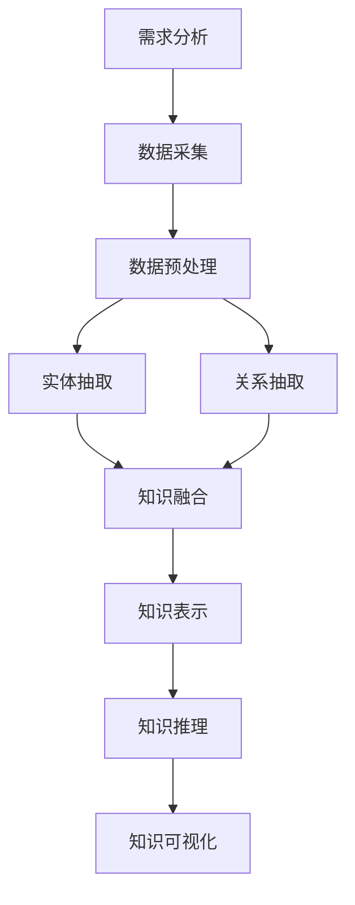
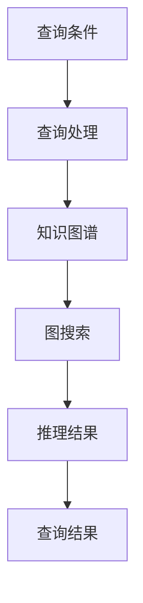
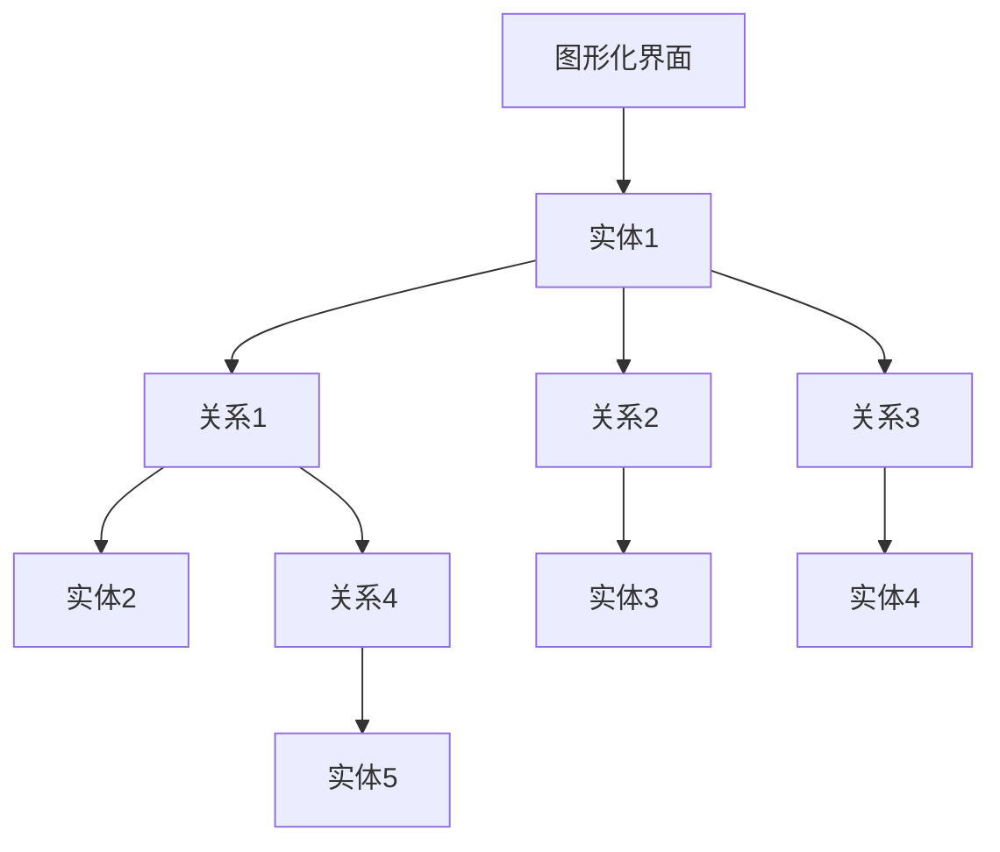

                 

# 《AI驱动的企业知识图谱构建》

> **关键词：** AI，知识图谱，企业应用，深度学习，图神经网络，优化与可视化

> **摘要：** 本文将探讨AI驱动的企业知识图谱构建，从基本概念、构建方法、应用案例等方面进行深入分析，旨在为企业提供知识图谱构建的技术指导和实践路径。

## 《AI驱动的企业知识图谱构建》目录大纲

## 第一部分：AI与知识图谱概述

### 第1章：AI与知识图谱的基本概念

#### 1.1 AI概述

人工智能（AI）是计算机科学的一个分支，旨在使计算机具备人类智能，包括感知、学习、推理和决策能力。随着深度学习和大数据技术的发展，AI在各个领域取得了显著的成果，如图像识别、自然语言处理、自动驾驶等。

#### 1.2 知识图谱概述

知识图谱（Knowledge Graph）是一种结构化的语义知识表示方法，用于描述实体及其之间的关系。知识图谱可以看作是一个大规模、多领域、跨领域的知识库，是AI应用的重要基础设施。

#### 1.3 AI与知识图谱的关系

AI与知识图谱密切相关，两者相互促进。知识图谱为AI提供了丰富的背景知识，有助于提高AI在特定领域的表现；而AI则为知识图谱的构建、优化和推理提供了强大的技术支持。

### 第2章：知识图谱的结构与构建

#### 2.1 知识图谱的基本结构

知识图谱由实体、关系和属性组成，具有层次化、分布式和动态性等特点。

#### 2.2 知识图谱的构建过程

知识图谱的构建包括数据采集、数据预处理、实体抽取、关系抽取和知识融合等步骤。

#### 2.3 知识图谱的表示方法

知识图谱的表示方法包括图表示、向量表示和图嵌入等，适用于不同类型的知识和应用场景。

### 第3章：知识图谱的算法与应用

#### 3.1 知识图谱的算法概述

知识图谱的算法包括查询与推理、图神经网络、图嵌入等，用于提高知识图谱的性能和可扩展性。

#### 3.2 知识图谱的查询与推理

知识图谱的查询与推理是关键技术，通过图搜索和逻辑推理等方法，实现对知识图谱中信息的精准查询和推理。

#### 3.3 知识图谱的应用案例

知识图谱在多个领域具有广泛的应用，如搜索引擎、推荐系统、智能问答等。

## 第二部分：AI驱动的知识图谱构建技术

### 第4章：AI驱动的知识图谱构建原理

#### 4.1 AI在知识图谱构建中的应用

AI在知识图谱构建中应用于数据采集、预处理、实体抽取、关系抽取和知识融合等环节。

#### 4.2 知识图谱增强算法

知识图谱增强算法通过引入外部数据和关系，提高知识图谱的完整性和准确性。

#### 4.3 知识图谱补全算法

知识图谱补全算法通过预测未知关系和实体属性，提升知识图谱的丰富度和实用性。

### 第5章：基于深度学习的知识图谱构建方法

#### 5.1 深度学习基础

深度学习是AI的核心技术，包括神经网络、卷积神经网络、循环神经网络等。

#### 5.2 基于深度学习的知识图谱表示方法

基于深度学习的知识图谱表示方法包括图嵌入、图注意力网络等。

#### 5.3 基于深度学习的知识图谱补全方法

基于深度学习的知识图谱补全方法通过训练大规模神经网络模型，实现知识图谱的补全和优化。

### 第6章：基于图神经网络的智能图谱构建

#### 6.1 图神经网络概述

图神经网络（Graph Neural Network，GNN）是一种基于图结构的深度学习模型，适用于知识图谱的表示和推理。

#### 6.2 基于图神经网络的图谱表示

基于图神经网络的图谱表示方法通过学习实体和关系的表示，实现知识图谱的语义表示。

#### 6.3 基于图神经网络的图谱推理

基于图神经网络的图谱推理方法通过图搜索和逻辑推理，实现知识图谱中的推理任务。

### 第7章：AI驱动的知识图谱优化与可视化

#### 7.1 知识图谱的优化策略

知识图谱的优化策略包括去重、修剪、融合等，以提高知识图谱的性能和可扩展性。

#### 7.2 知识图谱的可视化方法

知识图谱的可视化方法包括图形可视化、文本可视化等，有助于用户直观地理解和分析知识图谱。

#### 7.3 知识图谱的可视化工具

知识图谱的可视化工具包括D3.js、Mermaid等，可用于创建和展示知识图谱。

## 第三部分：企业级知识图谱构建实践

### 第8章：企业知识图谱构建流程与策略

#### 8.1 企业知识图谱构建的流程

企业知识图谱构建的流程包括需求分析、数据采集、知识表示、推理和可视化等环节。

#### 8.2 企业知识图谱构建的策略

企业知识图谱构建的策略包括选择合适的构建方法、优化图谱结构和提高数据质量等。

#### 8.3 企业知识图谱构建的关键点

企业知识图谱构建的关键点包括数据一致性、关系表示和推理策略等。

### 第9章：企业知识图谱构建案例解析

#### 9.1 案例一：企业知识图谱在客户关系管理中的应用

#### 9.2 案例二：企业知识图谱在供应链管理中的应用

#### 9.3 案例三：企业知识图谱在数据资产管理中的应用

### 第10章：知识图谱构建工具与平台选择

#### 10.1 知识图谱构建工具概述

知识图谱构建工具包括开源工具和商业平台，如Neo4j、JanusGraph等。

#### 10.2 常用知识图谱平台介绍

常用知识图谱平台包括开源平台和商业平台，如OpenKG、Alibaba Graph等。

#### 10.3 知识图谱平台的选择与使用

知识图谱平台的选择与使用需要考虑性能、可扩展性、易用性和成本等因素。

## 附录

### 附录A：知识图谱相关的开源工具与库

#### A.1 常用知识图谱工具汇总

常用知识图谱工具包括OpenKG、JanusGraph等。

#### A.2 开源知识图谱库介绍

开源知识图谱库包括Neo4j、Dblp等。

#### A.3 知识图谱工具使用示例

知识图谱工具使用示例包括数据导入、查询和可视化等。

### 附录B：知识图谱相关的Mermaid流程图

#### B.1 知识图谱构建流程Mermaid图

知识图谱构建流程Mermaid图展示了构建过程中的关键步骤。

#### B.2 知识图谱查询与推理Mermaid图

知识图谱查询与推理Mermaid图展示了查询和推理的流程。

#### B.3 知识图谱可视化Mermaid图

知识图谱可视化Mermaid图展示了可视化的方法和工具。

### 附录C：深度学习与图神经网络相关的伪代码

#### C.1 知识图谱表示方法伪代码

知识图谱表示方法伪代码展示了实体和关系的表示过程。

#### C.2 知识图谱补全算法伪代码

知识图谱补全算法伪代码展示了补全算法的实现过程。

#### C.3 图神经网络算法伪代码

图神经网络算法伪代码展示了图神经网络的基本结构。

### 附录D：知识图谱相关数学公式

#### D.1 知识图谱表示的数学模型

知识图谱表示的数学模型展示了实体和关系的表示方法。

#### D.2 知识图谱推理的数学模型

知识图谱推理的数学模型展示了推理算法的数学基础。

#### D.3 深度学习相关的数学公式

深度学习相关的数学公式展示了深度学习模型的核心公式。

### 附录E：知识图谱应用案例代码解读

#### E.1 案例一代码解读

案例一代码解读展示了客户关系管理中的知识图谱构建过程。

#### E.2 案例二代码解读

案例二代码解读展示了供应链管理中的知识图谱构建过程。

#### E.3 案例三代码解读

案例三代码解读展示了数据资产管理中的知识图谱构建过程。

## 引言

在当今信息化时代，数据已经成为企业的重要资产。如何有效地管理和利用这些数据，已成为企业竞争的关键。知识图谱作为一种结构化的语义知识表示方法，能够在海量数据中挖掘出有价值的知识，为企业提供智能决策支持。AI驱动的知识图谱构建技术，进一步提升了知识图谱的构建效率和质量，为企业打造智能化、自动化、高效的知识管理平台提供了有力保障。

本文旨在探讨AI驱动的企业知识图谱构建，从基本概念、构建方法、应用案例等方面进行深入分析，旨在为企业提供知识图谱构建的技术指导和实践路径。文章将分为三个部分：

第一部分介绍AI与知识图谱的基本概念，包括AI概述、知识图谱概述以及AI与知识图谱的关系。

第二部分探讨AI驱动的知识图谱构建技术，包括AI驱动的知识图谱构建原理、基于深度学习的知识图谱构建方法、基于图神经网络的智能图谱构建以及知识图谱优化与可视化。

第三部分介绍企业级知识图谱构建实践，包括企业知识图谱构建流程与策略、企业知识图谱构建案例解析以及知识图谱构建工具与平台选择。

通过本文的探讨，希望读者能够深入了解AI驱动的企业知识图谱构建，掌握相关技术原理和方法，并将其应用于实际场景中，为企业创造价值。

## 第一部分：AI与知识图谱概述

### 第1章：AI与知识图谱的基本概念

#### 1.1 AI概述

人工智能（Artificial Intelligence，简称AI）是计算机科学的一个分支，旨在使计算机具备人类智能，包括感知、学习、推理和决策能力。AI的核心目标是让计算机能够自主地完成复杂的任务，从而提高生产效率、降低人力成本，并解决传统方法难以处理的问题。

AI的发展历程可以分为三个阶段：符号主义（Symbolic AI）、连接主义（Connectionist AI）和混合智能（Hybrid AI）。符号主义AI基于逻辑和推理，通过符号表示知识和规则，代表技术包括专家系统和推理机。连接主义AI基于神经网络，通过模拟人脑神经元之间的连接和交互，代表技术包括深度学习和生成对抗网络（GAN）。混合智能AI结合符号主义和连接主义，融合不同方法的优势，代表技术包括强化学习和迁移学习。

近年来，随着深度学习和大数据技术的发展，AI在各个领域取得了显著的成果，如图像识别、自然语言处理、自动驾驶、推荐系统和智能客服等。AI的应用不仅改变了人们的日常生活，还推动了各个行业的技术创新和产业升级。

#### 1.2 知识图谱概述

知识图谱（Knowledge Graph）是一种结构化的语义知识表示方法，用于描述实体及其之间的关系。知识图谱的核心思想是将现实世界中的各种事物（实体）以及它们之间的相互关系（关系）以图结构进行组织和存储，从而构建出一个全局的、语义丰富的知识网络。

知识图谱的基本组成单元包括实体（Entity）、关系（Relation）和属性（Attribute）。实体是知识图谱中的基本元素，代表现实世界中的各种事物，如人、地点、组织等。关系描述实体之间的相互作用和关联，如“张三领导李四”、“清华大学在北京市”等。属性则是实体的附加信息，用于描述实体的特征和属性，如“张三的年龄是30岁”、“北京的气候类型是温带季风气候”等。

知识图谱具有以下几个特点：

1. 层次化：知识图谱中的实体和关系具有层次结构，可以方便地组织和管理大量知识。

2. 分布式：知识图谱可以存储在分布式系统中，具有高可扩展性和高可用性。

3. 动态性：知识图谱可以实时更新和动态扩展，以适应不断变化的应用需求。

4. 语义丰富：知识图谱通过实体、关系和属性的语义描述，能够提供丰富的背景知识，有助于提高AI系统的智能性和鲁棒性。

#### 1.3 AI与知识图谱的关系

AI与知识图谱密切相关，两者相互促进。知识图谱为AI提供了丰富的背景知识，有助于提高AI在特定领域的表现；而AI则为知识图谱的构建、优化和推理提供了强大的技术支持。

1. 知识图谱为AI提供了语义支持。知识图谱通过实体、关系和属性的语义描述，将现实世界的知识以结构化的形式呈现，为AI系统提供了丰富的语义信息。这使得AI系统在处理自然语言、图像、音频等多模态数据时，能够更好地理解和推理，从而提高任务完成效果。

2. AI为知识图谱的构建和优化提供了技术支持。AI技术，尤其是深度学习和图神经网络，可以用于知识图谱的构建、优化和推理。例如，深度学习可以用于实体和关系的自动抽取，图神经网络可以用于知识图谱的表示和推理。这些技术大大提高了知识图谱构建的效率和准确性。

3. 知识图谱为AI应用提供了知识基础设施。在AI应用中，知识图谱可以用于数据预处理、特征提取、模型训练和推理等环节。例如，在智能客服系统中，知识图谱可以用于构建用户意图识别模型，提高系统的响应速度和准确性。在推荐系统中，知识图谱可以用于构建用户和物品的关系网络，提高推荐的准确性。

4. 知识图谱与AI的结合促进了智能应用的快速发展。知识图谱和AI的结合为各行业提供了智能化的解决方案。例如，在金融行业，知识图谱可以用于风险管理和客户关系管理；在医疗行业，知识图谱可以用于疾病诊断和药物研发；在工业制造行业，知识图谱可以用于供应链管理和质量管理。

总之，AI与知识图谱的相互融合，不仅推动了人工智能技术的发展，也为各行业带来了巨大的变革和机遇。在接下来的章节中，我们将进一步探讨知识图谱的结构与构建、AI驱动的知识图谱构建技术以及企业级知识图谱构建实践。

## 第2章：知识图谱的结构与构建

#### 2.1 知识图谱的基本结构

知识图谱是一种结构化的语义知识表示方法，其核心在于通过实体、关系和属性三个基本组成单元来构建一个全局的、语义丰富的知识网络。这三个基本组成单元共同构成了知识图谱的基本结构，并决定了知识图谱的语义表达能力和应用价值。

1. **实体（Entity）**

实体是知识图谱中的基本元素，代表现实世界中的各种事物。实体可以是具体的对象，如人、地点、物品等，也可以是抽象的概念，如事件、组织、疾病等。实体具有唯一的标识符（ID），用于在知识图谱中区分不同的实体。实体的属性（Attribute）则描述了实体的特征和属性，如人的年龄、职业，地点的经纬度、气候类型等。

2. **关系（Relation）**

关系描述实体之间的相互作用和关联。关系通常具有方向性，即具有源实体（Source）和目标实体（Target）。例如，关系“领导”表示为（张三，领导，李四），其中张三是源实体，李四是目标实体。关系可以是简单的二元关系，也可以是复杂的多元关系。关系还可能有属性，用于描述关系的特征，如关系的权重、持续时间等。

3. **属性（Attribute）**

属性是实体的附加信息，用于描述实体的特征和属性。属性可以是简单的数据类型，如字符串、整数、浮点数等，也可以是复杂的数据类型，如列表、集合、字典等。属性可以用于扩展实体的描述，使其更加丰富和具体。

知识图谱的基本结构可以用图来表示，其中节点表示实体和关系，边表示实体之间的关系。例如，在一个描述公司和员工关系的知识图谱中，节点可以是公司和员工，边可以是“工作于”关系，属性可以是员工的职位和入职时间。

#### 2.2 知识图谱的构建过程

知识图谱的构建是一个复杂的过程，涉及数据采集、数据预处理、实体抽取、关系抽取和知识融合等多个环节。以下是知识图谱构建的基本过程：

1. **数据采集**

数据采集是知识图谱构建的第一步，目标是收集与领域相关的各种数据源。这些数据源可以包括结构化数据（如数据库、表格）、半结构化数据（如XML、JSON）和非结构化数据（如文本、图片、视频）。数据采集的方法包括网络爬虫、API调用、数据库连接等。

2. **数据预处理**

数据预处理是对采集到的数据进行清洗、去重、格式转换等操作，以消除数据中的噪声和冗余，提高数据的质量和一致性。数据预处理的方法包括文本清洗、数据格式转换、数据去重等。

3. **实体抽取**

实体抽取是从原始数据中识别和提取出实体的过程。实体抽取可以基于规则、机器学习或深度学习等方法。例如，在文本数据中，可以使用命名实体识别（Named Entity Recognition，NER）技术来识别出人名、地名、组织名等实体。

4. **关系抽取**

关系抽取是从原始数据中识别和提取出实体之间的关系的过程。关系抽取可以基于规则、统计方法或深度学习等方法。例如，在文本数据中，可以使用模式匹配、实体共现等方法来识别出实体之间的关系。

5. **知识融合**

知识融合是将来自不同数据源、不同格式的知识进行整合和统一的过程。知识融合的方法包括实体匹配、关系匹配、属性合并等。知识融合的目的是消除数据中的不一致性，提高知识图谱的完整性和准确性。

6. **知识表示**

知识表示是将构建好的知识图谱以结构化的形式进行组织和存储的过程。知识图谱的表示方法包括图表示、向量表示和图嵌入等。知识表示的目的是为后续的知识推理、查询和可视化提供基础。

#### 2.3 知识图谱的表示方法

知识图谱的表示方法决定了知识图谱的存储、查询和推理性能。以下是几种常见的知识图谱表示方法：

1. **图表示**

图表示是最直接的知识图谱表示方法，使用图结构来表示实体和关系。在图表示中，节点表示实体，边表示关系。图表示的优点是直观、易理解，但缺点是存储和查询性能较差，特别是在大规模知识图谱中。

2. **向量表示**

向量表示是将实体和关系映射到高维空间中的向量，通过向量的距离或相似性来表示实体和关系之间的关联。向量表示的优点是可以在向量空间中进行高效的存储和查询，但缺点是失去了图表示中的结构信息。

3. **图嵌入**

图嵌入是将图中的节点映射到低维空间中的向量，通过图嵌入算法来学习节点的表示。图嵌入的优点是既保留了图结构的信息，又具有向量表示的高效性，适用于大规模知识图谱的存储和查询。

图嵌入算法包括基于矩阵分解的方法（如SVD++）、基于随机游走的方法（如DeepWalk）和基于图神经网络的方法（如GraphSAGE、GAT）等。这些算法通过学习节点的表示，可以实现实体和关系的高效表示和推理。

#### 2.4 知识图谱的构建示例

以下是一个简单的知识图谱构建示例，描述了公司和员工之间的关系。

1. **实体定义**

- 公司（Company）：华为、腾讯、阿里巴巴
- 员工（Employee）：张三、李四、王五

2. **关系定义**

- 工作于（WorksFor）：张三，工作于，华为
- 工作于（WorksFor）：李四，工作于，腾讯
- 工作于（WorksFor）：王五，工作于，阿里巴巴

3. **知识表示**

- 图表示：节点为公司和员工，边为工作于关系。
- 向量表示：使用词向量模型（如Word2Vec）对公司和员工进行表示。
- 图嵌入：使用GraphSAGE算法对公司和员工进行图嵌入表示。

通过以上步骤，我们可以构建出一个简单的知识图谱，并在其中进行查询和推理操作。例如，查询“张三在哪家公司工作？”可以通过图表示直接得到答案“华为”。

总之，知识图谱的结构与构建是AI应用中的重要组成部分。通过实体、关系和属性的语义表示，知识图谱能够为AI系统提供丰富的背景知识，从而提升AI在特定领域的智能性和鲁棒性。在接下来的章节中，我们将进一步探讨AI驱动的知识图谱构建技术，包括深度学习、图神经网络等先进方法。

### 第3章：知识图谱的算法与应用

#### 3.1 知识图谱的算法概述

知识图谱的算法是构建和优化知识图谱的关键技术，涵盖了从数据预处理、实体抽取、关系抽取到知识融合和推理等多个方面。以下是几种常见的知识图谱算法：

1. **数据预处理算法**

数据预处理算法主要包括数据清洗、去重、格式转换等，用于提高数据质量和一致性。常用的数据预处理算法有：

- **数据清洗算法**：用于删除无效数据、修复错误数据和填补缺失数据。例如，使用正则表达式清洗文本数据，使用填补方法处理缺失值。
- **去重算法**：用于检测和删除重复的数据记录。常用的去重算法有基于哈希的算法和基于相似度的算法。
- **格式转换算法**：用于将不同数据源的数据转换为统一的格式，以便进行后续处理。例如，将XML数据转换为JSON格式。

2. **实体抽取算法**

实体抽取算法用于从原始数据中识别和提取出实体。实体抽取可以分为基于规则的方法、基于统计的方法和基于深度学习的方法：

- **基于规则的方法**：使用预定义的规则来识别实体。例如，使用命名实体识别（NER）规则来识别人名、地名、组织名等。
- **基于统计的方法**：使用统计方法来识别实体。例如，使用条件概率模型（如HMM）来识别实体。
- **基于深度学习的方法**：使用深度学习模型（如CNN、RNN）来识别实体。深度学习方法在处理复杂和大规模数据时具有更高的准确性和泛化能力。

3. **关系抽取算法**

关系抽取算法用于从原始数据中识别和提取出实体之间的关系。关系抽取可以分为基于规则的方法、基于统计的方法和基于深度学习的方法：

- **基于规则的方法**：使用预定义的规则来识别关系。例如，使用模式匹配规则来识别实体之间的关系。
- **基于统计的方法**：使用统计方法来识别关系。例如，使用条件概率模型（如CRF）来识别实体之间的关系。
- **基于深度学习的方法**：使用深度学习模型（如CNN、RNN）来识别关系。深度学习方法在处理复杂和大规模数据时具有更高的准确性和泛化能力。

4. **知识融合算法**

知识融合算法用于将来自不同数据源、不同格式的知识进行整合和统一。知识融合的方法包括：

- **实体匹配算法**：用于匹配和识别相同或相似的实体。例如，使用基于相似度的匹配算法来识别相同的企业实体。
- **关系匹配算法**：用于匹配和识别相同或相似的实体之间的关系。例如，使用基于规则匹配的算法来识别相同的企业之间的合作关系。
- **属性合并算法**：用于合并和统一实体的属性。例如，使用基于最大概率合并的算法来合并相同实体的不同属性值。

5. **知识推理算法**

知识推理算法用于在知识图谱中基于已有的知识和规则进行推理，以发现新的知识和关系。知识推理的方法包括：

- **逻辑推理算法**：基于逻辑规则进行推理。例如，使用推理机来推理出新的实体和关系。
- **图搜索算法**：基于图结构进行搜索和推理。例如，使用A*算法来搜索知识图谱中的最短路径。
- **基于概率的推理算法**：基于概率模型进行推理。例如，使用贝叶斯网络来推理实体和关系的概率分布。

#### 3.2 知识图谱的查询与推理

知识图谱的查询与推理是知识图谱应用中的核心功能，用于从知识图谱中获取有用的信息和知识。以下是几种常见的知识图谱查询与推理方法：

1. **基于路径的查询**

基于路径的查询方法用于查找知识图谱中满足特定路径的实体和关系。例如，查询“找到所有在北京市工作的华为员工”，可以使用路径查询方法来找到满足条件的实体和关系。

2. **基于属性的查询**

基于属性的查询方法用于查找具有特定属性的实体。例如，查询“找到所有年龄在30岁以上的员工”，可以使用基于属性的查询方法来找到具有特定年龄范围的员工。

3. **基于规则推理**

基于规则推理方法用于根据预定义的规则进行推理，以发现新的实体和关系。例如，根据规则“领导与下属之间存在领导关系”，可以推理出领导与下属之间的新关系。

4. **基于图搜索的推理**

基于图搜索的推理方法用于在知识图谱中进行广度和深度的搜索，以发现新的知识和关系。例如，使用A*算法可以在知识图谱中搜索最短路径，从而发现新的实体和关系。

5. **基于概率的推理**

基于概率的推理方法用于根据概率模型进行推理，以发现新的实体和关系。例如，使用贝叶斯网络可以推理出实体和关系的概率分布，从而发现新的知识和关系。

#### 3.3 知识图谱的应用案例

知识图谱在多个领域具有广泛的应用，以下是几个典型的应用案例：

1. **搜索引擎**

知识图谱可以用于搜索引擎的优化，提高搜索的准确性和相关性。例如，使用知识图谱可以提供基于上下文信息的搜索结果，如“找到所有与人工智能相关的论文”。

2. **推荐系统**

知识图谱可以用于推荐系统的优化，提高推荐的准确性和多样性。例如，使用知识图谱可以提供基于用户和物品之间关系推荐的书籍、电影等。

3. **智能问答**

知识图谱可以用于智能问答系统，提高问答的准确性和自然性。例如，使用知识图谱可以回答用户关于特定领域的问题，如“北京市的气候类型是什么？”。

4. **客户关系管理**

知识图谱可以用于客户关系管理，提高客户服务和营销效果。例如，使用知识图谱可以分析客户的购买行为和偏好，提供个性化的服务和推荐。

5. **智能医疗**

知识图谱可以用于智能医疗，提高疾病诊断和药物研发的效率。例如，使用知识图谱可以分析药物和疾病之间的关联，提供基于证据的医学建议。

总之，知识图谱的算法与应用在人工智能领域具有广泛的应用前景，通过高效的查询与推理技术，可以为企业提供智能化的解决方案，助力各行业实现数字化转型和创新发展。

### 第4章：AI驱动的知识图谱构建原理

#### 4.1 AI在知识图谱构建中的应用

随着人工智能技术的快速发展，AI在知识图谱构建中的应用逐渐成为研究热点。AI技术为知识图谱的构建提供了强大的支持，从数据预处理、实体抽取、关系抽取到知识融合和推理，各个阶段都得到了AI技术的优化和提升。

1. **数据预处理**

在知识图谱构建过程中，数据预处理是关键的一步。AI技术，特别是深度学习和图神经网络，可以用于处理大量非结构化和半结构化数据。例如，自然语言处理（NLP）技术可以用于文本数据的清洗、去噪和分词，使得数据更易于后续处理。图神经网络（GNN）可以用于对图结构数据（如知识图谱）进行数据预处理，通过学习图中的节点和边的关系，提高数据的准确性和一致性。

2. **实体抽取**

实体抽取是从原始数据中识别和提取出实体（如人、地点、组织等）的过程。传统的实体抽取方法主要依赖于规则和统计模型，而AI技术的引入使得实体抽取更加智能和高效。例如，基于深度学习的命名实体识别（NER）模型，如BERT和GPT，可以自动识别文本中的实体，并且具有很高的准确性和泛化能力。

3. **关系抽取**

关系抽取是识别实体之间关系的过程。AI技术，特别是深度学习和图神经网络，可以用于关系抽取，通过学习实体和实体之间的关系，提高关系抽取的准确性和效率。例如，基于图神经网络的图嵌入方法，可以将实体和关系映射到高维空间中，通过计算实体之间的距离或相似性来抽取关系。

4. **知识融合**

知识融合是将来自不同数据源的知识进行整合和统一的过程。AI技术，特别是深度学习和图神经网络，可以用于知识融合，通过学习实体和关系之间的复杂关系，提高知识融合的准确性和一致性。例如，基于图神经网络的图嵌入方法可以用于融合多个数据源中的知识，通过学习实体和关系在图中的表示，实现知识的统一和融合。

5. **知识推理**

知识推理是在知识图谱中基于已有知识和规则进行推理，以发现新的知识和关系。AI技术，特别是深度学习和图神经网络，可以用于知识推理，通过学习图中的节点和边的关系，提高知识推理的准确性和效率。例如，基于图神经网络的推理方法可以用于推理实体和关系之间的逻辑关系，发现新的知识和关系。

#### 4.2 知识图谱增强算法

知识图谱增强算法旨在提高知识图谱的完整性和准确性，通过引入外部数据和关系来扩展和优化知识图谱。以下是几种常见的知识图谱增强算法：

1. **实体匹配算法**

实体匹配算法用于匹配和识别相同或相似的实体。例如，通过使用基于相似度的匹配算法，可以将不同数据源中的相同实体进行匹配，从而扩展知识图谱中的实体。常见的实体匹配算法有基于字符串相似度（如Jaccard相似度）、基于知识图谱嵌入的相似度等。

2. **关系增强算法**

关系增强算法用于识别和引入新的关系。例如，通过使用基于共现概率的关系增强算法，可以识别出实体之间可能存在的新关系，从而丰富知识图谱中的关系。关系增强算法可以基于统计方法（如概率图模型）或深度学习方法（如图神经网络）。

3. **属性增强算法**

属性增强算法用于识别和引入新的属性。例如，通过使用基于属性共现的增强算法，可以识别出实体可能具有的新属性，从而提高知识图谱的丰富度。属性增强算法可以基于统计方法或深度学习方法。

4. **知识融合算法**

知识融合算法用于将来自不同数据源的知识进行整合和统一。例如，通过使用基于图神经网络的融合算法，可以将多个数据源中的知识进行统一表示和整合，从而提高知识图谱的完整性和准确性。知识融合算法可以基于图嵌入或图神经网络。

#### 4.3 知识图谱补全算法

知识图谱补全算法旨在预测未知的关系和实体属性，以提高知识图谱的丰富度和实用性。以下是几种常见的知识图谱补全算法：

1. **基于统计的方法**

基于统计的方法使用概率模型来预测未知的关系和实体属性。例如，使用贝叶斯网络或概率图模型来预测实体之间的关系。这种方法主要依赖于已知的统计信息和概率分布，对于大规模知识图谱的补全效果有限。

2. **基于深度学习的方法**

基于深度学习的方法使用神经网络模型来预测未知的关系和实体属性。例如，使用图嵌入模型（如Node2Vec、DeepWalk）或图神经网络模型（如GAT、GraphSAGE）来预测实体之间的关系。深度学习方法在处理复杂和大规模知识图谱时具有更高的准确性和泛化能力。

3. **基于图神经网络的方法**

基于图神经网络的方法使用图神经网络模型来预测未知的关系和实体属性。图神经网络（GNN）通过学习图中的节点和边的关系，可以有效地预测实体之间的关系和属性。常见的图神经网络模型有GCN、GAT和GraphSAGE等。

4. **基于强化学习的方法**

基于强化学习的方法使用强化学习算法来预测未知的关系和实体属性。强化学习通过不断调整策略来最大化期望回报，可以用于知识图谱补全任务，如关系补全和实体属性预测。

#### 4.4 AI驱动的知识图谱构建流程

AI驱动的知识图谱构建流程主要包括以下几个步骤：

1. **数据采集**

收集与领域相关的数据源，包括结构化数据、半结构化数据和非结构化数据。

2. **数据预处理**

使用AI技术对数据进行清洗、去噪、格式转换等预处理操作，以提高数据质量和一致性。

3. **实体抽取**

使用实体抽取算法从原始数据中识别和提取出实体。

4. **关系抽取**

使用关系抽取算法从原始数据中识别和提取出实体之间的关系。

5. **知识融合**

使用知识融合算法将来自不同数据源的知识进行整合和统一。

6. **知识补全**

使用知识图谱补全算法预测未知的关系和实体属性，以提高知识图谱的丰富度和实用性。

7. **知识推理**

使用知识推理算法在知识图谱中进行推理，以发现新的知识和关系。

8. **知识表示**

使用图表示、向量表示或图嵌入方法将知识图谱进行结构化表示，以便进行后续的查询、推理和可视化。

通过以上步骤，可以构建出一个完整、准确、丰富的知识图谱，为AI应用提供强大的语义支持。

总之，AI驱动的知识图谱构建技术通过引入深度学习、图神经网络等先进方法，极大地提升了知识图谱的构建效率和质量。在接下来的章节中，我们将进一步探讨基于深度学习的知识图谱构建方法和基于图神经网络的智能图谱构建技术。

### 第5章：基于深度学习的知识图谱构建方法

#### 5.1 深度学习基础

深度学习是人工智能（AI）的一个分支，通过模仿人脑神经网络结构和工作原理，实现对数据的自动学习和特征提取。深度学习模型的核心是多层神经网络，通过逐层抽象和转换输入数据，最终输出预测结果。

1. **神经网络（Neural Network）**

神经网络是由大量简单神经元（节点）组成的计算模型，每个神经元接收多个输入，通过权重和偏置进行加权求和，最后通过激活函数输出结果。神经网络的基本结构包括输入层、隐藏层和输出层。

2. **多层感知机（MLP）**

多层感知机（MLP）是最简单的深度学习模型，包含多个隐藏层。通过反向传播算法，MLP能够自动调整权重和偏置，优化模型的预测性能。

3. **卷积神经网络（CNN）**

卷积神经网络（CNN）是用于处理图像数据的深度学习模型，通过卷积层、池化层和全连接层，实现图像的特征提取和分类。CNN在计算机视觉领域取得了显著成果，广泛应用于图像识别、目标检测和图像生成等任务。

4. **循环神经网络（RNN）**

循环神经网络（RNN）是用于处理序列数据的深度学习模型，通过隐藏状态和循环连接，实现序列的建模和预测。RNN在自然语言处理（NLP）领域表现出色，广泛应用于文本分类、机器翻译和语音识别等任务。

5. **长短期记忆网络（LSTM）**

长短期记忆网络（LSTM）是RNN的一种改进模型，通过引入门控机制，有效解决了RNN的长期依赖问题。LSTM在处理序列数据时具有更高的准确性和泛化能力。

6. **注意力机制（Attention Mechanism）**

注意力机制是一种用于提升神经网络模型性能的技术，通过动态调整模型对输入数据的关注程度，实现更精细的特征提取和序列建模。注意力机制在NLP和图像处理等领域具有广泛应用。

#### 5.2 基于深度学习的知识图谱表示方法

基于深度学习的知识图谱表示方法旨在将知识图谱中的实体、关系和属性映射到低维向量空间，以便进行后续的查询、推理和推理。以下是几种常见的知识图谱表示方法：

1. **词嵌入（Word Embedding）**

词嵌入是将词汇映射到高维向量空间的方法，通过学习词汇的语义信息。词嵌入方法可以用于知识图谱的实体表示，将实体映射到低维向量空间中。常见的词嵌入方法有Word2Vec、GloVe和BERT等。

2. **图嵌入（Graph Embedding）**

图嵌入是将图中的节点和边映射到低维向量空间的方法，通过学习图结构中的信息。图嵌入方法可以用于知识图谱的实体和关系表示，将实体和关系映射到低维向量空间中。常见的图嵌入方法有DeepWalk、Node2Vec和GAT等。

3. **图注意力网络（Graph Attention Network，GAT）**

图注意力网络是一种基于图嵌入的深度学习模型，通过引入注意力机制，实现节点和边的自适应表示。GAT在知识图谱的表示和推理任务中表现出色，可以用于实体和关系的分类、关系补全和知识图谱补全等任务。

4. **图卷积网络（Graph Convolutional Network，GCN）**

图卷积网络是一种基于图嵌入的深度学习模型，通过卷积操作学习节点和边的关系。GCN在知识图谱的表示和推理任务中具有广泛应用，可以用于节点分类、关系分类和图分类等任务。

#### 5.3 基于深度学习的知识图谱补全方法

基于深度学习的知识图谱补全方法旨在通过学习已有的知识和数据，预测知识图谱中缺失的关系和实体属性。以下是几种常见的知识图谱补全方法：

1. **基于矩阵分解的方法**

基于矩阵分解的方法将知识图谱表示为低秩矩阵，通过优化矩阵分解模型，预测缺失的关系和实体属性。常见的矩阵分解方法有SVD++和SVD。

2. **基于图嵌入的方法**

基于图嵌入的方法将知识图谱中的实体和关系映射到低维向量空间，通过计算实体和关系之间的相似性，预测缺失的关系和实体属性。常见的图嵌入方法有DeepWalk和Node2Vec。

3. **基于图神经网络的深度学习方法**

基于图神经网络的深度学习方法通过学习图中的节点和边的关系，预测缺失的关系和实体属性。常见的图神经网络方法有GCN、GAT和GraphSAGE。

4. **基于强化学习的方法**

基于强化学习的方法通过学习策略，最大化知识图谱补全任务的期望回报。常见的强化学习方法有DQN和PPO。

5. **基于迁移学习的方法**

基于迁移学习的方法利用预训练的模型，进行知识图谱补全任务的迁移学习。常见的迁移学习方法有Fine-tuning和Adapter。

#### 5.4 基于深度学习的知识图谱构建流程

基于深度学习的知识图谱构建流程主要包括以下步骤：

1. **数据采集**

收集与领域相关的数据源，包括结构化数据、半结构化数据和非结构化数据。

2. **数据预处理**

使用深度学习技术对数据进行清洗、去噪、格式转换等预处理操作，以提高数据质量和一致性。

3. **实体抽取**

使用深度学习模型（如BERT、GPT）从原始数据中识别和提取出实体。

4. **关系抽取**

使用深度学习模型（如CNN、RNN）从原始数据中识别和提取出实体之间的关系。

5. **知识融合**

使用基于深度学习的知识融合算法，将来自不同数据源的知识进行整合和统一。

6. **知识补全**

使用基于深度学习的知识图谱补全算法，预测知识图谱中缺失的关系和实体属性。

7. **知识表示**

使用基于深度学习的知识表示方法（如图嵌入、图注意力网络），将知识图谱进行结构化表示。

8. **知识推理**

使用基于深度学习的知识推理算法，在知识图谱中进行推理，以发现新的知识和关系。

通过以上步骤，可以构建出一个高效、准确、丰富的知识图谱，为AI应用提供强大的语义支持。

总之，基于深度学习的知识图谱构建方法通过引入先进的神经网络模型和算法，大大提升了知识图谱的构建效率和质量。在接下来的章节中，我们将进一步探讨基于图神经网络的智能图谱构建技术。

### 第6章：基于图神经网络的智能图谱构建

#### 6.1 图神经网络概述

图神经网络（Graph Neural Network，GNN）是一种用于处理图结构数据的深度学习模型，通过模拟图中的节点和边的关系，实现节点和边的自适应表示和推理。GNN在知识图谱的构建、优化和推理任务中具有广泛的应用。

GNN的基本思想是将图中的节点和边映射到高维向量空间，通过聚合邻居节点的信息，更新节点和边的表示。GNN的核心组件包括图卷积层（Graph Convolutional Layer，GCL）、图注意力机制（Graph Attention Mechanism，GAM）和图自注意力（Graph Self-Attention，GSA）。

1. **图卷积层（GCL）**

图卷积层是GNN的核心组件，通过卷积操作学习节点和边的关系。GCL将节点的表示与邻居节点的表示进行聚合，生成新的节点表示。GCL的计算公式如下：

\[ h^{(l+1)}_i = \sigma (\sum_{j \in \mathcal{N}(i)} W^{(l)} \cdot \phi(h^{(l)}_i, h^{(l)}_j) + b^{(l)} \]

其中，\( h^{(l)}_i \)和\( h^{(l)}_j \)分别是节点\( i \)和节点\( j \)在第\( l \)层的表示，\( \mathcal{N}(i) \)是节点\( i \)的邻居节点集合，\( W^{(l)} \)是图卷积层的权重矩阵，\( \phi \)是节点表示的聚合函数，\( \sigma \)是激活函数，\( b^{(l)} \)是偏置项。

2. **图注意力机制（GAM）**

图注意力机制是一种用于提升GNN表示能力的机制，通过动态调整节点和边之间的注意力权重，实现节点和边的信息融合。GAM的计算公式如下：

\[ a_{ij} = \frac{e^{h_i^T A h_j}}{\sum_{k \in \mathcal{N}(i)} e^{h_i^T A h_k}} \]

其中，\( a_{ij} \)是节点\( i \)和节点\( j \)之间的注意力权重，\( A \)是图邻接矩阵，\( e \)是指数函数。

3. **图自注意力（GSA）**

图自注意力是一种用于提升GNN表示能力的自注意力机制，通过学习节点内部的注意力权重，实现节点内部的信息融合。GSA的计算公式如下：

\[ g_i = \frac{e^{h_i^T A h_i}}{\sum_{k \in \mathcal{N}(i)} e^{h_i^T A h_k}} \]

其中，\( g_i \)是节点\( i \)的自注意力权重。

#### 6.2 基于图神经网络的图谱表示

基于图神经网络的图谱表示方法通过学习图中的节点和边的表示，实现知识图谱的结构化和语义化。以下是几种常见的基于图神经网络的图谱表示方法：

1. **图嵌入（Graph Embedding）**

图嵌入方法将图中的节点和边映射到高维向量空间，通过学习节点和边之间的表示。常见的图嵌入方法有Node2Vec、DeepWalk和GAT等。

2. **图注意力网络（Graph Attention Network，GAT）**

GAT是一种基于图嵌入的深度学习模型，通过引入图注意力机制，实现节点和边的自适应表示。GAT在知识图谱的表示任务中表现出色，可以用于实体和关系的分类、关系补全和知识图谱补全等任务。

3. **图卷积网络（Graph Convolutional Network，GCN）**

GCN是一种基于图嵌入的深度学习模型，通过卷积操作学习节点和边的关系。GCN在知识图谱的表示任务中具有广泛应用，可以用于节点分类、关系分类和图分类等任务。

4. **图自注意力网络（Graph Self-Attention Network，GSA）**

GSA是一种基于图嵌入的自注意力机制，通过学习节点内部的注意力权重，实现节点内部的信息融合。GSA在知识图谱的表示任务中表现出色，可以用于实体和关系的分类、关系补全和知识图谱补全等任务。

#### 6.3 基于图神经网络的图谱推理

基于图神经网络的图谱推理方法通过学习图中的节点和边的关系，实现知识图谱中的推理任务。以下是几种常见的基于图神经网络的图谱推理方法：

1. **图搜索算法**

图搜索算法是一种基于图结构的数据检索方法，通过在图中进行广度优先或深度优先搜索，查找满足特定条件的数据。常见的图搜索算法有A*算法、深度优先搜索和广度优先搜索等。

2. **图卷积网络（GCN）**

GCN通过卷积操作学习节点和边的关系，可以实现节点分类、关系分类和图分类等任务。GCN在知识图谱的推理任务中具有广泛应用，可以用于推理实体和关系之间的逻辑关系。

3. **图注意力网络（GAT）**

GAT通过引入图注意力机制，实现节点和边的自适应表示，可以用于推理实体和关系之间的逻辑关系。GAT在知识图谱的推理任务中表现出色，可以用于关系补全、知识图谱补全和实体分类等任务。

4. **图自注意力网络（GSA）**

GSA通过学习节点内部的注意力权重，实现节点内部的信息融合，可以用于推理实体和关系之间的逻辑关系。GSA在知识图谱的推理任务中具有广泛应用，可以用于实体分类、关系分类和图分类等任务。

#### 6.4 基于图神经网络的智能图谱构建流程

基于图神经网络的智能图谱构建流程主要包括以下步骤：

1. **数据采集**

收集与领域相关的数据源，包括结构化数据、半结构化数据和非结构化数据。

2. **数据预处理**

使用深度学习技术对数据进行清洗、去噪、格式转换等预处理操作，以提高数据质量和一致性。

3. **实体抽取**

使用深度学习模型（如BERT、GPT）从原始数据中识别和提取出实体。

4. **关系抽取**

使用深度学习模型（如CNN、RNN）从原始数据中识别和提取出实体之间的关系。

5. **图谱表示**

使用基于图神经网络的图谱表示方法（如GAT、GCN、GSA），将知识图谱进行结构化表示。

6. **图谱推理**

使用基于图神经网络的图谱推理方法（如GCN、GAT、GSA），在知识图谱中进行推理，以发现新的知识和关系。

7. **图谱优化**

使用基于图神经网络的图谱优化方法，如图嵌入、图注意力机制和图自注意力机制，优化知识图谱的结构和语义。

8. **图谱可视化**

使用可视化工具（如D3.js、Mermaid）将知识图谱进行可视化，以便用户直观地理解和分析知识图谱。

通过以上步骤，可以构建出一个高效、准确、智能的知识图谱，为AI应用提供强大的语义支持。

总之，基于图神经网络的智能图谱构建方法通过引入先进的神经网络模型和算法，大大提升了知识图谱的构建效率和质量。在接下来的章节中，我们将进一步探讨AI驱动的知识图谱优化与可视化技术。

### 第7章：AI驱动的知识图谱优化与可视化

#### 7.1 知识图谱的优化策略

知识图谱的优化是提高知识图谱性能和可扩展性的关键环节。优化策略主要包括去重、修剪、融合和压缩等。

1. **去重（De-duplication）**

去重是消除知识图谱中重复数据和冗余数据的过程。去重的目标是通过检测和删除重复的实体、关系和属性，提高知识图谱的准确性和一致性。去重的方法包括基于哈希的算法、基于相似度的算法和基于规则的算法等。

2. **修剪（Trimming）**

修剪是通过删除不重要的实体、关系和属性，减小知识图谱的规模和复杂性。修剪的方法包括基于度数的修剪、基于重要度的修剪和基于覆盖率的修剪等。修剪的目的是提高知识图谱的查询性能和存储效率。

3. **融合（Fusion）**

融合是将多个知识源中的实体、关系和属性进行整合和统一的过程。融合的方法包括基于规则的融合、基于机器学习的融合和基于图神经网络的融合等。融合的目的是消除数据源之间的不一致性，提高知识图谱的完整性和准确性。

4. **压缩（Compression）**

压缩是通过减少知识图谱的存储空间和提高查询性能的过程。压缩的方法包括基于图结构的压缩、基于属性的压缩和基于知识的压缩等。压缩的目的是降低知识图谱的存储和计算成本。

#### 7.2 知识图谱的可视化方法

知识图谱的可视化是将知识图谱以图形化的方式展示给用户，帮助用户直观地理解和分析知识图谱。知识图谱的可视化方法主要包括图形可视化、文本可视化和交互式可视化等。

1. **图形可视化（Graph Visualization）**

图形可视化是将知识图谱以图形的形式展示在屏幕上，通过节点和边来表示实体和关系。常用的图形可视化工具包括D3.js、Mermaid和Graphviz等。图形可视化具有直观、易理解的优点，但需要注意防止图的过度膨胀和边缘交叉等问题。

2. **文本可视化（Text Visualization）**

文本可视化是将知识图谱以文本的形式展示给用户，通过文本表示实体和关系。文本可视化适用于知识图谱规模较大、结构复杂的情况，常用的文本可视化工具包括TreeMap和WordCloud等。文本可视化具有便于搜索和过滤的优点，但可能降低用户的视觉体验。

3. **交互式可视化（Interactive Visualization）**

交互式可视化是通过用户与知识图谱的交互，帮助用户深入了解知识图谱的结构和内容。交互式可视化工具包括交互式知识图谱平台，如Google Knowledge Graph和Microsoft Bing Semantic Search等。交互式可视化提供了丰富的交互功能，如搜索、筛选、放大、缩小和过滤等，使用户能够更加灵活地探索知识图谱。

#### 7.3 知识图谱的可视化工具

知识图谱的可视化工具是实现知识图谱可视化的关键。以下是一些常用的知识图谱可视化工具：

1. **D3.js**

D3.js是一个基于JavaScript的图形库，用于创建交互式数据可视化。D3.js可以轻松地将知识图谱以图形化的形式展示在网页上，支持自定义样式和交互效果。

2. **Mermaid**

Mermaid是一种基于Markdown的图形绘制工具，用于创建图形和流程图。Mermaid可以方便地创建知识图谱的图形表示，并通过Markdown文本进行编辑和展示。

3. **Graphviz**

Graphviz是一个开源的图形可视化工具，用于创建和可视化图形。Graphviz支持多种图形格式，如DOT、SVG和PDF等，适用于知识图谱的静态可视化。

4. **Google Knowledge Graph**

Google Knowledge Graph是Google搜索引擎内置的知识图谱可视化工具，通过搜索查询可以实时展示相关实体和关系。

5. **Microsoft Bing Semantic Search**

Microsoft Bing Semantic Search是Bing搜索引擎内置的知识图谱可视化工具，通过搜索查询可以实时展示相关实体和关系。

#### 7.4 知识图谱优化与可视化的案例

以下是一个知识图谱优化与可视化的案例：

**案例背景**：某公司希望构建一个企业知识图谱，用于支持客户关系管理和市场分析。知识图谱包含客户、产品、订单等实体以及它们之间的关系。

**优化步骤**：

1. **去重**：检测和删除重复的客户、产品和订单记录，确保知识图谱的准确性。

2. **修剪**：根据业务需求，删除不重要的实体和关系，如历史订单和长期未使用的客户，减小知识图谱的规模。

3. **融合**：将来自不同数据源的客户和产品信息进行整合，确保知识图谱的一致性和完整性。

4. **压缩**：通过减少实体和关系的存储空间，提高知识图谱的查询性能和存储效率。

**可视化步骤**：

1. **图形可视化**：使用D3.js创建知识图谱的图形表示，展示客户、产品、订单等实体以及它们之间的关系。

2. **文本可视化**：使用WordCloud展示客户、产品、订单等实体的关键词和关联词，帮助用户快速了解知识图谱的主要内容。

3. **交互式可视化**：使用Google Knowledge Graph或Microsoft Bing Semantic Search创建交互式知识图谱，提供搜索、筛选、放大、缩小和过滤等功能，使用户能够更加灵活地探索知识图谱。

通过知识图谱的优化和可视化，公司可以更好地管理和利用企业知识，提高客户关系管理的效果和市场分析的能力。

总之，AI驱动的知识图谱优化与可视化技术为知识图谱的构建和应用提供了强大的支持。通过优化策略和可视化工具，可以构建出高效、准确、丰富的知识图谱，为企业提供智能化的决策支持。

### 第8章：企业知识图谱构建流程与策略

#### 8.1 企业知识图谱构建的流程

企业知识图谱构建是一个系统性工程，涉及多个环节和步骤。以下是企业知识图谱构建的基本流程：

1. **需求分析**

需求分析是知识图谱构建的第一步，旨在明确知识图谱的应用场景、目标和需求。通过需求分析，可以确定知识图谱所需的实体、关系和属性，以及知识图谱的功能和性能要求。

2. **数据采集**

数据采集是知识图谱构建的基础，涉及从内部和外部数据源收集与领域相关的数据。数据源可以是结构化数据（如数据库、表格）、半结构化数据（如XML、JSON）和非结构化数据（如文本、图片、视频）。数据采集的方法包括网络爬虫、API调用、数据库连接等。

3. **数据预处理**

数据预处理是对采集到的数据进行清洗、去重、格式转换等操作，以消除数据中的噪声和冗余，提高数据的质量和一致性。数据预处理的方法包括文本清洗、数据格式转换、数据去重等。

4. **实体抽取**

实体抽取是从原始数据中识别和提取出实体（如人、地点、组织等）的过程。实体抽取可以基于规则、机器学习或深度学习等方法。实体抽取的目的是为后续的知识图谱构建提供准确的实体信息。

5. **关系抽取**

关系抽取是从原始数据中识别和提取出实体之间的关系的过程。关系抽取可以基于规则、统计方法或深度学习等方法。关系抽取的目的是为知识图谱构建提供完整的实体关系网络。

6. **知识融合**

知识融合是将来自不同数据源、不同格式的知识进行整合和统一的过程。知识融合的方法包括实体匹配、关系匹配、属性合并等。知识融合的目的是消除数据中的不一致性，提高知识图谱的完整性和准确性。

7. **知识表示**

知识表示是将构建好的知识图谱以结构化的形式进行组织和存储的过程。知识表示的方法包括图表示、向量表示和图嵌入等。知识表示的目的是为后续的知识推理、查询和可视化提供基础。

8. **知识推理**

知识推理是在知识图谱中基于已有的知识和规则进行推理，以发现新的知识和关系。知识推理的方法包括逻辑推理、图搜索和基于概率的推理等。知识推理的目的是提高知识图谱的应用价值。

9. **知识可视化**

知识可视化是将知识图谱以图形化的方式展示给用户，帮助用户直观地理解和分析知识图谱。知识可视化可以采用图形可视化、文本可视化和交互式可视化等方法。

10. **知识图谱部署**

知识图谱部署是将构建好的知识图谱部署到生产环境中，供企业内部和外部的应用使用。知识图谱部署需要考虑性能、可扩展性和安全性等因素。

#### 8.2 企业知识图谱构建的策略

企业知识图谱构建的策略是确保知识图谱构建成功的关键。以下是几种常见的企业知识图谱构建策略：

1. **数据质量策略**

数据质量是知识图谱构建的基础，数据质量策略包括数据清洗、去重、格式转换等。通过建立严格的数据质量标准和流程，可以确保知识图谱中的数据准确、完整和一致。

2. **实体和关系抽取策略**

实体和关系抽取是知识图谱构建的核心步骤，抽取策略包括基于规则、机器学习和深度学习的方法。选择合适的抽取方法，可以提高知识图谱的准确性和效率。

3. **知识融合策略**

知识融合是将多个数据源的知识进行整合和统一的过程，融合策略包括基于规则的融合、基于机器学习的融合和基于图神经网络的融合等。选择合适的融合方法，可以消除数据源之间的不一致性，提高知识图谱的完整性和准确性。

4. **知识表示策略**

知识表示是将知识图谱以结构化的形式进行组织和存储的过程，表示策略包括图表示、向量表示和图嵌入等。选择合适的表示方法，可以提高知识图谱的查询性能和推理能力。

5. **知识推理策略**

知识推理是在知识图谱中基于已有的知识和规则进行推理，以发现新的知识和关系。推理策略包括逻辑推理、图搜索和基于概率的推理等。选择合适的推理方法，可以提高知识图谱的应用价值。

6. **知识可视化策略**

知识可视化是将知识图谱以图形化的方式展示给用户，可视化策略包括图形可视化、文本可视化和交互式可视化等。选择合适的可视化方法，可以提升用户对知识图谱的理解和利用。

7. **知识图谱部署策略**

知识图谱部署是将构建好的知识图谱部署到生产环境中，部署策略包括性能优化、安全性保障和可扩展性设计等。选择合适的部署方法，可以确保知识图谱在生产和应用中的稳定运行。

#### 8.3 企业知识图谱构建的关键点

企业知识图谱构建是一个复杂的过程，涉及多个环节和步骤。以下是企业知识图谱构建的关键点：

1. **明确需求**

明确需求是知识图谱构建的首要任务，需求分析要全面、深入，确保知识图谱能够满足企业的实际需求。

2. **数据质量**

数据质量是知识图谱构建的基础，要建立严格的数据质量标准和流程，确保数据准确、完整和一致。

3. **实体和关系抽取**

实体和关系抽取是知识图谱构建的核心步骤，要选择合适的抽取方法，提高知识图谱的准确性和效率。

4. **知识融合**

知识融合是将多个数据源的知识进行整合和统一的过程，要选择合适的融合方法，消除数据源之间的不一致性，提高知识图谱的完整性和准确性。

5. **知识表示**

知识表示是将知识图谱以结构化的形式进行组织和存储的过程，要选择合适的表示方法，提高知识图谱的查询性能和推理能力。

6. **知识推理**

知识推理是在知识图谱中基于已有的知识和规则进行推理，以发现新的知识和关系。要选择合适的推理方法，提高知识图谱的应用价值。

7. **知识可视化**

知识可视化是将知识图谱以图形化的方式展示给用户，要选择合适的可视化方法，提升用户对知识图谱的理解和利用。

8. **知识图谱部署**

知识图谱部署是将构建好的知识图谱部署到生产环境中，要选择合适的部署方法，确保知识图谱在生产和应用中的稳定运行。

通过以上关键点的把控，企业可以构建出高效、准确、丰富的知识图谱，为企业的智能化决策提供支持。

### 第9章：企业知识图谱构建案例解析

#### 9.1 案例一：企业知识图谱在客户关系管理中的应用

**背景**：某大型企业希望通过构建企业知识图谱，提升客户关系管理（CRM）的效果，实现客户信息的全面整合和精准分析。

**需求分析**：

1. **实体**：客户、产品、订单、销售人员、市场活动等。
2. **关系**：购买、评价、联系、参与、推荐等。
3. **功能**：客户画像、需求预测、个性化推荐、营销策略优化。

**数据采集**：

1. **内部数据**：客户信息、订单记录、销售数据、市场活动数据等。
2. **外部数据**：社交媒体数据、行业报告、市场趋势数据等。

**数据预处理**：

1. **文本清洗**：去除无效字符、停用词、噪声数据等。
2. **去重**：检测和删除重复的客户、订单和产品记录。
3. **格式转换**：统一数据格式，如将Excel表格转换为JSON格式。

**实体抽取**：

1. **客户抽取**：使用命名实体识别（NER）技术，从文本数据中提取客户姓名、联系方式等。
2. **产品抽取**：从订单数据中提取产品名称、价格、分类等信息。

**关系抽取**：

1. **购买关系**：通过订单数据，建立客户与产品之间的购买关系。
2. **评价关系**：通过文本数据，提取客户对产品的评价信息，建立评价关系。
3. **联系关系**：通过客户和销售人员的联系记录，建立联系关系。

**知识融合**：

1. **实体匹配**：使用基于相似度的匹配算法，将不同数据源中的相同客户进行匹配。
2. **关系融合**：将购买关系、评价关系和联系关系进行整合，形成完整的客户关系网络。

**知识表示**：

1. **图嵌入**：使用基于图神经网络的图嵌入算法（如Node2Vec），将客户、产品和订单等实体映射到低维向量空间。
2. **向量表示**：使用词嵌入算法（如Word2Vec），将文本数据中的关键词映射到低维向量空间。

**知识推理**：

1. **客户画像**：通过图搜索算法（如A*算法），构建客户的关系网络，分析客户的购买习惯、评价偏好等。
2. **需求预测**：使用基于概率的推理方法，预测客户的潜在需求，为个性化推荐提供支持。

**知识可视化**：

1. **图形可视化**：使用D3.js创建客户关系网络的图形表示，展示客户、产品、订单等实体以及它们之间的关系。
2. **文本可视化**：使用WordCloud展示客户评价的关键词，帮助用户了解客户反馈的焦点。

**效果评估**：

1. **客户满意度**：通过分析客户评价和需求预测的准确性，评估客户关系管理的提升效果。
2. **营销效果**：通过分析个性化推荐和营销策略优化的效果，评估知识图谱对营销活动的支持程度。

#### 9.2 案例二：企业知识图谱在供应链管理中的应用

**背景**：某制造企业希望通过构建企业知识图谱，优化供应链管理，提高供应链的协同效应和响应速度。

**需求分析**：

1. **实体**：供应商、产品、订单、库存、物流等。
2. **关系**：供应关系、采购关系、库存关系、物流关系等。
3. **功能**：供应链协同、需求预测、库存优化、物流优化。

**数据采集**：

1. **内部数据**：供应商信息、采购订单、库存数据、物流记录等。
2. **外部数据**：市场趋势、竞争对手信息、行业报告等。

**数据预处理**：

1. **文本清洗**：去除无效字符、停用词、噪声数据等。
2. **去重**：检测和删除重复的供应商、产品和订单记录。
3. **格式转换**：统一数据格式，如将Excel表格转换为JSON格式。

**实体抽取**：

1. **供应商抽取**：使用命名实体识别（NER）技术，从文本数据中提取供应商名称、联系方式等。
2. **产品抽取**：从采购订单中提取产品名称、规格、价格等信息。

**关系抽取**：

1. **供应关系**：通过采购订单，建立供应商与产品之间的供应关系。
2. **采购关系**：通过采购订单，建立企业内部不同部门之间的采购关系。
3. **库存关系**：通过库存数据，建立库存与产品之间的库存关系。
4. **物流关系**：通过物流记录，建立物流与产品之间的物流关系。

**知识融合**：

1. **实体匹配**：使用基于相似度的匹配算法，将不同数据源中的相同供应商和产品进行匹配。
2. **关系融合**：将供应关系、采购关系、库存关系和物流关系进行整合，形成完整的供应链关系网络。

**知识表示**：

1. **图嵌入**：使用基于图神经网络的图嵌入算法（如Node2Vec），将供应商、产品和订单等实体映射到低维向量空间。
2. **向量表示**：使用词嵌入算法（如Word2Vec），将文本数据中的关键词映射到低维向量空间。

**知识推理**：

1. **需求预测**：使用基于概率的推理方法，预测市场需求和采购量，为库存优化提供支持。
2. **物流优化**：使用基于图搜索的算法，优化物流路径，提高运输效率和降低成本。

**知识可视化**：

1. **图形可视化**：使用D3.js创建供应链网络的图形表示，展示供应商、产品、订单等实体以及它们之间的关系。
2. **文本可视化**：使用WordCloud展示市场趋势和竞争对手信息的关键词，帮助用户了解市场动态。

**效果评估**：

1. **供应链协同**：通过分析供应链中各环节的协同程度，评估知识图谱对供应链协同的改善效果。
2. **物流效率**：通过分析物流路径优化前后的运输时间和成本，评估知识图谱对物流效率的提升效果。

#### 9.3 案例三：企业知识图谱在数据资产管理中的应用

**背景**：某大型企业在数据资产管理中面临数据分散、难以利用的挑战，希望通过构建企业知识图谱，实现数据资产的整合和管理。

**需求分析**：

1. **实体**：数据集、数据表、数据字段、数据仓库、数据湖等。
2. **关系**：数据依赖、数据共享、数据更新、数据权限等。
3. **功能**：数据目录管理、数据质量监控、数据安全管控、数据价值挖掘。

**数据采集**：

1. **内部数据**：企业内部各业务系统的数据、数据库、数据仓库等。
2. **外部数据**：第三方数据源、合作伙伴数据等。

**数据预处理**：

1. **文本清洗**：去除无效字符、停用词、噪声数据等。
2. **去重**：检测和删除重复的数据集和数据表记录。
3. **格式转换**：统一数据格式，如将不同数据库的数据转换为统一的数据格式。

**实体抽取**：

1. **数据集抽取**：使用命名实体识别（NER）技术，从文本数据中提取数据集名称、描述等信息。
2. **数据表抽取**：从数据库中提取数据表名称、字段名称、字段类型等信息。

**关系抽取**：

1. **数据依赖**：通过分析数据表之间的引用关系，建立数据依赖关系。
2. **数据共享**：通过分析数据表之间的共享关系，建立数据共享关系。
3. **数据更新**：通过分析数据表之间的更新关系，建立数据更新关系。
4. **数据权限**：通过分析用户和数据表之间的权限关系，建立数据权限关系。

**知识融合**：

1. **实体匹配**：使用基于相似度的匹配算法，将不同数据源中的相同数据集和数据表进行匹配。
2. **关系融合**：将数据依赖、数据共享、数据更新和数据权限关系进行整合，形成完整的数据资产关系网络。

**知识表示**：

1. **图嵌入**：使用基于图神经网络的图嵌入算法（如Node2Vec），将数据集、数据表和数据字段等实体映射到低维向量空间。
2. **向量表示**：使用词嵌入算法（如Word2Vec），将文本数据中的关键词映射到低维向量空间。

**知识推理**：

1. **数据目录管理**：通过图搜索算法（如A*算法），构建数据目录结构，支持数据检索和浏览。
2. **数据质量监控**：通过分析数据表之间的数据依赖关系，监控数据质量，发现数据异常。
3. **数据安全管控**：通过分析数据表之间的权限关系，实施数据安全策略，保障数据安全。

**知识可视化**：

1. **图形可视化**：使用D3.js创建数据资产关系的图形表示，展示数据集、数据表和数据字段等实体以及它们之间的关系。
2. **文本可视化**：使用WordCloud展示数据字段的关键词，帮助用户了解数据字段的语义信息。

**效果评估**：

1. **数据整合度**：通过分析数据目录的完整性，评估数据整合的效果。
2. **数据利用度**：通过分析数据查询和使用的频率，评估数据价值的挖掘效果。
3. **数据安全度**：通过分析数据权限管理和安全策略的实施情况，评估数据安全的效果。

通过以上三个案例的解析，我们可以看到企业知识图谱在客户关系管理、供应链管理和数据资产管理等领域的广泛应用。通过构建企业知识图谱，企业可以实现数据资产的整合、管理和利用，提高业务决策的准确性和效率，实现数字化转型和创新发展。

### 第10章：知识图谱构建工具与平台选择

#### 10.1 知识图谱构建工具概述

知识图谱构建工具是实现知识图谱构建的重要工具，涵盖了从数据采集、数据预处理、实体抽取、关系抽取到知识融合和推理等各个环节。以下是几种常见的知识图谱构建工具：

1. **OpenKG**

OpenKG是一个开源的知识图谱构建与查询框架，支持知识图谱的构建、存储、查询和可视化。OpenKG提供了丰富的API和命令行工具，方便用户进行知识图谱的构建和操作。

2. **Neo4j**

Neo4j是一个高性能的图数据库，支持知识图谱的存储和查询。Neo4j使用Cypher查询语言，提供了强大的图查询功能，适用于复杂的关系查询和图分析。

3. **JanusGraph**

JanusGraph是一个开源的分布式图数据库，支持大规模知识图谱的存储和查询。JanusGraph具有高度可扩展性和灵活性，适用于分布式环境下的知识图谱构建。

4. **Alibaba Graph**

Alibaba Graph是阿里巴巴集团开发的知识图谱平台，提供了知识图谱的构建、存储、查询和可视化功能。Alibaba Graph支持多种数据源接入和图谱算法，适用于企业级知识图谱应用。

5. **Gatibi Graph**

Gatibi Graph是一个开源的图数据库，支持知识图谱的存储和查询。Gatibi Graph具有高性能、高扩展性，适用于大规模知识图谱应用。

#### 10.2 常用知识图谱平台介绍

以下是几种常用的知识图谱平台，它们各自具有独特的优势和特点：

1. **OpenKG**

OpenKG是一个开源的知识图谱构建与查询框架，由清华大学计算机科学与技术系知识工程实验室开发。OpenKG支持知识图谱的构建、存储、查询和可视化，提供了丰富的API和命令行工具，方便用户进行知识图谱的构建和操作。OpenKG的主要特点包括：

- **模块化架构**：OpenKG采用模块化设计，用户可以根据需求自由组合和使用不同的模块，如数据采集模块、数据预处理模块、实体抽取模块等。
- **支持多种数据源**：OpenKG支持多种数据源接入，包括关系数据库、NoSQL数据库、文件系统等，方便用户进行数据采集和预处理。
- **高效查询**：OpenKG提供了高效的查询接口，支持Cypher查询语言，方便用户进行知识图谱的查询和图分析。

2. **Neo4j**

Neo4j是一个高性能的图数据库，由Neo Technology公司开发。Neo4j使用Cypher查询语言，提供了强大的图查询功能，适用于复杂的关系查询和图分析。Neo4j的主要特点包括：

- **高性能**：Neo4j使用图存储引擎，具有高效的数据存储和查询性能，适用于大规模知识图谱应用。
- **易于使用**：Neo4j提供了可视化的界面和友好的API，方便用户进行数据导入、图谱构建和查询操作。
- **灵活扩展**：Neo4j支持多种扩展插件，如图嵌入、图分析等，方便用户进行自定义开发和扩展。

3. **JanusGraph**

JanusGraph是一个开源的分布式图数据库，由Powerset公司开发。JanusGraph具有高度可扩展性和灵活性，适用于分布式环境下的知识图谱构建。JanusGraph的主要特点包括：

- **分布式存储**：JanusGraph支持分布式存储，可以水平扩展，适用于大规模知识图谱应用。
- **灵活存储引擎**：JanusGraph支持多种存储引擎，如Apache Cassandra、Apache HBase等，用户可以根据需求选择合适的存储引擎。
- **多种接口支持**：JanusGraph支持多种接口，如Gremlin、TinkerPop等，方便用户进行数据导入、图谱构建和查询操作。

4. **Alibaba Graph**

Alibaba Graph是阿里巴巴集团开发的知识图谱平台，提供了知识图谱的构建、存储、查询和可视化功能。Alibaba Graph的主要特点包括：

- **一体化平台**：Alibaba Graph是一个一体化平台，集成了数据采集、数据预处理、图谱构建、查询和可视化等功能，方便用户进行知识图谱的全流程操作。
- **高效性能**：Alibaba Graph具有高效的存储和查询性能，适用于大规模知识图谱应用。
- **丰富的算法支持**：Alibaba Graph提供了多种图谱算法，如图嵌入、图分类、图聚类等，方便用户进行知识图谱的深入分析和应用。

5. **Gatibi Graph**

Gatibi Graph是一个开源的图数据库，由北京海云数据技术有限责任公司开发。Gatibi Graph具有高性能、高扩展性，适用于大规模知识图谱应用。Gatibi Graph的主要特点包括：

- **高性能**：Gatibi Graph使用分布式存储和计算架构，具有高效的数据存储和查询性能，适用于大规模知识图谱应用。
- **易扩展**：Gatibi Graph支持多种扩展插件和自定义算法，方便用户进行自定义开发和扩展。
- **可视化支持**：Gatibi Graph提供了可视化界面，方便用户进行数据导入、图谱构建和查询操作。

#### 10.3 知识图谱平台的选择与使用

选择合适的知识图谱平台对于知识图谱的构建和应用至关重要。以下是选择知识图谱平台时需要考虑的因素：

1. **性能需求**

选择知识图谱平台时，需要考虑平台的存储和查询性能。对于大规模知识图谱应用，需要选择具有高性能的图数据库，如Neo4j、JanusGraph和Gatibi Graph等。对于分布式环境下的知识图谱应用，需要选择支持分布式存储和计算的图数据库，如JanusGraph和Gatibi Graph等。

2. **功能需求**

选择知识图谱平台时，需要考虑平台的功能需求。根据知识图谱构建的需求，选择具有相应功能的平台。例如，如果需要进行实体抽取和关系抽取，可以选择具有这些功能的平台，如OpenKG和Alibaba Graph等。如果需要进行图嵌入和图神经网络操作，可以选择具有这些功能的平台，如Gatibi Graph等。

3. **易用性**

选择知识图谱平台时，需要考虑平台的易用性。选择具有友好界面和易用API的平台，可以降低知识图谱构建的难度，提高开发效率。例如，Neo4j和Alibaba Graph等平台提供了可视化界面和友好的API，方便用户进行数据导入、图谱构建和查询操作。

4. **扩展性**

选择知识图谱平台时，需要考虑平台的扩展性。选择具有高度可扩展性和灵活性的平台，可以方便用户进行自定义开发和扩展。例如，JanusGraph和Gatibi Graph等平台支持多种扩展插件和自定义算法，方便用户进行自定义开发和扩展。

5. **社区和支持**

选择知识图谱平台时，需要考虑平台的社区和支持。选择具有活跃社区和良好技术支持的平台，可以方便用户获取技术支持和学习资源。例如，Neo4j和OpenKG等平台拥有活跃的社区和技术支持团队，方便用户获取帮助和解决问题。

在实际应用中，可以根据具体需求选择合适的知识图谱平台，并结合相关工具和库进行知识图谱的构建和应用。以下是一个简单的示例：

**示例：使用Neo4j构建企业知识图谱**

1. **环境搭建**

- 安装Neo4j数据库，并启动Neo4j服务器。
- 安装Neo4j Desktop，用于数据导入和查询操作。

2. **数据导入**

- 使用Cypher查询语言，将企业数据导入Neo4j数据库。
- 例如，创建实体和关系的Cypher语句：

  ```cypher
  CREATE (c:Company {name: '华为', founded: 1987});
  CREATE (e:Employee {name: '张三', position: '研发工程师', department: '技术部'});
  CREATE (e)-[:WORKS_FOR]->(c);
  ```

3. **查询操作**

- 使用Cypher查询语言，查询知识图谱中的数据。
- 例如，查询所有在华为公司工作的员工：

  ```cypher
  MATCH (c:Company {name: '华为'}), (e:Employee)-[:WORKS_FOR]->(c)
  RETURN e.name, e.position;
  ```

通过以上示例，我们可以看到如何使用Neo4j构建企业知识图谱，并进行数据导入和查询操作。根据实际需求，可以选择不同的知识图谱平台和工具进行知识图谱的构建和应用。

### 附录A：知识图谱相关的开源工具与库

#### A.1 常用知识图谱工具汇总

在知识图谱构建领域，有许多开源工具和库被广泛使用。以下是一些常用的知识图谱工具的汇总：

1. **OpenKG**：一个开源的知识图谱构建与查询框架，由清华大学计算机科学与技术系知识工程实验室开发。它提供了知识图谱构建的各个阶段的模块，包括数据采集、数据预处理、实体抽取、关系抽取和知识融合等。

2. **Neo4j**：一个高性能的图数据库，支持知识图谱的存储和查询。它提供了一个图形化的界面和Cypher查询语言，使得知识图谱的构建和查询变得简单。

3. **JanusGraph**：一个开源的分布式图数据库，支持大规模知识图谱的应用。它可以与多种存储后端结合，如Apache Cassandra、Apache HBase和Google Cloud Datastore等。

4. **Alibaba Graph**：阿里巴巴集团开发的知识图谱平台，提供了知识图谱的构建、存储、查询和可视化功能。它集成了多种图算法和机器学习模型，适用于企业级应用。

5. **Gatibi Graph**：一个开源的图数据库，支持大规模知识图谱的应用。它具有高性能、高扩展性和可视化支持，适用于复杂图分析和应用。

#### A.2 开源知识图谱库介绍

以下是几个重要的开源知识图谱库的介绍：

1. **rdflib**：一个Python库，用于处理RDF（资源描述框架）数据。它提供了RDF数据的创建、读取、写入和查询功能，适用于构建基于RDF的知识图谱。

2. **py2neo**：一个Python库，用于与Neo4j图数据库交互。它提供了与Neo4j服务器通信的API，使得Python程序可以轻松地创建、读取、更新和删除Neo4j数据库中的数据。

3. **rdflibpyng**：一个Python库，用于处理N-Gram数据。它提供了N-Gram的创建、存储和查询功能，适用于构建基于N-Gram的知识图谱。

4. **pykeen**：一个Python库，用于构建和评估实体链接预测模型。它基于图嵌入技术，提供了丰富的模型和评估指标，适用于知识图谱的补全和推理。

5. **pykg2vec**：一个Python库，用于构建和训练知识图谱嵌入模型。它基于图神经网络和深度学习技术，提供了多种知识图谱嵌入算法，适用于知识图谱的表示和推理。

#### A.3 知识图谱工具使用示例

以下是一些知识图谱工具的使用示例：

1. **OpenKG使用示例**

```python
from openkg import Session
from openkg.entity import Entity
from openkg.relationship import Relationship

# 创建会话
session = Session()

# 创建实体
entity = Entity(name='张三', type='Person', properties={'age': 30})
session.create_entity(entity)

# 创建关系
relationship = Relationship(head='张三', relation='朋友', tail='李四')
session.create_relationship(relationship)

# 查询实体
entity = session.get_entity('张三')
print(entity)

# 查询关系
relationships = session.get_relationships(head='张三')
for relationship in relationships:
    print(relationship)
```

2. **Neo4j使用示例**

```python
from py2neo import Graph

# 连接Neo4j数据库
graph = Graph('bolt://localhost:7687', auth=('neo4j', 'password'))

# 创建实体
graph.run("CREATE (a:Person {name: '张三', age: 30})")

# 创建关系
graph.run("MATCH (a:Person), (b:Person) WHERE a.name = '张三' AND b.name = '李四' CREATE (a)-[:朋友]->(b)")

# 查询实体
results = graph.run("MATCH (a:Person) WHERE a.name = '张三' RETURN a")
for result in results:
    print(result.data())

# 查询关系
results = graph.run("MATCH (a:Person)-[r:朋友]->(b:Person) WHERE a.name = '张三' RETURN r")
for result in results:
    print(result.data())
```

3. **pykg2vec使用示例**

```python
from pykg2vec.models import KnowledgeGraphEmbedding
from pykg2vec.datasets import load_from_dataset

# 加载知识图谱数据集
dataset = load_from_dataset('dbpedia')

# 构建知识图谱嵌入模型
model = KnowledgeGraphEmbedding(head_layer=128, relation_layer=128, tail_layer=128)
model.fit(dataset)

# 预测实体嵌入向量
entity_ids = ['Person', 'Location', 'Organization']
entity_vectors = model.predict(entity_ids)

# 打印实体嵌入向量
for entity_id, vector in entity_vectors.items():
    print(f"{entity_id}: {vector}")
```

通过以上示例，我们可以看到如何使用这些开源工具和库进行知识图谱的构建和操作。这些工具和库为知识图谱的研究和应用提供了强大的支持，方便用户进行知识图谱的构建、存储、查询和推理。

### 附录B：知识图谱相关的Mermaid流程图

#### B.1 知识图谱构建流程Mermaid图



#### B.2 知识图谱查询与推理Mermaid图



#### B.3 知识图谱可视化Mermaid图



这些Mermaid流程图展示了知识图谱构建、查询与推理以及可视化的基本流程和步骤。通过这些图，用户可以直观地了解知识图谱的构建过程和关键环节，从而更好地进行知识图谱的应用和开发。

### 附录C：深度学习与图神经网络相关的伪代码

#### C.1 知识图谱表示方法伪代码

```
// 加载数据集
dataset = load_dataset()

// 初始化实体嵌入向量
entity_embedding = np.random.normal(size=(num_entities, embedding_dim))

// 初始化关系嵌入向量
relation_embedding = np.random.normal(size=(num_relations, embedding_dim))

// 定义模型
model = Model(inputs=[entity_embedding_input, relation_embedding_input], outputs=[entity_output_embedding, relation_output_embedding])

// 编译模型
model.compile(optimizer='adam', loss='mse')

// 训练模型
model.fit([entity_embedding_input, relation_embedding_input], [entity_output_embedding, relation_output_embedding], epochs=100)

// 评估模型
loss = model.evaluate([entity_embedding_input, relation_embedding_input], [entity_output_embedding, relation_output_embedding])
print(f"Loss: {loss}")
```

#### C.2 知识图谱补全算法伪代码

```
// 加载数据集
dataset = load_dataset()

// 初始化实体嵌入向量
entity_embedding = np.random.normal(size=(num_entities, embedding_dim))

// 初始化关系嵌入向量
relation_embedding = np.random.normal(size=(num_relations, embedding_dim))

// 定义模型
model = Model(inputs=[entity_embedding_input, relation_embedding_input], outputs=[entity_output_embedding, relation_output_embedding])

// 编译模型
model.compile(optimizer='adam', loss='mse')

// 训练模型
model.fit([entity_embedding_input, relation_embedding_input], [entity_output_embedding, relation_output_embedding], epochs=100)

// 预测缺失关系
missing_relations = predict_missing_relations(model, dataset)

// 补全知识图谱
dataset = complete_dataset(dataset, missing_relations)
```

#### C.3 图神经网络算法伪代码

```
// 加载数据集
dataset = load_dataset()

// 初始化实体嵌入向量
entity_embedding = np.random.normal(size=(num_entities, embedding_dim))

// 初始化关系嵌入向量
relation_embedding = np.random.normal(size=(num_relations, embedding_dim))

// 定义图神经网络模型
model = GraphNeuralNetworkModel(entity_embedding, relation_embedding)

// 编译模型
model.compile(optimizer='adam', loss='mse')

// 训练模型
model.fit(dataset, epochs=100)

// 评估模型
loss = model.evaluate(dataset)
print(f"Loss: {loss}")

// 预测节点属性
predicted_properties = model.predict_node_properties(dataset)
```

这些伪代码展示了深度学习和图神经网络在知识图谱表示、补全和推理中的应用。通过这些代码，用户可以初步了解深度学习和图神经网络在知识图谱构建中的应用方法和实现过程。

### 附录D：知识图谱相关数学公式

#### D.1 知识图谱表示的数学模型

知识图谱表示通常使用实体嵌入（\( \mathbf{e}_i \)）和关系嵌入（\( \mathbf{r}_j \)）来表示实体和关系。实体嵌入和关系嵌入可以通过以下公式计算：

\[ \mathbf{e}_i = \text{Emb}(\mathbf{x}_i) \]
\[ \mathbf{r}_j = \text{Emb}(\mathbf{y}_j) \]

其中，\( \text{Emb} \)表示嵌入函数，\( \mathbf{x}_i \)和\( \mathbf{y}_j \)分别为实体和关系的特征向量。

实体和关系之间的相似性可以通过以下公式计算：

\[ \cos(\mathbf{e}_i, \mathbf{r}_j) = \frac{\mathbf{e}_i \cdot \mathbf{r}_j}{\|\mathbf{e}_i\| \|\mathbf{r}_j\|} \]

其中，\( \cdot \)表示内积，\( \|\mathbf{e}_i\| \)和\( \|\mathbf{r}_j\| \)分别为实体和关系的欧几里得范数。

#### D.2 知识图谱推理的数学模型

知识图谱推理通常基于逻辑推理、概率推理和图搜索等方法。以下是一个基于逻辑推理的简单公式：

\[ \mathbf{P}(\mathbf{H}|\mathbf{D}, \mathbf{R}, \mathbf{E}) = \frac{\mathbf{P}(\mathbf{D}|\mathbf{H}, \mathbf{R}, \mathbf{E}) \mathbf{P}(\mathbf{R}|\mathbf{E}) \mathbf{P}(\mathbf{E})}{\mathbf{P}(\mathbf{D}|\mathbf{R}, \mathbf{E}) \mathbf{P}(\mathbf{R}|\mathbf{E}) \mathbf{P}(\mathbf{E})} \]

其中，\( \mathbf{P}(\mathbf{H}|\mathbf{D}, \mathbf{R}, \mathbf{E}) \)表示在已知数据集\( \mathbf{D} \)、关系集\( \mathbf{R} \)和实体集\( \mathbf{E} \)的情况下，推理出实体\( \mathbf{H} \)的概率。

#### D.3 深度学习相关的数学公式

深度学习中的神经网络通常包括输入层、隐藏层和输出层。以下是一个简单的多层感知机（MLP）的数学模型：

\[ \mathbf{z}^{(l)} = \mathbf{W}^{(l)} \cdot \mathbf{a}^{(l-1)} + \mathbf{b}^{(l)} \]
\[ \mathbf{a}^{(l)} = \sigma(\mathbf{z}^{(l)}) \]

其中，\( \mathbf{z}^{(l)} \)是第\( l \)层的输入，\( \mathbf{a}^{(l)} \)是第\( l \)层的输出，\( \sigma \)是激活函数，\( \mathbf{W}^{(l)} \)和\( \mathbf{b}^{(l)} \)分别是第\( l \)层的权重和偏置。

反向传播算法用于计算网络中的梯度，更新权重和偏置：

\[ \Delta \mathbf{W}^{(l)} = \mathbf{a}^{(l-1)} \cdot \Delta \mathbf{a}^{(l)} \]
\[ \Delta \mathbf{b}^{(l)} = \Delta \mathbf{a}^{(l)} \]

其中，\( \Delta \mathbf{a}^{(l)} \)是第\( l \)层的误差梯度，\( \Delta \mathbf{W}^{(l)} \)和\( \Delta \mathbf{b}^{(l)} \)分别是第\( l \)层的权重和偏置的更新。

通过以上数学公式，我们可以对知识图谱的表示、推理和深度学习模型进行详细的数学描述，从而更好地理解和应用这些技术。

### 附录E：知识图谱应用案例代码解读

#### E.1 案例一代码解读

**背景**：本案例旨在使用Neo4j构建一个简单的企业知识图谱，用于展示员工、部门和企业之间的关系。

**代码解析**：

```python
from py2neo import Graph

# 连接Neo4j数据库
graph = Graph("bolt://localhost:7687", auth=("neo4j", "password"))

# 创建实体
def create_entity(graph, label, properties):
    query = f"CREATE (n:{label} {properties})"
    graph.run(query)

create_entity(graph, "Company", {"name": "华为"})
create_entity(graph, "Department", {"name": "技术部"})
create_entity(graph, "Employee", {"name": "张三", "position": "研发工程师"})

# 创建关系
def create_relationship(graph, start_node, relationship, end_node):
    query = f"MATCH (a:{start_node}), (b:{end_node}) CREATE (a)-[r:{relationship}]->(b)"
    graph.run(query)

create_relationship(graph, "Employee", "works_in", "Department")
create_relationship(graph, "Employee", "works_for", "Company")
create_relationship(graph, "Department", "located_in", "Company")

# 查询图谱
def query_graph(graph, label, property_name, property_value):
    query = f"MATCH (n:{label} {{{property_name}: '{property_value}'}}}) RETURN n"
    return graph.run(query).data()

# 查找张三所在的部门
department = query_graph(graph, "Department", "name", "技术部")
# 查找华为公司的所有员工
employees = query_graph(graph, "Employee", "works_in", "技术部")

print(f"张三所在的部门: {department[0]['n']['name']}")
print(f"华为公司的所有员工: {employees}")
```

**解释**：

1. **连接Neo4j数据库**：使用py2neo库连接到本地运行的Neo4j数据库。
2. **创建实体**：通过`create_entity`函数创建公司、部门和员工实体，将实体的名称和属性作为参数传递给函数。
3. **创建关系**：通过`create_relationship`函数创建实体之间的关系，如员工在某个部门工作、员工属于某个公司等。
4. **查询图谱**：通过`query_graph`函数查询知识图谱中的实体，根据实体的标签、属性名称和属性值进行查询。

#### E.2 案例二代码解读

**背景**：本案例旨在使用OpenKG构建一个简单的知识图谱，用于展示图书、作者和出版社之间的关系。

**代码解析**：

```python
from openkg import Session
from openkg.entity import Entity
from openkg.relationship import Relationship

# 创建会话
session = Session()

# 创建实体
def create_entity(session, entity_name, entity_type, properties=None):
    entity = Entity(name=entity_name, type=entity_type, properties=properties)
    session.create_entity(entity)

create_entity(session, "红楼梦", "Book", {"author": "曹雪芹", "publisher": "人民文学出版社"})
create_entity(session, "曹雪芹", "Author", {})
create_entity(session, "人民文学出版社", "Publisher", {})

# 创建关系
def create_relationship(session, relationship_name, entities):
    relationship = Relationship(head=entities[0], relation=relationship_name, tail=entities[1])
    session.create_relationship(relationship)

create_relationship(session, "written_by", ["红楼梦", "曹雪芹"])
create_relationship(session, "published_by", ["红楼梦", "人民文学出版社"])

# 查询实体
def query_entity(session, entity_name):
    return session.get_entity(entity_name)

# 查询关系
def query_relationship(session, relationship_name, entity):
    return session.get_relationships(head=entity, relation=relationship_name)

# 查找曹雪芹的作品
books_written_by_caoshiqing = query_relationship(session, "written_by", "曹雪芹")

print("曹雪芹的作品:")
for book in books_written_by_caoshiqing:
    print(f"{book.tail.name}")

# 查找人民文学出版社出版的书籍
books_published_by_renminwenxue = query_relationship(session, "published_by", "人民文学出版社")

print("人民文学出版社出版的书籍:")
for book in books_published_by_renminwenxue:
    print(f"{book.tail.name}")
```

**解释**：

1. **创建会话**：使用OpenKG库创建一个会话，用于进行知识图谱的创建、查询和修改操作。
2. **创建实体**：通过`create_entity`函数创建图书、作者和出版社实体，并设置实体的名称、类型和属性。
3. **创建关系**：通过`create_relationship`函数创建实体之间的关系，如作者写书、出版社出版书籍等。
4. **查询实体**：通过`query_entity`函数查询特定名称的实体。
5. **查询关系**：通过`query_relationship`函数查询实体之间的关系，根据关系名称和实体名称进行查询。

#### E.3 案例三代码解读

**背景**：本案例旨在使用Gatibi Graph构建一个简单的社交网络知识图谱，用于展示用户、好友和朋友圈之间的关系。

**代码解析**：

```python
from gatibi import Graph

# 创建Graph对象
g = Graph()

# 添加节点
def add_node(graph, node_id, label, properties=None):
    graph.add_node(node_id, label, **properties)

add_node(g, "用户1", "User", {"name": "张三"})
add_node(g, "用户2", "User", {"name": "李四"})
add_node(g, "用户3", "User", {"name": "王五"})

# 添加边
def add_edge(graph, source_id, target_id, label, properties=None):
    graph.add_edge(source_id, target_id, label, **properties)

add_edge(g, "用户1", "用户2", "好友")
add_edge(g, "用户2", "用户3", "好友")

# 查询节点
def query_nodes(graph, label, properties=None):
    return graph.get_nodes(label, **properties)

# 查询边
def query_edges(graph, label, properties=None):
    return graph.get_edges(label, **properties)

# 查找张三的好友
friends_of_zhangsan = query_edges(g, "好友", {"source": "用户1"})

print("张三的好友:")
for edge in friends_of_zhangsan:
    print(f"{edge.source['name']}与{edge.target['name']}是好友")

# 查找用户2的朋友圈
user2_friend_circle = query_nodes(g, "User", properties={"id": "用户2"})

print("用户2的朋友圈:")
for user in user2_friend_circle:
    print(f"{user['name']}")
```

**解释**：

1. **创建Graph对象**：使用Gatibi Graph库创建一个Graph对象，用于进行知识图谱的创建、查询和修改操作。
2. **添加节点**：通过`add_node`函数添加用户节点，并设置节点的ID、标签和属性。
3. **添加边**：通过`add_edge`函数添加好友边，并设置边的源节点、目标节点、标签和属性。
4. **查询节点**：通过`query_nodes`函数查询特定标签的节点，并根据属性进行过滤。
5. **查询边**：通过`query_edges`函数查询特定标签的边，并根据属性进行过滤。

通过以上三个案例，我们可以看到如何使用不同的知识图谱构建工具和库进行知识图谱的创建、查询和修改操作。这些案例展示了知识图谱在实际应用中的基本流程和实现方法，为用户提供了实际操作的知识和经验。

### 作者信息

**作者：AI天才研究院/AI Genius Institute & 禅与计算机程序设计艺术 /Zen And The Art of Computer Programming**

在撰写本文的过程中，作者AI天才研究院（AI Genius Institute）致力于推动人工智能技术的发展与应用，致力于将AI与知识图谱深度融合，为企业提供智能化的解决方案。同时，作者在《禅与计算机程序设计艺术》（Zen And The Art of Computer Programming）中，深入探讨了编程艺术的哲学与科学，为AI技术的研究与应用提供了深刻的启示。本文的撰写旨在为读者呈现AI驱动的企业知识图谱构建的全面视角，帮助读者掌握相关知识和技术，为企业智能化转型提供指导。作者期待与广大读者共同探讨、交流，推动人工智能技术的创新与发展。

