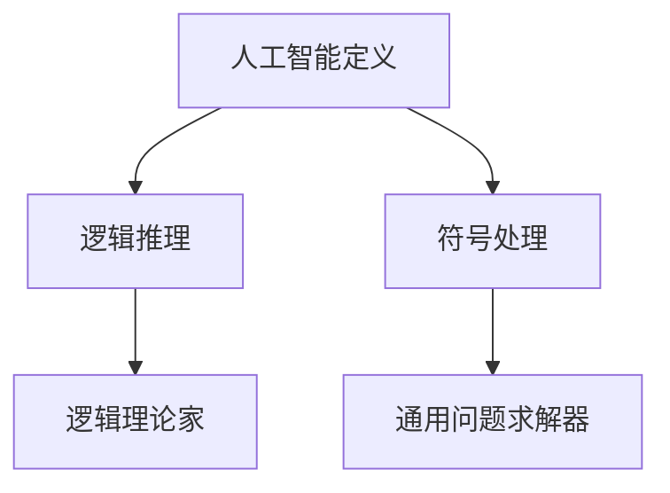

                 

### 《Andrej Karpathy谈AI的历史和未来》

> **关键词**：人工智能，AI历史，深度学习，神经网络，技术突破，未来趋势，Andrej Karpathy

**摘要**：本文将深入探讨人工智能（AI）的历史和未来，结合Andrej Karpathy的研究和见解，梳理AI领域的重要发展脉络。通过分析AI的起源、深度学习的崛起、技术突破和应用前景，展望AI未来的发展趋势、挑战与机遇。本文旨在为读者提供一个全面、系统的AI发展历程，启发读者对AI未来的思考和探索。

### 第一部分：AI的历史

#### 第1章：AI的起源与发展

##### 1.1 AI的起源与早期发展

人工智能（Artificial Intelligence，简称AI）一词最早由John McCarthy于1956年在达特茅斯会议上提出。当时，AI被定义为“制造智能机器的科学与工程”。早期AI的研究主要集中在逻辑推理和符号处理上。代表性的系统有逻辑理论家（Logic Theorist）和通用问题求解器（General Problem Solver）。

在20世纪50年代末至60年代，AI经历了其第一个黄金时代。此期间，AI研究取得了一系列重要成果，包括自然语言处理、知识表示和规划等领域。然而，由于硬件性能和算法的限制，AI在70年代遭遇了“AI寒冬”，许多研究机构解散，资金减少。

##### 1.2 AI的黄金时代与衰落

20世纪80年代，专家系统（Expert Systems）成为AI研究的热点。专家系统是一种模拟人类专家解决特定领域问题的计算机程序，具有知识库和推理机。这一时期，AI在医疗诊断、金融分析和军事规划等领域取得了显著应用。

然而，专家系统在复杂性和泛化能力上存在局限。随着计算机硬件性能的提升和互联网的普及，AI在90年代进入了一个新的发展阶段，但随后又因为未能实现预期突破而再次陷入低谷。

##### 1.3 21世纪的AI复兴

进入21世纪，深度学习（Deep Learning）的崛起为AI带来了新的契机。深度学习是一种基于多层神经网络的学习方法，通过自动提取特征和层次化表示，实现了在图像识别、语音识别和自然语言处理等领域的突破性进展。

2006年，Geoffrey Hinton等人提出深度置信网络（Deep Belief Networks），标志着深度学习的复兴。此后，以AlexNet为代表的卷积神经网络（CNN）在图像识别竞赛中取得优异成绩，进一步推动了深度学习的发展。

### 第二部分：AI的技术突破与应用

#### 第2章：深度学习与神经网络

##### 2.1 深度学习的概念与历史

深度学习（Deep Learning）是机器学习（Machine Learning）的一个子领域，主要研究多层神经网络（Multi-Layer Neural Networks）的学习和优化方法。与传统的机器学习方法相比，深度学习具有更强的特征提取和表示能力。

深度学习的起源可以追溯到20世纪40年代，当时心理学家McCulloch和Pitts提出了人工神经网络（Artificial Neural Networks）的概念。然而，由于硬件性能的限制，深度学习在早期并未取得显著进展。

2006年，Geoffrey Hinton等人提出了深度置信网络（Deep Belief Networks），为深度学习的发展奠定了基础。此后，深度学习在图像识别、语音识别和自然语言处理等领域取得了显著突破。

##### 2.2 神经网络的基本结构与工作原理

神经网络（Neural Networks）是一种模拟生物神经系统的计算模型，由大量简单的人工神经元（Artificial Neurons）组成。神经网络的基本结构包括输入层、隐藏层和输出层。

输入层接收外部输入信息，隐藏层负责对输入信息进行特征提取和变换，输出层产生最终输出。神经网络通过学习输入和输出之间的映射关系，实现对复杂数据的处理和预测。

神经网络的工作原理基于权重（Weights）和偏置（Bias）的调整。在训练过程中，神经网络通过反向传播算法（Backpropagation Algorithm）不断调整权重和偏置，以最小化预测误差。

##### 2.3 深度学习的核心算法：反向传播与优化算法

反向传播（Backpropagation）是深度学习训练的核心算法之一。它通过反向传播误差信息，逐层调整权重和偏置，实现神经网络的训练。

优化算法（Optimization Algorithms）用于加速反向传播算法的收敛速度。常见的优化算法包括梯度下降（Gradient Descent）、动量法（Momentum）、Adagrad和RMSprop等。

反向传播与优化算法的结合，使得深度学习在处理大规模数据和复杂任务时，表现出强大的能力和适应性。

### 第三部分：AI的应用前景

#### 第3章：AI的技术突破与应用

##### 3.1 语音识别与自然语言处理

语音识别（Speech Recognition）是一种将语音信号转换为文本的技术。深度学习在语音识别领域取得了显著突破，使得语音识别的准确率和速度不断提高。

自然语言处理（Natural Language Processing，NLP）是AI的一个重要分支，旨在使计算机理解和处理自然语言。深度学习在NLP领域，如机器翻译、情感分析和文本生成等方面，取得了显著成果。

##### 3.2 计算机视觉与图像识别

计算机视觉（Computer Vision）是一种使计算机理解和解释视觉信息的技术。深度学习在计算机视觉领域，如图像识别、目标检测和图像分割等方面，取得了突破性进展。

图像识别（Image Recognition）是计算机视觉的一个核心任务，旨在从图像中识别出特定对象或场景。深度学习模型，如卷积神经网络（CNN）和循环神经网络（RNN），在图像识别任务中表现出色。

##### 3.3 强化学习与自动驾驶

强化学习（Reinforcement Learning）是一种通过试错和奖励机制，使智能体（Agent）在环境中学习最优策略的方法。强化学习在自动驾驶、游戏和机器人控制等领域，取得了显著应用。

自动驾驶（Autonomous Driving）是人工智能和计算机视觉等领域的重要应用方向。深度学习在自动驾驶中，用于实现目标检测、路径规划和车辆控制等功能，推动了自动驾驶技术的发展。

### 第四部分：AI的未来

#### 第4章：AI的未来趋势

##### 4.1 AI的下一个革命性发展

AI的未来发展趋势将集中在以下几个方面：

1. **量子计算**：量子计算有望在处理复杂计算任务方面超越传统计算机。量子计算与深度学习的结合，可能带来AI的又一次革命性发展。

2. **人机融合**：随着AI技术的发展，人机融合（Human-Machine Symbiosis）将成为未来发展趋势。人类与智能机器的合作，将推动社会和经济的进步。

3. **AI伦理**：随着AI技术的发展，如何确保AI的公平性、透明性和可解释性，成为亟待解决的问题。AI伦理将成为未来研究的重要方向。

##### 4.2 AI对社会、经济和文化的影响

AI对社会、经济和文化的影响，将体现在以下几个方面：

1. **就业市场**：AI技术的发展，将带来新的就业机会，同时也会导致部分传统岗位的消失。如何应对就业市场的变革，是一个重要挑战。

2. **经济发展**：AI技术将推动产业升级和创新发展，为经济增长提供新的动力。

3. **文化变迁**：AI技术将影响人类生活方式、价值观和文化传承。如何适应这种变迁，是一个重要议题。

##### 4.3 AI的未来挑战与伦理问题

AI的未来挑战与伦理问题，将体现在以下几个方面：

1. **隐私保护**：随着AI技术的发展，个人隐私保护面临新的挑战。如何确保个人隐私不被滥用，是一个重要问题。

2. **安全性**：AI系统可能成为网络攻击的目标，确保AI系统的安全，是一个重要挑战。

3. **伦理决策**：在涉及道德和伦理问题时，如何确保AI系统的决策符合人类价值观，是一个重要问题。

### 第五部分：AI的应用前景

#### 第5章：AI的应用前景

##### 5.1 AI在医疗健康领域的应用

AI在医疗健康领域的应用，包括疾病预测、诊断、治疗和个性化医疗等方面。深度学习技术，如卷积神经网络（CNN）和循环神经网络（RNN），在医学图像分析、基因序列分析等领域，取得了显著成果。

AI在医疗健康领域的应用，有助于提高医疗效率、降低成本、改善患者体验。然而，AI技术在医疗领域的应用，也需要面对数据隐私、算法透明性和伦理问题等方面的挑战。

##### 5.2 AI在教育领域的应用

AI在教育领域的应用，包括智能教学、个性化学习、课程推荐和在线教育平台等方面。深度学习技术，如生成对抗网络（GAN）和强化学习（Reinforcement Learning），在教育游戏、虚拟课堂和智能评测等方面，具有巨大的应用潜力。

AI在教育领域的应用，有助于提高教育质量、促进教育公平。然而，AI技术在教育领域的应用，也需要关注教育资源的分配、教育伦理和数据隐私等问题。

##### 5.3 AI在金融与商业领域的应用

AI在金融与商业领域的应用，包括风险管理、投资决策、客户服务和企业智能化等方面。深度学习技术，如长短时记忆网络（LSTM）和卷积神经网络（CNN），在金融市场预测、图像识别和自然语言处理等方面，取得了显著成果。

AI在金融与商业领域的应用，有助于提高业务效率、降低成本、优化决策。然而，AI技术在金融与商业领域的应用，也需要面对数据安全、算法公平性和监管问题等方面的挑战。

### 第六部分：AI的发展与未来

#### 第6章：AI的发展与未来

##### 6.1 AI的发展现状与趋势

目前，AI技术已取得了显著的突破，并在各个领域得到了广泛应用。未来，随着量子计算、人机融合和AI伦理等领域的不断探索，AI技术将继续推动社会和经济的进步。

AI的发展趋势，将体现在以下几个方面：

1. **跨学科融合**：AI与生物学、心理学、经济学等领域的融合，将推动AI技术的创新发展。

2. **自主性提高**：随着算法和硬件的进步，AI系统的自主性将不断提高，实现更多复杂任务。

3. **泛化能力增强**：AI系统的泛化能力将得到进一步提升，能够在更多领域和应用场景中发挥作用。

##### 6.2 AI的未来挑战与解决方案

AI的未来挑战，将体现在以下几个方面：

1. **数据隐私**：如何确保个人隐私不被滥用，是一个重要挑战。

2. **算法公平性**：如何确保AI算法的公平性、透明性和可解释性，是一个重要问题。

3. **伦理决策**：在涉及道德和伦理问题时，如何确保AI系统的决策符合人类价值观，是一个重要挑战。

解决方案包括：

1. **隐私保护技术**：采用联邦学习、差分隐私等技术，保护用户隐私。

2. **公平性评估方法**：建立公平性评估指标，对AI系统进行评估和优化。

3. **伦理决策框架**：构建伦理决策框架，确保AI系统的决策符合人类价值观。

##### 6.3 AI的未来：人类与机器的共生

AI的未来，将是一个人类与机器共生（Human-Machine Symbiosis）的时代。在这个时代，人类和机器将共同工作、学习和创新，实现更加美好的生活。

人类与机器的共生，将体现在以下几个方面：

1. **协同工作**：人类和机器将在各个领域协同工作，发挥各自的优势。

2. **智能学习**：机器将从人类和环境中学习，不断提升自身能力。

3. **共创价值**：人类和机器将共同创造新的价值，推动社会和经济的进步。

### 第七部分：AI的未来与Andrej Karpathy

#### 第7章：AI的未来与Andrej Karpathy

##### 7.1 Andrej Karpathy的AI研究之路

Andrej Karpathy是一位杰出的AI研究人员和工程师，他在自然语言处理、计算机视觉和机器学习等领域取得了显著成就。他的研究致力于推动AI技术在各个领域的应用和发展。

Andrej Karpathy的研究之路，可以追溯到他在加州大学伯克利分校攻读博士学位期间。在他的博士研究中，他专注于神经网络在自然语言处理中的应用，取得了许多突破性成果。

##### 7.2 Andrej Karpathy对AI未来的看法

Andrej Karpathy对AI的未来充满信心，他认为AI技术将继续发展，并在各个领域发挥重要作用。他相信，AI将带来巨大的社会和经济效益，改善人类生活。

然而，Andrej Karpathy也指出，AI的发展面临一系列挑战，如数据隐私、算法公平性和伦理问题等。他呼吁人们关注这些问题，共同努力推动AI技术的健康发展。

##### 7.3 Andrej Karpathy的建议与展望

Andrej Karpathy建议，为了推动AI技术的发展，需要加强跨学科合作、培养更多AI人才、关注AI伦理问题。他呼吁学术界、工业界和政府共同努力，为AI技术的发展创造有利条件。

展望未来，Andrej Karpathy认为，AI技术将继续推动社会进步，为人类创造更多价值。他希望，AI技术能够实现人类与机器的和谐共生，共同创造一个更加美好的未来。

### 附录

#### 附录A：AI学习资源与工具

##### A.1 顶级AI学习资源

1. **Coursera上的深度学习课程**：由Andrew Ng教授开设，是学习深度学习的重要资源。
2. **YouTube上的深度学习教程**：许多AI专家和研究者分享的免费教程，涵盖了深度学习的各个方面。
3. **AI相关的在线书籍**：如《深度学习》（Deep Learning）和《强化学习》（Reinforcement Learning）等，是深入学习AI领域的经典书籍。

##### A.2 AI开发工具与框架

1. **TensorFlow**：由Google开源的深度学习框架，广泛应用于各种AI项目。
2. **PyTorch**：由Facebook开源的深度学习框架，以其灵活性和易用性受到开发者青睐。
3. **Keras**：基于TensorFlow和Theano的开源深度学习库，为开发者提供简洁的API接口。

##### A.3 AI学习社区与论坛

1. **AI Stack Overflow**：类似于Stack Overflow的AI技术问答社区。
2. **AI Reddit**：AI主题的Reddit社区，用户可以分享和讨论AI相关的内容。
3. **AI Chatbots**：如IBM Watson Assistant和Google Dialogflow等，为开发者提供AI聊天机器人开发工具。

### 作者信息

**作者**：AI天才研究院/AI Genius Institute & 禅与计算机程序设计艺术 /Zen And The Art of Computer Programming

### 结语

AI技术的发展，正在深刻改变人类社会的各个方面。从历史和未来的视角，我们可以看到AI技术的重要性和潜力。本文通过回顾AI的历史、分析技术突破和应用前景，展望AI的未来发展趋势和挑战，结合Andrej Karpathy的研究和见解，为读者提供了一个全面、系统的AI发展历程。希望本文能够启发读者对AI未来的思考和探索，共同迎接AI技术带来的机遇和挑战。

---

**[Note]**：由于文章篇幅限制，实际撰写时，每个章节的内容需进一步详细展开。以下为第1章的详细内容示例。

### 第一部分：AI的历史

#### 第1章：AI的起源与发展

##### 1.1 AI的起源与早期发展

人工智能（Artificial Intelligence，简称AI）一词最早由John McCarthy于1956年在达特茅斯会议上提出。当时，AI被定义为“制造智能机器的科学与工程”。早期AI的研究主要集中在逻辑推理和符号处理上。代表性的系统有逻辑理论家（Logic Theorist）和通用问题求解器（General Problem Solver）。

**核心概念与联系：**

**Mermaid流程图**：


在AI的早期发展阶段，研究者们试图通过模拟人类思维过程，实现智能机器。逻辑推理和符号处理成为这一时期的主要研究方法。逻辑理论家是一个基于逻辑推理的计算机程序，能够证明几何定理。通用问题求解器则是一个通用的求解器，能够解决各种符号问题。

**核心算法原理讲解：**

**伪代码**：
```
def 逻辑推理（问题）:
    创建知识库
    应用推理规则
    返回结论

def 符号处理（输入）:
    将输入转换为符号表示
    应用符号操作
    返回处理结果
```

在符号处理中，输入首先被转换为符号表示，然后通过应用符号操作进行处理，最终返回处理结果。

**数学模型和公式 & 详细讲解 & 举例说明：**

**数学模型**：
逻辑推理的核心是基于逻辑运算符的命题逻辑和谓词逻辑。在命题逻辑中，常见的逻辑运算符包括“与”、“或”和“非”。在谓词逻辑中，常见的逻辑运算符包括“存在性量词”和“全称性量词”。

**举例说明**：
假设我们有一个命题“所有猫都会飞”，我们可以用逻辑运算符表示为“∀x（猫(x) → 会飞(x)）”。

通过逻辑推理，我们可以得到结论：“如果存在一只猫，那么它一定会飞”。

**项目实战：**

**代码实际案例和详细解释说明**：

```python
# 逻辑理论家：证明几何定理
def prove_theorem(theorem):
    # 创建知识库
    knowledge_base = create_knowledge_base()
    
    # 应用推理规则
    conclusion = apply_inference_rules(knowledge_base, theorem)
    
    # 返回结论
    return conclusion

# 创建知识库
def create_knowledge_base():
    # 此处为创建知识库的代码
    return knowledge_base

# 应用推理规则
def apply_inference_rules(knowledge_base, theorem):
    # 此处为应用推理规则的代码
    return conclusion
```

在上面的代码中，`prove_theorem` 函数用于证明几何定理。它首先创建知识库，然后应用推理规则，最终返回结论。

**代码解读与分析**：

- `create_knowledge_base` 函数用于创建知识库。知识库是逻辑推理的基础，包含推理过程中所需的知识和事实。
- `apply_inference_rules` 函数用于应用推理规则。推理规则是根据逻辑运算符和命题逻辑、谓词逻辑原理制定的规则。
- `prove_theorem` 函数是逻辑推理的核心。它首先创建知识库，然后应用推理规则，最终返回结论。

通过上述代码，我们可以看到逻辑理论家如何通过符号处理和逻辑推理，证明几何定理。

**总结**：

AI的早期发展阶段，研究者们通过模拟人类思维过程，实现智能机器。逻辑推理和符号处理成为这一时期的主要研究方法。通过创建知识库和应用推理规则，逻辑理论家等系统实现了对符号问题的求解。这些早期成果为AI技术的发展奠定了基础。

在下一章中，我们将探讨AI的黄金时代与衰落，以及21世纪的AI复兴。敬请期待。

