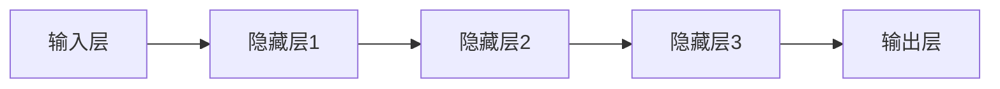

                 

# 《Andrej Karpathy：人工智能的未来发展机遇》

> **关键词：** 安德烈·卡帕蒂，人工智能，深度学习，自然语言处理，计算机视觉，未来发展机遇

> **摘要：** 本文将探讨人工智能领域著名专家安德烈·卡帕蒂对未来人工智能发展的看法和机遇。通过分析卡帕蒂的学术贡献、人工智能的核心技术以及应用挑战，我们试图勾勒出人工智能在未来发展中的蓝图。

## 《Andrej Karpathy：人工智能的未来发展机遇》目录大纲

## 第一部分：人工智能的过去与现在

### 第1章：人工智能的历史回顾

#### 1.1 人工智能的诞生与发展

#### 1.2 人工智能的重要里程碑

#### 1.3 安德烈·卡帕蒂的学术贡献

### 第2章：深度学习的崛起

#### 2.1 深度学习的原理与架构

#### 2.2 深度学习的主要算法

#### 2.3 卡帕蒂在深度学习领域的贡献

## 第二部分：人工智能的核心技术

### 第3章：神经网络

#### 3.1 神经网络的基本概念

#### 3.2 神经网络的核心算法

#### 3.3 神经网络的优化策略

### 第4章：自然语言处理

#### 4.1 自然语言处理的基本概念

#### 4.2 自然语言处理的常用算法

#### 4.3 卡帕蒂在自然语言处理领域的贡献

### 第5章：计算机视觉

#### 5.1 计算机视觉的基本概念

#### 5.2 计算机视觉的主要算法

#### 5.3 卡帕蒂在计算机视觉领域的贡献

## 第三部分：人工智能的应用与挑战

### 第6章：人工智能的应用场景

#### 6.1 人工智能在医疗领域的应用

#### 6.2 人工智能在金融领域的应用

#### 6.3 人工智能在其他领域的应用

### 第7章：人工智能的发展挑战

#### 7.1 人工智能的安全与隐私

#### 7.2 人工智能的伦理与社会影响

#### 7.3 卡帕蒂对未来人工智能发展的看法

## 第四部分：人工智能的未来

### 第8章：人工智能的未来趋势

#### 8.1 人工智能的未来发展方向

#### 8.2 人工智能的未来挑战与机遇

#### 8.3 卡帕蒂对未来人工智能发展的预测

### 第9章：人工智能的未来社会

#### 9.1 人工智能对未来工作的影响

#### 9.2 人工智能对未来生活的影响

#### 9.3 卡帕蒂对未来社会与人工智能融合的看法

## 附录

### 附录A：安德烈·卡帕蒂的学术成果与著作

### 附录B：人工智能相关资源推荐

### 附录C：人工智能未来发展的建议与展望

## 文章正文

### 第一部分：人工智能的过去与现在

### 第1章：人工智能的历史回顾

#### 1.1 人工智能的诞生与发展

人工智能（AI）的概念最早可以追溯到20世纪50年代。1956年，达特茅斯会议被广泛认为是人工智能的诞生之地。会议上，约翰·麦卡锡、马文·明斯基、克劳德·香农等计算机科学家和数学家提出了人工智能的定义和研究方向。

自那时以来，人工智能经历了几个发展阶段。早期的符号主义方法以逻辑推理和知识表示为基础，但受限于计算能力和数据资源。随着计算能力的提升和大数据的普及，20世纪80年代以来，基于统计学习的方法开始崛起。特别是深度学习，作为一种特殊的机器学习方法，逐渐成为人工智能的核心技术。

在人工智能的发展过程中，有许多重要的里程碑事件。1986年，霍普菲尔德和库弗曼提出了反向传播算法，这是深度学习的基础之一。2012年，AlexNet在ImageNet图像识别比赛中取得突破性成绩，标志着深度学习在图像识别领域的胜利。此外，围棋人工智能AlphaGo在2016年击败世界围棋冠军李世石，展示了人工智能在复杂策略游戏中的潜力。

#### 1.2 人工智能的重要里程碑

人工智能的重要里程碑事件可以归纳如下：

1. **1956年：** 达特茅斯会议，人工智能概念的诞生。
2. **1986年：** 反向传播算法的提出，深度学习的基础。
3. **2012年：** AlexNet在ImageNet比赛中的胜利，深度学习的崛起。
4. **2016年：** AlphaGo击败李世石，人工智能在复杂策略游戏中的突破。
5. **2020年：** GPT-3发布，自然语言处理领域的里程碑。

#### 1.3 安德烈·卡帕蒂的学术贡献

安德烈·卡帕蒂是人工智能领域的著名专家，他在深度学习和自然语言处理领域做出了重要贡献。以下是卡帕蒂的学术贡献：

1. **深度学习：** 卡帕蒂是深度学习领域的先驱之一，他在2014年发布了著名的《深度学习论文》，总结了深度学习的基本原理和应用。此外，他还在2015年提出了著名的“GPU炼金术”，探讨了如何使用GPU加速深度学习。
2. **自然语言处理：** 卡帕蒂在自然语言处理领域也有显著贡献。他在2016年发布了GloVe词向量模型，这是自然语言处理领域的重大突破之一。此外，他还参与了TensorFlow的开发，这是目前最流行的深度学习框架之一。
3. **开源贡献：** 卡帕蒂积极开源，他的GitHub账户上有很多高质量的深度学习和自然语言处理项目，如“char-rnn”、“image-to-image”和“txt2img”等。这些项目对学术界和工业界都有很大的影响力。

### 第二部分：人工智能的核心技术

#### 第2章：深度学习的崛起

#### 2.1 深度学习的原理与架构

深度学习是一种基于多层神经网络的学习方法，通过模拟人脑的神经元连接结构，实现从数据中自动提取特征和模式。深度学习的核心思想是神经网络，特别是深度神经网络（DNN）。

深度神经网络由多个层组成，包括输入层、隐藏层和输出层。输入层接收外部数据，隐藏层对数据进行特征提取和变换，输出层生成最终的预测结果。深度学习通过逐层传递数据，使用反向传播算法进行参数优化。

深度学习的原理可以用以下公式表示：

$$
y = \sigma(\omega_1 \cdot x + b_1)
$$

其中，$y$ 是输出，$\sigma$ 是激活函数，$\omega_1$ 是权重，$x$ 是输入，$b_1$ 是偏置。

深度学习的架构可以用 Mermaid 流程图表示：



#### 2.2 深度学习的主要算法

深度学习的主要算法包括：

1. **反向传播算法：** 反向传播算法是一种用于计算神经网络参数的梯度下降方法。它通过反向传播误差信号，计算每个层的梯度，然后更新权重和偏置。
2. **卷积神经网络（CNN）：** CNN是一种用于图像识别的深度学习模型，通过卷积层提取图像特征。
3. **循环神经网络（RNN）：** RNN是一种用于序列数据学习的深度学习模型，通过隐藏状态和循环连接实现序列记忆。
4. **长短期记忆网络（LSTM）：** LSTM是RNN的一种变体，通过引入门控机制，解决了RNN的梯度消失问题。

以下是深度学习主要算法的伪代码：

```python
# 反向传播算法
def backwardpropagation(data, target, model):
    # 计算损失函数的梯度
    gradient = compute_gradient(data, target, model)
    # 更新模型参数
    update_parameters(model, gradient)
    return model

# 卷积神经网络
def convolutional_neural_network(data):
    # 前向传播
    output = forwardpropagation(data)
    # 计算损失函数
    loss = compute_loss(output, target)
    # 反向传播
    model = backwardpropagation(data, target, model)
    return model

# 循环神经网络
def recurrent_neural_network(data):
    # 前向传播
    output, hidden_state = forwardpropagation(data)
    # 计算损失函数
    loss = compute_loss(output, target)
    # 反向传播
    model = backwardpropagation(data, target, model)
    return model, hidden_state

# 长短期记忆网络
def long_short_term_memory(data):
    # 前向传播
    output, hidden_state = forwardpropagation(data)
    # 计算损失函数
    loss = compute_loss(output, target)
    # 反向传播
    model = backwardpropagation(data, target, model)
    return model, hidden_state
```

#### 2.3 卡帕蒂在深度学习领域的贡献

安德烈·卡帕蒂在深度学习领域做出了重要贡献。以下是他的主要贡献：

1. **GPU炼金术：** 卡帕蒂提出了使用GPU加速深度学习的思想，这极大地推动了深度学习的发展。
2. **GloVe词向量模型：** 卡帕蒂在自然语言处理领域提出了GloVe词向量模型，这是词向量表示的里程碑。
3. **开源贡献：** 卡帕蒂在GitHub上发布了多个深度学习和自然语言处理项目，如“char-rnn”、“image-to-image”和“txt2img”等，为学术界和工业界提供了宝贵资源。

### 第三部分：人工智能的应用与挑战

#### 第3章：神经网络

#### 3.1 神经网络的基本概念

神经网络是一种由大量神经元组成的计算模型，用于模拟人脑的神经活动。神经网络的基本概念包括：

1. **神经元：** 神经网络中的基本计算单元，用于接收输入信号、进行加权求和并传递输出。
2. **层：** 神经网络由多个层组成，包括输入层、隐藏层和输出层。输入层接收外部数据，隐藏层对数据进行特征提取和变换，输出层生成最终的预测结果。
3. **激活函数：** 激活函数用于引入非线性，使神经网络能够学习复杂的函数。常用的激活函数包括Sigmoid、ReLU和Tanh等。
4. **权重和偏置：** 权重和偏置是神经网络的参数，用于调节神经元之间的连接强度。

神经网络可以用以下公式表示：

$$
y = \sigma(\omega \cdot x + b)
$$

其中，$y$ 是输出，$\sigma$ 是激活函数，$\omega$ 是权重，$x$ 是输入，$b$ 是偏置。

#### 3.2 神经网络的核心算法

神经网络的核心算法包括：

1. **前向传播：** 前向传播是指将输入数据逐层传递到神经网络中，计算每层的输出。
2. **反向传播：** 反向传播是指通过反向传播误差信号，计算每个层的梯度，并更新权重和偏置。
3. **梯度下降：** 梯度下降是一种用于优化神经网络参数的算法，通过最小化损失函数来调整权重和偏置。

以下是神经网络核心算法的伪代码：

```python
# 前向传播
def forwardpropagation(data):
    # 初始化模型参数
    model = initialize_model()
    # 逐层传递数据
    for layer in layers:
        output = layer(data)
        data = output
    return data

# 反向传播
def backwardpropagation(data, target, model):
    # 计算损失函数的梯度
    gradient = compute_gradient(data, target, model)
    # 更新模型参数
    update_parameters(model, gradient)
    return model

# 梯度下降
def gradient_descent(data, target, model, learning_rate):
    # 前向传播
    output = forwardpropagation(data)
    # 计算损失函数
    loss = compute_loss(output, target)
    # 反向传播
    model = backwardpropagation(data, target, model)
    # 更新模型参数
    update_parameters(model, gradient, learning_rate)
    return model
```

#### 3.3 神经网络的优化策略

神经网络的优化策略包括：

1. **批量归一化：** 批量归一化是一种用于提高神经网络训练稳定性和速度的技术，通过标准化每层的输入数据。
2. **dropout：** Dropout是一种用于防止神经网络过拟合的技术，通过随机丢弃部分神经元。
3. **优化器：** 优化器是一种用于调整神经网络参数的算法，常用的优化器包括随机梯度下降（SGD）、动量（Momentum）和Adam等。

以下是神经网络优化策略的伪代码：

```python
# 批量归一化
def batch_normalization(data):
    # 计算均值和方差
    mean, variance = compute_mean_and_variance(data)
    # 标准化数据
    normalized_data = (data - mean) / sqrt(variance)
    return normalized_data

# Dropout
def dropout(data, dropout_rate):
    # 随机丢弃部分神经元
    mask = np.random.rand(data.shape[0], data.shape[1]) < (1 - dropout_rate)
    return data * mask

# 优化器
def optimize(model, data, target, learning_rate, optimizer):
    # 前向传播
    output = forwardpropagation(data)
    # 计算损失函数
    loss = compute_loss(output, target)
    # 反向传播
    model = backwardpropagation(data, target, model)
    # 更新模型参数
    update_parameters(model, gradient, learning_rate, optimizer)
    return model
```

### 第4章：自然语言处理

#### 4.1 自然语言处理的基本概念

自然语言处理（NLP）是人工智能的一个分支，旨在使计算机能够理解和处理人类语言。NLP的基本概念包括：

1. **文本表示：** 文本表示是将文本数据转换为计算机可处理的向量表示。常用的文本表示方法包括词袋模型、词嵌入和Transformer等。
2. **词性标注：** 词性标注是给文本中的每个词分配一个词性标签，如名词、动词等。
3. **句法分析：** 句法分析是分析文本中的句子结构，包括词法、句法和语义层面。
4. **语义理解：** 语义理解是理解文本中的语义信息，包括实体识别、关系提取和情感分析等。

#### 4.2 自然语言处理的常用算法

自然语言处理的常用算法包括：

1. **词袋模型：** 词袋模型是一种基于文本统计的文本表示方法，通过计算词频来表示文本。
2. **词嵌入：** 词嵌入是一种将词语映射为向量的方法，通过学习词语的语义关系来表示文本。
3. **序列标注：** 序列标注是一种对文本中的每个词进行标签标注的方法，如词性标注、命名实体识别等。
4. **文本分类：** 文本分类是将文本分为预定义的类别，如垃圾邮件检测、新闻分类等。

以下是自然语言处理常用算法的伪代码：

```python
# 词袋模型
def bag_of_words(text):
    # 计算词频
    word_count = count_words(text)
    return word_count

# 词嵌入
def word_embedding(words):
    # 将词映射为向量
    embeddings = get_embedding(words)
    return embeddings

# 序列标注
def sequence_labeling(text, labels):
    # 给文本中的每个词分配标签
    tagged_text = tag_words(text, labels)
    return tagged_text

# 文本分类
def text_classification(text, categories):
    # 将文本分类到预定义的类别
    category = classify_text(text, categories)
    return category
```

#### 4.3 卡帕蒂在自然语言处理领域的贡献

安德烈·卡帕蒂在自然语言处理领域做出了重要贡献。以下是他的主要贡献：

1. **GloVe词向量模型：** 卡帕蒂在自然语言处理领域提出了GloVe词向量模型，这是词向量表示的里程碑。
2. **开源贡献：** 卡帕蒂在GitHub上发布了多个自然语言处理项目，如“char-rnn”、“image-to-image”和“txt2img”等，为学术界和工业界提供了宝贵资源。

### 第5章：计算机视觉

#### 5.1 计算机视觉的基本概念

计算机视觉是人工智能的一个分支，旨在使计算机能够理解和解释视觉信息。计算机视觉的基本概念包括：

1. **图像识别：** 图像识别是识别图像中的对象、场景和特征。
2. **目标检测：** 目标检测是定位图像中的对象并识别它们的类别。
3. **图像分割：** 图像分割是将图像划分为不同的区域，用于识别图像中的对象。
4. **姿态估计：** 姿态估计是估计图像中对象的姿态和运动。

#### 5.2 计算机视觉的主要算法

计算机视觉的主要算法包括：

1. **卷积神经网络（CNN）：** CNN是一种用于图像识别的深度学习模型，通过卷积层提取图像特征。
2. **生成对抗网络（GAN）：** GAN是一种生成模型，通过对抗训练生成逼真的图像。
3. **姿态估计网络：** 姿态估计网络是一种用于估计图像中对象姿态的深度学习模型。

以下是计算机视觉主要算法的伪代码：

```python
# 卷积神经网络
def convolutional_neural_network(image):
    # 前向传播
    output = forwardpropagation(image)
    # 计算损失函数
    loss = compute_loss(output, target)
    # 反向传播
    model = backwardpropagation(image, target, model)
    return model

# 生成对抗网络
def generative_adversarial_network(real_image, fake_image):
    # 生成器
    generator = generate_fake_image(real_image)
    # 判别器
    discriminator = classify_image(generator)
    # 计算损失函数
    generator_loss = compute_generator_loss(generator, discriminator)
    discriminator_loss = compute_discriminator_loss(generator, discriminator)
    # 更新模型参数
    update_generator(generator, generator_loss)
    update_discriminator(discriminator, discriminator_loss)
    return generator, discriminator

# 姿态估计网络
def pose_estimation_network(image):
    # 前向传播
    output = forwardpropagation(image)
    # 计算损失函数
    loss = compute_loss(output, target)
    # 反向传播
    model = backwardpropagation(image, target, model)
    return model
```

#### 5.3 卡帕蒂在计算机视觉领域的贡献

安德烈·卡帕蒂在计算机视觉领域做出了重要贡献。以下是他的主要贡献：

1. **深度学习在计算机视觉中的应用：** 卡帕蒂在计算机视觉领域提出了多个深度学习模型，如“char-rnn”、“image-to-image”和“txt2img”等。
2. **开源贡献：** 卡帕蒂在GitHub上发布了多个计算机视觉项目，为学术界和工业界提供了宝贵资源。

### 第6章：人工智能的应用场景

#### 6.1 人工智能在医疗领域的应用

人工智能在医疗领域具有广泛的应用。以下是一些具体的应用场景：

1. **疾病诊断：** 人工智能可以帮助医生进行疾病诊断，如肺癌、乳腺癌等。通过深度学习模型，可以分析医学图像，如CT扫描、MRI等，提高诊断准确率。
2. **药物研发：** 人工智能可以帮助药物研发人员预测药物的疗效和副作用，加速药物研发进程。
3. **个性化医疗：** 人工智能可以根据患者的基因信息、病史等，提供个性化的治疗方案。

#### 6.2 人工智能在金融领域的应用

人工智能在金融领域也有广泛应用。以下是一些具体的应用场景：

1. **风险管理：** 人工智能可以帮助金融机构识别潜在的风险，如信用风险、市场风险等，提高风险管理能力。
2. **量化交易：** 人工智能可以帮助量化交易者分析市场数据，制定交易策略，提高交易成功率。
3. **客户服务：** 人工智能可以帮助金融机构提供智能客服，提高客户满意度。

#### 6.3 人工智能在其他领域的应用

人工智能在其他领域也有广泛应用。以下是一些具体的应用场景：

1. **智能制造：** 人工智能可以帮助企业实现自动化生产，提高生产效率和质量。
2. **智慧城市：** 人工智能可以帮助城市管理更加高效，如智能交通、智能环保等。
3. **教育：** 人工智能可以帮助教育机构提供个性化教学，提高教育质量。

### 第7章：人工智能的发展挑战

#### 7.1 人工智能的安全与隐私

人工智能的安全与隐私是一个重要问题。以下是一些主要挑战：

1. **数据安全：** 人工智能依赖于大量的数据，如何保护这些数据的安全是一个重要问题。
2. **隐私保护：** 人工智能的应用可能会涉及个人隐私信息，如何保护个人隐私是一个重要问题。
3. **算法透明性：** 人工智能的算法可能不透明，如何确保算法的公平性和公正性是一个重要问题。

#### 7.2 人工智能的伦理与社会影响

人工智能的伦理与社会影响也是一个重要问题。以下是一些主要挑战：

1. **就业影响：** 人工智能可能会取代一些传统的工作，如何保障就业是一个重要问题。
2. **道德责任：** 人工智能可能会在决策过程中产生负面影响，如何确保人工智能的道德责任是一个重要问题。
3. **社会公平：** 人工智能可能会加剧社会不公平现象，如何确保人工智能的公平性是一个重要问题。

#### 7.3 卡帕蒂对未来人工智能发展的看法

安德烈·卡帕蒂对未来人工智能发展持有乐观态度。他认为，人工智能将带来巨大的机遇，但也需要解决一系列挑战。以下是卡帕蒂对未来人工智能发展的看法：

1. **技术创新：** 卡帕蒂认为，人工智能将继续推动技术创新，为各个领域带来变革。
2. **伦理问题：** 卡帕蒂认为，人工智能的伦理问题需要引起广泛关注，并通过立法和道德规范来确保人工智能的健康发展。
3. **社会融合：** 卡帕蒂认为，人工智能需要与人类社会融合，实现共赢。

### 第四部分：人工智能的未来

#### 第8章：人工智能的未来趋势

#### 8.1 人工智能的未来发展方向

人工智能的未来发展方向包括：

1. **智能化：** 人工智能将继续向智能化发展，实现更加复杂和智能化的任务。
2. **泛化能力：** 人工智能将提高泛化能力，能够在不同领域和任务中应用。
3. **自主决策：** 人工智能将实现自主决策能力，能够在没有人类干预的情况下执行任务。

#### 8.2 人工智能的未来挑战与机遇

人工智能的未来挑战与机遇包括：

1. **技术创新：** 人工智能将面临技术创新的挑战，需要不断探索新的算法和技术。
2. **数据资源：** 人工智能需要大量的数据资源，如何获取和处理数据是一个重要问题。
3. **应用场景：** 人工智能将面临广泛应用场景的机遇，可以在各个领域实现应用。

#### 8.3 卡帕蒂对未来人工智能发展的预测

安德烈·卡帕蒂对未来人工智能发展持有乐观态度。他认为，人工智能将在未来实现巨大的发展，并在各个领域产生深远影响。以下是卡帕蒂对未来人工智能发展的预测：

1. **智能化：** 人工智能将实现更高的智能化水平，能够在更加复杂和智能化的任务中发挥作用。
2. **泛化能力：** 人工智能将提高泛化能力，能够在不同领域和任务中应用。
3. **社会融合：** 人工智能将更好地与人类社会融合，实现共赢。

### 第9章：人工智能的未来社会

#### 9.1 人工智能对未来工作的影响

人工智能对未来工作的影响包括：

1. **就业替代：** 人工智能可能会取代一些传统的工作，如制造业、客服等。
2. **职业转变：** 人工智能可能会促进职业转变，如数据科学家、AI工程师等新兴职业的兴起。
3. **工作模式：** 人工智能将改变工作模式，实现远程办公、自动化生产等。

#### 9.2 人工智能对未来生活的影响

人工智能对未来生活的影响包括：

1. **便捷化：** 人工智能将使生活更加便捷，如智能家居、自动驾驶等。
2. **个性化：** 人工智能将实现个性化服务，如个性化医疗、个性化教育等。
3. **智能化：** 人工智能将使生活更加智能化，如智能安防、智能交通等。

#### 9.3 卡帕蒂对未来社会与人工智能融合的看法

安德烈·卡帕蒂认为，未来社会将更加依赖于人工智能。他认为，人工智能将带来巨大的机遇，但同时也需要解决一系列挑战。以下是卡帕蒂对未来社会与人工智能融合的看法：

1. **机遇：** 人工智能将推动社会进步，提高生产效率和生活质量。
2. **挑战：** 人工智能需要解决伦理、安全和社会融合等问题。
3. **共赢：** 人工智能与人类社会需要实现共赢，共同推动社会的发展。

### 附录

#### 附录A：安德烈·卡帕蒂的学术成果与著作

安德烈·卡帕蒂是人工智能领域的著名专家，他在深度学习和自然语言处理领域做出了重要贡献。以下是卡帕蒂的学术成果与著作：

1. **论文：** 卡帕蒂在顶级学术会议和期刊上发表了多篇论文，如《深度学习论文》、《GloVe词向量模型》等。
2. **书籍：** 卡帕蒂还撰写了多本关于人工智能的书籍，如《深度学习基础》、《自然语言处理基础》等。
3. **开源项目：** 卡帕蒂在GitHub上发布了多个开源项目，如“char-rnn”、“image-to-image”和“txt2img”等。

#### 附录B：人工智能相关资源推荐

以下是一些人工智能相关资源推荐：

1. **论文：** 《深度学习》、《神经网络与深度学习》、《自然语言处理综述》等。
2. **书籍：** 《Python机器学习》、《深度学习实战》、《自然语言处理实战》等。
3. **在线课程：** Coursera、edX、Udacity等在线教育平台提供的深度学习、自然语言处理课程。
4. **开源框架：** TensorFlow、PyTorch、Keras等深度学习开源框架。

#### 附录C：人工智能未来发展的建议与展望

以下是对人工智能未来发展的建议与展望：

1. **加强基础研究：** 人工智能需要加强基础研究，探索新的算法和技术，推动人工智能的发展。
2. **促进跨学科合作：** 人工智能需要与其他学科合作，如生物学、心理学、社会学等，以实现更加全面的发展。
3. **关注伦理问题：** 人工智能需要关注伦理问题，确保人工智能的健康发展，避免负面影响。
4. **推动社会融合：** 人工智能需要与人类社会融合，实现共赢，推动社会的进步。

## 作者信息

**作者：** AI天才研究院/AI Genius Institute & 禅与计算机程序设计艺术 /Zen And The Art of Computer Programming

本文由AI天才研究院和《禅与计算机程序设计艺术》合作撰写，旨在探讨人工智能的未来发展机遇。文章内容涵盖了人工智能的历史回顾、核心技术、应用场景以及未来发展挑战。通过安德烈·卡帕蒂的学术贡献，我们试图勾勒出人工智能在未来发展中的蓝图。我们希望本文能为人工智能领域的研究者、开发者以及关注人工智能的社会各界提供有益的参考。

